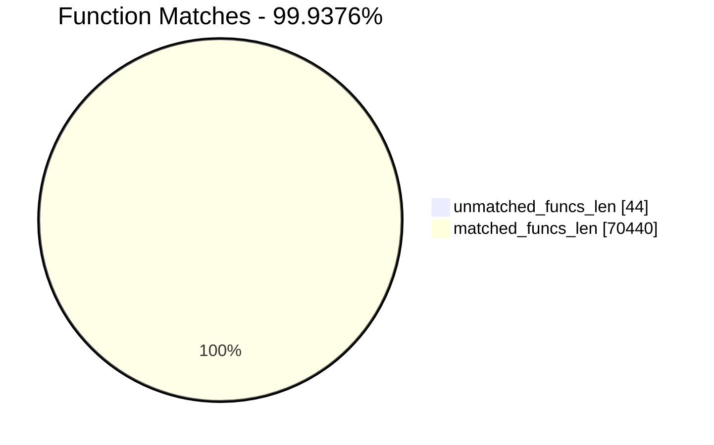
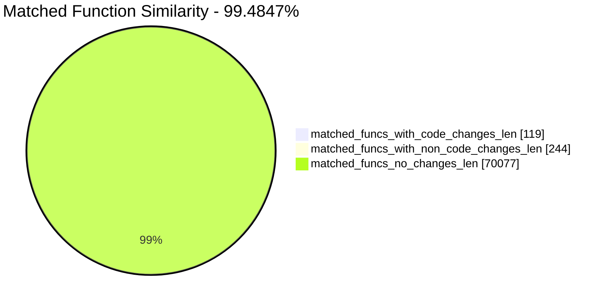
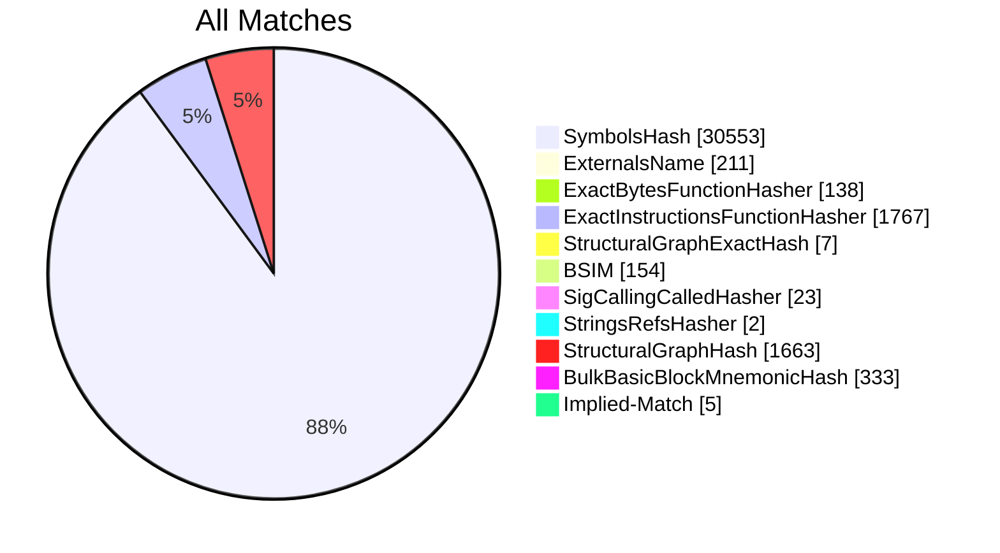
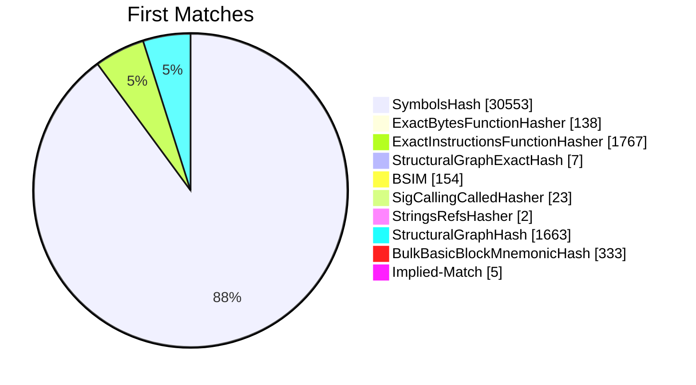
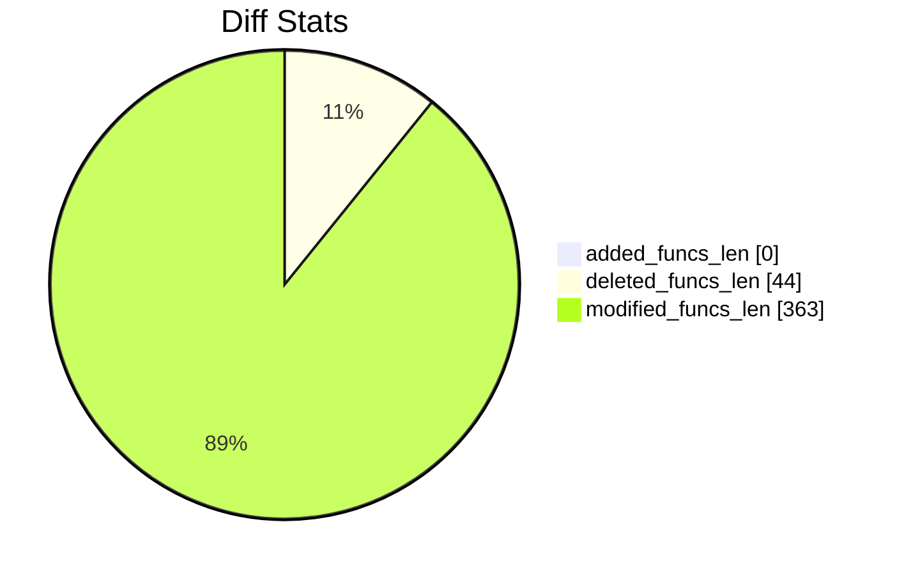
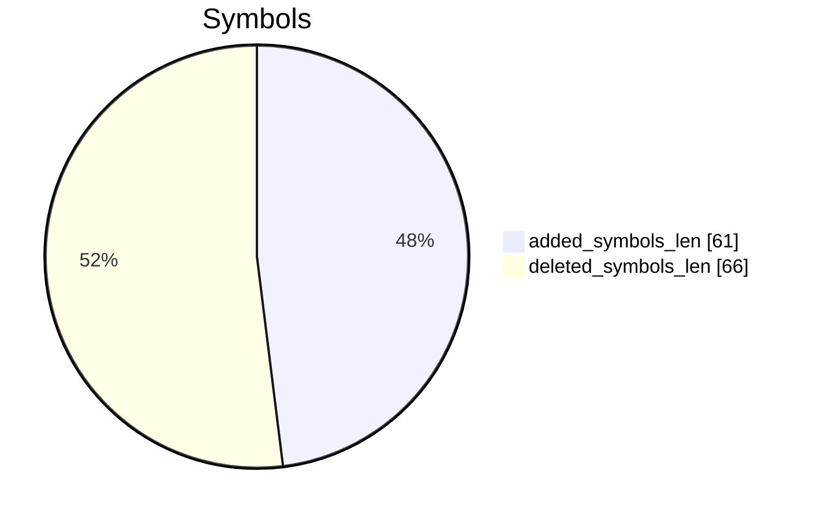
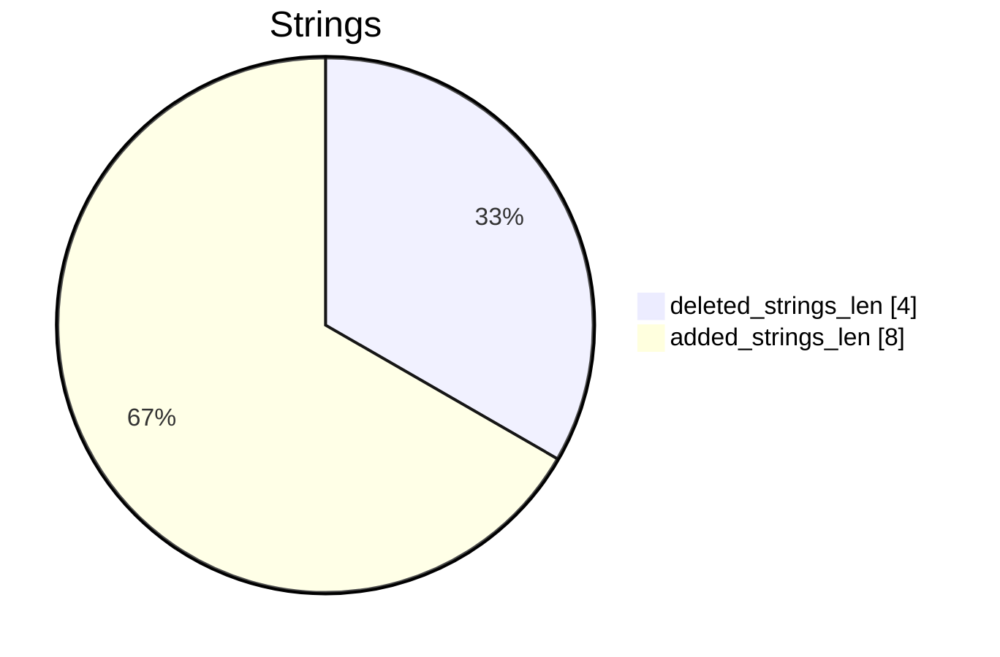

# ntoskrnl.exe-ntoskrnl.exe Diff

# TOC

* [Visual Chart Diff](#visual-chart-diff)
* [Metadata](#metadata)
	* [Ghidra Diff Engine](#ghidra-diff-engine)
		* [Command Line](#command-line)
	* [Binary Metadata Diff](#binary-metadata-diff)
	* [Program Options](#program-options)
	* [Diff Stats](#diff-stats)
	* [Strings](#strings)
* [Deleted](#deleted)
	* [IopInitializeIoRate](#iopinitializeiorate)
	* [SshSessionManagerTraceAcDcStateChangeV1](#sshsessionmanagertraceacdcstatechangev1)
	* [SshSessionManagerTraceBatteryCountChangeV1](#sshsessionmanagertracebatterycountchangev1)
	* [SshSessionManagerTraceCsEnterReasonV1](#sshsessionmanagertracecsenterreasonv1)
	* [SshSessionManagerTraceCsExitReasonV1](#sshsessionmanagertracecsexitreasonv1)
	* [SshSessionManagerTraceSystemStopV1](#sshsessionmanagertracesystemstopv1)
	* [FUN_1409c37a4](#fun_1409c37a4)
	* [FUN_1409c3a2f](#fun_1409c3a2f)
	* [FUN_140b17aa0](#fun_140b17aa0)
	* [FUN_140b17d9d](#fun_140b17d9d)
	* [FUN_140b17fd1](#fun_140b17fd1)
	* [FUN_140b18a9c](#fun_140b18a9c)
	* [FUN_140b18ed6](#fun_140b18ed6)
	* [FUN_140b2191a](#fun_140b2191a)
	* [FUN_140b219d3](#fun_140b219d3)
	* [FUN_140b219e7](#fun_140b219e7)
	* [FUN_140b21a50](#fun_140b21a50)
	* [FUN_140b21bb6](#fun_140b21bb6)
	* [FUN_140b21f4f](#fun_140b21f4f)
	* [FUN_140b2216f](#fun_140b2216f)
	* [FUN_140b225eb](#fun_140b225eb)
	* [FUN_140b2260a](#fun_140b2260a)
	* [FUN_140b37944](#fun_140b37944)
	* [AstInitialize](#astinitialize)
	* [PnpMarkHalDeviceNode](#pnpmarkhaldevicenode)
	* [MmRegisterEtwProvider](#mmregisteretwprovider)
	* [wil_details_FeatureReporting_ReportVariantUsageToService](#wil_details_featurereporting_reportvariantusagetoservice)
	* [MiLockActivePageTableInList](#milockactivepagetableinlist)
	* [IommuRegisterInterfaceStateChangeCallbackLegacy](#iommuregisterinterfacestatechangecallbacklegacy)
	* [IommuUnregisterInterfaceStateChangeCallbackLegacy](#iommuunregisterinterfacestatechangecallbacklegacy)
	* [PopAdaptiveStandbyPolicyTimerCallback](#popadaptivestandbypolicytimercallback)
	* [wil_details_FeatureStateCache_ReevaluateCachedVariantState](#wil_details_featurestatecache_reevaluatecachedvariantstate)
	* [wil_details_GetCurrentVariantState](#wil_details_getcurrentvariantstate)
	* [FUN_1406e0e78](#fun_1406e0e78)
	* [PopTraceInputSuppressionActionUpdateV1](#poptraceinputsuppressionactionupdatev1)
	* [PopPowerAggregatorAllowModernStandbyPromotion](#poppoweraggregatorallowmodernstandbypromotion)
	* [PopBroadcastInputSuppressionCallback2](#popbroadcastinputsuppressioncallback2)
	* [PopSessionConnectedV2](#popsessionconnectedv2)
	* [PopSessionConnectionChangeV2](#popsessionconnectionchangev2)
	* [PopAdaptiveStandbyCalculateBatteryRegion](#popadaptivestandbycalculatebatteryregion)
	* [PopAdaptiveStandbyCheckRefreshableBudgetActionPreconditions](#popadaptivestandbycheckrefreshablebudgetactionpreconditions)
	* [PopAdaptiveStandbyPolicyTimerWorker](#popadaptivestandbypolicytimerworker)
	* [PopAdaptiveStandbySetPolicyTimer](#popadaptivestandbysetpolicytimer)
	* [PpmPerfQueryProcMeasurementValues](#ppmperfqueryprocmeasurementvalues)
* [Added](#added)
* [Modified](#modified)
	* [SshSessionManagerTraceCsExitReason](#sshsessionmanagertracecsexitreason)
	* [IommuDeviceDelete](#iommudevicedelete)
	* [PopDiagTraceBatteryCountChange](#popdiagtracebatterycountchange)
	* [IopfCompleteRequest](#iopfcompleterequest)
	* [PopDiagTraceFxComponentIdleState](#popdiagtracefxcomponentidlestate)
	* [EtwpCalculateUpdateNotification](#etwpcalculateupdatenotification)
	* [KiSearchForNewThreadsInStandby](#kisearchfornewthreadsinstandby)
	* [IopProcessUpdateTransferCount](#iopprocessupdatetransfercount)
	* [IommuUnregisterInterfaceStateChangeCallback](#iommuunregisterinterfacestatechangecallback)
	* [PopSessionConnectionChange](#popsessionconnectionchange)
	* [SeSubProcessToken](#sesubprocesstoken)
	* [PopDiagTracePreSleepNotification](#popdiagtracepresleepnotification)
	* [MiAsyncSlabReplenish](#miasyncslabreplenish)
	* [HalpConstructScatterGatherListDmarThin](#halpconstructscattergatherlistdmarthin)
	* [EtwpGetTraceGroupInfo](#etwpgettracegroupinfo)
	* [PnpProcessDependencyRelations](#pnpprocessdependencyrelations)
	* [PopDelayedPdcRegistrationWorker](#popdelayedpdcregistrationworker)
	* [SshSessionManagerTraceBatteryCountChange](#sshsessionmanagertracebatterycountchange)
	* [EtwTelemetryCoverageReport](#etwtelemetrycoveragereport)
	* [PopAdaptiveStandbyInitialize](#popadaptivestandbyinitialize)
	* [PopBatteryWorker](#popbatteryworker)
	* [PipRestoreDevNodeState](#piprestoredevnodestate)
	* [EtwWriteKMSecurityEvent](#etwwritekmsecurityevent)
	* [HalpGetIommuInterfaceEx](#halpgetiommuinterfaceex)
	* [KiInitializeVelocity](#kiinitializevelocity)
	* [PopRecalculateCBTriggerLevels](#poprecalculatecbtriggerlevels)
	* [PopDiagTraceFxComponentLatency](#popdiagtracefxcomponentlatency)
	* [PopNetInitialize](#popnetinitialize)
	* [IopAllocateAndPopulateWriteIrp](#iopallocateandpopulatewriteirp)
	* [EtwpEnableGuid](#etwpenableguid)
	* [PopInitializeIRTimer](#popinitializeirtimer)
	* [IopUnloadDriver](#iopunloaddriver)
	* [PopAdaptiveStandbyTraceSessionSettings](#popadaptivestandbytracesessionsettings)
	* [SshSessionManagerTracePreSleepNotification](#sshsessionmanagertracepresleepnotification)
	* [SshSessionManagerTraceCsEnterReason](#sshsessionmanagertracecsenterreason)
	* [EtwpGetSchematizedFilterSize](#etwpgetschematizedfiltersize)
	* [_PnpValidatePropertyData](#_pnpvalidatepropertydata)
	* [KiDispatchException](#kidispatchexception)
	* [PopSessionWinlogonNotification](#popsessionwinlogonnotification)
	* [CmInitBootFeatureConfigurations](#cminitbootfeatureconfigurations)
	* [PopPowerAggregatorTriggerAdaptiveAction](#poppoweraggregatortriggeradaptiveaction)
	* [EtwpTrackProviderRegistration](#etwptrackproviderregistration)
	* [PopSessionConnected](#popsessionconnected)
	* [IommuRegisterInterfaceStateChangeCallback](#iommuregisterinterfacestatechangecallback)
	* [IopProcessWorkItem](#iopprocessworkitem)
	* [HalpIommuCreateDevice](#halpiommucreatedevice)
	* [PopPowerAggregatorAllowModernStandbyPromotion](#poppoweraggregatorallowmodernstandbypromotion)
	* [PspThreadDelete](#pspthreaddelete)
	* [IopLoadDriverImage](#ioploaddriverimage)
	* [SshSessionManagerTraceAcDcStateChange](#sshsessionmanagertraceacdcstatechange)
	* [PopSleepstudyStartNextSession](#popsleepstudystartnextsession)
	* [EtwpDiskProvTraceDisk](#etwpdiskprovtracedisk)
	* [PipAreDriversLoaded](#piparedriversloaded)
	* [PopDiagTraceGracefulShutdown](#popdiagtracegracefulshutdown)
	* [PopInitializeAdpm](#popinitializeadpm)
	* [PopAdaptiveStandbySessionStart](#popadaptivestandbysessionstart)
	* [PiControlGetUserFlagsFromDeviceNode](#picontrolgetuserflagsfromdevicenode)
	* [PopDiagTraceFxDevicePowered](#popdiagtracefxdevicepowered)
	* [EtwpAddRegEntryToGroup](#etwpaddregentrytogroup)
	* [IopDequeueIrpFromFileObject](#iopdequeueirpfromfileobject)
	* [EtwpStackWalkApc](#etwpstackwalkapc)
	* [IopCompleteUnloadOrDelete](#iopcompleteunloadordelete)
	* [NtPowerInformation](#ntpowerinformation)
	* [IovpUnloadDriver](#iovpunloaddriver)
	* [EtwpBuildNotificationPacket](#etwpbuildnotificationpacket)
	* [PpmHeteroHgsCalculateContainmentCount](#ppmheterohgscalculatecontainmentcount)
	* [PopPowerAggregatorNotifyPdcPhaseState](#poppoweraggregatornotifypdcphasestate)
	* [EtwpApplyScopeFilters](#etwpapplyscopefilters)
	* [PipSetDevNodeState](#pipsetdevnodestate)
	* [MiFastTrimWorkingSet](#mifasttrimworkingset)
	* [EtwpAddRegEntryToGroup](#etwpaddregentrytogroup)
	* [EtwpClearSessionAndUnreferenceEntry](#etwpclearsessionandunreferenceentry)
	* [EtwpCopySchematizedFilters](#etwpcopyschematizedfilters)
	* [PopBroadcastInputSuppressionCallback](#popbroadcastinputsuppressioncallback)
	* [SdbpGetVelocityState](#sdbpgetvelocitystate)
	* [HalpIommuInvokeInterfaceStateChangeCallbacks](#halpiommuinvokeinterfacestatechangecallbacks)
	* [IopLoadUnloadDriver](#ioploadunloaddriver)
	* [PopAdaptiveStandbyCheckRestrictedStandbyBudgetAction](#popadaptivestandbycheckrestrictedstandbybudgetaction)
	* [EtwpUpdateRegEntryEnableMask](#etwpupdateregentryenablemask)
	* [MiValidFault](#mivalidfault)
	* [PiUEventIsClientStuck](#piueventisclientstuck)
	* [PopAdaptiveStandbyCheckRefreshableBudgetActionPreconditions](#popadaptivestandbycheckrefreshablebudgetactionpreconditions)
	* [PipIsDevNodeDNStarted](#pipisdevnodednstarted)
	* [PspLookupProcessQuotaBlock](#psplookupprocessquotablock)
	* [PopDiagTraceAcDcStateChange](#popdiagtraceacdcstatechange)
	* [PopPowerInformationInternal](#poppowerinformationinternal)
	* [PopAdaptiveStandbyHandleBatteryUpdate](#popadaptivestandbyhandlebatteryupdate)
	* [EtwpTrackProviderBinary](#etwptrackproviderbinary)
	* [PopEsSnapTelemetry](#popessnaptelemetry)
	* [MiLogPeriodicTelemetry](#milogperiodictelemetry)
	* [KiMayStealStandbyThread](#kimaystealstandbythread)
	* [EtwpGetTraceGuidInfo](#etwpgettraceguidinfo)
	* [PopEvaluateInputSuppressionAction](#popevaluateinputsuppressionaction)
	* [IopCompleteRequest](#iopcompleterequest)
	* [PopAdaptiveStandbyTraceBatteryUpdate](#popadaptivestandbytracebatteryupdate)
	* [KiFindStandbyThreadForSteal](#kifindstandbythreadforsteal)
	* [AddDecodeGuidToSessions](#adddecodeguidtosessions)
	* [PspUpdateContainerImpersonation](#pspupdatecontainerimpersonation)
	* [MiTransformValidPteViaIpi](#mitransformvalidpteviaipi)
	* [MiPfnIsActivePageTable](#mipfnisactivepagetable)
	* [PopPdcCsDeviceNotification](#poppdccsdevicenotification)
	* [HalpPopCommonBufferEntry](#halppopcommonbufferentry)
	* [SshSessionManagerTraceSystemStop](#sshsessionmanagertracesystemstop)
	* [PopAdaptiveStandbyCalculateBatteryRegion](#popadaptivestandbycalculatebatteryregion)
	* [IoInitSystemPreDrivers](#ioinitsystempredrivers)
	* [PopSessionConnectedV2](#popsessionconnectedv2)
	* [PopAdaptiveConsoleSessionOverrideClear](#popadaptiveconsolesessionoverrideclear)
	* [IopQueueIrpToFileObject](#iopqueueirptofileobject)
	* [PopSessionConnectionChangeV2](#popsessionconnectionchangev2)
	* [RtlpFcNotifyFeatureUsageTarget](#rtlpfcnotifyfeatureusagetarget)
	* [KiUpdateStandbyStealSummaryForStandbyChange](#kiupdatestandbystealsummaryforstandbychange)
	* [MiFindActualFaultingPte](#mifindactualfaultingpte)
	* [FUN_140b2dfbb](#fun_140b2dfbb)
	* [FUN_140b17b74](#fun_140b17b74)
	* [IopInitializePassiveInterruptServices](#iopinitializepassiveinterruptservices)
	* [IoGetActivityIdThread](#iogetactivityidthread)
	* [EtwpLevelKeywordEnabled](#etwplevelkeywordenabled)
	* [_guard_dispatch_icall](#_guard_dispatch_icall)
	* [PspUpdateContainerImpersonation](#pspupdatecontainerimpersonation)
* [Modified (No Code Changes)](#modified-no-code-changes)

# Visual Chart Diff

```mermaid

flowchart LR

SshSessionManagerTraceCsExitReason-0-old<--Match 83%-->SshSessionManagerTraceCsExitReason-0-new
IommuDeviceDelete-0-old<--Match 82%-->IommuDeviceDelete-0-new
PopDiagTraceBatteryCountChange-0-old<--Match 84%-->PopDiagTraceBatteryCountChange-0-new
IopfCompleteRequest-0-old<--Match 71%-->IopfCompleteRequest-0-new
PopDiagTraceFxComponentIdleState-0-old<--Match 93%-->PopDiagTraceFxComponentIdleState-0-new
EtwpCalculateUpdateNotification-0-old<--Match 52%-->EtwpCalculateUpdateNotification-0-new
KiSearchForNewThreadsInStandby-0-old<--Match 94%-->KiSearchForNewThreadsInStandby-0-new
IopProcessUpdateTransferCount-0-old<--Match 93%-->IopProcessUpdateTransferCount-0-new
IommuUnregisterInterfaceStateChangeCallback-0-old<--Match 72%-->IommuUnregisterInterfaceStateChangeCallback-0-new
PopSessionConnectionChange-0-old<--Match 80%-->PopSessionConnectionChange-0-new
SeSubProcessToken-0-old<--Match 22%-->SeSubProcessToken-0-new
PopDiagTracePreSleepNotification-0-old<--Match 85%-->PopDiagTracePreSleepNotification-0-new
MiAsyncSlabReplenish-0-old<--Match 92%-->MiAsyncSlabReplenish-0-new
HalpConstructScatterGatherListDmarThin-0-old<--Match 95%-->HalpConstructScatterGatherListDmarThin-0-new
EtwpGetTraceGroupInfo-0-old<--Match 90%-->EtwpGetTraceGroupInfo-0-new
PnpProcessDependencyRelations-0-old<--Match 98%-->PnpProcessDependencyRelations-0-new
PopDelayedPdcRegistrationWorker-0-old<--Match 33%-->PopDelayedPdcRegistrationWorker-0-new
SshSessionManagerTraceBatteryCountChange-0-old<--Match 88%-->SshSessionManagerTraceBatteryCountChange-0-new
EtwTelemetryCoverageReport-0-old<--Match 66%-->EtwTelemetryCoverageReport-0-new
PopAdaptiveStandbyInitialize-0-old<--Match 80%-->PopAdaptiveStandbyInitialize-0-new
PopBatteryWorker-0-old<--Match 97%-->PopBatteryWorker-0-new
PipRestoreDevNodeState-0-old<--Match 78%-->PipRestoreDevNodeState-0-new
EtwWriteKMSecurityEvent-0-old<--Match 96%-->EtwWriteKMSecurityEvent-0-new
HalpGetIommuInterfaceEx-0-old<--Match 91%-->HalpGetIommuInterfaceEx-0-new
KiInitializeVelocity-0-old<--Match 91%-->KiInitializeVelocity-0-new
PopRecalculateCBTriggerLevels-0-old<--Match 54%-->PopRecalculateCBTriggerLevels-0-new
ntoskrnl.exe<--94ommited-->ntoskrnl.exe

subgraph ntoskrnl.exe
    SshSessionManagerTraceCsExitReason-0-new
IommuDeviceDelete-0-new
PopDiagTraceBatteryCountChange-0-new
IopfCompleteRequest-0-new
PopDiagTraceFxComponentIdleState-0-new
EtwpCalculateUpdateNotification-0-new
KiSearchForNewThreadsInStandby-0-new
IopProcessUpdateTransferCount-0-new
IommuUnregisterInterfaceStateChangeCallback-0-new
PopSessionConnectionChange-0-new
SeSubProcessToken-0-new
PopDiagTracePreSleepNotification-0-new
MiAsyncSlabReplenish-0-new
HalpConstructScatterGatherListDmarThin-0-new
EtwpGetTraceGroupInfo-0-new
PnpProcessDependencyRelations-0-new
PopDelayedPdcRegistrationWorker-0-new
SshSessionManagerTraceBatteryCountChange-0-new
EtwTelemetryCoverageReport-0-new
PopAdaptiveStandbyInitialize-0-new
PopBatteryWorker-0-new
PipRestoreDevNodeState-0-new
EtwWriteKMSecurityEvent-0-new
HalpGetIommuInterfaceEx-0-new
KiInitializeVelocity-0-new
PopRecalculateCBTriggerLevels-0-new
    
end

subgraph ntoskrnl.exe
    SshSessionManagerTraceCsExitReason-0-old
IommuDeviceDelete-0-old
PopDiagTraceBatteryCountChange-0-old
IopfCompleteRequest-0-old
PopDiagTraceFxComponentIdleState-0-old
EtwpCalculateUpdateNotification-0-old
KiSearchForNewThreadsInStandby-0-old
IopProcessUpdateTransferCount-0-old
IommuUnregisterInterfaceStateChangeCallback-0-old
PopSessionConnectionChange-0-old
SeSubProcessToken-0-old
PopDiagTracePreSleepNotification-0-old
MiAsyncSlabReplenish-0-old
HalpConstructScatterGatherListDmarThin-0-old
EtwpGetTraceGroupInfo-0-old
PnpProcessDependencyRelations-0-old
PopDelayedPdcRegistrationWorker-0-old
SshSessionManagerTraceBatteryCountChange-0-old
EtwTelemetryCoverageReport-0-old
PopAdaptiveStandbyInitialize-0-old
PopBatteryWorker-0-old
PipRestoreDevNodeState-0-old
EtwWriteKMSecurityEvent-0-old
HalpGetIommuInterfaceEx-0-old
KiInitializeVelocity-0-old
PopRecalculateCBTriggerLevels-0-old
    subgraph Deleted
direction LR
IopInitializeIoRate
    SshSessionManagerTraceAcDcStateChangeV1
    SshSessionManagerTraceBatteryCountChangeV1
    SshSessionManagerTraceCsEnterReasonV1
    SshSessionManagerTraceCsExitReasonV1
    SshSessionManagerTraceSystemStopV1
    FUN_1409c37a4
    FUN_1409c3a2f
    FUN_140b17aa0
    FUN_140b17d9d
    FUN_140b17fd1
    FUN_140b18a9c
    FUN_140b18ed6
    FUN_140b2191a
    FUN_140b219d3
    FUN_140b219e7
    FUN_140b21a50
    FUN_140b21bb6
    FUN_140b21f4f
    FUN_140b2216f
    FUN_140b225eb
    FUN_140b2260a
    FUN_140b37944
    AstInitialize
    PnpMarkHalDeviceNode
    MmRegisterEtwProvider
    wil_details_FeatureReporting_ReportVariantUsageToService
    19_more_deleted_funcs_omitted
end
end

```










# Metadata

## Ghidra Diff Engine

### Command Line

#### Captured Command Line


```
ghidriff --project-location ghidra_projects --project-name ghidriff --symbols-path symbols --gzfs-path gzfs --threaded --log-level INFO --file-log-level INFO --log-path ghidriff.log --min-func-len 10 --gdt [] --bsim --max-ram-percent 60.0 --max-section-funcs 200 ntoskrnl.exe ntoskrnl.exe
```


#### Verbose Args


<details>

```
--old ['/workspaces/CVE-2026-24289/binaries/unpatched/ntoskrnl.exe'] --new [['/workspaces/CVE-2026-24289/binaries/patched/ntoskrnl.exe']] --engine VersionTrackingDiff --output-path /workspaces/CVE-2026-24289/diff --summary False --project-location ghidra_projects --project-name ghidriff --symbols-path symbols --gzfs-path gzfs --base-address None --program-options None --threaded True --force-analysis False --force-diff False --no-symbols False --log-level INFO --file-log-level INFO --log-path ghidriff.log --va False --min-func-len 10 --use-calling-counts False --gdt [] --bsim True --bsim-full False --max-ram-percent 60.0 --print-flags False --jvm-args None --side-by-side False --max-section-funcs 200 --md-title None
```


</details>

#### Download Original PEs


```
wget https://msdl.microsoft.com/download/symbols/ntkrnlmp.exe/AE38E28F1450000/ntkrnlmp.exe -O ntkrnlmp.exe.x64.10.0.26100.7824
wget https://msdl.microsoft.com/download/symbols/ntkrnlmp.exe/4473D78D1450000/ntkrnlmp.exe -O ntkrnlmp.exe.x64.10.0.26100.8036
```


## Binary Metadata Diff


```diff
--- ntoskrnl.exe Meta
+++ ntoskrnl.exe Meta
@@ -1,44 +1,44 @@
 Program Name: ntoskrnl.exe
 Language ID: x86:LE:64:default (4.6)
 Compiler ID: windows
 Processor: x86
 Endian: Little
 Address Size: 64
 Minimum Address: 140000000
 Maximum Address: ff0000184f
-# of Bytes: 21295924
+# of Bytes: 21296484
 # of Memory Blocks: 38
-# of Instructions: 2598263
-# of Defined Data: 81251
-# of Functions: 35248
-# of Symbols: 241719
-# of Data Types: 7628
+# of Instructions: 2599239
+# of Defined Data: 81281
+# of Functions: 35236
+# of Symbols: 241681
+# of Data Types: 7623
 # of Data Type Categories: 641
 Analyzed: true
 Compiler: visualstudio:unknown
 Created With Ghidra Version: 12.0.4
-Date Created: Mon Mar 16 16:50:36 GMT 2026
+Date Created: Mon Mar 16 16:50:40 GMT 2026
 Executable Format: Portable Executable (PE)
-Executable Location: /workspaces/CVE-2026-24289/binaries/unpatched/ntoskrnl.exe
-Executable MD5: 96d1dd83552d263d29b729f8d1801a84
-Executable SHA256: 54f57116bcbbe96da72088130a8f949e13884a3db39d81f4b80cb26a88de00ac
-FSRL: file:///workspaces/CVE-2026-24289/binaries/unpatched/ntoskrnl.exe?MD5=96d1dd83552d263d29b729f8d1801a84
+Executable Location: /workspaces/CVE-2026-24289/binaries/patched/ntoskrnl.exe
+Executable MD5: c4251909e02fe168025ea997d87170f1
+Executable SHA256: 620777f6aa7186447ae9b45cbcdddcf0c59516b87a2f702ffc8a1d07dbfe678b
+FSRL: file:///workspaces/CVE-2026-24289/binaries/patched/ntoskrnl.exe?MD5=c4251909e02fe168025ea997d87170f1
 PDB Age: 1
 PDB File: ntkrnlmp.pdb
-PDB GUID: a1c414a4-88bc-6de9-308b-5d3d7579d109
+PDB GUID: 24de61db-3a27-c5b3-83df-f181cb51f7e1
 PDB Loaded: true
 PDB Version: RSDS
 PE Property[CompanyName]: Microsoft Corporation
 PE Property[FileDescription]: NT Kernel & System
-PE Property[FileVersion]: 10.0.26100.7824 (WinBuild.160101.0800)
+PE Property[FileVersion]: 10.0.26100.8036 (WinBuild.160101.0800)
 PE Property[InternalName]: ntkrnlmp.exe
 PE Property[LegalCopyright]: © Microsoft Corporation. All rights reserved.
 PE Property[OriginalFilename]: ntkrnlmp.exe
 PE Property[ProductName]: Microsoft® Windows® Operating System
-PE Property[ProductVersion]: 10.0.26100.7824
+PE Property[ProductVersion]: 10.0.26100.8036
 PE Property[Translation]: 4b00409
 Preferred Root Namespace Category: 
 RTTI Found: false
 Relocatable: true
 SectionAlignment: 4096
 Should Ask To Analyze: false

```


## Program Options


<details>
<summary>Ghidra ntoskrnl.exe Decompiler Options</summary>


|Decompiler Option|Value|
| :---: | :---: |
|Prototype Evaluation|__fastcall|

</details>


<details>
<summary>Ghidra ntoskrnl.exe Specification extensions Options</summary>


|Specification extensions Option|Value|
| :---: | :---: |
|FormatVersion|0|
|VersionCounter|0|

</details>


<details>
<summary>Ghidra ntoskrnl.exe Analyzers Options</summary>


|Analyzers Option|Value|
| :---: | :---: |
|ASCII Strings|true|
|ASCII Strings.Create Strings Containing Existing Strings|true|
|ASCII Strings.Create Strings Containing References|true|
|ASCII Strings.Force Model Reload|false|
|ASCII Strings.Minimum String Length|LEN_5|
|ASCII Strings.Model File|StringModel.sng|
|ASCII Strings.Require Null Termination for String|true|
|ASCII Strings.Search Only in Accessible Memory Blocks|true|
|ASCII Strings.String Start Alignment|ALIGN_1|
|ASCII Strings.String end alignment|4|
|Aggressive Instruction Finder|false|
|Aggressive Instruction Finder.Create Analysis Bookmarks|true|
|Apply Data Archives|true|
|Apply Data Archives.Archive Chooser|[Auto-Detect]|
|Apply Data Archives.Create Analysis Bookmarks|true|
|Apply Data Archives.GDT User File Archive Path|None|
|Apply Data Archives.User Project Archive Path|None|
|Call Convention ID|true|
|Call Convention ID.Analysis Decompiler Timeout (sec)|60|
|Call-Fixup Installer|true|
|Condense Filler Bytes|false|
|Condense Filler Bytes.Filler Value|Auto|
|Condense Filler Bytes.Minimum number of sequential bytes|1|
|Create Address Tables|true|
|Create Address Tables.Allow Offcut References|false|
|Create Address Tables.Auto Label Table|false|
|Create Address Tables.Create Analysis Bookmarks|true|
|Create Address Tables.Maxmimum Pointer Distance|16777215|
|Create Address Tables.Minimum Pointer Address|4132|
|Create Address Tables.Minimum Table Size|2|
|Create Address Tables.Pointer Alignment|1|
|Create Address Tables.Relocation Table Guide|true|
|Create Address Tables.Table Alignment|4|
|Data Reference|true|
|Data Reference.Address Table Alignment|1|
|Data Reference.Address Table Minimum Size|2|
|Data Reference.Align End of Strings|false|
|Data Reference.Ascii String References|true|
|Data Reference.Create Address Tables|true|
|Data Reference.Minimum String Length|5|
|Data Reference.References to Pointers|true|
|Data Reference.Relocation Table Guide|true|
|Data Reference.Respect Execute Flag|true|
|Data Reference.Subroutine References|true|
|Data Reference.Switch Table References|false|
|Data Reference.Unicode String References|true|
|Decompiler Parameter ID|false|
|Decompiler Parameter ID.Analysis Clear Level|ANALYSIS|
|Decompiler Parameter ID.Analysis Decompiler Timeout (sec)|60|
|Decompiler Parameter ID.Commit Data Types|true|
|Decompiler Parameter ID.Commit Void Return Values|false|
|Decompiler Parameter ID.Prototype Evaluation|__fastcall|
|Decompiler Switch Analysis|true|
|Decompiler Switch Analysis.Analysis Decompiler Timeout (sec)|60|
|Demangler Microsoft|true|
|Demangler Microsoft.Apply Function Calling Conventions|true|
|Demangler Microsoft.Apply Function Signatures|true|
|Demangler Microsoft.C-Style Symbol Interpretation|FUNCTION_IF_EXISTS|
|Demangler Microsoft.Demangle Only Known Mangled Symbols|false|
|Disassemble Entry Points|true|
|Disassemble Entry Points.Respect Execute Flag|true|
|Embedded Media|true|
|Embedded Media.Create Analysis Bookmarks|true|
|External Entry References|true|
|Function ID|true|
|Function ID.Always Apply FID Labels|false|
|Function ID.Create Analysis Bookmarks|true|
|Function ID.Instruction Count Threshold|14.6|
|Function ID.Multiple Match Threshold|30.0|
|Function Start Search|true|
|Function Start Search.Bookmark Functions|false|
|Function Start Search.Search Data Blocks|false|
|Non-Returning Functions - Discovered|true|
|Non-Returning Functions - Discovered.Create Analysis Bookmarks|true|
|Non-Returning Functions - Discovered.Function Non-return Threshold|3|
|Non-Returning Functions - Discovered.Repair Flow Damage|true|
|Non-Returning Functions - Known|true|
|Non-Returning Functions - Known.Create Analysis Bookmarks|true|
|PDB MSDIA|false|
|PDB MSDIA.Search untrusted symbol servers|false|
|PDB Universal|true|
|PDB Universal.Import Source Line Info|true|
|PDB Universal.Search untrusted symbol servers|false|
|Reference|true|
|Reference.Address Table Alignment|1|
|Reference.Address Table Minimum Size|2|
|Reference.Align End of Strings|false|
|Reference.Ascii String References|true|
|Reference.Create Address Tables|true|
|Reference.Minimum String Length|5|
|Reference.References to Pointers|true|
|Reference.Relocation Table Guide|true|
|Reference.Respect Execute Flag|true|
|Reference.Subroutine References|true|
|Reference.Switch Table References|false|
|Reference.Unicode String References|true|
|Scalar Operand References|true|
|Scalar Operand References.Relocation Table Guide|true|
|Shared Return Calls|true|
|Shared Return Calls.Allow Conditional Jumps|false|
|Shared Return Calls.Assume Contiguous Functions Only|true|
|Stack|true|
|Stack.Create Local Variables|true|
|Stack.Create Param Variables|false|
|Stack.Max Threads|2|
|Subroutine References|true|
|Subroutine References.Create Thunks Early|true|
|Variadic Function Signature Override|false|
|Variadic Function Signature Override.Create Analysis Bookmarks|false|
|Windows x86 PE Exception Handling|true|
|Windows x86 PE RTTI Analyzer|true|
|Windows x86 Thread Environment Block (TEB) Analyzer|true|
|Windows x86 Thread Environment Block (TEB) Analyzer.Starting Address of the TEB||
|Windows x86 Thread Environment Block (TEB) Analyzer.Windows OS Version|Windows 7|
|WindowsPE x86 Propagate External Parameters|false|
|WindowsResourceReference|true|
|WindowsResourceReference.Create Analysis Bookmarks|true|
|x86 Constant Reference Analyzer|true|
|x86 Constant Reference Analyzer.Create Data from pointer|false|
|x86 Constant Reference Analyzer.Function parameter/return Pointer analysis|true|
|x86 Constant Reference Analyzer.Max Threads|2|
|x86 Constant Reference Analyzer.Min absolute reference|4|
|x86 Constant Reference Analyzer.Require pointer param data type|false|
|x86 Constant Reference Analyzer.Speculative reference max|256|
|x86 Constant Reference Analyzer.Speculative reference min|1024|
|x86 Constant Reference Analyzer.Stored Value Pointer analysis|true|
|x86 Constant Reference Analyzer.Trust values read from writable memory|true|

</details>

## Diff Stats


|Stat|Value|
| :---: | :---: |
|added_funcs_len|0|
|deleted_funcs_len|44|
|modified_funcs_len|363|
|added_symbols_len|61|
|deleted_symbols_len|66|
|diff_time|145.25526690483093|
|deleted_strings_len|4|
|added_strings_len|8|
|match_types|Counter({'SymbolsHash': 30553, 'ExactInstructionsFunctionHasher': 1767, 'StructuralGraphHash': 1663, 'BulkBasicBlockMnemonicHash': 333, 'ExternalsName': 211, 'BSIM': 154, 'ExactBytesFunctionHasher': 138, 'SigCallingCalledHasher': 23, 'StructuralGraphExactHash': 7, 'Implied Match': 5, 'StringsRefsHasher': 2})|
|items_to_process|534|
|diff_types|Counter({'address': 363, 'refcount': 233, 'calling': 231, 'called': 198, 'length': 159, 'code': 119, 'name': 119, 'fullname': 119, 'sig': 119})|
|unmatched_funcs_len|44|
|total_funcs_len|70484|
|matched_funcs_len|70440|
|matched_funcs_with_code_changes_len|119|
|matched_funcs_with_non_code_changes_len|244|
|matched_funcs_no_changes_len|70077|
|match_func_similarity_percent|99.4847%|
|func_match_overall_percent|99.9376%|
|first_matches|Counter({'SymbolsHash': 30553, 'ExactInstructionsFunctionHasher': 1767, 'StructuralGraphHash': 1663, 'BulkBasicBlockMnemonicHash': 333, 'BSIM': 154, 'ExactBytesFunctionHasher': 138, 'SigCallingCalledHasher': 23, 'StructuralGraphExactHash': 7, 'Implied Match': 5, 'StringsRefsHasher': 2})|













## Strings




### Strings Diff


```diff
--- deleted strings
+++ added strings
@@ -1,4 +1,8 @@
-AttributeTokenProtectionType_buffer
-s_CacheLevelToLose
-u_PolicyPublisher
-u_Synchronization
+AttributeTokenProtectionLevel_buffer
+s_Low_Battery_Index
+u_AvailableUpdate
+u_High
+u_LeapSeconds
+u_MedLow
+u_Processor_Infor
+u_win32k.sys

```


### String References

#### Old


|String|Ref Count|Ref Func|
| :---: | :---: | :---: |
|AttributeTokenProtectionType_buffer|1||
|u_PolicyPublisher|1||
|u_Synchronization|1||
|s_CacheLevelToLose_140044601|2|FsRtlpOplockBreakByCacheFlags|

#### New


|String|Ref Count|Ref Func|
| :---: | :---: | :---: |
|u_AvailableUpdate|1||
|AttributeTokenProtectionLevel_buffer|1||
|u_MedLow|2|PopAdaptiveStandbyTraceSessionSettings|
|u_win32k.sys|1||
|u_LeapSeconds|1||
|u_High|5|PopAdaptiveStandbyTraceSessionSettings|
|u_Processor_Infor|1||
|s_Low_Battery_Index|1||

# Deleted

## IopInitializeIoRate

### Function Meta


|Key|ntoskrnl.exe|
| :---: | :---: |
|name|IopInitializeIoRate|
|fullname|IopInitializeIoRate|
|refcount|2|
|length|103|
|called|ExRegisterHost|
|calling|IoInitSystemPreDrivers|
|paramcount|0|
|address|1405a279c|
|sig|undefined IopInitializeIoRate(void)|
|sym_type|Function|
|sym_source|IMPORTED|
|external|False|


```diff
--- IopInitializeIoRate
+++ IopInitializeIoRate
@@ -1,57 +0,0 @@
-
-NTSTATUS IopInitializeIoRate(undefined8 param_1,LPCWSTR param_2,LPCWSTR param_3,ULONG param_4,
-                            undefined8 param_5,ULONG param_6)
-
-{
-  NTSTATUS NVar1;
-  int *in_RAX;
-  PUCHAR pbBuffer;
-  undefined1 *hAlgorithm;
-  ULONG cbOutput;
-  undefined2 in_ES;
-  ULONG *pcbResult;
-  int in_stack_00000060;
-  
-  *(undefined2 *)in_RAX = in_ES;
-  *in_RAX = *in_RAX + (int)in_RAX;
-  *(char *)in_RAX = (char)*in_RAX + (char)in_RAX;
-  NVar1 = BCryptOpenAlgorithmProvider(&DAT_140e66118,param_2,param_3,param_4);
-  if (-1 < NVar1) {
-    hAlgorithm = &DAT_00000040;
-    pbBuffer = (PUCHAR)ExAllocatePool2(0x40,0x40,0x706d6453);
-    if (pbBuffer == (PUCHAR)0x0) {
-      NVar1 = -0x3fffff66;
-    }
-    else {
-      NVar1 = BCryptGenRandom(hAlgorithm,pbBuffer,0x40,param_4);
-      if (NVar1 < 0) {
-        ExFreePoolWithTag(pbBuffer,0);
-      }
-      else {
-        cbOutput = 0;
-        NVar1 = BCryptGenerateSymmetricKey
-                          (DAT_140e66118,&DAT_140e66120,(PUCHAR)0x0,0,pbBuffer,0x40,param_6);
-        ExFreePoolWithTag(pbBuffer,0);
-        if (-1 < NVar1) {
-          pcbResult = (ULONG *)&stack0x00000068;
-          NVar1 = BCryptGetProperty(DAT_140e66120,L"KeyLength",(PUCHAR)&stack0x00000060,cbOutput,
-                                    pcbResult,0x40);
-          if (-1 < NVar1) {
-            if (in_stack_00000060 != 0x200) {
-              return NVar1;
-            }
-            DAT_140e66114 = 0x1000;
-            NVar1 = BCryptSetProperty(DAT_140e66120,L"MessageBlockLength",(PUCHAR)&DAT_140e66114,4,
-                                      (ULONG)pcbResult);
-            if (-1 < NVar1) {
-              return NVar1;
-            }
-          }
-        }
-      }
-    }
-  }
-  SecureDump_LogErrorEvent(1);
-  return NVar1;
-}
-

```


## SshSessionManagerTraceAcDcStateChangeV1

### Function Meta


|Key|ntoskrnl.exe|
| :---: | :---: |
|name|SshSessionManagerTraceAcDcStateChangeV1|
|fullname|SshSessionManagerTraceAcDcStateChangeV1|
|refcount|2|
|length|164|
|called|SshpSessionManagerSendControlEvent<br>__security_check_cookie|
|calling|PopDiagTraceAcDcStateChange|
|paramcount|0|
|address|14076485c|
|sig|undefined SshSessionManagerTraceAcDcStateChangeV1(void)|
|sym_type|Function|
|sym_source|IMPORTED|
|external|False|


```diff
--- SshSessionManagerTraceAcDcStateChangeV1
+++ SshSessionManagerTraceAcDcStateChangeV1
@@ -1,13 +0,0 @@
-
-undefined8 SshSessionManagerTraceAcDcStateChangeV1(void)
-
-{
-  longlong unaff_RDI;
-  
-  PopReleaseRwLock(&PopDirectedDripsUmLock);
-  if (unaff_RDI != 0) {
-    ExFreePoolWithTag();
-  }
-  return 0xc0000718;
-}
-

```


## SshSessionManagerTraceBatteryCountChangeV1

### Function Meta


|Key|ntoskrnl.exe|
| :---: | :---: |
|name|SshSessionManagerTraceBatteryCountChangeV1|
|fullname|SshSessionManagerTraceBatteryCountChangeV1|
|refcount|2|
|length|164|
|called|SshpSessionManagerSendControlEvent<br>__security_check_cookie|
|calling|PopDiagTraceBatteryCountChange|
|paramcount|0|
|address|1407649bc|
|sig|undefined SshSessionManagerTraceBatteryCountChangeV1(void)|
|sym_type|Function|
|sym_source|IMPORTED|
|external|False|


```diff
--- SshSessionManagerTraceBatteryCountChangeV1
+++ SshSessionManagerTraceBatteryCountChangeV1
@@ -1,16 +0,0 @@
-
-/* WARNING: Globals starting with '_' overlap smaller symbols at the same address */
-
-void SshSessionManagerTraceBatteryCountChangeV1(void)
-
-{
-  _DAT_140f063f8 = 0;
-  _PopDirectedDripsUmLock = 0;
-  PopDirectedDripsUmTestDeviceCount = 0;
-  RtlInitializeGenericTableAvl
-            (&PopDirectedDripsUmTestDeviceTable,PopDirectedDripsUmTestDeviceCompare,
-             PopDirectedDripsUmTestDeviceAllocate,PopDirectedDripsUmTestDeviceFree,0);
-  PopDirectedDripsUmTestPermissive = 0;
-  return;
-}
-

```


## SshSessionManagerTraceCsEnterReasonV1

### Function Meta


|Key|ntoskrnl.exe|
| :---: | :---: |
|name|SshSessionManagerTraceCsEnterReasonV1|
|fullname|SshSessionManagerTraceCsEnterReasonV1|
|refcount|2|
|length|280|
|called|SshpSessionManagerSendControlEvent<br>__security_check_cookie|
|calling|SshSessionManagerTraceCsEnterReason|
|paramcount|0|
|address|140764bb0|
|sig|undefined SshSessionManagerTraceCsEnterReasonV1(void)|
|sym_type|Function|
|sym_source|IMPORTED|
|external|False|


```diff
--- SshSessionManagerTraceCsEnterReasonV1
+++ SshSessionManagerTraceCsEnterReasonV1
@@ -1,112 +0,0 @@
-
-/* WARNING: Instruction at (ram,0x000140764bc0) overlaps instruction at (ram,0x000140764bbf)
-    */
-
-int SshSessionManagerTraceCsEnterReasonV1(char *param_1)
-
-{
-  char *pcVar1;
-  uint *puVar2;
-  longlong *plVar3;
-  code *pcVar4;
-  char cVar5;
-  uint uVar6;
-  int *in_RAX;
-  longlong lVar7;
-  longlong lVar8;
-  longlong unaff_RBP;
-  uint unaff_ESI;
-  char *unaff_RDI;
-  int iVar9;
-  ulonglong uVar10;
-  uint *unaff_R12;
-  ulonglong unaff_R13;
-  bool bVar11;
-  
-  while( true ) {
-    cVar5 = (char)param_1;
-    *unaff_RDI = *unaff_RDI + cVar5;
-    *in_RAX = *in_RAX + (int)in_RAX;
-    *(char *)((longlong)in_RAX + -0x73) = *(char *)((longlong)in_RAX + -0x73) + cVar5;
-    lVar7 = func_0x0001407a94a7();
-    pcVar1 = (char *)(lVar7 + -0x73);
-    *pcVar1 = *pcVar1 + cVar5;
-    bVar11 = *pcVar1 == '\0';
-    func_0x000128bb8510();
-    if (bVar11) break;
-    param_1 = (char *)(unaff_RBP + -0x18);
-    lVar8 = PopDirectedDripsRemoveQueueDevice();
-    unaff_RDI = (char *)(lVar8 + -0x2d8);
-    lVar7 = *(longlong *)(lVar8 + -0x288);
-    if ((*(uint *)(lVar8 + 0x20) & 0x30000) == 0) {
-      PopDirectedDripsVisitDevice(unaff_RBP + -0x28,lVar8);
-      cVar5 = PopDirectedDripsIsLikelySpecialDevice(unaff_RDI,unaff_RBP + -0x30);
-      if (cVar5 == '\0') {
-        if ((unaff_R13 & 1) != 0) {
-          *(undefined4 *)(unaff_RBP + 0x30) = 0;
-          cVar5 = PopDirectedDripsIsPnpSoftwareDeviceNode();
-          if ((cVar5 != '\0') ||
-             ((lVar7 != 0 &&
-              (cVar5 = PopFxIsDirectedPowerTransitionSupported(lVar7,unaff_RBP + 0x30),
-              cVar5 != '\0')))) {
-            param_1 = (char *)(unaff_RBP + -0x18);
-            PopDirectedDripsMarkDfxDevice(param_1,unaff_RBP + -0x28,lVar8);
-            unaff_ESI = unaff_ESI | 1;
-            goto LAB_140764bc0;
-          }
-        }
-        PopDirectedDripsDiagTraceProblemDevice(unaff_RDI);
-        if ((unaff_R13 & 2) == 0) goto LAB_140764cde;
-        param_1 = unaff_RDI;
-        uVar6 = PopDirectedDripsBuildPs4BroadcastTree(unaff_RDI,unaff_RBP + -0x28);
-        uVar10 = (ulonglong)uVar6;
-        if (-1 < (int)uVar6) {
-          unaff_ESI = unaff_ESI | 2;
-          if (*(longlong *)(lVar8 + 0x30) != 0) {
-            puVar2 = (uint *)(*(longlong *)(lVar8 + 0x30) + 0x98);
-            *puVar2 = *puVar2 | 0x10000;
-          }
-          goto LAB_140764bc0;
-        }
-      }
-      else {
-        *(uint *)(lVar8 + 0x20) = *(uint *)(lVar8 + 0x20) | 0x40000;
-        PopDirectedDripsDiagTraceProblemDevice();
-LAB_140764cde:
-        uVar10 = 0xc00000bb;
-      }
-      PopDirectedDripsFlushDeviceQueue(unaff_RBP + -0x18);
-      goto LAB_140764cf2;
-    }
-LAB_140764bc0:
-    in_RAX = (int *)(unaff_RBP + -0x18);
-  }
-  uVar10 = 0;
-LAB_140764cf2:
-  do {
-    iVar9 = (int)uVar10;
-    plVar3 = *(longlong **)(unaff_RBP + -0x28);
-    if (plVar3 == (longlong *)(unaff_RBP + -0x28)) {
-LAB_140764d3d:
-      if (-1 < iVar9) {
-        *unaff_R12 = *unaff_R12 | unaff_ESI;
-      }
-      return iVar9;
-    }
-    if ((plVar3[1] != unaff_RBP + -0x28) || (lVar7 = *plVar3, *(longlong **)(lVar7 + 8) != plVar3))
-    {
-      pcVar4 = (code *)swi(0x29);
-      (*pcVar4)(3);
-      goto LAB_140764d3d;
-    }
-    *(longlong *)(unaff_RBP + -0x28) = lVar7;
-    *(longlong *)(lVar7 + 8) = unaff_RBP + -0x28;
-    if (iVar9 < 0) {
-      *(undefined4 *)(plVar3 + 2) = *(undefined4 *)((longlong)plVar3 + 0x14);
-    }
-    plVar3[1] = (longlong)plVar3;
-    *plVar3 = (longlong)plVar3;
-    *(undefined4 *)((longlong)plVar3 + 0x14) = 0;
-  } while( true );
-}
-

```


## SshSessionManagerTraceCsExitReasonV1

### Function Meta


|Key|ntoskrnl.exe|
| :---: | :---: |
|name|SshSessionManagerTraceCsExitReasonV1|
|fullname|SshSessionManagerTraceCsExitReasonV1|
|refcount|2|
|length|700|
|called|SshpSessionManagerSendControlEvent<br>__security_check_cookie|
|calling|SshSessionManagerTraceCsExitReason|
|paramcount|0|
|address|140764fa0|
|sig|undefined SshSessionManagerTraceCsExitReasonV1(void)|
|sym_type|Function|
|sym_source|IMPORTED|
|external|False|


```diff
--- SshSessionManagerTraceCsExitReasonV1
+++ SshSessionManagerTraceCsExitReasonV1
@@ -1,9 +0,0 @@
-
-undefined4 SshSessionManagerTraceCsExitReasonV1(void)
-
-{
-  undefined4 in_R9D;
-  
-  return in_R9D;
-}
-

```


## SshSessionManagerTraceSystemStopV1

### Function Meta


|Key|ntoskrnl.exe|
| :---: | :---: |
|name|SshSessionManagerTraceSystemStopV1|
|fullname|SshSessionManagerTraceSystemStopV1|
|refcount|2|
|length|134|
|called|SshpSessionManagerSendControlEvent<br>__security_check_cookie|
|calling|PopDiagTraceGracefulShutdown|
|paramcount|0|
|address|1407656ec|
|sig|undefined SshSessionManagerTraceSystemStopV1(void)|
|sym_type|Function|
|sym_source|IMPORTED|
|external|False|


```diff
--- SshSessionManagerTraceSystemStopV1
+++ SshSessionManagerTraceSystemStopV1
@@ -1,11 +0,0 @@
-
-void SshSessionManagerTraceSystemStopV1(void)
-
-{
-  undefined8 unaff_RBX;
-  undefined8 *unaff_R15;
-  
-  *unaff_R15 = unaff_RBX;
-  return;
-}
-

```


## FUN_1409c37a4

### Function Meta


|Key|ntoskrnl.exe|
| :---: | :---: |
|name|FUN_1409c37a4|
|fullname|FUN_1409c37a4|
|refcount|4|
|length|13|
|called||
|calling|FUN_140b225eb|
|paramcount|0|
|address|1409c37a4|
|sig|undefined FUN_1409c37a4(void)|
|sym_type|Function|
|sym_source|DEFAULT|
|external|False|


```diff
--- FUN_1409c37a4
+++ FUN_1409c37a4
@@ -1,76 +0,0 @@
-
-ulonglong FUN_1409c37a4(void)
-
-{
-  longlong *plVar1;
-  code *pcVar2;
-  uint uVar3;
-  longlong lVar4;
-  longlong lVar5;
-  ulonglong uVar6;
-  longlong *plVar7;
-  int iVar8;
-  longlong unaff_RBX;
-  ulonglong unaff_R14;
-  undefined8 unaff_R15;
-  longlong in_stack_00000060;
-  longlong in_stack_000000c0;
-  
-  *(int *)(unaff_RBX + 0x1c) = (int)unaff_R15;
-  *(char *)(unaff_RBX + 0x21) = (char)((ulonglong)unaff_R15 >> 0x20);
-  uVar3 = MiCreateVadEventBitmap();
-  uVar6 = (ulonglong)uVar3;
-  if (-1 < (int)uVar3) {
-    iVar8 = 0x40;
-    lVar4 = MiLocateLockedVadEvent();
-    uVar3 = ExGenRandom(iVar8 + -0x3f);
-    plVar1 = (longlong *)(lVar4 + 0x18);
-    *(longlong *)(lVar4 + 0x28) = unaff_RBX;
-    *(int *)(lVar4 + 0x38) = (int)((ulonglong)uVar3 % unaff_R14) << 2;
-    *plVar1 = 0;
-    *(undefined8 *)(lVar4 + 0x20) = 0;
-    *(undefined4 *)(lVar4 + 0x30) = 0;
-    *(int *)(lVar4 + 0x34) = (int)unaff_R14;
-    lVar5 = MiAddSecureEntry();
-    if (lVar5 == 0) {
-      uVar6 = 0xc000009a;
-    }
-    else {
-      uVar3 = MiInsertVadCharges();
-      uVar6 = (ulonglong)uVar3;
-      if (-1 < (int)uVar3) {
-        MiLockVad();
-        MiInsertVad();
-        MiUnlockVad();
-        if (in_stack_000000c0 != 0) {
-          MiAdvanceVadHint();
-        }
-        LOCK_PAGE_TABLE_COMMITMENT();
-        plVar7 = (longlong *)(in_stack_00000060 + 0x408);
-        lVar5 = *plVar7;
-        if (*(longlong **)(lVar5 + 8) == plVar7) {
-          *plVar1 = lVar5;
-          *(longlong **)(lVar4 + 0x20) = plVar7;
-          *(longlong **)(lVar5 + 8) = plVar1;
-          *plVar7 = (longlong)plVar1;
-          UNLOCK_PAGE_TABLE_COMMITMENT();
-          return uVar6;
-        }
-        pcVar2 = (code *)swi(0x29);
-        (*pcVar2)(3);
-        return 0xc0000017;
-      }
-    }
-    if (lVar4 != -8) {
-      MiFreeVadEventBitmap();
-      uVar6 = FUN_140b229f8();
-      return uVar6;
-    }
-    if (lVar5 != 0) {
-      ExFreePoolWithTag(lVar5,0);
-    }
-  }
-  ExFreePoolWithTag();
-  return uVar6;
-}
-

```


## FUN_1409c3a2f

### Function Meta


|Key|ntoskrnl.exe|
| :---: | :---: |
|name|FUN_1409c3a2f|
|fullname|FUN_1409c3a2f|
|refcount|4|
|length|47|
|called|PopDirectedDripsUmPowerInformationInternal|
|calling|PopPowerInformationInternal|
|paramcount|0|
|address|1409c3a2f|
|sig|undefined FUN_1409c3a2f(void)|
|sym_type|Function|
|sym_source|DEFAULT|
|external|False|


```diff
--- FUN_1409c3a2f
+++ FUN_1409c3a2f
@@ -1,41 +0,0 @@
-
-int FUN_1409c3a2f(void)
-
-{
-  int iVar1;
-  ulonglong in_RAX;
-  longlong lVar2;
-  longlong lVar3;
-  undefined8 unaff_RBP;
-  int in_R9D;
-  byte in_CF;
-  
-  lVar2 = MiAllocatePool(0x40,((ulonglong)in_CF + 0xb + (in_RAX >> 6)) * 8,0x77776d4d);
-  if (lVar2 == 0) {
-    iVar1 = -0x3fffff66;
-  }
-  else {
-    iVar1 = PsChargeProcessNonPagedPoolQuota();
-    if (iVar1 < 0) {
-      ExFreePoolWithTag(lVar2,0);
-    }
-    else {
-      *(int *)(lVar2 + 0x50) = in_R9D;
-      if (in_R9D == 0x40) {
-        lVar3 = 8;
-      }
-      else {
-        lVar3 = 0x10;
-        if (in_R9D == 0x100) {
-          lVar3 = 0x38;
-        }
-      }
-      *(undefined8 *)(lVar2 + lVar3) = unaff_RBP;
-      *(longlong *)(lVar2 + 8 + lVar3) = lVar2 + 0x58;
-      MiInsertVadEvent();
-      iVar1 = 0;
-    }
-  }
-  return iVar1;
-}
-

```


## FUN_140b17aa0

### Function Meta


|Key|ntoskrnl.exe|
| :---: | :---: |
|name|FUN_140b17aa0|
|fullname|FUN_140b17aa0|
|refcount|3|
|length|6331|
|called|<details><summary>Expand for full list:<br>DbgkWerCaptureLiveKernelDump<br>ExAllocatePool2<br>ExGetWakeTimerList<br>ExNotifyCallback<br>FUN_140b17b74<br>FUN_140b17d9d<br>FUN_140b18a9c<br>FUN_140b18ed6<br>Feature_EE_MPTF_Functionality__private_IsEnabledDeviceUsageNoInline<br>KeQueryActiveGroupCount<br>KeQueryPrimaryGroupThread</summary>PoPowerOffMonitor<br>PopAcquirePolicyLock<br>PopAcquireRwLockExclusive<br>PopAcquireTransitionLock<br>PopApplyAdminPolicy<br>PopApplyPolicy<br>PopBatteryDeviceState<br>PopBlackBoxDirectAccess<br>PopCapabilityCheck<br>PopCapturePlatformRole<br>PopChangeCapability<br>PopCurrentPowerStatePrecise<br>PopCurrentSystemPowerSourceState<br>PopDiagTraceAppPowerMessage<br>PopDiagTraceAppPowerMessageEnd<br>PopDiagTraceDisplayBurstWin32kCallout<br>PopDiagTraceServiceNotification<br>PopDiagTraceSessionDisplayStateChange<br>PopDiagTraceSessionState<br>PopDisksRegisteredForIdle<br>PopEnforceResiliencyScenarios<br>PopEventCalloutDispatch<br>PopFilterCapabilities<br>PopFreeSessionState<br>PopFxIsDevicePotentialDripsConstraint<br>PopGetPowerRequestListInfo<br>PopGetSettingNotificationName<br>PopGetSettingValue<br>PopGetWakeSource<br>PopHibernateEvaluation<br>PopInitPlatformSettings<br>PopLoggingInformation<br>PopMonitorInvocation<br>PopPdcCsDeviceNotification<br>PopPdcInvocation<br>PopPowerAggregatorNotifyDisplayPoweredOn<br>PopPowerInformationInternal<br>PopPowerRequestActionInfo<br>PopPowerRequestCreateUserModeRequest<br>PopPowerRequestNotifyTtmSessionInitialized<br>PopPowerRequestReferenceAcquire<br>PopPowerRequestReferenceRelease<br>PopPrintEx<br>PopProcessSessionDisplayStateChange<br>PopProcessorInformation<br>PopReadHiberbootPolicy<br>PopReleasePolicyLock<br>PopReleaseRwLock<br>PopReleaseTransitionLock<br>PopResetCurrentPolicies<br>PopScreenOff<br>PopSendSuspendResumeNotifications<br>PopSessionConnectionChange<br>PopSessionWinlogonNotification<br>PopSetDisplayStatus<br>PopSetHiberFileSize<br>PopSetHiberPersistedRegValue<br>PopSetPowerSettingValue<br>PopSetPowerSettingValueAcDc<br>PopShutdownListenerInsertCallback<br>PopSuspendResumePdc<br>PopThermalProcessUsermodeEvent<br>PopUmpoSendLegacyEvent<br>PopUpdateConsoleDisplayState<br>PopUpdatePowerButtonHoldState<br>PpmClearExitLatencySamplingPercentage<br>PpmClearSimulatedIdle<br>PpmClearSimulatedLoad<br>PpmParkApplyForcedMask<br>PpmParkClearForcedMask<br>PpmParkSetLpiCap<br>PpmSetExitLatencySamplingPercentage<br>PpmSetSimulatedIdle<br>PpmSetSimulatedLoad<br>PsGetProcessSessionIdEx<br>PsIsCurrentThreadInServerSilo<br>RtlCopyMemory<br>RtlStringCbLengthW<br>SSHSupportIsPlatformAoAc<br>SeSinglePrivilegeCheck<br>TtmDispatchApi<br>TtmInitCurrentSession<br>TtmIsEnabled<br>TtmNotifySessionDisplayBurst<br>ZwUpdateWnfStateData<br>_guard_dispatch_icall</details>|
|calling|NtPowerInformation|
|paramcount|0|
|address|140b17aa0|
|sig|undefined FUN_140b17aa0(void)|
|sym_type|Function|
|sym_source|DEFAULT|
|external|False|


```diff
--- FUN_140b17aa0
+++ FUN_140b17aa0
@@ -1,31 +0,0 @@
-
-/* WARNING: Function: __security_check_cookie replaced with injection: security_check_cookie */
-
-void FUN_140b17aa0(void)
-
-{
-  int iVar1;
-  char unaff_BL;
-  longlong in_stack_00000040;
-  undefined8 in_stack_00000058;
-  
-  iVar1 = ObpReferenceObjectByHandleWithTag(in_stack_00000058,0x2000);
-  if (-1 < iVar1) {
-    if (unaff_BL == '\0') {
-      LOCK();
-      *(uint *)(in_stack_00000040 + 0x1f0) = *(uint *)(in_stack_00000040 + 0x1f0) & 0xf7ffffff;
-      UNLOCK();
-    }
-    else {
-      LOCK();
-      *(uint *)(in_stack_00000040 + 0x1f0) = *(uint *)(in_stack_00000040 + 0x1f0) | 0x8000000;
-      UNLOCK();
-    }
-    KeRecomputeCpuSetAffinityProcess(in_stack_00000040);
-    ObfDereferenceObjectWithTag(in_stack_00000040,0x79517350);
-    FUN_14094a4dc();
-    return;
-  }
-  return;
-}
-

```


## FUN_140b17d9d

### Function Meta


|Key|ntoskrnl.exe|
| :---: | :---: |
|name|FUN_140b17d9d|
|fullname|FUN_140b17d9d|
|refcount|1|
|length|53|
|called|PopProcessorInformation|
|calling|FUN_140b17aa0|
|paramcount|0|
|address|140b17d9d|
|sig|undefined FUN_140b17d9d(void)|
|sym_type|Function|
|sym_source|DEFAULT|
|external|False|


```diff
--- FUN_140b17d9d
+++ FUN_140b17d9d
@@ -1,38 +0,0 @@
-
-void FUN_140b17d9d(undefined8 param_1,longlong param_2,longlong param_3)
-
-{
-  uint uVar1;
-  longlong lVar2;
-  undefined4 unaff_ESI;
-  undefined4 unaff_00000034;
-  uint in_stack_000000a8;
-  
-  if ((int)param_2 != 0) {
-    lVar2 = CONCAT44(unaff_00000034,unaff_ESI);
-    if (*(longlong **)(param_3 + 0x310) != (longlong *)0x0) {
-      lVar2 = **(longlong **)(param_3 + 0x310);
-    }
-    if ((in_stack_000000a8 & 1) == 0) {
-      uVar1 = *(uint *)(param_2 + 0x7c0) & 0xfffffffe;
-    }
-    else {
-      uVar1 = *(uint *)(param_2 + 0x7c0) | 1;
-    }
-    *(uint *)(param_2 + 0x7c0) = uVar1;
-    if (lVar2 != 0) {
-      if ((in_stack_000000a8 & 1) == 0) {
-        uVar1 = *(uint *)(lVar2 + 0x474) & 0xfffffffe;
-      }
-      else {
-        uVar1 = *(uint *)(lVar2 + 0x474) | 1;
-      }
-      *(uint *)(lVar2 + 0x474) = uVar1;
-    }
-    FUN_14094a4dc();
-    return;
-  }
-  FUN_14094a4dc();
-  return;
-}
-

```


## FUN_140b17fd1

### Function Meta


|Key|ntoskrnl.exe|
| :---: | :---: |
|name|FUN_140b17fd1|
|fullname|FUN_140b17fd1|
|refcount|1|
|length|38|
|called||
|calling|FUN_140b18a9c|
|paramcount|0|
|address|140b17fd1|
|sig|undefined FUN_140b17fd1(void)|
|sym_type|Function|
|sym_source|DEFAULT|
|external|False|


```diff
--- FUN_140b17fd1
+++ FUN_140b17fd1
@@ -1,36 +0,0 @@
-
-void FUN_140b17fd1(void)
-
-{
-  char *in_RAX;
-  void *_Dst;
-  size_t unaff_RBX;
-  uint unaff_ESI;
-  longlong in_stack_00000040;
-  uint in_stack_00000070;
-  void *in_stack_000000a8;
-  undefined2 in_stack_00000320;
-  void *in_stack_00000328;
-  
-  *in_RAX = *in_RAX + (char)in_RAX;
-  _Dst = (void *)ExAllocatePool2();
-  in_stack_000000a8 = _Dst;
-  if (_Dst != (void *)0x0) {
-    RtlCopyMemory(_Dst,in_stack_00000328,unaff_RBX);
-    PspProcessDynamicEHContinuationTargets
-              (in_stack_00000040,_Dst,in_stack_00000320,&stack0x00000070);
-    for (; unaff_ESI < in_stack_00000070; unaff_ESI = unaff_ESI + 1) {
-      *(undefined8 *)((longlong)in_stack_00000328 + (ulonglong)unaff_ESI * 0x10 + 8) =
-           *(undefined8 *)((longlong)_Dst + (ulonglong)unaff_ESI * 0x10 + 8);
-    }
-  }
-  if (in_stack_00000040 != 0) {
-    ObfDereferenceObject();
-  }
-  if (_Dst != (void *)0x0) {
-    ExFreePoolWithTag(_Dst,0);
-  }
-  FUN_14094a4dc();
-  return;
-}
-

```


## FUN_140b18a9c

### Function Meta


|Key|ntoskrnl.exe|
| :---: | :---: |
|name|FUN_140b18a9c|
|fullname|FUN_140b18a9c|
|refcount|1|
|length|66|
|called|FUN_140b17fd1<br>PopAcquirePolicyLock<br>PopAcquireTransitionLock<br>PopReleasePolicyLock<br>PopReleaseTransitionLock<br>PopSetHiberFileType|
|calling|FUN_140b17aa0|
|paramcount|0|
|address|140b18a9c|
|sig|undefined FUN_140b18a9c(void)|
|sym_type|Function|
|sym_source|DEFAULT|
|external|False|


```diff
--- FUN_140b18a9c
+++ FUN_140b18a9c
@@ -1,26 +0,0 @@
-
-/* WARNING: Function: __security_check_cookie replaced with injection: security_check_cookie */
-
-ulonglong FUN_140b18a9c(undefined8 param_1,undefined8 param_2,undefined8 param_3)
-
-{
-  char *in_RAX;
-  undefined8 unaff_RBX;
-  ulonglong uVar1;
-  longlong unaff_RBP;
-  longlong unaff_R14;
-  undefined4 uStack0000000000000028;
-  
-  *in_RAX = *in_RAX + (char)in_RAX;
-  uVar1 = CONCAT71((int7)((ulonglong)unaff_RBX >> 8),
-                   (char)unaff_RBX + (char)((ulonglong)param_1 >> 8));
-  uStack0000000000000028 = (undefined4)uVar1;
-  AslLogCallPrintf(param_1,"AslFileMappingCreate",param_3,
-                   "RtlFileMapInitializeByFilePath failed %S [%x]");
-  AslFileMappingDelete();
-  if (*(longlong *)(unaff_RBP + -0x38) != unaff_R14) {
-    RtlFreeAnsiString(unaff_RBP + -0x40);
-  }
-  return uVar1 & 0xffffffff;
-}
-

```


## FUN_140b18ed6

### Function Meta


|Key|ntoskrnl.exe|
| :---: | :---: |
|name|FUN_140b18ed6|
|fullname|FUN_140b18ed6|
|refcount|1|
|length|55|
|called|PopEtEnergyTrackerCreate|
|calling|FUN_140b17aa0|
|paramcount|0|
|address|140b18ed6|
|sig|undefined FUN_140b18ed6(void)|
|sym_type|Function|
|sym_source|DEFAULT|
|external|False|


```diff
--- FUN_140b18ed6
+++ FUN_140b18ed6
@@ -1,10 +0,0 @@
-
-/* WARNING: Control flow encountered bad instruction data */
-
-void FUN_140b18ed6(void)
-
-{
-                    /* WARNING: Bad instruction - Truncating control flow here */
-  halt_baddata();
-}
-

```


## FUN_140b2191a

### Function Meta


|Key|ntoskrnl.exe|
| :---: | :---: |
|name|FUN_140b2191a|
|fullname|FUN_140b2191a|
|refcount|3|
|length|97|
|called|PopScreenOff<br>RtlCapabilityCheckForSingleSessionSku|
|calling|PopPowerInformationInternal|
|paramcount|0|
|address|140b2191a|
|sig|undefined FUN_140b2191a(void)|
|sym_type|Function|
|sym_source|DEFAULT|
|external|False|


```diff
--- FUN_140b2191a
+++ FUN_140b2191a
@@ -1,10 +0,0 @@
-
-/* WARNING: Control flow encountered bad instruction data */
-
-void FUN_140b2191a(void)
-
-{
-                    /* WARNING: Bad instruction - Truncating control flow here */
-  halt_baddata();
-}
-

```


## FUN_140b219d3

### Function Meta


|Key|ntoskrnl.exe|
| :---: | :---: |
|name|FUN_140b219d3|
|fullname|FUN_140b219d3|
|refcount|1|
|length|20|
|called|PopQueryPowerButtonBugcheckEnabled|
|calling|PopPowerInformationInternal|
|paramcount|0|
|address|140b219d3|
|sig|undefined FUN_140b219d3(void)|
|sym_type|Function|
|sym_source|DEFAULT|
|external|False|


```diff
--- FUN_140b219d3
+++ FUN_140b219d3
@@ -1,10 +0,0 @@
-
-/* WARNING: Control flow encountered bad instruction data */
-
-void FUN_140b219d3(void)
-
-{
-                    /* WARNING: Bad instruction - Truncating control flow here */
-  halt_baddata();
-}
-

```


## FUN_140b219e7

### Function Meta


|Key|ntoskrnl.exe|
| :---: | :---: |
|name|FUN_140b219e7|
|fullname|FUN_140b219e7|
|refcount|1|
|length|31|
|called|PpmPerfGetVmPerfPrioritySupport|
|calling|PopPowerInformationInternal|
|paramcount|0|
|address|140b219e7|
|sig|undefined FUN_140b219e7(void)|
|sym_type|Function|
|sym_source|DEFAULT|
|external|False|


```diff
--- FUN_140b219e7
+++ FUN_140b219e7
@@ -1,18 +0,0 @@
-
-int FUN_140b219e7(byte param_1)
-
-{
-  int iVar1;
-  longlong in_RAX;
-  int unaff_EBX;
-  undefined4 *unaff_RSI;
-  undefined4 in_stack_000000b8;
-  
-  *(byte *)(in_RAX + -0x77) = *(byte *)(in_RAX + -0x77) ^ param_1;
-  iVar1 = _PnpGetObjectProperty();
-  if ((iVar1 == 0) || (iVar1 == unaff_EBX)) {
-    *unaff_RSI = in_stack_000000b8;
-  }
-  return iVar1;
-}
-

```


## FUN_140b21a50

### Function Meta


|Key|ntoskrnl.exe|
| :---: | :---: |
|name|FUN_140b21a50|
|fullname|FUN_140b21a50|
|refcount|1|
|length|49|
|called|ZwUpdateWnfStateData|
|calling|PopPowerInformationInternal|
|paramcount|0|
|address|140b21a50|
|sig|undefined FUN_140b21a50(void)|
|sym_type|Function|
|sym_source|DEFAULT|
|external|False|


```diff
--- FUN_140b21a50
+++ FUN_140b21a50
@@ -1,26 +0,0 @@
-
-int FUN_140b21a50(void)
-
-{
-  int iVar1;
-  int unaff_EBX;
-  longlong unaff_RBP;
-  longlong in_stack_000000a0;
-  longlong in_stack_000000a8;
-  
-  iVar1 = _CmGetInstallerClassCompoundFiltersWorker();
-  if (((iVar1 == -0x3fffffcc) || (iVar1 == -0x3ffffe84)) || (iVar1 == -0x3ffffddb)) {
-    iVar1 = _CmGetInstallerClassMappedPropertyFromRegProp();
-  }
-  else if (-1 < iVar1) goto LAB_1409b6e92;
-  unaff_EBX = iVar1;
-LAB_1409b6e92:
-  if ((in_stack_000000a0 != 0) && (unaff_RBP == 0)) {
-    ZwClose();
-  }
-  if (in_stack_000000a8 != 0) {
-    ZwClose();
-  }
-  return unaff_EBX;
-}
-

```


## FUN_140b21bb6

### Function Meta


|Key|ntoskrnl.exe|
| :---: | :---: |
|name|FUN_140b21bb6|
|fullname|FUN_140b21bb6|
|refcount|1|
|length|37|
|called||
|calling|PopPowerInformationInternal|
|paramcount|0|
|address|140b21bb6|
|sig|undefined FUN_140b21bb6(void)|
|sym_type|Function|
|sym_source|DEFAULT|
|external|False|


```diff
--- FUN_140b21bb6
+++ FUN_140b21bb6
@@ -1,38 +0,0 @@
-
-/* WARNING: Function: __security_check_cookie replaced with injection: security_check_cookie */
-
-int FUN_140b21bb6(void)
-
-{
-  int iVar1;
-  int in_EAX;
-  int iVar2;
-  longlong unaff_RBP;
-  longlong unaff_RSI;
-  int in_R9D;
-  int *unaff_R12;
-  int unaff_R14D;
-  int unaff_R15D;
-  bool in_ZF;
-  
-  iVar2 = in_R9D;
-  if ((in_ZF) || (iVar2 = in_EAX, -1 < in_EAX)) {
-    **(undefined4 **)(unaff_RBP + -0x41) = *(undefined4 *)(unaff_RBP + -0x65);
-    iVar1 = *(int *)(unaff_RSI + 8);
-    *unaff_R12 = iVar1;
-    if ((unaff_R15D != 0) || (in_EAX = iVar2, unaff_R14D == 0)) {
-      in_EAX = -0x3fffffdd;
-    }
-    if ((iVar1 == 0x12) && (*(char *)(unaff_RBP + -0x69) != (char)in_R9D)) {
-      *unaff_R12 = 0x19;
-    }
-  }
-  if (*(longlong *)(unaff_RBP + -0x39) != 0) {
-    ZwClose();
-  }
-  if (*(longlong *)(unaff_RBP + -0x59) != 0) {
-    ZwClose();
-  }
-  return in_EAX;
-}
-

```


## FUN_140b21f4f

### Function Meta


|Key|ntoskrnl.exe|
| :---: | :---: |
|name|FUN_140b21f4f|
|fullname|FUN_140b21f4f|
|refcount|1|
|length|38|
|called||
|calling|PopPowerInformationInternal|
|paramcount|0|
|address|140b21f4f|
|sig|undefined FUN_140b21f4f(void)|
|sym_type|Function|
|sym_source|DEFAULT|
|external|False|


```diff
--- FUN_140b21f4f
+++ FUN_140b21f4f
@@ -1,63 +0,0 @@
-
-ulonglong FUN_140b21f4f(ulonglong *param_1)
-
-{
-  code *pcVar1;
-  char cVar2;
-  char cVar3;
-  uint uVar4;
-  longlong in_RAX;
-  ulonglong *puVar5;
-  ulonglong uVar6;
-  longlong unaff_RBX;
-  char unaff_SIL;
-  ulonglong unaff_RDI;
-  char cVar7;
-  
-  *(int *)(in_RAX + -0x75) = *(int *)(in_RAX + -0x75) + (int)param_1;
-  puVar5 = (ulonglong *)(ulonglong)((uint)in_RAX | 0x3e98d1);
-  if (*param_1 == unaff_RDI) {
-    *puVar5 = unaff_RDI;
-    puVar5[1] = (ulonglong)param_1;
-    *param_1 = (ulonglong)puVar5;
-    DAT_140f0b828 = puVar5;
-    uVar4 = PopLogDisabledSleepReason();
-    uVar6 = (ulonglong)uVar4;
-    cVar2 = PopCheckDisabledState(0);
-    if (cVar2 != '\0') {
-      *(char *)(unaff_RBX + 3) = unaff_SIL;
-    }
-    cVar2 = PopCheckDisabledState(1);
-    if (cVar2 != '\0') {
-      *(char *)(unaff_RBX + 4) = unaff_SIL;
-    }
-    cVar2 = PopCheckDisabledState(2);
-    if (cVar2 != '\0') {
-      *(char *)(unaff_RBX + 5) = unaff_SIL;
-    }
-    cVar2 = PopCheckDisabledState(3);
-    if (cVar2 == '\0') {
-      cVar2 = *(char *)(unaff_RBX + 6);
-    }
-    else {
-      *(char *)(unaff_RBX + 6) = unaff_SIL;
-      cVar2 = unaff_SIL;
-    }
-    cVar7 = cVar2;
-    cVar3 = PopCheckDisabledState(6);
-    if (cVar3 != '\0') {
-      *(char *)(unaff_RBX + 0x11) = unaff_SIL;
-    }
-    if (((*(char *)(unaff_RBX + 5) == unaff_SIL) || (cVar7 = '\0', cVar2 == '\0')) &&
-       (*(char *)(unaff_RBX + 0x11) = unaff_SIL, cVar7 == '\0')) {
-      *(char *)(unaff_RBX + 0x12) = unaff_SIL;
-    }
-    return uVar6 & 0xffffffff;
-  }
-  pcVar1 = (code *)swi(0x29);
-  (*pcVar1)(3);
-  pcVar1 = (code *)swi(3);
-  uVar6 = (*pcVar1)();
-  return uVar6;
-}
-

```


## FUN_140b2216f

### Function Meta


|Key|ntoskrnl.exe|
| :---: | :---: |
|name|FUN_140b2216f|
|fullname|FUN_140b2216f|
|refcount|1|
|length|31|
|called|PpmPerfGetVmPerfPriorityConfig|
|calling|PopPowerInformationInternal|
|paramcount|0|
|address|140b2216f|
|sig|undefined FUN_140b2216f(void)|
|sym_type|Function|
|sym_source|DEFAULT|
|external|False|


```diff
--- FUN_140b2216f
+++ FUN_140b2216f
@@ -1,23 +0,0 @@
-
-void FUN_140b2216f(void)
-
-{
-  undefined8 uVar1;
-  int unaff_EBX;
-  int in_R9D;
-  uint in_stack_00000058;
-  int iStack000000000000005c;
-  
-  PopGlobalUserPresenceStateTransitions = in_R9D + 1;
-  PopGlobalUserPresenceState = unaff_EBX;
-  uVar1 = PopPrintUserActivityPresence(unaff_EBX);
-  PopPrintEx(3,"PopAdaptive: Global user presence/activity state: %S id: %I32u\n",uVar1);
-  PopDiagTraceSessionStateCounted();
-  PopSetPowerSettingValueAcDc(&GUID_GLOBAL_USER_PRESENCE,4,&stack0x00000050);
-  in_stack_00000058 = (uint)(unaff_EBX != 0);
-  PopUmpoSendUserPresencePredictionAction(unaff_EBX != 0);
-  iStack000000000000005c = PopGlobalUserPresenceStateTransitions;
-  ZwUpdateWnfStateData(&WNF_PO_SLEEP_STUDY_USER_PRESENCE_CHANGED,&stack0x00000058,8,0,0);
-  return;
-}
-

```


## FUN_140b225eb

### Function Meta


|Key|ntoskrnl.exe|
| :---: | :---: |
|name|FUN_140b225eb|
|fullname|FUN_140b225eb|
|refcount|1|
|length|31|
|called|FUN_1409c37a4<br>PopFanReadFanNoiseInfo|
|calling|PopPowerInformationInternal|
|paramcount|0|
|address|140b225eb|
|sig|undefined FUN_140b225eb(void)|
|sym_type|Function|
|sym_source|DEFAULT|
|external|False|


```diff
--- FUN_140b225eb
+++ FUN_140b225eb
@@ -1,22 +0,0 @@
-
-undefined4 FUN_140b225eb(undefined8 param_1,undefined8 param_2,size_t param_3)
-
-{
-  undefined4 unaff_EBX;
-  longlong unaff_RDI;
-  undefined4 *unaff_R13;
-  undefined4 *unaff_R14;
-  undefined4 unaff_R15D;
-  undefined8 *in_stack_00000068;
-  
-  *unaff_R14 = 2;
-  RtlCopyMemory(unaff_R14 + 5,(void *)(unaff_RDI + 0xc),param_3);
-  *unaff_R13 = unaff_R15D;
-  *in_stack_00000068 = unaff_R14;
-  if (unaff_RDI != 0) {
-    ExFreePoolWithTag();
-  }
-  ExFreePoolWithTag();
-  return unaff_EBX;
-}
-

```


## FUN_140b2260a

### Function Meta


|Key|ntoskrnl.exe|
| :---: | :---: |
|name|FUN_140b2260a|
|fullname|FUN_140b2260a|
|refcount|2|
|length|61|
|called|_guard_dispatch_icall|
|calling|PopPowerInformationInternal|
|paramcount|0|
|address|140b2260a|
|sig|undefined FUN_140b2260a(void)|
|sym_type|Function|
|sym_source|DEFAULT|
|external|False|


```diff
--- FUN_140b2260a
+++ FUN_140b2260a
@@ -1,19 +0,0 @@
-
-undefined4 FUN_140b2260a(void)
-
-{
-  undefined8 *in_RAX;
-  undefined4 unaff_EBX;
-  undefined4 *unaff_RBP;
-  longlong unaff_RDI;
-  undefined8 unaff_R14;
-  
-  *unaff_RBP = (int)unaff_RDI;
-  *in_RAX = unaff_R14;
-  if (unaff_RDI != 0) {
-    ExFreePoolWithTag();
-  }
-  ExFreePoolWithTag();
-  return unaff_EBX;
-}
-

```


## FUN_140b37944

### Function Meta


|Key|ntoskrnl.exe|
| :---: | :---: |
|name|FUN_140b37944|
|fullname|FUN_140b37944|
|refcount|3|
|length|229|
|called|PopBroadcastSessionInfo<br>PopTraceInputSuppressionActionUpdate<br>ZwUpdateWnfStateData|
|calling|PopEvaluateInputSuppressionAction|
|paramcount|0|
|address|140b37944|
|sig|undefined FUN_140b37944(void)|
|sym_type|Function|
|sym_source|DEFAULT|
|external|False|


```diff
--- FUN_140b37944
+++ FUN_140b37944
@@ -1,14 +0,0 @@
-
-/* WARNING: Control flow encountered bad instruction data */
-
-void FUN_140b37944(char param_1)
-
-{
-  longlong in_RAX;
-  
-  *(char *)(in_RAX + -0x75) = *(char *)(in_RAX + -0x75) + param_1;
-  func_0xcbff87bf();
-                    /* WARNING: Bad instruction - Truncating control flow here */
-  halt_baddata();
-}
-

```


## AstInitialize

### Function Meta


|Key|ntoskrnl.exe|
| :---: | :---: |
|name|AstInitialize|
|fullname|AstInitialize|
|refcount|2|
|length|94|
|called|AstInitializeBloomFilter<br>ExAllocatePool2<br>RtlGetNtProductType|
|calling|IoInitSystemPreDrivers|
|paramcount|0|
|address|140c1c038|
|sig|undefined AstInitialize(void)|
|sym_type|Function|
|sym_source|IMPORTED|
|external|False|


```diff
--- AstInitialize
+++ AstInitialize
@@ -1,166 +0,0 @@
-
-/* WARNING: Function: __security_check_cookie replaced with injection: security_check_cookie */
-
-int AstInitialize(void)
-
-{
-  int *piVar1;
-  int iVar2;
-  int iVar3;
-  longlong in_RAX;
-  longlong lVar4;
-  ulonglong uVar5;
-  longlong unaff_RBX;
-  longlong unaff_RBP;
-  undefined4 unaff_ESI;
-  longlong unaff_RDI;
-  short *unaff_R12;
-  uint unaff_R13D;
-  undefined8 unaff_R14;
-  uint unaff_R15D;
-  undefined8 extraout_XMM0_Qa;
-  undefined8 extraout_XMM0_Qa_00;
-  undefined8 extraout_XMM0_Qa_01;
-  undefined8 uVar6;
-  undefined8 extraout_XMM0_Qa_02;
-  undefined8 extraout_XMM0_Qa_03;
-  undefined8 extraout_XMM0_Qa_04;
-  int iVar7;
-  int iVar8;
-  longlong lVar9;
-  int in_stack_00000050;
-  undefined2 uStack0000000000000058;
-  undefined1 uStack000000000000005a;
-  undefined4 uStack000000000000005c;
-  undefined1 *puStack0000000000000060;
-  undefined1 *puStack0000000000000068;
-  longlong in_stack_00000070;
-  
-code_r0x000140c1c038:
-  puStack0000000000000068 = (undefined1 *)&stack0x00000060;
-  uStack0000000000000058 = (undefined2)unaff_ESI;
-  puStack0000000000000060 = (undefined1 *)&stack0x00000060;
-  uStack000000000000005a = 6;
-  uStack000000000000005c = unaff_ESI;
-  iVar2 = IofCallDriver(unaff_R14,in_RAX);
-  uVar6 = extraout_XMM0_Qa_01;
-  if (iVar2 == 0x103) {
-    uVar6 = KeWaitForMutexObject(&stack0x00000058,0,0,0,0);
-    iVar2 = *(int *)(unaff_RBP + -0x58);
-  }
-  if (-1 < iVar2) {
-    RtlStringCchPrintfA(unaff_RBP + 0x10,0x80,"\\Device\\CdRom%d",*(undefined4 *)(unaff_RBP + -4));
-    RtlInitAnsiString(unaff_RBP + -0x68,unaff_RBP + 0x10);
-    iVar2 = RtlAnsiStringToUnicodeString(&stack0x00000078,unaff_RBP + -0x68,1);
-    uVar6 = extraout_XMM0_Qa_02;
-    if (-1 < iVar2) {
-      do {
-        iVar2 = 0;
-        *(undefined8 *)(unaff_RBP + -0x40) = 0x8000;
-        lVar9 = unaff_RBP + -0x40;
-        lVar4 = IoBuildSynchronousFsdRequest(3,unaff_R14);
-        if (lVar4 != 0) {
-          uStack0000000000000058 = 0;
-          uStack000000000000005c = 0;
-          puStack0000000000000068 = (undefined1 *)&stack0x00000060;
-          puStack0000000000000060 = (undefined1 *)&stack0x00000060;
-          uStack000000000000005a = 6;
-          iVar3 = IofCallDriver(unaff_R14,lVar4);
-          if (iVar3 == 0x103) {
-            lVar9 = 0;
-            KeWaitForMutexObject(&stack0x00000058,0,0,0,0);
-            iVar3 = *(int *)(unaff_RBP + -0x58);
-          }
-          if (-1 < iVar3) {
-            uVar5 = 0;
-            iVar2 = 0;
-            iVar3 = 0;
-            iVar7 = 0;
-            iVar8 = 0;
-            do {
-              piVar1 = (int *)(unaff_RDI + uVar5 * 4);
-              uVar5 = uVar5 + 4;
-              iVar2 = *piVar1 + iVar2;
-              iVar3 = piVar1[1] + iVar3;
-              iVar7 = piVar1[2] + iVar7;
-              iVar8 = piVar1[3] + iVar8;
-            } while (uVar5 < 0x200);
-            iVar2 = iVar2 + iVar7 + iVar3 + iVar8;
-          }
-        }
-        ObfDereferenceObjectWithTag(*(undefined8 *)(unaff_RBP + -0x70),0x746c6644);
-        if (*(int *)(in_stack_00000070 + 0x20) + iVar2 == 0) {
-          RtlStringCchPrintfA(unaff_RBP + 0x90,0x80,"\\ArcName\\%s",
-                              *(undefined8 *)(*(longlong *)(unaff_RBP + -0x30) + 0xb8),lVar9);
-          RtlInitAnsiString(unaff_RBP + -0x18,unaff_RBP + 0x90);
-          iVar2 = RtlAnsiStringToUnicodeString(unaff_RBP + -0x28,unaff_RBP + -0x18,1);
-          if (iVar2 < 0) {
-            uVar6 = ExFreePoolWithTag(extraout_XMM0_Qa_04,0);
-            if (unaff_RBX != 0) {
-              ExFreePoolWithTag(uVar6,0);
-            }
-            RtlFreeAnsiString(&stack0x00000078);
-            return iVar2;
-          }
-          IoCreateSymbolicLink(unaff_RBP + -0x28,&stack0x00000078);
-          RtlFreeAnsiString(unaff_RBP + -0x28);
-LAB_140c1c2c4:
-          uVar6 = RtlFreeAnsiString(&stack0x00000078);
-LAB_140c1c2ce:
-          uVar6 = ExFreePoolWithTag(uVar6,0);
-          if (unaff_RBX != 0) {
-            ExFreePoolWithTag(uVar6,0);
-          }
-          return 0;
-        }
-        uVar6 = RtlFreeAnsiString(&stack0x00000078);
-        unaff_R13D = unaff_R13D + 1;
-        if (unaff_R15D <= unaff_R13D) goto LAB_140c1c2ce;
-        if ((unaff_R12 != (short *)0x0) && (*unaff_R12 != 0)) goto code_r0x000140c1bfa9;
-        RtlStringCchPrintfA(unaff_RBP + 0x10,0x80,"\\Device\\CdRom%d",in_stack_00000050,lVar9);
-        in_stack_00000050 = in_stack_00000050 + 1;
-        RtlInitAnsiString(unaff_RBP + -0x68,unaff_RBP + 0x10);
-        iVar2 = RtlAnsiStringToUnicodeString(&stack0x00000078,unaff_RBP + -0x68,1);
-        uVar6 = extraout_XMM0_Qa_03;
-        if (iVar2 < 0) goto LAB_140c1c342;
-        iVar2 = IoGetDeviceObjectPointer(&stack0x00000078,0x80,unaff_RBP + -0x70,unaff_RBP + -0x78);
-        if (iVar2 < 0) goto LAB_140c1c2c4;
-        unaff_R14 = *(undefined8 *)(unaff_RBP + -0x78);
-      } while( true );
-    }
-  }
-  goto LAB_140c1c244;
-code_r0x000140c1bfa9:
-  RtlInitUnicodeString(&stack0x00000078,unaff_R12);
-  lVar9 = -1;
-  do {
-    lVar4 = lVar9;
-    lVar9 = lVar4 + 1;
-  } while (unaff_R12[lVar9] != 0);
-  unaff_R12 = unaff_R12 + lVar4 + 2;
-  iVar2 = IoGetDeviceObjectPointer(&stack0x00000078,0x80);
-  uVar6 = extraout_XMM0_Qa;
-  if (iVar2 < 0) {
-LAB_140c1c244:
-    if (unaff_RBX != 0) {
-      uVar6 = ExFreePoolWithTag(uVar6,0);
-    }
-    goto LAB_140c1c253;
-  }
-  unaff_R14 = *(undefined8 *)(unaff_RBP + -0x78);
-  unaff_ESI = 0;
-  in_RAX = IoBuildDeviceIoControlRequest(0x2d1080,unaff_R14,0,0,unaff_RBP + -8);
-  uVar6 = extraout_XMM0_Qa_00;
-  if (in_RAX == 0) {
-LAB_140c1c342:
-    if (unaff_RBX != 0) {
-      uVar6 = ExFreePoolWithTag(uVar6,0);
-    }
-    iVar2 = -0x3fffff66;
-LAB_140c1c253:
-    ExFreePoolWithTag(uVar6,0);
-    return iVar2;
-  }
-  goto code_r0x000140c1c038;
-}
-

```


## PnpMarkHalDeviceNode

### Function Meta


|Key|ntoskrnl.exe|
| :---: | :---: |
|name|PnpMarkHalDeviceNode|
|fullname|PnpMarkHalDeviceNode|
|refcount|2|
|length|75|
|called|PipSetDevNodeFlags|
|calling|IoInitSystemPreDrivers|
|paramcount|0|
|address|140c20660|
|sig|undefined PnpMarkHalDeviceNode(void)|
|sym_type|Function|
|sym_source|IMPORTED|
|external|False|


```diff
--- PnpMarkHalDeviceNode
+++ PnpMarkHalDeviceNode
@@ -1,7 +0,0 @@
-
-void PnpMarkHalDeviceNode(void)
-
-{
-  return;
-}
-

```


## MmRegisterEtwProvider

### Function Meta


|Key|ntoskrnl.exe|
| :---: | :---: |
|name|MmRegisterEtwProvider|
|fullname|MmRegisterEtwProvider|
|refcount|2|
|length|73|
|called|MiLogBadMapper<br>TlgRegisterAggregateProviderEx|
|calling|IoInitSystemPreDrivers|
|paramcount|0|
|address|140c4c9f0|
|sig|undefined MmRegisterEtwProvider(void)|
|sym_type|Function|
|sym_source|IMPORTED|
|external|False|


```diff
--- MmRegisterEtwProvider
+++ MmRegisterEtwProvider
@@ -1,66 +0,0 @@
-
-undefined1 MmRegisterEtwProvider(void)
-
-{
-  byte bVar1;
-  undefined1 uVar2;
-  short sVar3;
-  int iVar4;
-  longlong lVar5;
-  longlong unaff_RBX;
-  longlong unaff_RBP;
-  int unaff_R12D;
-  
-  lVar5 = HvpGetCellFlat();
-  if (lVar5 != 0) {
-    iVar4 = CmpFindValueByName();
-    if ((*(byte *)(unaff_RBX + 0x8c) & 1) == 0) {
-      HvpReleaseCellPaged();
-    }
-    else {
-      HvpReleaseCellFlat();
-    }
-    if (iVar4 != unaff_R12D) {
-      if ((*(byte *)(unaff_RBX + 0x8c) & 1) == 0) {
-        lVar5 = HvpGetCellPaged();
-      }
-      else {
-        lVar5 = HvpGetCellFlat();
-      }
-      if (lVar5 != 0) {
-        if (*(int *)(lVar5 + 0xc) == 7) {
-          lVar5 = CmpValueToData();
-          bVar1 = *(byte *)(unaff_RBX + 0x8c);
-          *(longlong *)(unaff_RBP + -8) = lVar5;
-          if ((bVar1 & 1) == 0) {
-            HvpReleaseCellPaged();
-          }
-          else {
-            HvpReleaseCellFlat();
-          }
-          if (lVar5 != 0) {
-            sVar3 = *(short *)(unaff_RBP + 0x30) + -2;
-            *(short *)(unaff_RBP + -0xe) = sVar3;
-            *(short *)(unaff_RBP + -0x10) = sVar3;
-            uVar2 = CmpDoSort();
-            if ((*(byte *)(unaff_RBX + 0x8c) & 1) == 0) {
-              HvpReleaseCellPaged();
-            }
-            else {
-              HvpReleaseCellFlat();
-            }
-            return uVar2;
-          }
-        }
-        else if ((*(byte *)(unaff_RBX + 0x8c) & 1) == 0) {
-          HvpReleaseCellPaged();
-        }
-        else {
-          HvpReleaseCellFlat();
-        }
-      }
-    }
-  }
-  return 0;
-}
-

```


## wil_details_FeatureReporting_ReportVariantUsageToService

### Function Meta


|Key|ntoskrnl.exe|
| :---: | :---: |
|name|wil_details_FeatureReporting_ReportVariantUsageToService|
|fullname|wil_details_FeatureReporting_ReportVariantUsageToService|
|refcount|2|
|length|149|
|called|_guard_dispatch_icall<br>wil_details_FeatureReporting_ReportUsageToServiceDirect|
|calling|Feature_AdaptiveHibernateEnhancements__private_GetVariant|
|paramcount|0|
|address|1403a4aa8|
|sig|undefined wil_details_FeatureReporting_ReportVariantUsageToService(void)|
|sym_type|Function|
|sym_source|IMPORTED|
|external|False|


```diff
--- wil_details_FeatureReporting_ReportVariantUsageToService
+++ wil_details_FeatureReporting_ReportVariantUsageToService
@@ -1,23 +0,0 @@
-
-/* WARNING: Function: _guard_dispatch_icall replaced with injection: guard_dispatch_icall */
-
-void wil_details_FeatureReporting_ReportVariantUsageToService(undefined8 param_1,ulonglong param_2)
-
-{
-  int iVar1;
-  byte bVar2;
-  undefined4 local_res18 [4];
-  
-  local_res18[0] = 2;
-  bVar2 = (byte)(param_2 >> 0xc) & 0x3f;
-  iVar1 = wil_details_FeatureReporting_ReportUsageToServiceDirect
-                    (&Feature_AdaptiveHibernateEnhancements__private_descriptor,param_2,
-                     bVar2 + 0x140,1);
-  if ((iVar1 != 0) && (g_wil_details_pfnFeatureLoggingHook != (code *)0x0)) {
-    (*g_wil_details_pfnFeatureLoggingHook)
-              (0x2e74099,&Feature_AddMemInfoToBootTrace_logged_traits,0,(uint)param_2 & 1,0,
-               local_res18,bVar2,1);
-  }
-  return;
-}
-

```


## MiLockActivePageTableInList

### Function Meta


|Key|ntoskrnl.exe|
| :---: | :---: |
|name|MiLockActivePageTableInList|
|fullname|MiLockActivePageTableInList|
|refcount|2|
|length|251|
|called|ExAcquireSpinLockExclusiveAtDpcLevel<br>ExReleaseSpinLockExclusiveFromDpcLevel<br>MiSetPfnOldestWsleLeafAge<br>MiTryLockPageTableUnordered|
|calling|MiFastTrimWorkingSet|
|paramcount|0|
|address|1403cf89c|
|sig|undefined MiLockActivePageTableInList(void)|
|sym_type|Function|
|sym_source|IMPORTED|
|external|False|


```diff
--- MiLockActivePageTableInList
+++ MiLockActivePageTableInList
@@ -1,36 +0,0 @@
-
-ulonglong MiLockActivePageTableInList(longlong param_1,byte param_2)
-
-{
-  longlong lVar1;
-  int iVar2;
-  ulonglong *puVar3;
-  ulonglong uVar4;
-  
-  lVar1 = *(longlong *)(param_1 + 0x10) + ((ulonglong)param_2 * 3 + 8) * 8;
-  do {
-    ExAcquireSpinLockExclusiveAtDpcLevel(lVar1);
-    puVar3 = *(ulonglong **)(lVar1 + 8);
-    if (puVar3 == (ulonglong *)0x0) {
-LAB_1403cf94d:
-      uVar4 = 0;
-LAB_1403cf92c:
-      ExReleaseSpinLockExclusiveFromDpcLevel(lVar1);
-      return uVar4;
-    }
-    for (; puVar3 != (ulonglong *)0x0;
-        puVar3 = (ulonglong *)((puVar3[2] & 0xffffffffff) * 0x30 + -0x220000000000)) {
-      uVar4 = puVar3[1] | 0x8000000000000000;
-      iVar2 = MiTryLockPageTableUnordered(param_1,uVar4);
-      if (iVar2 != 0) {
-        MiSetPfnOldestWsleLeafAge
-                  (param_1,puVar3,*puVar3 >> 0x37 & 0xffffffffffffff07,
-                   (uint)(*puVar3 >> 0x2d) & 0x3ff,1);
-        goto LAB_1403cf92c;
-      }
-      if ((puVar3[2] & 0xffffffffff) == 0x3fffffffff) goto LAB_1403cf94d;
-    }
-    ExReleaseSpinLockExclusiveFromDpcLevel(lVar1);
-  } while( true );
-}
-

```


## IommuRegisterInterfaceStateChangeCallbackLegacy

### Function Meta


|Key|ntoskrnl.exe|
| :---: | :---: |
|name|IommuRegisterInterfaceStateChangeCallbackLegacy|
|fullname|IommuRegisterInterfaceStateChangeCallbackLegacy|
|refcount|6|
|length|358|
|called|ExfAcquirePushLockExclusiveEx<br>ExfTryToWakePushLock<br>HalpIommuDeviceGetDomainTypes<br>HalpMmAllocCtxAlloc<br>KeAbPostRelease<br>KeAbPreAcquire<br>ObfReferenceObjectWithTag<br>_guard_dispatch_icall|
|calling||
|paramcount|0|
|address|140566e30|
|sig|undefined IommuRegisterInterfaceStateChangeCallbackLegacy(void)|
|sym_type|Function|
|sym_source|IMPORTED|
|external|False|


```diff
--- IommuRegisterInterfaceStateChangeCallbackLegacy
+++ IommuRegisterInterfaceStateChangeCallbackLegacy
@@ -1,89 +0,0 @@
-
-/* WARNING: Function: _guard_dispatch_icall replaced with injection: guard_dispatch_icall */
-
-undefined8
-IommuRegisterInterfaceStateChangeCallbackLegacy
-          (code *param_1,undefined8 param_2,longlong param_3,uint *param_4)
-
-{
-  code *pcVar1;
-  ulonglong uVar2;
-  byte bVar3;
-  undefined4 uVar4;
-  undefined8 *puVar5;
-  longlong lVar6;
-  undefined8 *puVar7;
-  undefined8 uVar8;
-  undefined1 *puVar9;
-  undefined1 auStack_48 [8];
-  undefined1 auStack_40 [24];
-  
-  puVar9 = auStack_48;
-  uVar8 = 0;
-  if (*param_4 == 0) {
-    uVar8 = 0xc00000f2;
-  }
-  else if (*(longlong *)(param_3 + 0x50) == 0) {
-    puVar5 = (undefined8 *)HalpMmAllocCtxAlloc(param_1,0x30);
-    if (puVar5 == (undefined8 *)0x0) {
-      uVar8 = 0xc000009a;
-    }
-    else {
-      *puVar5 = 0;
-      puVar5[1] = 0;
-      puVar5[4] = 0;
-      puVar5[5] = 0;
-      puVar5[2] = param_1;
-      puVar5[3] = param_2;
-      ObfReferenceObjectWithTag(*(undefined8 *)(param_3 + 8),0x446c6148);
-      puVar5[4] = param_3;
-      *(undefined8 **)(param_3 + 0x50) = puVar5;
-      lVar6 = KeAbPreAcquire(&IommuInterfaceStateChangeCallbackPushLock,0,0);
-      LOCK();
-      uVar2 = IommuInterfaceStateChangeCallbackPushLock & 1;
-      IommuInterfaceStateChangeCallbackPushLock = IommuInterfaceStateChangeCallbackPushLock | 1;
-      UNLOCK();
-      if (uVar2 != 0) {
-        ExfAcquirePushLockExclusiveEx
-                  (&IommuInterfaceStateChangeCallbackPushLock,lVar6,
-                   &IommuInterfaceStateChangeCallbackPushLock);
-      }
-      if (lVar6 != 0) {
-        *(undefined1 *)(lVar6 + 10) = 1;
-      }
-      *(uint *)(puVar5 + 5) = *param_4;
-      if ((*param_4 & 1) != 0) {
-        uVar4 = HalpIommuDeviceGetDomainTypes(param_3);
-        *(undefined4 *)((longlong)puVar5 + 0x2c) = uVar4;
-      }
-      (*param_1)(puVar5 + 5);
-      puVar7 = &IommuInterfaceStateChangeCallbackListHead;
-      if ((undefined8 *)*DAT_140f8ecd8 != &IommuInterfaceStateChangeCallbackListHead) {
-        puVar7 = (undefined8 *)0x3;
-        pcVar1 = (code *)swi(0x29);
-        DAT_140f8ecd8 = (undefined8 *)(*pcVar1)();
-        puVar9 = auStack_40;
-      }
-      *puVar5 = puVar7;
-      puVar5[1] = DAT_140f8ecd8;
-      *DAT_140f8ecd8 = puVar5;
-      LOCK();
-      uVar2 = IommuInterfaceStateChangeCallbackPushLock - 1;
-      UNLOCK();
-      bVar3 = (byte)IommuInterfaceStateChangeCallbackPushLock;
-      IommuInterfaceStateChangeCallbackPushLock = uVar2;
-      DAT_140f8ecd8 = puVar5;
-      if ((bVar3 & 6) == 2) {
-        *(undefined8 *)(puVar9 + -8) = 0x140566f6b;
-        ExfTryToWakePushLock(&IommuInterfaceStateChangeCallbackPushLock);
-      }
-      *(undefined8 *)(puVar9 + -8) = 0x140566f77;
-      KeAbPostRelease(&IommuInterfaceStateChangeCallbackPushLock);
-    }
-  }
-  else {
-    uVar8 = 0xc0000001;
-  }
-  return uVar8;
-}
-

```


## IommuUnregisterInterfaceStateChangeCallbackLegacy

### Function Meta


|Key|ntoskrnl.exe|
| :---: | :---: |
|name|IommuUnregisterInterfaceStateChangeCallbackLegacy|
|fullname|IommuUnregisterInterfaceStateChangeCallbackLegacy|
|refcount|6|
|length|246|
|called|ExfAcquirePushLockExclusiveEx<br>ExfTryToWakePushLock<br>HalpMmAllocCtxFree<br>KeAbPostRelease<br>KeAbPreAcquire<br>ObfDereferenceObjectWithTag|
|calling||
|paramcount|0|
|address|140567430|
|sig|undefined IommuUnregisterInterfaceStateChangeCallbackLegacy(void)|
|sym_type|Function|
|sym_source|IMPORTED|
|external|False|


```diff
--- IommuUnregisterInterfaceStateChangeCallbackLegacy
+++ IommuUnregisterInterfaceStateChangeCallbackLegacy
@@ -1,56 +0,0 @@
-
-undefined8 IommuUnregisterInterfaceStateChangeCallbackLegacy(longlong param_1,longlong param_2)
-
-{
-  longlong *plVar1;
-  longlong *plVar2;
-  code *pcVar3;
-  ulonglong uVar4;
-  byte bVar5;
-  longlong lVar6;
-  
-  plVar1 = *(longlong **)(param_2 + 0x50);
-  if ((plVar1 != (longlong *)0x0) && (plVar1[2] == param_1)) {
-    lVar6 = KeAbPreAcquire(&IommuInterfaceStateChangeCallbackPushLock,0,0);
-    LOCK();
-    uVar4 = IommuInterfaceStateChangeCallbackPushLock & 1;
-    IommuInterfaceStateChangeCallbackPushLock = IommuInterfaceStateChangeCallbackPushLock | 1;
-    UNLOCK();
-    if (uVar4 != 0) {
-      ExfAcquirePushLockExclusiveEx
-                (&IommuInterfaceStateChangeCallbackPushLock,lVar6,
-                 &IommuInterfaceStateChangeCallbackPushLock);
-    }
-    if (lVar6 != 0) {
-      *(undefined1 *)(lVar6 + 10) = 1;
-    }
-    lVar6 = *plVar1;
-    if ((*(longlong **)(lVar6 + 8) == plVar1) &&
-       (plVar2 = (longlong *)plVar1[1], (longlong *)*plVar2 == plVar1)) {
-      *plVar2 = lVar6;
-      *(longlong **)(lVar6 + 8) = plVar2;
-      LOCK();
-      lVar6 = IommuInterfaceStateChangeCallbackPushLock - 1;
-      UNLOCK();
-      bVar5 = (byte)IommuInterfaceStateChangeCallbackPushLock;
-      IommuInterfaceStateChangeCallbackPushLock = lVar6;
-      if ((bVar5 & 6) == 2) {
-        ExfTryToWakePushLock(&IommuInterfaceStateChangeCallbackPushLock);
-      }
-      KeAbPostRelease(&IommuInterfaceStateChangeCallbackPushLock);
-      ObfDereferenceObjectWithTag(*(undefined8 *)(param_2 + 8),0x446c6148);
-      *plVar1 = 0;
-      plVar1[1] = 0;
-      plVar1[2] = 0;
-      plVar1[3] = 0;
-      plVar1[4] = 0;
-      plVar1[5] = 0;
-      HalpMmAllocCtxFree(0,plVar1);
-      return 0;
-    }
-    pcVar3 = (code *)swi(0x29);
-    (*pcVar3)(3);
-  }
-  return 0xc0000001;
-}
-

```


## PopAdaptiveStandbyPolicyTimerCallback

### Function Meta


|Key|ntoskrnl.exe|
| :---: | :---: |
|name|PopAdaptiveStandbyPolicyTimerCallback|
|fullname|PopAdaptiveStandbyPolicyTimerCallback|
|refcount|3|
|length|26|
|called|PopQueueWorkItem|
|calling||
|paramcount|0|
|address|1405db310|
|sig|undefined PopAdaptiveStandbyPolicyTimerCallback(void)|
|sym_type|Function|
|sym_source|IMPORTED|
|external|False|


```diff
--- PopAdaptiveStandbyPolicyTimerCallback
+++ PopAdaptiveStandbyPolicyTimerCallback
@@ -1,8 +0,0 @@
-
-void PopAdaptiveStandbyPolicyTimerCallback(void)
-
-{
-  PopQueueWorkItem(&DAT_140f07008,1);
-  return;
-}
-

```


## wil_details_FeatureStateCache_ReevaluateCachedVariantState

### Function Meta


|Key|ntoskrnl.exe|
| :---: | :---: |
|name|wil_details_FeatureStateCache_ReevaluateCachedVariantState|
|fullname|wil_details_FeatureStateCache_ReevaluateCachedVariantState|
|refcount|2|
|length|254|
|called|_guard_dispatch_icall<br>wil_details_GetCurrentVariantState|
|calling|Feature_AdaptiveHibernateEnhancements__private_GetVariant|
|paramcount|0|
|address|1405db508|
|sig|undefined wil_details_FeatureStateCache_ReevaluateCachedVariantState(void)|
|sym_type|Function|
|sym_source|IMPORTED|
|external|False|


```diff
--- wil_details_FeatureStateCache_ReevaluateCachedVariantState
+++ wil_details_FeatureStateCache_ReevaluateCachedVariantState
@@ -1,51 +0,0 @@
-
-/* WARNING: Function: _guard_dispatch_icall replaced with injection: guard_dispatch_icall */
-/* WARNING: Globals starting with '_' overlap smaller symbols at the same address */
-
-ulonglong wil_details_FeatureStateCache_ReevaluateCachedVariantState
-                    (undefined8 param_1,ulonglong param_2)
-
-{
-  ulonglong uVar1;
-  undefined4 uVar2;
-  undefined8 uVar3;
-  ulonglong uVar4;
-  uint uVar5;
-  bool bVar6;
-  undefined8 local_res8;
-  
-  uVar2 = 0;
-  if (g_wil_details_ensureSubscribedToFeatureConfigurationChanges != (code *)0x0) {
-    uVar2 = (*g_wil_details_ensureSubscribedToFeatureConfigurationChanges)();
-  }
-  uVar3 = wil_details_GetCurrentVariantState();
-  do {
-    uVar4 = param_2;
-    uVar5 = (uint)uVar4;
-    local_res8 = uVar4;
-    if ((uVar4 & 8) == 0) {
-      uVar5 = uVar5 & 0xfffc07f7 | (uint)uVar3 & 0x3f800;
-      local_res8 = CONCAT44((int)((ulonglong)uVar3 >> 0x20),uVar5);
-    }
-    if ((uVar4 & 4) == 0) {
-      local_res8 = CONCAT44(local_res8._4_4_,(uint)uVar3 & 0x400 | uVar5 & 0xfffffbff) | 4;
-    }
-    LOCK();
-    bVar6 = uVar4 != _Feature_AdaptiveHibernateEnhancements__private_featureState;
-    param_2 = uVar4;
-    uVar1 = local_res8;
-    if (bVar6) {
-      param_2 = _Feature_AdaptiveHibernateEnhancements__private_featureState;
-      uVar1 = _Feature_AdaptiveHibernateEnhancements__private_featureState;
-    }
-    _Feature_AdaptiveHibernateEnhancements__private_featureState = uVar1;
-    UNLOCK();
-  } while (bVar6);
-  if (((uVar4 & 4) == 0) &&
-     (g_wil_details_subscribeFeatureStateCacheToConfigurationChanges != (code *)0x0)) {
-    (*g_wil_details_subscribeFeatureStateCacheToConfigurationChanges)
-              (&Feature_AdaptiveHibernateEnhancements__private_featureState,3,uVar2);
-  }
-  return local_res8;
-}
-

```


## wil_details_GetCurrentVariantState

### Function Meta


|Key|ntoskrnl.exe|
| :---: | :---: |
|name|wil_details_GetCurrentVariantState|
|fullname|wil_details_GetCurrentVariantState|
|refcount|2|
|length|305|
|called|wil_RtlStagingConfig_QueryFeatureState<br>wil_details_FeatureStateCache_GetCachedFeatureEnabledState|
|calling|wil_details_FeatureStateCache_ReevaluateCachedVariantState|
|paramcount|0|
|address|1405db610|
|sig|undefined wil_details_GetCurrentVariantState(void)|
|sym_type|Function|
|sym_source|IMPORTED|
|external|False|


```diff
--- wil_details_GetCurrentVariantState
+++ wil_details_GetCurrentVariantState
@@ -1,59 +0,0 @@
-
-ulonglong wil_details_GetCurrentVariantState(undefined8 param_1,undefined4 *param_2)
-
-{
-  undefined8 *puVar1;
-  byte bVar2;
-  int iVar3;
-  uint uVar4;
-  byte bVar5;
-  undefined **ppuVar6;
-  undefined4 uVar7;
-  undefined8 local_res8;
-  undefined8 local_38;
-  undefined8 uStack_30;
-  undefined8 local_28;
-  
-  local_38 = 0;
-  uStack_30 = 0;
-  local_28 = 0;
-  *param_2 = 1;
-  iVar3 = wil_RtlStagingConfig_QueryFeatureState(&local_38,0x2e74099,1,0);
-  uVar4 = -(uint)(local_28._4_4_ != 0) & 0x800 | -(uint)((int)local_28 != 0) & 0x400;
-  bVar5 = 1;
-  if (iVar3 == 0) {
-    uVar7 = 0;
-  }
-  else {
-    bVar5 = local_38._4_1_;
-    uVar7 = uStack_30._4_4_;
-  }
-  ppuVar6 = &Feature_AdaptiveHibernateEnhancements__private_requiresFeatures;
-  do {
-    while( true ) {
-      puVar1 = (undefined8 *)*ppuVar6;
-      if (puVar1 == (undefined8 *)0x0) {
-        if (bVar5 == 0) {
-          local_res8 = (ulonglong)uVar4 | 0x1000;
-          return local_res8;
-        }
-        uVar4 = (bVar5 & 0x3f) << 0xc ^ uVar4;
-        if ((int)uStack_30 != 0) {
-          local_res8 = CONCAT44(uVar7,uVar4);
-          return local_res8;
-        }
-        goto LAB_1405db6d9;
-      }
-      if ((*(char *)((longlong)puVar1 + 0x1e) == '\0') &&
-         (*(char *)((longlong)puVar1 + 0x1d) == '\0')) break;
-      if (*(char *)((longlong)puVar1 + 0x1f) == '\0') goto LAB_1405db6d9;
-      ppuVar6 = ppuVar6 + 1;
-    }
-    bVar2 = wil_details_FeatureStateCache_GetCachedFeatureEnabledState(*puVar1,puVar1);
-    ppuVar6 = ppuVar6 + 1;
-  } while ((bVar2 & 1) != 0);
-LAB_1405db6d9:
-  local_res8 = (ulonglong)uVar4;
-  return local_res8;
-}
-

```


## FUN_1406e0e78

### Function Meta


|Key|ntoskrnl.exe|
| :---: | :---: |
|name|FUN_1406e0e78|
|fullname|FUN_1406e0e78|
|refcount|2|
|length|143|
|called|KeAcquireSpinLockRaiseToDpc<br>KeReleaseSpinLock<br>RtlRbRemoveNode|
|calling|HalpPopCommonBufferEntry|
|paramcount|0|
|address|1406e0e78|
|sig|undefined FUN_1406e0e78(void)|
|sym_type|Function|
|sym_source|DEFAULT|
|external|False|


```diff
--- FUN_1406e0e78
+++ FUN_1406e0e78
@@ -1,44 +0,0 @@
-
-/* PDB: Separated code (from the compiler): 1406e0e78 - 1406e0f06 for parent address: 1403a91f4 */
-
-undefined8 * FUN_1406e0e78(void)
-
-{
-  undefined1 uVar1;
-  undefined8 *puVar2;
-  undefined8 *puVar3;
-  longlong *unaff_RBX;
-  undefined1 unaff_SIL;
-  undefined8 *unaff_RDI;
-  longlong unaff_R12;
-  ulonglong unaff_R14;
-  
-  uVar1 = KeAcquireSpinLockRaiseToDpc(unaff_RBX + 10);
-  puVar2 = (undefined8 *)unaff_RBX[8];
-  if (((*(byte *)(unaff_RBX + 9) & 1) != 0) && (puVar2 != (undefined8 *)0x0)) {
-    puVar2 = (undefined8 *)((ulonglong)puVar2 ^ (ulonglong)(unaff_RBX + 8));
-  }
-  while ((puVar3 = puVar2, puVar3 != (undefined8 *)0x0 && (puVar3[3] != unaff_R14))) {
-    if (unaff_R14 < (ulonglong)puVar3[3]) {
-      puVar2 = (undefined8 *)*puVar3;
-    }
-    else {
-      puVar2 = (undefined8 *)puVar3[1];
-    }
-    if (((*(byte *)(unaff_RBX + 9) & 1) != 0) && (puVar2 != (undefined8 *)0x0)) {
-      puVar2 = (undefined8 *)((ulonglong)puVar3 ^ (ulonglong)puVar2);
-    }
-  }
-  if (puVar3 != (undefined8 *)0x0) {
-    RtlRbRemoveNode();
-    unaff_RDI = puVar3;
-  }
-  KeReleaseSpinLock(unaff_RBX + 10,uVar1);
-  if ((unaff_RDI == (undefined8 *)0x0) && (*unaff_RBX != unaff_R12)) {
-    puVar2 = (undefined8 *)FUN_1406e0e78();
-    return puVar2;
-  }
-  KeReleaseSpinLock(&HalpDmaDomainListLock,unaff_SIL);
-  return unaff_RDI;
-}
-

```


## PopTraceInputSuppressionActionUpdateV1

### Function Meta


|Key|ntoskrnl.exe|
| :---: | :---: |
|name|PopTraceInputSuppressionActionUpdateV1|
|fullname|PopTraceInputSuppressionActionUpdateV1|
|refcount|2|
|length|402|
|called|__security_check_cookie<br>_tlgKeywordOn<br>_tlgWriteTransfer_EtwWriteTransfer|
|calling|PopEvaluateInputSuppressionAction|
|paramcount|0|
|address|1407587b8|
|sig|undefined PopTraceInputSuppressionActionUpdateV1(void)|
|sym_type|Function|
|sym_source|IMPORTED|
|external|False|


```diff
--- PopTraceInputSuppressionActionUpdateV1
+++ PopTraceInputSuppressionActionUpdateV1
@@ -1,107 +0,0 @@
-
-/* WARNING: Function: __security_check_cookie replaced with injection: security_check_cookie */
-
-void PopTraceInputSuppressionActionUpdateV1
-               (undefined8 param_1,undefined1 param_2,undefined1 param_3,char param_4,
-               undefined1 param_5,undefined8 param_6,undefined4 param_7,undefined1 param_8)
-
-{
-  char cVar1;
-  undefined1 auStack_128 [32];
-  undefined4 local_108;
-  undefined1 *local_100;
-  undefined1 local_f8;
-  undefined1 local_f7;
-  undefined1 local_f6;
-  undefined1 local_f5;
-  undefined1 local_f4;
-  undefined1 local_f3;
-  undefined1 local_f2 [2];
-  undefined4 local_f0 [2];
-  undefined8 local_e8;
-  undefined8 local_e0;
-  undefined1 local_d8 [32];
-  undefined1 *local_b8;
-  undefined4 local_b0;
-  undefined4 local_ac;
-  undefined1 *local_a8;
-  undefined4 local_a0;
-  undefined4 local_9c;
-  undefined1 *local_98;
-  undefined4 local_90;
-  undefined4 local_8c;
-  undefined1 *local_88;
-  undefined4 local_80;
-  undefined4 local_7c;
-  undefined1 *local_78;
-  undefined4 local_70;
-  undefined4 local_6c;
-  undefined1 *local_68;
-  undefined4 local_60;
-  undefined4 local_5c;
-  undefined4 *local_58;
-  undefined4 local_50;
-  undefined4 local_4c;
-  undefined8 *local_48;
-  undefined4 local_40;
-  undefined4 local_3c;
-  undefined1 *local_38;
-  undefined4 local_30;
-  undefined4 local_2c;
-  undefined8 *local_28;
-  undefined4 local_20;
-  undefined4 local_1c;
-  ulonglong local_18;
-  
-  local_18 = __security_cookie ^ (ulonglong)auStack_128;
-  if (5 < DAT_140e076f0) {
-    local_f6 = param_3;
-    cVar1 = _tlgKeywordOn(&DAT_140e076f0,0x400000000000);
-    if (cVar1 != '\0') {
-      local_ac = 0;
-      local_9c = 0;
-      local_8c = 0;
-      local_7c = 0;
-      local_f8 = PopIgnoreLidStateForInputSuppression;
-      local_b8 = &local_f8;
-      local_f4 = param_4 == '\0';
-      local_a8 = &local_f7;
-      local_40 = 8;
-      local_6c = 0;
-      local_98 = &local_f6;
-      local_5c = 0;
-      local_4c = 0;
-      local_3c = 0;
-      local_2c = 0;
-      local_1c = 0;
-      local_f5 = param_5;
-      local_88 = &local_f5;
-      local_78 = &local_f4;
-      local_f3 = PopEnableInputSuppression;
-      local_68 = &local_f3;
-      local_f0[0] = param_7;
-      local_58 = local_f0;
-      local_e8 = PopWnfCsEnterScenarioId;
-      local_48 = &local_e8;
-      local_f2[0] = param_8;
-      local_38 = local_f2;
-      local_28 = &local_e0;
-      local_100 = local_d8;
-      local_20 = 8;
-      local_108 = 0xc;
-      local_b0 = 1;
-      local_a0 = 1;
-      local_90 = 1;
-      local_80 = 1;
-      local_70 = 1;
-      local_60 = 1;
-      local_50 = 4;
-      local_30 = 1;
-      local_e0 = 0x1000000;
-      local_f7 = param_2;
-      _tlgWriteTransfer_EtwWriteTransfer(&DAT_140e076f0,&DAT_1400494b4,0,0);
-    }
-  }
-  return;
-}
-

```


## PopPowerAggregatorAllowModernStandbyPromotion

### Function Meta


|Key|ntoskrnl.exe|
| :---: | :---: |
|name|PopPowerAggregatorAllowModernStandbyPromotion|
|fullname|PopPowerAggregatorAllowModernStandbyPromotion|
|refcount|2|
|length|85|
|called||
|calling|PopPowerAggregatorHandleModernStandbyIntent|
|paramcount|0|
|address|1407590f0|
|sig|undefined PopPowerAggregatorAllowModernStandbyPromotion(void)|
|sym_type|Function|
|sym_source|IMPORTED|
|external|False|


```diff
--- PopPowerAggregatorAllowModernStandbyPromotion
+++ PopPowerAggregatorAllowModernStandbyPromotion
@@ -1,40 +0,0 @@
-
-undefined8 PopPowerAggregatorAllowModernStandbyPromotion(longlong param_1,longlong param_2)
-
-{
-  int iVar1;
-  
-  if (*(int *)(param_1 + 0x10) != 1) {
-    return 1;
-  }
-  if (*(char *)(param_1 + 0x28) == '\0') {
-    if (*(char *)(param_2 + 0x18) != '\0') {
-      return 0;
-    }
-  }
-  else if (*(char *)(param_2 + 0x18) == '\0') {
-    return 1;
-  }
-  if (*(char *)(param_1 + 0x2b) != *(char *)(param_2 + 0x1b)) {
-    return 1;
-  }
-  iVar1 = *(int *)(param_2 + 8);
-  if (iVar1 == 4) {
-    if (DAT_140f0b98c != 0) {
-      return 1;
-    }
-  }
-  else {
-    if (iVar1 == 0x2b) {
-      return 1;
-    }
-    if (iVar1 == 0x2e) {
-      return 1;
-    }
-    if ((iVar1 == 0x2d) && (*(int *)(param_1 + 0x18) != 0x2d)) {
-      return 1;
-    }
-  }
-  return 0;
-}
-

```


## PopBroadcastInputSuppressionCallback2

### Function Meta


|Key|ntoskrnl.exe|
| :---: | :---: |
|name|PopBroadcastInputSuppressionCallback2|
|fullname|PopBroadcastInputSuppressionCallback2|
|refcount|3|
|length|83|
|called|Feature_InputSuppressionRespectAcLidPolicy__private_IsEnabledDeviceUsageNoInline<br>PopBroadcastInputSuppressionCallback|
|calling||
|paramcount|0|
|address|14075a100|
|sig|undefined PopBroadcastInputSuppressionCallback2(void)|
|sym_type|Function|
|sym_source|IMPORTED|
|external|False|


```diff
--- PopBroadcastInputSuppressionCallback2
+++ PopBroadcastInputSuppressionCallback2
@@ -1,19 +0,0 @@
-
-undefined8
-PopBroadcastInputSuppressionCallback2
-          (undefined8 param_1,undefined8 param_2,undefined4 param_3,undefined8 param_4)
-
-{
-  int iVar1;
-  undefined8 uVar2;
-  
-  iVar1 = Feature_InputSuppressionRespectAcLidPolicy__private_IsEnabledDeviceUsageNoInline();
-  if (iVar1 == 0) {
-    uVar2 = 0;
-  }
-  else {
-    uVar2 = PopBroadcastInputSuppressionCallback(param_1,param_2,param_3,param_4);
-  }
-  return uVar2;
-}
-

```


## PopSessionConnectedV2

### Function Meta


|Key|ntoskrnl.exe|
| :---: | :---: |
|name|PopSessionConnectedV2|
|fullname|PopSessionConnectedV2|
|refcount|2|
|length|183|
|called|PopAdaptiveConsoleSessionOverrideTrigger<br>PopAdaptiveGetSessionStateUnsafe<br>PopDiagTraceSessionState<br>PopSetSessionDisplayStatus|
|calling|PopSessionConnectionChangeV2|
|paramcount|0|
|address|14075f844|
|sig|undefined PopSessionConnectedV2(void)|
|sym_type|Function|
|sym_source|IMPORTED|
|external|False|


```diff
--- PopSessionConnectedV2
+++ PopSessionConnectedV2
@@ -1,27 +0,0 @@
-
-/* WARNING: Globals starting with '_' overlap smaller symbols at the same address */
-
-void PopSessionConnectedV2
-               (undefined4 param_1,longlong param_2,undefined8 param_3,undefined8 param_4)
-
-{
-  int iVar1;
-  undefined1 auVar2 [16];
-  
-  iVar1 = *(int *)(param_2 + 4);
-  PopDiagTraceSessionState(&POP_ETW_ADPM_SESSION_CONNECTED,param_1,iVar1 == 0);
-  if (iVar1 == 0) {
-    PopConsoleSession = 1;
-    DAT_140f07358 = param_1;
-  }
-  PopSetSessionDisplayStatus(param_1,1);
-  if (PopAdaptiveBootContext != '\0') {
-    auVar2._8_8_ = 0;
-    auVar2._0_8_ = _DAT_fffff78000000320 << 8;
-    PopAdaptiveConsoleSessionOverrideTrigger
-              (SUB168(auVar2 * (ZEXT416(_DAT_fffff78000000004) << 0x20),8),1,2);
-  }
-  PopAdaptiveGetSessionStateUnsafe(param_1,param_3,param_4);
-  return;
-}
-

```


## PopSessionConnectionChangeV2

### Function Meta


|Key|ntoskrnl.exe|
| :---: | :---: |
|name|PopSessionConnectionChangeV2|
|fullname|PopSessionConnectionChangeV2|
|refcount|2|
|length|175|
|called|PopAcquireAdaptiveLock<br>PopPrintEx<br>PopReleaseAdaptiveLock<br>PopSessionConnectedV2<br>PopSessionDisconnected|
|calling|PopPowerInformationInternal|
|paramcount|0|
|address|14075f904|
|sig|undefined PopSessionConnectionChangeV2(void)|
|sym_type|Function|
|sym_source|IMPORTED|
|external|False|


```diff
--- PopSessionConnectionChangeV2
+++ PopSessionConnectionChangeV2
@@ -1,32 +0,0 @@
-
-void PopSessionConnectionChangeV2
-               (undefined4 param_1,char *param_2,undefined8 param_3,undefined8 param_4)
-
-{
-  char cVar1;
-  int iVar2;
-  undefined1 *puVar3;
-  char *pcVar4;
-  
-  cVar1 = *param_2;
-  iVar2 = *(int *)(param_2 + 4);
-  PopAcquireAdaptiveLock(1);
-  puVar3 = &s_Connected;
-  if (cVar1 == '\0') {
-    puVar3 = &s_Disconnected;
-  }
-  pcVar4 = "Console";
-  if (iVar2 != 0) {
-    pcVar4 = "Remote";
-  }
-  PopPrintEx(3,"PopAdaptive:>>>>>%s session %u is %s\n",pcVar4,param_1,puVar3);
-  if (cVar1 == '\0') {
-    PopSessionDisconnected(param_1,param_4);
-  }
-  else {
-    PopSessionConnectedV2(param_1,param_2,param_3,param_4);
-  }
-  PopReleaseAdaptiveLock();
-  return;
-}
-

```


## PopAdaptiveStandbyCalculateBatteryRegion

### Function Meta


|Key|ntoskrnl.exe|
| :---: | :---: |
|name|PopAdaptiveStandbyCalculateBatteryRegion|
|fullname|PopAdaptiveStandbyCalculateBatteryRegion|
|refcount|3|
|length|34|
|called||
|calling|PopAdaptiveStandbyHandleBatteryUpdate<br>PopAdaptiveStandbySessionStart|
|paramcount|0|
|address|1407604c0|
|sig|undefined PopAdaptiveStandbyCalculateBatteryRegion(void)|
|sym_type|Function|
|sym_source|IMPORTED|
|external|False|


```diff
--- PopAdaptiveStandbyCalculateBatteryRegion
+++ PopAdaptiveStandbyCalculateBatteryRegion
@@ -1,17 +0,0 @@
-
-bool PopAdaptiveStandbyCalculateBatteryRegion(int param_1)
-
-{
-  uint uVar1;
-  int *piVar2;
-  
-  uVar1 = 0;
-  piVar2 = &PopAdaptiveStandbyRegions;
-  do {
-    if (*piVar2 < param_1) break;
-    uVar1 = uVar1 + 1;
-    piVar2 = piVar2 + 5;
-  } while (uVar1 < 2);
-  return uVar1 != 0;
-}
-

```


## PopAdaptiveStandbyCheckRefreshableBudgetActionPreconditions

### Function Meta


|Key|ntoskrnl.exe|
| :---: | :---: |
|name|PopAdaptiveStandbyCheckRefreshableBudgetActionPreconditions|
|fullname|PopAdaptiveStandbyCheckRefreshableBudgetActionPreconditions|
|refcount|3|
|length|70|
|called||
|calling|PopAdaptiveStandbyCheckHibernateBudgetAction<br>PopAdaptiveStandbyCheckRestrictedStandbyBudgetAction|
|paramcount|0|
|address|140760c84|
|sig|undefined PopAdaptiveStandbyCheckRefreshableBudgetActionPreconditions(void)|
|sym_type|Function|
|sym_source|IMPORTED|
|external|False|


```diff
--- PopAdaptiveStandbyCheckRefreshableBudgetActionPreconditions
+++ PopAdaptiveStandbyCheckRefreshableBudgetActionPreconditions
@@ -1,28 +0,0 @@
-
-undefined8
-PopAdaptiveStandbyCheckRefreshableBudgetActionPreconditions
-          (longlong param_1,char *param_2,uint *param_3,undefined4 *param_4)
-
-{
-  undefined8 uVar1;
-  
-  uVar1 = 0;
-  if (*param_2 != '\0') {
-    *param_4 = 0xd;
-    return uVar1;
-  }
-  if ((*(int *)(param_2 + 0x18) == 0) || (*(uint *)(param_2 + 0x14) == 0)) {
-    *param_4 = 1;
-    return uVar1;
-  }
-  if (*(char *)(param_1 + 0xb0) != '\0') {
-    *param_4 = 0xc;
-    return uVar1;
-  }
-  if (*param_3 < *(uint *)(param_2 + 0x14)) {
-    *param_4 = 2;
-    return uVar1;
-  }
-  return 1;
-}
-

```


## PopAdaptiveStandbyPolicyTimerWorker

### Function Meta


|Key|ntoskrnl.exe|
| :---: | :---: |
|name|PopAdaptiveStandbyPolicyTimerWorker|
|fullname|PopAdaptiveStandbyPolicyTimerWorker|
|refcount|3|
|length|266|
|called|EtwActivityIdControl<br>IoClearActivityIdThread<br>IoSetActivityIdThread<br>PopAcquireRwLockExclusive<br>PopAdaptiveStandbyHandleBatteryUpdate<br>PopOkayToQueueNextWorkItem<br>PopReleaseRwLock<br>__security_check_cookie<br>_tlgWriteTransfer_EtwWriteTransfer|
|calling||
|paramcount|0|
|address|140761de0|
|sig|undefined PopAdaptiveStandbyPolicyTimerWorker(void)|
|sym_type|Function|
|sym_source|IMPORTED|
|external|False|


```diff
--- PopAdaptiveStandbyPolicyTimerWorker
+++ PopAdaptiveStandbyPolicyTimerWorker
@@ -1,42 +0,0 @@
-
-/* WARNING: Function: __security_check_cookie replaced with injection: security_check_cookie */
-
-void PopAdaptiveStandbyPolicyTimerWorker(void)
-
-{
-  undefined1 auStack_78 [32];
-  undefined4 local_58;
-  undefined1 *local_50;
-  undefined8 local_48;
-  undefined8 uStack_40;
-  undefined8 local_38;
-  undefined1 local_30 [32];
-  ulonglong local_10;
-  
-  local_10 = __security_cookie ^ (ulonglong)auStack_78;
-  local_38 = 0;
-  local_48 = 0;
-  uStack_40 = 0;
-  EtwActivityIdControl(3,&local_48);
-  local_38 = IoSetActivityIdThread(&local_48);
-  if (5 < DAT_140e08258) {
-    local_50 = local_30;
-    local_58 = 2;
-    _tlgWriteTransfer_EtwWriteTransfer(&DAT_140e08258,&DAT_14004de2f,&local_48,local_38);
-  }
-  PopAcquireRwLockExclusive(&PopAdaptiveStandbyLock);
-  PopOkayToQueueNextWorkItem(&DAT_140f07008);
-  if (DAT_140f06f74 != '\0') {
-    DAT_140f06f74 = '\0';
-    PopAdaptiveStandbyHandleBatteryUpdate(&PopAdaptiveStandbyContext,0);
-  }
-  PopReleaseRwLock(&PopAdaptiveStandbyLock);
-  if (5 < DAT_140e08258) {
-    local_50 = local_30;
-    local_58 = 2;
-    _tlgWriteTransfer_EtwWriteTransfer(&DAT_140e08258,&DAT_14004de0d,&local_48,local_38);
-  }
-  IoClearActivityIdThread(local_38);
-  return;
-}
-

```


## PopAdaptiveStandbySetPolicyTimer

### Function Meta


|Key|ntoskrnl.exe|
| :---: | :---: |
|name|PopAdaptiveStandbySetPolicyTimer|
|fullname|PopAdaptiveStandbySetPolicyTimer|
|refcount|3|
|length|90|
|called|KeSetTimer2|
|calling|PopAdaptiveStandbyCheckHibernateBudgetAction|
|paramcount|0|
|address|14076247c|
|sig|undefined PopAdaptiveStandbySetPolicyTimer(void)|
|sym_type|Function|
|sym_source|IMPORTED|
|external|False|


```diff
--- PopAdaptiveStandbySetPolicyTimer
+++ PopAdaptiveStandbySetPolicyTimer
@@ -1,17 +0,0 @@
-
-undefined8 PopAdaptiveStandbySetPolicyTimer(longlong param_1,uint param_2,uint param_3)
-
-{
-  undefined8 uVar1;
-  
-  uVar1 = 0;
-  if ((param_2 < param_3) &&
-     ((*(char *)(param_1 + 0x134) == '\0' || (*(uint *)(param_1 + 0x138) != param_3)))) {
-    *(uint *)(param_1 + 0x138) = param_3;
-    uVar1 = 1;
-    *(undefined1 *)(param_1 + 0x134) = 1;
-    KeSetTimer2(param_1 + 0x140,(ulonglong)((param_3 - param_2) + 1) * -10000000,0,0);
-  }
-  return uVar1;
-}
-

```


## PpmPerfQueryProcMeasurementValues

### Function Meta


|Key|ntoskrnl.exe|
| :---: | :---: |
|name|PpmPerfQueryProcMeasurementValues|
|fullname|PpmPerfQueryProcMeasurementValues|
|refcount|3|
|length|79|
|called|_guard_dispatch_icall|
|calling|PopPowerInformationInternal|
|paramcount|0|
|address|140a7d8c8|
|sig|undefined PpmPerfQueryProcMeasurementValues(void)|
|sym_type|Function|
|sym_source|IMPORTED|
|external|False|


```diff
--- PpmPerfQueryProcMeasurementValues
+++ PpmPerfQueryProcMeasurementValues
@@ -1,25 +0,0 @@
-
-/* WARNING: Function: _guard_dispatch_icall replaced with injection: guard_dispatch_icall */
-
-undefined4 PpmPerfQueryProcMeasurementValues(int param_1)
-
-{
-  undefined4 uVar1;
-  undefined8 *puVar2;
-  
-  if (param_1 == 0) {
-    uVar1 = 0xc000000d;
-  }
-  else {
-    uVar1 = 0xc0000002;
-    for (puVar2 = PpmPerfDomainHead; (undefined8 **)puVar2 != &PpmPerfDomainHead;
-        puVar2 = (undefined8 *)*puVar2) {
-      if ((code *)puVar2[0x36] != (code *)0x0) {
-        uVar1 = (*(code *)puVar2[0x36])(param_1);
-        return uVar1;
-      }
-    }
-  }
-  return uVar1;
-}
-

```


# Added

# Modified


*Modified functions contain code changes*
## SshSessionManagerTraceCsExitReason

### Match Info


|Key|ntoskrnl.exe - ntoskrnl.exe|
| :---: | :---: |
|diff_type|code,length,address,called|
|ratio|0.06|
|i_ratio|0.49|
|m_ratio|0.94|
|b_ratio|0.83|
|match_types|SymbolsHash|

### Function Meta Diff


|Key|ntoskrnl.exe|ntoskrnl.exe|
| :---: | :---: | :---: |
|name|SshSessionManagerTraceCsExitReason|SshSessionManagerTraceCsExitReason|
|fullname|SshSessionManagerTraceCsExitReason|SshSessionManagerTraceCsExitReason|
|refcount|2|2|
|`length`|711|700|
|`called`|Feature_Servicing_ExtMonStatusSPR__private_IsEnabledDeviceUsageNoInline<br>SshSessionManagerTraceCsExitReasonV1<br>SshpSessionManagerSendControlEvent<br>__security_check_cookie|SshpSessionManagerSendControlEvent<br>__security_check_cookie|
|calling|PopSleepstudyCaptureSessionStatistics|PopSleepstudyCaptureSessionStatistics|
|paramcount|0|0|
|`address`|140764cd0|140766cd8|
|sig|undefined SshSessionManagerTraceCsExitReason(void)|undefined SshSessionManagerTraceCsExitReason(void)|
|sym_type|Function|Function|
|sym_source|IMPORTED|IMPORTED|
|external|False|False|

### SshSessionManagerTraceCsExitReason Called Diff


```diff
--- SshSessionManagerTraceCsExitReason called
+++ SshSessionManagerTraceCsExitReason called
@@ -1,2 +0,0 @@
-Feature_Servicing_ExtMonStatusSPR__private_IsEnabledDeviceUsageNoInline
-SshSessionManagerTraceCsExitReasonV1
```


### SshSessionManagerTraceCsExitReason Diff


```diff
--- SshSessionManagerTraceCsExitReason
+++ SshSessionManagerTraceCsExitReason
@@ -1,13 +1,135 @@
 
-/* WARNING: Control flow encountered bad instruction data */
+/* WARNING: Function: __security_check_cookie replaced with injection: security_check_cookie */
 
-void SshSessionManagerTraceCsExitReason(void)
+void SshSessionManagerTraceCsExitReason(longlong param_1,longlong param_2,int *param_3)
 
 {
-  byte *unaff_R15;
+  undefined1 auStack_1d8 [32];
+  uint local_1b8;
+  uint local_1b4;
+  undefined4 local_1b0;
+  undefined4 local_1ac;
+  undefined4 local_1a8;
+  undefined4 local_1a4;
+  uint local_1a0;
+  uint local_19c;
+  uint local_198;
+  uint local_194;
+  uint local_190 [2];
+  ulonglong local_188;
+  ulonglong local_180;
+  int *local_178;
+  undefined8 local_170;
+  uint *local_168;
+  undefined8 local_160;
+  uint *local_158;
+  undefined8 local_150;
+  longlong local_148;
+  undefined8 local_140;
+  undefined1 *local_138;
+  undefined8 local_130;
+  uint *local_128;
+  undefined8 local_120;
+  longlong local_118;
+  undefined8 local_110;
+  longlong local_108;
+  undefined8 local_100;
+  longlong local_f8;
+  undefined8 local_f0;
+  longlong local_e8;
+  undefined8 local_e0;
+  ulonglong *local_d8;
+  undefined8 local_d0;
+  undefined4 *local_c8;
+  undefined8 local_c0;
+  undefined4 *local_b8;
+  undefined8 local_b0;
+  undefined4 *local_a8;
+  undefined8 local_a0;
+  undefined4 *local_98;
+  undefined8 local_90;
+  ulonglong *local_88;
+  undefined8 local_80;
+  longlong local_78;
+  undefined8 local_70;
+  uint *local_68;
+  undefined8 local_60;
+  uint *local_58;
+  undefined8 local_50;
+  uint *local_48;
+  undefined8 local_40;
+  uint *local_38;
+  undefined8 local_30;
+  longlong local_28;
+  undefined8 local_20;
+  ulonglong local_18;
   
-  *unaff_R15 = *unaff_R15 >> 1 | *unaff_R15 << 7;
-                    /* WARNING: Bad instruction - Truncating control flow here */
-  halt_baddata();
+  local_18 = __security_cookie ^ (ulonglong)auStack_1d8;
+  local_178 = param_3 + 8;
+  local_170 = 4;
+  local_1a0 = (uint)*(byte *)(param_1 + 0x38);
+  local_168 = &local_1a0;
+  local_160 = 4;
+  local_1b8 = (uint)((*param_3 - 1U & 0xfffffffd) == 0);
+  local_158 = &local_1b8;
+  local_150 = 4;
+  local_148 = param_1 + 8;
+  local_140 = 8;
+  local_138 = &DAT_0;
+  local_128 = &local_1b4;
+  local_118 = param_1 + 0x28;
+  local_108 = param_1 + 0x2c;
+  local_f8 = param_1 + 0x30;
+  local_e8 = param_1 + 0x34;
+  local_130 = 4;
+  local_120 = 4;
+  local_d8 = &local_180;
+  local_110 = 4;
+  local_180 = (ulonglong)(*(longlong *)(param_1 + 0x18) - *(longlong *)(param_1 + 0x10)) / 10;
+  local_100 = 4;
+  local_f0 = 4;
+  local_e0 = 4;
+  local_d0 = 8;
+  local_1b0 = 0;
+  local_1ac = 0;
+  local_1a8 = 0;
+  local_1a4 = 0;
+  local_188 = 0;
+  if (param_2 != 0) {
+    local_1b0 = *(undefined4 *)(param_2 + 0x28);
+    local_1ac = *(undefined4 *)(param_2 + 0x2c);
+    local_1a8 = *(undefined4 *)(param_2 + 0x30);
+    local_1a4 = *(undefined4 *)(param_2 + 0x34);
+    local_188 = (ulonglong)(*(longlong *)(param_2 + 0x18) - *(longlong *)(param_2 + 0x10)) / 10;
+  }
+  local_1b4 = (uint)(param_2 != 0);
+  local_c8 = &local_1b0;
+  local_c0 = 4;
+  local_b8 = &local_1ac;
+  local_b0 = 4;
+  local_a8 = &local_1a8;
+  local_a0 = 4;
+  local_98 = &local_1a4;
+  local_88 = &local_188;
+  local_78 = (longlong)param_3 + 0x39;
+  local_19c = (uint)*(byte *)((longlong)param_3 + 0x3d);
+  local_68 = &local_19c;
+  local_198 = (uint)*(byte *)((longlong)param_3 + 0x3e);
+  local_58 = &local_198;
+  local_194 = (uint)*(byte *)((longlong)param_3 + 0x3f);
+  local_48 = &local_194;
+  local_190[0] = (uint)*(byte *)(param_3 + 0x10);
+  local_38 = local_190;
+  local_28 = (longlong)param_3 + 0x3b;
+  local_90 = 4;
+  local_80 = 8;
+  local_70 = 1;
+  local_60 = 4;
+  local_50 = 4;
+  local_40 = 4;
+  local_30 = 4;
+  local_20 = 1;
+  SshpSessionManagerSendControlEvent(&SLEEPSTUDY_EVT_CS_EXIT_REASON_CONTROL_EVENT,0x16,&local_178);
+  return;
 }
 

```


## IommuDeviceDelete

### Match Info


|Key|ntoskrnl.exe - ntoskrnl.exe|
| :---: | :---: |
|diff_type|code,length,address,called|
|ratio|0.08|
|i_ratio|0.31|
|m_ratio|0.84|
|b_ratio|0.82|
|match_types|SymbolsHash|

### Function Meta Diff


|Key|ntoskrnl.exe|ntoskrnl.exe|
| :---: | :---: | :---: |
|name|IommuDeviceDelete|IommuDeviceDelete|
|fullname|IommuDeviceDelete|IommuDeviceDelete|
|refcount|6|6|
|`length`|293|421|
|`called`|ExfAcquirePushLockExclusiveEx<br>ExfTryToWakePushLock<br>HalpIommuDeleteDevice<br>IommupDeviceGetPasidDevice<br>KeAbPostRelease<br>KeAbPreAcquire|ExfAcquirePushLockExclusiveEx<br>ExfTryToWakePushLock<br>Feature_IommuInterfacePointerReset__private_IsEnabledDeviceUsageNoInline<br>HalpIommuDeleteDevice<br>IommupDeviceGetPasidDevice<br>KeAbPostRelease<br>KeAbPreAcquire|
|calling|||
|paramcount|0|0|
|`address`|140702950|1407039c0|
|sig|undefined IommuDeviceDelete(void)|undefined IommuDeviceDelete(void)|
|sym_type|Function|Function|
|sym_source|IMPORTED|IMPORTED|
|external|False|False|

### IommuDeviceDelete Called Diff


```diff
--- IommuDeviceDelete called
+++ IommuDeviceDelete called
@@ -2,0 +3 @@
+Feature_IommuInterfacePointerReset__private_IsEnabledDeviceUsageNoInline
```


### IommuDeviceDelete Diff


```diff
--- IommuDeviceDelete
+++ IommuDeviceDelete
@@ -1,23 +1,108 @@
 
-longlong IommuDeviceDelete(void)
+uint IommuDeviceDelete(longlong param_1)
 
 {
-  ulonglong unaff_RBX;
-  uint unaff_EBP;
-  uint unaff_ESI;
-  longlong lVar1;
-  longlong unaff_R14;
-  longlong unaff_R15;
+  ulonglong *puVar1;
+  longlong *plVar2;
+  ulonglong uVar3;
+  longlong *plVar4;
+  longlong *plVar5;
+  code *pcVar6;
+  int iVar7;
+  longlong lVar8;
+  undefined8 *puVar9;
+  undefined1 *puVar10;
+  uint uVar11;
+  undefined1 auStack_48 [8];
+  undefined1 auStack_40 [24];
   
-  if (unaff_ESI <= unaff_EBP) {
-    lVar1 = unaff_R15 + 8;
-    do {
-      HalpCpuID(unaff_ESI,lVar1 + -8,lVar1 + -4,lVar1,lVar1 + 4);
-      lVar1 = lVar1 + 0x10;
-      unaff_ESI = unaff_ESI + 1;
-    } while (unaff_ESI <= unaff_EBP);
+  puVar10 = auStack_48;
+  uVar11 = 0;
+  if (*(longlong *)(param_1 + 0x18) == 0) {
+    iVar7 = Feature_IommuInterfacePointerReset__private_IsEnabledDeviceUsageNoInline();
+    if (iVar7 == 0) {
+      lVar8 = *(longlong *)(param_1 + 0x50);
+    }
+    else {
+      puVar1 = (ulonglong *)(param_1 + 0x1a0);
+      lVar8 = KeAbPreAcquire(puVar1,0,0);
+      LOCK();
+      uVar3 = *puVar1;
+      *puVar1 = *puVar1 | 1;
+      UNLOCK();
+      if ((uVar3 & 1) != 0) {
+        ExfAcquirePushLockExclusiveEx(puVar1,lVar8,puVar1);
+      }
+      if (lVar8 != 0) {
+        *(undefined1 *)(lVar8 + 10) = 1;
+      }
+      lVar8 = *(longlong *)(param_1 + 0x50);
+      LOCK();
+      uVar3 = *puVar1;
+      *puVar1 = *puVar1 - 1;
+      UNLOCK();
+      if (((byte)uVar3 & 6) == 2) {
+        ExfTryToWakePushLock(puVar1);
+      }
+      KeAbPostRelease(puVar1);
+    }
+    if (lVar8 == 0) {
+      if (*(char *)(param_1 + 0x112) != '\0') {
+        IommupDeviceGetPasidDevice(param_1);
+        puVar1 = (ulonglong *)(param_1 + 0x178);
+        lVar8 = KeAbPreAcquire(puVar1,0,0);
+        LOCK();
+        uVar3 = *puVar1;
+        *puVar1 = *puVar1 | 1;
+        UNLOCK();
+        if ((uVar3 & 1) != 0) {
+          ExfAcquirePushLockExclusiveEx(puVar1,lVar8,puVar1);
+        }
+        if (lVar8 != 0) {
+          *(undefined1 *)(lVar8 + 10) = 1;
+        }
+        plVar2 = (longlong *)(param_1 + 0x168);
+        plVar4 = (longlong *)*plVar2;
+        puVar9 = *(undefined8 **)(param_1 + 0x170);
+        uVar11 = -(uint)(plVar4 != plVar2) & 0xc0000708;
+        puVar10 = auStack_48;
+        if ((longlong *)*puVar9 != plVar2) {
+          puVar9 = (undefined8 *)0x3;
+          pcVar6 = (code *)swi(0x29);
+          (*pcVar6)();
+          puVar10 = auStack_40;
+        }
+        plVar5 = *(longlong **)(puVar10 + 0x50);
+        *plVar5 = (longlong)plVar2;
+        plVar5[1] = (longlong)puVar9;
+        *puVar9 = plVar5;
+        *(longlong **)(param_1 + 0x170) = plVar5;
+        LOCK();
+        uVar3 = *puVar1;
+        *puVar1 = *puVar1 - 1;
+        UNLOCK();
+        if (((byte)uVar3 & 6) == 2) {
+          *(undefined8 *)(puVar10 + -8) = 0x140703b16;
+          ExfTryToWakePushLock(puVar1);
+        }
+        *(undefined8 *)(puVar10 + -8) = 0x140703b1e;
+        KeAbPostRelease(puVar1);
+        if (plVar4 != plVar2) {
+          return uVar11;
+        }
+      }
+      LOCK();
+      iVar7 = *(int *)(param_1 + 0x10);
+      *(int *)(param_1 + 0x10) = 1;
+      UNLOCK();
+      if (iVar7 == 2) {
+        return uVar11;
+      }
+      *(undefined8 *)(puVar10 + -8) = 0x140703b3d;
+      uVar11 = HalpIommuDeleteDevice(param_1);
+      return uVar11;
+    }
   }
-  *(undefined1 *)(unaff_R14 + unaff_R15) = 0;
-  return (unaff_RBX >> 8 & 0xffffff) << 8;
+  return 0xc0000708;
 }
 

```


## PopDiagTraceBatteryCountChange

### Match Info


|Key|ntoskrnl.exe - ntoskrnl.exe|
| :---: | :---: |
|diff_type|code,length,address,called|
|ratio|0.16|
|i_ratio|0.67|
|m_ratio|0.93|
|b_ratio|0.84|
|match_types|SymbolsHash|

### Function Meta Diff


|Key|ntoskrnl.exe|ntoskrnl.exe|
| :---: | :---: | :---: |
|name|PopDiagTraceBatteryCountChange|PopDiagTraceBatteryCountChange|
|fullname|PopDiagTraceBatteryCountChange|PopDiagTraceBatteryCountChange|
|refcount|2|2|
|`length`|244|214|
|`called`|EtwEventEnabled<br>EtwWrite<br>Feature_Servicing_ExtMonStatusSPR__private_IsEnabledDeviceUsageNoInline<br>SshSessionManagerTraceBatteryCountChange<br>SshSessionManagerTraceBatteryCountChangeV1<br>__security_check_cookie|EtwEventEnabled<br>EtwWrite<br>SshSessionManagerTraceBatteryCountChange<br>__security_check_cookie|
|calling|PopBatteryApplyCompositeState|PopBatteryApplyCompositeState|
|paramcount|0|0|
|`address`|140754890|140755980|
|sig|undefined PopDiagTraceBatteryCountChange(void)|undefined PopDiagTraceBatteryCountChange(void)|
|sym_type|Function|Function|
|sym_source|IMPORTED|IMPORTED|
|external|False|False|

### PopDiagTraceBatteryCountChange Called Diff


```diff
--- PopDiagTraceBatteryCountChange called
+++ PopDiagTraceBatteryCountChange called
@@ -3 +2,0 @@
-Feature_Servicing_ExtMonStatusSPR__private_IsEnabledDeviceUsageNoInline
@@ -5 +3,0 @@
-SshSessionManagerTraceBatteryCountChangeV1
```


### PopDiagTraceBatteryCountChange Diff


```diff
--- PopDiagTraceBatteryCountChange
+++ PopDiagTraceBatteryCountChange
@@ -1,9 +1,49 @@
 
-void PopDiagTraceBatteryCountChange(void)
+/* WARNING: Function: __security_check_cookie replaced with injection: security_check_cookie */
+
+void PopDiagTraceBatteryCountChange(undefined4 param_1,undefined4 param_2,undefined4 param_3)
 
 {
-  PopOkayToQueueNextWorkItem(&PopThermalStateTransitionWorkItem);
-  PopReleaseRwLock(&PopThermalStateTransitionContext);
+  char cVar1;
+  undefined1 auStack_88 [32];
+  undefined4 **local_68;
+  undefined4 local_58 [2];
+  undefined4 local_50 [2];
+  undefined4 local_48 [2];
+  undefined4 *local_40;
+  undefined4 local_38;
+  undefined4 local_34;
+  undefined4 *local_30;
+  undefined4 local_28;
+  undefined4 local_24;
+  undefined4 *local_20;
+  undefined4 local_18;
+  undefined4 local_14;
+  ulonglong local_10;
+  
+  local_10 = __security_cookie ^ (ulonglong)auStack_88;
+  local_58[0] = param_3;
+  local_50[0] = param_2;
+  local_48[0] = param_1;
+  if (PopDiagHandleRegistered != '\0') {
+    cVar1 = EtwEventEnabled(PopDiagHandle,&POP_ETW_EVENT_BATTERY_COUNT_CHANGE);
+    if (cVar1 != '\0') {
+      local_34 = 0;
+      local_40 = local_48;
+      local_24 = 0;
+      local_14 = 0;
+      local_30 = local_50;
+      local_38 = 4;
+      local_20 = local_58;
+      local_68 = &local_40;
+      local_28 = 4;
+      local_18 = 4;
+      EtwWrite(PopDiagHandle,&POP_ETW_EVENT_BATTERY_COUNT_CHANGE,0,3);
+    }
+  }
+  local_68 = (undefined4 **)CONCAT71(local_68._1_7_,PopConsoleExternalDisplayConnected != '\0');
+  SshSessionManagerTraceBatteryCountChange(local_48[0],local_50[0],local_58[0],PopLidOpened != '\0')
+  ;
   return;
 }
 

```


## IopfCompleteRequest

### Match Info


|Key|ntoskrnl.exe - ntoskrnl.exe|
| :---: | :---: |
|diff_type|code,length,address,called|
|ratio|0.02|
|i_ratio|0.58|
|m_ratio|0.99|
|b_ratio|0.71|
|match_types|SymbolsHash|

### Function Meta Diff


|Key|ntoskrnl.exe|ntoskrnl.exe|
| :---: | :---: | :---: |
|name|IopfCompleteRequest|IopfCompleteRequest|
|fullname|IopfCompleteRequest|IopfCompleteRequest|
|refcount|9|9|
|`length`|2582|2550|
|`called`|<details><summary>Expand for full list:<br>EtwWriteEx<br>EtwpLevelKeywordEnabled<br>ExFreePoolWithTag<br>Feature_2839582010__private_IsEnabledDeviceUsageNoInline<br>IoFreeIrp<br>IoFreeMdl<br>IoGetRelatedDeviceObject<br>IofCompleteRequest<br>IopCompleteIrpInFileObjectList<br>IopCompleteRequest<br>IopDequeueIrpFromThread</summary>IopDoesCompletionNeedsApc<br>IopDropIrp<br>IopFreeIrpExtension<br>IopIoRingCompleteIrp<br>KeAcquireQueuedSpinLock<br>KeAcquireSpinLockRaiseToDpc<br>KeAreInterruptsEnabled<br>KeBugCheckEx<br>KeInsertQueueApc<br>KeReleaseQueuedSpinLock<br>KeReleaseSpinLock<br>KeSetEvent<br>KiLowerIrqlProcessIrqlFlags<br>KiRaiseIrqlProcessIrqlFlags<br>MmUnlockPages<br>ObfDereferenceObjectWithTag<br>PoDeviceReleaseIrp<br>__security_check_cookie<br>_guard_dispatch_icall</details>|<details><summary>Expand for full list:<br>EtwWriteEx<br>EtwpLevelKeywordEnabled<br>ExFreePoolWithTag<br>IoFreeIrp<br>IoFreeMdl<br>IoGetRelatedDeviceObject<br>IofCompleteRequest<br>IopCompleteIrpInFileObjectList<br>IopCompleteRequest<br>IopDequeueIrpFromThread<br>IopDoesCompletionNeedsApc</summary>IopDropIrp<br>IopFreeIrpExtension<br>IopIoRingCompleteIrp<br>KeAcquireQueuedSpinLock<br>KeAcquireSpinLockRaiseToDpc<br>KeAreInterruptsEnabled<br>KeBugCheckEx<br>KeInsertQueueApc<br>KeReleaseQueuedSpinLock<br>KeReleaseSpinLock<br>KeSetEvent<br>KiLowerIrqlProcessIrqlFlags<br>KiRaiseIrqlProcessIrqlFlags<br>MmUnlockPages<br>ObfDereferenceObjectWithTag<br>PoDeviceReleaseIrp<br>__security_check_cookie<br>_guard_dispatch_icall</details>|
|calling|IofCompleteRequest<br>IopPerfCompleteRequest<br>IovCompleteRequest|IofCompleteRequest<br>IopPerfCompleteRequest<br>IovCompleteRequest|
|paramcount|0|0|
|`address`|1403d5330|1403dbb10|
|sig|undefined IopfCompleteRequest(void)|undefined IopfCompleteRequest(void)|
|sym_type|Function|Function|
|sym_source|IMPORTED|IMPORTED|
|external|False|False|

### IopfCompleteRequest Called Diff


```diff
--- IopfCompleteRequest called
+++ IopfCompleteRequest called
@@ -4 +3,0 @@
-Feature_2839582010__private_IsEnabledDeviceUsageNoInline
```


### IopfCompleteRequest Diff


```diff
--- IopfCompleteRequest
+++ IopfCompleteRequest
@@ -1,18 +1,504 @@
 
-void IopfCompleteRequest(longlong param_1,int *param_2)
+/* WARNING: Function: _guard_dispatch_icall replaced with injection: guard_dispatch_icall */
+/* WARNING: Function: __security_check_cookie replaced with injection: security_check_cookie */
+
+ulonglong IopfCompleteRequest(longlong *param_1,char param_2)
 
 {
-  int in_EAX;
-  undefined4 in_register_00000004;
-  char *unaff_RDI;
+  int *piVar1;
+  byte *pbVar2;
+  int iVar3;
+  byte bVar4;
+  byte bVar5;
+  ushort uVar6;
+  wchar_t wVar7;
+  uint uVar8;
+  char *pcVar9;
+  undefined8 *puVar10;
+  undefined4 *puVar11;
+  void *pvVar12;
+  undefined8 *puVar13;
+  undefined4 uVar14;
+  undefined4 uVar15;
+  bool bVar16;
+  undefined8 *puVar17;
+  char cVar18;
+  char cVar19;
+  undefined1 uVar20;
+  int iVar21;
+  wchar_t *pwVar22;
+  longlong lVar23;
+  ulonglong uVar24;
+  ulonglong uVar25;
+  longlong lVar26;
+  code *pcVar27;
+  wchar_t *pwVar28;
+  longlong lVar29;
+  byte *pbVar30;
+  longlong *plVar31;
+  undefined1 *puVar32;
+  longlong lVar33;
+  bool bVar34;
+  ulonglong in_CR8;
+  undefined8 uVar35;
+  undefined1 auStack_178 [8];
+  undefined1 auStack_170 [24];
+  longlong *local_158;
+  longlong local_150;
+  undefined4 local_148;
+  longlong ***local_140;
+  longlong *local_138;
+  char local_130;
+  longlong local_128;
+  longlong local_120;
+  longlong local_118;
+  longlong *local_110;
+  undefined8 local_108;
+  undefined1 local_100 [8];
+  longlong **local_f8;
+  undefined8 local_f0;
+  longlong *local_e8;
+  undefined8 local_e0;
+  wchar_t *local_d8;
+  int local_d0;
+  int local_cc;
+  wchar_t local_c8 [64];
+  ulonglong local_48;
   
-  *param_2 = *param_2 + 1;
-  *(int *)CONCAT44(in_register_00000004,in_EAX) =
-       *(int *)CONCAT44(in_register_00000004,in_EAX) + in_EAX;
-  *unaff_RDI = *unaff_RDI + (char)param_1;
-  *(char *)(param_1 + 0xffff) = *(char *)(param_1 + 0xffff) + (char)in_EAX;
-  unaff_RDI[(longlong)param_2 * 2 + -0x75] =
-       unaff_RDI[(longlong)param_2 * 2 + -0x75] + (char)((ulonglong)param_2 >> 8);
-  return;
+  local_48 = __security_cookie ^ (ulonglong)auStack_178;
+  lVar26 = 0;
+  local_128 = 0;
+  puVar32 = auStack_178;
+  local_138 = param_1;
+  local_130 = param_2;
+  if (((char)(*(char *)((longlong)param_1 + 0x42) + '\x01') < *(char *)((longlong)param_1 + 0x43))
+     || (puVar32 = auStack_178, (short)*param_1 != 6)) {
+LAB_0:
+    *(longlong *)(puVar32 + 0x20) = lVar26;
+                    /* WARNING: Subroutine does not return */
+    *(undefined **)(puVar32 + -8) = &UNK_1;
+    KeBugCheckEx(0x44,param_1,0x1311);
+  }
+  pcVar9 = (char *)param_1[0x17];
+  if ((*(char *)((longlong)param_1 + 0x42) < *(char *)((longlong)param_1 + 0x43)) ||
+     (*pcVar9 != '\x16')) {
+    bVar16 = false;
+  }
+  else {
+    bVar16 = true;
+    PoDeviceReleaseIrp(param_1,pcVar9[1],*(undefined8 *)(pcVar9 + 0x28));
+  }
+  plVar31 = local_138;
+  uVar25 = 0;
+  if ((*(byte *)((longlong)local_138 + 0xd3) & 2) != 0) {
+    uVar25 = (ulonglong)*(uint *)(local_138 + 0x1e);
+  }
+  *(char *)((longlong)local_138 + 0x43) = *(char *)((longlong)local_138 + 0x43) + '\x01';
+  local_138[0x17] = local_138[0x17] + 0x48;
+  lVar33 = lVar26;
+  if (*(char *)((longlong)local_138 + 0x43) <=
+      (char)(*(char *)((longlong)local_138 + 0x42) + '\x01')) {
+    pbVar30 = (byte *)(pcVar9 + 3);
+    do {
+      lVar26 = 0;
+      iVar21 = 1;
+      *(byte *)((longlong)local_138 + 0x41) = *pbVar30 & 1;
+      iVar3 = (int)local_138[6];
+      if ((iVar3 < 0) && (iVar3 != (int)uVar25)) {
+        *pbVar30 = *pbVar30 | 2;
+        pbVar2 = (byte *)((longlong)plVar31 + 0xd3);
+        *pbVar2 = *pbVar2 | 2;
+        plVar31[0x1e] = (longlong)iVar3;
+        uVar25 = (longlong)iVar3;
+      }
+      bVar4 = *pbVar30;
+      if ((int)local_138[6] < 0) {
+        if (-1 < (char)bVar4) goto LAB_2;
+LAB_3:
+        bVar5 = pbVar30[-2];
+        *pbVar30 = bVar4 & 2;
+        pbVar30[-2] = 0;
+        pbVar30[-1] = 0;
+        pbVar30[5] = 0;
+        pbVar30[6] = 0;
+        pbVar30[7] = 0;
+        pbVar30[8] = 0;
+        pbVar30[9] = 0;
+        pbVar30[10] = 0;
+        pbVar30[0xb] = 0;
+        pbVar30[0xc] = 0;
+        pbVar30[0xd] = 0;
+        pbVar30[0xe] = 0;
+        pbVar30[0xf] = 0;
+        pbVar30[0x10] = 0;
+        pbVar30[0x11] = 0;
+        pbVar30[0x12] = 0;
+        pbVar30[0x13] = 0;
+        pbVar30[0x14] = 0;
+        pbVar30[0x15] = 0;
+        pbVar30[0x16] = 0;
+        pbVar30[0x17] = 0;
+        pbVar30[0x18] = 0;
+        pbVar30[0x19] = 0;
+        pbVar30[0x1a] = 0;
+        pbVar30[0x1b] = 0;
+        pbVar30[0x1c] = 0;
+        pbVar30[0x2d] = 0;
+        pbVar30[0x2e] = 0;
+        pbVar30[0x2f] = 0;
+        pbVar30[0x30] = 0;
+        pbVar30[0x31] = 0;
+        pbVar30[0x32] = 0;
+        pbVar30[0x33] = 0;
+        pbVar30[0x34] = 0;
+        lVar33 = lVar26;
+        if (*(char *)((longlong)local_138 + 0x43) !=
+            (char)(*(char *)((longlong)local_138 + 0x42) + '\x01')) {
+          lVar33 = *(longlong *)(local_138[0x17] + 0x28);
+        }
+        if (((bVar16) && ((byte)(bVar5 - 2) < 2)) && (lVar33 != 0)) {
+          bVar34 = PopDiagHandleRegistered != '\0';
+          local_110 = local_138;
+          *(longlong *)
+           (local_138[(longlong)*(char *)((longlong)local_138 + 0x42) * 9 + 0x19] + 0x28) = lVar33;
+          local_120 = lVar33;
+          if (((bVar34) && (PopDiagHandle != 0)) &&
+             ((((lVar23 = *(longlong *)(PopDiagHandle + 0x20), *(int *)(lVar23 + 0x60) != 0 &&
+                ((2 < (byte)(*(char *)(lVar23 + 100) - 1U) &&
+                 ((*(ulonglong *)(lVar23 + 0x70) & 0x4000000000000008) != 0)))) &&
+               ((*(ulonglong *)(lVar23 + 0x78) & 0x4000000000000008) ==
+                *(ulonglong *)(lVar23 + 0x78))) ||
+              ((*(short *)(PopDiagHandle + 0x66) != 0 &&
+               (iVar21 = 1,
+               cVar18 = EtwpLevelKeywordEnabled
+                                  (*(longlong *)(PopDiagHandle + 0x28) + 0x60,
+                                   CONCAT71((int7)((ulonglong)PopDiagHandle >> 8),4)),
+               cVar18 != '\0')))))) {
+            local_cc = (int)lVar26;
+            if (local_120 == 0) {
+LAB_4:
+              iVar21 = local_cc;
+            }
+            else {
+              lVar23 = *(longlong *)(*(longlong *)(local_120 + 8) + 0x40);
+              if ((lVar23 == 0) ||
+                 (uVar6 = *(ushort *)(*(longlong *)(local_120 + 8) + 0x38), uVar6 == 0))
+              goto LAB_4;
+              pwVar28 = local_c8;
+              lVar29 = 0x40;
+              do {
+                if ((lVar29 + ((ulonglong)(uVar6 >> 1) - 0x40) == 0) ||
+                   (wVar7 = *(wchar_t *)((longlong)pwVar28 + (lVar23 - (longlong)local_c8)),
+                   wVar7 == L'\0')) break;
+                *pwVar28 = wVar7;
+                pwVar28 = pwVar28 + 1;
+                lVar29 = lVar29 + -1;
+              } while (lVar29 != 0);
+              pwVar22 = pwVar28 + -1;
+              if (lVar29 != 0) {
+                pwVar22 = pwVar28;
+              }
+              *pwVar22 = (wchar_t)lVar26;
+              if (lVar29 == 0) goto LAB_4;
+            }
+            local_f0 = 8;
+            local_e0 = 8;
+            local_d8 = local_c8;
+            if (iVar21 == 0) {
+              local_d8 = L"";
+            }
+            local_f8 = &local_110;
+            local_e8 = &local_120;
+            lVar23 = -1;
+            do {
+              lVar29 = lVar23 + 1;
+              lVar23 = lVar23 + 1;
+            } while (local_d8[lVar29] != L'\0');
+            local_d0 = (int)lVar23 * 2 + 2;
+            local_140 = &local_f8;
+            local_148 = 3;
+            local_158 = (longlong *)lVar26;
+            local_150 = lVar26;
+            EtwWriteEx(PopDiagHandle,&POP_ETW_EVENT_IRP_DRIVERACQUIRE,0,0);
+          }
+        }
+        uVar24 = (**(code **)(pbVar30 + 0x35))(lVar33,local_138,*(undefined8 *)(pbVar30 + 0x3d));
+        if ((int)uVar24 == -0x3fffffea) {
+          return uVar24;
+        }
+        if (bVar16) {
+          PoDeviceReleaseIrp(local_138,bVar5,lVar33);
+        }
+      }
+      else {
+        if ((bVar4 & 0x40) != 0) goto LAB_3;
+LAB_2:
+        if ((*(char *)((longlong)local_138 + 0x44) != '\0') && ((bVar4 & 0x20) != 0))
+        goto LAB_3;
+        if ((*(char *)((longlong)local_138 + 0x41) != '\0') &&
+           (*(char *)((longlong)local_138 + 0x43) <= *(char *)((longlong)local_138 + 0x42))) {
+          *(byte *)(local_138[0x17] + 3) = *(byte *)(local_138[0x17] + 3) | 1;
+        }
+        *pbVar30 = *pbVar30 & 2;
+        pbVar30[-2] = 0;
+        pbVar30[-1] = 0;
+        pbVar30[5] = 0;
+        pbVar30[6] = 0;
+        pbVar30[7] = 0;
+        pbVar30[8] = 0;
+        pbVar30[9] = 0;
+        pbVar30[10] = 0;
+        pbVar30[0xb] = 0;
+        pbVar30[0xc] = 0;
+        pbVar30[0xd] = 0;
+        pbVar30[0xe] = 0;
+        pbVar30[0xf] = 0;
+        pbVar30[0x10] = 0;
+        pbVar30[0x11] = 0;
+        pbVar30[0x12] = 0;
+        pbVar30[0x13] = 0;
+        pbVar30[0x14] = 0;
+        pbVar30[0x15] = 0;
+        pbVar30[0x16] = 0;
+        pbVar30[0x17] = 0;
+        pbVar30[0x18] = 0;
+        pbVar30[0x19] = 0;
+        pbVar30[0x1a] = 0;
+        pbVar30[0x1b] = 0;
+        pbVar30[0x1c] = 0;
+        pbVar30[0x2d] = 0;
+        pbVar30[0x2e] = 0;
+        pbVar30[0x2f] = 0;
+        pbVar30[0x30] = 0;
+        pbVar30[0x31] = 0;
+        pbVar30[0x32] = 0;
+        pbVar30[0x33] = 0;
+        pbVar30[0x34] = 0;
+      }
+      pbVar30 = pbVar30 + 0x48;
+      *(char *)((longlong)local_138 + 0x43) = *(char *)((longlong)local_138 + 0x43) + '\x01';
+      local_138[0x17] = local_138[0x17] + 0x48;
+      lVar33 = local_128;
+    } while (*(char *)((longlong)local_138 + 0x43) <=
+             (char)(*(char *)((longlong)local_138 + 0x42) + '\x01'));
+  }
+  cVar18 = local_130;
+  plVar31 = local_138;
+  if ((*(uint *)(local_138 + 2) & 8) == 0) {
+    if (((int)local_138[6] == 0x104) && (2 < (ulonglong)local_138[7])) {
+      uVar25 = local_138[7] - 0xa0000003;
+      if ((uVar25 < 0x17) && ((0x400201UL >> (uVar25 & 0x3f) & 1) != 0)) {
+        lVar33 = local_138[0x14];
+        local_138[0x14] = 0;
+        local_128 = lVar33;
+      }
+      else {
+        *(undefined4 *)(local_138 + 6) = 0xc0000279;
+      }
+    }
+    if (((local_130 == '\0') && (local_138[0x18] != 0)) && ((*(uint *)(local_138 + 2) & 0x400) == 0)
+       ) {
+      lVar26 = IoGetRelatedDeviceObject();
+      if ((*(int *)(lVar26 + 0x48) == 8) || (*(int *)(lVar26 + 0x48) == 0x14)) {
+        cVar18 = '\x01';
+      }
+    }
+    if (local_138[0x14] != 0) {
+      ExFreePoolWithTag(local_138[0x14],0);
+      local_138[0x14] = 0;
+    }
+    pcVar27 = (code *)IopFreeIrpExtension(local_138,0xffffffff,1);
+    if ((pcVar27 == (code *)0x0) ||
+       (uVar25 = (*pcVar27)(&local_138,local_138[0x18],cVar18), (char)uVar25 == '\0')) {
+      uVar8 = *(uint *)(local_138 + 2);
+      uVar25 = (ulonglong)uVar8;
+      if ((uVar8 & 0x402) == 0) {
+        for (puVar10 = (undefined8 *)local_138[1]; puVar10 != (undefined8 *)0x0;
+            puVar10 = (undefined8 *)*puVar10) {
+          if ((*(byte *)((longlong)puVar10 + 10) & 2) != 0) {
+            uVar25 = MmUnlockPages(puVar10);
+          }
+        }
+        if ((*(uint *)(local_138 + 2) & 0x2000) != 0) {
+          uVar25 = ObfDereferenceObjectWithTag(local_138[0x13],0x746c6644);
+        }
+        plVar31 = local_138;
+        uVar8 = *(uint *)(local_138 + 2);
+        if (((uVar8 >> 0xb & 1) != 0) && (*(char *)((longlong)local_138 + 0x41) == '\0')) {
+          if ((int)local_138[6] != 0x104) {
+            return uVar25;
+          }
+          if (0x16 < local_138[7] - 0xa0000003U) {
+            return uVar25;
+          }
+          if ((0x400201UL >> (local_138[7] - 0xa0000003U & 0x3f) & 1) == 0) {
+            return 0x400201;
+          }
+          local_138[0x14] = lVar33;
+          return 0x400201;
+        }
+        lVar23 = local_138[0x18];
+        pvVar12 = (void *)local_138[0x13];
+        local_118 = lVar23;
+        if ((uVar8 >> 0x15 & 1) == 0) {
+          if (((uVar8 >> 0xd & 1) != 0) &&
+             (uVar25 = IopCompleteIrpInFileObjectList(local_138,lVar23,cVar18), plVar31 = local_138,
+             (char)uVar25 != '\0')) {
+            return uVar25;
+          }
+        }
+        else {
+          cVar19 = IopDoesCompletionNeedsApc(local_138);
+          if ((cVar19 == '\0') &&
+             ((*(char *)((longlong)plVar31 + 0x44) == '\0' || ((uVar8 >> 0xd & 1) != 0)))) {
+            uVar25 = IopIoRingCompleteIrp(plVar31,lVar23,cVar18);
+            return uVar25;
+          }
+        }
+        if (pvVar12 != (void *)0x0) {
+          uVar20 = KeAcquireSpinLockRaiseToDpc((longlong)pvVar12 + 0x618);
+          KeReleaseSpinLock((longlong)pvVar12 + 0x618,uVar20);
+          plVar31 = local_138;
+        }
+        if (*(char *)((longlong)plVar31 + 0x44) != '\0') {
+          uVar20 = KeAcquireQueuedSpinLock(0xb);
+          lVar26 = local_138[0x13];
+          puVar10 = IopDeadIrps;
+          do {
+            puVar17 = puVar10;
+            if ((undefined8 **)puVar17 == &IopDeadIrps) {
+              if (lVar26 != 0) {
+                cVar19 = *(char *)((longlong)local_138 + 0x46);
+                *(undefined1 *)(local_138 + 0xf) = 0x12;
+                *(undefined1 *)((longlong)local_138 + 0x7a) = 0x58;
+                if (cVar19 == '\x02') {
+                  cVar19 = *(char *)(lVar26 + 0x24a);
+                }
+                *(char *)(local_138 + 0x19) = cVar19;
+                local_138[0x13] = (longlong)IopCompleteRequest;
+                local_138[0x10] = lVar26;
+                local_138[0x14] = (longlong)IopAbortRequest;
+                local_138[0x15] = 0;
+                *(undefined2 *)((longlong)local_138 + 0xc9) = 0;
+                local_138[0x16] = 0;
+                *(undefined1 *)((longlong)local_138 + 0x79) = 0;
+                KeInsertQueueApc(local_138 + 0xf,lVar23,lVar33,cVar18);
+                uVar25 = KeReleaseQueuedSpinLock(0xb,uVar20);
+                return uVar25;
+              }
+              goto LAB_5;
+            }
+            puVar10 = (undefined8 *)*puVar17;
+          } while (puVar17 + -4 != local_138);
+          if (((undefined8 *)puVar10[1] == puVar17) &&
+             (puVar13 = (undefined8 *)puVar17[1], (undefined8 *)*puVar13 == puVar17)) {
+            *puVar13 = puVar10;
+            puVar10[1] = puVar13;
+            puVar17[1] = puVar17;
+            *puVar17 = puVar17;
+            ObfDereferenceObjectWithTag(lVar26,0x746c6644);
+LAB_5:
+            KeReleaseQueuedSpinLock(0xb,uVar20);
+            uVar25 = IopDropIrp(local_138,lVar23);
+            return uVar25;
+          }
+          param_1 = (longlong *)0x3;
+          pcVar27 = (code *)swi(0x29);
+          (*pcVar27)(3);
+          puVar32 = auStack_170;
+          goto LAB_0;
+        }
+        if ((((pvVar12 == SystemReserved1[0xf]) &&
+             (*(short *)((longlong)SystemReserved1[0xf] + 0x1e6) == 0)) &&
+            (cVar19 = KeAreInterruptsEnabled(), cVar19 != '\0')) &&
+           (((char)in_CR8 == '\0' && (*(char *)((longlong)SystemReserved1[0xf] + 0x24a) != '\x01')))
+           ) {
+          local_108 = 1;
+          uVar35 = 1;
+          if (KiIrqlFlags != 0) {
+            KiRaiseIrqlProcessIrqlFlags(in_CR8 & 0xff,1);
+          }
+          local_158 = &local_128;
+          IopCompleteRequest(local_138 + 0xf,local_100,&local_108,&local_118);
+          if (KiIrqlFlags != 0) {
+            KiLowerIrqlProcessIrqlFlags(uVar35,in_CR8 & 0xff);
+          }
+          return in_CR8 & 0xff;
+        }
+        cVar19 = *(char *)((longlong)local_138 + 0x46);
+        *(undefined1 *)(local_138 + 0xf) = 0x12;
+        *(undefined1 *)((longlong)local_138 + 0x7a) = 0x58;
+        if (cVar19 == '\x02') {
+          cVar19 = *(char *)((longlong)pvVar12 + 0x24a);
+        }
+        *(char *)(local_138 + 0x19) = cVar19;
+        local_138[0x13] = (longlong)IopCompleteRequest;
+        local_138[0x14] = (longlong)IopAbortRequest;
+        local_138[0x10] = (longlong)pvVar12;
+        local_138[0x15] = 0;
+        *(undefined2 *)((longlong)local_138 + 0xc9) = 0;
+        local_138[0x16] = 0;
+        *(undefined1 *)((longlong)local_138 + 0x79) = 0;
+        lVar26 = local_118;
+        lVar33 = local_128;
+      }
+      else {
+        if ((uVar8 & 0x440) != 0) {
+          uVar14 = *(undefined4 *)((longlong)local_138 + 0x34);
+          lVar26 = local_138[7];
+          uVar15 = *(undefined4 *)((longlong)local_138 + 0x3c);
+          puVar11 = (undefined4 *)local_138[9];
+          *puVar11 = (int)local_138[6];
+          puVar11[1] = uVar14;
+          puVar11[2] = (int)lVar26;
+          puVar11[3] = uVar15;
+          if ((uVar8 & 0x42) != 0) {
+            IopDequeueIrpFromThread();
+            KeSetEvent(local_138[10],cVar18,0);
+            uVar25 = IoFreeIrp(local_138);
+            return uVar25;
+          }
+          uVar25 = KeSetEvent(local_138[10],cVar18,0);
+          return uVar25;
+        }
+        IopDequeueIrpFromThread(local_138);
+        cVar19 = *(char *)((longlong)local_138 + 0x46);
+        *(undefined1 *)(local_138 + 0xf) = 0x12;
+        *(undefined1 *)((longlong)local_138 + 0x7a) = 0x58;
+        if (cVar19 == '\x02') {
+          cVar19 = *(char *)(local_138[0x13] + 0x24a);
+        }
+        *(char *)(local_138 + 0x19) = cVar19;
+        local_138[0x10] = local_138[0x13];
+        local_138[0x13] = (longlong)IopCompletePageWrite;
+        local_138[0x14] = 0;
+        local_138[0x15] = 0;
+        *(undefined2 *)((longlong)local_138 + 0xc9) = 0;
+        local_138[0x16] = 0;
+        *(undefined1 *)((longlong)local_138 + 0x79) = 0;
+        lVar26 = 0;
+        lVar33 = 0;
+      }
+      uVar25 = KeInsertQueueApc(local_138 + 0xf,lVar26,lVar33,cVar18);
+    }
+  }
+  else {
+    puVar10 = (undefined8 *)local_138[1];
+    lVar26 = local_138[3];
+    while (puVar10 != (undefined8 *)0x0) {
+      puVar10 = (undefined8 *)*puVar10;
+      IoFreeMdl();
+    }
+    uVar25 = IoFreeIrp(plVar31);
+    LOCK();
+    piVar1 = (int *)(lVar26 + 0x18);
+    iVar3 = *piVar1;
+    *piVar1 = *piVar1 + -1;
+    UNLOCK();
+    if (iVar3 == 1) {
+      uVar25 = IofCompleteRequest(lVar26,local_130);
+    }
+  }
+  return uVar25;
 }
 

```


## PopDiagTraceFxComponentIdleState

### Match Info


|Key|ntoskrnl.exe - ntoskrnl.exe|
| :---: | :---: |
|diff_type|code,length,address|
|ratio|0.06|
|i_ratio|0.62|
|m_ratio|1.0|
|b_ratio|0.93|
|match_types|SymbolsHash|

### Function Meta Diff


|Key|ntoskrnl.exe|ntoskrnl.exe|
| :---: | :---: | :---: |
|name|PopDiagTraceFxComponentIdleState|PopDiagTraceFxComponentIdleState|
|fullname|PopDiagTraceFxComponentIdleState|PopDiagTraceFxComponentIdleState|
|refcount|3|3|
|`length`|412|402|
|called|EtwWriteEx<br>EtwpLevelKeywordEnabled<br>__security_check_cookie|EtwWriteEx<br>EtwpLevelKeywordEnabled<br>__security_check_cookie|
|calling|PoFxCompleteIdleState<br>PopFxProcessWork|PoFxCompleteIdleState<br>PopFxProcessWork|
|paramcount|0|0|
|`address`|14044e580|14044c130|
|sig|undefined PopDiagTraceFxComponentIdleState(void)|undefined PopDiagTraceFxComponentIdleState(void)|
|sym_type|Function|Function|
|sym_source|IMPORTED|IMPORTED|
|external|False|False|

### PopDiagTraceFxComponentIdleState Diff


```diff
--- PopDiagTraceFxComponentIdleState
+++ PopDiagTraceFxComponentIdleState
@@ -1,198 +1,74 @@
 
 /* WARNING: Function: __security_check_cookie replaced with injection: security_check_cookie */
+/* WARNING: Globals starting with '_' overlap smaller symbols at the same address */
 
-int PopDiagTraceFxComponentIdleState(uint param_1)
+void PopDiagTraceFxComponentIdleState(longlong param_1,undefined4 param_2,uint param_3)
 
 {
-  size_t _Size;
-  longlong lVar1;
-  uint *puVar2;
-  void *pvVar3;
-  int iVar4;
-  int iVar5;
+  uint *puVar1;
+  uint uVar2;
+  ulonglong uVar3;
+  char cVar4;
+  longlong lVar5;
   undefined8 uVar6;
-  uint unaff_EBX;
-  uint unaff_ESI;
-  ulonglong uVar7;
-  undefined8 uVar8;
-  undefined8 *in_R11;
-  uint uVar9;
-  ulonglong unaff_R12;
-  char unaff_R13B;
-  char cVar10;
-  uint unaff_R14D;
-  int unaff_R15D;
-  bool in_ZF;
-  undefined8 *puVar11;
-  undefined8 uStack0000000000000028;
-  longlong lStack0000000000000030;
-  undefined2 *puStack0000000000000040;
-  undefined8 *puStack0000000000000048;
-  undefined8 *puStack0000000000000050;
-  uint uStack0000000000000058;
-  undefined8 *puStack0000000000000060;
-  ushort uStack0000000000000070;
-  int iStack0000000000000074;
-  undefined8 in_stack_00000078;
-  longlong in_stack_00000088;
-  undefined8 in_stack_00000090;
-  longlong in_stack_00000098;
-  int in_stack_000000a0;
-  longlong in_stack_000000a8;
-  undefined8 in_stack_000000b0;
-  undefined8 *in_stack_000000b8;
-  undefined8 *in_stack_000000c0;
-  undefined8 *in_stack_000000c8;
-  undefined8 in_stack_000000d0;
-  undefined8 in_stack_000000d8;
-  undefined8 *in_stack_000000e0;
-  uint *in_stack_000000e8;
-  void *in_stack_000000f0;
-  ushort in_stack_00000100;
-  int in_stack_00000430;
+  undefined4 local_res10 [2];
+  uint local_res18 [2];
+  undefined1 auStack_88 [32];
+  undefined8 local_68;
+  undefined8 local_60;
+  undefined4 local_58;
+  longlong **local_50;
+  longlong local_48;
+  longlong *local_40;
+  undefined8 local_38;
+  undefined4 *local_30;
+  undefined8 local_28;
+  uint *local_20;
+  undefined8 local_18;
+  ulonglong local_10;
   
-  puStack0000000000000060 = in_R11;
-  if (!in_ZF) {
-    unaff_EBX = param_1;
+  local_10 = __security_cookie ^ (ulonglong)auStack_88;
+  if ((param_1 != 0) && (lVar5 = *(longlong *)(param_1 + 0x50), lVar5 != 0)) {
+    LOCK();
+    puVar1 = (uint *)(lVar5 + 0x380);
+    uVar2 = *puVar1;
+    *puVar1 = *puVar1 + 1;
+    UNLOCK();
+    uVar3 = (ulonglong)uVar2 % (ulonglong)*(uint *)(lVar5 + 0x370);
+    lVar5 = *(longlong *)(lVar5 + 0x378);
+    *(undefined8 *)(lVar5 + uVar3 * 0x18) = _DAT_0;
+    *(undefined1 *)(lVar5 + 8 + uVar3 * 0x18) = 8;
+    *(char *)(lVar5 + 9 + uVar3 * 0x18) = (char)param_2;
+    *(undefined2 *)(lVar5 + 10 + uVar3 * 0x18) = *(undefined2 *)((longlong)FiberData + 0x24);
+    *(undefined2 *)(lVar5 + 0xc + uVar3 * 0x18) =
+         *(undefined2 *)((longlong)SystemReserved1[0xf] + 0x508);
+    *(undefined2 *)(lVar5 + 0xe + uVar3 * 0x18) =
+         *(undefined2 *)((longlong)SystemReserved1[0xf] + 0x510);
+    *(ulonglong *)(lVar5 + 0x10 + uVar3 * 0x18) = (ulonglong)param_3;
   }
-code_r0x00014044e583:
-  if (in_ZF) {
-    uStack0000000000000058 = unaff_EBX;
-    if ((unaff_EBX & 0x20) == 0) {
-      uStack0000000000000058 = unaff_EBX | 4;
+  if ((PopDiagHandleRegistered != '\0') && (PopDiagHandle != 0)) {
+    uVar6 = 4;
+    lVar5 = PopDiagHandle;
+    local_res10[0] = param_2;
+    local_res18[0] = param_3;
+    local_48 = param_1;
+    cVar4 = EtwpLevelKeywordEnabled(*(longlong *)(PopDiagHandle + 0x20) + 0x60,4,0x100);
+    if ((cVar4 != '\0') ||
+       ((*(short *)(lVar5 + 0x66) != 0 &&
+        (cVar4 = EtwpLevelKeywordEnabled(*(longlong *)(lVar5 + 0x28) + 0x60), cVar4 != '\0')))) {
+      local_40 = &local_48;
+      local_30 = local_res10;
+      local_38 = 8;
+      local_20 = local_res18;
+      local_50 = &local_40;
+      local_58 = 3;
+      local_60 = 0;
+      local_68 = 0;
+      local_28 = uVar6;
+      local_18 = uVar6;
+      EtwWriteEx(PopDiagHandle,&POP_ETW_EVENT_COMPONENT_IDLE_STATE,0,1);
     }
   }
-  else {
-    uStack0000000000000058 = unaff_EBX | 0x20;
-  }
-  puStack0000000000000050 = &stack0x000000b0;
-  if (in_stack_000000e0 != (undefined8 *)0x0) {
-    puStack0000000000000050 = in_stack_000000e0;
-  }
-  uVar6 = in_stack_00000078;
-  lVar1 = in_stack_000000a8;
-  uVar8 = in_stack_000000d0;
-  puVar11 = in_stack_000000c0;
-  if (unaff_R13B != '\0') {
-    uVar6 = in_stack_00000090;
-    lVar1 = in_stack_00000088;
-    uVar8 = in_stack_000000d8;
-    puVar11 = in_stack_000000c8;
-  }
-  puStack0000000000000048 = in_stack_000000b8;
-  puStack0000000000000040 = &stack0x00000100;
-  lStack0000000000000030 = in_stack_00000098;
-  uStack0000000000000028 = 0;
-  iVar4 = LdrpResSearchResourceInsideDirectory(uVar6,0,lVar1,uVar8,puVar11);
-  if ((((in_stack_000000a0 != 0) && (-1 < iVar4)) && (in_stack_000000b8 != (undefined8 *)0x0)) &&
-     (unaff_R13B != '\0')) {
-    uVar8 = in_stack_000000b0;
-    if (in_stack_000000e0 != (undefined8 *)0x0) {
-      uVar8 = *in_stack_000000e0;
-    }
-    puVar11 = (undefined8 *)CONCAT71((int7)((ulonglong)puVar11 >> 8),(char)unaff_R15D);
-    iVar4 = LdrpFindMessageInAlternateModule
-                      (in_stack_00000090,*in_stack_000000b8,uVar8,
-                       *(undefined4 *)(in_stack_00000098 + 0x18),puVar11);
-    if ((iVar4 < 0) && (*in_stack_000000b8 = 0, iVar4 == -0x3fffff85)) {
-      return -0x3fffff85;
-    }
-  }
-  puVar2 = in_stack_000000e8;
-  uVar7 = 0;
-  iVar5 = iStack0000000000000074;
-  cVar10 = unaff_R13B;
-  if (-1 < iVar4) {
-    if (in_stack_000000e8 == (uint *)0x0) {
-      return iVar4;
-    }
-    if (uStack0000000000000070 != 0) {
-      iVar5 = DownLevelLangIDToLanguageName(uStack0000000000000070,&stack0x00000310,0x56);
-      if (iVar5 == 0) {
-        return -0x3fffffff;
-      }
-      uVar7 = 0xffffffffffffffff;
-      do {
-        uVar7 = uVar7 + 1;
-      } while (*(short *)(&stack0x00000310 + uVar7 * 2) != 0);
-    }
-    pvVar3 = in_stack_000000f0;
-    uVar9 = (uint)uVar7;
-    if ((uVar9 < *puVar2) && (in_stack_000000f0 != (void *)0x0)) {
-      _Size = (uVar7 & 0xffffffff) * 2;
-      RtlCopyMemory(in_stack_000000f0,&stack0x00000310,_Size);
-      *puVar2 = uVar9 + 1;
-      *(undefined2 *)(_Size + (longlong)pvVar3) = 0;
-      return iVar4;
-    }
-    *puVar2 = uVar9 + 1;
-    return -0x3fffffdd;
-  }
-LAB_0:
-  unaff_R14D = unaff_R14D + unaff_R15D;
-  do {
-    unaff_R13B = cVar10;
-    if (unaff_R14D < 2) {
-      if (unaff_R14D == 0) {
-        if (iVar5 == 9) {
-          unaff_EBX = unaff_EBX | 0x20;
-          goto LAB_0;
-        }
-        iVar5 = iStack0000000000000074;
-        if ((((unaff_EBX & 0x10) != 0 || (unaff_ESI & 0xa0000) != 0) ||
-            (uStack0000000000000070 == 0)) ||
-           (unaff_R13B = (char)unaff_R15D, PnPBootDriversInitialized == '\0')) goto LAB_0;
-      }
-      else if (unaff_R14D == 1) {
-        unaff_R13B = '\0';
-      }
-      if (unaff_R13B == '\0') goto LAB_1;
-      puVar11 = (undefined8 *)(CONCAT44((int)((ulonglong)puVar11 >> 0x20),unaff_ESI) | 0x1000);
-      iVar4 = LdrLoadAlternateResourceModuleEx
-                        (in_stack_00000078,uStack0000000000000070,&stack0x00000090,&stack0x00000088,
-                         puVar11);
-      cVar10 = unaff_R13B;
-      if (iVar4 < 0) {
-        iVar5 = iStack0000000000000074;
-        if ((iVar4 == -0x3fffffcc) || (iVar4 == -0x3fffffc6)) {
-          iVar4 = -0x3ff4ffff;
-        }
-        goto LAB_0;
-      }
-      if (in_stack_00000088 == 0) {
-        iVar4 = LdrpResGetMappingSize(in_stack_00000090,&stack0x00000088,0x200);
-      }
-      if (((unaff_EBX >> 0xc & 1) == 0) || (-1 < iVar4)) break;
-    }
-    unaff_R14D = 0;
-    uVar9 = (int)unaff_R12 + unaff_R15D;
-    unaff_R12 = (ulonglong)uVar9;
-    if (in_stack_00000100 <= uVar9) {
-      return iVar4;
-    }
-    in_stack_00000090 = 0;
-    in_stack_00000088 = 0;
-    uStack0000000000000070 = *(ushort *)(&stack0x00000104 + unaff_R12 * 8);
-    iVar5 = *(int *)(&stack0x00000108 + unaff_R12 * 8);
-    iStack0000000000000074 = iVar5;
-    cVar10 = unaff_R13B;
-  } while( true );
-  puVar11 = &stack0x000000c8;
-  iVar4 = LdrpResGetResourceDirectory
-                    (in_stack_00000090,in_stack_00000088,unaff_EBX,&stack0x000000d8,puVar11);
-  iVar5 = iStack0000000000000074;
-  if (-1 < iVar4) goto LAB_1;
-  goto LAB_0;
-LAB_1:
-  if (((~unaff_EBX & 2) != 0) && (2 < in_stack_00000430)) {
-    *(ulonglong *)(in_stack_00000098 + 0x10) = (ulonglong)uStack0000000000000070;
-  }
-  in_stack_000000b0 = 0;
-  in_ZF = unaff_R13B == '\0';
-  puStack0000000000000060 = (undefined8 *)&stack0x00000070;
-  if (!in_ZF) {
-    puStack0000000000000060 = (undefined8 *)0x0;
-  }
-  goto code_r0x00014044e583;
+  return;
 }
 

```


## EtwpCalculateUpdateNotification

### Match Info


|Key|ntoskrnl.exe - ntoskrnl.exe|
| :---: | :---: |
|diff_type|code,refcount,length,address|
|ratio|0.05|
|i_ratio|0.34|
|m_ratio|0.99|
|b_ratio|0.52|
|match_types|SymbolsHash|

### Function Meta Diff


|Key|ntoskrnl.exe|ntoskrnl.exe|
| :---: | :---: | :---: |
|name|EtwpCalculateUpdateNotification|EtwpCalculateUpdateNotification|
|fullname|EtwpCalculateUpdateNotification|EtwpCalculateUpdateNotification|
|`refcount`|9|7|
|`length`|1006|1003|
|called|EtwpComputeRegEntryEnableInfo<br>EtwpCopySchematizedFilters<br>ExAllocatePool2<br>RtlCompareMemory<br>RtlCopyMemory<br>__security_check_cookie<br>memset|EtwpComputeRegEntryEnableInfo<br>EtwpCopySchematizedFilters<br>ExAllocatePool2<br>RtlCompareMemory<br>RtlCopyMemory<br>__security_check_cookie<br>memset|
|calling|EtwpNotifyDisallowedGuidChange|EtwpNotifyDisallowedGuidChange|
|paramcount|0|0|
|`address`|140838b00|14083a5d0|
|sig|undefined EtwpCalculateUpdateNotification(void)|undefined EtwpCalculateUpdateNotification(void)|
|sym_type|Function|Function|
|sym_source|IMPORTED|IMPORTED|
|external|False|False|

### EtwpCalculateUpdateNotification Diff


```diff
--- EtwpCalculateUpdateNotification
+++ EtwpCalculateUpdateNotification
@@ -1,39 +1,191 @@
 
-void EtwpCalculateUpdateNotification(longlong param_1)
+/* WARNING: Function: __security_check_cookie replaced with injection: security_check_cookie */
+
+bool EtwpCalculateUpdateNotification
+               (longlong param_1,ushort param_2,ushort param_3,ushort param_4,char param_5,
+               char param_6,int param_7,longlong *param_8)
 
 {
-  longlong *plVar1;
-  longlong lVar2;
-  code *pcVar3;
-  undefined8 *in_RAX;
-  longlong unaff_RSI;
-  longlong *unaff_RDI;
-  undefined1 auStackX_8 [32];
+  longlong lVar1;
+  void *_Dst;
+  undefined8 *puVar2;
+  ushort uVar3;
+  uint uVar4;
+  int *piVar5;
+  uint uVar6;
+  ushort uVar7;
+  uint uVar8;
+  longlong *plVar9;
+  short sVar10;
+  int iVar11;
+  undefined1 auStack_b8 [32];
+  undefined8 local_98;
+  undefined8 uStack_90;
+  undefined8 local_88;
+  undefined8 uStack_80;
+  undefined8 local_78;
+  undefined8 uStack_70;
+  undefined4 local_68;
+  undefined4 uStack_64;
+  undefined4 uStack_60;
+  undefined4 uStack_5c;
+  undefined8 local_58;
+  undefined8 uStack_50;
+  undefined8 local_48;
+  undefined8 uStack_40;
+  undefined4 local_38;
+  undefined4 uStack_34;
+  undefined8 uStack_30;
+  undefined4 local_28;
+  undefined4 uStack_24;
+  ulonglong local_20;
   
-  if (*(int *)(param_1 + 8) != (int)in_RAX) {
-    param_1 = 3;
-    pcVar3 = (code *)swi(0x29);
-    in_RAX = (undefined8 *)(*pcVar3)();
-    register0x00000020 = (BADSPACEBASE *)auStackX_8;
+  local_20 = __security_cookie ^ (ulonglong)auStack_b8;
+  uVar6 = 0;
+  iVar11 = 0;
+  sVar10 = 0;
+  if (param_5 == '\0') {
+    if (param_6 == '\0') {
+      uVar3 = *(ushort *)(param_1 + 100);
+      sVar10 = *(short *)(param_1 + 0x68);
+    }
+    else {
+      uVar3 = *(ushort *)(param_1 + 0x68);
+      sVar10 = *(short *)(param_1 + 100);
+    }
   }
-  *unaff_RDI = param_1;
-  unaff_RDI[1] = (longlong)in_RAX;
-  *(longlong **)(param_1 + 8) = unaff_RDI;
-  *in_RAX = unaff_RDI;
-  LOCK();
-  *(uint *)(unaff_RSI + 0x338) = *(uint *)(unaff_RSI + 0x338) | 0xc0;
-  UNLOCK();
-  LOCK();
-  plVar1 = (longlong *)(unaff_RSI + 0x2b0);
-  lVar2 = *plVar1;
-  *plVar1 = *plVar1 + -1;
-  UNLOCK();
-  if (((byte)lVar2 & 6) == 2) {
-    *(undefined8 *)((longlong)register0x00000020 + -8) = 0x1408389c2;
-    ExfTryToWakePushLock(unaff_RSI + 0x2b0);
+  else if (param_6 == '\0') {
+    uVar3 = *(ushort *)(param_1 + 0x66);
   }
-  *(undefined8 *)((longlong)register0x00000020 + -8) = 0x14083891e;
-  KeAbPostRelease(unaff_RSI + 0x2b0);
-  return;
+  else {
+    uVar3 = *(ushort *)(param_1 + 0x6a);
+  }
+  uVar7 = *(ushort *)(param_1 + 0x62) & 8;
+  if (uVar7 == 0) {
+    if (((param_3 & param_2) == 0) && ((param_2 & uVar3) == 0)) {
+      return false;
+    }
+    if ((((param_5 != '\x02') && (param_4 == uVar3)) && (sVar10 == 0)) &&
+       ((*(short *)(param_1 + 0x66) == 0 && (*(short *)(param_1 + 0x6a) == 0)))) {
+LAB_0:
+      *param_8 = 0;
+      return true;
+    }
+  }
+  else {
+    if ((uVar3 != 0) || (param_7 != 1)) goto LAB_0;
+    if (param_3 == 0) {
+      return false;
+    }
+  }
+  memset(&local_98,0,0x78);
+  puVar2 = (undefined8 *)*param_8;
+  lVar1 = *(longlong *)(param_1 + 0x20);
+  local_88 = puVar2[2];
+  uStack_80 = puVar2[3];
+  local_78 = puVar2[4];
+  uStack_60 = *(undefined4 *)(puVar2 + 7);
+  uStack_5c = *(undefined4 *)((longlong)puVar2 + 0x3c);
+  local_58 = puVar2[8];
+  uStack_90 = CONCAT44((int)((ulonglong)puVar2[1] >> 0x20),1);
+  uStack_70 = *(undefined8 *)(lVar1 + 0x28);
+  local_68 = *(undefined4 *)(lVar1 + 0x30);
+  uStack_64 = *(undefined4 *)(lVar1 + 0x34);
+  local_98._0_4_ = (undefined4)*puVar2;
+  local_98 = CONCAT44(0x78,(undefined4)local_98);
+  if (*(longlong *)(lVar1 + 0x280) != 0) {
+    plVar9 = (longlong *)(*(longlong *)(lVar1 + 0x280) + 0x58);
+    piVar5 = (int *)(lVar1 + 0x80);
+    uVar8 = uVar6;
+    uVar4 = uVar6;
+    do {
+      if (((*piVar5 != 0) && (*plVar9 != 0)) &&
+         ((*(ushort *)(param_1 + 100) >> (uVar8 & 0x1f) & 1) != 0)) {
+        uVar4 = uVar4 + (*(int *)(*plVar9 + 0x10) + 7U & 0xfffffff8);
+      }
+      uVar8 = uVar8 + 1;
+      piVar5 = piVar5 + 8;
+      plVar9 = plVar9 + 0xd;
+    } while (uVar8 < 0x10);
+    if (uVar4 != 0) {
+      local_98 = CONCAT44(uVar4 + 0x88,(undefined4)local_98);
+    }
+  }
+  EtwpComputeRegEntryEnableInfo(param_1,&uStack_50);
+  if (uVar7 != 0) {
+    local_28 = 0;
+    uStack_30 = 0;
+  }
+  if (puVar2 != (undefined8 *)0x0) {
+    if ((*(int *)((longlong)puVar2 + 4) == local_98._4_4_) &&
+       (lVar1 = RtlCompareMemory(puVar2,&local_98,0x78), lVar1 == 0x78)) {
+      if (*param_8 != 0) {
+        return true;
+      }
+    }
+    else {
+      *param_8 = 0;
+    }
+  }
+  uVar3 = *(ushort *)(param_1 + 100);
+  lVar1 = *(longlong *)(param_1 + 0x20);
+  if (*(longlong *)(lVar1 + 0x280) != 0) {
+    piVar5 = (int *)(lVar1 + 0x80);
+    plVar9 = (longlong *)(*(longlong *)(lVar1 + 0x280) + 0x58);
+    uVar8 = uVar6;
+    do {
+      if (((*piVar5 != 0) && (*plVar9 != 0)) && ((uVar3 >> (uVar8 & 0x1f) & 1) != 0)) {
+        uVar6 = uVar6 + (*(int *)(*plVar9 + 0x10) + 7U & 0xfffffff8);
+      }
+      uVar8 = uVar8 + 1;
+      piVar5 = piVar5 + 8;
+      plVar9 = plVar9 + 0xd;
+    } while (uVar8 < 0x10);
+    if (uVar6 != 0) {
+      puVar2 = (undefined8 *)ExAllocatePool2(0x100,uVar6 + 0x88,0x44777445);
+      if (puVar2 != (undefined8 *)0x0) {
+        *(undefined4 *)(puVar2 + 1) = 1;
+        *puVar2 = local_98;
+        puVar2[1] = uStack_90;
+        puVar2[2] = local_88;
+        puVar2[3] = uStack_80;
+        puVar2[4] = local_78;
+        puVar2[5] = uStack_70;
+        puVar2[6] = CONCAT44(uStack_64,local_68);
+        puVar2[7] = CONCAT44(uStack_5c,uStack_60);
+        puVar2[8] = local_58;
+        puVar2[9] = uStack_50;
+        puVar2[10] = local_48;
+        puVar2[0xb] = uStack_40;
+        *(undefined4 *)(puVar2 + 0xc) = local_38;
+        *(undefined4 *)((longlong)puVar2 + 100) = uStack_34;
+        *(undefined4 *)(puVar2 + 0xd) = (undefined4)uStack_30;
+        *(undefined4 *)((longlong)puVar2 + 0x6c) = uStack_30._4_4_;
+        puVar2[0xe] = CONCAT44(uStack_24,local_28);
+        *(undefined4 *)((longlong)puVar2 + 0x74) = 1;
+        *param_8 = (longlong)puVar2;
+        *(undefined4 *)(puVar2 + 1) = 1;
+        *(uint *)(*param_8 + 4) = uVar6 + 0x88;
+        *(undefined4 *)((longlong)puVar2 + 0x84) = 0x80000000;
+        *(uint *)(puVar2 + 0x10) = uVar6;
+        puVar2[0xf] = 0x88;
+        EtwpCopySchematizedFilters(puVar2 + 0x11,lVar1,uVar3);
+        return true;
+      }
+      return false;
+    }
+  }
+  uVar6 = local_98._4_4_;
+  *param_8 = 0;
+  _Dst = (void *)ExAllocatePool2(0x100,local_98._4_4_,0x44777445);
+  if (_Dst == (void *)0x0) {
+    iVar11 = -0x3fffffe9;
+  }
+  else {
+    RtlCopyMemory(_Dst,&local_98,(ulonglong)uVar6);
+    *(undefined4 *)((longlong)_Dst + 8) = 1;
+    *param_8 = (longlong)_Dst;
+  }
+  return -1 < iVar11;
 }
 

```


## KiSearchForNewThreadsInStandby

### Match Info


|Key|ntoskrnl.exe - ntoskrnl.exe|
| :---: | :---: |
|diff_type|code,length,address|
|ratio|0.03|
|i_ratio|0.45|
|m_ratio|0.94|
|b_ratio|0.94|
|match_types|SymbolsHash|

### Function Meta Diff


|Key|ntoskrnl.exe|ntoskrnl.exe|
| :---: | :---: | :---: |
|name|KiSearchForNewThreadsInStandby|KiSearchForNewThreadsInStandby|
|fullname|KiSearchForNewThreadsInStandby|KiSearchForNewThreadsInStandby|
|refcount|2|2|
|`length`|179|203|
|called|KiAttemptToStealStandbyThread<br>KiMayStealStandbyThread|KiAttemptToStealStandbyThread<br>KiMayStealStandbyThread|
|calling|KiSearchForNewThreadsOnTarget|KiSearchForNewThreadsOnTarget|
|paramcount|0|0|
|`address`|1402b6f28|140293b18|
|sig|undefined KiSearchForNewThreadsInStandby(void)|undefined KiSearchForNewThreadsInStandby(void)|
|sym_type|Function|Function|
|sym_source|IMPORTED|IMPORTED|
|external|False|False|

### KiSearchForNewThreadsInStandby Diff


```diff
--- KiSearchForNewThreadsInStandby
+++ KiSearchForNewThreadsInStandby
@@ -1,409 +1,42 @@
 
-/* WARNING: Globals starting with '_' overlap smaller symbols at the same address */
-
-longlong KiSearchForNewThreadsInStandby(void)
+void KiSearchForNewThreadsInStandby
+               (longlong param_1,longlong param_2,longlong param_3,ulonglong param_4)
 
 {
-  ulonglong *puVar1;
-  ushort *puVar2;
-  byte bVar3;
-  byte bVar4;
-  undefined1 uVar5;
-  code *pcVar6;
-  int iVar7;
-  ulonglong uVar8;
-  ulonglong *puVar9;
-  undefined1 uVar10;
-  ushort uVar11;
-  int iVar12;
-  uint uVar13;
-  int iVar14;
-  uint uVar15;
-  longlong *plVar16;
-  byte bVar17;
-  uint uVar18;
-  ulonglong uVar19;
-  ulonglong *puVar20;
-  ulonglong uVar21;
-  longlong unaff_RBP;
-  longlong unaff_RSI;
-  ushort uVar22;
-  longlong lVar23;
-  ulonglong uVar24;
-  longlong *plVar25;
-  void *pvVar26;
-  ulonglong uVar27;
-  longlong unaff_R12;
-  longlong unaff_R14;
-  ulonglong unaff_R15;
-  bool bVar28;
-  undefined1 local_res8 [24];
-  undefined4 uStackX_20;
+  longlong lVar1;
+  byte bVar2;
+  char cVar3;
+  ulonglong uVar4;
+  uint uVar5;
   
-  *(longlong *)(unaff_RBP + -0x29) = unaff_R12;
-  iVar12 = 2;
-  *(undefined4 *)(unaff_RBP + -0x39) = 2;
-  uVar10 = RtlpHpAcquireLockExclusive(unaff_R15 + 0x10);
-  *(undefined1 *)(unaff_RBP + 0x67) = uVar10;
-LAB_0:
-  if (*(short *)(unaff_R15 + 4) == 0) {
-    uVar21 = *(ulonglong *)(unaff_R15 + 0x38);
-    while ((uVar21 & 0xfff) != 0) {
-      LOCK();
-      uVar24 = *(ulonglong *)(unaff_R15 + 0x38);
-      bVar28 = uVar21 == uVar24;
-      if (bVar28) {
-        *(ulonglong *)(unaff_R15 + 0x38) = uVar21 - 1;
-        uVar24 = uVar21;
+  cVar3 = KiMayStealStandbyThread(param_2,0,0);
+  if (cVar3 != '\0') {
+    param_4 = *(ulonglong *)(param_3 + 8) & param_4;
+    do {
+      if (param_4 == 0) {
+        return;
       }
-      UNLOCK();
-      if (bVar28) {
-        plVar16 = (longlong *)(uVar21 & 0xfffffffffffff000);
-        if (plVar16 != (longlong *)0x0) goto LAB_1;
-        break;
+      bVar2 = *(byte *)(param_1 + 0xd1) & 0x3f;
+      uVar4 = param_4 >> bVar2 | param_4 << 0x40 - bVar2;
+      lVar1 = 0;
+      if (uVar4 != 0) {
+        for (; (uVar4 >> lVar1 & 1) == 0; lVar1 = lVar1 + 1) {
+        }
       }
-      *(undefined4 *)(unaff_RBP + -9) = 1;
-      uVar21 = uVar24;
-    }
+      uVar5 = (int)lVar1 + (uint)*(byte *)(param_1 + 0xd1) & 0x3f;
+      param_4 = param_4 & ~(1L << uVar5);
+    } while (((param_2 ==
+               (&KiProcessorBlock)
+               [*(uint *)(DAT_0 +
+                         (ulonglong)((uint)*(ushort *)(param_3 + 0x88) * 0x40 + uVar5) * 4)]) ||
+             (cVar3 = KiMayStealStandbyThread
+                                (param_2,(&KiProcessorBlock)
+                                         [*(uint *)(DAT_0 +
+                                                   (ulonglong)
+                                                   ((uint)*(ushort *)(param_3 + 0x88) * 0x40 + uVar5
+                                                   ) * 4)],0), cVar3 == '\0')) ||
+            (cVar3 = KiAttemptToStealStandbyThread(param_1,param_2), cVar3 == '\0'));
   }
-  plVar16 = (longlong *)RtlpHpLfhOwnerGetSubsegment();
-  if (plVar16 == (longlong *)0x0) {
-    RtlpHpLfhOwnerRunMaintenance();
-    if (*(char *)(unaff_R15 + 1) == '\0') {
-      if (iVar12 != 0) {
-        if (iVar12 == 2) {
-          RtlpHpReleaseLockExclusive();
-        }
-        else {
-          RtlpHpReleaseLockShared(unaff_R15 + 0x10,*(undefined1 *)(unaff_RSI + 0x41),uVar10);
-        }
-        iVar12 = 0;
-        *(undefined4 *)(unaff_RBP + -0x39) = 0;
-      }
-      *(longlong *)(unaff_RBP + 0xf) = unaff_RBP + 7;
-      *(longlong *)(unaff_RBP + 7) = unaff_RBP + 7;
-      if (*(longlong *)(unaff_RSI + 0xa0) != 0) {
-        lVar23 = FUN_1406d50e0();
-        return lVar23;
-      }
-      if (unaff_R12 != unaff_R14) {
-        RtlpHpLfhHeatMapQuery();
-      }
-      plVar16 = (longlong *)RtlpHpLfhBucketGetSubsegment();
-      if ((plVar16 == (longlong *)0x0) &&
-         (plVar16 = (longlong *)RtlpHpLfhSubsegmentCreate(), plVar16 == (longlong *)0x0)) {
-        lVar23 = 0;
-        iVar14 = 2;
-        goto LAB_2;
-      }
-      if (*(short *)(unaff_R15 + 4) == 0) {
-        uVar10 = *(undefined1 *)(unaff_RSI + 0x41);
-        iVar12 = 2;
-        *(undefined4 *)(unaff_RBP + -0x39) = 2;
-        uVar10 = RtlpHpAcquireLockExclusive(unaff_R15 + 0x10,uVar10);
-        *(undefined1 *)(unaff_RBP + 0x67) = uVar10;
-      }
-      else {
-        uVar10 = *(undefined1 *)(unaff_RBP + 0x67);
-      }
-      pvVar26 = (void *)0x0;
-      uStackX_20 = 0;
-      uVar21 = unaff_R15;
-      plVar25 = plVar16;
-      iVar14 = RtlpHpLfhOwnerMoveSubsegment();
-      uVar13 = (uint)((ulonglong)plVar25 >> 0x20);
-      uVar15 = 0;
-      if (iVar14 == 0) {
-        if ((short)plVar16[4] == *(short *)((longlong)plVar16 + 0x22)) {
-          lVar23 = *(longlong *)(unaff_RBP + -0x21);
-          if (*(longlong *)(lVar23 + 8) == unaff_RBP + -0x21) {
-            *plVar16 = lVar23;
-            plVar16[1] = unaff_RBP + -0x21;
-            *(longlong **)(lVar23 + 8) = plVar16;
-            *(longlong **)(unaff_RBP + -0x21) = plVar16;
-            goto LAB_0;
-          }
-        }
-        else {
-          plVar25 = *(longlong **)(unaff_RBP + -0x19);
-          if (*plVar25 == unaff_RBP + -0x21) {
-            plVar16[1] = (longlong)plVar25;
-            *plVar16 = unaff_RBP + -0x21;
-            *plVar25 = (longlong)plVar16;
-            *(longlong **)(unaff_RBP + -0x19) = plVar16;
-            goto LAB_0;
-          }
-        }
-        uVar24 = 3;
-        pcVar6 = (code *)swi(0x29);
-        uVar18 = (*pcVar6)();
-        register0x00000020 = (BADSPACEBASE *)local_res8;
-        goto LAB_3;
-      }
-    }
-    goto LAB_0;
-  }
-  uVar11 = *(ushort *)(plVar16 + 4);
-  uVar22 = 0x1000;
-  if (uVar11 < 0x1001) {
-    uVar22 = uVar11;
-  }
-  *(ushort *)(plVar16 + 4) = uVar11 - uVar22;
-  if (1 < uVar22) {
-    *(ulonglong *)(unaff_R15 + 0x38) =
-         ((ulonglong)uVar22 - 1 ^ (ulonglong)plVar16) & 0xfffffffffffff000 ^ (ulonglong)uVar22 - 1;
-  }
-  if (iVar12 != 0) {
-    if (iVar12 == 2) {
-      RtlpHpReleaseLockExclusive();
-    }
-    else {
-      RtlpHpReleaseLockShared
-                (unaff_R15 + 0x10,*(undefined1 *)(unaff_RSI + 0x41),
-                 *(undefined1 *)(unaff_RBP + 0x67));
-    }
-    iVar12 = 0;
-  }
-  lVar23 = *(longlong *)(unaff_RBP + -0x29);
-  uVar13 = (uint)(**(byte **)(unaff_RBP + -0x31) >> 1);
-  if (uVar13 < 0x7e) {
-    uVar15 = (uint)*(ushort *)(lVar23 + (ulonglong)uVar13 * 2);
-    do {
-      uVar18 = uVar22 + uVar15;
-      if (0xfffe < uVar18) {
-        uVar18 = 0xffff;
-      }
-      if (uVar18 == uVar15) break;
-      if (lVar23 != unaff_RSI + 0xc0) {
-        *(ushort *)(lVar23 + (ulonglong)uVar13 * 2) = (ushort)uVar18;
-        break;
-      }
-      puVar2 = (ushort *)(lVar23 + (ulonglong)uVar13 * 2);
-      LOCK();
-      uVar11 = *puVar2;
-      if ((ushort)uVar15 == uVar11) {
-        *puVar2 = (ushort)uVar18;
-        uVar11 = (ushort)uVar15;
-      }
-      UNLOCK();
-      bVar28 = uVar11 != uVar15;
-      uVar15 = (uint)uVar11;
-    } while (bVar28);
-  }
-  if (unaff_R14 != lVar23) {
-    RtlpHpLfhHeatMapUpdate();
-  }
-LAB_1:
-  unaff_R14 = 2;
-  if (iVar12 != 0) {
-    if (iVar12 == 2) {
-      RtlpHpReleaseLockExclusive();
-    }
-    else {
-      RtlpHpReleaseLockShared
-                (unaff_R15 + 0x10,*(undefined1 *)(unaff_RSI + 0x41),
-                 *(undefined1 *)(unaff_RBP + 0x67));
-    }
-  }
-  pvVar26 = SystemReserved1[0xf];
-  iVar12 = 0;
-  uVar18 = (uint)((ulonglong)plVar16 >> 0xc) ^ *(uint *)(plVar16 + 5) ^ _DAT_4;
-  uVar24 = *(ulonglong *)((longlong)SystemReserved1[0xf] + 0x760);
-  uVar21 = *(ulonglong *)((longlong)SystemReserved1[0xf] + 0x768);
-  bVar17 = *(byte *)(plVar16 + 3);
-  uVar15 = (uint)bVar17;
-  uVar13 = (uint)(uVar21 + uVar24 >> 0x20);
-  if (*(short *)(unaff_R15 + 4) == 0) {
-    uVar19 = uVar21 ^ uVar24;
-    *(uint *)(unaff_RBP + -0x35) = uVar18;
-    puVar1 = (ulonglong *)(plVar16 + 8);
-    uVar21 = uVar21 + uVar24 >> 0x20 & 0xff;
-    *(ulonglong *)((longlong)pvVar26 + 0x768) = uVar19 << 0x25 | uVar19 >> 0x1b;
-    *(ulonglong *)((longlong)pvVar26 + 0x760) =
-         (uVar24 << 0x18 | uVar24 >> 0x28) ^ uVar19 << 0x10 ^ uVar19;
-    bVar3 = *(byte *)((longlong)plVar16 + 0x32);
-    uVar13 = (uint)bVar3;
-    *(undefined1 *)(unaff_RBP + 0x6f) = *(undefined1 *)((longlong)plVar16 + 0x27);
-    bVar4 = *(byte *)((longlong)plVar16 + 0x24);
-    *(uint *)(unaff_RBP + -0x39) = (uint)bVar3;
-    puVar9 = puVar1 + bVar4;
-    do {
-      puVar20 = puVar9;
-      uVar24 = *puVar20;
-      while (uVar24 = ~uVar24, uVar24 != 0) {
-        iVar14 = (int)uVar21;
-        if ((DAT_5 & 4) == 0) {
-          if ((puVar20 == puVar1 + ((ulonglong)(bVar17 - 8) - 1)) || (uVar13 != 0x40)) {
-            iVar7 = 0;
-            for (uVar21 = uVar24; (uVar21 & 1) == 0; uVar21 = uVar21 >> 1 | 0x8000000000000000) {
-              iVar7 = iVar7 + 1;
-            }
-            lVar23 = 0x3f;
-            if (uVar24 != 0) {
-              for (; uVar24 >> lVar23 == 0; lVar23 = lVar23 + -1) {
-              }
-            }
-            *(int *)(unaff_RBP + -1) = (int)lVar23;
-            uVar15 = ((int)lVar23 - iVar7) + 1;
-            if (uVar13 < uVar15) {
-              uVar15 = uVar13;
-            }
-            uVar13 = (iVar14 * uVar15 >> 8) + iVar7;
-            uVar21 = (ulonglong)uVar13;
-            bVar3 = (byte)uVar13 & 0x3f;
-            iVar14 = 0;
-            for (uVar24 = uVar24 >> bVar3 | uVar24 << 0x40 - bVar3; (uVar24 & 1) == 0;
-                uVar24 = uVar24 >> 1 | 0x8000000000000000) {
-              iVar14 = iVar14 + 1;
-            }
-            uVar13 = iVar14 + uVar13;
-          }
-          else {
-            bVar3 = (byte)uVar21 & 0x3f;
-            iVar7 = 0;
-            for (uVar24 = uVar24 >> bVar3 | uVar24 << 0x40 - bVar3; (uVar24 & 1) == 0;
-                uVar24 = uVar24 >> 1 | 0x8000000000000000) {
-              iVar7 = iVar7 + 1;
-            }
-            uVar13 = iVar7 + iVar14 & 0x3f;
-          }
-          uVar27 = 1L << ((byte)uVar13 & 0x3f);
-        }
-        else {
-          uVar19 = 1L << ((ulonglong)((uint)((int)POPCOUNT(uVar24) * iVar14) >> 8) & 0x3f);
-          uVar8 = 1;
-          uVar27 = 0;
-          do {
-            if ((uVar24 & uVar8) != 0) {
-              uVar27 = uVar27 | (uVar24 & uVar8) * (uVar19 & 1);
-              uVar19 = uVar19 >> 1;
-            }
-            uVar8 = uVar8 << 1;
-          } while (uVar8 != 0);
-          uVar13 = 0;
-          for (uVar24 = uVar27; (uVar24 & 1) == 0; uVar24 = uVar24 >> 1 | 0x8000000000000000) {
-            uVar13 = uVar13 + 1;
-          }
-        }
-        uVar19 = *puVar20;
-        do {
-          LOCK();
-          uVar24 = *puVar20;
-          bVar28 = uVar19 == uVar24;
-          if (bVar28) {
-            *puVar20 = uVar19 | uVar27;
-            uVar24 = uVar19;
-          }
-          UNLOCK();
-          uVar19 = uVar24;
-        } while (!bVar28);
-        if ((uVar24 & uVar27) == 0) {
-          uVar13 = uVar13 + ((int)puVar20 - (int)puVar1) * 8;
-          *(char *)((longlong)plVar16 + 0x24) = (char)(uVar13 >> 6);
-          uVar11 = *(ushort *)(unaff_RBP + -0x33);
-          if (*(byte *)(unaff_RBP + 0x6f) < 2) {
-            if (*(ushort *)(plVar16 + 6) < uVar13) {
-              RtlpHpLfhSubsegmentPrefetch();
-            }
-LAB_6:
-            lVar23 = (ulonglong)((uVar18 & 0xffff) * uVar13 + (uint)uVar11) + (longlong)plVar16;
-            if ((*(byte *)(unaff_RBP + 0x7f) & 2) != 0) {
-              RtlHeapZero(lVar23,(ulonglong)*(uint *)(unaff_RBP + 0x77) + 0xf & 0xfffffffffffffff0);
-            }
-          }
-          else {
-            iVar14 = RtlpHpLfhSubsegmentCommitBlock();
-            lVar23 = 0;
-            if (-1 < iVar14) goto LAB_6;
-            if (uVar13 != 0xffffffff) {
-              bVar17 = (byte)uVar13 & 0x3f;
-              LOCK();
-              plVar16[(ulonglong)(uVar13 >> 6) + 8] =
-                   plVar16[(ulonglong)(uVar13 >> 6) + 8] &
-                   (-2L << bVar17 | 0xfffffffffffffffeU >> 0x40 - bVar17);
-              UNLOCK();
-              goto LAB_7;
-            }
-          }
-          iVar14 = 2;
-          if (lVar23 == 0) {
-LAB_7:
-            lVar23 = FUN_1406d52df();
-            return lVar23;
-          }
-          goto LAB_2;
-        }
-        uVar13 = *(uint *)(unaff_RBP + -0x39);
-      }
-      puVar9 = puVar1;
-      if (puVar20 != puVar1 + ((ulonglong)(bVar17 - 8) - 1)) {
-        puVar9 = puVar20 + 1;
-      }
-    } while( true );
-  }
-LAB_3:
-  iVar14 = (int)unaff_R14;
-  uVar21 = uVar21 ^ uVar24;
-  *(uint *)(unaff_RBP + 0x6f) = uVar18;
-  puVar1 = (ulonglong *)(plVar16 + 8);
-  *(ulonglong *)((longlong)pvVar26 + 0x768) = uVar21 << 0x25 | uVar21 >> 0x1b;
-  *(ulonglong *)((longlong)pvVar26 + 0x760) =
-       (uVar24 << 0x18 | uVar24 >> 0x28) ^ uVar21 << 0x10 ^ uVar21;
-  puVar9 = puVar1 + *(byte *)((longlong)plVar16 + 0x24);
-  while( true ) {
-    puVar20 = puVar9;
-    uVar21 = ~*puVar20;
-    if (uVar21 != 0) break;
-    puVar9 = puVar1;
-    if (puVar20 != puVar1 + ((ulonglong)(uVar15 - 8) - 1)) {
-      puVar9 = puVar20 + 1;
-    }
-  }
-  uVar11 = *(ushort *)(unaff_RBP + 0x71);
-  uVar24 = 1L << ((ulonglong)((int)POPCOUNT(uVar21) * (uVar13 & 0xff) >> 8) & 0x3f);
-  uVar19 = 1;
-  uVar8 = 0;
-  do {
-    if ((uVar21 & uVar19) != 0) {
-      uVar8 = uVar8 | (uVar21 & uVar19) * (uVar24 & 1);
-      uVar24 = uVar24 >> 1;
-    }
-    uVar19 = uVar19 << 1;
-  } while (uVar19 != 0);
-  iVar7 = 0;
-  for (uVar21 = uVar8; (uVar21 & 1) == 0; uVar21 = uVar21 >> 1 | 0x8000000000000000) {
-    iVar7 = iVar7 + 1;
-  }
-  *puVar20 = uVar8 | *puVar20;
-  uVar13 = iVar7 + ((int)puVar20 - (int)puVar1) * 8;
-  *(char *)((longlong)plVar16 + 0x24) = (char)(uVar13 >> 6);
-  lVar23 = (longlong)plVar16 + (ulonglong)((uint)uVar11 + (uVar18 & 0xffff) * uVar13);
-  if ((*(byte *)(unaff_RBP + 0x7f) & (byte)unaff_R14) != 0) {
-    uVar13 = *(uint *)(unaff_RBP + 0x77);
-    *(undefined8 *)((longlong)register0x00000020 + -8) = 0x1406d52d9;
-    RtlHeapZero(lVar23,(ulonglong)uVar13 + 0xf & 0xfffffffffffffff0);
-  }
-LAB_2:
-  if (iVar12 != 0) {
-    uVar10 = *(undefined1 *)(unaff_RSI + 0x41);
-    uVar5 = *(undefined1 *)(unaff_RBP + 0x67);
-    if (iVar12 == iVar14) {
-      *(undefined8 *)((longlong)register0x00000020 + -8) = 0x1402b7607;
-      RtlpHpReleaseLockExclusive();
-    }
-    else {
-      *(undefined8 *)((longlong)register0x00000020 + -8) = 0x1406d53d9;
-      RtlpHpReleaseLockShared(unaff_R15 + 0x10,uVar10,uVar5);
-    }
-  }
-  if (*(int *)(unaff_RBP + -9) != 0) {
-    *(undefined8 *)((longlong)register0x00000020 + -8) = 0x1402b7617;
-    RtlpHpLfhBucketUpdateAffinityMapping();
-  }
-  if (*(longlong *)(unaff_RBP + -0x21) != unaff_RBP + -0x21) {
-    *(undefined8 *)((longlong)register0x00000020 + -8) = 0x1402b71e4;
-    RtlpHpLfhBucketAddSubsegment();
-  }
-  return lVar23;
+  return;
 }
 

```


## IopProcessUpdateTransferCount

### Match Info


|Key|ntoskrnl.exe - ntoskrnl.exe|
| :---: | :---: |
|diff_type|code,length,address|
|ratio|0.02|
|i_ratio|0.78|
|m_ratio|0.93|
|b_ratio|0.93|
|match_types|SymbolsHash|

### Function Meta Diff


|Key|ntoskrnl.exe|ntoskrnl.exe|
| :---: | :---: | :---: |
|name|IopProcessUpdateTransferCount|IopProcessUpdateTransferCount|
|fullname|IopProcessUpdateTransferCount|IopProcessUpdateTransferCount|
|refcount|7|7|
|`length`|70|60|
|called|||
|calling|IopUpdateIrpTransferCount<br>IopWriteFile<br>NtSetInformationFile|IopUpdateIrpTransferCount<br>IopWriteFile<br>NtSetInformationFile|
|paramcount|0|0|
|`address`|14035b370|1403c4620|
|sig|undefined IopProcessUpdateTransferCount(void)|undefined IopProcessUpdateTransferCount(void)|
|sym_type|Function|Function|
|sym_source|IMPORTED|IMPORTED|
|external|False|False|

### IopProcessUpdateTransferCount Diff


```diff
--- IopProcessUpdateTransferCount
+++ IopProcessUpdateTransferCount
@@ -1,422 +1,21 @@
 
-/* WARNING: Function: __security_check_cookie replaced with injection: security_check_cookie */
-
-undefined8
-IopProcessUpdateTransferCount(longlong param_1,undefined8 param_2,longlong param_3,void *param_4)
+void IopProcessUpdateTransferCount(longlong param_1,uint param_2,uint param_3,uint param_4)
 
 {
-  char *pcVar1;
-  char cVar2;
-  byte bVar3;
-  undefined8 uVar4;
-  short *_Buf2;
-  bool bVar5;
-  bool bVar6;
-  undefined1 uVar7;
-  int iVar8;
-  int iVar9;
-  undefined8 uVar10;
-  undefined8 in_RAX;
-  ulonglong uVar11;
-  ushort *_Buf1;
-  undefined8 uVar12;
-  uint uVar13;
-  ushort *_Buf2_00;
-  longlong lVar14;
-  uint unaff_EBX;
-  longlong unaff_RBP;
-  longlong unaff_RSI;
-  uint *puVar15;
-  byte *pbVar16;
-  undefined8 *puVar17;
-  uint uVar18;
-  ulonglong in_R10;
-  short in_R11W;
-  int *unaff_R12;
-  longlong unaff_R13;
-  undefined8 *unaff_R14;
-  uint unaff_R15D;
-  char in_SF;
-  char in_OF;
-  undefined4 extraout_XMM0_Da;
-  undefined4 extraout_XMM0_Da_00;
-  undefined4 uVar19;
-  undefined8 in_stack_00000020;
-  
-  uVar11 = CONCAT71((int7)((ulonglong)in_RAX >> 8),0x80);
-  if (in_OF != in_SF) {
-    pcVar1 = (char *)(param_1 * 5 + 0x19);
-    *pcVar1 = *pcVar1 + -0x80;
-    cVar2 = *pcVar1;
-    *unaff_R12 = -0x3fffffde;
-    if (cVar2 != '\0') {
-      return 0;
-    }
-    SeUnlockSubjectContext();
-    return 0;
+  if ((param_1 != 0) && (param_1 == *(longlong *)((longlong)SystemReserved1[0xf] + 0x220))) {
+    *(longlong *)((ulonglong)param_3 + (longlong)SystemReserved1[0xf]) =
+         *(longlong *)((ulonglong)param_3 + (longlong)SystemReserved1[0xf]) + (ulonglong)param_2;
+    return;
   }
-  while( true ) {
-    uVar18 = (int)in_R10 + 1;
-    in_R10 = (ulonglong)uVar18;
-    *(uint *)(unaff_RBP + -0x58) = uVar18;
-    if ((uint)uVar11 <= uVar18) break;
-    puVar17 = (undefined8 *)(in_R10 * 0x10 + *(longlong *)(param_3 + 8));
-    _Buf2 = (short *)*puVar17;
-    if (*_Buf2 == in_R11W) {
-      iVar8 = memcmp(param_4,_Buf2,(ulonglong)*(uint *)(unaff_RBP + -0x78));
-      if (iVar8 == 0) {
-        if ((*(uint *)(puVar17 + 1) & 4) != 0) {
-          uVar7 = 1;
-          goto LAB_0;
-        }
-        break;
-      }
-      param_4 = *(void **)(unaff_RBP + -0x60);
-      param_3 = unaff_RSI + 0x1f8;
-      uVar11 = (ulonglong)*(uint *)(unaff_RBP + -0x68);
-      in_R11W = *(short *)(unaff_RBP + -0x72);
-      in_R10 = (ulonglong)*(uint *)(unaff_RBP + -0x58);
-    }
+  if (param_1 == 0) {
+    *(longlong *)((ulonglong)param_3 + (longlong)SystemReserved1[0xf]) =
+         *(longlong *)((ulonglong)param_3 + (longlong)SystemReserved1[0xf]) + (ulonglong)param_2;
+    return;
   }
-  uVar7 = 0;
-LAB_0:
-  uVar19 = (undefined4)((ulonglong)in_stack_00000020 >> 0x20);
-  *(undefined1 *)(unaff_RBP + -0x80) = uVar7;
-  if ((*(char *)(unaff_RBP + -0x80) == '\0') || ((unaff_R15D & 0x2060000) == 0)) {
-LAB_1:
-    uVar18 = *(uint *)(unaff_RBP + -0x70);
-  }
-  else {
-    if ((*(char *)(unaff_RBP + -0x7d) == '\0') && ((*(ushort *)(unaff_R13 + 2) & 4) != 0)) {
-      if ((short)*(ushort *)(unaff_R13 + 2) < 0) {
-        if (*(uint *)(unaff_R13 + 0x10) == 0) goto LAB_2;
-        lVar14 = (ulonglong)*(uint *)(unaff_R13 + 0x10) + unaff_R13;
-      }
-      else {
-        lVar14 = *(longlong *)(unaff_R13 + 0x20);
-      }
-      _Buf2_00 = *(ushort **)(SeExports + 0x200);
-      *(ushort **)(unaff_RBP + -0x60) = _Buf2_00;
-      if (lVar14 != 0) {
-        uVar13 = (uint)*(ushort *)(lVar14 + 4);
-        pbVar16 = (byte *)(lVar14 + 8);
-        *(uint *)(unaff_RBP + -0x68) = (uint)*(ushort *)(lVar14 + 4);
-        uVar18 = 0;
-        *(undefined1 *)(unaff_RBP + -0x80) = uVar7;
-        while( true ) {
-          uVar19 = (undefined4)((ulonglong)in_stack_00000020 >> 0x20);
-          *(uint *)(unaff_RBP + -0x78) = uVar18;
-          if (uVar13 <= uVar18) break;
-          if ((pbVar16[1] & 8) == 0) {
-            bVar3 = *pbVar16;
-            if (((byte)(bVar3 - 5) < 4) || ((byte)(bVar3 - 0xb) < 2)) {
-LAB_3:
-              _Buf1 = (ushort *)
-                      (pbVar16 +
-                      (ulonglong)(*(uint *)(pbVar16 + 8) & 1) * 0x10 +
-                      ((ulonglong)(*(uint *)(pbVar16 + 8) & 2) << 3 | 0xc));
-            }
-            else {
-              if (bVar3 < 0xf) {
-                if (bVar3 == 4) {
-                  _Buf1 = (ushort *)(pbVar16 + 0xc);
-                  goto LAB_4;
-                }
-                *(ushort **)(unaff_RBP + -0x60) = _Buf2_00;
-                if ((8 < bVar3) && (*(ushort **)(unaff_RBP + -0x60) = _Buf2_00, 10 < bVar3))
-                goto LAB_5;
-              }
-              else {
-                if (bVar3 < 0x11) goto LAB_3;
-LAB_5:
-                if (1 < (byte)(bVar3 - 0xd)) goto LAB_6;
-              }
-              _Buf1 = (ushort *)(pbVar16 + 8);
-            }
-LAB_4:
-            if ((_Buf1 != (ushort *)0x0) && (*_Buf1 == *_Buf2_00)) {
-              iVar8 = memcmp(_Buf1,_Buf2_00,(ulonglong)(*_Buf1 >> 8) * 4 + 8);
-              uVar19 = (undefined4)((ulonglong)in_stack_00000020 >> 0x20);
-              if (iVar8 == 0) goto LAB_1;
-              uVar18 = *(uint *)(unaff_RBP + -0x78);
-            }
-          }
-LAB_6:
-          uVar18 = uVar18 + 1;
-          _Buf2_00 = *(ushort **)(unaff_RBP + -0x60);
-          pbVar16 = pbVar16 + *(ushort *)(pbVar16 + 2);
-          uVar13 = *(uint *)(unaff_RBP + -0x68);
-        }
-      }
-    }
-LAB_2:
-    uVar18 = 0x60000;
-    if ((unaff_R15D >> 0x19 & 1) == 0) {
-      uVar18 = unaff_R15D & 0x60000;
-    }
-    unaff_R15D = unaff_R15D & 0xfff9ffff;
-    uVar13 = uVar18 | *(uint *)(unaff_RBP + 0xd8);
-    *(uint *)(unaff_RBP + -0x68) = uVar13;
-    *(uint *)(unaff_RBP + 0xd8) = uVar13;
-    if (((unaff_R15D == 0) &&
-        (*(uint *)(unaff_RBP + 0xd8) = uVar13, *(char *)(unaff_RBP + -0x7c) == '\0')) &&
-       (((*(uint *)(unaff_RSI + 200) & 0x2000) != 0 ||
-        (*(uint *)(unaff_RBP + 0xd8) = uVar13, uVar18 == 0)))) {
-      if (*(char *)(unaff_RBP + -0x7e) == '\0') {
-        SeUnlockSubjectContext();
-        uVar13 = *(uint *)(unaff_RBP + -0x68);
-      }
-      **(uint **)(unaff_RBP + -0x50) = uVar13;
-      *unaff_R12 = 0;
-      return 1;
-    }
-  }
-  uVar10 = *unaff_R14;
-  *(uint *)(unaff_RBP + 0x48) = uVar18;
-  uVar4 = unaff_R14[2];
-  *(undefined8 *)(unaff_RBP + 0x5c) = 0;
-  *(undefined8 *)(unaff_RBP + 0x4c) = 0;
-  *(undefined8 *)(unaff_RBP + 0x54) = 0;
-  uVar12 = CONCAT44(uVar19,unaff_R15D);
-  uVar7 = SepAccessCheck(0,0,uVar4,uVar10,uVar12);
-  cVar2 = SepRmEnforceCap;
-  uVar11 = 0;
-  lVar14 = *(longlong *)(unaff_RBP + -0x38);
-  *(longlong *)(unaff_RBP + -0x60) = lVar14;
-  *(undefined1 *)(unaff_RBP + -0x80) = uVar7;
-  if (cVar2 == '\0') {
-LAB_7:
-    puVar15 = *(uint **)(unaff_RBP + -0x50);
-  }
-  else {
-    iVar8 = *unaff_R12;
-    *(int *)(unaff_RBP + -0x78) = iVar8;
-    if ((iVar8 < 0) || (*(char *)(unaff_RBP + -0x7c) == '\0')) goto LAB_7;
-    *(undefined1 *)(unaff_RBP + -0x7d) = 0;
-    *(undefined1 *)(unaff_RBP + -0x58) = 0;
-    uVar18 = **(uint **)(unaff_RBP + -0x50);
-    *(uint *)(unaff_RBP + -0x70) = uVar18;
-    while( true ) {
-      uVar19 = (undefined4)((ulonglong)uVar12 >> 0x20);
-      uVar12 = 0;
-      *(uint *)(unaff_RBP + -0x54) = (uint)uVar11;
-      if (*(uint *)(lVar14 + 0x3c) <= (uint)uVar11) break;
-      lVar14 = *(longlong *)(lVar14 + 0x40 + uVar11 * 8);
-      *(longlong *)(unaff_RBP + -0x38) = lVar14;
-      if (*(longlong *)(lVar14 + 0x18) == 0) {
-LAB_8:
-        iVar8 = SepBuildCapeSecurityDescriptor
-                          (unaff_RBP + 0x20,*(undefined8 *)(*(longlong *)(unaff_RBP + -0x38) + 0x20)
-                           ,*(undefined8 *)(unaff_RBP + -0x20));
-        *(int *)(unaff_RBP + -0x68) = iVar8;
-        if (iVar8 < 0) {
-          if (*(char *)(unaff_RBP + -0x7e) == '\0') {
-            SeUnlockSubjectContext();
-          }
-          lVar14 = *(longlong *)(*(longlong *)(unaff_RBP + -0x60) + 0x20);
-joined_r0x0001406da4b1:
-          if (lVar14 != 0) {
-            SepRmDereferenceCapTable();
-          }
-          uVar10 = *(undefined8 *)(unaff_RBP + -0x48);
-          **(undefined4 **)(unaff_RBP + -0x50) = 0;
-          *unaff_R12 = *(int *)(unaff_RBP + -0x68);
-          SepFreeResourceInfo(uVar10);
-          return 0;
-        }
-        if (((*(uint *)(*(longlong *)(unaff_RBP + -0x38) + 0x30) & 1) != 0) &&
-           ((unaff_R15D >> 0x19 & 1) == 0)) {
-          uVar10 = FUN_1406da3b9();
-          return uVar10;
-        }
-        uVar12 = CONCAT44(uVar19,unaff_R15D);
-        uVar7 = SepAccessCheck(unaff_RBP + 0x20,0,unaff_R14[2],*unaff_R14,uVar12);
-        *(undefined1 *)(unaff_RBP + -0x80) = uVar7;
-        if (*(char *)(unaff_RBP + -0x7d) == '\0') {
-          uVar18 = *(uint *)(unaff_RBP + -0x30);
-        }
-        else {
-          uVar18 = *(uint *)(unaff_RBP + -0x70) & *(uint *)(unaff_RBP + -0x30);
-        }
-        *(uint *)(unaff_RBP + -0x70) = uVar18;
-        if (uVar18 == 0) {
-LAB_9:
-          uVar10 = FUN_14035b65d();
-          return uVar10;
-        }
-        iVar8 = *(int *)(unaff_RBP + -0x28);
-        *(int *)(unaff_RBP + -0x78) = iVar8;
-        *(undefined1 *)(unaff_RBP + -0x7d) = 1;
-        if (iVar8 < 0) goto LAB_9;
-      }
-      else {
-        if (*(longlong *)(unaff_RBP + -0x48) == 0) {
-          iVar8 = AuthzBasepInitializeResourceClaimsFromSacl
-                            (*(undefined8 *)(unaff_RBP + -0x20),unaff_RBP + -0x48);
-          uVar18 = *(uint *)(unaff_RBP + -0x58) & 0xff;
-          if (iVar8 < 0) {
-            uVar18 = 1;
-          }
-          *(uint *)(unaff_RBP + -0x58) = uVar18;
-          uVar10 = FUN_1406da25a(*(undefined8 *)(unaff_RBP + -0x48));
-          return uVar10;
-        }
-        if (*(longlong *)(unaff_RSI + 0x448) != 0) {
-          uVar12 = *(undefined8 *)(*(longlong *)(unaff_RSI + 0x448) + 0x250);
-        }
-        *(undefined4 *)(unaff_RBP + 0xd8) = *(undefined4 *)(unaff_RBP + 0xd8);
-        iVar9 = AuthzBasepEvaluateAceCondition();
-        uVar19 = (undefined4)((ulonglong)uVar12 >> 0x20);
-        iVar8 = *(int *)(unaff_RBP + -0x40);
-        *(int *)(unaff_RBP + -0x68) = iVar9;
-        if (iVar8 == 1) goto LAB_8;
-        if (iVar9 < 0) {
-          cVar2 = *(char *)(unaff_RBP + -0x7e);
-joined_r0x0001406da494:
-          if (cVar2 == '\0') {
-            SeUnlockSubjectContext();
-          }
-          lVar14 = *(longlong *)(*(longlong *)(unaff_RBP + -0x60) + 0x20);
-          goto joined_r0x0001406da4b1;
-        }
-        if ((*(uint *)(unaff_RSI + 200) & 0x10) != 0) {
-          lVar14 = *(longlong *)(unaff_RSI + 0x448);
-          if (lVar14 == 0) {
-            uVar10 = 0;
-            uVar12 = 0;
-          }
-          else {
-            uVar10 = *(undefined8 *)(lVar14 + 0x240);
-            uVar12 = *(undefined8 *)(lVar14 + 0x250);
-          }
-          *(undefined4 *)(unaff_RBP + 0xd8) = *(undefined4 *)(unaff_RBP + 0xd8);
-          iVar8 = AuthzBasepEvaluateAceCondition
-                            (extraout_XMM0_Da_00,*(undefined8 *)(unaff_RSI + 0x308),
-                             *(undefined8 *)(unaff_RBP + -0x48),uVar10,uVar12);
-          *(int *)(unaff_RBP + -0x68) = iVar8;
-          if (iVar8 < 0) {
-            cVar2 = *(char *)(unaff_RBP + -0x7e);
-            goto joined_r0x0001406da494;
-          }
-          iVar8 = *(int *)(unaff_RBP + -0x40);
-        }
-        uVar19 = (undefined4)((ulonglong)uVar12 >> 0x20);
-        if ((*(char *)(unaff_RBP + -0x58) != '\0') || (iVar8 == 1)) goto LAB_8;
-        iVar8 = *(int *)(unaff_RBP + -0x78);
-        uVar18 = *(uint *)(unaff_RBP + -0x70);
-      }
-      lVar14 = *(longlong *)(unaff_RBP + -0x60);
-      uVar11 = (ulonglong)(*(int *)(unaff_RBP + -0x54) + 1);
-    }
-    puVar15 = *(uint **)(unaff_RBP + -0x50);
-    *unaff_R12 = iVar8;
-    *puVar15 = *puVar15 & uVar18;
-    if (*unaff_R12 < 0) {
-      *(undefined1 *)(unaff_RBP + -0x7f) = 0;
-    }
-  }
-  if ((*(char *)(unaff_RBP + -0x74) == '\0') && ((unaff_R15D >> 0x19 & 1) != 0)) {
-    if ((((*(char *)(unaff_RBP + -0x3c) == '\0') ||
-         (((*(char *)(unaff_RBP + 0x5e) == '\0' && (*(char *)(unaff_RBP + 0x5d) == '\0')) &&
-          ((*(uint *)(unaff_RSI + 200) & 0x3000000) != 0x3000000)))) &&
-        (*(int *)(unaff_RBP + -8) != 0)) &&
-       ((((*(char *)(unaff_RBP + -10) == '\0' || (*(char *)(unaff_RBP + -0xc) == '\0')) ||
-         (*(char *)(unaff_RBP + -0xb) == '\0')) &&
-        (uVar18 = *(uint *)(unaff_RBP + -0x10) & *puVar15, uVar18 != *puVar15)))) {
-      *puVar15 = uVar18;
-      iVar8 = -0x3fffffde;
-      if (uVar18 != 0) {
-        iVar8 = 0;
-      }
-      *unaff_R12 = iVar8;
-      *(bool *)(unaff_RBP + -0x7f) = uVar18 != 0;
-    }
-  }
-  else {
-    if ((*(char *)(unaff_RBP + -0x3c) != '\0') &&
-       ((*(char *)(unaff_RBP + 0x5e) == '\0' && (*(char *)(unaff_RBP + 0x5d) == '\0')))) {
-      if (((*(uint *)(unaff_RSI + 200) & 0x3000000) == 0x3000000) &&
-         (*(int *)(unaff_RBP + 0x54) == 0)) {
-        *unaff_R12 = 0;
-        *puVar15 = unaff_R15D | *(uint *)(unaff_RBP + 0xd8);
-        *(undefined1 *)(unaff_RBP + 0x5f) = 1;
-        *(undefined1 *)(unaff_RBP + -0x7f) = 1;
-      }
-      else {
-        *(undefined1 *)(unaff_RBP + -0x7f) = 0;
-        *unaff_R12 = -0x3fffffde;
-        *puVar15 = 0;
-      }
-    }
-    if ((unaff_R15D >> 0x19 & 1) == 0) {
-      bVar6 = false;
-      bVar5 = false;
-      goto LAB_10;
-    }
-  }
-  bVar5 = false;
-  if ((unaff_EBX != 0xffffffff) && (uVar18 = *puVar15 & unaff_EBX, uVar18 != *puVar15)) {
-    *puVar15 = uVar18;
-    bVar5 = true;
-    if (uVar18 == 0) {
-      *unaff_R12 = -0x3fffffde;
-      *(undefined1 *)(unaff_RBP + -0x7f) = 0;
-    }
-    else {
-      *unaff_R12 = 0;
-      *(undefined1 *)(unaff_RBP + -0x7f) = 1;
-    }
-  }
-  bVar6 = false;
-  if ((*(uint *)(unaff_RBP + 0x10) != 0xffffffff) &&
-     (uVar18 = *puVar15 & *(uint *)(unaff_RBP + 0x10), uVar18 != *puVar15)) {
-    *puVar15 = uVar18;
-    bVar6 = true;
-    if ((unaff_R15D >> 0x19 & 1) == 0) {
-      *unaff_R12 = -0x3fffffde;
-      *(bool *)(unaff_RBP + -0x7f) = *puVar15 != 0;
-    }
-    else {
-      iVar8 = -0x3fffffde;
-      if (uVar18 != 0) {
-        iVar8 = 0;
-      }
-      *unaff_R12 = iVar8;
-      *(bool *)(unaff_RBP + -0x7f) = uVar18 != 0;
-    }
-  }
-LAB_10:
-  if (unaff_RSI != 0) {
-    if ((((bVar5) || (bVar6)) ||
-        (((*(int *)(unaff_RBP + 0x54) == 0 && ((*(uint *)(unaff_RSI + 200) & 0x4000) != 0)) &&
-         ((*unaff_R12 < 0 || (*(char *)(unaff_RBP + 0x5f) != '\0')))))) &&
-       (*(int *)(unaff_RBP + -0x2c) == 0)) {
-      uVar10 = SepLocateTokenTrustLevel();
-      SeLogAccessFailure(extraout_XMM0_Da,0,0,uVar10);
-    }
-    if ((((*unaff_R12 < 0) && (*(int *)(unaff_RBP + 0x54) == 0)) &&
-        ((*(uint *)(unaff_RSI + 200) & 0x4000) != 0)) &&
-       ((*(char *)(unaff_RBP + 0x60) != '\0' &&
-        (uVar18 = ~(*(uint *)(unaff_RBP + 0x50) | *(uint *)(unaff_RBP + 0x4c) | 0x2000000) &
-                  unaff_R15D, (*(uint *)(unaff_RBP + 0x58) & uVar18) == uVar18)))) {
-      SepLogLpacAccessFailure();
-    }
-  }
-  if ((*(char *)(unaff_RBP + -0x7c) != '\0') &&
-     (*(longlong *)(*(longlong *)(unaff_RBP + -0x60) + 0x20) != 0)) {
-    SepRmDereferenceCapTable();
-  }
-  if (*(char *)(unaff_RBP + -0x7e) == '\0') {
-    SeUnlockSubjectContext();
-  }
-  lVar14 = *(longlong *)(unaff_RBP + -0x48);
-  if (lVar14 != 0) {
-    AuthzBasepFreeSecurityAttributesList(lVar14);
-    ExFreePoolWithTag(lVar14,0);
-  }
-  if ((*(char *)(unaff_RBP + -0x80) != '\0') && (*(char *)(unaff_RBP + -0x7f) != '\0')) {
-    return 1;
-  }
-  return 0;
+  LOCK();
+  *(longlong *)((ulonglong)param_4 + param_1) =
+       *(longlong *)((ulonglong)param_4 + param_1) + (ulonglong)param_2;
+  UNLOCK();
+  return;
 }
 

```


## IommuUnregisterInterfaceStateChangeCallback

### Match Info


|Key|ntoskrnl.exe - ntoskrnl.exe|
| :---: | :---: |
|diff_type|code,length,address|
|ratio|0.15|
|i_ratio|0.22|
|m_ratio|0.83|
|b_ratio|0.72|
|match_types|SymbolsHash|

### Function Meta Diff


|Key|ntoskrnl.exe|ntoskrnl.exe|
| :---: | :---: | :---: |
|name|IommuUnregisterInterfaceStateChangeCallback|IommuUnregisterInterfaceStateChangeCallback|
|fullname|IommuUnregisterInterfaceStateChangeCallback|IommuUnregisterInterfaceStateChangeCallback|
|refcount|6|6|
|`length`|246|340|
|called|ExfAcquirePushLockExclusiveEx<br>ExfTryToWakePushLock<br>HalpMmAllocCtxFree<br>KeAbPostRelease<br>KeAbPreAcquire<br>ObfDereferenceObjectWithTag|ExfAcquirePushLockExclusiveEx<br>ExfTryToWakePushLock<br>HalpMmAllocCtxFree<br>KeAbPostRelease<br>KeAbPreAcquire<br>ObfDereferenceObjectWithTag|
|calling|||
|paramcount|0|0|
|`address`|140566fe0|1405672d0|
|sig|undefined IommuUnregisterInterfaceStateChangeCallback(void)|undefined IommuUnregisterInterfaceStateChangeCallback(void)|
|sym_type|Function|Function|
|sym_source|IMPORTED|IMPORTED|
|external|False|False|

### IommuUnregisterInterfaceStateChangeCallback Diff


```diff
--- IommuUnregisterInterfaceStateChangeCallback
+++ IommuUnregisterInterfaceStateChangeCallback
@@ -1,47 +1,93 @@
 
-int IommuUnregisterInterfaceStateChangeCallback(longlong param_1,longlong param_2)
+undefined8 IommuUnregisterInterfaceStateChangeCallback(longlong param_1,longlong param_2)
 
 {
-  int iVar1;
-  undefined8 *puVar2;
-  undefined8 unaff_RBP;
-  undefined8 unaff_R14;
-  longlong *unaff_R15;
-  undefined8 in_stack_00000078;
+  ulonglong *puVar1;
+  ulonglong uVar2;
+  longlong *plVar3;
+  longlong *plVar4;
+  code *pcVar5;
+  undefined1 *puVar6;
+  byte bVar7;
+  longlong lVar8;
+  longlong lVar9;
+  undefined1 *puVar10;
+  undefined8 uVar11;
+  undefined1 auStack_38 [8];
+  undefined1 auStack_30 [24];
   
-  if (param_2 == 0) {
-    iVar1 = -0x3fffff10;
+  puVar10 = auStack_38;
+  puVar1 = (ulonglong *)(param_2 + 0x1a0);
+  lVar9 = 0;
+  uVar11 = 0;
+  lVar8 = KeAbPreAcquire(puVar1,0,0);
+  LOCK();
+  uVar2 = *puVar1;
+  *puVar1 = *puVar1 | 1;
+  UNLOCK();
+  if ((uVar2 & 1) != 0) {
+    ExfAcquirePushLockExclusiveEx(puVar1,lVar8,puVar1);
   }
-  else if ((*(int *)(param_1 + 8) == 0) || (*(int *)(param_1 + 8) == 3)) {
-    puVar2 = (undefined8 *)HalpMmAllocCtxAlloc(param_1,0x20);
-    if (puVar2 == (undefined8 *)0x0) {
-      iVar1 = -0x3fffff66;
+  if (lVar8 != 0) {
+    *(undefined1 *)(lVar8 + 10) = 1;
+  }
+  puVar6 = auStack_38;
+  if ((*(longlong *)(param_2 + 0x50) != 0) &&
+     (puVar6 = auStack_38, *(longlong *)(*(longlong *)(param_2 + 0x50) + 0x10) == param_1)) {
+    lVar9 = KeAbPreAcquire(&IommuInterfaceStateChangeCallbackPushLock,0,0);
+    LOCK();
+    uVar2 = IommuInterfaceStateChangeCallbackPushLock & 1;
+    IommuInterfaceStateChangeCallbackPushLock = IommuInterfaceStateChangeCallbackPushLock | 1;
+    UNLOCK();
+    if (uVar2 != 0) {
+      ExfAcquirePushLockExclusiveEx
+                (&IommuInterfaceStateChangeCallbackPushLock,lVar9,
+                 &IommuInterfaceStateChangeCallbackPushLock);
     }
-    else {
-      iVar1 = HalpIommuDomainGetLogicalAddressRange();
-      if (iVar1 < 0) {
-        if ((iVar1 == -0x3fffff10) || (iVar1 == -0x3ffffff3)) {
-          iVar1 = -0x3fffff0f;
-        }
+    if (lVar9 != 0) {
+      *(undefined1 *)(lVar9 + 10) = 1;
+    }
+    plVar3 = *(longlong **)(param_2 + 0x50);
+    lVar8 = *plVar3;
+    if ((*(longlong **)(lVar8 + 8) == plVar3) &&
+       (plVar4 = (longlong *)plVar3[1], (longlong *)*plVar4 == plVar3)) {
+      *plVar4 = lVar8;
+      *(longlong **)(lVar8 + 8) = plVar4;
+      LOCK();
+      uVar2 = IommuInterfaceStateChangeCallbackPushLock - 1;
+      UNLOCK();
+      bVar7 = (byte)IommuInterfaceStateChangeCallbackPushLock;
+      IommuInterfaceStateChangeCallbackPushLock = uVar2;
+      if ((bVar7 & 6) == 2) {
+        ExfTryToWakePushLock(&IommuInterfaceStateChangeCallbackPushLock);
       }
-      else {
-        iVar1 = HalpIommuDomainMapLogicalRange();
-        if (-1 < iVar1) {
-          *(undefined4 *)(puVar2 + 3) = 0;
-          puVar2[2] = unaff_RBP;
-          *puVar2 = in_stack_00000078;
-          puVar2[1] = unaff_R14;
-          *unaff_R15 = (longlong)puVar2;
-          return iVar1;
-        }
-        HalpIommuDomainFreeLogicalAddressRange();
-      }
-      HalpMmAllocCtxFree();
+      KeAbPostRelease(&IommuInterfaceStateChangeCallbackPushLock);
+      lVar9 = *(longlong *)(param_2 + 0x50);
+      *(undefined8 *)(param_2 + 0x50) = 0;
+      ObfDereferenceObjectWithTag(*(undefined8 *)(param_2 + 8),0x446c6148);
+      goto LAB_0;
     }
+    pcVar5 = (code *)swi(0x29);
+    (*pcVar5)(3);
+    puVar6 = auStack_30;
   }
-  else {
-    iVar1 = -0x3fffff11;
+  puVar10 = puVar6;
+  uVar11 = 0xc0000001;
+LAB_0:
+  LOCK();
+  uVar2 = *puVar1;
+  *puVar1 = *puVar1 - 1;
+  UNLOCK();
+  if (((byte)uVar2 & 6) == 2) {
+    *(undefined8 *)(puVar10 + -8) = 0x1405673f3;
+    ExfTryToWakePushLock(puVar1);
   }
-  return iVar1;
+  *(undefined8 *)(puVar10 + -8) = 0x1405673fb;
+  KeAbPostRelease(puVar1);
+  if (lVar9 != 0) {
+    *(undefined8 *)(puVar10 + -8) = 0x140567408;
+    HalpMmAllocCtxFree();
+  }
+  return uVar11;
 }
 

```


## PopSessionConnectionChange

### Match Info


|Key|ntoskrnl.exe - ntoskrnl.exe|
| :---: | :---: |
|diff_type|code,length,address,calling,called|
|ratio|0.12|
|i_ratio|0.31|
|m_ratio|0.88|
|b_ratio|0.8|
|match_types|SymbolsHash|

### Function Meta Diff


|Key|ntoskrnl.exe|ntoskrnl.exe|
| :---: | :---: | :---: |
|name|PopSessionConnectionChange|PopSessionConnectionChange|
|fullname|PopSessionConnectionChange|PopSessionConnectionChange|
|refcount|2|2|
|`length`|238|178|
|`called`|ExAcquireResourceExclusiveLite<br>PopPrintEx<br>PopReleaseAdaptiveLock<br>PopSessionConnected<br>PopSessionDisconnected|Feature_Servicing_PDCAgentSessions__private_IsEnabledDeviceUsageNoInline<br>PopAcquireAdaptiveLock<br>PopPrintEx<br>PopReleaseAdaptiveLock<br>PopSessionConnected<br>PopSessionDisconnected|
|`calling`|FUN_140b17aa0|NtPowerInformation|
|paramcount|0|0|
|`address`|1409c3ee4|140acb140|
|sig|undefined PopSessionConnectionChange(void)|undefined PopSessionConnectionChange(void)|
|sym_type|Function|Function|
|sym_source|IMPORTED|IMPORTED|
|external|False|False|

### PopSessionConnectionChange Called Diff


```diff
--- PopSessionConnectionChange called
+++ PopSessionConnectionChange called
@@ -1 +1,2 @@
-ExAcquireResourceExclusiveLite
+Feature_Servicing_PDCAgentSessions__private_IsEnabledDeviceUsageNoInline
+PopAcquireAdaptiveLock
```


### PopSessionConnectionChange Calling Diff


```diff
--- PopSessionConnectionChange calling
+++ PopSessionConnectionChange calling
@@ -1 +1 @@
-FUN_140b17aa0
+NtPowerInformation
```


### PopSessionConnectionChange Diff


```diff
--- PopSessionConnectionChange
+++ PopSessionConnectionChange
@@ -1,88 +1,32 @@
 
-longlong PopSessionConnectionChange(void)
+void PopSessionConnectionChange(undefined4 param_1,char *param_2,undefined8 param_3)
 
 {
-  int iVar1;
-  int iVar2;
-  undefined8 uVar3;
-  ulonglong uVar4;
-  longlong unaff_RBX;
-  ulonglong unaff_RBP;
-  longlong *unaff_RDI;
-  longlong *plVar5;
-  longlong *unaff_R12;
-  longlong *unaff_R13;
-  longlong lVar6;
-  longlong unaff_R14;
-  ulonglong unaff_R15;
-  int in_stack_00000050;
-  undefined8 in_stack_00000058;
-  longlong in_stack_00000060;
-  undefined8 in_stack_00000070;
-  longlong in_stack_000000d0;
-  undefined4 in_stack_000000e0;
+  char cVar1;
+  char cVar2;
+  undefined1 *puVar3;
+  char *pcVar4;
   
-  iVar1 = MiIsVaRangeAvailable();
-  if (iVar1 == 0) {
-    iVar1 = -0x3fffffe8;
+  Feature_Servicing_PDCAgentSessions__private_IsEnabledDeviceUsageNoInline();
+  cVar1 = *param_2;
+  cVar2 = param_2[1];
+  PopAcquireAdaptiveLock(1);
+  puVar3 = &s_Connected;
+  if (cVar1 == '\0') {
+    puVar3 = &s_Disconnected;
+  }
+  pcVar4 = "Console";
+  if (cVar2 == '\0') {
+    pcVar4 = "Remote";
+  }
+  PopPrintEx(3,"PopAdaptive:>>>>>%s session %u is %s\n",pcVar4,param_1,puVar3);
+  if (cVar1 == '\0') {
+    PopSessionDisconnected(param_1,param_3);
   }
   else {
-    uVar3 = MiUpdateVadStartVpn();
-    *(int *)(unaff_RBX + 0x1c) = (int)uVar3;
-    *(char *)(unaff_RBX + 0x21) = (char)((ulonglong)uVar3 >> 0x20);
-    for (uVar4 = 0; plVar5 = unaff_R12, uVar4 < unaff_R15; uVar4 = uVar4 + 1) {
-      iVar1 = MiIsPfn(*plVar5);
-      if (iVar1 == 0) {
-        uVar3 = MiSanitizePage(*plVar5);
-        iVar1 = MiReferenceIoPages(1,uVar3,1,in_stack_000000e0,0);
-        if (iVar1 < 0) goto LAB_0;
-      }
-      else {
-        lVar6 = *plVar5 * 0x30 + -0x220000000000;
-        iVar1 = MiLegitimatePageForDriversToMap(lVar6);
-        if ((iVar1 < 0) || (iVar2 = MiDoubleLockMdlPage(lVar6), iVar2 == 0)) goto LAB_0;
-      }
-      unaff_R12 = plVar5 + 1;
-      unaff_R13 = plVar5;
-    }
-    iVar1 = MiInsertVadCharges();
-    if (-1 < iVar1) {
-      if (in_stack_00000060 != 0) {
-        MiAdvanceVadHint(unaff_RBP >> 0xc,(unaff_RBP - 1) + unaff_R14 >> 0xc);
-      }
-      MiLockVad(in_stack_00000070);
-      if (in_stack_00000050 != 0) {
-        unaff_RBP = unaff_RBP + 0x1000;
-      }
-      MiInsertVad();
-      MiMapLockedPagesInUserSpaceHelper(unaff_RBP);
-      UNLOCK_ADDRESS_SPACE_UNORDERED(in_stack_00000070,in_stack_00000058);
-      MiReferenceVad();
-      lVar6 = func_0x0001409c3f30();
-      if (lVar6 != 0) {
-        MiUnlockAndDereferenceVad();
-        return *(uint *)(in_stack_000000d0 + 0x2c) + unaff_RBP;
-      }
-      MiDeleteVad();
-                    /* WARNING: Subroutine does not return */
-      ExRaiseStatus(0xc000009a);
-    }
+    PopSessionConnected(param_1,param_2,param_3);
   }
-LAB_0:
-  UNLOCK_ADDRESS_SPACE_UNORDERED(in_stack_00000070,in_stack_00000058);
-  if (unaff_R13 != (longlong *)0x0) {
-    for (; unaff_RDI <= unaff_R13; unaff_RDI = unaff_RDI + 1) {
-      iVar2 = MiIsPfn(*unaff_RDI);
-      if (iVar2 == 0) {
-        MiDereferenceIoPages(1,*unaff_RDI);
-      }
-      else {
-        MiDoubleUnlockMdlPage(*unaff_RDI * 0x30 + -0x220000000000,0);
-      }
-    }
-  }
-  ExFreePoolWithTag();
-                    /* WARNING: Subroutine does not return */
-  ExRaiseStatus(iVar1);
+  PopReleaseAdaptiveLock();
+  return;
 }
 

```


## SeSubProcessToken

### Match Info


|Key|ntoskrnl.exe - ntoskrnl.exe|
| :---: | :---: |
|diff_type|code,refcount,length,address,called|
|ratio|0.02|
|i_ratio|0.11|
|m_ratio|0.95|
|b_ratio|0.22|
|match_types|SymbolsHash|

### Function Meta Diff


|Key|ntoskrnl.exe|ntoskrnl.exe|
| :---: | :---: | :---: |
|name|SeSubProcessToken|SeSubProcessToken|
|fullname|SeSubProcessToken|SeSubProcessToken|
|`refcount`|3|2|
|`length`|1704|1822|
|`called`|<details><summary>Expand for full list:<br>EtwTimLogProhibitChildProcessCreation<br>ObFastDereferenceObject<br>ObInsertObjectEx<br>ObfDereferenceObject<br>ObfDereferenceObjectWithTag<br>PsGetSessionObjectById<br>PsReferenceEffectiveToken<br>SeCreateAccessState<br>SeDeleteAccessState<br>SeTokenGetNoChildProcessRestricted<br>SeTokenIsNoChildProcessRestrictionEnforced</summary>SepAddTokenOriginClaim<br>SepCreateAccessStateFromSubjectContext<br>SepDeleteAccessState<br>SepDereferenceLowBoxNumberEntry<br>SepDesktopAppxSubProcessToken<br>SepDuplicateToken<br>SepFinalizeTokenAcls<br>SepMandatorySubProcessToken<br>SepSetProcessUniqueAttribute<br>SepSetTokenAllApplicationPackagesPolicy<br>SepSetTokenBnoIsolation<br>SepSetTokenLowboxNumber<br>SepSetTrustLevelForProcessToken<br>__security_check_cookie<br>memset</details>|<details><summary>Expand for full list:<br>EtwEventEnabled<br>EtwTimLogProhibitChildProcessCreation<br>EtwWrite<br>ObFastDereferenceObject<br>ObInsertObjectEx<br>ObfDereferenceObject<br>ObfDereferenceObjectWithTag<br>PsReferenceEffectiveToken<br>RtlInitUnicodeString<br>RtlQueryElevationFlags<br>SeCreateAccessState</summary>SeDeleteAccessState<br>SeTokenGetNoChildProcessRestricted<br>SeTokenIsNoChildProcessRestrictionEnforced<br>SepAddTokenOriginClaim<br>SepCreateAccessStateFromSubjectContext<br>SepDeleteAccessState<br>SepDereferenceLowBoxNumberEntry<br>SepDesktopAppxSubProcessToken<br>SepDuplicateToken<br>SepFinalizeTokenAcls<br>SepMandatorySubProcessToken<br>SepSetProcessUniqueAttribute<br>SepSetTokenAllApplicationPackagesPolicy<br>SepSetTokenBnoIsolation<br>SepSetTokenLowboxNumber<br>SepSetTokenSessionById<br>SepSetTrustLevelForProcessToken<br>__security_check_cookie<br>memset</details>|
|calling|PspInitializeProcessSecurity|PspInitializeProcessSecurity|
|paramcount|0|0|
|`address`|140a1120c|140a30c24|
|sig|undefined SeSubProcessToken(void)|undefined SeSubProcessToken(void)|
|sym_type|Function|Function|
|sym_source|IMPORTED|IMPORTED|
|external|False|False|

### SeSubProcessToken Called Diff


```diff
--- SeSubProcessToken called
+++ SeSubProcessToken called
@@ -0,0 +1 @@
+EtwEventEnabled
@@ -1,0 +3 @@
+EtwWrite
@@ -6 +7,0 @@
-PsGetSessionObjectById
@@ -7,0 +9,2 @@
+RtlInitUnicodeString
+RtlQueryElevationFlags
@@ -23,0 +27 @@
+SepSetTokenSessionById
```


### SeSubProcessToken Diff


```diff
--- SeSubProcessToken
+++ SeSubProcessToken
@@ -1,9 +1,269 @@
 
 /* WARNING: Function: __security_check_cookie replaced with injection: security_check_cookie */
 
-void SeSubProcessToken(void)
+uint SeSubProcessToken(longlong param_1,ulonglong param_2,longlong *param_3,uint param_4,int param_5
+                      ,uint *param_6,uint param_7,longlong param_8,undefined4 param_9,
+                      longlong param_10,char *param_11)
 
 {
-  return;
+  char cVar1;
+  uint uVar2;
+  longlong lVar3;
+  uint uVar4;
+  char cVar5;
+  byte bVar6;
+  undefined1 auStack_2b8 [32];
+  uint **local_298;
+  char *local_290;
+  undefined8 local_288;
+  longlong *local_280;
+  char local_278;
+  char local_277;
+  char local_276;
+  char local_275 [5];
+  longlong local_270;
+  char local_268;
+  char local_267;
+  char local_266 [2];
+  uint local_264;
+  int local_260;
+  int local_25c;
+  longlong local_258;
+  char *local_250;
+  undefined8 uStack_248;
+  longlong local_240;
+  longlong *local_238;
+  undefined8 local_230;
+  undefined8 uStack_228;
+  undefined8 local_220;
+  ulonglong uStack_218;
+  undefined8 local_210;
+  ulonglong uStack_208;
+  undefined1 local_1f8 [160];
+  undefined1 local_158 [224];
+  uint *local_78;
+  ulonglong local_70;
+  longlong *local_68;
+  undefined8 local_60;
+  undefined8 local_58;
+  uint local_50;
+  undefined4 local_4c;
+  ulonglong local_48;
+  
+  local_48 = __security_cookie ^ (ulonglong)auStack_2b8;
+  local_240 = param_8;
+  local_210 = 0;
+  uStack_208 = uStack_208 & 0xffffffff00000000;
+  local_250 = param_11;
+  local_270 = 0;
+  local_230 = 0;
+  uStack_228 = 0;
+  local_70 = (ulonglong)(uint)local_70;
+  local_220 = 0;
+  uStack_218 = 0;
+  local_264 = param_4;
+  local_238 = param_3;
+  memset(local_1f8,0,0xa0);
+  memset(local_158,0,0xe0);
+  *param_3 = 0;
+  local_275[0] = '\0';
+  param_11[0] = '\0';
+  param_11[1] = '\0';
+  param_11[2] = '\0';
+  local_278 = '\0';
+  local_267 = '\0';
+  local_266[0] = '\0';
+  local_277 = '\0';
+  local_258 = 0;
+  local_268 = '\0';
+  local_276 = '\0';
+  SeTokenGetNoChildProcessRestricted(param_2,local_275,&local_268,&local_276);
+  if ((local_275[0] == '\0') && (local_276 == '\0')) {
+LAB_0:
+    local_260 = 0;
+    RtlQueryElevationFlags(&local_260);
+    uVar4 = local_264;
+    bVar6 = (byte)local_264;
+    if (((((byte)local_260 & 0x18) == 0x10) &&
+        ((*(uint *)(*(longlong *)(param_2 + 0xd8) + 0x28) & 4) != 0)) &&
+       (((*(uint *)(param_2 + 200) & 0x8001000) == 0x8001000 && ((local_264 & 2) != 0)))) {
+      if ((EtwAppCompatProvRegHandle != 0) &&
+         (cVar1 = EtwEventEnabled(EtwAppCompatProvRegHandle,&APPCOMPAT_AP_UIACCESS_REMOVAL_EVENT),
+         cVar1 != '\0')) {
+        lVar3 = *(longlong *)(param_6 + 6);
+        local_250 = (char *)0x0;
+        uStack_248 = 0;
+        if ((lVar3 == 0) || (*(short *)(lVar3 + 0x60) == 0)) {
+          RtlInitUnicodeString(&local_250,L"Unknown");
+        }
+        else {
+          local_250 = *(char **)(lVar3 + 0x60);
+          uStack_248 = *(undefined8 *)(lVar3 + 0x68);
+        }
+        local_78 = &local_264;
+        local_68 = &local_258;
+        local_50 = (uint)(ushort)local_250;
+        local_258 = CONCAT44(local_258._4_4_,local_50);
+        local_58 = uStack_248;
+        local_298 = &local_78;
+        local_264 = 0;
+        local_70 = 4;
+        local_60 = 4;
+        local_4c = 0;
+        EtwWrite(EtwAppCompatProvRegHandle,&APPCOMPAT_AP_UIACCESS_REMOVAL_EVENT,0,3);
+      }
+      return 0xc0000022;
+    }
+    local_280 = &local_270;
+    local_230 = CONCAT44(local_230._4_4_,0x30);
+    local_288 = CONCAT71(local_288._1_7_,1);
+    local_290 = (char *)((ulonglong)local_290 & 0xffffffffffffff00);
+    local_298 = (uint **)((ulonglong)local_298 & 0xffffffff00000000);
+    uStack_228 = 0;
+    uStack_218 = uStack_218 & 0xffffffff00000000;
+    local_220 = 0;
+    local_210 = 0;
+    uStack_208 = 0;
+    uVar2 = SepDuplicateToken(param_2,&local_230,0,1);
+    if ((int)uVar2 < 0) goto LAB_1;
+    if (((*(uint *)(local_270 + 200) & 0x4000) == 0) || (*(int *)(local_270 + 0x78) == param_5)) {
+LAB_2:
+      local_298 = (uint **)0x0;
+      SepSetTokenSessionById(local_270,param_5,0,0);
+      *(int *)(local_270 + 0x78) = param_5;
+      *(uint *)(local_270 + 200) = *(uint *)(local_270 + 200) & 0xffdfffff;
+      if (((*param_6 & 1) != 0) &&
+         (*(uint *)(local_270 + 200) = *(uint *)(local_270 + 200) | 0x80000, (*param_6 & 4) != 0)) {
+        *(uint *)(local_270 + 200) = *(uint *)(local_270 + 200) | 0x100000;
+      }
+      local_298 = (uint **)0x0;
+      uVar2 = SepSetTokenBnoIsolation(local_270,0,0,0);
+      cVar1 = local_277;
+      if (-1 < (int)uVar2) {
+        local_290 = local_266;
+        local_298 = (uint **)&local_267;
+        uVar2 = SepDesktopAppxSubProcessToken(local_270,param_1,0,param_6[1]);
+        cVar5 = '\0';
+        cVar1 = local_277;
+        if ((((-1 < (int)uVar2) &&
+             (uVar2 = SepMandatorySubProcessToken
+                                (-(ulonglong)((uVar4 & 2) != 0) & param_2,local_270,param_1,
+                                 &local_258), cVar1 = local_277, -1 < (int)uVar2)) &&
+            (uVar2 = SepSetTrustLevelForProcessToken(local_270,param_1,&local_278), cVar1 = cVar5,
+            -1 < (int)uVar2)) &&
+           (((((byte)SepTokenSingletonAttributesConfig & 3) != 3 ||
+             (uVar2 = SepSetProcessUniqueAttribute(local_270), -1 < (int)uVar2)) &&
+            (((*(uint *)(local_270 + 200) & 0x4000) == 0 ||
+             (((param_7 & 1) == 0 ||
+              (uVar2 = SepSetTokenAllApplicationPackagesPolicy(), -1 < (int)uVar2)))))))) {
+          if (local_240 != 0) {
+            SepAddTokenOriginClaim(local_240,param_9,local_270,0);
+          }
+          if (param_10 != 0) {
+            local_298 = *(uint ***)(param_10 + 0x18);
+            uVar2 = SepSetTokenBnoIsolation
+                              (local_270,*(undefined1 *)(param_10 + 0x20),param_10,
+                               *(undefined4 *)(param_10 + 0x10));
+            if ((int)uVar2 < 0) goto LAB_3;
+          }
+          if (((uVar4 & 2) == 0) || (local_258 != 0)) {
+            local_278 = '\x01';
+          }
+          if (local_278 == '\0') {
+            SeCreateAccessState(local_1f8,local_158,0,0);
+          }
+          else {
+            local_78 = (uint *)0x0;
+            local_70 = local_70 & 0xffffffff00000000;
+            local_298 = (uint **)0x0;
+            local_60 = *(undefined8 *)(*(longlong *)((longlong)SystemReserved1[0xf] + 0xb8) + 0x1d0)
+            ;
+            local_68 = (longlong *)local_270;
+            SepCreateAccessStateFromSubjectContext(&local_78,local_1f8,local_158,0);
+          }
+          local_288 = 0;
+          local_290 = (char *)0x0;
+          local_298 = (uint **)((ulonglong)local_298 & 0xffffffff00000000);
+          uVar2 = ObInsertObjectEx(local_270,local_1f8,0,0);
+          if (-1 < (int)uVar2) {
+            SepFinalizeTokenAcls(local_270);
+            *(byte *)(local_270 + 0xcc) = bVar6 & 1;
+            *local_238 = local_270;
+            *local_250 = local_278;
+            local_250[1] = local_267;
+            local_250[2] = local_266[0];
+            goto LAB_4;
+          }
+          local_270 = 0;
+          cVar1 = '\x01';
+        }
+      }
+    }
+    else {
+      SepDereferenceLowBoxNumberEntry(*(int *)(local_270 + 0x78),*(undefined8 *)(local_270 + 0x438))
+      ;
+      local_298 = (uint **)0x0;
+      *(undefined8 *)(local_270 + 0x438) = 0;
+      SepSetTokenSessionById(local_270,param_5,0,0);
+      *(int *)(local_270 + 0x78) = param_5;
+      uVar2 = SepSetTokenLowboxNumber(local_270,*(undefined8 *)(local_270 + 0x310));
+      cVar1 = local_277;
+      if (-1 < (int)uVar2) goto LAB_2;
+    }
+  }
+  else {
+    uVar4 = 0xc000049d;
+    if ((*param_6 & 2) != 0) {
+      local_298 = (uint **)&local_260;
+      local_290 = (char *)0x0;
+      local_25c = 0;
+      local_276 = '\0';
+      local_260 = 0;
+      lVar3 = PsReferenceEffectiveToken(SystemReserved1[0xf],0x74726853,&local_25c,&local_276);
+      if ((local_25c != 2) || (1 < local_260)) {
+        cVar1 = SeTokenIsNoChildProcessRestrictionEnforced();
+        uVar4 = -(uint)(cVar1 != '\0') & 0xc000049d;
+        if (local_25c == 1) {
+          ObFastDereferenceObject
+                    (*(longlong *)((longlong)SystemReserved1[0xf] + 0xb8) + 0x248,lVar3,0x74726853);
+          goto LAB_5;
+        }
+      }
+      if (lVar3 != 0) {
+        ObfDereferenceObjectWithTag(lVar3,0x74726853);
+      }
+    }
+LAB_5:
+    cVar1 = local_275[0];
+    uVar2 = 0;
+    if (param_6[2] != 1) {
+      uVar2 = uVar4;
+    }
+    if (((((*(uint *)(param_1 + 0x5fc) & 1) != 0) && (*(longlong *)(param_1 + 0x640) == 0)) ||
+        (-1 < (int)uVar2)) || ((local_268 != '\0' && (param_6[3] != 0)))) goto LAB_0;
+    lVar3 = *(longlong *)(param_6 + 6);
+    EtwTimLogProhibitChildProcessCreation
+              ((local_275[0] != '\0') + '\x01',*(undefined8 *)(param_6 + 4),
+               -(ulonglong)(lVar3 != 0) & lVar3 + 0x60U,-(ulonglong)(lVar3 != 0) & lVar3 + 0x70U);
+    if (cVar1 == '\0') goto LAB_0;
+LAB_1:
+    local_270 = 0;
+    cVar1 = local_277;
+  }
+LAB_3:
+  if (local_270 != 0) {
+    ObfDereferenceObject();
+  }
+  if (cVar1 == '\0') {
+    return uVar2;
+  }
+LAB_4:
+  if (local_278 == '\0') {
+    SeDeleteAccessState(local_1f8);
+  }
+  else {
+    SepDeleteAccessState();
+  }
+  return uVar2;
 }
 

```


## PopDiagTracePreSleepNotification

### Match Info


|Key|ntoskrnl.exe - ntoskrnl.exe|
| :---: | :---: |
|diff_type|code,length,address,called|
|ratio|0.12|
|i_ratio|0.59|
|m_ratio|0.91|
|b_ratio|0.85|
|match_types|SymbolsHash|

### Function Meta Diff


|Key|ntoskrnl.exe|ntoskrnl.exe|
| :---: | :---: | :---: |
|name|PopDiagTracePreSleepNotification|PopDiagTracePreSleepNotification|
|fullname|PopDiagTracePreSleepNotification|PopDiagTracePreSleepNotification|
|refcount|2|2|
|`length`|335|284|
|`called`|EtwWrite<br>Feature_Servicing_ExtMonStatusSPR__private_IsEnabledDeviceUsageNoInline<br>PopAcquirePolicyLock<br>PopReleasePolicyLock<br>SshSessionManagerTracePreSleepNotification<br>SshSessionManagerTracePreSleepNotificationV1<br>__security_check_cookie|EtwWrite<br>PopAcquirePolicyLock<br>PopReleasePolicyLock<br>SshSessionManagerTracePreSleepNotification<br>__security_check_cookie|
|calling|PopTransitionSystemPowerStateEx|PopTransitionSystemPowerStateEx|
|paramcount|0|0|
|`address`|140ac32f8|140ac7308|
|sig|undefined PopDiagTracePreSleepNotification(void)|undefined PopDiagTracePreSleepNotification(void)|
|sym_type|Function|Function|
|sym_source|IMPORTED|IMPORTED|
|external|False|False|

### PopDiagTracePreSleepNotification Called Diff


```diff
--- PopDiagTracePreSleepNotification called
+++ PopDiagTracePreSleepNotification called
@@ -2 +1,0 @@
-Feature_Servicing_ExtMonStatusSPR__private_IsEnabledDeviceUsageNoInline
@@ -6 +4,0 @@
-SshSessionManagerTracePreSleepNotificationV1
```


### PopDiagTracePreSleepNotification Diff


```diff
--- PopDiagTracePreSleepNotification
+++ PopDiagTracePreSleepNotification
@@ -1,24 +1,68 @@
 
-/* WARNING: Globals starting with '_' overlap smaller symbols at the same address */
+/* WARNING: Function: __security_check_cookie replaced with injection: security_check_cookie */
 
-char PopDiagTracePreSleepNotification(void)
+void PopDiagTracePreSleepNotification
+               (undefined4 param_1,undefined4 param_2,undefined4 param_3,undefined4 param_4,
+               undefined8 param_5,longlong param_6,undefined8 param_7)
 
 {
-  char cVar1;
-  undefined8 in_RAX;
-  ulonglong uVar2;
-  longlong unaff_RBP;
+  longlong lVar1;
+  undefined8 uVar2;
+  bool bVar3;
+  bool bVar4;
+  undefined4 local_res20 [2];
+  undefined1 auStack_f8 [32];
+  undefined4 **local_d8;
+  undefined1 local_d0;
+  undefined8 local_c8;
+  undefined1 local_c0;
+  undefined4 local_b8 [2];
+  undefined4 local_b0 [2];
+  undefined4 local_a8 [4];
+  undefined4 *local_98;
+  undefined8 local_90;
+  undefined4 *local_88;
+  undefined8 local_80;
+  undefined4 *local_78;
+  undefined8 local_70;
+  undefined4 *local_68;
+  undefined8 local_60;
+  undefined1 *local_58;
+  undefined8 local_50;
+  ulonglong local_48;
   
-  uVar2 = CONCAT71((int7)((ulonglong)in_RAX >> 8),(char)in_RAX + '%') & 0xffffffff;
-  *(undefined4 *)((ulonglong)&stack0x00000000 & 0xffffffff) = (int)&stack0x00000000;
-  *(char *)(unaff_RBP + 0x48) =
-       *(char *)(unaff_RBP + 0x48) + (char)(((ulonglong)&stack0x00000000 & 0xffffffff) >> 8);
-  _DAT_0 = _DAT_0 + *(int *)((ulonglong)uRam0000000000000188 + 0x5dc);
-  cVar1 = *(char *)(uVar2 + 0x50);
-  if ((cVar1 == '\0') && (*(longlong *)(uVar2 + 0x58) != 0)) {
-    *(undefined8 *)(uVar2 - 8) = 0x140ac3332;
-    CcUnpinData();
+  uVar2 = param_7;
+  lVar1 = param_6;
+  local_48 = __security_cookie ^ (ulonglong)auStack_f8;
+  local_b8[0] = 0;
+  local_res20[0] = param_4;
+  local_b0[0] = param_2;
+  local_a8[0] = param_1;
+  if (PopDiagHandleRegistered != '\0') {
+    local_98 = local_a8;
+    local_88 = local_b0;
+    local_78 = local_b8;
+    local_90 = 4;
+    local_68 = local_res20;
+    local_80 = 4;
+    local_58 = (undefined1 *)&param_5;
+    local_d8 = &local_98;
+    local_70 = 4;
+    local_60 = 4;
+    local_50 = 4;
+    local_b8[0] = param_3;
+    EtwWrite(PopDiagHandle,&POP_ETW_EVENT_PRESLEEP_NOTIFICATION3,0,5);
   }
-  return cVar1;
+  PopAcquirePolicyLock();
+  bVar3 = PopLidOpened != '\0';
+  bVar4 = PopConsoleExternalDisplayConnected != '\0';
+  PopReleasePolicyLock();
+  local_c8 = uVar2;
+  local_d8 = (undefined4 **)CONCAT44(local_d8._4_4_,*(undefined4 *)(lVar1 + 8));
+  local_d0 = bVar3;
+  local_c0 = bVar4;
+  SshSessionManagerTracePreSleepNotification
+            (local_a8[0],local_b0[0],param_3,*(undefined4 *)(lVar1 + 0xc));
+  return;
 }
 

```


## MiAsyncSlabReplenish

### Match Info


|Key|ntoskrnl.exe - ntoskrnl.exe|
| :---: | :---: |
|diff_type|code,length,address|
|ratio|0.05|
|i_ratio|0.75|
|m_ratio|0.92|
|b_ratio|0.92|
|match_types|SymbolsHash|

### Function Meta Diff


|Key|ntoskrnl.exe|ntoskrnl.exe|
| :---: | :---: | :---: |
|name|MiAsyncSlabReplenish|MiAsyncSlabReplenish|
|fullname|MiAsyncSlabReplenish|MiAsyncSlabReplenish|
|refcount|7|7|
|`length`|435|369|
|called|ExAcquireSpinLockExclusive<br>ExAcquireSpinLockExclusiveAtDpcLevel<br>ExQueueWorkItemToPartition<br>KeWaitForMutexObject<br>MiReleaseSpinLockExclusive|ExAcquireSpinLockExclusive<br>ExAcquireSpinLockExclusiveAtDpcLevel<br>ExQueueWorkItemToPartition<br>KeWaitForMutexObject<br>MiReleaseSpinLockExclusive|
|calling|MiAllocateSlabPageForMdl<br>MiDeleteSlabAllocator<br>MiFastReplenishWithAsync<br>MiGetPageFromSlabAllocator<br>MiMakeZeroedPageTablesEx|MiAllocateSlabPageForMdl<br>MiDeleteSlabAllocator<br>MiFastReplenishWithAsync<br>MiGetPageFromSlabAllocator<br>MiMakeZeroedPageTablesEx|
|paramcount|0|0|
|`address`|14040de40|1404141c0|
|sig|undefined MiAsyncSlabReplenish(void)|undefined MiAsyncSlabReplenish(void)|
|sym_type|Function|Function|
|sym_source|IMPORTED|IMPORTED|
|external|False|False|

### MiAsyncSlabReplenish Diff


```diff
--- MiAsyncSlabReplenish
+++ MiAsyncSlabReplenish
@@ -1,11 +1,162 @@
 
-void MiAsyncSlabReplenish(void)
+/* WARNING: Function: __security_check_cookie replaced with injection: security_check_cookie */
+
+undefined1 *
+MiAsyncSlabReplenish(undefined1 *param_1,undefined8 param_2,ulonglong param_3,longlong param_4)
 
 {
-  code *pcVar1;
+  undefined1 *puVar1;
+  longlong *plVar2;
+  code *pcVar3;
+  undefined1 uVar4;
+  int iVar5;
+  undefined1 *puVar6;
+  undefined1 *puVar7;
+  undefined1 *puVar8;
+  uint uVar9;
+  longlong unaff_RBP;
+  undefined1 *puVar10;
+  undefined1 *puVar11;
+  longlong unaff_RDI;
+  ulonglong uVar12;
+  longlong lVar13;
+  longlong *in_R10;
+  longlong unaff_R12;
+  undefined4 uVar14;
+  undefined8 unaff_R13;
+  undefined8 *puVar16;
+  uint uVar17;
+  undefined1 local_res20;
+  uint uVar18;
+  undefined1 *local_60;
+  longlong *local_58;
+  undefined2 local_50;
+  undefined1 local_4e;
+  undefined1 local_4d;
+  undefined4 local_4c;
+  undefined8 *****local_48;
+  undefined8 *****local_40;
+  undefined7 uVar15;
   
-  pcVar1 = (code *)swi(3);
-  (*pcVar1)();
-  return;
+  puVar10 = &stack0xffffffffffffffc8;
+  local_60 = (undefined1 *)0x0;
+  local_58 = (longlong *)0x0;
+  local_4d = 0;
+  if (((byte)MiFlags & 0x30) < 0x10) {
+    return (undefined1 *)0x1;
+  }
+  uVar9 = 1;
+  local_50 = 0;
+  local_40 = &local_48;
+  local_4c = 0;
+  puVar1 = param_1 + 0x10;
+  local_48 = &local_48;
+  local_4e = 6;
+  uVar17 = (uint)param_3 & 1;
+  puVar6 = (undefined1 *)(ulonglong)uVar17;
+  uVar15 = (undefined7)((ulonglong)unaff_R13 >> 8);
+  uVar14 = (undefined4)CONCAT71(uVar15,0x11);
+  puVar16 = (undefined8 *)(ulonglong)(uVar17 ^ 1);
+  uVar18 = (uint)param_3 & 4;
+  uVar12 = param_3;
+  if ((param_3 & 4) == 0) {
+    local_res20 = ExAcquireSpinLockExclusive(puVar1);
+  }
+  else {
+    local_res20 = 0x11;
+    ExAcquireSpinLockExclusiveAtDpcLevel();
+  }
+  puVar11 = param_1;
+  if (*(longlong *)(param_1 + 0xd0) == 0) {
+    if ((param_3 & 2) == 0) {
+      *(undefined1 **)(param_1 + 0xd0) = param_1;
+      uVar12 = (ulonglong)*(uint *)(param_1 + 0x84);
+      param_4 = *(longlong *)(*(longlong *)(param_1 + 0x18) + 0xb8);
+      ExQueueWorkItemToPartition(param_1 + 0xb8);
+      goto LAB_0;
+    }
+    puVar16 = (undefined8 *)0x0;
+  }
+  else {
+LAB_0:
+    if ((uVar17 ^ 1) != 0) {
+      puVar11 = param_1 + 0xd8;
+      plVar2 = *(longlong **)(param_1 + 0xe0);
+      if ((undefined1 *)*plVar2 != puVar11) goto LAB_1;
+      *plVar2 = (longlong)&local_60;
+      *(undefined1 ***)(param_1 + 0xe0) = &local_60;
+      local_60 = puVar11;
+      local_58 = plVar2;
+    }
+  }
+  MiReleaseSpinLockExclusive(puVar1,local_res20);
+  if ((int)puVar16 != 0) {
+    param_4 = 0;
+    uVar12 = 0;
+    iVar5 = KeWaitForMutexObject(&local_50,0x1a,0,0,param_2);
+    if (iVar5 != 0x102) {
+      uVar9 = uVar17;
+    }
+    puVar6 = (undefined1 *)(ulonglong)uVar9;
+    if (uVar18 == 0) {
+      uVar4 = ExAcquireSpinLockExclusive(puVar1);
+      uVar14 = (undefined4)CONCAT71(uVar15,uVar4);
+    }
+    else {
+      ExAcquireSpinLockExclusiveAtDpcLevel();
+    }
+    if ((*(undefined1 ***)(local_60 + 8) != &local_60) || ((undefined1 **)*local_58 != &local_60)) {
+LAB_1:
+      puVar8 = (undefined1 *)0x3;
+      pcVar3 = (code *)swi(0x29);
+      (*pcVar3)();
+LAB_2:
+      do {
+        lVar13 = uVar12 * (longlong)puVar8;
+        puVar8 = puVar8 + 1;
+        *in_R10 = lVar13 + unaff_R12;
+        in_R10 = in_R10 + 1;
+        uVar12 = puVar16[6];
+        puVar7 = (undefined1 *)((ulonglong)puVar1 / uVar12);
+      } while (puVar8 < puVar7);
+      do {
+        *(int *)(param_4 + 0x28) = *(int *)(param_4 + 0x28) + (int)puVar8 * 0x1000;
+        do {
+          puVar10 = puVar10 + (longlong)puVar1;
+          if (puVar10 == (undefined1 *)puVar16[4]) {
+LAB_3:
+            if ((puVar11 != (undefined1 *)0x0) &&
+               (puVar7 = (undefined1 *)register0x00000020, puVar11 != &stack0x00000000)) {
+              puVar7 = (undefined1 *)ExFreePoolWithTag(puVar11,0);
+            }
+            return puVar7;
+          }
+          if ((puVar11 == (undefined1 *)0x0) || (*(int *)(puVar11 + 0xc) == 0)) {
+            unaff_RDI = unaff_R12 + -1;
+          }
+          puVar7 = (undefined1 *)(unaff_R12 - unaff_RBP);
+          if (puVar7 < puVar1) goto LAB_3;
+          local_40 = (undefined8 *****)((ulonglong)local_40 & 0xffffffff00000000);
+          local_48 = (undefined8 *****)CONCAT44(local_48._4_4_,uVar14);
+          local_50 = CONCAT11(local_50._1_1_,0xff);
+          local_58 = (longlong *)CONCAT44(local_58._4_4_,uVar9);
+          local_60 = (undefined1 *)CONCAT44(local_60._4_4_,*(undefined4 *)(puVar16 + 0x12));
+          puVar7 = (undefined1 *)
+                   MiFindContiguousPagesEx(*puVar16,unaff_RBP,unaff_RDI,puVar16[3],0,puVar1);
+          if ((int)puVar7 < 0) goto LAB_3;
+        } while (puVar6 != (undefined1 *)0x0);
+        param_4 = puVar16[8];
+        uVar12 = puVar16[6];
+        puVar8 = (undefined1 *)0x0;
+        in_R10 = (longlong *)(param_4 + ((ulonglong)(*(uint *)(param_4 + 0x28) >> 0xc) + 6) * 8);
+        if ((ulonglong)puVar1 / uVar12 != 0) goto LAB_2;
+        puVar7 = (undefined1 *)0x0;
+      } while( true );
+    }
+    *local_58 = (longlong)local_60;
+    *(longlong **)(local_60 + 8) = local_58;
+    MiReleaseSpinLockExclusive(puVar1,(char)uVar14);
+  }
+  return puVar6;
 }
 

```


## HalpConstructScatterGatherListDmarThin

### Match Info


|Key|ntoskrnl.exe - ntoskrnl.exe|
| :---: | :---: |
|diff_type|code,length,address,called|
|ratio|0.05|
|i_ratio|0.75|
|m_ratio|0.99|
|b_ratio|0.95|
|match_types|SymbolsHash|

### Function Meta Diff


|Key|ntoskrnl.exe|ntoskrnl.exe|
| :---: | :---: | :---: |
|name|HalpConstructScatterGatherListDmarThin|HalpConstructScatterGatherListDmarThin|
|fullname|HalpConstructScatterGatherListDmarThin|HalpConstructScatterGatherListDmarThin|
|refcount|5|5|
|`length`|714|706|
|`called`|Feature_DmarThinSGListSectorRoundUp__private_IsEnabledDeviceUsageNoInline<br>HalpConstructScatterGatherListDmarThin<br>HalpDmaUseEmergencyLogicalAddressResources<br>HalpPutScatterGatherListDmarThin<br>_guard_dispatch_icall|HalpConstructScatterGatherListDmarThin<br>HalpDmaUseEmergencyLogicalAddressResources<br>HalpPutScatterGatherListDmarThin<br>_guard_dispatch_icall|
|calling|HalGetScatterGatherListDmarThin<br>HalpBuildScatterGatherListDmarThin<br>HalpConstructScatterGatherListDmarThin<br>HalpDmaReturnEmergencyLogicalAddressResources|HalGetScatterGatherListDmarThin<br>HalpBuildScatterGatherListDmarThin<br>HalpConstructScatterGatherListDmarThin<br>HalpDmaReturnEmergencyLogicalAddressResources|
|paramcount|0|0|
|`address`|140460fb0|14045ee40|
|sig|undefined HalpConstructScatterGatherListDmarThin(void)|undefined HalpConstructScatterGatherListDmarThin(void)|
|sym_type|Function|Function|
|sym_source|IMPORTED|IMPORTED|
|external|False|False|

### HalpConstructScatterGatherListDmarThin Called Diff


```diff
--- HalpConstructScatterGatherListDmarThin called
+++ HalpConstructScatterGatherListDmarThin called
@@ -1 +0,0 @@
-Feature_DmarThinSGListSectorRoundUp__private_IsEnabledDeviceUsageNoInline
```


### HalpConstructScatterGatherListDmarThin Diff


```diff
--- HalpConstructScatterGatherListDmarThin
+++ HalpConstructScatterGatherListDmarThin
@@ -1,10 +1,162 @@
 
-void HalpConstructScatterGatherListDmarThin(char param_1)
+/* WARNING: Function: _guard_dispatch_icall replaced with injection: guard_dispatch_icall */
+
+uint HalpConstructScatterGatherListDmarThin(longlong param_1)
 
 {
-  char *unaff_RDI;
+  char cVar1;
+  longlong lVar2;
+  uint *puVar3;
+  code *pcVar4;
+  undefined8 *puVar5;
+  uint *puVar6;
+  char cVar7;
+  uint uVar8;
+  uint uVar9;
+  int iVar10;
+  int iVar12;
+  uint uVar13;
+  longlong lVar14;
+  ulonglong uVar15;
+  uint uVar16;
+  bool bVar17;
+  longlong local_res18;
+  longlong local_res20;
+  undefined8 local_98;
+  undefined8 *puStack_90;
+  ulonglong local_88;
+  longlong local_80;
+  ulonglong local_78;
+  longlong local_70;
+  undefined8 local_68;
+  undefined8 uStack_60;
+  undefined8 local_58;
+  ulonglong uVar11;
   
-  *unaff_RDI = *unaff_RDI + param_1;
-  return;
+  lVar2 = *(longlong *)(param_1 + 0x18);
+  local_res18 = 0;
+  puVar3 = *(uint **)(param_1 + 0x58);
+  lVar14 = 0;
+  pcVar4 = *(code **)(param_1 + 0x40);
+  uVar9 = 0;
+  puVar5 = *(undefined8 **)(param_1 + 0x30);
+  uVar16 = *(uint *)(param_1 + 0x38);
+  iVar12 = *(int *)(param_1 + 0x3c);
+  puVar6 = *(uint **)(param_1 + 0x50);
+  local_58 = 0;
+  local_88 = local_88 & 0xffffffff00000000;
+  local_res20 = 0;
+  local_68 = 0;
+  uStack_60 = 0;
+  local_98 = 0;
+  puStack_90 = (undefined8 *)0x0;
+  local_80 = *(longlong *)(lVar2 + 0x200);
+  cVar1 = *(char *)(param_1 + 0x60);
+  if (puVar3 == (uint *)0x0) {
+LAB_0:
+    *puVar6 = 0;
+    uVar11 = 0;
+    iVar10 = 0;
+    *(longlong *)(puVar6 + 2) = param_1;
+    for (; puVar5 != (undefined8 *)0x0; puVar5 = (undefined8 *)*puVar5) {
+      if (uVar16 == 0) goto LAB_1;
+      local_70 = uVar11 * 3;
+      uVar8 = uVar16;
+      if ((uint)(*(int *)(puVar5 + 5) - iVar12) <= uVar16) {
+        uVar8 = *(int *)(puVar5 + 5) - iVar12;
+      }
+      uVar13 = *(int *)((longlong)puVar5 + 0x2c) + iVar12;
+      uVar16 = uVar16 - uVar8;
+      if (uVar8 != 0) {
+        local_78 = (ulonglong)(uVar13 & 0xfff);
+        uVar15 = (ulonglong)uVar8 + 0xfff + local_78 >> 0xc;
+        uVar11 = (ulonglong)local_98 >> 0x20;
+        local_98 = CONCAT44((int)uVar11,2);
+        puStack_90 = puVar5 + (ulonglong)(uVar13 >> 0xc) + 6;
+        local_88 = uVar15;
+        if (*(char *)(param_1 + 0x62) == '\0') {
+          uVar9 = (**(code **)(HalpDmaIommuInterfaceFcnTable + 0x38))
+                            (*(undefined8 *)(local_80 + 0x28),3,&local_98,0,0,0,&local_res18);
+          if ((int)uVar9 < 0) goto LAB_2;
+        }
+        else {
+          uVar9 = (**(code **)(HalpDmaIommuInterfaceFcnTable + 0x90))
+                            (*(undefined8 *)(lVar2 + 0x230),lVar14,3,&local_98,&local_68);
+          if ((int)uVar9 < 0) goto LAB_2;
+          local_res18 = **(longlong **)(lVar2 + 0x230) + local_res20;
+          local_res20 = local_res20 + uVar15;
+        }
+        (puVar6 + local_70 * 2 + 8)[0] = 0;
+        (puVar6 + local_70 * 2 + 8)[1] = 0;
+        *(ulonglong *)(puVar6 + local_70 * 2 + 4) = local_res18 + local_78;
+        puVar6[local_70 * 2 + 6] = uVar8;
+        *puVar6 = *puVar6 + 1;
+        uVar11 = (ulonglong)*puVar6;
+        lVar14 = local_res20;
+      }
+      iVar10 = (int)uVar11;
+      iVar12 = 0;
+    }
+    if ((uVar16 != 0) && (iVar10 != 0)) {
+      puVar6[((ulonglong)(iVar10 - 1) + 1) * 6] = puVar6[((ulonglong)(iVar10 - 1) + 1) * 6] + uVar16
+      ;
+    }
+LAB_1:
+    if (puVar3 != (uint *)0x0) {
+      uVar16 = *puVar3;
+      do {
+        LOCK();
+        uVar8 = *puVar3;
+        bVar17 = uVar16 == uVar8;
+        if (bVar17) {
+          *puVar3 = uVar16 | 1;
+          uVar8 = uVar16;
+        }
+        uVar16 = uVar8;
+        UNLOCK();
+      } while (!bVar17);
+      if ((uVar16 & 2) != 0) goto LAB_3;
+    }
+    local_res18 = 0;
+    if (pcVar4 != (code *)0x0) {
+      (*pcVar4)(*(undefined8 *)(param_1 + 0x20),*(undefined8 *)(param_1 + 0x28),puVar6,
+                *(undefined8 *)(param_1 + 0x48));
+    }
+    if (-1 < (int)uVar9) {
+      return uVar9;
+    }
+  }
+  else {
+    uVar8 = *puVar3;
+    do {
+      LOCK();
+      uVar13 = *puVar3;
+      bVar17 = uVar8 == uVar13;
+      if (bVar17) {
+        *puVar3 = uVar8 | 4;
+        uVar13 = uVar8;
+      }
+      uVar8 = uVar13;
+      UNLOCK();
+    } while (!bVar17);
+    if ((uVar8 & 2) == 0) goto LAB_0;
+LAB_3:
+    uVar9 = 0xc0000120;
+  }
+LAB_2:
+  if (*puVar6 != 0) {
+    HalpPutScatterGatherListDmarThin(*(undefined8 *)(param_1 + 0x18),puVar6);
+  }
+  if ((uVar9 != 0xc0000120) && (*(char *)(param_1 + 0x62) == '\0')) {
+    *(undefined1 *)(param_1 + 0x62) = 1;
+    cVar7 = HalpDmaUseEmergencyLogicalAddressResources(lVar2,param_1,cVar1 == '\0');
+    if (cVar7 == '\0') {
+      uVar9 = uVar9 & -(uint)(cVar1 != '\0');
+    }
+    else {
+      uVar9 = HalpConstructScatterGatherListDmarThin(param_1);
+    }
+  }
+  return uVar9;
 }
 

```


## EtwpGetTraceGroupInfo

### Match Info


|Key|ntoskrnl.exe - ntoskrnl.exe|
| :---: | :---: |
|diff_type|code,length,address,calling|
|ratio|0.03|
|i_ratio|0.59|
|m_ratio|0.9|
|b_ratio|0.9|
|match_types|SymbolsHash|

### Function Meta Diff


|Key|ntoskrnl.exe|ntoskrnl.exe|
| :---: | :---: | :---: |
|name|EtwpGetTraceGroupInfo|EtwpGetTraceGroupInfo|
|fullname|EtwpGetTraceGroupInfo|EtwpGetTraceGroupInfo|
|refcount|7|7|
|`length`|1139|1411|
|called|EtwpFindGuidEntryByGuid<br>EtwpUnreferenceGuidEntry<br>ExfAcquirePushLockExclusiveEx<br>ExfReleasePushLock<br>KeAbPostRelease<br>KeAbPreAcquire<br>KeLeaveCriticalRegionThread<br>memset<br>qsort|EtwpFindGuidEntryByGuid<br>EtwpUnreferenceGuidEntry<br>ExfAcquirePushLockExclusiveEx<br>ExfReleasePushLock<br>KeAbPostRelease<br>KeAbPreAcquire<br>KeLeaveCriticalRegionThread<br>memset<br>qsort|
|`calling`|FUN_140833118|FUN_140834bf8|
|paramcount|0|0|
|`address`|1408324a0|140833e70|
|sig|undefined EtwpGetTraceGroupInfo(void)|undefined EtwpGetTraceGroupInfo(void)|
|sym_type|Function|Function|
|sym_source|IMPORTED|IMPORTED|
|external|False|False|

### EtwpGetTraceGroupInfo Calling Diff


```diff
--- EtwpGetTraceGroupInfo calling
+++ EtwpGetTraceGroupInfo calling
@@ -1 +1 @@
-FUN_140833118
+FUN_140834bf8
```


### EtwpGetTraceGroupInfo Diff


```diff
--- EtwpGetTraceGroupInfo
+++ EtwpGetTraceGroupInfo
@@ -1,178 +1,388 @@
 
-/* WARNING: Instruction at (ram,0x0001408324bc) overlaps instruction at (ram,0x0001408324ba)
-    */
-/* WARNING: Function: __security_check_cookie replaced with injection: security_check_cookie */
-
-ulonglong EtwpGetTraceGroupInfo(longlong param_1,ulonglong param_2,int param_3)
+undefined4
+EtwpGetTraceGroupInfo(undefined8 param_1,undefined8 param_2,undefined4 *param_3,uint *param_4)
 
 {
-  int *piVar1;
-  uint *puVar2;
-  byte *pbVar3;
-  char cVar4;
-  undefined2 *in_RAX;
-  undefined8 uVar5;
-  ulonglong uVar6;
-  ulonglong unaff_RBX;
-  longlong unaff_RBP;
-  uint *unaff_RSI;
-  uint unaff_EDI;
-  ulonglong unaff_R12;
-  longlong unaff_R13;
-  longlong unaff_R14;
-  undefined8 unaff_R15;
-  bool bVar7;
-  bool bVar8;
-  uint uStack0000000000000040;
-  uint uStack0000000000000044;
-  char in_stack_00000048;
-  longlong in_stack_00000058;
-  longlong in_stack_00000068;
-  longlong in_stack_00000078;
+  ulonglong uVar1;
+  uint uVar2;
+  undefined4 uVar3;
+  undefined4 uVar4;
+  undefined4 uVar5;
+  undefined8 uVar6;
+  uint uVar7;
+  longlong lVar8;
+  longlong lVar9;
+  undefined4 *puVar10;
+  ulonglong uVar11;
+  longlong *plVar12;
+  ulonglong *puVar13;
+  longlong *plVar14;
+  longlong *plVar15;
+  uint uVar16;
+  int iVar17;
+  undefined8 *puVar18;
+  ulonglong uVar19;
+  uint uVar20;
+  undefined4 local_44;
   
-  piVar1 = (int *)((longlong)in_RAX + -0x75);
-  *piVar1 = *piVar1 + -1;
-  bVar7 = *piVar1 < 0;
-  puVar2 = (uint *)((longlong)in_RAX + -0x3f);
-  *puVar2 = *puVar2 >> 1 | (uint)((*puVar2 & 1) != 0) << 0x1f;
-  bVar8 = ((*puVar2 & 0x40000000) != 0) != (int)*puVar2 < 0;
-  param_1 = param_1 + -1;
-  if (param_1 == 0) {
-    uVar6 = (ulonglong)(unaff_RSI[0x3b] * unaff_RSI[1] * 2);
-    if (param_2 <= uVar6) {
-      param_2 = uVar6;
-    }
-    *(ulonglong *)(unaff_RSI + 0x68) = param_2;
-    if (param_3 <= *(int *)(unaff_R14 + 0x70)) {
-      unaff_EDI = EtwpInitializeLoggerSecurityDescriptor();
-      if (in_stack_00000068 != 0) {
-        if ((in_stack_00000068 != WmipDefaultAccessSd) &&
-           (in_stack_00000068 != EtwpDefaultTraceSecurityDescriptor)) {
-          ExFreePoolWithTag(in_stack_00000068,0);
+  uVar2 = *param_4;
+  local_44 = 0;
+  uVar20 = 0;
+  lVar8 = EtwpFindGuidEntryByGuid(param_1,param_2,2);
+  if (lVar8 == 0) {
+    return 0xc0000295;
+  }
+  memset(param_3,0,(ulonglong)*param_4);
+  *(short *)((longlong)SystemReserved1[0xf] + 0x1e4) =
+       *(short *)((longlong)SystemReserved1[0xf] + 0x1e4) + -1;
+  lVar9 = KeAbPreAcquire(lVar8 + 0x298,0);
+  LOCK();
+  puVar13 = (ulonglong *)(lVar8 + 0x298);
+  uVar19 = *puVar13;
+  *puVar13 = *puVar13 | 1;
+  UNLOCK();
+  if ((uVar19 & 1) != 0) {
+    ExfAcquirePushLockExclusiveEx(lVar8 + 0x298,lVar9);
+  }
+  if (lVar9 != 0) {
+    *(undefined1 *)(lVar9 + 10) = 1;
+  }
+  *(void **)(lVar8 + 0x2a0) = SystemReserved1[0xf];
+  if (3 < uVar2) {
+    *param_3 = 0x10;
+  }
+  puVar10 = param_3 + 1;
+  if (0x23 < uVar2) {
+    uVar3 = *(undefined4 *)(lVar8 + 0x84);
+    uVar4 = *(undefined4 *)(lVar8 + 0x88);
+    uVar5 = *(undefined4 *)(lVar8 + 0x8c);
+    *puVar10 = *(undefined4 *)(lVar8 + 0x80);
+    param_3[2] = uVar3;
+    param_3[3] = uVar4;
+    param_3[4] = uVar5;
+    uVar6 = *(undefined8 *)(lVar8 + 0x98);
+    *(undefined8 *)(param_3 + 5) = *(undefined8 *)(lVar8 + 0x90);
+    *(undefined8 *)(param_3 + 7) = uVar6;
+    puVar10 = param_3 + 9;
+  }
+  if (0x43 < uVar2) {
+    uVar3 = *(undefined4 *)(lVar8 + 0xa4);
+    uVar4 = *(undefined4 *)(lVar8 + 0xa8);
+    uVar5 = *(undefined4 *)(lVar8 + 0xac);
+    *puVar10 = *(undefined4 *)(lVar8 + 0xa0);
+    puVar10[1] = uVar3;
+    puVar10[2] = uVar4;
+    puVar10[3] = uVar5;
+    uVar6 = *(undefined8 *)(lVar8 + 0xb8);
+    *(undefined8 *)(puVar10 + 4) = *(undefined8 *)(lVar8 + 0xb0);
+    *(undefined8 *)(puVar10 + 6) = uVar6;
+    puVar10 = puVar10 + 8;
+  }
+  if (99 < uVar2) {
+    uVar3 = *(undefined4 *)(lVar8 + 0xc4);
+    uVar4 = *(undefined4 *)(lVar8 + 200);
+    uVar5 = *(undefined4 *)(lVar8 + 0xcc);
+    *puVar10 = *(undefined4 *)(lVar8 + 0xc0);
+    puVar10[1] = uVar3;
+    puVar10[2] = uVar4;
+    puVar10[3] = uVar5;
+    uVar6 = *(undefined8 *)(lVar8 + 0xd8);
+    *(undefined8 *)(puVar10 + 4) = *(undefined8 *)(lVar8 + 0xd0);
+    *(undefined8 *)(puVar10 + 6) = uVar6;
+    puVar10 = puVar10 + 8;
+  }
+  if (0x83 < uVar2) {
+    uVar3 = *(undefined4 *)(lVar8 + 0xe4);
+    uVar4 = *(undefined4 *)(lVar8 + 0xe8);
+    uVar5 = *(undefined4 *)(lVar8 + 0xec);
+    *puVar10 = *(undefined4 *)(lVar8 + 0xe0);
+    puVar10[1] = uVar3;
+    puVar10[2] = uVar4;
+    puVar10[3] = uVar5;
+    uVar6 = *(undefined8 *)(lVar8 + 0xf8);
+    *(undefined8 *)(puVar10 + 4) = *(undefined8 *)(lVar8 + 0xf0);
+    *(undefined8 *)(puVar10 + 6) = uVar6;
+    puVar10 = puVar10 + 8;
+  }
+  if (0xa3 < uVar2) {
+    uVar3 = *(undefined4 *)(lVar8 + 0x104);
+    uVar4 = *(undefined4 *)(lVar8 + 0x108);
+    uVar5 = *(undefined4 *)(lVar8 + 0x10c);
+    *puVar10 = *(undefined4 *)(lVar8 + 0x100);
+    puVar10[1] = uVar3;
+    puVar10[2] = uVar4;
+    puVar10[3] = uVar5;
+    uVar6 = *(undefined8 *)(lVar8 + 0x118);
+    *(undefined8 *)(puVar10 + 4) = *(undefined8 *)(lVar8 + 0x110);
+    *(undefined8 *)(puVar10 + 6) = uVar6;
+    puVar10 = puVar10 + 8;
+  }
+  if (0xc3 < uVar2) {
+    uVar3 = *(undefined4 *)(lVar8 + 0x124);
+    uVar4 = *(undefined4 *)(lVar8 + 0x128);
+    uVar5 = *(undefined4 *)(lVar8 + 300);
+    *puVar10 = *(undefined4 *)(lVar8 + 0x120);
+    puVar10[1] = uVar3;
+    puVar10[2] = uVar4;
+    puVar10[3] = uVar5;
+    uVar6 = *(undefined8 *)(lVar8 + 0x138);
+    *(undefined8 *)(puVar10 + 4) = *(undefined8 *)(lVar8 + 0x130);
+    *(undefined8 *)(puVar10 + 6) = uVar6;
+    puVar10 = puVar10 + 8;
+  }
+  if (0xe3 < uVar2) {
+    uVar3 = *(undefined4 *)(lVar8 + 0x144);
+    uVar4 = *(undefined4 *)(lVar8 + 0x148);
+    uVar5 = *(undefined4 *)(lVar8 + 0x14c);
+    *puVar10 = *(undefined4 *)(lVar8 + 0x140);
+    puVar10[1] = uVar3;
+    puVar10[2] = uVar4;
+    puVar10[3] = uVar5;
+    uVar6 = *(undefined8 *)(lVar8 + 0x158);
+    *(undefined8 *)(puVar10 + 4) = *(undefined8 *)(lVar8 + 0x150);
+    *(undefined8 *)(puVar10 + 6) = uVar6;
+    puVar10 = puVar10 + 8;
+  }
+  if (0x103 < uVar2) {
+    uVar3 = *(undefined4 *)(lVar8 + 0x164);
+    uVar4 = *(undefined4 *)(lVar8 + 0x168);
+    uVar5 = *(undefined4 *)(lVar8 + 0x16c);
+    *puVar10 = *(undefined4 *)(lVar8 + 0x160);
+    puVar10[1] = uVar3;
+    puVar10[2] = uVar4;
+    puVar10[3] = uVar5;
+    uVar6 = *(undefined8 *)(lVar8 + 0x178);
+    *(undefined8 *)(puVar10 + 4) = *(undefined8 *)(lVar8 + 0x170);
+    *(undefined8 *)(puVar10 + 6) = uVar6;
+    puVar10 = puVar10 + 8;
+  }
+  if (0x123 < uVar2) {
+    uVar3 = *(undefined4 *)(lVar8 + 0x184);
+    uVar4 = *(undefined4 *)(lVar8 + 0x188);
+    uVar5 = *(undefined4 *)(lVar8 + 0x18c);
+    *puVar10 = *(undefined4 *)(lVar8 + 0x180);
+    puVar10[1] = uVar3;
+    puVar10[2] = uVar4;
+    puVar10[3] = uVar5;
+    uVar6 = *(undefined8 *)(lVar8 + 0x198);
+    *(undefined8 *)(puVar10 + 4) = *(undefined8 *)(lVar8 + 400);
+    *(undefined8 *)(puVar10 + 6) = uVar6;
+    puVar10 = puVar10 + 8;
+  }
+  if (0x143 < uVar2) {
+    uVar3 = *(undefined4 *)(lVar8 + 0x1a4);
+    uVar4 = *(undefined4 *)(lVar8 + 0x1a8);
+    uVar5 = *(undefined4 *)(lVar8 + 0x1ac);
+    *puVar10 = *(undefined4 *)(lVar8 + 0x1a0);
+    puVar10[1] = uVar3;
+    puVar10[2] = uVar4;
+    puVar10[3] = uVar5;
+    uVar6 = *(undefined8 *)(lVar8 + 0x1b8);
+    *(undefined8 *)(puVar10 + 4) = *(undefined8 *)(lVar8 + 0x1b0);
+    *(undefined8 *)(puVar10 + 6) = uVar6;
+    puVar10 = puVar10 + 8;
+  }
+  if (0x163 < uVar2) {
+    uVar3 = *(undefined4 *)(lVar8 + 0x1c4);
+    uVar4 = *(undefined4 *)(lVar8 + 0x1c8);
+    uVar5 = *(undefined4 *)(lVar8 + 0x1cc);
+    *puVar10 = *(undefined4 *)(lVar8 + 0x1c0);
+    puVar10[1] = uVar3;
+    puVar10[2] = uVar4;
+    puVar10[3] = uVar5;
+    uVar6 = *(undefined8 *)(lVar8 + 0x1d8);
+    *(undefined8 *)(puVar10 + 4) = *(undefined8 *)(lVar8 + 0x1d0);
+    *(undefined8 *)(puVar10 + 6) = uVar6;
+    puVar10 = puVar10 + 8;
+  }
+  if (0x183 < uVar2) {
+    uVar3 = *(undefined4 *)(lVar8 + 0x1e4);
+    uVar4 = *(undefined4 *)(lVar8 + 0x1e8);
+    uVar5 = *(undefined4 *)(lVar8 + 0x1ec);
+    *puVar10 = *(undefined4 *)(lVar8 + 0x1e0);
+    puVar10[1] = uVar3;
+    puVar10[2] = uVar4;
+    puVar10[3] = uVar5;
+    uVar6 = *(undefined8 *)(lVar8 + 0x1f8);
+    *(undefined8 *)(puVar10 + 4) = *(undefined8 *)(lVar8 + 0x1f0);
+    *(undefined8 *)(puVar10 + 6) = uVar6;
+    puVar10 = puVar10 + 8;
+  }
+  if (0x1a3 < uVar2) {
+    uVar3 = *(undefined4 *)(lVar8 + 0x204);
+    uVar4 = *(undefined4 *)(lVar8 + 0x208);
+    uVar5 = *(undefined4 *)(lVar8 + 0x20c);
+    *puVar10 = *(undefined4 *)(lVar8 + 0x200);
+    puVar10[1] = uVar3;
+    puVar10[2] = uVar4;
+    puVar10[3] = uVar5;
+    uVar6 = *(undefined8 *)(lVar8 + 0x218);
+    *(undefined8 *)(puVar10 + 4) = *(undefined8 *)(lVar8 + 0x210);
+    *(undefined8 *)(puVar10 + 6) = uVar6;
+    puVar10 = puVar10 + 8;
+  }
+  if (0x1c3 < uVar2) {
+    uVar3 = *(undefined4 *)(lVar8 + 0x224);
+    uVar4 = *(undefined4 *)(lVar8 + 0x228);
+    uVar5 = *(undefined4 *)(lVar8 + 0x22c);
+    *puVar10 = *(undefined4 *)(lVar8 + 0x220);
+    puVar10[1] = uVar3;
+    puVar10[2] = uVar4;
+    puVar10[3] = uVar5;
+    uVar6 = *(undefined8 *)(lVar8 + 0x238);
+    *(undefined8 *)(puVar10 + 4) = *(undefined8 *)(lVar8 + 0x230);
+    *(undefined8 *)(puVar10 + 6) = uVar6;
+    puVar10 = puVar10 + 8;
+  }
+  if (0x1e3 < uVar2) {
+    uVar3 = *(undefined4 *)(lVar8 + 0x244);
+    uVar4 = *(undefined4 *)(lVar8 + 0x248);
+    uVar5 = *(undefined4 *)(lVar8 + 0x24c);
+    *puVar10 = *(undefined4 *)(lVar8 + 0x240);
+    puVar10[1] = uVar3;
+    puVar10[2] = uVar4;
+    puVar10[3] = uVar5;
+    uVar6 = *(undefined8 *)(lVar8 + 600);
+    *(undefined8 *)(puVar10 + 4) = *(undefined8 *)(lVar8 + 0x250);
+    *(undefined8 *)(puVar10 + 6) = uVar6;
+    puVar10 = puVar10 + 8;
+  }
+  if (0x203 < uVar2) {
+    uVar3 = *(undefined4 *)(lVar8 + 0x264);
+    uVar4 = *(undefined4 *)(lVar8 + 0x268);
+    uVar5 = *(undefined4 *)(lVar8 + 0x26c);
+    *puVar10 = *(undefined4 *)(lVar8 + 0x260);
+    puVar10[1] = uVar3;
+    puVar10[2] = uVar4;
+    puVar10[3] = uVar5;
+    uVar6 = *(undefined8 *)(lVar8 + 0x278);
+    *(undefined8 *)(puVar10 + 4) = *(undefined8 *)(lVar8 + 0x270);
+    *(undefined8 *)(puVar10 + 6) = uVar6;
+  }
+  puVar10 = param_3 + 0x82;
+  uVar16 = 0x208;
+  for (puVar18 = *(undefined8 **)(lVar8 + 0x38); puVar18 != (undefined8 *)(lVar8 + 0x38);
+      puVar18 = (undefined8 *)*puVar18) {
+    uVar7 = uVar16 + 0x10;
+    if (uVar7 < uVar16) {
+      uVar16 = 0xffffffff;
+      local_44 = 0x80000005;
+      goto LAB_0;
+    }
+    uVar20 = uVar20 + 1;
+    if (uVar7 <= uVar2) {
+      *(short *)((longlong)SystemReserved1[0xf] + 0x1e4) =
+           *(short *)((longlong)SystemReserved1[0xf] + 0x1e4) + -1;
+      puVar13 = (ulonglong *)(puVar18[2] + 0x298);
+      lVar9 = KeAbPreAcquire(puVar13,0);
+      LOCK();
+      uVar19 = *puVar13;
+      *puVar13 = *puVar13 | 1;
+      UNLOCK();
+      if ((uVar19 & 1) != 0) {
+        ExfAcquirePushLockExclusiveEx(puVar13,lVar9);
+      }
+      if (lVar9 != 0) {
+        *(undefined1 *)(lVar9 + 10) = 1;
+      }
+      *(void **)(puVar18[2] + 0x2a0) = SystemReserved1[0xf];
+      lVar9 = puVar18[2];
+      uVar3 = *(undefined4 *)(lVar9 + 0x2c);
+      uVar4 = *(undefined4 *)(lVar9 + 0x30);
+      uVar5 = *(undefined4 *)(lVar9 + 0x34);
+      *puVar10 = *(undefined4 *)(lVar9 + 0x28);
+      puVar10[1] = uVar3;
+      puVar10[2] = uVar4;
+      puVar10[3] = uVar5;
+      *(undefined8 *)(puVar18[2] + 0x2a0) = 0;
+      puVar13 = (ulonglong *)(puVar18[2] + 0x298);
+      uVar19 = *puVar13;
+      uVar11 = uVar19 - 0x10;
+      if ((uVar19 & 0xfffffffffffffff0) < 0x11) {
+        uVar11 = 0;
+      }
+      if ((uVar19 & 2) == 0) {
+        LOCK();
+        uVar1 = *puVar13;
+        if (uVar19 == uVar1) {
+          *puVar13 = uVar11;
         }
-        in_stack_00000068 = 0;
-      }
-      if ((int)unaff_EDI < 0) {
-        EtwpFreeTraceBufferPool();
-        if ((unaff_RSI[3] & 0x2000000) != 0) {
-          LOCK();
-          pbVar3 = (byte *)(unaff_R13 + 0x11a8 + ((longlong)(int)uStack0000000000000040 >> 3));
-          *pbVar3 = *pbVar3 & ~('\x01' << (uStack0000000000000040 & 7));
-          UNLOCK();
-          uVar6 = FUN_140b03b60();
-          return uVar6;
+        UNLOCK();
+        if (uVar19 != uVar1) goto LAB_1;
+      }
+      else {
+LAB_1:
+        ExfReleasePushLock(puVar13);
+      }
+      KeAbPostRelease(puVar13);
+      KeLeaveCriticalRegionThread(SystemReserved1[0xf]);
+      puVar10 = puVar10 + 4;
+    }
+    uVar16 = uVar7;
+  }
+  if (uVar2 < uVar16) {
+    local_44 = 0xc0000023;
+  }
+  else if (uVar20 < 2) {
+    if (uVar20 == 1) {
+      param_3[0x81] = 1;
+      local_44 = 0;
+    }
+    else {
+      param_3[0x81] = 0;
+    }
+  }
+  else {
+    qsort(param_3 + 0x82,(ulonglong)uVar20,0x10,EtwpCompareGuid);
+    plVar12 = (longlong *)(param_3 + 0x86);
+    iVar17 = 1;
+    uVar19 = (ulonglong)(uVar20 - 1);
+    plVar14 = (longlong *)(param_3 + 0x82);
+    do {
+      lVar9 = *plVar12 - *plVar14;
+      if (lVar9 == 0) {
+        lVar9 = plVar12[1] - plVar14[1];
+      }
+      plVar15 = plVar14;
+      if (lVar9 != 0) {
+        plVar15 = plVar14 + 2;
+        if (plVar15 != plVar12) {
+          lVar9 = plVar12[1];
+          *plVar15 = *plVar12;
+          plVar14[3] = lVar9;
         }
-        EtwpFreeApcPool(unaff_RSI + 0xd0);
-        if ((char)unaff_RSI[0xcc] < '\0') {
-          ExFreePoolWithTag(*(undefined8 *)(unaff_RSI + 0x106),0);
-        }
-        if ((unaff_RSI[0xcc] & 0x2000) != 0) {
-          LOCK();
-          DAT_0 = DAT_0 + -1;
-          UNLOCK();
-        }
-        RtlFreeAnsiString(unaff_RSI + 0x26);
-        RtlFreeAnsiString(unaff_RSI + 0x2a);
-        if (*(longlong *)(unaff_RSI + 200) != 0) {
-          ZwClose();
-        }
-        ExFreePoolWithTag();
-        ExReleaseRundownProtectionCacheAwareEx
-                  (*(undefined8 *)
-                    (*(longlong *)(unaff_R13 + 0x2c0) + (ulonglong)uStack0000000000000044 * 8),
-                   unaff_R12 & 0xffffffff);
-        LOCK();
-        *(ulonglong *)(*(longlong *)(unaff_RBP + -0x68) + (ulonglong)uStack0000000000000044 * 8) =
-             unaff_R12;
-        UNLOCK();
-        cVar4 = EtwEventEnabled(EtwpEventTracingProvRegHandle,&ETW_EVENT_SESSION_START_FAILED);
-        if (cVar4 != '\0') {
-          EtwpEventWriteTemplateAdmin();
-        }
-        if (in_stack_00000058 != 0) {
-          ExFreePool();
-        }
-        if (in_stack_00000078 != 0) {
-          ExFreePool();
-        }
-        if (((in_stack_00000068 != 0) && (in_stack_00000068 != WmipDefaultAccessSd)) &&
-           (in_stack_00000068 != EtwpDefaultTraceSecurityDescriptor)) {
-          ExFreePoolWithTag(in_stack_00000068,0);
-        }
-        goto LAB_1;
-      }
-    }
+        iVar17 = iVar17 + 1;
+      }
+      plVar12 = plVar12 + 2;
+      uVar19 = uVar19 - 1;
+      plVar14 = plVar15;
+    } while (uVar19 != 0);
+    param_3[0x81] = iVar17;
+    local_44 = 0;
+  }
+LAB_0:
+  *(undefined8 *)(lVar8 + 0x2a0) = 0;
+  puVar13 = (ulonglong *)(lVar8 + 0x298);
+  uVar19 = *puVar13;
+  uVar11 = uVar19 - 0x10;
+  if ((uVar19 & 0xfffffffffffffff0) < 0x11) {
+    uVar11 = 0;
+  }
+  if ((uVar19 & 2) == 0) {
     LOCK();
-    *(int *)(unaff_R13 + 0x1134) = *(int *)(unaff_R13 + 0x1134) + (int)unaff_R12;
+    uVar1 = *puVar13;
+    if (uVar19 == uVar1) {
+      *puVar13 = uVar11;
+    }
     UNLOCK();
-    unaff_RBX = (ulonglong)uStack0000000000000044;
-    ExAcquireRundownProtectionCacheAwareEx
-              (*(undefined8 *)(*(longlong *)(unaff_R13 + 0x2c0) + unaff_RBX * 8),
-               unaff_R12 & 0xffffffff);
-    unaff_R15 = 0;
-    if ((unaff_RSI[3] & 0x400) == 0) {
-      bVar8 = false;
-      bVar7 = *(int *)(unaff_R14 + 0x70) < 0;
-code_r0x0001408324be:
-      if (bVar8 == bVar7) {
-        uVar5 = PsGetCurrentServerSilo();
-        unaff_EDI = EtwpStartLoggerThread(uVar5);
-        if ((int)unaff_EDI < 0) {
-          ExReleaseRundownProtectionCacheAwareEx
-                    (*(undefined8 *)(*(longlong *)(unaff_R13 + 0x2c0) + unaff_RBX * 8),
-                     unaff_R12 & 0xffffffff);
-          EtwpFreeLoggerContext();
-          goto LAB_1;
-        }
-      }
-    }
-    cVar4 = EtwEventEnabled(EtwpEventTracingProvRegHandle,&ETW_EVENT_START_TRACE);
-    if (cVar4 != '\0') {
-      EtwpEventWriteTemplateSession();
-    }
-    KeWaitForMutexObject(unaff_RSI + 0x9e,0,0,0,unaff_R15);
-    LOCK();
-    *(uint **)(*(longlong *)(unaff_RBP + -0x68) + unaff_RBX * 8) = unaff_RSI;
-    UNLOCK();
-    EtwpSendSessionNotification();
-    if ((unaff_RSI[3] & 0x2000000) != 0) {
-      if (unaff_R13 != EtwpHostSiloState) goto LAB_2;
-      unaff_EDI = EtwpCheckForPoolTagFilterExtension();
-      if (-1 < (int)unaff_EDI) {
-        in_RAX = &EtwpObjectTypeFilter;
-        param_1 = (_uStack0000000000000040 & 0xffffffff) * 5;
-        goto code_r0x00014083252e;
-      }
-      goto LAB_3;
-    }
-  }
-  else {
-    if (*piVar1 != 0 && bVar8 == bVar7) goto code_r0x0001408324be;
-code_r0x00014083252e:
-    in_RAX[param_1 * 2] = (short)unaff_R12;
-    *(undefined4 *)(in_RAX + param_1 * 2 + 2) = 0x2a;
+    if (uVar19 == uVar1) goto LAB_2;
+  }
+  ExfReleasePushLock(puVar13);
 LAB_2:
-    unaff_EDI = EtwpUpdateLoggerGroupMasks();
-    if ((int)unaff_EDI < 0) {
-LAB_3:
-      unaff_RSI[10] = unaff_EDI;
-      EtwpStopLoggerInstance();
-      if ((unaff_RSI[3] & 0x400) != 0) {
-        uVar6 = FUN_140b03b3c();
-        return uVar6;
-      }
-    }
-  }
-  if (in_stack_00000048 != '\t') {
-    EtwpUpdatePerProcessTracing();
-  }
-  EtwpGetLoggerInfoFromContext();
-  KeReleaseMutex(unaff_RSI + 0x9e,0);
-  ExReleaseRundownProtectionCacheAwareEx
-            (*(undefined8 *)
-              (*(longlong *)(*(longlong *)(unaff_RSI + 0x154) + 0x2c0) + (ulonglong)*unaff_RSI * 8),
-             unaff_R12 & 0xffffffff);
-LAB_1:
-  return (ulonglong)unaff_EDI;
+  KeAbPostRelease(lVar8 + 0x298);
+  KeLeaveCriticalRegionThread(SystemReserved1[0xf]);
+  EtwpUnreferenceGuidEntry(lVar8);
+  *param_4 = uVar16;
+  return local_44;
 }
 

```


## PnpProcessDependencyRelations

### Match Info


|Key|ntoskrnl.exe - ntoskrnl.exe|
| :---: | :---: |
|diff_type|code,length,address|
|ratio|0.1|
|i_ratio|0.43|
|m_ratio|0.98|
|b_ratio|0.98|
|match_types|SymbolsHash|

### Function Meta Diff


|Key|ntoskrnl.exe|ntoskrnl.exe|
| :---: | :---: | :---: |
|name|PnpProcessDependencyRelations|PnpProcessDependencyRelations|
|fullname|PnpProcessDependencyRelations|PnpProcessDependencyRelations|
|refcount|3|3|
|`length`|296|288|
|called|ExAcquireResourceSharedLite<br>PiEnumerateDependentListEntry<br>PiGetDependentList<br>PipIsDevNodeDNStarted<br>PnpProcessRelation<br>PnpReleaseDependencyRelationsLock|ExAcquireResourceSharedLite<br>PiEnumerateDependentListEntry<br>PiGetDependentList<br>PipIsDevNodeDNStarted<br>PnpProcessRelation<br>PnpReleaseDependencyRelationsLock|
|calling|PnpProcessRelation|PnpProcessRelation|
|paramcount|0|0|
|`address`|14096848c|140a1123c|
|sig|undefined PnpProcessDependencyRelations(void)|undefined PnpProcessDependencyRelations(void)|
|sym_type|Function|Function|
|sym_source|IMPORTED|IMPORTED|
|external|False|False|

### PnpProcessDependencyRelations Diff


```diff
--- PnpProcessDependencyRelations
+++ PnpProcessDependencyRelations
@@ -1,134 +1,48 @@
 
-uint PnpProcessDependencyRelations(undefined4 param_1,char param_2)
+int PnpProcessDependencyRelations
+              (longlong param_1,undefined4 param_2,undefined4 param_3,undefined8 param_4,
+              undefined8 param_5)
 
 {
-  undefined2 *puVar1;
-  uint uVar2;
-  longlong lVar3;
-  uint uVar4;
-  short sVar5;
-  int in_EAX;
-  uint uVar6;
-  longlong lVar7;
-  longlong lVar8;
-  char in_CL;
-  uint *puVar9;
-  short *unaff_RSI;
-  int unaff_EDI;
-  longlong in_R10;
-  char unaff_R12B;
-  void *unaff_R13;
-  longlong unaff_R14;
-  uint unaff_R15D;
-  uint in_stack_00000040;
-  uint *puStack0000000000000048;
-  uint in_stack_00000058;
-  void *in_stack_00000060;
-  uint uStack0000000000000070;
-  uint uStack0000000000000078;
-  undefined8 in_stack_00000080;
-  undefined8 in_stack_00000088;
-  undefined8 in_stack_00000090;
-  undefined8 in_stack_000000f0;
-  char in_stack_000000f8;
-  int iStack0000000000000110;
-  int *in_stack_00000118;
+  undefined8 uVar1;
+  char cVar2;
+  int iVar3;
+  undefined8 *puVar4;
+  undefined8 *puVar5;
+  longlong lVar6;
+  bool bVar7;
+  undefined1 local_res8 [8];
+  longlong local_38 [2];
   
-  puVar9 = (uint *)((ulonglong)unaff_RSI & 0xffffffff);
-  if (param_2 == '\0') {
-    unaff_EDI = (unaff_EDI - in_EAX) + 4;
-  }
-  puStack0000000000000048 = puVar9;
-  iStack0000000000000110 = unaff_EDI;
-  if (((unaff_R12B == '\x01') && (in_CL == '\0')) || ((*(uint *)(in_R10 + 0x50) & 2) == 0)) {
-    uVar6 = IopQueryXxxInformation(param_1,9,unaff_EDI,unaff_R12B,puVar9);
-    in_stack_00000060 = unaff_R13;
-  }
-  else {
-    in_stack_00000080 = 0;
-    in_stack_00000088 = 0;
-    in_stack_00000090 = 0;
-    _uStack0000000000000070 = 0;
-    _uStack0000000000000078 = 0;
-    ObfReferenceObject();
-    KeInitializeEvent(&stack0x00000080,1);
-    lVar7 = IoGetRelatedDeviceObject(in_stack_000000f0);
-    lVar8 = IopAllocateIrpExReturn(lVar7,*(undefined1 *)(lVar7 + 0x4c),0);
-    if (lVar8 == 0) {
-      ObfDereferenceObject(in_stack_000000f0);
-      uVar6 = 0xc000009a;
-      in_stack_00000060 = unaff_R13;
+  uVar1 = *(undefined8 *)(param_1 + 0x20);
+  local_38[0] = 0;
+  iVar3 = 0;
+  *(short *)((longlong)SystemReserved1[0xf] + 0x1e4) =
+       *(short *)((longlong)SystemReserved1[0xf] + 0x1e4) + -1;
+  ExAcquireResourceSharedLite(&IopDeviceTreeLock,1);
+  ExAcquireResourceSharedLite(&PiDependencyRelationsLock,1);
+  puVar4 = (undefined8 *)PiGetDependentList(uVar1);
+  puVar5 = (undefined8 *)*puVar4;
+  do {
+    do {
+      if (puVar5 == puVar4) goto LAB_0;
+      PiEnumerateDependentListEntry(puVar5,local_38,local_res8);
+      puVar5 = (undefined8 *)*puVar5;
+    } while (local_38[0] == 0);
+    lVar6 = *(longlong *)(*(longlong *)(local_38[0] + 0x138) + 0x28);
+    if ((*(int *)(lVar6 + 300) == 0x310) || (*(int *)(lVar6 + 300) == 0x311)) {
+      bVar7 = (*(int *)(lVar6 + 0x130) - 0x314U & 0xfffffffd) == 0;
     }
     else {
-      *(undefined8 *)(lVar8 + 0xc0) = in_stack_000000f0;
-      *(void **)(lVar8 + 0x98) = SystemReserved1[0xf];
-      *(undefined1 *)(lVar8 + 0x40) = 0;
-      *(undefined8 **)(lVar8 + 0x50) = &stack0x00000080;
-      *(undefined4 *)(lVar8 + 0x10) = 0x1004;
-      *(uint **)(lVar8 + 0x48) = &stack0x00000070;
-      *(undefined8 *)(lVar8 + 0x58) = 0;
-      lVar3 = *(longlong *)(lVar8 + 0xb8);
-      *(undefined1 *)(lVar3 + -0x48) = 5;
-      *(undefined8 *)(lVar3 + -0x18) = in_stack_000000f0;
-      *(uint **)(lVar8 + 0x18) = puVar9;
-      *(uint *)(lVar8 + 0x10) = *(uint *)(lVar8 + 0x10) | 0x10;
-      *(int *)(lVar3 + -0x40) = iStack0000000000000110;
-      *(undefined4 *)(lVar3 + -0x38) = 9;
-      IopQueueThreadIrp(lVar8);
-      uVar6 = IofCallDriver(lVar7,lVar8);
-      if (uVar6 == 0x103) {
-        KeWaitForMutexObject(&stack0x00000080,0,0,0,0);
-        uVar6 = uStack0000000000000070;
-      }
-      in_stack_00000040 = uStack0000000000000078;
+      cVar2 = PipIsDevNodeDNStarted(lVar6);
+      bVar7 = cVar2 == '\0';
     }
-  }
-  if ((uVar6 & 0xc0000000) == 0xc0000000) {
-    if ((0xe < uVar6 + 0x3ffffffe) || ((0x4803U >> (uVar6 + 0x3ffffffe & 0x1f) & 1) == 0))
-    goto LAB_0;
-    in_stack_00000040 = 4;
-    *puStack0000000000000048 = 0;
-    *(undefined2 *)(puStack0000000000000048 + 1) = 0x5c;
-    uVar6 = 0;
-  }
-  else if (in_stack_00000040 < 4) {
-    in_stack_00000040 = 4;
-  }
-  if (in_stack_000000f8 == '\0') {
-    uVar2 = *puStack0000000000000048;
-    uVar4 = uVar2;
-    if (in_stack_00000040 - 4 <= uVar2) {
-      uVar4 = in_stack_00000040 - 4;
+    if (!bVar7) {
+      iVar3 = PnpProcessRelation(lVar6,param_2,param_3,param_4,param_5);
     }
-    if ((short)puStack0000000000000048[1] == 0x5c) {
-      if (unaff_R12B == '\x01') {
-        RtlCopyMemory(in_stack_00000060,puStack0000000000000048 + 1,(ulonglong)uVar4);
-      }
-      else {
-        *puStack0000000000000048 = in_stack_00000058;
-      }
-      puVar1 = (undefined2 *)((ulonglong)uVar4 + (longlong)in_stack_00000060);
-      *puVar1 = 0;
-      *in_stack_00000118 = (uVar2 - (int)unaff_RSI) + (int)in_stack_00000060 + 2;
-      sVar5 = (short)puVar1 - (short)unaff_RSI;
-      *unaff_RSI = sVar5 + -0x10;
-      unaff_RSI[1] = sVar5 + -0xe;
-    }
-    else {
-      uVar6 = 0xc0000039;
-    }
-  }
-  else {
-    *in_stack_00000118 = *in_stack_00000118 + *puStack0000000000000048;
-    uVar6 = 0xc0000004;
-    if (0xf < unaff_R15D) {
-      uVar6 = 0x80000005;
-    }
-  }
+  } while (-1 < iVar3);
 LAB_0:
-  if (unaff_R14 != 0) {
-    ExFreePoolWithTag();
-  }
-  return uVar6;
+  PnpReleaseDependencyRelationsLock();
+  return iVar3;
 }
 

```


## PopDelayedPdcRegistrationWorker

### Match Info


|Key|ntoskrnl.exe - ntoskrnl.exe|
| :---: | :---: |
|diff_type|code,length,address,called|
|ratio|0.19|
|i_ratio|0.5|
|m_ratio|0.67|
|b_ratio|0.33|
|match_types|SymbolsHash|

### Function Meta Diff


|Key|ntoskrnl.exe|ntoskrnl.exe|
| :---: | :---: | :---: |
|name|PopDelayedPdcRegistrationWorker|PopDelayedPdcRegistrationWorker|
|fullname|PopDelayedPdcRegistrationWorker|PopDelayedPdcRegistrationWorker|
|refcount|3|3|
|`length`|14|28|
|`called`|PopAdaptiveStandbyInitializeActivator|Feature_AdaptiveHibernateEnhancements__private_IsEnabledDeviceUsageNoInline<br>PopAdaptiveStandbyInitializeActivator|
|calling|||
|paramcount|0|0|
|`address`|14075c0b0|14075d450|
|sig|undefined PopDelayedPdcRegistrationWorker(void)|undefined PopDelayedPdcRegistrationWorker(void)|
|sym_type|Function|Function|
|sym_source|IMPORTED|IMPORTED|
|external|False|False|

### PopDelayedPdcRegistrationWorker Called Diff


```diff
--- PopDelayedPdcRegistrationWorker called
+++ PopDelayedPdcRegistrationWorker called
@@ -0,0 +1 @@
+Feature_AdaptiveHibernateEnhancements__private_IsEnabledDeviceUsageNoInline
```


### PopDelayedPdcRegistrationWorker Diff


```diff
--- PopDelayedPdcRegistrationWorker
+++ PopDelayedPdcRegistrationWorker
@@ -1,48 +1,14 @@
 
-/* WARNING: Function: __security_check_cookie replaced with injection: security_check_cookie */
-
-undefined4 PopDelayedPdcRegistrationWorker(void)
+void PopDelayedPdcRegistrationWorker(void)
 
 {
-  char cVar1;
-  undefined4 unaff_EBX;
-  longlong unaff_RBP;
-  undefined4 unaff_EDI;
+  int iVar1;
   
-  PopAcquireRwLockExclusive();
-  PopWeakChargerNotificationUsbStack = unaff_EBX;
-  PopBatteryQueueWork(0x40);
-  PopReleaseRwLock(&PopWeakChargerLock);
-  if (5 < DAT_0) {
-    cVar1 = _tlgKeywordOn(&DAT_0,0x400000000000);
-    if (cVar1 != '\0') {
-      *(undefined4 *)(unaff_RBP + -0x2d) = 0;
-      *(undefined4 *)(unaff_RBP + -0x1d) = 0;
-      *(undefined4 *)(unaff_RBP + -0xd) = 0;
-      *(undefined4 *)(unaff_RBP + 3) = 0;
-      *(undefined4 *)(unaff_RBP + 0x13) = 0;
-      *(undefined4 *)(unaff_RBP + 0x23) = 0;
-      *(longlong *)(unaff_RBP + -0x39) = unaff_RBP + -0x75;
-      *(undefined4 *)(unaff_RBP + -0x69) = PopWeakChargerCompositeState;
-      *(longlong *)(unaff_RBP + -0x29) = unaff_RBP + -0x69;
-      *(undefined4 *)(unaff_RBP + -0x65) = PopWeakChargerNotificationBatteryMiniport;
-      *(longlong *)(unaff_RBP + -0x19) = unaff_RBP + -0x65;
-      *(undefined4 *)(unaff_RBP + -0x71) = PopWeakChargerNotificationUsbStack;
-      *(longlong *)(unaff_RBP + -9) = unaff_RBP + -0x71;
-      *(undefined1 *)(unaff_RBP + -0x79) = PopWeakChargerMeasured;
-      *(longlong *)(unaff_RBP + 7) = unaff_RBP + -0x79;
-      *(longlong *)(unaff_RBP + 0x17) = unaff_RBP + 0x27;
-      *(undefined4 *)(unaff_RBP + -0x31) = 4;
-      *(undefined4 *)(unaff_RBP + -0x21) = 4;
-      *(undefined4 *)(unaff_RBP + -0x11) = 4;
-      *(undefined4 *)(unaff_RBP + -1) = 4;
-      *(undefined4 *)(unaff_RBP + 0x1f) = 8;
-      *(undefined4 *)(unaff_RBP + -0x75) = unaff_EDI;
-      *(undefined4 *)(unaff_RBP + 0xf) = 1;
-      *(undefined8 *)(unaff_RBP + 0x27) = 0x1000000;
-      _tlgWriteTransfer_EtwWriteTransfer(&DAT_0,&DAT_14004c037,0,0,8);
-    }
+  PopAdaptiveStandbyInitializeActivator();
+  iVar1 = Feature_AdaptiveHibernateEnhancements__private_IsEnabledDeviceUsageNoInline();
+  if (iVar1 == 0) {
+    PopAdaptiveStandbyInitializeActivator();
   }
-  return unaff_EDI;
+  return;
 }
 

```


## SshSessionManagerTraceBatteryCountChange

### Match Info


|Key|ntoskrnl.exe - ntoskrnl.exe|
| :---: | :---: |
|diff_type|code,length,address,called|
|ratio|0.14|
|i_ratio|0.49|
|m_ratio|0.94|
|b_ratio|0.88|
|match_types|SymbolsHash|

### Function Meta Diff


|Key|ntoskrnl.exe|ntoskrnl.exe|
| :---: | :---: | :---: |
|name|SshSessionManagerTraceBatteryCountChange|SshSessionManagerTraceBatteryCountChange|
|fullname|SshSessionManagerTraceBatteryCountChange|SshSessionManagerTraceBatteryCountChange|
|refcount|2|2|
|`length`|172|164|
|`called`|Feature_Servicing_ExtMonStatusSPR__private_IsEnabledDeviceUsageNoInline<br>SshpSessionManagerSendControlEvent<br>__security_check_cookie|SshpSessionManagerSendControlEvent<br>__security_check_cookie|
|calling|PopDiagTraceBatteryCountChange|PopDiagTraceBatteryCountChange|
|paramcount|0|0|
|`address`|140764908|140766b0c|
|sig|undefined SshSessionManagerTraceBatteryCountChange(void)|undefined SshSessionManagerTraceBatteryCountChange(void)|
|sym_type|Function|Function|
|sym_source|IMPORTED|IMPORTED|
|external|False|False|

### SshSessionManagerTraceBatteryCountChange Called Diff


```diff
--- SshSessionManagerTraceBatteryCountChange called
+++ SshSessionManagerTraceBatteryCountChange called
@@ -1 +0,0 @@
-Feature_Servicing_ExtMonStatusSPR__private_IsEnabledDeviceUsageNoInline
```


### SshSessionManagerTraceBatteryCountChange Diff


```diff
--- SshSessionManagerTraceBatteryCountChange
+++ SshSessionManagerTraceBatteryCountChange
@@ -1,21 +1,44 @@
 
-undefined8 SshSessionManagerTraceBatteryCountChange(void)
+/* WARNING: Function: __security_check_cookie replaced with injection: security_check_cookie */
+
+void SshSessionManagerTraceBatteryCountChange
+               (undefined4 param_1,undefined4 param_2,undefined4 param_3,undefined1 param_4)
 
 {
-  char cVar1;
-  undefined8 uVar2;
+  undefined4 local_res8 [2];
+  undefined4 local_res10 [2];
+  undefined4 local_res18 [2];
+  undefined1 local_res20 [8];
+  undefined1 auStack_88 [32];
+  undefined4 *local_68;
+  undefined8 local_60;
+  undefined4 *local_58;
+  undefined8 local_50;
+  undefined4 *local_48;
+  undefined8 local_40;
+  undefined1 *local_38;
+  undefined8 local_30;
+  undefined1 *local_28;
+  undefined8 local_20;
+  ulonglong local_18;
   
-  cVar1 = RtlDeleteElementGenericTableAvl();
-  uVar2 = 0;
-  if (cVar1 == '\0') {
-    uVar2 = 0xc0000225;
-  }
-  else {
-    LOCK();
-    PopDirectedDripsUmTestDeviceCount = PopDirectedDripsUmTestDeviceCount + -1;
-    UNLOCK();
-  }
-  PopReleaseRwLock(&PopDirectedDripsUmLock);
-  return uVar2;
+  local_18 = __security_cookie ^ (ulonglong)auStack_88;
+  local_68 = local_res8;
+  local_60 = 4;
+  local_58 = local_res10;
+  local_50 = 4;
+  local_48 = local_res18;
+  local_40 = 4;
+  local_38 = local_res20;
+  local_30 = 1;
+  local_28 = &stack0x00000028;
+  local_20 = 1;
+  local_res8[0] = param_1;
+  local_res10[0] = param_2;
+  local_res18[0] = param_3;
+  local_res20[0] = param_4;
+  SshpSessionManagerSendControlEvent(&SLEEPSTUDY_EVT_BATTERY_COUNT_CHANGE_CONTROL_EVENT,5,&local_68)
+  ;
+  return;
 }
 

```


## EtwTelemetryCoverageReport

### Match Info


|Key|ntoskrnl.exe - ntoskrnl.exe|
| :---: | :---: |
|diff_type|code,length,address,calling,called|
|ratio|0.03|
|i_ratio|0.47|
|m_ratio|0.66|
|b_ratio|0.66|
|match_types|SymbolsHash|

### Function Meta Diff


|Key|ntoskrnl.exe|ntoskrnl.exe|
| :---: | :---: | :---: |
|name|EtwTelemetryCoverageReport|EtwTelemetryCoverageReport|
|fullname|EtwTelemetryCoverageReport|EtwTelemetryCoverageReport|
|refcount|17|17|
|`length`|431|931|
|`called`|EtwpCoverageAddToStringBuffer<br>EtwpCoverageRecord<br>EtwpCoverageValidateCP<br>ExFreePoolWithTag<br>ExQueueWorkItem<br>KeAcquireSpinLockRaiseToDpc<br>KeGetEffectiveIrql<br>KeReleaseSpinLock<br>__security_check_cookie|<details><summary>Expand for full list:<br>EtwpCoverageAddToStringBuffer<br>EtwpCoverageEnsureContext<br>EtwpCoverageRecord<br>EtwpCoverageValidateCP<br>ExAllocatePool2<br>ExFreePoolWithTag<br>ExQueueWorkItem<br>KeAcquireSpinLockRaiseToDpc<br>KeGetEffectiveIrql<br>KeReleaseSpinLock<br>__security_check_cookie</summary>_tlgCreate1Sz_char<br>_tlgKeywordOn<br>_tlgWriteTransfer_EtwWriteTransfer<br>memset</details>|
|`calling`|DbgkForwardException<br>EtwpCoverageEnsureContext<br>EtwpCoverageRecordAtHighIrql<br>EtwpCoverageReset<br>EtwpCoverageResetCP<br>FUN_140b10386<br>FUN_140b107e0<br>FUN_140b36c1e<br>PopTransitionTelemetryOsState<br>PsSetProcessFaultInformation|DbgkForwardException<br>EtwpCoverageEnsureContext<br>EtwpCoverageRecordAtHighIrql<br>EtwpCoverageReset<br>EtwpCoverageResetCP<br>FUN_140b14d48<br>FUN_140b151a2<br>FUN_140b38c28<br>PopTransitionTelemetryOsState<br>PsSetProcessFaultInformation|
|paramcount|0|0|
|`address`|14045a020|140457f60|
|sig|undefined EtwTelemetryCoverageReport(void)|undefined EtwTelemetryCoverageReport(void)|
|sym_type|Function|Function|
|sym_source|IMPORTED|IMPORTED|
|external|False|False|

### EtwTelemetryCoverageReport Called Diff


```diff
--- EtwTelemetryCoverageReport called
+++ EtwTelemetryCoverageReport called
@@ -1,0 +2 @@
+EtwpCoverageEnsureContext
@@ -3,0 +5 @@
+ExAllocatePool2
@@ -9,0 +12,4 @@
+_tlgCreate1Sz_char
+_tlgKeywordOn
+_tlgWriteTransfer_EtwWriteTransfer
+memset
```


### EtwTelemetryCoverageReport Calling Diff


```diff
--- EtwTelemetryCoverageReport calling
+++ EtwTelemetryCoverageReport calling
@@ -6,3 +6,3 @@
-FUN_140b10386
-FUN_140b107e0
-FUN_140b36c1e
+FUN_140b14d48
+FUN_140b151a2
+FUN_140b38c28
```


### EtwTelemetryCoverageReport Diff


```diff
--- EtwTelemetryCoverageReport
+++ EtwTelemetryCoverageReport
@@ -1,11 +1,278 @@
 
-void EtwTelemetryCoverageReport(void)
+/* WARNING: Function: __security_check_cookie replaced with injection: security_check_cookie */
+/* WARNING: Globals starting with '_' overlap smaller symbols at the same address */
+
+ulonglong EtwTelemetryCoverageReport
+                    (undefined8 *param_1,undefined8 param_2,undefined8 param_3,void **param_4)
 
 {
-  code *pcVar1;
+  undefined8 *puVar1;
+  undefined8 *puVar2;
+  code *pcVar3;
+  bool bVar4;
+  uint *puVar5;
+  byte bVar6;
+  undefined1 uVar7;
+  char cVar8;
+  int iVar9;
+  int iVar10;
+  void *pvVar11;
+  void *pvVar12;
+  uint uVar13;
+  NP_CTX *pNVar14;
+  uint uVar15;
+  uint *puVar16;
+  ulonglong uVar17;
+  longlong lVar18;
+  uint *puVar19;
+  uint uVar20;
+  int iVar21;
+  uint uVar22;
+  undefined4 uVar23;
+  longlong lVar24;
+  uint *puVar25;
+  undefined8 auStack_118 [4];
+  undefined4 local_f8;
+  undefined1 *local_f0;
+  uint local_e8;
+  uint local_e4;
+  int local_e0;
+  int local_dc;
+  int local_d8 [2];
+  longlong local_d0;
+  undefined1 local_c8 [32];
+  uint *local_a8;
+  uint *local_a0;
+  uint *local_98;
+  ulonglong local_90;
+  int *local_88;
+  undefined8 local_80;
+  int *local_78;
+  undefined8 local_70;
+  int *local_68;
+  undefined8 local_60;
+  longlong *local_58;
+  undefined8 local_50;
+  undefined1 local_48 [16];
+  ulonglong local_38;
   
-  pcVar1 = (code *)swi(3);
-  (*pcVar1)();
-  return;
+                    /* 0x457f60  197  EtwTelemetryCoverageReport */
+  local_38 = __security_cookie ^ (ulonglong)auStack_118;
+  uVar23 = 0;
+  local_e8 = 0;
+  pvVar11 = (void *)0x0;
+  iVar10 = 0;
+  bVar6 = KeGetEffectiveIrql();
+  if ((bVar6 < 2) && ((*(uint *)(param_1 + 2) & 1) == 0)) {
+    bVar4 = true;
+  }
+  else {
+    bVar4 = false;
+  }
+  if (EtwpCoverageNonPagedContext == (uint *)0x0) {
+    if (!bVar4) {
+      return 0xc00000b7;
+    }
+    uVar13 = EtwpCoverageEnsureContext();
+    if ((int)uVar13 < 0) {
+      return (ulonglong)uVar13;
+    }
+  }
+  puVar25 = EtwpCoverageNonPagedContext;
+  puVar16 = EtwpCoverageNonPagedContext + 6;
+  if (*(uint *)((longlong)param_1 + 0xc) < 0xffffff00) {
+    if (bVar4) {
+      EtwpCoverageRecord(EtwpCoverageContext,param_1);
+      uVar17 = 0;
+    }
+    else {
+      iVar9 = EtwpCoverageValidateCP(param_1,&local_e8);
+      uVar17 = 0;
+      if (iVar9 == 0) {
+        uVar17 = 0xc000000d;
+      }
+      else {
+        uVar13 = *(uint *)((longlong)param_1 + 0xc);
+        if (uVar13 < *puVar25) {
+          *(uint *)((longlong)param_1 + 0xc) = *puVar25;
+          iVar10 = 0;
+          do {
+            uVar7 = KeAcquireSpinLockRaiseToDpc(puVar16);
+            local_d0 = *(longlong *)(puVar25 + 0x16);
+            if ((*(longlong *)(puVar25 + 8) != 0) &&
+               (iVar10 = EtwpCoverageAddToStringBuffer(*(longlong *)(puVar25 + 8),*param_1,local_e8)
+               , iVar10 != 0)) {
+              if (puVar25[0x18] == 0) {
+                ExQueueWorkItem(puVar25 + 0xe,1);
+                puVar25[0x18] = 1;
+              }
+              KeReleaseSpinLock(puVar16,uVar7);
+              if (pvVar11 == (void *)0x0) {
+                return 0;
+              }
+              ExFreePoolWithTag(pvVar11,0x56777445);
+              return 0;
+            }
+            KeReleaseSpinLock(puVar16,uVar7);
+            uVar23 = 0;
+            if (pvVar11 == (void *)0x0) {
+              pvVar11 = (void *)ExAllocatePool2(0x40,0x400,0x56777445);
+              if (pvVar11 == (void *)0x0) {
+                *(uint *)((longlong)param_1 + 0xc) = uVar13;
+                LOCK();
+                puVar25[1] = puVar25[1] + 1;
+                UNLOCK();
+                uVar17 = 0xc000009a;
+                goto LAB_0;
+              }
+              memset(pvVar11,0,0x400);
+              *(longlong *)((longlong)pvVar11 + 0x10) = (longlong)pvVar11 + 0x400;
+              *(longlong *)((longlong)pvVar11 + 0x18) = (longlong)pvVar11 + 0x28;
+              *(longlong *)((longlong)pvVar11 + 0x20) = (longlong)pvVar11 + 0x28;
+            }
+            uVar7 = KeAcquireSpinLockRaiseToDpc(puVar16);
+            if (local_d0 == *(longlong *)(puVar25 + 0x16)) {
+              puVar1 = *(undefined8 **)(puVar25 + 8);
+              if (puVar1 != (undefined8 *)0x0) {
+                puVar2 = *(undefined8 **)(puVar25 + 0xc);
+                if ((uint *)*puVar2 != puVar25 + 10) {
+                  pNVar14 = (NP_CTX *)0x3;
+                  pcVar3 = (code *)swi(0x29);
+                  (*pcVar3)();
+                  auStack_118[0] = 0x1406ead8d;
+                  pvVar12 = NP_CONTEXT::NpLeafRefInternal(pNVar14,param_4,0);
+                  puVar5 = local_a0;
+                  *(void **)puVar16 = pvVar12;
+                  if (pvVar12 == (void *)0x0) {
+                    local_90 = 0;
+                  }
+                  else {
+                    local_90 = (ulonglong)uVar13 | (ulonglong)pvVar12;
+                    uVar15 = *local_98 & 0xffff;
+                    uVar20 = *local_a0 & 0xffff;
+                    uVar13 = uVar15 + uVar20;
+                    if (((uint)pvVar11 <= uVar13) && (uVar13 < (uint)pvVar11 * 2 - 1)) {
+                      uVar13 = uVar13 >> 1;
+                      if (uVar20 < uVar15) {
+                        uVar22 = 0;
+                        iVar10 = uVar15 - uVar13;
+                        puVar16 = local_98;
+                        puVar19 = local_a0;
+                      }
+                      else {
+                        iVar10 = uVar13 - uVar15;
+                        puVar16 = local_a0;
+                        puVar19 = local_98;
+                        uVar22 = uVar15;
+                      }
+                      local_a0 = (uint *)CONCAT44(local_a0._4_4_,uVar22);
+                      uVar13 = -(uint)(uVar20 < uVar15) & uVar13;
+                      local_88 = (int *)(ulonglong)uVar13;
+                      if (*(char *)((longlong)puVar16 + 3) == '\0') {
+                        lVar24 = (ulonglong)uVar22 << 4;
+                        lVar18 = (longlong)local_88 << 4;
+                      }
+                      else {
+                        puVar25 = (uint *)&DAT_1;
+                        lVar18 = (ulonglong)uVar13 * 8;
+                        lVar24 = (ulonglong)uVar22 * 8;
+                      }
+                      pvVar11 = (void *)((longlong)puVar19 + lVar24 + 0x10);
+                      pvVar12 = (void *)((longlong)puVar16 + lVar18 + 0x10);
+                      iVar9 = (int)puVar25;
+                      if (puVar16 == local_98) {
+                        auStack_118[0] = 0x140458893;
+                        RtlCopyMemory((void *)((ulonglong)(uint)(iVar10 * iVar9) + (longlong)pvVar11
+                                              ),pvVar11,(ulonglong)((*puVar19 & 0xffff) * iVar9));
+                        uVar22 = (uint)local_a0;
+                      }
+                      iVar21 = iVar10;
+                      if (*(char *)((longlong)puVar16 + 3) == '\0') {
+                        if (puVar16 == local_98) {
+                          puVar19[(ulonglong)(iVar10 - 1) * 4 + 4] = _DAT_2;
+                          *(undefined8 *)(puVar19 + (ulonglong)(iVar10 - 1) * 4 + 6) =
+                               *(undefined8 *)(puVar19 + 2);
+                          _DAT_2 = puVar16[((ulonglong)local_88 & 0xffffffff) * 4 + 4];
+                          *(undefined8 *)(puVar19 + 2) =
+                               *(undefined8 *)(puVar16 + ((ulonglong)local_88 & 0xffffffff) * 4 + 6)
+                          ;
+                          pvVar12 = (void *)((longlong)pvVar12 + ((ulonglong)puVar25 & 0xffffffff));
+                        }
+                        else {
+                          puVar19[(ulonglong)uVar22 * 4 + 4] = _DAT_2;
+                          *(undefined8 *)(puVar19 + (ulonglong)uVar22 * 4 + 6) =
+                               *(undefined8 *)(puVar16 + 2);
+                          pvVar11 = (void *)((longlong)pvVar11 + ((ulonglong)puVar25 & 0xffffffff));
+                          _DAT_2 = puVar16[(ulonglong)(iVar10 - 1) * 4 + 4];
+                          *(undefined8 *)(puVar16 + 2) =
+                               *(undefined8 *)(puVar16 + (ulonglong)(iVar10 - 1) * 4 + 6);
+                        }
+                        iVar21 = iVar10 + -1;
+                      }
+                      auStack_118[0] = 0x1404588c1;
+                      RtlCopyMemory(pvVar11,pvVar12,(ulonglong)(uint)(iVar21 * iVar9));
+                      *(short *)puVar19 = (short)*puVar19 + (short)iVar10;
+                      *(short *)puVar16 = (short)*puVar16 - (short)iVar10;
+                      if (puVar16 == puVar5) {
+                        auStack_118[0] = 0x1404588e7;
+                        RtlCopyMemory(pvVar12,(void *)((ulonglong)(uint)(iVar10 * iVar9) +
+                                                      (longlong)pvVar12),
+                                      (ulonglong)((*puVar16 & 0xffff) * iVar9));
+                      }
+                      if (*(char *)((longlong)puVar5 + 3) != '\0') {
+                        _DAT_2 = puVar5[4];
+                      }
+                    }
+                  }
+                  return local_90;
+                }
+                *puVar1 = puVar25 + 10;
+                puVar1[1] = puVar2;
+                *puVar2 = puVar1;
+                *(undefined8 **)(puVar25 + 0xc) = puVar1;
+              }
+              *(longlong *)(puVar25 + 0x16) = *(longlong *)(puVar25 + 0x16) + 1;
+              *(void **)(puVar25 + 8) = pvVar11;
+              pvVar11 = (void *)0x0;
+            }
+            KeReleaseSpinLock(puVar16,uVar7);
+          } while( true );
+        }
+        iVar10 = 1;
+        uVar23 = 1;
+      }
+LAB_0:
+      if (((EtwpCoverageCoreTracingEnabled != 0) &&
+          (iVar9 = (int)((ulonglong)_DAT_3 * _DAT_fffff78000000320 >> 0x18),
+          5 < DAT_4)) && (cVar8 = _tlgKeywordOn(&DAT_4,1), cVar8 != '\0')) {
+        local_e4 = *puVar25;
+        local_a8 = &local_e4;
+        local_e8 = puVar25[1];
+        local_98 = &local_e8;
+        local_e0 = iVar9 - puVar25[4];
+        local_dc = iVar9 - puVar25[5];
+        local_88 = &local_e0;
+        local_78 = &local_dc;
+        local_68 = local_d8;
+        local_58 = &local_d0;
+        local_a0 = (uint *)0x4;
+        local_90 = 4;
+        local_80 = 4;
+        local_70 = 4;
+        local_60 = 4;
+        local_d0 = CONCAT44(local_d0._4_4_,uVar23);
+        local_50 = 4;
+        local_d8[0] = iVar10;
+        _tlgCreate1Sz_char(local_48,*param_1);
+        local_f0 = local_c8;
+        local_f8 = 9;
+        _tlgWriteTransfer_EtwWriteTransfer(&DAT_4,&DAT_140053090,0,0);
+      }
+    }
+  }
+  else {
+    uVar17 = 0xc00000bb;
+  }
+  return uVar17;
 }
 

```


## PopAdaptiveStandbyInitialize

### Match Info


|Key|ntoskrnl.exe - ntoskrnl.exe|
| :---: | :---: |
|diff_type|code,length,address,called|
|ratio|0.04|
|i_ratio|0.32|
|m_ratio|0.83|
|b_ratio|0.8|
|match_types|SymbolsHash|

### Function Meta Diff


|Key|ntoskrnl.exe|ntoskrnl.exe|
| :---: | :---: | :---: |
|name|PopAdaptiveStandbyInitialize|PopAdaptiveStandbyInitialize|
|fullname|PopAdaptiveStandbyInitialize|PopAdaptiveStandbyInitialize|
|refcount|2|2|
|`length`|599|845|
|`called`|<details><summary>Expand for full list:<br>EtwActivityIdControl<br>ExSubscribeWnfStateChange<br>IoClearActivityIdThread<br>IoSetActivityIdThread<br>PoRegisterPowerSettingCallback<br>PopAcquireRwLockExclusive<br>PopReleaseRwLock<br>RtlIsMultiSessionSku<br>SSHSupportIsPlatformAoAc<br>TraceLoggingRegisterEx_EtwRegister_EtwSetInformation<br>__security_check_cookie</summary>_tlgWriteTransfer_EtwWriteTransfer</details>|<details><summary>Expand for full list:<br>EtwActivityIdControl<br>ExSubscribeWnfStateChange<br>Feature_AdaptiveHibernateEnhancements__private_GetVariant<br>Feature_AdaptiveHibernateEnhancements__private_IsEnabledDeviceUsageNoInline<br>IoClearActivityIdThread<br>IoSetActivityIdThread<br>PoRegisterPowerSettingCallback<br>PopAcquireRwLockExclusive<br>PopInitializeIRTimer<br>PopReleaseRwLock<br>RtlIsMultiSessionSku</summary>SSHSupportIsPlatformAoAc<br>TraceLoggingRegisterEx_EtwRegister_EtwSetInformation<br>__security_check_cookie<br>_tlgWriteTransfer_EtwWriteTransfer</details>|
|calling|PopInitPlatformSettings|PopInitPlatformSettings|
|paramcount|0|0|
|`address`|14075fbcc|1407617f8|
|sig|undefined PopAdaptiveStandbyInitialize(void)|undefined PopAdaptiveStandbyInitialize(void)|
|sym_type|Function|Function|
|sym_source|IMPORTED|IMPORTED|
|external|False|False|

### PopAdaptiveStandbyInitialize Called Diff


```diff
--- PopAdaptiveStandbyInitialize called
+++ PopAdaptiveStandbyInitialize called
@@ -2,0 +3,2 @@
+Feature_AdaptiveHibernateEnhancements__private_GetVariant
+Feature_AdaptiveHibernateEnhancements__private_IsEnabledDeviceUsageNoInline
@@ -6,0 +9 @@
+PopInitializeIRTimer
```


### PopAdaptiveStandbyInitialize Diff


```diff
--- PopAdaptiveStandbyInitialize
+++ PopAdaptiveStandbyInitialize
@@ -1,10 +1,141 @@
 
-/* WARNING: Control flow encountered bad instruction data */
+/* WARNING: Function: __security_check_cookie replaced with injection: security_check_cookie */
+/* WARNING: Globals starting with '_' overlap smaller symbols at the same address */
 
 void PopAdaptiveStandbyInitialize(void)
 
 {
-                    /* WARNING: Bad instruction - Truncating control flow here */
-  halt_baddata();
+  char cVar1;
+  int iVar2;
+  undefined4 uVar3;
+  undefined **ppuVar4;
+  uint uVar5;
+  undefined8 **ppuVar6;
+  undefined4 uVar7;
+  undefined4 uVar8;
+  undefined4 uVar9;
+  undefined4 uVar10;
+  undefined1 auStack_b8 [32];
+  undefined **local_98;
+  undefined1 *local_90;
+  undefined4 local_88;
+  int local_78 [2];
+  undefined8 local_70;
+  undefined8 uStack_68;
+  undefined8 local_60;
+  undefined8 *local_58 [3];
+  undefined1 local_40 [32];
+  int *local_20;
+  undefined4 local_18;
+  undefined4 local_14;
+  ulonglong local_10;
+  
+  local_10 = __security_cookie ^ (ulonglong)auStack_b8;
+  local_60 = 0;
+  local_58[0] = &WNF_PO_COMPOSITE_BATTERY;
+  local_58[1] = &WNF_SEB_AUDIO_ACTIVITY;
+  local_58[2] = &WNF_PO_SLEEPSTUDY_SESSION_CHANGE;
+  local_70 = 0;
+  uStack_68 = 0;
+  TraceLoggingRegisterEx_EtwRegister_EtwSetInformation(&DAT_0,0,0);
+  EtwActivityIdControl(3,&local_70);
+  local_60 = IoSetActivityIdThread(&local_70);
+  if (5 < DAT_0) {
+    local_90 = local_40;
+    local_98 = (undefined **)CONCAT44(local_98._4_4_,2);
+    _tlgWriteTransfer_EtwWriteTransfer(&DAT_0,&DAT_14004e29d,&local_70,local_60);
+  }
+  _DAT_1 = 0;
+  _PopAdaptiveStandbyLock = 0;
+  PopAcquireRwLockExclusive(&PopAdaptiveStandbyLock);
+  cVar1 = SSHSupportIsPlatformAoAc();
+  if ((cVar1 == '\0') || (cVar1 = RtlIsMultiSessionSku(), cVar1 == '\0')) {
+    iVar2 = -0x3fffff45;
+  }
+  else {
+    iVar2 = Feature_AdaptiveHibernateEnhancements__private_IsEnabledDeviceUsageNoInline();
+    if (iVar2 == 0) {
+      _DAT_2 = 1;
+      _DAT_3 = 0xffffffff;
+      _DAT_4 = 1;
+      _DAT_5 = 0x2a30;
+    }
+    else {
+      _DAT_6 = 1;
+      DAT_7 = 0xffffffff;
+      DAT_8 = 1;
+      DAT_9 = 0x2a30;
+    }
+    _DAT_10 = _DAT_10 | 1;
+    _DAT_11 = 0;
+    _DAT_12 = 0;
+    _DAT_13 = 0xffffffff;
+    _DAT_14 = 0xffffffff;
+    _DAT_15 = PopAdaptiveStandbyActionWorker;
+    _DAT_16 = 100;
+    iVar2 = Feature_AdaptiveHibernateEnhancements__private_IsEnabledDeviceUsageNoInline();
+    if (iVar2 != 0) {
+      local_88 = 0x22;
+      local_90 = (undefined1 *)CONCAT44(local_90._4_4_,6);
+      PopInitializeIRTimer(&DAT_17,PopAdaptiveStandbyPolicyTimerCallback);
+    }
+    iVar2 = Feature_AdaptiveHibernateEnhancements__private_IsEnabledDeviceUsageNoInline();
+    if (iVar2 == 0) {
+      uVar5 = 0;
+      ppuVar4 = &PopAdaptiveStandbyPowerSettings;
+      do {
+        local_98 = ppuVar4 + 2;
+        iVar2 = PoRegisterPowerSettingCallback
+                          (0,*ppuVar4,PopAdaptiveStandbyPowerSettingCallback,ppuVar4);
+        if (iVar2 < 0) goto LAB_18;
+        uVar5 = uVar5 + 1;
+        ppuVar4 = ppuVar4 + 3;
+      } while (uVar5 < 7);
+    }
+    uVar5 = 0;
+    ppuVar6 = local_58;
+    do {
+      local_90 = (undefined1 *)0x0;
+      local_98 = (undefined **)PopAdaptiveStandbyWnfCallback;
+      iVar2 = ExSubscribeWnfStateChange(local_78,*ppuVar6,1);
+      if (iVar2 < 0) goto LAB_18;
+      uVar5 = uVar5 + 1;
+      ppuVar6 = ppuVar6 + 1;
+    } while (uVar5 < 3);
+    iVar2 = Feature_AdaptiveHibernateEnhancements__private_IsEnabledDeviceUsageNoInline();
+    if ((iVar2 != 0) &&
+       ((((iVar2 = Feature_AdaptiveHibernateEnhancements__private_GetVariant(), uVar7 = _Control,
+          uVar8 = uRam0000000140e0c3ac, uVar9 = uRam0000000140e0c3b0, uVar10 = uRam0000000140e0c3b4,
+          uVar3 = DAT_19, iVar2 == 1 ||
+          (uVar7 = _HighTreatment1, uVar8 = uRam0000000140e0c364, uVar9 = uRam0000000140e0c368,
+          uVar10 = uRam0000000140e0c36c, uVar3 = DAT_20, iVar2 == 2)) ||
+         (uVar7 = _HighTreatment2, uVar8 = uRam0000000140e0c34c, uVar9 = uRam0000000140e0c350,
+         uVar10 = uRam0000000140e0c354, uVar3 = DAT_21, iVar2 == 3)) ||
+        ((uVar7 = _HighTreatment3, uVar8 = uRam0000000140e0c394, uVar9 = uRam0000000140e0c398,
+         uVar10 = uRam0000000140e0c39c, uVar3 = DAT_22, iVar2 == 4 ||
+         (uVar7 = _HighTreatment4, uVar8 = uRam0000000140e0c37c, uVar9 = uRam0000000140e0c380,
+         uVar10 = uRam0000000140e0c384, uVar3 = DAT_23, iVar2 == 5)))))) {
+      PopAdaptiveStandbyRegions = uVar7;
+      _DAT_24 = uVar8;
+      DAT_25 = uVar9;
+      DAT_26 = uVar10;
+      DAT_27 = uVar3;
+    }
+    PopAdaptiveStandbyContext = 1;
+    iVar2 = 0;
+  }
+LAB_18:
+  PopReleaseRwLock(&PopAdaptiveStandbyLock);
+  if (5 < DAT_0) {
+    local_14 = 0;
+    local_20 = local_78;
+    local_90 = local_40;
+    local_98 = (undefined **)CONCAT44(local_98._4_4_,3);
+    local_18 = 4;
+    local_78[0] = iVar2;
+    _tlgWriteTransfer_EtwWriteTransfer(&DAT_0,&DAT_14004e1c6,&local_70,local_60);
+  }
+  IoClearActivityIdThread(local_60);
+  return;
 }
 

```


## PopBatteryWorker

### Match Info


|Key|ntoskrnl.exe - ntoskrnl.exe|
| :---: | :---: |
|diff_type|code,length,address,called|
|ratio|0.01|
|i_ratio|0.64|
|m_ratio|0.99|
|b_ratio|0.97|
|match_types|SymbolsHash|

### Function Meta Diff


|Key|ntoskrnl.exe|ntoskrnl.exe|
| :---: | :---: | :---: |
|name|PopBatteryWorker|PopBatteryWorker|
|fullname|PopBatteryWorker|PopBatteryWorker|
|refcount|3|3|
|`length`|4923|4805|
|`called`|<details><summary>Expand for full list:<br>DbgPrintEx<br>ExfUnblockPushLock<br>Feature_DisableRemoteBatteryEstimationRegkey__private_IsEnabledDeviceUsageNoInline<br>Feature_EE_MPTF_Functionality__private_IsEnabledDeviceUsageNoInline<br>Feature_Servicing_WeakChargerToast__private_IsEnabledDeviceUsageNoInline<br>IoCancelIrp<br>IoSynchronousCallDriver<br>KeCancelTimer<br>KeWaitForMutexObject<br>KiQueryUnbiasedInterruptTime<br>KiSetTimerEx</summary>PopAccountBatteryEnergyChange<br>PopAcquirePolicyLock<br>PopAcquireRwLockExclusive<br>PopAcquireRwLockShared<br>PopBatteryApplyCompositeState<br>PopBatteryEstimatesSpoiled<br>PopBatteryInitialize<br>PopBatteryQueryEstimatedTime<br>PopBatteryQueryStatus<br>PopBatteryQueueWork<br>PopBatteryReadTag<br>PopBatteryUpdateCompositeInformation<br>PopBatteryWaitTag<br>PopEstimateChargeTime<br>PopEvaluateWeakChargerState<br>PopEvaluateWeakChargerStateV1<br>PopPowerAdapterPublishRecState<br>PopPowerAdapterQueryStatus<br>PopPowerAdapterTraceFailure<br>PopPrepareIoctl<br>PopReleasePolicyLock<br>PopReleaseRwLock<br>PopResetCBTriggers<br>PopSetPowerSettingValueAcDc<br>ZwQueryWnfStateData<br>ZwUpdateWnfStateData<br>__security_check_cookie<br>_tlgCreate1Sz_char<br>_tlgKeywordOn<br>_tlgWriteTransfer_EtwWriteTransfer</details>|<details><summary>Expand for full list:<br>DbgPrintEx<br>ExfUnblockPushLock<br>Feature_EE_MPTF_Functionality__private_IsEnabledDeviceUsageNoInline<br>Feature_Servicing_WeakChargerToast__private_IsEnabledDeviceUsageNoInline<br>IoCancelIrp<br>IoSynchronousCallDriver<br>KeCancelTimer<br>KeWaitForMutexObject<br>KiQueryUnbiasedInterruptTime<br>KiSetTimerEx<br>PopAccountBatteryEnergyChange</summary>PopAcquirePolicyLock<br>PopAcquireRwLockExclusive<br>PopAcquireRwLockShared<br>PopBatteryApplyCompositeState<br>PopBatteryEstimatesSpoiled<br>PopBatteryInitialize<br>PopBatteryQueryEstimatedTime<br>PopBatteryQueryStatus<br>PopBatteryQueueWork<br>PopBatteryReadTag<br>PopBatteryUpdateCompositeInformation<br>PopBatteryWaitTag<br>PopEstimateChargeTime<br>PopEvaluateWeakChargerState<br>PopEvaluateWeakChargerStateV1<br>PopPowerAdapterPublishRecState<br>PopPowerAdapterQueryStatus<br>PopPowerAdapterTraceFailure<br>PopPrepareIoctl<br>PopReleasePolicyLock<br>PopReleaseRwLock<br>PopResetCBTriggers<br>PopSetPowerSettingValueAcDc<br>ZwQueryWnfStateData<br>ZwUpdateWnfStateData<br>__security_check_cookie<br>_tlgCreate1Sz_char<br>_tlgKeywordOn<br>_tlgWriteTransfer_EtwWriteTransfer</details>|
|calling|||
|paramcount|0|0|
|`address`|140ac3a70|140ac7d70|
|sig|undefined PopBatteryWorker(void)|undefined PopBatteryWorker(void)|
|sym_type|Function|Function|
|sym_source|IMPORTED|IMPORTED|
|external|False|False|

### PopBatteryWorker Called Diff


```diff
--- PopBatteryWorker called
+++ PopBatteryWorker called
@@ -3 +2,0 @@
-Feature_DisableRemoteBatteryEstimationRegkey__private_IsEnabledDeviceUsageNoInline
```


### PopBatteryWorker Diff


```diff
--- PopBatteryWorker
+++ PopBatteryWorker
@@ -1,10 +1,932 @@
 
-/* WARNING: Control flow encountered bad instruction data */
+/* WARNING: Function: __security_check_cookie replaced with injection: security_check_cookie */
+/* WARNING: Removing unreachable block (ram,0x000140ac81e1) */
+/* WARNING: Globals starting with '_' overlap smaller symbols at the same address */
 
 void PopBatteryWorker(void)
 
 {
-                    /* WARNING: Bad instruction - Truncating control flow here */
-  halt_baddata();
+  byte *pbVar1;
+  undefined1 auVar2 [16];
+  code *pcVar3;
+  uint uVar4;
+  undefined8 uVar5;
+  undefined8 uVar6;
+  undefined8 *puVar7;
+  char cVar8;
+  int iVar9;
+  int iVar10;
+  int iVar11;
+  undefined4 uVar12;
+  undefined4 uVar13;
+  ulonglong uVar14;
+  uint uVar15;
+  uint uVar16;
+  undefined8 *puVar17;
+  char *pcVar18;
+  int iVar19;
+  ulonglong uVar20;
+  undefined1 *puVar21;
+  uint uVar22;
+  undefined8 *puVar23;
+  undefined8 *puVar24;
+  char *pcVar25;
+  undefined8 uVar26;
+  int iVar27;
+  uint uVar28;
+  ulonglong unaff_R13;
+  byte bVar29;
+  int iVar30;
+  undefined1 local_528 [8];
+  undefined1 auStack_520 [24];
+  undefined8 **local_508;
+  int *local_500;
+  undefined4 local_4f8;
+  undefined4 local_4f0;
+  int local_4e8;
+  undefined1 local_4d8;
+  undefined1 local_4d7;
+  byte local_4d6;
+  undefined1 local_4d5;
+  int local_4d4;
+  uint local_4d0;
+  int local_4cc;
+  uint local_4c8;
+  undefined4 local_4c4;
+  uint local_4c0;
+  uint local_4bc;
+  ulonglong local_4b8;
+  int local_4b0;
+  uint local_4ac;
+  int local_4a8;
+  uint local_4a4;
+  int local_4a0 [2];
+  undefined8 *local_498;
+  uint local_490;
+  undefined8 local_488;
+  undefined8 uStack_480;
+  undefined8 local_478;
+  undefined8 uStack_470;
+  int local_468;
+  undefined8 local_460;
+  undefined8 *local_458;
+  uint local_450;
+  undefined4 local_44c;
+  undefined4 local_448;
+  undefined4 local_444;
+  int local_440;
+  uint local_43c;
+  int local_438;
+  undefined4 local_434;
+  undefined4 local_430 [2];
+  undefined8 local_428;
+  uint local_420 [2];
+  undefined8 local_418;
+  undefined8 local_410;
+  undefined8 local_408;
+  undefined8 uStack_400;
+  undefined8 local_3f8;
+  undefined8 uStack_3f0;
+  undefined4 local_3e8;
+  undefined4 uStack_3e4;
+  undefined4 uStack_3e0;
+  undefined4 uStack_3dc;
+  undefined8 local_3d8;
+  undefined1 local_3c8 [16];
+  undefined8 local_3b8;
+  undefined8 uStack_3b0;
+  undefined8 local_3a8;
+  undefined1 local_398 [16];
+  undefined8 local_388;
+  undefined8 uStack_380;
+  undefined8 local_378;
+  undefined8 local_370;
+  undefined8 uStack_368;
+  undefined8 local_360;
+  undefined8 uStack_358;
+  undefined4 local_350;
+  uint uStack_34c;
+  uint uStack_348;
+  undefined4 uStack_344;
+  undefined4 local_340;
+  int iStack_33c;
+  undefined4 local_338;
+  undefined1 local_328 [32];
+  undefined1 *local_308;
+  undefined8 local_300;
+  undefined1 *local_2f8;
+  undefined8 local_2f0;
+  undefined1 *local_2e8;
+  undefined8 local_2e0;
+  int *local_2d8;
+  undefined8 local_2d0;
+  undefined8 **local_2c8;
+  undefined8 local_2c0;
+  undefined1 *local_2b8;
+  undefined8 local_2b0;
+  undefined1 local_2a8 [32];
+  int *local_288;
+  undefined8 local_280;
+  undefined1 local_278 [16];
+  undefined1 local_268 [16];
+  undefined1 local_258 [16];
+  undefined1 local_248 [16];
+  undefined1 local_238 [16];
+  undefined1 local_228 [16];
+  undefined1 local_218 [16];
+  undefined1 local_208 [16];
+  undefined1 local_1f8 [16];
+  undefined1 *local_1e8;
+  undefined8 local_1e0;
+  undefined1 *local_1d8;
+  undefined8 local_1d0;
+  uint *local_1c8;
+  undefined8 local_1c0;
+  uint *local_1b8;
+  undefined8 local_1b0;
+  undefined4 *local_1a8;
+  undefined8 local_1a0;
+  undefined4 *local_198;
+  undefined8 local_190;
+  undefined4 *local_188;
+  undefined8 local_180;
+  int *local_178;
+  undefined8 local_170;
+  undefined1 local_168 [16];
+  undefined8 **local_158;
+  undefined8 local_150;
+  undefined1 *local_148;
+  undefined8 local_140;
+  int local_138 [8];
+  undefined1 *local_118;
+  undefined8 local_110;
+  undefined4 *local_108;
+  undefined8 local_100;
+  undefined4 *local_f8;
+  undefined8 local_f0;
+  undefined1 local_e8 [16];
+  undefined1 local_d8 [16];
+  undefined1 local_c8 [16];
+  undefined1 local_b8 [16];
+  undefined8 *local_a8;
+  undefined8 local_a0;
+  undefined1 local_98 [32];
+  undefined1 *local_78;
+  undefined8 local_70;
+  ulonglong local_68;
+  
+  puVar21 = local_528;
+  local_68 = __security_cookie ^ (ulonglong)local_528;
+  local_460 = 0;
+  local_458 = (undefined8 *)0x0;
+  local_428 = 0;
+  local_4d8 = 0;
+  local_370 = 0;
+  uStack_368 = 0;
+  local_340 = 0;
+  iStack_33c = 0;
+  local_360 = 0;
+  uStack_358 = 0;
+  local_338 = 0;
+  local_350 = 0;
+  uStack_34c = 0;
+  uStack_348 = 0;
+  uStack_344 = 0;
+  PopAcquireRwLockShared(&PopPolicyDeviceLock);
+  PopAcquireRwLockExclusive(&PopCB);
+  local_500 = &local_4cc;
+  local_498 = (undefined8 *)0x0;
+  local_508 = &local_498;
+  local_4c4 = 0;
+  local_4cc = 8;
+  iVar9 = ZwQueryWnfStateData(&WNF_PO_DISCHARGE_START_FILETIME,0,0,&local_4c4);
+  if ((iVar9 == -0x3fffff66) || (iVar9 == -0x3ffffe77)) {
+    local_4d4 = 0;
+  }
+  else if ((iVar9 == 0) && (local_4cc == 8)) {
+    local_4d4 = (local_498 != (undefined8 *)0x0) + 2;
+  }
+  else {
+    local_4d4 = 1;
+  }
+  iVar9 = Feature_EE_MPTF_Functionality__private_IsEnabledDeviceUsageNoInline();
+  uVar20 = -(ulonglong)(iVar9 != 0) & DAT_0;
+  local_4b8 = uVar20;
+  for (puVar17 = DAT_1; (undefined8 **)puVar17 != &DAT_1;
+      puVar17 = (undefined8 *)*puVar17) {
+    IoCancelIrp(puVar17[-1]);
+  }
+  iVar9 = Feature_EE_MPTF_Functionality__private_IsEnabledDeviceUsageNoInline();
+  puVar17 = DAT_1;
+  if (((iVar9 != 0) && (uVar20 != 0)) && (*(int *)(uVar20 + 0x80) - 1U < 2)) {
+    IoCancelIrp(*(undefined8 *)(uVar20 + 0x38));
+    puVar17 = DAT_1;
+  }
+  for (; (undefined8 **)puVar17 != &DAT_1; puVar17 = (undefined8 *)*puVar17) {
+    local_508 = (undefined8 **)0x0;
+    KeWaitForMutexObject(puVar17 + 2,0,0,0);
+  }
+  iVar9 = Feature_EE_MPTF_Functionality__private_IsEnabledDeviceUsageNoInline();
+  if (((iVar9 != 0) && (uVar20 != 0)) && (*(int *)(uVar20 + 0x80) - 1U < 2)) {
+    local_508 = (undefined8 **)0x0;
+    KeWaitForMutexObject(uVar20 + 0x68,0,0,0);
+  }
+  uVar14 = unaff_R13 & 0xffffffffffffff00;
+  local_4d7 = 0;
+  local_4c8 = (uint)uVar14;
+  local_4c0 = 0;
+  while( true ) {
+    uVar22 = PopBatteryWorkRequests;
+    uVar26 = 0;
+    uVar28 = (uint)uVar14;
+    LOCK();
+    PopBatteryWorkRequests = 0x80000000;
+    UNLOCK();
+    local_4bc = uVar22;
+    bVar29 = (byte)(uVar22 >> 1) & 1;
+    local_4c0 = local_4c0 & 0xff;
+    if ((uVar22 & 8) != 0) {
+      local_4c0 = 1;
+    }
+    if ((uVar22 & 0x10) != 0) {
+      PopAcquirePolicyLock();
+      PopResetCBTriggers(0x80);
+      PopReleasePolicyLock();
+    }
+    local_4d6 = (uVar22 >> 6 & 1) != 0;
+    local_490 = (uint)((uVar22 >> 6 & 1) != 0);
+    iVar9 = Feature_EE_MPTF_Functionality__private_IsEnabledDeviceUsageNoInline();
+    puVar24 = DAT_2;
+    puVar17 = DAT_1;
+    if (((iVar9 != 0) && ((char)uVar22 < '\0')) &&
+       ((uVar20 != 0 &&
+        ((*(int *)(uVar20 + 0x80) - 1U < 2 && (uVar26 = 0, (*(byte *)(uVar20 + 0x8c) & 1) != 0))))))
+    {
+      uVar26 = 1;
+    }
+    while (puVar7 = puVar17, DAT_2 = puVar24, (undefined8 **)puVar7 != &DAT_140f0ae70) {
+      puVar17 = (undefined8 *)*puVar7;
+      puVar23 = puVar7 + -8;
+      if (*(int *)(puVar7 + 5) == 2) {
+        if (((undefined8 *)puVar17[1] != puVar7) ||
+           (puVar24 = (undefined8 *)puVar7[1], (undefined8 *)*puVar24 != puVar7)) {
+          pcVar3 = (code *)swi(0x29);
+          (*pcVar3)(3);
+          puVar21 = auStack_520;
+          puVar17 = DAT_1;
+          goto LAB_3;
+        }
+        *puVar24 = puVar17;
+        puVar17[1] = puVar24;
+        *puVar7 = 0;
+        _DAT_4 = _DAT_4 + 1;
+        DAT_5 = DAT_5 + -1;
+        DAT_6 = 1;
+        iVar9 = PopBatteryReadTag(puVar23);
+        if (iVar9 < 0) {
+          PopBatteryWaitTag(puVar23);
+        }
+        bVar29 = 1;
+        puVar24 = DAT_2;
+      }
+    }
+    for (; (undefined8 **)puVar24 != &DAT_2; puVar24 = (undefined8 *)*puVar24) {
+      if (*(int *)(puVar24 + 0xd) == 1) {
+        local_508 = (undefined8 **)0x0;
+        KeWaitForMutexObject(puVar24 + 10,0,0,0);
+        iVar9 = PopBatteryInitialize();
+        if (iVar9 < 0) {
+          PopBatteryWaitTag();
+        }
+        else {
+          bVar29 = 1;
+        }
+      }
+    }
+    puVar17 = DAT_1;
+    uVar15 = local_4c8;
+    if ((undefined8 **)DAT_1 != &DAT_1) {
+      do {
+        local_408 = *(undefined8 *)((longlong)puVar17 + 0x54);
+        uStack_400 = *(undefined8 *)((longlong)puVar17 + 0x5c);
+        puVar24 = puVar17 + -8;
+        iVar9 = PopBatteryQueryStatus(puVar24);
+        if (-1 < iVar9) {
+          PopAccountBatteryEnergyChange(puVar24);
+          if ((((*(uint *)((longlong)puVar17 + 0x54) ^ (uint)local_408) & 7) == 0) &&
+             ((local_408._4_4_ != *(int *)(puVar17 + 0xb) ||
+              (uStack_400._4_4_ != *(int *)(puVar17 + 0xc))))) {
+            local_4c0 = CONCAT31(local_4c0._1_3_,1);
+          }
+          iVar9 = -1;
+          if ((*(uint *)((longlong)puVar17 + 0x54) & 2) != 0) {
+            iVar9 = PopBatteryQueryEstimatedTime(puVar24,0);
+          }
+          *(int *)(puVar17 + 0xf) = iVar9;
+          local_4e8 = 0;
+          if (iVar9 != -1) {
+            local_4e8 = iVar9;
+          }
+          local_4f0 = *(undefined4 *)(puVar17 + 0xc);
+          local_4f8 = *(undefined4 *)((longlong)puVar17 + 0x5c);
+          local_500 = (int *)CONCAT44(local_500._4_4_,*(undefined4 *)(puVar17 + 0xb));
+          local_508 = (undefined8 **)
+                      CONCAT44(local_508._4_4_,*(undefined4 *)((longlong)puVar17 + 0x54));
+                    /* WARNING: Subroutine does not return */
+          DbgPrintEx(0x92,3,
+                     "\nBattery Status [%p]\n|-- PowerState = 0x%08x\n|-- Capacity   = %u\n|-- Voltage    = %u\n|-- Rate       = %d\n|-- Est Time   = %u\n"
+                     ,puVar24);
+        }
+        *(undefined4 *)(puVar17 + 5) = 2;
+        PopBatteryQueueWork();
+        puVar17 = (undefined8 *)*puVar17;
+        uVar20 = local_4b8;
+        uVar22 = local_4bc;
+        uVar15 = uVar28;
+      } while ((undefined8 **)puVar17 != &DAT_1);
+    }
+    local_4c8 = uVar15;
+    iVar9 = Feature_EE_MPTF_Functionality__private_IsEnabledDeviceUsageNoInline();
+    cVar8 = PopPowerAdapterRecOverride;
+    uVar28 = 0;
+    if (((iVar9 != 0) && (uVar20 != 0)) && (*(int *)(uVar20 + 0x80) - 1U < 2)) {
+      if ((char)uVar26 == '\0') {
+        auVar2 = *(undefined1 (*) [16])(uVar20 + 0xb0);
+        uVar5 = *(undefined8 *)(uVar20 + 0xc0);
+        uVar6 = *(undefined8 *)(uVar20 + 200);
+        uVar26 = *(undefined8 *)(uVar20 + 0xd0);
+        local_398 = auVar2;
+        local_388 = uVar5;
+        uStack_380 = uVar6;
+        local_378 = uVar26;
+        iVar9 = PopPowerAdapterQueryStatus();
+        if (iVar9 < 0) {
+          PopPowerAdapterTraceFailure(uVar20,4,iVar9);
+        }
+        else {
+          uVar14 = uVar14 & 0xff;
+          *(undefined4 *)(uVar20 + 0x80) = 1;
+          if (((auVar2[4] ^ *(byte *)(uVar20 + 0xb4)) & 1) != 0) {
+            uVar14 = 1;
+          }
+          local_4c8 = (uint)uVar14;
+          if ((*(uint *)(uVar20 + 0x8c) & 1) != 0) {
+            local_3f8 = *(undefined8 *)(uVar20 + 0xb0);
+            uStack_3f0 = *(undefined8 *)(uVar20 + 0xb8);
+            local_3e8 = *(undefined4 *)(uVar20 + 0xc0);
+            uStack_3e4 = *(undefined4 *)(uVar20 + 0xc4);
+            uStack_3e0 = *(undefined4 *)(uVar20 + 200);
+            uStack_3dc = *(undefined4 *)(uVar20 + 0xcc);
+            local_3d8 = *(undefined8 *)(uVar20 + 0xd0);
+            local_3c8 = auVar2;
+            local_3b8 = uVar5;
+            uStack_3b0 = uVar6;
+            local_3a8 = uVar26;
+            PopPowerAdapterPublishRecState();
+          }
+        }
+      }
+      else {
+        LOCK();
+        UNLOCK();
+        if (PopPowerAdapterRecOverride != *(char *)(uVar20 + 0xd8)) {
+          if (PopPowerAdapterRecOverride == '\0') {
+            uVar15 = *(uint *)(uVar20 + 0xb4) & 0xfffffffb;
+          }
+          else {
+            uVar15 = *(uint *)(uVar20 + 0xb4) | 4;
+          }
+          *(uint *)(uVar20 + 0xb4) = uVar15;
+          local_500 = (int *)((ulonglong)local_500 & 0xffffffff00000000);
+          local_4b0 = (uint)((uVar15 & 4) != 0) << 8;
+          local_508 = (undefined8 **)CONCAT44(local_508._4_4_,4);
+          PopPrepareIoctl(*(undefined8 *)(uVar20 + 0x38),0x294074,0,&local_4b0);
+          iVar9 = IoSynchronousCallDriver();
+          if (iVar9 < 0) {
+            PopPowerAdapterTraceFailure(uVar20,3,iVar9);
+          }
+          else {
+            *(undefined4 *)(uVar20 + 0x80) = 1;
+            *(char *)(uVar20 + 0xd8) = cVar8;
+          }
+        }
+      }
+    }
+    if (bVar29 != 0) {
+      PopBatteryUpdateCompositeInformation();
+      uVar14 = CONCAT71((int7)(uVar14 >> 8),1);
+      PopMaxChargeRate = 0;
+      local_4c8 = (uint)uVar14;
+    }
+    if (((uVar22 & 4) != 0) || ((char)uVar14 != '\0')) {
+      if (PopEstimateSpoilerMask == 0) {
+        PopEstimateSpoiledUntilTime = _DAT_7 + 300000000;
+        local_508 = (undefined8 **)&PopPostSpoilingRefresh;
+        KiSetTimerEx(&DAT_8,0xffffffffee1e5d00,0,0);
+      }
+      else {
+        PopEstimateSpoiledUntilTime = -1;
+        KeCancelTimer();
+      }
+    }
+    iVar9 = 0;
+    local_468 = 0;
+    iVar27 = -0x80000000;
+    local_4bc = 0xffffffff;
+    local_438 = -1;
+    local_488 = 0xffffffff00000000;
+    local_4a8 = -0x80000000;
+    local_478 = 0;
+    uStack_470 = 0;
+    uStack_480 = 0x80000000ffffffff;
+    iVar10 = Feature_EE_MPTF_Functionality__private_IsEnabledDeviceUsageNoInline();
+    if (iVar10 == 0) {
+      iVar10 = local_478._4_4_;
+    }
+    else {
+      iVar9 = -1;
+      local_478 = CONCAT44(0xffffffff,(undefined4)local_478);
+      uStack_470._0_4_ = 0xffffffff;
+      uStack_470._4_4_ = -1;
+      uStack_470 = 0xffffffffffffffff;
+      local_468 = -1;
+      iVar10 = -1;
+    }
+    local_460 = 0xffffffffffffffff;
+    local_458 = (undefined8 *)0xffffffffffffffff;
+    local_4ac = 0;
+    local_4a4 = 0xffffffff;
+    local_4d0 = (uint)uStack_470;
+    if (DAT_5 == 0) {
+      uVar15 = 1;
+      local_488 = CONCAT44(local_488._4_4_,1);
+      uVar22 = local_4a4;
+      if ((local_4d4 == 3) &&
+         (uVar14 = KiQueryUnbiasedInterruptTime(1), uVar22 = local_4a4, 299999999 < uVar14)) {
+        local_4d4 = 1;
+        uVar15 = 1;
+      }
+    }
+    else {
+      puVar17 = DAT_1;
+      iVar30 = uStack_470._4_4_;
+      uVar22 = (uint)local_488;
+      iVar19 = local_438;
+      if ((undefined8 **)DAT_1 != &DAT_1) {
+        do {
+          uVar15 = *(uint *)((longlong)puVar17 + 0x54);
+          uVar4 = uVar15 & 0xe7 | 8;
+          if (((byte)uVar15 & 10) != 10) {
+            uVar4 = uVar15 & 0xe7;
+          }
+          uVar16 = 0;
+          if (((uVar22 & 0x10) == 0) && (uVar16 = 0, ((byte)uVar15 & 0x11) == 0x11)) {
+            uVar16 = 0x10;
+          }
+          if ((uVar15 & 1) == 0) {
+            local_4ac = (-(uint)((uVar15 & 0x10) != 0) & 0xfffffffd) + 4;
+          }
+          else {
+            local_4ac = (-(uint)((uVar15 & 0x10) != 0) & 0xfffffffa) + 8;
+          }
+          local_4ac = uVar28 | local_4ac;
+          uVar22 = uVar22 ^ uVar16 | uVar4;
+          if (*(int *)(puVar17 + 0xb) != -1) {
+            if (iVar19 == -1) {
+              iVar19 = 0;
+            }
+            iVar19 = iVar19 + *(int *)(puVar17 + 0xb);
+            local_488._4_4_ = iVar19;
+          }
+          local_488 = CONCAT44(local_488._4_4_,uVar22);
+          uVar28 = *(uint *)((longlong)puVar17 + 0x5c);
+          if (uVar28 != 0xffffffff) {
+            if (local_4bc == 0xffffffff) {
+              local_4bc = 0;
+            }
+            if (local_4bc < uVar28) {
+              local_4bc = uVar28;
+            }
+            uStack_480 = CONCAT44(uStack_480._4_4_,local_4bc);
+          }
+          if (*(int *)(puVar17 + 0xc) != -0x80000000) {
+            if (iVar27 == -0x80000000) {
+              iVar27 = 0;
+            }
+            iVar27 = iVar27 + *(int *)(puVar17 + 0xc);
+            uStack_480 = CONCAT44(iVar27,(undefined4)uStack_480);
+          }
+          iVar11 = Feature_EE_MPTF_Functionality__private_IsEnabledDeviceUsageNoInline();
+          if (iVar11 != 0) {
+            uVar28 = *(uint *)((longlong)puVar17 + 0x5c);
+            if ((uVar28 != 0xffffffff) && (*(int *)(puVar17 + 0xc) != -0x80000000)) {
+              if (local_4a8 == -0x80000000) {
+                local_4a8 = 0;
+              }
+              if (uVar28 == 0) {
+                iVar11 = 0;
+              }
+              else {
+                iVar11 = (int)((uVar28 >> 1) + *(int *)(puVar17 + 0xc) * 1000) / (int)uVar28;
+              }
+              local_4a8 = local_4a8 + iVar11;
+            }
+            if (*(int *)(puVar17 + 0xd) != -1) {
+              if (iVar10 == -1) {
+                iVar10 = 0;
+              }
+              iVar10 = iVar10 + *(int *)(puVar17 + 0xd);
+              local_478 = CONCAT44(iVar10,(undefined4)local_478);
+            }
+            if (*(int *)(puVar17 + 0xe) != -1) {
+              if (iVar30 == -1) {
+                iVar30 = 0;
+              }
+              iVar30 = iVar30 + *(int *)(puVar17 + 0xe);
+              uStack_470 = CONCAT44(iVar30,(uint)uStack_470);
+            }
+            if (*(uint *)((longlong)puVar17 + 0x6c) != 0xffffffff) {
+              if (local_4d0 == 0xffffffff) {
+                local_4d0 = *(uint *)((longlong)puVar17 + 0x6c);
+              }
+              uStack_470 = CONCAT44(uStack_470._4_4_,local_4d0);
+            }
+            iVar11 = *(int *)((longlong)puVar17 + 0x74);
+            if ((iVar11 != -1) && (local_468 = iVar9, iVar9 == -1)) {
+              iVar9 = iVar11;
+              local_468 = iVar11;
+            }
+          }
+          puVar17 = (undefined8 *)*puVar17;
+          uVar20 = local_4b8;
+          uVar28 = local_4ac;
+        } while ((undefined8 **)puVar17 != &DAT_1);
+      }
+      uVar15 = uVar22;
+      if ((uVar22 & 2) != 0) {
+        uVar15 = uVar22 & 0xfffffffb;
+        local_488 = CONCAT44(local_488._4_4_,uVar22) & 0xfffffffffffffffb;
+      }
+      local_4d0 = uVar15;
+      uVar22 = local_4a4;
+      if ((uVar15 & 1) == 0) {
+        iVar9 = 0;
+        if ((PopDisableBatteryDischargeEstimator == 0) &&
+           (puVar17 = DAT_1, (undefined8 **)DAT_1 != &DAT_1)) {
+          do {
+            if (*(uint *)(puVar17 + 0xf) - 1 < 0xfffffffe) {
+              iVar9 = iVar9 - (uint)(*(int *)(puVar17 + 0xb) * 0xe10) / *(uint *)(puVar17 + 0xf);
+            }
+            puVar17 = (undefined8 *)*puVar17;
+          } while ((undefined8 **)puVar17 != &DAT_1);
+          puVar17 = DAT_1;
+          if (iVar9 != 0) {
+            do {
+              iVar9 = PopBatteryQueryEstimatedTime(puVar17 + -8);
+              if (iVar9 != -1) {
+                uVar28 = 0;
+                if (uVar22 != 0xffffffff) {
+                  uVar28 = uVar22;
+                }
+                uVar22 = iVar9 + uVar28;
+              }
+              puVar17 = (undefined8 *)*puVar17;
+              uVar20 = local_4b8;
+              uVar15 = local_4d0;
+            } while ((undefined8 **)puVar17 != &DAT_1);
+          }
+        }
+      }
+      else if ((uVar15 & 4) != 0) {
+        local_460 = PopEstimateChargeTime();
+        uVar22 = local_4a4;
+      }
+    }
+    local_4a4 = uVar22;
+    uVar26 = 0;
+    uVar28 = 1;
+    bVar29 = (byte)uVar15 & 1;
+    if (((local_4d4 == 2) && ((uVar15 & 1) == 0)) || ((local_4d4 == 3 && ((uVar15 & 1) != 0)))) {
+      local_4d4 = 1;
+    }
+    iVar9 = 0;
+    if ((DAT_9 & 0x10) != (uVar15 & 0x10)) {
+      local_4d8 = (uVar15 & 0x10) != 0;
+      local_4f8 = 0;
+      local_500 = (int *)((ulonglong)local_500 & 0xffffffff00000000);
+      local_508 = (undefined8 **)0x0;
+      local_450 = (uint)(byte)local_4d8;
+      uVar12 = ZwUpdateWnfStateData(&WNF_PO_BATTERY_CHARGE_LIMITING_MODE,&local_4d8,1);
+      uVar13 = PopSetPowerSettingValueAcDc(&GUID_BATTERY_CHARGE_LIMITING_MODE,4,&local_450);
+      if ((5 < DAT_10) &&
+         (cVar8 = _tlgKeywordOn(&DAT_10,0x400000000000), cVar8 != '\0')) {
+        local_118 = &local_4d5;
+        pcVar18 = "DC + BCL";
+        local_108 = &local_434;
+        uVar14 = (ulonglong)local_4ac;
+        pcVar25 = "-";
+        local_f8 = local_430;
+        local_4d5 = local_4d8;
+        if ((local_4ac & 1) == 0) {
+          pcVar18 = "-";
+        }
+        local_110 = 1;
+        local_100 = 4;
+        local_f0 = 4;
+        local_434 = uVar12;
+        local_430[0] = uVar13;
+        _tlgCreate1Sz_char(local_e8,pcVar18);
+        pcVar18 = "AC + BCL";
+        if ((uVar14 & 2) == 0) {
+          pcVar18 = pcVar25;
+        }
+        _tlgCreate1Sz_char(local_d8,pcVar18);
+        pcVar18 = "DC + !BCL";
+        if ((uVar14 & 4) == 0) {
+          pcVar18 = pcVar25;
+        }
+        _tlgCreate1Sz_char(local_c8,pcVar18);
+        pcVar18 = "AC + !BCL";
+        if ((uVar14 & 8) == 0) {
+          pcVar18 = pcVar25;
+        }
+        _tlgCreate1Sz_char(local_b8,pcVar18);
+        local_a8 = &local_410;
+        local_410 = 0x1000000;
+        local_500 = local_138;
+        local_a0 = 8;
+        local_508 = (undefined8 **)CONCAT44(local_508._4_4_,10);
+        _tlgWriteTransfer_EtwWriteTransfer(&DAT_10,&DAT_14004cb60,0);
+      }
+    }
+    if ((uVar15 & 0x20) != 0) {
+      iVar9 = ((uVar15 & 0x40) != 0) + 1;
+    }
+    if (DAT_11 != iVar9) {
+      PopAcquireRwLockExclusive(&PopWeakChargerLock);
+      PopWeakChargerNotificationBatteryMiniport = iVar9;
+      DAT_11 = iVar9;
+      PopReleaseRwLock(&PopWeakChargerLock);
+      local_4d6 = 1;
+    }
+    puVar23 = (undefined8 *)(ulonglong)local_4a4;
+    cVar8 = PopBatteryApplyCompositeState(&local_488);
+    uVar14 = (ulonglong)local_4d6;
+    if (cVar8 != '\0') {
+      uVar14 = 1;
+    }
+    if ((char)uVar14 != '\0') {
+      iVar9 = Feature_Servicing_WeakChargerToast__private_IsEnabledDeviceUsageNoInline();
+      if (iVar9 == 0) {
+        PopEvaluateWeakChargerState();
+      }
+      else {
+        PopEvaluateWeakChargerStateV1
+                  (CONCAT71((int7)(uVar14 >> 8),(byte)uVar15) & 0xffffffffffffff01);
+      }
+    }
+    LOCK();
+    PopBatteryWorkRequests = PopBatteryWorkRequests & 0xffffffdf;
+    UNLOCK();
+    DAT_12 = _DAT_fffff78000000008;
+    LOCK();
+    UNLOCK();
+    if (DAT_13 != 0) {
+      ExfUnblockPushLock(&DAT_13);
+    }
+    LOCK();
+    uVar22 = PopBatteryWorkRequests;
+    if (PopBatteryWorkRequests == 0x80000000) {
+      PopBatteryWorkRequests = 0;
+      uVar22 = 0x80000000;
+    }
+    UNLOCK();
+    puVar17 = DAT_1;
+    if (uVar22 == 0x80000000) break;
+    uVar14 = (ulonglong)local_4c8;
+  }
+LAB_3:
+  for (; (undefined8 **)puVar17 != &DAT_1; puVar17 = (undefined8 *)*puVar17) {
+    *(undefined8 *)(puVar21 + -8) = 0x140ac89e8;
+    PopBatteryQueryStatus(puVar17 + -8,0);
+  }
+  *(undefined8 *)(puVar21 + -8) = 0x140ac89f5;
+  iVar9 = Feature_EE_MPTF_Functionality__private_IsEnabledDeviceUsageNoInline();
+  if (((iVar9 != 0) && (uVar20 != 0)) && (*(int *)(uVar20 + 0x80) - uVar28 <= uVar28)) {
+    *(undefined8 *)(puVar21 + -8) = 0x140ac8a16;
+    PopPowerAdapterQueryStatus(uVar20,0);
+  }
+  uVar22 = (uint)uVar26;
+  if (PopUserBatteryChargingEstimator == uVar22) {
+    *(uint *)(puVar21 + 0x30) = uVar22;
+    *(uint *)(puVar21 + 0x28) = uVar22;
+    *(undefined8 *)(puVar21 + 0x20) = uVar26;
+    *(undefined8 *)(puVar21 + -8) = 0x140ac8a4a;
+    ZwUpdateWnfStateData(&WNF_PO_CHARGE_ESTIMATE,&local_460,8,0);
+  }
+  if (PopDisableBatteryDischargeEstimator == uVar22) {
+    *(undefined8 *)(puVar21 + -8) = 0x140ac8a58;
+    cVar8 = PopBatteryEstimatesSpoiled();
+    if (((int)puVar23 != -1) && (cVar8 == '\0')) {
+      local_458 = puVar23;
+    }
+    *(uint *)(puVar21 + 0x30) = uVar22;
+    *(uint *)(puVar21 + 0x28) = uVar22;
+    *(undefined8 *)(puVar21 + 0x20) = uVar26;
+    *(undefined8 *)(puVar21 + -8) = 0x140ac8a8c;
+    ZwUpdateWnfStateData(&WNF_PO_DISCHARGE_ESTIMATE,&local_458,8,0);
+  }
+  else {
+    cVar8 = puVar21[0x51];
+  }
+  if (5 < DAT_10) {
+    *(uint *)(puVar21 + 100) = PopUserBatteryChargingEstimator;
+    local_2f0 = 8;
+    local_308 = puVar21 + 100;
+    local_300 = 4;
+    *(undefined8 *)(puVar21 + 0x70) = local_460;
+    local_2f8 = puVar21 + 0x70;
+    *(uint *)(puVar21 + 0x5c) = PopDisableBatteryDischargeEstimator;
+    local_2e8 = puVar21 + 0x5c;
+    local_2d8 = local_4a0;
+    local_498 = local_458;
+    local_2c8 = &local_498;
+    local_2b8 = puVar21 + 0x51;
+    *(undefined1 **)(puVar21 + 0x28) = local_328;
+    *(undefined4 *)(puVar21 + 0x20) = 8;
+    local_2e0 = 4;
+    local_2d0 = 4;
+    local_2c0 = 8;
+    puVar21[0x51] = cVar8;
+    local_2b0 = 1;
+    *(undefined8 *)(puVar21 + -8) = 0x140ac8b76;
+    local_4a0[0] = (int)puVar23;
+    _tlgWriteTransfer_EtwWriteTransfer(&DAT_10,&DAT_14004c6b6,0,0);
+  }
+  uVar12 = *(undefined4 *)(puVar21 + 0x60);
+  pbVar1 = puVar21 + 0x68;
+  *pbVar1 = *pbVar1 | (byte)uVar12;
+  if (*pbVar1 != 0) {
+    local_370 = CONCAT44(uRam0000000140f0aeac,_DAT_14);
+    uStack_368 = CONCAT44(DAT_15,uRam0000000140f0aeb0);
+    local_350 = DAT_16;
+    local_338 = DAT_17;
+    *(uint *)(puVar21 + 0x30) = uVar22;
+    *(uint *)(puVar21 + 0x28) = uVar22;
+    uStack_34c = DAT_9;
+    uStack_348 = DAT_18;
+    uStack_344 = DAT_19;
+    local_340 = DAT_20;
+    iStack_33c = DAT_5;
+    local_360 = CONCAT44(uRam0000000140f0aebc,DAT_21);
+    uStack_358 = CONCAT44(uRam0000000140f0aec4,uRam0000000140f0aec0);
+    *(undefined8 *)(puVar21 + 0x20) = uVar26;
+    *(undefined8 *)(puVar21 + -8) = 0x140ac8c03;
+    uVar13 = ZwUpdateWnfStateData(&WNF_PO_COMPOSITE_BATTERY,&local_370,0x3c);
+    if (5 < DAT_10) {
+      *(undefined8 *)(puVar21 + -8) = 0x140ac8c29;
+      cVar8 = _tlgKeywordOn(&DAT_10,0x400000000000);
+      if (cVar8 != '\0') {
+        uVar20 = (ulonglong)DAT_9;
+        local_288 = local_4a0;
+        pcVar18 = "AC Power";
+        local_4a0[0] = DAT_5;
+        local_280 = 4;
+        if ((byte)((byte)uVar28 & (byte)DAT_9) == 0) {
+          pcVar18 = "DC Power";
+        }
+        *(undefined8 *)(puVar21 + -8) = 0x140ac8c7a;
+        iVar9 = DAT_5;
+        _tlgCreate1Sz_char(local_278,pcVar18);
+        pcVar18 = "Battery Discharging";
+        pcVar25 = "-";
+        if ((uVar20 & 2) == 0) {
+          pcVar18 = "-";
+        }
+        *(undefined8 *)(puVar21 + -8) = 0x140ac8c9c;
+        _tlgCreate1Sz_char(local_268,pcVar18);
+        pcVar18 = "Battery Charging";
+        if ((uVar20 & 4) == 0) {
+          pcVar18 = pcVar25;
+        }
+        *(undefined8 *)(puVar21 + -8) = 0x140ac8cb6;
+        _tlgCreate1Sz_char(local_258,pcVar18);
+        pcVar18 = "Battery Critical";
+        if ((uVar20 & 8) == 0) {
+          pcVar18 = pcVar25;
+        }
+        *(undefined8 *)(puVar21 + -8) = 0x140ac8cd0;
+        _tlgCreate1Sz_char(local_248,pcVar18);
+        pcVar18 = "Battery charge limiting mode";
+        if ((uVar20 & 0x10) == 0) {
+          pcVar18 = pcVar25;
+        }
+        *(undefined8 *)(puVar21 + -8) = 0x140ac8cef;
+        _tlgCreate1Sz_char(local_238,pcVar18);
+        pcVar18 = "Battery charging state power supply present";
+        if ((uVar20 & 0x20) == 0) {
+          pcVar18 = pcVar25;
+        }
+        *(undefined8 *)(puVar21 + -8) = 0x140ac8d0a;
+        _tlgCreate1Sz_char(local_228,pcVar18);
+        pcVar18 = "Battery charging state adequate";
+        if ((uVar20 & 0x40) == 0) {
+          pcVar18 = pcVar25;
+        }
+        *(undefined8 *)(puVar21 + -8) = 0x140ac8d25;
+        _tlgCreate1Sz_char(local_218,pcVar18);
+        pcVar18 = "Battery trip point supported";
+        if ((uVar20 & 0x80) == 0) {
+          pcVar18 = pcVar25;
+        }
+        *(undefined8 *)(puVar21 + -8) = 0x140ac8d40;
+        _tlgCreate1Sz_char(local_208,pcVar18);
+        *(undefined8 *)(puVar21 + -8) = 0x140ac8d5e;
+        _tlgCreate1Sz_char(local_1f8);
+        uVar15 = uVar22;
+        if (DAT_21 != 0) {
+          uVar15 = (DAT_18 * 100 + (DAT_140f0aeb8 >> 1)) / DAT_140f0aeb8;
+        }
+        *(uint *)(puVar21 + 100) = uVar15;
+        local_1e8 = puVar21 + 100;
+        local_1e0 = 4;
+        uVar15 = uVar22;
+        if (DAT_21 != 0) {
+          uVar15 = (uint)(((ulonglong)DAT_18 * 100000) / (ulonglong)DAT_140f0aeb8);
+        }
+        pcVar18 = "Relative Capacity Unit";
+        *(uint *)(puVar21 + 0x5c) = uVar15;
+        local_1d8 = puVar21 + 0x5c;
+        local_1d0 = 4;
+        local_420[0] = DAT_18;
+        local_1c8 = local_420;
+        local_1b8 = &local_43c;
+        local_44c = DAT_19;
+        local_1a8 = &local_44c;
+        local_448 = DAT_20;
+        local_198 = &local_448;
+        local_444 = DAT_17;
+        local_188 = &local_444;
+        local_178 = &local_440;
+        if ((_DAT_14 & 0x40000000) == 0) {
+          pcVar18 = "mWh Unit";
+        }
+        local_1c0 = 4;
+        local_43c = DAT_21;
+        local_1b0 = 4;
+        local_1a0 = 4;
+        local_190 = 4;
+        local_180 = 4;
+        local_170 = 4;
+        *(undefined8 *)(puVar21 + -8) = 0x140ac8eac;
+        local_440 = iVar9;
+        _tlgCreate1Sz_char(local_168,pcVar18);
+        local_158 = &local_498;
+        local_148 = puVar21 + 0x70;
+        local_498 = (undefined8 *)CONCAT44(local_498._4_4_,DAT_15);
+        *(undefined4 *)(puVar21 + 0x70) = uVar13;
+        *(undefined1 **)(puVar21 + 0x28) = local_2a8;
+        *(undefined4 *)(puVar21 + 0x20) = 0x17;
+        local_150 = 4;
+        local_140 = 4;
+        *(undefined8 *)(puVar21 + -8) = 0x140ac8f14;
+        _tlgWriteTransfer_EtwWriteTransfer(&DAT_10,&DAT_14004c79a,0,0);
+      }
+    }
+    if (*(uint *)(puVar21 + 0x54) == uVar28) {
+      local_418 = uVar26;
+      if (bVar29 == 0) {
+        local_418 = _DAT_22;
+      }
+      *(uint *)(puVar21 + 0x30) = uVar22;
+      *(uint *)(puVar21 + 0x28) = uVar22;
+      *(undefined8 *)(puVar21 + 0x20) = uVar26;
+      *(undefined8 *)(puVar21 + -8) = 0x140ac8f5c;
+      ZwUpdateWnfStateData(&WNF_PO_DISCHARGE_START_FILETIME,&local_418,8,0);
+    }
+    if ((byte)uVar12 != 0) {
+      *(uint *)(puVar21 + 0x30) = uVar22;
+      local_428 = CONCAT44(0xffffffff,uVar22);
+      *(uint *)(puVar21 + 0x28) = uVar22;
+      *(undefined8 *)(puVar21 + 0x20) = uVar26;
+      *(undefined8 *)(puVar21 + -8) = 0x140ac8f8d;
+      uVar12 = ZwUpdateWnfStateData(&WNF_PO_POWER_STATE_CHANGE,&local_428,8,0);
+      if (5 < DAT_10) {
+        *(undefined4 *)(puVar21 + 0x70) = uVar12;
+        local_78 = puVar21 + 0x70;
+        local_70 = 4;
+        *(undefined1 **)(puVar21 + 0x28) = local_98;
+        *(undefined4 *)(puVar21 + 0x20) = 3;
+        *(undefined8 *)(puVar21 + -8) = 0x140ac8fde;
+        _tlgWriteTransfer_EtwWriteTransfer(&DAT_10,&DAT_14004c766,0,0);
+      }
+    }
+  }
+  *(undefined8 *)(puVar21 + -8) = 0x140ac8fea;
+  PopReleaseRwLock(&PopCB);
+  *(undefined8 *)(puVar21 + -8) = 0x140ac8ff6;
+  PopReleaseRwLock(&PopPolicyDeviceLock);
+  *(undefined8 *)(puVar21 + -8) = 0x140ac9005;
+  return;
 }
 

```


## PipRestoreDevNodeState

### Match Info


|Key|ntoskrnl.exe - ntoskrnl.exe|
| :---: | :---: |
|diff_type|code,length,address,called|
|ratio|0.13|
|i_ratio|0.47|
|m_ratio|0.96|
|b_ratio|0.78|
|match_types|SymbolsHash|

### Function Meta Diff


|Key|ntoskrnl.exe|ntoskrnl.exe|
| :---: | :---: | :---: |
|name|PipRestoreDevNodeState|PipRestoreDevNodeState|
|fullname|PipRestoreDevNodeState|PipRestoreDevNodeState|
|refcount|6|6|
|`length`|288|276|
|`called`|Feature_KernelPnP_StateRetrieval__private_IsEnabledDeviceUsageNoInline<br>KeAcquireSpinLockRaiseToDpc<br>KeReleaseSpinLock<br>PipAreDriversLoaded<br>PipIsDevNodeDNStarted<br>_PnpRaiseNtPlugPlayDevicePropertyChangeEvent|KeAcquireSpinLockRaiseToDpc<br>KeReleaseSpinLock<br>PipAreDriversLoadedWorker<br>PipIsDevNodeDNStarted<br>_PnpRaiseNtPlugPlayDevicePropertyChangeEvent|
|calling|PipDeviceRemovalCheckDeviceNodeState<br>PnpCancelRemoveLockedDeviceNode<br>PnpCancelStopDeviceNode<br>PnpRemoveLockedDeviceNode<br>PnpSurpriseRemoveLockedDeviceNode|PipDeviceRemovalCheckDeviceNodeState<br>PnpCancelRemoveLockedDeviceNode<br>PnpCancelStopDeviceNode<br>PnpRemoveLockedDeviceNode<br>PnpSurpriseRemoveLockedDeviceNode|
|paramcount|0|0|
|`address`|1404e6a1c|1404e6bc4|
|sig|undefined PipRestoreDevNodeState(void)|undefined PipRestoreDevNodeState(void)|
|sym_type|Function|Function|
|sym_source|IMPORTED|IMPORTED|
|external|False|False|

### PipRestoreDevNodeState Called Diff


```diff
--- PipRestoreDevNodeState called
+++ PipRestoreDevNodeState called
@@ -1 +0,0 @@
-Feature_KernelPnP_StateRetrieval__private_IsEnabledDeviceUsageNoInline
@@ -4 +3 @@
-PipAreDriversLoaded
+PipAreDriversLoadedWorker
```


### PipRestoreDevNodeState Diff


```diff
--- PipRestoreDevNodeState
+++ PipRestoreDevNodeState
@@ -1,40 +1,44 @@
 
-undefined4 PipRestoreDevNodeState(void)
+/* WARNING: Globals starting with '_' overlap smaller symbols at the same address */
+
+void PipRestoreDevNodeState(longlong param_1)
 
 {
-  undefined8 uVar1;
-  longlong unaff_RBX;
-  undefined8 unaff_RSI;
-  longlong unaff_RDI;
-  longlong in_stack_00000030;
-  undefined8 in_stack_00000050;
-  undefined1 uStack0000000000000072;
-  undefined4 uStack0000000000000074;
-  undefined1 *puStack0000000000000078;
-  undefined1 *puStack0000000000000080;
-  undefined1 *puStack0000000000000090;
-  undefined4 in_stack_00000098;
+  undefined4 uVar1;
+  undefined4 uVar2;
+  undefined4 uVar3;
+  ulonglong uVar4;
+  undefined1 uVar5;
+  int iVar6;
+  int iVar7;
+  int iVar8;
+  uint uVar9;
   
-  uStack0000000000000072 = 6;
-  uStack0000000000000074 = (undefined4)unaff_RSI;
-  puStack0000000000000080 = (undefined1 *)&stack0x00000078;
-  puStack0000000000000078 = (undefined1 *)&stack0x00000078;
-  puStack0000000000000090 = &stack0x00000038;
-  if (*(longlong *)(unaff_RDI + 0xb8) == PsInitialSystemProcess) {
-    uVar1 = *(undefined8 *)((longlong)SystemReserved1[0xf] + 0x698);
-    *(undefined8 *)((longlong)SystemReserved1[0xf] + 0x698) = unaff_RSI;
-    IopLoadUnloadDriver();
-    *(undefined8 *)((longlong)SystemReserved1[0xf] + 0x698) = uVar1;
+  uVar5 = KeAcquireSpinLockRaiseToDpc(&PnpSpinLock);
+  uVar1 = *(undefined4 *)(param_1 + 300);
+  uVar2 = *(undefined4 *)(param_1 + 0x130);
+  iVar6 = PipIsDevNodeDNStarted(param_1);
+  uVar3 = *(undefined4 *)(param_1 + 300);
+  *(undefined4 *)(param_1 + 300) = *(undefined4 *)(param_1 + 0x130);
+  *(undefined8 *)(param_1 + 0x378) = _DAT_0;
+  *(undefined4 *)(param_1 + 0x134 + (ulonglong)*(uint *)(param_1 + 0x184) * 4) = uVar3;
+  uVar9 = *(int *)(param_1 + 0x184) + 1;
+  uVar4 = (ulonglong)uVar9 / 0x14;
+  *(uint *)(param_1 + 0x184) = uVar9 + (int)uVar4 * -0x14;
+  KeReleaseSpinLock(&PnpSpinLock,CONCAT71((int7)(uVar4 >> 8),uVar5));
+  if (*(longlong *)(param_1 + 0x30) != 0) {
+    iVar7 = PipAreDriversLoadedWorker
+                      (*(undefined4 *)(param_1 + 300),*(undefined4 *)(param_1 + 0x130));
+    iVar8 = PipAreDriversLoadedWorker(uVar1,uVar2);
+    if ((iVar7 == iVar8) && (iVar7 = PipIsDevNodeDNStarted(param_1), iVar7 == iVar6)) {
+      return;
+    }
+    _PnpRaiseNtPlugPlayDevicePropertyChangeEvent();
+    iVar7 = PipIsDevNodeDNStarted(param_1);
+    if (iVar7 != iVar6) {
+      _PnpRaiseNtPlugPlayDevicePropertyChangeEvent();
+    }
   }
-  else {
-    in_stack_00000050 = unaff_RSI;
-    ExQueueWorkItem(&stack0x00000050,1);
-    KeWaitForMutexObject(&stack0x00000070,6,0);
-    in_stack_00000030 = unaff_RBX;
-  }
-  if (in_stack_00000030 != 0) {
-    ExFreePoolWithTag(in_stack_00000030,0);
-  }
-  return in_stack_00000098;
+  return;
 }
 

```


## EtwWriteKMSecurityEvent

### Match Info


|Key|ntoskrnl.exe - ntoskrnl.exe|
| :---: | :---: |
|diff_type|code,length,address|
|ratio|0.12|
|i_ratio|0.88|
|m_ratio|1.0|
|b_ratio|0.96|
|match_types|SymbolsHash|

### Function Meta Diff


|Key|ntoskrnl.exe|ntoskrnl.exe|
| :---: | :---: | :---: |
|name|EtwWriteKMSecurityEvent|EtwWriteKMSecurityEvent|
|fullname|EtwWriteKMSecurityEvent|EtwWriteKMSecurityEvent|
|refcount|3|3|
|`length`|121|122|
|called|EtwpEventWriteFull<br>PsGetCurrentServerSiloGlobals|EtwpEventWriteFull<br>PsGetCurrentServerSiloGlobals|
|calling|AdtpWriteToEtw<br>AdtpWriteToEtwEx|AdtpWriteToEtw<br>AdtpWriteToEtwEx|
|paramcount|0|0|
|`address`|1402f0b10|1403482a0|
|sig|undefined EtwWriteKMSecurityEvent(void)|undefined EtwWriteKMSecurityEvent(void)|
|sym_type|Function|Function|
|sym_source|IMPORTED|IMPORTED|
|external|False|False|

### EtwWriteKMSecurityEvent Diff


```diff
--- EtwWriteKMSecurityEvent
+++ EtwWriteKMSecurityEvent
@@ -1,61 +1,14 @@
 
-undefined8 EtwWriteKMSecurityEvent(char param_1,undefined8 param_2,longlong param_3)
+void EtwWriteKMSecurityEvent
+               (undefined8 param_1,undefined8 param_2,undefined4 param_3,undefined8 param_4)
 
 {
-  char cVar1;
-  longlong lVar2;
-  ulonglong uVar3;
-  ulonglong uVar4;
-  undefined8 uVar5;
-  ulonglong uVar6;
-  undefined2 unaff_DI;
-  longlong in_R11;
-  ulonglong *puVar7;
-  char in_CF;
-  longlong unaff_retaddr;
+  longlong lVar1;
   
-  *(char *)(param_3 + 0xf) = (*(char *)(param_3 + 0xf) - param_1) - in_CF;
-  if (((((*(uint *)(in_R11 + 0x20) >> 0x18 & 0x40) == 0) && ((*(byte *)(in_R11 + 0x23) & 0x10) == 0)
-       ) && ((*(ulonglong *)(in_R11 + 0x18) & 0x3fffffffffffffff) == 1)) &&
-     (((short)*(undefined4 *)(in_R11 + 0x20) == 1 &&
-      (((DAT_0 == (char)unaff_DI ||
-        (cVar1 = *(char *)(DAT_1 +
-                          ((ulonglong)((in_R11 + 0x220000000000 >> 4) * -0x5555555555555555) >> 9) *
-                          2), cVar1 == '\0')) || (cVar1 == '\n')))))) {
-    uVar4 = *(ulonglong *)(in_R11 + 0x18) - 1;
-    *(ulonglong *)(in_R11 + 0x18) =
-         (uVar4 ^ *(ulonglong *)(in_R11 + 0x18)) & 0xc000000000000000 ^ uVar4;
-    *(undefined4 *)(unaff_retaddr + 0x30) = *(undefined4 *)(in_R11 + 0x20);
-    *(undefined2 *)(unaff_retaddr + 0x30) = unaff_DI;
-    *(undefined4 *)(in_R11 + 0x20) = *(undefined4 *)(unaff_retaddr + 0x30);
-    puVar7 = (ulonglong *)(in_R11 + 0x10);
-    uVar4 = *puVar7;
-    uVar6 = uVar4;
-    if ((((ulonglong *)0xfffff6fb7dbecfff < puVar7) && (puVar7 < (ulonglong *)0xfffff6fb7dbed7f9))
-       && ((((uVar4 & 1) != 0 &&
-            ((((uVar4 & 0x20) == 0 || (uVar4 & 0x42) == 0 && ((MiFlags & 0x600000) != 0)) &&
-             (*(char *)(*(longlong *)((longlong)SystemReserved1[0xf] + 0xb8) + 0x160) != '\x01'))))
-           && (lVar2 = *(longlong *)(*(longlong *)((longlong)SystemReserved1[0xf] + 0xb8) + 0x508),
-              lVar2 != 0)))) {
-      uVar3 = *(ulonglong *)(lVar2 + (ulonglong)((uint)((ulonglong)puVar7 >> 3) & 0x1ff) * 8);
-      if ((uVar3 & 0x20) != 0) {
-        uVar4 = uVar4 | 0x20;
-      }
-      uVar6 = uVar4 | 0x42;
-      if ((uVar3 & 0x42) == 0) {
-        uVar6 = uVar4;
-      }
-    }
-    uVar4 = 0xfffffffffffffff7;
-    if ((uVar6 >> 10 & 1) != 0) {
-      uVar4 = 0xfffffffffffff7ff;
-    }
-    *puVar7 = uVar4 & uVar6;
-    uVar5 = 1;
-  }
-  else {
-    uVar5 = 2;
-  }
-  return uVar5;
+  lVar1 = PsGetCurrentServerSiloGlobals();
+  EtwpEventWriteFull(*(longlong *)(lVar1 + 0x340) + 0x18,
+                     *(undefined2 *)(*(longlong *)(lVar1 + 0x340) + 0x10f0),0,0,param_1,0,0,0,0,
+                     param_3,param_4,0,0,0,0,0,0);
+  return;
 }
 

```


## HalpGetIommuInterfaceEx

### Match Info


|Key|ntoskrnl.exe - ntoskrnl.exe|
| :---: | :---: |
|diff_type|code,length,address,called|
|ratio|0.06|
|i_ratio|0.02|
|m_ratio|0.92|
|b_ratio|0.91|
|match_types|SymbolsHash|

### Function Meta Diff


|Key|ntoskrnl.exe|ntoskrnl.exe|
| :---: | :---: | :---: |
|name|HalpGetIommuInterfaceEx|HalpGetIommuInterfaceEx|
|fullname|HalpGetIommuInterfaceEx|HalpGetIommuInterfaceEx|
|refcount|3|3|
|`length`|867|982|
|`called`||Feature_IommuInterfacePointerReset__private_IsEnabledDeviceUsageNoInline<br>memset|
|calling|||
|paramcount|0|0|
|`address`|140702540|140703540|
|sig|undefined HalpGetIommuInterfaceEx(void)|undefined HalpGetIommuInterfaceEx(void)|
|sym_type|Function|Function|
|sym_source|IMPORTED|IMPORTED|
|external|False|False|

### HalpGetIommuInterfaceEx Called Diff


```diff
--- HalpGetIommuInterfaceEx called
+++ HalpGetIommuInterfaceEx called
@@ -0,0 +1,2 @@
+Feature_IommuInterfacePointerReset__private_IsEnabledDeviceUsageNoInline
+memset
```


### HalpGetIommuInterfaceEx Diff


```diff
--- HalpGetIommuInterfaceEx
+++ HalpGetIommuInterfaceEx
@@ -1,15 +1,120 @@
 
-/* WARNING: Control flow encountered bad instruction data */
-
-void HalpGetIommuInterfaceEx(void)
+undefined8 HalpGetIommuInterfaceEx(int param_1,longlong param_2,undefined8 *param_3)
 
 {
-  byte *pbVar1;
-  longlong in_RAX;
+  int iVar1;
+  undefined8 uVar2;
+  code *pcVar3;
+  undefined8 uVar4;
   
-  pbVar1 = (byte *)(in_RAX + -0x77);
-  *pbVar1 = *pbVar1 >> 5 | *pbVar1 << 3;
-                    /* WARNING: Bad instruction - Truncating control flow here */
-  halt_baddata();
+  if (param_1 - 1U < 3) {
+    if (param_3 == (undefined8 *)0x0) {
+      return 0xc00000f0;
+    }
+    if (param_2 != 0) {
+      return 0xc00000f1;
+    }
+    if (param_1 == 1) {
+      uVar4 = 0x78;
+      *(undefined4 *)((longlong)param_3 + 0xc) = 0;
+      param_3[2] = IommuDomainCreate;
+      param_3[3] = IommuDomainDelete;
+      param_3[4] = IommuDomainAttachDevice;
+      param_3[5] = IommuDomainDetachDevice;
+      param_3[6] = IommuFlushDomain;
+      param_3[7] = IommuFlushDomainVaList;
+      param_3[8] = IoDriverProxyCreateHotSwappableWorkerThread;
+      param_3[9] = IommuMapLogicalRange;
+      param_3[10] = IommuUnmapLogicalRange;
+      param_3[0xb] = IommuMapIdentityRange;
+      param_3[0xc] = IommuUnmapIdentityRange;
+      param_3[0xd] = IommuSetDeviceFaultReporting;
+      param_3[0xe] = IommuDomainConfigure;
+    }
+    else if (param_1 == 2) {
+      uVar4 = 0xc0;
+      memset(param_3,0,0xc0);
+      param_3[2] = IommuDomainCreateEx;
+      param_3[3] = IommuDomainDelete;
+      param_3[4] = IommuDomainAttachDeviceEx;
+      param_3[5] = IommuDomainDetachDeviceEx;
+      param_3[6] = IommuFlushDomain;
+      param_3[7] = IommuFlushDomainVaList;
+      param_3[8] = IoDriverProxyCreateHotSwappableWorkerThread;
+      param_3[9] = IommuMapLogicalRangeEx;
+      param_3[10] = IommuUnmapLogicalRange;
+      param_3[0xb] = IommuMapIdentityRangeEx;
+      param_3[0xc] = IommuUnmapIdentityRangeEx;
+      param_3[0xd] = CcTestControl;
+      param_3[0xe] = IommuDomainConfigure;
+      param_3[0xf] = IommuDeviceQueryDomainTypes;
+      iVar1 = Feature_IommuInterfacePointerReset__private_IsEnabledDeviceUsageNoInline();
+      pcVar3 = IommuRegisterInterfaceStateChangeCallback;
+      if (iVar1 == 0) {
+        pcVar3 = IommuRegisterInterfaceStateChangeCallbackLegacy;
+      }
+      param_3[0x10] = pcVar3;
+      pcVar3 = IommuUnregisterInterfaceStateChangeCallback;
+      if (iVar1 == 0) {
+        pcVar3 = IommuUnregisterInterfaceStateChangeCallbackLegacy;
+      }
+      param_3[0x11] = pcVar3;
+      param_3[0x12] = IommuReserveLogicalAddressRange;
+      param_3[0x13] = IommuFreeReservedLogicalAddressRange;
+      param_3[0x14] = IommuMapReservedLogicalRange;
+      param_3[0x15] = IommuUnmapReservedLogicalRange;
+      param_3[0x16] = IommuDeviceCreate;
+      param_3[0x17] = IommuDeviceDelete;
+    }
+    else {
+      if (param_1 != 3) goto LAB_0;
+      uVar4 = 0xe8;
+      memset(param_3,0,0xe8);
+      param_3[2] = IommuDomainCreateEx;
+      param_3[3] = IommuDomainDelete;
+      param_3[4] = IommuDomainAttachDeviceEx;
+      param_3[5] = IommuDomainDetachDeviceEx;
+      param_3[6] = IommuFlushDomain;
+      param_3[7] = IommuFlushDomainVaList;
+      param_3[8] = IoDriverProxyCreateHotSwappableWorkerThread;
+      param_3[9] = IommuMapLogicalRangeEx;
+      param_3[10] = IommuUnmapLogicalRange;
+      param_3[0xb] = IommuMapIdentityRangeEx;
+      param_3[0xc] = IommuUnmapIdentityRangeEx;
+      param_3[0xd] = CcTestControl;
+      param_3[0xe] = IommuDomainConfigure;
+      param_3[0xf] = IommuDeviceQueryDomainTypes;
+      iVar1 = Feature_IommuInterfacePointerReset__private_IsEnabledDeviceUsageNoInline();
+      pcVar3 = IommuRegisterInterfaceStateChangeCallback;
+      if (iVar1 == 0) {
+        pcVar3 = IommuRegisterInterfaceStateChangeCallbackLegacy;
+      }
+      param_3[0x10] = pcVar3;
+      pcVar3 = IommuUnregisterInterfaceStateChangeCallback;
+      if (iVar1 == 0) {
+        pcVar3 = IommuUnregisterInterfaceStateChangeCallbackLegacy;
+      }
+      param_3[0x11] = pcVar3;
+      param_3[0x12] = IommuReserveLogicalAddressRange;
+      param_3[0x13] = IommuFreeReservedLogicalAddressRange;
+      param_3[0x14] = IommuMapReservedLogicalRange;
+      param_3[0x15] = IommuUnmapReservedLogicalRange;
+      param_3[0x16] = IommuDeviceCreate;
+      param_3[0x17] = IommuDeviceDelete;
+      param_3[0x18] = IommuPasidDeviceCreate;
+      param_3[0x19] = IommuPasidDeviceDelete;
+      param_3[0x1a] = IommuDomainAttachPasidDevice;
+      param_3[0x1b] = IommuDomainDetachPasidDevice;
+      param_3[0x1c] = IommuDeviceQueryInformation;
+    }
+    *(int *)(param_3 + 1) = param_1;
+    uVar2 = 0;
+    *param_3 = uVar4;
+  }
+  else {
+LAB_0:
+    uVar2 = 0xc00000ef;
+  }
+  return uVar2;
 }
 

```


## KiInitializeVelocity

### Match Info


|Key|ntoskrnl.exe - ntoskrnl.exe|
| :---: | :---: |
|diff_type|code,length,address,called|
|ratio|0.26|
|i_ratio|0.3|
|m_ratio|0.91|
|b_ratio|0.91|
|match_types|SymbolsHash|

### Function Meta Diff


|Key|ntoskrnl.exe|ntoskrnl.exe|
| :---: | :---: | :---: |
|name|KiInitializeVelocity|KiInitializeVelocity|
|fullname|KiInitializeVelocity|KiInitializeVelocity|
|refcount|2|2|
|`length`|99|116|
|`called`|Feature_HaltOnAddress_Barrier__private_ReportDeviceUsage<br>Feature_HaltOnAddress_QueuedSpinLock__private_ReportDeviceUsage<br>Feature_Servicing_AvoidSmtGroupings__private_IsEnabledDeviceUsageNoInline<br>Feature_Servicing_IntgrSched_Sleep_Enlightenment__private_IsEnabledDeviceUsageNoInline<br>Feature_Servicing_SharedReadyQueueLock__private_IsEnabledDeviceUsageNoInline<br>Feature_ShortThreadQuantum__private_ReportDeviceUsage|Feature_HaltOnAddress_Barrier__private_ReportDeviceUsage<br>Feature_HaltOnAddress_QueuedSpinLock__private_ReportDeviceUsage<br>Feature_IldeLatencyAwareStandbyStealing__private_IsEnabledNoReportingNoInline<br>Feature_Servicing_AvoidSmtGroupings__private_IsEnabledDeviceUsageNoInline<br>Feature_Servicing_IntgrSched_Sleep_Enlightenment__private_IsEnabledDeviceUsageNoInline<br>Feature_Servicing_SharedReadyQueueLock__private_IsEnabledDeviceUsageNoInline<br>Feature_ShortThreadQuantum__private_ReportDeviceUsage|
|calling|KeInitSystem|KeInitSystem|
|paramcount|0|0|
|`address`|140c2664c|140c2866c|
|sig|undefined KiInitializeVelocity(void)|undefined KiInitializeVelocity(void)|
|sym_type|Function|Function|
|sym_source|IMPORTED|IMPORTED|
|external|False|False|

### KiInitializeVelocity Called Diff


```diff
--- KiInitializeVelocity called
+++ KiInitializeVelocity called
@@ -2,0 +3 @@
+Feature_IldeLatencyAwareStandbyStealing__private_IsEnabledNoReportingNoInline
```


### KiInitializeVelocity Diff


```diff
--- KiInitializeVelocity
+++ KiInitializeVelocity
@@ -1,14 +1,33 @@
 
-void KiInitializeVelocity(byte param_1,undefined8 param_2)
+/* WARNING: Globals starting with '_' overlap smaller symbols at the same address */
+
+void KiInitializeVelocity(void)
 
 {
-  byte *pbVar1;
-  longlong in_RAX;
-  byte *unaff_RBX;
+  int iVar1;
   
-  *unaff_RBX = *unaff_RBX | (byte)((ulonglong)param_2 >> 8);
-  pbVar1 = (byte *)(in_RAX + -0x75);
-  *pbVar1 = *pbVar1 >> (param_1 & 7) | *pbVar1 << 8 - (param_1 & 7);
+  Feature_HaltOnAddress_QueuedSpinLock__private_ReportDeviceUsage();
+  _KiVelocityFlags = _KiVelocityFlags | 0x10000;
+  Feature_HaltOnAddress_Barrier__private_ReportDeviceUsage();
+  _KiVelocityFlags = _KiVelocityFlags | 0x20000;
+  Feature_ShortThreadQuantum__private_ReportDeviceUsage();
+  _KiVelocityFlags = _KiVelocityFlags | 0x40000;
+  iVar1 = Feature_Servicing_IntgrSched_Sleep_Enlightenment__private_IsEnabledDeviceUsageNoInline();
+  if (iVar1 != 0) {
+    _KiVelocityFlags = _KiVelocityFlags | 0x80000;
+  }
+  iVar1 = Feature_Servicing_SharedReadyQueueLock__private_IsEnabledDeviceUsageNoInline();
+  if (iVar1 != 0) {
+    _KiVelocityFlags = _KiVelocityFlags | 0x200000;
+  }
+  iVar1 = Feature_Servicing_AvoidSmtGroupings__private_IsEnabledDeviceUsageNoInline();
+  if (iVar1 != 0) {
+    _KiVelocityFlags = _KiVelocityFlags | 0x800000;
+  }
+  iVar1 = Feature_IldeLatencyAwareStandbyStealing__private_IsEnabledNoReportingNoInline();
+  if (iVar1 != 0) {
+    _KiVelocityFlags = _KiVelocityFlags | 0x1000000;
+  }
   return;
 }
 

```


## PopRecalculateCBTriggerLevels

### Match Info


|Key|ntoskrnl.exe - ntoskrnl.exe|
| :---: | :---: |
|diff_type|code,refcount,length,address,called|
|ratio|0.1|
|i_ratio|0.26|
|m_ratio|0.88|
|b_ratio|0.54|
|match_types|SymbolsHash|

### Function Meta Diff


|Key|ntoskrnl.exe|ntoskrnl.exe|
| :---: | :---: | :---: |
|name|PopRecalculateCBTriggerLevels|PopRecalculateCBTriggerLevels|
|fullname|PopRecalculateCBTriggerLevels|PopRecalculateCBTriggerLevels|
|`refcount`|2|1|
|`length`|238|315|
|`called`|PopAcquirePolicyLock<br>PopBatteryCheckTrigger<br>PopDiagTraceBatteryTriggerFlags<br>PopReleasePolicyLock|Feature_BatteryTriggerCheck__private_IsEnabledDeviceUsageNoInline<br>PopAcquirePolicyLock<br>PopBatteryCheckTrigger<br>PopDiagTraceBatteryTriggerFlags<br>PopReleasePolicyLock|
|calling|||
|paramcount|0|0|
|`address`|140a73df4|140ac903c|
|sig|undefined PopRecalculateCBTriggerLevels(void)|undefined PopRecalculateCBTriggerLevels(void)|
|sym_type|Function|Function|
|sym_source|IMPORTED|IMPORTED|
|external|False|False|

### PopRecalculateCBTriggerLevels Called Diff


```diff
--- PopRecalculateCBTriggerLevels called
+++ PopRecalculateCBTriggerLevels called
@@ -0,0 +1 @@
+Feature_BatteryTriggerCheck__private_IsEnabledDeviceUsageNoInline
```


### PopRecalculateCBTriggerLevels Diff


```diff
--- PopRecalculateCBTriggerLevels
+++ PopRecalculateCBTriggerLevels
@@ -1,9 +1,61 @@
 
-/* WARNING: Function: __security_check_cookie replaced with injection: security_check_cookie */
-
-void PopRecalculateCBTriggerLevels(void)
+void PopRecalculateCBTriggerLevels(uint param_1)
 
 {
-  return;
+  longlong lVar1;
+  longlong lVar2;
+  char cVar3;
+  int iVar4;
+  ulonglong uVar5;
+  ulonglong uVar6;
+  uint local_res8 [2];
+  
+  local_res8[0] = param_1;
+  PopAcquirePolicyLock();
+  local_res8[0] = 0;
+  uVar5 = 0;
+  uVar6 = 0;
+  do {
+    lVar2 = PopPolicy;
+    lVar1 = uVar5 + 4;
+    iVar4 = Feature_BatteryTriggerCheck__private_IsEnabledDeviceUsageNoInline();
+    if (iVar4 == 0) {
+      if ((-1 < (char)(&DAT_0)[uVar6 * 8]) &&
+         ((&DAT_1)[uVar6 * 8] = *(undefined4 *)(lVar2 + 4 + lVar1 * 0x18),
+         *(char *)(lVar2 + lVar1 * 0x18) != '\0')) {
+        (&DAT_0)[uVar6 * 8] = (&DAT_0)[uVar6 * 8] | 0x80;
+LAB_2:
+        PopDiagTraceBatteryTriggerFlags(local_res8,&DAT_3 + uVar6 * 8);
+        uVar6 = (ulonglong)local_res8[0];
+        cVar3 = PopBatteryCheckTrigger(&DAT_3 + uVar6 * 8);
+        if (cVar3 != '\0') {
+          (&DAT_0)[uVar6 * 8] = (&DAT_0)[uVar6 * 8] | 2;
+          goto LAB_4;
+        }
+      }
+    }
+    else {
+      iVar4 = *(int *)(lVar2 + 4 + lVar1 * 0x18);
+      if ((iVar4 != (&DAT_1)[uVar6 * 8]) ||
+         (*(byte *)(lVar2 + lVar1 * 0x18) != ((byte)((uint)(&DAT_0)[uVar6 * 8] >> 7) & 1)))
+      {
+        (&DAT_1)[uVar6 * 8] = iVar4;
+        if (*(char *)(lVar2 + lVar1 * 0x18) != '\0') {
+          (&DAT_0)[uVar6 * 8] = (&DAT_0)[uVar6 * 8] | 0x80;
+          goto LAB_2;
+        }
+        (&DAT_0)[uVar6 * 8] = (&DAT_0)[uVar6 * 8] & 0xffffff7f;
+LAB_4:
+        PopDiagTraceBatteryTriggerFlags(local_res8,&DAT_3 + uVar6 * 8);
+      }
+    }
+    local_res8[0] = local_res8[0] + 1;
+    uVar5 = (ulonglong)local_res8[0];
+    uVar6 = (ulonglong)local_res8[0];
+    if (3 < local_res8[0]) {
+      PopReleasePolicyLock();
+      return;
+    }
+  } while( true );
 }
 

```


## PopDiagTraceFxComponentLatency

### Match Info


|Key|ntoskrnl.exe - ntoskrnl.exe|
| :---: | :---: |
|diff_type|code,length,address|
|ratio|0.02|
|i_ratio|0.62|
|m_ratio|0.99|
|b_ratio|0.92|
|match_types|SymbolsHash|

### Function Meta Diff


|Key|ntoskrnl.exe|ntoskrnl.exe|
| :---: | :---: | :---: |
|name|PopDiagTraceFxComponentLatency|PopDiagTraceFxComponentLatency|
|fullname|PopDiagTraceFxComponentLatency|PopDiagTraceFxComponentLatency|
|refcount|2|2|
|`length`|406|413|
|called|EtwWriteEx<br>EtwpLevelKeywordEnabled<br>__security_check_cookie|EtwWriteEx<br>EtwpLevelKeywordEnabled<br>__security_check_cookie|
|calling|PoFxSetComponentLatency|PoFxSetComponentLatency|
|paramcount|0|0|
|`address`|1402f89bc|140316b7c|
|sig|undefined PopDiagTraceFxComponentLatency(void)|undefined PopDiagTraceFxComponentLatency(void)|
|sym_type|Function|Function|
|sym_source|IMPORTED|IMPORTED|
|external|False|False|

### PopDiagTraceFxComponentLatency Diff


```diff
--- PopDiagTraceFxComponentLatency
+++ PopDiagTraceFxComponentLatency
@@ -1,609 +1,68 @@
 
-undefined8 PopDiagTraceFxComponentLatency(longlong param_1,longlong param_2)
+/* WARNING: Function: __security_check_cookie replaced with injection: security_check_cookie */
+/* WARNING: Globals starting with '_' overlap smaller symbols at the same address */
+
+void PopDiagTraceFxComponentLatency(longlong param_1,undefined4 param_2,undefined8 param_3)
 
 {
-  ulonglong *puVar1;
-  longlong lVar2;
-  undefined8 *puVar3;
-  ulonglong uVar4;
-  char cVar5;
-  int iVar6;
-  uint uVar7;
-  uint in_EAX;
-  uint uVar8;
-  ulonglong uVar9;
-  ulonglong uVar10;
-  longlong *plVar11;
-  longlong lVar12;
-  byte bVar13;
-  ulonglong unaff_RBX;
-  longlong lVar14;
-  ulonglong *puVar15;
-  byte unaff_SIL;
-  undefined8 *puVar16;
-  ulonglong uVar17;
-  ulonglong unaff_RDI;
-  uint uVar18;
-  undefined8 uVar19;
-  uint unaff_R12D;
-  ulonglong uVar20;
-  uint uVar21;
-  longlong unaff_R13;
-  char *pcVar22;
-  undefined4 unaff_R15D;
-  ulonglong uVar23;
-  undefined4 uVar24;
-  byte in_stack_00000070;
-  longlong in_stack_00000078;
+  uint *puVar1;
+  uint uVar2;
+  ulonglong uVar3;
+  char cVar4;
+  longlong lVar5;
+  undefined4 local_res10 [2];
+  undefined8 local_res18;
+  undefined1 auStack_88 [32];
+  undefined8 local_68;
+  undefined8 local_60;
+  undefined4 local_58;
+  longlong **local_50;
+  longlong local_48;
+  longlong *local_40;
+  undefined8 local_38;
+  undefined4 *local_30;
+  undefined8 local_28;
+  undefined8 *local_20;
+  undefined8 local_18;
+  ulonglong local_10;
   
-  *(char *)(param_2 + 0x45894811) =
-       *(char *)(param_2 + 0x45894811) + (char)((ulonglong)param_2 >> 8);
-  *(char *)(param_1 + 1) = *(char *)(param_1 + 1) >> 0xc;
-  puVar15 = (ulonglong *)(ulonglong)in_EAX;
-  uVar24 = MiUnlockVadTree();
-  if ((unaff_R13 == 0) || ((*(uint *)(unaff_R13 + 0x30) & 0x200000) != 0)) {
-LAB_0:
-    uVar8 = (uint)puVar15[-9];
-    uVar17 = puVar15[0x21];
-    uVar18 = 1;
-    *(undefined4 *)(puVar15 + -0xd) = 1;
+  local_10 = __security_cookie ^ (ulonglong)auStack_88;
+  if ((param_1 != 0) && (lVar5 = *(longlong *)(param_1 + 0x50), lVar5 != 0)) {
+    LOCK();
+    puVar1 = (uint *)(lVar5 + 0x380);
+    uVar2 = *puVar1;
+    *puVar1 = *puVar1 + 1;
+    UNLOCK();
+    uVar3 = (ulonglong)uVar2 % (ulonglong)*(uint *)(lVar5 + 0x370);
+    lVar5 = *(longlong *)(lVar5 + 0x378);
+    *(undefined8 *)(lVar5 + uVar3 * 0x18) = _DAT_0;
+    *(undefined1 *)(lVar5 + 8 + uVar3 * 0x18) = 9;
+    *(char *)(lVar5 + 9 + uVar3 * 0x18) = (char)param_2;
+    *(undefined2 *)(lVar5 + 10 + uVar3 * 0x18) = *(undefined2 *)((longlong)FiberData + 0x24);
+    *(undefined2 *)(lVar5 + 0xc + uVar3 * 0x18) =
+         *(undefined2 *)((longlong)SystemReserved1[0xf] + 0x508);
+    *(undefined2 *)(lVar5 + 0xe + uVar3 * 0x18) =
+         *(undefined2 *)((longlong)SystemReserved1[0xf] + 0x510);
+    *(undefined8 *)(lVar5 + 0x10 + uVar3 * 0x18) = param_3;
   }
-  else {
-    MiGetProtoPteAddress(uVar24,unaff_RDI >> 0xc,0xc,puVar15 + 2);
-    if ((puVar15[2] == 0) || ((*(uint *)(puVar15[2] + 0x20) >> 0x11 & 1) != 0)) goto LAB_0;
-    uVar17 = puVar15[0x21];
-    uVar18 = (uint)puVar15[-0xd];
-    lVar12 = *(longlong *)(puVar15[2] + 8);
-    uVar8 = (int)((longlong)(((ulonglong)*(uint *)(puVar15[2] + 0x2c) * 8 - uVar17) + lVar12) >> 3)
-            - 1;
-    if (uVar8 < unaff_R12D) {
-      unaff_R12D = uVar8;
-    }
-    uVar21 = (uint)((longlong)(uVar17 - lVar12) >> 3);
-    uVar8 = (uint)puVar15[-9];
-    if (uVar21 < (uint)puVar15[-9]) {
-      *(uint *)(puVar15 + -9) = uVar21;
-      uVar8 = uVar21;
-    }
+  if (((PopDiagHandleRegistered != '\0') && (PopDiagHandle != 0)) &&
+     ((lVar5 = PopDiagHandle, local_res10[0] = param_2, local_res18 = param_3, local_48 = param_1,
+      cVar4 = EtwpLevelKeywordEnabled(*(longlong *)(PopDiagHandle + 0x20) + 0x60,4,0x100),
+      cVar4 != '\0' ||
+      ((*(short *)(lVar5 + 0x66) != 0 &&
+       (cVar4 = EtwpLevelKeywordEnabled(*(longlong *)(lVar5 + 0x28) + 0x60), cVar4 != '\0')))))) {
+    local_40 = &local_48;
+    local_30 = local_res10;
+    local_38 = 8;
+    local_20 = &local_res18;
+    local_28 = 4;
+    local_50 = &local_40;
+    local_18 = 8;
+    local_58 = 3;
+    local_60 = 0;
+    local_68 = 0;
+    EtwWriteEx(PopDiagHandle,&POP_ETW_EVENT_COMPONENT_LATENCY,0,1);
   }
-  bVar13 = 1;
-  pcVar22 = (char *)puVar15[-0xc];
-  if ((pcVar22 != (char *)0x0) || ((unaff_SIL & 4) != 0)) {
-    uVar8 = 0;
-    *(undefined4 *)(puVar15 + -9) = 0;
-    if (unaff_R12D == 0) {
-      uVar18 = 1;
-    }
-    *(uint *)(puVar15 + -0xd) = uVar18;
-  }
-  if (uVar18 < 2) {
-    uVar20 = puVar15[-1];
-    uVar17 = puVar15[-0xe];
-  }
-  else {
-    uVar18 = uVar18 - 1;
-    puVar15[-0xf] = unaff_RBX;
-    *(uint *)(puVar15 + -0x10) = uVar18;
-    puVar15[-7] = uVar17 + 8;
-    if (uVar18 < unaff_R12D) {
-      unaff_R12D = uVar18;
-    }
-    uVar7 = MiGetPagingFileOffset();
-    puVar15[-0xd] = (ulonglong)uVar7;
-    uVar21 = -uVar7 - 3;
-    if ((ulonglong)unaff_R12D + (ulonglong)uVar7 < 0xfffffffe) {
-      uVar21 = unaff_R12D;
-    }
-    if (((bVar13 & unaff_SIL) != 0) || (puVar15[-0xc] != 0)) {
-      unaff_SIL = unaff_SIL | 8;
-    }
-    MiClearPageFileReservation(puVar15 + -0xf);
-    uVar17 = puVar15[-0xf] & 0xfffffffffc00ff1f;
-    if (uVar21 != 0) {
-      uVar20 = puVar15[-7];
-      uVar23 = puVar15[-0xd];
-      do {
-        uVar23 = uVar23 + 1;
-        uVar17 = MiUpdatePageFileHighInPte(uVar17,uVar23);
-        uVar9 = MI_READ_PTE_LOCK_FREE(uVar20);
-        puVar15[-2] = uVar9;
-        if ((uVar9 & 0x3e0) == 0) {
-LAB_1:
-          if ((unaff_SIL & 8) != 0) break;
-        }
-        else {
-          MiClearPageFileReservation(puVar15 + -2);
-          uVar9 = puVar15[-2];
-          puVar15[-2] = uVar9 & 0xfffffffffc00ff1f;
-          if ((uVar9 & 0xfffffffffc00ff1f) != uVar17) goto LAB_1;
-          puVar15[-0xe] = uVar20;
-        }
-        uVar20 = uVar20 + 8;
-        uVar21 = uVar21 - 1;
-      } while (uVar21 != 0);
-      unaff_RBX = *puVar15;
-      unaff_R15D = *(undefined4 *)((longlong)puVar15 + -0x54);
-      uVar8 = (uint)puVar15[-9];
-      uVar18 = (uint)puVar15[-0x10];
-    }
-    uVar17 = puVar15[0x21];
-    puVar15[-7] = uVar17;
-    uVar20 = (longlong)(puVar15[-0xe] - uVar17) >> 3;
-    uVar18 = uVar18 - (int)uVar20;
-    puVar15[-0xe] = uVar20;
-    *(uint *)(puVar15 + -0xd) = uVar18;
-    puVar15[-0xf] = unaff_RBX;
-    if (uVar18 < uVar8) {
-      uVar8 = uVar18;
-    }
-    uVar23 = (ulonglong)uVar8;
-    uVar20 = uVar17;
-    uVar18 = MiGetPagingFileOffset(unaff_RBX);
-    puVar15[-9] = (ulonglong)uVar18;
-    uVar9 = (ulonglong)(uVar18 - 1);
-    if ((uVar23 & 0xffffffff) <= (ulonglong)uVar18 - 1) {
-      uVar9 = uVar23 & 0xffffffff;
-    }
-    MiClearPageFileReservation(puVar15 + -0xf);
-    uVar23 = puVar15[-0xf] & 0xfffffffffc00ff1f;
-    if ((int)uVar9 != 0) {
-      uVar20 = puVar15[-9];
-      do {
-        uVar20 = uVar20 - 1;
-        uVar17 = uVar17 - 8;
-        uVar23 = MiUpdatePageFileHighInPte(uVar23,uVar20);
-        uVar10 = MI_READ_PTE_LOCK_FREE(uVar17);
-        puVar15[-2] = uVar10;
-        if ((uVar10 & 0x3e0) == 0) {
-LAB_2:
-          if ((unaff_SIL & 8) != 0) break;
-        }
-        else {
-          MiClearPageFileReservation(puVar15 + -2);
-          uVar10 = puVar15[-2];
-          puVar15[-2] = uVar10 & 0xfffffffffc00ff1f;
-          if ((uVar10 & 0xfffffffffc00ff1f) != uVar23) goto LAB_2;
-          puVar15[-7] = uVar17;
-        }
-        uVar18 = (int)uVar9 - 1;
-        uVar9 = (ulonglong)uVar18;
-      } while (uVar18 != 0);
-      unaff_RBX = *puVar15;
-      unaff_R15D = *(undefined4 *)((longlong)puVar15 + -0x54);
-      uVar20 = puVar15[-7];
-    }
-    uVar17 = puVar15[0x21];
-    uVar23 = (longlong)(uVar17 - uVar20) >> 3;
-    iVar6 = (int)uVar23;
-    uVar20 = unaff_RBX;
-    if (DAT_3 != 0) {
-      if ((unaff_RBX & 0x10) == 0) {
-        uVar20 = ~DAT_3 & unaff_RBX;
-      }
-      else {
-        uVar20 = unaff_RBX & 0xffffffffffffffef;
-      }
-    }
-    uVar23 = uVar23 & 0xffffffff;
-    if ((unaff_RBX != 0) && (DAT_3 != 0)) {
-      if ((unaff_RBX & 0x10) == 0) {
-        unaff_RBX = unaff_RBX & ~DAT_3;
-      }
-      else {
-        unaff_RBX = unaff_RBX & 0xffffffffffffffef;
-      }
-    }
-    uVar9 = MiSwizzleInvalidPte(unaff_RBX & 0xffffffff | (uVar20 >> 0x20) - uVar23 << 0x20);
-    uVar20 = puVar15[-1];
-    puVar15[-0xf] = uVar9;
-    *(int *)(puVar15 + -0x10) = (int)puVar15[-0xe] + 1 + iVar6;
-    uVar17 = uVar17 + uVar23 * -8;
-    puVar15[-0xe] = uVar17;
-    pcVar22 = (char *)puVar15[-0xc];
-  }
-  uVar9 = (ulonglong)(uint)puVar15[-0x10];
-  uVar23 = MiObtainFaultCharges(in_stack_00000078,uVar9,(int)puVar15[-0xb]);
-  puVar15[-7] = uVar23;
-  if (uVar23 < uVar9) {
-    uVar10 = puVar15[-0xf];
-    if ((DAT_3 != 0) && ((uVar10 & 0x10) == 0)) {
-      uVar19 = FUN_1406d6bcb(uVar10,~DAT_3 & uVar10);
-      return uVar19;
-    }
-    uVar17 = uVar17 + (uVar9 - uVar23) * 8;
-    if (puVar15[0x21] < uVar17) {
-      puVar15[-0xe] = puVar15[0x21];
-    }
-    else {
-      puVar15[-0xe] = uVar17;
-    }
-    uVar17 = MiUpdatePageFileHighInPte(puVar15[-0xf]);
-    puVar15[-0xf] = uVar17;
-    uVar17 = uVar23 & 0xffffffff;
-    *(int *)(puVar15 + -0x10) = (int)uVar23;
-  }
-  else {
-    uVar17 = (ulonglong)(uint)puVar15[-0x10];
-  }
-  uVar23 = 0;
-  puVar15[-3] = 0;
-  puVar15[-5] = 0;
-  puVar15[-4] = 0;
-  uVar9 = uVar17;
-  lVar12 = in_stack_00000078;
-  if (((pcVar22 != (char *)0x0) && (*pcVar22 == '\x01')) &&
-     (uVar17 = MiGetAvailablePagesBelowPriority(in_stack_00000078), (uVar9 & 0xffffffff) < uVar17))
-  {
-    uVar17 = uVar9 & 0xffffffff;
-  }
-  if (uVar17 != 0) {
-    if ((char)unaff_SIL < '\0') {
-      cVar5 = PsReferencePartitionSafe(*(undefined8 *)(lVar12 + 0xb8));
-      if (cVar5 == '\0') {
-        uVar17 = 0;
-        goto LAB_4;
-      }
-      *(uint *)(uVar20 + 0xc0) = *(uint *)(uVar20 + 0xc0) | 0x4000000;
-    }
-    uVar10 = puVar15[0x22];
-    if ((((*(uint *)(puVar15[1] + 0xb8) & 0xf) == 0) && (uVar10 == 0)) &&
-       (cVar5 = MiGetCurrentSlabIdentity(puVar15[4]), cVar5 != -1)) {
-      iVar6 = 8;
-    }
-    else if ((((unaff_SIL & 0x40) == 0) || (uVar10 != 0)) || ((*(uint *)(lVar12 + 4) & 8) == 0)) {
-      iVar6 = 9;
-      if ((in_stack_00000070 & 0x20) != 0) {
-        iVar6 = 6;
-      }
-    }
-    else {
-      iVar6 = 2;
-    }
-    if (puVar15[-3] != uVar23) goto LAB_5;
-    puVar15[3] = puVar15[3] & uVar23;
-    *puVar15 = uVar17;
-    uVar24 = MiProtectionToCacheAttribute((int)puVar15[6]);
-    uVar23 = puVar15[-0xe];
-    *(undefined4 *)((longlong)puVar15 + -0x54) = uVar24;
-    while( true ) {
-      memset(puVar15 + 8,0,0x70);
-      MiInitializePageChainPacket
-                (in_stack_00000078,puVar15[1],*(byte *)(puVar15[0x20] + 0x45) & 1,
-                 (longlong)(uVar23 * 0x2000000) >> 0x10,unaff_R15D);
-      MiGetPageChain(puVar15 + 8);
-      uVar17 = puVar15[0x15];
-      if (uVar17 != 0) break;
-      if (iVar6 == 9) goto LAB_6;
-      if (puVar15[3] != 0) {
-        if (in_stack_00000078 !=
-            *(longlong *)(DAT_7 + (ulonglong)*(ushort *)(puVar15[1] + 0xae) * 8)) {
-          *(longlong *)(puVar15[0x20] + 0x88) = in_stack_00000078;
-          uVar24 = ExAcquireRundownProtection(in_stack_00000078 + 0x47c8);
-          uVar19 = FUN_1406d6c1c(uVar24,puVar15[3]);
-          return uVar19;
-        }
-        uVar23 = puVar15[0x20];
-        uVar9 = *puVar15;
-        *(ulonglong *)(uVar23 + 0x80) = puVar15[3];
-        *(ulonglong *)(uVar23 + 0x90) = uVar9;
-        goto LAB_6;
-      }
-      if (iVar6 == 6) {
-        LOCK();
-        *(int *)(in_stack_00000078 + 0x43e4) = *(int *)(in_stack_00000078 + 0x43e4) + 1;
-        UNLOCK();
-      }
-      else if (iVar6 == 8) {
-        *(uint *)(puVar15[0x20] + 0x50) = *(uint *)(puVar15[0x20] + 0x50) | 0x10;
-      }
-      iVar6 = 9;
-    }
-    if (puVar15[-5] == 0) {
-      *(int *)(puVar15 + -5) = (int)puVar15[0x13];
-      *(undefined4 *)((longlong)puVar15 + -0x24) = *(undefined4 *)((longlong)puVar15 + 0x9c);
-      *(int *)(puVar15 + -4) = (int)puVar15[0x14];
-      *(undefined4 *)((longlong)puVar15 + -0x1c) = *(undefined4 *)((longlong)puVar15 + 0xa4);
-      puVar15[-3] = puVar15[0x15];
-    }
-    else {
-      puVar15[-3] = puVar15[-3] + uVar17;
-      *(ulonglong *)puVar15[-4] = puVar15[0x13];
-      puVar15[-4] = puVar15[0x14];
-    }
-LAB_6:
-    if (puVar15[-3] != 0) {
-      pcVar22 = (char *)puVar15[-0xc];
-      uVar9 = (ulonglong)(uint)puVar15[-0x10];
-      goto LAB_5;
-    }
-    if (-1 < (char)unaff_SIL) goto LAB_8;
-    uVar18 = *(uint *)(uVar20 + 0xc0);
-    PsDereferencePartition(*(undefined8 *)(in_stack_00000078 + 0xb8));
-    uVar23 = puVar15[-3];
-    pcVar22 = (char *)puVar15[-0xc];
-    uVar9 = (ulonglong)(uint)puVar15[-0x10];
-    *(uint *)(uVar20 + 0xc0) = uVar18 & 0xfbffffff;
-  }
-LAB_4:
-  if (uVar23 == 0) {
-LAB_8:
-    if (puVar15[0x22] != 0) {
-      MiUnlockProtoPoolPage(puVar15[0x22],0x11);
-    }
-    MiFreeInPageSupportBlock();
-    if (puVar15[-0xc] != 0) {
-      *(char *)(puVar15[-0xc] + 1) = '\x02' - (*(longlong *)(puVar15[0x20] + 0x80) != 0);
-    }
-    MiReturnFaultCharges(in_stack_00000078,puVar15[-7],(int)puVar15[-0xb]);
-    return 0xc0000017;
-  }
-LAB_5:
-  uVar23 = uVar9 & 0xffffffff;
-  if (uVar17 != uVar23) {
-    uVar9 = puVar15[-0xe];
-    uVar10 = puVar15[0x21];
-    if (uVar9 + uVar17 * 8 <= uVar10) {
-      uVar4 = puVar15[-0xf];
-      if ((DAT_3 != 0) && ((uVar4 & 0x10) == 0)) {
-        uVar19 = FUN_1406d6c3a(uVar23,~DAT_3 & uVar4);
-        return uVar19;
-      }
-      lVar12 = uVar23 - uVar17;
-      uVar23 = uVar9 + lVar12 * 8;
-      if (uVar10 < uVar23) {
-        puVar15[-0xe] = uVar10;
-        lVar12 = (longlong)(uVar10 - uVar9) >> 3;
-      }
-      else {
-        puVar15[-0xe] = uVar23;
-      }
-      uVar23 = MiUpdatePageFileHighInPte(puVar15[-0xf],(uVar4 >> 0x20) + lVar12);
-      puVar15[-0xf] = uVar23;
-    }
-    uVar9 = uVar17 & 0xffffffff;
-  }
-  uVar18 = *(uint *)(uVar20 + 0xc0);
-  plVar11 = (longlong *)(uVar20 + 0x140);
-  uVar8 = 0;
-  *(undefined4 *)(puVar15 + 0x20) = 0;
-LAB_9:
-  do {
-    *(int *)(puVar15 + -0x10) = (int)uVar9;
-    uVar17 = MI_READ_PTE_LOCK_FREE(puVar15[-0xe]);
-    if ((unaff_SIL & 0x10) == 0) {
-      if ((uVar17 & 0xc01) == 0) {
-        if (DAT_3 == 0) {
-          uVar23 = puVar15[-0xf];
-          uVar9 = uVar23;
-          uVar10 = uVar17;
-        }
-        else {
-          uVar23 = puVar15[-0xf];
-          if ((uVar17 & 0x10) == 0) {
-            uVar10 = ~DAT_3 & uVar17;
-          }
-          else {
-            uVar10 = uVar17 & 0xffffffffffffffef;
-          }
-          uVar9 = uVar23;
-          if ((uVar23 & 0x10) == 0) {
-            uVar9 = ~DAT_3 & uVar23;
-          }
-        }
-        if ((((((uVar9 ^ uVar10) & 0xffffffff00000000) == 0) && (((byte)uVar17 >> 2 & 1) != 0)) &&
-            ((((byte)(uVar23 >> 0xc) ^ (byte)(uVar17 >> 0xc)) & 0xf) == 0)) &&
-           ((((uint)(uVar17 >> 0xc) & 0xf) == *(uint *)(in_stack_00000078 + 0x4b4)) ==
-            (bool)(unaff_SIL & 1))) goto LAB_10;
-      }
-      uVar19 = 1;
-      if ((unaff_SIL & 8) != 0) {
-        if (puVar15[0x21] < puVar15[-0xe]) {
-          uVar9 = (ulonglong)uVar8;
-          *(uint *)(puVar15 + -0x10) = uVar8;
-          goto LAB_11;
-        }
-        plVar11 = (longlong *)(uVar20 + 0x140);
-        if (uVar8 != 0) {
-          iVar6 = (int)puVar15[0x20];
-          do {
-            if (*plVar11 != DAT_12) {
-              MiReleaseFreshPageAtDpc(*plVar11 * 0x30 + -0x220000000000);
-              iVar6 = iVar6 + -1;
-            }
-            plVar11 = plVar11 + 1;
-            uVar8 = uVar8 - 1;
-          } while (uVar8 != 0);
-          pcVar22 = (char *)puVar15[-0xc];
-          *(int *)(puVar15 + 0x20) = iVar6;
-        }
-        plVar11 = (longlong *)(uVar20 + 0x140);
-        unaff_SIL = unaff_SIL & 0xfd;
-        puVar15[-0xe] = puVar15[0x21];
-        uVar17 = MI_READ_PTE_LOCK_FREE(puVar15[0x21]);
-        puVar15[-0xf] = uVar17;
-        uVar9 = 1;
-        goto LAB_9;
-      }
-      unaff_SIL = unaff_SIL | 2;
-      *plVar11 = DAT_12;
-    }
-    else {
-LAB_10:
-      puVar1 = (ulonglong *)puVar15[-5];
-      if (puVar1 != (ulonglong *)0x0) {
-        uVar17 = puVar15[-3];
-        puVar15[-5] = *puVar1;
-        puVar15[-3] = uVar17 - 1;
-        puVar15[-4] = puVar15[-4] & -(ulonglong)(uVar17 - 1 != 0);
-      }
-      *(int *)(puVar15 + 0x20) = (int)puVar15[0x20] + 1;
-      uVar17 = puVar15[0x21];
-      *plVar11 = ((longlong)(puVar1 + 0x44000000000) >> 4) * -0x5555555555555555;
-      uVar21 = uVar18 >> 0xb;
-      if (puVar15[-0xe] != uVar17) {
-        uVar21 = *(uint *)(uVar20 + 0xc0) >> 0xe;
-      }
-      MiLockSetPfnPriority(puVar1,uVar21 & 7);
-    }
-    plVar11 = plVar11 + 1;
-    *(int *)(puVar15 + 0x20) = (int)puVar15[0x20];
-    if (pcVar22 != (char *)0x0) {
-      MiAdvanceFaultList(pcVar22);
-    }
-    uVar17 = puVar15[-0xf];
-    puVar15[-0xe] = puVar15[-0xe] + 8;
-    uVar23 = uVar17;
-    if ((DAT_3 != 0) && ((uVar17 & 0x10) == 0)) {
-      uVar23 = ~DAT_3 & uVar17;
-    }
-    uVar19 = 1;
-    if (uVar17 == 0) {
-      uVar17 = 0;
-    }
-    else if (DAT_3 != 0) {
-      if ((uVar17 & 0x10) == 0) {
-        uVar17 = uVar17 & ~DAT_3;
-      }
-      else {
-        uVar17 = uVar17 & 0xffffffffffffffef;
-      }
-    }
-    uVar17 = MiSwizzleInvalidPte(uVar17 & 0xffffffff | (uVar23 >> 0x20) + 1 << 0x20);
-    uVar9 = (ulonglong)(uint)puVar15[-0x10];
-    uVar8 = uVar8 + (int)uVar19;
-    puVar15[-0xf] = uVar17;
-    if ((uint)puVar15[-0x10] <= uVar8) {
-LAB_11:
-      lVar12 = puVar15[-0xe] + uVar9 * -8;
-      lVar2 = *(longlong *)(uVar20 + 0x140 + ((longlong)(puVar15[0x21] - lVar12) >> 3) * 8);
-      bVar13 = in_stack_00000070 >> 4 & (byte)uVar19;
-      if (bVar13 == 0) {
-        uVar17 = lVar12 * 0x2000000 >> 0x10;
-      }
-      else {
-        uVar17 = 0;
-      }
-      *(undefined8 *)(uVar20 + 0x110) = 0;
-      uVar18 = (int)uVar9 << 0xc;
-      *(uint *)(uVar20 + 0x138) = uVar18;
-      *(undefined2 *)(uVar20 + 0x11a) = 0x42;
-      *(ulonglong *)(uVar20 + 0x130) = uVar17 & 0xfffffffffffff000;
-      *(uint *)(uVar20 + 0x13c) = (uint)uVar17 & 0xfff;
-      *(short *)(uVar20 + 0x118) =
-           ((short)((ulonglong)uVar18 + 0xfff + (uVar17 & 0xfff) >> 0xc) + 6) * 8;
-      if ((unaff_SIL & 2) == 0) {
-        *(undefined2 *)(uVar20 + 0x11a) = 0x4042;
-        uVar18 = (uint)puVar15[-0x10];
-      }
-      else {
-        lVar14 = MiReduceMdl((undefined8 *)(uVar20 + 0x110));
-        if ((lVar14 != 0) && (lVar12 = lVar12 + lVar14 * 8, bVar13 == 0)) {
-          *(longlong *)(uVar20 + 0x130) = *(longlong *)(uVar20 + 0x130) + lVar14 * 0x1000;
-        }
-        uVar18 = *(uint *)(uVar20 + 0x138) >> 0xc;
-      }
-      uVar17 = MI_READ_PTE_LOCK_FREE(lVar12);
-      if (uVar18 == 1) {
-        in_stack_00000070 =
-             (byte)(*(uint *)(uVar20 + 0xc0) >> 0xb) & 7 | in_stack_00000070 & 0xf8 | 8;
-        *(byte *)(puVar15 + -6) = in_stack_00000070;
-      }
-      else {
-        in_stack_00000070 = in_stack_00000070 & 0xdf;
-        *(byte *)(puVar15 + -6) = in_stack_00000070;
-      }
-      MiInitializeReadInProgressPfn(puVar15[-10],uVar20 + 0x140,uVar18,lVar12,uVar20);
-      if ((unaff_SIL & 0x10) != 0) {
-        if (DAT_3 != 0) {
-          if ((uVar17 & 0x10) == 0) {
-            uVar17 = uVar17 & ~DAT_3;
-          }
-          else {
-            uVar17 = uVar17 & 0xffffffffffffffef;
-          }
-        }
-        lVar14 = (uVar17 >> 0xc & 0xffffffffff) * 0x30;
-        MiFlowThroughInsertNode(uVar20,lVar14 + -0x220000000000);
-        uVar17 = *(ulonglong *)(lVar14 + -0x21fffffffff0);
-      }
-      if ((in_stack_00000070 & 0x10) != 0) {
-        MiObtainProtoReference(puVar15[0x22],0);
-      }
-      uVar23 = puVar15[0x21];
-      uVar9 = MI_READ_PTE_LOCK_FREE(uVar23);
-      pcVar22 = (char *)puVar15[-0xc];
-      *(ulonglong *)(uVar20 + 0xa8) = uVar9;
-      *(ulonglong *)(uVar20 + 0xe8) = uVar23;
-      uVar18 = *(uint *)(uVar20 + 0xc0);
-      puVar15[-0xf] = uVar9;
-      uVar8 = uVar18;
-      if (((pcVar22 != (char *)0x0) && (*pcVar22 == '\x01')) &&
-         (uVar8 = uVar18 | 0x20, (*(uint *)(pcVar22 + 0x50) & 0x2000) != 0)) {
-        uVar8 = uVar18 | 0xa0;
-      }
-      iVar6 = PsGetIoPriorityThread(puVar15[4]);
-      if (iVar6 < 2) {
-        uVar8 = uVar8 | 0x200;
-      }
-      if ((puVar15[-8] != 0) &&
-         (*(longlong *)
-           (&MiVadPageSizes + (ulonglong)(*(uint *)(puVar15[-8] + 0x30) >> 0x13 & 3) * 8) == 0x10))
-      {
-        uVar8 = uVar8 | 0x200000;
-      }
-      uVar23 = puVar15[0x22];
-      *(uint *)(uVar20 + 0xc0) = uVar8;
-      if (uVar23 != 0) {
-        MiUnlockProtoPoolPage(uVar23,0x11);
-      }
-      puVar16 = (undefined8 *)puVar15[-5];
-      while (puVar16 != (undefined8 *)0x0) {
-        puVar3 = (undefined8 *)*puVar16;
-        uVar23 = puVar15[-3];
-        puVar15[-5] = (ulonglong)puVar3;
-        puVar15[-3] = uVar23 - 1;
-        puVar15[-4] = puVar15[-4] & -(ulonglong)(uVar23 - 1 != 0);
-        MiReleaseFreshPage(puVar16);
-        puVar16 = puVar3;
-      }
-      pcVar22 = (char *)puVar15[-0xc];
-      if ((ulonglong)(uint)puVar15[0x20] != puVar15[-7]) {
-        MiReturnFaultCharges
-                  (in_stack_00000078,puVar15[-7] - (ulonglong)(uint)puVar15[0x20],(int)puVar15[-0xb]
-                  );
-      }
-      *(ulonglong *)puVar15[0x23] = uVar20;
-      uVar18 = MiGetPagingFileOffset(uVar17);
-      *(uint *)(puVar15 + 5) = uVar18;
-      lVar14 = *(longlong *)
-                (in_stack_00000078 + 0x4860 + (ulonglong)((uint)(uVar17 >> 0xc) & 0xf) * 8);
-      if ((in_stack_00000070 & 0x10) != 0) {
-        *(ulonglong *)(uVar20 + 0xa0) = puVar15[0x22];
-      }
-      uVar8 = *(uint *)(uVar20 + 0xc0);
-      if ((unaff_SIL & 1) == 0) {
-        *(undefined4 *)((longlong)puVar15 + 0x2c) = 0;
-        *(ulonglong *)(uVar20 + 0x60) = puVar15[5] << 0xc;
-      }
-      else {
-        *(ulonglong *)(uVar20 + 0x60) = (ulonglong)uVar18;
-        uVar8 = uVar8 | 0x400;
-      }
-      uVar18 = uVar8 | 0x400000;
-      *(longlong *)(uVar20 + 200) = lVar14;
-      if ((*(longlong *)(lVar14 + 0xb8) != 0) &&
-         (((pcVar22 == (char *)0x0 || (*pcVar22 != '\x01')) ||
-          (((*(uint *)(pcVar22 + 0x50) & 0x1000) == 0 || ((DAT_13 & 1) != 0)))))) {
-        uVar18 = uVar8 | 0xc00000;
-      }
-      *(uint *)(uVar20 + 0xc0) = uVar18;
-      *(longlong *)(uVar20 + 0xf0) = lVar12;
-      *(longlong *)(uVar20 + 0xf8) = lVar2 * 0x30 + -0x220000000000;
-      if ((*(ushort *)(lVar14 + 0xac) >> 0xb & 1) != 0) {
-        MiReadFromMemoryPagefile(lVar14,uVar20);
-      }
-      return 0xc0033333;
-    }
-  } while( true );
+  return;
 }
 

```


## PopNetInitialize

### Match Info


|Key|ntoskrnl.exe - ntoskrnl.exe|
| :---: | :---: |
|diff_type|code,length,address|
|ratio|0.09|
|i_ratio|0.52|
|m_ratio|0.99|
|b_ratio|0.99|
|match_types|SymbolsHash|

### Function Meta Diff


|Key|ntoskrnl.exe|ntoskrnl.exe|
| :---: | :---: | :---: |
|name|PopNetInitialize|PopNetInitialize|
|fullname|PopNetInitialize|PopNetInitialize|
|refcount|3|3|
|`length`|480|500|
|called|ExAllocatePool2<br>ExFreePoolWithTag<br>ExSubscribeWnfStateChange<br>PopInitializeIRTimer<br>PopNetPublishWnfStateUpdate<br>PopNetSetConnectivityConstraint<br>PopTraceStandbyConnectivityUpdate<br>RtlInitializeSid<br>RtlLengthRequiredSid<br>ZwUpdateWnfStateData|ExAllocatePool2<br>ExFreePoolWithTag<br>ExSubscribeWnfStateChange<br>PopInitializeIRTimer<br>PopNetPublishWnfStateUpdate<br>PopNetSetConnectivityConstraint<br>PopTraceStandbyConnectivityUpdate<br>RtlInitializeSid<br>RtlLengthRequiredSid<br>ZwUpdateWnfStateData|
|calling|PoInitSystem|PoInitSystem|
|paramcount|0|0|
|`address`|140c2fec4|140c31ef4|
|sig|undefined PopNetInitialize(void)|undefined PopNetInitialize(void)|
|sym_type|Function|Function|
|sym_source|IMPORTED|IMPORTED|
|external|False|False|

### PopNetInitialize Diff


```diff
--- PopNetInitialize
+++ PopNetInitialize
@@ -1,44 +1,70 @@
 
-/* WARNING: Function: __security_check_cookie replaced with injection: security_check_cookie */
-
-void PopNetInitialize(longlong param_1,undefined8 param_2,undefined4 param_3,undefined1 param_4)
+int PopNetInitialize(int param_1)
 
 {
-  char cVar1;
-  uint uVar2;
-  char *in_RAX;
-  undefined4 unaff_EBX;
-  longlong unaff_RBP;
-  undefined4 in_R11D;
+  undefined4 uVar1;
+  int iVar2;
+  longlong lVar3;
+  undefined8 uVar4;
+  undefined1 local_res8 [8];
+  undefined4 local_res10;
+  undefined2 local_res14;
+  undefined8 in_stack_ffffffffffffffe0;
+  uint uVar5;
   
-  *in_RAX = *in_RAX + (char)in_RAX;
-  *(char *)(param_1 + -0x7d) = *(char *)(param_1 + -0x7d) + (char)in_RAX;
-  uVar2 = (int)in_RAX + 0xad860f;
-  *(char *)(ulonglong)uVar2 = *(char *)(ulonglong)uVar2 + (char)uVar2;
-  cVar1 = _tlgKeywordOn(&DAT_0);
-  if (cVar1 != '\0') {
-    *(undefined4 *)(unaff_RBP + 3) = 0;
-    *(undefined4 *)(unaff_RBP + 0x13) = 0;
-    *(undefined4 *)(unaff_RBP + 0x23) = 0;
-    *(undefined4 *)(unaff_RBP + 0x33) = 0;
-    *(undefined4 *)(unaff_RBP + 0x43) = 0;
-    *(longlong *)(unaff_RBP + -9) = unaff_RBP + -0x45;
-    *(longlong *)(unaff_RBP + 7) = unaff_RBP + -0x41;
-    *(longlong *)(unaff_RBP + 0x17) = unaff_RBP + -0x3d;
-    *(longlong *)(unaff_RBP + 0x27) = unaff_RBP + -0x49;
-    *(longlong *)(unaff_RBP + 0x37) = unaff_RBP + -0x39;
-    *(undefined4 *)(unaff_RBP + -1) = 4;
-    *(undefined4 *)(unaff_RBP + 0xf) = 4;
-    *(undefined4 *)(unaff_RBP + -0x3d) = param_3;
-    *(undefined4 *)(unaff_RBP + 0x1f) = 4;
-    *(undefined1 *)(unaff_RBP + -0x49) = param_4;
-    *(undefined4 *)(unaff_RBP + -0x45) = unaff_EBX;
-    *(undefined4 *)(unaff_RBP + -0x41) = in_R11D;
-    *(undefined4 *)(unaff_RBP + 0x2f) = 1;
-    *(undefined8 *)(unaff_RBP + -0x39) = 0x1000000;
-    *(undefined4 *)(unaff_RBP + 0x3f) = 8;
-    _tlgWriteTransfer_EtwWriteTransfer(&DAT_0,&DAT_14004ad2b,0,0,7);
+  uVar5 = (uint)((ulonglong)in_stack_ffffffffffffffe0 >> 0x20);
+  local_res14 = 0x500;
+  local_res10 = 0;
+  local_res8[0] = 0;
+  if (param_1 == 0) {
+    uVar1 = RtlLengthRequiredSid(6);
+    lVar3 = ExAllocatePool2(0x100,uVar1,0x74654e50);
+    if (lVar3 == 0) {
+      return -0x3fffffe9;
+    }
+    iVar2 = RtlInitializeSid(lVar3,&local_res10,6);
+    if (-1 < iVar2) {
+      *(undefined4 *)(lVar3 + 8) = 0x50;
+      *(undefined4 *)(lVar3 + 0xc) = 0x7688ed03;
+      *(undefined4 *)(lVar3 + 0x10) = 0x7283ade4;
+      *(undefined4 *)(lVar3 + 0x14) = 0x168b5a20;
+      *(undefined4 *)(lVar3 + 0x18) = 0xa12df105;
+      *(undefined4 *)(lVar3 + 0x1c) = 0x35134f48;
+      PopNetBIServiceSid = lVar3;
+      PopInitializeIRTimer(&PopNetEvaluationTimer,PopNetEvaluationTimerCallback);
+      PopInitializeIRTimer(&PopNetRefreshTimer,PopNetRefreshTimerCallback);
+      return 0;
+    }
+    ExFreePoolWithTag(lVar3,0x74654e50);
+    return iVar2;
   }
-  return;
+  if (param_1 != 3) {
+    return 0;
+  }
+  if (PopNetDeferLogRequest != '\0') {
+    PopTraceStandbyConnectivityUpdate(PopNetStandbyState,PopNetStandbyReason);
+  }
+  if (PopEnforceDisconnectedStandby == 0) {
+    if (PopNetStandbyStateMask != 0) goto LAB_0;
+    if ((PopPlatformAoAcCapabilityInitialized != 0) && (PopPlatformAoAc != '\0')) {
+      if ((PopNetStandbyStatePublished == '\0') && (PopNetStandbyState == 0)) {
+        PopNetPublishWnfStateUpdate(1);
+      }
+      goto LAB_0;
+    }
+    uVar4 = 6;
+  }
+  else {
+    uVar4 = 2;
+  }
+  PopNetSetConnectivityConstraint(uVar4);
+LAB_0:
+  ZwUpdateWnfStateData(&WNF_PO_OPPORTUNISTIC_CS,local_res8,1,0,0,(ulonglong)uVar5 << 0x20,0);
+  if (((PopEnforceDisconnectedStandby == 0) && (PopPlatformAoAcCapabilityInitialized != 0)) &&
+     (PopPlatformAoAc != '\0')) {
+    ExSubscribeWnfStateChange(&local_res10,&WNF_SEB_SYSTEM_LPE,1,0,PopNetWnfLowPowerEpochCallback,0)
+    ;
+  }
+  return 0;
 }
 

```


## IopAllocateAndPopulateWriteIrp

### Match Info


|Key|ntoskrnl.exe - ntoskrnl.exe|
| :---: | :---: |
|diff_type|code,length,address,called|
|ratio|0.07|
|i_ratio|0.17|
|m_ratio|0.95|
|b_ratio|0.15|
|match_types|SymbolsHash|

### Function Meta Diff


|Key|ntoskrnl.exe|ntoskrnl.exe|
| :---: | :---: | :---: |
|name|IopAllocateAndPopulateWriteIrp|IopAllocateAndPopulateWriteIrp|
|fullname|IopAllocateAndPopulateWriteIrp|IopAllocateAndPopulateWriteIrp|
|refcount|3|3|
|`length`|1192|932|
|`called`|<details><summary>Expand for full list:<br>ExAllocatePool2<br>ExRaiseStatus<br>HvlNotifyLongSpinWait<br>IoAllocateMdl<br>IopAllocateIrpExReturn<br>IopAllocateIrpExtension<br>IopExceptionCleanupEx<br>IopProbeAndLockPages<br>IopReleaseFileObjectLock<br>KiCheckVpBackingLongSpinWaitHypercall<br>KiLowerIrqlProcessIrqlFlags</summary>KiRaiseIrqlProcessIrqlFlags<br>MmProbeAndLockPages<br>MmUpdateMdlTracker<br>ObfDereferenceObjectWithTag<br>ObfReferenceObjectWithTag<br>RtlCopyMemory</details>|<details><summary>Expand for full list:<br>ExAllocatePool2<br>ExRaiseStatus<br>Feature_911728953__private_IsEnabledDeviceUsageNoInline<br>IopAllocateIrpExReturn<br>IopAllocateIrpExtension<br>IopAllocateMdl<br>IopExceptionCleanupEx<br>IopProbeAndLockPages<br>IopReleaseFileObjectLock<br>IopResetEvent<br>ObfDereferenceObjectWithTag</summary>ObfReferenceObjectWithTag<br>RtlCopyMemory</details>|
|calling|IopPopulateCopyWriteWorkerData<br>IopWriteFile|IopPopulateCopyWriteWorkerData<br>IopWriteFile|
|paramcount|0|0|
|`address`|140276a10|140401030|
|sig|undefined IopAllocateAndPopulateWriteIrp(void)|undefined IopAllocateAndPopulateWriteIrp(void)|
|sym_type|Function|Function|
|sym_source|IMPORTED|IMPORTED|
|external|False|False|

### IopAllocateAndPopulateWriteIrp Called Diff


```diff
--- IopAllocateAndPopulateWriteIrp called
+++ IopAllocateAndPopulateWriteIrp called
@@ -3,2 +3 @@
-HvlNotifyLongSpinWait
-IoAllocateMdl
+Feature_911728953__private_IsEnabledDeviceUsageNoInline
@@ -6,0 +6 @@
+IopAllocateMdl
@@ -10,5 +10 @@
-KiCheckVpBackingLongSpinWaitHypercall
-KiLowerIrqlProcessIrqlFlags
-KiRaiseIrqlProcessIrqlFlags
-MmProbeAndLockPages
-MmUpdateMdlTracker
+IopResetEvent
```


### IopAllocateAndPopulateWriteIrp Diff


```diff
--- IopAllocateAndPopulateWriteIrp
+++ IopAllocateAndPopulateWriteIrp
@@ -1,501 +1,155 @@
 
-/* WARNING: Globals starting with '_' overlap smaller symbols at the same address */
-
-undefined1 IopAllocateAndPopulateWriteIrp(undefined8 param_1)
+undefined8 IopAllocateAndPopulateWriteIrp(undefined8 *param_1,longlong *param_2)
 
 {
-  byte *pbVar1;
-  int *piVar2;
-  undefined8 uVar3;
-  ushort uVar4;
+  uint uVar1;
+  undefined8 uVar2;
+  undefined4 *puVar3;
+  undefined4 uVar4;
   undefined4 uVar5;
-  undefined8 uVar6;
-  uint *puVar7;
-  code *pcVar8;
-  void *pvVar9;
-  void *pvVar10;
-  char cVar11;
-  byte bVar12;
-  int iVar13;
-  longlong in_RAX;
-  longlong *plVar14;
-  longlong lVar15;
-  undefined8 *puVar16;
-  undefined4 uVar18;
-  undefined4 extraout_var;
-  ulonglong *puVar17;
-  uint uVar19;
-  ulonglong uVar20;
-  uint uVar21;
-  ulonglong uVar22;
-  longlong unaff_RBX;
-  longlong unaff_RBP;
-  undefined1 uVar23;
-  longlong *unaff_RSI;
-  uint uVar24;
-  longlong *plVar25;
-  undefined *puVar26;
-  char unaff_R12B;
-  ulonglong uVar27;
-  bool bVar28;
-  bool bVar29;
-  undefined1 in_CR8;
-  undefined8 uVar30;
-  ulonglong uVar31;
-  undefined4 uVar32;
-  undefined4 extraout_XMM0_Da;
-  undefined4 extraout_XMM0_Da_00;
-  undefined4 extraout_XMM0_Da_01;
-  undefined4 extraout_XMM0_Da_02;
-  undefined4 extraout_XMM0_Da_03;
-  undefined4 extraout_XMM0_Da_04;
-  undefined4 in_XMM0_Dc;
-  undefined4 in_XMM0_Dd;
-  undefined1 local_res8 [32];
+  undefined4 uVar6;
+  int iVar7;
+  longlong lVar8;
+  void *_Dst;
+  longlong lVar9;
+  undefined1 uVar10;
+  uint uVar11;
+  longlong lVar12;
   
-  uVar32 = (undefined4)param_1;
-  pbVar1 = (byte *)(in_RAX + -0x77);
-  *pbVar1 = *pbVar1 >> 5 | *pbVar1 << 3;
-  *(int *)(unaff_RBP + -0x51) = (int)in_RAX;
-  *(undefined4 *)(unaff_RBP + -0x61) = uVar32;
-  *(int *)(unaff_RBP + -0x5d) = (int)((ulonglong)param_1 >> 0x20);
-  *(undefined4 *)(unaff_RBP + -0x59) = in_XMM0_Dc;
-  *(undefined4 *)(unaff_RBP + -0x55) = in_XMM0_Dd;
-  *(char *)(unaff_RBP + -0x2e) = (char)in_RAX;
-  pvVar9 = SystemReserved1[0xf];
-  bVar28 = (DAT_0 & 0x20000) != 0;
-  _DAT_1 = _DAT_1 + 1;
-  plVar14 = (longlong *)(unaff_RBX + 0x60);
-  *(longlong **)(unaff_RBP + -0x59) = plVar14;
-  *(longlong **)(unaff_RBP + -0x61) = unaff_RSI;
-  uVar30 = 2;
-  uVar24 = (uint)unaff_RSI;
-  if (KiIrqlFlags != uVar24) {
-    uVar32 = KiRaiseIrqlProcessIrqlFlags(in_CR8,2);
+  iVar7 = Feature_911728953__private_IsEnabledDeviceUsageNoInline();
+  if ((param_1[0xc] == 0) &&
+     (((iVar7 == 0 || ((*(uint *)(param_1[2] + 0x50) & 2) == 0)) || (-1 < *(int *)(param_1 + 0xe))))
+     ) {
+    IopResetEvent();
   }
-  uVar19 = DAT_0 & 0x210000;
-  *(undefined1 *)(unaff_RBP + -0x51) = in_CR8;
-  if ((uVar19 == 0) || (PopHibernateInProgress != 0)) {
-    LOCK();
-    lVar15 = *plVar14;
-    *plVar14 = unaff_RBP + -0x61;
-    UNLOCK();
-    if (lVar15 != 0) {
-      uVar32 = KxWaitForLockOwnerShip(unaff_RBP + -0x61);
-    }
-  }
-  else {
-    uVar32 = KiAcquireQueuedSpinLockInstrumented(unaff_RBP + -0x61,plVar14);
-  }
-  uVar23 = SUB81(unaff_RSI,0);
-  if (*(uint *)(unaff_RBX + 0x40) != uVar24) {
-    if ((*(char *)(unaff_RBX + 0x1a) < '\0') && (*(void **)(unaff_RBX + 0x30) == pvVar9)) {
-LAB_2:
-      uVar24 = *(uint *)(unaff_RBX + 0x38) + 8;
-      *(uint *)(unaff_RBX + 0x38) = (*(uint *)(unaff_RBX + 0x38) ^ uVar24) & 7 ^ uVar24;
-      uVar24 = uVar24 >> 3;
-      *(undefined8 *)((longlong)register0x00000020 + -8) = 0x140276d99;
-      uVar32 = KeReleaseInStackQueuedSpinLock(unaff_RBP + -0x61);
-      pvVar9 = FiberData;
-      _DAT_3 = _DAT_3 + 1;
-      _DAT_4 = _DAT_4 + 1;
-      if (bVar28) {
-        uVar18 = *(undefined4 *)(unaff_RBX + 0x44);
-        *(undefined1 *)(unaff_RBP + -0x76) = 0;
-        *(int *)((longlong)pvVar9 + 0x8f70) = *(int *)((longlong)pvVar9 + 0x8f70) + 1;
-        *(ushort *)(unaff_RBP + -0x79) = (ushort)*(byte *)((longlong)pvVar9 + 0xd0);
-        *(undefined1 *)(unaff_RBP + -0x77) = *(undefined1 *)((longlong)pvVar9 + 0xd1);
-        *(undefined8 *)((longlong)register0x00000020 + -8) = 0x140276de7;
-        puVar16 = (undefined8 *)EtwpGetTrackingLockSlotForThread(uVar32,0x10000);
-        if (puVar16 != (undefined8 *)0x0) {
-          *(int *)((longlong)pvVar9 + 0x8f74) = *(int *)((longlong)pvVar9 + 0x8f74) + 1;
-          if (*(int *)(puVar16 + 4) == 0) {
-            *puVar16 = 1;
-            puVar16[1] = 2;
-            *(undefined4 *)(puVar16 + 3) = *(undefined4 *)(unaff_RBP + -0x79);
-            *(uint *)((longlong)puVar16 + 0x24) = uVar24;
-            *(undefined4 *)((longlong)puVar16 + 0x2c) = uVar18;
-          }
-          else if (*(uint *)((longlong)puVar16 + 0x24) < uVar24) {
-            *(uint *)((longlong)puVar16 + 0x24) = uVar24;
-          }
-          *(undefined4 *)(puVar16 + 4) = 1;
-        }
-      }
-      return 1;
-    }
-    if (unaff_R12B == '\0') {
-      KeReleaseInStackQueuedSpinLock(unaff_RBP + -0x61);
-      _DAT_5 = _DAT_5 + 1;
-      return 0;
-    }
-    *(int *)(unaff_RBX + 0x4c) = *(int *)(unaff_RBX + 0x4c) + 1;
-    *(longlong *)(unaff_RBP + -0x21) = unaff_RBP + -0x29;
-    *(longlong *)(unaff_RBP + -0x29) = unaff_RBP + -0x29;
-    lVar15 = *(longlong *)(unaff_RBX + 0x28);
-    *(longlong **)(unaff_RBP + -0x49) = unaff_RSI;
-    *(longlong **)(unaff_RBP + -0x41) = unaff_RSI;
-    *(undefined8 *)(unaff_RBP + -0x31) = 0x60001;
-    *(void **)(unaff_RBP + -0x39) = pvVar9;
-    *(longlong **)(unaff_RBP + -0x19) = unaff_RSI;
-    if (lVar15 == 0) {
-      *(longlong *)(unaff_RBP + -0x41) = unaff_RBP + -0x49;
-      *(longlong *)(unaff_RBP + -0x49) = unaff_RBP + -0x49;
-      *(longlong *)(unaff_RBX + 0x28) = unaff_RBP + -0x49;
+  lVar8 = IopAllocateIrpExReturn
+                    (param_1[3],*(undefined1 *)(param_1[3] + 0x4c),
+                     *(char *)((longlong)param_1 + 9) == '\0');
+  if (lVar8 != 0) {
+    *(undefined8 *)(lVar8 + 0xc0) = param_1[2];
+    *(undefined8 *)(lVar8 + 0x98) = *param_1;
+    *(undefined8 *)(lVar8 + 0xa0) = 0;
+    *(undefined1 *)(lVar8 + 0x40) = *(undefined1 *)(param_1 + 1);
+    *(undefined1 *)(lVar8 + 0x41) = 0;
+    *(undefined1 *)(lVar8 + 0x44) = 0;
+    *(undefined8 *)(lVar8 + 0x68) = 0;
+    *(undefined4 *)(lVar8 + 0x10) = 0;
+    *(undefined8 *)(lVar8 + 0x50) = param_1[4];
+    lVar12 = param_1[0xc];
+    if (lVar12 == 0) {
+      *(undefined8 *)(lVar8 + 0x48) = param_1[7];
+      *(undefined8 *)(lVar8 + 0x58) = param_1[5];
+      lVar12 = param_1[6];
     }
     else {
-      plVar25 = *(longlong **)(lVar15 + 8);
-      if (*plVar25 != lVar15) {
-        pcVar8 = (code *)swi(0x29);
-        (*pcVar8)(3);
-        register0x00000020 = (BADSPACEBASE *)local_res8;
-        goto LAB_2;
-      }
-      *(longlong **)(unaff_RBP + -0x41) = plVar25;
-      *(longlong *)(unaff_RBP + -0x49) = lVar15;
-      *plVar25 = unaff_RBP + -0x49;
-      *(longlong *)(lVar15 + 8) = unaff_RBP + -0x49;
+      uVar2 = param_1[0xd];
+      ObfReferenceObjectWithTag(lVar12,0x49526f49);
+      *(uint *)(lVar8 + 0x10) = *(uint *)(lVar8 + 0x10) | 0x200000;
+      *(undefined8 *)(lVar8 + 0x48) = uVar2;
     }
-    if (((DAT_0 & 0x10000) == 0) || (PopHibernateInProgress != 0)) {
-      lVar15 = *(longlong *)(unaff_RBP + -0x61);
-      if (lVar15 == 0) {
-        LOCK();
-        lVar15 = **(longlong **)(unaff_RBP + -0x59);
-        if (unaff_RBP + -0x61 == lVar15) {
-          **(longlong **)(unaff_RBP + -0x59) = (longlong)unaff_RSI;
-          lVar15 = unaff_RBP + -0x61;
-        }
-        UNLOCK();
-        if (lVar15 == unaff_RBP + -0x61) goto LAB_6;
-        lVar15 = KxWaitForLockChainValid(unaff_RBP + -0x61);
-        uVar32 = extraout_XMM0_Da_03;
-      }
-      *(longlong **)(unaff_RBP + -0x61) = unaff_RSI;
-      uVar6 = *(undefined8 *)(unaff_RBP + -0x59);
-      LOCK();
-      uVar3 = *(undefined8 *)(lVar15 + 8);
-      *(undefined8 *)(lVar15 + 8) = uVar6;
-      UNLOCK();
-      bVar12 = (byte)uVar3 ^ (byte)uVar6;
-      lVar15 = CONCAT71((int7)((ulonglong)uVar3 >> 8),bVar12);
-      if ((bVar12 & 4) != 0) {
-        lVar15 = KeWakeAddressAll();
-        uVar32 = extraout_XMM0_Da_04;
-      }
+    *(longlong *)(lVar8 + 0x60) = lVar12;
+    lVar12 = *(longlong *)(lVar8 + 0xb8);
+    *(undefined4 *)(lVar12 + -0x48) = 4;
+    *(undefined8 *)(lVar12 + -0x18) = param_1[2];
+    if (((*(uint *)(param_1[2] + 0x50) & 0x10) != 0) || ((*(uint *)(param_1 + 0xe) & 1) != 0)) {
+      *(undefined1 *)(lVar12 + -0x46) = 4;
     }
-    else {
-      lVar15 = KiReleaseQueuedSpinLockInstrumented
-                         (unaff_RBP + -0x61,*(undefined8 *)(unaff_RBP + 0x5f));
-      uVar32 = extraout_XMM0_Da_01;
-    }
-LAB_6:
-    uVar18 = (undefined4)((ulonglong)lVar15 >> 0x20);
-    uVar20 = (ulonglong)*(byte *)(unaff_RBP + -0x51);
-    if (KiIrqlFlags != uVar24) {
-      uVar32 = KiLowerIrqlProcessIrqlFlags(uVar30,uVar20);
-      uVar18 = extraout_var;
-    }
-    _DAT_7 = _DAT_7 + 1;
-    if (bVar28) {
-      *(undefined8 *)(unaff_RBP + 7) = 0;
-      *(undefined8 *)(unaff_RBP + 0xf) = 0;
-      *(undefined8 *)(unaff_RBP + 0x17) = 0;
-      *(undefined8 *)(unaff_RBP + 0x1f) = 0;
-      *(undefined8 *)(unaff_RBP + 0x27) = 0;
-      *(undefined8 *)(unaff_RBP + 0x2f) = 0;
-      pvVar10 = FiberData;
-      uVar31 = rdtsc();
-      *(undefined1 *)(unaff_RBP + -0x76) = uVar23;
-      *(int *)((longlong)pvVar10 + 0x8f70) = *(int *)((longlong)pvVar10 + 0x8f70) + 1;
-      *(ushort *)(unaff_RBP + -0x79) = (ushort)*(byte *)((longlong)pvVar10 + 0xd0);
-      *(undefined1 *)(unaff_RBP + -0x77) = *(undefined1 *)((longlong)pvVar10 + 0xd1);
-      puVar17 = (ulonglong *)EtwpGetTrackingLockSlotForThread(0,0x10000);
-      uVar32 = extraout_XMM0_Da_02;
-      if (puVar17 != (ulonglong *)0x0) {
-        *(int *)((longlong)pvVar10 + 0x8f74) = *(int *)((longlong)pvVar10 + 0x8f74) + 1;
-        uVar5 = *(undefined4 *)(unaff_RBP + -0x79);
-        *(undefined4 *)(puVar17 + 4) = 4;
-        *puVar17 = CONCAT44(uVar18,(int)uVar31) | uVar31 & 0xffffffff00000000;
-        *(undefined4 *)(puVar17 + 3) = uVar5;
-      }
-    }
-    uVar19 = *(uint *)((longlong)SystemReserved1[0xf] + 0x5a0) >> 9 & 7;
-    lVar15 = *(longlong *)(*(longlong *)((longlong)SystemReserved1[0xf] + 0x220) + 0x2a0);
-    if ((lVar15 != 0) && (uVar21 = *(uint *)(lVar15 + 0x43c), (int)uVar21 <= (int)uVar19)) {
-      uVar19 = uVar21;
-    }
-    uVar21 = uVar24;
-    if (((((int)uVar19 < 2) && (*(uint *)((longlong)SystemReserved1[0xf] + 0x5e0) != uVar24)) ||
-        (1 < (int)uVar19)) && ((*(byte *)(unaff_RBX + 0x1a) & 4) == 0)) {
-      uVar21 = 4;
-    }
-    uVar19 = uVar21 | 2;
-    if ((*(byte *)(unaff_RBX + 0x1a) & 2) != 0) {
-      uVar19 = uVar21;
-    }
-    uVar21 = uVar19 | 0xff00;
-    if ((int)*(char *)((longlong)SystemReserved1[0xf] + 0xc3) <=
-        (int)(uint)*(byte *)(unaff_RBX + 0x1b)) {
-      uVar21 = uVar19;
-    }
-    if (uVar21 != 0) {
-      uVar32 = ExpApplyPriorityBoost();
-    }
-    ExpWaitForResource(uVar32,unaff_RBP + -0x49,0x10224);
-    uVar32 = 0;
-    *(undefined8 *)(unaff_RBP + -1) = 0;
-    uVar4 = *(ushort *)(unaff_RBX + 0x1a);
-    *(undefined8 *)(unaff_RBP + -0x11) = 0;
-    *(undefined8 *)(unaff_RBP + -9) = 0;
-    if ((uVar4 & 8) == 0) {
-      uVar31 = (ulonglong)unaff_RSI & 0xffffffff;
-      if ((uVar4 & 4) != 0) {
-        uVar19 = *(uint *)((longlong)pvVar9 + 0x5a0) >> 9 & 7;
-        lVar15 = *(longlong *)(*(longlong *)((longlong)pvVar9 + 0x220) + 0x2a0);
-        if ((lVar15 != 0) && (uVar21 = *(uint *)(lVar15 + 0x43c), (int)uVar21 <= (int)uVar19)) {
-          uVar19 = uVar21;
-        }
-        if ((int)uVar19 < 2) {
-          uVar31 = 4;
-        }
-      }
-      uVar27 = (ulonglong)((uint)uVar31 | 2);
-      if ((*(byte *)(unaff_RBX + 0x1a) & 2) == 0) {
-        uVar27 = uVar31;
-      }
-      if ((uint)uVar27 != 0) {
-        *(longlong **)(unaff_RBP + -9) = plVar14;
-        *(longlong **)(unaff_RBP + -0x11) = unaff_RSI;
-        *(ulonglong *)(unaff_RBP + -0x69) = uVar20;
-        uVar31 = 2;
-        if (KiIrqlFlags != uVar24) {
-          KiRaiseIrqlProcessIrqlFlags(uVar20 & 0xff,2);
-          uVar20 = *(ulonglong *)(unaff_RBP + -0x69);
-        }
-        uVar19 = DAT_0 & 0x210000;
-        *(char *)(unaff_RBP + -1) = (char)uVar20;
-        if ((uVar19 == 0) || (PopHibernateInProgress != 0)) {
-          LOCK();
-          lVar15 = *plVar14;
-          *plVar14 = unaff_RBP + -0x11;
-          UNLOCK();
-          if (lVar15 != 0) {
-            KxWaitForLockOwnerShip(unaff_RBP + -0x11);
-          }
-        }
-        else {
-          KiAcquireQueuedSpinLockInstrumented(unaff_RBP + -0x11,plVar14);
-        }
-        plVar14 = (longlong *)(unaff_RBX + 0x30);
-        if (*(void **)(unaff_RBX + 0x30) != pvVar9) {
-          lVar15 = *(longlong *)(unaff_RBX + 0x10);
-          uVar20 = CONCAT71((int7)((ulonglong)unaff_RSI >> 8),
-                            *(void **)(unaff_RBX + 0x30) != (void *)0x0);
-          uVar22 = (ulonglong)*(uint *)(unaff_RBX + 0x48) + (ulonglong)*(uint *)(unaff_RBX + 0x40);
-          plVar14 = unaff_RSI;
-          if (lVar15 != 0) {
-            plVar25 = (longlong *)(lVar15 + 0x10);
-            if (uVar20 < uVar22) {
-              while ((void *)*plVar25 != pvVar9) {
-                if ((((void *)*plVar25 != (void *)0x0) && (uVar20 = uVar20 + 1, uVar20 == uVar22))
-                   || (plVar25 = plVar25 + 2,
-                      plVar25 == (longlong *)((ulonglong)*(uint *)(lVar15 + 8) * 0x10 + lVar15)))
-                goto LAB_8;
-              }
-              *(char *)((longlong)SystemReserved1[0xf] + 0x460) =
-                   (char)((longlong)plVar25 - lVar15 >> 4);
-              plVar14 = plVar25;
-            }
-          }
-        }
-LAB_8:
-        if ((uVar27 & 4) != 0) {
-          if ((*(uint *)(plVar14 + 1) & 1) == 0) {
-            PsBoostThreadIoEx(pvVar9,0,0,0);
-            *(uint *)(plVar14 + 1) = *(uint *)(plVar14 + 1) | 1;
-          }
-          else {
-            uVar27 = (ulonglong)((uint)uVar27 & 0xfffffffb);
-          }
-        }
-        uVar19 = (uint)uVar27;
-        if ((uVar27 & 2) != 0) {
-          if ((*(uint *)(plVar14 + 1) & 4) == 0) {
-            LOCK();
-            piVar2 = (int *)((longlong)pvVar9 + 0x5e4);
-            iVar13 = *piVar2;
-            *piVar2 = *piVar2 + 1;
-            UNLOCK();
-            if ((iVar13 == 0) && (*(char *)((longlong)pvVar9 + 0x318) != '\0')) {
-              *(ulonglong *)(unaff_RBP + -0x69) = uVar31;
-              uVar30 = 2;
-              if (KiIrqlFlags != uVar24) {
-                KiRaiseIrqlProcessIrqlFlags(uVar31 & 0xff,2);
-              }
-              pvVar10 = FiberData;
-              *(void **)(unaff_RBP + -0x79) = FiberData;
-              iVar13 = KiAbThreadInsertList
-                                 (pvVar9,(longlong)pvVar10 + 0x9178,(longlong)pvVar9 + 0x328);
-              if (iVar13 != 0) {
-                KiAbQueueAutoBoostDpc(*(undefined8 *)(unaff_RBP + -0x79));
-              }
-              if (KiIrqlFlags != uVar24) {
-                KiLowerIrqlProcessIrqlFlags(uVar30,*(undefined1 *)(unaff_RBP + -0x69));
-              }
-            }
-            *(uint *)(plVar14 + 1) = *(uint *)(plVar14 + 1) | 4;
-          }
-          else {
-            uVar19 = uVar19 & 0xfffffffd;
-          }
-        }
-        uVar32 = KeReleaseInStackQueuedSpinLock(unaff_RBP + -0x11);
-        if (uVar19 != 0) {
-          if ((uVar19 & 4) != 0) {
-            uVar32 = IoBoostThreadIoPriority(pvVar9,2);
-          }
-          if ((uVar19 & 2) != 0) {
-            uVar32 = PsBoostThreadOutstandingIoQoS(pvVar9);
+    *(undefined8 *)(lVar8 + 0x18) = 0;
+    *(undefined8 *)(lVar8 + 8) = 0;
+    if ((*(uint *)(param_1[3] + 0x30) & 4) == 0) {
+      if ((*(uint *)(param_1[3] + 0x30) & 0x10) == 0) {
+        *(undefined8 *)(lVar8 + 0x70) = param_1[8];
+        if (((longlong *)param_1[0xf] != (longlong *)0x0) &&
+           (lVar9 = *(longlong *)param_1[0xf], lVar9 != 0)) {
+          *(longlong *)(lVar8 + 8) = lVar9;
+          *(undefined8 *)param_1[0xf] = 0;
+          if (param_1[0xc] != 0) {
+            *(ulonglong *)(lVar8 + 0x60) = *(ulonglong *)(lVar8 + 0x60) | 1;
           }
         }
       }
+      else if (*(int *)(param_1 + 9) != 0) {
+        lVar9 = IopAllocateMdl(param_1[8],*(int *)(param_1 + 9),0,1,lVar8,0);
+        if (lVar9 == 0) {
+                    /* WARNING: Subroutine does not return */
+          ExRaiseStatus(0xc000009a);
+        }
+        if (param_1[0x10] == 0) {
+          uVar10 = *(undefined1 *)(param_1 + 1);
+        }
+        else {
+          uVar10 = 0;
+        }
+        IopProbeAndLockPages(lVar9,uVar10);
+      }
     }
-    _DAT_9 = _DAT_9 + 1;
-    _DAT_4 = _DAT_4 + 1;
-    if (!bVar28) {
-      return 1;
+    else if (*(int *)(param_1 + 9) == 0) {
+      *(uint *)(lVar8 + 0x10) = *(uint *)(lVar8 + 0x10) | 0x10;
     }
-    *(undefined4 *)(unaff_RBP + -0x69) = *(undefined4 *)(unaff_RBX + 0x44);
-    *(uint *)(unaff_RBP + -0x79) = uVar24;
-    pvVar9 = FiberData;
-    lVar15 = rdtsc();
-    *(undefined1 *)(unaff_RBP + -0x76) = uVar23;
-    bVar12 = *(byte *)((longlong)pvVar9 + 0xd0);
-    cVar11 = *(char *)((longlong)pvVar9 + 0xd1);
-    *(int *)((longlong)pvVar9 + 0x8f70) = *(int *)((longlong)pvVar9 + 0x8f70) + 1;
-    *(ushort *)(unaff_RBP + -0x79) = (ushort)bVar12;
-    *(char *)(unaff_RBP + -0x77) = cVar11;
-    plVar14 = (longlong *)EtwpGetTrackingLockSlotForThread(uVar32,0x10000);
-    if (plVar14 == (longlong *)0x0) {
-      return 1;
-    }
-    *(int *)((longlong)pvVar9 + 0x8f74) = *(int *)((longlong)pvVar9 + 0x8f74) + 1;
-    plVar14[1] = lVar15;
-    if (((int)plVar14[4] == 0) || ((int)plVar14[4] != 4)) {
-      *plVar14 = (longlong)unaff_RSI;
-    }
-    else if ((*(ushort *)(plVar14 + 3) == (ushort)bVar12) &&
-            (*(char *)((longlong)plVar14 + 0x1a) == cVar11)) {
-      *plVar14 = lVar15 - *plVar14;
+    else if (param_1[0x10] == 0) {
+      _Dst = (void *)ExAllocatePool2(0x69,*(int *)(param_1 + 9),0x42536f49);
+      *(void **)(lVar8 + 0x18) = _Dst;
+      RtlCopyMemory(_Dst,(void *)param_1[8],(ulonglong)*(uint *)(param_1 + 9));
+      *(uint *)(lVar8 + 0x10) = *(uint *)(lVar8 + 0x10) | 0x30;
     }
     else {
-      *plVar14 = 1;
+      *(undefined8 *)(lVar8 + 0x18) = param_1[8];
+      *(uint *)(lVar8 + 0x10) = *(uint *)(lVar8 + 0x10) | 0x10;
+      *(undefined8 *)(lVar8 + 0x70) = param_1[8];
     }
-    *(undefined4 *)(plVar14 + 3) = *(undefined4 *)(unaff_RBP + -0x79);
-    *(undefined4 *)((longlong)plVar14 + 0x2c) = *(undefined4 *)(unaff_RBP + -0x69);
-    *(undefined4 *)(plVar14 + 4) = 1;
-    *(undefined4 *)((longlong)plVar14 + 0x24) = 1;
-    return 1;
+    uVar1 = *(uint *)(lVar8 + 0x10);
+    uVar11 = uVar1 | 0x200;
+    *(uint *)(lVar8 + 0x10) = uVar11;
+    if ((*(uint *)(param_1[2] + 0x50) & 8) != 0) {
+      uVar11 = uVar1 | 0x201;
+      *(uint *)(lVar8 + 0x10) = uVar11;
+    }
+    if (*(char *)((longlong)param_1 + 10) != '\0') {
+      *(uint *)(lVar8 + 0x10) = uVar11 | 0x800;
+    }
+    iVar7 = Feature_911728953__private_IsEnabledDeviceUsageNoInline();
+    if (((iVar7 != 0) && ((*(uint *)(param_1[2] + 0x50) & 2) != 0)) && (*(int *)(param_1 + 0xe) < 0)
+       ) {
+      *(uint *)(lVar8 + 0x10) = *(uint *)(lVar8 + 0x10) | 0x1000;
+    }
+    if (param_1[0x10] != 0) {
+      *(undefined1 *)(lVar8 + 0x40) = 0;
+      *(undefined8 *)(lVar8 + 0x70) = param_1[8];
+      puVar3 = (undefined4 *)param_1[0x10];
+      lVar9 = IopAllocateIrpExtension(lVar8,9);
+      if (lVar9 == 0) goto LAB_0;
+      uVar4 = puVar3[1];
+      uVar5 = puVar3[2];
+      uVar6 = puVar3[3];
+      *(undefined4 *)(lVar9 + 0x40) = *puVar3;
+      *(undefined4 *)(lVar9 + 0x44) = uVar4;
+      *(undefined4 *)(lVar9 + 0x48) = uVar5;
+      *(undefined4 *)(lVar9 + 0x4c) = uVar6;
+    }
+    *(undefined4 *)(lVar12 + -0x40) = *(undefined4 *)(param_1 + 9);
+    *(undefined4 *)(lVar12 + -0x38) = *(undefined4 *)(param_1 + 0xb);
+    *(undefined8 *)(lVar12 + -0x30) = param_1[10];
+    if ((*(uint **)(param_1[2] + 0xd0) != (uint *)0x0) &&
+       ((**(uint **)(param_1[2] + 0xd0) & 0x10) != 0)) {
+      *(undefined4 *)(lVar12 + -0x34) = *(undefined4 *)(param_1[7] + 8);
+    }
+    *param_2 = lVar8;
+    return 0;
   }
-  *(void **)(unaff_RBX + 0x30) = pvVar9;
-  *(undefined2 *)(unaff_RBX + 0x18) = 1;
-  *(ushort *)(unaff_RBX + 0x1a) = *(ushort *)(unaff_RBX + 0x1a) | 0x80;
-  *(undefined4 *)(unaff_RBX + 0x40) = 1;
-  *(uint *)(unaff_RBX + 0x38) = *(uint *)(unaff_RBX + 0x38) & 7 | 8;
-  if (((DAT_0 & 0x10000) == 0) || (PopHibernateInProgress != 0)) {
-    lVar15 = *(longlong *)(unaff_RBP + -0x61);
-    if (lVar15 == 0) {
-      LOCK();
-      lVar15 = **(longlong **)(unaff_RBP + -0x59);
-      if (unaff_RBP + -0x61 == lVar15) {
-        **(longlong **)(unaff_RBP + -0x59) = (longlong)unaff_RSI;
-        lVar15 = unaff_RBP + -0x61;
-      }
-      UNLOCK();
-      if (lVar15 == unaff_RBP + -0x61) goto LAB_10;
-      lVar15 = KxWaitForLockChainValid(unaff_RBP + -0x61);
-      uVar32 = extraout_XMM0_Da;
-    }
-    puVar16 = (undefined8 *)(lVar15 + 8);
-    *(longlong **)(unaff_RBP + -0x61) = unaff_RSI;
-    uVar6 = *(undefined8 *)(unaff_RBP + -0x59);
-    LOCK();
-    uVar3 = *puVar16;
-    *puVar16 = uVar6;
-    UNLOCK();
-    if ((((byte)uVar3 ^ (byte)uVar6) & 4) != 0) {
-      LOCK();
-      UNLOCK();
-      puVar26 = &KiHaltOnAddressHashTable;
-      uVar20 = (ulonglong)((uint)((ulonglong)puVar16 >> 5) & 0x7f);
-      cVar11 = KeDisableInterrupts();
-      LOCK();
-      uVar3 = *(undefined8 *)(puVar26 + uVar20 * 8);
-      *(longlong **)(puVar26 + uVar20 * 8) = unaff_RSI;
-      UNLOCK();
-      uVar32 = KiHaltOnAddressWakeEntireList(extraout_XMM0_Da_00,uVar3);
-      if ((cVar11 != '\0') &&
-         (puVar7 = *(uint **)((longlong)FiberData + 0x8eb8), puVar7 != (uint *)0x0)) {
-        uVar19 = *puVar7;
-        do {
-          LOCK();
-          uVar21 = *puVar7;
-          bVar29 = uVar19 == uVar21;
-          if (bVar29) {
-            *puVar7 = uVar19 & 0xffdfffff;
-            uVar21 = uVar19;
-          }
-          uVar19 = uVar21;
-          UNLOCK();
-        } while (!bVar29);
-        if ((uVar19 >> 0x15 & 1) != 0) {
-          uVar32 = KiRemoveSystemWorkPriorityKick();
-        }
-      }
-    }
+LAB_0:
+  if (lVar8 != 0) {
+    IopExceptionCleanupEx(param_1[2],lVar8,param_1[4],0,*(char *)((longlong)param_1 + 9));
+    return 0xc000009a;
   }
-  else {
-    uVar32 = KiReleaseQueuedSpinLockInstrumented
-                       (unaff_RBP + -0x61,*(undefined8 *)(unaff_RBP + 0x5f));
+  if (*(char *)((longlong)param_1 + 9) != '\0') {
+    IopReleaseFileObjectLock(param_1[2]);
   }
-LAB_10:
-  if (KiIrqlFlags != uVar24) {
-    uVar32 = KiLowerIrqlProcessIrqlFlags(uVar30,*(undefined1 *)(unaff_RBP + -0x51));
+  if (param_1[4] != 0) {
+    ObfDereferenceObjectWithTag(param_1[4],0x746c6644);
+    param_1[4] = 0;
   }
-  _DAT_9 = _DAT_9 + 1;
-  _DAT_4 = _DAT_4 + 1;
-  if (bVar28) {
-    *(undefined4 *)(unaff_RBP + -0x69) = *(undefined4 *)(unaff_RBX + 0x44);
-    *(uint *)(unaff_RBP + -0x79) = uVar24;
-    pvVar9 = FiberData;
-    lVar15 = rdtsc();
-    *(undefined1 *)(unaff_RBP + -0x76) = uVar23;
-    uVar23 = *(undefined1 *)((longlong)pvVar9 + 0xd1);
-    bVar12 = *(byte *)((longlong)pvVar9 + 0xd0);
-    *(int *)((longlong)pvVar9 + 0x8f70) = *(int *)((longlong)pvVar9 + 0x8f70) + 1;
-    *(ushort *)(unaff_RBP + -0x79) = (ushort)bVar12;
-    *(undefined1 *)(unaff_RBP + -0x71) = uVar23;
-    *(undefined1 *)(unaff_RBP + -0x77) = uVar23;
-    plVar14 = (longlong *)EtwpGetTrackingLockSlotForThread(uVar32,0x10000);
-    if (plVar14 != (longlong *)0x0) {
-      *(int *)((longlong)pvVar9 + 0x8f74) = *(int *)((longlong)pvVar9 + 0x8f74) + 1;
-      plVar14[1] = lVar15;
-      if (((int)plVar14[4] == 0) || ((int)plVar14[4] != 4)) {
-        *plVar14 = (longlong)unaff_RSI;
-      }
-      else if ((*(ushort *)(plVar14 + 3) == (ushort)bVar12) &&
-              (*(char *)((longlong)plVar14 + 0x1a) == *(char *)(unaff_RBP + -0x71))) {
-        *plVar14 = lVar15 - *plVar14;
-      }
-      else {
-        *plVar14 = 1;
-      }
-      *(undefined4 *)(plVar14 + 3) = *(undefined4 *)(unaff_RBP + -0x79);
-      *(undefined4 *)((longlong)plVar14 + 0x2c) = *(undefined4 *)(unaff_RBP + -0x69);
-      *(undefined4 *)(plVar14 + 4) = 1;
-      *(undefined4 *)((longlong)plVar14 + 0x24) = 1;
-    }
-  }
-  return 1;
+  ObfDereferenceObjectWithTag(param_1[2],0x746c6644);
+  param_1[2] = 0;
+  return 0xc000009a;
 }
 

```


## EtwpEnableGuid

### Match Info


|Key|ntoskrnl.exe - ntoskrnl.exe|
| :---: | :---: |
|diff_type|code,length,address,calling,called|
|ratio|0.01|
|i_ratio|0.44|
|m_ratio|1.0|
|b_ratio|0.94|
|match_types|SymbolsHash|

### Function Meta Diff


|Key|ntoskrnl.exe|ntoskrnl.exe|
| :---: | :---: | :---: |
|name|EtwpEnableGuid|EtwpEnableGuid|
|fullname|EtwpEnableGuid|EtwpEnableGuid|
|refcount|4|4|
|`length`|4885|4906|
|`called`|<details><summary>Expand for full list:<br>EtwEventEnabled<br>EtwpAcquireTokenAccessInformation<br>EtwpAddGuidEntry<br>EtwpAllocDataBlock<br>EtwpApplyScopeFilters<br>EtwpApplyTransientFilters<br>EtwpBuildNotificationPacket<br>EtwpCheckCurrentUserProcessAccess<br>EtwpCheckGuidAccess<br>EtwpComputeRegEntryEnableInfo<br>EtwpCopySchematizedFilters</summary>EtwpCreateUmReplyObject<br>EtwpDemuxPrivateTraceHandle<br>EtwpEnableDisableSpecialGuids<br>EtwpEnableMetaProviderGuid<br>EtwpEventWriteCaptureState<br>EtwpEventWriteProviderAccessCheckStatus<br>EtwpEventWriteProviderEnabled<br>EtwpEventWriteTemplateSessAndProv<br>EtwpFindGuidEntryByGuid<br>EtwpFreeFilterInfo<br>EtwpIsGuidAllowed<br>EtwpPreallocateApcPool<br>EtwpProviderArrivalCallback<br>EtwpReferenceStackLookasideList<br>EtwpSendDataBlock<br>EtwpTrackDecodeGuidForSession<br>EtwpUnreferenceDataBlock<br>EtwpUnreferenceGuidEntry<br>EtwpUpdateGuidEnableInfo<br>EtwpValidateEnableNotification<br>ExAcquireRundownProtection<br>ExAllocatePool2<br>ExReleaseRundownProtection<br>ExReleaseRundownProtectionCacheAwareEx<br>ExfAcquirePushLockExclusiveEx<br>ExfReleasePushLock<br>FUN_140aff87e<br>KeAbPostRelease<br>KeAbPreAcquire<br>KeLeaveCriticalRegionThread<br>KeStackAttachProcess<br>KiUnstackDetachProcess<br>ObfDereferenceObject<br>PsAttachSiloToCurrentThread<br>PsDetachSiloFromCurrentThread<br>PsGetCurrentProcessId<br>PsGetProcessId<br>PsGetProcessServerSilo<br>PsReferencePrimaryTokenWithTag<br>RtlCompareMemory<br>RtlCopyMemory<br>SeReleaseSubjectContext<br>__security_check_cookie<br>memset</details>|<details><summary>Expand for full list:<br>EtwEventEnabled<br>EtwpAcquireTokenAccessInformation<br>EtwpAddGuidEntry<br>EtwpAllocDataBlock<br>EtwpApplyScopeFilters<br>EtwpApplyTransientFilters<br>EtwpBuildNotificationPacket<br>EtwpCheckCurrentUserProcessAccess<br>EtwpCheckGuidAccess<br>EtwpComputeRegEntryEnableInfo<br>EtwpCopySchematizedFilters</summary>EtwpCreateUmReplyObject<br>EtwpDemuxPrivateTraceHandle<br>EtwpEnableDisableSpecialGuids<br>EtwpEnableMetaProviderGuid<br>EtwpEventWriteCaptureState<br>EtwpEventWriteProviderAccessCheckStatus<br>EtwpEventWriteProviderEnabled<br>EtwpEventWriteTemplateSessAndProv<br>EtwpFindGuidEntryByGuid<br>EtwpFreeFilterInfo<br>EtwpIsGuidAllowed<br>EtwpPreallocateApcPool<br>EtwpProviderArrivalCallback<br>EtwpReferenceStackLookasideList<br>EtwpSendDataBlock<br>EtwpTrackDecodeGuidForSession<br>EtwpUnreferenceDataBlock<br>EtwpUnreferenceGuidEntry<br>EtwpUpdateGuidEnableInfo<br>EtwpValidateEnableNotification<br>ExAcquireRundownProtection<br>ExAllocatePool2<br>ExReleaseRundownProtection<br>ExReleaseRundownProtectionCacheAwareEx<br>ExfAcquirePushLockExclusiveEx<br>ExfReleasePushLock<br>FUN_140b04240<br>KeAbPostRelease<br>KeAbPreAcquire<br>KeLeaveCriticalRegionThread<br>KeStackAttachProcess<br>KiUnstackDetachProcess<br>ObfDereferenceObject<br>PsAttachSiloToCurrentThread<br>PsDetachSiloFromCurrentThread<br>PsGetCurrentProcessId<br>PsGetProcessId<br>PsGetProcessServerSilo<br>PsReferencePrimaryTokenWithTag<br>RtlCompareMemory<br>RtlCopyMemory<br>SeReleaseSubjectContext<br>__security_check_cookie<br>memset</details>|
|`calling`|EtwpEnableTrace<br>FUN_140833118|EtwpEnableTrace<br>FUN_140834bf8|
|paramcount|0|0|
|`address`|140839570|14083b040|
|sig|undefined EtwpEnableGuid(void)|undefined EtwpEnableGuid(void)|
|sym_type|Function|Function|
|sym_source|IMPORTED|IMPORTED|
|external|False|False|

### EtwpEnableGuid Called Diff


```diff
--- EtwpEnableGuid called
+++ EtwpEnableGuid called
@@ -38 +38 @@
-FUN_140aff87e
+FUN_140b04240
```


### EtwpEnableGuid Calling Diff


```diff
--- EtwpEnableGuid calling
+++ EtwpEnableGuid calling
@@ -2 +2 @@
-FUN_140833118
+FUN_140834bf8
```


### EtwpEnableGuid Diff


```diff
--- EtwpEnableGuid
+++ EtwpEnableGuid
@@ -1,32 +1,913 @@
 
 /* WARNING: Function: __security_check_cookie replaced with injection: security_check_cookie */
+/* WARNING: Type propagation algorithm not settling */
 
-int EtwpEnableGuid(undefined8 param_1,longlong param_2)
+ulonglong EtwpEnableGuid(undefined8 param_1,longlong param_2,undefined1 param_3)
 
 {
-  char cVar1;
-  char *in_RAX;
-  longlong *unaff_RBX;
-  int unaff_R12D;
-  longlong in_stack_00000048;
+  uint *puVar1;
+  uint *******pppppppuVar2;
+  ulonglong uVar3;
+  ulonglong uVar4;
+  longlong lVar5;
+  code *pcVar6;
+  undefined4 uVar7;
+  undefined4 uVar8;
+  char cVar9;
+  uint uVar10;
+  int iVar11;
+  uint uVar12;
+  uint uVar13;
+  undefined4 uVar14;
+  ulonglong *puVar15;
+  ulonglong *puVar16;
+  undefined8 uVar17;
+  ulonglong uVar18;
+  ulonglong uVar19;
+  byte bVar20;
+  ushort uVar21;
+  longlong lVar22;
+  ushort uVar23;
+  int *piVar24;
+  ulonglong uVar25;
+  undefined8 *puVar26;
+  undefined8 *puVar27;
+  uint *******pppppppuVar28;
+  ushort uVar29;
+  ulonglong *puVar30;
+  ushort *puVar31;
+  undefined *puVar32;
+  ulonglong *puVar33;
+  longlong *plVar34;
+  undefined4 *puVar35;
+  uint uVar36;
+  bool bVar37;
+  undefined4 extraout_XMM0_Da;
+  undefined1 auStack_2a8 [32];
+  uint *******local_288;
+  uint *******local_280;
+  undefined8 local_278;
+  char *local_270;
+  undefined1 local_268;
+  char local_258;
+  char local_257;
+  ushort local_254 [2];
+  char local_250;
+  byte local_24f;
+  ushort local_24c [2];
+  uint local_248;
+  ulonglong *local_240;
+  uint *******local_238;
+  ulonglong local_230;
+  uint local_228;
+  ushort local_224;
+  uint local_220;
+  uint local_21c;
+  int local_218;
+  ulonglong *local_210;
+  undefined8 *local_208;
+  longlong local_200 [3];
+  undefined4 local_1e8;
+  ulonglong local_1e0;
+  ulonglong local_1d8;
+  longlong local_1d0;
+  longlong local_1c8;
+  undefined8 *local_1c0;
+  undefined8 local_1b8;
+  uint *local_1b0;
+  uint *******local_1a8;
+  longlong local_1a0 [5];
+  uint ******local_178 [14];
+  undefined8 local_108;
+  undefined8 uStack_100;
+  ulonglong local_f8;
+  ulonglong uStack_f0;
+  ulonglong local_e8;
+  ulonglong uStack_e0;
+  undefined4 local_d8;
+  undefined4 uStack_d4;
+  undefined4 uStack_d0;
+  undefined4 uStack_cc;
+  ulonglong local_c8;
+  ulonglong uStack_c0;
+  ulonglong local_b8;
+  ulonglong uStack_b0;
+  undefined4 local_a8;
+  undefined4 uStack_a4;
+  undefined8 uStack_a0;
+  undefined4 local_98;
+  undefined4 uStack_94;
+  undefined8 local_90;
+  undefined8 uStack_88;
+  undefined8 local_80;
+  undefined8 uStack_78;
+  undefined8 local_70;
+  longlong lStack_68;
+  undefined8 local_60;
+  undefined4 local_54;
+  ulonglong local_40;
   
-  if (CONCAT71((int7)((ulonglong)in_RAX >> 8),
-               (char)in_RAX + *in_RAX + (char)((ulonglong)param_2 >> 8)) == *unaff_RBX) {
-    *unaff_RBX = param_2;
+  local_40 = __security_cookie ^ (ulonglong)auStack_2a8;
+  local_1a8 = (uint *******)(param_2 + 0x28);
+  local_230 = 0;
+  puVar1 = (uint *)(param_2 + 0x48);
+  local_1b8 = 0;
+  local_1c8 = 0;
+  local_200[0] = 0;
+  local_218 = 0;
+  local_1e8 = 0;
+  local_257 = '\0';
+  local_21c = local_21c & 0xffff0000;
+  local_24c[0] = 0;
+  local_200[1] = 0;
+  local_200[2] = 0;
+  local_250 = '\0';
+  local_238 = (uint *******)0x0;
+  local_240 = (ulonglong *)0x0;
+  local_1d0 = param_2;
+  local_1b0 = puVar1;
+  memset(local_178,0,0x68);
+  uVar36 = *(uint *)(param_2 + 0x50) & 0x20;
+  local_224 = 0;
+  local_24f = -(uVar36 != 0) & 2;
+  local_280 = local_178;
+  local_288 = (uint *******)&local_238;
+  local_220 = uVar36;
+  uVar10 = EtwpValidateEnableNotification(param_1,param_2,param_3,local_200 + 1);
+  uVar18 = (ulonglong)uVar10;
+  pppppppuVar28 = local_238;
+  uVar19 = 0;
+  if ((int)uVar10 < 0) goto LAB_0;
+  uVar10 = *puVar1;
+  local_228 = uVar10;
+  if (uVar10 == 2) {
+    cVar9 = EtwEventEnabled(EtwpEventTracingProvRegHandle,&ETW_EVENT_CAPTURE_STATE);
+    if (cVar9 != '\0') {
+      EtwpEventWriteCaptureState(extraout_XMM0_Da,puVar1,param_2 + 0x28);
+    }
+  }
+  uVar12 = *(uint *)(param_2 + 0x74);
+  uVar19 = (ulonglong)uVar12;
+  if (uVar12 - 1 < 2) {
+    lVar22 = -(param_2 + 0x78);
+    puVar35 = (undefined4 *)(param_2 + 0x80);
+    do {
+      lVar5 = *(longlong *)(puVar35 + -2);
+      *(undefined4 *)((longlong)&local_60 + (4 - (param_2 + 0x78)) + (longlong)puVar35) = puVar35[1]
+      ;
+      uVar14 = *puVar35;
+      *(longlong *)((longlong)&lStack_68 + lVar22 + (longlong)puVar35) = lVar5 + param_2;
+      *(undefined4 *)((longlong)&local_60 + lVar22 + (longlong)puVar35) = uVar14;
+      puVar35 = puVar35 + 4;
+      uVar19 = uVar19 - 1;
+    } while (uVar19 != 0);
   }
   else {
-    ExfReleasePushLock();
-  }
-  KeAbPostRelease();
+    uVar12 = 0;
+    local_54 = 0;
+  }
+  pppppppuVar28 = local_238;
+  if (uVar36 == 0) {
+    *(short *)((longlong)SystemReserved1[0xf] + 0x1e4) =
+         *(short *)((longlong)SystemReserved1[0xf] + 0x1e4) + -1;
+    local_270 = &local_250;
+    local_280 = (uint *******)&local_60;
+    local_278 = CONCAT44(local_278._4_4_,uVar12);
+    local_288 = (uint *******)CONCAT44(local_288._4_4_,*(undefined4 *)(param_2 + 0x58));
+    uVar13 = EtwpEnableDisableSpecialGuids
+                       (param_1,param_2 + 0x28,*(undefined2 *)(param_2 + 0x4e),uVar10);
+    uVar18 = (ulonglong)uVar13;
+    KeLeaveCriticalRegionThread(SystemReserved1[0xf]);
+    pppppppuVar28 = local_238;
+    uVar19 = local_230;
+    if (local_250 != '\0') goto LAB_0;
+    local_288 = (uint *******)&local_60;
+    local_280 = (uint *******)CONCAT44(local_280._4_4_,uVar12);
+    uVar10 = EtwpEnableMetaProviderGuid
+                       (local_238,param_2 + 0x28,uVar10,*(undefined8 *)(param_2 + 0x58));
+    uVar18 = (ulonglong)uVar10;
+    uVar19 = local_230;
+    if (uVar10 != 0xc0000295) goto LAB_0;
+  }
+  if ((*(ushort *)(param_2 + 0x4e) & 0xfffd) == 0) {
+    uVar18 = 0xc0000022;
+    uVar19 = local_230;
+    goto LAB_0;
+  }
+  uVar14 = PsGetCurrentProcessId();
+  bVar20 = local_24f;
+  cVar9 = local_1e8._2_1_;
+  *(undefined4 *)(param_2 + 0x24) = uVar14;
+  puVar26 = &PrivateLoggerNotificationGuid;
+  if (local_1e8._2_1_ == '\0') {
+    puVar26 = (undefined8 *)(param_2 + 0x28);
+  }
+  uVar19 = EtwpFindGuidEntryByGuid(param_1,puVar26,local_24f);
+  uVar10 = local_228;
+  if (uVar19 == 0) {
+    if ((cVar9 != '\0') || (local_228 != 1)) {
+      uVar18 = 0xc0000295;
+      uVar19 = 0;
+      goto LAB_0;
+    }
+    uVar19 = EtwpAddGuidEntry(param_1,param_2 + 0x28,bVar20);
+    if (uVar19 == 0) {
+      uVar18 = 0xc0000017;
+      local_230 = uVar19;
+      goto LAB_0;
+    }
+  }
+  else if (((local_228 == 1) || (local_228 == 0)) && (pppppppuVar28 != (uint *******)0x0)) {
+    lVar22 = 0x4648bdb6b675ec37 - *(longlong *)(param_2 + 0x28);
+    if (lVar22 == 0) {
+      lVar22 = -0x5dc3b238020c6d44 - *(longlong *)(param_2 + 0x30);
+    }
+    if (lVar22 == 0) {
+      local_230 = uVar19;
+      uVar19 = FUN_140b04240();
+      return uVar19;
+    }
+  }
+  *(short *)((longlong)SystemReserved1[0xf] + 0x1e4) =
+       *(short *)((longlong)SystemReserved1[0xf] + 0x1e4) + -1;
+  local_230 = uVar19;
+  lVar22 = KeAbPreAcquire(uVar19 + 0x298,0,0);
+  LOCK();
+  puVar30 = (ulonglong *)(uVar19 + 0x298);
+  uVar18 = *puVar30;
+  *puVar30 = *puVar30 | 1;
+  UNLOCK();
+  if ((uVar18 & 1) != 0) {
+    ExfAcquirePushLockExclusiveEx(uVar19 + 0x298,lVar22,uVar19 + 0x298);
+  }
+  if (lVar22 != 0) {
+    *(undefined1 *)(lVar22 + 10) = 1;
+  }
+  *(void **)(uVar19 + 0x2a0) = SystemReserved1[0xf];
+  if (((uVar10 == 1) && ((*(byte *)(uVar19 + 0x5b) & 1) != 0)) &&
+     ((uVar36 == 0 && (*(short *)(param_2 + 0x4e) != *(short *)(uVar19 + 0x58))))) {
+    lVar22 = 0x4719a4eb910c653d - *(longlong *)(uVar19 + 0x28);
+    if (lVar22 == 0) {
+      lVar22 = -0x6e13451c77baf647 - *(longlong *)(uVar19 + 0x30);
+    }
+    if (lVar22 != 0) goto LAB_1;
+    uVar18 = 0xc0000303;
+  }
+  else {
+LAB_1:
+    if ((local_238 == (uint *******)0x0) || (((ulonglong)local_238[0x66] & 0x40) == 0)) {
+      if ((uVar36 == 0) || (uVar12 = EtwpAcquireTokenAccessInformation(local_238), uVar12 == 0)) {
+        *(uint *)(param_2 + 0x70) = uVar10;
+        *(ushort *)(param_2 + 0x68) = *(ushort *)(param_2 + 0x4e);
+        *(undefined1 *)(param_2 + 0x6a) = *(undefined1 *)(param_2 + 0x4c);
+        *(undefined4 *)(param_2 + 0x6c) = *(undefined4 *)(param_2 + 0x58);
+        uVar17 = *(undefined8 *)(param_2 + 0x58);
+        if (local_1e8._2_1_ != '\0') {
+          *(undefined1 *)(param_2 + 0x6b) = 1;
+          *(ushort *)(param_2 + 0x68) = *(ushort *)(param_2 + 0x4e) & 0x7fff;
+        }
+        if (*(longlong *)(param_2 + 0x58) == 0) {
+          *(undefined8 *)(param_2 + 0x58) = 0xffffffffffffffff;
+        }
+        if (*(char *)(param_2 + 0x4c) == '\0') {
+          *(undefined1 *)(param_2 + 0x4c) = 0xff;
+        }
+        if ((uVar10 != 2) && (local_1e8._2_1_ == '\0')) {
+          local_288 = (uint *******)local_24c;
+          uVar12 = EtwpUpdateGuidEnableInfo(uVar19,param_2,uVar17,local_178);
+          pppppppuVar28 = local_238;
+          if ((int)uVar12 < 0) goto LAB_2;
+          uVar14 = *(undefined4 *)(uVar19 + 100);
+          uVar7 = *(undefined4 *)(uVar19 + 0x68);
+          uVar8 = *(undefined4 *)(uVar19 + 0x6c);
+          *(undefined4 *)(param_2 + 0x48) = *(undefined4 *)(uVar19 + 0x60);
+          *(undefined4 *)(param_2 + 0x4c) = uVar14;
+          *(undefined4 *)(param_2 + 0x50) = uVar7;
+          *(undefined4 *)(param_2 + 0x54) = uVar8;
+          uVar14 = *(undefined4 *)(uVar19 + 0x74);
+          uVar7 = *(undefined4 *)(uVar19 + 0x78);
+          uVar8 = *(undefined4 *)(uVar19 + 0x7c);
+          *(undefined4 *)(param_2 + 0x58) = *(undefined4 *)(uVar19 + 0x70);
+          *(undefined4 *)(param_2 + 0x5c) = uVar14;
+          *(undefined4 *)(param_2 + 0x60) = uVar7;
+          *(undefined4 *)(param_2 + 100) = uVar8;
+          if ((*(uint *)(param_2 + 0x50) & 4) != 0) {
+            EtwpPreallocateApcPool(local_238 + 0x68);
+            uVar10 = *(uint *)(pppppppuVar28 + 0x66);
+            do {
+              pppppppuVar2 = pppppppuVar28 + 0x66;
+              LOCK();
+              uVar12 = *(uint *)pppppppuVar2;
+              bVar37 = uVar10 == uVar12;
+              if (bVar37) {
+                *(uint *)pppppppuVar2 = uVar10 | 0x2000;
+                uVar12 = uVar10;
+              }
+              uVar10 = uVar12;
+              UNLOCK();
+            } while (!bVar37);
+            if ((uVar10 >> 0xd & 1) == 0) {
+              EtwpReferenceStackLookasideList();
+            }
+          }
+        }
+        if ((*(longlong **)(uVar19 + 0x38) == (longlong *)(uVar19 + 0x38)) &&
+           ((*(longlong *)(uVar19 + 0x290) != 0 ||
+            (*(longlong **)(uVar19 + 0x10) == (longlong *)(uVar19 + 0x10))))) {
+          uVar18 = 0;
+        }
+        else {
+          if (*(char *)(param_2 + 0xc) != '\0') {
+            uVar10 = EtwpCreateUmReplyObject(uVar19,&local_1b8,&local_1c8);
+            uVar18 = (ulonglong)uVar10;
+            if ((int)uVar10 < 0) goto LAB_3;
+            *(longlong *)(param_2 + 0x18) = local_1c8;
+          }
+          iVar11 = EtwpBuildNotificationPacket(uVar19,param_2,0xff,local_200);
+          if (iVar11 < 0) {
+            uVar18 = 0xc0000017;
+          }
+          else {
+            iVar11 = EtwpAllocDataBlock(*(undefined4 *)(local_200[0] + 4),local_200[0]);
+            if (iVar11 < 0) {
+              local_248 = 0xc0000017;
+              puVar30 = local_240;
+            }
+            else {
+              piVar24 = (int *)(uVar19 + 0x80);
+              uVar10 = 0;
+              do {
+                if (*piVar24 != 0) {
+                  local_21c = local_21c & 0xffff | 1 << (uVar10 & 0x1f);
+                }
+                bVar20 = (char)uVar10 + 1;
+                uVar10 = (uint)bVar20;
+                piVar24 = piVar24 + 8;
+              } while (bVar20 < 0x10);
+              local_258 = '\0';
+              local_1e0 = 0;
+              if ((*(longlong *)(uVar19 + 0x290) == 0) &&
+                 (*(longlong *)(uVar19 + 0x10) != uVar19 + 0x10)) {
+                local_1e0 = *(longlong *)(uVar19 + 0x10) - 0x10;
+              }
+              local_248 = 0xc0000017;
+              uVar10 = local_228;
+              local_210 = local_240;
+              local_1d8 = uVar19;
+LAB_4:
+              puVar26 = *(undefined8 **)(local_1d8 + 0x38);
+              local_1c0 = (undefined8 *)(local_1d8 + 0x38);
+              puVar30 = local_240;
+              while (uVar19 = local_230, puVar26 != local_1c0) {
+                puVar27 = puVar26;
+                if (uVar36 != 0) {
+                  *(short *)((longlong)SystemReserved1[0xf] + 0x1e4) =
+                       *(short *)((longlong)SystemReserved1[0xf] + 0x1e4) + -1;
+                  puVar30 = (ulonglong *)(puVar26[2] + 0x298);
+                  lVar22 = KeAbPreAcquire(puVar30,0);
+                  LOCK();
+                  uVar19 = *puVar30;
+                  *puVar30 = *puVar30 | 1;
+                  UNLOCK();
+                  if ((uVar19 & 1) != 0) {
+                    ExfAcquirePushLockExclusiveEx(puVar30,lVar22);
+                  }
+                  if (lVar22 != 0) {
+                    *(undefined1 *)(lVar22 + 10) = 1;
+                  }
+                  local_257 = '\x01';
+                  *(void **)(puVar26[2] + 0x2a0) = SystemReserved1[0xf];
+                  puVar27 = puVar26 + -2;
+                  puVar30 = local_240;
+                }
+                pppppppuVar28 = local_238;
+                puVar26 = (undefined8 *)*puVar26;
+                iVar11 = *(int *)(local_1d0 + 0x48);
+                local_208 = puVar26;
+                if ((((*(byte *)((longlong)puVar27 + 0x62) & 1) == 0) ||
+                    ((local_1e8._1_1_ == '\0' && (local_1e8._2_1_ == '\0')))) &&
+                   ((((iVar11 != 2 && (local_1e8._2_1_ == '\0')) ||
+                     (cVar9 = EtwpApplyTransientFilters(puVar27), cVar9 != '\0')) &&
+                    (((*(byte *)((longlong)puVar27 + 0x62) & 8) == 0 ||
+                     (((uVar36 == 0 && (local_258 == '\0')) &&
+                      ((iVar11 != 0 ||
+                       (*(short *)(local_1d0 + 0x68) == *(short *)(puVar27[4] + 0x58))))))))))) {
+                  if (local_1e8._2_1_ == '\0') {
+                    if ((uVar36 == 0) || (cVar9 = EtwpIsGuidAllowed(local_238), cVar9 != '\0')) {
+                      local_1a0[0] = 0;
+                      local_1a0[1] = 0;
+                      local_1a0[2] = 0;
+                      local_1a0[3] = 0;
+                      if (((char)local_1e8 != '\0') &&
+                         ((*(byte *)((longlong)puVar27 + 0x62) & 1) == 0)) {
+                        local_1a0[3] = *(undefined8 *)(puVar27[10] + 0x1d0);
+                        local_1a0[0] = 0;
+                        local_1a0[2] = PsReferencePrimaryTokenWithTag(puVar27[10],0x75536553);
+                        if (SeTokenLeakTracking != 0) {
+                          if (local_1a0[2] != 0) {
+                            LOCK();
+                            piVar24 = (int *)(*(longlong *)(local_1a0[2] + 0x478) + 0x11c);
+                            *piVar24 = *piVar24 + 1;
+                            UNLOCK();
+                            puVar30 = local_240;
+                            if (local_1a0[2] == SepTokenLeakToken) {
+                              pcVar6 = (code *)swi(3);
+                              uVar19 = (*pcVar6)();
+                              return uVar19;
+                            }
+                          }
+                          if (local_1a0[0] != 0) {
+                            LOCK();
+                            piVar24 = (int *)(*(longlong *)(local_1a0[0] + 0x478) + 0x11c);
+                            *piVar24 = *piVar24 + 1;
+                            UNLOCK();
+                            puVar30 = local_240;
+                            if (local_1a0[0] == SepTokenLeakToken) {
+                              pcVar6 = (code *)swi(3);
+                              uVar19 = (*pcVar6)();
+                              return uVar19;
+                            }
+                          }
+                        }
+                        iVar11 = EtwpCheckGuidAccess(local_200 + 1);
+                        SeReleaseSubjectContext(local_1a0);
+                        if (iVar11 != 0) {
+                          if ((iVar11 < 0) &&
+                             (cVar9 = EtwEventEnabled(EtwpEventTracingProvRegHandle), cVar9 != '\0')
+                             ) {
+                            local_280 = (uint *******)CONCAT44(local_280._4_4_,iVar11);
+                            local_288 = pppppppuVar28;
+                            EtwpEventWriteProviderAccessCheckStatus();
+                          }
+                          goto LAB_5;
+                        }
+                      }
+LAB_6:
+                      lVar22 = local_200[0];
+                      if (local_1e8._2_1_ == '\0') {
+                        if (uVar10 != 2) {
+                          if (local_258 == '\0') {
+                            if (uVar36 == 0) {
+                              uVar29 = *(ushort *)((longlong)puVar27 + 100);
+                              puVar31 = (ushort *)((longlong)puVar27 + 100);
+                            }
+                            else {
+                              uVar29 = *(ushort *)((longlong)puVar27 + 0x66);
+                              puVar31 = (ushort *)((longlong)puVar27 + 0x66);
+                            }
+                          }
+                          else if (uVar36 == 0) {
+                            uVar29 = *(ushort *)(puVar27 + 0xd);
+                            puVar31 = (ushort *)(puVar27 + 0xd);
+                          }
+                          else {
+                            uVar29 = *(ushort *)((longlong)puVar27 + 0x6a);
+                            puVar31 = (ushort *)((longlong)puVar27 + 0x6a);
+                          }
+                          local_254[0] = 0;
+                          if (uVar10 == 1) {
+                            local_254[0] = local_24c[0];
+                            local_288 = (uint *******)local_254;
+                            EtwpApplyScopeFilters(puVar27,1,local_24f,local_258);
+                            if ((*(ushort *)((longlong)puVar27 + 0x62) & 8) == 0) {
+                              if ((((*(ushort *)((longlong)puVar27 + 0x62) >> 9 & 1) != 0) &&
+                                  (local_254[0] != 0)) &&
+                                 (cVar9 = EtwpTrackDecodeGuidForSession(local_238), cVar9 == '\0'))
+                              {
+                                LOCK();
+                                *(ushort *)((longlong)puVar27 + 0x62) =
+                                     *(ushort *)((longlong)puVar27 + 0x62) & 0xfdff;
+                                UNLOCK();
+                                puVar30 = local_240;
+                              }
+                              *puVar31 = ~local_24c[0] & *puVar31 | local_254[0];
+                            }
+                            else {
+                              *(ushort *)((longlong)puVar27 + 100) = local_254[0];
+                            }
+                          }
+                          else if ((uVar10 == 0) && ((*(byte *)((longlong)puVar27 + 0x62) & 8) == 0)
+                                  ) {
+                            *puVar31 = *puVar31 & ~local_24c[0];
+                          }
+                          memset(&local_108,0,0x78);
+                          if (uVar36 == 0) {
+                            uVar21 = *(ushort *)(puVar27 + 0xd);
+                            uVar23 = *(ushort *)((longlong)puVar27 + 100);
+                            if (local_258 == '\0') {
+                              uVar21 = *(ushort *)((longlong)puVar27 + 100);
+                              uVar23 = *(ushort *)(puVar27 + 0xd);
+                            }
+                          }
+                          else if (local_258 == '\0') {
+                            uVar21 = *(ushort *)((longlong)puVar27 + 0x66);
+                            uVar23 = 0;
+                          }
+                          else {
+                            uVar21 = *(ushort *)((longlong)puVar27 + 0x6a);
+                            uVar23 = 0;
+                          }
+                          puVar15 = (ulonglong *)0x0;
+                          if ((*(byte *)((longlong)puVar27 + 0x62) & 8) == 0) {
+                            if (((local_24c[0] & uVar29) == 0) && ((local_24c[0] & uVar21) == 0)) {
+LAB_7:
+                              puVar26 = local_208;
+                              if (puVar30 == (ulonglong *)0x0) {
+                                local_240 = local_210;
+                                puVar30 = local_210;
+                              }
+                              goto LAB_5;
+                            }
+                            if (((ushort)local_21c == uVar21) &&
+                               ((((uVar36 == 0 && (uVar23 == 0)) &&
+                                 (*(short *)((longlong)puVar27 + 0x66) == 0)) &&
+                                (*(short *)((longlong)puVar27 + 0x6a) == 0)))) goto LAB_8;
+LAB_9:
+                            lVar22 = puVar27[4];
+                            local_f8 = puVar30[2];
+                            uStack_f0 = puVar30[3];
+                            local_e8 = puVar30[4];
+                            uStack_d0 = (undefined4)puVar30[7];
+                            uStack_cc = *(undefined4 *)((longlong)puVar30 + 0x3c);
+                            local_c8 = puVar30[8];
+                            uStack_100 = CONCAT44((int)(puVar30[1] >> 0x20),1);
+                            uStack_e0 = *(ulonglong *)(lVar22 + 0x28);
+                            local_d8 = *(undefined4 *)(lVar22 + 0x30);
+                            uStack_d4 = *(undefined4 *)(lVar22 + 0x34);
+                            local_108._0_4_ = (undefined4)*puVar30;
+                            local_108 = CONCAT44(0x78,(undefined4)local_108);
+                            if (*(longlong *)(lVar22 + 0x280) != 0) {
+                              plVar34 = (longlong *)(*(longlong *)(lVar22 + 0x280) + 0x58);
+                              piVar24 = (int *)(lVar22 + 0x80);
+                              puVar16 = puVar15;
+                              puVar33 = puVar15;
+                              do {
+                                if (((*piVar24 != 0) && (*plVar34 != 0)) &&
+                                   ((*(ushort *)((longlong)puVar27 + 100) >> ((uint)puVar33 & 0x1f)
+                                    & 1) != 0)) {
+                                  puVar16 = (ulonglong *)
+                                            (ulonglong)
+                                            ((int)puVar16 +
+                                            (*(int *)(*plVar34 + 0x10) + 7U & 0xfffffff8));
+                                }
+                                uVar12 = (uint)puVar33 + 1;
+                                puVar33 = (ulonglong *)(ulonglong)uVar12;
+                                piVar24 = piVar24 + 8;
+                                plVar34 = plVar34 + 0xd;
+                              } while (uVar12 < 0x10);
+                              if ((int)puVar16 != 0) {
+                                local_108 = CONCAT44((int)puVar16 + 0x88,(undefined4)local_108);
+                              }
+                            }
+                            EtwpComputeRegEntryEnableInfo(puVar27,&uStack_c0);
+                            if ((*(byte *)((longlong)puVar27 + 0x62) & 8) != 0) {
+                              local_98 = 0;
+                              uStack_a0 = 0;
+                            }
+                            if (puVar30 == (ulonglong *)0x0) {
+LAB_10:
+                              lVar22 = puVar27[4];
+                              if (*(longlong *)(lVar22 + 0x280) != 0) {
+                                plVar34 = (longlong *)(*(longlong *)(lVar22 + 0x280) + 0x58);
+                                uVar36 = 0;
+                                piVar24 = (int *)(lVar22 + 0x80);
+                                do {
+                                  if (((*piVar24 != 0) && (*plVar34 != 0)) &&
+                                     ((*(ushort *)((longlong)puVar27 + 100) >> (uVar36 & 0x1f) & 1)
+                                      != 0)) {
+                                    puVar15 = (ulonglong *)
+                                              (ulonglong)
+                                              ((int)puVar15 +
+                                              (*(int *)(*plVar34 + 0x10) + 7U & 0xfffffff8));
+                                  }
+                                  uVar36 = uVar36 + 1;
+                                  piVar24 = piVar24 + 8;
+                                  plVar34 = plVar34 + 0xd;
+                                } while (uVar36 < 0x10);
+                                iVar11 = (int)puVar15;
+                                if (iVar11 != 0) {
+                                  puVar16 = (ulonglong *)ExAllocatePool2(0x100);
+                                  uVar36 = local_220;
+                                  uVar10 = local_228;
+                                  if (puVar16 == (ulonglong *)0x0) goto LAB_7;
+                                  *(undefined4 *)(puVar16 + 1) = 1;
+                                  *puVar16 = local_108;
+                                  puVar16[1] = uStack_100;
+                                  puVar16[2] = local_f8;
+                                  puVar16[3] = uStack_f0;
+                                  puVar16[4] = local_e8;
+                                  puVar16[5] = uStack_e0;
+                                  puVar16[6] = CONCAT44(uStack_d4,local_d8);
+                                  puVar16[7] = CONCAT44(uStack_cc,uStack_d0);
+                                  puVar16[8] = local_c8;
+                                  puVar16[9] = uStack_c0;
+                                  puVar16[10] = local_b8;
+                                  puVar16[0xb] = uStack_b0;
+                                  *(undefined4 *)(puVar16 + 0xc) = local_a8;
+                                  *(undefined4 *)((longlong)puVar16 + 100) = uStack_a4;
+                                  *(undefined4 *)(puVar16 + 0xd) = (undefined4)uStack_a0;
+                                  *(undefined4 *)((longlong)puVar16 + 0x6c) = uStack_a0._4_4_;
+                                  puVar16[0xe] = CONCAT44(uStack_94,local_98);
+                                  *(undefined4 *)((longlong)puVar16 + 0x74) = 1;
+                                  *(undefined4 *)(puVar16 + 1) = 1;
+                                  *(int *)((longlong)puVar16 + 4) = iVar11 + 0x88;
+                                  *(undefined4 *)((longlong)puVar16 + 0x84) = 0x80000000;
+                                  *(int *)(puVar16 + 0x10) = iVar11;
+                                  puVar16[0xf] = 0x88;
+                                  local_240 = puVar16;
+                                  EtwpCopySchematizedFilters(puVar16 + 0x11,lVar22);
+                                  uVar36 = local_220;
+                                  uVar10 = local_228;
+                                  goto LAB_11;
+                                }
+                              }
+                              uVar19 = local_108 >> 0x20;
+                              puVar30 = (ulonglong *)0x0;
+                              local_240 = (ulonglong *)0x0;
+                              puVar15 = (ulonglong *)ExAllocatePool2(0x100);
+                              uVar12 = local_248;
+                              if (puVar15 != (ulonglong *)0x0) {
+                                RtlCopyMemory(puVar15,&local_108,uVar19);
+                                *(undefined4 *)(puVar15 + 1) = 1;
+                                puVar30 = puVar15;
+                                uVar12 = 0;
+                                local_240 = puVar15;
+                              }
+                              puVar16 = puVar30;
+                              uVar36 = local_220;
+                              uVar10 = local_228;
+                              if ((int)uVar12 < 0) goto LAB_7;
+                            }
+                            else if ((*(int *)((longlong)puVar30 + 4) != local_108._4_4_) ||
+                                    (lVar22 = RtlCompareMemory(puVar30,&local_108),
+                                    puVar16 = puVar30, lVar22 != 0x78)) {
+                              local_240 = (ulonglong *)0x0;
+                              puVar30 = puVar15;
+                              goto LAB_10;
+                            }
+LAB_11:
+                            if (puVar16 == (ulonglong *)0x0) goto LAB_8;
+                            puVar30 = puVar16;
+                            if (puVar16 != local_210) {
+                              EtwpUnreferenceDataBlock(local_210);
+                              local_210 = puVar16;
+                            }
+                          }
+                          else {
+                            if ((uVar21 == 0) && (uVar10 == 1)) {
+                              if (uVar29 != 0) goto LAB_9;
+                              goto LAB_7;
+                            }
+LAB_8:
+                            local_240 = local_210;
+                            puVar30 = local_210;
+                          }
+                          if (uVar10 != 1) goto LAB_12;
+                        }
+                        uVar29 = *(ushort *)((longlong)puVar27 + 0x62);
+                        if ((((uVar29 & 8) != 0) || ((uVar29 & 0x10) != 0)) ||
+                           (((ulonglong)local_238[0x66] & 0x2000000) != 0)) {
+                          if ((uVar29 & 1) == 0) {
+                            cVar9 = ExAcquireRundownProtection(puVar27[10] + 0x1e8);
+                            if (cVar9 != '\0') {
+                              local_90 = 0;
+                              uStack_88 = 0;
+                              local_80 = 0;
+                              uStack_78 = 0;
+                              local_70 = 0;
+                              lStack_68 = 0;
+                              uVar17 = PsGetProcessServerSilo(puVar27[10]);
+                              uVar17 = PsAttachSiloToCurrentThread(uVar17);
+                              KeStackAttachProcess(puVar27[10],&local_90);
+                              EtwpProviderArrivalCallback(local_238,1);
+                              KiUnstackDetachProcess(&local_90,0);
+                              PsDetachSiloFromCurrentThread(uVar17);
+                              ExReleaseRundownProtection(puVar27[10] + 0x1e8);
+                            }
+                          }
+                          else {
+                            EtwpProviderArrivalCallback(local_238,0);
+                          }
+                        }
+                        goto LAB_12;
+                      }
+                      uVar14 = PsGetProcessId(puVar27[10]);
+                      iVar11 = EtwpDemuxPrivateTraceHandle(uVar14);
+                      uVar29 = local_224;
+                      puVar26 = local_208;
+                      if (iVar11 != 0) goto LAB_5;
+                      if (local_224 != *(ushort *)((longlong)puVar30 + 0x4e)) {
+                        iVar11 = EtwpAllocDataBlock(*(undefined4 *)(lVar22 + 4),local_200[0]);
+                        if (iVar11 < 0) {
+                          local_240 = local_210;
+                          uVar19 = local_230;
+                          puVar30 = local_210;
+                          if (local_257 != '\0') {
+                            *(undefined8 *)(puVar27[4] + 0x2a0) = 0;
+                            puVar30 = (ulonglong *)(puVar27[4] + 0x298);
+                            uVar19 = *puVar30;
+                            uVar18 = uVar19 - 0x10;
+                            if ((uVar19 & 0xfffffffffffffff0) < 0x11) {
+                              uVar18 = 0;
+                            }
+                            if ((uVar19 & 2) == 0) {
+                              LOCK();
+                              uVar25 = *puVar30;
+                              if (uVar19 == uVar25) {
+                                *puVar30 = uVar18;
+                              }
+                              UNLOCK();
+                              if (uVar19 != uVar25) goto LAB_13;
+                            }
+                            else {
+LAB_13:
+                              ExfReleasePushLock(puVar30);
+                            }
+                            KeAbPostRelease(puVar30);
+                            KeLeaveCriticalRegionThread(SystemReserved1[0xf]);
+                            uVar19 = local_230;
+                            puVar30 = local_240;
+                          }
+                          goto LAB_14;
+                        }
+                        EtwpUnreferenceDataBlock(local_210);
+                        local_210 = local_240;
+                        *(ushort *)((longlong)local_240 + 0x4e) = uVar29 | 0x8000;
+                        *(ushort *)(local_240 + 0xd) = uVar29;
+                        puVar30 = local_240;
+                      }
+LAB_12:
+                      iVar11 = EtwpSendDataBlock(puVar27);
+                      puVar26 = local_208;
+                      if ((-1 < iVar11) && ((*(byte *)((longlong)puVar27 + 0x62) & 2) != 0)) {
+                        local_218 = local_218 + 1;
+                      }
+                    }
+                  }
+                  else {
+                    iVar11 = EtwpCheckCurrentUserProcessAccess(puVar27[10]);
+                    if (iVar11 == 0) goto LAB_6;
+                  }
+                }
+LAB_5:
+                if (local_257 != '\0') {
+                  *(undefined8 *)(puVar27[4] + 0x2a0) = 0;
+                  puVar30 = (ulonglong *)(puVar27[4] + 0x298);
+                  uVar19 = *puVar30;
+                  uVar18 = uVar19 - 0x10;
+                  if ((uVar19 & 0xfffffffffffffff0) < 0x11) {
+                    uVar18 = 0;
+                  }
+                  if ((uVar19 & 2) == 0) {
+                    LOCK();
+                    uVar25 = *puVar30;
+                    if (uVar19 == uVar25) {
+                      *puVar30 = uVar18;
+                    }
+                    UNLOCK();
+                    if (uVar19 != uVar25) goto LAB_15;
+                  }
+                  else {
+LAB_15:
+                    ExfReleasePushLock(puVar30);
+                  }
+                  KeAbPostRelease(puVar30);
+                  KeLeaveCriticalRegionThread(SystemReserved1[0xf]);
+                  local_257 = '\0';
+                  puVar30 = local_240;
+                }
+              }
+              if (local_1d8 != local_230) {
+                *(undefined8 *)(local_1d8 + 0x2a0) = 0;
+                puVar30 = (ulonglong *)(local_1d8 + 0x298);
+                uVar18 = *puVar30;
+                uVar25 = uVar18 - 0x10;
+                if ((uVar18 & 0xfffffffffffffff0) < 0x11) {
+                  uVar25 = 0;
+                }
+                if ((uVar18 & 2) == 0) {
+                  LOCK();
+                  uVar4 = *puVar30;
+                  if (uVar18 == uVar4) {
+                    *puVar30 = uVar25;
+                  }
+                  UNLOCK();
+                  if (uVar18 != uVar4) goto LAB_16;
+                }
+                else {
+LAB_16:
+                  ExfReleasePushLock(puVar30);
+                }
+                KeAbPostRelease(puVar30);
+                KeLeaveCriticalRegionThread(SystemReserved1[0xf]);
+                puVar30 = local_240;
+              }
+              if (local_1e0 != 0) {
+                puVar30 = (ulonglong *)(local_1e0 + 0x298);
+                local_258 = '\x01';
+                local_1d8 = local_1e0;
+                *(short *)((longlong)SystemReserved1[0xf] + 0x1e4) =
+                     *(short *)((longlong)SystemReserved1[0xf] + 0x1e4) + -1;
+                lVar22 = KeAbPreAcquire(puVar30,0);
+                LOCK();
+                uVar18 = *puVar30;
+                *puVar30 = *puVar30 | 1;
+                UNLOCK();
+                if ((uVar18 & 1) != 0) {
+                  ExfAcquirePushLockExclusiveEx(puVar30);
+                }
+                if (lVar22 != 0) {
+                  *(undefined1 *)(lVar22 + 10) = 1;
+                }
+                *(void **)(local_1e0 + 0x2a0) = SystemReserved1[0xf];
+                uVar18 = *(longlong *)(local_1e0 + 0x10) - 0x10;
+                local_1e0 = 0;
+                if (uVar18 != uVar19) {
+                  local_1e0 = uVar18;
+                }
+                goto LAB_4;
+              }
+              local_248 = 0;
+              *(int *)(local_1d0 + 0x14) = local_218;
+              *(undefined8 *)(local_1d0 + 0x18) = local_1b8;
+              if ((local_238 != (uint *******)0x0) && (uVar10 < 2)) {
+                puVar32 = &ETW_EVENT_PROVIDER_ENABLED;
+                if (uVar10 != 1) {
+                  puVar32 = &ETW_EVENT_PROVIDER_DISABLED;
+                }
+                cVar9 = EtwEventEnabled(EtwpEventTracingProvRegHandle,puVar32);
+                if (cVar9 != '\0') {
+                  if (uVar10 == 1) {
+                    local_268 = (undefined1)local_1b0[1];
+                    local_270 = (char *)CONCAT44(local_270._4_4_,local_1b0[2]);
+                    local_278 = *(undefined8 *)(local_1b0 + 6);
+                    local_280 = *(uint ********)(local_1b0 + 4);
+                    local_288 = local_1a8;
+                    EtwpEventWriteProviderEnabled();
+                  }
+                  else {
+                    local_288 = local_238 + 0x11;
+                    local_280 = local_1a8;
+                    EtwpEventWriteTemplateSessAndProv(local_1a8,puVar32);
+                  }
+                }
+              }
+            }
+LAB_14:
+            if (puVar30 != (ulonglong *)0x0) {
+              EtwpUnreferenceDataBlock(puVar30);
+            }
+            uVar18 = (ulonglong)local_248;
+          }
+          if (local_200[0] != 0) {
+            EtwpUnreferenceDataBlock();
+          }
+        }
+      }
+      else {
+LAB_2:
+        uVar18 = (ulonglong)uVar12;
+      }
+    }
+    else {
+      uVar18 = 0xc0000296;
+    }
+  }
+LAB_3:
+  *(undefined8 *)(uVar19 + 0x2a0) = 0;
+  puVar30 = (ulonglong *)(uVar19 + 0x298);
+  uVar4 = *puVar30;
+  uVar25 = uVar4 - 0x10;
+  if ((uVar4 & 0xfffffffffffffff0) < 0x11) {
+    uVar25 = 0;
+  }
+  if ((uVar4 & 2) == 0) {
+    LOCK();
+    uVar3 = *puVar30;
+    if (uVar4 == uVar3) {
+      *puVar30 = uVar25;
+    }
+    UNLOCK();
+    if (uVar4 != uVar3) goto LAB_17;
+  }
+  else {
+LAB_17:
+    ExfReleasePushLock(puVar30);
+  }
+  KeAbPostRelease(puVar30);
   KeLeaveCriticalRegionThread(SystemReserved1[0xf]);
-  if (in_stack_00000048 != 0) {
-    EtwpUnreferenceGuidEntry();
-  }
-  if ((-1 < unaff_R12D) &&
-     (cVar1 = EtwEventEnabled(EtwpEventTracingProvRegHandle,&ETW_EVENT_GROUP_JOIN), cVar1 != '\0'))
-  {
-    EtwpEventWriteGroupJoin();
-  }
-  return unaff_R12D;
+  pppppppuVar28 = local_238;
+LAB_0:
+  if (pppppppuVar28 != (uint *******)0x0) {
+    ExReleaseRundownProtectionCacheAwareEx(pppppppuVar28[0xaa][0x58][*(uint *)pppppppuVar28],1);
+  }
+  if (local_1c8 != 0) {
+    ObfDereferenceObject();
+  }
+  if (uVar19 != 0) {
+    EtwpUnreferenceGuidEntry(uVar19);
+  }
+  EtwpFreeFilterInfo(local_178);
+  return uVar18;
 }
 

```


## PopInitializeIRTimer

### Match Info


|Key|ntoskrnl.exe - ntoskrnl.exe|
| :---: | :---: |
|diff_type|code,refcount,length,address,calling|
|ratio|0.17|
|i_ratio|0.68|
|m_ratio|0.95|
|b_ratio|0.95|
|match_types|SymbolsHash|

### Function Meta Diff


|Key|ntoskrnl.exe|ntoskrnl.exe|
| :---: | :---: | :---: |
|name|PopInitializeIRTimer|PopInitializeIRTimer|
|fullname|PopInitializeIRTimer|PopInitializeIRTimer|
|`refcount`|3|4|
|`length`|86|91|
|called|KeInitializeIRTimer<br>PopInitializeWorkItem|KeInitializeIRTimer<br>PopInitializeWorkItem|
|`calling`|PopNetInitialize|PopAdaptiveStandbyInitialize<br>PopNetInitialize|
|paramcount|0|0|
|`address`|1405ccbac|1405cce3c|
|sig|undefined PopInitializeIRTimer(void)|undefined PopInitializeIRTimer(void)|
|sym_type|Function|Function|
|sym_source|IMPORTED|IMPORTED|
|external|False|False|

### PopInitializeIRTimer Calling Diff


```diff
--- PopInitializeIRTimer calling
+++ PopInitializeIRTimer calling
@@ -0,0 +1 @@
+PopAdaptiveStandbyInitialize
```


### PopInitializeIRTimer Diff


```diff
--- PopInitializeIRTimer
+++ PopInitializeIRTimer
@@ -1,39 +1,17 @@
 
-undefined8 PopInitializeIRTimer(void)
+void PopInitializeIRTimer
+               (longlong param_1,undefined8 param_2,undefined8 param_3,undefined8 param_4,
+               undefined8 param_5,undefined2 param_6,undefined4 param_7)
 
 {
-  ulonglong in_RAX;
-  undefined8 *puVar1;
-  undefined8 uVar2;
-  longlong unaff_RBX;
-  uint uVar3;
-  longlong unaff_RDI;
-  undefined8 *puVar4;
-  uint unaff_R14D;
+  undefined2 local_res18;
+  undefined2 uStackX_1a;
+  undefined4 uStackX_1c;
   
-  uVar3 = (uint)((in_RAX & 0xffffffff) / (ulonglong)unaff_R14D) & 0xfffffff0;
-  puVar1 = (undefined8 *)ExAllocatePool2();
-  if (puVar1 == (undefined8 *)0x0) {
-    uVar2 = 0xc000009a;
-    LOCK();
-    *(int *)(unaff_RBX + 0x70) = *(int *)(unaff_RBX + 0x70) - (int)unaff_RDI;
-    UNLOCK();
-  }
-  else {
-    *puVar1 = 0;
-    puVar1[1] = 0;
-    *(undefined4 *)((longlong)puVar1 + 0x1c) = 0;
-    *(uint *)(puVar1 + 2) = unaff_R14D;
-    *(int *)(puVar1 + 3) = (int)unaff_RDI;
-    *(uint *)((longlong)puVar1 + 0x14) = uVar3;
-    for (puVar4 = puVar1 + 4;
-        (longlong)puVar4 + (ulonglong)uVar3 <= (ulonglong)(unaff_RDI + (longlong)puVar1);
-        puVar4 = (undefined8 *)((longlong)puVar4 + (ulonglong)uVar3)) {
-      PfFbBufferListInsertInFree();
-    }
-    ExpInterlockedPushEntrySList(unaff_RBX + 0x30,puVar1);
-    uVar2 = 0;
-  }
-  return uVar2;
+  uStackX_1c = (undefined4)((ulonglong)param_3 >> 0x20);
+  _local_res18 = CONCAT22(param_6,8);
+  KeInitializeIRTimer(param_1,param_2,0,&local_res18,param_7);
+  PopInitializeWorkItem(param_1 + 0x88,param_4,0);
+  return;
 }
 

```


## IopUnloadDriver

### Match Info


|Key|ntoskrnl.exe - ntoskrnl.exe|
| :---: | :---: |
|diff_type|code,length,address,called|
|ratio|0.04|
|i_ratio|0.68|
|m_ratio|0.98|
|b_ratio|0.96|
|match_types|SymbolsHash|

### Function Meta Diff


|Key|ntoskrnl.exe|ntoskrnl.exe|
| :---: | :---: | :---: |
|name|IopUnloadDriver|IopUnloadDriver|
|fullname|IopUnloadDriver|IopUnloadDriver|
|refcount|4|4|
|`length`|1185|1151|
|`called`|<details><summary>Expand for full list:<br>?GetStoragePropertyPost@SC_DEVICE@@MEAAJW4_STORAGE_PROPERTY_ID@@PEAU_STORAGE_DESCRIPTOR_HEADER@@@Z<br>DbgPrint<br>EtwTiLogDriverObjectUnLoad<br>ExAllocatePool2<br>ExFreePoolWithTag<br>ExQueueWorkItem<br>ExRaiseDatatypeMisalignment<br>Feature_DriverEntryInHostContext__private_IsEnabledDeviceUsageNoInline<br>IopCheckUnloadDriver<br>IopCleanupNotifications<br>IopGetDriverNameFromKeyNode</summary>IopOpenRegistryKey<br>KeInitializeEvent<br>KeWaitForMutexObject<br>ObCloseHandle<br>ObMakeTemporaryObject<br>ObOpenObjectByName<br>ObReferenceObjectByHandle<br>ObfDereferenceObject<br>PnpDiagnosticTraceDeviceOperation<br>PnpDiagnosticTraceDriverFullInfo<br>PnpDiagnosticTraceObject<br>PnpIsLegacyDriver<br>PsAttachSiloToCurrentThread<br>PsDetachSiloFromCurrentThread<br>PsIsCurrentThreadInServerSilo<br>RtlCopyMemory<br>RtlImageNtHeader<br>SeSinglePrivilegeCheck<br>ZwUnloadDriver<br>_guard_dispatch_icall<br>memset</details>|<details><summary>Expand for full list:<br>?GetStoragePropertyPost@SC_DEVICE@@MEAAJW4_STORAGE_PROPERTY_ID@@PEAU_STORAGE_DESCRIPTOR_HEADER@@@Z<br>DbgPrint<br>EtwTiLogDriverObjectUnLoad<br>ExAllocatePool2<br>ExFreePoolWithTag<br>ExQueueWorkItem<br>ExRaiseDatatypeMisalignment<br>IopCheckUnloadDriver<br>IopCleanupNotifications<br>IopGetDriverNameFromKeyNode<br>IopOpenRegistryKey</summary>KeInitializeEvent<br>KeWaitForMutexObject<br>ObCloseHandle<br>ObMakeTemporaryObject<br>ObOpenObjectByName<br>ObReferenceObjectByHandle<br>ObfDereferenceObject<br>PnpDiagnosticTraceDeviceOperation<br>PnpDiagnosticTraceDriverFullInfo<br>PnpDiagnosticTraceObject<br>PnpIsLegacyDriver<br>PsAttachSiloToCurrentThread<br>PsDetachSiloFromCurrentThread<br>PsIsCurrentThreadInServerSilo<br>RtlCopyMemory<br>RtlImageNtHeader<br>SeSinglePrivilegeCheck<br>ZwUnloadDriver<br>_guard_dispatch_icall<br>memset</details>|
|calling|NtUnloadDriver<br>PipUnloadEarlyLaunchDrivers<br>PnpUnloadAttachedDriver|NtUnloadDriver<br>PipUnloadEarlyLaunchDrivers<br>PnpUnloadAttachedDriver|
|paramcount|0|0|
|`address`|140aa6978|140aa8fb8|
|sig|undefined IopUnloadDriver(void)|undefined IopUnloadDriver(void)|
|sym_type|Function|Function|
|sym_source|IMPORTED|IMPORTED|
|external|False|False|

### IopUnloadDriver Called Diff


```diff
--- IopUnloadDriver called
+++ IopUnloadDriver called
@@ -8 +7,0 @@
-Feature_DriverEntryInHostContext__private_IsEnabledDeviceUsageNoInline
```


### IopUnloadDriver Diff


```diff
--- IopUnloadDriver
+++ IopUnloadDriver
@@ -1,7 +1,148 @@
 
-void IopUnloadDriver(void)
+/* WARNING: Function: _guard_dispatch_icall replaced with injection: guard_dispatch_icall */
+/* WARNING: Removing unreachable block (ram,0x000140aa92cb) */
+/* WARNING: Removing unreachable block (ram,0x000140aa9315) */
+/* WARNING: Removing unreachable block (ram,0x000140aa92e4) */
+/* WARNING: Removing unreachable block (ram,0x000140aa939d) */
+
+int IopUnloadDriver(uint *param_1,char param_2)
 
 {
-  return;
+  uint uVar1;
+  bool bVar2;
+  longlong lVar3;
+  char cVar4;
+  int iVar5;
+  uint *puVar6;
+  void *_Dst;
+  longlong lVar7;
+  undefined4 uVar8;
+  longlong local_res20;
+  ulonglong in_stack_ffffffffffffff18;
+  undefined4 uVar11;
+  undefined8 uVar9;
+  longlong *plVar10;
+  undefined4 local_c8;
+  undefined4 local_c4;
+  void *local_c0;
+  undefined8 local_b8;
+  undefined8 local_b0;
+  ulonglong local_a8;
+  void *pvStack_a0;
+  void *local_98;
+  undefined8 local_90;
+  undefined1 *local_88;
+  ulonglong local_78 [2];
+  undefined4 *local_68;
+  ulonglong local_60;
+  undefined8 local_58;
+  undefined8 uStack_50;
+  
+  local_a8 = 0;
+  pvStack_a0 = (void *)0x0;
+  local_98 = (void *)0x0;
+  uVar8 = 0;
+  local_78[0] = (ulonglong)(uint)local_78[0];
+  local_60 = (ulonglong)(uint)local_60;
+  local_b8 = 0;
+  local_c4 = 0;
+  local_b0 = 0;
+  bVar2 = false;
+  local_90 = 0x20000;
+  local_88 = &u_;
+  if ((*(char *)((longlong)SystemReserved1[0xf] + 0x232) != '\0') && (param_2 == '\0')) {
+    cVar4 = SeSinglePrivilegeCheck(SeLoadDriverPrivilege);
+    if (cVar4 == '\0') {
+      return -0x3fffff9f;
+    }
+    puVar6 = (uint *)&DAT_0;
+    if (param_1 < &DAT_0) {
+      puVar6 = param_1;
+    }
+    uVar1 = *puVar6;
+    local_a8 = CONCAT44(local_a8._4_4_,uVar1);
+    pvStack_a0 = *(void **)(puVar6 + 2);
+    if ((short)uVar1 == 0) {
+      return -0x3ffffff3;
+    }
+    if (((ulonglong)pvStack_a0 & 1) != 0) {
+                    /* WARNING: Subroutine does not return */
+      ExRaiseDatatypeMisalignment();
+    }
+    _Dst = (void *)ExAllocatePool2(0x121,uVar1 & 0xffff,0x324e6f49);
+    local_98 = _Dst;
+    RtlCopyMemory(_Dst,pvStack_a0,local_a8 & 0xffff);
+    pvStack_a0 = _Dst;
+    iVar5 = ZwUnloadDriver(&local_a8);
+    goto LAB_1;
+  }
+  PnpDiagnosticTraceObject(&KMPnPEvt_DriverUnload_Start,param_1);
+  local_c0 = (void *)0x0;
+  local_c8 = 0;
+  cVar4 = PsIsCurrentThreadInServerSilo();
+  if (cVar4 != '\0') {
+                    /* WARNING: Subroutine does not return */
+    DbgPrint("Server Silo attempting to unload driver %wZ\n",param_1);
+  }
+  in_stack_ffffffffffffff18 = in_stack_ffffffffffffff18 & 0xffffffffffffff00;
+  iVar5 = IopOpenRegistryKey(&local_b8,0,param_1,0x20019,in_stack_ffffffffffffff18);
+  uVar11 = (undefined4)(in_stack_ffffffffffffff18 >> 0x20);
+  if (-1 < iVar5) {
+    iVar5 = IopGetDriverNameFromKeyNode(local_b8,&local_c8);
+    ObCloseHandle(local_b8,0);
+    if (-1 < iVar5) {
+      local_78[0] = CONCAT44(local_78[0]._4_4_,0x30);
+      local_78[1] = 0;
+      local_60 = CONCAT44(local_60._4_4_,0x240);
+      local_68 = &local_c8;
+      local_58 = 0;
+      uStack_50 = 0;
+      uVar9 = CONCAT44(uVar11,1);
+      iVar5 = ObOpenObjectByName(local_78,IoDriverObjectType,0,0,uVar9,0,&local_b0);
+      uVar11 = (undefined4)((ulonglong)uVar9 >> 0x20);
+      if (-1 < iVar5) {
+        local_res20 = 0;
+        plVar10 = &local_res20;
+        iVar5 = ObReferenceObjectByHandle(local_b0,0,IoDriverObjectType,0,plVar10,0);
+        uVar11 = (undefined4)((ulonglong)plVar10 >> 0x20);
+        ObCloseHandle(local_b0,0);
+        lVar3 = local_res20;
+        if (-1 < iVar5) {
+          lVar7 = RtlImageNtHeader(*(undefined8 *)(local_res20 + 0x18));
+          uVar8 = CONCAT22(*(undefined2 *)(lVar7 + 0x44),*(undefined2 *)(lVar7 + 0x46));
+          if ((*(longlong *)(lVar3 + 0x68) == 0) || (*(longlong *)(lVar3 + 0x28) == 0)) {
+            ObfDereferenceObject(lVar3);
+            bVar2 = true;
+          }
+          else {
+            if ((param_2 != '\0') || (iVar5 = PnpIsLegacyDriver(lVar3), iVar5 != 0)) {
+              iVar5 = IopCheckUnloadDriver(lVar3);
+              if (((iVar5 + 0x80000000U & 0x80000000) == 0) && (iVar5 != -0x3ffffff0)) {
+                ObfDereferenceObject(lVar3);
+                iVar5 = 0;
+              }
+              goto LAB_2;
+            }
+            ObfDereferenceObject();
+            bVar2 = false;
+          }
+          iVar5 = -0x3ffffff0;
+        }
+      }
+    }
+  }
+LAB_2:
+  PnpDiagnosticTraceDriverFullInfo
+            (&KMPnPEvt_DriverUnload_Stop,param_1,iVar5,&local_c8,CONCAT44(uVar11,uVar8));
+  if ((iVar5 < 0) && (!bVar2)) {
+    PnpDiagnosticTraceDeviceOperation(&KMPnPEvt_DriverUnload_Fail,&local_90,iVar5,&local_c8,uVar8);
+  }
+  _Dst = local_c0;
+  if (local_c0 == (void *)0x0) {
+    return iVar5;
+  }
+LAB_1:
+  ExFreePoolWithTag(_Dst,0);
+  return iVar5;
 }
 

```


## PopAdaptiveStandbyTraceSessionSettings

### Match Info


|Key|ntoskrnl.exe - ntoskrnl.exe|
| :---: | :---: |
|diff_type|code,length,address,called|
|ratio|0.07|
|i_ratio|0.09|
|m_ratio|0.53|
|b_ratio|0.1|
|match_types|SymbolsHash|

### Function Meta Diff


|Key|ntoskrnl.exe|ntoskrnl.exe|
| :---: | :---: | :---: |
|name|PopAdaptiveStandbyTraceSessionSettings|PopAdaptiveStandbyTraceSessionSettings|
|fullname|PopAdaptiveStandbyTraceSessionSettings|PopAdaptiveStandbyTraceSessionSettings|
|refcount|3|3|
|`length`|423|1082|
|`called`|ExAllocatePool2<br>ExFreePoolWithTag<br>PopAdaptiveStandbyTraceSessionMetadata<br>RtlStringCchPrintfW<br>__security_check_cookie|ExAllocatePool2<br>ExFreePoolWithTag<br>Feature_AdaptiveHibernateEnhancements__private_IsEnabledDeviceUsageNoInline<br>PopAdaptiveStandbyTraceSessionMetadata<br>RtlStringCchPrintfW<br>__security_check_cookie|
|calling|PopAdaptiveStandbyWnfCallback|PopAdaptiveStandbyWnfCallback|
|paramcount|0|0|
|`address`|1407609c4|14076298c|
|sig|undefined PopAdaptiveStandbyTraceSessionSettings(void)|undefined PopAdaptiveStandbyTraceSessionSettings(void)|
|sym_type|Function|Function|
|sym_source|IMPORTED|IMPORTED|
|external|False|False|

### PopAdaptiveStandbyTraceSessionSettings Called Diff


```diff
--- PopAdaptiveStandbyTraceSessionSettings called
+++ PopAdaptiveStandbyTraceSessionSettings called
@@ -2,0 +3 @@
+Feature_AdaptiveHibernateEnhancements__private_IsEnabledDeviceUsageNoInline
```


### PopAdaptiveStandbyTraceSessionSettings Diff


```diff
--- PopAdaptiveStandbyTraceSessionSettings
+++ PopAdaptiveStandbyTraceSessionSettings
@@ -1,60 +1,121 @@
 
 /* WARNING: Function: __security_check_cookie replaced with injection: security_check_cookie */
+/* WARNING: Globals starting with '_' overlap smaller symbols at the same address */
 
-byte PopAdaptiveStandbyTraceSessionSettings
-               (longlong param_1,undefined8 param_2,undefined4 *param_3,longlong param_4,
-               undefined8 param_5,undefined4 param_6,undefined4 param_7,uint param_8,
-               ulonglong param_9,undefined8 param_10,undefined8 param_11)
+void PopAdaptiveStandbyTraceSessionSettings(void)
 
 {
-  char cVar1;
-  char *in_RAX;
-  undefined8 uVar2;
-  longlong *unaff_RBP;
-  byte unaff_SIL;
-  longlong unaff_RDI;
-  undefined4 in_R10D;
-  longlong lVar3;
-  uint *unaff_R14;
-  uint uStack0000000000000034;
-  undefined4 uStack000000000000003c;
+  int iVar1;
+  undefined8 *puVar2;
+  undefined1 *puVar3;
+  longlong lVar4;
+  undefined **ppuVar5;
+  undefined1 *puVar6;
+  undefined4 *puVar7;
+  uint uVar8;
+  ulonglong uVar9;
+  undefined1 auStack_298 [32];
+  undefined *local_278;
+  undefined1 *local_268;
+  longlong local_260;
+  ulonglong local_258;
+  undefined1 local_248 [528];
+  ulonglong local_38;
   
-  *in_RAX = *in_RAX + (char)in_RAX;
-  in_RAX[param_1 + 0x41] = in_RAX[param_1 + 0x41] + (char)((ulonglong)param_2 >> 8);
-  *param_3 = in_R10D;
-  if (5 < DAT_0) {
-    lVar3 = param_4;
-    cVar1 = _tlgKeywordOn(&DAT_0,0x400000000000);
-    if (cVar1 != '\0') {
-      param_9 = (ulonglong)*unaff_R14;
-      unaff_RBP[-0x10] = (longlong)&param_9;
-      param_6 = *(undefined4 *)(lVar3 + 4);
-      unaff_RBP[-0xe] = (longlong)&param_6;
-      uStack0000000000000034 = unaff_R14[3];
-      unaff_RBP[-0xc] = (longlong)&stack0x00000034;
-      unaff_RBP[-10] = (longlong)&param_7;
-      uStack000000000000003c = *(undefined4 *)(param_4 + 8);
-      unaff_RBP[-8] = (longlong)&stack0x0000003c;
-      param_8 = (uint)unaff_SIL;
-      unaff_RBP[-6] = (longlong)&param_8;
-      unaff_RBP[-4] = (longlong)&stack0x00000044;
-      param_10 = *(undefined8 *)(unaff_RDI + 0xe0);
-      unaff_RBP[-2] = (longlong)&param_10;
-      *unaff_RBP = (longlong)&param_11;
-      unaff_RBP[-0xf] = 8;
-      unaff_RBP[-0xd] = 4;
-      unaff_RBP[-0xb] = 4;
-      unaff_RBP[-9] = 4;
-      unaff_RBP[-7] = 4;
-      unaff_RBP[-5] = 4;
-      unaff_RBP[-3] = 4;
-      unaff_RBP[-1] = 8;
-      param_11 = 0x1000000;
-      unaff_RBP[1] = 8;
-      uVar2 = IoGetActivityIdThread();
-      _tlgWriteTransfer_EtwWriteTransfer(&DAT_0,&DAT_14004dc53,uVar2,0,0xb);
+  local_38 = __security_cookie ^ (ulonglong)auStack_298;
+  iVar1 = Feature_AdaptiveHibernateEnhancements__private_IsEnabledDeviceUsageNoInline();
+  uVar8 = (-(uint)(iVar1 != 0) & 6) + 6;
+  uVar9 = (ulonglong)uVar8;
+  local_258 = uVar9;
+  puVar2 = (undefined8 *)ExAllocatePool2(0x100,uVar9 * 0xf0,0x64416f50);
+  puVar3 = (undefined1 *)0x0;
+  local_268 = (undefined1 *)0x0;
+  iVar1 = Feature_AdaptiveHibernateEnhancements__private_IsEnabledDeviceUsageNoInline();
+  if ((iVar1 == 0) ||
+     (puVar3 = (undefined1 *)ExAllocatePool2(0x100,(ulonglong)(uVar8 * 5 + 3) << 4,0x64416f50),
+     local_268 = puVar3, puVar3 != (undefined1 *)0x0)) {
+    if (puVar2 == (undefined8 *)0x0) goto LAB_0;
+    lVar4 = DAT_1;
+    if ((int)_DAT_2 != 1) {
+      if ((int)_DAT_2 != 2) goto LAB_140762d6d;
+      lVar4 = DAT_1 + -1;
     }
+    local_260 = lVar4;
+    iVar1 = Feature_AdaptiveHibernateEnhancements__private_IsEnabledDeviceUsageNoInline();
+    if (iVar1 == 0) {
+      *puVar2 = L"Settings.Hibernate.StandbyBudgetPercentage";
+      RtlStringCchPrintfW((longlong)puVar2 + 0xac,0x20,&u__d,DAT_4);
+      puVar2[0x1e] = L"Settings.Hibernate.StandbyBudgetRefreshCount";
+      RtlStringCchPrintfW((longlong)puVar2 + 0x19c,0x20,&u__d,DAT_5);
+      puVar2[0x3c] = L"Settings.Hibernate.StandbyBudgetRefreshInterval";
+      RtlStringCchPrintfW((longlong)puVar2 + 0x28c,0x20,&u__d,DAT_6);
+      puVar2[0x5a] = L"Settings.Hibernate.RSBudgetPercentage";
+      RtlStringCchPrintfW((longlong)puVar2 + 0x37c,0x20,&u__d,DAT_7);
+      puVar2[0x78] = L"Settings.Hibernate.RSBudgetRefreshCount";
+      RtlStringCchPrintfW((longlong)puVar2 + 0x46c,0x20,&u__d,DAT_8);
+      puVar2[0x96] = L"Settings.Hibernate.RSBudgetRefreshInterval";
+      RtlStringCchPrintfW((longlong)puVar2 + 0x55c,0x20,&u__d,DAT_9);
+    }
+    else {
+      *puVar2 = L"Settings.Hibernate.Adaptive Hibernate Enhancements";
+      puVar2[0x14] = L"Enabled";
+      puVar2[0x1e] = L"Settings.Hibernate.RSBudgetPercentage";
+      RtlStringCchPrintfW((longlong)puVar2 + 0x19c,0x20,&u__d,DAT_10);
+      puVar2[0x3c] = L"Settings.Hibernate.RSBudgetRefreshCount";
+      RtlStringCchPrintfW((longlong)puVar2 + 0x28c,0x20,&u__d,DAT_11);
+      puVar2[0x5a] = L"Settings.Hibernate.RSBudgetRefreshInterval";
+      RtlStringCchPrintfW((longlong)puVar2 + 0x37c,0x20,&u__d,DAT_12);
+      uVar8 = 0;
+      ppuVar5 = &PopAdaptiveStandbyRegionStrings;
+      puVar7 = &DAT_13;
+      do {
+        local_278 = *ppuVar5;
+        iVar1 = uVar8 * 4;
+        lVar4 = (ulonglong)(iVar1 + 4) * 0xf0;
+        RtlStringCchPrintfW((longlong)puVar2 + lVar4 + 0xc,0x48,
+                            L"Settings.Hibernate.Battery Regions.%d %s.Min Battery [%%]",uVar8);
+        RtlStringCchPrintfW((longlong)puVar2 + lVar4 + 0xac,0x20,&u__d,puVar7[-2]);
+        local_278 = *ppuVar5;
+        lVar4 = (ulonglong)(iVar1 + 5) * 0xf0;
+        RtlStringCchPrintfW((longlong)puVar2 + lVar4 + 0xc,0x48,
+                            L"Settings.Hibernate.Battery Regions.%d %s.Hibernate Budget [%%]",uVar8)
+        ;
+        RtlStringCchPrintfW((longlong)puVar2 + lVar4 + 0xac,0x20,&u__d,*puVar7);
+        local_278 = *ppuVar5;
+        lVar4 = (ulonglong)(iVar1 + 6) * 0xf0;
+        RtlStringCchPrintfW((longlong)puVar2 + lVar4 + 0xc,0x48,
+                            L"Settings.Hibernate.Battery Regions.%d %s.Hibernate Refresh Count",
+                            uVar8);
+        RtlStringCchPrintfW((longlong)puVar2 + lVar4 + 0xac,0x20,&u__d,puVar7[1]);
+        local_278 = *ppuVar5;
+        lVar4 = (ulonglong)(iVar1 + 7) * 0xf0;
+        RtlStringCchPrintfW((longlong)puVar2 + lVar4 + 0xc,0x48,
+                            L"Settings.Hibernate.Battery Regions.%d %s.Hibernate Refresh Time [s]",
+                            uVar8);
+        RtlStringCchPrintfW((longlong)puVar2 + lVar4 + 0xac,0x20,&u__d,puVar7[2]);
+        uVar8 = uVar8 + 1;
+        ppuVar5 = ppuVar5 + 1;
+        puVar7 = puVar7 + 5;
+        puVar3 = local_268;
+        lVar4 = local_260;
+        uVar9 = local_258;
+      } while (uVar8 < 2);
+    }
+    iVar1 = Feature_AdaptiveHibernateEnhancements__private_IsEnabledDeviceUsageNoInline();
+    puVar6 = puVar3;
+    if (iVar1 == 0) {
+      puVar6 = local_248;
+    }
+    PopAdaptiveStandbyTraceSessionMetadata(lVar4,uVar9 & 0xffffffff,puVar2,puVar6);
   }
-  return unaff_SIL;
+  else if (puVar2 == (undefined8 *)0x0) goto LAB_0;
+LAB_3:
+  ExFreePoolWithTag(puVar2,0x64416f50);
+LAB_0:
+  iVar1 = Feature_AdaptiveHibernateEnhancements__private_IsEnabledDeviceUsageNoInline();
+  if ((iVar1 != 0) && (puVar3 != (undefined1 *)0x0)) {
+    ExFreePoolWithTag(puVar3,0x64416f50);
+  }
+  return;
 }
 

```


## SshSessionManagerTracePreSleepNotification

### Match Info


|Key|ntoskrnl.exe - ntoskrnl.exe|
| :---: | :---: |
|diff_type|code,length,address,called|
|ratio|0.09|
|i_ratio|0.46|
|m_ratio|0.98|
|b_ratio|0.96|
|match_types|SymbolsHash|

### Function Meta Diff


|Key|ntoskrnl.exe|ntoskrnl.exe|
| :---: | :---: | :---: |
|name|SshSessionManagerTracePreSleepNotification|SshSessionManagerTracePreSleepNotification|
|fullname|SshSessionManagerTracePreSleepNotification|SshSessionManagerTracePreSleepNotification|
|refcount|2|2|
|`length`|375|374|
|`called`|Feature_Servicing_ExtMonStatusSPR__private_IsEnabledDeviceUsageNoInline<br>SshpSessionManagerSendControlEvent<br>__security_check_cookie|SshpSessionManagerSendControlEvent<br>__security_check_cookie|
|calling|PopDiagTracePreSleepNotification|PopDiagTracePreSleepNotification|
|paramcount|0|0|
|`address`|140ac6fcc|140acb60c|
|sig|undefined SshSessionManagerTracePreSleepNotification(void)|undefined SshSessionManagerTracePreSleepNotification(void)|
|sym_type|Function|Function|
|sym_source|IMPORTED|IMPORTED|
|external|False|False|

### SshSessionManagerTracePreSleepNotification Called Diff


```diff
--- SshSessionManagerTracePreSleepNotification called
+++ SshSessionManagerTracePreSleepNotification called
@@ -1 +0,0 @@
-Feature_Servicing_ExtMonStatusSPR__private_IsEnabledDeviceUsageNoInline
```


### SshSessionManagerTracePreSleepNotification Diff


```diff
--- SshSessionManagerTracePreSleepNotification
+++ SshSessionManagerTracePreSleepNotification
@@ -1,126 +1,102 @@
 
-int SshSessionManagerTracePreSleepNotification(undefined8 param_1,undefined8 param_2)
+/* WARNING: Function: __security_check_cookie replaced with injection: security_check_cookie */
+
+void SshSessionManagerTracePreSleepNotification
+               (undefined4 param_1,undefined4 param_2,undefined4 param_3,undefined4 param_4,
+               undefined8 param_5,undefined8 param_6,longlong param_7)
 
 {
-  bool bVar1;
-  undefined8 uVar2;
-  longlong lVar3;
-  longlong lVar4;
-  char cVar5;
-  int iVar6;
-  undefined4 uVar7;
-  uint unaff_ESI;
-  uint unaff_EDI;
-  undefined4 *unaff_R12;
-  undefined4 unaff_R13D;
-  char unaff_R15B;
-  undefined8 in_stack_00000030;
-  longlong in_stack_00000038;
-  undefined4 in_stack_00000080;
-  longlong in_stack_00000088;
+  longlong lVar1;
+  undefined4 local_res8 [2];
+  undefined4 local_res10 [2];
+  undefined4 local_res18 [2];
+  undefined4 local_res20 [2];
+  undefined1 auStack_108 [32];
+  int local_e8;
+  undefined4 local_e4;
+  undefined4 local_e0;
+  int local_dc;
+  undefined4 *local_d8;
+  undefined8 local_d0;
+  undefined4 *local_c8;
+  undefined8 local_c0;
+  undefined4 *local_b8;
+  undefined8 local_b0;
+  undefined4 *local_a8;
+  undefined8 local_a0;
+  undefined1 *local_98;
+  undefined8 local_90;
+  undefined1 *local_88;
+  undefined8 local_80;
+  int *local_78;
+  undefined8 local_70;
+  undefined4 *local_68;
+  undefined8 local_60;
+  undefined4 *local_58;
+  undefined8 local_50;
+  int *local_48;
+  undefined8 local_40;
+  wchar_t *local_38;
+  int local_30;
+  undefined4 local_2c;
+  undefined1 *local_28;
+  undefined8 local_20;
+  ulonglong local_18;
   
-  iVar6 = PoCaptureReasonContext(0,param_2,0,1);
-  lVar4 = in_stack_00000088;
-  if (iVar6 < 0) {
-    return iVar6;
-  }
-  iVar6 = PopPowerRequestCreateCommon(in_stack_00000088,0,&stack0x00000030);
-  lVar3 = in_stack_00000038;
-  uVar2 = in_stack_00000030;
-  if (iVar6 < 0) {
-    if (lVar4 != 0) {
-      PoDestroyReasonContext(lVar4);
-      return iVar6;
-    }
-    return iVar6;
-  }
-  *(undefined8 *)(in_stack_00000038 + 0x570) = in_stack_00000030;
-  uVar7 = PopGetLegacyPowerRequestFlags(in_stack_00000030,unaff_EDI,&stack0x00000080);
-  *unaff_R12 = in_stack_00000080;
-  if (unaff_R15B == '\0') {
-    PopApplyLegacyPowerRequestFlags(uVar2,unaff_EDI,uVar7);
-    return 0;
-  }
-  iVar6 = Feature_ExpandSTEIgnoreReasons__private_IsEnabledDeviceUsageNoInline();
-  bVar1 = false;
-  if (iVar6 == 0) goto LAB_0;
-  iVar6 = PopGetCurrentPdcPhase();
-  if (1 < iVar6) {
-    unaff_R13D = 1;
-    unaff_ESI = unaff_EDI & 0xfffffffc;
-    goto LAB_0;
-  }
-  unaff_ESI = unaff_EDI;
-  if ((unaff_EDI & 2) == 0) goto LAB_0;
-  PopAcquirePolicyLock();
-  cVar5 = SSHSupportIsPlatformAoAc();
-  if (((cVar5 == '\0') || (PopLidOpened != '\0')) || (PopConsoleExternalDisplayConnected != '\0')) {
-    cVar5 = PopAdaptiveGetBootIsSystemInitiated();
-    if (cVar5 != '\0') {
-      unaff_R13D = 3;
-      goto LAB_1;
-    }
+  local_18 = __security_cookie ^ (ulonglong)auStack_108;
+  local_d8 = local_res8;
+  local_d0 = 4;
+  local_c8 = local_res10;
+  local_b8 = local_res18;
+  local_a8 = local_res20;
+  local_98 = (undefined1 *)&param_5;
+  local_88 = (undefined1 *)&param_6;
+  local_c0 = 4;
+  local_b0 = 4;
+  local_a0 = 4;
+  local_90 = 4;
+  local_80 = 1;
+  if (param_7 == 0) {
+    local_e0 = 0xffffffff;
+    local_38 = L"";
+    local_e8 = -1;
+    local_e4 = local_e0;
   }
   else {
-    unaff_R13D = 2;
-LAB_1:
-    unaff_ESI = unaff_EDI & 0xfffffffd;
-  }
-  PopReleasePolicyLock();
-LAB_0:
-  PopDiagTraceSetThreadExecutionState(lVar3,unaff_EDI,unaff_ESI,unaff_R13D);
-  iVar6 = Feature_ExpandSTEIgnoreReasons__private_IsEnabledDeviceUsageNoInline();
-  if (iVar6 == 0) {
-    if ((unaff_EDI & 1) != 0) {
-      PopAcquirePolicyLock();
-      _tlgDefineProvider_annotation__TlgTlgAggregateInternalProviderProv();
-      PopReleasePolicyLock();
-    }
-    if ((unaff_EDI & 2) == 0) {
-      return 0;
-    }
-    PoEnergyContextUpdateComponentPower
-              (*(undefined8 *)((longlong)SystemReserved1[0xf] + 0xb8),0xc,3);
-    PopAcquirePolicyLock();
-    cVar5 = SSHSupportIsPlatformAoAc();
-    if (((cVar5 == '\0') || (PopLidOpened != '\0')) || (PopConsoleExternalDisplayConnected != '\0'))
-    {
-      cVar5 = PopAdaptiveGetBootIsSystemInitiated();
-      if (cVar5 != '\0') {
-        bVar1 = true;
-      }
+    local_e8 = *(int *)(param_7 + 8);
+    if (local_e8 == 0) {
+      local_e0 = 0xffffffff;
+      local_e4 = 0xffffffff;
     }
     else {
-      bVar1 = true;
+      local_e0 = *(undefined4 *)(param_7 + 0x1c);
+      local_e4 = *(undefined4 *)(param_7 + 0x18);
     }
-    PopReleasePolicyLock();
-    uVar7 = PsGetProcessSessionIdEx(*(undefined8 *)((longlong)SystemReserved1[0xf] + 0xb8));
-    cVar5 = SessionIsInteractive(uVar7);
-    if (cVar5 == '\0') {
-      return 0;
-    }
-    if (bVar1) {
-      return 0;
-    }
+    local_38 = (wchar_t *)(*(longlong *)(param_7 + 0x10) + param_7);
   }
-  else {
-    if ((unaff_ESI & 1) != 0) {
-      PopAcquirePolicyLock();
-      _tlgDefineProvider_annotation__TlgTlgAggregateInternalProviderProv();
-      PopReleasePolicyLock();
-    }
-    if ((unaff_ESI & 2) == 0) {
-      return 0;
-    }
-    PoEnergyContextUpdateComponentPower
-              (*(undefined8 *)((longlong)SystemReserved1[0xf] + 0xb8),0xc,3);
-    uVar7 = PsGetProcessSessionIdEx(*(undefined8 *)((longlong)SystemReserved1[0xf] + 0xb8));
-    cVar5 = SessionIsInteractive(uVar7);
-    if (cVar5 == '\0') {
-      return 0;
-    }
-  }
-  PopNotifyConsoleUserPresent(1,8);
-  return 0;
+  local_78 = &local_e8;
+  local_68 = &local_e4;
+  local_58 = &local_e0;
+  lVar1 = -1;
+  local_70 = 4;
+  local_60 = 4;
+  local_50 = 4;
+  do {
+    lVar1 = lVar1 + 1;
+  } while (local_38[lVar1] != L'\0');
+  local_dc = (int)lVar1;
+  local_48 = &local_dc;
+  local_30 = local_dc * 2;
+  local_28 = &stack0x00000040;
+  local_40 = 4;
+  local_2c = 0;
+  local_20 = 1;
+  local_res8[0] = param_1;
+  local_res10[0] = param_2;
+  local_res18[0] = param_3;
+  local_res20[0] = param_4;
+  SshpSessionManagerSendControlEvent
+            (&SLEEPSTUDY_EVT_PRE_SLEEP_NOTIFICATION_CONTROL_EVENT,0xc,&local_d8);
+  return;
 }
 

```


## SshSessionManagerTraceCsEnterReason

### Match Info


|Key|ntoskrnl.exe - ntoskrnl.exe|
| :---: | :---: |
|diff_type|code,length,address,called|
|ratio|0.11|
|i_ratio|0.28|
|m_ratio|0.84|
|b_ratio|0.7|
|match_types|SymbolsHash|

### Function Meta Diff


|Key|ntoskrnl.exe|ntoskrnl.exe|
| :---: | :---: | :---: |
|name|SshSessionManagerTraceCsEnterReason|SshSessionManagerTraceCsEnterReason|
|fullname|SshSessionManagerTraceCsEnterReason|SshSessionManagerTraceCsEnterReason|
|refcount|2|2|
|`length`|320|280|
|`called`|Feature_Servicing_ExtMonStatusSPR__private_IsEnabledDeviceUsageNoInline<br>SshSessionManagerTraceCsEnterReasonV1<br>SshpSessionManagerSendControlEvent<br>__security_check_cookie|SshpSessionManagerSendControlEvent<br>__security_check_cookie|
|calling|PopSleepstudyCaptureSessionStatistics|PopSleepstudyCaptureSessionStatistics|
|paramcount|0|0|
|`address`|140764a68|140766bb8|
|sig|undefined SshSessionManagerTraceCsEnterReason(void)|undefined SshSessionManagerTraceCsEnterReason(void)|
|sym_type|Function|Function|
|sym_source|IMPORTED|IMPORTED|
|external|False|False|

### SshSessionManagerTraceCsEnterReason Called Diff


```diff
--- SshSessionManagerTraceCsEnterReason called
+++ SshSessionManagerTraceCsEnterReason called
@@ -1,2 +0,0 @@
-Feature_Servicing_ExtMonStatusSPR__private_IsEnabledDeviceUsageNoInline
-SshSessionManagerTraceCsEnterReasonV1
```


### SshSessionManagerTraceCsEnterReason Diff


```diff
--- SshSessionManagerTraceCsEnterReason
+++ SshSessionManagerTraceCsEnterReason
@@ -1,19 +1,64 @@
 
-undefined4 SshSessionManagerTraceCsEnterReason(void)
+/* WARNING: Function: __security_check_cookie replaced with injection: security_check_cookie */
+
+void SshSessionManagerTraceCsEnterReason(longlong param_1)
 
 {
-  undefined4 unaff_EBX;
-  undefined8 *unaff_RSI;
-  undefined1 *unaff_RDI;
-  undefined4 *unaff_R14;
-  byte in_stack_00000040;
+  undefined1 auStack_f8 [32];
+  uint local_d8;
+  uint local_d4;
+  uint local_d0;
+  uint local_cc;
+  longlong local_c8 [3];
+  undefined8 local_b0;
+  longlong local_a8;
+  undefined8 local_a0;
+  longlong local_98;
+  undefined8 local_90;
+  undefined1 *local_88;
+  undefined8 local_80;
+  longlong local_78;
+  undefined8 local_70;
+  uint *local_68;
+  undefined8 local_60;
+  uint *local_58;
+  undefined8 local_50;
+  uint *local_48;
+  undefined8 local_40;
+  uint *local_38;
+  undefined8 local_30;
+  longlong local_28;
+  undefined8 local_20;
+  ulonglong local_18;
   
-  *unaff_RDI = 1;
-  if ((in_stack_00000040 & 2) != 0) {
-    unaff_RDI[1] = 1;
-  }
-  *unaff_R14 = 2;
-  *unaff_RSI = unaff_RDI;
-  return unaff_EBX;
+  local_18 = __security_cookie ^ (ulonglong)auStack_f8;
+  local_c8[0] = param_1 + 0x20;
+  local_c8[1] = 4;
+  local_c8[2] = param_1 + 0x28;
+  local_b0 = 4;
+  local_a8 = param_1 + 0x30;
+  local_a0 = 4;
+  local_98 = param_1 + 8;
+  local_88 = &DAT_0;
+  local_78 = param_1 + 0x39;
+  local_d8 = (uint)*(byte *)(param_1 + 0x3d);
+  local_68 = &local_d8;
+  local_d4 = (uint)*(byte *)(param_1 + 0x3e);
+  local_58 = &local_d4;
+  local_d0 = (uint)*(byte *)(param_1 + 0x3f);
+  local_48 = &local_d0;
+  local_cc = (uint)*(byte *)(param_1 + 0x40);
+  local_38 = &local_cc;
+  local_28 = param_1 + 0x3b;
+  local_90 = 8;
+  local_80 = 4;
+  local_70 = 1;
+  local_60 = 4;
+  local_50 = 4;
+  local_40 = 4;
+  local_30 = 4;
+  local_20 = 1;
+  SshpSessionManagerSendControlEvent(&SLEEPSTUDY_EVT_CS_ENTER_REASON_CONTROL_EVENT,0xb,local_c8);
+  return;
 }
 

```


## EtwpGetSchematizedFilterSize

### Match Info


|Key|ntoskrnl.exe - ntoskrnl.exe|
| :---: | :---: |
|diff_type|code,length,address,calling|
|ratio|0.09|
|i_ratio|0.3|
|m_ratio|0.94|
|b_ratio|0.82|
|match_types|SymbolsHash|

### Function Meta Diff


|Key|ntoskrnl.exe|ntoskrnl.exe|
| :---: | :---: | :---: |
|name|EtwpGetSchematizedFilterSize|EtwpGetSchematizedFilterSize|
|fullname|EtwpGetSchematizedFilterSize|EtwpGetSchematizedFilterSize|
|refcount|5|5|
|`length`|118|102|
|called|||
|`calling`|EtwpAddRegEntryToGroup<br>EtwpClearSessionAndUnreferenceEntry<br>FUN_140b2dfbb|EtwpAddRegEntryToGroup<br>EtwpClearSessionAndUnreferenceEntry<br>FUN_140b30151|
|paramcount|0|0|
|`address`|140836a24|1408384f4|
|sig|undefined EtwpGetSchematizedFilterSize(void)|undefined EtwpGetSchematizedFilterSize(void)|
|sym_type|Function|Function|
|sym_source|IMPORTED|IMPORTED|
|external|False|False|

### EtwpGetSchematizedFilterSize Calling Diff


```diff
--- EtwpGetSchematizedFilterSize calling
+++ EtwpGetSchematizedFilterSize calling
@@ -3 +3 @@
-FUN_140b2dfbb
+FUN_140b30151
```


### EtwpGetSchematizedFilterSize Diff


```diff
--- EtwpGetSchematizedFilterSize
+++ EtwpGetSchematizedFilterSize
@@ -1,95 +1,26 @@
 
-/* WARNING: Function: __security_check_cookie replaced with injection: security_check_cookie */
-
-int EtwpGetSchematizedFilterSize(void)
+int EtwpGetSchematizedFilterSize(longlong param_1,ushort param_2)
 
 {
-  bool bVar1;
-  ulonglong uVar2;
-  uint uVar3;
-  char cVar4;
-  int iVar5;
-  char unaff_BL;
-  int unaff_ESI;
-  undefined8 uVar6;
-  longlong unaff_R12;
-  uint unaff_R14D;
-  byte unaff_R15B;
-  undefined4 uStack0000000000000038;
-  ulonglong in_stack_00000040;
-  longlong in_stack_00000048;
-  undefined8 in_stack_00000050;
-  longlong in_stack_00000058;
-  uint in_stack_00000068;
-  undefined8 in_stack_00000070;
-  longlong in_stack_00000078;
-  ulonglong *in_stack_00000088;
-  uint in_stack_00000118;
+  uint uVar1;
+  int *piVar2;
+  longlong *plVar3;
+  int iVar4;
   
-  ExpWnfSpecializeSecurityDescriptor(uStack0000000000000038);
-  uVar3 = in_stack_00000118;
-  if ((((unaff_ESI == 0) || (unaff_ESI == 1)) || (unaff_ESI == 2)) || (unaff_ESI == 3)) {
-    bVar1 = true;
+  iVar4 = 0;
+  if (*(longlong *)(param_1 + 0x280) != 0) {
+    uVar1 = 0;
+    piVar2 = (int *)(param_1 + 0x80);
+    plVar3 = (longlong *)(*(longlong *)(param_1 + 0x280) + 0x58);
+    do {
+      if (((*piVar2 != 0) && (*plVar3 != 0)) && ((param_2 >> (uVar1 & 0x1f) & 1) != 0)) {
+        iVar4 = iVar4 + (*(int *)(*plVar3 + 0x10) + 7U & 0xfffffff8);
+      }
+      uVar1 = uVar1 + 1;
+      piVar2 = piVar2 + 8;
+      plVar3 = plVar3 + 0xd;
+    } while (uVar1 < 0x10);
   }
-  else {
-    bVar1 = false;
-  }
-  if ((bVar1) && (unaff_ESI != 0)) {
-    if ((((unaff_R14D == 0) || ((unaff_R14D == 1 || (unaff_R14D == 2)))) || (unaff_R14D == 3)) ||
-       ((unaff_R14D == 4 || (unaff_R14D == 5)))) {
-      bVar1 = true;
-    }
-    else {
-      bVar1 = false;
-    }
-    if (((bVar1) &&
-        (((unaff_BL == '\0' ||
-          (((unaff_R14D & 0xfffffffb) == 0 && ((unaff_BL == '\0' || (unaff_ESI == 1)))))) &&
-         (in_stack_00000118 < 0x1001)))) &&
-       (((unaff_R14D != 3 || (unaff_ESI != 3)) && (unaff_R14D != 5)))) {
-      if ((unaff_ESI == 3) ||
-         (cVar4 = SeSinglePrivilegeCheck(SeCreatePermanentPrivilege,unaff_R15B), cVar4 != '\0')) {
-        iVar5 = ExpWnfGenerateStateName(&stack0x00000040,unaff_ESI,unaff_R14D,unaff_BL);
-        uVar2 = in_stack_00000040;
-        if (-1 < iVar5) {
-          *in_stack_00000088 = in_stack_00000040 ^ 0x41c64e6da3bc0074;
-          in_stack_00000068 = uVar3;
-          in_stack_00000070 = in_stack_00000050;
-          in_stack_00000078 = _uStack0000000000000038;
-          if (unaff_ESI == 3) {
-            uVar6 = PsInitialSystemProcess;
-            if (unaff_R15B != 0) {
-              uVar6 = *(undefined8 *)((longlong)SystemReserved1[0xf] + 0xb8);
-            }
-            iVar5 = ExpWnfResolveScopeInstance(&stack0x00000048,uVar6,0,unaff_R14D,0);
-            if ((-1 < iVar5) &&
-               (iVar5 = ExpWnfCreateNameInstance
-                                  (in_stack_00000048,uVar2,&stack0x00000068,uVar6,&stack0x00000058),
-               -1 < iVar5)) {
-              ExReleaseRundownProtection(in_stack_00000058 + 8);
-            }
-          }
-          else {
-            iVar5 = ExpWnfRegisterPermanentName(in_stack_00000040,&stack0x00000068);
-          }
-        }
-      }
-      else {
-        iVar5 = -0x3fffff9f;
-      }
-      goto LAB_0;
-    }
-  }
-  iVar5 = -0x3ffffff3;
-LAB_0:
-  if (in_stack_00000048 != 0) {
-    ExReleaseRundownProtection(in_stack_00000048 + 8);
-  }
-  if (((_uStack0000000000000038 != 0) && (unaff_R15B < 2)) && (_uStack0000000000000038 != unaff_R12)
-     ) {
-    ExFreePoolWithTag(_uStack0000000000000038,0);
-  }
-  KeLeaveCriticalRegion();
-  return iVar5;
+  return iVar4;
 }
 

```


## _PnpValidatePropertyData

### Match Info


|Key|ntoskrnl.exe - ntoskrnl.exe|
| :---: | :---: |
|diff_type|code,length,address,called|
|ratio|0.11|
|i_ratio|0.49|
|m_ratio|0.92|
|b_ratio|0.9|
|match_types|SymbolsHash|

### Function Meta Diff


|Key|ntoskrnl.exe|ntoskrnl.exe|
| :---: | :---: | :---: |
|name|_PnpValidatePropertyData|_PnpValidatePropertyData|
|fullname|_PnpValidatePropertyData|_PnpValidatePropertyData|
|refcount|8|8|
|`length`|725|620|
|`called`|Feature_KernelPnP_PropertyValidation__private_IsEnabledDeviceUsageNoInline<br>RtlLengthSecurityDescriptor<br>RtlStringCbLengthW<br>RtlValidRelativeSecurityDescriptor<br>_GetBaseTypeSize<br>_IsFixedSizeType|RtlLengthSecurityDescriptor<br>RtlStringCbLengthW<br>RtlValidRelativeSecurityDescriptor<br>_GetBaseTypeSize<br>_IsFixedSizeType|
|calling|PiDqQueryValidateQueryData<br>PiSwValidatePropertyArray<br>PnpGetObjectProperty<br>ValidFilterExpression<br>_PnpGetObjectProperty<br>_PnpGetObjectPropertyWorker<br>_PnpSetObjectPropertyWorker|PiDqQueryValidateQueryData<br>PiSwValidatePropertyArray<br>PnpGetObjectProperty<br>ValidFilterExpression<br>_PnpGetObjectProperty<br>_PnpGetObjectPropertyWorker<br>_PnpSetObjectPropertyWorker|
|paramcount|0|0|
|`address`|1408b72c0|1408b8dd0|
|sig|undefined _PnpValidatePropertyData(void)|undefined _PnpValidatePropertyData(void)|
|sym_type|Function|Function|
|sym_source|IMPORTED|IMPORTED|
|external|False|False|

### _PnpValidatePropertyData Called Diff


```diff
--- _PnpValidatePropertyData called
+++ _PnpValidatePropertyData called
@@ -1 +0,0 @@
-Feature_KernelPnP_PropertyValidation__private_IsEnabledDeviceUsageNoInline
```


### _PnpValidatePropertyData Diff


```diff
--- _PnpValidatePropertyData
+++ _PnpValidatePropertyData
@@ -1,99 +1,169 @@
 
-/* WARNING: Control flow encountered bad instruction data */
-/* WARNING: Function: __security_check_cookie replaced with injection: security_check_cookie */
-
-int _PnpValidatePropertyData(longlong param_1)
+undefined8 _PnpValidatePropertyData(longlong *param_1,uint param_2,uint param_3)
 
 {
-  byte *pbVar1;
-  byte bVar2;
-  char cVar4;
-  int iVar5;
-  longlong lVar6;
-  undefined8 *puVar7;
-  undefined8 *unaff_RBP;
-  longlong unaff_RSI;
-  longlong unaff_R12;
-  longlong unaff_R14;
-  uint uStack_b861;
-  undefined8 uStack_b851;
-  undefined8 uStack_10;
-  byte bVar3;
+  char cVar1;
+  uint uVar2;
+  int iVar3;
+  ulonglong uVar4;
+  ulonglong uVar5;
+  uint uVar6;
+  uint uVar7;
+  bool bVar8;
+  ulonglong local_res20;
   
-  pbVar1 = (byte *)(param_1 + -0x7497dba4);
-  *pbVar1 = *pbVar1 >> 1 | *pbVar1 << 7;
-  bVar2 = *pbVar1;
-  bVar3 = *pbVar1;
-  puVar7 = (undefined8 *)&stack0xfffffffffffffff8;
-  cVar4 = '\x0f';
-  do {
-    unaff_RBP = unaff_RBP + -1;
-    puVar7 = puVar7 + -1;
-    *puVar7 = *unaff_RBP;
-    cVar4 = cVar4 + -1;
-  } while ('\0' < cVar4);
-  if (((bVar2 & 0x40) != 0) == (char)bVar3 < '\0') {
-                    /* WARNING: Bad instruction - Truncating control flow here */
-    halt_baddata();
+  uVar5 = 0;
+  uVar4 = (ulonglong)param_2;
+  local_res20 = 0;
+  if ((param_3 & 0xffff0000) != 0) {
+    return 0xc000000d;
   }
-  iVar5 = _CmGetDeviceInterfaceReferenceString();
-  if (iVar5 == -0x3fffffdd) {
-    ExFreePoolWithTag();
-    unaff_RSI = ExAllocatePool2(0x100,(ulonglong)uStack_b861 * 2,0x20207050);
-    if (unaff_RSI != 0) {
-      iVar5 = _CmGetDeviceInterfaceReferenceString();
-      goto LAB_0;
+  uVar6 = param_3 & 0xfff;
+  if (0x19 < uVar6) {
+    return 0xc000000d;
+  }
+  uVar2 = _GetBaseTypeSize(uVar6);
+  uVar7 = param_3 & 0xf000;
+  if (uVar2 == 0) {
+LAB_0:
+    if ((uVar6 == 0) || (uVar6 == 1)) {
+      if (param_2 != 0) {
+        return 0xc000000d;
+      }
+      return 0;
+    }
+    if (uVar6 == 0x10) {
+      if (param_1 == (longlong *)0x0) {
+        return 0xc000000d;
+      }
+      if (param_2 >> 3 != 0) {
+        do {
+          if (*param_1 < 0) {
+            return 0xc000000d;
+          }
+          uVar6 = (int)uVar5 + 1;
+          uVar5 = (ulonglong)uVar6;
+          param_1 = param_1 + 1;
+        } while (uVar6 < param_2 >> 3);
+        return 0;
+      }
+      return 0;
+    }
+    if (uVar6 == 0x11) {
+      if (param_1 == (longlong *)0x0) {
+        return 0xc000000d;
+      }
+      if (param_2 != 0) {
+        do {
+          if (1 < (byte)((char)*param_1 + 1U)) {
+            return 0xc000000d;
+          }
+          uVar6 = (int)uVar5 + 1;
+          uVar5 = (ulonglong)uVar6;
+          param_1 = (longlong *)((longlong)param_1 + 1);
+        } while (uVar6 < param_2);
+        return 0;
+      }
+      return 0;
+    }
+    if (uVar6 != 0x12) {
+      if (uVar6 == 0x13) {
+        if (param_1 == (longlong *)0x0) {
+          return 0xc000000d;
+        }
+        cVar1 = RtlValidRelativeSecurityDescriptor(param_1,uVar4,0);
+        if (cVar1 == '\0') {
+          return 0xc000000d;
+        }
+        uVar6 = RtlLengthSecurityDescriptor(param_1);
+        bVar8 = uVar6 == param_2;
+        goto LAB_1;
+      }
+      if ((uVar6 != 0x14) && (uVar6 != 0x19)) {
+        return 0;
+      }
     }
   }
   else {
-LAB_0:
-    if (iVar5 == -0x3fffffcc) {
-      ExFreePoolWithTag(unaff_RSI,0);
+    if (uVar7 == 0x1000) {
+      if (uVar6 == 0) {
+        return 0xc000000d;
+      }
+      if (uVar6 == 1) {
+        return 0xc000000d;
+      }
+      cVar1 = _IsFixedSizeType(param_3);
+      if (cVar1 == '\0') {
+        return 0xc000000d;
+      }
+      if (param_2 < uVar2) {
+        return 0xc000000d;
+      }
+      uVar2 = param_2 % uVar2;
+LAB_2:
+      if (uVar2 != 0) {
+        return 0xc000000d;
+      }
+      goto LAB_0;
     }
-    else {
-      unaff_R12 = unaff_RSI;
-      if (iVar5 < 0) goto LAB_1;
+    if (uVar7 != 0x2000) {
+      if (uVar7 != 0) {
+        return 0xc000000d;
+      }
+      cVar1 = _IsFixedSizeType(param_3);
+      if (cVar1 == '\0') goto LAB_0;
+      uVar2 = param_2 - uVar2;
+      goto LAB_2;
     }
-    iVar5 = _CmGetDeviceInterfacePathFormat();
-    if (iVar5 < 0) goto LAB_1;
-    lVar6 = ExAllocatePool2(0x100,0x400,0x20207050);
-    unaff_RSI = unaff_R12;
-    if (lVar6 != 0) {
-      iVar5 = _CmGetDeviceInterfaceName();
-      if (iVar5 == -0x3fffffdd) {
-        ExFreePoolWithTag(lVar6,0);
-        lVar6 = ExAllocatePool2(0x100,0x400,0x20207050);
-        if (lVar6 == 0) goto LAB_2;
-        iVar5 = _CmGetDeviceInterfaceName();
-      }
-      if (-1 < iVar5) {
-        iVar5 = RtlInitUnicodeStringEx(&stack0xfffffffffffffff8,lVar6);
-        if (-1 < iVar5) {
-          iVar5 = _CmOpenDeviceInterfaceRegKey(PiPnpRtlCtx,lVar6,0x30);
-          if (iVar5 < 0) {
-            RtlFreeAnsiString(&stack0xfffffffffffffff8);
-          }
-          else {
-            ZwClose(uStack_b851);
-          }
-        }
-      }
-      goto LAB_1;
+    if ((uVar6 - 0x12 & 0xfffffffd) != 0) {
+      return 0xc000000d;
     }
   }
-LAB_2:
-  unaff_R12 = unaff_RSI;
-  iVar5 = -0x3fffff66;
+  if (param_1 == (longlong *)0x0) {
+    return 0xc000000d;
+  }
+  if (param_2 < 2) {
+    return 0xc000000d;
+  }
+  if ((uVar7 >> 0xd & 1) == 0) {
+    iVar3 = RtlStringCbLengthW(param_1,uVar4,&local_res20);
+    if (iVar3 < 0) {
+      return 0xc000000d;
+    }
+    local_res20 = local_res20 + 2;
+    if (0xfffe < local_res20) {
+      return 0xc000000d;
+    }
+  }
+  else {
+    if (1 < uVar4) {
+      do {
+        if ((short)*param_1 == 0) break;
+        iVar3 = RtlStringCbLengthW(param_1,uVar4 - uVar5,&local_res20);
+        if (iVar3 < 0) {
+          return 0xc000000d;
+        }
+        if ((local_res20 & 1) != 0) {
+          return 0xc000000d;
+        }
+        local_res20 = local_res20 + 2;
+        if (0xfffe < local_res20) {
+          return 0xc000000d;
+        }
+        uVar5 = uVar5 + local_res20;
+        if (uVar4 < uVar5) {
+          return 0xc000000d;
+        }
+        param_1 = (longlong *)((longlong)param_1 + (local_res20 & 0xfffffffffffffffe));
+      } while (uVar5 + 2 <= uVar4);
+    }
+    local_res20 = uVar5 + 2;
+  }
+  bVar8 = local_res20 == uVar4;
 LAB_1:
-  ExReleaseResourceLite(&PnpRegistryDeviceResource);
-  KeLeaveCriticalRegion();
-  if (unaff_R12 != 0) {
-    ExFreePoolWithTag(unaff_R12,0);
+  if (!bVar8) {
+    return 0xc000000d;
   }
-  if (unaff_R14 != 0) {
-    ExFreePoolWithTag();
-  }
-  func_0x0001408b7510();
-  return iVar5;
+  return 0;
 }
 

```


## KiDispatchException

### Match Info


|Key|ntoskrnl.exe - ntoskrnl.exe|
| :---: | :---: |
|diff_type|code,length,address,called|
|ratio|0.03|
|i_ratio|0.66|
|m_ratio|1.0|
|b_ratio|0.92|
|match_types|SymbolsHash|

### Function Meta Diff


|Key|ntoskrnl.exe|ntoskrnl.exe|
| :---: | :---: | :---: |
|name|KiDispatchException|KiDispatchException|
|fullname|KiDispatchException|KiDispatchException|
|refcount|12|12|
|`length`|2167|2151|
|`called`|<details><summary>Expand for full list:<br>DbgkForwardException<br>Feature_Servicing_ExceptionDispatchUninitializedUserXStateHeaderFix__private_IsEnabledNoReportingNoInline<br>KdIsThisAKdTrap<br>KdpStub<br>KdpTrap<br>KeAreInterruptsEnabled<br>KeBugCheckEx<br>KeContextFromKframes<br>KeContextToKframes<br>KeCopyExceptionRecord<br>KePopulateContinuationContext</summary>KiCheckForKernelApcDelivery<br>KiPreprocessFault<br>KiRemoveSystemWorkPriorityKick<br>KiSetupForInstrumentationReturn<br>KiTpHandleTrap<br>ProbeForWrite<br>PsWow64GetProcessMachine<br>RtlDispatchException<br>RtlGetExtendedContextLength2<br>RtlInitializeExtendedContext2<br>RtlpCopyExtendedContext<br>ZwTerminateProcess<br>__chkstk<br>__security_check_cookie<br>_guard_dispatch_icall<br>memset</details>|<details><summary>Expand for full list:<br>DbgkForwardException<br>KdIsThisAKdTrap<br>KdpStub<br>KdpTrap<br>KeAreInterruptsEnabled<br>KeBugCheckEx<br>KeContextFromKframes<br>KeContextToKframes<br>KeCopyExceptionRecord<br>KePopulateContinuationContext<br>KiCheckForKernelApcDelivery</summary>KiPreprocessFault<br>KiRemoveSystemWorkPriorityKick<br>KiSetupForInstrumentationReturn<br>KiTpHandleTrap<br>ProbeForWrite<br>PsWow64GetProcessMachine<br>RtlDispatchException<br>RtlGetExtendedContextLength2<br>RtlInitializeExtendedContext2<br>RtlpCopyExtendedContext<br>ZwTerminateProcess<br>__chkstk<br>__security_check_cookie<br>_guard_dispatch_icall<br>memset</details>|
|calling|KiExceptionDispatch<br>KiFastFailDispatch<br>KiRaiseException<br>KyExceptionDispatchOnExceptionStack<br>PspFreeUserFiberShadowStack<br>PspInitializeThunkContext|KiExceptionDispatch<br>KiFastFailDispatch<br>KiRaiseException<br>KyExceptionDispatchOnExceptionStack<br>PspFreeUserFiberShadowStack<br>PspInitializeThunkContext|
|paramcount|0|0|
|`address`|1403e1c30|1403e8310|
|sig|undefined KiDispatchException(void)|undefined KiDispatchException(void)|
|sym_type|Function|Function|
|sym_source|IMPORTED|IMPORTED|
|external|False|False|

### KiDispatchException Called Diff


```diff
--- KiDispatchException called
+++ KiDispatchException called
@@ -2 +1,0 @@
-Feature_Servicing_ExceptionDispatchUninitializedUserXStateHeaderFix__private_IsEnabledNoReportingNoInline
```


### KiDispatchException Diff


```diff
--- KiDispatchException
+++ KiDispatchException
@@ -1,527 +1,496 @@
 
-/* WARNING: Instruction at (ram,0x0001403e1c33) overlaps instruction at (ram,0x0001403e1c32)
-    */
+/* WARNING: Function: _guard_dispatch_icall replaced with injection: guard_dispatch_icall */
+/* WARNING: Function: __chkstk replaced with injection: alloca_probe */
 /* WARNING: Function: __security_check_cookie replaced with injection: security_check_cookie */
-/* WARNING: Type propagation algorithm not settling */
 /* WARNING: Globals starting with '_' overlap smaller symbols at the same address */
-/* WARNING: Enum "_NT_IORING_OP_FLAGS": Some values do not have unique names */
-/* WARNING: Enum "_POWER_LIMIT_TYPES": Some values do not have unique names */
-/* WARNING: Enum "_POOL_TYPE": Some values do not have unique names */
-/* WARNING: Struct "_MMSUPPORT_FLAGS": ignoring multiple overlapping fields */
 
-undefined1 KiDispatchException(char param_1,undefined8 param_2)
+void KiDispatchException(int *param_1,undefined8 param_2,longlong param_3,char param_4,char param_5)
 
 {
-  int *piVar1;
-  ulonglong uVar2;
-  ulonglong uVar3;
-  ulonglong uVar4;
-  longlong lVar5;
-  ulong64 *puVar6;
-  ulong64 *puVar7;
-  _KTHREAD_SCHEDULE_REASON_DATA *p_Var8;
-  undefined1 *puVar9;
-  uchar uVar10;
+  char *_Dst;
+  uint uVar1;
+  undefined4 uVar2;
+  longlong lVar3;
+  uint *puVar4;
+  undefined8 uVar5;
+  longlong lVar6;
+  undefined4 uVar7;
+  undefined4 uVar8;
+  void *pvVar9;
+  void *pvVar10;
   char cVar11;
-  undefined1 uVar12;
-  uint uVar13;
-  int iVar14;
-  _KPRCB *p_Var15;
-  _KPRCB *p_Var16;
-  _KPRCB *p_Var17;
-  _KSPIN_LOCK_QUEUE *p_Var18;
-  byte bVar19;
-  _KTHREAD *p_Var20;
-  _KI_SHARED_READY_QUEUE_LOCK_HANDLE *p_Var21;
-  _KSHARED_READY_QUEUE **pp_Var22;
-  ulonglong uVar23;
-  _KTHREAD *p_Var24;
-  ulonglong uVar25;
-  _KPRCB *p_Var26;
-  uint uVar27;
-  undefined8 *unaff_RBX;
-  longlong unaff_RBP;
-  _KI_RESCHEDULE_CONTEXT *unaff_RSI;
-  byte bVar28;
-  _KI_RESCHEDULE_CONTEXT_ENTRY *unaff_RDI;
-  _KPRCB *p_Var29;
-  _KTHREAD **pp_Var30;
-  _KTHREAD *in_R10;
-  _KTHREAD *p_Var31;
-  _KPROCESS *p_Var32;
-  _KPRCB *unaff_R12;
-  byte bVar33;
-  _KPRCB *unaff_R14;
-  ulong unaff_R15D;
-  _KISOLATION_WIDTH _Var34;
-  bool in_ZF;
-  bool bVar35;
-  char in_SF;
-  char in_OF;
-  _KSCB *p_Var36;
-  byte in_stack_00000030;
-  _KTHREAD *in_stack_00000038;
-  _KPRCB *in_stack_00000040;
-  _KPRCB *in_stack_00000048;
-  _KPRCB *in_stack_00000050;
-  longlong *in_stack_00000058;
-  _KPRCB *in_stack_00000060;
-  ulong64 in_stack_00000078;
+  char cVar12;
+  short sVar13;
+  undefined8 *puVar14;
+  ulonglong uVar15;
+  longlong lVar16;
+  int iVar17;
+  undefined1 *puVar18;
+  undefined1 *puVar19;
+  ulonglong uVar20;
+  undefined8 *puVar21;
+  undefined8 uVar22;
+  ulonglong _Size;
+  uint uVar23;
+  uint uVar24;
+  undefined8 *puVar25;
+  bool bVar26;
+  byte in_CR8;
+  undefined8 uStack_1f0;
+  undefined1 auStack_1e8 [32];
+  longlong local_1c8;
+  undefined8 uStack_1c0;
+  char local_1b8 [4];
+  uint uStack_1b4;
+  uint local_1b0;
+  undefined4 uStack_1ac;
+  uint local_1a8 [2];
+  undefined8 *local_1a0;
+  undefined8 local_198;
+  longlong local_190;
+  undefined4 auStack_188 [2];
+  longlong local_180;
+  undefined8 *local_178;
+  void *local_170;
+  undefined8 *local_168;
+  int *local_160;
+  char *local_158;
+  undefined8 *local_150;
+  longlong local_148;
+  undefined8 *local_140;
+  undefined8 *local_138;
+  undefined8 *local_130;
+  ulonglong uStack_120;
+  undefined4 local_118;
+  undefined8 local_114;
+  undefined8 uStack_10c;
+  undefined8 local_104;
+  undefined8 uStack_fc;
+  undefined8 local_f4;
+  undefined8 uStack_ec;
+  undefined8 local_e4;
+  undefined8 uStack_dc;
+  undefined8 local_d4;
+  undefined8 uStack_cc;
+  undefined1 local_c4 [8];
+  undefined8 uStack_bc;
+  undefined8 local_b4;
+  undefined8 uStack_ac;
+  undefined8 local_a4;
+  undefined8 uStack_9c;
+  undefined8 local_94;
+  undefined8 uStack_8c;
+  undefined4 local_84;
+  undefined8 local_78;
+  undefined8 uStack_70;
+  undefined8 local_68;
+  undefined8 uStack_60;
+  ulonglong local_58;
   
-  bVar33 = (byte)unaff_R14;
-  if (in_OF == in_SF) {
-    piVar1 = (int *)((longlong)_uVar10 * 9 + 0x7e9840f);
-    *piVar1 = *piVar1 + 1;
-    *_uVar10 = *_uVar10 + (char)_uVar10;
-    in_R10 = in_stack_00000038;
+  pvVar9 = SystemReserved1[0xf];
+  local_58 = __security_cookie ^ (ulonglong)local_1b8;
+  local_190 = 0;
+  local_1a8[0] = 0;
+  local_114 = 0;
+  uStack_10c = 0;
+  local_104 = 0;
+  uStack_fc = 0;
+  local_f4 = 0;
+  uStack_ec = 0;
+  local_e4 = 0;
+  uStack_dc = 0;
+  local_d4 = 0;
+  uStack_cc = 0;
+  local_c4 = (undefined1  [8])0x0;
+  uStack_bc = 0;
+  local_b4 = 0;
+  uStack_ac = 0;
+  local_a4 = 0;
+  uStack_9c = 0;
+  local_94 = 0;
+  uStack_8c = 0;
+  local_84 = 0;
+  local_78 = 0;
+  uStack_70 = 0;
+  local_68 = 0;
+  uStack_60 = 0;
+  local_1b8[1] = '\0';
+  local_170 = SystemReserved1[0xf];
+  local_180 = *(longlong *)((longlong)SystemReserved1[0xf] + 0xb8);
+  _DAT_0 = _DAT_0 + 1;
+  local_1b8[0] = param_4;
+  local_198 = param_2;
+  local_160 = param_1;
+  local_148 = param_3;
+  if (((param_5 != '\0') && (local_180 != 0)) && (*(longlong *)(local_180 + 0x640) != 0)) {
+    uStack_1b4 = *param_1;
+    if (uStack_1b4 == 0x10000002) {
+      iVar17 = -0x3fffffe3;
+LAB_1:
+      *param_1 = iVar17;
+    }
+    else {
+      if (uStack_1b4 == 0x10000003) {
+        iVar17 = -0x3fffff6c;
+        goto LAB_1;
+      }
+      iVar17 = uStack_1b4;
+      if (uStack_1b4 == 0x10000004) {
+        *param_1 = -0x3ffffffb;
+        iVar17 = -0x3ffffffb;
+      }
+    }
+    uStack_1f0 = 0x1403e8438;
+    cVar11 = KeAreInterruptsEnabled();
+    if (((cVar11 != '\0') && (in_CR8 < 2)) &&
+       ((param_4 != '\0' ||
+        (((iVar17 + 0x3ffffffbU < 2 || (iVar17 == -0x7fffffff)) &&
+         (*(ulonglong *)(param_1 + 10) < 0x7fffffff0001)))))) {
+      uStack_1f0 = 0x1403e8489;
+      local_1c8._0_1_ = param_4;
+      cVar11 = (*DAT_2)(param_1,param_2,param_3,0);
+      puVar19 = auStack_1e8;
+      if (cVar11 != '\0') goto LAB_3;
+    }
+    *param_1 = uStack_1b4;
+  }
+  uStack_1b4 = 0x10001f;
+  uVar20 = 0;
+  if (local_1b8[0] == '\0') {
+    uVar24 = 0x10001f;
+    uStack_1b4 = 0x10001f;
+    if (KiKernelCetEnabled != '\0') {
+      uVar24 = 0x10009f;
+      uStack_1b4 = 0x10009f;
+    }
+  }
+  else {
+    uVar20 = 0;
+    uVar24 = 0x10001f;
+    if ((KeFeatureBits & 0x800000) != 0) {
+      uVar24 = 0x10005f;
+      uStack_1b4 = 0x10005f;
+      if ((_DAT_4 & 2) != 0) {
+        uVar15 = _DAT_5 | _DAT_fffff780000003d8;
+        if (((uVar15 >> 0xb & 1) != 0) && ((*(uint *)(local_180 + 0x754) & 0x4000) == 0)) {
+          uVar15 = uVar15 & 0xfffffffffffff7ff;
+        }
+        uVar20 = uVar15 & 0xfffffffffff9ffff;
+        if ((*(byte *)(param_1 + 1) & 0x80) == 0) {
+          uVar20 = uVar15;
+        }
+        uStack_1f0 = 0x1403e8525;
+        sVar13 = PsWow64GetProcessMachine(local_180);
+        if (sVar13 == 0x14c) {
+          uVar20 = uVar20 & 0xfffffffffff9ffff;
+        }
+      }
+    }
+  }
+  uStack_1f0 = 0x1403e855b;
+  RtlGetExtendedContextLength2(uVar24,local_1a8,uVar20);
+  _Size = (ulonglong)local_1a8[0];
+  uVar15 = _Size + 0xf;
+  if (uVar15 <= _Size) {
+    uVar15 = 0xffffffffffffff0;
+  }
+  uStack_1f0 = 0x1403e857b;
+  lVar6 = -(uVar15 & 0xfffffffffffffff0);
+  puVar18 = auStack_1e8 + lVar6;
+  puVar19 = auStack_1e8 + lVar6;
+  _Dst = local_1b8 + lVar6;
+  local_158 = _Dst;
+  if (local_1b8[0] != '\0') {
+    *(undefined8 *)(auStack_1e8 + lVar6 + -8) = 0x1403e8597;
+    memset(_Dst,0,_Size);
+  }
+  *(undefined8 *)(auStack_1e8 + lVar6 + -8) = 0x1403e85a9;
+  RtlInitializeExtendedContext2(_Dst,uVar24,&local_190,uVar20);
+  uVar22 = local_198;
+  *(undefined8 *)(auStack_1e8 + lVar6 + -8) = 0x1403e85bb;
+  KeContextFromKframes(param_3,uVar22,_Dst);
+  cVar11 = local_1b8[0];
+  if ((*param_1 == -0x7ffffffd) &&
+     (*(longlong *)(local_c4 + lVar6 + 4) = *(longlong *)(local_c4 + lVar6 + 4) + -1,
+     (KiDynamicTraceMask & 2) != 0)) {
+    *(longlong *)(param_3 + 0x168) = *(longlong *)(param_3 + 0x168) + -1;
+    *(undefined8 *)(auStack_1e8 + lVar6 + -8) = 0x1403e85f3;
+    cVar11 = KiTpHandleTrap(param_1,_Dst,cVar11,param_5);
+    if (cVar11 == '\0') {
+      *(longlong *)(param_3 + 0x168) = *(longlong *)(param_3 + 0x168) + 1;
+      goto LAB_6;
+    }
+LAB_7:
+    *(char *)((longlong)&local_1c8 + lVar6) = local_1b8[0];
+    uVar2 = *(undefined4 *)((longlong)auStack_188 + lVar6);
+    *(undefined8 *)(auStack_1e8 + lVar6 + -8) = 0x1403e8b6c;
+    KeContextToKframes(param_3,uVar22,_Dst,uVar2);
+    puVar19 = auStack_1e8 + lVar6;
+    if (local_1b8[1] == '\0') goto LAB_3;
+    lVar3 = *(longlong *)(*(longlong *)((longlong)SystemReserved1[0xf] + 0xb8) + 0x168);
+    if ((lVar3 != 0) && (*(short *)(param_3 + 0x170) == 0x33)) {
+      *(undefined8 *)(param_3 + 0x58) = *(undefined8 *)(param_3 + 0x168);
+      *(longlong *)(param_3 + 0x168) = lVar3;
+    }
+    pvVar9 = FiberData;
+    puVar4 = *(uint **)((longlong)FiberData + 0x8eb8);
+    puVar19 = auStack_1e8 + lVar6;
+    if (puVar4 == (uint *)0x0) goto LAB_3;
+    uVar24 = *puVar4;
     do {
-      do {
-        uVar27 = (int)unaff_RBX + 1;
-        unaff_RBX = (undefined8 *)(ulonglong)uVar27;
-        if (unaff_RSI->ProcessorCount <= uVar27) goto LAB_0;
-LAB_1:
-      } while (unaff_RSI->ProcessorEntries + (longlong)unaff_RBX == unaff_RDI);
-      uVar10 = KiDoesThreadDominateRescheduleContextEntry
-                         (unaff_RSI->ProcessorEntries + (longlong)unaff_RBX,in_R10,unaff_R15D,
-                          (_KSCB **)0x0);
-      uVar12 = 0;
-      in_R10 = in_stack_00000038;
-    } while (uVar10 != '\0');
+      LOCK();
+      uVar23 = *puVar4;
+      bVar26 = uVar24 == uVar23;
+      if (bVar26) {
+        *puVar4 = uVar24 & 0xffdfffff;
+        uVar23 = uVar24;
+      }
+      uVar24 = uVar23;
+      UNLOCK();
+    } while (!bVar26);
   }
   else {
-    if (in_ZF) {
-      if ((((ulonglong)_uVar10 & 0x10) == 0) || (param_1 == '\0')) {
-        bVar35 = false;
+LAB_6:
+    cVar11 = local_1b8[0];
+    *(undefined8 *)(auStack_1e8 + lVar6 + -8) = 0x1403e8612;
+    cVar12 = KiPreprocessFault(param_1,_Dst,cVar11);
+    cVar11 = local_1b8[0];
+    if (cVar12 != '\0') goto LAB_7;
+    if (local_1b8[0] == '\0') {
+      if (param_5 == '\0') {
+LAB_8:
+        *(undefined1 *)((longlong)&uStack_1c0 + lVar6) = 1;
+        *(undefined1 *)((longlong)&local_1c8 + lVar6) = 0;
+        if (KdpDebugRoutineSelect == 0) {
+          *(undefined8 *)(auStack_1e8 + lVar6 + -8) = 0x1403e869b;
+          cVar11 = KdpStub();
+        }
+        else {
+          *(undefined8 *)(auStack_1e8 + lVar6 + -8) = 0x1403e86a2;
+          cVar11 = KdpTrap(param_3,uVar22,param_1,_Dst);
+        }
+        if (cVar11 == '\0') {
+          iVar17 = *param_1;
+          *(undefined8 *)((longlong)&local_1c8 + lVar6) = *(undefined8 *)(param_1 + 10);
+          uVar22 = *(undefined8 *)(param_1 + 8);
+          uVar5 = *(undefined8 *)(param_1 + 4);
+                    /* WARNING: Subroutine does not return */
+          *(undefined **)(auStack_1e8 + lVar6 + -8) = &UNK_9;
+          KeBugCheckEx(0x1e,(longlong)iVar17,uVar5,uVar22);
+        }
       }
       else {
-        bVar35 = true;
-      }
-    }
-    else {
-      bVar35 = true;
-    }
-    if (unaff_RBX != (undefined8 *)0x0) {
-      *unaff_RBX = param_2;
-    }
-    uVar12 = 0;
-    if (bVar35) {
-      uVar27 = (uint)(in_R10->field17_0x78).ThreadFlags >> 1 & 1;
-      uVar13 = (unaff_RDI->field4_0x20).AllCompareThreadStateFlags >> 1 & 1;
-      if (uVar27 < uVar13) {
-        uVar27 = uVar13;
-      }
-      if ((uVar27 == 1) &&
-         (unaff_RBX = (undefined8 *)((ulonglong)unaff_R14 & 0xffffffff),
-         bVar33 < unaff_RSI->ProcessorCount)) goto LAB_1;
-LAB_0:
-      bVar28 = 0;
-      uVar23 = (ulonglong)unaff_R14 & 0xffffffff;
-      p_Var29 = unaff_R14;
-      if (unaff_RSI->ProcessorCount != 0) {
+        *(undefined1 *)((longlong)&uStack_1c0 + lVar6) = 0;
+        *(undefined1 *)((longlong)&local_1c8 + lVar6) = 0;
+        if (KdpDebugRoutineSelect == 0) {
+          *(undefined8 *)(auStack_1e8 + lVar6 + -8) = 0x1403e8655;
+          cVar11 = KdpStub();
+        }
+        else {
+          *(undefined8 *)(auStack_1e8 + lVar6 + -8) = 0x1403e865c;
+          cVar11 = KdpTrap(param_3,uVar22,param_1,_Dst);
+        }
+        if (cVar11 == '\0') {
+          *(undefined8 *)(auStack_1e8 + lVar6 + -8) = 0x1403e866f;
+          cVar11 = RtlDispatchException(param_1,_Dst);
+          if (cVar11 == '\0') goto LAB_8;
+        }
+      }
+      goto LAB_7;
+    }
+    local_1a0 = *(undefined8 **)((longlong)&uStack_120 + lVar6);
+    local_168 = local_1a0;
+    if ((*(uint *)(local_180 + 0x5fc) & 1) != 0) {
+LAB_10:
+      puVar25 = local_168;
+      local_1a0 = local_168;
+      if (param_5 == '\0') {
+        *(undefined8 *)(auStack_1e8 + lVar6 + -8) = 0x1403e8b1e;
+        cVar11 = DbgkForwardException(param_1,1);
+        puVar19 = auStack_1e8 + lVar6;
+        if (cVar11 == '\0') {
+          *(undefined8 *)(auStack_1e8 + lVar6 + -8) = 0x1403e8b33;
+          cVar11 = DbgkForwardException(param_1,0,1);
+          puVar19 = auStack_1e8 + lVar6;
+          if (cVar11 == '\0') {
+            iVar17 = *param_1;
+            *(undefined8 *)(auStack_1e8 + lVar6 + -8) = 0x1403e8b49;
+            ZwTerminateProcess(0xffffffffffffffff,iVar17);
+            puVar19 = auStack_1e8 + lVar6;
+          }
+        }
+        goto LAB_3;
+      }
+      uVar23 = *param_1;
+      local_1b0 = uVar23;
+      *(undefined8 *)(auStack_1e8 + lVar6 + -8) = 0x1403e87aa;
+      local_1b8[1] = KdIsThisAKdTrap(param_1);
+      if ((((*(longlong *)(*(longlong *)((longlong)SystemReserved1[0xf] + 0xb8) + 0x308) == 0) &&
+           (KdIgnoreUmExceptions == '\0')) && (uVar23 != -0x7fffffcd)) || (local_1b8[1] != '\0')) {
+        *(undefined1 *)((longlong)&uStack_1c0 + lVar6) = 0;
+        uVar22 = local_198;
+        *(char *)((longlong)&local_1c8 + lVar6) = cVar11;
+        if (KdpDebugRoutineSelect == 0) {
+          *(undefined8 *)(auStack_1e8 + lVar6 + -8) = 0x1403e8801;
+          cVar11 = KdpStub();
+        }
+        else {
+          *(undefined8 *)(auStack_1e8 + lVar6 + -8) = 0x1403e8808;
+          cVar11 = KdpTrap(param_3,uVar22,param_1,_Dst);
+        }
+        uVar22 = local_198;
+        uVar23 = local_1b0;
+        if (cVar11 != '\0') goto LAB_7;
+      }
+      if (uVar23 != -0x7fffffcd) {
+        *(undefined8 *)(auStack_1e8 + lVar6 + -8) = 0x1403e882a;
+        cVar11 = DbgkForwardException(param_1,1,0);
+        puVar19 = auStack_1e8 + lVar6;
+        if (cVar11 != '\0') goto LAB_3;
+      }
+      *(uint *)(param_3 + 0x178) = *(uint *)(param_3 + 0x178) & 0xfffffeff;
+      pvVar10 = FiberData;
+      puVar4 = *(uint **)((longlong)FiberData + 0x8eb8);
+      if (puVar4 != (uint *)0x0) {
+        uVar23 = *puVar4;
         do {
-          if (unaff_RSI->ProcessorEntries[uVar23].Prcb == unaff_R12) {
-            p_Var29 = (_KPRCB *)(unaff_RSI->ProcessorEntries + uVar23);
-            break;
+          LOCK();
+          uVar1 = *puVar4;
+          bVar26 = uVar23 == uVar1;
+          if (bVar26) {
+            *puVar4 = uVar23 & 0xffdfffff;
+            uVar1 = uVar23;
           }
-          uVar27 = (int)uVar23 + 1;
-          uVar23 = (ulonglong)uVar27;
-        } while (uVar27 < unaff_RSI->ProcessorCount);
-      }
-      _Var34 = (uint)(in_stack_00000038->field17_0x78).ThreadFlags >> 1 & KiIsolationWidthCore;
-      if (_Var34 < (((_KI_RESCHEDULE_CONTEXT_ENTRY_u_32 *)&p_Var29->NestingLevel)->
-                    AllCompareThreadStateFlags >> 1 & KiIsolationWidthCore)) {
-        uVar23 = (ulonglong)unaff_R14 & 0xffffffff;
-        p_Var24 = in_stack_00000038;
-        if (bVar33 < unaff_RSI->ProcessorCount) {
-          do {
-            p_Var29 = unaff_RSI->ProcessorEntries[uVar23].Prcb;
-            pp_Var30 = &unaff_RSI->ProcessorEntries[uVar23 - 1].NewThread;
-            p_Var20 = unaff_RSI->ProcessorEntries[uVar23].NewThread;
-            puVar9 = (undefined1 *)((longlong)p_Var20[-1].Padding + 0x27);
-            if (p_Var29 == unaff_R12) {
-              if ((puVar9 < (undefined1 *)0xfffffffffffffffd) &&
-                 (cVar11 = KiIsPrcbThread(), cVar11 == '\0')) {
-                if ((*(byte *)((longlong)pp_Var30 + 0x31) & 1) != 0) {
-                  (p_Var20->field16_0x74).MiscFlags = (p_Var20->field16_0x74).MiscFlags | 2;
-                }
-                p_Var20->Preempted = '\x01';
-                KiInsertDeferredReadyList(in_stack_00000058,p_Var20);
-                p_Var24 = in_stack_00000038;
-              }
-              bVar28 = *(byte *)(pp_Var30 + 6);
-              pp_Var30[4] = p_Var24;
-              *(byte *)(pp_Var30 + 6) = bVar28 & 0xfe;
-              uVar27 = (p_Var24->field17_0x78).ThreadFlags;
-              pp_Var30[5] = p_Var24;
-              *(byte *)(pp_Var30 + 6) =
-                   (((byte)(uVar27 >> 1) & 1) * '\x02' ^ bVar28 & 0xfc) & 199 | 4;
-              *(byte *)((longlong)pp_Var30 + 0x31) =
-                   (in_stack_00000030 ^ *(byte *)((longlong)pp_Var30 + 0x31)) & 1 ^
-                   *(byte *)((longlong)pp_Var30 + 0x31);
-              cVar11 = KiIsPrcbThread(p_Var24);
-              if (cVar11 == '\0') {
-                p_Var24->field39_0x218 = (_KTHREAD_u_536)p_Var29->Number;
-              }
-            }
-            else {
-              p_Var31 = p_Var29->IdleThread;
-              if ((puVar9 < (undefined1 *)0xfffffffffffffffd) &&
-                 (cVar11 = KiIsPrcbThread(), cVar11 == '\0')) {
-                if ((*(byte *)((longlong)pp_Var30 + 0x31) & 1) != 0) {
-                  (p_Var20->field16_0x74).MiscFlags = (p_Var20->field16_0x74).MiscFlags | 2;
-                }
-                p_Var20->Preempted = '\x01';
-                KiInsertDeferredReadyList(in_stack_00000058,p_Var20);
-                p_Var24 = in_stack_00000038;
-              }
-              bVar28 = *(byte *)(pp_Var30 + 6);
-              pp_Var30[4] = p_Var31;
-              *(byte *)(pp_Var30 + 6) = bVar28 | 1;
-              *(byte *)(pp_Var30 + 6) =
-                   (((byte)((uint)(p_Var31->field17_0x78).ThreadFlags >> 1) & 1) * '\x02' ^
-                   (bVar28 & 0xfd | 1)) & 199 | 4;
-              *(byte *)((longlong)pp_Var30 + 0x31) = *(byte *)((longlong)pp_Var30 + 0x31) & 0xfe;
-              pp_Var30[5] = p_Var31;
-              cVar11 = KiIsPrcbThread(p_Var31);
-              if (cVar11 == '\0') {
-                p_Var31->field39_0x218 = (_KTHREAD_u_536)p_Var29->Number;
-              }
-            }
-            uVar27 = (int)uVar23 + 1;
-            uVar23 = (ulonglong)uVar27;
-          } while (uVar27 < unaff_RSI->ProcessorCount);
-        }
-        bVar28 = 1;
-      }
-      else if (_Var34 == KiIsolationWidthLogicalProcessor) {
-        p_Var24 = p_Var29->IdleThread;
-        p_Var32 = (_KPROCESS *)&KiInitialProcess;
-        uVar23._0_4_ = p_Var29->MxCsr;
-        uVar23._4_1_ = p_Var29->LegacyNumber;
-        uVar23._5_1_ = p_Var29->ReservedMustBeZero;
-        uVar23._6_1_ = p_Var29->InterruptRequest;
-        uVar23._7_1_ = p_Var29->IdleHalt;
-        if (((undefined1 *)((longlong)p_Var24[-1].Padding + 0x27U) <
-             (undefined1 *)0xfffffffffffffffd) &&
-           (p_Var24->Process != (_KPROCESS *)&KiInitialProcess)) {
-          if ((((_KI_RESCHEDULE_CONTEXT_ENTRY_u_33 *)&p_Var29->ClockOwner)->AllNewThreadStateFlags &
-              1) != 0) {
-            (p_Var24->field16_0x74).MiscFlags = (p_Var24->field16_0x74).MiscFlags | 2;
-          }
-          p_Var24->Preempted = '\x01';
-          KiInsertDeferredReadyList(in_stack_00000058);
-        }
-        bVar19 = ((_KI_RESCHEDULE_CONTEXT_ENTRY_u_32 *)&p_Var29->NestingLevel)->
-                 AllCompareThreadStateFlags;
-        p_Var29->NextThread = in_stack_00000038;
-        ((_KI_RESCHEDULE_CONTEXT_ENTRY_u_32 *)&p_Var29->NestingLevel)->AllCompareThreadStateFlags =
-             bVar19 & 0xfe;
-        uVar27 = (in_stack_00000038->field17_0x78).ThreadFlags;
-        p_Var29->IdleThread = in_stack_00000038;
-        ((_KI_RESCHEDULE_CONTEXT_ENTRY_u_32 *)&p_Var29->NestingLevel)->AllCompareThreadStateFlags =
-             (((byte)(uVar27 >> 1) & 1) * '\x02' ^ bVar19 & 0xfc) & 199 | 4;
-        ((_KI_RESCHEDULE_CONTEXT_ENTRY_u_33 *)&p_Var29->ClockOwner)->AllNewThreadStateFlags =
-             (in_stack_00000030 ^
-             ((_KI_RESCHEDULE_CONTEXT_ENTRY_u_33 *)&p_Var29->ClockOwner)->AllNewThreadStateFlags) &
-             1 ^ ((_KI_RESCHEDULE_CONTEXT_ENTRY_u_33 *)&p_Var29->ClockOwner)->AllNewThreadStateFlags
-        ;
-        if (in_stack_00000038->Process != p_Var32) {
-          in_stack_00000038->field39_0x218 = *(_KTHREAD_u_536 *)(uVar23 + 0x24);
-        }
-      }
-      else {
-        uVar23 = (ulonglong)unaff_R14 & 0xffffffff;
-        p_Var24 = in_stack_00000038;
-        if (unaff_RSI->ProcessorCount != '\0') {
-          do {
-            iVar14 = (int)uVar23;
-            p_Var29 = unaff_RSI->ProcessorEntries[uVar23].Prcb;
-            pp_Var30 = &unaff_RSI->ProcessorEntries[uVar23 - 1].NewThread;
-            p_Var20 = unaff_RSI->ProcessorEntries[uVar23].NewThread;
-            puVar9 = (undefined1 *)((longlong)p_Var20[-1].Padding + 0x27);
-            if (p_Var29 == unaff_R12) {
-              if ((puVar9 < (undefined1 *)0xfffffffffffffffd) &&
-                 (cVar11 = KiIsPrcbThread(), cVar11 == '\0')) {
-                if ((*(byte *)((longlong)pp_Var30 + 0x31) & 1) != 0) {
-                  (p_Var20->field16_0x74).MiscFlags = (p_Var20->field16_0x74).MiscFlags | 2;
-                }
-                p_Var20->Preempted = '\x01';
-                KiInsertDeferredReadyList(in_stack_00000058,p_Var20);
-                p_Var24 = in_stack_00000038;
-              }
-              bVar28 = *(byte *)(pp_Var30 + 6);
-              pp_Var30[4] = p_Var24;
-              *(byte *)(pp_Var30 + 6) = bVar28 & 0xfe;
-              uVar27 = (p_Var24->field17_0x78).ThreadFlags;
-              pp_Var30[5] = p_Var24;
-              *(byte *)(pp_Var30 + 6) =
-                   (((byte)(uVar27 >> 1) & 1) * '\x02' ^ bVar28 & 0xfc) & 199 | 4;
-              *(byte *)((longlong)pp_Var30 + 0x31) =
-                   (*(byte *)((longlong)pp_Var30 + 0x31) ^ in_stack_00000030) & 1 ^
-                   *(byte *)((longlong)pp_Var30 + 0x31);
-              cVar11 = KiIsPrcbThread(p_Var24);
-              if (cVar11 == '\0') {
-                p_Var24->field39_0x218 = (_KTHREAD_u_536)p_Var29->Number;
-              }
-            }
-            else {
-              p_Var31 = (_KTHREAD *)p_Var29[0x14].ProcessorState.ContextFrame.Rbx;
-              if ((puVar9 < (undefined1 *)0xfffffffffffffffd) &&
-                 (cVar11 = KiIsPrcbThread(), cVar11 == '\0')) {
-                if ((*(byte *)((longlong)pp_Var30 + 0x31) & 1) != 0) {
-                  (p_Var20->field16_0x74).MiscFlags = (p_Var20->field16_0x74).MiscFlags | 2;
-                }
-                p_Var20->Preempted = '\x01';
-                KiInsertDeferredReadyList(in_stack_00000058,p_Var20);
-                p_Var24 = in_stack_00000038;
-              }
-              bVar28 = *(byte *)(pp_Var30 + 6);
-              pp_Var30[4] = p_Var24;
-              *(byte *)(pp_Var30 + 6) = bVar28 & 0xfe;
-              bVar19 = ((byte)((uint)(p_Var24->field17_0x78).ThreadFlags >> 1) & 1) * '\x02' ^
-                       bVar28 & 0xfc;
-              bVar28 = bVar19 & 0xe7 | 0x24;
-              if (p_Var24 == p_Var31) {
-                bVar28 = bVar19 & 199 | 4;
-              }
-              *(byte *)(pp_Var30 + 6) = bVar28;
-              *(byte *)((longlong)pp_Var30 + 0x31) = *(byte *)((longlong)pp_Var30 + 0x31) & 0xfe;
-              pp_Var30[5] = p_Var31;
-              cVar11 = KiIsPrcbThread(p_Var31);
-              if (cVar11 == '\0') {
-                p_Var31->field39_0x218 = (_KTHREAD_u_536)p_Var29->Number;
-              }
-            }
-            uVar23 = (ulonglong)(iVar14 + 1U);
-            bVar28 = bVar33;
-          } while (iVar14 + 1U < (uint)unaff_RSI->ProcessorCount);
-        }
-      }
-      unaff_RSI->MaximumThreadIsolationWidth = _Var34;
-      if (bVar28 != 0) {
-        uVar23 = (ulonglong)unaff_R14 & 0xffffffff;
-        p_Var29 = unaff_R14;
-        in_stack_00000040 = unaff_R14;
-        in_stack_00000048 = unaff_R14;
-        in_stack_00000050 = unaff_R14;
-        in_stack_00000060 = unaff_R14;
-        while (unaff_RSI->ProcessorCount != 0) {
-          pp_Var22 = &unaff_RSI->ProcessorEntries[0].SharedReadyQueue;
-          uVar25 = (ulonglong)unaff_RSI->ProcessorCount;
-          p_Var17 = unaff_R14;
-          do {
-            p_Var15 = (_KPRCB *)*pp_Var22;
-            if ((p_Var29 < p_Var15) && ((p_Var17 == (_KPRCB *)0x0 || (p_Var15 < p_Var17)))) {
-              p_Var17 = p_Var15;
-            }
-            pp_Var22 = pp_Var22 + 5;
-            uVar25 = uVar25 - 1;
-          } while (uVar25 != 0);
-          if (p_Var17 == (_KPRCB *)0x0) break;
-          p_Var21 = unaff_RSI->SharedReadyLockQueues + uVar23;
-          if ((_KiVelocityFlags & 0x200000) == 0) {
-            uVar25 = (ulonglong)unaff_R14 & 0xffffffff;
-            while( true ) {
-              LOCK();
-              uVar2._0_4_ = p_Var17->MxCsr;
-              uVar2._4_1_ = p_Var17->LegacyNumber;
-              uVar2._5_1_ = p_Var17->ReservedMustBeZero;
-              uVar2._6_1_ = p_Var17->InterruptRequest;
-              uVar2._7_1_ = p_Var17->IdleHalt;
-              uVar2 = uVar2 | 1;
-              p_Var17->MxCsr = (int)uVar2;
-              p_Var17->LegacyNumber = (char)(uVar2 >> 0x20);
-              p_Var17->ReservedMustBeZero = (char)(uVar2 >> 0x28);
-              p_Var17->InterruptRequest = (char)(uVar2 >> 0x30);
-              p_Var17->IdleHalt = (char)(uVar2 >> 0x38);
-              UNLOCK();
-              if (((undefined1  [1792])*p_Var17 & (undefined1  [1792])0x1) ==
-                  (undefined1  [1792])0x0) break;
-              do {
-                uVar27 = (int)uVar25 + 1;
-                uVar25 = (ulonglong)uVar27;
-                if ((((HvlLongSpinCountMask & uVar27) == 0) && ((HvlEnlightenments & 0x40) != 0)) &&
-                   (cVar11 = KiCheckVpBackingLongSpinWaitHypercall(), cVar11 != '\0')) {
-                  HvlNotifyLongSpinWait(uVar27);
-                }
-                uVar4._0_4_ = p_Var17->MxCsr;
-                uVar4._4_1_ = p_Var17->LegacyNumber;
-                uVar4._5_1_ = p_Var17->ReservedMustBeZero;
-                uVar4._6_1_ = p_Var17->InterruptRequest;
-                uVar4._7_1_ = p_Var17->IdleHalt;
-              } while (uVar4 != 0);
-            }
-          }
-          else {
-            (p_Var21->Queue).Lock = (ulong64 *)p_Var17;
-            (p_Var21->Queue).Next = (_KSPIN_LOCK_QUEUE *)unaff_R14;
-            LOCK();
-            uVar25._0_4_ = p_Var17->MxCsr;
-            uVar25._4_1_ = p_Var17->LegacyNumber;
-            uVar25._5_1_ = p_Var17->ReservedMustBeZero;
-            uVar25._6_1_ = p_Var17->InterruptRequest;
-            uVar25._7_1_ = p_Var17->IdleHalt;
-            *(_KI_SHARED_READY_QUEUE_LOCK_HANDLE **)p_Var17 = p_Var21;
-            UNLOCK();
-            if (uVar25 != 0) {
-              KxWaitForLockOwnerShip();
-            }
-          }
-          uVar23 = (ulonglong)((int)uVar23 + 1);
-          p_Var29 = p_Var17;
-        }
-LAB_2:
-        memset((void *)(unaff_RBP + -0x70),0,0xf0);
-        KiStartReadyQueueEnumeratorForRescheduleContext(unaff_RBP + -0x70);
-        p_Var36 = (_KSCB *)&stack0x00000048;
-        iVar14 = KiAdvanceReadyQueueEnumerator
-                           (unaff_RBP + -0x70,&stack0x00000040,&stack0x00000050,&stack0x00000060);
-        if (-1 < iVar14) {
-          do {
-            p_Var17 = in_stack_00000050;
-            p_Var29 = in_stack_00000040;
-            if (((in_stack_00000040->ProcessorState).ContextFrame.Dr0 == KiCpuSetSequence) ||
-               ((*(uint *)((longlong)in_stack_00000040->HalReserved + 0x2c) & 8) != 0)) {
-              if ((((in_stack_00000048 == unaff_R14) &&
-                   ((in_stack_00000048 = unaff_R14, in_stack_00000040->HalReserved[4] != 0 &&
-                    (p_Var15 = (_KPRCB *)
-                               (in_stack_00000040->HalReserved[4] +
-                               (ulonglong)in_stack_00000050->ScbOffset), in_stack_00000048 = p_Var15
-                    , p_Var15 != (_KPRCB *)0x0)))) &&
-                  (uVar23 = (ulonglong)unaff_R14 & 0xffffffff,
-                  *(char *)((longlong)&in_stack_00000040->SchedulerSubNode + 3) < '\x10')) &&
-                 ((((*(uint *)(in_stack_00000040->HalReserved + 6) & 0x200) == 0 &&
-                   (*(int *)((longlong)
-                             &(in_stack_00000040->ProcessorState).SpecialRegisters.MsrFsBase + 4) ==
-                    (int)unaff_R14)) &&
-                  (p_Var26 = p_Var15,
-                  *(char *)((longlong)
-                            &(in_stack_00000040->ProcessorState).SpecialRegisters.LastBranchToRip +
-                           6) != '\x01')))) {
-                do {
-                  if ((((_KI_RESCHEDULE_CONTEXT_ENTRY_u_32 *)(p_Var26->HalReserved + 5))->
-                       AllCompareThreadStateFlags & 2) != 0) goto LAB_3;
-                  p_Var26 = (_KPRCB *)(p_Var26->ProcessorState).SpecialRegisters.Cr8;
-                  p_Var16 = p_Var15;
-                } while (p_Var26 != (_KPRCB *)0x0);
-                do {
-                  iVar14 = (int)uVar23 + *(int *)((longlong)p_Var16->HalReserved + 0x34);
-                  if (iVar14 != 0) break;
-                  p_Var16 = (_KPRCB *)(p_Var16->ProcessorState).SpecialRegisters.Cr8;
-                  uVar23 = 0;
-                } while (p_Var16 != (_KPRCB *)0x0);
-                if (iVar14 != 0) {
+          uVar23 = uVar1;
+          UNLOCK();
+        } while (!bVar26);
+        if ((uVar23 >> 0x15 & 1) != 0) {
+          *(undefined8 *)(auStack_1e8 + lVar6 + -8) = 0x1403e887a;
+          KiRemoveSystemWorkPriorityKick(pvVar10);
+        }
+      }
+      lVar3 = local_190;
+      local_118 = 0xc0000005;
+      uStack_1ac = 0;
+      local_1b0 = uVar24 & 0x100040;
+      if (local_1b0 == 0x100040) {
+        puVar25 = (undefined8 *)
+                  ((longlong)puVar25 - (ulonglong)*(uint *)(local_190 + 0x14) & 0xffffffffffffffc0);
+      }
+      puVar21 = (undefined8 *)((ulonglong)(puVar25 + -5) & 0xfffffffffffffff0);
+      local_150 = puVar21 + -0x18;
+      puVar14 = puVar21 + -0xb2;
+      lVar16 = (longlong)local_1a0 - (longlong)puVar14;
+      local_78._4_4_ = (undefined4)lVar16;
+      local_78._0_4_ = 0xfffffb30;
+      uStack_70._0_4_ = 0xfffffb30;
+      uStack_70._4_4_ = 0x4d0;
+      local_68._0_4_ = (int)puVar25 - (int)local_150;
+      local_68._4_4_ = (int)local_1a0 - (int)puVar25;
+      local_178 = puVar25;
+      local_140 = puVar21;
+      local_138 = puVar21 + -0x14;
+      local_130 = puVar14;
+      *(undefined8 *)(auStack_1e8 + lVar6 + -8) = 0x1403e8945;
+      ProbeForWrite(puVar14,lVar16,0x10);
+      puVar21[3] = local_1a0;
+      *puVar21 = *(undefined8 *)(local_158 + 0xf8);
+      *(undefined8 *)(auStack_1e8 + lVar6 + -8) = 0x1403e8966;
+      KeCopyExceptionRecord(puVar21 + -0x14,param_1);
+      if (local_1b0 == 0x100040) {
+        puVar14 = (undefined8 *)(*(int *)(lVar3 + 0x10) + lVar3);
+        uVar22 = puVar14[1];
+        *puVar25 = *puVar14;
+        puVar25[1] = uVar22;
+        uVar22 = puVar14[3];
+        puVar25[2] = puVar14[2];
+        puVar25[3] = uVar22;
+        uVar2 = *(undefined4 *)((longlong)puVar14 + 0x24);
+        uVar7 = *(undefined4 *)(puVar14 + 5);
+        uVar8 = *(undefined4 *)((longlong)puVar14 + 0x2c);
+        *(undefined4 *)(puVar25 + 4) = *(undefined4 *)(puVar14 + 4);
+        *(undefined4 *)((longlong)puVar25 + 0x24) = uVar2;
+        *(undefined4 *)(puVar25 + 5) = uVar7;
+        *(undefined4 *)((longlong)puVar25 + 0x2c) = uVar8;
+        uVar22 = puVar14[7];
+        puVar25[6] = puVar14[6];
+        puVar25[7] = uVar22;
+      }
+      *(undefined8 *)((longlong)&uStack_1c0 + lVar6) = 0;
+      *(longlong *)((longlong)&local_1c8 + lVar6) = lVar3;
+      puVar25 = local_150;
+      uVar24 = uStack_1b4;
+      *(undefined8 *)(auStack_1e8 + lVar6 + -8) = 0x1403e89be;
+      RtlpCopyExtendedContext(1,puVar25,&local_78,uVar24);
+      *(undefined4 *)puVar25 = (undefined4)local_78;
+      *(undefined4 *)((longlong)puVar25 + 4) = local_78._4_4_;
+      *(undefined4 *)(puVar25 + 1) = (undefined4)uStack_70;
+      *(undefined4 *)((longlong)puVar25 + 0xc) = uStack_70._4_4_;
+      *(int *)(puVar25 + 2) = (int)local_68;
+      *(int *)((longlong)puVar25 + 0x14) = local_68._4_4_;
+      *(undefined4 *)(puVar25 + 3) = (undefined4)uStack_60;
+      *(undefined4 *)((longlong)puVar25 + 0x1c) = uStack_60._4_4_;
+      *(short *)((longlong)pvVar9 + 0x1e6) = *(short *)((longlong)pvVar9 + 0x1e6) + -1;
+      uStack_1ac = 1;
+      uVar22 = *(undefined8 *)(param_3 + 0x168);
+      *(undefined8 *)(auStack_1e8 + lVar6 + -8) = 0x1403e89fa;
+      KePopulateContinuationContext(uVar22);
+      *(undefined8 **)(param_3 + 0x180) = puVar25 + -0x9a;
+      *(undefined2 *)(param_3 + 0x170) = 0x33;
+      *(undefined8 *)(param_3 + 0x168) = DAT_11;
+      *(undefined8 *)(auStack_1e8 + lVar6 + -8) = 0x1403e8a2b;
+      KiSetupForInstrumentationReturn(param_3);
+      sVar13 = *(short *)((longlong)pvVar9 + 0x1e6) + 1;
+      *(short *)((longlong)pvVar9 + 0x1e6) = sVar13;
+      puVar19 = auStack_1e8 + lVar6;
+      if ((sVar13 == 0) &&
+         (puVar19 = auStack_1e8 + lVar6,
+         *(longlong **)((longlong)pvVar9 + 0x98) != (longlong *)((longlong)pvVar9 + 0x98))) {
+        *(undefined8 *)(auStack_1e8 + lVar6 + -8) = 0x1403e8a54;
+        KiCheckForKernelApcDelivery();
+        puVar19 = auStack_1e8 + lVar6;
+      }
+      goto LAB_3;
+    }
+    if (((*(longlong *)(*(longlong *)((longlong)SystemReserved1[0xf] + 0xb8) + 0x310) == 0) ||
+        (*param_1 != -0x7ffffffe)) || ((*(uint *)(param_3 + 0x178) & 0x40000) == 0)) {
+      if ((*(ushort *)((longlong)&local_180 + lVar6) & 0xfff8) == 0x20) {
+        if (*param_1 == -0x7ffffffd) {
+          *param_1 = 0x4000001f;
+        }
+        else if (*param_1 == -0x7ffffffc) {
+          *param_1 = 0x4000001e;
+        }
+        local_168 = (undefined8 *)((ulonglong)local_1a0 & 0xfffffff0);
+      }
+      goto LAB_10;
+    }
+    *(uint *)(param_3 + 0x178) = *(uint *)(param_3 + 0x178) & 0xfffbffff;
+    pvVar9 = FiberData;
+    puVar4 = *(uint **)((longlong)FiberData + 0x8eb8);
+    if (puVar4 == (uint *)0x0) goto LAB_3;
+    uVar24 = *puVar4;
+    do {
+      LOCK();
+      uVar23 = *puVar4;
+      bVar26 = uVar24 == uVar23;
+      if (bVar26) {
+        *puVar4 = uVar24 & 0xffdfffff;
+        uVar23 = uVar24;
+      }
+      uVar24 = uVar23;
+      UNLOCK();
+      puVar18 = auStack_1e8 + lVar6;
+    } while (!bVar26);
+  }
+  puVar19 = puVar18;
+  if ((uVar24 >> 0x15 & 1) != 0) {
+    *(undefined8 *)(auStack_1e8 + lVar6 + -8) = 0x1403e8be8;
+    KiRemoveSystemWorkPriorityKick(pvVar9);
+    puVar19 = auStack_1e8 + lVar6;
+  }
 LAB_3:
-                  KiRemoveCurrentlyEnumeratedThreadFromReadyQueue
-                            (unaff_RBP + -0x70,in_stack_00000040);
-                  *(ulong *)&(p_Var29->ProcessorState).ContextFrame.P6Home = p_Var17->Number;
-                  KiAddThreadToScbQueue(p_Var17,p_Var15,p_Var29,0);
-                  if ((DAT_4 & 0x800) != 0) {
-                    EtwTraceReadyQueueInsertion(p_Var29,p_Var17->Number,2);
-                  }
-                  goto LAB_5;
-                }
-              }
-              p_Var17 = KiCanLocalReadyThreadBeScheduledToRescheduleContext
-                                  (unaff_RSI,(_KTHREAD *)in_stack_00000040,in_stack_00000050,
-                                   (_KSHARED_READY_QUEUE *)in_stack_00000060,p_Var36);
-              if (p_Var17 != (_KPRCB *)0x0) goto LAB_6;
-            }
-            else {
-              KiRemoveCurrentlyEnumeratedThreadFromReadyQueue(unaff_RBP + -0x70,in_stack_00000040);
-              KiEnterDeferredReadyState(p_Var29);
-              lVar5 = *in_stack_00000058;
-              p_Var29->ScbOffset = (int)lVar5;
-              p_Var29->ApicMask = (int)((ulonglong)lVar5 >> 0x20);
-              *in_stack_00000058 = (longlong)&p_Var29->ScbOffset;
-            }
-LAB_5:
-            p_Var36 = (_KSCB *)&stack0x00000048;
-            iVar14 = KiAdvanceReadyQueueEnumerator
-                               (unaff_RBP + -0x70,&stack0x00000040,&stack0x00000050);
-            if (iVar14 < 0) break;
-          } while( true );
-        }
-        uVar23 = (ulonglong)unaff_R14 & 0xffffffff;
-        p_Var29 = unaff_R14;
-        while (unaff_RSI->ProcessorCount != 0) {
-          pp_Var22 = &unaff_RSI->ProcessorEntries[0].SharedReadyQueue;
-          uVar25 = (ulonglong)unaff_RSI->ProcessorCount;
-          p_Var17 = unaff_R14;
-          do {
-            p_Var15 = (_KPRCB *)*pp_Var22;
-            if ((p_Var29 < p_Var15) && ((p_Var17 == (_KPRCB *)0x0 || (p_Var15 < p_Var17)))) {
-              p_Var17 = p_Var15;
-            }
-            pp_Var22 = pp_Var22 + 5;
-            uVar25 = uVar25 - 1;
-          } while (uVar25 != 0);
-          if (p_Var17 == (_KPRCB *)0x0) break;
-          p_Var21 = unaff_RSI->SharedReadyLockQueues + uVar23;
-          p_Var29 = p_Var17;
-          if ((_KiVelocityFlags & 0x200000) == 0) {
-            LOCK();
-            uVar3._0_4_ = p_Var17->MxCsr;
-            uVar3._4_1_ = p_Var17->LegacyNumber;
-            uVar3._5_1_ = p_Var17->ReservedMustBeZero;
-            uVar3._6_1_ = p_Var17->InterruptRequest;
-            uVar3._7_1_ = p_Var17->IdleHalt;
-            uVar3 = uVar3 & (ulonglong)unaff_R14;
-            p_Var17->MxCsr = (int)uVar3;
-            p_Var17->LegacyNumber = (char)(uVar3 >> 0x20);
-            p_Var17->ReservedMustBeZero = (char)(uVar3 >> 0x28);
-            p_Var17->InterruptRequest = (char)(uVar3 >> 0x30);
-            p_Var17->IdleHalt = (char)(uVar3 >> 0x38);
-            UNLOCK();
-LAB_7:
-            uVar23 = (ulonglong)((int)uVar23 + 1);
-          }
-          else {
-            p_Var18 = (p_Var21->Queue).Next;
-            if (p_Var18 == (_KSPIN_LOCK_QUEUE *)0x0) {
-              puVar6 = (p_Var21->Queue).Lock;
-              LOCK();
-              bVar35 = p_Var21 == (_KI_SHARED_READY_QUEUE_LOCK_HANDLE *)*puVar6;
-              if (bVar35) {
-                *puVar6 = (ulong64)unaff_R14;
-              }
-              UNLOCK();
-              if (bVar35) goto LAB_7;
-              p_Var18 = (_KSPIN_LOCK_QUEUE *)KxWaitForLockChainValid(p_Var21);
-            }
-            (p_Var21->Queue).Next = (_KSPIN_LOCK_QUEUE *)unaff_R14;
-            puVar7 = (p_Var21->Queue).Lock;
-            LOCK();
-            puVar6 = p_Var18->Lock;
-            p_Var18->Lock = puVar7;
-            UNLOCK();
-            if ((((byte)puVar6 ^ (byte)puVar7) & 4) == 0) goto LAB_7;
-            KeWakeAddressAll();
-            uVar23 = (ulonglong)((int)uVar23 + 1);
-          }
-        }
-      }
-      p_Var29 = *(_KPRCB **)(unaff_RBP + -0x80);
-      cVar11 = KiCommitRescheduleContext();
-      KiReleasePrcbLocksForIsolationUnit(in_stack_00000078);
-      in_stack_00000038->ThreadLock = (ulong64)unaff_R14;
-      if ((cVar11 != '\0') && (bVar33 < unaff_RSI->ProcessorCount)) {
-        p_Var8 = *(_KTHREAD_SCHEDULE_REASON_DATA **)(unaff_RBP + -0x78);
-        do {
-          KiCompleteRescheduleContextEntry
-                    (unaff_RSI->ProcessorEntries + ((ulonglong)unaff_R14 & 0xffffffff),p_Var29,
-                     in_stack_00000038,p_Var8);
-          uVar27 = (int)unaff_R14 + 1;
-          unaff_R14 = (_KPRCB *)(ulonglong)uVar27;
-        } while (uVar27 < unaff_RSI->ProcessorCount);
-      }
-      uVar12 = 1;
-    }
-  }
-  return uVar12;
-LAB_6:
-  KiRemoveCurrentlyEnumeratedThreadFromReadyQueue(unaff_RBP + -0x70,p_Var29);
-  KiScheduleThreadToRescheduleContext();
-  goto LAB_2;
+  *(undefined8 *)(puVar19 + -8) = 0x1403e8bf8;
+  return;
 }
 

```


## PopSessionWinlogonNotification

### Match Info


|Key|ntoskrnl.exe - ntoskrnl.exe|
| :---: | :---: |
|diff_type|code,length,address,calling,called|
|ratio|0.08|
|i_ratio|0.32|
|m_ratio|0.94|
|b_ratio|0.75|
|match_types|SymbolsHash|

### Function Meta Diff


|Key|ntoskrnl.exe|ntoskrnl.exe|
| :---: | :---: | :---: |
|name|PopSessionWinlogonNotification|PopSessionWinlogonNotification|
|fullname|PopSessionWinlogonNotification|PopSessionWinlogonNotification|
|refcount|3|3|
|`length`|310|266|
|`called`|PopAcquireAdaptiveLock<br>PopDiagTraceSessionState<br>PopNotifyConsoleUserPresent<br>PopPrintEx<br>PopReleaseAdaptiveLock<br>PopSetPowerSettingValue|Feature_RemUserPresentSessionUnlock__private_IsEnabledDeviceUsageNoInline<br>PopAcquireAdaptiveLock<br>PopDiagTraceSessionState<br>PopNotifyConsoleUserPresent<br>PopPrintEx<br>PopReleaseAdaptiveLock<br>PopSetPowerSettingValueAcDc|
|`calling`|FUN_140b17aa0<br>PopPowerInformationInternal|NtPowerInformation<br>PopPowerInformationInternal|
|paramcount|0|0|
|`address`|1409c2634|140acb1fc|
|sig|undefined PopSessionWinlogonNotification(void)|undefined PopSessionWinlogonNotification(void)|
|sym_type|Function|Function|
|sym_source|IMPORTED|IMPORTED|
|external|False|False|

### PopSessionWinlogonNotification Called Diff


```diff
--- PopSessionWinlogonNotification called
+++ PopSessionWinlogonNotification called
@@ -0,0 +1 @@
+Feature_RemUserPresentSessionUnlock__private_IsEnabledDeviceUsageNoInline
@@ -6 +7 @@
-PopSetPowerSettingValue
+PopSetPowerSettingValueAcDc
```


### PopSessionWinlogonNotification Calling Diff


```diff
--- PopSessionWinlogonNotification calling
+++ PopSessionWinlogonNotification calling
@@ -1 +1 @@
-FUN_140b17aa0
+NtPowerInformation
```


### PopSessionWinlogonNotification Diff


```diff
--- PopSessionWinlogonNotification
+++ PopSessionWinlogonNotification
@@ -1,210 +1,53 @@
 
-/* WARNING: Instruction at (ram,0x0001409c2638) overlaps instruction at (ram,0x0001409c2637)
-    */
-/* WARNING: Function: __security_check_cookie replaced with injection: security_check_cookie */
-
-ulonglong PopSessionWinlogonNotification(undefined8 param_1,undefined8 param_2,uint param_3)
+void PopSessionWinlogonNotification(undefined4 param_1,longlong param_2)
 
 {
-  uint *puVar1;
-  undefined1 uVar2;
-  int iVar3;
-  uint uVar4;
-  longlong *in_RAX;
-  longlong lVar5;
-  ulonglong uVar6;
-  size_t _Size;
-  undefined8 *unaff_RBP;
-  undefined8 *puVar7;
-  longlong *unaff_RSI;
-  undefined8 uVar8;
-  undefined8 *unaff_R12;
-  void *pvVar9;
-  longlong *unaff_R13;
-  ulonglong unaff_R14;
-  int unaff_R15D;
-  bool bVar10;
-  bool in_ZF;
-  char in_SF;
-  char in_OF;
-  undefined1 local_res20 [8];
+  char cVar1;
+  char cVar2;
+  bool bVar3;
+  int iVar4;
+  undefined1 *puVar5;
+  undefined *puVar6;
+  char *pcVar7;
+  uint local_res10 [2];
   
-  if (!in_ZF && in_OF == in_SF) {
-    do {
-      in_RAX = (longlong *)*in_RAX;
-      puVar7 = unaff_RSI;
-      unaff_RSI = in_RAX;
-      if (in_RAX == (longlong *)0x0) goto LAB_0;
-    } while( true );
+  cVar1 = *(char *)(param_2 + 5);
+  cVar2 = *(char *)(param_2 + 4);
+  puVar6 = &POP_ETW_ADPM_SESSION_LOCKED;
+  if (cVar1 == '\0') {
+    puVar6 = &POP_ETW_ADPM_SESSION_UNLOCKED;
   }
-  *(int *)(unaff_RBP + 0x895ee98) = *(int *)(unaff_RBP + 0x895ee98) + 1;
-  pvVar9 = unaff_R12;
-  do {
-    uVar8 = 0x6c646156;
-    _Size = (-(ulonglong)((param_3 & 0x200000) != 0) & 0xffffffffffffffb8) + 0x88;
-    if ((((param_3 & 0x200000) == 0) && (((byte)param_3 & 0x70) == 0x20)) &&
-       ((param_3 >> 0x16 & 1) != 0)) {
-      uVar8 = 0x49646156;
-      _Size = ((ulonglong)((*(uint *)(**(longlong **)unaff_RBP[9] + 8) & 0x3f) != 0) + 0x15 +
-              (ulonglong)(*(uint *)(**(longlong **)unaff_RBP[9] + 8) >> 6)) * 8;
-    }
-    unaff_R12 = (undefined8 *)MiAllocatePool(0x40,_Size,uVar8);
-    if (unaff_R12 == (void *)0x0) {
-      uVar6 = 0xc000009a;
-LAB_1:
-      if (unaff_R15D == 0) {
-        KiStackAttachProcess();
-      }
-      if (unaff_R12 == (undefined8 *)0x0) goto LAB_2;
-LAB_3:
-      iVar3 = MiVadHasSharedCommit(unaff_R12);
-      if (iVar3 != 0) {
-        MiRemoveSharedCommitNode(*(undefined8 *)unaff_R12[9]);
-        uVar6 = FUN_140b229af();
-        return uVar6;
-      }
-      MiCloneDiscardVadCommit(unaff_R12);
-      MiFreeVadEventBitmap();
-      MiFreePlaceholderStorage(unaff_R12);
-      MiFreeVadEvents(unaff_R12);
-      ExFreePoolWithTag(unaff_R12,0);
-LAB_2:
-      if (pvVar9 != (void *)0x0) {
-        MiDeletePartialCloneVads(pvVar9);
-      }
-      KiUnstackDetachProcess(local_res20,0);
-      return uVar6;
-    }
-    RtlCopyMemory(unaff_R12,unaff_RBP,_Size);
-    puVar1 = (uint *)(unaff_R12 + 6);
-    if ((*(uint *)(unaff_RBP + 6) >> 0x15 & 1) == 0) {
-      unaff_R12[0xe] = unaff_R14 | 1;
-    }
-    else {
-      *puVar1 = *puVar1 & 0xfffffff7;
-    }
-    *puVar1 = *puVar1 & 0xfffffffe;
-    *puVar1 = *puVar1 & 0xfffffffd;
-    unaff_R12[7] = (ulonglong)((uint)unaff_R12[7] & 0xf);
-    *(undefined4 *)((longlong)unaff_R12 + 0x24) = 0;
-    unaff_R12[5] = 0;
-    unaff_R12[1] = 0;
-    uVar4 = *puVar1;
-    if ((((uVar4 >> 0x15 & 1) == 0) && (((byte)uVar4 & 0x70) == 0x20)) && ((uVar4 & 0x1800000) != 0)
-       ) {
-      *puVar1 = uVar4 & 0xfe7fffff;
-    }
-    unaff_R12[2] = 0xfffffffffffffffe;
-    iVar3 = MiVadHasSharedCommit(unaff_RBP);
-    if (iVar3 != 0) {
-      uVar4 = MiInsertSharedCommitNode(*(undefined8 *)unaff_RBP[9]);
-      uVar6 = (ulonglong)uVar4;
-      if (-1 < (int)uVar4) goto LAB_4;
-LAB_5:
-      ExFreePoolWithTag(unaff_R12,0);
-      unaff_R12 = (undefined8 *)0x0;
-      goto LAB_1;
-    }
-LAB_4:
-    iVar3 = MiVadPureReserve(unaff_R12);
-    if ((iVar3 != 0) &&
-       (CONCAT14(*(undefined1 *)((longlong)unaff_R12 + 0x22),
-                 *(undefined4 *)((longlong)unaff_R12 + 0x34)) < 0x7fffffffd)) {
-      uVar4 = MiCloneCaptureVadCommit(unaff_R12);
-      uVar6 = (ulonglong)uVar4;
-      if ((int)uVar4 < 0) {
-        iVar3 = MiVadHasSharedCommit(unaff_R12);
-        if (iVar3 != 0) {
-          MiRemoveSharedCommitNode(*(undefined8 *)unaff_R12[9]);
-        }
-        goto LAB_5;
-      }
-    }
-    if ((*(uint *)(unaff_RBP + 6) & 8) != 0) {
-      uVar4 = MiCloneNoChange(unaff_RBP,unaff_R12);
-      uVar6 = (ulonglong)uVar4;
-      if ((int)uVar4 < 0) goto LAB_1;
-    }
-    lVar5 = MiLocateLockedVadEvent(unaff_RBP);
-    if (lVar5 != 0) {
-      if (unaff_R15D == 0) {
-        KiStackAttachProcess();
-        uVar6 = FUN_140b2294c();
-        return uVar6;
-      }
-      uVar4 = MiCreatePlaceholderStorage(unaff_R12);
-      uVar6 = (ulonglong)uVar4;
-      if (-1 < (int)uVar4) goto LAB_6;
-      goto LAB_3;
-    }
-LAB_6:
-    if ((*(uint *)(unaff_RBP + 6) & 0x600000) == 0x600000) {
-      if (unaff_R15D == 0) {
-        KiStackAttachProcess();
-        uVar6 = FUN_140b22963();
-        return uVar6;
-      }
-      uVar4 = MiCreateWriteWatchView();
-      uVar6 = (ulonglong)uVar4;
-      if ((int)uVar4 < 0) goto LAB_3;
-    }
-    iVar3 = MiIsVadLargePrivate(unaff_RBP);
-    if (iVar3 == 0) {
-      if ((*(uint *)(unaff_RBP + 6) & 0x70) == 0x20) {
-        MiCloneImageVad();
-        uVar6 = FUN_140b229a0();
-        return uVar6;
-      }
-      if (((*(uint *)(unaff_RBP + 6) & 0x70) == 0x50) &&
-         (*(longlong *)(*(longlong *)unaff_RBP[9] + 0x40) != 0)) {
-        MiCloneLargeFileOnlyVad(unaff_RBP);
-        uVar6 = FUN_140b229a0();
-        return uVar6;
+  PopDiagTraceSessionState(puVar6,param_1,cVar2);
+  puVar5 = &s_Locked;
+  if (cVar1 == '\0') {
+    puVar5 = &s_Unlocked;
+  }
+  pcVar7 = "Console";
+  if (cVar2 == '\0') {
+    pcVar7 = "Remote";
+  }
+  PopPrintEx(3,"PopAdaptive:>>>>> %s session %u is %s\n",pcVar7,param_1,puVar5);
+  if (cVar2 != '\0') {
+    PopAcquireAdaptiveLock(0);
+    bVar3 = false;
+    if (cVar1 == '\0') {
+      DAT_0 = 0;
+      iVar4 = Feature_RemUserPresentSessionUnlock__private_IsEnabledDeviceUsageNoInline();
+      if ((iVar4 == 0) && (bVar3 = false, DAT_1 == '\0')) {
+        bVar3 = true;
       }
     }
     else {
-      uVar2 = *(undefined1 *)((longlong)unaff_RBP + 0x22);
-      *(undefined4 *)((longlong)unaff_R12 + 0x34) = *(undefined4 *)((longlong)unaff_RBP + 0x34);
-      *(undefined1 *)((longlong)unaff_R12 + 0x22) = uVar2;
-      uVar4 = MiCreateLargePageVad();
-      uVar6 = (ulonglong)uVar4;
-      if ((int)uVar4 < 0) goto LAB_1;
-      *unaff_R13 = *unaff_R13 + 1;
+      DAT_0 = 1;
     }
-    if (unaff_R15D != 0) {
-      KiUnstackDetachProcess(local_res20);
-      unaff_R15D = 0;
+    PopReleaseAdaptiveLock();
+    local_res10[0] = (uint)(cVar1 != '\0');
+    PopSetPowerSettingValueAcDc(&GUID_CONSOLE_LOCKED,4,local_res10);
+    iVar4 = Feature_RemUserPresentSessionUnlock__private_IsEnabledDeviceUsageNoInline();
+    if ((iVar4 == 0) && (bVar3)) {
+      PopNotifyConsoleUserPresent(0,10);
     }
-    *unaff_R12 = pvVar9;
-    puVar7 = unaff_RSI;
-LAB_0:
-    do {
-      unaff_RBP = puVar7;
-      if (unaff_RBP == (undefined8 *)0x0) {
-        uVar6 = MiInsertChildVads();
-        return uVar6;
-      }
-      unaff_RSI = (longlong *)unaff_RBP[1];
-      puVar7 = unaff_RBP;
-      if (unaff_RSI == (undefined8 *)0x0) {
-        do {
-          unaff_RSI = (longlong *)(puVar7[2] & 0xfffffffffffffffc);
-          if (unaff_RSI == (undefined8 *)0x0) break;
-          bVar10 = (undefined8 *)*unaff_RSI != puVar7;
-          puVar7 = unaff_RSI;
-        } while (bVar10);
-      }
-      else {
-        for (puVar7 = (undefined8 *)*unaff_RSI; puVar7 != (undefined8 *)0x0;
-            puVar7 = (undefined8 *)*puVar7) {
-          unaff_RSI = puVar7;
-        }
-      }
-      iVar3 = MiVadShouldBeForked(unaff_RBP);
-      puVar7 = unaff_RSI;
-    } while (iVar3 == 0);
-    param_3 = *(uint *)(unaff_RBP + 6);
-    pvVar9 = unaff_R12;
-  } while( true );
+  }
+  return;
 }
 

```


## CmInitBootFeatureConfigurations

### Match Info


|Key|ntoskrnl.exe - ntoskrnl.exe|
| :---: | :---: |
|diff_type|code,length,address,called|
|ratio|0.62|
|i_ratio|0.5|
|m_ratio|0.67|
|b_ratio|0.33|
|match_types|SymbolsHash|

### Function Meta Diff


|Key|ntoskrnl.exe|ntoskrnl.exe|
| :---: | :---: | :---: |
|name|CmInitBootFeatureConfigurations|CmInitBootFeatureConfigurations|
|fullname|CmInitBootFeatureConfigurations|CmInitBootFeatureConfigurations|
|refcount|2|2|
|`length`|33|14|
|`called`|CmFcInitSystem0<br>Feature_Servicing_Mm_OriginalPteRace__private_IsEnabledNoReportingNoInline|CmFcInitSystem0|
|calling|KiInitializeBootStructures|KiInitializeBootStructures|
|paramcount|0|0|
|`address`|140c42e3c|140c44ea8|
|sig|undefined CmInitBootFeatureConfigurations(void)|undefined CmInitBootFeatureConfigurations(void)|
|sym_type|Function|Function|
|sym_source|IMPORTED|IMPORTED|
|external|False|False|

### CmInitBootFeatureConfigurations Called Diff


```diff
--- CmInitBootFeatureConfigurations called
+++ CmInitBootFeatureConfigurations called
@@ -2 +1,0 @@
-Feature_Servicing_Mm_OriginalPteRace__private_IsEnabledNoReportingNoInline
```


### CmInitBootFeatureConfigurations Diff


```diff
--- CmInitBootFeatureConfigurations
+++ CmInitBootFeatureConfigurations
@@ -1,11 +1,8 @@
 
 void CmInitBootFeatureConfigurations(void)
 
 {
-  code *pcVar1;
-  
-  pcVar1 = (code *)swi(3);
-  (*pcVar1)();
+  CmFcInitSystem0();
   return;
 }
 

```


## PopPowerAggregatorTriggerAdaptiveAction

### Match Info


|Key|ntoskrnl.exe - ntoskrnl.exe|
| :---: | :---: |
|diff_type|code,length,address,called|
|ratio|0.14|
|i_ratio|0.54|
|m_ratio|0.93|
|b_ratio|0.92|
|match_types|SymbolsHash|

### Function Meta Diff


|Key|ntoskrnl.exe|ntoskrnl.exe|
| :---: | :---: | :---: |
|name|PopPowerAggregatorTriggerAdaptiveAction|PopPowerAggregatorTriggerAdaptiveAction|
|fullname|PopPowerAggregatorTriggerAdaptiveAction|PopPowerAggregatorTriggerAdaptiveAction|
|refcount|3|3|
|`length`|254|284|
|`called`|Feature_PoAdaptiveStandby__private_IsEnabledDeviceUsageNoInline<br>PopAcquireRwLockExclusive<br>PopExecutePowerAction<br>PopPowerAggregatorHandleIntentUnsafe<br>PopReleaseRwLock|Feature_AdaptiveHibernateEnhancements__private_IsEnabledDeviceUsageNoInline<br>Feature_PoAdaptiveStandby__private_IsEnabledDeviceUsageNoInline<br>PopAcquireRwLockExclusive<br>PopExecutePowerAction<br>PopPowerAggregatorHandleIntentUnsafe<br>PopReleaseRwLock|
|calling|PopAdaptiveStandbyActionWorker<br>PopIdleTriggerAdaptiveStandbyAction|PopAdaptiveStandbyActionWorker<br>PopIdleTriggerAdaptiveStandbyAction|
|paramcount|0|0|
|`address`|140758c20|140759f40|
|sig|undefined PopPowerAggregatorTriggerAdaptiveAction(void)|undefined PopPowerAggregatorTriggerAdaptiveAction(void)|
|sym_type|Function|Function|
|sym_source|IMPORTED|IMPORTED|
|external|False|False|

### PopPowerAggregatorTriggerAdaptiveAction Called Diff


```diff
--- PopPowerAggregatorTriggerAdaptiveAction called
+++ PopPowerAggregatorTriggerAdaptiveAction called
@@ -0,0 +1 @@
+Feature_AdaptiveHibernateEnhancements__private_IsEnabledDeviceUsageNoInline
```


### PopPowerAggregatorTriggerAdaptiveAction Diff


```diff
--- PopPowerAggregatorTriggerAdaptiveAction
+++ PopPowerAggregatorTriggerAdaptiveAction
@@ -1,33 +1,73 @@
 
-/* WARNING: Function: __security_check_cookie replaced with injection: security_check_cookie */
-
-void PopPowerAggregatorTriggerAdaptiveAction(undefined8 param_1,undefined8 param_2)
+void PopPowerAggregatorTriggerAdaptiveAction(int param_1)
 
 {
-  undefined8 uVar1;
-  char cVar2;
-  longlong unaff_RBP;
-  undefined1 auStack_60 [32];
-  longlong lStack_40;
+  int iVar1;
+  int iVar2;
+  undefined4 uVar3;
+  undefined4 local_38;
+  undefined4 local_34;
+  undefined4 local_30;
+  undefined8 local_28;
+  undefined8 uStack_20;
+  undefined8 local_18;
+  undefined8 uStack_10;
   
-  in((short)param_2);
-  *(ulonglong *)(unaff_RBP + -8) = __security_cookie ^ (ulonglong)auStack_60;
-  *(undefined8 *)(unaff_RBP + -0x30) = 0;
-  if (PopDiagHandleRegistered != '\0') {
-    cVar2 = EtwEventEnabled(PopDiagHandle,&POP_ETW_EVENT_SYSTEM_IDLE_S0_LOW_POWER_DOZE_TIMER_ARMED);
-    if (cVar2 != '\0') {
-      *(undefined4 *)(unaff_RBP + -0x1c) = 0;
-      *(longlong *)(unaff_RBP + -0x28) = unaff_RBP + 0x10;
-      *(undefined4 *)(unaff_RBP + -0x20) = 4;
-      PopDiagInterruptTimeToSystemTime(param_2,unaff_RBP + -0x30);
-      *(undefined4 *)(unaff_RBP + -0xc) = 0;
-      *(longlong *)(unaff_RBP + -0x18) = unaff_RBP + -0x30;
-      uVar1 = PopDiagHandle;
-      lStack_40 = unaff_RBP + -0x28;
-      *(undefined4 *)(unaff_RBP + -0x10) = 8;
-      EtwWrite(uVar1,&POP_ETW_EVENT_SYSTEM_IDLE_S0_LOW_POWER_DOZE_TIMER_ARMED,0,2);
+  local_28 = 0;
+  uStack_20 = 0;
+  local_18 = 0;
+  uStack_10 = 0;
+  iVar1 = Feature_PoAdaptiveStandby__private_IsEnabledDeviceUsageNoInline();
+  uVar3 = (undefined4)local_28;
+  if (iVar1 != 0) {
+    uVar3 = 0x11;
+  }
+  local_28 = CONCAT44(local_28._4_4_,uVar3);
+  PopAcquireRwLockExclusive(&PopPowerAggregatorLock);
+  iVar1 = DAT_0;
+  if ((DAT_2 != 1) || (iVar1 = param_1, DAT_140f08a2c == '\0')) goto LAB_140759ffc;
+  if (param_1 == 1) {
+LAB_3:
+    iVar1 = Feature_PoAdaptiveStandby__private_IsEnabledDeviceUsageNoInline();
+    if (iVar1 != 0) {
+      local_28 = CONCAT44(local_28._4_4_,0xd);
+      iVar1 = DAT_0;
+      goto LAB_1;
     }
+  }
+  else if (param_1 != 2) {
+    if (param_1 != 3) {
+      if (param_1 == 4) {
+        iVar2 = Feature_AdaptiveHibernateEnhancements__private_IsEnabledDeviceUsageNoInline();
+        iVar1 = DAT_0;
+        if (iVar2 == 0) goto LAB_1;
+        goto LAB_3;
+      }
+      iVar1 = DAT_0;
+      if ((param_1 != 5) ||
+         (iVar2 = Feature_AdaptiveHibernateEnhancements__private_IsEnabledDeviceUsageNoInline(),
+         iVar1 = DAT_0, iVar2 == 0)) goto LAB_140759ffc;
+    }
+    PopPowerAggregatorHandleIntentUnsafe(3,0,0,0x35);
+    iVar1 = DAT_0;
+    goto LAB_1;
+  }
+  iVar2 = Feature_PoAdaptiveStandby__private_IsEnabledDeviceUsageNoInline();
+  iVar1 = DAT_0;
+  if (iVar2 != 0) {
+    local_28 = CONCAT44(local_28._4_4_,0xe);
+  }
+LAB_1:
+  DAT_0 = iVar1;
+  PopReleaseRwLock(&PopPowerAggregatorLock);
+  iVar1 = Feature_PoAdaptiveStandby__private_IsEnabledDeviceUsageNoInline();
+  if ((iVar1 != 0) && ((int)local_28 != 0x11)) {
+    local_30 = 0;
+    local_28 = CONCAT44(0x80,(int)local_28);
+    local_38 = 3;
+    local_34 = 0x80000024;
+    PopExecutePowerAction(&local_28,0,&local_38,5,1);
   }
   return;
 }
 

```


## EtwpTrackProviderRegistration

### Match Info


|Key|ntoskrnl.exe - ntoskrnl.exe|
| :---: | :---: |
|diff_type|code,length,address|
|ratio|0.01|
|i_ratio|0.67|
|m_ratio|0.99|
|b_ratio|0.99|
|match_types|SymbolsHash|

### Function Meta Diff


|Key|ntoskrnl.exe|ntoskrnl.exe|
| :---: | :---: | :---: |
|name|EtwpTrackProviderRegistration|EtwpTrackProviderRegistration|
|fullname|EtwpTrackProviderRegistration|EtwpTrackProviderRegistration|
|refcount|9|9|
|`length`|574|584|
|called|EtwpAcquireLoggerContextByLoggerId<br>EtwpProviderArrivalCallback<br>EtwpReleaseLoggerContext<br>ExAcquireRundownProtectionCacheAwareEx<br>ExReleaseRundownProtectionCacheAwareEx|EtwpAcquireLoggerContextByLoggerId<br>EtwpProviderArrivalCallback<br>EtwpReleaseLoggerContext<br>ExAcquireRundownProtectionCacheAwareEx<br>ExReleaseRundownProtectionCacheAwareEx|
|calling|EtwpRegisterKMProvider<br>EtwpRegisterUMProvider|EtwpRegisterKMProvider<br>EtwpRegisterUMProvider|
|paramcount|0|0|
|`address`|14083bfd0|14083dad0|
|sig|undefined EtwpTrackProviderRegistration(void)|undefined EtwpTrackProviderRegistration(void)|
|sym_type|Function|Function|
|sym_source|IMPORTED|IMPORTED|
|external|False|False|

### EtwpTrackProviderRegistration Diff


```diff
--- EtwpTrackProviderRegistration
+++ EtwpTrackProviderRegistration
@@ -1,2 +1,86 @@
-Failed to decompile ntoskrnl.exe - .ProgramDB EtwpTrackProviderRegistration : Error: Decompile error: 
-Low-level Error: DuplicateFunctionError, but could not recover original symbol+
+void EtwpTrackProviderRegistration(longlong param_1)
+
+{
+  ushort uVar1;
+  longlong lVar2;
+  longlong lVar3;
+  char cVar4;
+  uint *puVar5;
+  longlong lVar6;
+  undefined8 uVar7;
+  uint uVar8;
+  longlong lVar9;
+  longlong lVar10;
+  byte bVar11;
+  
+  lVar2 = *(longlong *)(param_1 + 0x20);
+  bVar11 = ~(byte)*(ushort *)(param_1 + 0x62) & 1;
+  lVar3 = *(longlong *)(lVar2 + 0x288);
+  if ((*(ushort *)(param_1 + 0x62) & 8) == 0) {
+    uVar8 = 1;
+    lVar10 = 0;
+    lVar9 = 0x10;
+    do {
+      if ((uVar8 & *(ushort *)(param_1 + 100)) != 0) {
+        uVar1 = *(ushort *)(lVar2 + 0x86 + lVar10);
+        if (((uint)uVar1 < *(uint *)(lVar3 + 0x10)) &&
+           ((*(ulonglong *)(*(longlong *)(lVar3 + 0x2c8) + (ulonglong)uVar1 * 8) & 1) == 0)) {
+          lVar6 = (ulonglong)uVar1 * 8;
+          cVar4 = ExAcquireRundownProtectionCacheAwareEx
+                            (*(undefined8 *)(*(longlong *)(lVar3 + 0x2c0) + lVar6),1);
+          if (cVar4 != '\0') {
+            if (((uint)uVar1 < *(uint *)(lVar3 + 0x10)) &&
+               (puVar5 = *(uint **)(*(longlong *)(lVar3 + 0x2c8) + lVar6),
+               ((ulonglong)puVar5 & 1) == 0)) {
+              if (puVar5[0x50] == 0) {
+                EtwpReleaseLoggerContext(puVar5,0);
+              }
+              else if (puVar5 != (uint *)0x0) {
+                if (((*(byte *)(param_1 + 0x62) & 0x10) != 0) || ((puVar5[0xcc] & 0x2000000) != 0))
+                {
+                  EtwpProviderArrivalCallback(puVar5,bVar11,param_1);
+                }
+                uVar7 = *(undefined8 *)
+                         (*(longlong *)(*(longlong *)(puVar5 + 0x154) + 0x2c0) +
+                         (ulonglong)*puVar5 * 8);
+                goto LAB_0;
+              }
+            }
+            else {
+              uVar7 = *(undefined8 *)(*(longlong *)(lVar3 + 0x2c0) + lVar6);
+LAB_0:
+              ExReleaseRundownProtectionCacheAwareEx(uVar7,1);
+            }
+          }
+        }
+      }
+      if (((uVar8 & *(ushort *)(param_1 + 0x68)) != 0) &&
+         (lVar6 = EtwpAcquireLoggerContextByLoggerId
+                            (EtwpHostSiloState,
+                             *(undefined2 *)(*(longlong *)(lVar2 + 0x290) + 0x86 + lVar10),0),
+         lVar6 != 0)) {
+        if (((*(byte *)(param_1 + 0x62) & 0x10) != 0) ||
+           ((*(uint *)(lVar6 + 0x330) & 0x2000000) != 0)) {
+          EtwpProviderArrivalCallback(lVar6,bVar11);
+        }
+        EtwpReleaseLoggerContext(lVar6,0);
+      }
+      uVar8 = uVar8 << 1 | (uint)((int)uVar8 < 0);
+      lVar10 = lVar10 + 0x20;
+      lVar9 = lVar9 + -1;
+    } while (lVar9 != 0);
+  }
+  else if (((*(byte *)(lVar2 + 0x5b) & 1) != 0) &&
+          (puVar5 = (uint *)EtwpAcquireLoggerContextByLoggerId
+                                      (lVar3,*(undefined2 *)(lVar2 + 0x58),0), puVar5 != (uint *)0x0
+          )) {
+    EtwpProviderArrivalCallback(puVar5,bVar11,param_1);
+    ExReleaseRundownProtectionCacheAwareEx
+              (*(undefined8 *)
+                (*(longlong *)(*(longlong *)(puVar5 + 0x154) + 0x2c0) + (ulonglong)*puVar5 * 8),1);
+    return;
+  }
+  return;
+}
+

```


## PopSessionConnected

### Match Info


|Key|ntoskrnl.exe - ntoskrnl.exe|
| :---: | :---: |
|diff_type|code,length,address,called|
|ratio|0.07|
|i_ratio|0.71|
|m_ratio|0.99|
|b_ratio|0.99|
|match_types|SymbolsHash|

### Function Meta Diff


|Key|ntoskrnl.exe|ntoskrnl.exe|
| :---: | :---: | :---: |
|name|PopSessionConnected|PopSessionConnected|
|fullname|PopSessionConnected|PopSessionConnected|
|refcount|2|2|
|`length`|169|174|
|`called`|PopAdaptiveConsoleSessionOverrideTrigger<br>PopAdaptiveGetSessionStateUnsafe<br>PopDiagTraceSessionState<br>PopSetSessionDisplayStatus|Feature_Servicing_PDCAgentSessions__private_IsEnabledDeviceUsageNoInline<br>PopAdaptiveConsoleSessionOverrideTrigger<br>PopAdaptiveGetSessionStateUnsafe<br>PopDiagTraceSessionState<br>PopSetSessionDisplayStatus|
|calling|PopSessionConnectionChange|PopSessionConnectionChange|
|paramcount|0|0|
|`address`|1409c2b58|140acb088|
|sig|undefined PopSessionConnected(void)|undefined PopSessionConnected(void)|
|sym_type|Function|Function|
|sym_source|IMPORTED|IMPORTED|
|external|False|False|

### PopSessionConnected Called Diff


```diff
--- PopSessionConnected called
+++ PopSessionConnected called
@@ -0,0 +1 @@
+Feature_Servicing_PDCAgentSessions__private_IsEnabledDeviceUsageNoInline
```


### PopSessionConnected Diff


```diff
--- PopSessionConnected
+++ PopSessionConnected
@@ -1,161 +1,25 @@
 
-undefined8
-PopSessionConnected(undefined8 param_1,undefined8 param_2,longlong param_3,undefined8 param_4,
-                   undefined8 param_5,undefined1 *param_6)
+/* WARNING: Globals starting with '_' overlap smaller symbols at the same address */
+
+void PopSessionConnected(undefined4 param_1,longlong param_2,undefined8 param_3)
 
 {
-  short sVar1;
-  uint uVar2;
-  char cVar3;
-  longlong in_RAX;
-  undefined8 uVar4;
-  ulonglong uVar5;
-  longlong lVar6;
-  ulonglong uVar7;
-  uint *unaff_RBX;
-  longlong unaff_RSI;
-  char cVar8;
-  longlong unaff_R13;
-  ulonglong *in_stack_00000088;
+  undefined1 auVar1 [16];
   
-  *(longlong *)(in_RAX + -0x40) = param_3;
-  cVar3 = (char)param_3;
-  if (*(longlong *)(unaff_RSI + 0x310) == param_3) {
-    cVar8 = cVar3 + '\x01';
+  Feature_Servicing_PDCAgentSessions__private_IsEnabledDeviceUsageNoInline();
+  PopDiagTraceSessionState(&POP_ETW_ADPM_SESSION_CONNECTED,param_1,*(undefined1 *)(param_2 + 1));
+  if (*(char *)(param_2 + 1) != '\0') {
+    PopConsoleSession = 1;
+    DAT_0 = param_1;
   }
-  else {
-    sVar1 = *(short *)(unaff_RSI + 0x6ec);
-    if ((sVar1 == 0x14c) || (sVar1 == 0x1c4)) {
-      cVar3 = '\x01';
-    }
-    cVar8 = '\x01';
-    if (cVar3 != '\0') {
-      if ((*(longlong *)(unaff_RSI + 0x2a8) == 0) ||
-         (lVar6 = MiSectionControlArea(), (*(uint *)(lVar6 + 0x38) & 0x20) == 0)) {
-        return 0xc0000005;
-      }
-      uVar7 = RtlImageDirectoryEntryToData
-                        (*(undefined8 *)(unaff_RSI + 0x2b0),*(longlong *)(lVar6 + 0x90) != param_3,
-                         10,&stack0x00000080);
-      if (uVar7 != 0) {
-        if ((uVar7 & 3) != 0) {
-                    /* WARNING: Subroutine does not return */
-          ExRaiseDatatypeMisalignment();
-        }
-        uVar2 = *(uint *)(uVar7 + 0x30);
-        uVar5 = (ulonglong)uVar2;
-        if ((*(uint *)(&DAT_0 + (ushort)in_stack_00000088[1]) & uVar2) != uVar2) {
-          uVar5 = 0;
-        }
-        *in_stack_00000088 = uVar5;
-      }
-      *unaff_RBX = (uint)*(ushort *)(unaff_R13 + 0x5c);
-      unaff_RBX[1] = (uint)*(ushort *)(unaff_R13 + 0x48);
-      unaff_RBX[2] = (uint)*(ushort *)(unaff_R13 + 0x4a);
-      cVar8 = '\x01';
-      if (*(int *)(unaff_R13 + 0x4c) != 0) {
-        if ((uVar7 != 0) && (*(short *)(uVar7 + 0x34) != 0)) {
-          *(short *)((longlong)unaff_RBX + 0x1a) = *(short *)(uVar7 + 0x34);
-        }
-        uVar2 = *(uint *)(unaff_R13 + 0x4c);
-        unaff_RBX[3] = uVar2 & 0xff;
-        unaff_RBX[4] = uVar2 >> 8 & 0xff;
-        *(short *)(unaff_RBX + 6) = (short)(uVar2 >> 0x10);
-        unaff_RBX[5] = (uVar2 ^ 0xbfffffff) >> 0x1e;
-      }
-    }
+  PopSetSessionDisplayStatus(param_1,1);
+  if (PopAdaptiveBootContext != '\0') {
+    auVar1._8_8_ = 0;
+    auVar1._0_8_ = _DAT_1 << 8;
+    PopAdaptiveConsoleSessionOverrideTrigger
+              (SUB168(auVar1 * (ZEXT416(_DAT_2) << 0x20),8),1,2);
   }
-  uVar4 = MiCreatePebOrTeb();
-  if ((int)uVar4 < 0) {
-    return uVar4;
-  }
-  **(undefined8 **)(unaff_RSI + 0x310) = param_6;
-  if (*(longlong *)(unaff_RSI + 0x310) != 0) {
-    sVar1 = *(short *)(unaff_RSI + 0x6ec);
-    if ((sVar1 == 0x14c) || (cVar3 = '\0', sVar1 == 0x1c4)) {
-      cVar3 = cVar8;
-    }
-    if (cVar3 != '\0') {
-      uVar7 = *(ulonglong *)(unaff_RBX + 8);
-      if (0x40000000 < uVar7) {
-        uVar7 = 0x100000;
-        unaff_RBX[8] = 0x100000;
-        unaff_RBX[9] = 0;
-      }
-      uVar5 = *(ulonglong *)(unaff_RBX + 10);
-      if (uVar7 < uVar5) {
-        uVar5 = 0x2000;
-      }
-      *(ulonglong *)(unaff_RBX + 10) = uVar5;
-    }
-  }
-  if (*(longlong *)(unaff_RSI + 0x310) != 0) {
-    if ((*(short *)(unaff_RSI + 0x6ec) == 0x14c) ||
-       (cVar3 = '\0', *(short *)(unaff_RSI + 0x6ec) == 0x1c4)) {
-      cVar3 = cVar8;
-    }
-    if (cVar3 != '\0') goto LAB_1;
-  }
-  cVar8 = '\0';
-LAB_1:
-  if (cVar8 == '\0') {
-    *(uint *)(param_6 + 0x118) = unaff_RBX[3];
-    *(uint *)(param_6 + 0x11c) = unaff_RBX[4];
-    *(short *)(param_6 + 0x120) = (short)unaff_RBX[6];
-    *(uint *)(param_6 + 0x124) = unaff_RBX[5];
-    *(undefined2 *)(param_6 + 0x122) = *(undefined2 *)((longlong)unaff_RBX + 0x1a);
-    *(undefined8 *)(param_6 + 200) = *(undefined8 *)(unaff_RBX + 8);
-    *(undefined8 *)(param_6 + 0xd0) = *(undefined8 *)(unaff_RBX + 10);
-    *(undefined4 *)(param_6 + 0xb8) = KeNumberProcessors;
-    *(undefined4 *)(param_6 + 0xbc) = NtGlobalFlag;
-    *(undefined4 *)(param_6 + 0x7c4) = NtGlobalFlag2;
-    *(undefined8 *)(param_6 + 0xc0) = DAT_2;
-    *(ulonglong *)(param_6 + 0x318) = (ulonglong)DAT_3;
-    *(undefined8 *)(param_6 + 0xd8) = DAT_4;
-    *(undefined8 *)(param_6 + 0xe0) = DAT_5;
-    *(uint *)(param_6 + 0x2c0) = unaff_RBX[0xf];
-    *(uint *)(param_6 + 0x128) = *unaff_RBX;
-    *(uint *)(param_6 + 300) = unaff_RBX[1];
-    *(uint *)(param_6 + 0x130) = unaff_RBX[2];
-    *param_6 = (char)unaff_RBX[0x18];
-    param_6[3] = *(undefined1 *)((longlong)unaff_RBX + 0x61);
-    *(undefined8 *)(param_6 + 8) = *(undefined8 *)(unaff_RBX + 0x1a);
-    *(undefined8 *)(param_6 + 0x10) = *(undefined8 *)(unaff_RBX + 0x1c);
-    *(short *)(param_6 + 0x34c) = (short)unaff_RBX[0x1e];
-    *(undefined2 *)(param_6 + 0x34e) = *(undefined2 *)((longlong)unaff_RBX + 0x7a);
-    *(short *)(param_6 + 0x350) = (short)unaff_RBX[0x1f];
-    *(undefined8 *)(param_6 + 0x7b8) = *(undefined8 *)(unaff_RBX + 0x20);
-    *(uint *)(param_6 + 0x7c0) = unaff_RBX[0x22];
-  }
-  else {
-    *(uint *)(param_6 + 0xa4) = unaff_RBX[3];
-    *(uint *)(param_6 + 0xa8) = unaff_RBX[4];
-    *(short *)(param_6 + 0xac) = (short)unaff_RBX[6];
-    *(uint *)(param_6 + 0xb0) = unaff_RBX[5];
-    *(undefined2 *)(param_6 + 0xae) = *(undefined2 *)((longlong)unaff_RBX + 0x1a);
-    *(uint *)(param_6 + 0x78) = unaff_RBX[8];
-    *(uint *)(param_6 + 0x7c) = unaff_RBX[10];
-    *(undefined4 *)(param_6 + 100) = KeNumberProcessors;
-    *(undefined4 *)(param_6 + 0x68) = NtGlobalFlag;
-    *(undefined4 *)(param_6 + 0x478) = NtGlobalFlag2;
-    *(undefined8 *)(param_6 + 0x70) = DAT_2;
-    *(uint *)(param_6 + 0x208) = DAT_3;
-    *(int *)(param_6 + 0x80) = (int)DAT_4;
-    *(int *)(param_6 + 0x84) = (int)DAT_5;
-    *(uint *)(param_6 + 0x1d4) = unaff_RBX[0xf];
-    *(uint *)(param_6 + 0xb4) = *unaff_RBX;
-    *(uint *)(param_6 + 0xb8) = unaff_RBX[1];
-    *(uint *)(param_6 + 0xbc) = unaff_RBX[2];
-    *param_6 = (char)unaff_RBX[0x18];
-    param_6[3] = *(undefined1 *)((longlong)unaff_RBX + 0x61);
-    *(uint *)(param_6 + 4) = unaff_RBX[0x1a];
-    *(uint *)(param_6 + 8) = unaff_RBX[0x1c];
-    *(short *)(param_6 + 0x228) = (short)unaff_RBX[0x1e];
-    *(undefined2 *)(param_6 + 0x22a) = *(undefined2 *)((longlong)unaff_RBX + 0x7a);
-    *(short *)(param_6 + 0x22c) = (short)unaff_RBX[0x1f];
-    *(uint *)(param_6 + 0x470) = unaff_RBX[0x20];
-    *(uint *)(param_6 + 0x474) = unaff_RBX[0x22];
-  }
-  return 0;
+  PopAdaptiveGetSessionStateUnsafe(param_1,param_2 + 8,param_3);
+  return;
 }
 

```


## IommuRegisterInterfaceStateChangeCallback

### Match Info


|Key|ntoskrnl.exe - ntoskrnl.exe|
| :---: | :---: |
|diff_type|code,length,address,called|
|ratio|0.14|
|i_ratio|0.23|
|m_ratio|0.83|
|b_ratio|0.73|
|match_types|SymbolsHash|

### Function Meta Diff


|Key|ntoskrnl.exe|ntoskrnl.exe|
| :---: | :---: | :---: |
|name|IommuRegisterInterfaceStateChangeCallback|IommuRegisterInterfaceStateChangeCallback|
|fullname|IommuRegisterInterfaceStateChangeCallback|IommuRegisterInterfaceStateChangeCallback|
|refcount|6|6|
|`length`|358|497|
|`called`|ExfAcquirePushLockExclusiveEx<br>ExfTryToWakePushLock<br>HalpIommuDeviceGetDomainTypes<br>HalpMmAllocCtxAlloc<br>KeAbPostRelease<br>KeAbPreAcquire<br>ObfReferenceObjectWithTag<br>_guard_dispatch_icall|ExfAcquirePushLockExclusiveEx<br>ExfTryToWakePushLock<br>HalpIommuDeviceGetDomainTypes<br>HalpMmAllocCtxAlloc<br>HalpMmAllocCtxFree<br>KeAbPostRelease<br>KeAbPreAcquire<br>ObfReferenceObjectWithTag<br>_guard_dispatch_icall|
|calling|||
|paramcount|0|0|
|`address`|140566b40|140566c30|
|sig|undefined IommuRegisterInterfaceStateChangeCallback(void)|undefined IommuRegisterInterfaceStateChangeCallback(void)|
|sym_type|Function|Function|
|sym_source|IMPORTED|IMPORTED|
|external|False|False|

### IommuRegisterInterfaceStateChangeCallback Called Diff


```diff
--- IommuRegisterInterfaceStateChangeCallback called
+++ IommuRegisterInterfaceStateChangeCallback called
@@ -4,0 +5 @@
+HalpMmAllocCtxFree
```


### IommuRegisterInterfaceStateChangeCallback Diff


```diff
--- IommuRegisterInterfaceStateChangeCallback
+++ IommuRegisterInterfaceStateChangeCallback
@@ -1,60 +1,123 @@
 
-int IommuRegisterInterfaceStateChangeCallback(longlong param_1,ulonglong param_2,undefined4 param_3)
+/* WARNING: Function: _guard_dispatch_icall replaced with injection: guard_dispatch_icall */
+
+undefined8
+IommuRegisterInterfaceStateChangeCallback
+          (undefined8 param_1,undefined8 param_2,longlong param_3,uint *param_4)
 
 {
-  int *piVar1;
+  ulonglong *puVar1;
   ulonglong uVar2;
-  longlong lVar3;
-  undefined8 *puVar4;
-  int iVar5;
-  longlong unaff_RBP;
+  code *pcVar3;
+  byte bVar4;
+  undefined4 uVar5;
+  undefined8 *puVar6;
+  longlong lVar7;
+  undefined8 *puVar8;
+  undefined1 *puVar9;
+  undefined8 uVar10;
+  undefined1 auStack_58 [8];
+  undefined1 auStack_50 [24];
   
-  *(undefined8 *)(unaff_RBP + -0x18) = 0;
-  *(undefined1 *)(unaff_RBP + 0x20) = 0;
-  LOCK();
-  piVar1 = (int *)(param_1 + 0x17);
-  iVar5 = *piVar1;
-  *piVar1 = *piVar1 + 1;
-  UNLOCK();
-  if (*piVar1 == 0 || SCARRY4(iVar5,1) != *piVar1 < 0) {
-    iVar5 = -0x3fffffff;
+  puVar9 = auStack_58;
+  uVar10 = 0;
+  if (*param_4 == 0) {
+    uVar10 = 0xc00000f2;
   }
-  else if ((param_2 & 0xfff) == 0) {
-    iVar5 = IommupProcessPhysicalAddress();
-    if (-1 < iVar5) {
-      uVar2 = *(ulonglong *)(unaff_RBP + -0x20);
-      lVar3 = *(longlong *)(param_1 + -1);
-      if (uVar2 + param_2 <= (ulonglong)(*(longlong *)(param_1 + 7) + lVar3)) {
-        if (*(char *)(unaff_RBP + 0x20) == '\0') {
-          iVar5 = HalpIommuDomainMapLogical
-                            (*(undefined8 *)(param_1 + 0xf),param_3,
-                             *(undefined8 *)(unaff_RBP + -0x18),uVar2 >> 0xc);
+  else {
+    puVar6 = (undefined8 *)HalpMmAllocCtxAlloc(param_1,0x30);
+    if (puVar6 == (undefined8 *)0x0) {
+      uVar10 = 0xc000009a;
+    }
+    else {
+      *puVar6 = 0;
+      puVar6[1] = 0;
+      puVar6[5] = 0;
+      puVar6[2] = param_1;
+      puVar1 = (ulonglong *)(param_3 + 0x1a0);
+      puVar6[3] = param_2;
+      puVar6[4] = param_3;
+      lVar7 = KeAbPreAcquire(puVar1,0,0);
+      LOCK();
+      uVar2 = *puVar1;
+      *puVar1 = *puVar1 | 1;
+      UNLOCK();
+      if ((uVar2 & 1) != 0) {
+        ExfAcquirePushLockExclusiveEx(puVar1,lVar7,puVar1);
+      }
+      if (lVar7 != 0) {
+        *(undefined1 *)(lVar7 + 10) = 1;
+      }
+      if (*(longlong *)(param_3 + 0x50) == 0) {
+        ObfReferenceObjectWithTag(*(undefined8 *)(param_3 + 8),0x446c6148);
+        *(undefined8 **)(param_3 + 0x50) = puVar6;
+        lVar7 = KeAbPreAcquire(&IommuInterfaceStateChangeCallbackPushLock,0,0);
+        LOCK();
+        uVar2 = IommuInterfaceStateChangeCallbackPushLock & 1;
+        IommuInterfaceStateChangeCallbackPushLock = IommuInterfaceStateChangeCallbackPushLock | 1;
+        UNLOCK();
+        if (uVar2 != 0) {
+          ExfAcquirePushLockExclusiveEx
+                    (&IommuInterfaceStateChangeCallbackPushLock,lVar7,
+                     &IommuInterfaceStateChangeCallbackPushLock);
         }
-        else {
-          iVar5 = HalpIommuDomainMapLogicalRange
-                            (*(undefined8 *)(param_1 + 0xf),param_3,
-                             *(undefined8 *)(unaff_RBP + -0x10),uVar2,param_2 + lVar3);
+        if (lVar7 != 0) {
+          *(undefined1 *)(lVar7 + 10) = 1;
         }
-        if (-1 < iVar5) {
-          puVar4 = *(undefined8 **)(unaff_RBP + 0x40);
-          *puVar4 = (longlong *)(param_1 + -1);
-          puVar4[1] = param_2;
-          puVar4[2] = uVar2;
-          return iVar5;
+        *(uint *)(puVar6 + 5) = *param_4;
+        if ((*param_4 & 1) != 0) {
+          uVar5 = HalpIommuDeviceGetDomainTypes(param_3);
+          *(undefined4 *)((longlong)puVar6 + 0x2c) = uVar5;
         }
-        iVar5 = -0x3ffff8f8;
-        goto LAB_0;
+        puVar8 = &IommuInterfaceStateChangeCallbackListHead;
+        if ((undefined8 *)*DAT_0 != &IommuInterfaceStateChangeCallbackListHead) {
+          puVar8 = (undefined8 *)0x3;
+          pcVar3 = (code *)swi(0x29);
+          DAT_0 = (undefined8 *)(*pcVar3)();
+          puVar9 = auStack_50;
+        }
+        puVar6[1] = DAT_0;
+        *puVar6 = puVar8;
+        *DAT_0 = puVar6;
+        LOCK();
+        uVar2 = IommuInterfaceStateChangeCallbackPushLock - 1;
+        UNLOCK();
+        bVar4 = (byte)IommuInterfaceStateChangeCallbackPushLock;
+        IommuInterfaceStateChangeCallbackPushLock = uVar2;
+        DAT_0 = puVar6;
+        if ((bVar4 & 6) == 2) {
+          *(undefined8 *)(puVar9 + -8) = 0x140566dcf;
+          ExfTryToWakePushLock(&IommuInterfaceStateChangeCallbackPushLock);
+        }
+        *(undefined8 *)(puVar9 + -8) = 0x140566ddb;
+        KeAbPostRelease(&IommuInterfaceStateChangeCallbackPushLock);
+        LOCK();
+        uVar2 = *puVar1;
+        *puVar1 = *puVar1 - 1;
+        UNLOCK();
+        if (((byte)uVar2 & 6) == 2) {
+          *(undefined8 *)(puVar9 + -8) = 0x140566df0;
+          ExfTryToWakePushLock(puVar1);
+        }
+        *(undefined8 *)(puVar9 + -8) = 0x140566df8;
+        KeAbPostRelease(puVar1);
+        *(undefined8 *)(puVar9 + -8) = 0x140566e0a;
+        (**(code **)(puVar9 + 0x60))(puVar9 + 0x78,param_2);
+      }
+      else {
+        LOCK();
+        uVar2 = *puVar1;
+        *puVar1 = *puVar1 - 1;
+        UNLOCK();
+        if (((byte)uVar2 & 6) == 2) {
+          ExfTryToWakePushLock(puVar1);
+        }
+        KeAbPostRelease(puVar1);
+        HalpMmAllocCtxFree();
+        uVar10 = 0xc0000001;
       }
     }
-    iVar5 = -0x3fffff0e;
   }
-  else {
-    iVar5 = -0x3fffff10;
-  }
-LAB_0:
-  LOCK();
-  *(int *)(param_1 + 0x17) = *(int *)(param_1 + 0x17) + -1;
-  UNLOCK();
-  return iVar5;
+  return uVar10;
 }
 

```


## IopProcessWorkItem

### Match Info


|Key|ntoskrnl.exe - ntoskrnl.exe|
| :---: | :---: |
|diff_type|code,length,address,called|
|ratio|0.05|
|i_ratio|0.37|
|m_ratio|0.82|
|b_ratio|0.67|
|match_types|SymbolsHash|

### Function Meta Diff


|Key|ntoskrnl.exe|ntoskrnl.exe|
| :---: | :---: | :---: |
|name|IopProcessWorkItem|IopProcessWorkItem|
|fullname|IopProcessWorkItem|IopProcessWorkItem|
|refcount|14|14|
|`length`|1129|1645|
|`called`|<details><summary>Expand for full list:<br>EtwTraceThreadWorkItem<br>ExFreePoolWithTag<br>KeAreInterruptsEnabled<br>KeBugCheckEx<br>ObpDeferObjectDeletion<br>ObpDeregisterObject<br>ObpHandleRevocationBlockRemoveObject<br>ObpPushStackInfo<br>ObpRemoveObjectRoutine<br>PnpDeviceCompletionRequestDestroyWorkItem<br>PspRevertContainerImpersonation</summary>PspUpdateContainerImpersonation<br>__security_check_cookie<br>_guard_dispatch_icall</details>|<details><summary>Expand for full list:<br>EtwTraceThreadWorkItem<br>EtwTraceThreadWorkOnBehalfUpdate<br>ExAcquireSpinLockExclusive<br>ExFreePoolWithTag<br>ExpReleaseSpinLockExclusiveFromDpcLevelInstrumented<br>KeAdjustWobPriority<br>KeApplyWobBamQos<br>KeAreInterruptsEnabled<br>KeBugCheckEx<br>KeSetThreadChargeOnlySchedulingGroup<br>KiLowerIrqlProcessIrqlFlags</summary>ObfReferenceObjectWithTag<br>ObpDeferObjectDeletion<br>ObpDeregisterObject<br>ObpHandleRevocationBlockRemoveObject<br>ObpPushStackInfo<br>ObpRemoveObjectRoutine<br>PnpDeviceCompletionRequestDestroyWorkItem<br>PspRevertContainerImpersonation<br>__security_check_cookie<br>_guard_dispatch_icall</details>|
|calling|ExpWorkerThread|ExpWorkerThread|
|paramcount|0|0|
|`address`|14024de10|1402a2410|
|sig|undefined IopProcessWorkItem(void)|undefined IopProcessWorkItem(void)|
|sym_type|Function|Function|
|sym_source|IMPORTED|IMPORTED|
|external|False|False|

### IopProcessWorkItem Called Diff


```diff
--- IopProcessWorkItem called
+++ IopProcessWorkItem called
@@ -1,0 +2,2 @@
+EtwTraceThreadWorkOnBehalfUpdate
+ExAcquireSpinLockExclusive
@@ -2,0 +5,3 @@
+ExpReleaseSpinLockExclusiveFromDpcLevelInstrumented
+KeAdjustWobPriority
+KeApplyWobBamQos
@@ -4,0 +10,3 @@
+KeSetThreadChargeOnlySchedulingGroup
+KiLowerIrqlProcessIrqlFlags
+ObfReferenceObjectWithTag
@@ -12 +19,0 @@
-PspUpdateContainerImpersonation
```


### IopProcessWorkItem Diff


```diff
--- IopProcessWorkItem
+++ IopProcessWorkItem
@@ -1,30 +1,249 @@
 
-void IopProcessWorkItem(void)
+/* WARNING: Function: __security_check_cookie replaced with injection: security_check_cookie */
+/* WARNING: Function: _guard_dispatch_icall replaced with injection: guard_dispatch_icall */
+
+void IopProcessWorkItem(longlong param_1)
 
 {
-  void *pvVar1;
-  int iVar2;
-  undefined8 in_RAX;
-  int *unaff_RDI;
-  undefined1 in_CR8;
-  undefined8 uVar3;
-  float10 in_ST0;
+  longlong *plVar1;
+  uint uVar2;
+  short *psVar3;
+  longlong lVar4;
+  undefined8 uVar5;
+  void *pvVar6;
+  code *pcVar7;
+  byte bVar8;
+  char cVar9;
+  char cVar10;
+  uint uVar11;
+  longlong lVar12;
+  longlong lVar13;
+  bool bVar14;
+  ulonglong in_CR8;
+  undefined8 unaff_retaddr;
+  undefined1 auStack_88 [32];
+  longlong local_68;
+  uint local_58;
+  code *local_50;
+  undefined8 local_48;
+  undefined8 uStack_40;
+  ulonglong local_38;
   
-  *unaff_RDI = (int)in_ST0;
-  if (((char)((ulonglong)in_RAX >> 8) == '\0') && ((char)unaff_RDI[0xc6] != '\0')) {
-    uVar3 = 2;
+  local_38 = __security_cookie ^ (ulonglong)auStack_88;
+  local_50 = *(code **)(param_1 + 0x20);
+  psVar3 = *(short **)(param_1 + 0x28);
+  local_48 = 0;
+  uStack_40 = 0;
+  lVar13 = -*(longlong *)(param_1 + 0x44);
+  if (lVar13 == 0) {
+    lVar13 = -*(longlong *)(param_1 + 0x4c);
+  }
+  if (lVar13 != 0) {
+    local_48 = *(undefined8 *)(param_1 + 0x44);
+    uStack_40 = *(undefined8 *)(param_1 + 0x4c);
+    *(undefined8 **)((longlong)SystemReserved1[0xf] + 0x630) = &local_48;
+  }
+  pvVar6 = SystemReserved1[0xf];
+  local_58 = (uint)(lVar13 != 0);
+  lVar13 = *(longlong *)(param_1 + 0x38);
+  if (lVar13 == 0) {
+    lVar13 = 0;
+  }
+  else {
+    lVar4 = *(longlong *)((longlong)SystemReserved1[0xf] + 0x650);
+    ObfReferenceObjectWithTag(lVar13,0x746e6f43);
+    if (lVar4 != 0) {
+      uVar11 = *(uint *)((longlong)pvVar6 + 0x5a0);
+      do {
+        LOCK();
+        uVar2 = *(uint *)((longlong)pvVar6 + 0x5a0);
+        bVar14 = uVar11 == uVar2;
+        if (bVar14) {
+          *(uint *)((longlong)pvVar6 + 0x5a0) = uVar11 & 0xfeffffff;
+          uVar2 = uVar11;
+        }
+        uVar11 = uVar2;
+        UNLOCK();
+      } while (!bVar14);
+      if ((uVar11 >> 0x18 & 1) != 0) {
+        KeSetThreadChargeOnlySchedulingGroup(pvVar6,0);
+      }
+    }
+    bVar8 = ExAcquireSpinLockExclusive(&PspThreadWorkOnBehalfLock);
+    *(longlong *)((longlong)pvVar6 + 0x650) = lVar13;
+    KeAdjustWobPriority(pvVar6,(int)*(char *)(lVar13 + 0xc3));
+    KeApplyWobBamQos(FiberData,pvVar6,lVar13);
+    if (((DAT_0._2_1_ & 1) == 0) || (PopHibernateInProgress != 0)) {
+      PspThreadWorkOnBehalfLock = 0;
+    }
+    else {
+      ExpReleaseSpinLockExclusiveFromDpcLevelInstrumented(&PspThreadWorkOnBehalfLock,unaff_retaddr);
+    }
     if (KiIrqlFlags != 0) {
-      KiRaiseIrqlProcessIrqlFlags(in_CR8,2);
-    }
-    pvVar1 = FiberData;
-    iVar2 = KiAbThreadInsertList();
-    if (iVar2 != 0) {
-      KiAbQueueAutoBoostDpc(pvVar1);
-    }
-    if (KiIrqlFlags != 0) {
-      KiLowerIrqlProcessIrqlFlags(uVar3,in_CR8);
-    }
+      KiLowerIrqlProcessIrqlFlags(in_CR8,bVar8);
+    }
+    in_CR8 = (ulonglong)bVar8;
+    lVar12 = *(longlong *)(*(longlong *)(lVar13 + 0x220) + 0x2a0);
+    if (((lVar12 != 0) && (*(longlong *)(lVar12 + 0x4e0) != 0)) &&
+       (cVar9 = KeSetThreadChargeOnlySchedulingGroup(pvVar6), cVar9 != '\0')) {
+      LOCK();
+      *(uint *)((longlong)pvVar6 + 0x5a0) = *(uint *)((longlong)pvVar6 + 0x5a0) | 0x1000000;
+      UNLOCK();
+    }
+    EtwTraceThreadWorkOnBehalfUpdate(lVar4,lVar13);
+    if (lVar4 != 0) {
+      if (ObpTraceFlags != 0) {
+        ObpPushStackInfo(lVar4 + -0x30,0,1,0x746e6f43);
+      }
+      LOCK();
+      plVar1 = (longlong *)(lVar4 + -0x30);
+      lVar13 = *plVar1;
+      *plVar1 = *plVar1 + -1;
+      UNLOCK();
+      lVar12 = lVar13 + -1;
+      if (lVar12 == 0 || lVar13 < 1) {
+        local_68 = *(longlong *)(lVar4 + -0x28);
+        if (local_68 != 0) {
+                    /* WARNING: Subroutine does not return */
+          KeBugCheckEx(0x18,*(undefined8 *)
+                             (&ObTypeIndexTable +
+                             (lVar4 - 0x30U >> 8 & 0xff ^ (ulonglong)*(byte *)(lVar4 + -0x18) ^
+                             (ulonglong)ObHeaderCookie) * 8),lVar4);
+        }
+        if (lVar12 < 0) {
+          local_68 = lVar12;
+                    /* WARNING: Subroutine does not return */
+          KeBugCheckEx(0x18,0,lVar4,4);
+        }
+        ObpDeferObjectDeletion(lVar4 + -0x30);
+      }
+    }
+    lVar13 = *(longlong *)(param_1 + 0x38);
+    *(undefined8 *)(param_1 + 0x38) = 0;
+  }
+  pcVar7 = local_50;
+  uVar11 = local_58;
+  cVar9 = (char)in_CR8;
+  if ((DAT_1 & 0x8000000) != 0) {
+    EtwTraceThreadWorkItem(local_50,0x540);
+  }
+  uVar5 = *(undefined8 *)(param_1 + 0x30);
+  if (*(int *)(param_1 + 0x40) == 0) {
+    if (*psVar3 == 3) {
+      (*pcVar7)(psVar3,uVar5);
+    }
+    else {
+      (*pcVar7)(0,uVar5);
+    }
+  }
+  else if (pcVar7 == ExFreePoolWithTag) {
+    ExFreePoolWithTag();
+  }
+  else if (pcVar7 == PnpDeviceCompletionRequestDestroyWorkItem) {
+    PnpDeviceCompletionRequestDestroyWorkItem();
+  }
+  else {
+    (*pcVar7)(psVar3,uVar5,param_1);
+  }
+  if ((DAT_1 & 0x8000000) != 0) {
+    EtwTraceThreadWorkItem(pcVar7,0x541);
+  }
+  if (ObpTraceFlags != 0) {
+    ObpPushStackInfo(psVar3 + -0x18,0,1,0x746c6644);
+  }
+  LOCK();
+  plVar1 = (longlong *)(psVar3 + -0x18);
+  lVar4 = *plVar1;
+  *plVar1 = *plVar1 + -1;
+  UNLOCK();
+  lVar12 = lVar4 + -1;
+  if (lVar12 == 0 || lVar4 < 1) {
+    local_68 = *(longlong *)(psVar3 + -0x14);
+    if (local_68 != 0) {
+                    /* WARNING: Subroutine does not return */
+      KeBugCheckEx(0x18,*(undefined8 *)
+                         (&ObTypeIndexTable +
+                         ((ulonglong)(psVar3 + -0x18) >> 8 & 0xff ^
+                          (ulonglong)*(byte *)(psVar3 + -0xc) ^ (ulonglong)ObHeaderCookie) * 8),
+                   psVar3);
+    }
+    if (lVar12 < 0) {
+      local_68 = lVar12;
+                    /* WARNING: Subroutine does not return */
+      KeBugCheckEx(0x18,0,psVar3,2);
+    }
+    if (((*(short *)((longlong)SystemReserved1[0xf] + 0x1e6) == 0) &&
+        (cVar10 = KeAreInterruptsEnabled(), cVar10 != '\0')) && (cVar9 == '\0')) {
+      if (((*(byte *)(psVar3 + -0xb) & 0x40) != 0) &&
+         (*(char *)(*(longlong *)
+                     ((longlong)psVar3 +
+                     (-0x30 - (ulonglong)
+                              (byte)(&ObpInfoMaskToOffset)[*(byte *)(psVar3 + -0xb) & 0x7f])) + 0x18
+                   ) != '\0')) {
+        ObpHandleRevocationBlockRemoveObject();
+      }
+      if (ObpTraceFlags != 0) {
+        ObpDeregisterObject(psVar3 + -0x18);
+      }
+      ObpRemoveObjectRoutine(psVar3 + -0x18,0);
+    }
+    else {
+      ObpDeferObjectDeletion(psVar3 + -0x18);
+    }
+  }
+  if (uVar11 != 0) {
+    *(undefined8 *)((longlong)SystemReserved1[0xf] + 0x630) = 0;
+  }
+  if (lVar13 != 0) {
+    PspRevertContainerImpersonation(SystemReserved1[0xf]);
+    if (ObpTraceFlags != 0) {
+      ObpPushStackInfo(lVar13 + -0x30,0,1,0x746c6644);
+    }
+    LOCK();
+    plVar1 = (longlong *)(lVar13 + -0x30);
+    lVar4 = *plVar1;
+    *plVar1 = *plVar1 + -1;
+    UNLOCK();
+    lVar12 = lVar4 + -1;
+    if (lVar12 == 0 || lVar4 < 1) {
+      local_68 = *(longlong *)(lVar13 + -0x28);
+      if (local_68 != 0) {
+                    /* WARNING: Subroutine does not return */
+        KeBugCheckEx(0x18,*(undefined8 *)
+                           (&ObTypeIndexTable +
+                           (lVar13 - 0x30U >> 8 & 0xff ^ (ulonglong)*(byte *)(lVar13 + -0x18) ^
+                           (ulonglong)ObHeaderCookie) * 8),lVar13);
+      }
+      if (lVar12 < 0) {
+        local_68 = lVar12;
+                    /* WARNING: Subroutine does not return */
+        KeBugCheckEx(0x18,0,lVar13,2);
+      }
+      if (((*(short *)((longlong)SystemReserved1[0xf] + 0x1e6) == 0) &&
+          (cVar10 = KeAreInterruptsEnabled(), cVar10 != '\0')) && (cVar9 == '\0')) {
+        if (((*(byte *)(lVar13 + -0x16) & 0x40) != 0) &&
+           (*(char *)(*(longlong *)
+                       ((lVar13 + -0x30) -
+                       (ulonglong)(byte)(&ObpInfoMaskToOffset)[*(byte *)(lVar13 + -0x16) & 0x7f]) +
+                     0x18) != '\0')) {
+          ObpHandleRevocationBlockRemoveObject();
+        }
+        if (ObpTraceFlags != 0) {
+          ObpDeregisterObject(lVar13 + -0x30);
+        }
+        ObpRemoveObjectRoutine(lVar13 + -0x30,0);
+      }
+      else {
+        ObpDeferObjectDeletion(lVar13 + -0x30);
+      }
+    }
+  }
+  if (*(int *)((longlong)SystemReserved1[0xf] + 0x1e4) != 0) {
+    local_68 = 0;
+                    /* WARNING: Subroutine does not return */
+    KeBugCheckEx(1,pcVar7,*(undefined1 *)((longlong)SystemReserved1[0xf] + 0x24a),
+                 *(undefined4 *)((longlong)SystemReserved1[0xf] + 0x1e4));
   }
   return;
 }
 

```


## HalpIommuCreateDevice

### Match Info


|Key|ntoskrnl.exe - ntoskrnl.exe|
| :---: | :---: |
|diff_type|code,length,address,called|
|ratio|0.02|
|i_ratio|0.46|
|m_ratio|0.99|
|b_ratio|0.73|
|match_types|SymbolsHash|

### Function Meta Diff


|Key|ntoskrnl.exe|ntoskrnl.exe|
| :---: | :---: | :---: |
|name|HalpIommuCreateDevice|HalpIommuCreateDevice|
|fullname|HalpIommuCreateDevice|HalpIommuCreateDevice|
|refcount|6|6|
|`length`|1527|1485|
|`called`|<details><summary>Expand for full list:<br>ExAcquireSpinLockExclusiveAtDpcLevel<br>ExReleaseSpinLockExclusiveFromDpcLevel<br>ExWaitForRundownProtectionRelease<br>ExfAcquirePushLockExclusiveEx<br>ExfTryToWakePushLock<br>HalpIommuCheckDpptException<br>HalpIommuCloneDeviceId<br>HalpIommuCreateDeviceInternal<br>HalpIommuQueryAcpiDeviceMapping<br>HalpMmAllocCtxAlloc<br>HalpMmAllocCtxFree</summary>IidAreIdsStrictlyEqual<br>IommupDeviceDisablePasidTaggedDma<br>IommupDeviceEnablePasidTaggedDma<br>IommupDeviceGetPasidSettings<br>IommupHvUnregisterDeviceId<br>KeAbPostRelease<br>KeAbPreAcquire<br>KiLowerIrqlProcessIrqlFlags<br>KiRaiseIrqlProcessIrqlFlags<br>ObfDereferenceObjectWithTag<br>ObfReferenceObjectWithTag<br>_guard_dispatch_icall<br>memset</details>|<details><summary>Expand for full list:<br>ExAcquireSpinLockExclusiveAtDpcLevel<br>ExReleaseSpinLockExclusiveFromDpcLevel<br>ExWaitForRundownProtectionRelease<br>ExfAcquirePushLockExclusiveEx<br>ExfTryToWakePushLock<br>Feature_IommuInterfacePointerReset__private_IsEnabledDeviceUsageNoInline<br>HalpIommuCheckDpptException<br>HalpIommuCloneDeviceId<br>HalpIommuCreateDeviceInternal<br>HalpIommuQueryAcpiDeviceMapping<br>HalpMmAllocCtxAlloc</summary>HalpMmAllocCtxFree<br>IidAreIdsStrictlyEqual<br>IommupDeviceDisablePasidTaggedDma<br>IommupDeviceEnablePasidTaggedDma<br>IommupDeviceGetPasidSettings<br>IommupHvRegisterDeviceId<br>IommupHvUnregisterDeviceId<br>KeAbPostRelease<br>KeAbPreAcquire<br>KiLowerIrqlProcessIrqlFlags<br>KiRaiseIrqlProcessIrqlFlags<br>ObfDereferenceObjectWithTag<br>ObfReferenceObjectWithTag<br>_guard_dispatch_icall<br>memset</details>|
|calling|HalpIommuUnblockDevice<br>IommuCreateAtsDevice<br>IommuDeviceCreate<br>IommuDomainAttachDevice<br>IommuMapDevice|HalpIommuUnblockDevice<br>IommuCreateAtsDevice<br>IommuDeviceCreate<br>IommuDomainAttachDevice<br>IommuMapDevice|
|paramcount|0|0|
|`address`|14054d518|14054d63c|
|sig|undefined HalpIommuCreateDevice(void)|undefined HalpIommuCreateDevice(void)|
|sym_type|Function|Function|
|sym_source|IMPORTED|IMPORTED|
|external|False|False|

### HalpIommuCreateDevice Called Diff


```diff
--- HalpIommuCreateDevice called
+++ HalpIommuCreateDevice called
@@ -5,0 +6 @@
+Feature_IommuInterfacePointerReset__private_IsEnabledDeviceUsageNoInline
@@ -15,0 +17 @@
+IommupHvRegisterDeviceId
```


### HalpIommuCreateDevice Diff


```diff
--- HalpIommuCreateDevice
+++ HalpIommuCreateDevice
@@ -1,38 +1,349 @@
 
 /* WARNING: Function: _guard_dispatch_icall replaced with injection: guard_dispatch_icall */
 
-int HalpIommuCreateDevice(undefined8 param_1,uint param_2,undefined8 param_3,ushort param_4)
+int HalpIommuCreateDevice
+              (int *param_1,longlong param_2,undefined8 param_3,int param_4,longlong *param_5)
 
 {
-  int iVar1;
-  undefined8 *puVar2;
-  undefined8 *unaff_RBX;
-  uint unaff_EBP;
-  code *in_R10;
-  undefined4 unaff_R12D;
-  uint unaff_R14D;
-  undefined4 unaff_R15D;
-  byte bStack0000000000000028;
-  byte bStack0000000000000030;
+  code *pcVar1;
+  ulonglong uVar2;
+  bool bVar3;
+  bool bVar4;
+  bool bVar5;
+  char cVar6;
+  undefined1 uVar7;
+  byte bVar8;
+  int iVar9;
+  longlong lVar10;
+  undefined8 *puVar11;
+  undefined1 *puVar12;
+  longlong lVar13;
+  undefined8 *puVar14;
+  undefined8 *puVar15;
+  int *piVar16;
+  bool bVar17;
+  undefined1 in_CR8;
+  undefined8 uVar18;
+  undefined4 uVar19;
+  undefined4 extraout_XMM0_Da;
+  undefined4 extraout_XMM0_Da_00;
+  undefined4 extraout_XMM0_Da_01;
+  undefined4 extraout_XMM0_Da_02;
+  undefined4 extraout_XMM0_Da_03;
+  undefined4 extraout_XMM0_Da_04;
+  undefined4 extraout_XMM0_Da_05;
+  undefined4 extraout_XMM0_Da_06;
+  int *local_res8;
+  longlong local_res10;
+  undefined8 local_res18;
+  undefined1 auStack_b8 [8];
+  undefined1 auStack_b0 [43];
+  char local_85;
+  char local_84;
+  char local_83;
+  char local_82;
+  char local_81;
+  int *local_78;
+  undefined8 local_70;
+  undefined8 local_68;
+  longlong local_60;
+  undefined8 local_58;
+  undefined8 local_50;
+  undefined8 uStack_48;
+  undefined8 local_40;
   
-  do {
-    bStack0000000000000028 = (byte)param_2 & 0x1f;
-    bStack0000000000000030 = (byte)(unaff_EBP >> 5) & 7;
-    iVar1 = (*in_R10)(param_1,unaff_R12D,unaff_R15D,unaff_R14D >> 8,(ushort)unaff_R14D & param_4);
-    if (iVar1 != -0x3fffff1a) {
-      return iVar1;
-    }
-    do {
-      puVar2 = unaff_RBX;
-      if (puVar2 == &HalpIommuList) {
-        return -0x3fffff1a;
-      }
-      unaff_RBX = (undefined8 *)*puVar2;
-    } while (((*(uint *)(puVar2 + 0x3b) & 0x40) == 0) ||
-            (in_R10 = (code *)puVar2[0x14], in_R10 == (code *)0x0));
-    param_1 = puVar2[2];
-    param_2 = unaff_EBP & 0xff;
-    param_4 = 0xff;
-  } while( true );
+  puVar12 = auStack_b8;
+  lVar13 = 0;
+  local_58 = 0;
+  local_78 = (int *)0x0;
+  local_40 = 0;
+  local_60 = 0;
+  local_68 = 0;
+  local_70 = 0;
+  local_50 = 0;
+  uStack_48 = 0;
+  puVar14 = (undefined8 *)0x0;
+  bVar4 = false;
+  local_85 = '\0';
+  local_84 = '\0';
+  local_81 = '\0';
+  local_83 = '\0';
+  local_82 = '\0';
+  local_res8 = param_1;
+  local_res10 = param_2;
+  local_res18 = param_3;
+  lVar10 = KeAbPreAcquire(&HalpIommuDeviceCreatedListPushLock,0,0);
+  LOCK();
+  uVar2 = HalpIommuDeviceCreatedListPushLock & 1;
+  HalpIommuDeviceCreatedListPushLock = HalpIommuDeviceCreatedListPushLock | 1;
+  UNLOCK();
+  if (uVar2 != 0) {
+    ExfAcquirePushLockExclusiveEx
+              (&HalpIommuDeviceCreatedListPushLock,lVar10,&HalpIommuDeviceCreatedListPushLock);
+  }
+  if (lVar10 != 0) {
+    *(undefined1 *)(lVar10 + 10) = 1;
+  }
+  uVar18 = 0xf;
+  if (KiIrqlFlags != 0) {
+    KiRaiseIrqlProcessIrqlFlags(in_CR8,0xf);
+  }
+  ExAcquireSpinLockExclusiveAtDpcLevel(&HalpIommuDeviceCreatedListSpinLock);
+  piVar16 = local_res8;
+  puVar15 = &HalpIommuDeviceCreatedList;
+  for (puVar11 = HalpIommuDeviceCreatedList; bVar5 = false, puVar11 != puVar15;
+      puVar11 = (undefined8 *)*puVar11) {
+    cVar6 = IidAreIdsStrictlyEqual(puVar11[2],piVar16);
+    if (cVar6 != '\0') {
+      lVar10 = puVar11[3];
+      iVar9 = *(int *)(lVar10 + 0x188);
+      bVar3 = bVar4;
+      if (iVar9 == param_4) goto LAB_0;
+      if (iVar9 == 0) {
+LAB_1:
+        bVar17 = param_4 != 1;
+        if ((param_4 != 2) || (*(int *)(lVar10 + 0x184) == 2)) {
+LAB_2:
+          if (bVar17) goto LAB_0;
+        }
+LAB_3:
+        iVar9 = -0x3fffff45;
+      }
+      else {
+        if (iVar9 == 1) {
+          if (param_4 == 2) {
+            if (*(int *)(lVar10 + 0x184) != 2) {
+              bVar17 = false;
+              goto LAB_2;
+            }
+            goto LAB_0;
+          }
+          goto LAB_3;
+        }
+        if (iVar9 != 2) {
+          if (iVar9 == 3) goto LAB_1;
+          goto LAB_3;
+        }
+LAB_0:
+        LOCK();
+        *(int *)(lVar10 + 0x188) = param_4;
+        UNLOCK();
+        iVar9 = IommupDeviceGetPasidSettings(local_res18,&local_85,&local_84,&local_83);
+        if (-1 < iVar9) {
+          if ((local_84 == '\0') && (local_85 == '\0')) {
+            cVar6 = '\0';
+          }
+          else {
+            cVar6 = '\x01';
+          }
+          lVar10 = puVar11[3];
+          if (((*(char *)(lVar10 + 0x112) != cVar6) || (*(char *)(lVar10 + 0x111) != local_85)) ||
+             (*(char *)(lVar10 + 0x110) != local_83)) goto LAB_3;
+          *(int *)(puVar11 + 4) = *(int *)(puVar11 + 4) + 1;
+          iVar9 = 0;
+          lVar13 = *(longlong *)(lVar10 + 8);
+          local_81 = '\x01';
+          *param_5 = lVar10;
+          if ((local_res10 == 0) || (local_res10 == lVar13)) {
+            bVar3 = false;
+          }
+          else {
+            *(longlong *)(lVar10 + 8) = local_res10;
+            bVar3 = true;
+            if (lVar13 != 0) {
+              local_82 = '\x01';
+            }
+          }
+        }
+      }
+      lVar10 = local_res10;
+      uVar19 = ExReleaseSpinLockExclusiveFromDpcLevel(&HalpIommuDeviceCreatedListSpinLock);
+      if (KiIrqlFlags != 0) {
+        uVar19 = KiLowerIrqlProcessIrqlFlags(uVar18,in_CR8);
+      }
+      bVar17 = bVar5;
+      if ((bVar3) && (uVar19 = ObfReferenceObjectWithTag(lVar10,0x446c6148), local_82 != '\0')) {
+        uVar19 = ObfDereferenceObjectWithTag(lVar13,0x446c6148);
+      }
+      goto LAB_4;
+    }
+  }
+  uVar19 = ExReleaseSpinLockExclusiveFromDpcLevel(&HalpIommuDeviceCreatedListSpinLock);
+  if (KiIrqlFlags != 0) {
+    uVar19 = KiLowerIrqlProcessIrqlFlags(uVar18,in_CR8);
+  }
+  puVar11 = (undefined8 *)HalpMmAllocCtxAlloc(uVar19,0x28);
+  if (puVar11 == (undefined8 *)0x0) {
+    iVar9 = -0x3fffff66;
+    puVar12 = auStack_b8;
+    goto LAB_5;
+  }
+  *puVar11 = 0;
+  puVar11[1] = 0;
+  puVar11[2] = 0;
+  puVar11[3] = 0;
+  puVar11[4] = 0;
+  bVar17 = true;
+  iVar9 = HalpIommuCloneDeviceId(piVar16,puVar11 + 2);
+  uVar19 = extraout_XMM0_Da;
+  bVar4 = bVar5;
+  if (iVar9 < 0) goto LAB_4;
+  puVar14 = (undefined8 *)HalpMmAllocCtxAlloc();
+  if (puVar14 == (undefined8 *)0x0) {
+    iVar9 = -0x3fffff66;
+    uVar19 = extraout_XMM0_Da_00;
+LAB_6:
+    if (puVar11[2] != 0) {
+      uVar19 = HalpMmAllocCtxFree();
+    }
+    HalpMmAllocCtxFree(uVar19,puVar11);
+  }
+  else {
+    memset(puVar14,0,0x1a8);
+    puVar11[3] = puVar14;
+    *(int *)((longlong)puVar14 + 0x184) = param_4;
+    *(int *)(puVar14 + 0x31) = param_4;
+    iVar9 = Feature_IommuInterfacePointerReset__private_IsEnabledDeviceUsageNoInline();
+    if (iVar9 != 0) {
+      puVar14[0x34] = 0;
+    }
+    if (HalpHvIommu == '\0') {
+      iVar9 = HalpIommuCreateDeviceInternal(piVar16,puVar14,&local_68,&local_60);
+      uVar19 = extraout_XMM0_Da_04;
+      if (iVar9 < 0) goto LAB_4;
+      puVar14[5] = local_68;
+      puVar14[4] = local_60;
+      if (*(code **)(local_60 + 0xd0) != (code *)0x0) {
+        (**(code **)(local_60 + 0xd0))(*(undefined8 *)(local_60 + 0x10),piVar16,1,&local_58);
+        puVar14[6] = local_58;
+      }
+      puVar15 = puVar14 + 8;
+      *puVar15 = 0;
+      ExWaitForRundownProtectionRelease(puVar15);
+      LOCK();
+      *puVar15 = 1;
+      UNLOCK();
+      *(undefined4 *)(puVar14 + 9) = 0xffffffff;
+      piVar16 = local_res8;
+LAB_7:
+      bVar4 = true;
+      if (local_78 == (int *)0x0) {
+        iVar9 = HalpIommuCloneDeviceId(piVar16,&local_78);
+        uVar19 = extraout_XMM0_Da_05;
+        if (iVar9 < 0) goto LAB_4;
+      }
+      lVar13 = local_res10;
+      *puVar14 = local_78;
+      if (local_res10 != 0) {
+        ObfReferenceObjectWithTag(local_res10,0x446c6148);
+      }
+      puVar15 = puVar14 + 0x2d;
+      puVar14[0x2e] = puVar15;
+      *puVar15 = puVar15;
+      puVar14[1] = lVar13;
+      puVar14[0x2f] = 0;
+      iVar9 = IommupDeviceEnablePasidTaggedDma(puVar14,local_res18);
+      uVar19 = extraout_XMM0_Da_06;
+      if (-1 < iVar9) {
+        uVar7 = HalpIommuCheckDpptException(piVar16);
+        *(undefined1 *)(puVar14 + 0xb) = uVar7;
+        *(undefined4 *)(puVar11 + 4) = 1;
+        *param_5 = (longlong)puVar14;
+        uVar18 = 0xf;
+        if (KiIrqlFlags != 0) {
+          KiRaiseIrqlProcessIrqlFlags(in_CR8,0xf);
+        }
+        ExAcquireSpinLockExclusiveAtDpcLevel(&HalpIommuDeviceCreatedListSpinLock);
+        puVar14 = &HalpIommuDeviceCreatedList;
+        puVar12 = auStack_b8;
+        if ((undefined8 **)*DAT_8 != &HalpIommuDeviceCreatedList) {
+          puVar14 = (undefined8 *)0x3;
+          pcVar1 = (code *)swi(0x29);
+          DAT_8 = (undefined8 *)(*pcVar1)();
+          puVar12 = auStack_b0;
+        }
+        *puVar11 = puVar14;
+        puVar11[1] = DAT_8;
+        *DAT_8 = puVar11;
+        *(undefined8 *)(puVar12 + -8) = 0x14054daff;
+        DAT_8 = puVar11;
+        ExReleaseSpinLockExclusiveFromDpcLevel(&HalpIommuDeviceCreatedListSpinLock);
+        if (KiIrqlFlags != 0) {
+          *(undefined8 *)(puVar12 + -8) = 0x14054db14;
+          KiLowerIrqlProcessIrqlFlags(uVar18,in_CR8);
+        }
+        goto LAB_5;
+      }
+    }
+    else {
+      local_50 = 0;
+      uStack_48 = 0;
+      local_40 = 0;
+      if (*piVar16 == 2) {
+        iVar9 = HalpIommuQueryAcpiDeviceMapping(piVar16,&local_50);
+        uVar19 = extraout_XMM0_Da_01;
+        if (-1 < iVar9) {
+          iVar9 = HalpIommuCloneDeviceId(&local_50,&local_res8);
+          uVar19 = extraout_XMM0_Da_02;
+          if (-1 < iVar9) {
+            local_78 = local_res8;
+            piVar16 = local_res8;
+            goto LAB_9;
+          }
+        }
+      }
+      else {
+LAB_9:
+        iVar9 = IommupHvRegisterDeviceId(piVar16,&local_70);
+        uVar19 = extraout_XMM0_Da_03;
+        if (-1 < iVar9) {
+          puVar14[4] = local_70;
+          goto LAB_7;
+        }
+      }
+    }
+LAB_4:
+    if (-1 < iVar9) goto LAB_5;
+    if (puVar14 != (undefined8 *)0x0) {
+      if (*(char *)((longlong)puVar14 + 0x112) != '\0') {
+        uVar19 = IommupDeviceDisablePasidTaggedDma(puVar14);
+      }
+      if (puVar14[1] != 0) {
+        uVar19 = ObfDereferenceObjectWithTag(puVar14[1],0x446c6148);
+      }
+      if (bVar4) {
+        if (HalpHvIommu == '\0') {
+          uVar19 = (**(code **)(puVar14[4] + 0x60))(*(undefined8 *)(puVar14[4] + 0x10),puVar14[5],0)
+          ;
+        }
+        else {
+          uVar19 = IommupHvUnregisterDeviceId();
+        }
+      }
+      uVar19 = HalpMmAllocCtxFree(uVar19,puVar14);
+    }
+    if (local_81 != '\0') {
+      *(int *)(puVar11 + 4) = *(int *)(puVar11 + 4) + -1;
+    }
+    if (bVar17) goto LAB_6;
+  }
+  puVar12 = auStack_b8;
+  if (local_78 != (int *)0x0) {
+    HalpMmAllocCtxFree();
+    puVar12 = auStack_b8;
+  }
+LAB_5:
+  LOCK();
+  lVar13 = HalpIommuDeviceCreatedListPushLock - 1;
+  UNLOCK();
+  bVar8 = (byte)HalpIommuDeviceCreatedListPushLock;
+  HalpIommuDeviceCreatedListPushLock = lVar13;
+  if ((bVar8 & 6) == 2) {
+    *(undefined8 *)(puVar12 + -8) = 0x14054dbe0;
+    ExfTryToWakePushLock(&HalpIommuDeviceCreatedListPushLock);
+  }
+  *(undefined8 *)(puVar12 + -8) = 0x14054dbec;
+  KeAbPostRelease(&HalpIommuDeviceCreatedListPushLock);
+  return iVar9;
 }
 

```


## PopPowerAggregatorAllowModernStandbyPromotion

### Match Info


|Key|ntoskrnl.exe - ntoskrnl.exe|
| :---: | :---: |
|diff_type|code,name,fullname,refcount,length,sig,address,calling,called|
|ratio|0.19|
|i_ratio|0.04|
|m_ratio|0.58|
|b_ratio|0.36|
|match_types|SymbolsHash|

### Function Meta Diff


|Key|ntoskrnl.exe|ntoskrnl.exe|
| :---: | :---: | :---: |
|`name`|PopPowerAggregatorAllowModernStandbyPromotion|PopPowerAggregatorHandleModernStandbyIntent|
|`fullname`|PopPowerAggregatorAllowModernStandbyPromotion|PopPowerAggregatorHandleModernStandbyIntent|
|`refcount`|2|4|
|`length`|85|257|
|`called`||Feature_AdaptiveHibernateEnhancements__private_IsEnabledDeviceUsageNoInline<br>PopCurrentPowerState<br>PopPowerAggregatorAllowModernStandbyPromotion|
|`calling`|PopPowerAggregatorHandleModernStandbyIntent||
|paramcount|0|0|
|`address`|1407590f0|1407596e0|
|`sig`|undefined PopPowerAggregatorAllowModernStandbyPromotion(void)|undefined PopPowerAggregatorHandleModernStandbyIntent(void)|
|sym_type|Function|Function|
|sym_source|IMPORTED|IMPORTED|
|external|False|False|

### PopPowerAggregatorAllowModernStandbyPromotion Called Diff


```diff
--- PopPowerAggregatorAllowModernStandbyPromotion called
+++ PopPowerAggregatorHandleModernStandbyIntent called
@@ -0,0 +1,3 @@
+Feature_AdaptiveHibernateEnhancements__private_IsEnabledDeviceUsageNoInline
+PopCurrentPowerState
+PopPowerAggregatorAllowModernStandbyPromotion
```


### PopPowerAggregatorAllowModernStandbyPromotion Calling Diff


```diff
--- PopPowerAggregatorAllowModernStandbyPromotion calling
+++ PopPowerAggregatorHandleModernStandbyIntent calling
@@ -1 +0,0 @@
-PopPowerAggregatorHandleModernStandbyIntent
```


### PopPowerAggregatorAllowModernStandbyPromotion Diff


```diff
--- PopPowerAggregatorAllowModernStandbyPromotion
+++ PopPowerAggregatorHandleModernStandbyIntent
@@ -1,40 +1,61 @@
 
-undefined8 PopPowerAggregatorAllowModernStandbyPromotion(longlong param_1,longlong param_2)
+undefined8
+PopPowerAggregatorHandleModernStandbyIntent(longlong param_1,undefined8 *param_2,int param_3)
 
 {
-  int iVar1;
+  undefined8 uVar1;
+  char cVar2;
+  int iVar3;
+  undefined8 uVar4;
+  undefined8 local_28;
+  undefined8 uStack_20;
   
-  if (*(int *)(param_1 + 0x10) != 1) {
-    return 1;
-  }
-  if (*(char *)(param_1 + 0x28) == '\0') {
-    if (*(char *)(param_2 + 0x18) != '\0') {
-      return 0;
+  local_28 = 0;
+  uStack_20 = 0;
+  if (*(uint *)(param_1 + 0x10) < 3) {
+    *(undefined4 *)param_2 = 1;
+    if (param_3 == 2) {
+      *(undefined1 *)(param_2 + 3) = 1;
     }
-  }
-  else if (*(char *)(param_2 + 0x18) == '\0') {
-    return 1;
-  }
-  if (*(char *)(param_1 + 0x2b) != *(char *)(param_2 + 0x1b)) {
-    return 1;
-  }
-  iVar1 = *(int *)(param_2 + 8);
-  if (iVar1 == 4) {
-    if (DAT_0 != 0) {
-      return 1;
+    uVar4 = 0;
+    if (*(int *)(param_1 + 0x10) == 1) {
+      *(undefined1 *)((longlong)param_2 + 0x19) = *(undefined1 *)(param_1 + 0x29);
+    }
+    else if (PopPowerAggregatorOneWayEntry != 0) {
+      *(undefined1 *)((longlong)param_2 + 0x19) = 1;
+    }
+    if (*(int *)(param_2 + 1) - 0x35U < 2) {
+      *(undefined1 *)((longlong)param_2 + 0x1b) = 1;
+    }
+    iVar3 = Feature_AdaptiveHibernateEnhancements__private_IsEnabledDeviceUsageNoInline();
+    if (iVar3 != 0) {
+      PopCurrentPowerState(&local_28);
+      if (((char)local_28 == '\0') &&
+         ((uStack_20._4_4_ * 100 + ((uint)uStack_20 >> 1)) / (uint)uStack_20 < 0x15)) {
+        *(undefined1 *)((longlong)param_2 + 0x1b) = 1;
+      }
+    }
+    if (PopEnforceAusterityMode != 0) {
+      *(undefined1 *)((longlong)param_2 + 0x1b) = 1;
+    }
+    if ((((*(int *)(param_1 + 0x10) == 1) && (*(char *)(param_1 + 0x2b) != '\0')) &&
+        (*(int *)(param_2 + 1) != 0x2b)) && (*(int *)(param_2 + 1) != 0x37)) {
+      *(undefined1 *)((longlong)param_2 + 0x1b) = 1;
+    }
+    cVar2 = PopPowerAggregatorAllowModernStandbyPromotion(param_1,param_2);
+    if (cVar2 == '\0') {
+      uVar1 = *(undefined8 *)(param_1 + 0x18);
+      *param_2 = *(undefined8 *)(param_1 + 0x10);
+      param_2[1] = uVar1;
+      uVar1 = *(undefined8 *)(param_1 + 0x28);
+      param_2[2] = *(undefined8 *)(param_1 + 0x20);
+      param_2[3] = uVar1;
+      param_2[4] = *(undefined8 *)(param_1 + 0x30);
     }
   }
   else {
-    if (iVar1 == 0x2b) {
-      return 1;
-    }
-    if (iVar1 == 0x2e) {
-      return 1;
-    }
-    if ((iVar1 == 0x2d) && (*(int *)(param_1 + 0x18) != 0x2d)) {
-      return 1;
-    }
+    uVar4 = 0xc000a003;
   }
-  return 0;
+  return uVar4;
 }
 

```


## PspThreadDelete

### Match Info


|Key|ntoskrnl.exe - ntoskrnl.exe|
| :---: | :---: |
|diff_type|code,length,address,called|
|ratio|0.04|
|i_ratio|0.63|
|m_ratio|0.99|
|b_ratio|0.99|
|match_types|SymbolsHash|

### Function Meta Diff


|Key|ntoskrnl.exe|ntoskrnl.exe|
| :---: | :---: | :---: |
|name|PspThreadDelete|PspThreadDelete|
|fullname|PspThreadDelete|PspThreadDelete|
|refcount|4|4|
|`length`|1152|1143|
|`called`|<details><summary>Expand for full list:<br>ExDestroyHandle<br>ExFreePoolWithTag<br>ExMapHandleToPointer<br>ExfAcquirePushLockExclusiveEx<br>ExfTryToWakePushLock<br>Feature_IoMgr_FileObject_Process_FastRef__private_IsEnabledDeviceUsageNoInline<br>KeAbPostRelease<br>KeAbPreAcquire<br>KeBugCheck<br>KeBugCheckEx<br>KeCleanupThreadState</summary>KeEnumerateKernelStackSegments<br>KeFoldProcessStatisticsThread<br>KeInitializeDpc<br>KeInsertQueueDpc<br>KiLeaveCriticalRegionUnsafe<br>KiQueryUnbiasedInterruptTime<br>ObFastReplaceObject<br>ObfDereferenceObjectWithTag<br>PspDeleteThreadSecurity<br>PspLockProcessExclusive<br>PspUnlockProcessExclusive<br>_guard_dispatch_icall</details>|<details><summary>Expand for full list:<br>ExDestroyHandle<br>ExFreePoolWithTag<br>ExMapHandleToPointer<br>ExfAcquirePushLockExclusiveEx<br>ExfTryToWakePushLock<br>KeAbPostRelease<br>KeAbPreAcquire<br>KeBugCheck<br>KeBugCheckEx<br>KeCleanupThreadState<br>KeEnumerateKernelStackSegments</summary>KeFoldProcessStatisticsThread<br>KeInitializeDpc<br>KeInsertQueueDpc<br>KiLeaveCriticalRegionUnsafe<br>KiQueryUnbiasedInterruptTime<br>ObFastReplaceObject<br>ObfDereferenceObjectWithTag<br>PspDeleteThreadSecurity<br>PspLockProcessExclusive<br>PspUnlockProcessExclusive<br>_guard_dispatch_icall</details>|
|calling|||
|paramcount|0|0|
|`address`|140accc10|140ad1250|
|sig|undefined PspThreadDelete(void)|undefined PspThreadDelete(void)|
|sym_type|Function|Function|
|sym_source|IMPORTED|IMPORTED|
|external|False|False|

### PspThreadDelete Called Diff


```diff
--- PspThreadDelete called
+++ PspThreadDelete called
@@ -6 +5,0 @@
-Feature_IoMgr_FileObject_Process_FastRef__private_IsEnabledDeviceUsageNoInline
```


### PspThreadDelete Diff


```diff
--- PspThreadDelete
+++ PspThreadDelete
@@ -1,16 +1,191 @@
 
-/* WARNING: Control flow encountered bad instruction data */
+/* WARNING: Function: _guard_dispatch_icall replaced with injection: guard_dispatch_icall */
+/* WARNING: Globals starting with '_' overlap smaller symbols at the same address */
 
 void PspThreadDelete(longlong param_1)
 
 {
-  byte in_AL;
-  undefined7 in_register_00000001;
+  ulonglong *puVar1;
+  longlong *plVar2;
+  code *pcVar3;
+  byte bVar4;
+  byte bVar5;
+  void *pvVar6;
+  longlong lVar7;
+  ulonglong uVar8;
+  byte *pbVar9;
+  longlong lVar10;
+  longlong *plVar11;
+  undefined1 *puVar12;
+  ulonglong uVar13;
+  byte *pbVar14;
+  int iVar15;
+  undefined1 auStack_68 [8];
+  undefined1 auStack_60 [24];
+  undefined8 local_48;
   
-  *(char *)(param_1 + -0x75) =
-       *(char *)(param_1 + -0x75) +
-       (in_AL & 0x70 | *(byte *)(CONCAT71(in_register_00000001,in_AL) & 0xffffffffffffff70));
-                    /* WARNING: Bad instruction - Truncating control flow here */
-  halt_baddata();
+  puVar12 = auStack_68;
+  KeCleanupThreadState();
+  uVar13 = 0;
+  if (*(int *)(param_1 + 0x5ec) != 0) {
+    local_48 = 0;
+                    /* WARNING: Subroutine does not return */
+    KeBugCheckEx(0x94,1,param_1,*(int *)(param_1 + 0x5ec));
+  }
+  if (*(int *)(param_1 + 0x5e0) != 0) {
+    local_48 = 0;
+                    /* WARNING: Subroutine does not return */
+    KeBugCheckEx(0x13c,param_1,*(int *)(param_1 + 0x5e0),0);
+  }
+  if (*(int *)(param_1 + 0x5e4) != 0) {
+    local_48 = 0;
+                    /* WARNING: Subroutine does not return */
+    KeBugCheckEx(0x13c,param_1,*(int *)(param_1 + 0x5e4),1);
+  }
+  if (*(int *)(param_1 + 0x5e8) != 0) {
+    local_48 = 0;
+                    /* WARNING: Subroutine does not return */
+    KeBugCheckEx(0x13c,param_1,*(int *)(param_1 + 0x5e8),2);
+  }
+  if (*(longlong **)(param_1 + 0x6d0) != (longlong *)(param_1 + 0x6d0)) goto LAB_0;
+  if (*(longlong *)(param_1 + 0x28) != 0) {
+    KeEnumerateKernelStackSegments(param_1,PspDeleteKernelStack,0);
+  }
+  pvVar6 = SystemReserved1[0xf];
+  if (*(longlong *)(param_1 + 0x510) != 0) {
+    *(short *)((longlong)SystemReserved1[0xf] + 0x1e4) =
+         *(short *)((longlong)SystemReserved1[0xf] + 0x1e4) + -1;
+    lVar7 = ExMapHandleToPointer(PspCidTable,*(undefined8 *)(param_1 + 0x510));
+    if (lVar7 == 0) {
+                    /* WARNING: Subroutine does not return */
+      KeBugCheck(0x17);
+    }
+    ExDestroyHandle(PspCidTable,*(undefined8 *)(param_1 + 0x510),lVar7);
+    KiLeaveCriticalRegionUnsafe(pvVar6);
+  }
+  PspDeleteThreadSecurity(param_1);
+  if (*(longlong *)(param_1 + 0x6a0) != 0) {
+    ExFreePoolWithTag(*(longlong *)(param_1 + 0x6a0),0x6d4e6854);
+  }
+  uVar8 = KiQueryUnbiasedInterruptTime(1);
+  if (DAT_1 <= uVar8) {
+    if (DAT_2 == 0) {
+LAB_3:
+      if (DAT_5 != 0) goto LAB_140ad14ac;
+    }
+    else {
+      if (DAT_6 != 0) {
+        plVar11 = &ObpObjectTypes;
+        uVar8 = (ulonglong)DAT_6;
+        do {
+          if (((bool)(*(byte *)(*plVar11 + 0x42) >> 6 & 1) !=
+               (((byte)(&DAT_7)[(longlong)uVar13 >> 3] >> (uVar13 & 7) & 1) != 0)) &&
+             (DAT_5 == 0)) {
+            DAT_5 = 0x109;
+            _DAT_8 = 0;
+            uRam0000000140e62410 = 0;
+            _DAT_9 = 0x10c;
+            _DAT_10 = *plVar11;
+          }
+          uVar13 = uVar13 + 1;
+          plVar11 = plVar11 + 1;
+          uVar8 = uVar8 - 1;
+        } while (uVar8 != 0);
+      }
+      iVar15 = 0x40;
+      pbVar14 = (byte *)(DAT_11 + 0x70);
+      for (pbVar9 = pbVar14; pbVar9 < (byte *)(DAT_11 + 0xb0U); pbVar9 = pbVar9 + 0x40) {
+      }
+      lVar7 = 8;
+      uVar13 = DAT_2;
+      do {
+        bVar4 = (byte)DAT_12 & 0x3f;
+        uVar13 = uVar13 - *(longlong *)pbVar14 >> bVar4 |
+                 uVar13 - *(longlong *)pbVar14 << 0x40 - bVar4;
+        pbVar14 = pbVar14 + 8;
+        iVar15 = iVar15 + -8;
+        lVar7 = lVar7 + -1;
+      } while (lVar7 != 0);
+      for (; iVar15 != 0; iVar15 = iVar15 + -1) {
+        bVar4 = *pbVar14;
+        pbVar14 = pbVar14 + 1;
+        bVar5 = (byte)DAT_12 & 0x3f;
+        uVar13 = uVar13 - bVar4 >> bVar5 | uVar13 - bVar4 << 0x40 - bVar5;
+      }
+      if (DAT_13 == uVar13) goto LAB_140ad14a3;
+      if (DAT_5 == 0) {
+        _DAT_9 = 0x10c;
+        DAT_5 = 0x109;
+        _DAT_8 = 0;
+        uRam0000000140e62410 = 0;
+        _DAT_10 = DAT_140e62470;
+        goto LAB_3;
+      }
+LAB_4:
+      if (DAT_14 != KiScanQueues) {
+        KeInitializeDpc(&DAT_15,KiScanQueues,&DAT_15);
+      }
+      _DAT_16 = 0x1c2a80;
+      KeInsertQueueDpc(&DAT_15,0,0);
+    }
+    lVar7 = KiQueryUnbiasedInterruptTime(1);
+    uVar13 = rdtsc();
+    DAT_1 =
+         (((CONCAT44((int)((ulonglong)lVar7 >> 0x20),(int)uVar13) | uVar13 & 0xffffffff00000000) >>
+          4) * 0x27fcbbf) % 80000000000 + 288000000000 + lVar7;
+  }
+  if (*(longlong *)(param_1 + 0x790) != 0) {
+    ObFastReplaceObject((longlong *)(param_1 + 0x790),0);
+  }
+  lVar7 = *(longlong *)(param_1 + 0x220);
+  if (lVar7 != 0) {
+    plVar11 = (longlong *)(param_1 + 0x578);
+    if (*plVar11 != 0) {
+      PspLockProcessExclusive(lVar7,pvVar6);
+      puVar1 = (ulonglong *)(lVar7 + 0x5e0);
+      lVar10 = KeAbPreAcquire(puVar1,0,0);
+      LOCK();
+      uVar13 = *puVar1;
+      *puVar1 = *puVar1 | 1;
+      UNLOCK();
+      if ((uVar13 & 1) != 0) {
+        ExfAcquirePushLockExclusiveEx(puVar1,lVar10,puVar1);
+      }
+      if (lVar10 != 0) {
+        *(undefined1 *)(lVar10 + 10) = 1;
+      }
+      KeFoldProcessStatisticsThread(param_1);
+      lVar10 = *plVar11;
+      if ((*(longlong **)(lVar10 + 8) != plVar11) ||
+         (plVar2 = *(longlong **)(param_1 + 0x580), (longlong *)*plVar2 != plVar11)) {
+        pcVar3 = (code *)swi(0x29);
+        (*pcVar3)(3);
+        puVar12 = auStack_60;
+LAB_0:
+        *(undefined8 *)(puVar12 + 0x20) = 0;
+                    /* WARNING: Subroutine does not return */
+        *(undefined **)(puVar12 + -8) = &UNK_17;
+        KeBugCheckEx(0x1c6,0x15,param_1);
+      }
+      *plVar2 = lVar10;
+      *(longlong **)(lVar10 + 8) = plVar2;
+      LOCK();
+      uVar13 = *puVar1;
+      *puVar1 = *puVar1 - 1;
+      UNLOCK();
+      if (((byte)uVar13 & 6) == 2) {
+        ExfTryToWakePushLock(puVar1);
+      }
+      KeAbPostRelease(puVar1);
+      PspUnlockProcessExclusive(lVar7,pvVar6);
+    }
+    if ((*(uint *)(param_1 + 0x5a0) & 0x100000) != 0) {
+      (*DAT_18)(param_1);
+    }
+    if (lVar7 != PsIdleProcess) {
+      ObfDereferenceObjectWithTag(lVar7,0x72437350);
+    }
+  }
+  return;
 }
 

```


## IopLoadDriverImage

### Match Info


|Key|ntoskrnl.exe - ntoskrnl.exe|
| :---: | :---: |
|diff_type|code,length,address,called|
|ratio|0.11|
|i_ratio|0.73|
|m_ratio|0.97|
|b_ratio|0.97|
|match_types|SymbolsHash|

### Function Meta Diff


|Key|ntoskrnl.exe|ntoskrnl.exe|
| :---: | :---: | :---: |
|name|IopLoadDriverImage|IopLoadDriverImage|
|fullname|IopLoadDriverImage|IopLoadDriverImage|
|refcount|2|2|
|`length`|530|509|
|`called`|<details><summary>Expand for full list:<br>ExAllocatePool2<br>ExFreePoolWithTag<br>ExQueueWorkItem<br>ExRaiseDatatypeMisalignment<br>Feature_DriverEntryInHostContext__private_IsEnabledDeviceUsageNoInline<br>IopLoadUnloadDriver<br>KeWaitForMutexObject<br>PsIsCurrentThreadInServerSilo<br>RtlCopyMemory<br>SeSinglePrivilegeCheck<br>memset</summary></details>|ExAllocatePool2<br>ExFreePoolWithTag<br>ExQueueWorkItem<br>ExRaiseDatatypeMisalignment<br>IopLoadUnloadDriver<br>KeWaitForMutexObject<br>PsIsCurrentThreadInServerSilo<br>RtlCopyMemory<br>SeSinglePrivilegeCheck<br>memset|
|calling|NtLoadDriver|NtLoadDriver|
|paramcount|0|0|
|`address`|1404e66ec|1404e691c|
|sig|undefined IopLoadDriverImage(void)|undefined IopLoadDriverImage(void)|
|sym_type|Function|Function|
|sym_source|IMPORTED|IMPORTED|
|external|False|False|

### IopLoadDriverImage Called Diff


```diff
--- IopLoadDriverImage called
+++ IopLoadDriverImage called
@@ -5 +4,0 @@
-Feature_DriverEntryInHostContext__private_IsEnabledDeviceUsageNoInline
```


### IopLoadDriverImage Diff


```diff
--- IopLoadDriverImage
+++ IopLoadDriverImage
@@ -1,90 +1,90 @@
 
-/* WARNING: Function: __security_check_cookie replaced with injection: security_check_cookie */
+/* WARNING: Type propagation algorithm not settling */
 
-int IopLoadDriverImage(void)
+undefined4 IopLoadDriverImage(ulonglong *param_1)
 
 {
   uint uVar1;
-  char cVar2;
-  char *in_RAX;
-  longlong unaff_RBX;
-  longlong unaff_RBP;
-  undefined8 unaff_RSI;
-  int unaff_EDI;
-  longlong lVar3;
-  longlong lVar4;
-  uint *unaff_R15;
-  byte bStack0000000000000030;
-  byte bStack0000000000000031;
-  byte bStack0000000000000032;
-  undefined1 uStack0000000000000033;
-  undefined8 in_stack_00000038;
-  ulonglong in_stack_00000040;
-  undefined8 in_stack_00000048;
-  undefined8 in_stack_00000050;
-  int in_stack_00000058;
-  uint in_stack_00000060;
-  undefined8 in_stack_00000068;
-  undefined8 in_stack_00000070;
-  undefined8 in_stack_00000078;
+  undefined8 uVar2;
+  void *pvVar3;
+  char cVar4;
+  ulonglong *puVar5;
+  void *local_78;
+  ulonglong local_70;
+  void *pvStack_68;
+  undefined8 local_58 [2];
+  code *local_48;
+  undefined8 *local_40;
+  undefined1 local_38 [2];
+  undefined1 local_36;
+  undefined4 local_34;
+  undefined8 *******local_30;
+  undefined8 *******local_28;
+  undefined8 local_20;
+  ulonglong *local_18;
+  undefined4 local_10;
   
-  cRam0000000141fded01 = cRam0000000141fded01 + (char)in_RAX;
-  *in_RAX = *in_RAX + (char)in_RAX;
-  cVar2 = _tlgKeywordOn(&DAT_0,0x400000000000);
-  if (cVar2 != '\0') {
-    uVar1 = *unaff_R15;
-    *(undefined8 **)(unaff_RBP + 0x10) = &stack0x00000050;
-    in_stack_00000050 = 0x1000000;
-    *(int **)(unaff_RBP + 0x20) = &stack0x00000058;
-    in_stack_00000040 = (ulonglong)in_stack_00000060;
-    *(ulonglong **)(unaff_RBP + 0x30) = &stack0x00000040;
-    *(undefined8 **)(unaff_RBP + 0x40) = &stack0x00000068;
-    *(undefined8 **)(unaff_RBP + 0x50) = &stack0x00000070;
-    *(undefined8 **)(unaff_RBP + 0x60) = &stack0x00000078;
-    in_stack_00000048 = *(undefined8 *)(unaff_RBP + 0x150);
-    *(undefined8 **)(unaff_RBP + 0x70) = &stack0x00000048;
-    bStack0000000000000030 = (byte)(uVar1 >> 3) & 1;
-    *(undefined8 *)(unaff_RBP + 0x18) = 8;
-    *(byte **)(unaff_RBP + 0x80) = &stack0x00000030;
-    bStack0000000000000031 = (byte)(uVar1 >> 4) & 1;
-    bStack0000000000000032 = (byte)(uVar1 >> 5) & 1;
-    *(longlong *)(unaff_RBP + 0x90) = (longlong)&stack0x00000030 + 1;
-    *(longlong *)(unaff_RBP + 0xa0) = (longlong)&stack0x00000030 + 2;
-    *(undefined8 **)(unaff_RBP + 0xb0) = &stack0x00000038;
-    uStack0000000000000033 = IOSpaceEnabled;
-    *(longlong *)(unaff_RBP + 0xc0) = (longlong)&stack0x00000030 + 3;
-    *(undefined8 *)(unaff_RBP + 0x28) = 4;
-    *(undefined8 *)(unaff_RBP + 0x38) = 8;
-    *(undefined8 *)(unaff_RBP + 0x48) = 8;
-    *(undefined8 *)(unaff_RBP + 0x58) = 8;
-    *(undefined8 *)(unaff_RBP + 0x68) = 8;
-    *(undefined8 *)(unaff_RBP + 0x78) = 8;
-    *(undefined8 *)(unaff_RBP + 0x88) = 1;
-    *(undefined8 *)(unaff_RBP + 0x98) = 1;
-    *(undefined8 *)(unaff_RBP + 0xa8) = 1;
-    *(undefined8 *)(unaff_RBP + 0xb8) = 8;
-    *(undefined8 *)(unaff_RBP + 200) = 1;
-    if (unaff_RBX == 0) {
-      lVar4 = unaff_RBP + -0x70;
-      lVar3 = unaff_RBP + -0x70;
+  local_70 = 0;
+  pvStack_68 = (void *)0x0;
+  local_78 = (void *)0x0;
+  memset(local_58,0,0x50);
+  pvVar3 = SystemReserved1[0xf];
+  if (param_1 == (ulonglong *)0x0) {
+    return 0xc000000d;
+  }
+  if (*(char *)((longlong)SystemReserved1[0xf] + 0x232) == '\0') {
+    local_70 = *param_1;
+    pvStack_68 = (void *)param_1[1];
+  }
+  else {
+    cVar4 = SeSinglePrivilegeCheck(SeLoadDriverPrivilege);
+    if (cVar4 == '\0') {
+      return 0xc0000061;
     }
-    else {
-      lVar4 = unaff_RBX + 0x3b8;
-      lVar3 = unaff_RBX + 0x3c8;
+    cVar4 = PsIsCurrentThreadInServerSilo();
+    if (cVar4 != '\0') {
+      return 0;
     }
-    in_stack_00000038 = unaff_RSI;
-    in_stack_00000058 = unaff_EDI;
-    _tlgWriteTransfer_EtwWriteTransfer(&DAT_0,&DAT_1400457a6,lVar3,lVar4,0xe);
+    puVar5 = (ulonglong *)&DAT_0;
+    if (param_1 < &DAT_0) {
+      puVar5 = param_1;
+    }
+    uVar1 = (uint)*puVar5;
+    local_70 = CONCAT44(local_70._4_4_,uVar1);
+    pvStack_68 = (void *)puVar5[1];
+    if ((short)uVar1 == 0) {
+      return 0xc000000d;
+    }
+    if (((ulonglong)pvStack_68 & 1) != 0) {
+                    /* WARNING: Subroutine does not return */
+      ExRaiseDatatypeMisalignment();
+    }
+    local_78 = (void *)ExAllocatePool2(0x121,uVar1 & 0xffff,0x324e6f49);
+    RtlCopyMemory(local_78,pvStack_68,local_70 & 0xffff);
+    pvStack_68 = local_78;
   }
-  if (unaff_RBX != 0) {
-    if ((*(uint *)(unaff_RBX + 0x28) & 8) == 0) {
-      EtwActivityIdControl(2,unaff_RBX + 0x3b8);
-    }
-    if (unaff_EDI != -0x3fffffea) {
-      IopLiveDumpReleaseResources();
-      ExFreePoolWithTag();
-    }
+  local_36 = 6;
+  local_34 = 0;
+  local_28 = &local_30;
+  local_30 = &local_30;
+  local_20 = 0;
+  local_18 = &local_70;
+  if (*(longlong *)((longlong)pvVar3 + 0xb8) == PsInitialSystemProcess) {
+    uVar2 = *(undefined8 *)((longlong)SystemReserved1[0xf] + 0x698);
+    *(undefined8 *)((longlong)SystemReserved1[0xf] + 0x698) = 0;
+    IopLoadUnloadDriver();
+    *(undefined8 *)((longlong)SystemReserved1[0xf] + 0x698) = uVar2;
   }
-  return unaff_EDI;
+  else {
+    local_48 = IopLoadUnloadDriver;
+    local_40 = local_58;
+    local_58[0] = 0;
+    ExQueueWorkItem(local_58,1);
+    KeWaitForMutexObject(local_38,6,0,0,0);
+  }
+  if (local_78 != (void *)0x0) {
+    ExFreePoolWithTag(local_78,0);
+  }
+  return local_10;
 }
 

```


## SshSessionManagerTraceAcDcStateChange

### Match Info


|Key|ntoskrnl.exe - ntoskrnl.exe|
| :---: | :---: |
|diff_type|code,length,address,called|
|ratio|0.05|
|i_ratio|0.49|
|m_ratio|0.94|
|b_ratio|0.88|
|match_types|SymbolsHash|

### Function Meta Diff


|Key|ntoskrnl.exe|ntoskrnl.exe|
| :---: | :---: | :---: |
|name|SshSessionManagerTraceAcDcStateChange|SshSessionManagerTraceAcDcStateChange|
|fullname|SshSessionManagerTraceAcDcStateChange|SshSessionManagerTraceAcDcStateChange|
|refcount|2|2|
|`length`|172|164|
|`called`|Feature_Servicing_ExtMonStatusSPR__private_IsEnabledDeviceUsageNoInline<br>SshpSessionManagerSendControlEvent<br>__security_check_cookie|SshpSessionManagerSendControlEvent<br>__security_check_cookie|
|calling|PopDiagTraceAcDcStateChange|PopDiagTraceAcDcStateChange|
|paramcount|0|0|
|`address`|140ac6f18|140acb560|
|sig|undefined SshSessionManagerTraceAcDcStateChange(void)|undefined SshSessionManagerTraceAcDcStateChange(void)|
|sym_type|Function|Function|
|sym_source|IMPORTED|IMPORTED|
|external|False|False|

### SshSessionManagerTraceAcDcStateChange Called Diff


```diff
--- SshSessionManagerTraceAcDcStateChange called
+++ SshSessionManagerTraceAcDcStateChange called
@@ -1 +0,0 @@
-Feature_Servicing_ExtMonStatusSPR__private_IsEnabledDeviceUsageNoInline
```


### SshSessionManagerTraceAcDcStateChange Diff


```diff
--- SshSessionManagerTraceAcDcStateChange
+++ SshSessionManagerTraceAcDcStateChange
@@ -1,152 +1,43 @@
 
-int SshSessionManagerTraceAcDcStateChange(uint param_1,undefined4 *param_2)
+/* WARNING: Function: __security_check_cookie replaced with injection: security_check_cookie */
+
+void SshSessionManagerTraceAcDcStateChange
+               (undefined4 param_1,undefined4 param_2,undefined4 param_3,undefined1 param_4)
 
 {
-  bool bVar1;
-  void *pvVar2;
-  longlong lVar3;
-  char cVar4;
-  int iVar5;
-  undefined4 uVar6;
-  longlong in_RAX;
-  undefined4 *puVar7;
-  undefined4 unaff_ESI;
-  uint uVar8;
-  undefined8 uVar9;
-  undefined8 uVar10;
-  byte bVar11;
+  undefined4 local_res8 [2];
+  undefined4 local_res10 [2];
   undefined4 local_res18 [2];
-  longlong local_res20;
-  longlong local_38;
-  void *local_30;
+  undefined1 local_res20 [8];
+  undefined1 auStack_88 [32];
+  undefined4 *local_68;
+  undefined8 local_60;
+  undefined4 *local_58;
+  undefined8 local_50;
+  undefined4 *local_48;
+  undefined8 local_40;
+  undefined1 *local_38;
+  undefined8 local_30;
+  undefined1 *local_28;
+  undefined8 local_20;
+  ulonglong local_18;
   
-  *(undefined4 *)(in_RAX + 0x10) = unaff_ESI;
-  uVar9 = 0;
-  *(undefined4 *)(in_RAX + 0x18) = 0;
-  *(undefined8 *)(in_RAX + 0x20) = 0;
-  pvVar2 = SystemReserved1[0xf];
-  cVar4 = *(char *)((longlong)SystemReserved1[0xf] + 0x232);
-  if (cVar4 == '\0') {
-    return -0x3fffff45;
-  }
-  local_30 = SystemReserved1[0xf];
-  if (((param_1 & 0x7fffffbc) != 0) || ((param_1 & 0x80000040) == 0x40)) {
-    return -0x3ffffff3;
-  }
-  puVar7 = (undefined4 *)&DAT_0;
-  if (param_2 < &DAT_0) {
-    puVar7 = param_2;
-  }
-  *puVar7 = *puVar7;
-  bVar11 = (byte)(param_1 >> 0x1f) ^ 1;
-  local_38 = *(longlong *)((longlong)pvVar2 + 0x570);
-  if ((local_38 == 0) && (bVar11 == 0)) {
-    iVar5 = PoCaptureReasonContext(0,cVar4,0,1,0,&local_res20);
-    if (iVar5 < 0) {
-      return iVar5;
-    }
-    iVar5 = PopPowerRequestCreateCommon(local_res20,0,&local_38);
-    if (iVar5 < 0) {
-      if (local_res20 != 0) {
-        PoDestroyReasonContext(local_res20);
-        return iVar5;
-      }
-      return iVar5;
-    }
-    *(longlong *)((longlong)local_30 + 0x570) = local_38;
-  }
-  pvVar2 = local_30;
-  lVar3 = local_38;
-  uVar6 = PopGetLegacyPowerRequestFlags(local_38,param_1,local_res18);
-  *param_2 = local_res18[0];
-  if (bVar11 == 0) {
-    PopApplyLegacyPowerRequestFlags(lVar3,param_1,uVar6);
-    return 0;
-  }
-  iVar5 = Feature_ExpandSTEIgnoreReasons__private_IsEnabledDeviceUsageNoInline();
-  bVar1 = false;
-  uVar10 = uVar9;
-  uVar8 = 0;
-  if (iVar5 == 0) goto LAB_1;
-  iVar5 = PopGetCurrentPdcPhase();
-  if (1 < iVar5) {
-    uVar10 = 1;
-    uVar8 = param_1 & 0xfffffffc;
-    goto LAB_1;
-  }
-  uVar10 = 0;
-  uVar8 = param_1;
-  if ((param_1 & 2) == 0) goto LAB_1;
-  PopAcquirePolicyLock();
-  cVar4 = SSHSupportIsPlatformAoAc();
-  if (((cVar4 == '\0') || (PopLidOpened != '\0')) || (PopConsoleExternalDisplayConnected != '\0')) {
-    cVar4 = PopAdaptiveGetBootIsSystemInitiated();
-    if (cVar4 != '\0') {
-      uVar9 = 3;
-      goto LAB_2;
-    }
-  }
-  else {
-    uVar9 = 2;
-LAB_2:
-    uVar8 = param_1 & 0xfffffffd;
-  }
-  PopReleasePolicyLock();
-  uVar10 = uVar9;
-LAB_1:
-  PopDiagTraceSetThreadExecutionState(pvVar2,param_1,uVar8,uVar10);
-  iVar5 = Feature_ExpandSTEIgnoreReasons__private_IsEnabledDeviceUsageNoInline();
-  if (iVar5 == 0) {
-    if ((param_1 & 1) != 0) {
-      PopAcquirePolicyLock();
-      _tlgDefineProvider_annotation__TlgTlgAggregateInternalProviderProv();
-      PopReleasePolicyLock();
-    }
-    if ((param_1 & 2) == 0) {
-      return 0;
-    }
-    PoEnergyContextUpdateComponentPower
-              (*(undefined8 *)((longlong)SystemReserved1[0xf] + 0xb8),0xc,3);
-    PopAcquirePolicyLock();
-    cVar4 = SSHSupportIsPlatformAoAc();
-    if (((cVar4 == '\0') || (PopLidOpened != '\0')) || (PopConsoleExternalDisplayConnected != '\0'))
-    {
-      cVar4 = PopAdaptiveGetBootIsSystemInitiated();
-      if (cVar4 != '\0') {
-        bVar1 = true;
-      }
-    }
-    else {
-      bVar1 = true;
-    }
-    PopReleasePolicyLock();
-    uVar6 = PsGetProcessSessionIdEx(*(undefined8 *)((longlong)SystemReserved1[0xf] + 0xb8));
-    cVar4 = SessionIsInteractive(uVar6);
-    if (cVar4 == '\0') {
-      return 0;
-    }
-    if (bVar1) {
-      return 0;
-    }
-  }
-  else {
-    if ((uVar8 & 1) != 0) {
-      PopAcquirePolicyLock();
-      _tlgDefineProvider_annotation__TlgTlgAggregateInternalProviderProv();
-      PopReleasePolicyLock();
-    }
-    if ((uVar8 & 2) == 0) {
-      return 0;
-    }
-    PoEnergyContextUpdateComponentPower
-              (*(undefined8 *)((longlong)SystemReserved1[0xf] + 0xb8),0xc,3);
-    uVar6 = PsGetProcessSessionIdEx(*(undefined8 *)((longlong)SystemReserved1[0xf] + 0xb8));
-    cVar4 = SessionIsInteractive(uVar6);
-    if (cVar4 == '\0') {
-      return 0;
-    }
-  }
-  PopNotifyConsoleUserPresent(1,8);
-  return 0;
+  local_18 = __security_cookie ^ (ulonglong)auStack_88;
+  local_68 = local_res8;
+  local_60 = 4;
+  local_58 = local_res10;
+  local_50 = 4;
+  local_48 = local_res18;
+  local_40 = 4;
+  local_38 = local_res20;
+  local_30 = 1;
+  local_28 = &stack0x00000028;
+  local_20 = 1;
+  local_res8[0] = param_1;
+  local_res10[0] = param_2;
+  local_res18[0] = param_3;
+  local_res20[0] = param_4;
+  SshpSessionManagerSendControlEvent(&SLEEPSTUDY_EVT_ACDC_STATE_CHANGE_CONTROL_EVENT,5,&local_68);
+  return;
 }
 

```


## PopSleepstudyStartNextSession

### Match Info


|Key|ntoskrnl.exe - ntoskrnl.exe|
| :---: | :---: |
|diff_type|code,length,address,called|
|ratio|0.02|
|i_ratio|0.28|
|m_ratio|1.0|
|b_ratio|0.2|
|match_types|SymbolsHash|

### Function Meta Diff


|Key|ntoskrnl.exe|ntoskrnl.exe|
| :---: | :---: | :---: |
|name|PopSleepstudyStartNextSession|PopSleepstudyStartNextSession|
|fullname|PopSleepstudyStartNextSession|PopSleepstudyStartNextSession|
|refcount|7|7|
|`length`|1381|1388|
|`called`|<details><summary>Expand for full list:<br>Feature_Servicing_ExtMonStatusSPR__private_IsEnabledDeviceUsageNoInline<br>KeQueryInterruptTimePrecise<br>KeSetTimer2<br>PopAcquirePolicyLock<br>PopAcquireRwLockExclusive<br>PopCalculateIdleInformation<br>PopCurrentPowerStatePrecise<br>PopDiagTraceSleepStudyStart<br>PopIdleWakeNotifyModernStandbyEnter<br>PopIdleWakeNotifyModernStandbyExit<br>PopReleasePolicyLock</summary>PopReleaseRwLock<br>PopSetModernStandbyTransitionReason<br>PopSleepstudyCaptureResiliencyStatistics<br>PopSleepstudyCaptureSessionStatistics<br>PopSleepstudySendSessionChangeEvent<br>PopSleepstudySendWnfNotification<br>PopThermalCsEntry<br>PopThermalCsExit<br>PopTransitionTelemetryOsState<br>SSHSupportIsPlatformAoAc<br>SshNotifySystemSessionChange<br>__security_check_cookie<br>_guard_dispatch_icall<br>memset</details>|<details><summary>Expand for full list:<br>KeQueryInterruptTimePrecise<br>KeSetTimer2<br>PopAcquirePolicyLock<br>PopAcquireRwLockExclusive<br>PopCalculateIdleInformation<br>PopCurrentPowerStatePrecise<br>PopDiagTraceSleepStudyStart<br>PopIdleWakeNotifyModernStandbyEnter<br>PopIdleWakeNotifyModernStandbyExit<br>PopReleasePolicyLock<br>PopReleaseRwLock</summary>PopSetModernStandbyTransitionReason<br>PopSleepstudyCaptureResiliencyStatistics<br>PopSleepstudyCaptureSessionStatistics<br>PopSleepstudySendSessionChangeEvent<br>PopSleepstudySendWnfNotification<br>PopThermalCsEntry<br>PopThermalCsExit<br>PopTransitionTelemetryOsState<br>SSHSupportIsPlatformAoAc<br>SshNotifySystemSessionChange<br>__security_check_cookie<br>_guard_dispatch_icall<br>memset</details>|
|calling|PopPowerAggregatorActiveToScreenOffStateHandler<br>PopPowerAggregatorDisplayPoweringOnStateHandler<br>PopPowerAggregatorEngageModernStandby<br>PopPowerAggregatorEnterScreenOff<br>PopPowerAggregatorSystemTransitionEnterStateHandler<br>PopPowerAggregatorSystemTransitionExitStateHandler|PopPowerAggregatorActiveToScreenOffStateHandler<br>PopPowerAggregatorDisplayPoweringOnStateHandler<br>PopPowerAggregatorEngageModernStandby<br>PopPowerAggregatorEnterScreenOff<br>PopPowerAggregatorSystemTransitionEnterStateHandler<br>PopPowerAggregatorSystemTransitionExitStateHandler|
|paramcount|0|0|
|`address`|140aaa340|140aac910|
|sig|undefined PopSleepstudyStartNextSession(void)|undefined PopSleepstudyStartNextSession(void)|
|sym_type|Function|Function|
|sym_source|IMPORTED|IMPORTED|
|external|False|False|

### PopSleepstudyStartNextSession Called Diff


```diff
--- PopSleepstudyStartNextSession called
+++ PopSleepstudyStartNextSession called
@@ -1 +0,0 @@
-Feature_Servicing_ExtMonStatusSPR__private_IsEnabledDeviceUsageNoInline
```


### PopSleepstudyStartNextSession Diff


```diff
--- PopSleepstudyStartNextSession
+++ PopSleepstudyStartNextSession
@@ -1,253 +1,273 @@
 
 /* WARNING: Function: __security_check_cookie replaced with injection: security_check_cookie */
-
-int PopSleepstudyStartNextSession
-              (longlong param_1,undefined8 *param_2,undefined8 param_3,undefined8 param_4,
-              undefined8 param_5,uint param_6,void *param_7,undefined2 *param_8,int param_9,
-              longlong param_10,void *param_11,undefined8 param_12,uint param_13,
-              undefined8 *param_14)
+/* WARNING: Function: _guard_dispatch_icall replaced with injection: guard_dispatch_icall */
+/* WARNING: Globals starting with '_' overlap smaller symbols at the same address */
+
+void PopSleepstudyStartNextSession(int param_1,uint param_2)
 
 {
-  undefined4 *puVar1;
-  byte bVar2;
-  byte in_AL;
-  uint uVar3;
-  int iVar4;
-  longlong lVar5;
-  ulonglong uVar6;
-  uint uVar7;
-  byte *pbVar8;
-  uint unaff_EBX;
-  longlong unaff_RBP;
-  uint unaff_EDI;
-  undefined2 *_Dst;
-  wchar_t *pwVar9;
-  uint *puVar10;
-  int unaff_R12D;
-  void *pvVar11;
-  longlong unaff_R14;
-  uint uVar12;
-  ulonglong unaff_R15;
+  undefined4 uVar1;
+  undefined4 uVar2;
+  undefined4 uVar3;
+  undefined4 uVar4;
+  undefined4 uVar5;
+  undefined4 uVar6;
+  undefined4 uVar7;
+  undefined8 uVar8;
+  undefined8 uVar9;
+  undefined8 uVar10;
+  int *piVar11;
+  int *piVar12;
+  int iVar13;
+  undefined8 *puVar14;
+  char cVar15;
+  int iVar16;
+  undefined8 uVar17;
+  undefined8 *puVar18;
+  undefined8 *puVar19;
+  undefined *puVar20;
+  longlong lVar21;
+  undefined8 *puVar22;
+  int iVar23;
+  byte bVar24;
+  byte bVar25;
+  byte bVar26;
+  uint uVar27;
+  undefined4 uVar28;
+  undefined1 auStack_298 [32];
+  undefined8 *local_278;
+  undefined1 local_268;
+  undefined1 local_267;
+  int local_264;
+  uint local_260 [2];
+  uint local_258;
+  int *local_250;
+  int *local_248;
+  undefined8 local_240;
+  undefined8 local_238;
+  undefined8 uStack_230;
+  undefined8 local_228;
+  undefined8 uStack_220;
+  undefined8 local_218;
+  undefined8 uStack_210;
+  undefined8 local_208;
+  undefined8 uStack_200;
+  undefined8 local_1f8;
+  undefined8 local_1e8;
+  ulonglong local_38;
   
-  param_5._0_1_ = in_AL & 0x60;
-  do {
-    iVar4 = LocalGetStringForSid(param_1,param_2,param_3);
-    pvVar11 = param_7;
-    param_9 = iVar4;
-    if (iVar4 != 0) {
-LAB_0:
-      if (param_11 != (void *)0x0) {
-        PdcCloseEvent(param_11);
-      }
-      if (pvVar11 != (void *)0x0) {
-        PdcCloseEvent(pvVar11);
-      }
-      return iVar4;
-    }
-    lVar5 = -1;
-    do {
-      lVar5 = lVar5 + 1;
-    } while (*(short *)((longlong)param_7 + lVar5 * 2) != 0);
-    uVar7 = unaff_EDI + (int)lVar5 * 2;
-    if (uVar7 < unaff_EDI) {
-LAB_1:
-      iVar4 = 0x216;
-      pvVar11 = param_7;
-      goto LAB_0;
-    }
-    if (param_7 != (void *)0x0) {
-      PdcCloseEvent(param_7);
-      param_7 = (void *)0x0;
-    }
-    pvVar11 = param_7;
-    uVar12 = (int)unaff_R15 + 1;
-    unaff_R15 = (ulonglong)uVar12;
-    if (param_6 <= uVar12) {
-      if (uVar7 + 3 < uVar7) goto LAB_1;
-      param_8 = (undefined2 *)SddlpAlloc(uVar7 + 3 & 0xfffffffc);
-      uVar7 = param_13;
-      uVar12 = 0;
-      if (param_8 == (undefined2 *)0x0) {
-        iVar4 = 8;
-      }
-      else {
-        param_8[1] = 0x22;
-        _Dst = param_8 + 2;
-        *param_8 = 0x28;
-        RtlCopyMemory(_Dst,param_11,(ulonglong)param_13);
-        puVar1 = (undefined4 *)(_Dst + (uVar7 >> 1));
-        *puVar1 = 0x2c0022;
-        if (unaff_R12D == 1) {
-          puVar1[1] = 0x490054;
-        }
-        else if (unaff_R12D == 2) {
-          puVar1[1] = 0x550054;
-        }
-        else if (unaff_R12D == 3) {
-          puVar1[1] = 0x530054;
-        }
-        else if (unaff_R12D == 5) {
-          puVar1[1] = 0x440054;
-        }
-        else if (unaff_R12D == 6) {
-          puVar1[1] = 0x420054;
-        }
-        else {
-          if (unaff_R12D != 0x10) goto LAB_2;
-          puVar1[1] = 0x580054;
-        }
-        *(undefined2 *)(puVar1 + 2) = 0x2c;
-        uVar6 = 0xffffffffffffffff;
+  local_38 = __security_cookie ^ (ulonglong)auStack_298;
+  local_1e8._4_4_ = 0;
+  local_264 = param_1;
+  memset(&local_1e8,0,0x1ac);
+  local_218 = 0;
+  uStack_210 = 0;
+  local_208 = 0;
+  uStack_200 = 0;
+  local_238 = 0;
+  uStack_230 = 0;
+  local_228 = 0;
+  uStack_220 = 0;
+  PopAcquirePolicyLock();
+  local_268 = PopLidOpened != '\0';
+  local_267 = PopConsoleExternalDisplayConnected != '\0';
+  PopReleasePolicyLock();
+  PopAcquireRwLockExclusive(&PopCB);
+  uVar27 = DAT_0;
+  PopReleaseRwLock(&PopCB);
+  bVar25 = (byte)(uVar27 >> 4) & 1;
+  local_258 = uVar27 >> 7 & 0xffffff01;
+  bVar24 = (byte)(uVar27 >> 5) & 1;
+  bVar26 = (byte)(uVar27 >> 6) & 1;
+  PopAcquireRwLockExclusive(&PopSleepstudySessionLock);
+  local_248 = (int *)(&DAT_1 + (ulonglong)DAT_140f0a028 * 0x70);
+  DAT_2 = DAT_2 + 1 & 7;
+  local_250 = (int *)(&DAT_1 + (ulonglong)DAT_140f0a028 * 0x70);
+  uVar17 = KeQueryInterruptTimePrecise(local_260);
+  local_1f8 = 0xffffffffffd9da60;
+  iVar16 = PopCurrentPowerStatePrecise(&local_218);
+  iVar23 = (int)uStack_210;
+  iVar13 = uStack_210._4_4_;
+  local_260[0] = (uint)(iVar16 != 0x102);
+  *(undefined1 *)((longlong)local_248 + 0x3a) = local_268;
+  *(char *)(local_248 + 0x10) = (char)local_258;
+  *(undefined8 *)(local_248 + 6) = uVar17;
+  local_248[9] = param_2;
+  local_248[0xb] = uStack_210._4_4_;
+  local_248[0xd] = (int)uStack_210;
+  *(byte *)((longlong)local_248 + 0x3d) = bVar25;
+  *(byte *)((longlong)local_248 + 0x3e) = bVar24;
+  *(byte *)((longlong)local_248 + 0x3f) = bVar26;
+  *(undefined1 *)(local_248 + 0xf) = local_267;
+  memset(local_250 + 1,0,0x6c);
+  piVar12 = local_248;
+  piVar11 = local_250;
+  *local_250 = local_264;
+  lVar21 = *(longlong *)(local_248 + 2);
+  *(undefined8 *)(local_250 + 4) = uVar17;
+  local_250[10] = iVar13;
+  *(longlong *)(local_250 + 2) = lVar21 + 1;
+  local_250[8] = param_2;
+  local_250[0xc] = iVar23;
+  *(undefined1 *)(local_250 + 0xe) = (undefined1)local_218;
+  *(undefined1 *)((longlong)local_250 + 0x39) = local_268;
+  *(char *)(local_250 + 0x10) = (char)local_258;
+  *(undefined1 *)((longlong)local_250 + 0x3b) = local_267;
+  *(byte *)((longlong)local_250 + 0x3d) = bVar25;
+  *(byte *)((longlong)local_250 + 0x3e) = bVar24;
+  *(byte *)((longlong)local_250 + 0x3f) = bVar26;
+  uVar27 = local_260[0];
+  if (*local_248 == 1) {
+LAB_3:
+    cVar15 = SSHSupportIsPlatformAoAc();
+    iVar23 = local_264;
+    if ((cVar15 != '\0') && (1 < local_264 - 1U)) {
+      PopTransitionTelemetryOsState(4);
+      PopThermalCsExit();
+    }
+    if (*piVar12 == 1) {
+      PopCalculateIdleInformation(&local_238);
+      *(undefined8 *)(piVar12 + 0x16) = local_228;
+      *(undefined8 *)(piVar12 + 0x18) = uStack_230;
+      uVar17 = KeQueryInterruptTimePrecise(local_260);
+      *(undefined8 *)(piVar12 + 0x1a) = uVar17;
+    }
+    if (iVar23 != 2) {
+      if (*piVar12 == 1) {
+        *(longlong *)(piVar11 + 2) = *(longlong *)(piVar11 + 2) + 1;
+      }
+      if (((iVar23 - 1U & 0xfffffffd) == 0) && (DAT_4 = 1, iVar23 == 3)) {
+        PopSleepstudyStopReason = _DAT_5;
+      }
+      else if ((0xffffff < param_2) || (PopSleepstudyStopReason = 2, (param_2 & 0xffffff) != 0x35))
+      {
+        PopSleepstudyStopReason = 0x12;
+      }
+      uVar28 = PopSetModernStandbyTransitionReason(0,param_2);
+      local_278 = &local_1e8;
+      PopSleepstudyCaptureSessionStatistics
+                (uVar28,&PARTITION_ENTRY_UNUSED_GUID,*(undefined8 *)(piVar11 + 2),&local_218);
+      if (DAT_6 == '\0') {
+        lVar21 = 3;
+        puVar22 = (undefined8 *)&PopWdiScenarioStopEventData;
+        puVar14 = &local_1e8;
         do {
-          uVar6 = uVar6 + 1;
-        } while (*(short *)(unaff_RBP + 0x10 + uVar6 * 2) != 0);
-        *(undefined4 *)((longlong)puVar1 + 10) = 0x780030;
-        RtlCopyMemory((undefined2 *)((longlong)puVar1 + 0xe),(void *)(unaff_RBP + 0x10),
-                      (uVar6 & 0xffffffff) * 2);
-        pwVar9 = (undefined2 *)((longlong)puVar1 + 0xe) + (uVar6 & 0xffffffff);
-        if (unaff_R12D == 1) {
-          if (param_6 != 0) {
-            puVar10 = (uint *)(unaff_R14 + 0x10);
-            lVar5 = param_10;
-            do {
-              *pwVar9 = L',';
-              _i64tow_s(*(longlong *)((ulonglong)*puVar10 + unaff_R14),
-                        (wchar_t *)(unaff_RBP + -0x80),0x46,10);
-              uVar6 = 0xffffffffffffffff;
-              do {
-                uVar6 = uVar6 + 1;
-              } while (*(short *)(unaff_RBP + -0x80 + uVar6 * 2) != 0);
-              RtlCopyMemory(pwVar9 + 1,(void *)(unaff_RBP + -0x80),(uVar6 & 0xffffffff) * 2);
-              pwVar9 = pwVar9 + 1 + (uVar6 & 0xffffffff);
-              puVar10 = puVar10 + 1;
-              lVar5 = lVar5 + -1;
-              pvVar11 = param_7;
-            } while (lVar5 != 0);
-          }
-        }
-        else if (unaff_R12D == 2) {
-LAB_3:
-          if (param_6 != 0) {
-            puVar10 = (uint *)(unaff_R14 + 0x10);
-            lVar5 = param_10;
-            do {
-              *pwVar9 = L',';
-              _ui64tow_s(*(ulonglong *)((ulonglong)*puVar10 + unaff_R14),
-                         (wchar_t *)(unaff_RBP + -0x80),0x46,10);
-              uVar6 = 0xffffffffffffffff;
-              do {
-                uVar6 = uVar6 + 1;
-              } while (*(short *)(unaff_RBP + -0x80 + uVar6 * 2) != 0);
-              RtlCopyMemory(pwVar9 + 1,(void *)(unaff_RBP + -0x80),(uVar6 & 0xffffffff) * 2);
-              pwVar9 = pwVar9 + 1 + (uVar6 & 0xffffffff);
-              puVar10 = puVar10 + 1;
-              lVar5 = lVar5 + -1;
-              pvVar11 = param_7;
-            } while (lVar5 != 0);
-          }
-        }
-        else if (unaff_R12D == 3) {
-          if (param_6 != 0) {
-            puVar10 = (uint *)(unaff_R14 + 0x10);
-            lVar5 = param_10;
-            do {
-              pwVar9[0] = L',';
-              pwVar9[1] = L'\"';
-              uVar6 = 0xffffffffffffffff;
-              pwVar9 = pwVar9 + 2;
-              do {
-                uVar6 = uVar6 + 1;
-              } while (*(short *)((longlong)((ulonglong)*puVar10 + unaff_R14) + uVar6 * 2) != 0);
-              RtlCopyMemory(pwVar9,(void *)((ulonglong)*puVar10 + unaff_R14),
-                            (uVar6 & 0xffffffff) * 2);
-              puVar10 = puVar10 + 1;
-              pwVar9[uVar6 & 0xffffffff] = L'\"';
-              pwVar9 = pwVar9 + (uVar6 & 0xffffffff) + 1;
-              lVar5 = lVar5 + -1;
-              pvVar11 = param_7;
-              iVar4 = param_9;
-            } while (lVar5 != 0);
-          }
-        }
-        else if (unaff_R12D == 5) {
-          for (; uVar12 < param_6; uVar12 = uVar12 + 1) {
-            *pwVar9 = L',';
-            param_5._0_1_ = *(byte *)(unaff_RBP + 0xd8);
-            iVar4 = LocalGetStringForSid
-                              ((ulonglong)(*(int *)(unaff_R14 + 0x10 + (ulonglong)uVar12 * 4) + 4) +
-                               unaff_R14,&param_7,param_12);
-            pvVar11 = param_7;
-            if (iVar4 != 0) {
-LAB_4:
-              PdcCloseEvent(param_8);
-              goto LAB_0;
-            }
-            uVar6 = 0xffffffffffffffff;
-            do {
-              uVar6 = uVar6 + 1;
-            } while (*(short *)((longlong)param_7 + uVar6 * 2) != 0);
-            RtlCopyMemory(pwVar9 + 1,param_7,(uVar6 & 0xffffffff) * 2);
-            pwVar9 = pwVar9 + 1 + (uVar6 & 0xffffffff);
-            if (pvVar11 != (void *)0x0) {
-              PdcCloseEvent(pvVar11);
-              param_7 = (void *)0x0;
-              pvVar11 = (void *)0x0;
-            }
-          }
-        }
-        else {
-          if (unaff_R12D == 6) goto LAB_3;
-          if (unaff_R12D != 0x10) {
-LAB_2:
-            iVar4 = 0x538;
-            goto LAB_4;
-          }
-          if (param_6 != 0) {
-            puVar10 = (uint *)(unaff_R14 + 0x10);
-            lVar5 = param_10;
-            do {
-              *pwVar9 = L',';
-              pwVar9 = pwVar9 + 1;
-              uVar7 = *(uint *)((ulonglong)*puVar10 + unaff_R14);
-              pbVar8 = (byte *)((ulonglong)(*puVar10 + 4) + unaff_R14);
-              if (uVar7 != 0) {
-                uVar6 = (ulonglong)uVar7;
-                do {
-                  bVar2 = *pbVar8;
-                  pbVar8 = pbVar8 + 1;
-                  *pwVar9 = L"0123456789abcdef"[bVar2 >> 4];
-                  pwVar9[1] = L"0123456789abcdef"[bVar2 & 0xf];
-                  pwVar9 = pwVar9 + 2;
-                  uVar6 = uVar6 - 1;
-                } while (uVar6 != 0);
-              }
-              puVar10 = puVar10 + 1;
-              lVar5 = lVar5 + -1;
-            } while (lVar5 != 0);
-          }
-        }
-        pwVar9[0] = L')';
-        pwVar9[1] = L'\0';
-        *param_14 = param_8;
-      }
-      goto LAB_0;
-    }
-    uVar12 = *(uint *)(unaff_R14 + 0x10 + unaff_R15 * 4);
-    if ((unaff_EBX < uVar12) || (unaff_EBX - uVar12 < 4)) {
-LAB_5:
-      iVar4 = 0x538;
-      goto LAB_0;
-    }
-    if ((*(uint *)((ulonglong)uVar12 + unaff_R14) == 0) ||
-       ((uVar3 = unaff_EBX - (uVar12 + 4), uVar3 < *(uint *)((ulonglong)uVar12 + unaff_R14) ||
-        (uVar3 < 8)))) goto LAB_5;
-    param_1 = (ulonglong)(uVar12 + 4) + unaff_R14;
-    if ((*(byte *)(param_1 + 1) == 0) || (uVar3 - 8 < (uint)*(byte *)(param_1 + 1) << 2))
-    goto LAB_5;
-    param_5._0_1_ = *(byte *)(unaff_RBP + 0xd8);
-    param_2 = &param_7;
-    param_3 = param_12;
-    unaff_EDI = uVar7;
-  } while( true );
+          puVar19 = puVar14;
+          puVar18 = puVar22;
+          uVar17 = puVar19[1];
+          uVar8 = puVar19[2];
+          uVar9 = puVar19[3];
+          *puVar18 = *puVar19;
+          puVar18[1] = uVar17;
+          uVar17 = puVar19[4];
+          uVar10 = puVar19[5];
+          puVar18[2] = uVar8;
+          puVar18[3] = uVar9;
+          uVar8 = puVar19[6];
+          uVar9 = puVar19[7];
+          puVar18[4] = uVar17;
+          puVar18[5] = uVar10;
+          uVar17 = puVar19[8];
+          uVar10 = puVar19[9];
+          puVar18[6] = uVar8;
+          puVar18[7] = uVar9;
+          uVar8 = puVar19[10];
+          uVar9 = puVar19[0xb];
+          puVar18[8] = uVar17;
+          puVar18[9] = uVar10;
+          uVar17 = puVar19[0xc];
+          uVar10 = puVar19[0xd];
+          puVar18[10] = uVar8;
+          puVar18[0xb] = uVar9;
+          uVar8 = puVar19[0xe];
+          uVar9 = puVar19[0xf];
+          puVar18[0xc] = uVar17;
+          puVar18[0xd] = uVar10;
+          puVar18[0xe] = uVar8;
+          puVar18[0xf] = uVar9;
+          lVar21 = lVar21 + -1;
+          puVar22 = puVar18 + 0x10;
+          puVar14 = puVar19 + 0x10;
+        } while (lVar21 != 0);
+        uVar17 = puVar19[0x11];
+        local_240 = 0xffffffffffffffff;
+        uVar28 = *(undefined4 *)(puVar19 + 0x12);
+        uVar1 = *(undefined4 *)((longlong)puVar19 + 0x94);
+        uVar2 = *(undefined4 *)(puVar19 + 0x13);
+        uVar3 = *(undefined4 *)((longlong)puVar19 + 0x9c);
+        puVar18[0x10] = puVar19[0x10];
+        puVar18[0x11] = uVar17;
+        local_248 = (int *)0x0;
+        uVar4 = *(undefined4 *)(puVar19 + 0x14);
+        uVar5 = *(undefined4 *)((longlong)puVar19 + 0xa4);
+        uVar6 = *(undefined4 *)(puVar19 + 0x15);
+        uVar7 = *(undefined4 *)((longlong)puVar19 + 0xac);
+        *(undefined4 *)(puVar18 + 0x12) = uVar28;
+        *(undefined4 *)((longlong)puVar18 + 0x94) = uVar1;
+        *(undefined4 *)(puVar18 + 0x13) = uVar2;
+        *(undefined4 *)((longlong)puVar18 + 0x9c) = uVar3;
+        *(undefined4 *)(puVar18 + 0x14) = uVar4;
+        *(undefined4 *)((longlong)puVar18 + 0xa4) = uVar5;
+        *(undefined4 *)(puVar18 + 0x15) = uVar6;
+        *(undefined4 *)((longlong)puVar18 + 0xac) = uVar7;
+        KeSetTimer2(&DAT_7,0xfffffffffd050f80,0,&local_248);
+        DAT_8 = *(longlong *)(piVar11 + 2) + -2;
+        DAT_6 = '\x01';
+      }
+      PopSleepstudySendWnfNotification
+                (&WNF_PO_UMPO_SCENARIO_CHANGE,&PARTITION_ENTRY_UNUSED_GUID,
+                 *(undefined8 *)(piVar11 + 2));
+    }
+  }
+  else {
+    iVar23 = local_264;
+    if (*local_248 == 2) {
+      PopSleepstudySendWnfNotification(&WNF_PO_SCENARIO_CHANGE,&PARTITION_ENTRY_UNUSED_GUID);
+      PopIdleWakeNotifyModernStandbyExit();
+      uVar27 = local_260[0];
+      PopSleepstudyCaptureResiliencyStatistics(piVar12,&local_218,(char)local_260[0],0);
+      goto LAB_3;
+    }
+  }
+  PopSleepstudySendSessionChangeEvent(piVar12,piVar11);
+  SshNotifySystemSessionChange(iVar23,*(undefined8 *)(piVar11 + 2));
+  if (iVar23 == 1) {
+    cVar15 = SSHSupportIsPlatformAoAc();
+    if ((cVar15 != '\0') && (1 < *piVar12 - 1U)) {
+      PopTransitionTelemetryOsState(3);
+      PopThermalCsEntry(param_2 == 0x17);
+    }
+    PopCalculateIdleInformation(&local_238);
+    *(undefined8 *)(piVar11 + 0x12) = local_228;
+    *(undefined8 *)(piVar11 + 0x14) = uStack_230;
+    uVar28 = PopSetModernStandbyTransitionReason(1,param_2);
+    local_278 = &local_1e8;
+    PopSleepstudyCaptureSessionStatistics
+              (uVar28,&GUID_SPM_LOW_POWER_CS,*(undefined8 *)(piVar11 + 2),&local_218);
+    if (DAT_6 == '\0') {
+      PopDiagTraceSleepStudyStart(local_268);
+    }
+    uVar17 = *(undefined8 *)(piVar11 + 2);
+    puVar20 = &WNF_PO_UMPO_SCENARIO_CHANGE;
+  }
+  else {
+    puVar22 = PopSleepstudySessionContext;
+    if (iVar23 != 2) goto LAB_9;
+    PopCalculateIdleInformation(&local_238);
+    *(undefined8 *)(piVar11 + 0x12) = local_228;
+    *(undefined8 *)(piVar11 + 0x14) = uStack_230;
+    PopIdleWakeNotifyModernStandbyEnter();
+    PopSleepstudyCaptureResiliencyStatistics(piVar11,&local_218,(char)uVar27,1);
+    uVar17 = *(undefined8 *)(piVar12 + 2);
+    puVar20 = &WNF_PO_SCENARIO_CHANGE;
+  }
+  PopSleepstudySendWnfNotification(puVar20,&GUID_SPM_LOW_POWER_CS,uVar17);
+  puVar22 = PopSleepstudySessionContext;
+LAB_9:
+  for (; (undefined8 **)puVar22 != &PopSleepstudySessionContext; puVar22 = (undefined8 *)*puVar22) {
+    (*(code *)puVar22[2])(*piVar11,*(undefined8 *)(piVar11 + 2));
+  }
+  PopReleaseRwLock(&PopSleepstudySessionLock);
+  return;
 }
 

```


## EtwpDiskProvTraceDisk

### Match Info


|Key|ntoskrnl.exe - ntoskrnl.exe|
| :---: | :---: |
|diff_type|code,length,address|
|ratio|0.09|
|i_ratio|0.77|
|m_ratio|1.0|
|b_ratio|0.98|
|match_types|SymbolsHash|

### Function Meta Diff


|Key|ntoskrnl.exe|ntoskrnl.exe|
| :---: | :---: | :---: |
|name|EtwpDiskProvTraceDisk|EtwpDiskProvTraceDisk|
|fullname|EtwpDiskProvTraceDisk|EtwpDiskProvTraceDisk|
|refcount|4|4|
|`length`|828|840|
|called|EtwpEventWriteFull<br>EtwpLevelKeywordEnabled<br>__security_check_cookie|EtwpEventWriteFull<br>EtwpLevelKeywordEnabled<br>__security_check_cookie|
|calling|EtwpTraceIo|EtwpTraceIo|
|paramcount|0|0|
|`address`|1402f25bc|140349d5c|
|sig|undefined EtwpDiskProvTraceDisk(void)|undefined EtwpDiskProvTraceDisk(void)|
|sym_type|Function|Function|
|sym_source|IMPORTED|IMPORTED|
|external|False|False|

### EtwpDiskProvTraceDisk Diff


```diff
--- EtwpDiskProvTraceDisk
+++ EtwpDiskProvTraceDisk
@@ -1,96 +1,144 @@
 
-void EtwpDiskProvTraceDisk(void)
+/* WARNING: Function: __security_check_cookie replaced with injection: security_check_cookie */
+
+void EtwpDiskProvTraceDisk(short param_1,longlong param_2,undefined8 param_3,undefined8 param_4)
 
 {
-  int *piVar1;
-  int iVar2;
-  void *pvVar3;
-  int iVar4;
-  longlong in_RAX;
-  ulonglong uVar5;
-  longlong unaff_RBX;
-  longlong unaff_RBP;
-  longlong unaff_RDI;
-  longlong unaff_R12;
-  bool bVar6;
+  longlong lVar1;
+  char cVar2;
+  ulonglong uVar3;
+  undefined *puVar4;
+  undefined1 auStack_f8 [32];
+  undefined *local_d8;
+  undefined2 local_d0;
+  undefined2 local_c8;
+  undefined8 local_c0;
+  undefined8 local_b8;
+  undefined4 local_b0;
+  longlong local_a8;
+  undefined8 local_a0;
+  undefined8 *local_98;
+  undefined8 local_90;
+  undefined2 local_88;
+  ulonglong local_80;
+  undefined8 *local_78;
+  undefined8 local_68;
+  undefined8 local_60;
+  undefined8 uStack_58;
+  undefined8 local_50;
+  undefined8 uStack_48;
+  ulonglong local_40;
   
-  MiReleaseSpinLockExclusive(unaff_RDI + 0x41f8);
-  pvVar3 = FiberData;
-  if (in_RAX == 0) {
-LAB_0:
-    if (unaff_RDI != unaff_R12) goto LAB_1;
-  }
-  else {
-    if (unaff_RDI != unaff_R12) {
-LAB_2:
-      LOCK();
-      *(longlong *)(unaff_RDI + 0x4b80) = *(longlong *)(unaff_RDI + 0x4b80) + -in_RAX;
-      UNLOCK();
-      LOCK();
-      *(longlong *)(unaff_RDI + 0x4b40) = *(longlong *)(unaff_RDI + 0x4b40) + -in_RAX;
-      UNLOCK();
-      MiSignalCommitSignals();
-      goto LAB_0;
+  lVar1 = EtwpDiskProvRegHandle;
+  local_40 = __security_cookie ^ (ulonglong)auStack_f8;
+  local_68 = 0;
+  local_60 = 0;
+  uStack_58 = 0;
+  local_50 = 0;
+  uStack_48 = 0;
+  if (EtwpDiskProvRegHandle != 0) {
+    if (param_1 == 0x10a) {
+      puVar4 = &KDskEvt_Read;
     }
-    uVar5 = (ulonglong)*(uint *)((longlong)FiberData + 0x8b98);
-    do {
-      if (0x100 < uVar5 + in_RAX) goto LAB_2;
-      iVar2 = (int)uVar5;
-      LOCK();
-      iVar4 = *(int *)((longlong)pvVar3 + 0x8b98);
-      if (iVar2 == iVar4) {
-        *(int *)((longlong)pvVar3 + 0x8b98) = iVar2 + (int)in_RAX;
-        iVar4 = iVar2;
-      }
-      UNLOCK();
-      bVar6 = (longlong)iVar4 != uVar5;
-      uVar5 = (longlong)iVar4;
-    } while (bVar6);
-  }
-  pvVar3 = FiberData;
-  iVar4 = *(int *)((longlong)FiberData + 0x8b9c);
-  if (iVar4 != -1) {
-    do {
-      if (0x100 < (longlong)iVar4 + 1U) break;
-      piVar1 = (int *)((longlong)pvVar3 + 0x8b9c);
-      LOCK();
-      iVar2 = *piVar1;
-      bVar6 = iVar4 == iVar2;
-      if (bVar6) {
-        *piVar1 = iVar4 + 1;
-        iVar2 = iVar4;
-      }
-      iVar4 = iVar2;
-      UNLOCK();
-      if (bVar6) goto LAB_3;
-    } while (iVar4 != -1);
-    if ((0xc0 < iVar4) && (iVar4 != -1)) {
-      piVar1 = (int *)((longlong)pvVar3 + 0x8b9c);
-      LOCK();
-      bVar6 = iVar4 == *piVar1;
-      if (bVar6) {
-        *piVar1 = 0xc0;
-      }
-      UNLOCK();
-      if (bVar6) {
-        unaff_RBP = (longlong)(iVar4 + -0xc0) + 1;
+    else if (param_1 == 0x10e) {
+      puVar4 = &KDskEvt_Flush;
+    }
+    else {
+      puVar4 = &KDskEvt_Write;
+    }
+    *(int *)(param_2 + 8) = *(int *)(param_2 + 8) + -4;
+    uVar3 = -(ulonglong)(*(longlong *)(lVar1 + 0x70) != 0) & *(longlong *)(lVar1 + 0x70) + 0x1cU;
+    if (*(short *)(lVar1 + 100) != 0) {
+      cVar2 = EtwpLevelKeywordEnabled
+                        (*(longlong *)(lVar1 + 0x20) + 0x60,puVar4[4],*(undefined8 *)(puVar4 + 8));
+      if (cVar2 != '\0') {
+        local_78 = &local_68;
+        local_88 = *(undefined2 *)(lVar1 + 0x62);
+        local_98 = &local_60;
+        local_90 = 0;
+        local_b0 = 1;
+        local_b8 = 0;
+        local_c8 = 0;
+        local_d0 = 0;
+        local_d8 = puVar4;
+        local_c0 = param_4;
+        local_a8 = param_2;
+        local_a0 = param_3;
+        local_80 = uVar3;
+        EtwpEventWriteFull(*(undefined8 *)(lVar1 + 0x20),*(undefined2 *)(lVar1 + 100),0,0);
       }
     }
-    if (unaff_RBP == 0) {
-LAB_3:
-      LOCK();
-      *(ulonglong *)(unaff_RBX + 0x18) = *(ulonglong *)(unaff_RBX + 0x18) & 0x7fffffffffffffff;
-      UNLOCK();
-      return;
+    if (*(short *)(lVar1 + 0x66) != 0) {
+      cVar2 = EtwpLevelKeywordEnabled
+                        (*(longlong *)(lVar1 + 0x28) + 0x60,puVar4[4],*(undefined8 *)(puVar4 + 8));
+      if (cVar2 != '\0') {
+        local_78 = &local_68;
+        local_88 = *(undefined2 *)(lVar1 + 0x62);
+        local_90 = *(undefined8 *)(lVar1 + 0x28);
+        local_98 = &local_60;
+        local_b0 = 1;
+        local_b8 = 0;
+        local_c8 = 0;
+        local_d0 = 0;
+        local_d8 = puVar4;
+        local_c0 = param_4;
+        local_a8 = param_2;
+        local_a0 = param_3;
+        local_80 = uVar3;
+        EtwpEventWriteFull(*(undefined8 *)(lVar1 + 0x20),*(undefined2 *)(lVar1 + 0x66),0,0);
+      }
+    }
+    if (*(longlong *)(*(longlong *)(lVar1 + 0x20) + 0x290) != 0) {
+      local_60 = 0;
+      uStack_58 = 0;
+      local_50 = 0;
+      uStack_48 = 0;
+      if (*(short *)(lVar1 + 0x68) != 0) {
+        cVar2 = EtwpLevelKeywordEnabled
+                          (*(longlong *)(*(longlong *)(lVar1 + 0x20) + 0x290) + 0x60,puVar4[4],
+                           *(undefined8 *)(puVar4 + 8));
+        if (cVar2 != '\0') {
+          local_78 = &local_68;
+          local_88 = *(undefined2 *)(lVar1 + 0x62);
+          local_98 = &local_60;
+          local_90 = 0;
+          local_b0 = 1;
+          local_b8 = 0;
+          local_c8 = 0;
+          local_d0 = 0;
+          local_d8 = puVar4;
+          local_c0 = param_4;
+          local_a8 = param_2;
+          local_a0 = param_3;
+          local_80 = uVar3;
+          EtwpEventWriteFull(*(undefined8 *)(*(longlong *)(lVar1 + 0x20) + 0x290),
+                             *(undefined2 *)(lVar1 + 0x68),0,0);
+        }
+      }
+      if (*(short *)(lVar1 + 0x6a) != 0) {
+        cVar2 = EtwpLevelKeywordEnabled
+                          (*(longlong *)(*(longlong *)(lVar1 + 0x28) + 0x290) + 0x60,puVar4[4],
+                           *(undefined8 *)(puVar4 + 8));
+        if (cVar2 != '\0') {
+          local_78 = &local_68;
+          local_88 = *(undefined2 *)(lVar1 + 0x62);
+          local_90 = *(undefined8 *)(*(longlong *)(lVar1 + 0x28) + 0x290);
+          local_98 = &local_60;
+          local_b0 = 1;
+          local_b8 = 0;
+          local_c8 = 0;
+          local_d0 = 0;
+          local_d8 = puVar4;
+          local_c0 = param_4;
+          local_a8 = param_2;
+          local_a0 = param_3;
+          local_80 = uVar3;
+          EtwpEventWriteFull(*(undefined8 *)(*(longlong *)(lVar1 + 0x20) + 0x290),
+                             *(undefined2 *)(lVar1 + 0x6a),0,0);
+        }
+      }
     }
   }
-LAB_1:
-  LOCK();
-  *(longlong *)(unaff_RDI + 0x4940) = *(longlong *)(unaff_RDI + 0x4940) + unaff_RBP;
-  UNLOCK();
-  LOCK();
-  *(ulonglong *)(unaff_RBX + 0x18) = *(ulonglong *)(unaff_RBX + 0x18) & 0x7fffffffffffffff;
-  UNLOCK();
   return;
 }
 

```


## PipAreDriversLoaded

### Match Info


|Key|ntoskrnl.exe - ntoskrnl.exe|
| :---: | :---: |
|diff_type|code,refcount,length,address,calling,called|
|ratio|0.06|
|i_ratio|0.12|
|m_ratio|0.82|
|b_ratio|0.82|
|match_types|SymbolsHash|

### Function Meta Diff


|Key|ntoskrnl.exe|ntoskrnl.exe|
| :---: | :---: | :---: |
|name|PipAreDriversLoaded|PipAreDriversLoaded|
|fullname|PipAreDriversLoaded|PipAreDriversLoaded|
|`refcount`|9|5|
|`length`|37|29|
|`called`|Feature_KernelPnP_StateRetrieval__private_IsEnabledDeviceUsageNoInline<br>PipAreDriversLoadedWorker|PipAreDriversLoadedWorker|
|`calling`|IoReportDetectedDevice<br>PiControlGetUserFlagsFromDeviceNode<br>PiDevCfgProcessDeviceCallback<br>PipRestoreDevNodeState<br>PipSetDevNodeState<br>PnpProcessQueryRemoveAndEject|IoReportDetectedDevice<br>PiControlGetUserFlagsFromDeviceNode<br>PiDevCfgProcessDeviceCallback<br>PnpProcessQueryRemoveAndEject|
|paramcount|0|0|
|`address`|1404e6924|1404e6b3c|
|sig|undefined PipAreDriversLoaded(void)|undefined PipAreDriversLoaded(void)|
|sym_type|Function|Function|
|sym_source|IMPORTED|IMPORTED|
|external|False|False|

### PipAreDriversLoaded Called Diff


```diff
--- PipAreDriversLoaded called
+++ PipAreDriversLoaded called
@@ -1 +0,0 @@
-Feature_KernelPnP_StateRetrieval__private_IsEnabledDeviceUsageNoInline
```


### PipAreDriversLoaded Calling Diff


```diff
--- PipAreDriversLoaded calling
+++ PipAreDriversLoaded calling
@@ -4,2 +3,0 @@
-PipRestoreDevNodeState
-PipSetDevNodeState
```


### PipAreDriversLoaded Diff


```diff
--- PipAreDriversLoaded
+++ PipAreDriversLoaded
@@ -1,93 +1,8 @@
 
-/* WARNING: Type propagation algorithm not settling */
-
-undefined4 PipAreDriversLoaded(uint *param_1)
+void PipAreDriversLoaded(longlong param_1)
 
 {
-  undefined8 uVar1;
-  void *pvVar2;
-  char cVar3;
-  longlong in_RAX;
-  uint *puVar4;
-  undefined4 unaff_ESI;
-  void *pvStack_78;
-  uint uStack_70;
-  uint uStack_6c;
-  void *pvStack_68;
-  undefined8 auStack_58 [2];
-  code *pcStack_48;
-  undefined8 *puStack_40;
-  undefined1 auStack_38 [2];
-  undefined1 uStack_36;
-  undefined4 uStack_34;
-  undefined8 *******pppppppuStack_30;
-  undefined8 *******pppppppuStack_28;
-  undefined8 uStack_20;
-  uint *puStack_18;
-  undefined4 uStack_10;
-  
-  *(undefined4 *)(in_RAX + 0x10) = unaff_ESI;
-  *(undefined8 *)(in_RAX + -0x70) = 0;
-  *(undefined8 *)(in_RAX + -0x68) = 0;
-  *(undefined8 *)(in_RAX + -0x78) = 0;
-  memset((void *)(in_RAX + -0x58),0,0x50);
-  pvVar2 = SystemReserved1[0xf];
-  if (param_1 == (uint *)0x0) {
-    return 0xc000000d;
-  }
-  if (*(char *)((longlong)SystemReserved1[0xf] + 0x232) == '\0') {
-    uStack_70 = *param_1;
-    uStack_6c = param_1[1];
-    pvStack_68 = *(void **)(param_1 + 2);
-  }
-  else {
-    cVar3 = SeSinglePrivilegeCheck(SeLoadDriverPrivilege);
-    if (cVar3 == '\0') {
-      return 0xc0000061;
-    }
-    cVar3 = PsIsCurrentThreadInServerSilo();
-    if (cVar3 != '\0') {
-      return 0;
-    }
-    puVar4 = (uint *)&DAT_0;
-    if (param_1 < &DAT_0) {
-      puVar4 = param_1;
-    }
-    uStack_70 = *puVar4;
-    pvStack_68 = *(void **)(puVar4 + 2);
-    if ((short)uStack_70 == 0) {
-      return 0xc000000d;
-    }
-    if (((ulonglong)pvStack_68 & 1) != 0) {
-                    /* WARNING: Subroutine does not return */
-      ExRaiseDatatypeMisalignment();
-    }
-    pvStack_78 = (void *)ExAllocatePool2(0x121,uStack_70 & 0xffff,0x324e6f49);
-    RtlCopyMemory(pvStack_78,pvStack_68,(ulonglong)(ushort)uStack_70);
-    pvStack_68 = pvStack_78;
-  }
-  uStack_36 = 6;
-  uStack_34 = 0;
-  pppppppuStack_28 = &pppppppuStack_30;
-  pppppppuStack_30 = &pppppppuStack_30;
-  uStack_20 = 0;
-  puStack_18 = &uStack_70;
-  if (*(longlong *)((longlong)pvVar2 + 0xb8) == PsInitialSystemProcess) {
-    uVar1 = *(undefined8 *)((longlong)SystemReserved1[0xf] + 0x698);
-    *(undefined8 *)((longlong)SystemReserved1[0xf] + 0x698) = 0;
-    IopLoadUnloadDriver();
-    *(undefined8 *)((longlong)SystemReserved1[0xf] + 0x698) = uVar1;
-  }
-  else {
-    pcStack_48 = IopLoadUnloadDriver;
-    puStack_40 = auStack_58;
-    auStack_58[0] = 0;
-    ExQueueWorkItem(auStack_58,1);
-    KeWaitForMutexObject(auStack_38,6,0,0,0);
-  }
-  if (pvStack_78 != (void *)0x0) {
-    ExFreePoolWithTag(pvStack_78,0);
-  }
-  return uStack_10;
+  PipAreDriversLoadedWorker(*(undefined4 *)(param_1 + 300),*(undefined4 *)(param_1 + 0x130));
+  return;
 }
 

```


## PopDiagTraceGracefulShutdown

### Match Info


|Key|ntoskrnl.exe - ntoskrnl.exe|
| :---: | :---: |
|diff_type|code,length,address,called|
|ratio|0.29|
|i_ratio|0.35|
|m_ratio|0.8|
|b_ratio|0.6|
|match_types|SymbolsHash|

### Function Meta Diff


|Key|ntoskrnl.exe|ntoskrnl.exe|
| :---: | :---: | :---: |
|name|PopDiagTraceGracefulShutdown|PopDiagTraceGracefulShutdown|
|fullname|PopDiagTraceGracefulShutdown|PopDiagTraceGracefulShutdown|
|refcount|2|2|
|`length`|95|74|
|`called`|Feature_Servicing_ExtMonStatusSPR__private_IsEnabledDeviceUsageNoInline<br>PopCurrentPowerState<br>PopDiagTraceEventNoPayload<br>SshSessionManagerTraceSystemStop<br>SshSessionManagerTraceSystemStopV1|PopCurrentPowerState<br>PopDiagTraceEventNoPayload<br>SshSessionManagerTraceSystemStop|
|calling|PopGracefulShutdown|PopGracefulShutdown|
|paramcount|0|0|
|`address`|140b5dc14|140b5fc14|
|sig|undefined PopDiagTraceGracefulShutdown(void)|undefined PopDiagTraceGracefulShutdown(void)|
|sym_type|Function|Function|
|sym_source|IMPORTED|IMPORTED|
|external|False|False|

### PopDiagTraceGracefulShutdown Called Diff


```diff
--- PopDiagTraceGracefulShutdown called
+++ PopDiagTraceGracefulShutdown called
@@ -1 +0,0 @@
-Feature_Servicing_ExtMonStatusSPR__private_IsEnabledDeviceUsageNoInline
@@ -5 +3,0 @@
-SshSessionManagerTraceSystemStopV1
```


### PopDiagTraceGracefulShutdown Diff


```diff
--- PopDiagTraceGracefulShutdown
+++ PopDiagTraceGracefulShutdown
@@ -1,25 +1,17 @@
 
-/* WARNING: Globals starting with '_' overlap smaller symbols at the same address */
-
-void PopDiagTraceGracefulShutdown(longlong param_1,int param_2,uint param_3,longlong param_4)
+void PopDiagTraceGracefulShutdown(void)
 
 {
-  ulonglong uVar1;
-  char *in_RAX;
-  int in_R10D;
+  undefined8 local_28;
+  undefined8 uStack_20;
   
-  *in_RAX = *in_RAX + (char)in_RAX;
-  while( true ) {
-    param_2 = param_2 + *(int *)(in_RAX + param_1 + 0xa0);
-    _DAT_0 = param_2;
-    in_R10D = in_R10D + *(int *)(*(longlong *)(param_4 + 0x128) + 0xa4 + param_1);
-    _DAT_1 = in_R10D;
-    if (*(uint *)(param_4 + 0x120) <= param_3) break;
-    uVar1 = (ulonglong)param_3;
-    param_3 = param_3 + 1;
-    param_1 = uVar1 * 0xa8;
-    in_RAX = *(char **)(param_4 + 0x128);
-  }
+  local_28 = 0;
+  uStack_20 = 0;
+  PopDiagTraceEventNoPayload(&POP_ETW_EVENT_GRACEFULSHUTDOWN_START);
+  PopCurrentPowerState(&local_28);
+  SshSessionManagerTraceSystemStop
+            (uStack_20._4_4_,uStack_20 & 0xffffffff,PopLidOpened != '\0',
+             PopConsoleExternalDisplayConnected != '\0');
   return;
 }
 

```


## PopInitializeAdpm

### Match Info


|Key|ntoskrnl.exe - ntoskrnl.exe|
| :---: | :---: |
|diff_type|code,length,address,called|
|ratio|0.1|
|i_ratio|0.39|
|m_ratio|0.89|
|b_ratio|0.56|
|match_types|SymbolsHash|

### Function Meta Diff


|Key|ntoskrnl.exe|ntoskrnl.exe|
| :---: | :---: | :---: |
|name|PopInitializeAdpm|PopInitializeAdpm|
|fullname|PopInitializeAdpm|PopInitializeAdpm|
|refcount|2|2|
|`length`|137|176|
|`called`|ExInitializeResourceLite2<br>ExSubscribeWnfStateChange<br>PopAdaptiveInitializeBootContext<br>PopExtendConnectionState<br>memset|ExInitializeResourceLite2<br>ExSubscribeWnfStateChange<br>Feature_UnattendedRebootIdleFix__private_IsEnabledDeviceUsageNoInline<br>PopAdaptiveInitializeBootContext<br>PopExtendConnectionState<br>memset|
|calling|PoInitSystem|PoInitSystem|
|paramcount|0|0|
|`address`|140c31620|140c33664|
|sig|undefined PopInitializeAdpm(void)|undefined PopInitializeAdpm(void)|
|sym_type|Function|Function|
|sym_source|IMPORTED|IMPORTED|
|external|False|False|

### PopInitializeAdpm Called Diff


```diff
--- PopInitializeAdpm called
+++ PopInitializeAdpm called
@@ -2,0 +3 @@
+Feature_UnattendedRebootIdleFix__private_IsEnabledDeviceUsageNoInline
```


### PopInitializeAdpm Diff


```diff
--- PopInitializeAdpm
+++ PopInitializeAdpm
@@ -1,57 +1,30 @@
 
-/* WARNING: Function: __security_check_cookie replaced with injection: security_check_cookie */
+/* WARNING: Globals starting with '_' overlap smaller symbols at the same address */
 
-undefined1 PopInitializeAdpm(void)
+void PopInitializeAdpm(void)
 
 {
-  uint uVar1;
-  uint uVar2;
-  int iVar3;
-  uint uVar4;
-  ushort *puVar5;
-  longlong unaff_RBP;
-  undefined1 unaff_DIL;
-  ulonglong uVar6;
-  uint unaff_R12D;
-  undefined2 unaff_R13W;
-  longlong unaff_R14;
+  int iVar1;
+  undefined1 local_res8 [32];
   
-  do {
-    *(undefined2 *)(unaff_RBP + -0x39) = unaff_R13W;
-    uVar2 = KeGetProcessorIndexFromNumber(unaff_RBP + -0x39);
-    if ((((uVar2 < unaff_R12D) && (iVar3 = ZwQueryValueKey(), -1 < iVar3)) &&
-        (*(int *)(unaff_RBP + -0x1d) == 4)) && (*(int *)(unaff_RBP + -0x19) == 4)) {
-      unaff_DIL = 1;
-      if (unaff_R14 == 0) {
-        return 1;
-      }
-      *(undefined1 *)((ulonglong)uVar2 + unaff_R14) = *(undefined1 *)(unaff_RBP + -0x15);
-    }
-    do {
-      do {
-        iVar3 = ZwEnumerateValueKey();
-        if (iVar3 < 0) {
-          return unaff_DIL;
-        }
-        *(longlong *)(unaff_RBP + -0x29) = unaff_RBP + -5;
-        uVar2 = 0;
-        *(undefined2 *)(unaff_RBP + -0x31) = *(undefined2 *)(unaff_RBP + -9);
-        *(undefined2 *)(unaff_RBP + -0x2f) = 0x20;
-        uVar4 = 0x40;
-        uVar1 = *(uint *)(unaff_RBP + -9) >> 1;
-      } while (uVar1 == 0);
-      puVar5 = (ushort *)(unaff_RBP + -5);
-      uVar6 = (ulonglong)uVar1;
-      do {
-        if ((ushort)(*puVar5 - 0x30) < 10) {
-          uVar4 = (uint)*puVar5 + uVar2 * 10 + -0x30;
-          uVar2 = uVar4;
-        }
-        puVar5 = puVar5 + 1;
-        uVar6 = uVar6 - 1;
-      } while (uVar6 != 0);
-    } while (0x3f < uVar4);
-    *(char *)(unaff_RBP + -0x37) = (char)uVar4;
-  } while( true );
+  ExInitializeResourceLite2(&PopAdpmLock);
+  memset(&PopAdaptiveContext,0,0x50);
+  DAT_0 = 0xffffffff;
+  PopMaximumConnectionSessions = 0;
+  PopConnectionState = 0;
+  _DAT_1 = 3;
+  PopExtendConnectionState(0);
+  iVar1 = Feature_UnattendedRebootIdleFix__private_IsEnabledDeviceUsageNoInline();
+  if (iVar1 != 0) {
+    _DAT_2 = 0;
+    _PopAdaptiveUpdateIdleContextWorkItem = 0;
+    _DAT_3 = PopAdaptiveUpdateIdleContextWorker;
+  }
+  ExSubscribeWnfStateChange
+            (local_res8,&WNF_HPM_GLOBAL_HUMAN_PRESENCE_STATE,1,0,PopAdaptiveWnfCallback,0);
+  if (CmNtSkipRegistryInit == 0) {
+    PopAdaptiveInitializeBootContext();
+  }
+  return;
 }
 

```


## PopAdaptiveStandbySessionStart

### Match Info


|Key|ntoskrnl.exe - ntoskrnl.exe|
| :---: | :---: |
|diff_type|code,length,address,called|
|ratio|0.14|
|i_ratio|0.46|
|m_ratio|0.84|
|b_ratio|0.81|
|match_types|SymbolsHash|

### Function Meta Diff


|Key|ntoskrnl.exe|ntoskrnl.exe|
| :---: | :---: | :---: |
|name|PopAdaptiveStandbySessionStart|PopAdaptiveStandbySessionStart|
|fullname|PopAdaptiveStandbySessionStart|PopAdaptiveStandbySessionStart|
|refcount|4|4|
|`length`|473|575|
|`called`|IoGetActivityIdThread<br>PopAdaptiveStandbyQueryReserveConfiguration<br>__security_check_cookie<br>_tlgKeywordOn<br>_tlgWriteTransfer_EtwWriteTransfer|Feature_AdaptiveHibernateEnhancements__private_IsEnabledDeviceUsageNoInline<br>IoGetActivityIdThread<br>PopAdaptiveStandbyCalculateBatteryRegion<br>PopAdaptiveStandbyHandleBatteryUpdate<br>PopAdaptiveStandbyQueryReserveConfiguration<br>__security_check_cookie<br>_tlgKeywordOn<br>_tlgWriteTransfer_EtwWriteTransfer|
|calling|PopAdaptiveStandbyHandleBatteryUpdate<br>PopAdaptiveStandbyNotifyShellPhaseState|PopAdaptiveStandbyHandleBatteryUpdate<br>PopAdaptiveStandbyNotifyShellPhaseState|
|paramcount|0|0|
|`address`|140760248|140762088|
|sig|undefined PopAdaptiveStandbySessionStart(void)|undefined PopAdaptiveStandbySessionStart(void)|
|sym_type|Function|Function|
|sym_source|IMPORTED|IMPORTED|
|external|False|False|

### PopAdaptiveStandbySessionStart Called Diff


```diff
--- PopAdaptiveStandbySessionStart called
+++ PopAdaptiveStandbySessionStart called
@@ -0,0 +1 @@
+Feature_AdaptiveHibernateEnhancements__private_IsEnabledDeviceUsageNoInline
@@ -1,0 +3,2 @@
+PopAdaptiveStandbyCalculateBatteryRegion
+PopAdaptiveStandbyHandleBatteryUpdate
```


### PopAdaptiveStandbySessionStart Diff


```diff
--- PopAdaptiveStandbySessionStart
+++ PopAdaptiveStandbySessionStart
@@ -1,35 +1,127 @@
 
-void PopAdaptiveStandbySessionStart(void)
+/* WARNING: Function: __security_check_cookie replaced with injection: security_check_cookie */
+/* WARNING: Globals starting with '_' overlap smaller symbols at the same address */
+
+void PopAdaptiveStandbySessionStart(char *param_1,undefined4 param_2)
 
 {
   char cVar1;
-  uint uVar2;
-  longlong unaff_RBX;
-  undefined4 unaff_ESI;
-  int in_R9D;
-  bool in_ZF;
-  undefined8 in_stack_00000030;
+  int iVar2;
+  undefined4 uVar3;
+  undefined8 uVar4;
+  undefined4 uVar5;
+  ulonglong uVar6;
+  undefined1 auStack_128 [32];
+  undefined4 local_108;
+  undefined1 *local_100;
+  byte local_f8 [4];
+  undefined4 local_f4;
+  undefined4 local_f0;
+  undefined4 local_ec;
+  undefined4 local_e8;
+  undefined4 local_e4;
+  ulonglong local_e0;
+  undefined8 local_d8;
+  undefined8 local_d0;
+  undefined1 local_c8 [32];
+  ulonglong *local_a8;
+  undefined4 local_a0;
+  undefined4 local_9c;
+  undefined4 *local_98;
+  undefined4 local_90;
+  undefined4 local_8c;
+  undefined8 *local_88;
+  undefined4 local_80;
+  undefined4 local_7c;
+  byte *local_78;
+  undefined4 local_70;
+  undefined4 local_6c;
+  undefined4 *local_68;
+  undefined4 local_60;
+  undefined4 local_5c;
+  undefined4 *local_58;
+  undefined4 local_50;
+  undefined4 local_4c;
+  undefined4 *local_48;
+  undefined4 local_40;
+  undefined4 local_3c;
+  undefined4 *local_38;
+  undefined4 local_30;
+  undefined4 local_2c;
+  undefined8 *local_28;
+  undefined4 local_20;
+  undefined4 local_1c;
+  ulonglong local_18;
   
-  if (in_ZF) {
-    cVar1 = PopDeepSleepEnabled();
+  local_18 = __security_cookie ^ (ulonglong)auStack_128;
+  uVar6 = _DAT_0 / 10000000;
+  *(ulonglong *)(param_1 + 0xb8) = uVar6;
+  *(undefined8 *)(param_1 + 0xc0) = _DAT_1;
+  *(undefined4 *)(param_1 + 0x9c) = *(undefined4 *)(param_1 + 0x88);
+  *(undefined4 *)(param_1 + 0xa0) = *(undefined4 *)(param_1 + 0x8c);
+  *(undefined4 *)(param_1 + 0xa4) = *(undefined4 *)(param_1 + 0x90);
+  *(undefined4 *)(param_1 + 0xa8) = *(undefined4 *)(param_1 + 0x94);
+  *(undefined4 *)(param_1 + 0xac) = *(undefined4 *)(param_1 + 0x98);
+  iVar2 = Feature_AdaptiveHibernateEnhancements__private_IsEnabledDeviceUsageNoInline();
+  if (iVar2 != 0) {
+    uVar5 = *(undefined4 *)(param_1 + 0x98);
+    uVar3 = PopAdaptiveStandbyCalculateBatteryRegion();
+    *(undefined4 *)(param_1 + 200) = uVar3;
+    *(undefined8 *)(param_1 + 0xd0) = *(undefined8 *)(param_1 + 0xb8);
+    *(undefined4 *)(param_1 + 0xd8) = uVar5;
+  }
+  if (5 < DAT_2) {
+    cVar1 = _tlgKeywordOn(&DAT_2,0x400000000000);
     if (cVar1 != '\0') {
-      *(int *)(unaff_RBX + 0x23c) = *(int *)(unaff_RBX + 0x23c) + in_R9D;
-      goto LAB_0;
+      local_9c = 0;
+      local_a8 = &local_e0;
+      local_8c = 0;
+      local_7c = 0;
+      local_6c = 0;
+      local_5c = 0;
+      local_4c = 0;
+      local_3c = 0;
+      local_2c = 0;
+      local_1c = 0;
+      local_98 = &local_f4;
+      local_d8 = *(undefined8 *)(param_1 + 0xe0);
+      local_88 = &local_d8;
+      local_f8[0] = param_1[0x9c] & 1;
+      local_78 = local_f8;
+      local_f0 = *(undefined4 *)(param_1 + 0xa0);
+      local_68 = &local_f0;
+      local_ec = *(undefined4 *)(param_1 + 0xa4);
+      local_58 = &local_ec;
+      local_e8 = *(undefined4 *)(param_1 + 0xa8);
+      local_48 = &local_e8;
+      local_e4 = *(undefined4 *)(param_1 + 0xac);
+      local_38 = &local_e4;
+      local_28 = &local_d0;
+      local_a0 = 8;
+      local_90 = 4;
+      local_80 = 8;
+      local_70 = 1;
+      local_60 = 4;
+      local_50 = 4;
+      local_40 = 4;
+      local_30 = 4;
+      local_d0 = 0x1000000;
+      local_20 = 8;
+      local_f4 = param_2;
+      local_e0 = uVar6;
+      uVar4 = IoGetActivityIdThread();
+      local_100 = local_c8;
+      local_108 = 0xb;
+      _tlgWriteTransfer_EtwWriteTransfer(&DAT_2,&DAT_14004d5f3,uVar4,0);
     }
   }
-  *(undefined4 *)(unaff_RBX + 0x23c) = 0;
-  *(undefined4 *)(unaff_RBX + 0x27c) = unaff_ESI;
-LAB_0:
-  PopAccumulateNonActivatedCpuTime(0,unaff_RBX + 600,&stack0x00000030);
-  uVar2 = PpmConvertTimeTo(in_stack_00000030);
-  *(uint *)(unaff_RBX + 0x244) = uVar2;
-  if (*(uint *)(unaff_RBX + 0x240) < uVar2) {
-    uVar2 = 100;
+  iVar2 = Feature_AdaptiveHibernateEnhancements__private_IsEnabledDeviceUsageNoInline();
+  if (iVar2 == 0) {
+    PopAdaptiveStandbyQueryReserveConfiguration(param_1);
   }
-  else {
-    uVar2 = (uVar2 * 100) / *(uint *)(unaff_RBX + 0x240);
+  else if (*param_1 != '\0') {
+    PopAdaptiveStandbyHandleBatteryUpdate(param_1,0);
   }
-  *(uint *)(unaff_RBX + 0x248) = uVar2;
   return;
 }
 

```


## PiControlGetUserFlagsFromDeviceNode

### Match Info


|Key|ntoskrnl.exe - ntoskrnl.exe|
| :---: | :---: |
|diff_type|code,length,address|
|ratio|0.1|
|i_ratio|0.72|
|m_ratio|0.99|
|b_ratio|0.99|
|match_types|SymbolsHash|

### Function Meta Diff


|Key|ntoskrnl.exe|ntoskrnl.exe|
| :---: | :---: | :---: |
|name|PiControlGetUserFlagsFromDeviceNode|PiControlGetUserFlagsFromDeviceNode|
|fullname|PiControlGetUserFlagsFromDeviceNode|PiControlGetUserFlagsFromDeviceNode|
|refcount|2|2|
|`length`|326|318|
|called|PipAreDriversLoaded<br>PipIsDevNodeDNStarted<br>_CmIsRootEnumeratedDevice|PipAreDriversLoaded<br>PipIsDevNodeDNStarted<br>_CmIsRootEnumeratedDevice|
|calling|PiControlGetSetDeviceStatus|PiControlGetSetDeviceStatus|
|paramcount|0|0|
|`address`|1408cfb48|1408d15e8|
|sig|undefined PiControlGetUserFlagsFromDeviceNode(void)|undefined PiControlGetUserFlagsFromDeviceNode(void)|
|sym_type|Function|Function|
|sym_source|IMPORTED|IMPORTED|
|external|False|False|

### PiControlGetUserFlagsFromDeviceNode Diff


```diff
--- PiControlGetUserFlagsFromDeviceNode
+++ PiControlGetUserFlagsFromDeviceNode
@@ -1,7 +1,81 @@
 
-void PiControlGetUserFlagsFromDeviceNode(void)
+void PiControlGetUserFlagsFromDeviceNode(longlong param_1,uint *param_2)
 
 {
+  uint uVar1;
+  char cVar2;
+  int iVar3;
+  uint uVar4;
+  uint uVar5;
+  uint uVar6;
+  
+  iVar3 = PipAreDriversLoaded();
+  uVar6 = (-(uint)(iVar3 != 0) & 2) + 0x1800000;
+  iVar3 = PipIsDevNodeDNStarted(param_1);
+  uVar5 = uVar6 | 8;
+  if (iVar3 == 0) {
+    uVar5 = uVar6;
+  }
+  cVar2 = _CmIsRootEnumeratedDevice(*(undefined8 *)(param_1 + 0x30));
+  uVar6 = *(uint *)(param_1 + 400);
+  uVar1 = *(uint *)(param_1 + 0x18c);
+  uVar4 = uVar5 | 1;
+  if (cVar2 == '\0') {
+    uVar4 = uVar5;
+  }
+  uVar5 = uVar4 | 0x4000;
+  if ((*(byte *)(param_1 + 0x230) & 0x10) == 0) {
+    uVar5 = uVar4;
+  }
+  uVar4 = uVar5 | 0x40000;
+  if ((uVar6 & 1) == 0) {
+    uVar4 = uVar5;
+  }
+  uVar5 = uVar4 | 0x40000000;
+  if ((uVar6 & 2) == 0) {
+    uVar5 = uVar4;
+  }
+  uVar4 = uVar5 | 0x2000000;
+  if ((uVar6 & 0x40) == 0) {
+    uVar4 = uVar5;
+  }
+  uVar5 = uVar4 | 0x100;
+  if ((uVar6 & 4) == 0) {
+    uVar5 = uVar4;
+  }
+  uVar4 = uVar5 | 0x8000;
+  if ((uVar1 & 0x4000) == 0) {
+    uVar4 = uVar5;
+  }
+  uVar5 = uVar4 | 0x400;
+  if ((uVar1 & 0x2000) == 0) {
+    uVar5 = uVar4;
+  }
+  uVar4 = uVar5 | 0x40;
+  if ((uVar1 >> 0x14 & 1) == 0) {
+    uVar4 = uVar5;
+  }
+  uVar5 = uVar4 | 0x1000;
+  if ((uVar1 & 0x1000) == 0) {
+    uVar5 = uVar4;
+  }
+  uVar4 = uVar5 | 0x200;
+  if ((uVar1 >> 0x15 & 1) == 0) {
+    uVar4 = uVar5;
+  }
+  uVar5 = uVar4 | 0x2000;
+  if (*(int *)(param_1 + 600) != 0) {
+    uVar5 = uVar4;
+  }
+  uVar1 = uVar5 | 0x10000;
+  if ((uVar6 & 0x100) == 0) {
+    uVar1 = uVar5;
+  }
+  uVar5 = uVar1 | 0x20000;
+  if ((uVar6 & 0x200) == 0) {
+    uVar5 = uVar1;
+  }
+  *param_2 = uVar5;
   return;
 }
 

```


## PopDiagTraceFxDevicePowered

### Match Info


|Key|ntoskrnl.exe - ntoskrnl.exe|
| :---: | :---: |
|diff_type|code,length,address,called|
|ratio|0.1|
|i_ratio|0.42|
|m_ratio|0.85|
|b_ratio|0.71|
|match_types|SymbolsHash|

### Function Meta Diff


|Key|ntoskrnl.exe|ntoskrnl.exe|
| :---: | :---: | :---: |
|name|PopDiagTraceFxDevicePowered|PopDiagTraceFxDevicePowered|
|fullname|PopDiagTraceFxDevicePowered|PopDiagTraceFxDevicePowered|
|refcount|2|2|
|`length`|204|168|
|`called`|EtwWriteEx<br>EtwpLevelKeywordEnabled<br>PopFxAddLogEntry<br>__security_check_cookie|EtwEventEnabled<br>EtwWriteEx<br>PopFxAddLogEntry<br>__security_check_cookie|
|calling|PopFxCompleteDevicePowerRequired|PopFxCompleteDevicePowerRequired|
|paramcount|0|0|
|`address`|1402d2918|140378228|
|sig|undefined PopDiagTraceFxDevicePowered(void)|undefined PopDiagTraceFxDevicePowered(void)|
|sym_type|Function|Function|
|sym_source|IMPORTED|IMPORTED|
|external|False|False|

### PopDiagTraceFxDevicePowered Called Diff


```diff
--- PopDiagTraceFxDevicePowered called
+++ PopDiagTraceFxDevicePowered called
@@ -0,0 +1 @@
+EtwEventEnabled
@@ -2 +2,0 @@
-EtwpLevelKeywordEnabled
```


### PopDiagTraceFxDevicePowered Diff


```diff
--- PopDiagTraceFxDevicePowered
+++ PopDiagTraceFxDevicePowered
@@ -1,112 +1,38 @@
 
-void PopDiagTraceFxDevicePowered(longlong param_1,ulonglong param_2)
+/* WARNING: Function: __security_check_cookie replaced with injection: security_check_cookie */
+
+void PopDiagTraceFxDevicePowered(undefined8 param_1)
 
 {
-  longlong lVar1;
-  byte bVar2;
-  bool bVar3;
-  byte bVar4;
-  undefined1 uVar5;
-  byte *in_RAX;
-  longlong lVar6;
-  byte *unaff_RBX;
-  ulonglong unaff_RBP;
-  ulonglong unaff_RSI;
-  byte *pbVar7;
-  undefined1 *unaff_RDI;
-  ulonglong in_R10;
-  ulonglong in_R11;
-  ulonglong unaff_R14;
-  ulonglong uVar8;
-  ulonglong unaff_R15;
+  char cVar1;
+  undefined1 auStack_68 [32];
+  undefined8 local_48;
+  undefined8 local_40;
+  undefined4 local_38;
+  undefined8 **local_30;
+  undefined8 local_28;
+  undefined8 *local_20;
+  undefined4 local_18;
+  undefined4 local_14;
+  ulonglong local_10;
   
-  uVar5 = in((short)param_2);
-  *unaff_RDI = uVar5;
-  *(int *)in_RAX = *(int *)in_RAX + (int)in_RAX;
-  *(char *)(param_1 + -0x7f) = *(char *)(param_1 + -0x7f) + (char)param_1;
-  bVar4 = (byte)in_RAX;
-  *unaff_RBX = *unaff_RBX & bVar4;
-  bVar2 = *in_RAX;
-  *in_RAX = *in_RAX + bVar4;
-  if (CARRY1(bVar2,bVar4)) {
-    *(ulonglong *)(unaff_RBX + 0x360) = *(ulonglong *)(unaff_RBX + 0x360) & unaff_RSI;
-  }
-  else {
-    if (in_R10 < param_2) {
-      lVar6 = (*(longlong *)(unaff_RBX + 0x360) - param_2) + in_R10;
+  local_10 = __security_cookie ^ (ulonglong)auStack_68;
+  cVar1 = '\0';
+  local_28 = param_1;
+  PopFxAddLogEntry(param_1,0,7);
+  if (PopDiagHandleRegistered != cVar1) {
+    cVar1 = EtwEventEnabled(PopDiagHandle,&POP_ETW_EVENT_DEVICE_POWERED);
+    if (cVar1 != '\0') {
+      local_14 = 0;
+      local_20 = &local_28;
+      local_30 = &local_20;
+      local_18 = 8;
+      local_38 = 1;
+      local_40 = 0;
+      local_48 = 0;
+      EtwWriteEx(PopDiagHandle,&POP_ETW_EVENT_DEVICE_POWERED,0);
     }
-    else {
-      lVar6 = (*(longlong *)(unaff_RBX + 0x360) - in_R10) + param_2;
-    }
-    lVar1 = lVar6 + in_R10;
-    *(longlong *)(unaff_RBX + 0x360) = lVar1;
-    if (lVar6 <= lVar1) {
-      lVar6 = 0x7fffffffffffffff;
-      if (in_R11 >> 1 < 0x369d0369d0369d) {
-        lVar6 = (in_R11 >> 1) * 600;
-      }
-      if (lVar1 < lVar6) goto LAB_0;
-    }
-    MiUseLowIoPriorityForModifiedPages();
-    MiWakeModifiedPageWriter();
-    unaff_RBX[0x360] = 0;
-    unaff_RBX[0x361] = 0;
-    unaff_RBX[0x362] = 0;
-    unaff_RBX[0x363] = 0;
-    unaff_RBX[0x364] = 0;
-    unaff_RBX[0x365] = 0;
-    unaff_RBX[0x366] = 0;
-    unaff_RBX[0x367] = 0;
-    *(undefined8 *)(unaff_RDI + 1) = 0;
-  }
-LAB_0:
-  *(ulonglong *)(unaff_RBX + 0x370) = unaff_R14;
-  if ((unaff_RBP & 7) == 0) {
-    bVar3 = false;
-    if ((unaff_RBX[0x39c] & 1) != 0) {
-      LOCK();
-      UNLOCK();
-      if (unaff_R15 < unaff_R14) {
-        bVar3 = true;
-        *(ushort *)(unaff_RBX + 0x39c) = *(ushort *)(unaff_RBX + 0x39c) & 0xfffe;
-      }
-      else {
-        lVar6 = KiQueryUnbiasedInterruptTime(1);
-        bVar3 = false;
-        if (1199999999 < (ulonglong)(lVar6 - *(longlong *)(unaff_RBX + 0x390))) {
-          FUN_1406d60ae();
-          return;
-        }
-      }
-    }
-    if (*(uint *)(unaff_RBX + 0x4858) != 0) {
-      pbVar7 = unaff_RBX + 0x4860;
-      uVar8 = (ulonglong)*(uint *)(unaff_RBX + 0x4858);
-      do {
-        lVar6 = *(longlong *)pbVar7;
-        if ((*(byte *)(lVar6 + 0xac) & 0x40) == 0) {
-          uVar5 = ExAcquireSpinLockExclusive(lVar6 + 200);
-          if (*(int *)(lVar6 + 100) != *(int *)(lVar6 + 0x60)) {
-            *(int *)(lVar6 + 0x5c) = DAT_1;
-          }
-          *(int *)(lVar6 + 0x68) = DAT_1 << 2;
-          if ((bVar3) && ((*(byte *)(lVar6 + 0xaf) & 1) != 0)) {
-            *(byte *)(lVar6 + 0xaf) = *(byte *)(lVar6 + 0xaf) & 0xfe;
-          }
-          MiReleaseSpinLockExclusive
-                    (lVar6 + 200,CONCAT31((int3)((uint)*(int *)(lVar6 + 100) >> 8),uVar5));
-        }
-        pbVar7 = pbVar7 + 8;
-        uVar8 = uVar8 - 1;
-      } while (uVar8 != 0);
-    }
-    if (bVar3) {
-      MiUpdateReserveClusterInfo();
-    }
-  }
-  if (*(int *)(unaff_RBX + 0x4b4) != -1) {
-    MiStoreUpdateMemoryConditions();
   }
   return;
 }
 

```


## EtwpAddRegEntryToGroup

### Match Info


|Key|ntoskrnl.exe - ntoskrnl.exe|
| :---: | :---: |
|diff_type|code,length,address,called|
|ratio|0.01|
|i_ratio|0.61|
|m_ratio|1.0|
|b_ratio|0.92|
|match_types|SymbolsHash|

### Function Meta Diff


|Key|ntoskrnl.exe|ntoskrnl.exe|
| :---: | :---: | :---: |
|name|EtwpAddRegEntryToGroup|EtwpAddRegEntryToGroup|
|fullname|EtwpAddRegEntryToGroup|EtwpAddRegEntryToGroup|
|refcount|3|3|
|`length`|2429|2449|
|`called`|<details><summary>Expand for full list:<br>EtwEventEnabled<br>EtwpAccessCheckFromState<br>EtwpApplyScopeFilters<br>EtwpComputeRegEntryEnableInfo<br>EtwpCopySchematizedFilters<br>EtwpEventWriteGroupJoin<br>EtwpFindOrCreateGuidEntry<br>EtwpGetSchematizedFilterSize<br>EtwpProviderArrivalCallback<br>EtwpReferenceGuidEntry<br>EtwpReleaseLoggerContext</summary>EtwpUnreferenceGuidEntry<br>ExAcquireRundownProtection<br>ExAcquireRundownProtectionCacheAwareEx<br>ExAllocatePool2<br>ExFreePoolWithTag<br>ExReleaseRundownProtection<br>ExReleaseRundownProtectionCacheAwareEx<br>ExfAcquirePushLockExclusiveEx<br>ExfAcquirePushLockSharedEx<br>ExfReleasePushLock<br>ExfReleasePushLockShared<br>FUN_140aff568<br>FUN_140aff68f<br>KeAbPostRelease<br>KeAbPreAcquire<br>KeLeaveCriticalRegionThread<br>KeStackAttachProcess<br>KiUnstackDetachProcess<br>__security_check_cookie<br>_guard_dispatch_icall<br>bsearch</details>|<details><summary>Expand for full list:<br>EtwEventEnabled<br>EtwpAccessCheckFromState<br>EtwpApplyScopeFilters<br>EtwpComputeRegEntryEnableInfo<br>EtwpCopySchematizedFilters<br>EtwpEventWriteGroupJoin<br>EtwpFindOrCreateGuidEntry<br>EtwpGetSchematizedFilterSize<br>EtwpProviderArrivalCallback<br>EtwpReferenceGuidEntry<br>EtwpReleaseLoggerContext</summary>EtwpUnreferenceGuidEntry<br>ExAcquireRundownProtection<br>ExAcquireRundownProtectionCacheAwareEx<br>ExAllocatePool2<br>ExFreePoolWithTag<br>ExReleaseRundownProtection<br>ExReleaseRundownProtectionCacheAwareEx<br>ExfAcquirePushLockExclusiveEx<br>ExfAcquirePushLockSharedEx<br>ExfReleasePushLock<br>ExfReleasePushLockShared<br>FUN_140b03f28<br>FUN_140b04054<br>KeAbPostRelease<br>KeAbPreAcquire<br>KeLeaveCriticalRegionThread<br>KeStackAttachProcess<br>KiUnstackDetachProcess<br>__security_check_cookie<br>_guard_dispatch_icall<br>bsearch</details>|
|calling|EtwpSetProviderTraitsCommon|EtwpSetProviderTraitsCommon|
|paramcount|0|0|
|`address`|1408377a0|140839260|
|sig|undefined EtwpAddRegEntryToGroup(void)|undefined EtwpAddRegEntryToGroup(void)|
|sym_type|Function|Function|
|sym_source|IMPORTED|IMPORTED|
|external|False|False|

### EtwpAddRegEntryToGroup Called Diff


```diff
--- EtwpAddRegEntryToGroup called
+++ EtwpAddRegEntryToGroup called
@@ -23,2 +23,2 @@
-FUN_140aff568
-FUN_140aff68f
+FUN_140b03f28
+FUN_140b04054
```


### EtwpAddRegEntryToGroup Diff


```diff
--- EtwpAddRegEntryToGroup
+++ EtwpAddRegEntryToGroup
@@ -1,7 +1,474 @@
 
-void EtwpAddRegEntryToGroup(void)
+/* WARNING: Function: __security_check_cookie replaced with injection: security_check_cookie */
+/* WARNING: Function: _guard_dispatch_icall replaced with injection: guard_dispatch_icall */
+/* WARNING: Globals starting with '_' overlap smaller symbols at the same address */
+
+ulonglong EtwpAddRegEntryToGroup
+                    (longlong param_1,undefined8 param_2,longlong param_3,uint param_4,uint *param_5
+                    )
 
 {
-  return;
+  uint *puVar1;
+  ulonglong uVar2;
+  undefined2 uVar3;
+  ushort uVar4;
+  undefined8 uVar5;
+  int *piVar6;
+  code *pcVar7;
+  char cVar8;
+  char cVar9;
+  short sVar10;
+  uint uVar11;
+  int iVar12;
+  longlong lVar13;
+  ulonglong uVar14;
+  longlong lVar15;
+  void *pvVar16;
+  longlong lVar17;
+  ulonglong uVar18;
+  ulonglong *puVar19;
+  ushort *puVar20;
+  undefined1 *puVar21;
+  undefined1 *puVar22;
+  undefined1 *puVar23;
+  byte bVar24;
+  uint *puVar25;
+  short sVar26;
+  longlong *plVar27;
+  bool bVar28;
+  undefined1 auStackY_148 [8];
+  undefined1 auStackY_140 [24];
+  longlong local_b0;
+  undefined8 uStack_a8;
+  undefined8 local_a0;
+  undefined8 uStack_98;
+  undefined8 local_90;
+  undefined8 uStack_88;
+  undefined8 local_80;
+  undefined8 uStack_78;
+  ulonglong local_40;
+  
+  puVar23 = auStackY_148;
+  puVar21 = auStackY_148;
+  local_40 = __security_cookie ^ (ulonglong)auStackY_148;
+  uVar14 = (ulonglong)param_4;
+  cVar9 = '\0';
+  sVar10 = 0;
+  sVar26 = 0;
+  lVar17 = *(longlong *)(*(longlong *)(param_1 + 0x20) + 0x288);
+  local_b0 = param_3;
+  uVar11 = EtwpFindOrCreateGuidEntry(lVar17,param_2,2,*(byte *)(param_1 + 0x62) >> 1 & 1);
+  puVar22 = auStackY_148;
+  if (uVar11 != 0) goto LAB_0;
+  *param_5 = 0x78;
+  *(short *)((longlong)SystemReserved1[0xf] + 0x1e4) =
+       *(short *)((longlong)SystemReserved1[0xf] + 0x1e4) + -1;
+  lVar13 = KeAbPreAcquire(0x298,0);
+  LOCK();
+  uVar18 = uRam0000000000000298 & 1;
+  uRam0000000000000298 = uRam0000000000000298 | 1;
+  UNLOCK();
+  if (uVar18 != 0) {
+    ExfAcquirePushLockExclusiveEx(0x298,lVar13);
+  }
+  if (lVar13 != 0) {
+    *(undefined1 *)(lVar13 + 10) = 1;
+  }
+  pvRam00000000000002a0 = SystemReserved1[0xf];
+  *(short *)((longlong)SystemReserved1[0xf] + 0x1e4) =
+       *(short *)((longlong)SystemReserved1[0xf] + 0x1e4) + -1;
+  puVar19 = (ulonglong *)(*(longlong *)(param_1 + 0x20) + 0x298);
+  lVar13 = KeAbPreAcquire(puVar19,0);
+  LOCK();
+  uVar18 = *puVar19;
+  *puVar19 = *puVar19 | 1;
+  UNLOCK();
+  if ((uVar18 & 1) != 0) {
+    ExfAcquirePushLockExclusiveEx(puVar19,lVar13);
+  }
+  if (lVar13 != 0) {
+    *(undefined1 *)(lVar13 + 10) = 1;
+  }
+  *(void **)(*(longlong *)(param_1 + 0x20) + 0x2a0) = SystemReserved1[0xf];
+  if (*(longlong *)(param_1 + 0x28) == 0) {
+    iVar12 = EtwpGetSchematizedFilterSize
+                       (*(undefined8 *)(param_1 + 0x20),*(undefined2 *)(param_1 + 100));
+    if (iVar12 != 0) {
+      *param_5 = *param_5 + iVar12 + 0x10;
+    }
+    if (((*(byte *)(param_1 + 0x62) & 2) == 0) || (*param_5 <= param_4)) {
+      EtwpReferenceGuidEntry(0);
+      *(undefined8 *)(param_1 + 0x28) = 0;
+      plVar27 = (longlong *)(param_1 + 0x10);
+      if (_DAT_1[1] != 0x38) {
+        pcVar7 = (code *)swi(0x29);
+        (*pcVar7)(3);
+        puVar23 = auStackY_140;
+        goto LAB_2;
+      }
+      *plVar27 = (longlong)_DAT_1;
+      *(undefined8 *)(param_1 + 0x18) = 0x38;
+      _DAT_1[1] = (longlong)plVar27;
+      _DAT_1 = plVar27;
+      if ((iRam0000000000000060 == 0) &&
+         ((lRam0000000000000290 == 0 || (*(int *)(lRam0000000000000290 + 0x60) == 0)))) {
+        *param_5 = 0;
+        uVar11 = 0;
+        puVar21 = auStackY_148;
+      }
+      else {
+        bVar24 = 0;
+        puVar20 = (ushort *)0x86;
+        do {
+          if (*(int *)(puVar20 + -3) != 0) {
+            uVar4 = *puVar20;
+            if (((uint)uVar4 < *(uint *)(lVar17 + 0x10)) &&
+               ((*(ulonglong *)(*(longlong *)(lVar17 + 0x2c8) + (ulonglong)uVar4 * 8) & 1) == 0)) {
+              lVar13 = (ulonglong)uVar4 * 8;
+              cVar9 = ExAcquireRundownProtectionCacheAwareEx
+                                (*(undefined8 *)(lVar13 + *(longlong *)(lVar17 + 0x2c0)),1);
+              if (cVar9 == '\0') goto LAB_3;
+              if ((*(uint *)(lVar17 + 0x10) <= (uint)uVar4) ||
+                 (puVar25 = *(uint **)(lVar13 + *(longlong *)(lVar17 + 0x2c8)),
+                 ((ulonglong)puVar25 & 1) != 0)) {
+                ExReleaseRundownProtectionCacheAwareEx
+                          (*(undefined8 *)(lVar13 + *(longlong *)(lVar17 + 0x2c0)),1);
+                goto LAB_3;
+              }
+              if (puVar25[0x50] == 0) {
+                EtwpReleaseLoggerContext(puVar25,0);
+                goto LAB_3;
+              }
+            }
+            else {
+LAB_3:
+              puVar25 = (uint *)0x0;
+            }
+            lVar13 = *(longlong *)(param_1 + 0x20);
+            lVar15 = KeAbPreAcquire(puVar25 + 0xac,0,0);
+            puVar1 = puVar25 + 0xac;
+            LOCK();
+            if (*(longlong *)puVar1 == 0) {
+              puVar1[0] = 0x11;
+              puVar1[1] = 0;
+            }
+            UNLOCK();
+            if (*(longlong *)puVar1 != 0) {
+              ExfAcquirePushLockSharedEx(puVar25 + 0xac,0,lVar15,puVar25 + 0xac);
+            }
+            if (lVar15 != 0) {
+              *(undefined1 *)(lVar15 + 10) = 1;
+            }
+            if ((ushort)puVar25[0x14c] == 0) {
+              bVar28 = true;
+            }
+            else {
+              pvVar16 = bsearch((void *)(lVar13 + 0x28),*(void **)(puVar25 + 0x14e),
+                                (ulonglong)(ushort)puVar25[0x14c],0x10,EtwpCompareGuid);
+              bVar28 = pvVar16 == (void *)0x0;
+            }
+            puVar1 = puVar25 + 0xac;
+            LOCK();
+            if (*(longlong *)puVar1 == 0x11) {
+              puVar1[0] = 0;
+              puVar1[1] = 0;
+            }
+            UNLOCK();
+            if (*(longlong *)puVar1 != 0x11) {
+              ExfReleasePushLockShared(puVar25 + 0xac);
+            }
+            KeAbPostRelease(puVar25 + 0xac);
+            sVar10 = sVar26;
+            if (bVar28) {
+              lVar13 = KeAbPreAcquire(puVar25 + 0xac,0,0);
+              puVar1 = puVar25 + 0xac;
+              LOCK();
+              if (*(longlong *)puVar1 == 0) {
+                puVar1[0] = 0x11;
+                puVar1[1] = 0;
+              }
+              UNLOCK();
+              if (*(longlong *)puVar1 != 0) {
+                ExfAcquirePushLockSharedEx(puVar25 + 0xac,0,lVar13,puVar25 + 0xac);
+              }
+              if (lVar13 != 0) {
+                *(undefined1 *)(lVar13 + 10) = 1;
+              }
+              if (*(longlong *)(puVar25 + 0xc2) == 0) {
+                iVar12 = -0x3fffffde;
+              }
+              else {
+                iVar12 = EtwpAccessCheckFromState();
+              }
+              puVar1 = puVar25 + 0xac;
+              LOCK();
+              if (*(longlong *)puVar1 == 0x11) {
+                puVar1[0] = 0;
+                puVar1[1] = 0;
+              }
+              UNLOCK();
+              if (*(longlong *)puVar1 != 0x11) {
+                ExfReleasePushLockShared(puVar25 + 0xac);
+              }
+              KeAbPostRelease(puVar25 + 0xac);
+              if (iVar12 < 0) {
+                EtwpReleaseLoggerContext(puVar25);
+              }
+              else {
+                sVar26 = sVar26 + (1 << (bVar24 & 0x1f));
+                ExReleaseRundownProtectionCacheAwareEx
+                          (*(undefined8 *)
+                            (*(longlong *)(*(longlong *)(puVar25 + 0x154) + 0x2c0) +
+                            (ulonglong)*puVar25 * 8));
+                sVar10 = sVar26;
+              }
+            }
+            else {
+              ExReleaseRundownProtectionCacheAwareEx
+                        (*(undefined8 *)
+                          (*(longlong *)(*(longlong *)(puVar25 + 0x154) + 0x2c0) +
+                          (ulonglong)*puVar25 * 8));
+            }
+          }
+          bVar24 = bVar24 + 1;
+          puVar20 = puVar20 + 0x10;
+        } while (bVar24 < 0x10);
+        EtwpApplyScopeFilters(param_1,0,2,0);
+        *(short *)(param_1 + 0x66) = sVar10;
+        if (lRam0000000000000290 != 0) {
+          uVar14 = FUN_140b03f28();
+          return uVar14;
+        }
+        if (*(short *)(param_1 + 0x66) == 0) {
+          if (*(short *)(param_1 + 0x6a) != 0) {
+LAB_4:
+            uVar14 = FUN_140b04054();
+            return uVar14;
+          }
+          uVar11 = 0;
+          *param_5 = 0;
+          puVar21 = auStackY_148;
+        }
+        else {
+          uVar11 = 0;
+          param_5 = (uint *)0x0;
+          do {
+            cVar9 = (char)uVar11;
+            if ((*(ushort *)(param_1 + 0x66) >> (uVar11 & 0x1f) & 1) != 0) {
+              uVar4 = *(ushort *)((longlong)param_5 + *(longlong *)(param_1 + 0x28) + 0x86);
+              uVar14 = (ulonglong)uVar4;
+              if (((uint)uVar4 < *(uint *)(lVar17 + 0x10)) &&
+                 ((*(ulonglong *)(*(longlong *)(lVar17 + 0x2c8) + uVar14 * 8) & 1) == 0)) {
+LAB_2:
+                lVar13 = uVar14 * 8;
+                uVar5 = *(undefined8 *)(lVar13 + *(longlong *)(lVar17 + 0x2c0));
+                *(undefined8 *)(puVar23 + -8) = 0x140839439;
+                cVar8 = ExAcquireRundownProtectionCacheAwareEx(uVar5,1);
+                if (cVar8 == '\0') goto LAB_5;
+                if (((uint)uVar14 < *(uint *)(lVar17 + 0x10)) &&
+                   (puVar25 = *(uint **)(lVar13 + *(longlong *)(lVar17 + 0x2c8)),
+                   ((ulonglong)puVar25 & 1) == 0)) {
+                  if (puVar25[0x50] == 0) {
+                    *(undefined8 *)(puVar23 + -8) = 0x140839760;
+                    EtwpReleaseLoggerContext(puVar25,0);
+                    puVar25 = (uint *)0x0;
+                  }
+                }
+                else {
+                  uVar5 = *(undefined8 *)(lVar13 + *(longlong *)(lVar17 + 0x2c0));
+                  *(undefined8 *)(puVar23 + -8) = 0x1408396d3;
+                  ExReleaseRundownProtectionCacheAwareEx(uVar5,1);
+                  puVar25 = (uint *)0x0;
+                }
+              }
+              else {
+LAB_5:
+                puVar25 = (uint *)0x0;
+              }
+              if (((*(ushort *)(param_1 + 0x62) & 0x10) != 0) || ((puVar25[0xcc] & 0x2000000) != 0))
+              {
+                if ((*(ushort *)(param_1 + 0x62) & 1) == 0) {
+                  lVar13 = *(longlong *)(param_1 + 0x50);
+                  *(undefined8 *)(puVar23 + -8) = 0x1408396f7;
+                  cVar8 = ExAcquireRundownProtection(lVar13 + 0x1e8);
+                  if (cVar8 != '\0') {
+                    uVar5 = *(undefined8 *)(param_1 + 0x50);
+                    local_a0 = 0;
+                    uStack_98 = 0;
+                    local_90 = 0;
+                    uStack_88 = 0;
+                    local_80 = 0;
+                    uStack_78 = 0;
+                    *(undefined8 *)(puVar23 + -8) = 0x14083971b;
+                    KeStackAttachProcess(uVar5,&local_a0);
+                    *(undefined8 *)(puVar23 + -8) = 0x140839728;
+                    EtwpProviderArrivalCallback(puVar25,1,param_1);
+                    *(undefined8 *)(puVar23 + -8) = 0x140839733;
+                    KiUnstackDetachProcess(&local_a0,0);
+                    lVar13 = *(longlong *)(param_1 + 0x50);
+                    *(undefined8 *)(puVar23 + -8) = 0x140839743;
+                    ExReleaseRundownProtection(lVar13 + 0x1e8);
+                  }
+                }
+                else {
+                  *(undefined8 *)(puVar23 + -8) = 0x140839b64;
+                  EtwpProviderArrivalCallback(puVar25,0,param_1);
+                }
+              }
+              uVar5 = *(undefined8 *)
+                       (*(longlong *)(*(longlong *)(puVar25 + 0x154) + 0x2c0) +
+                       (ulonglong)*puVar25 * 8);
+              *(undefined8 *)(puVar23 + -8) = 0x140839484;
+              ExReleaseRundownProtectionCacheAwareEx(uVar5);
+            }
+            lVar13 = local_b0;
+            uVar11 = (uint)(byte)(cVar9 + 1U);
+            param_5 = param_5 + 8;
+          } while ((byte)(cVar9 + 1U) < 0x10);
+          uVar11 = *(uint *)(puVar23 + 0x44);
+          if (*(short *)(param_1 + 0x6a) != 0) goto LAB_4;
+          puVar21 = puVar23;
+          if ((*(byte *)(param_1 + 0x62) & 1) == 0) {
+            *(undefined8 *)(puVar23 + -8) = 0x1408394c0;
+            EtwpComputeRegEntryEnableInfo(param_1,local_b0 + 0x48);
+            piVar6 = *(int **)(puVar23 + 0x60);
+            *piVar6 = 0x78;
+            uVar3 = *(undefined2 *)(param_1 + 100);
+            uVar5 = *(undefined8 *)(param_1 + 0x20);
+            *(undefined8 *)(puVar23 + -8) = 0x1408394d8;
+            iVar12 = EtwpGetSchematizedFilterSize(uVar5,uVar3);
+            if (iVar12 == 0) {
+              *(undefined4 *)(lVar13 + 0x74) = 0;
+            }
+            else {
+              *piVar6 = iVar12 + 0x88;
+              *(undefined4 *)(lVar13 + 0x84) = 0x80000000;
+              *(int *)(lVar13 + 0x80) = iVar12;
+              *(undefined8 *)(lVar13 + 0x78) = 0x88;
+              uVar5 = *(undefined8 *)(param_1 + 0x20);
+              *(undefined8 *)(puVar23 + -8) = 0x140839be6;
+              EtwpCopySchematizedFilters(lVar13 + 0x88,uVar5);
+              *(undefined4 *)(lVar13 + 0x74) = 1;
+            }
+          }
+          else {
+            pcVar7 = *(code **)(param_1 + 0x58);
+            if (pcVar7 != (code *)0x0) {
+              lVar17 = 0;
+              local_b0 = 0;
+              uStack_a8 = 0;
+              *(undefined8 *)(puVar23 + 0x78) = 0;
+              *(undefined8 *)(puVar23 + 0x80) = 0;
+              *(undefined8 *)(puVar23 + -8) = 0x1408397cc;
+              EtwpComputeRegEntryEnableInfo(param_1,puVar23 + 0x78);
+              iVar12 = *(int *)(puVar23 + 0x68);
+              if (iVar12 == 0) {
+                plVar27 = (longlong *)0x0;
+              }
+              else {
+                *(undefined8 *)(puVar23 + -8) = 0x140839b7c;
+                lVar17 = ExAllocatePool2(0x100,iVar12,0x46777445);
+                if (lVar17 == 0) {
+                  plVar27 = *(longlong **)(puVar23 + 0x70);
+                }
+                else {
+                  uVar3 = *(undefined2 *)(param_1 + 100);
+                  plVar27 = &local_b0;
+                  uVar5 = *(undefined8 *)(param_1 + 0x20);
+                  uStack_a8 = CONCAT44(0x80000000,iVar12);
+                  *(undefined8 *)(puVar23 + -8) = 0x140839bac;
+                  local_b0 = lVar17;
+                  EtwpCopySchematizedFilters(lVar17,uVar5,uVar3);
+                }
+              }
+              *(undefined8 *)(puVar23 + 0x30) = *(undefined8 *)(param_1 + 0x50);
+              *(longlong **)(puVar23 + 0x28) = plVar27;
+              *(undefined8 *)(puVar23 + 0x20) = 0;
+              *(undefined8 *)(puVar23 + -8) = 0x140839812;
+              (*pcVar7)(&PARTITION_ENTRY_UNUSED_GUID,1,puVar23[0x7c],0);
+              if (lVar17 != 0) {
+                *(undefined8 *)(puVar23 + -8) = 0x140839825;
+                ExFreePoolWithTag(lVar17,0);
+              }
+            }
+          }
+        }
+      }
+    }
+    else {
+      uVar11 = 0xc0000023;
+      puVar21 = auStackY_148;
+    }
+  }
+  else {
+    uVar11 = 0;
+  }
+  *(undefined8 *)(*(longlong *)(param_1 + 0x20) + 0x2a0) = 0;
+  puVar19 = (ulonglong *)(*(longlong *)(param_1 + 0x20) + 0x298);
+  uVar14 = *puVar19;
+  uVar18 = uVar14 - 0x10;
+  if ((uVar14 & 0xfffffffffffffff0) < 0x11) {
+    uVar18 = 0;
+  }
+  if ((uVar14 & 2) == 0) {
+    LOCK();
+    uVar2 = *puVar19;
+    if (uVar14 == uVar2) {
+      *puVar19 = uVar18;
+    }
+    UNLOCK();
+    if (uVar14 != uVar2) goto LAB_6;
+  }
+  else {
+LAB_6:
+    *(undefined8 *)(puVar21 + -8) = 0x140839789;
+    ExfReleasePushLock(puVar19);
+  }
+  *(undefined8 *)(puVar21 + -8) = 0x140839532;
+  KeAbPostRelease(puVar19);
+  *(undefined8 *)(puVar21 + -8) = 0x140839540;
+  KeLeaveCriticalRegionThread(SystemReserved1[0xf]);
+  lVar17 = *(longlong *)(puVar21 + 0x48);
+  *(undefined8 *)(lVar17 + 0x2a0) = 0;
+  puVar19 = (ulonglong *)(lVar17 + 0x298);
+  uVar14 = *puVar19;
+  uVar18 = uVar14 - 0x10;
+  if ((uVar14 & 0xfffffffffffffff0) < 0x11) {
+    uVar18 = 0;
+  }
+  if ((uVar14 & 2) == 0) {
+    LOCK();
+    uVar2 = *puVar19;
+    if (uVar14 == uVar2) {
+      *puVar19 = uVar18;
+    }
+    UNLOCK();
+    if (uVar14 != uVar2) goto LAB_7;
+  }
+  else {
+LAB_7:
+    *(undefined8 *)(puVar21 + -8) = 0x140839796;
+    ExfReleasePushLock(puVar19);
+  }
+  *(undefined8 *)(puVar21 + -8) = 0x14083958a;
+  KeAbPostRelease(puVar19);
+  *(undefined8 *)(puVar21 + -8) = 0x140839598;
+  KeLeaveCriticalRegionThread(SystemReserved1[0xf]);
+  puVar22 = puVar21;
+LAB_0:
+  if (*(longlong *)(puVar22 + 0x48) != 0) {
+    *(undefined8 *)(puVar22 + -8) = 0x1408395a7;
+    EtwpUnreferenceGuidEntry();
+  }
+  if (-1 < (int)uVar11) {
+    *(undefined8 *)(puVar22 + -8) = 0x1408395bf;
+    cVar9 = EtwEventEnabled(EtwpEventTracingProvRegHandle,&ETW_EVENT_GROUP_JOIN);
+    if (cVar9 != '\0') {
+      *(undefined8 *)(puVar22 + -8) = 0x1408395cb;
+      EtwpEventWriteGroupJoin();
+    }
+  }
+  *(undefined8 *)(puVar22 + -8) = 0x1408395da;
+  return (ulonglong)uVar11;
 }
 

```


## IopDequeueIrpFromFileObject

### Match Info


|Key|ntoskrnl.exe - ntoskrnl.exe|
| :---: | :---: |
|diff_type|code,length,address,called|
|ratio|0.19|
|i_ratio|0.47|
|m_ratio|0.93|
|b_ratio|0.86|
|match_types|SymbolsHash|

### Function Meta Diff


|Key|ntoskrnl.exe|ntoskrnl.exe|
| :---: | :---: | :---: |
|name|IopDequeueIrpFromFileObject|IopDequeueIrpFromFileObject|
|fullname|IopDequeueIrpFromFileObject|IopDequeueIrpFromFileObject|
|refcount|7|7|
|`length`|246|219|
|`called`|KeAcquireSpinLockRaiseToDpc<br>KiLowerIrqlProcessIrqlFlags<br>KiReleaseSpinLockInstrumented<br>ObFastDereferenceObject<br>ObfDereferenceObjectWithTag|KeAcquireSpinLockRaiseToDpc<br>KiLowerIrqlProcessIrqlFlags<br>KiReleaseSpinLockInstrumented<br>ObFastDereferenceObject|
|calling|IopCompleteIrpInFileObjectList<br>IopCompleteRequest<br>IopCopyCompleteReadRequest<br>IopDropIrp<br>IopIoRingCompleteIrp|IopCompleteIrpInFileObjectList<br>IopCompleteRequest<br>IopCopyCompleteReadRequest<br>IopDropIrp<br>IopIoRingCompleteIrp|
|paramcount|0|0|
|`address`|1402fc060|14031a230|
|sig|undefined IopDequeueIrpFromFileObject(void)|undefined IopDequeueIrpFromFileObject(void)|
|sym_type|Function|Function|
|sym_source|IMPORTED|IMPORTED|
|external|False|False|

### IopDequeueIrpFromFileObject Called Diff


```diff
--- IopDequeueIrpFromFileObject called
+++ IopDequeueIrpFromFileObject called
@@ -5 +4,0 @@
-ObfDereferenceObjectWithTag
```


### IopDequeueIrpFromFileObject Diff


```diff
--- IopDequeueIrpFromFileObject
+++ IopDequeueIrpFromFileObject
@@ -1,11 +1,47 @@
 
-void IopDequeueIrpFromFileObject(void)
+void IopDequeueIrpFromFileObject(longlong param_1,longlong param_2)
 
 {
-  code *pcVar1;
+  longlong lVar1;
+  undefined8 *puVar2;
+  longlong lVar3;
+  longlong *plVar4;
+  code *pcVar5;
+  undefined1 uVar6;
+  undefined8 in_CR8;
+  undefined8 unaff_retaddr;
   
-  pcVar1 = (code *)swi(3);
-  (*pcVar1)();
+  puVar2 = (undefined8 *)(param_2 + 0xb8);
+  uVar6 = KeAcquireSpinLockRaiseToDpc(puVar2);
+  lVar3 = *(longlong *)(param_1 + 0x20);
+  lVar1 = param_1 + 0x20;
+  if ((*(longlong *)(lVar3 + 8) == lVar1) &&
+     (plVar4 = *(longlong **)(param_1 + 0x28), *plVar4 == lVar1)) {
+    *plVar4 = lVar3;
+    *(longlong **)(lVar3 + 8) = plVar4;
+    *(longlong *)(param_1 + 0x28) = lVar1;
+    *(longlong *)lVar1 = lVar1;
+    ObFastDereferenceObject
+              ((longlong)SystemReserved1[0xf] + 0x790,
+               *(ulonglong *)(param_1 + 0x58) & 0xfffffffffffffff9,0x70436f49);
+    *(uint *)(param_1 + 0x10) = *(uint *)(param_1 + 0x10) & 0xffffdfff | 0x8000;
+    if (((DAT_0._2_1_ & 1) == 0) || (PopHibernateInProgress != 0)) {
+      LOCK();
+      *puVar2 = 0;
+      UNLOCK();
+    }
+    else {
+      KiReleaseSpinLockInstrumented(puVar2,unaff_retaddr);
+    }
+    if (KiIrqlFlags != 0) {
+      KiLowerIrqlProcessIrqlFlags(in_CR8,uVar6);
+    }
+    return;
+  }
+  pcVar5 = (code *)swi(0x29);
+  (*pcVar5)(3);
+  pcVar5 = (code *)swi(3);
+  (*pcVar5)();
   return;
 }
 

```


## EtwpStackWalkApc

### Match Info


|Key|ntoskrnl.exe - ntoskrnl.exe|
| :---: | :---: |
|diff_type|code,length,address|
|ratio|0.11|
|i_ratio|0.73|
|m_ratio|1.0|
|b_ratio|0.99|
|match_types|SymbolsHash|

### Function Meta Diff


|Key|ntoskrnl.exe|ntoskrnl.exe|
| :---: | :---: | :---: |
|name|EtwpStackWalkApc|EtwpStackWalkApc|
|fullname|EtwpStackWalkApc|EtwpStackWalkApc|
|refcount|6|6|
|`length`|401|402|
|called|EtwpEventWriteFull<br>EtwpTraceStackWalk<br>__security_check_cookie<br>memset|EtwpEventWriteFull<br>EtwpTraceStackWalk<br>__security_check_cookie<br>memset|
|calling|||
|paramcount|0|0|
|`address`|1403e6250|1403ed4b0|
|sig|undefined EtwpStackWalkApc(void)|undefined EtwpStackWalkApc(void)|
|sym_type|Function|Function|
|sym_source|IMPORTED|IMPORTED|
|external|False|False|

### EtwpStackWalkApc Diff


```diff
--- EtwpStackWalkApc
+++ EtwpStackWalkApc
@@ -1,20 +1,85 @@
 
-/* WARNING: Globals starting with '_' overlap smaller symbols at the same address */
+/* WARNING: Function: __security_check_cookie replaced with injection: security_check_cookie */
 
-undefined8 EtwpStackWalkApc(longlong param_1,undefined8 param_2)
+void EtwpStackWalkApc(undefined8 *param_1,longlong param_2,char *param_3,undefined4 *param_4,
+                     undefined4 *param_5)
 
 {
-  if ((_DAT_0 & 2) != 0) {
-    xsavec(param_1,0x200);
-    return param_2;
+  undefined2 *puVar1;
+  byte *pbVar2;
+  uint uVar3;
+  undefined1 auStack_368 [32];
+  undefined *local_348;
+  undefined2 local_340;
+  undefined2 local_338;
+  undefined8 local_330;
+  undefined8 local_328;
+  undefined4 local_320;
+  undefined8 local_318;
+  undefined8 local_310;
+  undefined8 local_308;
+  undefined8 local_300;
+  undefined2 local_2f8;
+  undefined8 local_2f0;
+  undefined8 local_2e8;
+  undefined4 local_2d8;
+  undefined4 uStack_2d4;
+  undefined1 local_2c8 [40];
+  undefined8 local_2a0;
+  undefined8 uStack_298;
+  undefined8 local_278;
+  undefined4 local_248;
+  undefined1 local_244;
+  undefined2 local_242;
+  undefined4 local_240;
+  undefined8 local_238;
+  undefined8 uStack_230;
+  undefined8 local_40;
+  ulonglong local_18;
+  
+  local_18 = __security_cookie ^ (ulonglong)auStack_368;
+  puVar1 = (undefined2 *)*param_1;
+  uStack_2d4 = *param_4;
+  local_2d8 = *param_5;
+  if ((*(uint *)((longlong)SystemReserved1[0xf] + 0x5a0) & 1) == 0) {
+    if (*param_3 != '\0') {
+      memset(local_2c8,0,0x2a8);
+      local_278 = CONCAT44(uStack_2d4,local_2d8);
+      local_2a0 = 0x4648bdb6b675ec37;
+      uStack_298 = 0xa23c4dc7fdf392bc;
+      local_40 = *(undefined8 *)(puVar1 + 0x2a8);
+      local_242 = *puVar1;
+      local_2e8 = 0;
+      local_2f0 = 0;
+      local_2f8 = 0;
+      local_300 = 0;
+      local_308 = 0;
+      local_310 = 0;
+      local_318 = 0;
+      local_320 = 0;
+      local_328 = 0;
+      local_330 = 0;
+      local_338 = 0;
+      local_340 = 0;
+      local_348 = &ETW_EVENT_USER_STACK_TRACE;
+      local_248 = 1;
+      local_240 = 0x44;
+      local_244 = 0xff;
+      local_238 = 0xffffffffffffffff;
+      uStack_230 = 0;
+      EtwpEventWriteFull(local_2c8,1,0,0);
+      return;
+    }
+    EtwpTraceStackWalk(puVar1,0x1000,SystemReserved1[0xf],&local_2d8);
   }
-  if (((byte)param_2 & 6) == 4) {
-    xsave(param_1,0x200);
-    *(undefined4 *)(param_1 + 0x18) = *(undefined4 *)(param_1 + 0x18);
-    *(undefined4 *)(param_1 + 0x1c) = *(undefined4 *)(param_1 + 0x1c);
-    return param_2;
+  else if (*param_3 != '\0') {
+    return;
   }
-  xsave(param_1,0x200);
-  return param_2;
+  uVar3 = ((ushort)puVar1[0x199] & 7) + 0x18;
+  LOCK();
+  pbVar2 = (byte *)(param_2 + 0x78 + ((longlong)(int)uVar3 >> 3));
+  *pbVar2 = *pbVar2 & ~('\x01' << (uVar3 & 7));
+  UNLOCK();
+  return;
 }
 

```


## IopCompleteUnloadOrDelete

### Match Info


|Key|ntoskrnl.exe - ntoskrnl.exe|
| :---: | :---: |
|diff_type|code,length,address,called|
|ratio|0.05|
|i_ratio|0.66|
|m_ratio|0.99|
|b_ratio|0.91|
|match_types|SymbolsHash|

### Function Meta Diff


|Key|ntoskrnl.exe|ntoskrnl.exe|
| :---: | :---: | :---: |
|name|IopCompleteUnloadOrDelete|IopCompleteUnloadOrDelete|
|fullname|IopCompleteUnloadOrDelete|IopCompleteUnloadOrDelete|
|refcount|5|5|
|`length`|764|744|
|`called`|<details><summary>Expand for full list:<br>ExQueueWorkItem<br>Feature_DriverEntryInHostContext__private_IsEnabledDeviceUsageNoInline<br>IopDecrementDeviceObjectRefCount<br>IopGetDeviceAttachmentBase<br>IopIncrementDeviceObjectRefCount<br>IopInsertRemoveDevice<br>IopLoadUnloadDriver<br>KeAcquireQueuedSpinLock<br>KeReleaseQueuedSpinLock<br>KeWaitForMutexObject<br>MmIsDriverVerifying</summary>ObDereferenceSecurityDescriptor<br>ObMakeTemporaryObject<br>ObfDereferenceObjectWithTag<br>PnpChainDereferenceComplete<br>PnpIsAnyDeviceInUse<br>VfFastIoCheckState<br>VfFastIoSnapState<br>_guard_dispatch_icall<br>memset</details>|<details><summary>Expand for full list:<br>ExQueueWorkItem<br>IopDecrementDeviceObjectRefCount<br>IopGetDeviceAttachmentBase<br>IopIncrementDeviceObjectRefCount<br>IopInsertRemoveDevice<br>IopLoadUnloadDriver<br>KeAcquireQueuedSpinLock<br>KeReleaseQueuedSpinLock<br>KeWaitForMutexObject<br>MmIsDriverVerifying<br>ObDereferenceSecurityDescriptor</summary>ObMakeTemporaryObject<br>ObfDereferenceObjectWithTag<br>PnpChainDereferenceComplete<br>PnpIsAnyDeviceInUse<br>VfFastIoCheckState<br>VfFastIoSnapState<br>_guard_dispatch_icall<br>memset</details>|
|calling|IoDeleteDevice<br>IoDetachDevice<br>IopCheckVpbMounted<br>IopDecrementDeviceObjectRef|IoDeleteDevice<br>IoDetachDevice<br>IopCheckVpbMounted<br>IopDecrementDeviceObjectRef|
|paramcount|0|0|
|`address`|1403eb320|1403f2590|
|sig|undefined IopCompleteUnloadOrDelete(void)|undefined IopCompleteUnloadOrDelete(void)|
|sym_type|Function|Function|
|sym_source|IMPORTED|IMPORTED|
|external|False|False|

### IopCompleteUnloadOrDelete Called Diff


```diff
--- IopCompleteUnloadOrDelete called
+++ IopCompleteUnloadOrDelete called
@@ -2 +1,0 @@
-Feature_DriverEntryInHostContext__private_IsEnabledDeviceUsageNoInline
```


### IopCompleteUnloadOrDelete Diff


```diff
--- IopCompleteUnloadOrDelete
+++ IopCompleteUnloadOrDelete
@@ -1,388 +1,137 @@
 
-/* WARNING: Function: __security_check_cookie replaced with injection: security_check_cookie */
+/* WARNING: Function: _guard_dispatch_icall replaced with injection: guard_dispatch_icall */
 
-ulonglong IopCompleteUnloadOrDelete
-                    (ulonglong param_1,ushort param_2,ushort param_3,longlong param_4,
-                    undefined8 param_5,undefined8 param_6,ushort *param_7,undefined8 param_8,
-                    undefined8 param_9,ulonglong param_10)
+ulonglong IopCompleteUnloadOrDelete(longlong param_1,char param_2,undefined1 param_3)
 
 {
-  ushort *puVar1;
-  ulonglong *puVar2;
-  ushort uVar3;
-  uint uVar4;
-  int iVar5;
-  uint *puVar6;
-  longlong lVar7;
-  void *pvVar8;
-  char cVar9;
-  ushort uVar10;
-  ushort uVar11;
-  uint uVar12;
-  ulonglong uVar13;
-  uint uVar14;
-  uint uVar15;
-  ulonglong unaff_RBX;
-  longlong unaff_RBP;
-  longlong unaff_RSI;
-  ulonglong uVar16;
-  ushort in_R10W;
-  longlong unaff_R12;
-  char unaff_R13B;
-  ushort *unaff_R14;
-  longlong unaff_R15;
-  bool bVar17;
-  undefined8 uVar18;
-  ulonglong in_CR8;
-  longlong lStack0000000000000068;
-  undefined8 in_stack_00000070;
-  undefined8 in_stack_00000078;
+  uint uVar1;
+  uint *puVar2;
+  code *pcVar3;
+  undefined8 uVar4;
+  bool bVar5;
+  bool bVar6;
+  int iVar7;
+  longlong lVar8;
+  ulonglong uVar9;
+  ulonglong uVar10;
+  longlong lVar11;
+  int iVar12;
+  byte bVar13;
+  longlong local_res8;
+  char local_res10;
+  undefined8 local_88 [2];
+  code *local_78;
+  undefined8 *local_70;
+  undefined1 local_68 [2];
+  undefined1 local_66;
+  undefined4 local_64;
+  undefined8 *****local_60;
+  undefined8 *****local_58;
+  longlong local_50;
   
-  uVar11 = in_R10W | param_2;
-  param_3 = param_3 | param_2;
-  *unaff_R14 = uVar11;
-  *param_7 = param_3;
-  if ((param_1 >> 0x2b & 1) != 0) {
-    uVar11 = uVar11 | 2;
-    param_3 = param_3 | 2;
-    *unaff_R14 = uVar11;
-    *param_7 = param_3;
+  uVar10 = 0;
+  lVar8 = *(longlong *)(param_1 + 8);
+  bVar6 = false;
+  bVar5 = true;
+  uVar1 = *(uint *)(*(longlong *)(param_1 + 0x138) + 0x20);
+  local_res10 = param_2;
+  if ((uVar1 & 4) != 0) {
+    lVar8 = IopGetDeviceAttachmentBase(param_1);
+    iVar12 = 0;
+    local_res8 = lVar8;
+    iVar7 = PnpIsAnyDeviceInUse(&local_res8);
+    KeReleaseQueuedSpinLock(iVar12 + 10,param_3);
+    if (iVar7 != 1) {
+      PnpChainDereferenceComplete(lVar8,local_res10);
+    }
+    return 0;
   }
-  if ((param_1 & 0x40000000000000) != 0) {
-    *unaff_R14 = uVar11 | 0x400;
-    *param_7 = param_3 | 0x400;
+  bVar13 = 0;
+  if ((uVar1 & 2) == 0) {
+LAB_0:
+    for (lVar11 = *(longlong *)(lVar8 + 8); lVar11 != 0; lVar11 = *(longlong *)(lVar11 + 0x10)) {
+      if (((*(int *)(lVar11 + 4) != 0) || (*(longlong *)(lVar11 + 0x18) != 0)) ||
+         ((*(uint *)(*(longlong *)(lVar11 + 0x138) + 0x20) & 6) != 0)) {
+        bVar5 = false;
+        break;
+      }
+    }
+    if (((-1 < (char)*(uint *)(lVar8 + 0x10)) || (*(longlong *)(lVar8 + 8) == 0)) &&
+       (bVar6 = bVar5, bVar5)) {
+      *(uint *)(lVar8 + 0x10) = *(uint *)(lVar8 + 0x10) | 1;
+    }
+    KeReleaseQueuedSpinLock(10);
+    if (bVar6) {
+      memset(local_88,0,0x50);
+      local_58 = &local_60;
+      local_66 = 6;
+      local_60 = &local_60;
+      local_64 = 0;
+      local_50 = lVar8;
+      if (local_res10 == '\0') {
+        local_88[0] = 0;
+        local_78 = IopLoadUnloadDriver;
+        local_70 = local_88;
+        ExQueueWorkItem(local_88,1);
+        KeWaitForMutexObject(local_68,0,0,0,0);
+      }
+      else {
+        uVar4 = *(undefined8 *)((longlong)SystemReserved1[0xf] + 0x698);
+        *(undefined8 *)((longlong)SystemReserved1[0xf] + 0x698) = 0;
+        IopLoadUnloadDriver();
+        *(undefined8 *)((longlong)SystemReserved1[0xf] + 0x698) = uVar4;
+      }
+      ObMakeTemporaryObject(lVar8);
+      ObfDereferenceObjectWithTag(lVar8,0x746c6644);
+    }
+LAB_1:
+    uVar10 = (ulonglong)bVar13;
   }
-  param_9._0_4_ = *(uint *)(unaff_R15 + 0x5fc) & 0x800000;
-  lStack0000000000000068 = *(longlong *)(unaff_RSI + 0x6d0);
-  uVar13 = param_10 & 0xff;
-  if ((param_10 >> 0x25 & 1) == 0) {
-    if (unaff_R12 != 0) {
-      if (((param_10 & 0x300000008000) == 0x8000) || ((param_10 & 0x1800000200000) == 0x200000)) {
-        uVar11 = *(ushort *)(unaff_RSI + 0x6d8);
-        *(ushort *)(unaff_RSI + 0x6d8) = uVar11 | 8;
-        if ((param_10 & 8) == 0) {
-          *(ushort *)(unaff_RSI + 0x6d8) = uVar11 | 10;
-        }
-        if ((param_10 & 2) != 0) {
-          if ((param_10 & 0x40) == 0) {
-            if (((param_10 & 0x10) != 0) && (*param_7 = *param_7 | 1, param_4 == 0)) {
-              *unaff_R14 = *unaff_R14 | 1;
-            }
-          }
-          else {
-            *param_7 = *param_7 | 2;
-            if (param_4 == 0) {
-              *unaff_R14 = *unaff_R14 | 2;
-            }
+  else {
+    if (((uVar1 & 1) == 0) || ((*(uint *)(lVar8 + 0x10) & 1) != 0)) {
+      bVar5 = false;
+    }
+    local_res8 = *(longlong *)(param_1 + 0x18);
+    if (local_res8 == 0) {
+LAB_2:
+      KeReleaseQueuedSpinLock(10,param_3);
+      if (*(longlong *)(param_1 + 0x110) != 0) {
+        ObDereferenceSecurityDescriptor(*(longlong *)(param_1 + 0x110),1);
+      }
+      IopInsertRemoveDevice(*(undefined8 *)(param_1 + 8),param_1,0);
+      ObfDereferenceObjectWithTag(param_1,0x746c6644);
+      bVar13 = 1;
+      if (!bVar5) goto LAB_1;
+      param_3 = KeAcquireQueuedSpinLock(10);
+      bVar13 = 1;
+      if ((*(uint *)(lVar8 + 0x10) & 1) == 0) goto LAB_0;
+      uVar10 = 1;
+    }
+    else {
+      puVar2 = *(uint **)(*(longlong *)(local_res8 + 8) + 0x50);
+      IopIncrementDeviceObjectRefCount(param_1,0);
+      KeReleaseQueuedSpinLock(10,param_3);
+      if (((puVar2 != (uint *)0x0) && (0x68 < *puVar2)) &&
+         (pcVar3 = *(code **)(puVar2 + 0x1a), pcVar3 != (code *)0x0)) {
+        uVar9 = uVar10;
+        if ((MmVerifierData & 0x10) != 0) {
+          uVar4 = *(undefined8 *)(param_1 + 8);
+          iVar7 = MmIsDriverVerifying(uVar4);
+          if (iVar7 != 0) {
+            uVar9 = VfFastIoSnapState(uVar4);
           }
         }
-      }
-      else if ((param_10 & 0x10) == 0) {
-        if (((byte)param_10 & 0x42) == 0x42) {
-          *param_7 = *param_7 | 2;
-          if (param_4 == 0) {
-            *unaff_R14 = *unaff_R14 | 2;
-            goto LAB_0;
-          }
-        }
-        else if (param_4 == 0) {
-LAB_0:
-          uVar11 = *(ushort *)(unaff_RSI + 0x6d8);
-          *(ushort *)(unaff_RSI + 0x6d8) = uVar11 | 8;
-          if ((param_10 & 8) == 0) {
-            *(ushort *)(unaff_RSI + 0x6d8) = uVar11 | 10;
-          }
-          goto LAB_1;
-        }
-        uVar11 = *(ushort *)(unaff_RSI + 0x6d8);
-        *(ushort *)(unaff_RSI + 0x6d8) = uVar11 | 0x10;
-        if ((param_10 & 0x20) == 0) {
-          *(ushort *)(unaff_RSI + 0x6d8) = uVar11 | 0x12;
-        }
-        else if ((param_10 & 8) == 0) {
-          *(ushort *)(unaff_RSI + 0x6d8) = uVar11 | 0x50;
+        (*pcVar3)(local_res8,param_1);
+        if (uVar9 != 0) {
+          VfFastIoCheckState(uVar9,pcVar3);
         }
       }
-      else {
-        *param_7 = *param_7 | 1;
-        if (param_4 == 0) {
-          *unaff_R14 = *unaff_R14 | 1;
-        }
-        if ((param_10 & 0x20) == 0) {
-          *(ushort *)(unaff_RSI + 0x6d8) = *(ushort *)(unaff_RSI + 0x6d8) | 2;
-        }
-      }
-LAB_1:
-      if ((*(byte *)(unaff_RSI + 0x6dc) & 0x30) != 0) {
-        *(ushort *)(unaff_RSI + 0x6d8) = *(ushort *)(unaff_RSI + 0x6d8) | 0x80;
-      }
-      goto LAB_2;
+      param_3 = KeAcquireQueuedSpinLock(10);
+      IopDecrementDeviceObjectRefCount(param_1,0);
+      if ((*(longlong *)(param_1 + 0x18) == 0) && (*(int *)(param_1 + 4) == 0)) goto LAB_2;
     }
-    if ((param_10 & 2) != 0) {
-      if ((param_10 & 0x40) == 0) {
-        if (((param_10 & 0x10) != 0) && (*param_7 = *param_7 | 1, param_4 == 0)) {
-          *unaff_R14 = *unaff_R14 | 1;
-        }
-      }
-      else {
-        *param_7 = *param_7 | 2;
-        if (param_4 == 0) {
-          *unaff_R14 = *unaff_R14 | 2;
-        }
-      }
-    }
-LAB_3:
-    *(ushort *)(unaff_RSI + 0x6e4) = *(ushort *)(unaff_RSI + 0x6e4) & 0xfffb;
+    KeReleaseQueuedSpinLock(10,param_3);
   }
-  else {
-    if (unaff_R12 == 0) goto LAB_3;
-LAB_2:
-    if ((param_10 & 0x8000000000) == 0) goto LAB_3;
-    *(ushort *)(unaff_RSI + 0x6e2) = *(ushort *)(unaff_RSI + 0x6e2) | 4;
-    *(ushort *)(unaff_RSI + 0x6e4) = *(ushort *)(unaff_RSI + 0x6e4) | 4;
-    *(ushort *)(unaff_RSI + 0x6e8) = *(ushort *)(unaff_RSI + 0x6e8) | 4;
-    param_6._2_2_ = param_6._2_2_ | 4;
-  }
-  if (((((byte)param_10 & 0x42) == 0x42) &&
-      ((((param_10 >> 0x20 & 1) != 0 || ((*(uint *)(unaff_R15 + 0x750) & 0x40000000) != 0)) &&
-       (*(ushort *)(unaff_RSI + 0x6ec) = *(ushort *)(unaff_RSI + 0x6ec) | 2,
-       (param_10 & 0x20000000000) != 0)))) && (unaff_R15 != PsInitialSystemProcess)) {
-    *(ushort *)(unaff_RSI + 0x6e8) = *(ushort *)(unaff_RSI + 0x6e8) | 2;
-  }
-  if ((param_10 >> 0x2b & 1) != 0) {
-    *(ushort *)(unaff_RSI + 0x6ec) = *(ushort *)(unaff_RSI + 0x6ec) | 2;
-  }
-  if (((param_10 & 0x8000000000) != 0) && ((*(uint *)(unaff_R15 + 0x754) & 0x2000) != 0)) {
-    *(ushort *)(unaff_RSI + 0x6ec) = *(ushort *)(unaff_RSI + 0x6ec) | 4;
-  }
-  if ((param_10 & 0x40000000000000) != 0) {
-    *(ushort *)(unaff_RSI + 0x6ec) = *(ushort *)(unaff_RSI + 0x6ec) | 0x400;
-  }
-  if (((lStack0000000000000068 != 0) && (lStack0000000000000068 != unaff_R12)) &&
-     (lStack0000000000000068 != *(longlong *)(unaff_R15 + 0x768))) {
-    if ((param_6._2_2_ & 1) == 0) {
-      if ((((param_10 >> 0x25 & 1) != 0) || ((param_10 & 0x10) != 0)) ||
-         (((param_10 & 0x20000000000) != 0 && ((*(byte *)(unaff_RSI + 0x6de) & 2) == 0)))) {
-        uVar11 = *(ushort *)(unaff_RSI + 0x6d8);
-        uVar16 = param_10;
-        goto LAB_4;
-      }
-    }
-    else {
-      if ((param_10 >> 0x38 & 1) == 0) {
-        if ((param_10 & 2) == 0) {
-          param_6._2_2_ = param_6._2_2_ & 4;
-        }
-        else if ((*(ushort *)(unaff_RSI + 0x6e0) & 4) == 0) {
-          if (((param_10 & 0x20000000000) == 0) || ((*(byte *)(unaff_RSI + 0x6de) & 1) != 0)) {
-            uVar13 = param_10 & 0xff;
-            if ((param_10 & 0x40) != 0) {
-              param_6._2_2_ = param_6._2_2_ & 4 | 2;
-            }
-          }
-          else {
-            param_6._2_2_ = param_6._2_2_ & 4;
-            uVar13 = param_10;
-          }
-        }
-        else {
-          uVar13 = param_10 & 0xff;
-        }
-      }
-      if ((param_6._2_2_ & 1) == 0) {
-        param_6._0_1_ = '\x01';
-        unaff_R13B = '\x01';
-      }
-      else {
-        uVar11 = *(ushort *)(unaff_RSI + 0x6d8);
-        uVar16 = uVar13;
-LAB_4:
-        *(ushort *)(unaff_RSI + 0x6d8) = uVar11 | 4;
-        if ((uVar16 & 8) == 0) {
-          *(ushort *)(unaff_RSI + 0x6d8) = uVar11 | 0x24;
-        }
-      }
-    }
-  }
-  uVar11 = param_6._2_2_ | (ushort)param_8;
-  if ((param_10 & 0x2000) == 0) {
-    uVar11 = param_6._2_2_;
-  }
-  uVar10 = uVar11 | 2;
-  if ((param_10 >> 0x2b & 1) == 0) {
-    uVar10 = uVar11;
-  }
-  uVar11 = uVar10 | 0x400;
-  if ((param_10 & 0x40000000000000) == 0) {
-    uVar11 = uVar10;
-  }
-  if ((char)param_6 != '\0') {
-    wrmsr(0x49,1);
-    if ((uVar13 & 8) == 0) {
-      KiFlushCurrentRsb(0x49,0);
-    }
-    *(ulonglong *)(unaff_RSI + 0x6d0) = unaff_RBX;
-    *(ushort *)(unaff_RSI + 0x6e4) = uVar11;
-    *(ushort *)(unaff_RSI + 0x6d8) = *(ushort *)(unaff_RSI + 0x6d8) & 0xffdb;
-    *(ushort *)(unaff_RSI + 0x6da) = *(ushort *)(unaff_RSI + 0x6da) & 0xffaf;
-  }
-  uVar13 = (ulonglong)*(ushort *)(unaff_RSI + 0x6e0);
-  uVar14 = (uint)unaff_RBX;
-  uVar16 = (ulonglong)uVar11;
-  uVar15 = uVar14;
-  if ((*(ushort *)(unaff_RSI + 0x6e0) & 4) != 0) {
-    uVar13 = *(ulonglong *)(unaff_RSI + 0x2db0);
-    if (lStack0000000000000068 == unaff_R12) {
-      puVar1 = (ushort *)(uVar13 + 0x6e0);
-      uVar13 = (ulonglong)*puVar1;
-      if ((*puVar1 & 1) == 0) {
-        *(ushort *)(unaff_RSI + 0x6ec) = *(ushort *)(unaff_RSI + 0x6ec) | 2;
-        if ((param_10 & 0x20000000000) != 0) {
-          *(ushort *)(unaff_RSI + 0x6e8) = *(ushort *)(unaff_RSI + 0x6e8) | 2;
-        }
-      }
-      else {
-        *(ushort *)(unaff_RSI + 0x6ec) = *(ushort *)(unaff_RSI + 0x6ec) & 0xfffd;
-        if ((param_10 & 0x20000000000) != 0) {
-          *(ushort *)(unaff_RSI + 0x6e8) = *(ushort *)(unaff_RSI + 0x6e8) & 0xfffd;
-        }
-      }
-    }
-    else {
-      LOCK();
-      *(ushort *)(unaff_RSI + 0x6e0) = *(ushort *)(unaff_RSI + 0x6e0) | 2;
-      UNLOCK();
-    }
-    if (unaff_R12 == 0) {
-      uVar15 = KiUpdateStibpPairing();
-      uVar18 = 0x20000000000;
-      *(ushort *)(unaff_RSI + 0x6e4) =
-           (*(ushort *)(unaff_RSI + 0x6e4) ^ *(ushort *)(unaff_RSI + 0x6e2)) & 3 ^
-           *(ushort *)(unaff_RSI + 0x6e4);
-      if (((param_10 & 0x20000000000) == 0) || ((*(byte *)(unaff_RSI + 0x6de) & 1) == 0)) {
-        bVar17 = (*(byte *)(unaff_RSI + 0x6e8) & 3) != 0;
-        uVar18 = 0;
-      }
-      else {
-        bVar17 = (*(ushort *)(unaff_RSI + 0x6e2) & 3) != 0;
-      }
-      unaff_R13B = '\x01';
-      uVar13 = CONCAT62((int6)((ulonglong)uVar18 >> 0x10),-(ushort)bVar17) & 0xffffffffffff0002;
-      uVar16 = (ulonglong)(ushort)(uVar11 & 0xfffc | (ushort)uVar13);
-      cVar9 = '\x01';
-      if (param_8._4_4_ == uVar14) goto LAB_5;
-    }
-    else if ((uint)param_9 != uVar14) {
-      uVar10 = *(ushort *)(unaff_RSI + 0x6e0);
-      do {
-        LOCK();
-        uVar3 = *(ushort *)(unaff_RSI + 0x6e0);
-        bVar17 = uVar10 == uVar3;
-        if (bVar17) {
-          *(ushort *)(unaff_RSI + 0x6e0) = uVar10 | 0x100;
-          uVar3 = uVar10;
-        }
-        uVar10 = uVar3;
-        UNLOCK();
-      } while (!bVar17);
-      uVar15 = uVar10 & 1;
-      cVar9 = unaff_R13B;
-      if ((KiSpeculationFeatures & 0x20000000000) == 0) {
-        uVar10 = *(ushort *)(unaff_RSI + 0x6e8);
-        if ((uVar10 & 3) == 0) {
-          uVar10 = uVar10 | 2;
-          *(ushort *)(unaff_RSI + 0x6e8) = uVar10;
-        }
-        uVar13 = (ulonglong)uVar10;
-      }
-      else {
-        if ((*(ushort *)(unaff_RSI + 0x6e2) & 3) == 0) {
-          *(ushort *)(unaff_RSI + 0x6e2) = *(ushort *)(unaff_RSI + 0x6e2) | 2;
-        }
-        uVar10 = *(ushort *)(unaff_RSI + 0x6e4);
-        if ((uVar10 & 3) == 0) {
-          uVar10 = uVar10 | 2;
-          *(ushort *)(unaff_RSI + 0x6e4) = uVar10;
-        }
-        uVar13 = (ulonglong)uVar10;
-        if ((*(byte *)(unaff_RSI + 0x6de) & 1) == 0) goto LAB_5;
-      }
-      if ((uVar11 & 3) == 0) {
-        uVar16 = (ulonglong)(uVar11 | 2);
-      }
-LAB_5:
-      unaff_R13B = cVar9;
-      LOCK();
-      *(ushort *)(unaff_RSI + 0x6e0) = *(ushort *)(unaff_RSI + 0x6e0) | 2;
-      UNLOCK();
-    }
-  }
-  if ((short)uVar16 != *(short *)(unaff_RSI + 0x6e6)) {
-    *(short *)(unaff_RSI + 0x6e6) = (short)uVar16;
-    wrmsr(0x48,uVar16);
-    uVar13 = uVar16;
-  }
-  if (unaff_R13B != '\0') {
-    *(byte *)(unaff_RSI + 0x6de) = *(byte *)(unaff_RSI + 0x6de) | 2;
-  }
-  puVar6 = *(uint **)((longlong)FiberData + 0x8eb8);
-  if (puVar6 != (uint *)0x0) {
-    uVar13 = (ulonglong)*puVar6;
-    do {
-      uVar12 = (uint)uVar13;
-      LOCK();
-      uVar4 = *puVar6;
-      if (uVar12 == uVar4) {
-        *puVar6 = uVar12 & 0xffdfffff;
-      }
-      else {
-        uVar13 = (ulonglong)uVar4;
-      }
-      UNLOCK();
-    } while (uVar12 != uVar4);
-    if (((uint)uVar13 >> 0x15 & 1) != 0) {
-      uVar13 = KiRemoveSystemWorkPriorityKick();
-    }
-  }
-  if (uVar15 == 0) {
-    return uVar13;
-  }
-  memset((void *)(unaff_RBP + -0x68),0,0x100);
-  uVar18 = 0xc;
-  if (KiIrqlFlags != uVar14) {
-    KiRaiseIrqlProcessIrqlFlags(in_CR8 & 0xff);
-  }
-  lVar7 = *(longlong *)(unaff_RSI + 0x2db0);
-  *(undefined8 *)(unaff_RBP + -0x70) = 0x200001;
-  memset((void *)(unaff_RBP + -0x68),0,0x100);
-  uVar15 = *(uint *)(KiGlobalState + (ulonglong)*(uint *)(lVar7 + 0x24) * 4);
-  uVar14 = uVar15 >> 6;
-  if (*(ushort *)(unaff_RBP + -0x70) <= uVar14) {
-    if (*(ushort *)(unaff_RBP + -0x6e) <= uVar14) goto LAB_6;
-    *(short *)(unaff_RBP + -0x70) = (short)uVar14 + 1;
-  }
-  puVar2 = (ulonglong *)(unaff_RBP + -0x68 + (ulonglong)uVar14 * 8);
-  *puVar2 = *puVar2 | 1L << (uVar15 & 0x3f);
-LAB_6:
-  pvVar8 = FiberData;
-  *(code **)(unaff_RBP + -0x78) = KiSynchronizeStibpPairingTarget;
-  *(ulonglong *)(unaff_RBP + -0x80) = unaff_RBX;
-  in_stack_00000070 = 0;
-  in_stack_00000078 = 0;
-  KiIpiSendRequest(pvVar8,0,unaff_RBP + -0x70,&stack0x00000070,5);
-  iVar5 = *(int *)(unaff_RSI + 0x2d80);
-  while (iVar5 != 0) {
-    uVar15 = (int)unaff_RBX + 1;
-    unaff_RBX = (ulonglong)uVar15;
-    if ((((HvlLongSpinCountMask & uVar15) == 0) && ((HvlEnlightenments & 0x40) != 0)) &&
-       (cVar9 = KiCheckVpBackingLongSpinWaitHypercall(), cVar9 != '\0')) {
-      HvlNotifyLongSpinWait(uVar15);
-    }
-    iVar5 = *(int *)(unaff_RSI + 0x2d80);
-  }
-  if (KiIrqlFlags != 0) {
-    KiLowerIrqlProcessIrqlFlags(uVar18,in_CR8 & 0xff);
-  }
-  return in_CR8 & 0xff;
+  return uVar10;
 }
 

```


## NtPowerInformation

### Match Info


|Key|ntoskrnl.exe - ntoskrnl.exe|
| :---: | :---: |
|diff_type|code,refcount,length,address,called|
|ratio|0.01|
|i_ratio|0.12|
|m_ratio|0.42|
|b_ratio|0.14|
|match_types|SymbolsHash|

### Function Meta Diff


|Key|ntoskrnl.exe|ntoskrnl.exe|
| :---: | :---: | :---: |
|name|NtPowerInformation|NtPowerInformation|
|fullname|NtPowerInformation|NtPowerInformation|
|`refcount`|16|15|
|`length`|2194|8614|
|`called`|<details><summary>Expand for full list:<br>EtwpCoverageUserIsAdmin<br>ExAllocatePool2<br>ExCheckFullProcessInformationAccess<br>ExFreePoolWithTag<br>FUN_140b17aa0<br>FUN_140b18f0d<br>KeQueryPerformanceCounter<br>PopAcquireRwLockShared<br>PopBlackBoxUpdate<br>PopCapabilityCheck<br>PopEtEnergyTrackerQuery</summary>PopIsRunningAsLocalSystem<br>PopLogSleepDisabled<br>PopReleasePolicyLock<br>PopReleaseRwLock<br>PopVerifySystemPowerPolicy<br>ProbeForWrite<br>PsIsCurrentThreadInServerSilo<br>RtlCopyMemory<br>SeIsAppContainerOrIdentifyLevelContext<br>SeSinglePrivilegeCheck<br>__security_check_cookie<br>memset</details>|<details><summary>Expand for full list:<br>DbgkWerCaptureLiveKernelDump2<br>EtwpCoverageUserIsAdmin<br>ExAllocatePool2<br>ExCheckFullProcessInformationAccess<br>ExFreePoolWithTag<br>ExGetWakeTimerList<br>ExNotifyCallback<br>Feature_EE_MPTF_Functionality__private_IsEnabledDeviceUsageNoInline<br>Feature_Servicing_PDCAgentSessions__private_IsEnabledDeviceUsageNoInline<br>KeQueryActiveGroupCount<br>KeQueryPerformanceCounter</summary>KeQueryPrimaryGroupThread<br>PoPowerOffMonitor<br>PopAcquirePolicyLock<br>PopAcquireRwLockExclusive<br>PopAcquireTransitionLock<br>PopApplyAdminPolicy<br>PopApplyPolicy<br>PopBatteryDeviceState<br>PopBlackBoxDirectAccess<br>PopBlackBoxUpdate<br>PopCapabilityCheck<br>PopCapturePlatformRole<br>PopChangeCapability<br>PopCurrentPowerState<br>PopCurrentPowerStatePrecise<br>PopCurrentSystemPowerSourceState<br>PopDiagTraceAppPowerMessage<br>PopDiagTraceAppPowerMessageEnd<br>PopDiagTraceDisplayBurstWin32kCallout<br>PopDiagTraceServiceNotification<br>PopDiagTraceSessionDisplayStateChange<br>PopDiagTraceSessionState<br>PopDisksRegisteredForIdle<br>PopEnforceResiliencyScenarios<br>PopEtEnergyTrackerCreate<br>PopEtEnergyTrackerQuery<br>PopEventCalloutDispatch<br>PopFilterCapabilities<br>PopFreeSessionState<br>PopFxIsDevicePotentialDripsConstraint<br>PopGetPowerRequestListInfo<br>PopGetSettingNotificationName<br>PopGetSettingValue<br>PopGetWakeSource<br>PopHibernateEvaluation<br>PopInitPlatformSettings<br>PopIsRunningAsLocalSystem<br>PopLogSleepDisabled<br>PopLoggingInformation<br>PopMonitorInvocation<br>PopPdcCsDeviceNotification<br>PopPdcInvocation<br>PopPowerAggregatorNotifyDisplayPoweredOn<br>PopPowerInformationInternal<br>PopPowerRequestActionInfo<br>PopPowerRequestCreateUserModeRequest<br>PopPowerRequestNotifyTtmSessionInitialized<br>PopPowerRequestNotifyTtmSessionUninitialized<br>PopPowerRequestReferenceAcquire<br>PopPowerRequestReferenceRelease<br>PopPrintEx<br>PopProcessSessionDisplayStateChange<br>PopProcessorInformation<br>PopReadHiberbootPolicy<br>PopReleasePolicyLock<br>PopReleaseRwLock<br>PopReleaseTransitionLock<br>PopResetCurrentPolicies<br>PopScreenOff<br>PopSendSuspendResumeNotifications<br>PopSessionConnectionChange<br>PopSessionWinlogonNotification<br>PopSetDisplayStatus<br>PopSetHiberFileSize<br>PopSetHiberFileType<br>PopSetHiberPersistedRegValue<br>PopSetPowerSettingValue<br>PopSetPowerSettingValueAcDc<br>PopShutdownListenerInsertCallback<br>PopSuspendResumePdc<br>PopThermalProcessUsermodeEvent<br>PopUmpoSendLegacyEvent<br>PopUpdateConsoleDisplayState<br>PopUpdatePowerButtonHoldState<br>PopVerifySystemPowerPolicy<br>PpmClearExitLatencySamplingPercentage<br>PpmClearSimulatedIdle<br>PpmClearSimulatedLoad<br>PpmParkApplyForcedMask<br>PpmParkClearForcedMask<br>PpmParkSetLpiCap<br>PpmSetExitLatencySamplingPercentage<br>PpmSetSimulatedIdle<br>PpmSetSimulatedLoad<br>ProbeForWrite<br>PsGetProcessSessionIdEx<br>PsIsCurrentThreadInServerSilo<br>RtlCopyMemory<br>RtlStringCbLengthW<br>SSHSupportIsPlatformAoAc<br>SeIsAppContainerOrIdentifyLevelContext<br>SeSinglePrivilegeCheck<br>TtmCleanupCurrentSession<br>TtmDispatchApi<br>TtmInitCurrentSession<br>TtmIsEnabled<br>TtmNotifySessionDisplayBurst<br>ZwUpdateWnfStateData<br>__security_check_cookie<br>_guard_dispatch_icall<br>memset</details>|
|calling|<details><summary>Expand for full list:<br>PnpRecordBlackboxDelayedRemoveWorkerInformation<br>PnpRecordBlackboxDeviceCompletionQueueInformation<br>PnpRecordBlackboxPnpEventInformation<br>PnpRecordBlackboxPnpEventWorkerInformation<br>PopRecordPepWorkorderBlackboxInformation<br>PopRecordPoIrpBlackboxInformation<br>PopRecordPowerWatchdogBlackboxInformation<br>TtmpCalloutArmWatchdog<br>TtmpCalloutWatchdogCallback<br>TtmpStartCallout<br>TtmpStopCallout</summary>VslRegisterIumPowerCallbacks<br>WheaLogInternalEvent</details>|<details><summary>Expand for full list:<br>PnpRecordBlackboxDelayedRemoveWorkerInformation<br>PnpRecordBlackboxDeviceCompletionQueueInformation<br>PnpRecordBlackboxPnpEventInformation<br>PnpRecordBlackboxPnpEventWorkerInformation<br>PopRecordPepWorkorderBlackboxInformation<br>PopRecordPoIrpBlackboxInformation<br>PopRecordPowerWatchdogBlackboxInformation<br>TtmpCalloutArmWatchdog<br>TtmpCalloutWatchdogCallback<br>TtmpStartCallout<br>TtmpStopCallout</summary>VslRegisterIumPowerCallbacks<br>WheaLogInternalEvent</details>|
|paramcount|0|0|
|`address`|14096c340|1409f0230|
|sig|undefined NtPowerInformation(void)|undefined NtPowerInformation(void)|
|sym_type|Function|Function|
|sym_source|IMPORTED|IMPORTED|
|external|False|False|

### NtPowerInformation Called Diff


```diff
--- NtPowerInformation called
+++ NtPowerInformation called
@@ -0,0 +1 @@
+DbgkWerCaptureLiveKernelDump2
@@ -5,2 +6,5 @@
-FUN_140b17aa0
-FUN_140b18f0d
+ExGetWakeTimerList
+ExNotifyCallback
+Feature_EE_MPTF_Functionality__private_IsEnabledDeviceUsageNoInline
+Feature_Servicing_PDCAgentSessions__private_IsEnabledDeviceUsageNoInline
+KeQueryActiveGroupCount
@@ -8 +12,9 @@
-PopAcquireRwLockShared
+KeQueryPrimaryGroupThread
+PoPowerOffMonitor
+PopAcquirePolicyLock
+PopAcquireRwLockExclusive
+PopAcquireTransitionLock
+PopApplyAdminPolicy
+PopApplyPolicy
+PopBatteryDeviceState
+PopBlackBoxDirectAccess
@@ -10,0 +23,14 @@
+PopCapturePlatformRole
+PopChangeCapability
+PopCurrentPowerState
+PopCurrentPowerStatePrecise
+PopCurrentSystemPowerSourceState
+PopDiagTraceAppPowerMessage
+PopDiagTraceAppPowerMessageEnd
+PopDiagTraceDisplayBurstWin32kCallout
+PopDiagTraceServiceNotification
+PopDiagTraceSessionDisplayStateChange
+PopDiagTraceSessionState
+PopDisksRegisteredForIdle
+PopEnforceResiliencyScenarios
+PopEtEnergyTrackerCreate
@@ -11,0 +38,10 @@
+PopEventCalloutDispatch
+PopFilterCapabilities
+PopFreeSessionState
+PopFxIsDevicePotentialDripsConstraint
+PopGetPowerRequestListInfo
+PopGetSettingNotificationName
+PopGetSettingValue
+PopGetWakeSource
+PopHibernateEvaluation
+PopInitPlatformSettings
@@ -13,0 +50,16 @@
+PopLoggingInformation
+PopMonitorInvocation
+PopPdcCsDeviceNotification
+PopPdcInvocation
+PopPowerAggregatorNotifyDisplayPoweredOn
+PopPowerInformationInternal
+PopPowerRequestActionInfo
+PopPowerRequestCreateUserModeRequest
+PopPowerRequestNotifyTtmSessionInitialized
+PopPowerRequestNotifyTtmSessionUninitialized
+PopPowerRequestReferenceAcquire
+PopPowerRequestReferenceRelease
+PopPrintEx
+PopProcessSessionDisplayStateChange
+PopProcessorInformation
+PopReadHiberbootPolicy
@@ -15,0 +68,18 @@
+PopReleaseTransitionLock
+PopResetCurrentPolicies
+PopScreenOff
+PopSendSuspendResumeNotifications
+PopSessionConnectionChange
+PopSessionWinlogonNotification
+PopSetDisplayStatus
+PopSetHiberFileSize
+PopSetHiberFileType
+PopSetHiberPersistedRegValue
+PopSetPowerSettingValue
+PopSetPowerSettingValueAcDc
+PopShutdownListenerInsertCallback
+PopSuspendResumePdc
+PopThermalProcessUsermodeEvent
+PopUmpoSendLegacyEvent
+PopUpdateConsoleDisplayState
+PopUpdatePowerButtonHoldState
@@ -16,0 +87,9 @@
+PpmClearExitLatencySamplingPercentage
+PpmClearSimulatedIdle
+PpmClearSimulatedLoad
+PpmParkApplyForcedMask
+PpmParkClearForcedMask
+PpmParkSetLpiCap
+PpmSetExitLatencySamplingPercentage
+PpmSetSimulatedIdle
+PpmSetSimulatedLoad
@@ -17,0 +97 @@
+PsGetProcessSessionIdEx
@@ -19,0 +100,2 @@
+RtlStringCbLengthW
+SSHSupportIsPlatformAoAc
@@ -21,0 +104,6 @@
+TtmCleanupCurrentSession
+TtmDispatchApi
+TtmInitCurrentSession
+TtmIsEnabled
+TtmNotifySessionDisplayBurst
+ZwUpdateWnfStateData
@@ -22,0 +111 @@
+_guard_dispatch_icall
```


### NtPowerInformation Diff


```diff
--- NtPowerInformation
+++ NtPowerInformation
@@ -1,198 +1,1386 @@
 
-ulonglong NtPowerInformation(undefined4 param_1,longlong *param_2)
+/* WARNING: Function: __security_check_cookie replaced with injection: security_check_cookie */
+/* WARNING: Function: _guard_dispatch_icall replaced with injection: guard_dispatch_icall */
+/* WARNING: Removing unreachable block (ram,0x0001409f1434) */
+/* WARNING: Type propagation algorithm not settling */
+/* WARNING: Globals starting with '_' overlap smaller symbols at the same address */
+
+uint * NtPowerInformation(uint param_1,uint *param_2,uint param_3,ulonglong param_4,uint param_5)
 
 {
-  undefined8 uVar1;
-  short *psVar2;
-  code *pcVar3;
-  short sVar4;
-  longlong lVar5;
-  longlong lVar6;
-  longlong lVar7;
-  longlong lVar8;
-  undefined8 *puVar9;
+  longlong lVar1;
+  uint uVar2;
+  char cVar3;
+  undefined1 uVar4;
+  char cVar5;
+  ushort uVar6;
+  uint uVar7;
+  undefined4 uVar8;
+  uint *_Dst;
+  ulonglong *puVar9;
   uint uVar10;
-  int iVar11;
-  longlong *plVar12;
-  longlong *plVar13;
-  short *psVar14;
+  undefined8 uVar11;
+  uint uVar12;
+  ulonglong uVar13;
+  uint *puVar14;
   uint *puVar15;
-  longlong lVar16;
-  longlong *plVar17;
-  undefined8 *puVar18;
-  longlong unaff_RBP;
-  longlong *unaff_RDI;
-  longlong unaff_R12;
-  ulonglong uVar19;
-  longlong unaff_R14;
-  ulonglong unaff_R15;
+  int iVar16;
+  uint *puVar17;
+  uint *puVar18;
+  uint *_Dst_00;
+  uint uVar19;
+  bool bVar20;
+  undefined1 auStack_768 [32];
+  uint *local_748;
+  ulonglong **local_740;
+  ulonglong **local_738;
+  undefined8 *local_730;
+  longlong local_728;
+  uint local_718;
+  uint local_714;
+  char local_710;
+  char local_70f [3];
+  uint local_70c;
+  ulonglong *local_708;
+  char local_700;
+  char local_6ff [7];
+  uint *local_6f8;
+  undefined8 local_6f0;
+  char local_6e8;
+  uint local_6e4;
+  ulonglong local_6e0;
+  undefined8 local_6d8;
+  ulonglong *local_6d0;
+  uint *local_6c8;
+  uint local_6c0;
+  undefined4 local_6bc;
+  undefined8 local_6b8;
+  undefined8 local_6b0;
+  undefined4 local_6a8;
+  undefined8 local_6a4;
+  undefined4 local_69c;
+  undefined8 local_698;
+  undefined8 local_688;
+  undefined8 local_680;
+  undefined1 local_678 [8];
+  uint local_670;
+  undefined4 local_66c;
+  undefined4 local_668;
+  undefined4 local_664;
+  undefined4 local_660;
+  undefined4 local_65c;
+  undefined1 local_658;
+  char local_657;
+  undefined4 local_654;
+  undefined1 local_650;
+  undefined1 local_64f;
+  uint local_88 [16];
+  ulonglong local_48;
   
-code_r0x00014096c340:
-  psVar2 = *(short **)((longlong)register0x00000020 + 0x50);
-  uVar19 = 0;
-  if ((*(ulonglong *)(unaff_RBP + -0x21) & 0x400000000) != 0) {
-    param_2 = *(longlong **)(unaff_R12 + 8);
-    *(undefined8 *)((longlong)register0x00000020 + -8) = 0x14096c581;
-    param_1 = PfpOpenHandleClose(unaff_RBP + -0x39);
-  }
-  while( true ) {
-    plVar17 = *(longlong **)((longlong)register0x00000020 + 0x40);
-    if (plVar17 == (longlong *)((longlong)register0x00000020 + 0x40)) {
-      if (psVar2 != (short *)0x0) {
-        *(undefined8 *)((longlong)register0x00000020 + -8) = 0x14096c3c1;
-        param_1 = ExFreePoolWithTag(psVar2,0);
-      }
-      if (*(longlong *)(unaff_RBP + -0x79) != 0) {
-        *(undefined8 *)((longlong)register0x00000020 + -8) = 0x14096c3cf;
-        param_1 = NtClose();
-      }
-      *(undefined8 *)((longlong)register0x00000020 + -8) = 0x14096c3d9;
-      PfSnLogOpenVolumesForPrefetch(param_1,0);
-      return (ulonglong)unaff_RDI & 0xffffffff;
-    }
-    puVar9 = (undefined8 *)register0x00000020;
-    if (((undefined1 *)plVar17[1] != (undefined1 *)((longlong)register0x00000020 + 0x40)) ||
-       (lVar16 = *plVar17, *(longlong **)(lVar16 + 8) != plVar17)) break;
-    *(longlong *)((longlong)register0x00000020 + 0x40) = lVar16;
-    *(undefined1 **)(lVar16 + 8) = (undefined1 *)((longlong)register0x00000020 + 0x40);
-    if ((plVar17[5] & 0x400000000U) != 0) {
-      *(undefined8 *)((longlong)register0x00000020 + -8) = 0x14096c3a6;
-      PfpOpenHandleClose(plVar17 + 2);
-    }
-    param_2 = (longlong *)0x0;
-    *(undefined8 *)((longlong)register0x00000020 + -8) = 0x14096c3b0;
-    param_1 = ExFreePoolWithTag(plVar17);
-  }
+  local_48 = __security_cookie ^ (ulonglong)auStack_768;
+  puVar17 = (uint *)0x0;
+  bVar20 = false;
+  local_6ff[0] = '\0';
+  uVar13 = 0;
+  local_6e4 = param_1;
+  memset(&local_688,0,0x600);
+  uVar7 = local_6e4;
+  local_6d8 = (uint *)((ulonglong)local_6d8._4_4_ << 0x20);
+  local_6e0 = 0;
+  local_708 = (ulonglong *)0x0;
+  local_714 = 0;
+  local_6f8 = (uint *)0x0;
+  local_6d0 = (ulonglong *)0x0;
+  puVar14 = (uint *)(uVar13 & 0xffffffffffffff00);
+  local_700 = '\0';
+  local_70f[0] = '\0';
+  local_6f0 = (uint *)((ulonglong)local_6f0._4_4_ << 0x20);
+  local_70c = 0;
+  _Dst = puVar17;
+  if (0x62 < param_1) goto LAB_0;
+  local_710 = *(char *)((longlong)SystemReserved1[0xf] + 0x232);
+  param_3 = -(uint)(param_2 != (uint *)0x0) & param_3;
+  param_2 = (uint *)(-(ulonglong)(param_3 != 0) & (ulonglong)param_2);
+  local_718 = -(uint)(param_4 != 0) & param_5;
+  _Dst_00 = (uint *)(-(ulonglong)(local_718 != 0) & param_4);
+  local_6c8 = param_2;
+  if (local_710 == '\0') {
+    puVar15 = (uint *)0x0;
+    _Dst = param_2;
+    local_6f8 = param_2;
+  }
+  else {
+    if (((local_6e4 < 0x23) &&
+        (puVar14 = (uint *)0x7c30200c0,
+        (0x7c30200c0U >> ((longlong)(int)local_6e4 & 0x3fU) & 1) != 0)) ||
+       ((local_6e4 - 0x27 < 0x3b &&
+        (puVar14 = (uint *)0x4104f0071c2e50f,
+        (0x4104f0071c2e50fU >> ((ulonglong)(local_6e4 - 0x27) & 0x3f) & 1) != 0)))) {
+      puVar15 = (uint *)0xc0000022;
+      _Dst = (uint *)0x0;
+      goto LAB_1;
+    }
+    if (((local_6e4 - 0x25 < 0x3b) &&
+        (puVar14 = (uint *)0x608801808940903,
+        (0x608801808940903U >> ((ulonglong)(local_6e4 - 0x25) & 0x3f) & 1) != 0)) ||
+       (local_6e4 == 2 || local_6e4 == 3)) {
+      puVar14 = (uint *)local_6ff;
+      local_70c = SeIsAppContainerOrIdentifyLevelContext(0,puVar14);
+      puVar15 = (uint *)(ulonglong)local_70c;
+      _Dst = local_6f8;
+      if ((int)local_70c < 0) goto LAB_1;
+      if (local_6ff[0] != '\0') {
+        if ((uVar7 == 0x49) || (uVar7 == 0x58)) {
+          local_6e8 = PopCapabilityCheck(&u_ID_CAP_SCREENOF);
+          if (local_6e8 == '\0') {
+            local_70c = 0xc0000022;
+            puVar15 = (uint *)0xc0000022;
+            _Dst = local_6f8;
+            goto LAB_1;
+          }
+        }
+        else if (local_6ff[0] != '\0') {
+          puVar15 = (uint *)0xc0000022;
+          local_70c = 0xc0000022;
+          goto LAB_1;
+        }
+      }
+    }
+    else {
+      puVar15 = (uint *)0x0;
+    }
+    if (uVar7 == 0x5c || uVar7 == 0x5d) {
+      local_70c = ExCheckFullProcessInformationAccess(local_710);
+      puVar15 = (uint *)(ulonglong)local_70c;
+      _Dst = local_6f8;
+      if ((int)local_70c < 0) goto LAB_1;
+    }
+    if (((uVar7 - 0x1c < 0x33) &&
+        ((0x4000000420001U >> ((ulonglong)(uVar7 - 0x1c) & 0x3f) & 1) != 0)) &&
+       (cVar3 = EtwpCoverageUserIsAdmin(), cVar3 == '\0')) {
+      local_70c = 0xc0000022;
+      puVar15 = (uint *)0xc0000022;
+      _Dst = local_6f8;
+      goto LAB_1;
+    }
+    if ((uVar7 == 0x47) && (cVar3 = PopIsRunningAsLocalSystem(), cVar3 == '\0')) {
+      local_70c = 0xc0000022;
+      puVar15 = (uint *)0xc0000022;
+      _Dst = local_6f8;
+      goto LAB_1;
+    }
+    _Dst = local_6f8;
+    if (param_2 != (uint *)0x0) {
+      if (((0x3d < uVar7 - 0xb) ||
+          ((0x2001800900000001U >> ((ulonglong)(uVar7 - 0xb) & 0x3f) & 1) == 0)) &&
+         (cVar3 = PsIsCurrentThreadInServerSilo(), cVar3 != '\0')) {
+        local_70c = 0xc00000bb;
+        puVar15 = (uint *)0xc00000bb;
+        _Dst = local_6f8;
+        goto LAB_1;
+      }
+      if (((uVar7 == 9) ||
+          ((uVar7 - 0x26 < 0x3a &&
+           ((0x218000004422401U >> ((ulonglong)(uVar7 - 0x26) & 0x3f) & 1) != 0)))) &&
+         (cVar3 = EtwpCoverageUserIsAdmin(), cVar3 == '\0')) {
+        local_70c = 0xc0000022;
+        puVar15 = (uint *)0xc0000022;
+        _Dst = local_6f8;
+        goto LAB_1;
+      }
+      if (((uVar7 != 2 && uVar7 != 3) &&
+          ((0x3d < uVar7 - 0x25 ||
+           ((0x2fae005c28f40bc3U >> ((ulonglong)(uVar7 - 0x25) & 0x3f) & 1) == 0)))) &&
+         (uVar7 != 0xb)) {
+        local_698 = SeShutdownPrivilege;
+        if (uVar7 == 10) {
+          local_698 = SeCreatePagefilePrivilege;
+        }
+        cVar3 = SeSinglePrivilegeCheck(local_698,local_710);
+        if (cVar3 == '\0') {
+          local_70c = 0xc0000061;
+          puVar15 = (uint *)0xc0000061;
+          _Dst = local_6f8;
+          goto LAB_1;
+        }
+      }
+      if ((param_3 != 0) &&
+         ((&DAT_2 < (uint *)((ulonglong)param_3 + (longlong)param_2) ||
+          ((uint *)((ulonglong)param_3 + (longlong)param_2) < param_2)))) {
+        puVar15 = (uint *)(ulonglong)local_70c;
+      }
+      if (param_3 < 0x41) {
+        _Dst = local_88;
+      }
+      else {
+        _Dst = (uint *)ExAllocatePool2(0x100,param_3,0x206d654d);
+        if (_Dst == (uint *)0x0) {
+          puVar15 = (uint *)0xc000009a;
+          local_70c = 0xc000009a;
+          local_6f8 = _Dst;
+          goto LAB_1;
+        }
+      }
+      puVar14 = param_2;
+      local_6f8 = _Dst;
+      RtlCopyMemory(_Dst,param_2,(ulonglong)param_3);
+    }
+    if (_Dst_00 != (uint *)0x0) {
+      puVar14 = (uint *)(ulonglong)local_718;
+      ProbeForWrite(_Dst_00,puVar14,1);
+    }
+    puVar14 = (uint *)CONCAT71((int7)((ulonglong)puVar14 >> 8),local_700);
+  }
+  if (((0x1f < uVar7) || ((0xf2010ca0U >> (uVar7 & 0x1f) & 1) == 0)) &&
+     ((0x3c < uVar7 - 0x26 || ((0x1fffe3bef5be36edU >> ((ulonglong)(uVar7 - 0x26) & 0x3f) & 1) == 0)
+      ))) {
+    PopAcquirePolicyLock();
+    puVar14 = (uint *)CONCAT71((int7)((ulonglong)puVar14 >> 8),1);
+    local_700 = '\x01';
+  }
+  uVar19 = local_718;
+  cVar3 = PopErrataReportingIncorrectLidState;
+  uVar10 = 1;
+  if (0x32 < (int)uVar7) {
+    if ((int)uVar7 < 0x4c) {
+      if (uVar7 == 0x4b) {
+        if ((_Dst == (uint *)0x0) && (_Dst_00 != (uint *)0x0)) {
+          uVar8 = PopCapturePlatformRole();
+          local_688 = (undefined *)CONCAT44(local_688._4_4_,uVar8);
+LAB_3:
+          local_708 = &local_688;
+          local_714 = 4;
+          uVar19 = local_718;
+          goto LAB_4;
+        }
+      }
+      else if ((int)uVar7 < 0x40) {
+        if (uVar7 == 0x3f) {
+          if ((_Dst != (uint *)0x0) || (_Dst_00 != (uint *)0x0)) goto LAB_0;
+          uVar8 = PsGetProcessSessionIdEx(*(undefined8 *)((longlong)SystemReserved1[0xf] + 0xb8));
+          PopPrintEx(3,"PopAdaptive: Session %u is closed\n",uVar8);
+          PopDiagTraceSessionState(&POP_ETW_ADPM_SESSION_CLOSED,uVar8,0);
+          PopFreeSessionState(uVar8);
+          cVar3 = TtmIsEnabled();
+          if (cVar3 != '\0') {
+            PopPowerRequestNotifyTtmSessionUninitialized();
+            TtmCleanupCurrentSession();
+          }
+LAB_5:
+          puVar15 = (uint *)(ulonglong)local_70c;
+          _Dst = local_6f8;
+          uVar19 = local_718;
+          goto LAB_4;
+        }
+        if ((int)uVar7 < 0x3a) {
+          if (uVar7 == 0x39) goto LAB_6;
+          if (uVar7 == 0x33) {
+            if ((_Dst != (uint *)0x0) && (_Dst_00 != (uint *)0x0)) {
+              if (3 < param_3) {
+                PopAcquireTransitionLock(5);
+                PopAcquirePolicyLock();
+                uVar7 = PopSetHiberFileSize(*_Dst,&local_6e0,&local_6f0);
+                PopReleasePolicyLock();
+                uVar11 = 5;
+                goto LAB_7;
+              }
+              goto LAB_8;
+            }
+          }
+          else {
+            if (((uVar7 == 0x34) || (uVar7 == 0x35)) || (uVar7 == 0x36)) goto LAB_6;
+            if (uVar7 == 0x37) {
+              if (KdDebuggerEnabled == '\0') goto LAB_9;
+              if ((_Dst != (uint *)0x0) && (_Dst_00 == (uint *)0x0)) {
+                if (param_3 == 8) {
+                  uVar7 = PpmSetSimulatedIdle(_Dst);
+                }
+                else {
+                  if (param_3 != 4) goto LAB_10;
+                  uVar7 = PpmClearSimulatedIdle(_Dst);
+                }
+                goto LAB_11;
+              }
+            }
+            else if (((uVar7 == 0x38) && (_Dst != (uint *)0x0)) && (_Dst_00 != (uint *)0x0)) {
+              if ((param_3 == 8) && (local_718 == 4)) {
+                uVar7 = PpmParkSetLpiCap(*_Dst,_Dst[1],&local_688);
+                puVar15 = (uint *)(ulonglong)uVar7;
+                puVar14 = puVar15;
+                if ((int)uVar7 < 0) goto LAB_12;
+                local_714 = uVar19;
+                local_708 = &local_688;
+                goto LAB_4;
+              }
+              goto LAB_8;
+            }
+          }
+        }
+        else if (uVar7 == 0x3a) {
+          if (_Dst_00 != (uint *)0x0) {
+            if (((param_2 == (uint *)0x0) || (param_3 == 0x14)) && (local_718 == 8)) {
+              uVar7 = PopGetSettingNotificationName(_Dst,_Dst_00);
+              goto LAB_13;
+            }
+            goto LAB_8;
+          }
+        }
+        else if (uVar7 == 0x3b) {
+          if ((_Dst != (uint *)0x0) && (_Dst_00 != (uint *)0x0)) {
+            if ((param_3 == 0x10) && (3 < local_718)) {
+              uVar7 = PopGetSettingValue(_Dst,_Dst_00,local_718);
+              goto LAB_13;
+            }
+            goto LAB_8;
+          }
+        }
+        else if (uVar7 == 0x3c) {
+          if ((_Dst != (uint *)0x0) && (_Dst_00 == (uint *)0x0)) {
+            if (param_3 < 8) goto LAB_8;
+            PopEnforceResiliencyScenarios(_Dst);
+            uVar19 = local_718;
+            goto LAB_4;
+          }
+        }
+        else if (uVar7 == 0x3d) {
+          if (((_Dst != (uint *)0x0) && (param_3 == 0x10)) &&
+             ((_Dst_00 != (uint *)0x0 && (local_718 == 8)))) {
+            puVar15 = (uint *)0xc00000bb;
+            goto LAB_4;
+          }
+        }
+        else if (((((uVar7 == 0x3e) &&
+                   (iVar16 = Feature_Servicing_PDCAgentSessions__private_IsEnabledDeviceUsageNoInline
+                                       (), iVar16 == 0)) && (_Dst != (uint *)0x0)) &&
+                 ((param_3 == 0x28 && (_Dst_00 != (uint *)0x0)))) && (local_718 == 0x10)) {
+          uVar8 = PsGetProcessSessionIdEx(*(undefined8 *)((longlong)SystemReserved1[0xf] + 0xb8));
+          PopSessionConnectionChange(uVar8,local_6f8,_Dst_00);
+          uVar8 = PsGetProcessSessionIdEx(*(undefined8 *)((longlong)SystemReserved1[0xf] + 0xb8));
+          Feature_Servicing_PDCAgentSessions__private_IsEnabledDeviceUsageNoInline();
+          _Dst = local_6f8;
+          if (DAT_14 != (code *)0x0) {
+            (*DAT_14)(uVar8,*(char *)((longlong)local_6f8 + 1),(char)*local_6f8,3);
+          }
+          puVar15 = (uint *)(ulonglong)local_70c;
+          uVar19 = 0x10;
+          goto LAB_4;
+        }
+      }
+      else if ((int)uVar7 < 0x46) {
+        if (uVar7 == 0x45) {
+          if ((_Dst == (uint *)0x0) && (_Dst_00 == (uint *)0x0)) {
+            uVar7 = PopInitPlatformSettings();
+            uVar4 = SSHSupportIsPlatformAoAc();
+            _DAT_15 = CONCAT14(uVar4,_DAT_15);
+            puVar14 = (uint *)(ulonglong)uVar7;
+            goto LAB_12;
+          }
+        }
+        else if (uVar7 == 0x40) {
+          if (((_Dst != (uint *)0x0) && (param_3 == 8)) && (_Dst_00 == (uint *)0x0)) {
+            uVar8 = PsGetProcessSessionIdEx(*(undefined8 *)((longlong)SystemReserved1[0xf] + 0xb8));
+            _Dst = local_6f8;
+            PopSessionWinlogonNotification(uVar8,local_6f8);
+            puVar15 = (uint *)(ulonglong)local_70c;
+            uVar19 = local_718;
+            goto LAB_4;
+          }
+        }
+        else if (uVar7 == 0x41) {
+          cVar3 = PsIsCurrentThreadInServerSilo();
+          if (cVar3 != '\0') goto LAB_16;
+          if ((_Dst == (uint *)0x0) && (_Dst_00 != (uint *)0x0)) {
+            PopFilterCapabilities(&PopCapabilities,&local_688);
+            if (local_678[2] != '\0') {
+              PopReadHiberbootPolicy(local_678 + 2);
+            }
+            local_708 = (ulonglong *)(local_678 + 2);
+            local_714 = 1;
+            uVar19 = local_718;
+            goto LAB_4;
+          }
+        }
+        else if (uVar7 == 0x42) {
+          if ((_Dst == (uint *)0x0) && (_Dst_00 != (uint *)0x0)) {
+            uVar4 = SSHSupportIsPlatformAoAc();
+            local_714 = uVar10;
+            local_688 = (undefined *)CONCAT71(local_688._1_7_,uVar4);
+            local_708 = &local_688;
+            uVar19 = local_718;
+            goto LAB_4;
+          }
+        }
+        else if (uVar7 == 0x43) {
+          if (((_Dst != (uint *)0x0) && (param_3 == 0xe0)) &&
+             ((_Dst_00 == (uint *)0x0 || (local_718 == 0xa8)))) {
+            uVar7 = PopPdcInvocation(_Dst,_Dst_00);
+            goto LAB_13;
+          }
+        }
+        else if ((((uVar7 == 0x44) && (_Dst != (uint *)0x0)) && (param_3 == 8)) &&
+                ((_Dst_00 == (uint *)0x0 && (local_718 == 0)))) {
+          uVar7 = PopMonitorInvocation(_Dst);
+LAB_13:
+          puVar14 = (uint *)(ulonglong)uVar7;
+          goto LAB_12;
+        }
+      }
+      else {
+        if (uVar7 == 0x46) {
+          PopShutdownButtonPressTime = KeQueryPerformanceCounter(0);
+          uVar19 = local_718;
+          goto LAB_4;
+        }
+        if (uVar7 == 0x47) {
+LAB_16:
+          puVar14 = (uint *)0xc00000bb;
+          goto LAB_12;
+        }
+        if (uVar7 == 0x48) {
+LAB_17:
+          if ((_Dst != (uint *)0x0) && (_Dst_00 != (uint *)0x0)) {
+            if ((param_3 != 0x28) || (local_718 != 8)) goto LAB_8;
+            uVar7 = PopPowerRequestCreateUserModeRequest
+                              (_Dst,CONCAT71((int7)((ulonglong)puVar14 >> 8),uVar7 == 0x48),
+                               &local_688);
+LAB_18:
+            puVar15 = (uint *)(ulonglong)uVar7;
+            if ((int)uVar7 < 0) goto LAB_1;
+            local_714 = 8;
+            local_708 = &local_688;
+            goto LAB_4;
+          }
+        }
+        else {
+          if (uVar7 == 0x49) goto LAB_19;
+          if (uVar7 == 0x4a) {
+            if (local_710 != '\0') goto LAB_9;
+            if ((((_Dst != (uint *)0x0) && (param_3 == 0x10)) && (_Dst_00 == (uint *)0x0)) &&
+               (local_718 == 0)) {
+              uVar7 = PopPdcCsDeviceNotification(_Dst);
+              goto LAB_13;
+            }
+          }
+        }
+      }
+    }
+    else if ((int)uVar7 < 0x58) {
+      if (uVar7 == 0x57) {
+        if ((_Dst != (uint *)0x0) && (7 < param_3)) {
+          uVar7 = *_Dst;
+          if ((0xf9c < uVar7 - 99) && ((int)uVar7 < 0x100b)) {
+            if (uVar7 - 0x1000 < 0xb) {
+              cVar3 = SeSinglePrivilegeCheck
+                                (SeShutdownPrivilege,CONCAT31((int3)(_Dst[1] >> 8),local_710));
+              if ((cVar3 == '\0') &&
+                 (cVar3 = PopCapabilityCheck(L"terminalPowerManagement"), cVar3 == '\0')) {
+                puVar14 = (uint *)0xc0000061;
+                goto LAB_12;
+              }
+              local_730 = (undefined8 *)local_70f;
+              local_738 = (ulonglong **)&local_714;
+              local_740 = &local_708;
+              local_748 = (uint *)CONCAT44(local_748._4_4_,local_718);
+              uVar7 = TtmDispatchApi(uVar7,_Dst,param_3,_Dst_00);
+            }
+            else {
+              local_728 = (longlong)local_70f;
+              local_730 = (undefined8 *)&local_714;
+              local_738 = &local_708;
+              local_740 = (ulonglong **)CONCAT44(local_740._4_4_,local_718);
+              local_748 = _Dst_00;
+              uVar7 = PopPowerInformationInternal(uVar7,_Dst[1],_Dst,param_3);
+            }
+            goto LAB_11;
+          }
+        }
+        goto LAB_0;
+      }
+      if ((int)uVar7 < 0x52) {
+        if (uVar7 != 0x51) {
+          if (uVar7 == 0x4c) {
+            if ((_Dst == (uint *)0x0) && (_Dst_00 != (uint *)0x0)) {
+              local_688 = (undefined *)CONCAT44(local_688._4_4_,DAT_20);
+              local_680 = DAT_21;
+              local_678 = (undefined1  [8])DAT_22;
+              if (PopSleepStats == '\0') {
+                puVar14 = (uint *)0xc0000001;
+                goto LAB_12;
+              }
+              local_708 = &local_688;
+LAB_23:
+              local_714 = 0x18;
+              uVar19 = local_718;
+              goto LAB_4;
+            }
+          }
+          else if (uVar7 == 0x4d) {
+            if ((_Dst == (uint *)0x0) && (_Dst_00 == (uint *)0x0)) {
+              cVar5 = TtmIsEnabled();
+              if (cVar5 == '\0') {
+                if ((PopLidOpened == '\0') && (PopConsoleExternalDisplayConnected == '\0')) {
+                  bVar20 = true;
+                }
+                if (!bVar20) {
+                  PopEventCalloutDispatch(10);
+                }
+                uVar19 = local_718;
+                if (cVar3 == '\0') {
+                  PopDiagTraceDisplayBurstWin32kCallout();
+                  uVar19 = local_718;
+                }
+              }
+              else {
+                iVar16 = PsGetProcessSessionIdEx();
+                if (iVar16 == -1) {
+                  puVar15 = (uint *)0xc0000455;
+                  _Dst = local_6f8;
+                  uVar19 = local_718;
+                }
+                else {
+                  uVar7 = TtmNotifySessionDisplayBurst(iVar16,6);
+                  puVar15 = (uint *)(ulonglong)uVar7;
+                  _Dst = local_6f8;
+                  uVar19 = local_718;
+                }
+              }
+              goto LAB_4;
+            }
+          }
+          else {
+            if (uVar7 != 0x4e) {
+              iVar16 = uVar7 - 0x4f;
+              if (iVar16 != 0) goto LAB_24;
+              goto LAB_6;
+            }
+            if (local_710 != '\x01') goto LAB_9;
+            if ((_Dst_00 == (uint *)0x0) && (local_718 == 0)) {
+              if (_Dst == (uint *)0x0) {
+                PpmClearExitLatencySamplingPercentage();
+                uVar19 = local_718;
+                goto LAB_4;
+              }
+              if (param_3 == 4) {
+                uVar7 = PpmSetExitLatencySamplingPercentage(_Dst);
+                goto LAB_25;
+              }
+            }
+          }
+          goto LAB_0;
+        }
+LAB_6:
+        puVar14 = (uint *)0xc0000002;
+        goto LAB_12;
+      }
+      if (uVar7 == 0x52) goto LAB_6;
+      if (uVar7 == 0x53) {
+        if ((_Dst == (uint *)0x0) && (_Dst_00 != (uint *)0x0)) {
+          PopCurrentPowerStatePrecise(&local_688,0);
+LAB_26:
+          local_714 = 0x20;
+          uVar19 = local_718;
+          local_708 = &local_688;
+          goto LAB_4;
+        }
+      }
+      else {
+        if (uVar7 != 0x54) {
+          if (uVar7 == 0x55) {
+            if ((char)_Dst[3] == '\0') {
+              uVar7 = PopPowerRequestReferenceRelease(*(undefined8 *)_Dst,_Dst[2]);
+            }
+            else {
+              uVar7 = PopPowerRequestReferenceAcquire();
+            }
+LAB_25:
+            puVar15 = (uint *)(ulonglong)uVar7;
+            uVar19 = local_718;
+          }
+          else {
+            if (((uVar7 != 0x56) || (_Dst == (uint *)0x0)) || (_Dst_00 == (uint *)0x0))
+            goto LAB_0;
+            uVar7 = RtlStringCbLengthW(_Dst,param_3,0);
+            puVar15 = (uint *)(ulonglong)uVar7;
+            if ((int)uVar7 < 0) goto LAB_1;
+            uVar7 = PopBatteryDeviceState(_Dst,&local_688);
+            puVar15 = (uint *)(ulonglong)uVar7;
+            if ((int)uVar7 < 0) goto LAB_1;
+            local_708 = &local_688;
+            local_714 = 0x34;
+            uVar19 = local_718;
+          }
+          goto LAB_4;
+        }
+        if ((_Dst != (uint *)0x0) && (_Dst_00 == (uint *)0x0)) {
+          if ((0xf < param_3) && ((uint)(ushort)_Dst[3] * 2 + 0xe <= param_3)) {
+            uVar7 = PopThermalProcessUsermodeEvent(_Dst);
+            goto LAB_27;
+          }
+          goto LAB_8;
+        }
+      }
+    }
+    else if ((int)uVar7 < 0x5e) {
+      if (uVar7 == 0x5d) {
+        if ((_Dst != (uint *)0x0) && (_Dst_00 != (uint *)0x0)) {
+          if ((param_3 != 8) || (local_718 < 0xc)) goto LAB_8;
+          uVar7 = PopEtEnergyTrackerQuery(*(undefined8 *)_Dst,_Dst_00,local_718);
+          puVar15 = (uint *)(ulonglong)uVar7;
+          goto joined_r0x0001409f21f8;
+        }
+      }
+      else if (uVar7 == 0x58) {
+LAB_19:
+        if ((_Dst == (uint *)0x0) && (_Dst_00 == (uint *)0x0)) {
+          uVar8 = 0x17;
+          if (uVar7 != 0x58) {
+            uVar8 = 0xb;
+          }
+          PopScreenOff(uVar8);
+          puVar14 = puVar17;
+          goto LAB_12;
+        }
+      }
+      else if (uVar7 == 0x59) {
+        if ((_Dst != (uint *)0x0) && (_Dst_00 != (uint *)0x0)) {
+          if (3 < param_3) {
+            PopAcquireTransitionLock(6);
+            PopAcquirePolicyLock();
+            uVar7 = PopSetHiberFileType(*_Dst,&local_6e0,&local_6f0);
+            PopReleasePolicyLock();
+            uVar11 = 6;
+LAB_7:
+            puVar15 = (uint *)(ulonglong)uVar7;
+            PopReleaseTransitionLock(uVar11);
+            if ((int)uVar7 < 0) {
+              local_6e0 = (ulonglong)local_6f0 & 0xffffffff;
+            }
+            local_708 = &local_6e0;
+            goto LAB_28;
+          }
+          goto LAB_8;
+        }
+      }
+      else if (uVar7 == 0x5a) {
+        if (((_Dst != (uint *)0x0) && (3 < param_3)) && (_Dst_00 == (uint *)0x0)) {
+          PopUpdatePowerButtonHoldState(*_Dst != 0);
+          uVar19 = local_718;
+          goto LAB_4;
+        }
+      }
+      else if (uVar7 == 0x5b) {
+        cVar3 = SSHSupportIsPlatformAoAc();
+        if (cVar3 == '\0') goto LAB_16;
+        if (((_Dst != (uint *)0x0) && (param_3 == 0x150)) && (_Dst_00 != (uint *)0x0)) {
+          uVar4 = PopFxIsDevicePotentialDripsConstraint(_Dst);
+          local_688 = (undefined *)CONCAT71(local_688._1_7_,uVar4);
+          local_708 = &local_688;
+          local_714 = 1;
+          puVar15 = (uint *)0x0;
+          uVar19 = local_718;
+          goto LAB_4;
+        }
+      }
+      else if (((uVar7 == 0x5c) && (_Dst != (uint *)0x0)) && (_Dst_00 != (uint *)0x0)) {
+        if ((param_3 == 0xc) && (local_718 == 8)) {
+          uVar7 = PopEtEnergyTrackerCreate(_Dst,&local_688);
+          goto LAB_18;
+        }
+        goto LAB_8;
+      }
+    }
+    else if (uVar7 == 0x5e) {
+      if (((_Dst != (uint *)0x0) && (_Dst_00 == (uint *)0x0)) && (local_718 == 0)) {
+        if (param_3 == 0x20) {
+          uVar7 = PopBlackBoxUpdate(_Dst,CONCAT71((int7)((ulonglong)puVar14 >> 8),local_710));
+LAB_27:
+          puVar15 = (uint *)(ulonglong)uVar7;
+          uVar19 = local_718;
+          goto joined_r0x0001409f21f8;
+        }
+        goto LAB_8;
+      }
+    }
+    else if (uVar7 == 0x5f) {
+      if (((_Dst != (uint *)0x0) && (param_3 == 1)) && (_Dst_00 == (uint *)0x0)) {
+        ExNotifyCallback(PipCslCallbackObject,_Dst,0);
+        uVar19 = local_718;
+        goto LAB_4;
+      }
+    }
+    else if (uVar7 == 0x60) {
+      if ((_Dst != (uint *)0x0) && (_Dst_00 == (uint *)0x0)) {
+        if (param_3 != 0) {
+          uVar7 = PopSendSuspendResumeNotifications((char)*_Dst);
+          goto LAB_27;
+        }
+        goto LAB_8;
+      }
+    }
+    else if (uVar7 == 0x61) {
+      if ((((_Dst != (uint *)0x0) && (param_3 != 0)) && (_Dst_00 != (uint *)0x0)) &&
+         (local_718 != 0)) {
+        if ((0x1f < param_3) && (0xf < local_718)) {
+          uVar7 = PopBlackBoxDirectAccess(_Dst,&local_688);
+          puVar15 = (uint *)(ulonglong)uVar7;
+          if ((int)uVar7 < 0) goto LAB_1;
+          local_714 = 0x10;
+          local_708 = &local_688;
+          goto LAB_4;
+        }
+        goto LAB_8;
+      }
+    }
+    else if (uVar7 == 0x62) {
+      iVar16 = Feature_EE_MPTF_Functionality__private_IsEnabledDeviceUsageNoInline();
+      if (iVar16 == 0) goto LAB_16;
+      if ((_Dst == (uint *)0x0) && (_Dst_00 != (uint *)0x0)) {
+        PopCurrentSystemPowerSourceState(&local_688);
+        local_708 = &local_688;
+        local_714 = 0x44;
+        uVar19 = local_718;
+        goto LAB_4;
+      }
+    }
 LAB_0:
-  puVar18 = puVar9;
-  lVar16 = 3;
-  pcVar3 = (code *)swi(0x29);
-  (*pcVar3)();
-  register0x00000020 = (BADSPACEBASE *)(puVar18 + 1);
+    puVar15 = (uint *)0xc000000d;
+    goto LAB_1;
+  }
+  if (uVar7 == 0x32) {
+    if ((_Dst == (uint *)0x0) && (_Dst_00 != (uint *)0x0)) {
+      uVar7 = ExGetWakeTimerList(&local_708,&local_714);
+LAB_29:
+      puVar15 = (uint *)(ulonglong)uVar7;
+      if ((int)uVar7 < 0) goto LAB_1;
+      local_70f[0] = '\x01';
+      uVar19 = local_718;
+      goto LAB_4;
+    }
+    goto LAB_0;
+  }
+  if ((int)uVar7 < 0x19) {
+    if (uVar7 == 0x18) {
+      if ((_Dst != (uint *)0x0) && (_Dst_00 == (uint *)0x0)) {
+        if (7 < param_3) {
+          uVar7 = PopLogSleepDisabled(*_Dst,_Dst[1],0,0);
+          goto LAB_27;
+        }
+        goto LAB_8;
+      }
+    }
+    else if ((int)uVar7 < 0xd) {
+      if (uVar7 == 0xc) {
+        if ((_Dst == (uint *)0x0) && (_Dst_00 != (uint *)0x0)) {
+          local_688 = (undefined *)CONCAT44(DAT_30,(undefined4)local_688);
+          local_680._0_5_ = CONCAT14((char)PopCoolingMode,DAT_31 - DAT_140f0bd88);
+          local_708 = &local_688;
+          local_714 = 0x10;
+          goto LAB_4;
+        }
+      }
+      else if ((int)uVar7 < 7) {
+        if (uVar7 == 6) {
+          if ((_Dst != (uint *)0x0) && (_Dst_00 == (uint *)0x0)) {
+            if (param_3 < 0x18) goto LAB_8;
+            uVar7 = *_Dst;
+            uVar13 = (ulonglong)uVar7;
+            if ((6 < uVar7) ||
+               (((*(longlong *)(&DAT_32 + uVar13 * 0x18) != 0 && (uVar7 != 5)) &&
+                ((uVar7 != 4 || (DAT_33 != PopShutdownHandler)))))) goto LAB_1409f1152;
+            uVar10 = _Dst[1];
+            uVar12 = _Dst[2];
+            uVar2 = _Dst[3];
+            lVar1 = uVar13 * 0x18;
+            *(uint *)(&PopPowerStateHandlers + lVar1) = *_Dst;
+            *(uint *)(&DAT_34 + lVar1) = uVar10;
+            *(uint *)(&DAT_32 + lVar1) = uVar12;
+            *(uint *)(lVar1 + 0x140f0b8ac) = uVar2;
+            *(undefined8 *)(&DAT_35 + uVar13 * 0x18) = *(undefined8 *)(_Dst + 4);
+            *(undefined2 *)(&DAT_36 + uVar13 * 0x18) = 0;
+            (&DAT_37)[uVar13 * 0x18] = 0;
+            puVar14 = (uint *)0x0;
+            if (uVar7 == 0) {
+              puVar14 = (uint *)&DAT_38;
+              bVar20 = (PopSimulate & 8) == 0;
+              puVar18 = (uint *)&DAT_39;
+LAB_40:
+              if (!bVar20) {
+                puVar18 = puVar17;
+              }
+            }
+            else {
+              if (uVar7 == 1) {
+                puVar14 = (uint *)0x3;
+                bVar20 = (PopSimulate & 0x40) == 0;
+                puVar18 = (uint *)&DAT_41;
+                goto LAB_40;
+              }
+              if (uVar7 == 2) {
+                puVar14 = (uint *)0x4;
+                bVar20 = (PopSimulate & 0x20) == 0;
+                puVar18 = (uint *)&DAT_42;
+                goto LAB_40;
+              }
+              if (uVar7 == 3) {
+                puVar14 = (uint *)0x5;
+                bVar20 = (PopSimulate & 0x2000) == 0;
+                puVar18 = (uint *)&DAT_43;
+                goto LAB_40;
+              }
+              if (uVar7 == 4) {
+                puVar18 = (uint *)&DAT_44;
+              }
+              else {
+                puVar18 = puVar17;
+                puVar14 = puVar17;
+                if (uVar7 == 6) {
+                  puVar14 = (uint *)0x4;
+                  bVar20 = (PopSimulate & 0x2000) == 0;
+                  puVar18 = (uint *)&DAT_45;
+                  goto LAB_40;
+                }
+              }
+            }
+            uVar7 = -(uint)((&DAT_34)[uVar13 * 0x18] != '\0') & (uint)puVar14;
+            if (DAT_46 < (int)uVar7) {
+              _DAT_46 = CONCAT44(DAT_46_4,uVar7);
+            }
+            if (puVar18 != (uint *)0x0) {
+              PopChangeCapability(puVar18,1);
+              uVar19 = local_718;
+            }
+            goto LAB_4;
+          }
+        }
+        else {
+          if ((uVar7 == 0) || (uVar7 == 1)) {
+            if (_Dst == (uint *)0x0) {
+              if (_Dst_00 == (uint *)0x0) goto LAB_0;
+            }
+            else {
+              if (param_3 < 0xe8) goto LAB_8;
+              uVar7 = PopApplyPolicy(0,0,_Dst,param_3);
+              puVar15 = (uint *)(ulonglong)uVar7;
+              if ((int)uVar7 < 0) goto LAB_1;
+            }
+            puVar9 = (ulonglong *)&DAT_47;
+LAB_48:
+            local_714 = 0xe8;
+            uVar19 = local_718;
+            local_708 = puVar9;
+            goto LAB_4;
+          }
+          if ((uVar7 == 2) || (uVar7 == 3)) {
+            if ((_Dst != (uint *)0x0) && (_Dst_00 != (uint *)0x0)) {
+              if (0xe7 < param_3) {
+                uVar7 = PopVerifySystemPowerPolicy(_Dst,&local_688);
+                puVar15 = (uint *)(ulonglong)uVar7;
+                if ((int)uVar7 < 0) goto LAB_1;
+                puVar9 = &local_688;
+                goto LAB_48;
+              }
+              goto LAB_8;
+            }
+          }
+          else if (uVar7 == 4) {
+            if (_Dst == (uint *)0x0) {
+              if (_Dst_00 != (uint *)0x0) {
+LAB_49:
+                _DAT_50 =
+                     CONCAT62(_DAT_51,CONCAT11((char)PopFullWake,DAT_140f0bb48)) &
+                     0xffffffffffff01ff;
+                uVar4 = PopDisksRegisteredForIdle();
+                _DAT_15 = CONCAT15(uVar4,_DAT_15);
+                PopFilterCapabilities(&PopCapabilities,&local_688);
+                local_708 = &local_688;
+                local_714 = 0x4c;
+                goto LAB_5;
+              }
+            }
+            else if ((PopSimulate & 1) != 0) {
+              if (param_3 < 0x4c) goto LAB_8;
+              _PopCapabilities = *(undefined8 *)_Dst;
+              _DAT_50 = *(ulonglong *)(_Dst + 2);
+              _DAT_15 = *(undefined8 *)(_Dst + 4);
+              uRam0000000140f0bb58 = *(undefined8 *)(_Dst + 6);
+              _DAT_52 = *(undefined8 *)(_Dst + 8);
+              _DAT_53 = *(undefined8 *)(_Dst + 10);
+              _DAT_54 = _Dst[0xc];
+              uRam0000000140f0bb74 = _Dst[0xd];
+              _DAT_55 = _Dst[0xe];
+              uRam0000000140f0bb7c = _Dst[0xf];
+              _DAT_46 = *(undefined8 *)(_Dst + 0x10);
+              _DAT_56 = _Dst[0x12];
+              local_70c = PopResetCurrentPolicies();
+              puVar15 = (uint *)(ulonglong)local_70c;
+              if ((int)local_70c < 0) goto LAB_1;
+              goto LAB_49;
+            }
+          }
+          else if (((uVar7 == 5) && (_Dst == (uint *)0x0)) && (_Dst_00 != (uint *)0x0)) {
+            PopCurrentPowerState(&local_688);
+            goto LAB_26;
+          }
+        }
+      }
+      else if (uVar7 == 7) {
+        if ((_Dst == (uint *)0x0) && (_Dst_00 != (uint *)0x0)) {
+          local_708 = (ulonglong *)&PpmProcessorDriverDispatchTable;
+          local_714 = 0x118;
+          goto LAB_4;
+        }
+      }
+      else if (uVar7 == 8) {
+        if ((_Dst == (uint *)0x0) && (puVar9 = PopPolicy, _Dst_00 != (uint *)0x0))
+        goto LAB_48;
+      }
+      else {
+        if (uVar7 == 9) {
+          if (_Dst == (uint *)0x0) {
+            if (_Dst_00 == (uint *)0x0) goto LAB_0;
+          }
+          else {
+            if (param_3 < 0x18) goto LAB_8;
+            uVar7 = PopApplyAdminPolicy(1,_Dst);
+            puVar15 = (uint *)(ulonglong)uVar7;
+            if ((int)uVar7 < 0) goto LAB_1;
+            uVar7 = PopResetCurrentPolicies();
+            puVar15 = (uint *)(ulonglong)uVar7;
+            if ((int)uVar7 < 0) goto LAB_1;
+          }
+          local_708 = (ulonglong *)&PopAdminPolicy;
+          goto LAB_23;
+        }
+        if (uVar7 == 10) {
+          if ((_Dst != (uint *)0x0) && (_Dst_00 == (uint *)0x0)) {
+            if (param_3 != 0) {
+              PopAcquireTransitionLock(3);
+              PopAcquirePolicyLock();
+              bVar20 = (char)*_Dst != '\0';
+              PopHiberEnabledReg = (uint)bVar20;
+              PopSetHiberPersistedRegValue(0,bVar20,0);
+              uVar7 = PopHibernateEvaluation(0,0,0);
+              puVar15 = (uint *)(ulonglong)uVar7;
+              PopReleasePolicyLock();
+              PopReleaseTransitionLock(3);
+              goto LAB_57;
+            }
+            goto LAB_8;
+          }
+        }
+        else if (((uVar7 == 0xb) && (_Dst == (uint *)0x0)) && (_Dst_00 != (uint *)0x0)) {
+          KeQueryPrimaryGroupThread(SystemReserved1[0xf]);
+          uVar7 = PopProcessorInformation(&local_688);
+          _Dst = local_6f8;
+          goto LAB_58;
+        }
+      }
+    }
+    else if ((int)uVar7 < 0x13) {
+      if ((uVar7 == 0x12) || (uVar7 == 0xd)) goto LAB_6;
+      if (uVar7 == 0xe) {
+        if ((_Dst == (uint *)0x0) && (_Dst_00 != (uint *)0x0)) {
+          local_708 = &DAT_59;
+LAB_28:
+          local_714 = 8;
+          uVar19 = local_718;
+          goto LAB_4;
+        }
+      }
+      else if (uVar7 == 0xf) {
+        if ((_Dst == (uint *)0x0) && (_Dst_00 != (uint *)0x0)) {
+          local_708 = (ulonglong *)&DAT_60;
+          goto LAB_28;
+        }
+      }
+      else if (uVar7 == 0x10) {
+        if ((_Dst == (uint *)0x0) && (_Dst_00 != (uint *)0x0)) {
+          if (DAT_61 != 0) {
+            local_688 = (undefined *)((ulonglong)local_688 | 1);
+          }
+          if (DAT_62 != 0) {
+            local_688 = (undefined *)((ulonglong)local_688 | 2);
+          }
+          goto LAB_3;
+        }
+      }
+      else if (((uVar7 == 0x11) && (_Dst != (uint *)0x0)) && (_Dst_00 == (uint *)0x0)) {
+        if (param_3 < 0x10) goto LAB_8;
+        if ((PopPowerStateNotifyHandler == 0) || (*(longlong *)_Dst == 0)) {
+          PopPowerStateNotifyHandler = *(longlong *)_Dst;
+          uRam0000000140f0bec8 = *(undefined8 *)(_Dst + 2);
+          goto LAB_4;
+        }
+      }
+    }
+    else {
+      if (((uVar7 == 0x13) || (uVar7 == 0x14)) || ((uVar7 == 0x15 || (uVar7 == 0x16))))
+      goto LAB_6;
+      if (((uVar7 == 0x17) && (_Dst == (uint *)0x0)) && (_Dst_00 != (uint *)0x0)) {
+        uVar7 = PopLoggingInformation(&local_6d0,&local_6d8);
+        puVar15 = (uint *)(ulonglong)uVar7;
+        if ((int)uVar7 < 0) goto LAB_1;
+        local_708 = local_6d0;
+        local_714 = (uint)local_6d8;
+        uVar19 = local_718;
+        goto LAB_4;
+      }
+    }
+    goto LAB_0;
+  }
+  if (0x26 < (int)uVar7) {
+    if ((int)uVar7 < 0x2d) {
+      if (uVar7 == 0x2c) {
+        if ((_Dst != (uint *)0x0) && (_Dst_00 == (uint *)0x0)) {
+          if (param_3 == 0x18) {
+            uVar7 = PopPowerRequestActionInfo(_Dst);
+            goto LAB_27;
+          }
+          goto LAB_8;
+        }
+      }
+      else if (uVar7 == 0x27) {
+        if (((_Dst != (uint *)0x0) && (_Dst_00 == (uint *)0x0)) && (param_3 == 0x18)) {
+          uVar7 = PopShutdownListenerInsertCallback(_Dst);
+          goto LAB_25;
+        }
+      }
+      else if (uVar7 == 0x28) {
+        if (((_Dst != (uint *)0x0) && (param_3 == 4)) && (_Dst_00 == (uint *)0x0)) {
+          local_6f0 = (uint *)CONCAT44(local_6f0._4_4_,(uint)(*_Dst != 0));
+          PopSetPowerSettingValueAcDc(&GUID_VIDEO_BRIGHTNESS_CAPABLE,4,&local_6f0);
+          uVar19 = local_718;
+          goto LAB_4;
+        }
+      }
+      else if (uVar7 == 0x29) {
+        if (((_Dst == (uint *)0x0) && (_Dst_00 != (uint *)0x0)) && (local_718 == 0x40)) {
+          PopAcquireRwLockExclusive(&PopEsLock);
+          uVar11 = PopEsState;
+          PopReleaseRwLock(&PopEsLock);
+          if ((int)uVar11 == 1) {
+            local_658 = 1;
+          }
+          local_650 = TtmIsEnabled();
+          cVar3 = TtmIsEnabled();
+          if (cVar3 != '\0') {
+            local_70c = TtmInitCurrentSession();
+            puVar15 = (uint *)(ulonglong)local_70c;
+            if ((int)local_70c < 0) goto LAB_1;
+            PopPowerRequestNotifyTtmSessionInitialized();
+          }
+          PopAcquirePolicyLock();
+          local_688 = &PopNoMoreInput;
+          local_680 = &PopHiberBootForceMonitorOff;
+          local_670 = (uint)(DAT_63 != '\0');
+          local_66c = DAT_64;
+          local_678 = (undefined1  [8])((ulonglong)DAT_65 << 0x20);
+          local_668 = DAT_66;
+          local_664 = DAT_67;
+          local_660 = DAT_68;
+          local_654 = DAT_69;
+          local_65c = DAT_70;
+          local_657 = PopLidOpened;
+          LOCK();
+          UNLOCK();
+          local_64f = PopLidStateIsReliable != 0;
+          local_708 = &local_688;
+          local_714 = 0x40;
+          uVar8 = PsGetProcessSessionIdEx(*(undefined8 *)((longlong)SystemReserved1[0xf] + 0xb8));
+          PopPrintEx(3,"PopAdaptive: Session %u is started\n",uVar8);
+          PopDiagTraceSessionState(&POP_ETW_ADPM_SESSION_CREATED,uVar8,0);
+          PopReleasePolicyLock();
+          puVar15 = (uint *)(ulonglong)local_70c;
+          _Dst = local_6f8;
+          goto LAB_4;
+        }
+      }
+      else {
+        uVar12 = uVar7 - 0x2a;
+        puVar14 = (uint *)(ulonglong)uVar12;
+        if (uVar12 == 0) {
+          if (((_Dst != (uint *)0x0) && (param_3 == 0x10)) && (_Dst_00 == (uint *)0x0)) {
+            if ((*(char *)((longlong)_Dst + 0xd) != '\0') && ((char)_Dst[3] != '\0')) {
+              cVar3 = SSHSupportIsPlatformAoAc();
+              if ((cVar3 == '\0') || (PopConsoleDisplayState != 0)) {
+LAB_71:
+                if (_Dst[1] != 2) goto LAB_72;
+              }
+              else {
+                if (_Dst[1] == 2) {
+                  local_748 = (uint *)(ulonglong)*_Dst;
+                  local_6a4 = 0;
+                  local_69c = 0;
+                  local_6bc = 0x28;
+                  local_6b8 = 0;
+                  local_6b0 = 0;
+                  local_6a8 = 0;
+                  local_738 = (ulonglong **)&local_6c0;
+                  local_740 = (ulonglong **)0x0;
+                  local_6c0 = uVar10;
+                  uVar7 = DbgkWerCaptureLiveKernelDump2
+                                    (L"InvalidDisplayStateTransition",0xa0,0x801,
+                                     (longlong)(int)_Dst[2]);
+                  puVar15 = (uint *)(ulonglong)uVar7;
+                  goto LAB_71;
+                }
+LAB_72:
+                PopProcessSessionDisplayStateChange(*(char *)((longlong)_Dst + 0xf),_Dst[2]);
+              }
+              PopSetDisplayStatus(_Dst[1]);
+              PopUpdateConsoleDisplayState(_Dst[1]);
+              if (_Dst[1] == 1) {
+                PopPowerAggregatorNotifyDisplayPoweredOn();
+              }
+            }
+            uVar19 = local_718;
+            if (*(char *)((longlong)_Dst + 0xe) != '\0') {
+              if ((char)_Dst[3] != '\0') {
+                local_738 = (ulonglong **)((ulonglong)local_738 & 0xffffffff00000000);
+                local_740 = (ulonglong **)((ulonglong)local_740 & 0xffffffff00000000);
+                local_748 = (uint *)0x0;
+                ZwUpdateWnfStateData(&WNF_PO_PRIMARY_DISPLAY_VISIBLE_STATE,_Dst + 1,4);
+              }
+              uVar19 = local_718;
+              if (*(char *)((longlong)_Dst + 0xe) != '\0') {
+                PopDiagTraceSessionDisplayStateChange(_Dst[1] == 0,*_Dst,(char)_Dst[3],_Dst[2]);
+                uVar19 = local_718;
+              }
+            }
+            goto LAB_4;
+          }
+        }
+        else if (uVar12 == 1) goto LAB_17;
+      }
+    }
+    else if (uVar7 == 0x2d) {
+      if ((_Dst == (uint *)0x0) && (_Dst_00 != (uint *)0x0)) {
+        uVar7 = PopGetPowerRequestListInfo(&local_708,&local_714);
+        goto LAB_29;
+      }
+    }
+    else if (uVar7 == 0x2e) {
+      if ((((_Dst != (uint *)0x0) && (1 < param_3)) && (_Dst_00 != (uint *)0x0)) &&
+         (uVar7 = *_Dst, uVar6 = KeQueryActiveGroupCount(), (ushort)uVar7 < uVar6)) {
+        uVar7 = PopProcessorInformation(&local_688);
+LAB_58:
+        puVar15 = (uint *)(ulonglong)uVar7;
+        if ((int)uVar7 < 0) goto LAB_1;
+        local_708 = &local_688;
+        uVar19 = local_718;
+        goto LAB_4;
+      }
+    }
+    else if (uVar7 == 0x2f) {
+      if ((_Dst != (uint *)0x0) && (param_3 == 0x10)) {
+        uVar7 = PopUmpoSendLegacyEvent(_Dst);
+        puVar15 = (uint *)(ulonglong)uVar7;
+        uVar19 = local_718;
+        if (((int)uVar7 < 0) && (uVar7 != 0xc0000120)) goto LAB_1;
+        goto LAB_4;
+      }
+    }
+    else {
+      iVar16 = uVar7 - 0x30;
+      if (iVar16 == 0) {
+        if (KdDebuggerEnabled == '\0') {
+LAB_9:
+          puVar14 = (uint *)0xc0000022;
+          goto LAB_12;
+        }
+        if ((_Dst != (uint *)0x0) && (_Dst_00 == (uint *)0x0)) {
+          if (param_3 == 0x10) {
+            puVar14 = (uint *)0x0;
+          }
+          else {
+            if (param_3 != 0x18) {
+              if (param_3 != 2) goto LAB_10;
+              uVar7 = PpmParkClearForcedMask(_Dst);
+              goto LAB_11;
+            }
+            puVar14 = _Dst + 4;
+          }
+          uVar7 = PpmParkApplyForcedMask(_Dst,puVar14);
+          goto LAB_11;
+        }
+      }
+      else {
+LAB_24:
+        if (iVar16 == 1) goto LAB_6;
+      }
+    }
+    goto LAB_0;
+  }
+  if (uVar7 != 0x26) {
+    if ((int)uVar7 < 0x21) {
+      if (uVar7 != 0x20) {
+        if (uVar7 == 0x19) {
+          if (((_Dst != (uint *)0x0) && (_Dst_00 == (uint *)0x0)) &&
+             ((local_718 == 0 && (0x1b < param_3)))) {
+            local_6d8 = _Dst + 6;
+            if ((*local_6d8 != 0) && (local_6f0 = _Dst + 5, *local_6f0 < 3)) {
+              if (*_Dst != 1) {
+                puVar15 = (uint *)0xc0000058;
+                goto LAB_1;
+              }
+              uVar7 = *local_6d8 + 0x1c;
+              local_714 = 0xffffffff;
+              if (uVar7 >= 0x1c) {
+                local_714 = uVar7;
+              }
+              puVar15 = (uint *)(ulonglong)(-(uint)(uVar7 < 0x1c) & 0xc0000095);
+              if (uVar7 < 0x1c) goto LAB_1;
+              if (local_714 <= param_3) {
+                uVar8 = PsGetProcessSessionIdEx
+                                  (*(undefined8 *)((longlong)SystemReserved1[0xf] + 0xb8));
+                _Dst = local_6f8;
+                local_748 = local_6f8 + 7;
+                uVar7 = PopSetPowerSettingValue(local_6f8 + 1,uVar8,*local_6f0,*local_6d8);
+                goto LAB_27;
+              }
+            }
+          }
+          goto LAB_0;
+        }
+        if (uVar7 == 0x1c) {
+          PopSuspendResumePdc();
+          PopHiberBootForceMonitorOff = 1;
+          uVar7 = PoPowerOffMonitor();
+          goto LAB_13;
+        }
+        if (uVar7 == 0x1d) {
+          if ((_Dst == (uint *)0x0) && (_Dst_00 != (uint *)0x0)) {
+            local_714 = 4;
+            local_708 = (ulonglong *)ExAllocatePool2(0x100,4,0x206d654d);
+            if (local_708 == (ulonglong *)0x0) goto LAB_73;
+            local_70f[0] = '\x01';
+            *(uint *)local_708 = PopConsoleDisplayState;
+            uVar19 = local_718;
+            goto LAB_4;
+          }
+        }
+        else if ((((uVar7 == 0x1e) || (uVar7 == 0x1f)) && (_Dst != (uint *)0x0)) &&
+                (_Dst_00 == (uint *)0x0)) {
+          if (param_3 < 8) goto LAB_8;
+          if (uVar7 == 0x1e) {
+            PopDiagTraceAppPowerMessage();
+            uVar19 = local_718;
+          }
+          else {
+            PopDiagTraceAppPowerMessageEnd(_Dst);
+            uVar19 = local_718;
+          }
+          goto LAB_4;
+        }
+        goto LAB_0;
+      }
+    }
+    else if ((uVar7 != 0x21) && (uVar7 != 0x22)) {
+      if (uVar7 == 0x23) {
+        if ((_Dst == (uint *)0x0) && (_Dst_00 != (uint *)0x0)) {
+          if ((char)puVar14 != '\0') {
+            PopReleasePolicyLock();
+            local_700 = '\0';
+          }
+          uVar7 = PopGetWakeSource(0,&local_714);
+          puVar15 = (uint *)(ulonglong)uVar7;
+          if (uVar7 != 0xc0000023) goto LAB_57;
+          local_708 = (ulonglong *)ExAllocatePool2(0x40,local_714,0x206d654d);
+          if (local_708 != (ulonglong *)0x0) {
+            local_70f[0] = '\x01';
+            uVar7 = PopGetWakeSource(local_708,&local_714);
+            goto LAB_11;
+          }
+LAB_73:
+          puVar14 = (uint *)0xc000009a;
+          goto LAB_12;
+        }
+      }
+      else if (uVar7 == 0x24) {
+        if (_Dst_00 != (uint *)0x0) {
+          if ((DAT_74 == 0) || (DAT_140f0ad58 == (void *)0x0)) {
+            puVar14 = (uint *)0xc0000225;
+            goto LAB_12;
+          }
+          local_714 = DAT_74 + 8;
+          puVar9 = (ulonglong *)ExAllocatePool2(0x100,local_714,0x206d654d);
+          if (puVar9 == (ulonglong *)0x0) goto LAB_73;
+          local_70f[0] = '\x01';
+          local_708 = puVar9;
+          RtlCopyMemory(puVar9 + 1,DAT_75,(ulonglong)DAT_140f0ad60);
+          *(uint *)puVar9 = DAT_74 >> 4;
+          uVar19 = local_718;
+          goto LAB_4;
+        }
+      }
+      else if (((uVar7 == 0x25) && (_Dst != (uint *)0x0)) && (_Dst_00 == (uint *)0x0)) {
+        if (local_710 != '\x01') goto LAB_9;
+        if (param_3 < 4) {
+          puVar15 = (uint *)0xc000000d;
+        }
+        else {
+          uVar7 = RtlStringCbLengthW(_Dst + 1,param_3 - 4,0);
+          puVar15 = (uint *)(ulonglong)uVar7;
+          if (-1 < (int)uVar7) {
+            puVar15 = puVar17;
+          }
+        }
+        if ((int)puVar15 < 0) goto LAB_1;
+        PopDiagTraceServiceNotification(_Dst);
+        uVar19 = local_718;
+        goto LAB_4;
+      }
+      goto LAB_0;
+    }
+    goto LAB_6;
+  }
+  if ((_Dst == (uint *)0x0) || (_Dst_00 != (uint *)0x0)) goto LAB_0;
+  if (param_3 == 8) {
+    uVar7 = PpmSetSimulatedLoad(_Dst);
+LAB_11:
+    puVar15 = (uint *)(ulonglong)uVar7;
+  }
+  else {
+    if (param_3 == 4) {
+      uVar7 = PpmClearSimulatedLoad(_Dst);
+      goto LAB_11;
+    }
+LAB_10:
+    puVar15 = (uint *)0xc000000d;
+  }
+LAB_57:
+  uVar7 = (uint)puVar15;
+  uVar19 = local_718;
+joined_r0x0001409f21f8:
+  if ((int)uVar7 < 0) goto LAB_1;
+LAB_4:
+  if ((local_708 == (ulonglong *)0x0) || (_Dst_00 == (uint *)0x0)) {
+LAB_76:
+    if ((local_6e4 == 0x33) || (puVar14 = puVar17, local_6e4 == 0x59)) goto LAB_1;
+  }
+  else {
+    if (local_714 <= uVar19) {
+      RtlCopyMemory(_Dst_00,local_708,(ulonglong)local_714);
+      goto LAB_76;
+    }
+LAB_8:
+    puVar14 = (uint *)0xc0000023;
+  }
+LAB_12:
+  puVar15 = puVar14;
 LAB_1:
-  *unaff_RDI = lVar16;
-  unaff_RDI[1] = (longlong)param_2;
-  *param_2 = (longlong)unaff_RDI;
-  uVar1 = *(undefined8 *)(unaff_RBP + -0x79);
-  *(longlong **)(lVar16 + 8) = unaff_RDI;
-  *puVar18 = 0x14096c2ec;
-  uVar10 = PfSnVolumeCheckSeekPenalty(unaff_RDI + 4,uVar1);
-  *(uint *)((longlong)unaff_RDI + 0x6c) =
-       (*(uint *)((longlong)unaff_RDI + 0x6c) ^ uVar10) & 1 ^ *(uint *)((longlong)unaff_RDI + 0x6c);
-  if ((uVar10 & 1) == 0) {
-    if (((ulonglong)plVar17 & 3) == 0) {
-      uVar1 = *(undefined8 *)(unaff_RBP + -0x79);
-      *puVar18 = 0x14096c315;
-      iVar11 = PfSnVolumeCheckIsSdBus(unaff_RDI + 4,uVar1);
-      if (iVar11 == 0) {
-        plVar17 = (longlong *)(ulonglong)((uint)plVar17 | 2);
-      }
-    }
-  }
-  else {
-    plVar17 = (longlong *)(ulonglong)((uint)plVar17 | 1);
-  }
-  do {
-    lVar16 = *(longlong *)(unaff_RBP + 0x77);
-    uVar10 = (int)uVar19 + 1;
-    uVar19 = (ulonglong)uVar10;
-    if (*(uint *)(unaff_R14 + 0x70) <= uVar10) {
-      unaff_RDI = (longlong *)(unaff_R15 & 0xffffffff);
-      **(undefined4 **)(unaff_RBP + 0x6f) = (int)plVar17;
-      param_2 = (longlong *)0x0;
-      *puVar18 = NtPowerInformation;
-      param_1 = ExFreePoolWithTag(psVar2);
-      goto code_r0x00014096c340;
-    }
-    unaff_RDI = (longlong *)(uVar19 * 0x70 + *(longlong *)(unaff_R12 + 0x10));
-    puVar15 = (uint *)(uVar19 * 0x60 + lVar16);
-    unaff_RDI[2] = (ulonglong)*puVar15 + lVar16;
-    *(uint *)(unaff_RDI + 3) = puVar15[1];
-    *(int *)(unaff_RDI + 0xd) = (int)unaff_R15;
-    param_2 = puVar18 + 9;
-    unaff_RDI[0xc] = (ulonglong)puVar15[7] + lVar16;
-    if ((longlong *)puVar18[9] != param_2) {
-      plVar13 = (longlong *)puVar18[9];
-      do {
-        plVar12 = plVar13;
-        param_2 = (longlong *)(ulonglong)*(uint *)((longlong)plVar12 + 0x3c);
-        if ((*(longlong *)(puVar15 + 2) == plVar12[8]) &&
-           (plVar13 = plVar12, puVar15[4] == *(uint *)((longlong)plVar12 + 0x3c))) break;
-        plVar13 = (longlong *)*plVar12;
-        param_2 = puVar18 + 9;
-      } while (plVar13 != param_2);
-      if (plVar13 != puVar18 + 9) {
-        lVar16 = plVar12[6];
-        uVar1 = *(undefined8 *)(unaff_RBP + 0x67);
-        *puVar18 = 0x14096c455;
-        RtlStringCbPrintfW(psVar2,uVar1,&u__s_,lVar16);
-        *(undefined8 *)(unaff_RBP + -0x69) = 0;
-        *(undefined8 *)(unaff_RBP + -0x61) = 0;
-        lVar16 = 0x7fff;
-        psVar14 = psVar2;
-        do {
-          if (*psVar14 == 0) {
-            *(short **)(unaff_RBP + -0x61) = psVar2;
-            sVar4 = (0x7fff - (short)lVar16) * 2;
-            *(short *)(unaff_RBP + -0x69) = sVar4;
-            *(short *)(unaff_RBP + -0x67) = sVar4 + 2;
-            break;
-          }
-          psVar14 = psVar14 + 1;
-          lVar16 = lVar16 + -1;
-        } while (lVar16 != 0);
-        param_2 = *(longlong **)(unaff_R12 + 8);
-        plVar13 = plVar12 + 2;
-        puVar18[8] = plVar13;
-        *(undefined4 *)(puVar18 + 7) = 0x80;
-        *(undefined4 *)(puVar18 + 6) = 0x21;
-        *(undefined4 *)(puVar18 + 5) = 0x120089;
-        *puVar18 = 0x14096c4cd;
-        iVar11 = PfpOpenHandleCreate(unaff_RBP + -0x59,param_2,unaff_RBP + -0x69,0);
-        if (-1 < iVar11) break;
-      }
-      unaff_R15 = 0;
-    }
-    *(ulonglong *)(unaff_RBP + -0x59) = unaff_R15;
-    *(undefined8 *)(unaff_RBP + -0x41) = 0x200000000;
-    plVar13 = *(longlong **)(unaff_R12 + 0x20);
-    *(undefined8 *)(unaff_RBP + -0x51) = 0;
-    *(undefined8 *)(unaff_RBP + -0x49) = 0;
-    puVar9 = puVar18 + 1;
-    if (*plVar13 != unaff_R12 + 0x18) goto LAB_0;
-    *unaff_RDI = unaff_R12 + 0x18;
-    unaff_RDI[1] = (longlong)plVar13;
-    *plVar13 = (longlong)unaff_RDI;
-    *(longlong **)(unaff_R12 + 0x20) = unaff_RDI;
-  } while( true );
-  lVar16 = plVar12[3];
-  unaff_RDI[4] = *plVar13;
-  unaff_RDI[5] = lVar16;
-  lVar16 = plVar12[5];
-  unaff_RDI[6] = plVar12[4];
-  unaff_RDI[7] = lVar16;
-  lVar5 = *(longlong *)(unaff_RBP + -0x49);
-  lVar6 = *(longlong *)(unaff_RBP + -0x41);
-  *(undefined8 *)(unaff_RBP + -0x41) = 0x200000000;
-  *plVar13 = 0;
-  plVar12[3] = 0;
-  plVar12[4] = 0;
-  plVar12[5] = 0;
-  plVar12[5] = plVar12[5] | 0x200000000;
-  unaff_R15 = 0;
-  lVar7 = *(longlong *)(unaff_RBP + -0x59);
-  lVar8 = *(longlong *)(unaff_RBP + -0x51);
-  lVar16 = unaff_R12 + 0x28;
-  *(undefined8 *)(unaff_RBP + -0x59) = 0;
-  unaff_RDI[8] = lVar7;
-  unaff_RDI[9] = lVar8;
-  unaff_RDI[10] = lVar5;
-  unaff_RDI[0xb] = lVar6;
-  param_2 = *(longlong **)(unaff_R12 + 0x30);
-  *(undefined8 *)(unaff_RBP + -0x51) = 0;
-  *(undefined8 *)(unaff_RBP + -0x49) = 0;
-  puVar9 = puVar18 + 1;
-  if (*param_2 != lVar16) goto LAB_0;
-  goto LAB_1;
+  if (local_6d0 != (ulonglong *)0x0) {
+    ExFreePoolWithTag(local_6d0,0);
+  }
+  if (local_70f[0] != '\0') {
+    ExFreePoolWithTag(local_708,0x206d654d);
+  }
+  if (local_700 != '\0') {
+    PopReleasePolicyLock();
+  }
+  if (((_Dst != (uint *)0x0) && (_Dst != param_2)) && (_Dst != local_88)) {
+    ExFreePoolWithTag(_Dst,0x206d654d);
+  }
+  return puVar15;
 }
 

```


## IovpUnloadDriver

### Match Info


|Key|ntoskrnl.exe - ntoskrnl.exe|
| :---: | :---: |
|diff_type|code,length,address,called|
|ratio|0.0|
|i_ratio|0.68|
|m_ratio|0.95|
|b_ratio|0.95|
|match_types|SymbolsHash|

### Function Meta Diff


|Key|ntoskrnl.exe|ntoskrnl.exe|
| :---: | :---: | :---: |
|name|IovpUnloadDriver|IovpUnloadDriver|
|fullname|IovpUnloadDriver|IovpUnloadDriver|
|refcount|2|2|
|`length`|311|288|
|`called`|<details><summary>Expand for full list:<br>?GetStoragePropertyPost@SC_DEVICE@@MEAAJW4_STORAGE_PROPERTY_ID@@PEAU_STORAGE_DESCRIPTOR_HEADER@@@Z<br>ExQueueWorkItem<br>Feature_DriverEntryInHostContext__private_IsEnabledDeviceUsageNoInline<br>IopCheckUnloadDriver<br>KeInitializeEvent<br>KeWaitForMutexObject<br>ObMakeTemporaryObject<br>ObfDereferenceObject<br>ObfReferenceObject<br>PsAttachSiloToCurrentThread<br>PsDetachSiloFromCurrentThread</summary>_guard_dispatch_icall<br>memset</details>|<details><summary>Expand for full list:<br>?GetStoragePropertyPost@SC_DEVICE@@MEAAJW4_STORAGE_PROPERTY_ID@@PEAU_STORAGE_DESCRIPTOR_HEADER@@@Z<br>ExQueueWorkItem<br>IopCheckUnloadDriver<br>KeInitializeEvent<br>KeWaitForMutexObject<br>ObMakeTemporaryObject<br>ObfDereferenceObject<br>ObfReferenceObject<br>PsAttachSiloToCurrentThread<br>PsDetachSiloFromCurrentThread<br>_guard_dispatch_icall</summary>memset</details>|
|calling|IovUnloadDrivers|IovUnloadDrivers|
|paramcount|0|0|
|`address`|140b80af8|140b82af8|
|sig|undefined IovpUnloadDriver(void)|undefined IovpUnloadDriver(void)|
|sym_type|Function|Function|
|sym_source|IMPORTED|IMPORTED|
|external|False|False|

### IovpUnloadDriver Called Diff


```diff
--- IovpUnloadDriver called
+++ IovpUnloadDriver called
@@ -3 +2,0 @@
-Feature_DriverEntryInHostContext__private_IsEnabledDeviceUsageNoInline
```


### IovpUnloadDriver Diff


```diff
--- IovpUnloadDriver
+++ IovpUnloadDriver
@@ -1,4909 +1,27 @@
 
-/* WARNING: Control flow encountered bad instruction data */
-/* WARNING: Instruction at (ram,0x000140b82120) overlaps instruction at (ram,0x000140b8211f)
-    */
-/* WARNING: Removing unreachable block (ram,0x000140b80bfb) */
-/* WARNING: Removing unreachable block (ram,0x000140b80bfe) */
-/* WARNING: Removing unreachable block (ram,0x000140b80c63) */
-/* WARNING: Removing unreachable block (ram,0x000140b80c32) */
-/* WARNING: Removing unreachable block (ram,0x000140b810b5) */
-/* WARNING: Removing unreachable block (ram,0x000140b81140) */
-/* WARNING: Removing unreachable block (ram,0x000140b81247) */
-/* WARNING: Removing unreachable block (ram,0x000140b81502) */
-/* WARNING: Removing unreachable block (ram,0x000140b8146e) */
-/* WARNING: Removing unreachable block (ram,0x000140b814d9) */
-/* WARNING: Removing unreachable block (ram,0x000140b815c5) */
-/* WARNING: Removing unreachable block (ram,0x000140b81632) */
-/* WARNING: Removing unreachable block (ram,0x000140b81fbf) */
-/* WARNING: Removing unreachable block (ram,0x000140b81fc3) */
-/* WARNING: Removing unreachable block (ram,0x000140b81fc5) */
-/* WARNING: Removing unreachable block (ram,0x000140b8202a) */
-/* WARNING: Removing unreachable block (ram,0x000140b81daa) */
-/* WARNING: Removing unreachable block (ram,0x000140b81dac) */
-/* WARNING: Removing unreachable block (ram,0x000140b81e16) */
-/* WARNING: Removing unreachable block (ram,0x000140b81e25) */
-/* WARNING: Removing unreachable block (ram,0x000140b81fa7) */
-/* WARNING: Removing unreachable block (ram,0x000140b81c2c) */
-/* WARNING: Removing unreachable block (ram,0x000140b81c84) */
-/* WARNING: Removing unreachable block (ram,0x000140b81ce8) */
-/* WARNING: Removing unreachable block (ram,0x000140b81c5f) */
-/* WARNING: Removing unreachable block (ram,0x000140b81aa6) */
-/* WARNING: Removing unreachable block (ram,0x000140b81aab) */
-/* WARNING: Removing unreachable block (ram,0x000140b81afd) */
-/* WARNING: Removing unreachable block (ram,0x000140b818a9) */
-/* WARNING: Removing unreachable block (ram,0x000140b81891) */
-/* WARNING: Removing unreachable block (ram,0x000140b816b2) */
-/* WARNING: Removing unreachable block (ram,0x000140b80fec) */
-/* WARNING: Removing unreachable block (ram,0x000140b80fee) */
-/* WARNING: Removing unreachable block (ram,0x000140b811ef) */
-/* WARNING: Removing unreachable block (ram,0x000140b80dea) */
-/* WARNING: Removing unreachable block (ram,0x000140b80dad) */
-/* WARNING: Removing unreachable block (ram,0x000140b80daf) */
-/* WARNING: Removing unreachable block (ram,0x000140b80e17) */
-/* WARNING: Removing unreachable block (ram,0x000140b80e93) */
-/* WARNING: Removing unreachable block (ram,0x000140b80efe) */
-/* WARNING: Removing unreachable block (ram,0x000140b80e95) */
-/* WARNING: Removing unreachable block (ram,0x000140b80b82) */
-/* WARNING: Removing unreachable block (ram,0x000140b80bf0) */
-/* WARNING: Removing unreachable block (ram,0x000140b80da3) */
-/* WARNING: Removing unreachable block (ram,0x000140b80d47) */
-/* WARNING: Removing unreachable block (ram,0x000140b80dae) */
-/* WARNING: Removing unreachable block (ram,0x000140b80e19) */
-/* WARNING: Removing unreachable block (ram,0x000140b80e1d) */
-/* WARNING: Removing unreachable block (ram,0x000140b80d49) */
-/* WARNING: Removing unreachable block (ram,0x000140b810d9) */
-/* WARNING: Removing unreachable block (ram,0x000140b810e6) */
-/* WARNING: Removing unreachable block (ram,0x000140b80fa6) */
-/* WARNING: Removing unreachable block (ram,0x000140b80fa8) */
-/* WARNING: Removing unreachable block (ram,0x000140b81092) */
-/* WARNING: Removing unreachable block (ram,0x000140b810e7) */
-/* WARNING: Removing unreachable block (ram,0x000140b810eb) */
-/* WARNING: Removing unreachable block (ram,0x000140b810ee) */
-/* WARNING: Removing unreachable block (ram,0x000140b810f0) */
-/* WARNING: Removing unreachable block (ram,0x000140b81155) */
-/* WARNING: Removing unreachable block (ram,0x000140b81095) */
-/* WARNING: Removing unreachable block (ram,0x000140b81096) */
-/* WARNING: Removing unreachable block (ram,0x000140b81098) */
-/* WARNING: Removing unreachable block (ram,0x000140b8110c) */
-/* WARNING: Removing unreachable block (ram,0x000140b81182) */
-/* WARNING: Removing unreachable block (ram,0x000140b8110e) */
-/* WARNING: Removing unreachable block (ram,0x000140b81110) */
-/* WARNING: Removing unreachable block (ram,0x000140b81189) */
-/* WARNING: Removing unreachable block (ram,0x000140b812a5) */
-/* WARNING: Removing unreachable block (ram,0x000140b81309) */
-/* WARNING: Removing unreachable block (ram,0x000140b8130b) */
-/* WARNING: Removing unreachable block (ram,0x000140b8135a) */
-/* WARNING: Removing unreachable block (ram,0x000140b814a3) */
-/* WARNING: Removing unreachable block (ram,0x000140b815b0) */
-/* WARNING: Removing unreachable block (ram,0x000140b81618) */
-/* WARNING: Removing unreachable block (ram,0x000140b815b3) */
-/* WARNING: Removing unreachable block (ram,0x000140b815bb) */
-/* WARNING: Removing unreachable block (ram,0x000140b81837) */
-/* WARNING: Removing unreachable block (ram,0x000140b8175c) */
-/* WARNING: Removing unreachable block (ram,0x000140b81979) */
-/* WARNING: Removing unreachable block (ram,0x000140b81985) */
-/* WARNING: Removing unreachable block (ram,0x000140b819ea) */
-/* WARNING: Removing unreachable block (ram,0x000140b818d1) */
-/* WARNING: Removing unreachable block (ram,0x000140b818e5) */
-/* WARNING: Removing unreachable block (ram,0x000140b81cf2) */
-/* WARNING: Removing unreachable block (ram,0x000140b81d12) */
-/* WARNING: Removing unreachable block (ram,0x000140b81d15) */
-/* WARNING: Removing unreachable block (ram,0x000140b81d19) */
-/* WARNING: Removing unreachable block (ram,0x000140b81d7a) */
-/* WARNING: Removing unreachable block (ram,0x000140b81bdf) */
-/* WARNING: Removing unreachable block (ram,0x000140b81c45) */
-/* WARNING: Removing unreachable block (ram,0x000140b81da2) */
-/* WARNING: Removing unreachable block (ram,0x000140b81da4) */
-/* WARNING: Removing unreachable block (ram,0x000140b81db1) */
-/* WARNING: Removing unreachable block (ram,0x000140b81db3) */
-/* WARNING: Removing unreachable block (ram,0x000140b81dbe) */
-/* WARNING: Removing unreachable block (ram,0x000140b81dc1) */
-/* WARNING: Removing unreachable block (ram,0x000140b81e26) */
-/* WARNING: Removing unreachable block (ram,0x000140b81e21) */
-/* WARNING: Removing unreachable block (ram,0x000140b81e64) */
-/* WARNING: Removing unreachable block (ram,0x000140b81e23) */
-/* WARNING: Removing unreachable block (ram,0x000140b81e27) */
-/* WARNING: Removing unreachable block (ram,0x000140b81e29) */
-/* WARNING: Removing unreachable block (ram,0x000140b81ea4) */
-/* WARNING: Removing unreachable block (ram,0x000140b81e8e) */
-/* WARNING: Removing unreachable block (ram,0x000140b81eea) */
-/* WARNING: Removing unreachable block (ram,0x000140b81eee) */
-/* WARNING: Removing unreachable block (ram,0x000140b81f51) */
-/* WARNING: Removing unreachable block (ram,0x000140b81fa6) */
-/* WARNING: Removing unreachable block (ram,0x000140b81fa8) */
-/* WARNING: Removing unreachable block (ram,0x000140b82014) */
-/* WARNING: Removing unreachable block (ram,0x000140b8201b) */
-/* WARNING: Removing unreachable block (ram,0x000140b8201d) */
-/* WARNING: Removing unreachable block (ram,0x000140b8201f) */
-/* WARNING: Removing unreachable block (ram,0x000140b81f53) */
-/* WARNING: Removing unreachable block (ram,0x000140b81fa9) */
-/* WARNING: Removing unreachable block (ram,0x000140b81fab) */
-/* WARNING: Removing unreachable block (ram,0x000140b81f56) */
-/* WARNING: Removing unreachable block (ram,0x000140b81fcb) */
-/* WARNING: Removing unreachable block (ram,0x000140b81f58) */
-/* WARNING: Removing unreachable block (ram,0x000140b81f5a) */
-/* WARNING: Removing unreachable block (ram,0x000140b81f5c) */
-/* WARNING: Removing unreachable block (ram,0x000140b81f66) */
-/* WARNING: Removing unreachable block (ram,0x000140b81f80) */
-/* WARNING: Removing unreachable block (ram,0x000140b81ebb) */
-/* WARNING: Removing unreachable block (ram,0x000140b813df) */
-/* WARNING: Removing unreachable block (ram,0x000140b813b9) */
-/* WARNING: Removing unreachable block (ram,0x000140b80b8b) */
-/* WARNING: Removing unreachable block (ram,0x000140b81273) */
-/* WARNING: Removing unreachable block (ram,0x000140b81411) */
-/* WARNING: Removing unreachable block (ram,0x000140b814cf) */
-/* WARNING: Removing unreachable block (ram,0x000140b81699) */
-/* WARNING: Removing unreachable block (ram,0x000140b81c15) */
-/* WARNING: Removing unreachable block (ram,0x000140b81c17) */
-/* WARNING: Removing unreachable block (ram,0x000140b81cfd) */
-/* WARNING: Removing unreachable block (ram,0x000140b81ec4) */
-/* WARNING: Removing unreachable block (ram,0x000140b81ec6) */
-/* WARNING: Removing unreachable block (ram,0x000140b81f38) */
-/* WARNING: Removing unreachable block (ram,0x000140b81f8e) */
-/* WARNING: Removing unreachable block (ram,0x000140b816c0) */
-/* WARNING: Removing unreachable block (ram,0x000140b812de) */
-/* WARNING: Removing unreachable block (ram,0x000140b80f40) */
-/* WARNING: Removing unreachable block (ram,0x000140b80de3) */
-/* WARNING: Removing unreachable block (ram,0x000140b80b85) */
-/* WARNING: Removing unreachable block (ram,0x000140b80bda) */
-/* WARNING: Removing unreachable block (ram,0x000140b80b88) */
-/* WARNING: Removing unreachable block (ram,0x000140b80c02) */
-/* WARNING: Removing unreachable block (ram,0x000140b80bde) */
-/* WARNING: Removing unreachable block (ram,0x000140b80c4e) */
-/* WARNING: Removing unreachable block (ram,0x000140b80be9) */
-/* WARNING: Removing unreachable block (ram,0x000140b80beb) */
-/* WARNING: Removing unreachable block (ram,0x000140b80c5e) */
-/* WARNING: Removing unreachable block (ram,0x000140b8138f) */
-/* WARNING: Removing unreachable block (ram,0x000140b81392) */
-/* WARNING: Removing unreachable block (ram,0x000140b81453) */
-/* WARNING: Removing unreachable block (ram,0x000140b81550) */
-/* WARNING: Removing unreachable block (ram,0x000140b816ff) */
-/* WARNING: Removing unreachable block (ram,0x000140b8184a) */
-/* WARNING: Removing unreachable block (ram,0x000140b81b39) */
-/* WARNING: Removing unreachable block (ram,0x000140b81bad) */
-/* WARNING: Removing unreachable block (ram,0x000140b81ef9) */
-/* WARNING: Removing unreachable block (ram,0x000140b81e9e) */
-/* WARNING: Removing unreachable block (ram,0x000140b81ac1) */
-/* WARNING: Removing unreachable block (ram,0x000140b8136c) */
-/* WARNING: Removing unreachable block (ram,0x000140b81170) */
-/* WARNING: Removing unreachable block (ram,0x000140b81178) */
-/* WARNING: Removing unreachable block (ram,0x000140b811e5) */
-/* WARNING: Removing unreachable block (ram,0x000140b80e1b) */
-/* WARNING: Removing unreachable block (ram,0x000140b80b09) */
-/* WARNING: Heritage AFTER dead removal. Example location: r0x00000000 : 0x000140b815e0 */
-/* WARNING: Removing unreachable block (ram,0x000140b80c60) */
-/* WARNING: Removing unreachable block (ram,0x000140b80c64) */
-/* WARNING: Removing unreachable block (ram,0x000140b80cb5) */
-/* WARNING: Removing unreachable block (ram,0x000140b813db) */
-/* WARNING: Removing unreachable block (ram,0x000140b81763) */
-/* WARNING: Removing unreachable block (ram,0x000140b81b84) */
-/* WARNING: Removing unreachable block (ram,0x000140b81dd5) */
-/* WARNING: Removing unreachable block (ram,0x000140b810fd) */
-/* WARNING: Removing unreachable block (ram,0x000140b8108f) */
-/* WARNING: Removing unreachable block (ram,0x000140b81162) */
-/* WARNING: Removing unreachable block (ram,0x000140b811be) */
-/* WARNING: Removing unreachable block (ram,0x000140b8116b) */
-/* WARNING: Removing unreachable block (ram,0x000140b811bf) */
-/* WARNING: Removing unreachable block (ram,0x000140b8116e) */
-/* WARNING: Removing unreachable block (ram,0x000140b811e1) */
-/* WARNING: Removing unreachable block (ram,0x000140b81224) */
-/* WARNING: Removing unreachable block (ram,0x000140b8157b) */
-/* WARNING: Removing unreachable block (ram,0x000140b81c68) */
-/* WARNING: Removing unreachable block (ram,0x000140b81c5a) */
-/* WARNING: Removing unreachable block (ram,0x000140b81b49) */
-/* WARNING: Removing unreachable block (ram,0x000140b81443) */
-/* WARNING: Removing unreachable block (ram,0x000140b80f87) */
-/* WARNING: Removing unreachable block (ram,0x000140b80c69) */
-/* WARNING: Removing unreachable block (ram,0x000140b81545) */
-/* WARNING: Removing unreachable block (ram,0x000140b815df) */
-/* WARNING: Removing unreachable block (ram,0x000140b81593) */
-/* WARNING: Removing unreachable block (ram,0x000140b81598) */
-/* WARNING: Removing unreachable block (ram,0x000140b8159a) */
-/* WARNING: Removing unreachable block (ram,0x000140b80c39) */
-/* WARNING: Removing unreachable block (ram,0x000140b80cd5) */
-/* WARNING: Removing unreachable block (ram,0x000140b80dab) */
-/* WARNING: Removing unreachable block (ram,0x000140b8146f) */
-/* WARNING: Removing unreachable block (ram,0x000140b8147e) */
-/* WARNING: Removing unreachable block (ram,0x000140b81485) */
-/* WARNING: Removing unreachable block (ram,0x000140b814e6) */
-/* WARNING: Removing unreachable block (ram,0x000140b814e9) */
-/* WARNING: Removing unreachable block (ram,0x000140b81552) */
-/* WARNING: Removing unreachable block (ram,0x000140b8159f) */
-/* WARNING: Removing unreachable block (ram,0x000140b8155b) */
-/* WARNING: Removing unreachable block (ram,0x000140b8155a) */
-/* WARNING: Removing unreachable block (ram,0x000140b815cd) */
-/* WARNING: Removing unreachable block (ram,0x000140b8152a) */
-/* WARNING: Removing unreachable block (ram,0x000140b817da) */
-/* WARNING: Removing unreachable block (ram,0x000140b8174c) */
-/* WARNING: Removing unreachable block (ram,0x000140b81510) */
-/* WARNING: Removing unreachable block (ram,0x000140b8151b) */
-/* WARNING: Removing unreachable block (ram,0x000140b8151e) */
-/* WARNING: Removing unreachable block (ram,0x000140b8155f) */
-/* WARNING: Removing unreachable block (ram,0x000140b8188a) */
-/* WARNING: Removing unreachable block (ram,0x000140b8188d) */
-/* WARNING: Removing unreachable block (ram,0x000140b818f2) */
-/* WARNING: Removing unreachable block (ram,0x000140b81b67) */
-/* WARNING: Removing unreachable block (ram,0x000140b817ad) */
-/* WARNING: Removing unreachable block (ram,0x000140b8159d) */
-/* WARNING: Removing unreachable block (ram,0x000140b815aa) */
-/* WARNING: Removing unreachable block (ram,0x000140b815ad) */
-/* WARNING: Removing unreachable block (ram,0x000140b81612) */
-/* WARNING: Removing unreachable block (ram,0x000140b815ee) */
-/* WARNING: Removing unreachable block (ram,0x000140b815f3) */
-/* WARNING: Removing unreachable block (ram,0x000140b815f5) */
-/* WARNING: Removing unreachable block (ram,0x000140b81636) */
-/* WARNING: Removing unreachable block (ram,0x000140b8169d) */
-/* WARNING: Removing unreachable block (ram,0x000140b816a3) */
-/* WARNING: Removing unreachable block (ram,0x000140b816e6) */
-/* WARNING: Removing unreachable block (ram,0x000140b816e9) */
-/* WARNING: Removing unreachable block (ram,0x000140b81762) */
-/* WARNING: Removing unreachable block (ram,0x000140b81764) */
-/* WARNING: Removing unreachable block (ram,0x000140b817a2) */
-/* WARNING: Removing unreachable block (ram,0x000140b81527) */
-/* WARNING: Removing unreachable block (ram,0x000140b81682) */
-/* WARNING: Removing unreachable block (ram,0x000140b81d40) */
-/* WARNING: Globals starting with '_' overlap smaller symbols at the same address */
-/* WARNING: Restarted to delay deadcode elimination for space: ram */
+/* WARNING: Function: _guard_dispatch_icall replaced with injection: guard_dispatch_icall */
+/* WARNING: Removing unreachable block (ram,0x000140b82b4f) */
+/* WARNING: Removing unreachable block (ram,0x000140b82b8e) */
+/* WARNING: Removing unreachable block (ram,0x000140b82b68) */
+/* WARNING: Removing unreachable block (ram,0x000140b82bea) */
 
-void IovpUnloadDriver(uint *param_1,longlong param_2,int *param_3,uint param_4)
+undefined8 IovpUnloadDriver(longlong param_1)
 
 {
-  byte *pbVar1;
-  byte bVar2;
-  byte bVar3;
-  undefined1 uVar4;
-  undefined4 uVar5;
-  code *pcVar6;
-  byte bVar7;
-  char cVar8;
-  byte *in_RAX;
-  char *pcVar10;
-  byte bVar11;
-  uint *puVar12;
-  byte bVar13;
-  undefined2 uVar14;
-  uint uVar15;
-  longlong lVar16;
-  byte bVar17;
-  uint *unaff_RBX;
-  short sVar19;
-  byte **ppbVar20;
-  undefined1 *puVar21;
-  byte **ppbVar22;
-  ulonglong uVar23;
-  undefined1 *puVar24;
-  undefined8 *puVar25;
-  byte **ppbVar26;
-  undefined1 *puVar27;
-  undefined1 *puVar28;
-  undefined8 *puVar29;
-  undefined8 *puVar30;
-  longlong *plVar31;
-  undefined8 *puVar32;
-  undefined1 *puVar33;
-  undefined1 *puVar34;
-  ulonglong uVar35;
-  ulonglong uVar36;
-  ulonglong uVar37;
-  undefined8 *puVar38;
-  undefined1 *puVar39;
-  undefined1 *puVar40;
-  undefined1 *puVar41;
-  undefined1 *puVar42;
-  ulonglong uVar43;
-  longlong *plVar44;
-  longlong *plVar45;
-  longlong *plVar46;
-  longlong *plVar48;
-  longlong *plVar49;
-  longlong *plVar50;
-  longlong *plVar51;
-  longlong *plVar52;
-  longlong *plVar53;
-  longlong *plVar54;
-  longlong *plVar55;
-  longlong *plVar56;
-  longlong *plVar57;
-  longlong *plVar58;
-  longlong *plVar59;
-  longlong *plVar60;
-  longlong *plVar61;
-  longlong *plVar62;
-  longlong *plVar63;
-  longlong *plVar64;
-  longlong *plVar65;
-  longlong *plVar66;
-  longlong *plVar67;
-  longlong *plVar68;
-  longlong *plVar69;
-  longlong *plVar70;
-  longlong *plVar71;
-  undefined8 *puVar72;
-  longlong *plVar73;
-  undefined8 *puVar74;
-  longlong *plVar75;
-  undefined8 *puVar76;
-  longlong *plVar77;
-  uint *unaff_RBP;
-  ulonglong uVar78;
-  int *piVar79;
-  undefined4 *unaff_RSI;
-  undefined4 *puVar80;
-  uint *puVar81;
-  uint *puVar82;
-  uint *puVar83;
-  uint *puVar84;
-  undefined2 *puVar85;
-  undefined7 *unaff_RDI;
-  undefined7 *puVar86;
-  undefined7 *puVar87;
-  undefined7 *puVar88;
-  undefined7 *puVar89;
-  longlong in_R11;
-  longlong unaff_R12;
-  undefined8 unaff_R13;
-  longlong in_FS_OFFSET;
-  bool bVar90;
-  bool bVar91;
-  bool in_ZF;
-  bool bVar92;
-  bool bVar93;
-  bool in_SF;
-  bool bVar94;
-  bool bVar95;
-  undefined1 auStack_30 [8];
-  undefined8 uStack_28;
-  byte *local_20;
-  byte *pbStack_10;
-  int iVar9;
-  int iVar18;
-  longlong lVar47;
+  int iVar1;
+  undefined8 uVar2;
   
-  puVar82 = unaff_RSI + 1;
-  uVar14 = (undefined2)param_2;
-  out(*unaff_RSI,uVar14);
-  bVar13 = (byte)param_2;
-  bVar7 = (byte)in_RAX;
-  iVar9 = (int)in_RAX;
-  iVar18 = (int)unaff_RBX;
-  bVar17 = (byte)unaff_RBX;
-  puVar86 = unaff_RDI;
-  if (!in_ZF) {
-    pbVar1 = in_RAX + 0x73;
-    bVar95 = CARRY1(*pbVar1,bVar13);
-    *pbVar1 = *pbVar1 + bVar13;
-    bVar90 = *pbVar1 == 0;
-    ppbVar22 = (byte **)&stack0xfffffffffffffff8;
-code_r0x000140b80b73:
-    if (bVar90) {
-      puVar81 = (uint *)((longlong)puVar82 + 1);
-      out((char)*puVar82,uVar14);
-      *in_RAX = *in_RAX + bVar7;
-      *in_RAX = *in_RAX + bVar7;
-      bVar90 = CARRY1(*in_RAX,bVar7);
-      bVar95 = SCARRY1(*in_RAX,bVar7);
-      *in_RAX = *in_RAX + bVar7;
-      bVar91 = (char)*in_RAX < '\0';
-      bVar94 = *in_RAX == 0;
-      puVar21 = (undefined1 *)((longlong)ppbVar22 + -8);
-      ppbVar26 = (byte **)((longlong)ppbVar22 + -8);
-      ppbVar20 = (byte **)((longlong)ppbVar22 + -8);
-      *(byte **)((longlong)ppbVar22 + -8) = in_RAX;
-      if (!bVar90) {
-        if (!bVar90) {
-          uVar5 = in(uVar14);
-          *(undefined4 *)unaff_RDI = uVar5;
-                    /* WARNING: Bad instruction - Truncating control flow here */
-          halt_baddata();
-        }
-        puVar84 = (uint *)((longlong)puVar82 + 5);
-        out(*puVar81,uVar14);
-        bVar92 = true;
-        puVar40 = (undefined1 *)((longlong)ppbVar22 + -8);
-        if (!bVar91) {
-          bVar91 = true;
-          puVar12 = puVar84;
-          if (!bVar94) {
-            puVar83 = (uint *)((longlong)puVar82 + 9);
-            out(*puVar84,uVar14);
-            uVar5 = in(uVar14);
-            *(undefined4 *)unaff_RDI = uVar5;
-            bVar94 = false;
-            bVar92 = false;
-            unaff_RDI = (undefined7 *)((longlong)unaff_RDI + 4);
-            goto code_r0x000140b80c7a;
-          }
-code_r0x000140b80cbb:
-          uVar5 = in(uVar14);
-          *(undefined4 *)unaff_RDI = uVar5;
-          puVar84 = puVar12 + 1;
-          out(*puVar12,uVar14);
-          if (!bVar91) {
-                    /* WARNING: Bad instruction - Truncating control flow here */
-            halt_baddata();
-          }
-          *in_RAX = *in_RAX + bVar7;
-          *in_RAX = *in_RAX + bVar7;
-          *in_RAX = *in_RAX + bVar7;
-          bVar90 = CARRY1(*in_RAX,bVar7);
-          *in_RAX = *in_RAX + bVar7;
-          bVar92 = (char)*in_RAX < '\0';
-          bVar94 = *in_RAX == 0;
-          puVar40 = (undefined1 *)ppbVar26;
-          unaff_RDI = (undefined7 *)((longlong)unaff_RDI + 4);
-        }
-        puVar24 = puVar40 + -8;
-        *(byte **)(puVar40 + -8) = in_RAX;
-        puVar82 = puVar84 + 1;
-        out(*puVar84,uVar14);
-        goto code_r0x000140b80cca;
-      }
-      if (!bVar90) {
-                    /* WARNING: Bad instruction - Truncating control flow here */
-        halt_baddata();
-      }
-      bVar92 = true;
-      if (!bVar94) {
-        puVar12 = (uint *)((longlong)puVar82 + 5);
-        out(*puVar81,uVar14);
-        goto code_r0x000140b80c2d;
-      }
-code_r0x000140b80c95:
-      puVar24 = (undefined1 *)((longlong)ppbVar22 + -8);
-      ppbVar26 = (byte **)((longlong)ppbVar22 + -8);
-      puVar40 = (undefined1 *)((longlong)ppbVar22 + -8);
-      if (!bVar92) {
-        puVar12 = puVar81 + 1;
-        out(*puVar81,uVar14);
-        uVar5 = in(uVar14);
-        *(undefined4 *)puVar86 = uVar5;
-        bVar93 = !bVar95;
-        puVar86 = (undefined7 *)((longlong)puVar86 + 4);
-        bVar94 = bVar91;
-        bVar95 = true;
-        if (bVar93) {
-          out((char)*puVar12,uVar14);
-          out(*(undefined1 *)((longlong)puVar81 + 5),uVar14);
-                    /* WARNING: Bad instruction - Truncating control flow here */
-          halt_baddata();
-        }
-code_r0x000140b80d0b:
-        ppbVar26 = (byte **)puVar40;
-        if (!bVar90 && !bVar92) {
-code_r0x000140b80d72:
-          puVar40 = (undefined1 *)ppbVar26;
-          if (bVar94) goto code_r0x000140b80db8;
-          goto code_r0x000140b80d75;
-        }
-        if (!bVar90) {
-          *in_RAX = *in_RAX + bVar7;
-          *in_RAX = *in_RAX + bVar7;
-          *in_RAX = *in_RAX + bVar7;
-          in_RAX[0x72] = in_RAX[0x72] + bVar13;
-          out(*puVar12,uVar14);
-                    /* WARNING: Bad instruction - Truncating control flow here */
-          halt_baddata();
-        }
-        unaff_RDI = (undefined7 *)((longlong)puVar86 + 1);
-        uVar4 = in(uVar14);
-        *(undefined1 *)puVar86 = uVar4;
-code_r0x000140b80d59:
-        if (!bVar92) {
-                    /* WARNING: Bad instruction - Truncating control flow here */
-          halt_baddata();
-        }
-        puVar83 = puVar12 + 1;
-        out(*puVar12,uVar14);
-        goto code_r0x000140b80dbb;
-      }
-      if (!bVar90) {
-                    /* WARNING: Bad instruction - Truncating control flow here */
-        halt_baddata();
-      }
-      bVar94 = true;
-      if (bVar91) {
-s_PoFxCompleteIdleState:
-        puVar25 = (undefined8 *)((longlong)ppbVar26 + -8);
-        ppbVar26 = (byte **)((longlong)ppbVar26 + -8);
-        *puVar25 = in_RAX;
-        puVar12 = puVar81 + 1;
-        out(*puVar81,uVar14);
-        goto code_r0x000140b80d72;
-      }
-      puVar82 = puVar81 + 1;
-      out(*puVar81,uVar14);
-      puVar87 = (undefined7 *)((longlong)puVar86 + 4);
-      uVar5 = in(uVar14);
-      *(undefined4 *)puVar86 = uVar5;
-      puVar40 = (undefined1 *)((longlong)ppbVar22 + -8);
-      if (!bVar95) goto code_r0x000140b80d31;
-code_r0x000140b80d9d:
-      *in_RAX = *in_RAX + bVar7;
-      pbVar1 = in_RAX + 0x6f;
-      bVar95 = CARRY1(*pbVar1,bVar13);
-      *pbVar1 = *pbVar1 + bVar13;
-      bVar11 = *pbVar1;
-      bVar3 = *pbVar1;
-      bVar2 = *pbVar1;
-      unaff_RDI = puVar87;
-code_r0x000140b80da2:
-      bVar90 = bVar3 == 0;
-      if (-1 < (char)bVar11) {
-        puVar83 = puVar82 + 1;
-        out(*puVar82,uVar14);
-        if (bVar90) {
-          bVar92 = true;
-          if (bVar95) goto code_r0x000140b80e15;
-          goto s_SeSinglePrivilegeCheck;
-        }
-        ppbVar26 = (byte **)(ulonglong)unaff_RBP[0x14];
-        puVar12 = puVar82 + 2;
-        out(*puVar83,uVar14);
-        bVar90 = true;
-        if (bVar95) goto code_r0x000140b80e04;
-        bVar91 = true;
-        bVar95 = true;
-joined_r0x000140b80e69:
-        bVar94 = (POPCOUNT(bVar2) & 1U) == 0;
-        if (bVar95) {
-          *in_RAX = *in_RAX + bVar7;
-code_r0x000140b80e6e:
-          *in_RAX = *in_RAX + bVar7;
-          *(uint **)((longlong)ppbVar26 + -8) = unaff_RBX;
-          *(longlong *)((longlong)ppbVar26 + -0x10) = param_2;
-          uVar4 = in(uVar14);
-          *(undefined1 *)unaff_RDI = uVar4;
-                    /* WARNING: Bad instruction - Truncating control flow here */
-          halt_baddata();
-        }
-        bVar90 = false;
-        puVar81 = (uint *)((longlong)puVar12 + 1);
-        out((char)*puVar12,uVar14);
-        uVar78 = (longlong)*(int *)((longlong)unaff_RBX + 0x6f) * 0x74536564;
-        puVar34 = (undefined1 *)(uVar78 & 0xffffffff);
-        bVar95 = true;
-        if ((longlong)(int)uVar78 != uVar78) goto code_r0x000140b80f53;
-        out(*(undefined1 *)puVar81,uVar14);
-        *(char *)(longlong)iVar9 = *(char *)(longlong)iVar9 + bVar7;
-        *in_RAX = *in_RAX + bVar7;
-        bVar2 = *in_RAX;
-        bVar94 = (POPCOUNT(*in_RAX) & 1U) == 0;
-        *(longlong *)(puVar34 + -8) = param_2;
-        if (bVar2 != 0) {
-          *(uint **)(puVar34 + -0x10) = unaff_RBX;
-          *(undefined8 *)(puVar34 + -0x18) = unaff_R13;
-                    /* WARNING: Bad instruction - Truncating control flow here */
-          halt_baddata();
-        }
-        out(*(undefined4 *)((longlong)puVar12 + 2),uVar14);
-        *(uint **)(puVar34 + -0x10) = unaff_RBP;
-        puVar82 = (uint *)((longlong)puVar12 + 7);
-        out(*(undefined1 *)((longlong)puVar12 + 6),uVar14);
-code_r0x000140b80f62:
-        puVar34 = (undefined1 *)(ulonglong)(uint)(*(int *)((longlong)unaff_RBX + 0x6f) * 0x69536564)
-        ;
-        if (bVar94) {
-          puVar40 = puVar34 + -8;
-          *(longlong *)(puVar34 + -8) = param_2;
-          *in_RAX = *in_RAX + bVar7;
-          pbVar1 = (byte *)(param_2 + 0x74);
-          bVar17 = *pbVar1;
-          *pbVar1 = *pbVar1 + bVar13;
-          uVar4 = in(uVar14);
-          *(undefined1 *)unaff_RDI = uVar4;
-          if (!CARRY1(bVar17,bVar13)) {
-                    /* WARNING: Bad instruction - Truncating control flow here */
-            halt_baddata();
-          }
-          goto code_r0x000140b8104b;
-        }
-        *in_RAX = *in_RAX + bVar7;
-        *in_RAX = *in_RAX + bVar7;
-        pbVar1 = (byte *)(param_2 + 0x74);
-        bVar2 = *pbVar1;
-        *pbVar1 = *pbVar1 + bVar13;
-        bVar90 = *pbVar1 == 0;
-        puVar86 = &DAT_0_1;
-        uVar4 = in(uVar14);
-        _DAT_0 = CONCAT71(DAT_0_1,uVar4);
-        if ((char)*pbVar1 < '\0') goto code_r0x000140b80fca;
-        puVar12 = (uint *)((longlong)puVar82 + 1);
-        out((char)*puVar82,uVar14);
-        uVar78 = (longlong)*(int *)((longlong)unaff_RBX + 0x6f) * 0x74536564;
-        uVar37 = uVar78 & 0xffffffff;
-        if ((longlong)(int)uVar78 == uVar78) {
-          out(*(undefined1 *)puVar12,uVar14);
-          puVar39 = (undefined1 *)(uVar37 - 8);
-          *(ulonglong *)(uVar37 - 8) = uVar37;
-          out(*(undefined4 *)((longlong)puVar82 + 2),uVar14);
-          puVar81 = (uint *)((longlong)puVar82 + 7);
-          out(*(undefined1 *)((longlong)puVar82 + 6),uVar14);
-          bVar95 = false;
-          goto code_r0x000140b80ff0;
-        }
-        puVar39 = (undefined1 *)(uVar37 - 8);
-        *(uint **)(uVar37 - 8) = unaff_RBX;
-        unaff_RDI = puVar86;
-code_r0x000140b81061:
-        if (bVar90) {
-          in_RAX[in_FS_OFFSET] = in_RAX[in_FS_OFFSET] + bVar7;
-          *(char *)(param_2 + 0x74) = *(char *)(param_2 + 0x74) + bVar13;
-          uVar4 = in(uVar14);
-          *(undefined1 *)unaff_RDI = uVar4;
-          *(undefined8 *)(puVar39 + -8) = unaff_R13;
-                    /* WARNING: Bad instruction - Truncating control flow here */
-          halt_baddata();
-        }
-code_r0x000140b810cd:
-        out((char)*puVar12,uVar14);
-        pcVar10 = (char *)(longlong)((int)param_2 + 0x74);
-        *pcVar10 = *pcVar10 + bVar13;
-        goto code_r0x000140b810d2;
-      }
-code_r0x000140b80e47:
-      uVar78 = (longlong)*(int *)((longlong)unaff_RDI + 0x6e) * 0x75636553;
-      ppbVar26 = (byte **)(uVar78 & 0xffffffff);
-      if ((longlong)(int)uVar78 != uVar78) goto code_r0x000140b80eb9;
-      puVar12 = puVar82;
-      puVar86 = unaff_RDI;
-      if (!bVar90) goto code_r0x000140b80e52;
-code_r0x000140b80ecf:
-      puVar81 = puVar82 + 1;
-      out(*puVar82,uVar14);
-      *in_RAX = *in_RAX + bVar7;
-      *in_RAX = *in_RAX + bVar7;
-      *in_RAX = *in_RAX + bVar7;
-      bVar2 = *in_RAX;
-      puVar34 = (undefined1 *)((longlong)ppbVar26 + -8);
-      *(longlong *)((longlong)ppbVar26 + -8) = param_2;
-      if (bVar2 != 0) {
-                    /* WARNING: Bad instruction - Truncating control flow here */
-        halt_baddata();
-      }
-      in_RAX[0xff00000000] = in_RAX[0xff00000000] + (char)param_3;
-      *in_RAX = *in_RAX + bVar7;
-      *in_RAX = *in_RAX + bVar7;
-      pbVar1 = (byte *)(param_2 + 0x74);
-      bVar95 = CARRY1(*pbVar1,bVar13);
-      *pbVar1 = *pbVar1 + bVar13;
-      bVar91 = (char)*pbVar1 < '\0';
-      bVar90 = *pbVar1 == 0;
-      bVar94 = (POPCOUNT(*pbVar1) & 1U) == 0;
-      unaff_RDI = (undefined7 *)((longlong)puVar86 + 1);
-      uVar4 = in(uVar14);
-      *(undefined1 *)puVar86 = uVar4;
-code_r0x000140b80f53:
-      if (!bVar91) {
-        puVar82 = (uint *)((longlong)puVar81 + 1);
-        out((char)*puVar81,uVar14);
-        if (bVar95) {
-          *(uint **)(puVar34 + -8) = unaff_RBX;
-          if (bVar90) {
-                    /* WARNING: Bad instruction - Truncating control flow here */
-            halt_baddata();
-          }
-          unaff_RBP = (uint *)(ulonglong)(puVar81[0x1a] * 0x6e556f54);
-          goto code_r0x000140b80f62;
-        }
-        *in_RAX = *in_RAX + bVar7;
-        *in_RAX = *in_RAX + bVar7;
-        *in_RAX = *in_RAX + bVar7;
-        pbVar1 = (byte *)(param_2 + 0x74);
-        bVar2 = *pbVar1;
-        *pbVar1 = *pbVar1 + bVar13;
-        puVar86 = unaff_RDI;
-code_r0x000140b80fca:
-        bVar95 = CARRY1(bVar2,bVar13);
-        unaff_RDI = (undefined7 *)((longlong)puVar86 + 1);
-        uVar4 = in(uVar14);
-        *(undefined1 *)puVar86 = uVar4;
-code_r0x000140b80fcb:
-        if (!bVar95) {
-                    /* WARNING: Bad instruction - Truncating control flow here */
-          halt_baddata();
-        }
-        puVar81 = (uint *)((longlong)puVar82 + 1);
-        out((char)*puVar82,uVar14);
-        *(char *)(longlong)iVar9 = *(char *)(longlong)iVar9 + bVar7;
-        puVar40 = puVar34;
-code_r0x000140b81037:
-        pbVar1 = (byte *)(param_2 + 0x74);
-        bVar2 = *pbVar1;
-        *pbVar1 = *pbVar1 + bVar13;
-        bVar90 = *pbVar1 == 0;
-        puVar86 = (undefined7 *)((longlong)unaff_RDI + 1);
-        uVar4 = in(uVar14);
-        *(undefined1 *)unaff_RDI = uVar4;
-        bVar95 = true;
-        if (CARRY1(bVar2,bVar13)) goto code_r0x000140b810a3;
-        *(uint **)(puVar40 + -8) = unaff_RBP;
-        puVar82 = (uint *)((longlong)puVar81 + 1);
-        out((char)*puVar81,uVar14);
-        uVar78 = (longlong)*(int *)((longlong)unaff_RBX + 0x6f) * 0x74536564;
-        puVar40 = (undefined1 *)(uVar78 & 0xffffffff);
-        bVar95 = (longlong)(int)uVar78 != uVar78;
-        if (!bVar95) {
-          out(*(undefined1 *)puVar82,uVar14);
-code_r0x000140b8104b:
-          *(char *)(longlong)iVar9 = *(char *)(longlong)iVar9 + bVar7;
-          *in_RAX = *in_RAX + bVar7;
-          bVar7 = *in_RAX;
-          *(longlong *)(puVar40 + -8) = param_2;
-          if (bVar7 == 0) {
-                    /* WARNING: Bad instruction - Truncating control flow here */
-            halt_baddata();
-          }
-                    /* WARNING: Bad instruction - Truncating control flow here */
-          halt_baddata();
-        }
-        goto code_r0x000140b8111a;
-      }
-    }
-    else {
-      if (!bVar95) {
-                    /* WARNING: Bad instruction - Truncating control flow here */
-        halt_baddata();
-      }
-      if (bVar95) {
-code_r0x000140b80c49:
-        out((char)*puVar82,uVar14);
-                    /* WARNING: Bad instruction - Truncating control flow here */
-        halt_baddata();
-      }
-code_r0x000140b80cb8:
-      puVar24 = (undefined1 *)((longlong)ppbVar22 + -8);
-      *(byte ***)((longlong)ppbVar22 + -8) = ppbVar22;
-      unaff_RBP = (uint *)(ulonglong)(uint)(*(int *)((longlong)unaff_RBP + 0x65) * 0x74756f);
-      *in_RAX = *in_RAX + bVar7;
-      *in_RAX = *in_RAX + bVar7;
-      *in_RAX = *in_RAX + bVar7;
-      pbVar1 = in_RAX + 0x6f;
-      bVar90 = CARRY1(*pbVar1,bVar13);
-      *pbVar1 = *pbVar1 + bVar13;
-      bVar92 = (char)*pbVar1 < '\0';
-      bVar94 = *pbVar1 == 0;
-code_r0x000140b80cca:
-      if (bVar92) {
-        *(longlong *)(puVar24 + -8) = param_2;
-                    /* WARNING: Bad instruction - Truncating control flow here */
-        halt_baddata();
-      }
-      if (bVar94) {
-        puVar87 = (undefined7 *)((longlong)unaff_RDI + 1);
-        uVar4 = in(uVar14);
-        *(undefined1 *)unaff_RDI = uVar4;
-code_r0x000140b80d31:
-        *in_RAX = *in_RAX + bVar7;
-        *in_RAX = *in_RAX + bVar7;
-        puVar40 = puVar24;
-        goto code_r0x000140b80d9d;
-      }
-      if (!bVar90) {
-                    /* WARNING: Bad instruction - Truncating control flow here */
-        halt_baddata();
-      }
-      *(byte **)(puVar24 + -8) = in_RAX;
-      puVar12 = puVar82 + 1;
-      out(*puVar82,uVar14);
-      puVar40 = puVar24 + -8;
-      puVar86 = unaff_RDI;
-      if (bVar90) {
-        out((char)*puVar12,uVar14);
-        puVar40 = puVar24 + -8;
-        goto code_r0x000140b80e09;
-      }
-code_r0x000140b80db8:
-      puVar83 = (uint *)((longlong)puVar12 + 1);
-      out((char)*puVar12,uVar14);
-      *in_RAX = *in_RAX + bVar7;
-      unaff_RDI = puVar86;
-code_r0x000140b80dbb:
-      *in_RAX = *in_RAX + bVar7;
-      *in_RAX = *in_RAX + bVar7;
-      pbVar1 = in_RAX + 0x6f;
-      bVar91 = CARRY1(*pbVar1,bVar13);
-      *pbVar1 = *pbVar1 + bVar13;
-      bVar92 = *pbVar1 == 0;
-      bVar94 = false;
-      if (-1 < (char)*pbVar1) goto code_r0x000140b80dc5;
-code_r0x000140b80e15:
-      uVar78 = (longlong)*(int *)((longlong)unaff_RDI + 0x6e) * 0x75636553;
-      puVar27 = (undefined1 *)(uVar78 & 0xffffffff);
-      if ((longlong)(int)uVar78 == uVar78) {
-        if (bVar92) goto code_r0x000140b80e99;
-        *in_RAX = *in_RAX + bVar7;
-        *in_RAX = *in_RAX + bVar7;
-        *in_RAX = *in_RAX + bVar7;
-        bVar2 = *in_RAX;
-        *in_RAX = *in_RAX + bVar7;
-        bVar94 = (char)*in_RAX < '\0';
-        bVar92 = *in_RAX == 0;
-        *(uint **)(puVar27 + -8) = unaff_RBX;
-        puVar82 = puVar83;
-        if (CARRY1(bVar2,bVar7)) goto code_r0x000140b80e2d;
-        *(uint **)(puVar27 + -0x10) = unaff_RBX;
-        puVar33 = puVar27 + -0x18;
-        *(uint **)(puVar27 + -0x18) = unaff_RBP;
-      }
-      else {
-        *(char *)((longlong)unaff_RBX + 0x65) = *(char *)((longlong)unaff_RBX + 0x65) + bVar13;
-        puVar32 = (undefined8 *)(puVar27 + -8);
-        puVar27 = puVar27 + -8;
-        *puVar32 = unaff_RBX;
-code_r0x000140b80e8b:
-        unaff_RBP = (uint *)(ulonglong)(uint)(*(int *)((longlong)puVar83 + 0x67) * 0x7250656c);
-        puVar83 = (uint *)(ulonglong)(uint)(*(int *)((longlong)puVar83 + 0x69) * 0x6567656c);
-code_r0x000140b80e99:
-        puVar28 = puVar27 + -8;
-        *(undefined8 *)(puVar27 + -8) = 0x6b6365;
-code_r0x000140b80e9f:
-        pcVar10 = (char *)((longlong)unaff_RBX + 0x65);
-        *pcVar10 = *pcVar10 + bVar13;
-        bVar94 = *pcVar10 < '\0';
-        bVar92 = *pcVar10 == '\0';
-        puVar33 = puVar28 + -8;
-        *(uint **)(puVar28 + -8) = unaff_RBP;
-      }
-      out((char)*puVar83,uVar14);
-      puVar86 = (undefined7 *)((longlong)unaff_RDI + 1);
-      uVar4 = in(uVar14);
-      *(undefined1 *)unaff_RDI = uVar4;
-      puVar81 = (uint *)((longlong)puVar83 + 5);
-      out(*(undefined4 *)((longlong)puVar83 + 1),uVar14);
-      unaff_RBP = (uint *)(ulonglong)*(uint *)((longlong)unaff_RBX + 0x53);
-      if (bVar92) {
-        puVar28 = puVar33 + -8;
-        *(undefined8 *)(puVar33 + -8) = 0x65;
-        puVar83 = (uint *)(ulonglong)*(uint *)((longlong)unaff_RBX + (longlong)in_RAX * 2 + 0x6f);
-        bVar92 = true;
-        unaff_RDI = puVar86;
-        goto code_r0x000140b80eb1;
-      }
-      uVar35 = (ulonglong)(uint)(*(int *)((longlong)unaff_RBX + 0x6f) * 0x6f546564);
-      *(uint **)(uVar35 - 8) = unaff_RBP;
-      *(ulonglong *)(uVar35 - 0x10) = uVar35 - 8;
-      *in_RAX = *in_RAX + bVar7;
-      *in_RAX = *in_RAX + bVar7;
-      bVar95 = CARRY1(*in_RAX,bVar7);
-      bVar91 = SCARRY1(*in_RAX,bVar7);
-      *in_RAX = *in_RAX + bVar7;
-      bVar90 = *in_RAX == 0;
-      bVar2 = *in_RAX;
-      puVar28 = (undefined1 *)(uVar35 - 0x18);
-      *(longlong *)(uVar35 - 0x18) = param_2;
-      if (!bVar90) goto code_r0x000140b80f23;
-code_r0x000140b80f8f:
-      pbVar1 = (byte *)((longlong)unaff_RBX + 0x65);
-      bVar95 = CARRY1(*pbVar1,bVar13);
-      *pbVar1 = *pbVar1 + bVar13;
-      bVar90 = *pbVar1 == 0;
-      puVar34 = (undefined1 *)(ulonglong)*(uint *)(in_R11 + 0x65);
-      unaff_RDI = puVar86;
-    }
-    bVar91 = false;
-    if (bVar95) {
-      *(undefined8 *)(puVar34 + -8) = 0x6b6365;
-      bVar91 = CARRY1(*in_RAX,bVar7);
-      *in_RAX = *in_RAX + bVar7;
-      bVar17 = *in_RAX;
-      *(longlong *)(puVar34 + -0x10) = param_2;
-      puVar82 = puVar81;
-      if (bVar17 == 0) goto code_r0x000140b8100f;
-      puVar38 = (undefined8 *)(puVar34 + -0x18);
-      puVar34 = puVar34 + -0x18;
-      *puVar38 = param_1;
-      bVar90 = false;
-    }
-    puVar82 = puVar81 + 1;
-    out(*puVar81,uVar14);
-    if (!bVar91 && !bVar90) {
-      *in_RAX = *in_RAX + bVar7;
-      pbVar1 = in_RAX + 0x73;
-      *pbVar1 = *pbVar1 + bVar13;
-      bVar7 = *pbVar1;
-      *(uint **)(puVar34 + -8) = unaff_RBX;
-      if (bVar7 != 0) {
-        out(*puVar82,uVar14);
-                    /* WARNING: Bad instruction - Truncating control flow here */
-        halt_baddata();
-      }
-code_r0x000140b810d2:
-      uVar4 = in(uVar14);
-      *(undefined1 *)unaff_RDI = uVar4;
-                    /* WARNING: Bad instruction - Truncating control flow here */
-      halt_baddata();
-    }
-code_r0x000140b8100f:
-    *(uint **)((ulonglong)*(uint *)((longlong)param_1 + 0x73) - 8) = unaff_RBP;
-    out((char)*puVar82,uVar14);
-                    /* WARNING: Bad instruction - Truncating control flow here */
-    halt_baddata();
-  }
-  uVar78 = (longlong)*(int *)((longlong)unaff_RSI + 0x69) * 0x73500000;
-  unaff_RBP = (uint *)(uVar78 & 0xffffffff);
-  if ((longlong)(int)uVar78 == uVar78) {
-    pbStack_10 = &stack0xfffffffffffffff8;
-    ppbVar26 = (byte **)&stack0xffffffffffffffe8;
-    out(*puVar82,uVar14);
-    bVar95 = false;
-    bVar92 = true;
-    bVar90 = false;
-    puVar82 = unaff_RSI + 3;
-    out(unaff_RSI[2],uVar14);
-    bVar94 = true;
-    pbStack_10 = &stack0xfffffffffffffff8;
-    if (!in_SF) {
-      in_RAX[0xff00000000] = in_RAX[0xff00000000] + bVar7;
-      bVar90 = CARRY1(*in_RAX,bVar7);
-      bVar95 = SCARRY1(*in_RAX,bVar7);
-      *in_RAX = *in_RAX + bVar7;
-      bVar11 = *in_RAX;
-      bVar91 = *in_RAX == 0;
-      ppbVar26 = &local_20;
-      out(*puVar82,uVar14);
-      puVar83 = unaff_RSI + 4;
-      pbStack_10 = &stack0xfffffffffffffff8;
-joined_r0x000140b80caa:
-      bVar94 = false;
-      if (-1 < (char)bVar11) {
-code_r0x000140b80cad:
-        bVar92 = false;
-        puVar82 = puVar83;
-        puVar86 = unaff_RDI;
-        if (!bVar91) goto code_r0x000140b80cb0;
-        if (!bVar90) {
-code_r0x000140b80d63:
-          puVar81 = (uint *)(ulonglong)
-                            (uint)(*(int *)((longlong)param_1 +
-                                           in_FS_OFFSET + (longlong)unaff_RBP * 2 + 0x6f) * 0x6e);
-          *in_RAX = *in_RAX + bVar7;
-          bVar90 = CARRY1(*in_RAX,bVar7);
-          bVar95 = SCARRY1(*in_RAX,bVar7);
-          *in_RAX = *in_RAX + bVar7;
-          bVar94 = (char)*in_RAX < '\0';
-          bVar92 = *in_RAX == 0;
-          puVar86 = unaff_RDI;
-          goto s_PoFxCompleteIdleState;
-        }
-        puVar82 = puVar83 + 1;
-        out(*puVar83,uVar14);
-        bVar90 = true;
-code_r0x000140b80d3e:
-        if (bVar90) {
-          puVar86 = (undefined7 *)((longlong)unaff_RDI + 1);
-          uVar4 = in(uVar14);
-          *(undefined1 *)unaff_RDI = uVar4;
-          bVar90 = true;
-          goto code_r0x000140b80d8d;
-        }
-        puVar12 = puVar82 + 1;
-        out(*puVar82,uVar14);
-code_r0x000140b80d95:
-        out((char)*puVar12,uVar14);
-        puVar80 = (undefined4 *)((longlong)puVar12 + 2);
-        out(*(undefined1 *)((longlong)puVar12 + 1),uVar14);
-code_r0x000140b80d98:
-        *in_RAX = *in_RAX + bVar7;
-        *in_RAX = *in_RAX + bVar7;
-        bVar95 = CARRY1(*in_RAX,bVar7);
-        *in_RAX = *in_RAX + bVar7;
-        bVar11 = *in_RAX;
-        bVar3 = *in_RAX;
-        bVar2 = *in_RAX;
-        puVar40 = (undefined1 *)((longlong)ppbVar26 + -8);
-        *(byte **)((longlong)ppbVar26 + -8) = in_RAX;
-        puVar82 = puVar80 + 1;
-        out(*puVar80,uVar14);
-        goto code_r0x000140b80da2;
-      }
-      *(byte **)((longlong)ppbVar26 + -8) = in_RAX;
-      puVar82 = puVar83 + 1;
-      out(*puVar83,uVar14);
-code_r0x000140b80cfa:
-      uVar23 = (ulonglong)*unaff_RBP;
-      *in_RAX = *in_RAX + bVar7;
-      pbVar1 = in_RAX + 0x6f;
-      bVar2 = *pbVar1;
-      bVar95 = SCARRY1(*pbVar1,bVar13);
-      *pbVar1 = *pbVar1 + bVar13;
-      bVar94 = (char)*pbVar1 < '\0';
-      bVar92 = *pbVar1 == 0;
-      *(longlong *)(uVar23 - 8) = param_2;
-      if (!bVar95) {
-                    /* WARNING: Bad instruction - Truncating control flow here */
-        halt_baddata();
-      }
-      if (CARRY1(bVar2,bVar13)) {
-        puVar40 = (undefined1 *)(uVar23 - 0x10);
-        *(byte **)(uVar23 - 0x10) = in_RAX;
-        puVar12 = puVar82 + 1;
-        out(*puVar82,uVar14);
-        bVar90 = true;
-        puVar86 = unaff_RDI;
-        goto code_r0x000140b80d0b;
-      }
-      puVar86 = (undefined7 *)((longlong)unaff_RDI + 1);
-      uVar4 = in(uVar14);
-      *(undefined1 *)unaff_RDI = uVar4;
-      ppbVar26 = (byte **)(uVar23 - 0x10);
-      puVar40 = (undefined1 *)(uVar23 - 0x10);
-      *(uint **)(uVar23 - 0x10) = unaff_RBX;
-      if (bVar92) {
-                    /* WARNING: Bad instruction - Truncating control flow here */
-        halt_baddata();
-      }
-      *in_RAX = *in_RAX + bVar7;
-      pbVar1 = in_RAX + 0x6f;
-      bVar90 = CARRY1(*pbVar1,bVar13);
-      bVar95 = SCARRY1(*pbVar1,bVar13);
-      *pbVar1 = *pbVar1 + bVar13;
-      if ((char)*pbVar1 < '\0') goto code_r0x000140b80dd6;
-code_r0x000140b80d8d:
-      uVar4 = in(uVar14);
-      *(undefined1 *)puVar86 = uVar4;
-      puVar12 = puVar82 + 1;
-      out(*puVar82,uVar14);
-      unaff_RDI = (undefined7 *)((longlong)puVar86 + 5);
-      uVar5 = in(uVar14);
-      *(undefined4 *)((longlong)puVar86 + 1) = uVar5;
-      if (!bVar95) goto code_r0x000140b80d95;
-code_r0x000140b80e04:
-      if (bVar90) {
-        *in_RAX = *in_RAX + bVar7;
-        *(char *)((longlong)unaff_RBX + 0x65) = *(char *)((longlong)unaff_RBX + 0x65) + bVar13;
-        plVar31 = (longlong *)((longlong)ppbVar26 + -8);
-        ppbVar26 = (byte **)((longlong)ppbVar26 + -8);
-        *plVar31 = param_2;
-        goto code_r0x000140b80e6e;
-      }
-      out((char)*puVar12,uVar14);
-      puVar40 = (undefined1 *)ppbVar26;
-code_r0x000140b80e09:
-      *in_RAX = *in_RAX + bVar7;
-      *in_RAX = *in_RAX + bVar7;
-      puVar82 = (uint *)((longlong)puVar12 + 1);
-      goto code_r0x000140b80e0d;
-    }
-code_r0x000140b80cb0:
-    if (!bVar90 && !bVar92) {
-      ppbVar22 = (byte **)(ulonglong)*(uint *)((longlong)unaff_RBP + 0x49);
-                    /* WARNING: Bad instruction - Truncating control flow here */
-      unaff_RDI = (undefined7 *)((longlong)puVar86 + 1);
-      uVar4 = in(uVar14);
-      *(undefined1 *)puVar86 = uVar4;
-      goto code_r0x000140b80cb8;
-    }
-    puVar12 = puVar82 + 1;
-    out(*puVar82,uVar14);
-    if (!bVar90) {
-      halt_baddata();
-    }
-    puVar40 = (undefined1 *)ppbVar26;
-    if (bVar94) goto code_r0x000140b80db8;
-code_r0x000140b80d75:
-    puVar82 = puVar12 + 1;
-    out(*puVar12,uVar14);
-    unaff_RDI = (undefined7 *)((longlong)puVar86 + 4);
-    uVar5 = in(uVar14);
-    *(undefined4 *)puVar86 = uVar5;
-    if (bVar95) {
-      if (bVar90 || bVar92) goto code_r0x000140b80e51;
-      goto code_r0x000140b80de8;
-    }
-    if (!bVar92) {
-                    /* WARNING: Bad instruction - Truncating control flow here */
-      halt_baddata();
-    }
-    out(*(undefined1 *)puVar82,uVar14);
-    puVar29 = (undefined8 *)((longlong)ppbVar26 + -8);
-    ppbVar26 = (byte **)((longlong)ppbVar26 + -8);
-    *puVar29 = unaff_RBX;
-    puVar82 = (uint *)0x0;
-code_r0x000140b80e57:
-    *(char *)((longlong)unaff_RBX + 0x65) = *(char *)((longlong)unaff_RBX + 0x65) + bVar13;
-    puVar12 = puVar82 + 1;
-    out(*puVar82,uVar14);
-code_r0x000140b80e52:
-    *in_RAX = *in_RAX + bVar7;
-    *in_RAX = *in_RAX + bVar7;
-    bVar11 = *in_RAX;
-    *in_RAX = *in_RAX + bVar7;
-    bVar91 = (char)*in_RAX < '\0';
-    bVar3 = *in_RAX;
-    bVar2 = *in_RAX;
-    *(uint **)((longlong)ppbVar26 + -8) = unaff_RBX;
-    out(*puVar12,uVar14);
-    unaff_RBP = (uint *)(ulonglong)*(uint *)((longlong)unaff_RBX + 0x53);
-    if (bVar3 == 0) {
-      puVar30 = (undefined8 *)((longlong)ppbVar26 + -0x10);
-      ppbVar26 = (byte **)((longlong)ppbVar26 + -0x10);
-      *puVar30 = 0x65;
-      puVar82 = (uint *)(ulonglong)*(uint *)((longlong)unaff_RBX + (longlong)in_RAX * 2 + 0x6f);
-      bVar90 = true;
-code_r0x000140b80e67:
-      puVar12 = (uint *)((longlong)puVar82 + 1);
-      out((char)*puVar82,uVar14);
-      puVar82 = puVar12;
-      puVar86 = unaff_RDI;
-      if (!bVar90) {
-        bVar95 = !bVar91;
-        goto joined_r0x000140b80e69;
-      }
-      goto code_r0x000140b80ecf;
-    }
-    if (!CARRY1(bVar11,bVar7)) {
-                    /* WARNING: Bad instruction - Truncating control flow here */
-      halt_baddata();
-    }
-    *(undefined8 *)((longlong)ppbVar26 + -0x10) = 0x7261;
-    *in_RAX = *in_RAX + bVar7;
-    bVar2 = *in_RAX;
-    bVar11 = *in_RAX;
-    *(longlong *)((longlong)ppbVar26 + -0x18) = param_2;
-    if (bVar11 != 0) {
-      *(uint **)((longlong)ppbVar26 + -0x20) = unaff_RBP;
-      *(undefined1 **)((longlong)ppbVar26 + -0x28) = (undefined1 *)((longlong)ppbVar26 + -0x20);
-      puVar81 = (uint *)((longlong)puVar12 + 5);
-      out((char)puVar12[1],uVar14);
-      uVar36 = (ulonglong)(uint)(*(int *)((longlong)unaff_RBX + 0x6f) * 0x4e6564);
-      *in_RAX = *in_RAX + bVar7;
-      *in_RAX = *in_RAX + bVar7;
-      bVar95 = CARRY1(*in_RAX,bVar7);
-      *in_RAX = *in_RAX + bVar7;
-      bVar91 = (char)*in_RAX < '\0';
-      bVar90 = *in_RAX == 0;
-      bVar94 = (POPCOUNT(*in_RAX) & 1U) == 0;
-      puVar34 = (undefined1 *)(uVar36 - 8);
-      *(longlong *)(uVar36 - 8) = param_2;
-      if (!bVar90) goto code_r0x000140b80f53;
-      unaff_RBP = (uint *)(ulonglong)*unaff_RBX;
-      *in_RAX = *in_RAX + bVar7;
-      *in_RAX = *in_RAX + bVar7;
-      bVar95 = CARRY1(*in_RAX,bVar7);
-      *in_RAX = *in_RAX + bVar7;
-      bVar2 = *in_RAX;
-      puVar34 = (undefined1 *)(uVar36 - 0x10);
-      puVar40 = (undefined1 *)(uVar36 - 0x10);
-      *(longlong *)(uVar36 - 0x10) = param_2;
-      puVar82 = puVar81;
-      if (bVar2 != 0) goto code_r0x000140b80fcb;
-      goto code_r0x000140b81037;
-    }
-    if (-1 < (char)bVar2) {
-      halt_baddata();
-    }
-    uVar78 = (longlong)*(int *)((longlong)(iVar18 + 0x74) + 0xff00000000) * 0x61567972;
-    puVar81 = (uint *)(uVar78 & 0xffffffff);
-    puVar86 = (undefined7 *)((longlong)unaff_RDI + 1);
-    uVar4 = in(uVar14);
-    *(undefined1 *)unaff_RDI = uVar4;
-    if (bVar11 == 0) {
-      *(undefined7 **)((longlong)ppbVar26 + -0x20) = puVar86;
-                    /* WARNING: Bad instruction - Truncating control flow here */
-      halt_baddata();
-    }
-    *(undefined8 *)((longlong)ppbVar26 + -0x20) = 0x7261;
-    *(longlong *)((longlong)ppbVar26 + -0x28) = param_2;
-    if ((longlong)(int)uVar78 != uVar78) {
-                    /* WARNING: Bad instruction - Truncating control flow here */
-      halt_baddata();
-    }
-    *in_RAX = *in_RAX + bVar7;
-    *in_RAX = *in_RAX + bVar7;
-    pbVar1 = in_RAX + 0x73;
-    bVar95 = CARRY1(*pbVar1,bVar13);
-    *pbVar1 = *pbVar1 + bVar13;
-    bVar90 = *pbVar1 == 0;
-    puVar40 = (undefined1 *)((longlong)ppbVar26 + -0x30);
-    *(undefined1 **)((longlong)ppbVar26 + -0x30) = (undefined1 *)((longlong)ppbVar26 + -0x28);
-code_r0x000140b810a3:
-    if (bVar95) {
-      *in_RAX = *in_RAX + bVar7;
-      *in_RAX = *in_RAX + bVar7;
-      pbVar1 = (byte *)(param_2 + 0x74);
-      bVar95 = CARRY1(*pbVar1,bVar13);
-      *pbVar1 = *pbVar1 + bVar13;
-      bVar90 = *pbVar1 == 0;
-      puVar82 = puVar81;
-code_r0x000140b8111a:
-      puVar87 = (undefined7 *)((longlong)puVar86 + 1);
-      uVar4 = in(uVar14);
-      *(undefined1 *)puVar86 = uVar4;
-      puVar42 = puVar40 + -8;
-      *(uint **)(puVar40 + -8) = param_1;
-      if (bVar90) {
-        if (!bVar95) {
-          *(longlong *)(puVar40 + -0x10) = param_2;
-code_r0x000140b81121:
-          puVar40 = puVar40 + -0x10;
-          uVar15 = *(uint *)((longlong)(iVar18 + 0x74) + 0xff00000000);
-          puVar86 = puVar87;
-          goto code_r0x000140b8112a;
-        }
-        bVar95 = true;
-        puVar12 = puVar82;
-      }
-      else {
-code_r0x000140b81183:
-        *in_RAX = *in_RAX + bVar7;
-        *in_RAX = *in_RAX + bVar7;
-        pcVar10 = (char *)(param_2 + 0x77);
-        *pcVar10 = *pcVar10 + bVar17;
-        cVar8 = *pcVar10;
-        puVar40 = puVar42 + -8;
-        *(uint **)(puVar42 + -8) = unaff_RBX;
-        if (cVar8 == '\0') {
-code_r0x000140b811e2:
-          bVar95 = true;
-code_r0x000140b811e6:
-          out((char)*puVar82,(short)param_2);
-          if (!bVar95) {
-                    /* WARNING: Bad instruction - Truncating control flow here */
-            halt_baddata();
-          }
-                    /* WARNING: Bad instruction - Truncating control flow here */
-          *in_RAX = *in_RAX + bVar7;
-          *in_RAX = *in_RAX + bVar7;
-          *(char *)(param_2 + 0x77) = *(char *)(param_2 + 0x77) + bVar17;
-                    /* WARNING: Bad instruction - Truncating control flow here */
-          halt_baddata();
-        }
-code_r0x000140b81195:
-        *in_RAX = *in_RAX + bVar7;
-        pbVar1 = (byte *)(param_2 + 0x77);
-        bVar95 = CARRY1(*pbVar1,bVar17);
-        *pbVar1 = *pbVar1 + bVar17;
-        *(undefined1 **)(puVar40 + -8) = puVar40;
-        puVar12 = puVar82;
-      }
-code_r0x000140b8119b:
-      if (bVar95) {
-        halt_baddata();
-      }
-      uVar78 = (longlong)*(int *)((longlong)puVar12 + 0x61) * 0x72506574 & 0xffffffff;
-      puVar82 = puVar12 + 1;
-      out(*puVar12,uVar14);
-      uVar43 = (ulonglong)*(uint *)(uVar78 + 0x73);
-      *in_RAX = *in_RAX + bVar7;
-      *in_RAX = *in_RAX + bVar7;
-      pcVar10 = (char *)(param_2 + 0x77);
-      *pcVar10 = *pcVar10 + bVar17;
-      bVar90 = *pcVar10 == '\0';
-      puVar41 = (undefined1 *)(uVar43 - 8);
-      *(ulonglong *)(uVar43 - 8) = uVar78;
-code_r0x000140b811b3:
-      uVar14 = (undefined2)param_2;
-      out((char)*puVar82,uVar14);
-      unaff_RDI = (undefined7 *)((longlong)puVar87 + 1);
-      uVar4 = in(uVar14);
-      *(undefined1 *)puVar87 = uVar4;
-      puVar40 = (undefined1 *)((longlong)puVar82 + 5);
-      out(*(undefined4 *)((longlong)puVar82 + 1),uVar14);
-      unaff_RBP = (uint *)(ulonglong)*(uint *)((longlong)unaff_RBX + 0x46);
-      goto code_r0x000140b811b9;
-    }
-    uVar78 = (longlong)*(int *)((longlong)puVar81 + 0x61) * 0x79536574;
-    unaff_RBP = (uint *)(uVar78 & 0xffffffff);
-    if ((longlong)(int)uVar78 != uVar78) {
-      uVar5 = in(uVar14);
-      *(undefined4 *)puVar86 = uVar5;
-      *(undefined1 **)(puVar40 + -8) = puVar40;
-      puVar42 = puVar40 + -0x10;
-      *(undefined8 *)(puVar40 + -0x10) = 0x64616572;
-                    /* WARNING: Bad instruction - Truncating control flow here */
-      pbVar1 = (byte *)(param_2 + 0x74);
-      bVar2 = *pbVar1;
-      bVar11 = *pbVar1;
-      *pbVar1 = *pbVar1 + bVar13;
-      bVar3 = *pbVar1;
-      bVar90 = *pbVar1 == 0;
-      uVar4 = in(uVar14);
-      *(undefined1 *)((longlong)puVar86 + 4) = uVar4;
-      puVar82 = puVar81 + 1;
-      out(*puVar81,uVar14);
-      unaff_RDI = (undefined7 *)((longlong)puVar86 + 9);
-      uVar5 = in(uVar14);
-      *(undefined4 *)((longlong)puVar86 + 5) = uVar5;
-      puVar87 = unaff_RDI;
-      if (SCARRY1(bVar11,bVar13)) goto code_r0x000140b81121;
-      if (CARRY1(bVar2,bVar13)) {
-        if ((char)bVar3 < '\0') {
-                    /* WARNING: Bad instruction - Truncating control flow here */
-          halt_baddata();
-        }
-        puVar87 = (undefined7 *)((longlong)puVar86 + 10);
-        uVar4 = in(uVar14);
-        *(undefined1 *)unaff_RDI = uVar4;
-        in_RAX[0xff00000000] = in_RAX[0xff00000000] + bVar7;
-        goto code_r0x000140b81183;
-      }
-      *(uint **)(puVar40 + -0x18) = unaff_RBP;
-      puVar12 = (uint *)((longlong)puVar81 + 5);
-      out((char)*puVar82,uVar14);
-      uVar78 = (longlong)*(int *)((longlong)unaff_RBX + 0x6f) * 0x74536564;
-      puVar41 = (undefined1 *)(uVar78 & 0xffffffff);
-      bVar95 = true;
-      if ((longlong)(int)uVar78 != uVar78) goto code_r0x000140b81136;
-      goto code_r0x000140b810cd;
-    }
-    uVar15 = unaff_RBX[0x1d];
-code_r0x000140b8112a:
-    puVar12 = (uint *)((longlong)(int)uVar15 * 0x61567972 & 0xffffffff);
-    puVar87 = (undefined7 *)((longlong)puVar86 + 1);
-    uVar4 = in(uVar14);
-    *(undefined1 *)puVar86 = uVar4;
-    puVar82 = puVar12;
-    if (!bVar90) goto code_r0x000140b81195;
-    pbVar1 = (byte *)(param_2 + 0x74);
-    bVar95 = CARRY1(*pbVar1,bVar13);
-    *pbVar1 = *pbVar1 + bVar13;
-    bVar13 = *pbVar1;
-    unaff_RDI = (undefined7 *)((longlong)puVar86 + 2);
-    uVar4 = in(uVar14);
-    *(undefined1 *)puVar87 = uVar4;
-    puVar41 = puVar40 + -8;
-    *(uint **)(puVar40 + -8) = param_1;
-    bVar90 = true;
-    puVar87 = unaff_RDI;
-    if (bVar13 != 0) goto code_r0x000140b8119b;
-code_r0x000140b81136:
-    bVar91 = true;
-    puVar82 = puVar12;
-    puVar87 = unaff_RDI;
-    if (bVar95) {
-code_r0x000140b811b1:
-      if (!bVar91 && !bVar90) {
-        if (bVar91 || bVar90) {
-                    /* WARNING: Bad instruction - Truncating control flow here */
-          halt_baddata();
-        }
-                    /* WARNING: Bad instruction - Truncating control flow here */
-        halt_baddata();
-      }
-      goto code_r0x000140b811b3;
-    }
-    *(longlong *)(puVar41 + -8) = param_2;
-    uVar78 = (longlong)*(int *)((longlong)(iVar18 + 0x74) + 0xff00000000) * 0x61567972;
-    puVar82 = (uint *)(uVar78 & 0xffffffff);
-                    /* WARNING: Bad instruction - Truncating control flow here */
-    puVar87 = (undefined7 *)((longlong)unaff_RDI + 1);
-    uVar4 = in(uVar14);
-    *(undefined1 *)unaff_RDI = uVar4;
-    if (!bVar90) {
-      *in_RAX = *in_RAX + bVar7;
-      *in_RAX = *in_RAX + bVar7;
-      bVar91 = CARRY1(*in_RAX,bVar7);
-      *in_RAX = *in_RAX + bVar7;
-      bVar90 = *in_RAX == 0;
-      param_2 = *(longlong *)(puVar41 + -8);
-      goto code_r0x000140b811b1;
-    }
-    if ((longlong)(int)uVar78 == uVar78) goto code_r0x000140b811e2;
-    *in_RAX = *in_RAX + bVar7;
-    *in_RAX = *in_RAX + bVar7;
-    *in_RAX = *in_RAX + bVar7;
-    pbVar1 = (byte *)(param_2 + 0x77);
-    bVar13 = *pbVar1;
-    *pbVar1 = *pbVar1 + bVar17;
-    bVar2 = *pbVar1;
-    *(uint **)(puVar41 + -0x10) = unaff_RBX;
-    if (bVar2 == 0) {
-      out((char)*puVar82,uVar14);
-                    /* WARNING: Bad instruction - Truncating control flow here */
-      halt_baddata();
-    }
-    out((char)*puVar82,uVar14);
-    out(*(undefined2 *)((longlong)puVar82 + 1),uVar14);
-    if (!CARRY1(bVar13,bVar17)) {
-                    /* WARNING: Bad instruction - Truncating control flow here */
-      halt_baddata();
-    }
-    plVar44 = (longlong *)(ulonglong)(uint)(*(int *)((longlong)unaff_RBP + 0x77) * 0x6553664f);
-    puVar40 = (undefined1 *)(ulonglong)*(uint *)((longlong)param_1 + (longlong)unaff_RBP * 2 + 0x6f)
-    ;
-    puVar82 = (uint *)(puVar40 + 1);
-    out(*puVar40,uVar14);
-    *in_RAX = *in_RAX + bVar7;
-    bVar13 = *in_RAX;
-    *in_RAX = *in_RAX + bVar7;
-    bVar95 = *in_RAX == 0;
-    param_2 = *plVar44;
-    if (CARRY1(bVar13,bVar7) || bVar95) {
-      uVar15 = *(uint *)((longlong)unaff_RBX + 0x65);
-      if (!CARRY1(bVar13,bVar7)) {
-        *in_RAX = *in_RAX + bVar7;
-        *in_RAX = *in_RAX + bVar7;
-        *(char *)(param_2 + 0x77) = *(char *)(param_2 + 0x77) + bVar17;
-        *(longlong *)((ulonglong)uVar15 - 8) = param_2;
-        out((char)*puVar82,(short)param_2);
-        halt_baddata();
-      }
-      *(undefined8 *)((ulonglong)uVar15 - 8) = 0x416b6365;
-      goto code_r0x000140b811e6;
-    }
-    *in_RAX = *in_RAX + bVar7;
-    bVar95 = CARRY1(*in_RAX,bVar7);
-    *in_RAX = *in_RAX + bVar7;
-    param_2 = plVar44[1];
-    plVar45 = plVar44 + 2;
-    if (bVar95 || *in_RAX == 0) goto code_r0x000140b81223;
-    piVar79 = (int *)(ulonglong)(uint)(*(int *)((longlong)unaff_RDI + 0x6f) * 0x79654b);
-    *in_RAX = *in_RAX + bVar7;
-    bVar13 = *in_RAX;
-    *in_RAX = *in_RAX + bVar7;
-    if (CARRY1(bVar13,bVar7) || *in_RAX == 0) {
-      uVar14 = (undefined2)plVar44[2];
-      out(*puVar82,uVar14);
-      uVar4 = in(uVar14);
-      *(undefined1 *)puVar87 = uVar4;
-      uVar4 = in(uVar14);
-      *(undefined1 *)((longlong)unaff_RDI + 2) = uVar4;
-                    /* WARNING: Bad instruction - Truncating control flow here */
-      halt_baddata();
-    }
-    if (CARRY1(bVar13,bVar7)) {
-      if (*in_RAX == 0) {
-                    /* WARNING: Bad instruction - Truncating control flow here */
-        halt_baddata();
-      }
-    }
-    else {
-      puVar82 = (uint *)(ulonglong)(uint)piVar79[0x19];
-    }
-    bVar90 = CARRY1(*in_RAX,bVar7);
-    bVar13 = *in_RAX;
-    *in_RAX = *in_RAX + bVar7;
-    bVar95 = *in_RAX == 0;
-    param_2 = plVar44[3];
-    plVar46 = plVar44 + 4;
-    plVar66 = plVar44 + 4;
-    uVar14 = (undefined2)param_2;
-    if (!bVar90 && !bVar95) {
-      *in_RAX = *in_RAX + bVar7;
-      *in_RAX = *in_RAX + bVar7;
-      pbVar1 = (byte *)(param_2 + 0x77);
-      bVar95 = CARRY1(*pbVar1,bVar17);
-      *pbVar1 = *pbVar1 + bVar17;
-      uVar4 = in(uVar14);
-      *(undefined1 *)puVar87 = uVar4;
-      goto code_r0x000140b813a4;
-    }
-    if (!bVar90) {
-      plVar66 = plVar44 + 3;
-      plVar45 = plVar44 + 3;
-      plVar44[3] = (longlong)in_RAX;
-      puVar86 = puVar87;
-      if (SCARRY1(bVar13,bVar7)) goto code_r0x000140b813b3;
-      puVar12 = puVar82 + 1;
-      out(*puVar82,uVar14);
-      puVar89 = (undefined7 *)((longlong)unaff_RDI + 5);
-      uVar5 = in(uVar14);
-      *(undefined4 *)puVar87 = uVar5;
-      bVar90 = false;
-      goto code_r0x000140b81357;
-    }
-    puVar86 = (undefined7 *)((longlong)unaff_RDI + 5);
-    uVar5 = in(uVar14);
-    *(undefined4 *)puVar87 = uVar5;
-code_r0x000140b813b3:
-    if (!SCARRY1(bVar13,bVar7)) goto code_r0x000140b813b5;
-code_r0x000140b81421:
-    if (!bVar90 && !bVar95) {
-      if (bVar90) {
-        if (!bVar90) {
-          puVar82 = (uint *)(ulonglong)*(uint *)((longlong)param_1 + (longlong)piVar79 * 2 + 0x6f);
-code_r0x000140b81471:
-          out((char)*puVar82,(short)param_2);
-                    /* WARNING: Bad instruction - Truncating control flow here */
-          halt_baddata();
-        }
-      }
-      else {
-        *(char *)(param_2 + 0x77) = *(char *)(param_2 + 0x77) + bVar17;
-      }
-code_r0x000140b814e2:
-      out(*puVar82,(short)param_2);
-                    /* WARNING: Bad instruction - Truncating control flow here */
-      halt_baddata();
-    }
-    uVar4 = in((short)param_2);
-    *(undefined1 *)puVar86 = uVar4;
-    puVar86 = (undefined7 *)((longlong)puVar86 + 1);
-code_r0x000140b8141d:
-    *in_RAX = *in_RAX + bVar7;
-    pbVar1 = (byte *)(param_2 + 0x77);
-    bVar13 = *pbVar1;
-    *pbVar1 = *pbVar1 + bVar17;
-    bVar2 = *pbVar1;
-    puVar87 = (undefined7 *)((longlong)puVar86 + 1);
-    uVar14 = (undefined2)param_2;
-    uVar4 = in(uVar14);
-    *(undefined1 *)puVar86 = uVar4;
-    if (bVar2 != 0) {
-                    /* WARNING: Bad instruction - Truncating control flow here */
-      halt_baddata();
-    }
-    *(undefined8 *)((longlong)plVar66 + -8) = 0x66667542;
-    if (!CARRY1(bVar13,bVar17)) {
-      pbVar1 = (byte *)(param_2 + 0x77);
-      bVar95 = CARRY1(*pbVar1,bVar17);
-      *pbVar1 = *pbVar1 + bVar17;
-      bVar90 = *pbVar1 == 0;
-      puVar80 = (undefined4 *)((longlong)puVar82 + 1);
-      out((char)*puVar82,uVar14);
-      plVar57 = (longlong *)((longlong)plVar66 + -8);
-      if (bVar90) {
-        if (bVar95) {
-          *in_RAX = *in_RAX + bVar7;
-          bVar95 = CARRY1(*in_RAX,bVar7);
-          *in_RAX = *in_RAX + bVar7;
-          bVar90 = *in_RAX == 0;
-        }
-        param_2 = *(longlong *)((longlong)plVar66 + -8);
-        plVar57 = plVar66;
-        if (bVar95 || bVar90) goto code_r0x000140b814ab;
-      }
-      else {
-code_r0x000140b814ab:
-        if (bVar95) {
-          uVar14 = (undefined2)param_2;
-          out(*puVar80,uVar14);
-          out(*(undefined1 *)((longlong)puVar82 + 5),uVar14);
-          if (!bVar90) {
-            puVar80 = (undefined4 *)((longlong)puVar82 + 10);
-            out(*(undefined4 *)((longlong)puVar82 + 6),uVar14);
-            puVar89 = (undefined7 *)((longlong)puVar86 + 2);
-            uVar4 = in(uVar14);
-            *(undefined1 *)puVar87 = uVar4;
-            goto code_r0x000140b814be;
-          }
-          out(*(undefined4 *)((longlong)puVar82 + 6),uVar14);
-          out(*(undefined1 *)((longlong)puVar82 + 10),uVar14);
-          out(*(undefined1 *)((longlong)puVar82 + 0xb),uVar14);
-          param_1 = (uint *)(ulonglong)(uint)(*(int *)((longlong)puVar86 + 99) * 0x6a);
-          puVar12 = (uint *)(ulonglong)*(uint *)((longlong)in_RAX * 2 + 0xff00000000);
-          *in_RAX = *in_RAX + bVar7;
-          bVar95 = CARRY1(*in_RAX,bVar7);
-          *in_RAX = *in_RAX + bVar7;
-          bVar13 = *in_RAX;
-          bVar90 = *in_RAX == 0;
-          param_2 = *plVar57;
-          plVar66 = plVar57 + 1;
-          plVar57 = plVar57 + 1;
-          lVar16 = param_2;
-          if (!bVar95 && !bVar90) goto code_r0x000140b81666;
-          goto joined_r0x000140b81622;
-        }
-        param_2 = *plVar57;
-        plVar66 = plVar57 + 1;
-        bVar95 = false;
-      }
-      if (!bVar95 && !bVar90) {
-                    /* WARNING: Bad instruction - Truncating control flow here */
-        halt_baddata();
-      }
-      uVar14 = (undefined2)param_2;
-      uVar4 = in(uVar14);
-      *(undefined1 *)puVar87 = uVar4;
-      if (!bVar90) {
-        lVar16 = (longlong)*(int *)((longlong)piVar79 + unaff_R12 * 2) * 0x5a000000;
-        if ((int)lVar16 == lVar16) {
-                    /* WARNING: Bad instruction - Truncating control flow here */
-          halt_baddata();
-        }
-        uVar4 = in(uVar14);
-        *(undefined1 *)((longlong)puVar86 + 2) = uVar4;
-        *(undefined4 **)((longlong)plVar66 + -8) = puVar80;
-                    /* WARNING: Bad instruction - Truncating control flow here */
-        halt_baddata();
-      }
-      uVar4 = in(uVar14);
-      *(undefined1 *)((longlong)puVar86 + 2) = uVar4;
-      *in_RAX = *in_RAX + bVar7;
-      *in_RAX = *in_RAX + bVar7;
-      puVar89 = (undefined7 *)((longlong)puVar86 + 3);
-      *in_RAX = *in_RAX + bVar7;
-      pbVar1 = (byte *)(param_2 + 0x77);
-      bVar95 = CARRY1(*pbVar1,bVar17);
-      *pbVar1 = *pbVar1 + bVar17;
-      bVar13 = *pbVar1;
-      puVar81 = (uint *)((longlong)puVar82 + 2);
-      out(*(undefined1 *)puVar80,uVar14);
-      if (*pbVar1 != 0) {
-code_r0x000140b815e3:
-        if (!bVar95) {
-                    /* WARNING: Bad instruction - Truncating control flow here */
-          halt_baddata();
-        }
-                    /* WARNING: Bad instruction - Truncating control flow here */
-        halt_baddata();
-      }
-      if (bVar95) {
-        *in_RAX = *in_RAX + bVar7;
-        *in_RAX = *in_RAX + bVar7;
-        bVar95 = CARRY1(*in_RAX,bVar7);
-        *in_RAX = *in_RAX + bVar7;
-        bVar13 = *in_RAX;
-        bVar91 = *in_RAX == 0;
-      }
-      else {
-        bVar91 = true;
-      }
-      bVar94 = (char)bVar13 < '\0';
-      plVar66 = (longlong *)&DAT_1;
-      if (bVar95 || bVar91) goto code_r0x000140b815e3;
-      bVar90 = true;
-      lVar16 = _DAT_0;
-      if (!bVar91) {
-        uVar78 = (longlong)*(int *)((longlong)piVar79 + 0x65) * 0x72;
-        piVar79 = (int *)(uVar78 & 0xffffffff);
-        lVar16 = 8;
-        if ((longlong)(int)uVar78 == uVar78) {
-          bVar13 = bRam000000000000007f + bVar17;
-          bVar90 = bVar13 == 0;
-          puVar40 = (undefined1 *)((longlong)puVar86 + 4);
-          uVar4 = in(8);
-          bRam000000000000007f = bVar13;
-          *(undefined1 *)puVar89 = uVar4;
-          goto code_r0x000140b8167c;
-        }
-        puVar87 = (undefined7 *)((longlong)puVar86 + 4);
-        uVar4 = in(8);
-        *(undefined1 *)puVar89 = uVar4;
-        out(*puVar81,8);
-        out(*(undefined4 *)((longlong)puVar82 + 6),8);
-        puVar12 = (uint *)((longlong)puVar82 + 0xb);
-        out(*(undefined1 *)((longlong)puVar82 + 10),8);
-        *in_RAX = *in_RAX + bVar7;
-        *in_RAX = *in_RAX + bVar7;
-        bVar95 = CARRY1(*in_RAX,bVar7);
-        *in_RAX = *in_RAX + bVar7;
-        lVar16 = _DAT_1;
-        bVar94 = (char)*in_RAX < '\0';
-        bVar90 = *in_RAX == 0;
-        plVar66 = (longlong *)&DAT_2;
-        puVar89 = puVar87;
-        if (bVar95 || bVar90) {
-          if (!bVar95) {
-            if (bVar90) {
-                    /* WARNING: Bad instruction - Truncating control flow here */
-              halt_baddata();
-            }
-            out(*(undefined1 *)puVar12,(short)_DAT_1);
-            *in_RAX = *in_RAX + bVar7;
-            *in_RAX = *in_RAX + bVar7;
-            *in_RAX = *in_RAX + bVar7;
-            *(char *)(lVar16 + 0x77) = *(char *)(lVar16 + 0x77) + bVar17;
-                    /* WARNING: Bad instruction - Truncating control flow here */
-            halt_baddata();
-          }
-          uVar78 = (longlong)
-                   *(int *)((longlong)param_1 + in_FS_OFFSET + (longlong)in_RAX * 2 + 0x6c) *
-                   0x6d7261;
-          bVar95 = (longlong)(int)uVar78 != uVar78;
-          puVar81 = (uint *)(uVar78 & 0xffffffff);
-          param_2 = 0x65;
-          plVar57 = (longlong *)&DAT_2;
-          _DAT_1 = lVar16;
-          if (bVar95 || bVar90) {
-            out(*puVar81,0x65);
-            plVar57 = (longlong *)&DAT_2;
-            puVar12 = puVar81;
-            goto code_r0x000140b816cc;
-          }
-          if (bVar94) {
-                    /* WARNING: Bad instruction - Truncating control flow here */
-            halt_baddata();
-          }
-          goto s_ZwQueryInstallUILanguage;
-        }
-        goto code_r0x000140b8168c;
-      }
-      goto code_r0x000140b8168d;
-    }
-    pcVar10 = (char *)(param_2 + 0x77);
-    *pcVar10 = *pcVar10 + bVar17;
-    uVar78 = (longlong)*(int *)((longlong)piVar79 + 0x73) * 0x775a0000;
-    plVar49 = (longlong *)(uVar78 & 0xffffffff);
-    puVar12 = (uint *)((longlong)puVar82 + 1);
-    out((char)*puVar82,uVar14);
-    if (*pcVar10 == '\0') {
-      if ((longlong)(int)uVar78 == uVar78) {
-        plVar50 = plVar49 + -1;
-        plVar49 = plVar49 + -1;
-        *plVar50 = (longlong)unaff_RBX;
-        puVar40 = (undefined1 *)
-                  (ulonglong)*(uint *)((longlong)param_1 + (longlong)piVar79 * 2 + 0xff0000006f);
-        goto code_r0x000140b815fe;
-      }
-      *in_RAX = *in_RAX + bVar7;
-      *in_RAX = *in_RAX + bVar7;
-      bVar95 = CARRY1(*in_RAX,bVar7);
-      *in_RAX = *in_RAX + bVar7;
-      bVar13 = *in_RAX;
-      bVar90 = *in_RAX == 0;
-      param_2 = *plVar49;
-      if (bVar95 || bVar90) {
-        *plVar49 = 0x75;
-        plVar57 = plVar49;
-code_r0x000140b81666:
-        if (!bVar95) {
-                    /* WARNING: Bad instruction - Truncating control flow here */
-          halt_baddata();
-        }
-        plVar49 = (longlong *)((longlong)plVar57 + -8);
-        *(byte **)((longlong)plVar57 + -8) = in_RAX;
-        if ((!bVar95) && (!bVar90)) {
-          uVar4 = in((short)param_2);
-          *(undefined1 *)puVar87 = uVar4;
-          puVar87 = (undefined7 *)((longlong)puVar86 + 2);
-          goto code_r0x000140b816c7;
-        }
-        bVar95 = CARRY1(*in_RAX,bVar7);
-        bVar91 = SCARRY1(*in_RAX,bVar7);
-        *in_RAX = *in_RAX + bVar7;
-        bVar13 = *in_RAX;
-        bVar90 = *in_RAX == 0;
-        param_2 = *(longlong *)((longlong)plVar57 + -8);
-        puVar81 = puVar12;
-        if (!bVar95 && !bVar90) goto code_r0x000140b8171e;
-        goto joined_r0x000140b816da;
-      }
-      puVar81 = (uint *)((longlong)puVar82 + 2);
-      out(*(undefined1 *)puVar12,(short)param_2);
-      plVar57 = (longlong *)(ulonglong)(uint)piVar79[0x1b];
-      plVar57[-1] = (longlong)plVar57;
-      uVar78 = (longlong)*(int *)((longlong)piVar79 + 0x65) * 0x72;
-      piVar79 = (int *)(uVar78 & 0xffffffff);
-      bVar95 = (longlong)(int)uVar78 != uVar78;
-      param_2 = plVar57[-1];
-      uVar14 = (undefined2)param_2;
-      if (bVar95 || bVar90) {
-        uVar4 = in(uVar14);
-        *(undefined1 *)puVar87 = uVar4;
-        puVar87 = (undefined7 *)((longlong)puVar86 + 2);
-        out(*puVar81,uVar14);
-        if (bVar95) {
-          halt_baddata();
-        }
-        *in_RAX = *in_RAX + bVar7;
-        puVar81 = (uint *)((longlong)puVar82 + 6);
-code_r0x000140b8171e:
-        bVar13 = *in_RAX;
-        *in_RAX = *in_RAX + bVar7;
-        plVar66 = plVar57 + 1;
-        puVar82 = puVar81;
-        puVar89 = puVar87;
-        if (!CARRY1(bVar13,bVar7) && *in_RAX != 0) goto code_r0x000140b81774;
-        if (*in_RAX == 0) {
-          if (!CARRY1(bVar13,bVar7)) {
-            halt_baddata();
-          }
-                    /* WARNING: Bad instruction - Truncating control flow here */
-          halt_baddata();
-        }
-        puVar89 = (undefined7 *)((longlong)puVar87 + 1);
-        uVar4 = in((short)*plVar57);
-        *(undefined1 *)puVar87 = uVar4;
-        in_RAX[0xff00000000] = in_RAX[0xff00000000] + bVar7;
-        *in_RAX = *in_RAX + bVar7;
-        bVar94 = (char)*in_RAX < '\0';
-        bVar90 = *in_RAX == 0;
-        param_2 = plVar57[1];
-        plVar51 = plVar57 + 2;
-        goto code_r0x000140b81788;
-      }
-      if ((char)bVar13 < '\0') {
-        out(*puVar81,uVar14);
-        puVar81 = (uint *)((longlong)puVar82 + 10);
-        out(*(undefined4 *)((longlong)puVar82 + 6),uVar14);
-        puVar89 = puVar87;
-        if (!bVar90) {
-          if (!bVar95) {
-            piVar79 = (int *)(ulonglong)(uint)(*(int *)((longlong)puVar86 + 0x6f) * 0x73);
-            *in_RAX = *in_RAX + bVar7;
-            pbVar1 = (byte *)(param_2 + 0x77);
-            bVar95 = CARRY1(*pbVar1,bVar17);
-            *pbVar1 = *pbVar1 + bVar17;
-            bVar94 = (char)*pbVar1 < '\0';
-            bVar90 = *pbVar1 == 0;
-            plVar51 = plVar57 + -1;
-            plVar57[-1] = (longlong)param_1;
-            goto code_r0x000140b8170b;
-          }
-          goto code_r0x000140b81772;
-        }
-        bVar94 = true;
-        bVar92 = true;
-        if (!bVar95) {
-          bVar94 = true;
-          puVar82 = (uint *)((longlong)puVar82 + 0xb);
-          out(*(undefined1 *)puVar81,uVar14);
-          bVar95 = false;
-          puVar81 = puVar82;
-          plVar66 = plVar57;
-          if (!bVar90) goto code_r0x000140b81755;
-          goto joined_r0x000140b817c2;
-        }
-        goto code_r0x000140b81793;
-      }
-      *in_RAX = *in_RAX + bVar7;
-      *in_RAX = *in_RAX + bVar7;
-      bVar95 = CARRY1(*in_RAX,bVar7);
-      bVar91 = SCARRY1(*in_RAX,bVar7);
-      *in_RAX = *in_RAX + bVar7;
-      bVar94 = (char)*in_RAX < '\0';
-      bVar90 = *in_RAX == 0;
-      param_2 = *plVar57;
-      plVar66 = plVar57 + 1;
-      plVar77 = plVar57 + 1;
-      plVar57 = plVar57 + 1;
-      if (bVar95 || bVar90) goto code_r0x000140b81743;
-      bVar93 = bVar90;
-      if (!bVar95) goto code_r0x000140b81797;
-s_ZwPowerInformation:
-      param_2 = *plVar57;
-      plVar53 = plVar57 + 1;
-      plVar57 = plVar57 + 1;
-      plVar66 = plVar53;
-      if (!bVar95 && !bVar90) {
-code_r0x000140b81863:
-        bVar94 = CARRY1(*in_RAX,bVar7);
-        bVar95 = SCARRY1(*in_RAX,bVar7);
-        *in_RAX = *in_RAX + bVar7;
-        bVar90 = *in_RAX == 0;
-        param_2 = *plVar57;
-        plVar77 = plVar57 + 1;
-        plVar66 = plVar57 + 1;
-        if (bVar94 || bVar90) goto joined_r0x000140b8186b;
-code_r0x000140b818ba:
-        if (bVar94) {
-          *(longlong **)((longlong)plVar77 + -8) = plVar77;
-          puVar82 = puVar81 + 1;
-          out(*puVar81,(short)param_2);
-          plVar77 = (longlong *)(ulonglong)(uint)(*(int *)((longlong)piVar79 + 0x6e) * 0x45);
-          *in_RAX = *in_RAX + bVar7;
-          goto code_r0x000140b818c7;
-        }
-        puVar12 = puVar81 + 1;
-        out(*puVar81,(short)param_2);
-        goto code_r0x000140b81931;
-      }
-code_r0x000140b81813:
-      plVar57 = plVar66;
-      puVar82 = puVar81 + 1;
-      uVar14 = (undefined2)param_2;
-      out(*puVar81,uVar14);
-      plVar66 = plVar57;
-      if (bVar95 || bVar90) {
-        bVar91 = true;
-        if (!bVar95) {
-          out((char)*puVar82,uVar14);
-          out(*(undefined2 *)((longlong)puVar81 + 5),uVar14);
-                    /* WARNING: Bad instruction - Truncating control flow here */
-          halt_baddata();
-        }
-        goto code_r0x000140b81861;
-      }
-code_r0x000140b8187b:
-      puVar81 = puVar82;
-      if (!bVar91) {
-        out((char)*puVar82,(short)param_2);
-                    /* WARNING: Bad instruction - Truncating control flow here */
-        halt_baddata();
-      }
-code_r0x000140b8194a:
-      *in_RAX = *in_RAX + bVar7;
-      *in_RAX = *in_RAX + bVar7;
-      bVar13 = *in_RAX;
-      *in_RAX = *in_RAX + bVar7;
-      bVar90 = *in_RAX == 0;
-      plVar57 = plVar66 + 1;
-      uVar14 = (undefined2)*plVar66;
-      if (CARRY1(bVar13,bVar7) || bVar90) {
-        puVar84 = puVar81 + 1;
-        out(*puVar81,uVar14);
-        uVar78 = (longlong)*(int *)((longlong)puVar81 + in_FS_OFFSET + 0x7d) * 0x76697244;
-        plVar57 = (longlong *)(uVar78 & 0xffffffff);
-        if ((longlong)(int)uVar78 == uVar78) goto code_r0x000140b8195f;
-      }
-      else {
-        puVar84 = (uint *)((longlong)puVar81 + 1);
-        out((char)*puVar81,uVar14);
-      }
-      *in_RAX = *in_RAX + bVar7;
-      bVar95 = CARRY1(*in_RAX,bVar7);
-      bVar13 = *in_RAX;
-      *in_RAX = *in_RAX + bVar7;
-      bVar90 = *in_RAX == 0;
-      lVar16 = *plVar57;
-      plVar66 = plVar57 + 1;
-      if (!bVar95 && !bVar90) {
-        uVar5 = in((short)lVar16);
-        *(undefined4 *)puVar87 = uVar5;
-                    /* WARNING: Bad instruction - Truncating control flow here */
-        halt_baddata();
-      }
-      if (SCARRY1(bVar13,bVar7)) {
-        *plVar57 = (longlong)unaff_RBX;
-        goto code_r0x000140b81a13;
-      }
-      out((char)*puVar84,(short)lVar16);
-      pcVar10 = (char *)(lVar16 + 0x77);
-      *pcVar10 = *pcVar10 + bVar17;
-      bVar95 = *pcVar10 == '\0';
-    }
-    else {
-      puVar40 = (undefined1 *)((longlong)puVar82 + 5);
-      out(*puVar12,uVar14);
-code_r0x000140b815fe:
-      out(*puVar40,uVar14);
-      pbVar1 = (byte *)(param_2 + 0x77);
-      bVar2 = *pbVar1;
-      *pbVar1 = *pbVar1 + bVar17;
-      lVar16 = _DAT_0;
-      bVar13 = *pbVar1;
-      if (!CARRY1(bVar2,bVar17)) {
-                    /* WARNING: Bad instruction - Truncating control flow here */
-        halt_baddata();
-      }
-      uVar78 = (longlong)*(int *)(puVar40 + 0x6a) * 0x6567656c;
-      puVar12 = (uint *)(uVar78 & 0xffffffff);
-      if ((longlong)(int)uVar78 != uVar78) {
-        puVar81 = puVar12 + 1;
-        out(*puVar12,uVar14);
-        if (*pbVar1 != 0) {
-                    /* WARNING: Bad instruction - Truncating control flow here */
-          halt_baddata();
-        }
-        puVar40 = (undefined1 *)((longlong)puVar86 + 2);
-        uVar4 = in((short)_DAT_0);
-        *(undefined1 *)puVar87 = uVar4;
-        bVar90 = true;
-code_r0x000140b8167c:
-        puVar87 = (undefined7 *)(puVar40 + 1);
-        uVar4 = in((short)lVar16);
-        *puVar40 = uVar4;
-        out(*puVar81,(short)lVar16);
-        plVar66 = (longlong *)((ulonglong)param_1[0x1d] - 8);
-        *(uint **)((ulonglong)param_1[0x1d] - 8) = puVar81 + 1;
-        uVar78 = (longlong)*(int *)(lVar16 + 0x74) * 0x4d6c6175;
-        puVar12 = (uint *)(uVar78 & 0xffffffff);
-        bVar95 = (longlong)(int)uVar78 != uVar78;
-        goto code_r0x000140b8168a;
-      }
-code_r0x000140b816c7:
-      pbVar1 = (byte *)(param_2 + 0x77);
-      bVar95 = CARRY1(*pbVar1,bVar17);
-      *pbVar1 = *pbVar1 + bVar17;
-      bVar94 = (char)*pbVar1 < '\0';
-      bVar90 = *pbVar1 == 0;
-      out(*puVar12,(short)param_2);
-      plVar57 = plVar49;
-      puVar89 = puVar87;
-code_r0x000140b816cc:
-      out((char)puVar12[1],(short)param_2);
-      out(*(undefined1 *)((longlong)puVar12 + 5),(short)param_2);
-      uVar15 = *(uint *)(in_RAX + param_2 * 2 + 0xff0000006f);
-      puVar87 = puVar89;
-      if (!bVar95) {
-        *in_RAX = *in_RAX + bVar7;
-        pbVar1 = (byte *)(param_2 + 0x77);
-        bVar95 = CARRY1(*pbVar1,bVar17);
-        bVar91 = SCARRY1(*pbVar1,bVar17);
-        *pbVar1 = *pbVar1 + bVar17;
-        bVar13 = *pbVar1;
-        bVar90 = *pbVar1 == 0;
-        puVar81 = (uint *)(ulonglong)uVar15;
-joined_r0x000140b816da:
-        if (!bVar95) {
-                    /* WARNING: Bad instruction - Truncating control flow here */
-          halt_baddata();
-        }
-        bVar94 = (char)bVar13 < '\0';
-        plVar66 = (longlong *)((longlong)plVar57 + -8);
-        *(uint **)((longlong)plVar57 + -8) = param_1;
-code_r0x000140b81743:
-        if (bVar90) {
-          if (bVar95) {
-            param_2 = *plVar66;
-            plVar66 = plVar66 + 1;
-            bVar92 = bVar94;
-code_r0x000140b817b9:
-            uVar78 = (longlong)*(int *)((longlong)piVar79 + 0x45) * 0x5a000078;
-            piVar79 = (int *)(uVar78 & 0xffffffff);
-            bVar95 = (longlong)(int)uVar78 != uVar78;
-            bVar91 = bVar95;
-            puVar89 = puVar87;
-            bVar94 = bVar92;
-            if (!bVar95 && !bVar90) goto code_r0x000140b81812;
-joined_r0x000140b817c2:
-            if (!bVar95) {
-              puVar82 = (uint *)((longlong)puVar81 + 1);
-              out((char)*puVar81,(short)param_2);
-              *(longlong **)((longlong)plVar66 + -8) = plVar66;
-              *(undefined8 *)((longlong)plVar66 + -0x10) = 0x64616572;
-              plVar77 = (longlong *)((longlong)plVar66 + -0x10);
-              goto code_r0x000140b817cc;
-            }
-            plVar57 = (longlong *)((longlong)plVar66 + -8);
-            *(byte **)((longlong)plVar66 + -8) = in_RAX;
-            puVar87 = puVar89;
-            bVar91 = bVar95;
-            goto code_r0x000140b8182b;
-          }
-          puVar81 = (uint *)(ulonglong)*(uint *)((longlong)puVar87 + (longlong)piVar79 * 2 + 0x72);
-code_r0x000140b817af:
-          bVar92 = true;
-          if (bVar94) goto code_r0x000140b817b9;
-          pcVar10 = (char *)(param_2 + 0x77);
-          cVar8 = *pcVar10;
-          *pcVar10 = *pcVar10 + bVar17;
-          bVar90 = *pcVar10 == '\0';
-          bVar95 = true;
-          puVar82 = puVar81;
-          bVar91 = SCARRY1(cVar8,bVar17);
-          goto joined_r0x000140b81802;
-        }
-        plVar52 = plVar66 + -1;
-        plVar66 = plVar66 + -1;
-        *plVar52 = (longlong)param_1;
-code_r0x000140b81812:
-        *(byte **)((longlong)plVar66 + -8) = in_RAX;
-        plVar66 = (longlong *)((longlong)plVar66 + -8);
-        goto code_r0x000140b81813;
-      }
-      uVar78 = (longlong)*(int *)((longlong)(ulonglong)uVar15 + 0x65) * 0x746e4572;
-      puVar82 = (uint *)(uVar78 & 0xffffffff);
-      if ((longlong)(int)uVar78 != uVar78) {
-        in_RAX[in_FS_OFFSET] = in_RAX[in_FS_OFFSET] + bVar7;
-        goto code_r0x000140b817ce;
-      }
-code_r0x000140b81755:
-      bVar95 = false;
-      puVar81 = puVar82;
-s_ZwQueryInstallUILanguage:
-      param_2 = *plVar57;
-      plVar66 = plVar57 + 1;
-      plVar54 = plVar57 + 1;
-      plVar77 = plVar57 + 1;
-      if (!bVar95 && !bVar90) {
-        bVar91 = bVar95;
-        if (!bVar95) goto code_r0x000140b817af;
-        goto s_ZwProtectVirtualMemory;
-      }
-      puVar89 = puVar87;
-      plVar66 = plVar57 + 1;
-      if (!bVar90) goto joined_r0x000140b817c2;
-      if (!bVar95) {
-        uVar14 = (undefined2)param_2;
-        out((char)*puVar81,uVar14);
-        goto code_r0x000140b817d7;
-      }
-      pbVar1 = (byte *)(param_2 + 0x77);
-      bVar91 = CARRY1(*pbVar1,bVar17);
-      bVar95 = SCARRY1(*pbVar1,bVar17);
-      *pbVar1 = *pbVar1 + bVar17;
-      bVar90 = *pbVar1 == 0;
-      *plVar57 = (longlong)in_RAX;
-      puVar82 = puVar81;
-code_r0x000140b81843:
-      bVar94 = false;
-      if (bVar90) {
-        if (!bVar91) {
-          *in_RAX = *in_RAX + bVar7;
-          bVar91 = CARRY1(*in_RAX,bVar7);
-          bVar95 = SCARRY1(*in_RAX,bVar7);
-          *in_RAX = *in_RAX + bVar7;
-          bVar94 = *in_RAX == 0;
-          goto s_ZwOpenProcessTokenEx;
-        }
-        goto code_r0x000140b818af;
-      }
-code_r0x000140b818b1:
-      if (!bVar91 && !bVar94) {
-                    /* WARNING: Bad instruction - Truncating control flow here */
-        halt_baddata();
-      }
-      if (bVar95) goto code_r0x000140b8191a;
-code_r0x000140b818b5:
-      puVar12 = (uint *)((longlong)puVar82 + 1);
-      out((char)*puVar82,(short)param_2);
-      plVar65 = (longlong *)((longlong)plVar57 + -8);
-      *(byte **)((longlong)plVar57 + -8) = in_RAX;
-code_r0x000140b818b7:
-      uVar14 = (undefined2)param_2;
-      if (!bVar91) {
-code_r0x000140b81912:
-        out(*puVar12,uVar14);
-                    /* WARNING: Bad instruction - Truncating control flow here */
-        halt_baddata();
-      }
-      plVar77 = (longlong *)((longlong)plVar65 + -2);
-      *(short *)((longlong)plVar65 + -2) = (short)unaff_RBX;
-      puVar12 = (uint *)(ulonglong)
-                        *(uint *)((longlong)param_1 + (longlong)piVar79 * 2 + 0xff0000006f);
-code_r0x000140b81931:
-      puVar82 = (uint *)((longlong)puVar12 + 1);
-      out((char)*puVar12,(short)param_2);
-code_r0x000140b81932:
-      *in_RAX = *in_RAX + bVar7;
-      *in_RAX = *in_RAX + bVar7;
-      bVar13 = *in_RAX;
-      *in_RAX = *in_RAX + bVar7;
-      bVar94 = (char)*in_RAX < '\0';
-      bVar91 = *in_RAX == 0;
-      param_2 = *plVar77;
-      plVar66 = plVar77 + 1;
-      uVar14 = (undefined2)param_2;
-      if (!CARRY1(bVar13,bVar7) && !bVar91) {
-        bVar95 = false;
-        if (!CARRY1(bVar13,bVar7)) goto code_r0x000140b8198a;
-        pbVar1 = (byte *)(param_2 + 0x77);
-        bVar13 = *pbVar1;
-        *pbVar1 = *pbVar1 + bVar17;
-        bVar2 = *pbVar1;
-        *plVar77 = (longlong)unaff_RBX;
-        if (bVar2 != 0) {
-          out((char)*puVar82,uVar14);
-          out(*(undefined2 *)((longlong)puVar82 + 1),uVar14);
-          if (CARRY1(bVar13,bVar17)) {
-            *in_RAX = *in_RAX + bVar7;
-            *(char *)(param_2 + 0x77) = *(char *)(param_2 + 0x77) + bVar17;
-            plVar77[-1] = param_2;
-            halt_baddata();
-          }
-          halt_baddata();
-        }
-        pbVar1 = (byte *)(param_2 + 0x77);
-        bVar95 = CARRY1(*pbVar1,bVar17);
-        *pbVar1 = *pbVar1 + bVar17;
-        bVar2 = *pbVar1;
-        bVar13 = *pbVar1;
-        plVar77[-1] = (longlong)unaff_RBX;
-        if (bVar13 != 0) {
-          out((char)*puVar82,uVar14);
-          puVar12 = (uint *)((longlong)puVar82 + 3);
-          out(*(undefined2 *)((longlong)puVar82 + 1),uVar14);
-          if (!bVar95) {
-                    /* WARNING: Bad instruction - Truncating control flow here */
-            halt_baddata();
-          }
-          param_2 = plVar77[-1];
-          bVar90 = false;
-          plVar57 = plVar77;
-          goto code_r0x000140b81abb;
-        }
-        pbVar1 = (byte *)(param_2 + 0x77);
-        bVar13 = *pbVar1;
-        bVar2 = *pbVar1;
-        *pbVar1 = *pbVar1 + bVar17;
-        plVar57 = plVar77 + -2;
-        plVar77[-2] = param_2;
-        if (!SCARRY1(bVar2,bVar17)) goto code_r0x000140b81b0b;
-        if (CARRY1(bVar13,bVar17)) {
-          plVar77[-3] = (longlong)puVar87;
-                    /* WARNING: Bad instruction - Truncating control flow here */
-          halt_baddata();
-        }
-        *in_RAX = *in_RAX + bVar7;
-        pbVar1 = (byte *)(param_2 + 0x77);
-        bVar91 = CARRY1(*pbVar1,bVar17);
-        bVar95 = SCARRY1(*pbVar1,bVar17);
-        *pbVar1 = *pbVar1 + bVar17;
-        bVar94 = (char)*pbVar1 < '\0';
-        bVar90 = *pbVar1 == 0;
-        plVar57 = plVar77 + -3;
-        plVar77[-3] = (longlong)param_1;
-        goto code_r0x000140b81b13;
-      }
-      out(*puVar82,uVar14);
-      plVar66 = (longlong *)
-                (ulonglong)(uint)(*(int *)((longlong)puVar82 + in_FS_OFFSET + 0x7d) * 0x746f6f42);
-      puVar81 = (uint *)((longlong)puVar82 + 5);
-      out((char)puVar82[1],uVar14);
-code_r0x000140b81946:
-      bVar95 = true;
-      if (!bVar91) goto code_r0x000140b8194a;
-    }
-    *(uint **)((longlong)plVar66 + -8) = unaff_RBX;
-code_r0x000140b819bb:
-    if (bVar95) {
-                    /* WARNING: Bad instruction - Truncating control flow here */
-      halt_baddata();
-    }
-                    /* WARNING: Bad instruction - Truncating control flow here */
-    halt_baddata();
-  }
-  puVar12 = unaff_RSI + 2;
-  out(*puVar82,uVar14);
-  bVar2 = *in_RAX;
-  *in_RAX = *in_RAX + bVar7;
-  bVar90 = *in_RAX == 0;
-  ppbVar22 = &pbStack_10;
-  ppbVar20 = &pbStack_10;
-  bVar95 = true;
-  puVar82 = puVar12;
-  pbStack_10 = in_RAX;
-  if (CARRY1(bVar2,bVar7)) goto code_r0x000140b80b73;
-  if (!bVar90) {
-    if ((char)*in_RAX < '\0') {
-      puVar86 = (undefined7 *)((longlong)unaff_RDI + 4);
-      uVar5 = in(uVar14);
-      *(undefined4 *)unaff_RDI = uVar5;
-      local_20 = &stack0xffffffffffffffe8;
-      uStack_28 = 0x64616572;
-      *in_RAX = *in_RAX + bVar7;
-      bVar2 = *in_RAX;
-      bVar11 = *in_RAX;
-      *in_RAX = *in_RAX + bVar7;
-      puVar21 = auStack_30;
-      ppbVar26 = (byte **)auStack_30;
-      if (CARRY1(bVar2,bVar7)) {
-code_r0x000140b80c3f:
-        uVar5 = in(uVar14);
-        *(undefined4 *)puVar86 = uVar5;
-        pbVar1 = in_RAX + 0x73;
-        bVar90 = CARRY1(*pbVar1,bVar13);
-        bVar2 = *pbVar1;
-        *pbVar1 = *pbVar1 + bVar13;
-        bVar11 = *pbVar1;
-        bVar91 = *pbVar1 == 0;
-        unaff_RDI = puVar86 + 1;
-        uVar5 = in(uVar14);
-        *(undefined4 *)((longlong)puVar86 + 4) = uVar5;
-        if (SCARRY1(bVar2,bVar13)) {
-          bVar95 = true;
-          puVar83 = puVar12;
-          goto joined_r0x000140b80caa;
-        }
-        if (!bVar90) {
-          puVar82 = unaff_RSI + 3;
-          out(*puVar12,uVar14);
-          goto code_r0x000140b80c49;
-        }
-        goto code_r0x000140b80cbb;
-      }
-      puVar80 = (undefined4 *)((longlong)unaff_RDI + 5);
-      uVar4 = in(uVar14);
-      *(undefined1 *)puVar86 = uVar4;
-      unaff_RDI = (undefined7 *)((longlong)unaff_RDI + 9);
-      uVar5 = in(uVar14);
-      *puVar80 = uVar5;
-      if (!SCARRY1(bVar11,bVar7)) {
-        out(*puVar12,uVar14);
-        out(*(undefined1 *)(unaff_RSI + 3),uVar14);
-                    /* WARNING: Bad instruction - Truncating control flow here */
-        halt_baddata();
-      }
-code_r0x000140b80c8a:
-      *in_RAX = *in_RAX + bVar7;
-      ppbVar22 = (byte **)puVar21;
-    }
-    else {
-      bVar2 = *in_RAX;
-      *in_RAX = *in_RAX + bVar7;
-      ppbVar26 = &local_20;
-      ppbVar22 = &local_20;
-      local_20 = in_RAX;
-      if (CARRY1(bVar2,bVar7)) goto code_r0x000140b80c3f;
-    }
-code_r0x000140b80c8c:
-    *in_RAX = *in_RAX + bVar7;
-    bVar90 = CARRY1(*in_RAX,bVar7);
-    bVar95 = SCARRY1(*in_RAX,bVar7);
-    *in_RAX = *in_RAX + bVar7;
-    bVar2 = *in_RAX;
-    bVar92 = *in_RAX == 0;
-    *(byte **)((longlong)ppbVar22 + -8) = in_RAX;
-    puVar81 = puVar12 + 1;
-    out(*puVar12,uVar14);
-    bVar91 = false;
-    puVar86 = unaff_RDI;
-    if (-1 < (char)bVar2) goto code_r0x000140b80c95;
-    puVar21 = (undefined1 *)((longlong)ppbVar22 + -0x10);
-    *(byte **)((longlong)ppbVar22 + -0x10) = in_RAX;
-    puVar83 = puVar12 + 2;
-    out(*puVar81,uVar14);
-    bVar91 = bVar95;
-code_r0x000140b80d42:
-    ppbVar26 = (byte **)(puVar21 + -8);
-    puVar40 = puVar21 + -8;
-    *(longlong *)(puVar21 + -8) = param_2;
-    if (bVar91) {
-      puVar80 = (undefined4 *)(ulonglong)(uint)(*(int *)(param_2 + 0x65) * 100);
-      *in_RAX = *in_RAX + bVar7;
-      pbVar1 = in_RAX + 0x6f;
-      bVar91 = CARRY1(*pbVar1,bVar13);
-      bVar95 = SCARRY1(*pbVar1,bVar13);
-      *pbVar1 = *pbVar1 + bVar13;
-      bVar92 = *pbVar1 == 0;
-      bVar94 = false;
-      puVar40 = puVar21 + -8;
-      puVar86 = unaff_RDI;
-      if ((char)*pbVar1 < '\0') goto code_r0x000140b80d98;
-      goto code_r0x000140b80d55;
-    }
-    goto code_r0x000140b80dbb;
-  }
-code_r0x000140b80c2d:
-  puVar83 = (uint *)((longlong)puVar12 + 1);
-  out((char)*puVar12,uVar14);
-  bVar2 = *in_RAX;
-  bVar95 = SCARRY1(*in_RAX,bVar7);
-  *in_RAX = *in_RAX + bVar7;
-  bVar94 = (char)*in_RAX < '\0';
-  bVar92 = *in_RAX == 0;
-  puVar21 = (undefined1 *)((longlong)ppbVar20 + -8);
-  ppbVar22 = (byte **)((longlong)ppbVar20 + -8);
-  *(byte **)((longlong)ppbVar20 + -8) = in_RAX;
-  bVar90 = false;
-  if (CARRY1(bVar2,bVar7)) {
-    puVar12 = puVar83;
-    if (!bVar92) {
-      ppbVar26 = (byte **)((longlong)ppbVar20 + -0x10);
-      *(uint **)((longlong)ppbVar20 + -0x10) = unaff_RBX;
-      bVar91 = false;
-      bVar90 = true;
-      goto code_r0x000140b80cad;
-    }
-    goto code_r0x000140b80c8c;
-  }
-code_r0x000140b80c7a:
-  ppbVar26 = (byte **)puVar21;
-  if (bVar95) {
-    bVar91 = true;
-    puVar82 = puVar83;
-    if (!bVar94) goto code_r0x000140b80ced;
-    goto code_r0x000140b80d42;
-  }
-  out((char)*puVar83,uVar14);
-  puVar82 = (uint *)((longlong)puVar83 + 2);
-  out(*(undefined1 *)((longlong)puVar83 + 1),uVar14);
-  if (bVar92) {
-    bVar95 = false;
-    goto code_r0x000140b80d3e;
-  }
-  if (bVar90) {
-    puVar12 = (uint *)((longlong)puVar83 + 3);
-    out(*(undefined1 *)puVar82,uVar14);
-    unaff_RDI = (undefined7 *)(ulonglong)*param_1;
-    goto code_r0x000140b80c8a;
-  }
-code_r0x000140b80ced:
-  puVar80 = (undefined4 *)((longlong)puVar82 + 1);
-  out((char)*puVar82,uVar14);
-  bVar91 = true;
-  puVar40 = puVar21;
-  puVar86 = unaff_RDI;
-  if (!bVar90) {
-    uVar78 = (longlong)*(int *)(longlong)(iVar18 + 0x74) * 0x65447265;
-    puVar82 = (uint *)(uVar78 & 0xffffffff);
-    if ((longlong)(int)uVar78 != uVar78 || bVar92) goto code_r0x000140b80d63;
-    goto code_r0x000140b80cfa;
-  }
-code_r0x000140b80d55:
-  puVar83 = puVar80 + 1;
-  out(*puVar80,uVar14);
-  unaff_RDI = (undefined7 *)((longlong)puVar86 + 4);
-  uVar5 = in(uVar14);
-  *(undefined4 *)puVar86 = uVar5;
-  puVar12 = puVar83;
-  if (!bVar95) goto code_r0x000140b80d59;
-code_r0x000140b80dc5:
-  puVar82 = puVar83 + 1;
-  out(*puVar83,uVar14);
-  if (bVar91 || bVar92) {
-    if (!bVar91) {
-      out(*puVar82,uVar14);
-      out((char)puVar83[2],uVar14);
-      if (bVar92) {
-        *(uint **)(puVar40 + -8) = unaff_RBX;
-                    /* WARNING: Bad instruction - Truncating control flow here */
-        halt_baddata();
-      }
-      puVar82 = (uint *)((longlong)puVar83 + 0xd);
-      out(*(undefined4 *)((longlong)puVar83 + 9),uVar14);
-      puVar86 = (undefined7 *)((longlong)unaff_RDI + 1);
-      uVar4 = in(uVar14);
-      *(undefined1 *)unaff_RDI = uVar4;
-      *in_RAX = *in_RAX + bVar7;
-      *in_RAX = *in_RAX + bVar7;
-      *in_RAX = *in_RAX + bVar7;
-code_r0x000140b80dd6:
-      *in_RAX = *in_RAX + bVar7;
-      bVar11 = *in_RAX;
-      bVar2 = *in_RAX;
-      puVar28 = puVar40 + -8;
-      ppbVar26 = (byte **)(puVar40 + -8);
-      *(byte **)(puVar40 + -8) = in_RAX;
-      puVar83 = puVar82 + 1;
-      out(*puVar82,uVar14);
-      if ((char)bVar11 < '\0') goto code_r0x000140b80e2f;
-      uVar78 = (longlong)*(int *)((longlong)(iVar18 + 0x74) + 0xff00000000) * 0x65447265;
-      puVar82 = (uint *)(uVar78 & 0xffffffff);
-      unaff_RDI = puVar86;
-      if ((longlong)(int)uVar78 != uVar78 || bVar2 == 0) {
-code_r0x000140b80e51:
-        *in_RAX = *in_RAX + bVar7;
-        *in_RAX = *in_RAX + bVar7;
-        goto code_r0x000140b80e57;
-      }
-code_r0x000140b80de8:
-      ppbVar26 = (byte **)(ulonglong)*unaff_RBP;
-      *in_RAX = *in_RAX + bVar7;
-      *in_RAX = *in_RAX + bVar7;
-      pbVar1 = in_RAX + 0x6f;
-      bVar11 = *pbVar1;
-      bVar3 = *pbVar1;
-      *pbVar1 = *pbVar1 + bVar13;
-      bVar90 = *pbVar1 == 0;
-      bVar2 = *pbVar1;
-      if ((char)*pbVar1 < '\0') goto code_r0x000140b80e47;
-      bVar91 = false;
-      if (!SCARRY1(bVar3,bVar13)) {
-        if (!CARRY1(bVar11,bVar13)) {
-                    /* WARNING: Bad instruction - Truncating control flow here */
-          halt_baddata();
-        }
-        goto code_r0x000140b80e6e;
-      }
-      goto code_r0x000140b80e67;
-    }
-code_r0x000140b80e0d:
-    puVar83 = puVar82;
-    *in_RAX = *in_RAX + bVar7;
-    pbVar1 = (byte *)((longlong)unaff_RBX + 0x65);
-    bVar2 = *pbVar1;
-    *pbVar1 = *pbVar1 + bVar13;
-    bVar92 = *pbVar1 == 0;
-    if (CARRY1(bVar2,bVar13)) goto code_r0x000140b80e15;
-s_SeSinglePrivilegeCheck:
-    *(uint **)(puVar40 + -8) = unaff_RBX;
-    puVar27 = puVar40 + -0x10;
-    *(uint **)(puVar40 + -0x10) = unaff_RBX;
-    goto code_r0x000140b80e8b;
-  }
-code_r0x000140b80e2d:
-  puVar83 = puVar82;
-  uVar78 = (longlong)*(int *)((longlong)unaff_RDI + 0x6e) * 0x75636553;
-  puVar28 = (undefined1 *)(uVar78 & 0xffffffff);
-  if ((longlong)(int)uVar78 != uVar78) goto code_r0x000140b80e9f;
-  if (!bVar92) {
-    *in_RAX = *in_RAX + bVar7;
-code_r0x000140b80e2f:
-    out((char)*puVar83,uVar14);
-    *(uint **)(puVar28 + -8) = unaff_RBX;
-    *in_RAX = *in_RAX + bVar7;
-    *(char *)((longlong)unaff_RBX + 0x65) = *(char *)((longlong)unaff_RBX + 0x65) + bVar13;
-                    /* WARNING: Bad instruction - Truncating control flow here */
-    halt_baddata();
-  }
-code_r0x000140b80eb1:
-  puVar82 = (uint *)((longlong)puVar83 + 1);
-  out((char)*puVar83,uVar14);
-  if (!bVar92) {
-    if (bVar94) {
-      out(*(undefined1 *)puVar82,uVar14);
-                    /* WARNING: Bad instruction - Truncating control flow here */
-      halt_baddata();
-    }
-    *in_RAX = *in_RAX + bVar7;
-    ppbVar26 = (byte **)(puVar28 + -8);
-    *(uint **)(puVar28 + -8) = unaff_RBX;
-code_r0x000140b80eb9:
-    *(uint **)((longlong)ppbVar26 + -8) = puVar82;
-                    /* WARNING: Bad instruction - Truncating control flow here */
-    halt_baddata();
-  }
-  *in_RAX = *in_RAX + bVar7;
-  *in_RAX = *in_RAX + bVar7;
-  *in_RAX = *in_RAX + bVar7;
-  pbVar1 = (byte *)(param_2 + 0x74);
-  bVar95 = CARRY1(*pbVar1,bVar13);
-  bVar91 = SCARRY1(*pbVar1,bVar13);
-  *pbVar1 = *pbVar1 + bVar13;
-  bVar90 = *pbVar1 == 0;
-  bVar2 = *pbVar1;
-  puVar86 = (undefined7 *)((longlong)unaff_RDI + 1);
-  uVar4 = in(uVar14);
-  *(undefined1 *)unaff_RDI = uVar4;
-  puVar81 = puVar82;
-code_r0x000140b80f23:
-  puVar39 = puVar28 + -8;
-  *(uint **)(puVar28 + -8) = unaff_RBP;
-  if (!bVar91) {
-                    /* WARNING: Bad instruction - Truncating control flow here */
-    halt_baddata();
-  }
-  if ((POPCOUNT(bVar2) & 1U) != 0) {
-    *in_RAX = *in_RAX + bVar7;
-    *in_RAX = *in_RAX + bVar7;
-    goto code_r0x000140b80f8f;
-  }
-code_r0x000140b80ff0:
-  puVar12 = puVar81 + 1;
-  out(*puVar81,uVar14);
-  unaff_RDI = (undefined7 *)((longlong)puVar86 + 1);
-  uVar4 = in(uVar14);
-  *(undefined1 *)puVar86 = uVar4;
-  bVar91 = !bVar90;
-  bVar90 = false;
-  if (bVar91) goto code_r0x000140b81061;
-  out((char)*puVar12,uVar14);
-  puVar40 = (undefined1 *)((longlong)puVar81 + 7);
-  out(*(undefined2 *)((longlong)puVar81 + 5),uVar14);
-  if (!bVar95) {
-                    /* WARNING: Bad instruction - Truncating control flow here */
-    halt_baddata();
-  }
-  puVar41 = puVar39 + -8;
-  *(longlong *)(puVar39 + -8) = param_2;
-  bVar90 = true;
-code_r0x000140b811b9:
-  uVar14 = (undefined2)param_2;
-  if ((longlong)(int)((longlong)(int)*unaff_RBP * 0x5a000000) !=
-      (longlong)(int)*unaff_RBP * 0x5a000000 || bVar90) {
-    out(*puVar40,uVar14);
-    uVar5 = in(uVar14);
-    *(undefined4 *)unaff_RDI = uVar5;
-                    /* WARNING: Bad instruction - Truncating control flow here */
-    halt_baddata();
-  }
-  puVar87 = (undefined7 *)((longlong)unaff_RDI + 4);
-  uVar5 = in(uVar14);
-  *(undefined4 *)unaff_RDI = uVar5;
-  puVar82 = (uint *)(puVar40 + 1);
-  out(*puVar40,uVar14);
-  *in_RAX = *in_RAX + bVar7;
-  pbVar1 = (byte *)(param_2 + 0x77);
-  bVar95 = CARRY1(*pbVar1,bVar17);
-  *pbVar1 = *pbVar1 + bVar17;
-  plVar45 = (longlong *)(puVar41 + -8);
-  *(longlong *)(puVar41 + -8) = param_2;
-code_r0x000140b81223:
-  piVar79 = (int *)(ulonglong)*(uint *)((longlong)puVar87 + 0xff00000076);
-  uVar14 = (undefined2)param_2;
-  if (bVar95) {
-    out((short)*puVar82,uVar14);
-    uVar4 = in(uVar14);
-    *(undefined1 *)puVar87 = uVar4;
-    *in_RAX = *in_RAX + bVar7;
-    pbVar1 = (byte *)(param_2 + 0x77);
-    bVar90 = CARRY1(*pbVar1,bVar17);
-    *pbVar1 = *pbVar1 + bVar17;
-    bVar13 = *pbVar1;
-    puVar89 = (undefined7 *)((longlong)puVar87 + 2);
-    uVar4 = in(uVar14);
-    *(undefined1 *)((longlong)puVar87 + 1) = uVar4;
-    bVar95 = false;
-    plVar66 = plVar45;
-    puVar12 = (uint *)((longlong)puVar82 + 2);
-    if (bVar13 == 0) {
-      *(undefined8 *)((longlong)plVar45 + -8) = 0x79654b;
-      *in_RAX = *in_RAX + bVar7;
-      *in_RAX = *in_RAX + bVar7;
-      *(char *)(param_2 + 0x77) = *(char *)(param_2 + 0x77) + bVar17;
-      puVar85 = (undefined2 *)((longlong)puVar82 + 6);
-      out(*(uint *)((longlong)puVar82 + 2),uVar14);
-code_r0x000140b812ff:
-      pcVar10 = (char *)(param_2 + 0x77);
-      cVar8 = *pcVar10;
-      *pcVar10 = *pcVar10 + bVar17;
-      if (SCARRY1(cVar8,bVar17)) {
-                    /* WARNING: Bad instruction - Truncating control flow here */
-        halt_baddata();
-      }
-      out(*(undefined1 *)puVar85,uVar14);
-                    /* WARNING: Bad instruction - Truncating control flow here */
-      halt_baddata();
-    }
-code_r0x000140b81361:
-    puVar82 = puVar12;
-    if (bVar90 || bVar95) {
-      if (!bVar95) {
-                    /* WARNING: Bad instruction - Truncating control flow here */
-        halt_baddata();
-      }
-      if (bVar90) {
-                    /* WARNING: Bad instruction - Truncating control flow here */
-        halt_baddata();
-      }
-      *(uint **)((longlong)plVar66 + -8) = param_1;
-      if (bVar95) {
-                    /* WARNING: Bad instruction - Truncating control flow here */
-        halt_baddata();
-      }
-      bVar90 = CARRY1(*in_RAX,bVar7);
-      *in_RAX = *in_RAX + bVar7;
-      bVar95 = *in_RAX == 0;
-      param_2 = *(longlong *)((longlong)plVar66 + -8);
-      puVar86 = puVar89;
-      goto code_r0x000140b81421;
-    }
-    puVar86 = (undefined7 *)((longlong)puVar89 + 1);
-    uVar4 = in((short)param_2);
-    *(undefined1 *)puVar89 = uVar4;
-code_r0x000140b813b5:
-    puVar12 = puVar82;
-    puVar89 = puVar86;
-    if (!bVar95) {
-code_r0x000140b813b8:
-      *in_RAX = *in_RAX + bVar7;
-      *in_RAX = *in_RAX + bVar7;
-      *in_RAX = *in_RAX + bVar7;
-      bVar91 = CARRY1(*in_RAX,bVar7);
-      *in_RAX = *in_RAX + bVar7;
-      bVar95 = *in_RAX == 0;
-      param_2 = *plVar66;
-      plVar45 = plVar66 + 1;
-      goto code_r0x000140b813c1;
-    }
-    goto code_r0x000140b8141d;
-  }
-  out((char)*puVar82,uVar14);
-  puVar89 = (undefined7 *)((longlong)puVar87 + 1);
-  uVar4 = in(uVar14);
-  *(undefined1 *)puVar87 = uVar4;
-  puVar12 = (uint *)(ulonglong)(unaff_RBX[0x1d] * 0x746e656d);
-  *in_RAX = *in_RAX + bVar7;
-  *in_RAX = *in_RAX + bVar7;
-  pbVar1 = (byte *)(param_2 + 0x77);
-  bVar13 = *pbVar1;
-  *pbVar1 = *pbVar1 + bVar17;
-  plVar46 = (longlong *)((longlong)plVar45 + -8);
-  plVar57 = (longlong *)((longlong)plVar45 + -8);
-  *(longlong *)((longlong)plVar45 + -8) = param_2;
-  piVar79 = (int *)(ulonglong)*(uint *)((longlong)puVar87 + 0xff00000077);
-  if (CARRY1(bVar13,bVar17)) {
-    bVar13 = *in_RAX;
-    bVar90 = SCARRY1(*in_RAX,bVar7);
-    *in_RAX = *in_RAX + bVar7;
-    bVar95 = *in_RAX == 0;
-    param_2 = *(longlong *)((longlong)plVar45 + -8);
-    if (CARRY1(bVar13,bVar7) || bVar95) {
-      uVar14 = (undefined2)param_2;
-      out(*puVar12,uVar14);
-      uVar4 = in(uVar14);
-      *(undefined1 *)puVar89 = uVar4;
-      uVar4 = in(uVar14);
-      *(undefined1 *)((longlong)puVar87 + 2) = uVar4;
-                    /* WARNING: Bad instruction - Truncating control flow here */
-      halt_baddata();
-    }
-    if (CARRY1(bVar13,bVar7)) {
-                    /* WARNING: Bad instruction - Truncating control flow here */
-      halt_baddata();
-    }
-code_r0x000140b81357:
-    bVar91 = false;
-    if (bVar90) goto code_r0x000140b813c5;
-    if (!bVar95) {
-      *in_RAX = *in_RAX + bVar7;
-      bVar90 = CARRY1(*in_RAX,bVar7);
-      *in_RAX = *in_RAX + bVar7;
-      bVar95 = *in_RAX == 0;
-      param_2 = *plVar45;
-      plVar66 = plVar45 + 1;
-      goto code_r0x000140b81361;
-    }
-code_r0x000140b813c1:
-    uVar14 = (undefined2)param_2;
-    if (bVar91 || bVar95) {
-      out(*puVar12,uVar14);
-      uVar5 = in(uVar14);
-      *(undefined4 *)puVar89 = uVar5;
-      puVar89 = (undefined7 *)((longlong)puVar89 + 4);
-code_r0x000140b813c5:
-      uVar5 = in((short)param_2);
-      *(undefined4 *)puVar89 = uVar5;
-      out(*(undefined1 *)(ulonglong)*(uint *)((longlong)param_1 + (longlong)piVar79 * 2 + 0x6f),
-          (short)param_2);
-      *in_RAX = *in_RAX + bVar7;
-      *in_RAX = *in_RAX + bVar7;
-      pbVar1 = (byte *)(param_2 + 0x77);
-      bVar7 = *pbVar1;
-      *pbVar1 = *pbVar1 + bVar17;
-      if (CARRY1(bVar7,bVar17)) {
-                    /* WARNING: Bad instruction - Truncating control flow here */
-        halt_baddata();
-      }
-                    /* WARNING: Bad instruction - Truncating control flow here */
-      halt_baddata();
-    }
-    if (!bVar91) {
-      if (!bVar95) {
-        plVar45[-1] = (longlong)plVar45;
-code_r0x000140b8140c:
-        out((char)*puVar12,(short)param_2);
-        halt_baddata();
-      }
-      puVar82 = puVar12 + 1;
-      out(*puVar12,uVar14);
-      goto code_r0x000140b81471;
-    }
-    if (!bVar95) {
-                    /* WARNING: Bad instruction - Truncating control flow here */
-      halt_baddata();
-    }
-    bVar13 = *in_RAX;
-    *in_RAX = *in_RAX + bVar7;
-    param_2 = *plVar45;
-    plVar48 = plVar45 + 1;
-    if (CARRY1(bVar13,bVar7) || *in_RAX == 0) {
-      puVar82 = puVar12 + 1;
-      out(*puVar12,(short)param_2);
-      goto code_r0x000140b814e2;
-    }
-    pcVar10 = (char *)(param_2 + 0x77);
-    *pcVar10 = *pcVar10 + bVar17;
-    if (*pcVar10 == '\0') {
-                    /* WARNING: Bad instruction - Truncating control flow here */
-      halt_baddata();
-    }
-code_r0x000140b8153c:
-    piVar79 = (int *)(ulonglong)(uint)(*(int *)((longlong)puVar12 + 0x67) * 0x44775a00);
-    plVar66 = plVar48;
+  if (*(longlong *)(param_1 + 0x68) == 0) {
+    uVar2 = 0xc0000010;
   }
   else {
-    out((char)*puVar12,uVar14);
-    puVar40 = (undefined1 *)(ulonglong)*(uint *)((longlong)param_1 + (longlong)piVar79 * 2 + 0x6f);
-    puVar85 = (undefined2 *)(puVar40 + 1);
-    out(*puVar40,uVar14);
-    *in_RAX = *in_RAX + bVar7;
-    pbVar1 = (byte *)(param_2 + 0x77);
-    bVar13 = *pbVar1;
-    *pbVar1 = *pbVar1 + bVar17;
-    bVar2 = *pbVar1;
-    *(uint **)((longlong)plVar45 + -0x10) = unaff_RBX;
-    if (bVar2 == 0) goto code_r0x000140b812ff;
-    out(*(undefined1 *)puVar85,uVar14);
-    puVar82 = (uint *)(puVar40 + 4);
-    out(*(undefined2 *)(puVar40 + 2),uVar14);
-    if (!CARRY1(bVar13,bVar17)) {
-                    /* WARNING: Bad instruction - Truncating control flow here */
-      halt_baddata();
+    ObfReferenceObject();
+    iVar1 = IopCheckUnloadDriver(param_1);
+    if (iVar1 < 0) {
+      ObfDereferenceObject(param_1);
     }
-    in_RAX[in_FS_OFFSET] = in_RAX[in_FS_OFFSET] + bVar7;
-    *in_RAX = *in_RAX + bVar7;
-    pcVar10 = (char *)(param_2 + 0x77);
-    cVar8 = *pcVar10;
-    *pcVar10 = *pcVar10 + bVar17;
-    if (!SCARRY1(cVar8,bVar17)) {
-      out((char)*puVar82,uVar14);
-                    /* WARNING: Bad instruction - Truncating control flow here */
-      halt_baddata();
-    }
-    *in_RAX = *in_RAX + bVar7;
-    *in_RAX = *in_RAX + bVar7;
-    bVar95 = CARRY1(*in_RAX,bVar7);
-    *in_RAX = *in_RAX + bVar7;
-    param_2 = *(longlong *)((longlong)plVar45 + -0x10);
-    uVar14 = (undefined2)param_2;
-    if (bVar95 || *in_RAX == 0) {
-      uVar4 = in(uVar14);
-      *(undefined1 *)puVar89 = uVar4;
-      puVar87 = puVar89;
-code_r0x000140b813a4:
-      puVar12 = puVar82 + 1;
-      uVar14 = (undefined2)param_2;
-      out(*puVar82,uVar14);
-      if (!bVar95) goto code_r0x000140b8140c;
-      pcVar10 = (char *)(param_2 + 0x77);
-      *pcVar10 = *pcVar10 + bVar17;
-      cVar8 = *pcVar10;
-      out(*puVar12,uVar14);
-      uVar5 = in(uVar14);
-      *(undefined4 *)((longlong)puVar87 + 1) = uVar5;
-      uVar5 = in(uVar14);
-      *(undefined4 *)((longlong)puVar87 + 5) = uVar5;
-      puVar82 = (uint *)(ulonglong)
-                        (uint)(*(int *)((longlong)unaff_RBX + (longlong)in_RAX * 2 + 0x6f) *
-                              0x656c706d);
-      plVar66 = plVar46;
-      puVar12 = puVar82;
-      puVar86 = (undefined7 *)((longlong)puVar87 + 9);
-      puVar89 = (undefined7 *)((longlong)puVar87 + 9);
-      if (cVar8 == '\0') goto code_r0x000140b8141d;
-      goto code_r0x000140b813b8;
-    }
-    out((char)*puVar82,uVar14);
-    if (bVar95) {
-      *in_RAX = *in_RAX + bVar7;
-      *(char *)(param_2 + 0x77) = *(char *)(param_2 + 0x77) + bVar17;
-                    /* WARNING: Bad instruction - Truncating control flow here */
-      halt_baddata();
-    }
-    puVar80 = (undefined4 *)(puVar40 + 6);
-    out(puVar40[5],uVar14);
-    if (*in_RAX == 0) {
-                    /* WARNING: Bad instruction - Truncating control flow here */
-      halt_baddata();
-    }
-code_r0x000140b814be:
-    uVar14 = (undefined2)param_2;
-    out(*puVar80,uVar14);
-    iVar18 = *(short *)((longlong)unaff_RBX + 0x61) * 0x6974;
-    sVar19 = (short)iVar18;
-    lVar47 = CONCAT62((int6)((ulonglong)plVar57 >> 0x10),sVar19);
-    out(puVar80[1],uVar14);
-    puVar12 = (uint *)((longlong)puVar80 + 9);
-    out(*(undefined1 *)(puVar80 + 2),uVar14);
-    plVar48 = (longlong *)(lVar47 + -8);
-    plVar66 = (longlong *)(lVar47 + -8);
-    *(longlong *)(lVar47 + -8) = param_2;
-    if (sVar19 == iVar18) goto code_r0x000140b8153c;
+    uVar2 = 0x103;
   }
-  *in_RAX = *in_RAX + bVar7;
-  pbVar1 = (byte *)(param_2 + 0x77);
-  bVar95 = CARRY1(*pbVar1,bVar17);
-  *pbVar1 = *pbVar1 + bVar17;
-  bVar13 = *pbVar1;
-  bVar90 = *pbVar1 == 0;
-  lVar16 = param_2;
-  puVar87 = puVar89;
-  if (!bVar95) {
-                    /* WARNING: Bad instruction - Truncating control flow here */
-    halt_baddata();
-  }
-joined_r0x000140b81622:
-  if (!bVar95) {
-                    /* WARNING: Bad instruction - Truncating control flow here */
-    halt_baddata();
-  }
-code_r0x000140b8168a:
-  bVar94 = (char)bVar13 < '\0';
-  uVar5 = in((short)lVar16);
-  *(undefined4 *)puVar87 = uVar5;
-  puVar89 = (undefined7 *)((longlong)puVar87 + 4);
-code_r0x000140b8168c:
-  puVar81 = puVar12 + 1;
-  out(*puVar12,(short)lVar16);
-code_r0x000140b8168d:
-  if (!bVar95) {
-    *(char *)(lVar16 + 0x77) = *(char *)(lVar16 + 0x77) + bVar17;
-                    /* WARNING: Bad instruction - Truncating control flow here */
-    halt_baddata();
-  }
-  param_2 = *plVar66;
-  plVar51 = plVar66 + 1;
-code_r0x000140b8170b:
-  plVar57 = plVar51;
-  puVar87 = puVar89;
-  if (bVar90) {
-    bVar90 = true;
-    if (!bVar95) {
-                    /* WARNING: Bad instruction - Truncating control flow here */
-      halt_baddata();
-    }
-code_r0x000140b81788:
-    lVar16 = (longlong)*(int *)((longlong)piVar79 + unaff_R12 * 2) * 0x5a000000;
-    bVar92 = (int)lVar16 != lVar16;
-    plVar57 = plVar51;
-    puVar87 = puVar89;
-    if (bVar92 || bVar90) {
-code_r0x000140b81793:
-      if (!bVar90) {
-code_r0x000140b817fc:
-        *in_RAX = *in_RAX + bVar7;
-        bVar94 = CARRY1(*in_RAX,bVar7);
-        bVar95 = SCARRY1(*in_RAX,bVar7);
-        *in_RAX = *in_RAX + bVar7;
-        bVar13 = *in_RAX;
-        bVar90 = *in_RAX == 0;
-        param_2 = *plVar57;
-        plVar55 = plVar57 + 1;
-        plVar66 = plVar57 + 1;
-        puVar82 = puVar81;
-        bVar91 = bVar95;
-        if (!bVar94 && !bVar90) goto code_r0x000140b81852;
-joined_r0x000140b81802:
-        puVar81 = puVar82;
-        if (!bVar91) {
-          puVar81 = (uint *)((longlong)puVar82 + 1);
-          out((char)*puVar82,(short)param_2);
-          plVar57 = (longlong *)((longlong)plVar66 + -8);
-          *(longlong **)((longlong)plVar66 + -8) = plVar66;
-          piVar79 = (int *)(ulonglong)(uint)(*(int *)((longlong)piVar79 + 0x65) * 0x72);
-          bVar95 = CARRY1(*in_RAX,bVar7);
-          bVar91 = SCARRY1(*in_RAX,bVar7);
-          *in_RAX = *in_RAX + bVar7;
-          bVar90 = *in_RAX == 0;
-          goto s_ZwPowerInformation;
-        }
-joined_r0x000140b8186b:
-        if (!bVar95) {
-          out((char)*puVar81,(short)param_2);
-          out(*(undefined4 *)((longlong)puVar81 + 1),(short)param_2);
-                    /* WARNING: Bad instruction - Truncating control flow here */
-          halt_baddata();
-        }
-        goto code_r0x000140b818d2;
-      }
-      bVar95 = true;
-      bVar91 = true;
-      bVar90 = true;
-      plVar77 = plVar57;
-      bVar93 = true;
-      if (bVar92) goto s_ZwPowerInformation;
-code_r0x000140b81797:
-      lVar16 = (longlong)*(int *)(param_2 + 0x65) * 0x726f7463;
-      bVar91 = (int)lVar16 != lVar16;
-      if (bVar94) {
-                    /* WARNING: Bad instruction - Truncating control flow here */
-        halt_baddata();
-      }
-      bVar92 = false;
-      plVar57 = plVar77;
-      bVar90 = bVar93;
-      bVar95 = bVar91;
-      if (!bVar91) {
-                    /* WARNING: Bad instruction - Truncating control flow here */
-        halt_baddata();
-      }
-code_r0x000140b81857:
-      uVar14 = (undefined2)param_2;
-      out(*puVar81,uVar14);
-      puVar84 = puVar81 + 2;
-      out(puVar81[1],uVar14);
-      if (bVar90) {
-code_r0x000140b818a1:
-        uVar14 = (undefined2)param_2;
-        if (!bVar91) {
-          out(*puVar84,uVar14);
-          uVar4 = in(uVar14);
-          *(undefined1 *)puVar87 = uVar4;
-                    /* WARNING: Bad instruction - Truncating control flow here */
-          halt_baddata();
-        }
-        puVar82 = puVar84 + 1;
-        out(*puVar84,uVar14);
-        plVar57 = (longlong *)0x0;
-        *in_RAX = *in_RAX + bVar7;
-        *in_RAX = *in_RAX + bVar7;
-code_r0x000140b818af:
-        pbVar1 = (byte *)(param_2 + 0x77);
-        bVar91 = CARRY1(*pbVar1,bVar17);
-        bVar13 = *pbVar1;
-        *pbVar1 = *pbVar1 + bVar17;
-        if (SCARRY1(bVar13,bVar17)) {
-code_r0x000140b8191a:
-          *in_RAX = *in_RAX + bVar7;
-          *in_RAX = *in_RAX + bVar7;
-          bVar13 = *in_RAX;
-          *in_RAX = *in_RAX + bVar7;
-          if (!CARRY1(bVar13,bVar7) && *in_RAX != 0) {
-            *plVar57 = 0x65676e61;
-            halt_baddata();
-          }
-                    /* WARNING: Bad instruction - Truncating control flow here */
-          halt_baddata();
-        }
-        goto code_r0x000140b818b5;
-      }
-      puVar82 = (uint *)((longlong)puVar81 + 9);
-      out((char)*puVar84,uVar14);
-      bVar94 = false;
-      if (!bVar92) {
-s_ZwOpenProcessTokenEx:
-        param_2 = *plVar57;
-        plVar57 = plVar57 + 1;
-        goto code_r0x000140b818b1;
-      }
-code_r0x000140b81861:
-      plVar77 = plVar57;
-      puVar81 = puVar82;
-      if (!bVar91) goto code_r0x000140b81863;
-code_r0x000140b818c7:
-      pbVar1 = (byte *)(param_2 + 0x77);
-      bVar2 = *pbVar1;
-      bVar13 = *pbVar1;
-      *pbVar1 = *pbVar1 + bVar17;
-      bVar94 = (char)*pbVar1 < '\0';
-      bVar90 = *pbVar1 == 0;
-      if (SCARRY1(bVar13,bVar17)) goto code_r0x000140b81932;
-      puVar81 = (uint *)((longlong)puVar82 + 1);
-      out((char)*puVar82,(short)param_2);
-      plVar66 = (longlong *)((longlong)plVar77 + -8);
-      *(longlong *)((longlong)plVar77 + -8) = param_2;
-      if (CARRY1(bVar2,bVar17)) goto code_r0x000140b818d2;
-      out(*puVar81,(short)param_2);
-      bVar95 = false;
-      plVar66 = (longlong *)((longlong)plVar77 + -8);
-      puVar81 = (uint *)((longlong)puVar82 + 5);
-code_r0x000140b81942:
-      puVar82 = puVar81 + 1;
-      out(*puVar81,(short)param_2);
-      if (!bVar90) {
-        puVar81 = (uint *)((longlong)puVar81 + 5);
-        out((char)*puVar82,(short)param_2);
-        bVar91 = false;
-        goto code_r0x000140b81946;
-      }
-code_r0x000140b8198a:
-      puVar85 = (undefined2 *)(ulonglong)*(uint *)((longlong)puVar87 + (longlong)piVar79 * 2 + 0x72)
-      ;
-      uVar14 = (undefined2)param_2;
-      if (bVar94) {
-                    /* WARNING: Bad instruction - Truncating control flow here */
-        halt_baddata();
-      }
-code_r0x000140b819df:
-      puVar12 = (uint *)(puVar85 + 1);
-      out(*puVar85,uVar14);
-      if (!bVar95) {
-                    /* WARNING: Bad instruction - Truncating control flow here */
-        halt_baddata();
-      }
-      plVar57 = (longlong *)((longlong)plVar66 + -8);
-      plVar61 = (longlong *)((longlong)plVar66 + -8);
-      *(longlong **)((longlong)plVar66 + -8) = plVar66;
-      *(undefined8 *)((longlong)plVar66 + -0x10) = 0x64616572;
-      bVar13 = *in_RAX;
-      *in_RAX = *in_RAX + bVar7;
-      bVar95 = *in_RAX == 0;
-      param_2 = *(longlong *)((longlong)plVar66 + -0x10);
-      if (CARRY1(bVar13,bVar7) || bVar95) {
-        puVar82 = puVar12;
-        if (!bVar95) goto code_r0x000140b81a62;
-      }
-      else {
-        if (bVar95) goto code_r0x000140b81af5;
-        if (CARRY1(bVar13,bVar7)) {
-          halt_baddata();
-        }
-        puVar82 = (uint *)((longlong)puVar85 + 3);
-        out((char)*puVar12,(short)param_2);
-      }
-      puVar12 = (uint *)((longlong)puVar82 + 1);
-      out((char)*puVar82,(short)param_2);
-      *in_RAX = *in_RAX + bVar7;
-      pbVar1 = (byte *)(param_2 + 0x77);
-      bVar95 = CARRY1(*pbVar1,bVar17);
-      *pbVar1 = *pbVar1 + bVar17;
-      bVar2 = *pbVar1;
-      bVar90 = *pbVar1 == 0;
-      *(longlong *)((longlong)plVar66 + -0x10) = param_2;
-      plVar57 = (longlong *)((longlong)plVar66 + -0x10);
-code_r0x000140b81abb:
-      bVar92 = (char)bVar2 < '\0';
-      if (bVar95) {
-        puVar82 = puVar12 + 1;
-        out(*puVar12,(short)param_2);
-code_r0x000140b81b26:
-        if (bVar92) {
-                    /* WARNING: Bad instruction - Truncating control flow here */
-          halt_baddata();
-        }
-code_r0x000140b81b77:
-        pbVar1 = (byte *)(param_2 + 0x77);
-        bVar91 = CARRY1(*pbVar1,bVar17);
-        bVar95 = SCARRY1(*pbVar1,bVar17);
-        *pbVar1 = *pbVar1 + bVar17;
-        bVar94 = (char)*pbVar1 < '\0';
-        bVar92 = *pbVar1 == 0;
-code_r0x000140b81b7a:
-        plVar65 = (longlong *)((longlong)plVar57 + -8);
-        *(uint **)((longlong)plVar57 + -8) = param_1;
-code_r0x000140b81b7b:
-        if (!bVar92) {
-          puVar86 = (undefined7 *)((longlong)puVar87 + 1);
-          uVar4 = in((short)param_2);
-          *(undefined1 *)puVar87 = uVar4;
-          bVar95 = false;
-          puVar81 = puVar82;
-          if (!bVar91) {
-                    /* WARNING: Bad instruction - Truncating control flow here */
-            halt_baddata();
-          }
-          goto code_r0x000140b81c51;
-        }
-        bVar90 = true;
-        if (bVar91) goto s_ZwQueryInformationFile;
-        plVar66 = (longlong *)((longlong)plVar65 + -8);
-        *(uint **)((longlong)plVar65 + -8) = unaff_RBX;
-        if (!bVar94) {
-          *in_RAX = *in_RAX + bVar7;
-          pbVar1 = (byte *)(param_2 + 0x77);
-          bVar91 = CARRY1(*pbVar1,bVar17);
-          *pbVar1 = *pbVar1 + bVar17;
-          bVar90 = *pbVar1 == 0;
-          plVar64 = (longlong *)((longlong)plVar65 + -0x10);
-          *(uint **)((longlong)plVar65 + -0x10) = param_1;
-          goto code_r0x000140b81bfb;
-        }
-        bVar90 = true;
-code_r0x000140b81c34:
-        bVar91 = false;
-        uVar14 = (undefined2)param_2;
-        puVar12 = puVar82;
-        puVar86 = puVar87;
-        goto joined_r0x000140b81c34;
-      }
-      *(uint **)((longlong)plVar57 + -8) = param_1;
-      if (bVar90) {
-        plVar62 = (longlong *)((longlong)plVar57 + -0x10);
-        *(uint **)((longlong)plVar57 + -0x10) = unaff_RBX;
-code_r0x000140b81b38:
-        puVar82 = (uint *)(ulonglong)
-                          *(uint *)((longlong)param_1 + (longlong)piVar79 * 2 + 0xff0000006f);
-        plVar66 = plVar62;
-code_r0x000140b81b3d:
-        puVar12 = (uint *)((longlong)puVar82 + 1);
-        out((char)*puVar82,(short)param_2);
-        bVar91 = CARRY1(*in_RAX,bVar7);
-        *in_RAX = *in_RAX + bVar7;
-        bVar95 = *in_RAX == 0;
-        param_2 = *plVar66;
-        plVar77 = plVar66 + 1;
-        plVar57 = plVar66 + 1;
-        puVar82 = puVar12;
-        if (bVar91 || bVar95) goto code_r0x000140b81b43;
-        goto code_r0x000140b81b94;
-      }
-      plVar64 = (longlong *)((longlong)plVar57 + -0x10);
-      *(uint **)((longlong)plVar57 + -0x10) = param_1;
-      bVar91 = false;
-      bVar90 = false;
-code_r0x000140b81b9b:
-      uVar14 = (undefined2)param_2;
-      if (bVar90) {
-        if (!bVar91) {
-code_r0x000140b81b9f:
-          *(uint **)((longlong)plVar64 + -8) = puVar12;
-                    /* WARNING: Bad instruction - Truncating control flow here */
-          halt_baddata();
-        }
-        out((char)*puVar12,uVar14);
-        puVar82 = (uint *)((longlong)puVar12 + 3);
-        out(*(undefined2 *)((longlong)puVar12 + 1),uVar14);
-        *(longlong **)((longlong)plVar64 + -8) = plVar64;
-        *(undefined8 *)((longlong)plVar64 + -0x10) = 0x64616572;
-        *in_RAX = *in_RAX + bVar7;
-        *in_RAX = *in_RAX + bVar7;
-        *in_RAX = *in_RAX + bVar7;
-        bVar91 = CARRY1(*in_RAX,bVar7);
-        *in_RAX = *in_RAX + bVar7;
-        bVar95 = *in_RAX == 0;
-        uVar14 = (undefined2)*(undefined8 *)((longlong)plVar64 + -0x10);
-        if (!bVar91 && !bVar95) {
-          out(*(undefined1 *)puVar82,uVar14);
-                    /* WARNING: Bad instruction - Truncating control flow here */
-          halt_baddata();
-        }
-        goto code_r0x000140b81c9b;
-      }
-      puVar82 = puVar12 + 1;
-      out(*puVar12,uVar14);
-code_r0x000140b81c03:
-      if (!bVar91) {
-                    /* WARNING: Bad instruction - Truncating control flow here */
-        halt_baddata();
-      }
-      *in_RAX = *in_RAX + bVar7;
-      *in_RAX = *in_RAX + bVar7;
-      bVar91 = CARRY1(*in_RAX,bVar7);
-      *in_RAX = *in_RAX + bVar7;
-      bVar90 = *in_RAX == 0;
-s_ZwQueryInformationThread:
-      param_2 = *plVar64;
-      plVar66 = plVar64 + 1;
-      plVar65 = plVar64 + 1;
-      if (!bVar91 && !bVar90) goto code_r0x000140b81ccc;
-code_r0x000140b81c7b:
-      uVar14 = (undefined2)param_2;
-      puVar86 = puVar87;
-      if (!bVar90) {
-        plVar66[-1] = (longlong)plVar66;
-        if (bVar91) {
-          bVar95 = CARRY1(*in_RAX,bVar7);
-          *in_RAX = *in_RAX + bVar7;
-          bVar90 = *in_RAX == 0;
-          param_2 = plVar66[-1];
-        }
-        else {
-          out((char)*puVar82,uVar14);
-          bVar95 = false;
-          plVar66 = plVar66 + -1;
-          puVar82 = (uint *)((longlong)puVar82 + 1);
-        }
-        if (!bVar95 && !bVar90) goto code_r0x000140b81d9e;
-        goto code_r0x000140b81d4b;
-      }
-      if (!bVar91) {
-        out((char)*puVar82,uVar14);
-        out(*(undefined2 *)((longlong)puVar82 + 1),uVar14);
-                    /* WARNING: Bad instruction - Truncating control flow here */
-        halt_baddata();
-      }
-      param_2 = *plVar66;
-      plVar70 = plVar66 + 1;
-      puVar12 = (uint *)((longlong)puVar82 + 1);
-      uVar14 = (undefined2)param_2;
-      out((char)*puVar82,uVar14);
-      *in_RAX = *in_RAX + bVar7;
-      *in_RAX = *in_RAX + bVar7;
-      pbVar1 = (byte *)(param_2 + 0x77);
-      bVar95 = CARRY1(*pbVar1,bVar17);
-      bVar90 = SCARRY1(*pbVar1,bVar17);
-      *pbVar1 = *pbVar1 + bVar17;
-      bVar91 = *pbVar1 == 0;
-      *plVar66 = (longlong)in_RAX;
-      if (!bVar95) {
-        plVar66[-1] = (longlong)in_RAX;
-        plVar57 = plVar66 + -1;
-        if (bVar90) {
-code_r0x000140b81dd3:
-          uVar4 = in((short)param_2);
-          *(undefined1 *)puVar86 = uVar4;
-          plVar66 = plVar57;
-          puVar87 = puVar86;
-          goto code_r0x000140b81dd4;
-        }
-        out(*(undefined1 *)puVar12,uVar14);
-        puVar86 = (undefined7 *)((longlong)puVar87 + 1);
-        uVar4 = in(uVar14);
-        *(undefined1 *)puVar87 = uVar4;
-        puVar12 = (uint *)(ulonglong)(unaff_RBX[0x1d] * 0x746e656d);
-        bVar95 = CARRY1(*in_RAX,bVar7);
-        bVar90 = SCARRY1(*in_RAX,bVar7);
-        *in_RAX = *in_RAX + bVar7;
-        bVar91 = *in_RAX == 0;
-        param_2 = plVar66[-1];
-        plVar57 = plVar66;
-        if (!bVar95 && !bVar91) goto code_r0x000140b81dd3;
-        goto code_r0x000140b81d83;
-      }
-      uVar4 = in(uVar14);
-      *(undefined1 *)puVar87 = uVar4;
-code_r0x000140b81dd4:
-      puVar86 = (undefined7 *)((longlong)puVar87 + 1);
-      uVar14 = (undefined2)param_2;
-      if (bVar90) {
-        if (!bVar95 && !bVar91) goto code_r0x000140b81e8d;
-        puVar87 = (undefined7 *)((longlong)puVar87 + 5);
-        uVar5 = in(uVar14);
-        *(undefined4 *)puVar86 = uVar5;
-        puVar82 = puVar12 + 1;
-        out(*puVar12,uVar14);
-      }
-      else {
-        puVar82 = puVar12;
-        puVar87 = puVar86;
-        if (!bVar95) {
-                    /* WARNING: Bad instruction - Truncating control flow here */
-          halt_baddata();
-        }
-      }
-      if (bVar95 || bVar91) {
-        *in_RAX = *in_RAX + bVar7;
-        goto code_r0x000140b81ea7;
-      }
-      out(*puVar82,uVar14);
-      out(puVar82[1],uVar14);
-      puVar86 = (undefined7 *)((longlong)puVar87 + 4);
-      uVar5 = in(uVar14);
-      *(undefined4 *)puVar87 = uVar5;
-      if ((bVar90) || (bVar91)) {
-        *in_RAX = *in_RAX + bVar7;
-        *in_RAX = *in_RAX + bVar7;
-        pbVar1 = (byte *)(param_2 + 0x77);
-        bVar95 = CARRY1(*pbVar1,bVar17);
-        *pbVar1 = *pbVar1 + bVar17;
-        goto code_r0x000140b81eba;
-      }
-      out(puVar82[2],uVar14);
-      out((char)puVar82[3],uVar14);
-    }
-    else {
-code_r0x000140b817e4:
-      *in_RAX = *in_RAX + bVar7;
-      bVar94 = CARRY1(*in_RAX,bVar7);
-      bVar95 = SCARRY1(*in_RAX,bVar7);
-      *in_RAX = *in_RAX + bVar7;
-      bVar13 = *in_RAX;
-      bVar90 = *in_RAX == 0;
-      param_2 = *plVar51;
-      plVar65 = plVar51 + 1;
-      plVar55 = plVar51 + 1;
-      puVar89 = puVar87;
-      if (bVar94 || bVar90) {
-        if (!bVar95) {
-          puVar80 = (undefined4 *)((longlong)puVar81 + 1);
-          out((char)*puVar81,(short)param_2);
-          *plVar51 = (longlong)(plVar51 + 1);
-          plVar51[-1] = 0x64616572;
-          plVar51[-2] = (longlong)(plVar51 + -1);
-          puVar81 = (uint *)((longlong)puVar81 + 5);
-          out(*puVar80,(short)param_2);
-          plVar57 = (longlong *)(ulonglong)(uint)(*(int *)((longlong)piVar79 + 0x6e) * 0x45);
-          goto code_r0x000140b817fc;
-        }
-code_r0x000140b81852:
-        bVar92 = (char)bVar13 < '\0';
-        plVar77 = (longlong *)((longlong)plVar55 + -8);
-        plVar57 = (longlong *)((longlong)plVar55 + -8);
-        plVar66 = (longlong *)((longlong)plVar55 + -8);
-        *(uint **)((longlong)plVar55 + -8) = param_1;
-        if (!bVar90) goto code_r0x000140b818ba;
-        bVar91 = false;
-        if (!bVar94) goto code_r0x000140b81857;
-code_r0x000140b818d2:
-        bVar91 = false;
-        if (bVar90) {
-                    /* WARNING: Bad instruction - Truncating control flow here */
-          halt_baddata();
-        }
-        goto code_r0x000140b81946;
-      }
-code_r0x000140b8183a:
-      puVar87 = (undefined7 *)((longlong)puVar89 + 4);
-      uVar5 = in((short)param_2);
-      *(undefined4 *)puVar89 = uVar5;
-      puVar12 = puVar81 + 1;
-      out(*puVar81,(short)param_2);
-      bVar91 = true;
-      if (bVar94) goto code_r0x000140b818b7;
-      bVar91 = CARRY1(*in_RAX,bVar7);
-      bVar95 = SCARRY1(*in_RAX,bVar7);
-      *in_RAX = *in_RAX + bVar7;
-      bVar90 = *in_RAX == 0;
-      param_2 = *plVar65;
-      plVar57 = plVar65 + 1;
-      plVar58 = plVar65 + 1;
-      plVar56 = plVar65 + 1;
-      puVar82 = puVar12;
-      if (bVar91 || bVar90) goto code_r0x000140b81843;
-      if (bVar91) {
-        *in_RAX = *in_RAX + bVar7;
-        pbVar1 = (byte *)(param_2 + 0x77);
-        bVar95 = CARRY1(*pbVar1,bVar17);
-        bVar13 = *pbVar1;
-        *pbVar1 = *pbVar1 + bVar17;
-        bVar90 = *pbVar1 == 0;
-        if (SCARRY1(bVar13,bVar17)) {
-          halt_baddata();
-        }
-code_r0x000140b8189d:
-        out((char)*puVar12,(short)param_2);
-        plVar57 = plVar56;
-        puVar81 = puVar12;
-        goto code_r0x000140b8189e;
-      }
-      *in_RAX = *in_RAX + bVar7;
-      out((char)*puVar12,(short)param_2);
-      param_1 = (uint *)(ulonglong)(uint)(*(int *)((longlong)puVar89 + 0x66) * 0x6a);
-      puVar84 = (uint *)(ulonglong)*(uint *)((longlong)in_RAX * 2 + 0xff00000000);
-      *in_RAX = *in_RAX + bVar7;
-      *in_RAX = *in_RAX + bVar7;
-      bVar94 = CARRY1(*in_RAX,bVar7);
-      *in_RAX = *in_RAX + bVar7;
-      bVar90 = *in_RAX == 0;
-s_ZwLoadKey:
-      plVar57 = plVar58 + 1;
-      uVar14 = (undefined2)*plVar58;
-      if (bVar94 || bVar90) {
-        puVar12 = puVar84 + 1;
-        out(*puVar84,uVar14);
-        goto code_r0x000140b81912;
-      }
-code_r0x000140b8195f:
-      puVar12 = (uint *)((longlong)puVar84 + 1);
-      out((char)*puVar84,uVar14);
-      if (!bVar90) {
-        *in_RAX = *in_RAX + bVar7;
-        puVar84 = puVar12;
-code_r0x000140b81966:
-        bVar90 = CARRY1(*in_RAX,bVar7);
-        *in_RAX = *in_RAX + bVar7;
-        bVar13 = *in_RAX;
-        bVar95 = *in_RAX == 0;
-        param_2 = *plVar57;
-        plVar60 = plVar57 + 1;
-        plVar59 = plVar57 + 1;
-        if (bVar90 || bVar95) {
-          out(*puVar84,(short)param_2);
-          goto code_r0x000140b8196c;
-        }
-        goto code_r0x000140b819b9;
-      }
-      *in_RAX = *in_RAX + bVar7;
-      bVar95 = CARRY1(*in_RAX,bVar7);
-      *in_RAX = *in_RAX + bVar7;
-      bVar13 = *in_RAX;
-      bVar90 = *in_RAX == 0;
-      param_2 = *plVar57;
-      plVar61 = plVar57 + 1;
-      puVar86 = puVar87;
-      plVar66 = plVar57 + 1;
-      if (bVar95 || bVar90) goto joined_r0x000140b819dc;
-code_r0x000140b81a2e:
-      uVar14 = (undefined2)param_2;
-      out((char)*puVar12,uVar14);
-      puVar81 = (uint *)((longlong)puVar12 + 3);
-      out(*(undefined2 *)((longlong)puVar12 + 1),uVar14);
-      if (!bVar95) {
-                    /* WARNING: Bad instruction - Truncating control flow here */
-        halt_baddata();
-      }
-      puVar87 = (undefined7 *)((longlong)puVar86 + 1);
-      uVar4 = in(uVar14);
-      *(undefined1 *)puVar86 = uVar4;
-      if (-1 < (char)bVar13) {
-code_r0x000140b81af3:
-        *in_RAX = *in_RAX + bVar7;
-        puVar12 = puVar81;
-code_r0x000140b81af5:
-        *in_RAX = *in_RAX + bVar7;
-        pbVar1 = (byte *)(param_2 + 0x77);
-        bVar91 = CARRY1(*pbVar1,bVar17);
-        *pbVar1 = *pbVar1 + bVar17;
-        bVar90 = (char)*pbVar1 < '\0';
-        bVar95 = *pbVar1 == 0;
-        *(uint **)((longlong)plVar61 + -8) = unaff_RBX;
-        plVar66 = plVar61;
-        goto code_r0x000140b81afb;
-      }
-      puVar82 = (uint *)((longlong)puVar12 + 7);
-      out(*puVar81,uVar14);
-      *in_RAX = *in_RAX + bVar7;
-      *in_RAX = *in_RAX + bVar7;
-      bVar13 = *in_RAX;
-      *in_RAX = *in_RAX + bVar7;
-      if (CARRY1(bVar13,bVar7) || *in_RAX == 0) {
-        if (*in_RAX != 0) {
-          uVar5 = in((short)*plVar61);
-          *(undefined4 *)puVar87 = uVar5;
-          halt_baddata();
-        }
-        if (CARRY1(bVar13,bVar7)) {
-          halt_baddata();
-        }
-                    /* WARNING: Bad instruction - Truncating control flow here */
-        halt_baddata();
-      }
-      *in_RAX = *in_RAX + bVar7;
-      bVar91 = CARRY1(*in_RAX,bVar7);
-      bVar95 = SCARRY1(*in_RAX,bVar7);
-      *in_RAX = *in_RAX + bVar7;
-      bVar94 = (char)*in_RAX < '\0';
-      bVar92 = *in_RAX == 0;
-      param_2 = plVar61[1];
-      plVar65 = plVar61 + 2;
-      plVar77 = plVar61 + 2;
-      puVar86 = puVar87;
-      if (bVar91 || bVar92) goto code_r0x000140b81b7b;
-joined_r0x000140b81bcc:
-      if (!bVar91) {
-                    /* WARNING: Bad instruction - Truncating control flow here */
-        halt_baddata();
-      }
-      *in_RAX = *in_RAX + bVar7;
-code_r0x000140b81c4c:
-      *in_RAX = *in_RAX + bVar7;
-      bVar91 = CARRY1(*in_RAX,bVar7);
-      *in_RAX = *in_RAX + bVar7;
-      bVar95 = *in_RAX == 0;
-      param_2 = *plVar77;
-      plVar65 = plVar77 + 1;
-      puVar81 = puVar82;
-code_r0x000140b81c51:
-      if (!bVar91 && !bVar95) {
-        uVar5 = in((short)param_2);
-        *(undefined4 *)puVar86 = uVar5;
-        halt_baddata();
-      }
-      bVar90 = false;
-      if (!bVar95) {
-code_r0x000140b81cba:
-        uVar14 = (undefined2)param_2;
-        if (bVar91) {
-          out(*(undefined1 *)(ulonglong)*(uint *)((longlong)param_1 + (longlong)piVar79 * 2 + 0x6f),
-              uVar14);
-                    /* WARNING: Bad instruction - Truncating control flow here */
-          halt_baddata();
-        }
-        if (!bVar90) {
-          out(*puVar81,uVar14);
-          goto code_r0x000140b81d1c;
-        }
-        out((char)*puVar81,uVar14);
-        plVar66 = plVar65;
-code_r0x000140b81d8b:
-        puVar87 = (undefined7 *)((longlong)puVar86 + 1);
-        uVar4 = in((short)param_2);
-        *(undefined1 *)puVar86 = uVar4;
-        puVar82 = (uint *)(ulonglong)(unaff_RBX[0x1d] * 0x746e656d);
-        *in_RAX = *in_RAX + bVar7;
-        *in_RAX = *in_RAX + bVar7;
-        goto code_r0x000140b81d97;
-      }
-      bVar95 = true;
-      plVar66 = plVar65;
-      puVar82 = puVar81;
-      puVar87 = puVar86;
-      if (!bVar91) {
-code_r0x000140b81c57:
-        out((char)*puVar81,(short)param_2);
-        puVar82 = (uint *)((longlong)puVar81 + 3);
-        out(*(undefined2 *)((longlong)puVar81 + 1),(short)param_2);
-        if (!bVar91) {
-                    /* WARNING: Bad instruction - Truncating control flow here */
-          halt_baddata();
-        }
-        *in_RAX = *in_RAX + bVar7;
-code_r0x000140b81ccc:
-        *in_RAX = *in_RAX + bVar7;
-        bVar91 = CARRY1(*in_RAX,bVar7);
-        *in_RAX = *in_RAX + bVar7;
-        bVar95 = *in_RAX == 0;
-        plVar66 = plVar65;
-        puVar86 = puVar87;
-      }
-      param_2 = *plVar66;
-      plVar68 = plVar66 + 1;
-      if (!bVar91 && !bVar95) {
-        *in_RAX = *in_RAX + bVar7;
-        bVar95 = CARRY1(*in_RAX,bVar7);
-        *in_RAX = *in_RAX + bVar7;
-        bVar90 = *in_RAX == 0;
-        param_2 = plVar66[1];
-        plVar69 = plVar66 + 2;
-        plVar70 = plVar66 + 2;
-        if (!bVar95 && !bVar90) {
-          puVar12 = (uint *)((longlong)puVar82 + 1);
-          out((char)*puVar82,(short)param_2);
-          goto code_r0x000140b81d7d;
-        }
-        goto code_r0x000140b81d2b;
-      }
-      bVar90 = true;
-      puVar12 = puVar82;
-      puVar87 = puVar86;
-      if (bVar95) {
-code_r0x000140b81cd5:
-        bVar95 = bVar91;
-        if (bVar91) {
-          puVar82 = puVar12 + 1;
-          out(*puVar12,(short)param_2);
-          goto code_r0x000140b81d4e;
-        }
-        goto code_r0x000140b81cd7;
-      }
-      *plVar66 = (longlong)(plVar66 + 1);
-      bVar95 = true;
-      if (!bVar91) {
-        out((char)*puVar82,(short)param_2);
-        halt_baddata();
-      }
-code_r0x000140b81d9e:
-      if (!bVar95) {
-                    /* WARNING: Bad instruction - Truncating control flow here */
-        halt_baddata();
-      }
-      bVar95 = CARRY1(*in_RAX,bVar7);
-      bVar91 = SCARRY1(*in_RAX,bVar7);
-      *in_RAX = *in_RAX + bVar7;
-      bVar90 = *in_RAX == 0;
-      param_2 = *plVar66;
-      plVar71 = plVar66 + 1;
-      plVar66 = plVar66 + 1;
-      if (bVar95 || bVar90) {
-        uVar4 = in((short)param_2);
-        *(undefined1 *)puVar86 = uVar4;
-        plVar66 = plVar71;
-        puVar12 = puVar82;
-        puVar87 = puVar86;
-        goto code_r0x000140b81e0c;
-      }
-    }
-    pbVar1 = (byte *)(param_2 + 0x77);
-    bVar95 = CARRY1(*pbVar1,bVar17);
-    *pbVar1 = *pbVar1 + bVar17;
-joined_r0x000140b81e53:
-    if (!bVar95) {
-                    /* WARNING: Bad instruction - Truncating control flow here */
-      halt_baddata();
-    }
-code_r0x000140b81eba:
-    if (bVar95) {
-      *(undefined7 **)((longlong)plVar66 + -8) = puVar86;
-      halt_baddata();
-    }
-                    /* WARNING: Bad instruction - Truncating control flow here */
-    halt_baddata();
-  }
-code_r0x000140b81772:
-  *in_RAX = *in_RAX + bVar7;
-  plVar66 = plVar57;
-  puVar82 = puVar81;
-  puVar89 = puVar87;
-code_r0x000140b81774:
-  *in_RAX = *in_RAX + bVar7;
-  bVar13 = *in_RAX;
-  *in_RAX = *in_RAX + bVar7;
-  param_2 = *plVar66;
-  plVar57 = plVar66 + 1;
-  plVar65 = plVar66 + 1;
-  plVar51 = plVar66 + 1;
-  plVar77 = plVar66 + 1;
-  if (CARRY1(bVar13,bVar7) || *in_RAX == 0) {
-    plVar77 = plVar66 + 1;
-    puVar81 = puVar82;
-    puVar87 = puVar89;
-    if (*in_RAX == 0) {
-      if (!CARRY1(bVar13,bVar7)) {
-        if (-1 < (char)*in_RAX) {
-          pbVar1 = (byte *)(param_2 + 0x77);
-          bVar94 = CARRY1(*pbVar1,bVar17);
-          bVar95 = SCARRY1(*pbVar1,bVar17);
-          *pbVar1 = *pbVar1 + bVar17;
-          plVar77 = plVar66;
-          goto joined_r0x000140b817d2;
-        }
-        piVar79 = (int *)(ulonglong)(uint)(*piVar79 * 0x5a000000);
-        bVar94 = true;
-        bVar90 = true;
-        goto code_r0x000140b81788;
-      }
-      puVar81 = (uint *)((longlong)puVar82 + 1);
-      out((char)*puVar82,(short)param_2);
-      goto code_r0x000140b817fc;
-    }
-code_r0x000140b817e2:
-    plVar51 = plVar77;
-    *in_RAX = *in_RAX + bVar7;
-    goto code_r0x000140b817e4;
-  }
-code_r0x000140b817cc:
-  plVar57 = plVar77;
-  *in_RAX = *in_RAX + bVar7;
-code_r0x000140b817ce:
-  bVar94 = CARRY1(*in_RAX,bVar7);
-  bVar95 = SCARRY1(*in_RAX,bVar7);
-  *in_RAX = *in_RAX + bVar7;
-  param_2 = *plVar57;
-  plVar54 = plVar57 + 1;
-  plVar65 = plVar57 + 1;
-  plVar77 = plVar57;
-  puVar81 = puVar82;
-  if (bVar94 || *in_RAX == 0) {
-joined_r0x000140b817d2:
-    if (!bVar95) {
-      uVar14 = (undefined2)param_2;
-      out((char)*puVar81,uVar14);
-      *plVar77 = (longlong)((longlong)plVar77 + 8);
-      puVar87 = puVar89;
-code_r0x000140b817d7:
-      puVar80 = (undefined4 *)((longlong)puVar81 + 1);
-      *(undefined8 *)((longlong)plVar77 + -8) = 0x64616572;
-                    /* WARNING: Bad instruction - Truncating control flow here */
-      *(undefined1 **)((longlong)plVar77 + -0x10) = (undefined1 *)((longlong)plVar77 + -8);
-      puVar81 = (uint *)((longlong)puVar81 + 5);
-      out(*puVar80,uVar14);
-      plVar77 = (longlong *)(undefined1 *)0x0;
-      goto code_r0x000140b817e2;
-    }
-    goto code_r0x000140b8183a;
-  }
-  *in_RAX = *in_RAX + bVar7;
-  *in_RAX = *in_RAX + bVar7;
-  bVar95 = CARRY1(*in_RAX,bVar7);
-  bVar13 = *in_RAX;
-  *in_RAX = *in_RAX + bVar7;
-  bVar94 = (char)*in_RAX < '\0';
-  bVar90 = *in_RAX == 0;
-  puVar87 = puVar89;
-  bVar91 = SCARRY1(bVar13,bVar7);
-s_ZwProtectVirtualMemory:
-  param_2 = *plVar54;
-  plVar57 = plVar54 + 1;
-  plVar66 = plVar54 + 1;
-  puVar82 = puVar81;
-  if (!bVar95 && !bVar90) goto code_r0x000140b8187b;
-code_r0x000140b8182b:
-  if (bVar95) {
-    out((char)*puVar81,(short)param_2);
-code_r0x000140b8189e:
-    puVar84 = (uint *)((longlong)puVar81 + 1);
-    plVar58 = (longlong *)((longlong)plVar57 + -8);
-    *(byte **)((longlong)plVar57 + -8) = in_RAX;
-    bVar91 = false;
-    bVar94 = true;
-    if (bVar95) goto s_ZwLoadKey;
-    goto code_r0x000140b818a1;
-  }
-  if (bVar90) {
-    bVar95 = CARRY1(*in_RAX,bVar7);
-    bVar91 = SCARRY1(*in_RAX,bVar7);
-    *in_RAX = *in_RAX + bVar7;
-    bVar94 = (char)*in_RAX < '\0';
-    bVar90 = *in_RAX == 0;
-  }
-  else {
-    puVar81 = (uint *)(ulonglong)*(uint *)((longlong)puVar81 + param_2 * 2 + 0x69);
-  }
-  param_2 = *plVar57;
-  plVar66 = plVar57 + 1;
-  plVar59 = plVar57 + 1;
-  plVar56 = plVar57 + 1;
-  if (bVar95 || bVar90) {
-    puVar12 = puVar81;
-    if (bVar91) {
-      halt_baddata();
-    }
-    goto code_r0x000140b8189d;
-  }
-  uVar78 = (longlong)*(int *)((longlong)puVar87 + 0x6e) * 0x5a000000;
-  piVar79 = (int *)(uVar78 & 0xffffffff);
-  bVar95 = (longlong)(int)uVar78 != uVar78;
-  if (!bVar95 && !bVar90) goto code_r0x000140b81942;
-  if (!bVar95) {
-    puVar84 = (uint *)((longlong)puVar81 + 1);
-    out((char)*puVar81,(short)param_2);
-    *plVar57 = (longlong)unaff_RBX;
-    if (bVar94) {
-                    /* WARNING: Bad instruction - Truncating control flow here */
-      halt_baddata();
-    }
-    goto code_r0x000140b81966;
-  }
-  uVar78 = (longlong)*(int *)((longlong)puVar81 + 0x65) * 0x746e4572;
-  puVar84 = (uint *)(uVar78 & 0xffffffff);
-  bVar95 = true;
-  plVar66 = plVar57 + 1;
-  puVar12 = puVar84;
-  if ((longlong)(int)uVar78 != uVar78) goto joined_r0x000140b819dc;
-  *in_RAX = *in_RAX + bVar7;
-  *in_RAX = *in_RAX + bVar7;
-  pbVar1 = (byte *)(param_2 + 0x77);
-  *pbVar1 = *pbVar1 + bVar17;
-  bVar13 = *pbVar1;
-  bVar95 = *pbVar1 == 0;
-  out(*puVar84,(short)param_2);
-code_r0x000140b8196c:
-  puVar84 = puVar84 + 1;
-  if (bVar95) {
-    pbVar1 = (byte *)(param_2 + 0x77);
-    bVar95 = CARRY1(*pbVar1,bVar17);
-    *pbVar1 = *pbVar1 + bVar17;
-    bVar90 = *pbVar1 == 0;
-    *(uint **)((longlong)plVar59 + -8) = unaff_RBX;
-    plVar66 = (longlong *)((longlong)plVar59 + -8);
-    puVar12 = puVar84;
-joined_r0x000140b819dc:
-    if (!bVar90) {
-      puVar85 = (undefined2 *)((longlong)puVar12 + 1);
-      uVar14 = (undefined2)param_2;
-      out((char)*puVar12,uVar14);
-      goto code_r0x000140b819df;
-    }
-    pbVar1 = (byte *)(param_2 + 0x77);
-    bVar95 = CARRY1(*pbVar1,bVar17);
-    *pbVar1 = *pbVar1 + bVar17;
-    bVar13 = *pbVar1;
-    bVar2 = *pbVar1;
-    plVar61 = (longlong *)((longlong)plVar66 + -8);
-    plVar64 = (longlong *)((longlong)plVar66 + -8);
-    *(uint **)((longlong)plVar66 + -8) = unaff_RBX;
-    puVar86 = puVar87;
-    if (bVar2 != 0) goto code_r0x000140b81a2e;
-    piVar79 = (int *)0x0;
-    pcVar10 = (char *)(param_2 + 0x77);
-    cVar8 = *pcVar10;
-    *pcVar10 = *pcVar10 + bVar17;
-    *(longlong *)((longlong)plVar66 + -0x10) = param_2;
-    if (!SCARRY1(cVar8,bVar17)) {
-                    /* WARNING: Bad instruction - Truncating control flow here */
-      halt_baddata();
-    }
-    *in_RAX = *in_RAX + bVar7;
-    *in_RAX = *in_RAX + bVar7;
-    bVar91 = CARRY1(*in_RAX,bVar7);
-    *in_RAX = *in_RAX + bVar7;
-    bVar90 = (char)*in_RAX < '\0';
-    bVar95 = *in_RAX == 0;
-    param_2 = *(longlong *)((longlong)plVar66 + -0x10);
-    if (!bVar91 && !bVar95) {
-      if (bVar90) {
-                    /* WARNING: Bad instruction - Truncating control flow here */
-        halt_baddata();
-      }
-      goto code_r0x000140b81b9f;
-    }
-code_r0x000140b81afb:
-    plVar57 = (longlong *)((longlong)plVar66 + -8);
-    plVar63 = (longlong *)((longlong)plVar66 + -8);
-    if (bVar95) {
-      plVar77 = (longlong *)((longlong)plVar66 + -0x10);
-      *(uint **)((longlong)plVar66 + -0x10) = param_1;
-      bVar95 = true;
-      puVar82 = puVar12;
-code_r0x000140b81b43:
-      if (!bVar95) {
-        *(uint **)((longlong)plVar77 + -8) = param_1;
-        *(uint **)((longlong)plVar77 + -0x10) = param_1;
-        plVar66 = (longlong *)((longlong)plVar77 + -0x18);
-        *(uint **)((longlong)plVar77 + -0x18) = param_1;
-        bVar90 = false;
-        goto code_r0x000140b81c7b;
-      }
-      if (!bVar91) {
-        plVar63 = (longlong *)((longlong)plVar77 + -8);
-        *(uint **)((longlong)plVar77 + -8) = unaff_RBX;
-        puVar82 = (uint *)(ulonglong)
-                          (uint)(*(int *)((longlong)param_1 + (longlong)puVar87 * 2 + 0x4f) *
-                                0x63656a62);
-        bVar91 = CARRY1(*in_RAX,bVar7);
-        *in_RAX = *in_RAX + bVar7;
-        bVar95 = (char)*in_RAX < '\0';
-        bVar94 = *in_RAX == 0;
-        puVar86 = puVar87;
-        goto s_ZwQuerySymbolicLinkObject;
-      }
-      lVar16 = (longlong)*(int *)((longlong)piVar79 + unaff_R12 * 2) * 0x5a000000;
-      bVar91 = (int)lVar16 != lVar16;
-      bVar90 = true;
-      bVar95 = bVar91;
-code_r0x000140b81bc9:
-      if (!bVar91 && !bVar90) {
-        uVar5 = in((short)param_2);
-        *(undefined4 *)puVar87 = uVar5;
-                    /* WARNING: Bad instruction - Truncating control flow here */
-        halt_baddata();
-      }
-      bVar94 = false;
-      puVar86 = puVar87;
-      if (bVar90) goto joined_r0x000140b81bcc;
-code_r0x000140b81c32:
-      uVar14 = (undefined2)param_2;
-      plVar66 = (longlong *)((longlong)plVar77 + -8);
-      *(uint **)((longlong)plVar77 + -8) = param_1;
-      if (!bVar94) {
-        *(uint **)((longlong)plVar77 + -0x10) = param_1;
-        bVar95 = false;
-code_r0x000140b81c9b:
-        if (!bVar95) {
-                    /* WARNING: Bad instruction - Truncating control flow here */
-          halt_baddata();
-        }
-        if (!bVar91) {
-          out((char)*puVar82,uVar14);
-          out(*(undefined2 *)((longlong)puVar82 + 1),uVar14);
-                    /* WARNING: Bad instruction - Truncating control flow here */
-          halt_baddata();
-        }
-                    /* WARNING: Bad instruction - Truncating control flow here */
-        halt_baddata();
-      }
-      bVar90 = true;
-      puVar12 = puVar82;
-      puVar86 = puVar87;
-joined_r0x000140b81c34:
-      if (!bVar91) {
-        out((char)*puVar12,uVar14);
-        puVar80 = (undefined4 *)((longlong)puVar12 + 3);
-        out(*(undefined2 *)((longlong)puVar12 + 1),uVar14);
-        if (!bVar91) {
-                    /* WARNING: Bad instruction - Truncating control flow here */
-          halt_baddata();
-        }
-        *(longlong **)((longlong)plVar66 + -8) = plVar66;
-        puVar12 = (uint *)((longlong)puVar12 + 7);
-        out(*puVar80,uVar14);
-        bVar91 = false;
-        plVar66 = (longlong *)0x0;
-        bVar95 = bVar91;
-      }
-      param_2 = *plVar66;
-      plVar70 = plVar66 + 1;
-      plVar67 = plVar66 + 1;
-      if (!bVar91 && !bVar90) {
-        halt_baddata();
-      }
-      bVar94 = bVar91;
-      if (!bVar95) {
-        out((char)*puVar12,(short)param_2);
-        puVar82 = puVar12;
-        goto code_r0x000140b81cb6;
-      }
-    }
-    else {
-      if (bVar91) {
-        out((char)*puVar12,(short)param_2);
-        param_1 = (uint *)(ulonglong)(uint)(*(int *)((longlong)puVar87 + 0x62) * 0x6a);
-        plVar57 = (longlong *)((longlong)plVar66 + -8);
-        puVar82 = (uint *)(ulonglong)*(uint *)((longlong)in_RAX * 2 + 0xff00000000);
-        *in_RAX = *in_RAX + bVar7;
-        *in_RAX = *in_RAX + bVar7;
-        goto code_r0x000140b81b77;
-      }
-      puVar82 = (uint *)((longlong)puVar12 + 1);
-      out((char)*puVar12,(short)param_2);
-      bVar91 = false;
-      bVar95 = false;
-      bVar94 = false;
-      puVar86 = puVar87;
-      if (bVar90) {
-code_r0x000140b81b0b:
-        bVar91 = CARRY1(*in_RAX,bVar7);
-        bVar95 = SCARRY1(*in_RAX,bVar7);
-        *in_RAX = *in_RAX + bVar7;
-        bVar94 = (char)*in_RAX < '\0';
-        bVar90 = *in_RAX == 0;
-        goto s_ZwQueryKey;
-      }
-s_ZwQuerySymbolicLinkObject:
-      param_2 = *plVar63;
-      uVar14 = (undefined2)param_2;
-      puVar87 = puVar86;
-      if (!bVar91 && !bVar94) {
-        plVar77 = plVar63 + 1;
-        if (!bVar91) {
-          *plVar63 = (longlong)puVar82;
-          out(*puVar82,uVar14);
-          puVar87 = (undefined7 *)((longlong)puVar86 + 1);
-          uVar4 = in(uVar14);
-          *(undefined1 *)puVar86 = uVar4;
-          if (!bVar94) {
-            out((char)puVar82[1],uVar14);
-            out(*(undefined4 *)((longlong)puVar82 + 5),uVar14);
-                    /* WARNING: Bad instruction - Truncating control flow here */
-            halt_baddata();
-          }
-          out((char)puVar82[1],uVar14);
-          out(*(undefined2 *)((longlong)puVar82 + 5),uVar14);
-          plVar77 = plVar63;
-          if (!bVar91) {
-                    /* WARNING: Bad instruction - Truncating control flow here */
-            halt_baddata();
-          }
-        }
-        puVar82 = (uint *)(ulonglong)*(uint *)((longlong)in_RAX * 2 + 0xff00000000);
-        *in_RAX = *in_RAX + bVar7;
-        pbVar1 = (byte *)(param_2 + 0x77);
-        bVar91 = CARRY1(*pbVar1,bVar17);
-        bVar95 = SCARRY1(*pbVar1,bVar17);
-        *pbVar1 = *pbVar1 + bVar17;
-        bVar94 = *pbVar1 == 0;
-        goto code_r0x000140b81c32;
-      }
-      if (!bVar94) {
-        puVar87 = (undefined7 *)((longlong)puVar86 + 1);
-        uVar4 = in(uVar14);
-        *(undefined1 *)puVar86 = uVar4;
-        in_RAX[0xff00000000] = in_RAX[0xff00000000] + bVar7;
-        bVar91 = CARRY1(*in_RAX,bVar7);
-        bVar13 = *in_RAX;
-        *in_RAX = *in_RAX + bVar7;
-        bVar90 = *in_RAX == 0;
-        param_2 = plVar63[1];
-        plVar77 = plVar63 + 2;
-        bVar95 = SCARRY1(bVar13,bVar7);
-        goto code_r0x000140b81bc9;
-      }
-      if (!bVar91) {
-        *plVar63 = (longlong)unaff_RBX;
-code_r0x000140b81b60:
-        if (!bVar95) {
-          halt_baddata();
-        }
-                    /* WARNING: Bad instruction - Truncating control flow here */
-        halt_baddata();
-      }
-      param_2 = plVar63[1];
-      plVar65 = plVar63 + 2;
-      if (bVar94) {
-        puVar81 = (uint *)((longlong)puVar82 + 1);
-        out((char)*puVar82,(short)param_2);
-        goto code_r0x000140b81c57;
-      }
-      plVar67 = plVar63 + 1;
-      plVar63[1] = (longlong)in_RAX;
-      out((char)*puVar82,(short)param_2);
-      bVar90 = false;
-code_r0x000140b81cb6:
-      puVar12 = (uint *)((longlong)puVar82 + 1);
-      plVar70 = (longlong *)((longlong)plVar67 + -8);
-      plVar65 = (longlong *)((longlong)plVar67 + -8);
-      *(longlong **)((longlong)plVar67 + -8) = plVar67;
-      bVar94 = true;
-      if (!bVar91) {
-        puVar81 = (uint *)((longlong)puVar82 + 2);
-        out(*(undefined1 *)puVar12,(short)param_2);
-        bVar91 = false;
-        goto code_r0x000140b81cba;
-      }
-    }
-    plVar65 = plVar70;
-    if (!bVar94) {
-code_r0x000140b81d7d:
-      pbVar1 = (byte *)(param_2 + 0x77);
-      bVar95 = CARRY1(*pbVar1,bVar17);
-      bVar90 = SCARRY1(*pbVar1,bVar17);
-      *pbVar1 = *pbVar1 + bVar17;
-      bVar91 = *pbVar1 == 0;
-      *(byte **)((longlong)plVar70 + -8) = in_RAX;
-code_r0x000140b81d83:
-      plVar66 = (longlong *)((longlong)plVar70 + -8);
-      if (bVar95) {
-        uVar4 = in((short)param_2);
-        *(undefined1 *)puVar86 = uVar4;
-      }
-      else {
-        if (!bVar90) {
-          out((char)*puVar12,(short)param_2);
-          plVar66 = (longlong *)((longlong)plVar70 + -8);
-          goto code_r0x000140b81d8b;
-        }
-        param_2 = *(longlong *)((longlong)plVar70 + -8);
-        if (!bVar91) {
-          uVar14 = (undefined2)param_2;
-          out((char)*puVar12,uVar14);
-          out(*(undefined1 *)((longlong)puVar12 + 1),uVar14);
-          out(*(undefined2 *)((longlong)puVar12 + 2),uVar14);
-                    /* WARNING: Bad instruction - Truncating control flow here */
-          halt_baddata();
-        }
-code_r0x000140b81deb:
-        uVar4 = in((short)param_2);
-        *(undefined1 *)puVar86 = uVar4;
-        plVar66 = plVar70;
-      }
-      puVar87 = (undefined7 *)((longlong)puVar86 + 1);
-      if (!bVar90) {
-        if (!bVar95) {
-                    /* WARNING: Bad instruction - Truncating control flow here */
-          halt_baddata();
-        }
-        if (bVar91) {
-          _DAT_0 = _DAT_0;
-          _DAT_1 = _DAT_1;
-          VfOptionFlags = VfOptionFlags;
-          VfPoolTraces._0_4_ = (int)VfPoolTraces;
-          VfPoolTraces._4_4_ = VfPoolTraces._4_4_;
-          SystemReserved1[0xf] = SystemReserved1[0xf];
-          uRamfffffffffffffff8 = uRamfffffffffffffff8;
-          halt_baddata();
-        }
-        *(longlong **)((longlong)plVar66 + -8) = plVar66;
-                    /* WARNING: Bad instruction - Truncating control flow here */
-        halt_baddata();
-      }
-      puVar86 = puVar87;
-      if (bVar95 || bVar91) goto joined_r0x000140b81e53;
-      uVar14 = (undefined2)param_2;
-      out(*puVar12,uVar14);
-      if (bVar95) {
-        in_RAX = (byte *)(ulonglong)*(uint *)((longlong)unaff_RBX + 0x6f);
-        out((char)puVar12[1],uVar14);
-        out(*(undefined1 *)((longlong)puVar12 + 5),uVar14);
-        puVar82 = (uint *)(ulonglong)*(uint *)(in_RAX + param_2 * 2 + 0xff0000006f);
-        goto code_r0x000140b81f6d;
-      }
-      piVar79 = (int *)(ulonglong)(uint)(*(int *)((longlong)puVar12 + 0x6b) * 0x624f656c);
-      puVar72 = (undefined8 *)((longlong)plVar66 + -8);
-      plVar66 = (longlong *)((longlong)plVar66 + -8);
-                    /* WARNING: Bad instruction - Truncating control flow here */
-      *puVar72 = 0x65;
-      puVar82 = (uint *)(ulonglong)*(uint *)((longlong)in_RAX * 2);
-code_r0x000140b81ea7:
-      pbVar1 = (byte *)(param_2 + 0x77);
-      bVar13 = *pbVar1;
-      bVar95 = SCARRY1(*pbVar1,bVar17);
-      *pbVar1 = *pbVar1 + bVar17;
-      bVar2 = *pbVar1;
-      plVar66[-1] = (longlong)puVar87;
-      bVar11 = (byte)param_1;
-      if (CARRY1(bVar13,bVar17)) {
-        param_2 = plVar66[-1];
-        puVar86 = (undefined7 *)((longlong)puVar87 + 1);
-        uVar4 = in((short)param_2);
-        *(undefined1 *)puVar87 = uVar4;
-code_r0x000140b81f17:
-        pbVar1 = (byte *)(param_2 + 0x77);
-        bVar13 = *pbVar1;
-        bVar2 = *pbVar1;
-        *pbVar1 = *pbVar1 + bVar17;
-        bVar95 = *pbVar1 == 0;
-        puVar89 = (undefined7 *)((longlong)puVar86 + 1);
-        uVar14 = (undefined2)param_2;
-        uVar4 = in(uVar14);
-        *(undefined1 *)puVar86 = uVar4;
-        if (!SCARRY1(bVar2,bVar17)) {
-          plVar66[-1] = (longlong)unaff_RBX;
-          out((char)*puVar82,uVar14);
-          plVar66[-2] = (longlong)puVar89;
-                    /* WARNING: Bad instruction - Truncating control flow here */
-          halt_baddata();
-        }
-        if (CARRY1(bVar13,bVar17) || bVar95) {
-          if (!bVar95) {
-            puVar12 = puVar82 + 1;
-            out(*puVar82,uVar14);
-            puVar87 = (undefined7 *)((longlong)puVar86 + 2);
-            uVar4 = in(uVar14);
-            *(undefined1 *)puVar89 = uVar4;
-            pbVar1 = (byte *)(param_2 + 0x69 + (longlong)puVar12 * 2);
-            bVar13 = *pbVar1;
-            bVar95 = SCARRY1(*pbVar1,bVar7);
-            *pbVar1 = *pbVar1 + bVar7;
-            bVar90 = *pbVar1 == 0;
-            if (CARRY1(bVar13,bVar7) || bVar90) goto code_r0x000140b82062;
-            bVar94 = false;
-            bVar91 = bVar90;
-            if (!CARRY1(bVar13,bVar7)) goto code_r0x000140b81fff;
-            out((char)*puVar12,uVar14);
-            *in_RAX = *in_RAX + bVar7;
-            pbVar1 = (byte *)(param_2 + 0x77);
-            bVar95 = CARRY1(*pbVar1,bVar17);
-            bVar91 = SCARRY1(*pbVar1,bVar17);
-            *pbVar1 = *pbVar1 + bVar17;
-            bVar90 = *pbVar1 == 0;
-            plVar57 = plVar66 + -1;
-            plVar66[-1] = (longlong)in_RAX;
-            puVar82 = puVar12;
-            goto code_r0x000140b8205b;
-          }
-          if (!CARRY1(bVar13,bVar17)) goto code_r0x000140b81fdf;
-          *in_RAX = *in_RAX + bVar7;
-          bVar13 = *in_RAX;
-          *in_RAX = *in_RAX + bVar7;
-          param_2 = *plVar66;
-          if (CARRY1(bVar13,bVar7) || *in_RAX == 0) {
-            uVar14 = (undefined2)param_2;
-            out(*puVar82,uVar14);
-            uVar5 = in(uVar14);
-            *(undefined4 *)puVar89 = uVar5;
-            uVar5 = in(uVar14);
-            *(undefined4 *)((longlong)puVar86 + 5) = uVar5;
-            puVar40 = (undefined1 *)
-                      (ulonglong)
-                      (uint)(*(int *)((longlong)piVar79 + (longlong)in_RAX * 2 + 0x6e) * 0x7473696c)
-            ;
-            puVar89 = (undefined7 *)((longlong)puVar86 + 0xd);
-            uVar5 = in(uVar14);
-            *(undefined4 *)((longlong)puVar86 + 9) = uVar5;
-            puVar82 = (uint *)(puVar40 + 1);
-            out(*puVar40,uVar14);
-            *in_RAX = *in_RAX + bVar7;
-            *in_RAX = *in_RAX + bVar7;
-            *(char *)(param_2 + 0x77) = *(char *)(param_2 + 0x77) + bVar17;
-            plVar66 = plVar66 + 1;
-            goto code_r0x000140b82042;
-          }
-          bVar91 = CARRY1(*in_RAX,bVar7);
-          *in_RAX = *in_RAX + bVar7;
-          param_2 = plVar66[1];
-          plVar77 = plVar66 + 2;
-          plVar57 = plVar66 + 2;
-          plVar66 = plVar66 + 2;
-          puVar88 = puVar89;
-          if (bVar91 || *in_RAX == 0) goto joined_r0x000140b82072;
-          puVar12 = param_1;
-          if (bVar91) {
-            puVar87 = (undefined7 *)((longlong)puVar86 + 5);
-            uVar5 = in((short)param_2);
-            *(undefined4 *)puVar89 = uVar5;
-            puVar12 = (uint *)((longlong)puVar82 + 1);
-            out((char)*puVar82,(short)param_2);
-            *in_RAX = *in_RAX + bVar7;
-            pbVar1 = (byte *)(param_2 + 0x77);
-            bVar95 = CARRY1(*pbVar1,bVar17);
-            *pbVar1 = *pbVar1 + bVar17;
-            bVar90 = *pbVar1 == 0;
-            goto code_r0x000140b820c2;
-          }
-code_r0x000140b8212c:
-          iVar18 = (int)puVar89;
-          unaff_RBX = (uint *)(ulonglong)param_4;
-          *(undefined8 *)((longlong)plVar77 + -8) = 0x140b82134;
-          memset(puVar12,(int)param_2,(size_t)param_3);
-          puVar40 = (undefined1 *)plVar77;
-          goto code_r0x000140b82134;
-        }
-        bVar13 = *in_RAX;
-        *in_RAX = *in_RAX + bVar7;
-        if (CARRY1(bVar13,bVar7)) goto code_r0x000140b82044;
-        if (*in_RAX == 0) {
-code_r0x000140b82042:
-          *(longlong *)((longlong)plVar66 + -8) = param_2;
-          out(*puVar82,(short)param_2);
-code_r0x000140b82044:
-          uVar4 = in((short)param_2);
-          *(undefined1 *)puVar89 = uVar4;
-          uVar4 = in((short)param_2);
-          *(undefined1 *)((longlong)puVar89 + 1) = uVar4;
-                    /* WARNING: Bad instruction - Truncating control flow here */
-          halt_baddata();
-        }
-        bVar95 = false;
-code_r0x000140b81fdf:
-        out((char)*puVar82,uVar14);
-        if (!bVar95) {
-          *in_RAX = *in_RAX + bVar7;
-          *in_RAX = *in_RAX + bVar7;
-                    /* WARNING: Bad instruction - Truncating control flow here */
-          halt_baddata();
-        }
-        *in_RAX = *in_RAX + bVar7;
-        bVar95 = CARRY1(*in_RAX,bVar7);
-        bVar91 = SCARRY1(*in_RAX,bVar7);
-        *in_RAX = *in_RAX + bVar7;
-        bVar90 = *in_RAX == 0;
-        param_2 = *plVar66;
-        plVar57 = plVar66 + 1;
-        plVar75 = plVar66 + 1;
-        puVar87 = puVar89;
-        if (!bVar95 && !bVar90) {
-code_r0x000140b820ab:
-          uVar15 = (uint)param_2;
-          plVar77 = plVar75;
-          if (!bVar95) {
-                    /* WARNING: Bad instruction - Truncating control flow here */
-            halt_baddata();
-          }
-code_r0x000140b8211a:
-          puVar89 = (undefined7 *)(ulonglong)uVar15;
-          param_2 = 0;
-          param_3 = (int *)0x1b8;
-          puVar12 = (uint *)((longlong)plVar77 + 0x20);
-          puVar82 = param_1;
-          goto code_r0x000140b8212c;
-        }
-code_r0x000140b8205b:
-        puVar12 = (uint *)((longlong)puVar82 + 1);
-        if (bVar95) {
-code_r0x000140b820c2:
-          uVar15 = (uint)param_2;
-          puVar76 = (undefined8 *)((longlong)plVar57 + -8);
-          *(uint **)((longlong)plVar57 + -8) = unaff_RBX;
-          puVar88 = puVar87;
-        }
-        else {
-          if (!bVar91) {
-            out(*puVar12,(short)param_2);
-            bVar95 = false;
-            goto code_r0x000140b82063;
-          }
-          uVar15 = (uint)*plVar57;
-          puVar76 = plVar57 + 1;
-          puVar88 = puVar87;
-          if (!bVar90) {
-            *(char *)((longlong)param_1 + -0x75) = *(char *)((longlong)param_1 + -0x75) + bVar11;
-            *plVar57 = 0x140b8211e;
-            func_0xcc011ba9();
-            pcVar6 = (code *)swi(1);
-            (*pcVar6)();
-            return;
-          }
-        }
-        if (bVar90) goto code_r0x000140b8210f;
-        iVar18 = (int)puVar88;
-        out((char)*puVar12,(short)uVar15);
-        puVar82 = (uint *)((longlong)puVar12 + 3);
-        out(*(undefined2 *)((longlong)puVar12 + 1),(short)uVar15);
-        if (!bVar95) {
-                    /* WARNING: Bad instruction - Truncating control flow here */
-          halt_baddata();
-        }
-        pcVar10 = (char *)(ulonglong)(iVar9 + 0x382409U);
-        *pcVar10 = *pcVar10 + (char)uVar15;
-        *pcVar10 = *pcVar10 + (char)(iVar9 + 0x382409U);
-code_r0x000140b8213d:
-        if ((VfOptionFlags & 0x1000) == 0) {
-          bVar95 = CONCAT44(VfPoolTraces._4_4_,(int)VfPoolTraces) == 0;
-          goto code_r0x000140b82151;
-        }
-      }
-      else {
-        if (bVar2 == 0) {
-          puVar12 = puVar82 + 1;
-          out(*puVar82,(short)param_2);
-          bVar90 = false;
-          bVar91 = true;
-          plVar66 = plVar66 + -1;
-          puVar86 = puVar87;
-        }
-        else {
-          bVar90 = CARRY1(*in_RAX,bVar7);
-          bVar13 = *in_RAX;
-          *in_RAX = *in_RAX + bVar7;
-          bVar91 = *in_RAX == 0;
-          param_2 = *plVar66;
-          plVar73 = plVar66 + 1;
-          plVar66 = plVar66 + 1;
-          if (!bVar90 && !bVar91) {
-            out((char)*puVar82,(short)param_2);
-            goto code_r0x000140b81f45;
-          }
-          uVar4 = in((short)param_2);
-          *(undefined1 *)puVar87 = uVar4;
-          puVar87 = (undefined7 *)((longlong)puVar87 + 1);
-          if (SCARRY1(bVar13,bVar7)) {
-            *in_RAX = *in_RAX + bVar7;
-code_r0x000140b81f6d:
-            *in_RAX = *in_RAX + (char)in_RAX;
-            pcVar10 = (char *)(param_2 + 0x77);
-            *pcVar10 = *pcVar10 + bVar17;
-            cVar8 = *pcVar10;
-            *(uint **)((longlong)plVar66 + -8) = unaff_RBX;
-            if (cVar8 != '\0') {
-                    /* WARNING: Bad instruction - Truncating control flow here */
-              halt_baddata();
-            }
-            uVar4 = in((short)param_2);
-            *(undefined1 *)puVar87 = uVar4;
-            out(*puVar82,(short)param_2);
-                    /* WARNING: Bad instruction - Truncating control flow here */
-            halt_baddata();
-          }
-          bVar95 = false;
-          plVar66 = (longlong *)(ulonglong)*(uint *)(in_R11 + 0x65);
-          puVar12 = puVar82;
-          puVar86 = puVar87;
-        }
-        uVar14 = (undefined2)param_2;
-        out(*puVar12,uVar14);
-        out((char)puVar12[1],uVar14);
-        out(*(undefined1 *)((longlong)puVar12 + 5),uVar14);
-        puVar82 = (uint *)(ulonglong)*(uint *)(in_RAX + param_2 * 2 + 0xff0000006f);
-        if (!bVar90) goto code_r0x000140b81f17;
-        out((char)*puVar82,uVar14);
-        bVar94 = true;
-        out(*(undefined1 *)((longlong)puVar82 + 1),uVar14);
-        puVar12 = puVar82 + 1;
-        out(*(undefined2 *)((longlong)puVar82 + 2),uVar14);
-        puVar74 = (undefined8 *)((longlong)plVar66 + -8);
-        plVar66 = (longlong *)((longlong)plVar66 + -8);
-        *puVar74 = unaff_RBX;
-        puVar87 = puVar86;
-code_r0x000140b81fff:
-        bVar90 = true;
-        if (bVar91) {
-code_r0x000140b82062:
-          out(*puVar12,(short)param_2);
-          plVar57 = plVar66;
-code_r0x000140b82063:
-          puVar81 = puVar12 + 1;
-          puVar86 = (undefined7 *)((longlong)puVar87 + 4);
-          uVar5 = in((short)param_2);
-          *(undefined4 *)puVar87 = uVar5;
-code_r0x000140b82064:
-          uVar14 = (undefined2)param_2;
-          if (!bVar95) {
-            if (!bVar90) {
-              *in_RAX = *in_RAX + bVar7;
-              *in_RAX = *in_RAX + bVar7;
-              *in_RAX = *in_RAX + bVar7;
-              pbVar1 = (byte *)(param_2 + 0x77);
-              bVar91 = CARRY1(*pbVar1,bVar17);
-              *pbVar1 = *pbVar1 + bVar17;
-              plVar66 = plVar57;
-              puVar82 = puVar81;
-              puVar88 = puVar86;
-              goto joined_r0x000140b82072;
-            }
-            out(*puVar81,uVar14);
-            out((char)puVar81[1],uVar14);
-            out(*(undefined1 *)((longlong)puVar81 + 5),uVar14);
-          }
-          puVar88 = (undefined7 *)((longlong)puVar86 + 1);
-          uVar4 = in(uVar14);
-          *(undefined1 *)puVar86 = uVar4;
-          puVar82 = (uint *)(ulonglong)(unaff_RBX[0x1d] * 0x746e656d);
-        }
-        else {
-          uVar14 = (undefined2)param_2;
-          if (bVar94) {
-            out((char)*puVar12,uVar14);
-            puVar88 = (undefined7 *)((longlong)puVar87 + 1);
-            uVar4 = in(uVar14);
-            *(undefined1 *)puVar87 = uVar4;
-            puVar82 = (uint *)(ulonglong)(unaff_RBX[0x1d] * 0x746e656d);
-            *in_RAX = *in_RAX + bVar7;
-            *in_RAX = *in_RAX + bVar7;
-            bVar13 = *in_RAX;
-            bVar17 = *in_RAX;
-            *in_RAX = *in_RAX + bVar7;
-            uVar15 = (uint)*plVar66;
-            plVar57 = plVar66 + 1;
-            if (CARRY1(bVar13,bVar7) || *in_RAX == 0) {
-              if (SCARRY1(bVar17,bVar7)) {
-                in_RAX[0xff00000000] = in_RAX[0xff00000000] + bVar7;
-                *in_RAX = *in_RAX + bVar7;
-                *in_RAX = *in_RAX + bVar7;
-                *in_RAX = *in_RAX + bVar7;
-                *in_RAX = *in_RAX + bVar7;
-                *in_RAX = *in_RAX + bVar7;
-                in_RAX[-0x77] = in_RAX[-0x77] + bVar11;
-                puVar76 = (undefined8 *)plVar66[1];
-                in_RAX = (byte *)((ulonglong)in_RAX & 0xffffffffffffff08);
-code_r0x000140b820f4:
-                cVar8 = (char)in_RAX;
-                *in_RAX = *in_RAX + cVar8;
-                *in_RAX = *in_RAX + cVar8;
-                *in_RAX = *in_RAX + cVar8;
-                *in_RAX = *in_RAX + cVar8;
-                *in_RAX = *in_RAX + cVar8;
-                *in_RAX = *in_RAX + cVar8;
-                *(uint **)((longlong)puVar76 + 8) = unaff_RBX;
-                *(int **)((longlong)puVar76 + 0x10) = piVar79;
-              }
-              else {
-                uVar14 = (undefined2)*plVar66;
-                out((char)*puVar82,uVar14);
-                out(*(undefined1 *)((longlong)puVar82 + 1),uVar14);
-                puVar89 = (undefined7 *)((longlong)puVar87 + 2);
-                uVar4 = in(uVar14);
-                *(undefined1 *)puVar88 = uVar4;
-                puVar82 = (uint *)(ulonglong)(unaff_RBX[0x1d] * 0x746e656d);
-                *in_RAX = *in_RAX + bVar7;
-                *in_RAX = *in_RAX + bVar7;
-                *in_RAX = *in_RAX + bVar7;
-                bVar13 = *in_RAX;
-                *in_RAX = *in_RAX + bVar7;
-                param_2 = plVar66[1];
-                uVar15 = (uint)param_2;
-                puVar76 = plVar66 + 2;
-                plVar77 = plVar66 + 2;
-                plVar75 = plVar66 + 2;
-                puVar88 = puVar89;
-                if (!CARRY1(bVar13,bVar7) && *in_RAX != 0) goto code_r0x000140b820f4;
-                puVar76 = plVar66 + 2;
-                if (*in_RAX == 0) {
-                  if (CARRY1(bVar13,bVar7)) {
-                    param_1 = param_1 + -0x12;
-                    *(byte *)param_1 =
-                         (byte)*param_1 << (bVar11 & 7) | (byte)*param_1 >> 8 - (bVar11 & 7);
-                    puVar12 = (uint *)((ulonglong)(plVar66 + 6) & 0xffffffff);
-                    goto code_r0x000140b8212c;
-                  }
-                  out((char)*puVar82,(short)param_2);
-                  out(*(undefined2 *)((longlong)puVar82 + 1),(short)param_2);
-                  bVar95 = false;
-                  goto code_r0x000140b820ab;
-                }
-              }
-              *(uint **)((longlong)puVar76 + 0x18) = puVar82;
-code_r0x000140b8210f:
-              *(undefined7 **)((longlong)puVar76 + -8) = puVar88;
-              plVar77 = (longlong *)((longlong)puVar76 + -0x1e8);
-              piVar79 = param_3;
-              goto code_r0x000140b8211a;
-            }
-          }
-          else {
-            puVar81 = puVar12 + 1;
-            out(*puVar12,uVar14);
-            *in_RAX = *in_RAX + bVar7;
-            pbVar1 = (byte *)(param_2 + 0x69 + (longlong)puVar81 * 2);
-            bVar91 = CARRY1(*pbVar1,bVar7);
-            bVar95 = SCARRY1(*pbVar1,bVar7);
-            *pbVar1 = *pbVar1 + bVar7;
-            bVar90 = *pbVar1 == 0;
-            puVar82 = puVar81;
-            puVar88 = puVar87;
-            if (!bVar91 && !bVar90) {
-              plVar57 = plVar66;
-              puVar86 = puVar87;
-              if (!bVar91) {
-                puVar82 = (uint *)((longlong)puVar12 + 5);
-                out((char)*puVar81,uVar14);
-code_r0x000140b82010:
-                uVar4 = in((short)param_2);
-                *(undefined1 *)puVar87 = uVar4;
-                out(*puVar82,(short)param_2);
-                    /* WARNING: Bad instruction - Truncating control flow here */
-                halt_baddata();
-              }
-              goto code_r0x000140b82064;
-            }
-joined_r0x000140b82072:
-            plVar57 = plVar66;
-            if (!bVar91) {
-                    /* WARNING: Bad instruction - Truncating control flow here */
-              halt_baddata();
-            }
-          }
-        }
-        iVar18 = (int)puVar88;
-        *in_RAX = *in_RAX + bVar7;
-        *in_RAX = *in_RAX + bVar7;
-        bVar13 = *in_RAX;
-        *in_RAX = *in_RAX + bVar7;
-        puVar76 = (undefined8 *)((longlong)plVar57 + 8);
-        puVar40 = (undefined1 *)((longlong)plVar57 + 8);
-        if (!CARRY1(bVar13,bVar7) && *in_RAX != 0) {
-code_r0x000140b82134:
-          puVar76 = (undefined8 *)puVar40;
-          if (puVar82 == (uint *)0x0) {
-            return;
-          }
-          goto code_r0x000140b8213d;
-        }
-        if (*in_RAX == 0) {
-          puVar76 = (undefined8 *)((longlong)plVar57 + 8);
-          if (!CARRY1(bVar13,bVar7)) {
-                    /* WARNING: Bad instruction - Truncating control flow here */
-            halt_baddata();
-          }
-          goto code_r0x000140b82160;
-        }
-        bVar95 = (int)VfPoolTraces == 0;
-code_r0x000140b82151:
-        if (bVar95) {
-          return;
-        }
-      }
-      if (iVar18 == 0x6e496956) {
-        return;
-      }
-      param_1 = (uint *)((longlong)puVar76 + 0x20);
-code_r0x000140b82160:
-      *(undefined8 *)((longlong)puVar76 + -8) = 0x140b82165;
-      ViPtCaptureStackTrace(param_1);
-      if (*(int *)((longlong)puVar76 + 0x1cc) != 0) {
-        *(int *)((longlong)puVar76 + 0x1d0) = iVar18;
-        *(uint **)((longlong)puVar76 + 0x20) = puVar82;
-        *(byte *)((longlong)puVar76 + 0x1d4) = (byte)unaff_RBX & 1;
-        *(int **)((longlong)puVar76 + 0x28) = piVar79;
-        *(void **)((longlong)puVar76 + 0x30) = SystemReserved1[0xf];
-        if ((VfOptionFlags & 0x1000) != 0) {
-          *(undefined8 *)((longlong)puVar76 + -8) = 0x140b821af;
-          ViPtProcessApt((undefined1 *)((longlong)puVar76 + 0x20));
-        }
-        if (((ulonglong)unaff_RBX & 2) == 0) {
-          *(undefined8 *)((longlong)puVar76 + -8) = 0x140b821be;
-          ViPtLogPoolTrace((undefined1 *)((longlong)puVar76 + 0x20));
-        }
-      }
-      return;
-    }
-code_r0x000140b81d1c:
-    puVar40 = (undefined1 *)(ulonglong)*(uint *)((longlong)param_1 + (longlong)piVar79 * 2 + 0x6f);
-    puVar82 = (uint *)(puVar40 + 1);
-    out(*puVar40,(short)param_2);
-    *in_RAX = *in_RAX + bVar7;
-    *in_RAX = *in_RAX + bVar7;
-    *in_RAX = *in_RAX + bVar7;
-    pbVar1 = (byte *)(param_2 + 0x77);
-    bVar95 = CARRY1(*pbVar1,bVar17);
-    *pbVar1 = *pbVar1 + bVar17;
-    bVar90 = *pbVar1 == 0;
-    plVar69 = (longlong *)((longlong)plVar65 + -8);
-    *(uint **)((longlong)plVar65 + -8) = param_1;
-code_r0x000140b81d2b:
-    if (!bVar90) {
-      *in_RAX = *in_RAX + bVar7;
-      bVar95 = CARRY1(*in_RAX,bVar7);
-      bVar90 = SCARRY1(*in_RAX,bVar7);
-      *in_RAX = *in_RAX + bVar7;
-      bVar91 = *in_RAX == 0;
-      param_2 = *plVar69;
-      plVar66 = plVar69 + 1;
-      if (!bVar95 && !bVar91) {
-        *plVar69 = (longlong)unaff_RBX;
-        puVar40 = (undefined1 *)
-                  (ulonglong)*(uint *)((longlong)param_1 + (longlong)piVar79 * 2 + 0xff0000006f);
-        puVar12 = (uint *)(puVar40 + 1);
-        out(*puVar40,(short)param_2);
-        plVar69[-1] = (longlong)puVar12;
-        uVar78 = (longlong)*(int *)((longlong)piVar79 + 0x77) * 0x41775a00;
-        plVar70 = (longlong *)(uVar78 & 0xffffffff);
-        bVar95 = (longlong)(int)uVar78 != uVar78;
-        bVar90 = bVar95;
-        goto code_r0x000140b81deb;
-      }
-      uVar4 = in((short)param_2);
-      *(undefined1 *)puVar86 = uVar4;
-      puVar87 = puVar86;
-      goto code_r0x000140b81d9c;
-    }
-    if (!bVar95) {
-      out((char)*puVar82,(short)param_2);
-      out(*(undefined2 *)((longlong)puVar82 + 1),(short)param_2);
-                    /* WARNING: Bad instruction - Truncating control flow here */
-      halt_baddata();
-    }
-    bVar95 = true;
-    plVar66 = plVar69;
-  }
-  else {
-    if ((char)bVar13 < '\0') {
-      *(undefined8 *)((longlong)plVar59 + -8) = 0x65676e61;
-                    /* WARNING: Bad instruction - Truncating control flow here */
-      halt_baddata();
-    }
-    *in_RAX = *in_RAX + bVar7;
-    bVar90 = CARRY1(*in_RAX,bVar7);
-    *in_RAX = *in_RAX + bVar7;
-    bVar95 = *in_RAX == 0;
-    plVar60 = (longlong *)((longlong)plVar59 + 8);
-code_r0x000140b819b9:
-    if (bVar90 || bVar95) goto code_r0x000140b819bb;
-    bVar95 = CARRY1(*in_RAX,bVar7);
-    *in_RAX = *in_RAX + bVar7;
-    bVar90 = *in_RAX == 0;
-    lVar16 = *plVar60;
-    plVar57 = plVar60 + 1;
-    if (!bVar95 && !bVar90) {
-                    /* WARNING: Bad instruction - Truncating control flow here */
-      halt_baddata();
-    }
-code_r0x000140b81a13:
-    if (!bVar90) {
-      out((char)*puVar84,(short)lVar16);
-      out(*(undefined2 *)((longlong)puVar84 + 1),(short)lVar16);
-      if (bVar95) {
-                    /* WARNING: Bad instruction - Truncating control flow here */
-        halt_baddata();
-      }
-                    /* WARNING: Bad instruction - Truncating control flow here */
-      halt_baddata();
-    }
-code_r0x000140b81a62:
-    puVar12 = (uint *)(ulonglong)
-                      (uint)(*(int *)((longlong)param_1 + (longlong)puVar87 * 2 + 0x4f) * 0x63656a62
-                            );
-    *in_RAX = *in_RAX + bVar7;
-    bVar13 = *in_RAX;
-    *in_RAX = *in_RAX + bVar7;
-    param_2 = *plVar57;
-    plVar61 = plVar57 + 1;
-    plVar62 = plVar57 + 1;
-    if (CARRY1(bVar13,bVar7) || *in_RAX == 0) {
-                    /* WARNING: Bad instruction - Truncating control flow here */
-      halt_baddata();
-    }
-    *in_RAX = *in_RAX + bVar7;
-    pbVar1 = (byte *)(param_2 + 0x77);
-    bVar91 = CARRY1(*pbVar1,bVar17);
-    bVar95 = SCARRY1(*pbVar1,bVar17);
-    *pbVar1 = *pbVar1 + bVar17;
-    bVar94 = (char)*pbVar1 < '\0';
-    bVar13 = *pbVar1;
-    *plVar57 = (longlong)unaff_RBX;
-    bVar90 = true;
-    puVar82 = puVar12;
-    if (bVar13 != 0) {
-      uVar14 = (undefined2)param_2;
-      out(*puVar12,uVar14);
-      out(puVar12[1],uVar14);
-      puVar82 = (uint *)((longlong)puVar12 + 9);
-      out((char)puVar12[2],uVar14);
-      bVar92 = false;
-      if (bVar94) {
-        plVar66 = plVar57;
-        if (!bVar91) {
-          *in_RAX = *in_RAX + bVar7;
-          bVar13 = *in_RAX;
-          bVar2 = *in_RAX;
-          *in_RAX = *in_RAX + bVar7;
-          bVar95 = (char)*in_RAX < '\0';
-          param_2 = *plVar57;
-          if (CARRY1(bVar13,bVar7) || *in_RAX == 0) {
-            if (*in_RAX == 0) {
-              halt_baddata();
-            }
-            out(*puVar82,(short)param_2);
-            puVar81 = (uint *)((longlong)puVar12 + 0x11);
-            out(*(undefined4 *)((longlong)puVar12 + 0xd),(short)param_2);
-            if (SCARRY1(bVar2,bVar7)) goto code_r0x000140b81b60;
-            piVar79 = (int *)(ulonglong)(uint)(*(int *)((longlong)puVar87 + 0x6e) * 0x73);
-            goto code_r0x000140b81af3;
-          }
-          if (!bVar95) {
-                    /* WARNING: Bad instruction - Truncating control flow here */
-            halt_baddata();
-          }
-          goto code_r0x000140b81b38;
-        }
-        goto code_r0x000140b81b3d;
-      }
-      goto code_r0x000140b81b26;
-    }
-s_ZwQueryKey:
-    param_2 = *plVar57;
-    plVar57 = plVar57 + 1;
-    if (!bVar91 && !bVar90) {
-      uVar4 = in((short)param_2);
-      *(undefined1 *)puVar87 = uVar4;
-                    /* WARNING: Bad instruction - Truncating control flow here */
-      halt_baddata();
-    }
-code_r0x000140b81b13:
-    bVar92 = false;
-    if (!bVar90) goto code_r0x000140b81b7a;
-    if (!bVar91) {
-                    /* WARNING: Bad instruction - Truncating control flow here */
-      halt_baddata();
-    }
-    *in_RAX = *in_RAX + bVar7;
-    *in_RAX = *in_RAX + bVar7;
-code_r0x000140b81b94:
-    *in_RAX = *in_RAX + bVar7;
-    bVar91 = CARRY1(*in_RAX,bVar7);
-    bVar95 = SCARRY1(*in_RAX,bVar7);
-    *in_RAX = *in_RAX + bVar7;
-    bVar90 = *in_RAX == 0;
-    param_2 = *plVar57;
-    plVar64 = plVar57 + 1;
-    plVar65 = plVar57 + 1;
-    plVar66 = plVar57 + 1;
-    puVar12 = puVar82;
-    if (bVar91 || bVar90) goto code_r0x000140b81b9b;
-    if (!bVar91) goto code_r0x000140b81c34;
-    piVar79 = (int *)0x0;
-    bVar91 = CARRY1(*in_RAX,bVar7);
-    *in_RAX = *in_RAX + bVar7;
-    bVar90 = *in_RAX == 0;
-s_ZwQueryInformationFile:
-    param_2 = *plVar65;
-    plVar64 = plVar65 + 1;
-    plVar77 = plVar65 + 1;
-    puVar86 = puVar87;
-    if (!bVar91 && !bVar90) goto code_r0x000140b81c4c;
-code_r0x000140b81bfb:
-    uVar14 = (undefined2)param_2;
-    if (bVar90) {
-      if (!bVar91) {
-        puVar85 = (undefined2 *)((longlong)puVar82 + 1);
-        out((char)*puVar82,uVar14);
-        puVar82 = (uint *)((longlong)puVar82 + 3);
-        out(*puVar85,uVar14);
-        goto code_r0x000140b81c03;
-      }
-      goto s_ZwQueryInformationThread;
-    }
-    plVar68 = (longlong *)((longlong)plVar64 + -8);
-    *(longlong *)((longlong)plVar64 + -8) = param_2;
-    puVar12 = puVar82;
-    if (!bVar91) goto code_r0x000140b81cd5;
-    plVar68 = (longlong *)((longlong)plVar64 + -8);
-    puVar12 = puVar82 + 1;
-    out(*puVar82,uVar14);
-    bVar90 = false;
-    bVar95 = bVar91;
-code_r0x000140b81cd7:
-    out((char)*puVar12,(short)param_2);
-    puVar82 = (uint *)((longlong)puVar12 + 3);
-    out(*(undefined2 *)((longlong)puVar12 + 1),(short)param_2);
-    if (!bVar95) {
-                    /* WARNING: Bad instruction - Truncating control flow here */
-      halt_baddata();
-    }
-    plVar66 = (longlong *)((longlong)plVar68 + -8);
-    *(uint **)((longlong)plVar68 + -8) = unaff_RBX;
-code_r0x000140b81d4b:
-    bVar91 = bVar95;
-    if (!bVar90) {
-code_r0x000140b81d4e:
-      out((char)*puVar82,(short)param_2);
-      out(*(undefined2 *)((longlong)puVar82 + 1),(short)param_2);
-      if (bVar91) {
-                    /* WARNING: Bad instruction - Truncating control flow here */
-        halt_baddata();
-      }
-                    /* WARNING: Bad instruction - Truncating control flow here */
-      halt_baddata();
-    }
-code_r0x000140b81d97:
-    pbVar1 = (byte *)(param_2 + 0x77);
-    bVar95 = CARRY1(*pbVar1,bVar17);
-    bVar90 = SCARRY1(*pbVar1,bVar17);
-    *pbVar1 = *pbVar1 + bVar17;
-    bVar91 = *pbVar1 == 0;
-    uVar4 = in((short)param_2);
-    *(undefined1 *)puVar87 = uVar4;
-code_r0x000140b81d9c:
-    puVar87 = (undefined7 *)((longlong)puVar87 + 1);
-    puVar86 = puVar87;
-    if (!bVar90) goto code_r0x000140b81d9e;
-    if (bVar95 || bVar91) {
-      *in_RAX = *in_RAX + bVar7;
-      *in_RAX = *in_RAX + bVar7;
-      *(char *)(param_2 + 0x77) = *(char *)(param_2 + 0x77) + bVar17;
-      *(undefined7 **)((longlong)plVar66 + -8) = puVar87;
-      halt_baddata();
-    }
-    *in_RAX = *in_RAX + bVar7;
-    *in_RAX = *in_RAX + bVar7;
-    pbVar1 = (byte *)(param_2 + 0x77);
-    bVar95 = CARRY1(*pbVar1,bVar17);
-    bVar91 = SCARRY1(*pbVar1,bVar17);
-    *pbVar1 = *pbVar1 + bVar17;
-    bVar90 = *pbVar1 == 0;
-    uVar4 = in((short)param_2);
-    *(undefined1 *)puVar87 = uVar4;
-    puVar12 = puVar82;
-code_r0x000140b81e0c:
-    puVar86 = (undefined7 *)((longlong)puVar87 + 1);
-    uVar14 = (undefined2)param_2;
-    if (bVar91) {
-      if (bVar95 || bVar90) {
-                    /* WARNING: Bad instruction - Truncating control flow here */
-        halt_baddata();
-      }
-      out((char)*puVar12,uVar14);
-                    /* WARNING: Bad instruction - Truncating control flow here */
-      halt_baddata();
-    }
-    *(uint **)((longlong)plVar66 + -8) = unaff_RBX;
-    if (bVar90) {
-      puVar82 = (uint *)((longlong)puVar12 + 1);
-      out((char)*puVar12,uVar14);
-      if (bVar95) {
-        out(*(undefined1 *)(ulonglong)*(uint *)((longlong)param_1 + (longlong)piVar79 * 2 + 0x6f),
-            uVar14);
-                    /* WARNING: Bad instruction - Truncating control flow here */
-        halt_baddata();
-      }
-      *(longlong *)((longlong)plVar66 + -0x10) = param_2;
-      *in_RAX = *in_RAX + bVar7;
-      *in_RAX = *in_RAX + bVar7;
-      pbVar1 = (byte *)(param_2 + 0x77);
-      bVar90 = CARRY1(*pbVar1,bVar17);
-      *pbVar1 = *pbVar1 + bVar17;
-      bVar2 = *pbVar1;
-      bVar13 = *pbVar1;
-      plVar73 = (longlong *)((longlong)plVar66 + -0x18);
-      *(uint **)((longlong)plVar66 + -0x18) = unaff_RBX;
-      if (bVar13 == 0) {
-                    /* WARNING: Bad instruction - Truncating control flow here */
-        halt_baddata();
-      }
-      if (-1 < (char)bVar2) {
-        *in_RAX = *in_RAX + bVar7;
-        *in_RAX = *in_RAX + bVar7;
-        *(char *)(param_2 + 0x77) = *(char *)(param_2 + 0x77) + bVar17;
-        *(int **)((longlong)plVar66 + -0x20) = piVar79;
-        goto code_r0x000140b81fbb;
-      }
-      puVar87 = (undefined7 *)((longlong)puVar87 + 5);
-      uVar5 = in(uVar14);
-      *(undefined4 *)puVar86 = uVar5;
-      out(*(undefined1 *)puVar82,uVar14);
-code_r0x000140b81f45:
-      puVar85 = (undefined2 *)((longlong)puVar82 + 1);
-      puVar82 = (uint *)((longlong)puVar82 + 3);
-      out(*puVar85,(short)param_2);
-      if (!bVar90) {
-                    /* WARNING: Bad instruction - Truncating control flow here */
-        halt_baddata();
-      }
-      bVar13 = *in_RAX;
-      *in_RAX = *in_RAX + bVar7;
-      param_2 = *plVar73;
-      uVar14 = (undefined2)param_2;
-      puVar86 = puVar87;
-      if (CARRY1(bVar13,bVar7) || *in_RAX == 0) {
-code_r0x000140b81fbb:
-        out((char)*puVar82,uVar14);
-        uVar4 = in(uVar14);
-        *(undefined1 *)puVar86 = uVar4;
-        out(*(undefined4 *)((longlong)puVar82 + 1),uVar14);
-                    /* WARNING: Bad instruction - Truncating control flow here */
-        halt_baddata();
-      }
-      goto code_r0x000140b82010;
-    }
-    puVar82 = (uint *)((longlong)puVar12 + 1);
-    out((char)*puVar12,uVar14);
-    plVar66 = (longlong *)((longlong)plVar66 + -8);
-  }
-  out((short)*puVar82,(short)param_2);
-  if (!bVar95) {
-                    /* WARNING: Bad instruction - Truncating control flow here */
-    halt_baddata();
-  }
-  *in_RAX = *in_RAX + bVar7;
-  *in_RAX = *in_RAX + bVar7;
-code_r0x000140b81e8d:
-  *in_RAX = *in_RAX + bVar7;
-  *(char *)(param_2 + 0x77) = *(char *)(param_2 + 0x77) + bVar17;
-  *(undefined7 **)((longlong)plVar66 + -8) = puVar86;
-                    /* WARNING: Bad instruction - Truncating control flow here */
-  halt_baddata();
+  return uVar2;
 }
 

```


## EtwpBuildNotificationPacket

### Match Info


|Key|ntoskrnl.exe - ntoskrnl.exe|
| :---: | :---: |
|diff_type|code,length,address,called|
|ratio|0.12|
|i_ratio|0.72|
|m_ratio|0.99|
|b_ratio|0.95|
|match_types|SymbolsHash|

### Function Meta Diff


|Key|ntoskrnl.exe|ntoskrnl.exe|
| :---: | :---: | :---: |
|name|EtwpBuildNotificationPacket|EtwpBuildNotificationPacket|
|fullname|EtwpBuildNotificationPacket|EtwpBuildNotificationPacket|
|refcount|5|5|
|`length`|405|396|
|`called`|ExAllocatePool2<br>FUN_140b253c4<br>RtlCopyMemory|ExAllocatePool2<br>FUN_140b25dda<br>RtlCopyMemory|
|calling|EtwpEnableGuid<br>EtwpNotifyDisallowedGuidChange<br>SendCaptureStateNotificationsWorker|EtwpEnableGuid<br>EtwpNotifyDisallowedGuidChange<br>SendCaptureStateNotificationsWorker|
|paramcount|0|0|
|`address`|1409f7968|1409f6588|
|sig|undefined EtwpBuildNotificationPacket(void)|undefined EtwpBuildNotificationPacket(void)|
|sym_type|Function|Function|
|sym_source|IMPORTED|IMPORTED|
|external|False|False|

### EtwpBuildNotificationPacket Called Diff


```diff
--- EtwpBuildNotificationPacket called
+++ EtwpBuildNotificationPacket called
@@ -2 +2 @@
-FUN_140b253c4
+FUN_140b25dda
```


### EtwpBuildNotificationPacket Diff


```diff
--- EtwpBuildNotificationPacket
+++ EtwpBuildNotificationPacket
@@ -1,25 +1,100 @@
 
-undefined4 EtwpBuildNotificationPacket(void)
+undefined8
+EtwpBuildNotificationPacket(longlong param_1,undefined8 *param_2,ushort param_3,longlong *param_4)
 
 {
-  longlong lVar1;
-  longlong lVar2;
-  longlong unaff_RBX;
-  undefined4 unaff_EDI;
+  undefined4 uVar1;
+  undefined4 uVar2;
+  undefined4 uVar3;
+  void *_Dst;
+  undefined8 *puVar4;
+  undefined8 uVar5;
+  longlong lVar6;
+  uint uVar7;
+  uint uVar8;
+  int *piVar9;
+  longlong *plVar10;
   
-  lVar2 = func_0x0001409f79d0();
-  if (lVar2 == 0) {
-    unaff_EDI = 0xc0000225;
+  uVar7 = 0;
+  if (*(longlong *)(param_1 + 0x280) != 0) {
+    piVar9 = (int *)(param_1 + 0x80);
+    plVar10 = (longlong *)(*(longlong *)(param_1 + 0x280) + 0x58);
+    uVar8 = uVar7;
+    do {
+      if (((*piVar9 != 0) && (*plVar10 != 0)) && ((param_3 >> (uVar7 & 0x1f) & 1) != 0)) {
+        uVar8 = uVar8 + (*(int *)(*plVar10 + 0x10) + 7U & 0xfffffff8);
+      }
+      uVar7 = uVar7 + 1;
+      piVar9 = piVar9 + 8;
+      plVar10 = plVar10 + 0xd;
+    } while (uVar7 < 0x10);
+    if (uVar8 != 0) {
+      puVar4 = (undefined8 *)ExAllocatePool2(0x100,uVar8 + 0x88,0x44777445);
+      if (puVar4 == (undefined8 *)0x0) {
+        return 0xc0000017;
+      }
+      *(undefined4 *)(puVar4 + 1) = 1;
+      if (param_2 != (undefined8 *)0x0) {
+        uVar5 = param_2[1];
+        *puVar4 = *param_2;
+        puVar4[1] = uVar5;
+        uVar5 = param_2[3];
+        puVar4[2] = param_2[2];
+        puVar4[3] = uVar5;
+        uVar5 = param_2[5];
+        puVar4[4] = param_2[4];
+        puVar4[5] = uVar5;
+        uVar5 = param_2[7];
+        puVar4[6] = param_2[6];
+        puVar4[7] = uVar5;
+        uVar5 = param_2[9];
+        puVar4[8] = param_2[8];
+        puVar4[9] = uVar5;
+        uVar5 = param_2[0xb];
+        puVar4[10] = param_2[10];
+        puVar4[0xb] = uVar5;
+        uVar1 = *(undefined4 *)((longlong)param_2 + 100);
+        uVar2 = *(undefined4 *)(param_2 + 0xd);
+        uVar3 = *(undefined4 *)((longlong)param_2 + 0x6c);
+        *(undefined4 *)(puVar4 + 0xc) = *(undefined4 *)(param_2 + 0xc);
+        *(undefined4 *)((longlong)puVar4 + 100) = uVar1;
+        *(undefined4 *)(puVar4 + 0xd) = uVar2;
+        *(undefined4 *)((longlong)puVar4 + 0x6c) = uVar3;
+        puVar4[0xe] = param_2[0xe];
+        uVar5 = FUN_140b25dda();
+        return uVar5;
+      }
+      *(undefined4 *)((longlong)puVar4 + 0x74) = 1;
+      *(undefined4 *)(puVar4 + 1) = 1;
+      *(uint *)((longlong)puVar4 + 4) = uVar8 + 0x88;
+      *(undefined4 *)((longlong)puVar4 + 0x84) = 0x80000000;
+      *(uint *)(puVar4 + 0x10) = uVar8;
+      puVar4[0xf] = 0x88;
+      *param_4 = (longlong)puVar4;
+      EtwpCopySchematizedFilters(puVar4 + 0x11,param_1,param_3);
+      return 0;
+    }
+  }
+  if (param_2 == (undefined8 *)0x0) {
+    lVar6 = ExAllocatePool2(0x100,0x78,0x44777445);
+    if (lVar6 != 0) {
+      *(undefined4 *)(lVar6 + 8) = 1;
+      *(undefined4 *)(lVar6 + 4) = 0x78;
+      *param_4 = lVar6;
+      return 0;
+    }
   }
   else {
-    lVar1 = *(longlong *)(lVar2 + 0x48);
-    *(undefined4 *)(unaff_RBX + 0x28) = *(undefined4 *)(lVar2 + 0x3c);
-    *(undefined2 *)(unaff_RBX + 0x20) = *(undefined2 *)(lVar2 + 0x30);
-    *(undefined4 *)(unaff_RBX + 0x24) = *(undefined4 *)(lVar2 + 0x34);
-    *(longlong *)(unaff_RBX + 0x38) = lVar2;
-    *(longlong *)(unaff_RBX + 0x40) = lVar1;
-    *(longlong *)(unaff_RBX + 0x30) = lVar1 + 0x28;
+    uVar7 = *(uint *)((longlong)param_2 + 4);
+    *param_4 = 0;
+    _Dst = (void *)ExAllocatePool2(0x100,uVar7,0x44777445);
+    if (_Dst != (void *)0x0) {
+      RtlCopyMemory(_Dst,param_2,(ulonglong)uVar7);
+      *(undefined4 *)((longlong)_Dst + 8) = 1;
+      *param_4 = (longlong)_Dst;
+      return 0;
+    }
   }
-  return unaff_EDI;
+  return 0xc0000017;
 }
 

```


## PpmHeteroHgsCalculateContainmentCount

### Match Info


|Key|ntoskrnl.exe - ntoskrnl.exe|
| :---: | :---: |
|diff_type|code,length,address,called|
|ratio|0.05|
|i_ratio|0.49|
|m_ratio|0.97|
|b_ratio|0.86|
|match_types|SymbolsHash|

### Function Meta Diff


|Key|ntoskrnl.exe|ntoskrnl.exe|
| :---: | :---: | :---: |
|name|PpmHeteroHgsCalculateContainmentCount|PpmHeteroHgsCalculateContainmentCount|
|fullname|PpmHeteroHgsCalculateContainmentCount|PpmHeteroHgsCalculateContainmentCount|
|refcount|2|2|
|`length`|882|920|
|`called`|Feature_PpmParkEx__private_IsEnabledDeviceUsageNoInline<br>Feature_Servicing_WpsContainmentFixNoneZone__private_IsEnabledDeviceUsageNoInline<br>PpmEventHgsContainmentUnparkedCount<br>PpmEventHgsContainmentUnparkedCountEx|Feature_PpmParkEx__private_IsEnabledDeviceUsageNoInline<br>Feature_Servicing_WpsContainmentFixNoneZone__private_IsEnabledDeviceUsageNoInline<br>Feature_WpsHybridToNoneZoneFix__private_IsEnabledDeviceUsageNoInline<br>PpmEventHgsContainmentUnparkedCount<br>PpmEventHgsContainmentUnparkedCountEx|
|calling|PpmParkCalculateUnparkCount|PpmParkCalculateUnparkCount|
|paramcount|0|0|
|`address`|1404eb9f0|1404ebb30|
|sig|undefined PpmHeteroHgsCalculateContainmentCount(void)|undefined PpmHeteroHgsCalculateContainmentCount(void)|
|sym_type|Function|Function|
|sym_source|IMPORTED|IMPORTED|
|external|False|False|

### PpmHeteroHgsCalculateContainmentCount Called Diff


```diff
--- PpmHeteroHgsCalculateContainmentCount called
+++ PpmHeteroHgsCalculateContainmentCount called
@@ -2,0 +3 @@
+Feature_WpsHybridToNoneZoneFix__private_IsEnabledDeviceUsageNoInline
```


### PpmHeteroHgsCalculateContainmentCount Diff


```diff
--- PpmHeteroHgsCalculateContainmentCount
+++ PpmHeteroHgsCalculateContainmentCount
@@ -1,11 +1,184 @@
 
-void PpmHeteroHgsCalculateContainmentCount(void)
+void PpmHeteroHgsCalculateContainmentCount(longlong param_1,uint *param_2,ushort param_3)
 
 {
-  code *pcVar1;
+  char cVar1;
+  undefined2 uVar2;
+  undefined2 uVar3;
+  ushort uVar4;
+  uint uVar5;
+  uint uVar6;
+  undefined4 uVar7;
+  longlong lVar8;
+  bool bVar9;
+  short sVar10;
+  uint uVar11;
+  int iVar12;
+  ushort uVar13;
+  longlong lVar14;
+  int iVar15;
+  ushort uVar16;
+  uint uVar17;
+  undefined1 local_res18;
+  undefined1 local_res20;
+  undefined1 local_48;
   
-  pcVar1 = (code *)swi(3);
-  (*pcVar1)();
+  iVar15 = 0;
+  bVar9 = false;
+  if ((PpmHeteroHgsContainmentState & 8) == 0) {
+    return;
+  }
+  uVar2 = *(undefined2 *)(param_1 + 0x4ea);
+  lVar8 = *(longlong *)(param_1 + 0x4f8);
+  uVar3 = *(undefined2 *)(param_1 + 0x4e8);
+  lVar14 = (longlong)DAT_0 * 0x1e8;
+  uVar11 = *(uint *)(PpmCurrentProfile + lVar14 + 0x200);
+  if (uVar11 == 0) {
+    uVar11 = (uint)*(ushort *)(lVar8 + 8);
+  }
+  uVar17 = *(uint *)(PpmCurrentProfile + lVar14 + 0x204);
+  if (uVar17 == 0) {
+    uVar17 = (uint)*(ushort *)(lVar8 + 10);
+  }
+  uVar5 = *(uint *)(PpmCurrentProfile + lVar14 + 0x1fc);
+  uVar6 = *(uint *)(PpmCurrentProfile + lVar14 + 0x1f8);
+  uVar7 = *(undefined4 *)(lVar8 + 4);
+  if (*(ushort *)(param_1 + 0x4e8) == 0) {
+    if (uVar11 < param_3) {
+      iVar15 = 1;
+      iVar12 = Feature_WpsHybridToNoneZoneFix__private_IsEnabledDeviceUsageNoInline();
+      if (iVar12 != 0) {
+        uVar11 = *param_2;
+        *param_2 = uVar11 | 0x2000;
+        if (uVar17 < param_3) {
+          iVar15 = 2;
+          *param_2 = uVar11 | 0x6000;
+        }
+      }
+    }
+  }
+  else {
+    iVar15 = ((uVar17 & 0xffff) <
+             (uint)*(ushort *)(param_1 + 0x4e8) + (uint)*(ushort *)(param_1 + 0x4ea)) + 1;
+  }
+  iVar12 = Feature_Servicing_WpsContainmentFixNoneZone__private_IsEnabledDeviceUsageNoInline();
+  if ((((iVar12 != 0) && (*(char *)(lVar8 + 0x328) != '\0')) && (iVar15 == 0)) &&
+     (*(int *)(lVar8 + 0x32c) == 1)) {
+    *param_2 = *param_2 | 0x100;
+    iVar15 = 1;
+  }
+  if (*(char *)(lVar8 + 0x338) == '\0') {
+    iVar12 = Feature_Servicing_WpsContainmentFixNoneZone__private_IsEnabledDeviceUsageNoInline();
+    if (((iVar12 == 0) && (*(int *)(lVar8 + 4) == 0)) &&
+       ((*(char *)(lVar8 + 0x328) != '\0' && (*(int *)(lVar8 + 0x32c) == 1)))) {
+      *param_2 = *param_2 | 0x100;
+      iVar15 = 1;
+    }
+    if (*(int *)(lVar8 + 4) != iVar15) {
+      if ((*(int *)(lVar8 + 4) == 2) || (iVar15 == 2)) {
+        *(undefined1 *)(lVar8 + 0x330) = 1;
+        *param_2 = *param_2 | 0x40;
+      }
+      else {
+        *(undefined1 *)(lVar8 + 0x338) = 1;
+        if (iVar15 == 1) {
+          *(undefined1 *)(lVar8 + 0x339) = 1;
+        }
+        else if (iVar15 == 0) {
+          *(undefined1 *)(lVar8 + 0x33a) = 1;
+        }
+      }
+    }
+  }
+  iVar12 = iVar15;
+  if (*(char *)(lVar8 + 0x339) == '\0') {
+    bVar9 = false;
+    if ((*(char *)(lVar8 + 0x33a) != '\0') &&
+       (*(int *)(lVar8 + 0x334) = *(int *)(lVar8 + 0x334) + 1, uVar6 <= *(uint *)(lVar8 + 0x334))) {
+      if (iVar15 == 0) {
+        if (((*(char *)(lVar8 + 0x328) == '\0') || (*(int *)(lVar8 + 0x32c) != 1)) ||
+           (*(int *)(lVar8 + 4) != 1)) {
+          *(undefined1 *)(lVar8 + 0x330) = 1;
+          *param_2 = *param_2 | 0x20;
+        }
+        else {
+          *param_2 = *param_2 | 0x100;
+          iVar12 = 1;
+        }
+      }
+      bVar9 = true;
+    }
+  }
+  else {
+    *(int *)(lVar8 + 0x334) = *(int *)(lVar8 + 0x334) + 1;
+    if (uVar5 <= *(uint *)(lVar8 + 0x334)) {
+      if (iVar15 - 1U < 2) {
+        *(undefined1 *)(lVar8 + 0x330) = 1;
+        *param_2 = *param_2 | 0x10;
+      }
+      bVar9 = true;
+    }
+  }
+  cVar1 = *(char *)(lVar8 + 0x330);
+  if (cVar1 == '\0') {
+    if (bVar9) goto LAB_1;
+  }
+  else {
+    *(int *)(lVar8 + 4) = iVar15;
+LAB_1:
+    *param_2 = *param_2 | 0x80;
+    *(undefined2 *)(lVar8 + 0x338) = 0;
+    *(undefined1 *)(lVar8 + 0x330) = 0;
+    *(undefined4 *)(lVar8 + 0x334) = 0;
+    *(undefined1 *)(lVar8 + 0x33a) = 0;
+  }
+  uVar13 = *(ushort *)(lVar8 + 10);
+  uVar16 = *(ushort *)(lVar8 + 8);
+  if (*(int *)(lVar8 + 4) == 0) {
+    uVar13 = *(short *)(param_1 + 0x4ea) + *(short *)(param_1 + 0x4e8);
+    *(ushort *)(param_1 + 0x4ea) = uVar13;
+    *(undefined2 *)(param_1 + 0x4e8) = 0;
+    if (uVar13 < uVar16) goto LAB_2;
+  }
+  else {
+    if (*(int *)(lVar8 + 4) != 1) goto LAB_2;
+    uVar16 = *(ushort *)(param_1 + 0x4ea);
+    if (uVar13 < *(ushort *)(param_1 + 0x4ea)) {
+      *(ushort *)(param_1 + 0x4ea) = uVar13;
+      uVar16 = uVar13;
+    }
+    uVar4 = *(ushort *)(param_1 + 0x4e8);
+    if (uVar13 < *(ushort *)(param_1 + 0x4e8)) {
+      *(ushort *)(param_1 + 0x4e8) = uVar13;
+      uVar4 = uVar13;
+    }
+    uVar11 = (uint)uVar16;
+    if ((uVar16 == uVar13) && (uVar4 == uVar13)) {
+      uVar11 = (uint)(ushort)(uVar16 - uVar13);
+      *(ushort *)(param_1 + 0x4ea) = uVar16 - uVar13;
+    }
+    uVar16 = (ushort)uVar11;
+    if ((uVar4 + uVar11 <= (uint)uVar13) || (sVar10 = (uVar4 - uVar13) + uVar16, sVar10 == 0))
+    goto LAB_2;
+    if (uVar16 < uVar4) {
+      *(ushort *)(param_1 + 0x4e8) = uVar4 - sVar10;
+      goto LAB_2;
+    }
+    uVar16 = uVar16 - sVar10;
+  }
+  *(ushort *)(param_1 + 0x4ea) = uVar16;
+LAB_2:
+  iVar15 = Feature_PpmParkEx__private_IsEnabledDeviceUsageNoInline();
+  if (iVar15 == 0) {
+    local_res18 = (undefined1)param_3;
+    local_res20 = (undefined1)uVar2;
+    local_48 = (undefined1)uVar3;
+    PpmEventHgsContainmentUnparkedCount
+              (local_48,local_res20,local_res18,param_1,uVar7,iVar12,cVar1,param_2);
+  }
+  else {
+    PpmEventHgsContainmentUnparkedCountEx(uVar3,uVar2,param_3);
+  }
   return;
 }
 

```


## PopPowerAggregatorNotifyPdcPhaseState

### Match Info


|Key|ntoskrnl.exe - ntoskrnl.exe|
| :---: | :---: |
|diff_type|code,length,address,called|
|ratio|0.09|
|i_ratio|0.55|
|m_ratio|0.94|
|b_ratio|0.93|
|match_types|SymbolsHash|

### Function Meta Diff


|Key|ntoskrnl.exe|ntoskrnl.exe|
| :---: | :---: | :---: |
|name|PopPowerAggregatorNotifyPdcPhaseState|PopPowerAggregatorNotifyPdcPhaseState|
|fullname|PopPowerAggregatorNotifyPdcPhaseState|PopPowerAggregatorNotifyPdcPhaseState|
|refcount|2|2|
|`length`|309|347|
|`called`|Feature_PoAdaptiveStandby__private_IsEnabledDeviceUsageNoInline<br>PopAcquirePolicyLock<br>PopAcquireRwLockExclusive<br>PopExecutePowerAction<br>PopPowerAggregatorEvaluateDozeTimers<br>PopPowerAggregatorHandleIntentUnsafe<br>PopReleasePolicyLock<br>PopReleaseRwLock|Feature_AdaptiveHibernateEnhancements__private_IsEnabledDeviceUsageNoInline<br>Feature_PoAdaptiveStandby__private_IsEnabledDeviceUsageNoInline<br>PopAcquirePolicyLock<br>PopAcquireRwLockExclusive<br>PopExecutePowerAction<br>PopPowerAggregatorEvaluateDozeTimers<br>PopPowerAggregatorHandleIntentUnsafe<br>PopReleasePolicyLock<br>PopReleaseRwLock|
|calling|PdcPoCurrentPdcPhase|PdcPoCurrentPdcPhase|
|paramcount|0|0|
|`address`|140758624|140759914|
|sig|undefined PopPowerAggregatorNotifyPdcPhaseState(void)|undefined PopPowerAggregatorNotifyPdcPhaseState(void)|
|sym_type|Function|Function|
|sym_source|IMPORTED|IMPORTED|
|external|False|False|

### PopPowerAggregatorNotifyPdcPhaseState Called Diff


```diff
--- PopPowerAggregatorNotifyPdcPhaseState called
+++ PopPowerAggregatorNotifyPdcPhaseState called
@@ -0,0 +1 @@
+Feature_AdaptiveHibernateEnhancements__private_IsEnabledDeviceUsageNoInline
```


### PopPowerAggregatorNotifyPdcPhaseState Diff


```diff
--- PopPowerAggregatorNotifyPdcPhaseState
+++ PopPowerAggregatorNotifyPdcPhaseState
@@ -1,13 +1,82 @@
 
-/* WARNING: Control flow encountered bad instruction data */
-
-void PopPowerAggregatorNotifyPdcPhaseState(void)
+void PopPowerAggregatorNotifyPdcPhaseState(int param_1,char param_2)
 
 {
-  longlong in_RAX;
+  int iVar1;
+  undefined4 uVar2;
+  undefined4 local_38;
+  undefined4 local_34;
+  undefined4 local_30;
+  undefined8 local_28;
+  undefined8 uStack_20;
+  undefined8 local_18;
+  undefined8 uStack_10;
   
-  *(int *)(in_RAX + -0x77) = *(int *)(in_RAX + -0x77) + -1;
-                    /* WARNING: Bad instruction - Truncating control flow here */
-  halt_baddata();
+  if (param_1 != 2) {
+    return;
+  }
+  local_28 = 0;
+  uStack_20 = 0;
+  local_18 = 0;
+  uStack_10 = 0;
+  iVar1 = Feature_PoAdaptiveStandby__private_IsEnabledDeviceUsageNoInline();
+  uVar2 = (undefined4)local_28;
+  if (iVar1 != 0) {
+    uVar2 = 0x11;
+  }
+  local_28 = CONCAT44(local_28._4_4_,uVar2);
+  PopAcquirePolicyLock();
+  PopAcquireRwLockExclusive(&PopPowerAggregatorLock);
+  if (param_2 == '\0') {
+    DAT_0 = 0;
+    goto LAB_1;
+  }
+  if (DAT_2 != 1) goto LAB_140759a04;
+  PoModernStandbyActionInProgress = 1;
+  DAT_0 = 1;
+  if (DAT_3 == 1) {
+LAB_4:
+    iVar1 = Feature_PoAdaptiveStandby__private_IsEnabledDeviceUsageNoInline();
+    if (iVar1 != 0) {
+      local_28 = CONCAT44(local_28._4_4_,0xd);
+      goto LAB_5;
+    }
+LAB_6:
+    iVar1 = Feature_PoAdaptiveStandby__private_IsEnabledDeviceUsageNoInline();
+    uVar2 = (int)local_28;
+    if (iVar1 != 0) {
+      uVar2 = 0xe;
+    }
+    local_28 = CONCAT44(local_28._4_4_,uVar2);
+  }
+  else {
+    if (DAT_3 == 2) goto LAB_1407599df;
+    if (DAT_3 == 3) {
+LAB_7:
+      PopPowerAggregatorHandleIntentUnsafe(3,0,0,0x35);
+    }
+    else if (DAT_3 == 4) {
+      iVar1 = Feature_AdaptiveHibernateEnhancements__private_IsEnabledDeviceUsageNoInline();
+      if (iVar1 != 0) goto LAB_4;
+    }
+    else if ((DAT_3 == 5) &&
+            (iVar1 = Feature_AdaptiveHibernateEnhancements__private_IsEnabledDeviceUsageNoInline(),
+            iVar1 != 0)) goto LAB_7;
+  }
+LAB_5:
+  DAT_3 = 0;
+LAB_1:
+  PopPowerAggregatorEvaluateDozeTimers();
+  PopReleaseRwLock(&PopPowerAggregatorLock);
+  iVar1 = Feature_PoAdaptiveStandby__private_IsEnabledDeviceUsageNoInline();
+  if ((iVar1 != 0) && ((int)local_28 != 0x11)) {
+    local_30 = 0;
+    local_28 = CONCAT44(0x80,(int)local_28);
+    local_38 = 3;
+    local_34 = 0x80000024;
+    PopExecutePowerAction(&local_28,0,&local_38,5,1);
+  }
+  PopReleasePolicyLock();
+  return;
 }
 

```


## EtwpApplyScopeFilters

### Match Info


|Key|ntoskrnl.exe - ntoskrnl.exe|
| :---: | :---: |
|diff_type|code,name,fullname,refcount,length,sig,address,calling,called|
|ratio|0.12|
|i_ratio|0.05|
|m_ratio|0.56|
|b_ratio|0.02|
|match_types|SymbolsHash|

### Function Meta Diff


|Key|ntoskrnl.exe|ntoskrnl.exe|
| :---: | :---: | :---: |
|`name`|EtwpApplyScopeFilters|EtwpClearSessionAndUnreferenceEntry|
|`fullname`|EtwpApplyScopeFilters|EtwpClearSessionAndUnreferenceEntry|
|`refcount`|11|3|
|`length`|528|1340|
|`called`|EtwpApplyContainerFilter<br>EtwpApplyExeFilter<br>EtwpApplyPackageIdFilter|<details><summary>Expand for full list:<br>EtwpComputeRegEntryEnableInfo<br>EtwpCopySchematizedFilters<br>EtwpGetSchematizedFilterSize<br>EtwpSendDataBlock<br>EtwpUnreferenceDataBlock<br>EtwpUnreferenceGuidEntry<br>EtwpUpdateGuidFilterData<br>ExAllocatePool2<br>ExfAcquirePushLockExclusiveEx<br>ExfReleasePushLock<br>KeAbPostRelease</summary>KeAbPreAcquire<br>KeLeaveCriticalRegion<br>RtlCompareMemory<br>__security_check_cookie<br>memset</details>|
|`calling`|EtwpAddRegEntryToGroup<br>EtwpEnableGuid<br>EtwpRegisterUMProvider<br>EtwpUpdateRegEntryEnableMask<br>FUN_140aff568<br>FUN_140affa1d|EtwpDisableTraceProviders|
|paramcount|0|0|
|`address`|14083bdc0|14083d1c4|
|`sig`|undefined EtwpApplyScopeFilters(void)|undefined EtwpClearSessionAndUnreferenceEntry(void)|
|sym_type|Function|Function|
|sym_source|IMPORTED|IMPORTED|
|external|False|False|

### EtwpApplyScopeFilters Called Diff


```diff
--- EtwpApplyScopeFilters called
+++ EtwpClearSessionAndUnreferenceEntry called
@@ -1,3 +1,16 @@
-EtwpApplyContainerFilter
-EtwpApplyExeFilter
-EtwpApplyPackageIdFilter
+EtwpComputeRegEntryEnableInfo
+EtwpCopySchematizedFilters
+EtwpGetSchematizedFilterSize
+EtwpSendDataBlock
+EtwpUnreferenceDataBlock
+EtwpUnreferenceGuidEntry
+EtwpUpdateGuidFilterData
+ExAllocatePool2
+ExfAcquirePushLockExclusiveEx
+ExfReleasePushLock
+KeAbPostRelease
+KeAbPreAcquire
+KeLeaveCriticalRegion
+RtlCompareMemory
+__security_check_cookie
+memset
```


### EtwpApplyScopeFilters Calling Diff


```diff
--- EtwpApplyScopeFilters calling
+++ EtwpClearSessionAndUnreferenceEntry calling
@@ -1,6 +1 @@
-EtwpAddRegEntryToGroup
-EtwpEnableGuid
-EtwpRegisterUMProvider
-EtwpUpdateRegEntryEnableMask
-FUN_140aff568
-FUN_140affa1d
+EtwpDisableTraceProviders
```


### EtwpApplyScopeFilters Diff


```diff
--- EtwpApplyScopeFilters
+++ EtwpClearSessionAndUnreferenceEntry
@@ -1,67 +1,23 @@
 
-/* WARNING: Function: __security_check_cookie replaced with injection: security_check_cookie */
+/* WARNING: Control flow encountered bad instruction data */
 
-undefined4 EtwpApplyScopeFilters(longlong param_1)
+void EtwpClearSessionAndUnreferenceEntry(int param_1)
 
 {
-  ulonglong *puVar1;
-  ulonglong uVar2;
-  ulonglong uVar3;
-  ulonglong uVar4;
-  longlong unaff_RBP;
+  byte in_AL;
+  char in_AH;
+  undefined6 in_register_00000002;
+  byte unaff_BH;
   longlong unaff_RSI;
-  longlong unaff_R15;
-  undefined8 uStack0000000000000028;
-  undefined8 uStack0000000000000030;
-  undefined4 uStack0000000000000038;
-  undefined1 uStack0000000000000040;
-  undefined4 in_stack_00000060;
-  uint *in_stack_00000070;
+  int *unaff_RDI;
   
-  uStack0000000000000040 = *(undefined1 *)(param_1 + 4);
-  uStack0000000000000038 = *(undefined4 *)(param_1 + 8);
-  uStack0000000000000030 = *(undefined8 *)(param_1 + 0x18);
-  uStack0000000000000028 = *(undefined8 *)(param_1 + 0x10);
-  EtwpEventWriteProviderEnabled();
-  if (unaff_R15 != 0) {
-    EtwpUnreferenceDataBlock();
-  }
-  if (*(longlong *)(unaff_RBP + -0x58) != 0) {
-    EtwpUnreferenceDataBlock();
-  }
-  *(undefined8 *)(unaff_RSI + 0x2a0) = 0;
-  puVar1 = (ulonglong *)(unaff_RSI + 0x298);
-  uVar3 = *puVar1;
-  uVar4 = uVar3 - 0x10;
-  if ((uVar3 & 0xfffffffffffffff0) < 0x11) {
-    uVar4 = 0;
-  }
-  if ((uVar3 & 2) == 0) {
-    LOCK();
-    uVar2 = *puVar1;
-    if (uVar3 == uVar2) {
-      *puVar1 = uVar4;
-    }
-    UNLOCK();
-    if (uVar3 == uVar2) goto LAB_0;
-  }
-  ExfReleasePushLock(puVar1);
-LAB_0:
-  KeAbPostRelease(puVar1);
-  KeLeaveCriticalRegionThread(SystemReserved1[0xf]);
-  if (in_stack_00000070 != (uint *)0x0) {
-    ExReleaseRundownProtectionCacheAwareEx
-              (*(undefined8 *)
-                (*(longlong *)(*(longlong *)(in_stack_00000070 + 0x154) + 0x2c0) +
-                (ulonglong)*in_stack_00000070 * 8),1);
-  }
-  if (*(longlong *)(unaff_RBP + -0x20) != 0) {
-    ObfDereferenceObject();
-  }
-  if (unaff_RSI != 0) {
-    EtwpUnreferenceGuidEntry();
-  }
-  EtwpFreeFilterInfo(unaff_RBP + 0x30);
-  return in_stack_00000060;
+  *(byte *)CONCAT62(in_register_00000002,CONCAT11(in_AH,in_AL)) =
+       *(byte *)CONCAT62(in_register_00000002,CONCAT11(in_AH,in_AL)) | in_AL;
+  *(char *)(unaff_RSI + 0x39) =
+       *(char *)(unaff_RSI + 0x39) + in_AH +
+       (in_AL < 0xf || (byte)(in_AL - 0xf) < CARRY1(unaff_BH,unaff_BH));
+  *unaff_RDI = *unaff_RDI + param_1;
+                    /* WARNING: Bad instruction - Truncating control flow here */
+  halt_baddata();
 }
 

```


## PipSetDevNodeState

### Match Info


|Key|ntoskrnl.exe - ntoskrnl.exe|
| :---: | :---: |
|diff_type|code,length,address,calling,called|
|ratio|0.11|
|i_ratio|0.24|
|m_ratio|0.99|
|b_ratio|0.96|
|match_types|SymbolsHash|

### Function Meta Diff


|Key|ntoskrnl.exe|ntoskrnl.exe|
| :---: | :---: | :---: |
|name|PipSetDevNodeState|PipSetDevNodeState|
|fullname|PipSetDevNodeState|PipSetDevNodeState|
|refcount|35|35|
|`length`|352|351|
|`called`|Feature_KernelPnP_StateRetrieval__private_IsEnabledDeviceUsageNoInline<br>KeAcquireSpinLockRaiseToDpc<br>KeReleaseSpinLock<br>PipAreDriversLoaded<br>PipIsDevNodeDNStarted<br>PnpRemoveDeviceActionRequests<br>PpDevCfgTraceDeviceStart<br>_PnpRaiseNtPlugPlayDevicePropertyChangeEvent|KeAcquireSpinLockRaiseToDpc<br>KeReleaseSpinLock<br>PipAreDriversLoadedWorker<br>PipIsDevNodeDNStarted<br>PnpRemoveDeviceActionRequests<br>PpDevCfgTraceDeviceStart<br>_PnpRaiseNtPlugPlayDevicePropertyChangeEvent|
|`calling`|<details><summary>Expand for full list:<br>FUN_1406efe26<br>FUN_14096a4d5<br>FUN_1409ccf45<br>FUN_140b35be2<br>IoReportDetectedDevice<br>IopFindLegacyDeviceNode<br>IopInitializeDeviceInstanceKey<br>IopInitializePlugPlayServices<br>PiInitializeDevice<br>PiProcessNewDeviceNode<br>PipDeviceRemovalCheckDeviceNodeState</summary>PipEnumerateCompleted<br>PipEnumerateDevice<br>PipProcessRestartPhase2<br>PipProcessStartPhase2<br>PipProcessStartPhase3<br>PnpDeviceCompletionProcessCompletedRequest<br>PnpDriverLoadingFailed<br>PnpProcessAssignResources<br>PnpQueryRemoveLockedDeviceNode<br>PnpQueryStopDeviceNode<br>PnpRemoveLockedDeviceNode<br>PnpRequestDeviceRemovalWorker<br>PnpRestartDeviceNode<br>PnpStartDeviceNode<br>PnpStopDeviceSubtree<br>PnpSurpriseRemoveLockedDeviceNode</details>|<details><summary>Expand for full list:<br>FUN_1406f02ec<br>FUN_1409c5d81<br>FUN_1409c6579<br>FUN_140b37bec<br>IoReportDetectedDevice<br>IopFindLegacyDeviceNode<br>IopInitializeDeviceInstanceKey<br>IopInitializePlugPlayServices<br>PiInitializeDevice<br>PiProcessNewDeviceNode<br>PipDeviceRemovalCheckDeviceNodeState</summary>PipEnumerateCompleted<br>PipEnumerateDevice<br>PipProcessRestartPhase2<br>PipProcessStartPhase2<br>PipProcessStartPhase3<br>PnpDeviceCompletionProcessCompletedRequest<br>PnpDriverLoadingFailed<br>PnpProcessAssignResources<br>PnpQueryRemoveLockedDeviceNode<br>PnpQueryStopDeviceNode<br>PnpRemoveLockedDeviceNode<br>PnpRequestDeviceRemovalWorker<br>PnpRestartDeviceNode<br>PnpStartDeviceNode<br>PnpStopDeviceSubtree<br>PnpSurpriseRemoveLockedDeviceNode</details>|
|paramcount|0|0|
|`address`|140495468|140492b28|
|sig|undefined PipSetDevNodeState(void)|undefined PipSetDevNodeState(void)|
|sym_type|Function|Function|
|sym_source|IMPORTED|IMPORTED|
|external|False|False|

### PipSetDevNodeState Called Diff


```diff
--- PipSetDevNodeState called
+++ PipSetDevNodeState called
@@ -1 +0,0 @@
-Feature_KernelPnP_StateRetrieval__private_IsEnabledDeviceUsageNoInline
@@ -4 +3 @@
-PipAreDriversLoaded
+PipAreDriversLoadedWorker
```


### PipSetDevNodeState Calling Diff


```diff
--- PipSetDevNodeState calling
+++ PipSetDevNodeState calling
@@ -1,4 +1,4 @@
-FUN_1406efe26
-FUN_14096a4d5
-FUN_1409ccf45
-FUN_140b35be2
+FUN_1406f02ec
+FUN_1409c5d81
+FUN_1409c6579
+FUN_140b37bec
```


### PipSetDevNodeState Diff


```diff
--- PipSetDevNodeState
+++ PipSetDevNodeState
@@ -1,97 +1,56 @@
 
-ulonglong PipSetDevNodeState(longlong param_1,int param_2)
+/* WARNING: Globals starting with '_' overlap smaller symbols at the same address */
+
+void PipSetDevNodeState(longlong param_1,int param_2)
 
 {
-  ulonglong uVar1;
-  undefined1 auVar2 [16];
-  undefined1 auVar3 [16];
-  undefined1 auVar4 [16];
-  ulonglong uVar5;
-  longlong lVar6;
-  ulonglong uVar7;
-  byte bVar8;
-  ulonglong uVar9;
-  ulonglong uVar10;
-  uint uStack0000000000000040;
+  undefined1 uVar1;
+  int iVar2;
+  int iVar3;
+  int iVar4;
+  undefined8 uVar5;
+  bool bVar6;
   
-  uVar9 = 0;
-  uVar10 = 3000000000;
-  uVar5 = *(longlong *)(param_1 + 0x78) *
-          (ulonglong)*(uint *)(&MiPageSizes + (*(uint *)(param_1 + 0x88) >> 4 & 3));
-  if (uVar5 == 0) goto LAB_0;
-  uVar7 = *(ulonglong *)(param_1 + 0x60);
-  lVar6 = *(longlong *)(param_1 + 0x68);
-  if (lVar6 != 0) {
-    if (uVar7 < (ulonglong)*(uint *)(&MiPageSizes + (*(uint *)(param_1 + 0x88) >> 4 & 3)) + lVar6)
-    goto LAB_0;
-    uVar7 = uVar7 - lVar6;
+  iVar2 = 0;
+  iVar3 = 0;
+  uVar1 = KeAcquireSpinLockRaiseToDpc(&PnpSpinLock);
+  iVar4 = *(int *)(param_1 + 300);
+  uVar5 = *(undefined8 *)(param_1 + 0x378);
+  bVar6 = iVar4 == param_2;
+  if (!bVar6) {
+    iVar2 = PipAreDriversLoadedWorker
+                      (*(undefined4 *)(param_1 + 300),*(undefined4 *)(param_1 + 0x130));
+    iVar3 = PipIsDevNodeDNStarted(param_1);
+    *(int *)(param_1 + 300) = param_2;
+    *(int *)(param_1 + 0x130) = iVar4;
+    *(undefined8 *)(param_1 + 0x378) = _DAT_0;
+    *(undefined8 *)(param_1 + 0x380) = uVar5;
+    *(int *)(param_1 + 0x134 + (ulonglong)*(uint *)(param_1 + 0x184) * 4) = iVar4;
+    *(uint *)(param_1 + 0x184) = (*(int *)(param_1 + 0x184) + 1U) % 0x14;
   }
-  bVar8 = 10;
-  uVar1 = *(ulonglong *)(*(longlong *)(param_1 + 0x18) + 0x4900);
-  if (uVar7 < uVar1 / 10) {
-    auVar2._8_8_ = 0;
-    auVar2._0_8_ = uVar5;
-    auVar3._8_8_ = 0;
-    auVar3._0_8_ = uVar7 * 100;
-    auVar4._8_8_ = 0;
-    auVar4._0_8_ = uVar5;
-    lVar6 = SUB168(ZEXT816(0x624dd2f1a9fbe77) * auVar4,8);
-    uVar5 = (10 - ((uVar5 - lVar6 >> 1) + lVar6 >> 0xf)) * 5;
-    if ((longlong)uVar5 < 10) {
-      uVar5 = 10;
+  KeReleaseSpinLock(&PnpSpinLock,uVar1);
+  if (bVar6) goto LAB_1;
+  if (*(longlong *)(param_1 + 0x30) != 0) {
+    iVar4 = PipAreDriversLoadedWorker
+                      (*(undefined4 *)(param_1 + 300),*(undefined4 *)(param_1 + 0x130));
+    if (iVar4 == iVar2) {
+      iVar4 = PipIsDevNodeDNStarted(param_1);
+      if (iVar4 == iVar3) goto LAB_2;
     }
-    if (SUB168(auVar3 / auVar2,0) <= uVar5) goto LAB_0;
-    bVar8 = 100;
-    uStack0000000000000040 = (uint)CONCAT11((char)uVar5,SUB161(auVar3 / auVar2,0)) << 0x10;
-LAB_1:
-    uStack0000000000000040 = CONCAT31(uStack0000000000000040._1_3_,bVar8);
-LAB_2:
-    if (bVar8 != 0) goto LAB_3;
-  }
-  else {
-    uVar5 = *(ulonglong *)(*(longlong *)(param_1 + 0x18) + 0x4850);
-    uStack0000000000000040 = 10;
-    if (uVar5 / 10 < uVar1) {
-      if (uVar1 <= uVar5 >> 2) {
-        uVar10 = 300000000;
-        bVar8 = 0xc;
-        goto LAB_4;
-      }
-      if (uVar1 <= uVar5 >> 1) {
-        uVar10 = 600000000;
-        bVar8 = 0xd;
-        goto LAB_4;
-      }
-    }
-    else {
-      uVar10 = 100000000;
-      bVar8 = 0xb;
-LAB_4:
-      uStack0000000000000040 = (uint)bVar8;
-    }
-    if (uVar7 < (uVar1 >> 2) + (uVar1 >> 1)) goto LAB_2;
-    uStack0000000000000040 = 0x14;
-    if (299999999 < uVar10) {
-      uVar10 = 300000000;
-    }
-    if (uVar1 <= uVar5 / 0x14) {
-      bVar8 = 0x15;
-      uVar10 = uVar9;
-      goto LAB_1;
-    }
-LAB_3:
-    if (param_2 == 0) {
-      lVar6 = MiGetSlabCurrentTime();
-      if ((((ulonglong)
-            (lVar6 - *(longlong *)
-                      ((ulonglong)*(uint *)(param_1 + 0x84) * 0xdf80 + 0xdeb8 +
-                      *(longlong *)(*(longlong *)(param_1 + 0x18) + 0x10))) < uVar10) ||
-          ((ulonglong)(lVar6 - *(longlong *)(param_1 + 0xa8)) < 50000000)) ||
-         ((*(uint *)(param_1 + 0x88) & 1) != 0)) goto LAB_0;
+    _PnpRaiseNtPlugPlayDevicePropertyChangeEvent();
+    iVar4 = PipIsDevNodeDNStarted(param_1);
+    if (iVar4 != iVar3) {
+      _PnpRaiseNtPlugPlayDevicePropertyChangeEvent();
     }
   }
-  uVar9 = (ulonglong)uStack0000000000000040;
-LAB_0:
-  return uVar9 & 0xffffffff;
+LAB_2:
+  if ((*(uint *)(param_1 + 0x2c0) & 1) != 0) {
+    PpDevCfgTraceDeviceStart(param_1,1);
+  }
+LAB_1:
+  if (param_2 == 0x316) {
+    PnpRemoveDeviceActionRequests(*(undefined8 *)(param_1 + 0x20));
+  }
+  return;
 }
 

```


## MiFastTrimWorkingSet

### Match Info


|Key|ntoskrnl.exe - ntoskrnl.exe|
| :---: | :---: |
|diff_type|code,refcount,length,address,called|
|ratio|0.12|
|i_ratio|0.12|
|m_ratio|0.85|
|b_ratio|0.09|
|match_types|SymbolsHash|

### Function Meta Diff


|Key|ntoskrnl.exe|ntoskrnl.exe|
| :---: | :---: | :---: |
|name|MiFastTrimWorkingSet|MiFastTrimWorkingSet|
|fullname|MiFastTrimWorkingSet|MiFastTrimWorkingSet|
|`refcount`|5|3|
|`length`|1366|1089|
|`called`|<details><summary>Expand for full list:<br>ExAcquireSpinLockExclusiveAtDpcLevel<br>ExpReleaseSpinLockExclusiveFromDpcLevelInstrumented<br>KeShouldYieldProcessor<br>MI_READ_PTE_LOCK_FREE<br>MiAgeTrimListsTail<br>MiGetSystemCacheReverseMap<br>MiGetWsleContents<br>MiLockPageTableInternal<br>MiLockWorkingSetExclusive<br>MiLockWorkingSetShared<br>MiRebuildPageTableAges</summary>MiSetPfnOldestWsleLeafAge<br>MiTrimPte<br>MiUnlockPageTableInternal<br>MiUnlockWorkingSetExclusive<br>MiUnlockWorkingSetShared<br>MiWorkingSetIsContended</details>|<details><summary>Expand for full list:<br>KeShouldYieldProcessor<br>MI_READ_PTE_LOCK_FREE<br>MiGetSystemCacheReverseMap<br>MiLockActivePageTableInList<br>MiLockWorkingSetExclusive<br>MiLockWorkingSetShared<br>MiRebuildPageTableAges<br>MiTrimPte<br>MiTrimWorkingSetTail<br>MiUnlockPageTableInternal<br>MiUnlockWorkingSetExclusive</summary>MiUnlockWorkingSetShared<br>MiWorkingSetIsContended</details>|
|calling|MiTrimWorkingSet|MiTrimWorkingSet|
|paramcount|0|0|
|`address`|1403fd840|1403cf450|
|sig|undefined MiFastTrimWorkingSet(void)|undefined MiFastTrimWorkingSet(void)|
|sym_type|Function|Function|
|sym_source|IMPORTED|IMPORTED|
|external|False|False|

### MiFastTrimWorkingSet Called Diff


```diff
--- MiFastTrimWorkingSet called
+++ MiFastTrimWorkingSet called
@@ -1,2 +0,0 @@
-ExAcquireSpinLockExclusiveAtDpcLevel
-ExpReleaseSpinLockExclusiveFromDpcLevelInstrumented
@@ -5 +2,0 @@
-MiAgeTrimListsTail
@@ -7,2 +4 @@
-MiGetWsleContents
-MiLockPageTableInternal
+MiLockActivePageTableInList
@@ -12 +7,0 @@
-MiSetPfnOldestWsleLeafAge
@@ -13,0 +9 @@
+MiTrimWorkingSetTail
```


### MiFastTrimWorkingSet Diff


```diff
--- MiFastTrimWorkingSet
+++ MiFastTrimWorkingSet
@@ -1,106 +1,138 @@
 
-void MiFastTrimWorkingSet(void)
+void MiFastTrimWorkingSet(uint *param_1,ulonglong param_2)
 
 {
-  ulonglong *puVar1;
-  byte bVar2;
-  char cVar3;
+  undefined4 uVar1;
+  longlong lVar2;
+  uint *puVar3;
   int iVar4;
-  ulonglong uVar5;
-  ulonglong unaff_RBX;
-  longlong lVar6;
-  ulonglong unaff_RDI;
-  uint uVar7;
-  longlong unaff_R12;
-  longlong unaff_R13;
-  longlong unaff_R14;
-  longlong unaff_R15;
-  ulonglong in_stack_00000038;
-  int in_stack_000000a8;
-  int in_stack_000000b0;
+  int iVar5;
+  int iVar6;
+  int iVar7;
+  undefined1 *puVar8;
+  ulonglong uVar9;
+  byte extraout_var;
+  longlong lVar10;
+  ulonglong uVar11;
+  ulonglong uVar12;
+  ulonglong *puVar13;
+  uint uVar14;
+  uint uVar15;
+  longlong lVar16;
   
+  lVar2 = *(longlong *)(param_1 + 8);
+  uVar1 = *(undefined4 *)(lVar2 + 0xb8);
+  puVar3 = *(uint **)(param_1 + 0x2e);
+  iVar4 = *(int *)(*(longlong *)(lVar2 + 0x10) + 0x44 + (param_2 & 0xff) * 0x18);
+  uVar9 = param_2;
   do {
-    if (unaff_R13 == 0) {
-      unaff_R13 = MiGetProcessorFlushList();
-      unaff_R14 = unaff_R13 + 0x1028;
-      MiInitializeTbFlushList(unaff_R14);
+    while( true ) {
+      if (iVar4 == 0) {
+        return;
+      }
+      iVar4 = iVar4 + -1;
+      puVar8 = (undefined1 *)MiLockActivePageTableInList(lVar2,uVar9);
+      if (puVar8 == (undefined1 *)0x0) {
+        return;
+      }
+      iVar5 = 0;
+      lVar16 = -0x98000000000;
+      puVar13 = (ulonglong *)((longlong)puVar8 * 0x2000000 >> 0x10);
+      uVar12 = (longlong)puVar13 * 0x2000000 >> 0x10;
+      for (uVar9 = uVar12; (0xfffff67fffffffff < uVar9 && (uVar9 < 0xfffff70000000000));
+          uVar9 = (longlong)(uVar9 * 0x2000000) >> 0x10) {
+        iVar5 = iVar5 + 1;
+      }
+      if (((iVar5 != 0) || (((byte)uVar1 & 0xf) != 1)) ||
+         (lVar10 = MiGetSystemCacheReverseMap(uVar12), lVar10 != 0)) break;
+      MiUnlockPageTableInternal(lVar2,puVar8);
+      uVar9 = param_2 & 0xff;
     }
-    MiInsertTbFlushEntry(unaff_R14,unaff_R12,1);
-LAB_0:
+    *(undefined1 **)(param_1 + 0xe) = puVar8;
+    iVar7 = 0;
+    uVar14 = 0x100;
+    if (puVar8 != &DAT_0) {
+      uVar14 = 0x200;
+    }
+    uVar15 = 0;
+    lVar10 = *(longlong *)(puVar3 + 4);
     do {
-      do {
-        do {
-          unaff_RDI = unaff_RDI + 8;
-          if (in_stack_00000038 <= unaff_RDI) {
-            if (unaff_R15 != 0) {
-              if (unaff_R14 != 0) {
-                MiFreeWsleList();
-                MiReleaseProcessorFlushList();
-              }
-              MiUnlockPageTableInternal();
-            }
-            MiUnlockWorkingSetShared();
-            return;
+      if (iVar5 == 3) {
+        uVar9 = MI_READ_PTE_LOCK_FREE(puVar13);
+        lVar16 = -0x98000000000;
+      }
+      else {
+        uVar9 = *puVar13;
+      }
+      if ((uVar9 & 1) != 0) {
+        if (iVar5 == 0) {
+          MI_READ_PTE_LOCK_FREE
+                    ((((longlong)puVar13 * 0x2000000 >> 0x10 & 0xfffffffff000U) >> 9) + lVar16);
+          if ((extraout_var & 0xf) < 8) {
+LAB_1:
+            iVar7 = MiTrimPte(param_1,puVar13,iVar5);
+            if (iVar7 != 0) break;
           }
-          if (unaff_R15 == 0) {
-LAB_1:
-            unaff_R15 = MiLockLowestValidPageTableEx();
-            if (unaff_R15 != (unaff_RDI >> 9 & 0x7ffffffff8) - 0x98000000000) {
-              MiUnlockPageTableInternal();
-              unaff_R15 = 0;
-              unaff_RDI = (unaff_RDI & 0xfffffffffffff000) + 0xff8;
-              goto LAB_0;
-            }
-          }
-          else if (unaff_R15 != (unaff_RDI >> 9 & 0x7ffffffff8) - 0x98000000000) {
-            if (unaff_R14 != 0) {
-              MiFreeWsleList();
-              MiReleaseProcessorFlushList();
-              FUN_1406e5112();
-              return;
-            }
-            MiUnlockPageTableInternal();
-            goto LAB_1;
-          }
-          uVar5 = MI_READ_PTE_LOCK_FREE(unaff_RDI);
-        } while ((uVar5 & 1) == 0);
-        lVar6 = (uVar5 >> 0xc & 0xffffffffff) * 0x30;
-        unaff_R12 = (longlong)(unaff_RDI * 0x2000000) >> 0x10;
-        bVar2 = MiGetWsleContents(0xffffffffff,unaff_R12);
-      } while ((bVar2 & 0xf) == 9);
-      if ((((*(ulonglong *)(lVar6 + -0x21ffffffffd8) >> 0x28 & 1) == 0) &&
-          (-1 < *(longlong *)(lVar6 + -0x21fffffffff8))) &&
-         (*(longlong *)(lVar6 + -0x21fffffffff8) != 0)) {
-        MiDemoteCombinedPte();
+        }
+        else if (-1 < (char)uVar9) goto LAB_1;
       }
-      iVar4 = MiGetPfnPriority(lVar6 + -0x220000000000);
-      if (((unaff_RBX & 8) == 0) && (in_stack_000000a8 != iVar4)) {
-        uVar7 = 0;
-        while( true ) {
-          LOCK();
-          puVar1 = (ulonglong *)(lVar6 + -0x21ffffffffe8);
-          uVar5 = *puVar1;
-          *puVar1 = *puVar1 | 0x8000000000000000;
-          UNLOCK();
-          if (-1 < (longlong)uVar5) break;
-          do {
-            uVar7 = uVar7 + 1;
-            if ((((HvlLongSpinCountMask & uVar7) == 0) && ((HvlEnlightenments & 0x40) != 0)) &&
-               (cVar3 = KiCheckVpBackingLongSpinWaitHypercall(), cVar3 != '\0')) {
-              HvlNotifyLongSpinWait(uVar7);
-            }
-          } while (*(longlong *)(lVar6 + -0x21ffffffffe8) < 0);
+      uVar15 = uVar15 + 1;
+      lVar16 = -0x98000000000;
+      puVar13 = puVar13 + 1;
+    } while (uVar15 < uVar14);
+    if ((puVar8 == &DAT_0) && (iVar7 == 0)) {
+      uVar9 = (ulonglong)DAT_2 >> 0x27;
+      uVar11 = MI_READ_PTE_LOCK_FREE(&DAT_3 + (ulonglong)((uint)uVar9 & 0x1ff) * 8);
+      if ((uVar11 & 1) != 0) {
+        MiTrimPte(param_1,&DAT_3 + (ulonglong)((uint)uVar9 & 0x1ff) * 8,iVar5);
+      }
+    }
+    uVar9 = MI_READ_PTE_LOCK_FREE(puVar8);
+    puVar13 = (ulonglong *)((uVar9 >> 0xc & 0xffffffffff) * 0x30 + -0x220000000000);
+    uVar9 = *puVar13;
+    iVar5 = MiTrimWorkingSetTail(param_1);
+    if (*(longlong *)(puVar3 + 4) == *(longlong *)(puVar3 + 2)) {
+      iVar7 = 4;
+    }
+    else if (((lVar10 == *(longlong *)(puVar3 + 4)) && (iVar7 != 4)) &&
+            (((*puVar3 & 0x600) == 0 &&
+             (((*(longlong *)(puVar3 + 0x14) == 0 && ((param_1[1] & 1) == 0)) &&
+              (((uint)(uVar9 >> 0x37) & 7) != 0)))))) {
+      *puVar13 = *puVar13 & 0xff801fffffffffff;
+      MiRebuildPageTableAges(lVar2,uVar12,1);
+    }
+    if ((param_1[1] & 1) == 0) {
+      MiUnlockPageTableInternal(lVar2,puVar8);
+      if (((*param_1 & 2) != 0) &&
+         ((iVar6 = MiWorkingSetIsContended(lVar2,~(*param_1 >> 2) & 1), iVar6 != 0 ||
+          ((*(byte *)((longlong)param_1 + 9) < 2 && (iVar6 = KeShouldYieldProcessor(), iVar6 != 0)))
+          ))) {
+        if ((*param_1 & 4) == 0) {
+          MiUnlockWorkingSetExclusive(lVar2,*(undefined1 *)((longlong)param_1 + 9));
+          MiLockWorkingSetExclusive(lVar2);
         }
-        MiUpdatePfnPriority(lVar6 + -0x220000000000,in_stack_000000a8);
-        LOCK();
-        *(ulonglong *)(lVar6 + -0x21ffffffffe8) =
-             *(ulonglong *)(lVar6 + -0x21ffffffffe8) & 0x7fffffffffffffff;
-        UNLOCK();
+        else {
+          MiUnlockWorkingSetShared();
+          MiLockWorkingSetShared(lVar2);
+        }
       }
-    } while (((unaff_RBX & 0x10) == 0) || ((bVar2 & 0xf) == 8));
-    if (in_stack_000000b0 != 0) {
-      MI_WSLE_LOG_ACCESS();
+    }
+    else {
+      if ((*param_1 & 4) == 0) {
+        MiLockWorkingSetExclusive(lVar2);
+      }
+      else {
+        MiLockWorkingSetShared();
+      }
+      param_1[1] = param_1[1] & 0xfffffffe;
+    }
+    if (iVar7 != 0) {
+      return;
+    }
+    uVar9 = param_2 & 0xff;
+    if (iVar5 != 0) {
+      return;
     }
   } while( true );
 }
 

```


## EtwpAddRegEntryToGroup

### Match Info


|Key|ntoskrnl.exe - ntoskrnl.exe|
| :---: | :---: |
|diff_type|code,name,fullname,refcount,length,sig,address,calling,called|
|ratio|0.04|
|i_ratio|0.02|
|m_ratio|0.39|
|b_ratio|0.23|
|match_types|SymbolsHash|

### Function Meta Diff


|Key|ntoskrnl.exe|ntoskrnl.exe|
| :---: | :---: | :---: |
|`name`|EtwpAddRegEntryToGroup|EtwpComputeRegEntryEnableInfo|
|`fullname`|EtwpAddRegEntryToGroup|EtwpComputeRegEntryEnableInfo|
|`refcount`|3|13|
|`length`|2449|516|
|`called`|<details><summary>Expand for full list:<br>EtwEventEnabled<br>EtwpAccessCheckFromState<br>EtwpApplyScopeFilters<br>EtwpComputeRegEntryEnableInfo<br>EtwpCopySchematizedFilters<br>EtwpEventWriteGroupJoin<br>EtwpFindOrCreateGuidEntry<br>EtwpGetSchematizedFilterSize<br>EtwpProviderArrivalCallback<br>EtwpReferenceGuidEntry<br>EtwpReleaseLoggerContext</summary>EtwpUnreferenceGuidEntry<br>ExAcquireRundownProtection<br>ExAcquireRundownProtectionCacheAwareEx<br>ExAllocatePool2<br>ExFreePoolWithTag<br>ExReleaseRundownProtection<br>ExReleaseRundownProtectionCacheAwareEx<br>ExfAcquirePushLockExclusiveEx<br>ExfAcquirePushLockSharedEx<br>ExfReleasePushLock<br>ExfReleasePushLockShared<br>FUN_140b03f28<br>FUN_140b04054<br>KeAbPostRelease<br>KeAbPreAcquire<br>KeLeaveCriticalRegionThread<br>KeStackAttachProcess<br>KiUnstackDetachProcess<br>__security_check_cookie<br>_guard_dispatch_icall<br>bsearch</details>||
|`calling`|EtwpSetProviderTraitsCommon|EtwpAddRegEntryToGroup<br>EtwpCalculateUpdateNotification<br>EtwpClearSessionAndUnreferenceEntry<br>EtwpEnableGuid<br>EtwpRegisterKMProvider<br>EtwpRegisterUMProvider<br>SendCaptureStateNotificationsWorker|
|paramcount|0|0|
|`address`|140839260|14083a9d0|
|`sig`|undefined EtwpAddRegEntryToGroup(void)|undefined EtwpComputeRegEntryEnableInfo(void)|
|sym_type|Function|Function|
|sym_source|IMPORTED|IMPORTED|
|external|False|False|

### EtwpAddRegEntryToGroup Called Diff


```diff
--- EtwpAddRegEntryToGroup called
+++ EtwpComputeRegEntryEnableInfo called
@@ -1,32 +0,0 @@
-EtwEventEnabled
-EtwpAccessCheckFromState
-EtwpApplyScopeFilters
-EtwpComputeRegEntryEnableInfo
-EtwpCopySchematizedFilters
-EtwpEventWriteGroupJoin
-EtwpFindOrCreateGuidEntry
-EtwpGetSchematizedFilterSize
-EtwpProviderArrivalCallback
-EtwpReferenceGuidEntry
-EtwpReleaseLoggerContext
-EtwpUnreferenceGuidEntry
-ExAcquireRundownProtection
-ExAcquireRundownProtectionCacheAwareEx
-ExAllocatePool2
-ExFreePoolWithTag
-ExReleaseRundownProtection
-ExReleaseRundownProtectionCacheAwareEx
-ExfAcquirePushLockExclusiveEx
-ExfAcquirePushLockSharedEx
-ExfReleasePushLock
-ExfReleasePushLockShared
-FUN_140b03f28
-FUN_140b04054
-KeAbPostRelease
-KeAbPreAcquire
-KeLeaveCriticalRegionThread
-KeStackAttachProcess
-KiUnstackDetachProcess
-__security_check_cookie
-_guard_dispatch_icall
-bsearch
```


### EtwpAddRegEntryToGroup Calling Diff


```diff
--- EtwpAddRegEntryToGroup calling
+++ EtwpComputeRegEntryEnableInfo calling
@@ -1 +1,7 @@
-EtwpSetProviderTraitsCommon
+EtwpAddRegEntryToGroup
+EtwpCalculateUpdateNotification
+EtwpClearSessionAndUnreferenceEntry
+EtwpEnableGuid
+EtwpRegisterKMProvider
+EtwpRegisterUMProvider
+SendCaptureStateNotificationsWorker
```


### EtwpAddRegEntryToGroup Diff


```diff
--- EtwpAddRegEntryToGroup
+++ EtwpComputeRegEntryEnableInfo
@@ -1,474 +1,117 @@
 
-/* WARNING: Function: __security_check_cookie replaced with injection: security_check_cookie */
-/* WARNING: Function: _guard_dispatch_icall replaced with injection: guard_dispatch_icall */
-/* WARNING: Globals starting with '_' overlap smaller symbols at the same address */
-
-ulonglong EtwpAddRegEntryToGroup
-                    (longlong param_1,undefined8 param_2,longlong param_3,uint param_4,uint *param_5
-                    )
+void EtwpComputeRegEntryEnableInfo(longlong param_1,undefined8 *param_2)
 
 {
-  uint *puVar1;
-  ulonglong uVar2;
-  undefined2 uVar3;
+  ushort uVar1;
+  ushort uVar2;
+  ushort uVar3;
   ushort uVar4;
-  undefined8 uVar5;
-  int *piVar6;
-  code *pcVar7;
-  char cVar8;
-  char cVar9;
-  short sVar10;
-  uint uVar11;
-  int iVar12;
-  longlong lVar13;
-  ulonglong uVar14;
-  longlong lVar15;
-  void *pvVar16;
-  longlong lVar17;
-  ulonglong uVar18;
-  ulonglong *puVar19;
-  ushort *puVar20;
-  undefined1 *puVar21;
-  undefined1 *puVar22;
-  undefined1 *puVar23;
-  byte bVar24;
-  uint *puVar25;
-  short sVar26;
-  longlong *plVar27;
-  bool bVar28;
-  undefined1 auStackY_148 [8];
-  undefined1 auStackY_140 [24];
-  longlong local_b0;
-  undefined8 uStack_a8;
-  undefined8 local_a0;
-  undefined8 uStack_98;
-  undefined8 local_90;
-  undefined8 uStack_88;
-  undefined8 local_80;
-  undefined8 uStack_78;
-  ulonglong local_40;
+  longlong lVar5;
+  longlong lVar6;
+  longlong lVar7;
+  ulonglong uVar8;
+  byte bVar9;
+  uint uVar10;
+  ulonglong uVar11;
+  ulonglong uVar12;
+  ulonglong *puVar13;
+  byte *pbVar14;
   
-  puVar23 = auStackY_148;
-  puVar21 = auStackY_148;
-  local_40 = __security_cookie ^ (ulonglong)auStackY_148;
-  uVar14 = (ulonglong)param_4;
-  cVar9 = '\0';
-  sVar10 = 0;
-  sVar26 = 0;
-  lVar17 = *(longlong *)(*(longlong *)(param_1 + 0x20) + 0x288);
-  local_b0 = param_3;
-  uVar11 = EtwpFindOrCreateGuidEntry(lVar17,param_2,2,*(byte *)(param_1 + 0x62) >> 1 & 1);
-  puVar22 = auStackY_148;
-  if (uVar11 != 0) goto LAB_0;
-  *param_5 = 0x78;
-  *(short *)((longlong)SystemReserved1[0xf] + 0x1e4) =
-       *(short *)((longlong)SystemReserved1[0xf] + 0x1e4) + -1;
-  lVar13 = KeAbPreAcquire(0x298,0);
-  LOCK();
-  uVar18 = uRam0000000000000298 & 1;
-  uRam0000000000000298 = uRam0000000000000298 | 1;
-  UNLOCK();
-  if (uVar18 != 0) {
-    ExfAcquirePushLockExclusiveEx(0x298,lVar13);
+  lVar5 = *(longlong *)(param_1 + 0x20);
+  uVar12 = 0;
+  lVar6 = *(longlong *)(param_1 + 0x28);
+  uVar1 = *(ushort *)(param_1 + 100);
+  uVar2 = *(ushort *)(param_1 + 0x68);
+  lVar7 = *(longlong *)(lVar5 + 0x290);
+  uVar3 = *(ushort *)(param_1 + 0x6a);
+  uVar4 = *(ushort *)(param_1 + 0x66);
+  uVar11 = uVar12;
+  if (lVar6 != 0) {
+    uVar11 = *(ulonglong *)(lVar6 + 0x290);
   }
-  if (lVar13 != 0) {
-    *(undefined1 *)(lVar13 + 10) = 1;
+  *param_2 = 0;
+  param_2[1] = 0;
+  puVar13 = (ulonglong *)(lVar5 + 0x90);
+  param_2[2] = 0;
+  param_2[3] = 0xffffffffffffffff;
+  uVar8 = uVar12;
+  do {
+    if ((uVar1 >> ((uint)uVar8 & 0x1f) & 1) != 0) {
+      *(undefined4 *)param_2 = 1;
+      bVar9 = *(byte *)((longlong)param_2 + 4);
+      if (*(byte *)((longlong)param_2 + 4) <= *(byte *)((longlong)puVar13 + -0xc)) {
+        bVar9 = *(byte *)((longlong)puVar13 + -0xc);
+      }
+      *(byte *)((longlong)param_2 + 4) = bVar9;
+      param_2[2] = param_2[2] | *puVar13;
+      param_2[3] = param_2[3] & puVar13[1];
+      *(uint *)(param_2 + 1) = *(uint *)(param_2 + 1) | (uint)puVar13[-1];
+    }
+    uVar10 = (uint)uVar8 + 1;
+    uVar8 = (ulonglong)uVar10;
+    puVar13 = puVar13 + 4;
+  } while (uVar10 < 0x10);
+  if (uVar4 != 0) {
+    pbVar14 = (byte *)(lVar6 + 0x84);
+    uVar8 = uVar12;
+    do {
+      if (((uVar4 >> ((uint)uVar8 & 0x1f) & 1) != 0) && (*(int *)(pbVar14 + -4) != 0)) {
+        *(undefined4 *)param_2 = 1;
+        bVar9 = *(byte *)((longlong)param_2 + 4);
+        if (*(byte *)((longlong)param_2 + 4) <= *pbVar14) {
+          bVar9 = *pbVar14;
+        }
+        *(byte *)((longlong)param_2 + 4) = bVar9;
+        param_2[2] = param_2[2] | *(ulonglong *)(pbVar14 + 0xc);
+        param_2[3] = param_2[3] & *(ulonglong *)(pbVar14 + 0x14);
+        *(uint *)(param_2 + 1) = *(uint *)(param_2 + 1) | *(uint *)(pbVar14 + 4);
+      }
+      uVar10 = (uint)uVar8 + 1;
+      uVar8 = (ulonglong)uVar10;
+      pbVar14 = pbVar14 + 0x20;
+    } while (uVar10 < 0x10);
   }
-  pvRam00000000000002a0 = SystemReserved1[0xf];
-  *(short *)((longlong)SystemReserved1[0xf] + 0x1e4) =
-       *(short *)((longlong)SystemReserved1[0xf] + 0x1e4) + -1;
-  puVar19 = (ulonglong *)(*(longlong *)(param_1 + 0x20) + 0x298);
-  lVar13 = KeAbPreAcquire(puVar19,0);
-  LOCK();
-  uVar18 = *puVar19;
-  *puVar19 = *puVar19 | 1;
-  UNLOCK();
-  if ((uVar18 & 1) != 0) {
-    ExfAcquirePushLockExclusiveEx(puVar19,lVar13);
-  }
-  if (lVar13 != 0) {
-    *(undefined1 *)(lVar13 + 10) = 1;
-  }
-  *(void **)(*(longlong *)(param_1 + 0x20) + 0x2a0) = SystemReserved1[0xf];
-  if (*(longlong *)(param_1 + 0x28) == 0) {
-    iVar12 = EtwpGetSchematizedFilterSize
-                       (*(undefined8 *)(param_1 + 0x20),*(undefined2 *)(param_1 + 100));
-    if (iVar12 != 0) {
-      *param_5 = *param_5 + iVar12 + 0x10;
+  if (*(longlong *)(*(longlong *)(param_1 + 0x20) + 0x290) != 0) {
+    if (uVar2 != 0) {
+      puVar13 = (ulonglong *)(lVar7 + 0x90);
+      uVar8 = uVar12;
+      do {
+        if ((uVar2 >> ((uint)uVar8 & 0x1f) & 1) != 0) {
+          *(undefined4 *)param_2 = 1;
+          bVar9 = *(byte *)((longlong)param_2 + 4);
+          if (*(byte *)((longlong)param_2 + 4) <= *(byte *)((longlong)puVar13 + -0xc)) {
+            bVar9 = *(byte *)((longlong)puVar13 + -0xc);
+          }
+          *(byte *)((longlong)param_2 + 4) = bVar9;
+          param_2[2] = param_2[2] | *puVar13;
+          param_2[3] = param_2[3] & puVar13[1];
+          *(uint *)(param_2 + 1) = *(uint *)(param_2 + 1) | (uint)puVar13[-1];
+        }
+        uVar10 = (uint)uVar8 + 1;
+        uVar8 = (ulonglong)uVar10;
+        puVar13 = puVar13 + 4;
+      } while (uVar10 < 0x10);
     }
-    if (((*(byte *)(param_1 + 0x62) & 2) == 0) || (*param_5 <= param_4)) {
-      EtwpReferenceGuidEntry(0);
-      *(undefined8 *)(param_1 + 0x28) = 0;
-      plVar27 = (longlong *)(param_1 + 0x10);
-      if (_DAT_1[1] != 0x38) {
-        pcVar7 = (code *)swi(0x29);
-        (*pcVar7)(3);
-        puVar23 = auStackY_140;
-        goto LAB_2;
-      }
-      *plVar27 = (longlong)_DAT_1;
-      *(undefined8 *)(param_1 + 0x18) = 0x38;
-      _DAT_1[1] = (longlong)plVar27;
-      _DAT_1 = plVar27;
-      if ((iRam0000000000000060 == 0) &&
-         ((lRam0000000000000290 == 0 || (*(int *)(lRam0000000000000290 + 0x60) == 0)))) {
-        *param_5 = 0;
-        uVar11 = 0;
-        puVar21 = auStackY_148;
-      }
-      else {
-        bVar24 = 0;
-        puVar20 = (ushort *)0x86;
-        do {
-          if (*(int *)(puVar20 + -3) != 0) {
-            uVar4 = *puVar20;
-            if (((uint)uVar4 < *(uint *)(lVar17 + 0x10)) &&
-               ((*(ulonglong *)(*(longlong *)(lVar17 + 0x2c8) + (ulonglong)uVar4 * 8) & 1) == 0)) {
-              lVar13 = (ulonglong)uVar4 * 8;
-              cVar9 = ExAcquireRundownProtectionCacheAwareEx
-                                (*(undefined8 *)(lVar13 + *(longlong *)(lVar17 + 0x2c0)),1);
-              if (cVar9 == '\0') goto LAB_3;
-              if ((*(uint *)(lVar17 + 0x10) <= (uint)uVar4) ||
-                 (puVar25 = *(uint **)(lVar13 + *(longlong *)(lVar17 + 0x2c8)),
-                 ((ulonglong)puVar25 & 1) != 0)) {
-                ExReleaseRundownProtectionCacheAwareEx
-                          (*(undefined8 *)(lVar13 + *(longlong *)(lVar17 + 0x2c0)),1);
-                goto LAB_3;
-              }
-              if (puVar25[0x50] == 0) {
-                EtwpReleaseLoggerContext(puVar25,0);
-                goto LAB_3;
-              }
-            }
-            else {
-LAB_3:
-              puVar25 = (uint *)0x0;
-            }
-            lVar13 = *(longlong *)(param_1 + 0x20);
-            lVar15 = KeAbPreAcquire(puVar25 + 0xac,0,0);
-            puVar1 = puVar25 + 0xac;
-            LOCK();
-            if (*(longlong *)puVar1 == 0) {
-              puVar1[0] = 0x11;
-              puVar1[1] = 0;
-            }
-            UNLOCK();
-            if (*(longlong *)puVar1 != 0) {
-              ExfAcquirePushLockSharedEx(puVar25 + 0xac,0,lVar15,puVar25 + 0xac);
-            }
-            if (lVar15 != 0) {
-              *(undefined1 *)(lVar15 + 10) = 1;
-            }
-            if ((ushort)puVar25[0x14c] == 0) {
-              bVar28 = true;
-            }
-            else {
-              pvVar16 = bsearch((void *)(lVar13 + 0x28),*(void **)(puVar25 + 0x14e),
-                                (ulonglong)(ushort)puVar25[0x14c],0x10,EtwpCompareGuid);
-              bVar28 = pvVar16 == (void *)0x0;
-            }
-            puVar1 = puVar25 + 0xac;
-            LOCK();
-            if (*(longlong *)puVar1 == 0x11) {
-              puVar1[0] = 0;
-              puVar1[1] = 0;
-            }
-            UNLOCK();
-            if (*(longlong *)puVar1 != 0x11) {
-              ExfReleasePushLockShared(puVar25 + 0xac);
-            }
-            KeAbPostRelease(puVar25 + 0xac);
-            sVar10 = sVar26;
-            if (bVar28) {
-              lVar13 = KeAbPreAcquire(puVar25 + 0xac,0,0);
-              puVar1 = puVar25 + 0xac;
-              LOCK();
-              if (*(longlong *)puVar1 == 0) {
-                puVar1[0] = 0x11;
-                puVar1[1] = 0;
-              }
-              UNLOCK();
-              if (*(longlong *)puVar1 != 0) {
-                ExfAcquirePushLockSharedEx(puVar25 + 0xac,0,lVar13,puVar25 + 0xac);
-              }
-              if (lVar13 != 0) {
-                *(undefined1 *)(lVar13 + 10) = 1;
-              }
-              if (*(longlong *)(puVar25 + 0xc2) == 0) {
-                iVar12 = -0x3fffffde;
-              }
-              else {
-                iVar12 = EtwpAccessCheckFromState();
-              }
-              puVar1 = puVar25 + 0xac;
-              LOCK();
-              if (*(longlong *)puVar1 == 0x11) {
-                puVar1[0] = 0;
-                puVar1[1] = 0;
-              }
-              UNLOCK();
-              if (*(longlong *)puVar1 != 0x11) {
-                ExfReleasePushLockShared(puVar25 + 0xac);
-              }
-              KeAbPostRelease(puVar25 + 0xac);
-              if (iVar12 < 0) {
-                EtwpReleaseLoggerContext(puVar25);
-              }
-              else {
-                sVar26 = sVar26 + (1 << (bVar24 & 0x1f));
-                ExReleaseRundownProtectionCacheAwareEx
-                          (*(undefined8 *)
-                            (*(longlong *)(*(longlong *)(puVar25 + 0x154) + 0x2c0) +
-                            (ulonglong)*puVar25 * 8));
-                sVar10 = sVar26;
-              }
-            }
-            else {
-              ExReleaseRundownProtectionCacheAwareEx
-                        (*(undefined8 *)
-                          (*(longlong *)(*(longlong *)(puVar25 + 0x154) + 0x2c0) +
-                          (ulonglong)*puVar25 * 8));
-            }
+    if (uVar3 != 0) {
+      pbVar14 = (byte *)(uVar11 + 0x84);
+      do {
+        if (((uVar3 >> ((uint)uVar12 & 0x1f) & 1) != 0) && (*(int *)(pbVar14 + -4) != 0)) {
+          *(undefined4 *)param_2 = 1;
+          bVar9 = *(byte *)((longlong)param_2 + 4);
+          if (*(byte *)((longlong)param_2 + 4) <= *pbVar14) {
+            bVar9 = *pbVar14;
           }
-          bVar24 = bVar24 + 1;
-          puVar20 = puVar20 + 0x10;
-        } while (bVar24 < 0x10);
-        EtwpApplyScopeFilters(param_1,0,2,0);
-        *(short *)(param_1 + 0x66) = sVar10;
-        if (lRam0000000000000290 != 0) {
-          uVar14 = FUN_140b03f28();
-          return uVar14;
+          *(byte *)((longlong)param_2 + 4) = bVar9;
+          param_2[2] = param_2[2] | *(ulonglong *)(pbVar14 + 0xc);
+          param_2[3] = param_2[3] & *(ulonglong *)(pbVar14 + 0x14);
+          *(uint *)(param_2 + 1) = *(uint *)(param_2 + 1) | *(uint *)(pbVar14 + 4);
         }
-        if (*(short *)(param_1 + 0x66) == 0) {
-          if (*(short *)(param_1 + 0x6a) != 0) {
-LAB_4:
-            uVar14 = FUN_140b04054();
-            return uVar14;
-          }
-          uVar11 = 0;
-          *param_5 = 0;
-          puVar21 = auStackY_148;
-        }
-        else {
-          uVar11 = 0;
-          param_5 = (uint *)0x0;
-          do {
-            cVar9 = (char)uVar11;
-            if ((*(ushort *)(param_1 + 0x66) >> (uVar11 & 0x1f) & 1) != 0) {
-              uVar4 = *(ushort *)((longlong)param_5 + *(longlong *)(param_1 + 0x28) + 0x86);
-              uVar14 = (ulonglong)uVar4;
-              if (((uint)uVar4 < *(uint *)(lVar17 + 0x10)) &&
-                 ((*(ulonglong *)(*(longlong *)(lVar17 + 0x2c8) + uVar14 * 8) & 1) == 0)) {
-LAB_2:
-                lVar13 = uVar14 * 8;
-                uVar5 = *(undefined8 *)(lVar13 + *(longlong *)(lVar17 + 0x2c0));
-                *(undefined8 *)(puVar23 + -8) = 0x140839439;
-                cVar8 = ExAcquireRundownProtectionCacheAwareEx(uVar5,1);
-                if (cVar8 == '\0') goto LAB_5;
-                if (((uint)uVar14 < *(uint *)(lVar17 + 0x10)) &&
-                   (puVar25 = *(uint **)(lVar13 + *(longlong *)(lVar17 + 0x2c8)),
-                   ((ulonglong)puVar25 & 1) == 0)) {
-                  if (puVar25[0x50] == 0) {
-                    *(undefined8 *)(puVar23 + -8) = 0x140839760;
-                    EtwpReleaseLoggerContext(puVar25,0);
-                    puVar25 = (uint *)0x0;
-                  }
-                }
-                else {
-                  uVar5 = *(undefined8 *)(lVar13 + *(longlong *)(lVar17 + 0x2c0));
-                  *(undefined8 *)(puVar23 + -8) = 0x1408396d3;
-                  ExReleaseRundownProtectionCacheAwareEx(uVar5,1);
-                  puVar25 = (uint *)0x0;
-                }
-              }
-              else {
-LAB_5:
-                puVar25 = (uint *)0x0;
-              }
-              if (((*(ushort *)(param_1 + 0x62) & 0x10) != 0) || ((puVar25[0xcc] & 0x2000000) != 0))
-              {
-                if ((*(ushort *)(param_1 + 0x62) & 1) == 0) {
-                  lVar13 = *(longlong *)(param_1 + 0x50);
-                  *(undefined8 *)(puVar23 + -8) = 0x1408396f7;
-                  cVar8 = ExAcquireRundownProtection(lVar13 + 0x1e8);
-                  if (cVar8 != '\0') {
-                    uVar5 = *(undefined8 *)(param_1 + 0x50);
-                    local_a0 = 0;
-                    uStack_98 = 0;
-                    local_90 = 0;
-                    uStack_88 = 0;
-                    local_80 = 0;
-                    uStack_78 = 0;
-                    *(undefined8 *)(puVar23 + -8) = 0x14083971b;
-                    KeStackAttachProcess(uVar5,&local_a0);
-                    *(undefined8 *)(puVar23 + -8) = 0x140839728;
-                    EtwpProviderArrivalCallback(puVar25,1,param_1);
-                    *(undefined8 *)(puVar23 + -8) = 0x140839733;
-                    KiUnstackDetachProcess(&local_a0,0);
-                    lVar13 = *(longlong *)(param_1 + 0x50);
-                    *(undefined8 *)(puVar23 + -8) = 0x140839743;
-                    ExReleaseRundownProtection(lVar13 + 0x1e8);
-                  }
-                }
-                else {
-                  *(undefined8 *)(puVar23 + -8) = 0x140839b64;
-                  EtwpProviderArrivalCallback(puVar25,0,param_1);
-                }
-              }
-              uVar5 = *(undefined8 *)
-                       (*(longlong *)(*(longlong *)(puVar25 + 0x154) + 0x2c0) +
-                       (ulonglong)*puVar25 * 8);
-              *(undefined8 *)(puVar23 + -8) = 0x140839484;
-              ExReleaseRundownProtectionCacheAwareEx(uVar5);
-            }
-            lVar13 = local_b0;
-            uVar11 = (uint)(byte)(cVar9 + 1U);
-            param_5 = param_5 + 8;
-          } while ((byte)(cVar9 + 1U) < 0x10);
-          uVar11 = *(uint *)(puVar23 + 0x44);
-          if (*(short *)(param_1 + 0x6a) != 0) goto LAB_4;
-          puVar21 = puVar23;
-          if ((*(byte *)(param_1 + 0x62) & 1) == 0) {
-            *(undefined8 *)(puVar23 + -8) = 0x1408394c0;
-            EtwpComputeRegEntryEnableInfo(param_1,local_b0 + 0x48);
-            piVar6 = *(int **)(puVar23 + 0x60);
-            *piVar6 = 0x78;
-            uVar3 = *(undefined2 *)(param_1 + 100);
-            uVar5 = *(undefined8 *)(param_1 + 0x20);
-            *(undefined8 *)(puVar23 + -8) = 0x1408394d8;
-            iVar12 = EtwpGetSchematizedFilterSize(uVar5,uVar3);
-            if (iVar12 == 0) {
-              *(undefined4 *)(lVar13 + 0x74) = 0;
-            }
-            else {
-              *piVar6 = iVar12 + 0x88;
-              *(undefined4 *)(lVar13 + 0x84) = 0x80000000;
-              *(int *)(lVar13 + 0x80) = iVar12;
-              *(undefined8 *)(lVar13 + 0x78) = 0x88;
-              uVar5 = *(undefined8 *)(param_1 + 0x20);
-              *(undefined8 *)(puVar23 + -8) = 0x140839be6;
-              EtwpCopySchematizedFilters(lVar13 + 0x88,uVar5);
-              *(undefined4 *)(lVar13 + 0x74) = 1;
-            }
-          }
-          else {
-            pcVar7 = *(code **)(param_1 + 0x58);
-            if (pcVar7 != (code *)0x0) {
-              lVar17 = 0;
-              local_b0 = 0;
-              uStack_a8 = 0;
-              *(undefined8 *)(puVar23 + 0x78) = 0;
-              *(undefined8 *)(puVar23 + 0x80) = 0;
-              *(undefined8 *)(puVar23 + -8) = 0x1408397cc;
-              EtwpComputeRegEntryEnableInfo(param_1,puVar23 + 0x78);
-              iVar12 = *(int *)(puVar23 + 0x68);
-              if (iVar12 == 0) {
-                plVar27 = (longlong *)0x0;
-              }
-              else {
-                *(undefined8 *)(puVar23 + -8) = 0x140839b7c;
-                lVar17 = ExAllocatePool2(0x100,iVar12,0x46777445);
-                if (lVar17 == 0) {
-                  plVar27 = *(longlong **)(puVar23 + 0x70);
-                }
-                else {
-                  uVar3 = *(undefined2 *)(param_1 + 100);
-                  plVar27 = &local_b0;
-                  uVar5 = *(undefined8 *)(param_1 + 0x20);
-                  uStack_a8 = CONCAT44(0x80000000,iVar12);
-                  *(undefined8 *)(puVar23 + -8) = 0x140839bac;
-                  local_b0 = lVar17;
-                  EtwpCopySchematizedFilters(lVar17,uVar5,uVar3);
-                }
-              }
-              *(undefined8 *)(puVar23 + 0x30) = *(undefined8 *)(param_1 + 0x50);
-              *(longlong **)(puVar23 + 0x28) = plVar27;
-              *(undefined8 *)(puVar23 + 0x20) = 0;
-              *(undefined8 *)(puVar23 + -8) = 0x140839812;
-              (*pcVar7)(&PARTITION_ENTRY_UNUSED_GUID,1,puVar23[0x7c],0);
-              if (lVar17 != 0) {
-                *(undefined8 *)(puVar23 + -8) = 0x140839825;
-                ExFreePoolWithTag(lVar17,0);
-              }
-            }
-          }
-        }
-      }
-    }
-    else {
-      uVar11 = 0xc0000023;
-      puVar21 = auStackY_148;
+        uVar10 = (uint)uVar12 + 1;
+        uVar12 = (ulonglong)uVar10;
+        pbVar14 = pbVar14 + 0x20;
+      } while (uVar10 < 0x10);
     }
   }
-  else {
-    uVar11 = 0;
-  }
-  *(undefined8 *)(*(longlong *)(param_1 + 0x20) + 0x2a0) = 0;
-  puVar19 = (ulonglong *)(*(longlong *)(param_1 + 0x20) + 0x298);
-  uVar14 = *puVar19;
-  uVar18 = uVar14 - 0x10;
-  if ((uVar14 & 0xfffffffffffffff0) < 0x11) {
-    uVar18 = 0;
-  }
-  if ((uVar14 & 2) == 0) {
-    LOCK();
-    uVar2 = *puVar19;
-    if (uVar14 == uVar2) {
-      *puVar19 = uVar18;
-    }
-    UNLOCK();
-    if (uVar14 != uVar2) goto LAB_6;
-  }
-  else {
-LAB_6:
-    *(undefined8 *)(puVar21 + -8) = 0x140839789;
-    ExfReleasePushLock(puVar19);
-  }
-  *(undefined8 *)(puVar21 + -8) = 0x140839532;
-  KeAbPostRelease(puVar19);
-  *(undefined8 *)(puVar21 + -8) = 0x140839540;
-  KeLeaveCriticalRegionThread(SystemReserved1[0xf]);
-  lVar17 = *(longlong *)(puVar21 + 0x48);
-  *(undefined8 *)(lVar17 + 0x2a0) = 0;
-  puVar19 = (ulonglong *)(lVar17 + 0x298);
-  uVar14 = *puVar19;
-  uVar18 = uVar14 - 0x10;
-  if ((uVar14 & 0xfffffffffffffff0) < 0x11) {
-    uVar18 = 0;
-  }
-  if ((uVar14 & 2) == 0) {
-    LOCK();
-    uVar2 = *puVar19;
-    if (uVar14 == uVar2) {
-      *puVar19 = uVar18;
-    }
-    UNLOCK();
-    if (uVar14 != uVar2) goto LAB_7;
-  }
-  else {
-LAB_7:
-    *(undefined8 *)(puVar21 + -8) = 0x140839796;
-    ExfReleasePushLock(puVar19);
-  }
-  *(undefined8 *)(puVar21 + -8) = 0x14083958a;
-  KeAbPostRelease(puVar19);
-  *(undefined8 *)(puVar21 + -8) = 0x140839598;
-  KeLeaveCriticalRegionThread(SystemReserved1[0xf]);
-  puVar22 = puVar21;
-LAB_0:
-  if (*(longlong *)(puVar22 + 0x48) != 0) {
-    *(undefined8 *)(puVar22 + -8) = 0x1408395a7;
-    EtwpUnreferenceGuidEntry();
-  }
-  if (-1 < (int)uVar11) {
-    *(undefined8 *)(puVar22 + -8) = 0x1408395bf;
-    cVar9 = EtwEventEnabled(EtwpEventTracingProvRegHandle,&ETW_EVENT_GROUP_JOIN);
-    if (cVar9 != '\0') {
-      *(undefined8 *)(puVar22 + -8) = 0x1408395cb;
-      EtwpEventWriteGroupJoin();
-    }
-  }
-  *(undefined8 *)(puVar22 + -8) = 0x1408395da;
-  return (ulonglong)uVar11;
+  return;
 }
 

```


## EtwpClearSessionAndUnreferenceEntry

### Match Info


|Key|ntoskrnl.exe - ntoskrnl.exe|
| :---: | :---: |
|diff_type|code,length,address|
|ratio|0.03|
|i_ratio|0.74|
|m_ratio|1.0|
|b_ratio|0.95|
|match_types|SymbolsHash|

### Function Meta Diff


|Key|ntoskrnl.exe|ntoskrnl.exe|
| :---: | :---: | :---: |
|name|EtwpClearSessionAndUnreferenceEntry|EtwpClearSessionAndUnreferenceEntry|
|fullname|EtwpClearSessionAndUnreferenceEntry|EtwpClearSessionAndUnreferenceEntry|
|refcount|3|3|
|`length`|1340|1349|
|called|<details><summary>Expand for full list:<br>EtwpComputeRegEntryEnableInfo<br>EtwpCopySchematizedFilters<br>EtwpGetSchematizedFilterSize<br>EtwpSendDataBlock<br>EtwpUnreferenceDataBlock<br>EtwpUnreferenceGuidEntry<br>EtwpUpdateGuidFilterData<br>ExAllocatePool2<br>ExfAcquirePushLockExclusiveEx<br>ExfReleasePushLock<br>KeAbPostRelease</summary>KeAbPreAcquire<br>KeLeaveCriticalRegion<br>RtlCompareMemory<br>__security_check_cookie<br>memset</details>|<details><summary>Expand for full list:<br>EtwpComputeRegEntryEnableInfo<br>EtwpCopySchematizedFilters<br>EtwpGetSchematizedFilterSize<br>EtwpSendDataBlock<br>EtwpUnreferenceDataBlock<br>EtwpUnreferenceGuidEntry<br>EtwpUpdateGuidFilterData<br>ExAllocatePool2<br>ExfAcquirePushLockExclusiveEx<br>ExfReleasePushLock<br>KeAbPostRelease</summary>KeAbPreAcquire<br>KeLeaveCriticalRegion<br>RtlCompareMemory<br>__security_check_cookie<br>memset</details>|
|calling|EtwpDisableTraceProviders|EtwpDisableTraceProviders|
|paramcount|0|0|
|`address`|14083d1c4|14083ecd8|
|sig|undefined EtwpClearSessionAndUnreferenceEntry(void)|undefined EtwpClearSessionAndUnreferenceEntry(void)|
|sym_type|Function|Function|
|sym_source|IMPORTED|IMPORTED|
|external|False|False|

### EtwpClearSessionAndUnreferenceEntry Diff


```diff
--- EtwpClearSessionAndUnreferenceEntry
+++ EtwpClearSessionAndUnreferenceEntry
@@ -1,23 +1,279 @@
 
-/* WARNING: Control flow encountered bad instruction data */
-
-void EtwpClearSessionAndUnreferenceEntry(int param_1)
+/* WARNING: Function: __security_check_cookie replaced with injection: security_check_cookie */
+
+undefined4 * EtwpClearSessionAndUnreferenceEntry(uint param_1,longlong param_2,char param_3)
 
 {
-  byte in_AL;
-  char in_AH;
-  undefined6 in_register_00000002;
-  byte unaff_BH;
-  longlong unaff_RSI;
-  int *unaff_RDI;
+  ulonglong uVar1;
+  ulonglong uVar2;
+  ushort uVar3;
+  undefined8 uVar4;
+  bool bVar5;
+  ushort uVar6;
+  longlong lVar7;
+  undefined4 *puVar8;
+  byte *pbVar9;
+  ushort *puVar10;
+  ulonglong uVar11;
+  undefined4 *puVar12;
+  longlong *plVar13;
+  int iVar14;
+  undefined4 uVar15;
+  longlong *plVar16;
+  int iVar17;
+  ulonglong *puVar18;
+  undefined4 *puVar19;
+  undefined1 auStack_138 [32];
+  char local_118;
+  char local_117;
+  uint local_114;
+  undefined4 local_110;
+  undefined2 local_108;
+  undefined1 uStack_106;
+  undefined1 uStack_105;
+  undefined4 uStack_104;
+  uint local_100;
+  uint local_fc;
+  undefined8 local_f8;
+  ulonglong uStack_f0;
+  ulonglong local_e8;
+  ulonglong uStack_e0;
+  ushort *local_d8;
+  undefined1 local_c8 [112];
+  undefined8 local_58;
+  undefined8 uStack_50;
+  undefined8 local_48;
+  undefined8 uStack_40;
+  ulonglong local_38;
   
-  *(byte *)CONCAT62(in_register_00000002,CONCAT11(in_AH,in_AL)) =
-       *(byte *)CONCAT62(in_register_00000002,CONCAT11(in_AH,in_AL)) | in_AL;
-  *(char *)(unaff_RSI + 0x39) =
-       *(char *)(unaff_RSI + 0x39) + in_AH +
-       (in_AL < 0xf || (byte)(in_AL - 0xf) < CARRY1(unaff_BH,unaff_BH));
-  *unaff_RDI = *unaff_RDI + param_1;
-                    /* WARNING: Bad instruction - Truncating control flow here */
-  halt_baddata();
+  local_38 = __security_cookie ^ (ulonglong)auStack_138;
+  puVar8 = (undefined4 *)0x0;
+  local_58 = 0;
+  uStack_50 = 0;
+  local_48 = 0;
+  uStack_40 = 0;
+  puVar18 = (ulonglong *)(param_2 + 0x298);
+  local_118 = '\0';
+  local_114 = 0;
+  *(short *)((longlong)SystemReserved1[0xf] + 0x1e4) =
+       *(short *)((longlong)SystemReserved1[0xf] + 0x1e4) + -1;
+  local_117 = param_3;
+  local_fc = param_1;
+  lVar7 = KeAbPreAcquire(puVar18,0,0);
+  LOCK();
+  uVar1 = *puVar18;
+  *puVar18 = *puVar18 | 1;
+  UNLOCK();
+  if ((uVar1 & 1) != 0) {
+    ExfAcquirePushLockExclusiveEx(puVar18,lVar7,puVar18);
+  }
+  bVar5 = true;
+  if (lVar7 != 0) {
+    *(undefined1 *)(lVar7 + 10) = 1;
+  }
+  *(void **)(param_2 + 0x2a0) = SystemReserved1[0xf];
+  local_100 = (uint)*(ushort *)(param_2 + 0x58);
+  puVar12 = puVar8;
+  if (local_100 == param_1) {
+    *(undefined8 *)(param_2 + 0x50) = 0;
+    *(undefined8 *)(param_2 + 0x58) = 0;
+  }
+LAB_0:
+  if ((uint)puVar12 < 0x10) {
+    if ((*(ushort *)((longlong)puVar12 * 0x20 + 0x86 + param_2) != param_1) ||
+       (*(int *)((longlong)(puVar12 + 1) * 0x20 + param_2) == 0)) goto LAB_1;
+    *(undefined4 *)((longlong)(puVar12 + 1) * 0x20 + param_2) = 0;
+    pbVar9 = (byte *)(param_2 + 0x84);
+    uVar15 = 0;
+    uStack_f0._0_4_ = 0;
+    local_f8._4_1_ = 0;
+    local_e8 = 0;
+    iVar14 = 1 << ((byte)puVar12 & 0x1f);
+    uStack_e0 = 0xffffffffffffffff;
+    lVar7 = 0x10;
+    do {
+      if (*(int *)(pbVar9 + -4) != 0) {
+        uVar15 = 1;
+        if (local_f8._4_1_ <= *pbVar9) {
+          local_f8._4_1_ = *pbVar9;
+        }
+        local_e8 = local_e8 | *(ulonglong *)(pbVar9 + 0xc);
+        uStack_e0 = uStack_e0 & *(ulonglong *)(pbVar9 + 0x14);
+        uStack_f0._0_4_ = (uint)uStack_f0 | *(uint *)(pbVar9 + 4);
+      }
+      pbVar9 = pbVar9 + 0x20;
+      lVar7 = lVar7 + -1;
+    } while (lVar7 != 0);
+    local_f8 = (ulonglong)CONCAT14(local_f8._4_1_,uVar15);
+    uStack_f0 = (ulonglong)(uint)uStack_f0;
+    *(ulonglong *)(param_2 + 0x60) = local_f8;
+    *(ulonglong *)(param_2 + 0x68) = uStack_f0;
+    *(ulonglong *)(param_2 + 0x70) = local_e8;
+    *(ulonglong *)(param_2 + 0x78) = uStack_e0;
+    memset(local_c8,0,0x68);
+    EtwpUpdateGuidFilterData(param_2,puVar12,1,local_c8);
+    plVar13 = *(longlong **)(param_2 + 0x38);
+    if (plVar13 != (longlong *)(param_2 + 0x38)) {
+      local_110 = CONCAT22((short)((uint)iVar14 >> 0x10),~(ushort)iVar14);
+      uVar15 = local_110;
+      do {
+        if (local_117 == '\0') {
+          puVar10 = (ushort *)((longlong)plVar13 + 100);
+          plVar16 = plVar13;
+        }
+        else {
+          local_d8 = (ushort *)((longlong)plVar13 + 0x56);
+          *(short *)((longlong)SystemReserved1[0xf] + 0x1e4) =
+               *(short *)((longlong)SystemReserved1[0xf] + 0x1e4) + -1;
+          puVar18 = (ulonglong *)(plVar13[2] + 0x298);
+          lVar7 = KeAbPreAcquire(puVar18,0,0);
+          LOCK();
+          uVar1 = *puVar18;
+          *puVar18 = *puVar18 | 1;
+          UNLOCK();
+          if ((uVar1 & 1) != 0) {
+            ExfAcquirePushLockExclusiveEx(puVar18,lVar7,puVar18);
+          }
+          if (lVar7 != 0) {
+            *(undefined1 *)(lVar7 + 10) = 1;
+          }
+          local_118 = '\x01';
+          *(void **)(plVar13[2] + 0x2a0) = SystemReserved1[0xf];
+          puVar10 = local_d8;
+          plVar16 = plVar13 + -2;
+          uVar15 = local_110;
+        }
+        uVar3 = *puVar10;
+        plVar13 = (longlong *)*plVar13;
+        uVar6 = (ushort)uVar15 & uVar3;
+        *puVar10 = uVar6;
+        if ((((*(byte *)((longlong)plVar16 + 0x62) & 8) == 0) || (local_100 == local_fc)) &&
+           (uVar6 != uVar3)) {
+          EtwpComputeRegEntryEnableInfo(plVar16,&local_58);
+          iVar14 = EtwpGetSchematizedFilterSize(param_2,*(undefined2 *)((longlong)plVar16 + 100));
+          iVar17 = 0x78;
+          if (iVar14 != 0) {
+            iVar17 = iVar14 + 0x88;
+          }
+          if (puVar8 != (undefined4 *)0x0) {
+            if ((puVar8[1] != iVar17) ||
+               (lVar7 = RtlCompareMemory(puVar8 + 0x12,&local_58), lVar7 != 0x20)) {
+              EtwpUnreferenceDataBlock(puVar8);
+              goto LAB_2;
+            }
+LAB_3:
+            local_114 = EtwpSendDataBlock();
+            uVar15 = local_110;
+            goto LAB_4;
+          }
+LAB_2:
+          puVar12 = (undefined4 *)0x0;
+          puVar8 = (undefined4 *)ExAllocatePool2();
+          if (puVar8 != (undefined4 *)0x0) {
+            puVar8[2] = 1;
+            *puVar8 = 3;
+            puVar8[1] = iVar17;
+            uStack_105 = 0;
+            uVar4 = *(undefined8 *)(plVar16[4] + 0x30);
+            *(undefined8 *)(puVar8 + 10) = *(undefined8 *)(plVar16[4] + 0x28);
+            *(undefined8 *)(puVar8 + 0xc) = uVar4;
+            puVar8[0x12] = (undefined4)local_58;
+            puVar8[0x13] = local_58._4_4_;
+            puVar8[0x14] = (undefined4)uStack_50;
+            puVar8[0x15] = uStack_50._4_4_;
+            puVar8[0x16] = (undefined4)local_48;
+            puVar8[0x17] = local_48._4_4_;
+            puVar8[0x18] = (undefined4)uStack_40;
+            puVar8[0x19] = uStack_40._4_4_;
+            puVar8[0x1c] = *(byte *)(param_2 + 0x5b) & 1;
+            local_108 = *(undefined2 *)(param_2 + 0x58);
+            uStack_106 = *(undefined1 *)(param_2 + 0x5a);
+            uStack_104 = *(undefined4 *)(param_2 + 0x50);
+            *(ulonglong *)(puVar8 + 0x1a) = CONCAT44(uStack_104,(uint)*(uint3 *)(param_2 + 0x58));
+            if (iVar14 == 0) {
+              puVar8[0x1d] = 0;
+            }
+            else {
+              puVar8[0x21] = 0x80000000;
+              puVar8[0x20] = iVar14;
+              *(undefined8 *)(puVar8 + 0x1e) = 0x88;
+              EtwpCopySchematizedFilters(puVar8 + 0x22,param_2);
+              puVar8[0x1d] = 1;
+            }
+            goto LAB_3;
+          }
+          puVar19 = (undefined4 *)0xc0000017;
+          local_114 = 0xc0000017;
+          uVar15 = local_110;
+        }
+        else {
+LAB_4:
+          puVar19 = (undefined4 *)(ulonglong)local_114;
+          puVar12 = puVar8;
+        }
+        if (local_118 != '\0') {
+          *(undefined8 *)(plVar16[4] + 0x2a0) = 0;
+          puVar18 = (ulonglong *)(plVar16[4] + 0x298);
+          uVar1 = *puVar18;
+          uVar11 = uVar1 - 0x10;
+          if ((uVar1 & 0xfffffffffffffff0) < 0x11) {
+            uVar11 = 0;
+          }
+          if ((uVar1 & 2) == 0) {
+            LOCK();
+            uVar2 = *puVar18;
+            if (uVar1 == uVar2) {
+              *puVar18 = uVar11;
+            }
+            UNLOCK();
+            if (uVar1 != uVar2) goto LAB_5;
+          }
+          else {
+LAB_5:
+            ExfReleasePushLock(puVar18);
+          }
+          KeAbPostRelease();
+          KeLeaveCriticalRegion();
+          local_118 = '\0';
+        }
+        puVar8 = puVar12;
+      } while (plVar13 != (longlong *)(param_2 + 0x38));
+      puVar8 = puVar19;
+      if (puVar12 != (undefined4 *)0x0) {
+        EtwpUnreferenceDataBlock(puVar12);
+      }
+    }
+  }
+  else {
+    bVar5 = false;
+    puVar8 = (undefined4 *)0x0;
+  }
+  *(undefined8 *)(param_2 + 0x2a0) = 0;
+  puVar18 = (ulonglong *)(param_2 + 0x298);
+  uVar1 = *puVar18;
+  uVar11 = uVar1 - 0x10;
+  if ((uVar1 & 0xfffffffffffffff0) < 0x11) {
+    uVar11 = 0;
+  }
+  if ((uVar1 & 2) == 0) {
+    LOCK();
+    uVar2 = *puVar18;
+    if (uVar1 == uVar2) {
+      *puVar18 = uVar11;
+    }
+    UNLOCK();
+    if (uVar1 == uVar2) goto LAB_6;
+  }
+  ExfReleasePushLock(puVar18);
+LAB_6:
+  KeAbPostRelease(puVar18);
+  KeLeaveCriticalRegion();
+  if (bVar5) {
+    EtwpUnreferenceGuidEntry(param_2);
+  }
+  return puVar8;
+LAB_1:
+  puVar12 = (undefined4 *)(ulonglong)((uint)puVar12 + 1);
+  goto LAB_0;
 }
 

```


## EtwpCopySchematizedFilters

### Match Info


|Key|ntoskrnl.exe - ntoskrnl.exe|
| :---: | :---: |
|diff_type|code,length,address,calling|
|ratio|0.02|
|i_ratio|0.74|
|m_ratio|0.98|
|b_ratio|0.91|
|match_types|SymbolsHash|

### Function Meta Diff


|Key|ntoskrnl.exe|ntoskrnl.exe|
| :---: | :---: | :---: |
|name|EtwpCopySchematizedFilters|EtwpCopySchematizedFilters|
|fullname|EtwpCopySchematizedFilters|EtwpCopySchematizedFilters|
|refcount|9|9|
|`length`|180|176|
|called|RtlCopyMemory|RtlCopyMemory|
|`calling`|EtwpAddRegEntryToGroup<br>EtwpCalculateUpdateNotification<br>EtwpClearSessionAndUnreferenceEntry<br>EtwpEnableGuid<br>EtwpRegisterUMProvider<br>FUN_140b253c4<br>FUN_140b2dfbb|EtwpAddRegEntryToGroup<br>EtwpCalculateUpdateNotification<br>EtwpClearSessionAndUnreferenceEntry<br>EtwpEnableGuid<br>EtwpRegisterUMProvider<br>FUN_140b25dda<br>FUN_140b30151|
|paramcount|0|0|
|`address`|14083c1f4|14083dd00|
|sig|undefined EtwpCopySchematizedFilters(void)|undefined EtwpCopySchematizedFilters(void)|
|sym_type|Function|Function|
|sym_source|IMPORTED|IMPORTED|
|external|False|False|

### EtwpCopySchematizedFilters Calling Diff


```diff
--- EtwpCopySchematizedFilters calling
+++ EtwpCopySchematizedFilters calling
@@ -6,2 +6,2 @@
-FUN_140b253c4
-FUN_140b2dfbb
+FUN_140b25dda
+FUN_140b30151
```


### EtwpCopySchematizedFilters Diff


```diff
--- EtwpCopySchematizedFilters
+++ EtwpCopySchematizedFilters
@@ -1,686 +1,38 @@
 
-/* WARNING: Function: __security_check_cookie replaced with injection: security_check_cookie */
-
-ulonglong EtwpCopySchematizedFilters(undefined4 param_1)
+void EtwpCopySchematizedFilters(void *param_1,longlong param_2,ushort param_3)
 
 {
-  ulonglong uVar1;
-  ulonglong uVar2;
-  code *pcVar3;
-  undefined4 uVar4;
-  undefined4 uVar5;
-  undefined4 uVar6;
-  void *pvVar7;
-  char cVar8;
-  undefined4 uVar9;
-  int iVar10;
-  longlong lVar11;
-  undefined8 *puVar12;
-  undefined8 *puVar13;
-  undefined8 uVar14;
-  ulonglong uVar15;
-  byte bVar16;
-  char in_CL;
-  ushort uVar17;
-  ushort uVar18;
-  int *piVar19;
-  ulonglong uVar20;
-  undefined8 *puVar21;
-  undefined8 *unaff_RBP;
-  ushort uVar22;
-  ulonglong unaff_RSI;
-  ulonglong *puVar23;
-  ushort *puVar24;
-  undefined *puVar25;
-  char *unaff_RDI;
-  uint uVar26;
-  longlong *plVar28;
-  int unaff_R12D;
-  longlong unaff_R13;
-  uint uVar29;
-  undefined8 *puVar30;
-  bool bVar31;
-  char cStack0000000000000050;
-  char cStack0000000000000051;
-  ushort uStack0000000000000054;
-  undefined8 in_stack_00000058;
-  uint in_stack_00000060;
-  undefined8 *in_stack_00000068;
-  uint *in_stack_00000070;
-  ulonglong in_stack_00000078;
-  undefined8 *puVar27;
+  void *_Src;
+  uint uVar1;
+  uint uVar2;
+  longlong lVar3;
+  int *piVar4;
+  void *pvVar5;
+  void *pvVar6;
   
-  *unaff_RDI = *unaff_RDI + in_CL;
-  if ((*(int *)(unaff_RSI + 0x290) == 0) &&
-     (*(longlong **)(unaff_RSI + 0x10) != (longlong *)(unaff_RSI + 0x10))) {
-    if (*(char *)(unaff_R13 + 0xc) != '\0') {
-      uVar29 = EtwpCreateUmReplyObject(param_1,unaff_RBP + -2,unaff_RBP + -4);
-      uVar15 = (ulonglong)uVar29;
-      if ((int)uVar29 < 0) goto LAB_0;
-      *(undefined8 *)(unaff_R13 + 0x18) = unaff_RBP[-4];
+  pvVar5 = (void *)0x0;
+  uVar2 = 0;
+  piVar4 = (int *)(param_2 + 0x80);
+  lVar3 = 0;
+  do {
+    pvVar6 = param_1;
+    if (((*piVar4 != 0) &&
+        (_Src = *(void **)(*(longlong *)(param_2 + 0x280) + 0x58 + lVar3), _Src != (void *)0x0)) &&
+       ((param_3 >> (uVar2 & 0x1f) & 1) != 0)) {
+      RtlCopyMemory(param_1,_Src,(ulonglong)*(uint *)((longlong)_Src + 0x10));
+      uVar1 = *(int *)((longlong)_Src + 0x10) + 7U & 0xfffffff8;
+      *(uint *)((longlong)param_1 + 0x14) = uVar1;
+      pvVar6 = (void *)((longlong)param_1 + (ulonglong)uVar1);
+      pvVar5 = param_1;
     }
-    iVar10 = EtwpBuildNotificationPacket();
-    if (-1 < iVar10) {
-      iVar10 = EtwpAllocDataBlock(*(undefined4 *)(unaff_RBP[-0xb] + 4),unaff_RBP[-0xb]);
-      if (-1 < iVar10) {
-        uVar29 = *(uint *)((longlong)unaff_RBP + -0x74);
-        piVar19 = (int *)(unaff_RSI + 0x80);
-        unaff_RBP[-0xd] = in_stack_00000068;
-        uVar26 = 0;
-        do {
-          if (*piVar19 != 0) {
-            uVar29 = uVar29 & 0xffff | 1 << (uVar26 & 0x1f);
-          }
-          bVar16 = (char)uVar26 + 1;
-          uVar26 = (uint)bVar16;
-          piVar19 = piVar19 + 8;
-        } while (bVar16 < 0x10);
-        *(uint *)((longlong)unaff_RBP + -0x74) = uVar29;
-        uVar29 = *(uint *)(unaff_RBP + -0x10);
-        cStack0000000000000050 = '\0';
-        unaff_RBP[-7] = 0;
-        if ((*(longlong *)(unaff_RSI + 0x290) == 0) &&
-           (*(longlong *)(unaff_RSI + 0x10) != unaff_RSI + 0x10)) {
-          unaff_RBP[-7] = *(longlong *)(unaff_RSI + 0x10) + -0x10;
-        }
-        in_stack_00000060 = 0xc0000017;
-        unaff_RBP[-6] = unaff_RSI;
-        do {
-          puVar12 = *(undefined8 **)(unaff_RSI + 0x38);
-          puVar13 = (undefined8 *)(unaff_RSI + 0x38);
-          unaff_RBP[-3] = puVar13;
-          puVar30 = in_stack_00000068;
-          while (unaff_RSI = in_stack_00000078, puVar12 != puVar13) {
-            puVar21 = puVar12;
-            if (unaff_R12D != 0) {
-              *(short *)((longlong)SystemReserved1[0xf] + 0x1e4) =
-                   *(short *)((longlong)SystemReserved1[0xf] + 0x1e4) + -1;
-              puVar23 = (ulonglong *)(puVar12[2] + 0x298);
-              lVar11 = KeAbPreAcquire(puVar23,0);
-              LOCK();
-              uVar15 = *puVar23;
-              *puVar23 = *puVar23 | 1;
-              UNLOCK();
-              if ((uVar15 & 1) != 0) {
-                ExfAcquirePushLockExclusiveEx(puVar23,lVar11);
-              }
-              if (lVar11 != 0) {
-                *(undefined1 *)(lVar11 + 10) = 1;
-              }
-              cStack0000000000000051 = '\x01';
-              *(void **)(puVar12[2] + 0x2a0) = SystemReserved1[0xf];
-              puVar21 = puVar12 + -2;
-              puVar30 = in_stack_00000068;
-            }
-            bVar16 = *(byte *)((longlong)puVar21 + 0x62);
-            lVar11 = unaff_RBP[-5];
-            puVar12 = (undefined8 *)*puVar12;
-            unaff_RBP[-0xc] = puVar12;
-            iVar10 = *(int *)(lVar11 + 0x48);
-            if (((bVar16 & 1) == 0) ||
-               ((*(char *)((longlong)unaff_RBP + -0x3f) == '\0' &&
-                (*(char *)((longlong)unaff_RBP + -0x3e) == '\0')))) {
-              if ((iVar10 == 2) || (*(char *)((longlong)unaff_RBP + -0x3e) != '\0')) {
-                cVar8 = EtwpApplyTransientFilters(puVar21);
-                if (cVar8 == '\0') goto LAB_1;
-                lVar11 = unaff_RBP[-5];
-              }
-              if (((*(byte *)((longlong)puVar21 + 0x62) & 8) == 0) ||
-                 (((unaff_R12D == 0 && (cStack0000000000000050 == '\0')) &&
-                  ((iVar10 != 0 || (*(short *)(lVar11 + 0x68) == *(short *)(puVar21[4] + 0x58)))))))
-              {
-                if (*(char *)((longlong)unaff_RBP + -0x3e) == '\0') {
-                  if ((unaff_R12D == 0) ||
-                     (cVar8 = EtwpIsGuidAllowed(in_stack_00000070), cVar8 != '\0')) {
-                    unaff_RBP[1] = 0;
-                    unaff_RBP[2] = 0;
-                    unaff_RBP[3] = 0;
-                    unaff_RBP[4] = 0;
-                    if ((*(char *)(unaff_RBP + -8) != '\0') &&
-                       ((*(byte *)((longlong)puVar21 + 0x62) & 1) == 0)) {
-                      lVar11 = puVar21[10];
-                      unaff_RBP[4] = *(undefined8 *)(lVar11 + 0x1d0);
-                      unaff_RBP[1] = 0;
-                      lVar11 = PsReferencePrimaryTokenWithTag(lVar11,0x75536553);
-                      bVar31 = SeTokenLeakTracking != 0;
-                      unaff_RBP[3] = lVar11;
-                      if (bVar31) {
-                        if (lVar11 != 0) {
-                          LOCK();
-                          piVar19 = (int *)(*(longlong *)(lVar11 + 0x478) + 0x11c);
-                          *piVar19 = *piVar19 + 1;
-                          UNLOCK();
-                          puVar30 = in_stack_00000068;
-                          if (unaff_RBP[3] == SepTokenLeakToken) {
-                            pcVar3 = (code *)swi(3);
-                            uVar15 = (*pcVar3)();
-                            return uVar15;
-                          }
-                        }
-                        if (unaff_RBP[1] != 0) {
-                          LOCK();
-                          piVar19 = (int *)(*(longlong *)(unaff_RBP[1] + 0x478) + 0x11c);
-                          *piVar19 = *piVar19 + 1;
-                          UNLOCK();
-                          puVar30 = in_stack_00000068;
-                          if (unaff_RBP[1] == SepTokenLeakToken) {
-                            pcVar3 = (code *)swi(3);
-                            uVar15 = (*pcVar3)();
-                            return uVar15;
-                          }
-                        }
-                      }
-                      iVar10 = EtwpCheckGuidAccess(unaff_RBP + -10);
-                      SeReleaseSubjectContext(unaff_RBP + 1);
-                      if (iVar10 != 0) {
-                        if ((iVar10 < 0) &&
-                           (cVar8 = EtwEventEnabled(EtwpEventTracingProvRegHandle), cVar8 != '\0'))
-                        {
-                          EtwpEventWriteProviderAccessCheckStatus();
-                        }
-                        goto LAB_1;
-                      }
-                    }
-LAB_2:
-                    lVar11 = unaff_RBP[-0xb];
-                    if (*(char *)((longlong)unaff_RBP + -0x3e) == '\0') {
-                      puVar13 = puVar30;
-                      if (uVar29 != 2) {
-                        if (cStack0000000000000050 == '\0') {
-                          if (unaff_R12D == 0) {
-                            uVar22 = *(ushort *)((longlong)puVar21 + 100);
-                            puVar24 = (ushort *)((longlong)puVar21 + 100);
-                          }
-                          else {
-                            uVar22 = *(ushort *)((longlong)puVar21 + 0x66);
-                            puVar24 = (ushort *)((longlong)puVar21 + 0x66);
-                          }
-                        }
-                        else if (unaff_R12D == 0) {
-                          uVar22 = *(ushort *)(puVar21 + 0xd);
-                          puVar24 = (ushort *)(puVar21 + 0xd);
-                        }
-                        else {
-                          uVar22 = *(ushort *)((longlong)puVar21 + 0x6a);
-                          puVar24 = (ushort *)((longlong)puVar21 + 0x6a);
-                        }
-                        uStack0000000000000054 = 0;
-                        if (uVar29 == 1) {
-                          uStack0000000000000054 = in_stack_00000058._4_2_;
-                          EtwpApplyScopeFilters
-                                    (puVar21,1,in_stack_00000058._1_1_,cStack0000000000000050,
-                                     (longlong)&stack0x00000050 + 4);
-                          if ((*(ushort *)((longlong)puVar21 + 0x62) & 8) == 0) {
-                            if ((((*(ushort *)((longlong)puVar21 + 0x62) >> 9 & 1) != 0) &&
-                                (uStack0000000000000054 != 0)) &&
-                               (cVar8 = EtwpTrackDecodeGuidForSession(in_stack_00000070),
-                               cVar8 == '\0')) {
-                              LOCK();
-                              *(ushort *)((longlong)puVar21 + 0x62) =
-                                   *(ushort *)((longlong)puVar21 + 0x62) & 0xfdff;
-                              UNLOCK();
-                              puVar30 = in_stack_00000068;
-                            }
-                            *puVar24 = ~in_stack_00000058._4_2_ & *puVar24 | uStack0000000000000054;
-                          }
-                          else {
-                            *(ushort *)((longlong)puVar21 + 100) = uStack0000000000000054;
-                          }
-                        }
-                        else if ((uVar29 == 0) && ((*(byte *)((longlong)puVar21 + 0x62) & 8) == 0))
-                        {
-                          *puVar24 = *puVar24 & ~in_stack_00000058._4_2_;
-                        }
-                        memset(unaff_RBP + 0x14,0,0x78);
-                        if (unaff_R12D == 0) {
-                          uVar17 = *(ushort *)(puVar21 + 0xd);
-                          uVar18 = *(ushort *)((longlong)puVar21 + 100);
-                          if (cStack0000000000000050 == '\0') {
-                            uVar17 = *(ushort *)((longlong)puVar21 + 100);
-                            uVar18 = *(ushort *)(puVar21 + 0xd);
-                          }
-                        }
-                        else if (cStack0000000000000050 == '\0') {
-                          uVar17 = *(ushort *)((longlong)puVar21 + 0x66);
-                          uVar18 = 0;
-                        }
-                        else {
-                          uVar17 = *(ushort *)((longlong)puVar21 + 0x6a);
-                          uVar18 = 0;
-                        }
-                        puVar12 = (undefined8 *)0x0;
-                        if ((*(byte *)((longlong)puVar21 + 0x62) & 8) == 0) {
-                          if (((in_stack_00000058._4_2_ & uVar22) == 0) &&
-                             ((in_stack_00000058._4_2_ & uVar17) == 0)) {
-LAB_3:
-                            puVar12 = (undefined8 *)unaff_RBP[-0xc];
-                            if (puVar30 == (undefined8 *)0x0) {
-                              puVar30 = (undefined8 *)unaff_RBP[-0xd];
-                              in_stack_00000068 = puVar30;
-                            }
-                            goto LAB_1;
-                          }
-                          if ((*(ushort *)((longlong)unaff_RBP + -0x74) == uVar17) &&
-                             ((((unaff_R12D == 0 && (uVar18 == 0)) &&
-                               (*(short *)((longlong)puVar21 + 0x66) == 0)) &&
-                              (*(short *)((longlong)puVar21 + 0x6a) == 0)))) goto LAB_4;
-LAB_5:
-                          uVar14 = puVar30[1];
-                          lVar11 = puVar21[4];
-                          unaff_RBP[0x14] = *puVar30;
-                          unaff_RBP[0x15] = uVar14;
-                          uVar14 = puVar30[3];
-                          unaff_RBP[0x16] = puVar30[2];
-                          unaff_RBP[0x17] = uVar14;
-                          uVar14 = puVar30[5];
-                          unaff_RBP[0x18] = puVar30[4];
-                          unaff_RBP[0x19] = uVar14;
-                          uVar9 = *(undefined4 *)((longlong)puVar30 + 0x34);
-                          uVar4 = *(undefined4 *)(puVar30 + 7);
-                          uVar5 = *(undefined4 *)((longlong)puVar30 + 0x3c);
-                          *(undefined4 *)(unaff_RBP + 0x1a) = *(undefined4 *)(puVar30 + 6);
-                          *(undefined4 *)((longlong)unaff_RBP + 0xd4) = uVar9;
-                          *(undefined4 *)(unaff_RBP + 0x1b) = uVar4;
-                          *(undefined4 *)((longlong)unaff_RBP + 0xdc) = uVar5;
-                          unaff_RBP[0x1c] = puVar30[8];
-                          *(undefined4 *)(unaff_RBP + 0x15) = 1;
-                          uVar9 = *(undefined4 *)(lVar11 + 0x28);
-                          uVar4 = *(undefined4 *)(lVar11 + 0x2c);
-                          uVar5 = *(undefined4 *)(lVar11 + 0x30);
-                          uVar6 = *(undefined4 *)(lVar11 + 0x34);
-                          *(undefined4 *)((longlong)unaff_RBP + 0xa4) = 0x78;
-                          *(undefined4 *)(unaff_RBP + 0x19) = uVar9;
-                          *(undefined4 *)((longlong)unaff_RBP + 0xcc) = uVar4;
-                          *(undefined4 *)(unaff_RBP + 0x1a) = uVar5;
-                          *(undefined4 *)((longlong)unaff_RBP + 0xd4) = uVar6;
-                          if (*(longlong *)(lVar11 + 0x280) != 0) {
-                            plVar28 = (longlong *)(*(longlong *)(lVar11 + 0x280) + 0x58);
-                            piVar19 = (int *)(lVar11 + 0x80);
-                            puVar13 = puVar12;
-                            puVar27 = puVar12;
-                            do {
-                              if (((*piVar19 != 0) && (*plVar28 != 0)) &&
-                                 ((*(ushort *)((longlong)puVar21 + 100) >> ((uint)puVar27 & 0x1f) &
-                                  1) != 0)) {
-                                puVar13 = (undefined8 *)
-                                          (ulonglong)
-                                          ((int)puVar13 +
-                                          (*(int *)(*plVar28 + 0x10) + 7U & 0xfffffff8));
-                              }
-                              uVar26 = (uint)puVar27 + 1;
-                              puVar27 = (undefined8 *)(ulonglong)uVar26;
-                              piVar19 = piVar19 + 8;
-                              plVar28 = plVar28 + 0xd;
-                            } while (uVar26 < 0x10);
-                            if ((int)puVar13 != 0) {
-                              *(int *)((longlong)unaff_RBP + 0xa4) = (int)puVar13 + 0x88;
-                            }
-                          }
-                          EtwpComputeRegEntryEnableInfo(puVar21,unaff_RBP + 0x1d);
-                          if ((*(byte *)((longlong)puVar21 + 0x62) & 8) != 0) {
-                            *(undefined4 *)(unaff_RBP + 0x22) = 0;
-                            unaff_RBP[0x21] = 0;
-                          }
-                          if (puVar30 == (undefined8 *)0x0) {
-LAB_6:
-                            lVar11 = puVar21[4];
-                            if (*(longlong *)(lVar11 + 0x280) == 0) {
-LAB_7:
-                              uVar29 = *(uint *)((longlong)unaff_RBP + 0xa4);
-                              puVar13 = (undefined8 *)0x0;
-                              in_stack_00000068 = (undefined8 *)0x0;
-                              puVar12 = (undefined8 *)ExAllocatePool2(0x100);
-                              uVar26 = in_stack_00000060;
-                              if (puVar12 != (undefined8 *)0x0) {
-                                RtlCopyMemory(puVar12,unaff_RBP + 0x14,(ulonglong)uVar29);
-                                *(undefined4 *)(puVar12 + 1) = 1;
-                                puVar13 = puVar12;
-                                uVar26 = 0;
-                                in_stack_00000068 = puVar12;
-                              }
-                              puVar30 = puVar13;
-                              if ((int)uVar26 < 0) {
-LAB_8:
-                                uVar29 = *(uint *)(unaff_RBP + -0x10);
-                                unaff_R12D = *(int *)(unaff_RBP + -0xf);
-                                goto LAB_3;
-                              }
-                            }
-                            else {
-                              plVar28 = (longlong *)(*(longlong *)(lVar11 + 0x280) + 0x58);
-                              uVar29 = 0;
-                              piVar19 = (int *)(lVar11 + 0x80);
-                              do {
-                                if (((*piVar19 != 0) && (*plVar28 != 0)) &&
-                                   ((*(ushort *)((longlong)puVar21 + 100) >> (uVar29 & 0x1f) & 1) !=
-                                    0)) {
-                                  puVar12 = (undefined8 *)
-                                            (ulonglong)
-                                            ((int)puVar12 +
-                                            (*(int *)(*plVar28 + 0x10) + 7U & 0xfffffff8));
-                                }
-                                uVar29 = uVar29 + 1;
-                                piVar19 = piVar19 + 8;
-                                plVar28 = plVar28 + 0xd;
-                              } while (uVar29 < 0x10);
-                              iVar10 = (int)puVar12;
-                              if (iVar10 == 0) goto LAB_7;
-                              puVar13 = (undefined8 *)ExAllocatePool2(0x100);
-                              if (puVar13 == (undefined8 *)0x0) goto LAB_8;
-                              *(undefined4 *)(puVar13 + 1) = 1;
-                              uVar14 = unaff_RBP[0x15];
-                              *puVar13 = unaff_RBP[0x14];
-                              puVar13[1] = uVar14;
-                              uVar14 = unaff_RBP[0x17];
-                              puVar13[2] = unaff_RBP[0x16];
-                              puVar13[3] = uVar14;
-                              uVar14 = unaff_RBP[0x19];
-                              puVar13[4] = unaff_RBP[0x18];
-                              puVar13[5] = uVar14;
-                              uVar14 = unaff_RBP[0x1b];
-                              puVar13[6] = unaff_RBP[0x1a];
-                              puVar13[7] = uVar14;
-                              uVar14 = unaff_RBP[0x1d];
-                              puVar13[8] = unaff_RBP[0x1c];
-                              puVar13[9] = uVar14;
-                              uVar14 = unaff_RBP[0x1f];
-                              puVar13[10] = unaff_RBP[0x1e];
-                              puVar13[0xb] = uVar14;
-                              uVar9 = *(undefined4 *)((longlong)unaff_RBP + 0x104);
-                              uVar4 = *(undefined4 *)(unaff_RBP + 0x21);
-                              uVar5 = *(undefined4 *)((longlong)unaff_RBP + 0x10c);
-                              *(undefined4 *)(puVar13 + 0xc) = *(undefined4 *)(unaff_RBP + 0x20);
-                              *(undefined4 *)((longlong)puVar13 + 100) = uVar9;
-                              *(undefined4 *)(puVar13 + 0xd) = uVar4;
-                              *(undefined4 *)((longlong)puVar13 + 0x6c) = uVar5;
-                              puVar13[0xe] = unaff_RBP[0x22];
-                              *(undefined4 *)((longlong)puVar13 + 0x74) = 1;
-                              *(undefined4 *)(puVar13 + 1) = 1;
-                              *(int *)((longlong)puVar13 + 4) = iVar10 + 0x88;
-                              *(undefined4 *)((longlong)puVar13 + 0x84) = 0x80000000;
-                              *(int *)(puVar13 + 0x10) = iVar10;
-                              puVar13[0xf] = 0x88;
-                              in_stack_00000068 = puVar13;
-                              EtwpCopySchematizedFilters(puVar13 + 0x11,lVar11);
-                            }
-                            uVar29 = *(uint *)(unaff_RBP + -0x10);
-                            unaff_R12D = *(int *)(unaff_RBP + -0xf);
-                          }
-                          else if ((*(int *)((longlong)puVar30 + 4) !=
-                                    *(int *)((longlong)unaff_RBP + 0xa4)) ||
-                                  (lVar11 = RtlCompareMemory(puVar30,unaff_RBP + 0x14),
-                                  puVar13 = puVar30, lVar11 != 0x78)) {
-                            in_stack_00000068 = (undefined8 *)0x0;
-                            puVar30 = puVar12;
-                            goto LAB_6;
-                          }
-                          if (puVar13 == (undefined8 *)0x0) goto LAB_4;
-                          if (puVar13 != (undefined8 *)unaff_RBP[-0xd]) {
-                            EtwpUnreferenceDataBlock((undefined8 *)unaff_RBP[-0xd]);
-                            unaff_RBP[-0xd] = puVar13;
-                          }
-                        }
-                        else {
-                          if ((uVar17 == 0) && (uVar29 == 1)) {
-                            if (uVar22 != 0) goto LAB_5;
-                            goto LAB_3;
-                          }
-LAB_4:
-                          puVar13 = (undefined8 *)unaff_RBP[-0xd];
-                          in_stack_00000068 = puVar13;
-                        }
-                        puVar30 = puVar13;
-                        if (uVar29 != 1) goto LAB_9;
-                      }
-                      uVar22 = *(ushort *)((longlong)puVar21 + 0x62);
-                      puVar30 = puVar13;
-                      if ((((uVar22 & 8) != 0) || ((uVar22 & 0x10) != 0)) ||
-                         ((in_stack_00000070[0xcc] & 0x2000000) != 0)) {
-                        if ((uVar22 & 1) == 0) {
-                          cVar8 = ExAcquireRundownProtection(puVar21[10] + 0x1e8);
-                          if (cVar8 != '\0') {
-                            uVar14 = puVar21[10];
-                            unaff_RBP[0x23] = 0;
-                            unaff_RBP[0x24] = 0;
-                            unaff_RBP[0x25] = 0;
-                            unaff_RBP[0x26] = 0;
-                            unaff_RBP[0x27] = 0;
-                            unaff_RBP[0x28] = 0;
-                            uVar14 = PsGetProcessServerSilo(uVar14);
-                            uVar14 = PsAttachSiloToCurrentThread(uVar14);
-                            KeStackAttachProcess(puVar21[10],unaff_RBP + 0x23);
-                            EtwpProviderArrivalCallback(in_stack_00000070,1);
-                            KiUnstackDetachProcess(unaff_RBP + 0x23,0);
-                            PsDetachSiloFromCurrentThread(uVar14);
-                            ExReleaseRundownProtection(puVar21[10] + 0x1e8);
-                          }
-                        }
-                        else {
-                          EtwpProviderArrivalCallback(in_stack_00000070,0);
-                        }
-                      }
-                      goto LAB_9;
-                    }
-                    uVar9 = PsGetProcessId(puVar21[10]);
-                    iVar10 = EtwpDemuxPrivateTraceHandle(uVar9);
-                    if (iVar10 == 0) {
-                      uVar22 = *(ushort *)((longlong)unaff_RBP + -0x7c);
-                      if (uVar22 != *(ushort *)((longlong)puVar30 + 0x4e)) {
-                        iVar10 = EtwpAllocDataBlock(*(undefined4 *)(lVar11 + 4),unaff_RBP[-0xb]);
-                        if (iVar10 < 0) {
-                          in_stack_00000068 = (undefined8 *)unaff_RBP[-0xd];
-                          unaff_RSI = in_stack_00000078;
-                          puVar30 = in_stack_00000068;
-                          if (cStack0000000000000051 != '\0') {
-                            *(undefined8 *)(puVar21[4] + 0x2a0) = 0;
-                            puVar23 = (ulonglong *)(puVar21[4] + 0x298);
-                            uVar15 = *puVar23;
-                            uVar20 = uVar15 - 0x10;
-                            if ((uVar15 & 0xfffffffffffffff0) < 0x11) {
-                              uVar20 = 0;
-                            }
-                            if ((uVar15 & 2) == 0) {
-                              LOCK();
-                              uVar2 = *puVar23;
-                              if (uVar15 == uVar2) {
-                                *puVar23 = uVar20;
-                              }
-                              UNLOCK();
-                              if (uVar15 != uVar2) goto LAB_10;
-                            }
-                            else {
-LAB_10:
-                              ExfReleasePushLock(puVar23);
-                            }
-                            KeAbPostRelease(puVar23);
-                            KeLeaveCriticalRegionThread(SystemReserved1[0xf]);
-                            unaff_RSI = in_stack_00000078;
-                            puVar30 = in_stack_00000068;
-                          }
-                          goto LAB_11;
-                        }
-                        EtwpUnreferenceDataBlock(unaff_RBP[-0xd]);
-                        unaff_RBP[-0xd] = in_stack_00000068;
-                        *(ushort *)((longlong)in_stack_00000068 + 0x4e) = uVar22 | 0x8000;
-                        *(ushort *)(in_stack_00000068 + 0xd) = uVar22;
-                        puVar30 = in_stack_00000068;
-                      }
-LAB_9:
-                      iVar10 = EtwpSendDataBlock(puVar21);
-                      if (-1 < iVar10) {
-                        puVar12 = (undefined8 *)unaff_RBP[-0xc];
-                        if ((*(byte *)((longlong)puVar21 + 0x62) & 2) != 0) {
-                          *(int *)(unaff_RBP + -0xe) = *(int *)(unaff_RBP + -0xe) + 1;
-                        }
-                        goto LAB_1;
-                      }
-                    }
-                    puVar12 = (undefined8 *)unaff_RBP[-0xc];
-                  }
-                }
-                else {
-                  iVar10 = EtwpCheckCurrentUserProcessAccess(puVar21[10]);
-                  if (iVar10 == 0) goto LAB_2;
-                }
-              }
-            }
-LAB_1:
-            puVar13 = (undefined8 *)unaff_RBP[-3];
-            if (cStack0000000000000051 != '\0') {
-              *(undefined8 *)(puVar21[4] + 0x2a0) = 0;
-              puVar23 = (ulonglong *)(puVar21[4] + 0x298);
-              uVar15 = *puVar23;
-              uVar20 = uVar15 - 0x10;
-              if ((uVar15 & 0xfffffffffffffff0) < 0x11) {
-                uVar20 = 0;
-              }
-              if ((uVar15 & 2) == 0) {
-                LOCK();
-                uVar2 = *puVar23;
-                if (uVar15 == uVar2) {
-                  *puVar23 = uVar20;
-                }
-                UNLOCK();
-                if (uVar15 != uVar2) goto LAB_12;
-              }
-              else {
-LAB_12:
-                ExfReleasePushLock(puVar23);
-              }
-              KeAbPostRelease(puVar23);
-              KeLeaveCriticalRegionThread(SystemReserved1[0xf]);
-              puVar13 = (undefined8 *)unaff_RBP[-3];
-              cStack0000000000000051 = '\0';
-              puVar30 = in_stack_00000068;
-            }
-          }
-          uVar15 = unaff_RBP[-6];
-          if (uVar15 != in_stack_00000078) {
-            *(undefined8 *)(uVar15 + 0x2a0) = 0;
-            puVar23 = (ulonglong *)(uVar15 + 0x298);
-            uVar15 = *puVar23;
-            uVar20 = uVar15 - 0x10;
-            if ((uVar15 & 0xfffffffffffffff0) < 0x11) {
-              uVar20 = 0;
-            }
-            if ((uVar15 & 2) == 0) {
-              LOCK();
-              uVar2 = *puVar23;
-              if (uVar15 == uVar2) {
-                *puVar23 = uVar20;
-              }
-              UNLOCK();
-              if (uVar15 != uVar2) goto LAB_13;
-            }
-            else {
-LAB_13:
-              ExfReleasePushLock(puVar23);
-            }
-            KeAbPostRelease(puVar23);
-            KeLeaveCriticalRegionThread(SystemReserved1[0xf]);
-            puVar30 = in_stack_00000068;
-          }
-          pvVar7 = SystemReserved1[0xf];
-          lVar11 = unaff_RBP[-7];
-          if (lVar11 == 0) goto code_r0x00014083b793;
-          puVar23 = (ulonglong *)(lVar11 + 0x298);
-          cStack0000000000000050 = '\x01';
-          unaff_RBP[-6] = lVar11;
-          *(short *)((longlong)pvVar7 + 0x1e4) = *(short *)((longlong)pvVar7 + 0x1e4) + -1;
-          lVar11 = KeAbPreAcquire(puVar23,0);
-          LOCK();
-          uVar15 = *puVar23;
-          *puVar23 = *puVar23 | 1;
-          UNLOCK();
-          if ((uVar15 & 1) != 0) {
-            ExfAcquirePushLockExclusiveEx(puVar23);
-          }
-          if (lVar11 != 0) {
-            *(undefined1 *)(lVar11 + 10) = 1;
-          }
-          lVar11 = unaff_RBP[-7];
-          *(void **)(lVar11 + 0x2a0) = SystemReserved1[0xf];
-          uVar20 = *(longlong *)(lVar11 + 0x10) - 0x10;
-          uVar15 = 0;
-          if (uVar20 != unaff_RSI) {
-            uVar15 = uVar20;
-          }
-          unaff_RBP[-7] = uVar15;
-          unaff_RSI = unaff_RBP[-6];
-        } while( true );
-      }
-      in_stack_00000060 = 0xc0000017;
-      puVar30 = in_stack_00000068;
-      goto LAB_11;
-    }
-    uVar15 = 0xc0000017;
-    goto LAB_14;
+    uVar2 = uVar2 + 1;
+    piVar4 = piVar4 + 8;
+    lVar3 = lVar3 + 0x68;
+    param_1 = pvVar6;
+  } while (uVar2 < 0x10);
+  if (pvVar5 != (void *)0x0) {
+    *(undefined4 *)((longlong)pvVar5 + 0x14) = 0;
   }
-  uVar15 = 0;
-  goto LAB_0;
-code_r0x00014083b793:
-  lVar11 = unaff_RBP[-5];
-  in_stack_00000060 = 0;
-  *(undefined4 *)(lVar11 + 0x14) = *(undefined4 *)(unaff_RBP + -0xe);
-  *(undefined8 *)(lVar11 + 0x18) = unaff_RBP[-2];
-  if ((in_stack_00000070 != (uint *)0x0) && (uVar29 < 2)) {
-    puVar25 = &ETW_EVENT_PROVIDER_ENABLED;
-    if (uVar29 != 1) {
-      puVar25 = &ETW_EVENT_PROVIDER_DISABLED;
-    }
-    cVar8 = EtwEventEnabled(EtwpEventTracingProvRegHandle,puVar25);
-    if (cVar8 != '\0') {
-      if (uVar29 == 1) {
-        EtwpEventWriteProviderEnabled();
-      }
-      else {
-        EtwpEventWriteTemplateSessAndProv(*unaff_RBP,puVar25);
-      }
-    }
-  }
-LAB_11:
-  if (puVar30 != (undefined8 *)0x0) {
-    EtwpUnreferenceDataBlock(puVar30);
-  }
-  uVar15 = (ulonglong)in_stack_00000060;
-LAB_14:
-  if (unaff_RBP[-0xb] != 0) {
-    EtwpUnreferenceDataBlock();
-  }
-LAB_0:
-  *(undefined8 *)(unaff_RSI + 0x2a0) = 0;
-  puVar23 = (ulonglong *)(unaff_RSI + 0x298);
-  uVar2 = *puVar23;
-  uVar20 = uVar2 - 0x10;
-  if ((uVar2 & 0xfffffffffffffff0) < 0x11) {
-    uVar20 = 0;
-  }
-  if ((uVar2 & 2) == 0) {
-    LOCK();
-    uVar1 = *puVar23;
-    if (uVar2 == uVar1) {
-      *puVar23 = uVar20;
-    }
-    UNLOCK();
-    if (uVar2 == uVar1) goto LAB_15;
-  }
-  ExfReleasePushLock(puVar23);
-LAB_15:
-  KeAbPostRelease(puVar23);
-  KeLeaveCriticalRegionThread(SystemReserved1[0xf]);
-  if (in_stack_00000070 != (uint *)0x0) {
-    ExReleaseRundownProtectionCacheAwareEx
-              (*(undefined8 *)
-                (*(longlong *)(*(longlong *)(in_stack_00000070 + 0x154) + 0x2c0) +
-                (ulonglong)*in_stack_00000070 * 8),1);
-  }
-  if (unaff_RBP[-4] != 0) {
-    ObfDereferenceObject();
-  }
-  if (unaff_RSI != 0) {
-    EtwpUnreferenceGuidEntry(unaff_RSI);
-  }
-  EtwpFreeFilterInfo(unaff_RBP + 6);
-  return uVar15;
+  return;
 }
 

```


## PopBroadcastInputSuppressionCallback

### Match Info


|Key|ntoskrnl.exe - ntoskrnl.exe|
| :---: | :---: |
|diff_type|code,refcount,length,address,calling,called|
|ratio|0.18|
|i_ratio|0.08|
|m_ratio|0.78|
|b_ratio|0.43|
|match_types|SymbolsHash|

### Function Meta Diff


|Key|ntoskrnl.exe|ntoskrnl.exe|
| :---: | :---: | :---: |
|name|PopBroadcastInputSuppressionCallback|PopBroadcastInputSuppressionCallback|
|fullname|PopBroadcastInputSuppressionCallback|PopBroadcastInputSuppressionCallback|
|`refcount`|5|6|
|`length`|115|183|
|`called`|PopEvaluateInputSuppressionAction<br>SSHSupportIsPlatformAoAc|Feature_InputSuppressionRespectAcLidPolicy__private_IsEnabledDeviceUsageNoInline<br>PopEvaluateInputSuppressionAction<br>SSHSupportIsPlatformAoAc|
|`calling`||PopBroadcastInputSuppressionCallback2|
|paramcount|0|0|
|`address`|140a875e0|140ac7a50|
|sig|undefined PopBroadcastInputSuppressionCallback(void)|undefined PopBroadcastInputSuppressionCallback(void)|
|sym_type|Function|Function|
|sym_source|IMPORTED|IMPORTED|
|external|False|False|

### PopBroadcastInputSuppressionCallback Called Diff


```diff
--- PopBroadcastInputSuppressionCallback called
+++ PopBroadcastInputSuppressionCallback called
@@ -0,0 +1 @@
+Feature_InputSuppressionRespectAcLidPolicy__private_IsEnabledDeviceUsageNoInline
```


### PopBroadcastInputSuppressionCallback Calling Diff


```diff
--- PopBroadcastInputSuppressionCallback calling
+++ PopBroadcastInputSuppressionCallback calling
@@ -0,0 +1 @@
+PopBroadcastInputSuppressionCallback2
```


### PopBroadcastInputSuppressionCallback Diff


```diff
--- PopBroadcastInputSuppressionCallback
+++ PopBroadcastInputSuppressionCallback
@@ -1,11 +1,40 @@
 
-void PopBroadcastInputSuppressionCallback(void)
+undefined8 PopBroadcastInputSuppressionCallback(longlong *param_1)
 
 {
-  code *pcVar1;
+  char cVar1;
+  int iVar2;
+  longlong lVar3;
   
-  pcVar1 = (code *)swi(3);
-  (*pcVar1)();
-  return;
+  cVar1 = SSHSupportIsPlatformAoAc();
+  if (cVar1 == '\0') {
+    return 0;
+  }
+  iVar2 = Feature_InputSuppressionRespectAcLidPolicy__private_IsEnabledDeviceUsageNoInline();
+  if (iVar2 == 0) {
+    if ((*param_1 == 0x4b00e9d55d3e9a59) && (param_1[1] == 0x486551ff34ffbda6)) goto LAB_0;
+    if (*param_1 == 0x4094b817ba3e0f4d) {
+      lVar3 = -0xc5f19869c2a2e5e;
+      goto LAB_1;
+    }
+  }
+  else {
+    if (((*param_1 == 0x4b00e9d55d3e9a59) && (param_1[1] == 0x486551ff34ffbda6)) ||
+       ((*param_1 == 0x4094b817ba3e0f4d && (param_1[1] == -0xc5f19869c2a2e5e)))) goto LAB_0;
+    if (*param_1 == 0x459f6e455ca83367) {
+      lVar3 = 0x36c9011d6b477ba2;
+LAB_1:
+      if (lVar3 == param_1[1]) goto LAB_0;
+    }
+  }
+  if (*param_1 != 0x47a0704a6fe69556) {
+    return 0;
+  }
+  if (param_1[1] != 0x47da6f938dc2248f) {
+    return 0;
+  }
+LAB_0:
+  PopEvaluateInputSuppressionAction();
+  return 0;
 }
 

```


## SdbpGetVelocityState

### Match Info


|Key|ntoskrnl.exe - ntoskrnl.exe|
| :---: | :---: |
|diff_type|code,length,address,called|
|ratio|0.09|
|i_ratio|0.36|
|m_ratio|0.97|
|b_ratio|0.96|
|match_types|SymbolsHash|

### Function Meta Diff


|Key|ntoskrnl.exe|ntoskrnl.exe|
| :---: | :---: | :---: |
|name|SdbpGetVelocityState|SdbpGetVelocityState|
|fullname|SdbpGetVelocityState|SdbpGetVelocityState|
|refcount|2|2|
|`length`|410|381|
|`called`|<details><summary>Expand for full list:<br>Feature_CompatPreallocatedVelocity55922052__private_IsEnabledDeviceUsageNoInline<br>Feature_CompatPreallocatedVelocity55922053__private_IsEnabledDeviceUsageNoInline<br>Feature_CompatPreallocatedVelocity55922054__private_IsEnabledDeviceUsageNoInline<br>Feature_CompatPreallocatedVelocity55922055__private_IsEnabledDeviceUsageNoInline<br>Feature_CompatPreallocatedVelocity55922056__private_IsEnabledDeviceUsageNoInline<br>Feature_CompatPreallocatedVelocity55922057__private_IsEnabledDeviceUsageNoInline<br>Feature_CompatPreallocatedVelocity55922058__private_IsEnabledDeviceUsageNoInline<br>Feature_CompatPreallocatedVelocity55922060__private_IsEnabledDeviceUsageNoInline<br>Feature_CompatPreallocatedVelocity55922061__private_IsEnabledDeviceUsageNoInline<br>Feature_CompatPreallocatedVelocity55922062__private_IsEnabledDeviceUsageNoInline<br>Feature_CompatPreallocatedVelocity55922063__private_IsEnabledDeviceUsageNoInline</summary>Feature_CompatPreallocatedVelocity55922064__private_IsEnabledDeviceUsageNoInline<br>Feature_CompatPreallocatedVelocity55922065__private_IsEnabledDeviceUsageNoInline<br>Feature_CompatPreallocatedVelocity55922067__private_IsEnabledDeviceUsageNoInline<br>Feature_CompatPreallocatedVelocity55922068__private_IsEnabledDeviceUsageNoInline<br>Feature_CompatPreallocatedVelocity55922069__private_IsEnabledDeviceUsageNoInline<br>Feature_CompatPreallocatedVelocity55922070__private_IsEnabledDeviceUsageNoInline<br>Feature_CompatPreallocatedVelocity55922071__private_IsEnabledDeviceUsageNoInline<br>Feature_CompatPreallocatedVelocity55922072__private_IsEnabledDeviceUsageNoInline<br>Feature_CompatPreallocatedVelocity55922073__private_IsEnabledDeviceUsageNoInline<br>Feature_CompatPreallocatedVelocity55922074__private_IsEnabledDeviceUsageNoInline<br>Feature_CompatPreallocatedVelocity55922075__private_IsEnabledDeviceUsageNoInline<br>Feature_CompatPreallocatedVelocity55922076__private_IsEnabledDeviceUsageNoInline<br>Feature_CompatPreallocatedVelocity55922077__private_IsEnabledDeviceUsageNoInline<br>Feature_CompatPreallocatedVelocity55922078__private_IsEnabledDeviceUsageNoInline<br>Feature_DoYouCopyFix__private_IsEnabledDeviceUsageNoInline<br>_wcsicmp</details>|<details><summary>Expand for full list:<br>Feature_CompatPreallocatedVelocity55922052__private_IsEnabledDeviceUsageNoInline<br>Feature_CompatPreallocatedVelocity55922053__private_IsEnabledDeviceUsageNoInline<br>Feature_CompatPreallocatedVelocity55922054__private_IsEnabledDeviceUsageNoInline<br>Feature_CompatPreallocatedVelocity55922055__private_IsEnabledDeviceUsageNoInline<br>Feature_CompatPreallocatedVelocity55922056__private_IsEnabledDeviceUsageNoInline<br>Feature_CompatPreallocatedVelocity55922057__private_IsEnabledDeviceUsageNoInline<br>Feature_CompatPreallocatedVelocity55922058__private_IsEnabledDeviceUsageNoInline<br>Feature_CompatPreallocatedVelocity55922060__private_IsEnabledDeviceUsageNoInline<br>Feature_CompatPreallocatedVelocity55922061__private_IsEnabledDeviceUsageNoInline<br>Feature_CompatPreallocatedVelocity55922062__private_IsEnabledDeviceUsageNoInline<br>Feature_CompatPreallocatedVelocity55922063__private_IsEnabledDeviceUsageNoInline</summary>Feature_CompatPreallocatedVelocity55922064__private_IsEnabledDeviceUsageNoInline<br>Feature_CompatPreallocatedVelocity55922065__private_IsEnabledDeviceUsageNoInline<br>Feature_CompatPreallocatedVelocity55922067__private_IsEnabledDeviceUsageNoInline<br>Feature_CompatPreallocatedVelocity55922068__private_IsEnabledDeviceUsageNoInline<br>Feature_CompatPreallocatedVelocity55922069__private_IsEnabledDeviceUsageNoInline<br>Feature_CompatPreallocatedVelocity55922070__private_IsEnabledDeviceUsageNoInline<br>Feature_CompatPreallocatedVelocity55922071__private_IsEnabledDeviceUsageNoInline<br>Feature_CompatPreallocatedVelocity55922072__private_IsEnabledDeviceUsageNoInline<br>Feature_CompatPreallocatedVelocity55922073__private_IsEnabledDeviceUsageNoInline<br>Feature_CompatPreallocatedVelocity55922074__private_IsEnabledDeviceUsageNoInline<br>Feature_CompatPreallocatedVelocity55922075__private_IsEnabledDeviceUsageNoInline<br>Feature_CompatPreallocatedVelocity55922076__private_IsEnabledDeviceUsageNoInline<br>Feature_CompatPreallocatedVelocity55922077__private_IsEnabledDeviceUsageNoInline<br>Feature_CompatPreallocatedVelocity55922078__private_IsEnabledDeviceUsageNoInline<br>_wcsicmp</details>|
|calling|SdbpCheckContainment|SdbpCheckContainment|
|paramcount|0|0|
|`address`|140803268|140804d88|
|sig|undefined SdbpGetVelocityState(void)|undefined SdbpGetVelocityState(void)|
|sym_type|Function|Function|
|sym_source|IMPORTED|IMPORTED|
|external|False|False|

### SdbpGetVelocityState Called Diff


```diff
--- SdbpGetVelocityState called
+++ SdbpGetVelocityState called
@@ -26 +25,0 @@
-Feature_DoYouCopyFix__private_IsEnabledDeviceUsageNoInline
```


### SdbpGetVelocityState Diff


```diff
--- SdbpGetVelocityState
+++ SdbpGetVelocityState
@@ -1,16 +1,108 @@
 
-/* WARNING: Function: __security_check_cookie replaced with injection: security_check_cookie */
-
-undefined4 SdbpGetVelocityState(void)
+undefined8 SdbpGetVelocityState(uint *param_1,uint *param_2,wchar_t *param_3,undefined4 param_4)
 
 {
-  undefined4 unaff_EDI;
-  longlong in_stack_00000050;
+  int iVar1;
+  uint uVar2;
+  uint uVar3;
+  undefined8 uVar4;
   
-  AslLogCallPrintf(1,"SdbpCheckMatchingRegistryEntry",0x5f4);
-  if (in_stack_00000050 != 0) {
-    ZwClose();
+  uVar2 = 0;
+  uVar4 = 0;
+  uVar3 = 1;
+  iVar1 = _wcsicmp(param_3,L"Velocity");
+  if (iVar1 == 0) {
+    uVar4 = 1;
+    switch(param_4) {
+    case 0x3554d84:
+      iVar1 = Feature_CompatPreallocatedVelocity55922052__private_IsEnabledDeviceUsageNoInline();
+      break;
+    case 0x3554d85:
+      iVar1 = Feature_CompatPreallocatedVelocity55922053__private_IsEnabledDeviceUsageNoInline();
+      break;
+    case 0x3554d86:
+      iVar1 = Feature_CompatPreallocatedVelocity55922054__private_IsEnabledDeviceUsageNoInline();
+      break;
+    case 0x3554d87:
+      iVar1 = Feature_CompatPreallocatedVelocity55922055__private_IsEnabledDeviceUsageNoInline();
+      break;
+    case 0x3554d88:
+      iVar1 = Feature_CompatPreallocatedVelocity55922056__private_IsEnabledDeviceUsageNoInline();
+      break;
+    case 0x3554d89:
+      iVar1 = Feature_CompatPreallocatedVelocity55922057__private_IsEnabledDeviceUsageNoInline();
+      break;
+    case 0x3554d8a:
+      iVar1 = Feature_CompatPreallocatedVelocity55922058__private_IsEnabledDeviceUsageNoInline();
+      break;
+    default:
+      goto switchD_140804df3_caseD_3554d8b;
+    case 0x3554d8c:
+      iVar1 = Feature_CompatPreallocatedVelocity55922060__private_IsEnabledDeviceUsageNoInline();
+      break;
+    case 0x3554d8d:
+      iVar1 = Feature_CompatPreallocatedVelocity55922061__private_IsEnabledDeviceUsageNoInline();
+      break;
+    case 0x3554d8e:
+      iVar1 = Feature_CompatPreallocatedVelocity55922062__private_IsEnabledDeviceUsageNoInline();
+      break;
+    case 0x3554d8f:
+      iVar1 = Feature_CompatPreallocatedVelocity55922063__private_IsEnabledDeviceUsageNoInline();
+      break;
+    case 0x3554d90:
+      iVar1 = Feature_CompatPreallocatedVelocity55922064__private_IsEnabledDeviceUsageNoInline();
+      break;
+    case 0x3554d91:
+      iVar1 = Feature_CompatPreallocatedVelocity55922065__private_IsEnabledDeviceUsageNoInline();
+      break;
+    case 0x3554d93:
+      iVar1 = Feature_CompatPreallocatedVelocity55922067__private_IsEnabledDeviceUsageNoInline();
+      break;
+    case 0x3554d94:
+      iVar1 = Feature_CompatPreallocatedVelocity55922068__private_IsEnabledDeviceUsageNoInline();
+      break;
+    case 0x3554d95:
+      iVar1 = Feature_CompatPreallocatedVelocity55922069__private_IsEnabledDeviceUsageNoInline();
+      break;
+    case 0x3554d96:
+      iVar1 = Feature_CompatPreallocatedVelocity55922070__private_IsEnabledDeviceUsageNoInline();
+      break;
+    case 0x3554d97:
+      iVar1 = Feature_CompatPreallocatedVelocity55922071__private_IsEnabledDeviceUsageNoInline();
+      break;
+    case 0x3554d98:
+      iVar1 = Feature_CompatPreallocatedVelocity55922072__private_IsEnabledDeviceUsageNoInline();
+      break;
+    case 0x3554d99:
+      iVar1 = Feature_CompatPreallocatedVelocity55922073__private_IsEnabledDeviceUsageNoInline();
+      break;
+    case 0x3554d9a:
+      iVar1 = Feature_CompatPreallocatedVelocity55922074__private_IsEnabledDeviceUsageNoInline();
+      break;
+    case 0x3554d9b:
+      iVar1 = Feature_CompatPreallocatedVelocity55922075__private_IsEnabledDeviceUsageNoInline();
+      break;
+    case 0x3554d9c:
+      iVar1 = Feature_CompatPreallocatedVelocity55922076__private_IsEnabledDeviceUsageNoInline();
+      break;
+    case 0x3554d9d:
+      iVar1 = Feature_CompatPreallocatedVelocity55922077__private_IsEnabledDeviceUsageNoInline();
+      break;
+    case 0x3554d9e:
+      iVar1 = Feature_CompatPreallocatedVelocity55922078__private_IsEnabledDeviceUsageNoInline();
+    }
+    uVar2 = (uint)(iVar1 != 0);
   }
-  return unaff_EDI;
+  else {
+    iVar1 = _wcsicmp(param_3,L"KIR");
+    if (iVar1 == 0) {
+      uVar4 = 1;
+    }
+switchD_140804df3_caseD_3554d8b:
+    uVar3 = uVar2;
+  }
+  *param_1 = uVar3;
+  *param_2 = uVar2;
+  return uVar4;
 }
 

```


## HalpIommuInvokeInterfaceStateChangeCallbacks

### Match Info


|Key|ntoskrnl.exe - ntoskrnl.exe|
| :---: | :---: |
|diff_type|code,length,address,called|
|ratio|0.11|
|i_ratio|0.38|
|m_ratio|0.81|
|b_ratio|0.7|
|match_types|SymbolsHash|

### Function Meta Diff


|Key|ntoskrnl.exe|ntoskrnl.exe|
| :---: | :---: | :---: |
|name|HalpIommuInvokeInterfaceStateChangeCallbacks|HalpIommuInvokeInterfaceStateChangeCallbacks|
|fullname|HalpIommuInvokeInterfaceStateChangeCallbacks|HalpIommuInvokeInterfaceStateChangeCallbacks|
|refcount|2|2|
|`length`|230|313|
|`called`|ExfAcquirePushLockExclusiveEx<br>ExfTryToWakePushLock<br>HalpIommuDeviceGetDomainTypes<br>KeAbPostRelease<br>KeAbPreAcquire<br>_guard_dispatch_icall|ExfAcquirePushLockExclusiveEx<br>ExfTryToWakePushLock<br>Feature_IommuInterfacePointerReset__private_IsEnabledDeviceUsageNoInline<br>HalpIommuDeviceGetDomainTypes<br>KeAbPostRelease<br>KeAbPreAcquire<br>_guard_dispatch_icall|
|calling|HalpNotifyIommuDomainPolicyChange|HalpNotifyIommuDomainPolicyChange|
|paramcount|0|0|
|`address`|1404cffa8|1404d9cc4|
|sig|undefined HalpIommuInvokeInterfaceStateChangeCallbacks(void)|undefined HalpIommuInvokeInterfaceStateChangeCallbacks(void)|
|sym_type|Function|Function|
|sym_source|IMPORTED|IMPORTED|
|external|False|False|

### HalpIommuInvokeInterfaceStateChangeCallbacks Called Diff


```diff
--- HalpIommuInvokeInterfaceStateChangeCallbacks called
+++ HalpIommuInvokeInterfaceStateChangeCallbacks called
@@ -2,0 +3 @@
+Feature_IommuInterfacePointerReset__private_IsEnabledDeviceUsageNoInline
```


### HalpIommuInvokeInterfaceStateChangeCallbacks Diff


```diff
--- HalpIommuInvokeInterfaceStateChangeCallbacks
+++ HalpIommuInvokeInterfaceStateChangeCallbacks
@@ -1,35 +1,83 @@
 
-void HalpIommuInvokeInterfaceStateChangeCallbacks
-               (ulonglong param_1,int param_2,undefined8 *param_3,undefined8 *param_4)
+/* WARNING: Function: _guard_dispatch_icall replaced with injection: guard_dispatch_icall */
+
+void HalpIommuInvokeInterfaceStateChangeCallbacks(longlong param_1,uint param_2)
 
 {
-  undefined8 uVar1;
-  code *pcVar2;
-  ushort *puVar3;
-  undefined8 unaff_RBX;
-  int unaff_ESI;
-  longlong in_R11;
-  undefined1 local_res8 [32];
+  ulonglong uVar1;
+  bool bVar2;
+  byte bVar3;
+  int iVar4;
+  int iVar5;
+  longlong lVar6;
+  code *pcVar7;
+  undefined8 *puVar8;
+  undefined8 uVar9;
+  uint local_res18;
+  int local_res1c;
   
-  if (param_2 != 1) {
-    param_1 = (ulonglong)(unaff_ESI + 5);
-    pcVar2 = (code *)swi(0x29);
-    (*pcVar2)();
-    register0x00000020 = (BADSPACEBASE *)local_res8;
+  pcVar7 = (code *)0x0;
+  local_res18 = 0;
+  local_res1c = 0;
+  uVar9 = 0;
+  lVar6 = KeAbPreAcquire(&IommuInterfaceStateChangeCallbackPushLock,0,0);
+  LOCK();
+  uVar1 = IommuInterfaceStateChangeCallbackPushLock & 1;
+  IommuInterfaceStateChangeCallbackPushLock = IommuInterfaceStateChangeCallbackPushLock | 1;
+  UNLOCK();
+  if (uVar1 != 0) {
+    ExfAcquirePushLockExclusiveEx
+              (&IommuInterfaceStateChangeCallbackPushLock,lVar6,
+               &IommuInterfaceStateChangeCallbackPushLock);
   }
-  uVar1 = *(undefined8 *)(*(longlong *)(param_1 + 0x18) + 8);
-  *param_3 = *(undefined8 *)(*(longlong *)(param_1 + 0x18) + 0x10);
-  if (*(undefined8 **)((longlong)register0x00000020 + 0x28) != (undefined8 *)0x0) {
-    **(undefined8 **)((longlong)register0x00000020 + 0x28) = unaff_RBX;
+  puVar8 = IommuInterfaceStateChangeCallbackListHead;
+  if (lVar6 != 0) {
+    *(undefined1 *)(lVar6 + 10) = 1;
+    puVar8 = IommuInterfaceStateChangeCallbackListHead;
   }
-  if (*(undefined8 **)((longlong)register0x00000020 + 0x30) != (undefined8 *)0x0) {
-    **(undefined8 **)((longlong)register0x00000020 + 0x30) = uVar1;
-  }
-  puVar3 = &PnpEmptyUnicodeString;
-  if ((ushort)unaff_ESI < *(ushort *)(in_R11 + 0x28)) {
-    puVar3 = (ushort *)(in_R11 + 0x28);
-  }
-  *param_4 = puVar3;
-  return;
+  do {
+    if ((undefined8 **)puVar8 == &IommuInterfaceStateChangeCallbackListHead) {
+LAB_0:
+      LOCK();
+      lVar6 = IommuInterfaceStateChangeCallbackPushLock - 1;
+      UNLOCK();
+      bVar3 = (byte)IommuInterfaceStateChangeCallbackPushLock;
+      IommuInterfaceStateChangeCallbackPushLock = lVar6;
+      if ((bVar3 & 6) == 2) {
+        ExfTryToWakePushLock(&IommuInterfaceStateChangeCallbackPushLock);
+      }
+      KeAbPostRelease(&IommuInterfaceStateChangeCallbackPushLock);
+      iVar5 = Feature_IommuInterfacePointerReset__private_IsEnabledDeviceUsageNoInline();
+      if ((iVar5 != 0) && (pcVar7 != (code *)0x0)) {
+        (*pcVar7)(&local_res18,uVar9);
+      }
+      return;
+    }
+    if (*(longlong *)(puVar8[4] + 8) == param_1) {
+      bVar2 = false;
+      if (((param_2 & 1) != 0) && ((*(uint *)(puVar8 + 5) & 1) != 0)) {
+        iVar5 = HalpIommuDeviceGetDomainTypes();
+        if (*(int *)((longlong)puVar8 + 0x2c) != iVar5) {
+          *(int *)((longlong)puVar8 + 0x2c) = iVar5;
+          iVar4 = Feature_IommuInterfacePointerReset__private_IsEnabledDeviceUsageNoInline();
+          local_res18 = local_res18 | 1;
+          local_res1c = iVar5;
+          if (iVar4 == 0) {
+            bVar2 = true;
+          }
+          else {
+            pcVar7 = (code *)puVar8[2];
+            uVar9 = puVar8[3];
+          }
+        }
+        iVar5 = Feature_IommuInterfacePointerReset__private_IsEnabledDeviceUsageNoInline();
+        if ((iVar5 == 0) && (bVar2)) {
+          (*(code *)puVar8[2])(&local_res18,puVar8[3]);
+        }
+      }
+      goto LAB_0;
+    }
+    puVar8 = (undefined8 *)*puVar8;
+  } while( true );
 }
 

```


## IopLoadUnloadDriver

### Match Info


|Key|ntoskrnl.exe - ntoskrnl.exe|
| :---: | :---: |
|diff_type|code,refcount,length,address,called|
|ratio|0.07|
|i_ratio|0.26|
|m_ratio|0.76|
|b_ratio|0.26|
|match_types|SymbolsHash|

### Function Meta Diff


|Key|ntoskrnl.exe|ntoskrnl.exe|
| :---: | :---: | :---: |
|name|IopLoadUnloadDriver|IopLoadUnloadDriver|
|fullname|IopLoadUnloadDriver|IopLoadUnloadDriver|
|`refcount`|14|13|
|`length`|195|334|
|`called`|DifIsPluginRunningWithoutReboot<br>Feature_DriverEntryInHostContext__private_IsEnabledDeviceUsageNoInline<br>IopCallDriverReinitializationRoutines<br>IopLoadDriver<br>IopOpenRegistryKey<br>KeSetEvent<br>VfDriverProcessUnload<br>VfIsVerifierEnabled<br>_guard_dispatch_icall|DifIsPluginRunningWithoutReboot<br>ExFreePoolWithTag<br>IopInterlockedRemoveHeadList<br>IopLoadDriver<br>KeSetEvent<br>ObfDereferenceObject<br>VfDriverProcessUnload<br>VfIsVerifierEnabled<br>ZwOpenKey<br>_guard_dispatch_icall|
|calling|IopCompleteUnloadOrDelete<br>IopLoadDriverImage|IopCompleteUnloadOrDelete<br>IopLoadDriverImage|
|paramcount|0|0|
|`address`|140ac1200|1409c7700|
|sig|undefined IopLoadUnloadDriver(void)|undefined IopLoadUnloadDriver(void)|
|sym_type|Function|Function|
|sym_source|IMPORTED|IMPORTED|
|external|False|False|

### IopLoadUnloadDriver Called Diff


```diff
--- IopLoadUnloadDriver called
+++ IopLoadUnloadDriver called
@@ -2,2 +2,2 @@
-Feature_DriverEntryInHostContext__private_IsEnabledDeviceUsageNoInline
-IopCallDriverReinitializationRoutines
+ExFreePoolWithTag
+IopInterlockedRemoveHeadList
@@ -5 +4,0 @@
-IopOpenRegistryKey
@@ -6,0 +6 @@
+ObfDereferenceObject
@@ -8,0 +9 @@
+ZwOpenKey
```


### IopLoadUnloadDriver Diff


```diff
--- IopLoadUnloadDriver
+++ IopLoadUnloadDriver
@@ -1,218 +1,67 @@
 
 /* WARNING: Function: _guard_dispatch_icall replaced with injection: guard_dispatch_icall */
 
-ulonglong IopLoadUnloadDriver(longlong param_1)
+void IopLoadUnloadDriver(longlong param_1)
 
 {
-  uint uVar1;
-  undefined8 uVar2;
-  HRESULT HVar3;
-  uint uVar4;
-  void *_Dst;
-  STRSAFE_PCNZWCH pwVar5;
-  uint *puVar6;
-  uint uVar7;
-  STRSAFE_PCNZWCH pwVar8;
-  int *piVar9;
-  ulonglong uVar10;
-  uint *unaff_RSI;
-  STRSAFE_PCNZWCH pwVar11;
-  uint *puVar12;
-  int *piVar13;
-  uint uVar14;
-  STRSAFE_PCNZWCH unaff_R12;
-  longlong unaff_R13;
-  uint *unaff_R14;
+  int *piVar1;
+  uint *puVar2;
+  char cVar3;
+  int iVar4;
+  int iVar5;
+  longlong lVar6;
+  int local_res8 [2];
+  undefined8 local_res10;
+  undefined8 local_48;
+  undefined8 local_40;
+  undefined8 local_38;
+  undefined4 local_30;
+  undefined4 local_2c;
+  undefined8 local_28;
+  undefined8 uStack_20;
   
-  pwVar8 = *(STRSAFE_PCNZWCH *)(param_1 + 8);
-  if ((pwVar8 == (STRSAFE_PCNZWCH)0x0) || (*unaff_R14 < 4)) {
-    return 0xc000000d;
-  }
-  uVar14 = (uint)unaff_R12;
-  uVar10 = (ulonglong)unaff_R12 & 0xffffffff;
-  pwVar5 = pwVar8;
-  while( true ) {
-    uVar7 = *(uint *)pwVar5;
-    pwVar11 = pwVar5 + 2;
-    if (2 < (uint)uVar10) break;
-    if (pwVar11 < pwVar5) {
-      return 0xc0000095;
-    }
-    pwVar5 = (STRSAFE_PCNZWCH)((longlong)pwVar11 + (ulonglong)uVar7);
-    if (pwVar5 < pwVar11) {
-      return 0xc0000095;
-    }
-    uVar10 = (ulonglong)((uint)uVar10 + 1);
-  }
-  if (pwVar11 < pwVar5) {
-    return 0xc0000095;
-  }
-  pwVar5 = unaff_R12;
-  if (uVar7 != 0) {
-    pwVar5 = pwVar11;
-  }
-  if (uVar7 != 8) {
-    return 0xc0000023;
-  }
-  uVar2 = *(undefined8 *)pwVar5;
-  if (*unaff_R14 < 5) {
-    return 0xc000000d;
-  }
-  uVar10 = (ulonglong)unaff_R12 & 0xffffffff;
-  while( true ) {
-    uVar7 = *(uint *)pwVar8;
-    pwVar11 = (STRSAFE_PCNZWCH)(ulonglong)uVar7;
-    pwVar5 = pwVar8 + 2;
-    if (3 < (uint)uVar10) break;
-    if (pwVar5 < pwVar8) {
-      return 0xc0000095;
-    }
-    pwVar8 = (STRSAFE_PCNZWCH)((longlong)pwVar5 + (longlong)pwVar11);
-    if (pwVar8 < pwVar5) {
-      return 0xc0000095;
-    }
-    uVar10 = (ulonglong)((uint)uVar10 + 1);
-  }
-  if (pwVar5 < pwVar8) {
-    return 0xc0000095;
-  }
-  if (((((uVar7 == 0) || ((uVar7 & 1) != 0)) ||
-       ((wchar_t)unaff_R12 != pwVar8[(ulonglong)(uVar7 >> 1) + 1])) ||
-      ((HVar3 = StringCbLengthW(pwVar5,(size_t)pwVar11,(size_t *)&stack0x00000068), HVar3 < 0 ||
-       (unaff_R12 + 1 != pwVar11)))) || (uVar7 = (uVar14 & 0xfffffffe) + 2, uVar7 == 0)) {
-    return 0xc000003e;
-  }
-  _Dst = (void *)ExAllocatePool2(0x100,uVar7,0x20534c53);
-  if (_Dst == (void *)0x0) {
-    return 0xc0000017;
-  }
-  RtlCopyMemory(_Dst,pwVar5,(ulonglong)uVar7);
-  pwVar8 = *(STRSAFE_PCNZWCH *)(unaff_R14 + 2);
-  if ((pwVar8 == (STRSAFE_PCNZWCH)0x0) || (*unaff_R14 < 6)) {
-LAB_0:
-    uVar10 = 0xc000000d;
-  }
-  else {
-    uVar10 = (ulonglong)unaff_R12 & 0xffffffff;
-    pwVar5 = pwVar8;
-    while( true ) {
-      uVar7 = *(uint *)pwVar5;
-      pwVar11 = pwVar5 + 2;
-      if (4 < (uint)uVar10) break;
-      if ((pwVar11 < pwVar5) ||
-         (pwVar5 = (STRSAFE_PCNZWCH)((longlong)pwVar11 + (ulonglong)uVar7), pwVar5 < pwVar11))
-      goto LAB_1;
-      uVar10 = (ulonglong)((uint)uVar10 + 1);
-    }
-    if (pwVar5 <= pwVar11) {
-      pwVar5 = unaff_R12;
-      if (uVar7 != 0) {
-        pwVar5 = pwVar11;
+  local_res8[0] = 0;
+  local_res10 = 0;
+  if (*(longlong *)(param_1 + 0x38) == 0) {
+    local_2c = 0;
+    local_40 = 0;
+    local_38 = *(undefined8 *)(param_1 + 0x40);
+    local_48 = 0x30;
+    local_30 = 0x240;
+    local_28 = 0;
+    uStack_20 = 0;
+    iVar4 = ZwOpenKey(&local_res10,0x20019,&local_48);
+    if (-1 < iVar4) {
+      iVar5 = IopLoadDriver(local_res10,1,0,local_res8);
+      iVar4 = local_res8[0];
+      if ((iVar5 != -0x3ffffc9b) && (iVar4 = iVar5, iVar5 == -0x3ffffc72)) {
+        iVar4 = -0x3fffffcc;
       }
-      if (*unaff_R14 < 7) goto LAB_0;
-      uVar10 = (ulonglong)unaff_R12 & 0xffffffff;
-      while( true ) {
-        pwVar11 = pwVar8 + 2;
-        if (5 < (uint)uVar10) break;
-        if ((pwVar11 < pwVar8) ||
-           (pwVar8 = (STRSAFE_PCNZWCH)((longlong)pwVar11 + (ulonglong)*(uint *)pwVar8),
-           pwVar8 < pwVar11)) goto LAB_1;
-        uVar10 = (ulonglong)((uint)uVar10 + 1);
-      }
-      if (pwVar8 <= pwVar11) {
-        if (DAT_2 == (code *)0x0) {
-          uVar10 = 0xc00000bb;
-          goto LAB_3;
-        }
-        uVar7 = (*DAT_2)(_Dst,pwVar5,(ulonglong)uVar7);
-        uVar10 = (ulonglong)uVar7;
-        if ((int)uVar7 < 0) goto LAB_3;
-        uVar4 = *(int *)(unaff_R13 + 0x10) + 0x30;
-        if ((0x2f < uVar4) && (uVar1 = *(int *)(unaff_R13 + 0x10) + 0x34, uVar4 <= uVar1)) {
-          uVar4 = -(uint)(uVar1 + *(int *)(unaff_R13 + 0x20) < uVar1) & 0xc0000095;
-          uVar10 = (ulonglong)uVar4;
-          if ((int)uVar4 < 0) goto LAB_3;
-          unaff_RSI[1] = 0x14;
-          puVar6 = (uint *)ExAllocatePool2(0x100,0x14,0x20534c53);
-          if (puVar6 == (uint *)0x0) {
-            uVar10 = 0xc0000017;
-            goto LAB_3;
-          }
-          *(uint **)(unaff_RSI + 2) = puVar6;
-          *unaff_RSI = uVar14;
-          if (puVar6 == (uint *)0x0) {
-            uVar14 = unaff_RSI[1] + 8;
-            if (uVar14 < unaff_RSI[1]) {
-              unaff_RSI[1] = 0xffffffff;
-            }
-            else {
-              unaff_RSI[1] = uVar14;
-LAB_4:
-              *unaff_RSI = *unaff_RSI + 1;
-              if (*(int **)(unaff_RSI + 2) == (int *)0x0) {
-                uVar7 = unaff_RSI[1];
-                uVar14 = uVar7 + 0xc;
-                uVar4 = 0xffffffff;
-                if (uVar14 >= uVar7) {
-                  uVar4 = uVar14;
-                }
-                uVar10 = (ulonglong)(-(uint)(uVar14 < uVar7) & 0xc0000095);
-                unaff_RSI[1] = uVar4;
-                if (uVar7 <= uVar14) {
-                  *unaff_RSI = *unaff_RSI + 1;
-                  uVar10 = (ulonglong)unaff_R12 & 0xffffffff;
-                }
-                goto LAB_3;
-              }
-              piVar9 = *(int **)(unaff_RSI + 2);
-              for (uVar10 = (ulonglong)unaff_R12 & 0xffffffff; (uint)uVar10 < *unaff_RSI;
-                  uVar10 = (ulonglong)((uint)uVar10 + 1)) {
-                if ((*piVar9 + 4U < 4) ||
-                   (piVar13 = (int *)((ulonglong)(*piVar9 + 4U) + (longlong)piVar9),
-                   piVar13 < piVar9)) goto LAB_1;
-                piVar9 = piVar13;
-              }
-              if (piVar9 <= piVar9 + 1) {
-                uVar10 = (ulonglong)unaff_R12 & 0xffffffff;
-                if (piVar9 + 3 <= (int *)((ulonglong)unaff_RSI[1] + *(longlong *)(unaff_RSI + 2))) {
-                  *piVar9 = 8;
-                  *(undefined8 *)(piVar9 + 1) = uVar2;
-                  *unaff_RSI = *unaff_RSI + 1;
-                  goto LAB_3;
-                }
-                goto LAB_5;
-              }
-            }
-          }
-          else {
-            for (uVar10 = (ulonglong)unaff_R12 & 0xffffffff; (uint)uVar10 < uVar14;
-                uVar10 = (ulonglong)((uint)uVar10 + 1)) {
-              if ((*puVar6 + 4 < 4) ||
-                 (puVar12 = (uint *)((ulonglong)(*puVar6 + 4) + (longlong)puVar6), puVar12 < puVar6)
-                 ) goto LAB_1;
-              puVar6 = puVar12;
-            }
-            if (puVar6 <= puVar6 + 1) {
-              if (puVar6 + 2 <= (uint *)((ulonglong)unaff_RSI[1] + *(longlong *)(unaff_RSI + 2))) {
-                *puVar6 = 4;
-                puVar6[1] = uVar7 | 0x10000000;
-                goto LAB_4;
-              }
-LAB_5:
-              uVar10 = 0xc0000023;
-              goto LAB_3;
-            }
-          }
+      if (IopInitSystemCompletedEnoughForReInitRoutines != '\0') {
+        while (lVar6 = IopInterlockedRemoveHeadList(&IopDriverReinitializeQueueHead), lVar6 != 0) {
+          piVar1 = (int *)(*(longlong *)(*(longlong *)(lVar6 + 0x10) + 0x30) + 0x10);
+          *piVar1 = *piVar1 + 1;
+          puVar2 = (uint *)(*(longlong *)(lVar6 + 0x10) + 0x10);
+          *puVar2 = *puVar2 & 0xfffffff7;
+          (**(code **)(lVar6 + 0x18))
+                    (*(longlong *)(lVar6 + 0x10),*(undefined8 *)(lVar6 + 0x20),
+                     *(undefined4 *)(*(longlong *)(*(longlong *)(lVar6 + 0x10) + 0x30) + 0x10));
+          ObfDereferenceObject(*(undefined8 *)(lVar6 + 0x10));
+          ExFreePoolWithTag(lVar6,0);
         }
       }
     }
-LAB_1:
-    uVar10 = 0xc0000095;
   }
-LAB_3:
-  if (_Dst != (void *)0x0) {
-    ExFreePoolWithTag(_Dst,0);
+  else {
+    (**(code **)(*(longlong *)(param_1 + 0x38) + 0x68))();
+    iVar4 = VfIsVerifierEnabled();
+    if ((iVar4 != 0) || (cVar3 = DifIsPluginRunningWithoutReboot(), cVar3 != '\0')) {
+      VfDriverProcessUnload(*(undefined8 *)(param_1 + 0x38));
+    }
+    iVar4 = 0;
   }
-  return uVar10;
+  *(int *)(param_1 + 0x48) = iVar4;
+  KeSetEvent(param_1 + 0x20,0,0);
+  return;
 }
 

```


## PopAdaptiveStandbyCheckRestrictedStandbyBudgetAction

### Match Info


|Key|ntoskrnl.exe - ntoskrnl.exe|
| :---: | :---: |
|diff_type|code,refcount,length,address,called|
|ratio|0.12|
|i_ratio|0.44|
|m_ratio|0.68|
|b_ratio|0.5|
|match_types|SymbolsHash|

### Function Meta Diff


|Key|ntoskrnl.exe|ntoskrnl.exe|
| :---: | :---: | :---: |
|name|PopAdaptiveStandbyCheckRestrictedStandbyBudgetAction|PopAdaptiveStandbyCheckRestrictedStandbyBudgetAction|
|fullname|PopAdaptiveStandbyCheckRestrictedStandbyBudgetAction|PopAdaptiveStandbyCheckRestrictedStandbyBudgetAction|
|`refcount`|2|3|
|`length`|511|968|
|`called`|IoGetActivityIdThread<br>PopAdaptiveStandbyCheckRefreshableBudgetAction<br>__security_check_cookie<br>_tlgKeywordOn<br>_tlgWriteTransfer_EtwWriteTransfer|Feature_AdaptiveHibernateEnhancements__private_IsEnabledDeviceUsageNoInline<br>IoGetActivityIdThread<br>PopAdaptiveStandbyCheckRefreshableBudgetAction<br>PopAdaptiveStandbyCheckRefreshableBudgetActionPreconditions<br>PopAdaptiveStandbyCheckRefreshableBudgetActionV2<br>__security_check_cookie<br>_tlgKeywordOn<br>_tlgWriteTransfer_EtwWriteTransfer|
|calling|PopAdaptiveStandbyHandleBatteryUpdate|PopAdaptiveStandbyHandleBatteryUpdate|
|paramcount|0|0|
|`address`|14075f40c|140760d48|
|sig|undefined PopAdaptiveStandbyCheckRestrictedStandbyBudgetAction(void)|undefined PopAdaptiveStandbyCheckRestrictedStandbyBudgetAction(void)|
|sym_type|Function|Function|
|sym_source|IMPORTED|IMPORTED|
|external|False|False|

### PopAdaptiveStandbyCheckRestrictedStandbyBudgetAction Called Diff


```diff
--- PopAdaptiveStandbyCheckRestrictedStandbyBudgetAction called
+++ PopAdaptiveStandbyCheckRestrictedStandbyBudgetAction called
@@ -0,0 +1 @@
+Feature_AdaptiveHibernateEnhancements__private_IsEnabledDeviceUsageNoInline
@@ -2,0 +4,2 @@
+PopAdaptiveStandbyCheckRefreshableBudgetActionPreconditions
+PopAdaptiveStandbyCheckRefreshableBudgetActionV2
```


### PopAdaptiveStandbyCheckRestrictedStandbyBudgetAction Diff


```diff
--- PopAdaptiveStandbyCheckRestrictedStandbyBudgetAction
+++ PopAdaptiveStandbyCheckRestrictedStandbyBudgetAction
@@ -1,111 +1,189 @@
 
 /* WARNING: Function: __security_check_cookie replaced with injection: security_check_cookie */
 
-undefined4 PopAdaptiveStandbyCheckRestrictedStandbyBudgetAction(int param_1)
+undefined1
+PopAdaptiveStandbyCheckRestrictedStandbyBudgetAction
+          (longlong param_1,uint *param_2,undefined4 *param_3,undefined4 *param_4)
 
 {
-  int iVar1;
-  int iVar2;
-  longlong in_RAX;
-  longlong lVar3;
-  longlong unaff_RBX;
-  char unaff_BPL;
-  undefined4 unaff_ESI;
-  int *unaff_RDI;
-  char unaff_R14B;
-  undefined4 in_stack_00000030;
-  undefined4 uStack0000000000000034;
-  undefined4 in_stack_00000038;
-  undefined4 uStack000000000000003c;
-  undefined4 in_stack_00000040;
+  undefined1 *puVar1;
+  byte bVar2;
+  char cVar3;
+  int iVar4;
+  undefined8 uVar5;
+  undefined *puVar6;
+  undefined1 uVar7;
+  undefined1 auStack_1a8 [32];
+  undefined4 local_188;
+  undefined1 *local_180;
+  undefined4 local_178;
+  uint local_174;
+  uint local_170;
+  undefined4 local_16c;
+  uint local_168;
+  undefined4 local_164;
+  uint local_160;
+  uint local_15c;
+  undefined4 local_158 [2];
+  ulonglong local_150;
+  undefined8 local_148;
+  ulonglong local_140;
+  undefined1 local_138 [32];
+  ulonglong *local_118;
+  undefined8 local_110;
+  undefined4 *local_108;
+  undefined8 local_100;
+  uint *local_f8;
+  undefined8 local_f0;
+  uint *local_e8;
+  undefined8 local_e0;
+  undefined4 *local_d8;
+  undefined8 local_d0;
+  uint *local_c8;
+  undefined8 local_c0;
+  undefined4 *local_b8;
+  undefined8 local_b0;
+  undefined8 *local_a8;
+  undefined8 local_a0;
+  uint *local_98;
+  undefined8 local_90;
+  uint *local_88;
+  undefined8 local_80;
+  undefined4 *local_78;
+  undefined8 local_70;
+  ulonglong *local_68;
+  undefined8 local_60;
+  ulonglong local_58;
   
-  if (param_1 == *(int *)(unaff_RBX + 8)) {
-    iVar1 = *unaff_RDI;
-    iVar2 = PopAdaptiveLockConsoleTimeout;
-    if (*unaff_RDI != PopDisplayTimeout) {
-LAB_0:
-      PopAdaptiveLockConsoleTimeout = iVar2;
-      PopDisplayTimeout = iVar1;
-      unaff_BPL = '\x01';
-    }
-  }
-  else {
-    lVar3 = 0x48c268688ec4b3a5 - in_RAX;
-    if (lVar3 == 0) {
-      lVar3 = -0x587741bbcfb08a42 - *(longlong *)(unaff_RBX + 8);
-    }
-    if (lVar3 == 0) {
-      iVar1 = PopDisplayTimeout;
-      iVar2 = *unaff_RDI;
-      if (*unaff_RDI != PopAdaptiveLockConsoleTimeout) goto LAB_0;
+  local_58 = __security_cookie ^ (ulonglong)auStack_1a8;
+  puVar1 = (undefined1 *)(param_1 + 0x38);
+  if (*(char *)(param_1 + 0x5c) == '\0') {
+    iVar4 = Feature_AdaptiveHibernateEnhancements__private_IsEnabledDeviceUsageNoInline();
+    if (iVar4 == 0) {
+      bVar2 = PopAdaptiveStandbyCheckRefreshableBudgetAction(param_1,puVar1,param_2,param_3);
+      local_168 = (uint)bVar2;
     }
     else {
-      lVar3 = 0x4ad1ac830a7d6ab6 - in_RAX;
-      if (lVar3 == 0) {
-        lVar3 = -0xcf77c4a5a137d7e - *(longlong *)(unaff_RBX + 8);
+      cVar3 = PopAdaptiveStandbyCheckRefreshableBudgetActionPreconditions();
+      if (cVar3 == '\0') {
+        local_168 = 0;
       }
-      if (lVar3 == 0) {
-        PopAdaptiveSensorAwayDisplayTimeout = *unaff_RDI;
+      else if ((int)param_2[3] < 0x15) {
+        local_168 = 1;
+        *puVar1 = 1;
+        *param_3 = 0;
+        *param_4 = 5;
       }
       else {
-        lVar3 = 0x482df271a79c8e0e - in_RAX;
-        if (lVar3 == 0) {
-          lVar3 = -0x21ed7c5e46a27571 - *(longlong *)(unaff_RBX + 8);
-        }
-        if (lVar3 == 0) {
-          PopAdaptiveSensorAwayDimTimeout = *unaff_RDI;
-        }
-        else {
-          lVar3 = 0x46196ab3ee16691e - in_RAX;
-          if (lVar3 == 0) {
-            lVar3 = 0x5a7e35c9771c48bb - *(longlong *)(unaff_RBX + 8);
-          }
-          if (lVar3 == 0) {
-            PopAdaptiveSensorInattentiveDisplayTimeout = *unaff_RDI;
-          }
-          else {
-            lVar3 = 0x427912b8cf8c6097 - in_RAX;
-            if (lVar3 == 0) {
-              lVar3 = -0x62df1ae19fbb2245 - *(longlong *)(unaff_RBX + 8);
-            }
-            if (lVar3 == 0) {
-              PopAdaptiveSensorInattentiveDimTimeout = *unaff_RDI;
-            }
-            else {
-              lVar3 = 0x4b948b4317aaa29b - in_RAX;
-              if (lVar3 == 0) {
-                lVar3 = -0x110e55b209ca0156 - *(longlong *)(unaff_RBX + 8);
-              }
-              if (lVar3 != 0) {
-                unaff_ESI = 0xc000000d;
-                goto LAB_1;
-              }
-              if (*unaff_RDI != PopAdaptiveDimTimeout) {
-                unaff_R14B = '\x01';
-                PopAdaptiveDimTimeout = *unaff_RDI;
-              }
-            }
-          }
+        bVar2 = PopAdaptiveStandbyCheckRefreshableBudgetActionV2(puVar1,param_2[4],*param_2);
+        local_168 = (uint)bVar2;
+        if (bVar2 != 0) {
+          *param_4 = 3;
         }
       }
     }
   }
-  PopDiagTracePolicyChange();
-LAB_1:
-  PopReleaseAdaptiveLock();
-  in_stack_00000040 = 0;
-  in_stack_00000030 = 0x38d2c4fa;
-  uStack0000000000000034 = 0x4cf70439;
-  in_stack_00000038 = 0x4b24a3af;
-  uStack000000000000003c = 0xa864a324;
-  if (unaff_R14B == '\0') {
-    if ((unaff_BPL != '\0') && (PopConsoleSession != '\0')) {
-      PopSendSessionInfo(DAT_2);
+  else {
+    local_168 = 0;
+    *param_3 = 0xf;
+  }
+  iVar4 = Feature_AdaptiveHibernateEnhancements__private_IsEnabledDeviceUsageNoInline();
+  uVar7 = (undefined1)local_168;
+  if (iVar4 == 0) {
+    if (DAT_0 < 6) {
+      return uVar7;
     }
+    cVar3 = _tlgKeywordOn(&DAT_0,0x400000000000);
+    if (cVar3 == '\0') {
+      return uVar7;
+    }
+    local_140 = (ulonglong)*param_2;
+    local_118 = &local_140;
+    local_158[0] = *(undefined4 *)(param_1 + 0x3c);
+    local_108 = local_158;
+    local_15c = param_2[3];
+    local_f8 = &local_15c;
+    local_160 = param_2[4];
+    local_e8 = &local_160;
+    local_164 = *(undefined4 *)(param_1 + 0x40);
+    local_d8 = &local_164;
+    local_c8 = &local_168;
+    local_16c = *param_3;
+    local_b8 = &local_16c;
+    local_148 = *(undefined8 *)(param_1 + 0xe0);
+    local_a8 = &local_148;
+    local_170 = *(uint *)(param_1 + 0x44);
+    local_98 = &local_170;
+    local_174 = *(uint *)(param_1 + 0x48);
+    local_88 = &local_174;
+    local_178 = *(undefined4 *)(param_1 + 0x60);
+    local_78 = &local_178;
+    local_68 = &local_150;
+    local_110 = 8;
+    local_100 = 4;
+    local_f0 = 4;
+    local_e0 = 4;
+    local_d0 = 4;
+    local_c0 = 4;
+    local_b0 = 4;
+    local_a0 = 8;
+    local_90 = 4;
+    local_80 = 4;
+    local_70 = 4;
+    local_150 = 0x1000000;
+    local_60 = 8;
+    uVar5 = IoGetActivityIdThread();
+    puVar6 = &DAT_1;
   }
   else {
-    PopBroadcastSessionInfo(0,0x14,&stack0x00000030);
+    if (DAT_0 < 6) {
+      return uVar7;
+    }
+    cVar3 = _tlgKeywordOn(&DAT_0,0x400000000000);
+    if (cVar3 == '\0') {
+      return uVar7;
+    }
+    local_150 = (ulonglong)*param_2;
+    local_118 = &local_150;
+    local_178 = *(undefined4 *)(param_1 + 0x4c);
+    local_108 = &local_178;
+    local_174 = param_2[3];
+    local_f8 = &local_174;
+    local_170 = param_2[4];
+    local_e8 = &local_170;
+    local_16c = *(undefined4 *)(param_1 + 0x50);
+    local_d8 = &local_16c;
+    local_c8 = &local_168;
+    local_164 = *param_3;
+    local_b8 = &local_164;
+    local_148 = *(undefined8 *)(param_1 + 0xe0);
+    local_a8 = &local_148;
+    local_160 = *(uint *)(param_1 + 0x54);
+    local_98 = &local_160;
+    local_15c = *(uint *)(param_1 + 0x58);
+    local_88 = &local_15c;
+    local_158[0] = *(undefined4 *)(param_1 + 0x60);
+    local_78 = local_158;
+    local_68 = &local_140;
+    local_110 = 8;
+    local_100 = 4;
+    local_f0 = 4;
+    local_e0 = 4;
+    local_d0 = 4;
+    local_c0 = 4;
+    local_b0 = 4;
+    local_a0 = 8;
+    local_90 = 4;
+    local_80 = 4;
+    local_70 = 4;
+    local_140 = 0x1000000;
+    local_60 = 8;
+    uVar5 = IoGetActivityIdThread();
+    puVar6 = &DAT_2;
   }
-  return unaff_ESI;
+  local_180 = local_138;
+  local_188 = 0xe;
+  _tlgWriteTransfer_EtwWriteTransfer(&DAT_0,puVar6,uVar5,0);
+  return uVar7;
 }
 

```


## EtwpUpdateRegEntryEnableMask

### Match Info


|Key|ntoskrnl.exe - ntoskrnl.exe|
| :---: | :---: |
|diff_type|code,length,address|
|ratio|0.01|
|i_ratio|0.44|
|m_ratio|0.98|
|b_ratio|0.92|
|match_types|SymbolsHash|

### Function Meta Diff


|Key|ntoskrnl.exe|ntoskrnl.exe|
| :---: | :---: | :---: |
|name|EtwpUpdateRegEntryEnableMask|EtwpUpdateRegEntryEnableMask|
|fullname|EtwpUpdateRegEntryEnableMask|EtwpUpdateRegEntryEnableMask|
|refcount|2|2|
|`length`|219|222|
|called|EtwpApplyScopeFilters<br>EtwpTrackDecodeGuidForSession|EtwpApplyScopeFilters<br>EtwpTrackDecodeGuidForSession|
|calling|EtwpNotifyDisallowedGuidChange|EtwpNotifyDisallowedGuidChange|
|paramcount|0|0|
|`address`|14083d0e0|14083ebf0|
|sig|undefined EtwpUpdateRegEntryEnableMask(void)|undefined EtwpUpdateRegEntryEnableMask(void)|
|sym_type|Function|Function|
|sym_source|IMPORTED|IMPORTED|
|external|False|False|

### EtwpUpdateRegEntryEnableMask Diff


```diff
--- EtwpUpdateRegEntryEnableMask
+++ EtwpUpdateRegEntryEnableMask
@@ -1,2 +1,40 @@
-Failed to decompile ntoskrnl.exe - .ProgramDB EtwpUpdateRegEntryEnableMask : Error: Decompile error: 
-Low-level Error: DuplicateFunctionError, but could not recover original symbol+
+void EtwpUpdateRegEntryEnableMask
+               (longlong param_1,undefined8 param_2,ushort param_3,char param_4,char param_5,
+               int param_6)
+
+{
+  char cVar1;
+  longlong lVar2;
+  ushort local_res20 [4];
+  
+  if (param_4 == '\0') {
+    lVar2 = (ulonglong)(-(uint)(param_5 != '\0') & 4) + 100;
+  }
+  else {
+    lVar2 = (ulonglong)(-(uint)(param_5 != '\0') & 4) + 0x66;
+  }
+  if (param_6 == 1) {
+    local_res20[0] = param_3;
+    EtwpApplyScopeFilters(param_1,1,param_4,param_5,local_res20);
+    if ((*(ushort *)(param_1 + 0x62) & 8) == 0) {
+      if (((*(ushort *)(param_1 + 0x62) >> 9 & 1) != 0) && (local_res20[0] != 0)) {
+        cVar1 = EtwpTrackDecodeGuidForSession(param_2,param_1);
+        if (cVar1 == '\0') {
+          LOCK();
+          *(ushort *)(param_1 + 0x62) = *(ushort *)(param_1 + 0x62) & 0xfdff;
+          UNLOCK();
+        }
+      }
+      *(ushort *)(lVar2 + param_1) = ~param_3 & *(ushort *)(lVar2 + param_1) | local_res20[0];
+    }
+    else {
+      *(ushort *)(param_1 + 100) = local_res20[0];
+    }
+  }
+  else if ((param_6 == 0) && ((*(byte *)(param_1 + 0x62) & 8) == 0)) {
+    *(ushort *)(lVar2 + param_1) = *(ushort *)(lVar2 + param_1) & ~param_3;
+  }
+  return;
+}
+

```


## MiValidFault

### Match Info


|Key|ntoskrnl.exe - ntoskrnl.exe|
| :---: | :---: |
|diff_type|code,length,address|
|ratio|0.1|
|i_ratio|0.52|
|m_ratio|0.98|
|b_ratio|0.89|
|match_types|SymbolsHash|

### Function Meta Diff


|Key|ntoskrnl.exe|ntoskrnl.exe|
| :---: | :---: | :---: |
|name|MiValidFault|MiValidFault|
|fullname|MiValidFault|MiValidFault|
|refcount|2|2|
|`length`|1470|1407|
|called|<details><summary>Expand for full list:<br>KeBugCheckEx<br>KeInvalidAccessAllowed<br>KeIsUserVaAccessAllowed<br>MI_IS_PTE_SHADOW_STACK<br>MiCanGrantExecute<br>MiCheckAndUpdateIoAttribution<br>MiCheckSystemNxFault<br>MiCopyOnWrite<br>MiFlushSingleTbEntry<br>MiGetPagingFileOffset<br>MiInvalidPteConforms</summary>MiKernelWriteToExecutableMemory<br>MiLocateAddress<br>MiLockNestedPageTable<br>MiLockPageAndSetDirty<br>MiLockVadTree<br>MiNoFaultFound<br>MiPfnIsActivePageTable<br>MiPfnIsPageTable<br>MiProcessWsInSwapFault<br>MiRotatedToFrameBuffer<br>MiSetFaultPacketDirectives<br>MiUnlockPageTableInternal<br>MiUnlockVadTree<br>MiUpdatePrefetchPriority<br>MiValidVirtualizationFault<br>MiWriteValidPteNewProtection</details>|<details><summary>Expand for full list:<br>KeBugCheckEx<br>KeInvalidAccessAllowed<br>KeIsUserVaAccessAllowed<br>MI_IS_PTE_SHADOW_STACK<br>MiCanGrantExecute<br>MiCheckAndUpdateIoAttribution<br>MiCheckSystemNxFault<br>MiCopyOnWrite<br>MiFlushSingleTbEntry<br>MiGetPagingFileOffset<br>MiInvalidPteConforms</summary>MiKernelWriteToExecutableMemory<br>MiLocateAddress<br>MiLockNestedPageTable<br>MiLockPageAndSetDirty<br>MiLockVadTree<br>MiNoFaultFound<br>MiPfnIsActivePageTable<br>MiPfnIsPageTable<br>MiProcessWsInSwapFault<br>MiRotatedToFrameBuffer<br>MiSetFaultPacketDirectives<br>MiUnlockPageTableInternal<br>MiUnlockVadTree<br>MiUpdatePrefetchPriority<br>MiValidVirtualizationFault<br>MiWriteValidPteNewProtection</details>|
|calling|MiUserFault|MiUserFault|
|paramcount|0|0|
|`address`|1404f2b10|1404f2c70|
|sig|undefined MiValidFault(void)|undefined MiValidFault(void)|
|sym_type|Function|Function|
|sym_source|IMPORTED|IMPORTED|
|external|False|False|

### MiValidFault Diff


```diff
--- MiValidFault
+++ MiValidFault
@@ -1,139 +1,193 @@
 
-void MiValidFault(undefined8 param_1,undefined8 param_2,undefined8 param_3)
+int MiValidFault(ulonglong *param_1,ulonglong param_2)
 
 {
-  ulonglong *puVar1;
-  undefined1 uVar2;
-  short in_AX;
+  longlong lVar1;
+  ulonglong uVar2;
   ulonglong uVar3;
-  char *pcVar4;
-  undefined8 uVar5;
-  ulonglong uVar6;
-  longlong unaff_RBX;
-  longlong unaff_RBP;
-  longlong unaff_RSI;
-  undefined8 *unaff_RDI;
-  undefined8 *unaff_R13;
-  longlong lVar7;
-  longlong unaff_R14;
-  longlong unaff_R15;
-  uint in_stack_00000098;
-  undefined4 in_stack_000000a0;
+  undefined8 uVar4;
+  char cVar5;
+  int iVar6;
+  int iVar7;
+  longlong lVar8;
+  char *pcVar9;
+  ulonglong uVar10;
+  uint uVar11;
+  longlong lVar12;
+  undefined8 local_res8;
+  undefined8 in_stack_ffffffffffffffb8;
+  uint uVar13;
   
-  pcVar4 = (char *)(ulonglong)(uint)(int)in_AX;
-  *pcVar4 = *pcVar4 + (char)in_AX;
-  *pcVar4 = *pcVar4 + (char)in_AX;
-  do {
-    while( true ) {
-      LOCK();
-      puVar1 = (ulonglong *)(unaff_R14 + 0x18);
-      uVar6 = *puVar1;
-      *puVar1 = *puVar1 | 0x8000000000000000;
-      UNLOCK();
-      if (-1 < (longlong)uVar6) break;
-      do {
-        KeYieldProcessorEx(&stack0x00000098);
-      } while (*(longlong *)(unaff_R14 + 0x18) < 0);
+  uVar13 = (uint)((ulonglong)in_stack_ffffffffffffffb8 >> 0x20);
+  uVar2 = *param_1;
+  uVar10 = param_1[1];
+  uVar3 = param_1[2];
+  lVar12 = (uVar2 >> 9 & 0x7ffffffff8) - 0x98000000000;
+  pcVar9 = (char *)(uVar3 & 0xfffffffffffffffe);
+  lVar8 = *(longlong *)((longlong)SystemReserved1[0xf] + 0xb8);
+  if ((uVar3 & 1) != 0) {
+    if (*pcVar9 == '\x01') {
+      MiUpdatePrefetchPriority(pcVar9,uVar2,0);
+      return 0;
     }
-    MiDecreaseUsedPtesInPfn(unaff_R14,1);
-    uVar6 = *(ulonglong *)(unaff_R14 + 0x18) - 1;
-    *(ulonglong *)(unaff_R14 + 0x18) =
-         (uVar6 ^ *(ulonglong *)(unaff_R14 + 0x18)) & 0xc000000000000000 ^ uVar6;
-    LOCK();
-    *(ulonglong *)(unaff_R14 + 0x18) = *(ulonglong *)(unaff_R14 + 0x18) & 0x7fffffffffffffff;
-    UNLOCK();
-    MiSetPfnContainingFrame(unaff_RBX,0x3ffffffffe);
-    uVar3 = DAT_0;
-    *(undefined8 *)(unaff_RBX + 8) = 0;
-    uVar6 = *(ulonglong *)(unaff_RBX + 0x10);
-    if ((uVar3 != 0) && ((uVar6 & 0x10) == 0)) {
-      uVar6 = uVar6 & ~uVar3;
+    if (*pcVar9 == '\x03') {
+      uVar10 = param_2 >> 0xc & 0xffffffffff;
+      if (DAT_0 < uVar10) {
+        return 0;
+      }
+      if ((*(ulonglong *)(uVar10 * 0x30 + -0x21ffffffffd8) >> 0x36 & 1) == 0) {
+        return 0;
+      }
+      MiLockVadTree(1);
+      lVar8 = MiLocateAddress(uVar2);
+      MiUnlockVadTree(1,0x11);
+      if (lVar8 == 0) {
+        return 0;
+      }
+      uVar13 = *(uint *)(lVar8 + 0x30);
+      uVar11 = uVar13 & 0x70;
+      if (uVar11 == 0x30) {
+        return 0;
+      }
+      if ((uVar11 - 0x10 & 0xffffffbf) == 0) {
+        return 0;
+      }
+      if ((uVar13 >> 0x15 & 1) != 0) {
+        if ((uVar13 >> 0x17 & 1) != 0) {
+          return 0;
+        }
+        if (0xfffff < (uVar13 & 0x180000)) {
+          return 0;
+        }
+      }
+      if ((uVar11 == 0x40) && (iVar6 = MiRotatedToFrameBuffer(lVar12), iVar6 != 0)) {
+        return 0;
+      }
+      MiProcessWsInSwapFault(param_1[7],uVar10 * 0x30 + -0x220000000000,uVar2,0);
+      return 0;
     }
-    *(undefined8 *)(unaff_RBX + 0x10) = 0;
-    uVar5 = MiUpdatePageFileHighInPte(*(undefined8 *)(unaff_RBX + 0x10),uVar6 >> 0x20);
-    *(undefined8 *)(unaff_RBX + 0x10) = uVar5;
-    LOCK();
-    *(ulonglong *)(unaff_RBX + 0x18) = *(ulonglong *)(unaff_RBX + 0x18) & 0x7fffffffffffffff;
-    UNLOCK();
+  }
+  if (((0xfffff67fffffffff < uVar2) && (uVar2 < 0xfffff70000000000)) && ((char)param_2 < '\0')) {
+    if ((uVar3 & 1) == 0) {
+      cVar5 = KeInvalidAccessAllowed(uVar3);
+      if (cVar5 == '\0') goto LAB_1;
+    }
+    else if (((*pcVar9 != '\x01') && (*pcVar9 != '\x03')) &&
+            (*(char *)(uVar3 & 0xfffffffffffffffe) != '\x06')) {
 LAB_1:
-    do {
-      unaff_RDI = unaff_RDI + 1;
-      unaff_R15 = unaff_R15 + 0x1000;
-      if (unaff_R13 <= unaff_RDI) {
-        if (unaff_RSI != 0) {
-          MiFlushTbList(unaff_RSI);
-          MiReleaseProcessorFlushList();
+                    /* WARNING: Subroutine does not return */
+      KeBugCheckEx(0x50,uVar2,uVar10,uVar3,8);
+    }
+    return -0x3ffffffb;
+  }
+  iVar6 = 0;
+  iVar7 = 0;
+  if (((param_2 & 4) == 0) && (uVar2 < 0x7fffffff0000)) {
+    return -0x3ffffffb;
+  }
+  if ((((((param_1[10] & 0x100) == 0) && (uVar3 != 0)) && (uVar2 < 0xffff800000000000)) &&
+      (((uVar3 & 1) == 0 && (cVar5 = KeIsUserVaAccessAllowed(uVar3), cVar5 == '\0')))) &&
+     (cVar5 = KeInvalidAccessAllowed(uVar3,0), cVar5 == '\0')) {
+                    /* WARNING: Subroutine does not return */
+    KeBugCheckEx(0x50,uVar2,uVar10,uVar3,0xf);
+  }
+  if ((uVar10 & 2) == 0) {
+    if ((uVar10 & 0x10) != 0) {
+      if ((longlong)param_2 < 0) {
+        iVar7 = MiCanGrantExecute(lVar8,uVar2);
+        if (iVar7 == 0) {
+          return -0x3ffffffb;
         }
-        MiUnlockPageTableInternal();
-        MiUnlockWorkingSetShared();
-        return;
-      }
-      if (unaff_RBP == 0) {
-LAB_2:
-        unaff_RBP = ((ulonglong)unaff_RDI >> 9 & 0x7ffffffff8) - 0x98000000000;
-        MiLockNestedPageTable();
-      }
-      else if (((ulonglong)unaff_RDI & 0xfff) == 0) {
-        if (unaff_RSI != 0) {
-          MiFlushTbList(unaff_RSI);
-          MiReleaseProcessorFlushList();
-          unaff_RSI = 0;
+        uVar10 = param_2 >> 0xc & 0xffffffffff;
+        if (DAT_0 < uVar10) {
+          return -0x3ffffffb;
         }
-        MiUnlockPageTableInternal();
+        if ((*(ulonglong *)(uVar10 * 0x30 + -0x21ffffffffd8) >> 0x36 & 1) == 0) {
+          return -0x3ffffffb;
+        }
+        param_2 = param_2 & 0x7fffffffffffffff;
+        if (((MiFlags >> 8 & 1) != 0) || ((MiFlags >> 9 & 1) != 0)) {
+          param_2 = param_2 | 0x20;
+        }
+        MiWriteValidPteNewProtection(lVar12,param_2);
+        if (((MiFlags >> 8 & 1) == 0) && ((MiFlags >> 9 & 1) == 0)) {
+          MiFlushSingleTbEntry(uVar2,0,0x20);
+        }
         goto LAB_2;
       }
-      uVar6 = MI_READ_PTE_LOCK_FREE(unaff_RDI);
-    } while (uVar6 == 0);
-    uVar5 = 0;
-    uVar3 = MiMakeDemandZeroPte(0x10);
-    if (uVar6 == uVar3) {
-      param_3 = 0;
-      *unaff_RDI = 0;
-      MiReducePteUseCount();
-      goto LAB_1;
+      if ((param_1[10] & 0x100) == 0) {
+        MiCheckSystemNxFault(param_1,param_2,5);
+      }
     }
-    uVar2 = MiGetWsleContents();
-    uVar3 = CONCAT71((int7)((ulonglong)uVar5 >> 8),uVar2) & 0xffffffffffffff0f;
-    if ((char)uVar3 == '\t') {
-      MiWriteWsle(uVar3,unaff_R15,
-                  CONCAT71((int7)((ulonglong)param_3 >> 8),uVar2) & 0xfffffffffffffffa | 10);
+    if (((char)(int)param_1[10] < '\0') && (iVar7 = MI_IS_PTE_SHADOW_STACK(param_2), iVar7 == 0)) {
+      return -0x3ffffffb;
     }
-    if (unaff_RSI == 0) {
-      unaff_RSI = MiGetProcessorFlushList();
-      MiInitializeTbFlushList(unaff_RSI);
+  }
+  else {
+    local_res8 = 0;
+    if ((param_2 >> 9 & 1) != 0) {
+      iVar6 = MiCopyOnWrite(uVar2,lVar12,0xffffffffffffffff,0,&local_res8);
+      if (iVar6 < 0) {
+        MiSetFaultPacketDirectives(param_1,iVar6,local_res8);
+        return iVar6;
+      }
+      iVar6 = 0x112;
+      goto LAB_2;
     }
-    param_3 = 0;
-    MiInsertTbFlushEntry(unaff_RSI,unaff_R15,1);
-    lVar7 = (uVar6 >> 0xc & 0xffffffffff) * 0x30;
-    in_stack_000000a0 = 0;
-    unaff_RBX = lVar7 + -0x220000000000;
-    while( true ) {
-      LOCK();
-      puVar1 = (ulonglong *)(lVar7 + -0x21ffffffffe8);
-      uVar6 = *puVar1;
-      *puVar1 = *puVar1 | 0x8000000000000000;
-      UNLOCK();
-      if (-1 < (longlong)uVar6) break;
-      do {
-        KeYieldProcessorEx(&stack0x000000a0);
-      } while (*(longlong *)(lVar7 + -0x21ffffffffe8) < 0);
+    if ((param_2 >> 0xb & 1) == 0) {
+      return -0x3ffffffb;
     }
-    MiDecrementShareCountEx(unaff_RBX,0);
-    *unaff_RDI = 0;
-    if ((*(ulonglong *)(lVar7 + -0x21ffffffffe8) & 0x3fffffffffffffff) != 0) {
-                    /* WARNING: Subroutine does not return */
-      KeBugCheckEx(0x1a,0x515c0,unaff_RDI,(lVar7 >> 4) * -0x5555555555555555,
-                   *(ulonglong *)(lVar7 + -0x21ffffffffe8) & 0x3fffffffffffffff);
+    if ((((-1 < (longlong)param_2) && ((param_2 & 0x42) == 0)) &&
+        ((*(uint *)(lVar8 + 500) & 0x10) != 0)) && (iVar6 = iVar7, uVar2 < 0xffff800000000000)) {
+      if ((param_1[10] & 0x100) == 0) {
+        if (((*(byte *)((longlong)SystemReserved1[0xf] + 0x5a9) & 0x20) == 0) &&
+           (iVar6 = MiKernelWriteToExecutableMemory(param_1,param_2,lVar8), iVar6 < 0)) {
+          return iVar6;
+        }
+      }
+      else if ((*(byte *)((longlong)SystemReserved1[0xf] + 0x5a9) & 0x10) == 0) {
+        return -0x3ffff8dd;
+      }
     }
-    in_stack_00000098 = *(uint *)(lVar7 + -0x21ffffffffe0) & 0xfffeffff | 0x60000;
-    *(uint *)(lVar7 + -0x21ffffffffe0) = in_stack_00000098;
-    uVar6 = *(ulonglong *)(lVar7 + -0x21ffffffffe8) + 1;
-    *(ulonglong *)(lVar7 + -0x21ffffffffe8) =
-         (uVar6 ^ *(ulonglong *)(lVar7 + -0x21ffffffffe8)) & 0xc000000000000000 ^ uVar6;
-    *(ulonglong *)(lVar7 + -0x21ffffffffe8) =
-         *(ulonglong *)(lVar7 + -0x21ffffffffe8) | 0x4000000000000000;
-    unaff_R14 = (*(ulonglong *)(lVar7 + -0x21ffffffffd8) & 0xffffffffff) * 0x30 + -0x220000000000;
-    in_stack_00000098 = 0;
-  } while( true );
+    uVar10 = param_2 >> 0xc & 0xffffffffff;
+    if ((uVar10 <= DAT_0) &&
+       ((*(ulonglong *)(uVar10 * 0x30 + -0x21ffffffffd8) >> 0x36 & 1) != 0)) {
+      lVar8 = uVar10 * 0x30;
+      lVar1 = lVar8 + -0x220000000000;
+      uVar10 = *(ulonglong *)(lVar8 + -0x21fffffffff0);
+      iVar7 = MiInvalidPteConforms();
+      if ((iVar7 != 0) &&
+         (((uVar10 >> 10 & 1) == 0 && (iVar7 = MiGetPagingFileOffset(), iVar7 != 0)))) {
+        iVar7 = MiPfnIsPageTable(lVar1);
+        if (iVar7 == 0) {
+          MiLockPageAndSetDirty(lVar1,1);
+        }
+        else {
+          uVar10 = param_1[7];
+          uVar4 = *(undefined8 *)(lVar8 + -0x21fffffffff8);
+          MiLockNestedPageTable(uVar10,uVar4);
+          iVar7 = MiPfnIsActivePageTable(lVar1);
+          if (iVar7 == 0) {
+            MiLockPageAndSetDirty(lVar1,1);
+          }
+          MiUnlockPageTableInternal(uVar10,uVar4);
+        }
+      }
+      if ((*(longlong *)(lVar8 + -0x21ffffffffd8) < 0) &&
+         ((*(ulonglong *)(lVar8 + -0x21fffffffff0) >> 10 & 1) != 0)) {
+        MiCheckAndUpdateIoAttribution(lVar1);
+      }
+    }
+  }
+  MiNoFaultFound(param_1,lVar12,uVar2,uVar3,(ulonglong)uVar13 << 0x20,param_2);
+LAB_2:
+  if ((uVar3 & 1) == 0) {
+    return iVar6;
+  }
+  if (*(char *)(uVar3 & 0xfffffffffffffffe) == '\x05') {
+    MiValidVirtualizationFault(param_1,(char *)(uVar3 & 0xfffffffffffffffe),lVar12);
+    return iVar6;
+  }
+  return iVar6;
 }
 

```


## PiUEventIsClientStuck

### Match Info


|Key|ntoskrnl.exe - ntoskrnl.exe|
| :---: | :---: |
|diff_type|code,length,address,called|
|ratio|0.28|
|i_ratio|0.62|
|m_ratio|0.91|
|b_ratio|0.78|
|match_types|SymbolsHash|

### Function Meta Diff


|Key|ntoskrnl.exe|ntoskrnl.exe|
| :---: | :---: | :---: |
|name|PiUEventIsClientStuck|PiUEventIsClientStuck|
|fullname|PiUEventIsClientStuck|PiUEventIsClientStuck|
|refcount|2|2|
|`length`|130|113|
|`called`|Feature_KernelPnP_NotificationsToSuspendedProcesses__private_IsEnabledDeviceUsageNoInline<br>PiUEventIsProcessFrozen|PiUEventIsProcessFrozen|
|calling|PiUEventNotifyClient|PiUEventNotifyClient|
|paramcount|0|0|
|`address`|140ac147c|140ac381c|
|sig|undefined PiUEventIsClientStuck(void)|undefined PiUEventIsClientStuck(void)|
|sym_type|Function|Function|
|sym_source|IMPORTED|IMPORTED|
|external|False|False|

### PiUEventIsClientStuck Called Diff


```diff
--- PiUEventIsClientStuck called
+++ PiUEventIsClientStuck called
@@ -1 +0,0 @@
-Feature_KernelPnP_NotificationsToSuspendedProcesses__private_IsEnabledDeviceUsageNoInline
```


### PiUEventIsClientStuck Diff


```diff
--- PiUEventIsClientStuck
+++ PiUEventIsClientStuck
@@ -1,12 +1,25 @@
 
-undefined4 PiUEventIsClientStuck(void)
+/* WARNING: Globals starting with '_' overlap smaller symbols at the same address */
+
+undefined1 PiUEventIsClientStuck(longlong param_1)
 
 {
-  char *in_RAX;
-  undefined4 unaff_EBX;
+  char cVar1;
+  undefined1 uVar2;
   
-  *in_RAX = *in_RAX + (char)in_RAX;
-  ExFreePoolWithTag();
-  return unaff_EBX;
+  uVar2 = 0;
+  if (*(int *)(param_1 + 0x80) != 0) {
+    uVar2 = 0;
+    if (600000 < (longlong)
+                 (((_DAT_0 - *(longlong *)(*(longlong *)(param_1 + 0x70) + 0x10)) /
+                  10000) * (ulonglong)*(uint *)(param_1 + 0x80))) {
+      cVar1 = PiUEventIsProcessFrozen(*(undefined8 *)(param_1 + 0x30));
+      uVar2 = 0;
+      if (cVar1 == '\0') {
+        uVar2 = 1;
+      }
+    }
+  }
+  return uVar2;
 }
 

```


## PopAdaptiveStandbyCheckRefreshableBudgetActionPreconditions

### Match Info


|Key|ntoskrnl.exe - ntoskrnl.exe|
| :---: | :---: |
|diff_type|code,name,fullname,refcount,length,sig,address,calling,called|
|ratio|0.08|
|i_ratio|0.02|
|m_ratio|0.19|
|b_ratio|0.02|
|match_types|SymbolsHash|

### Function Meta Diff


|Key|ntoskrnl.exe|ntoskrnl.exe|
| :---: | :---: | :---: |
|`name`|PopAdaptiveStandbyCheckRefreshableBudgetActionPreconditions|PopAdaptiveStandbyWnfCallback|
|`fullname`|PopAdaptiveStandbyCheckRefreshableBudgetActionPreconditions|PopAdaptiveStandbyWnfCallback|
|`refcount`|3|4|
|`length`|70|1034|
|`called`||<details><summary>Expand for full list:<br>EtwActivityIdControl<br>ExQueryWnfStateData<br>Feature_AdaptiveHibernateEnhancements__private_IsEnabledDeviceUsageNoInline<br>IoClearActivityIdThread<br>IoGetActivityIdThread<br>IoSetActivityIdThread<br>PopAcquireRwLockExclusive<br>PopAdaptiveStandbyCalculateBatteryInformation<br>PopAdaptiveStandbyHandleBatteryUpdate<br>PopAdaptiveStandbyTraceSessionSettings<br>PopReleaseRwLock</summary>__security_check_cookie<br>_tlgWriteTransfer_EtwWriteTransfer</details>|
|`calling`|PopAdaptiveStandbyCheckHibernateBudgetAction<br>PopAdaptiveStandbyCheckRestrictedStandbyBudgetAction||
|paramcount|0|0|
|`address`|140760c84|140762dd0|
|`sig`|undefined PopAdaptiveStandbyCheckRefreshableBudgetActionPreconditions(void)|undefined PopAdaptiveStandbyWnfCallback(void)|
|sym_type|Function|Function|
|sym_source|IMPORTED|IMPORTED|
|external|False|False|

### PopAdaptiveStandbyCheckRefreshableBudgetActionPreconditions Called Diff


```diff
--- PopAdaptiveStandbyCheckRefreshableBudgetActionPreconditions called
+++ PopAdaptiveStandbyWnfCallback called
@@ -0,0 +1,13 @@
+EtwActivityIdControl
+ExQueryWnfStateData
+Feature_AdaptiveHibernateEnhancements__private_IsEnabledDeviceUsageNoInline
+IoClearActivityIdThread
+IoGetActivityIdThread
+IoSetActivityIdThread
+PopAcquireRwLockExclusive
+PopAdaptiveStandbyCalculateBatteryInformation
+PopAdaptiveStandbyHandleBatteryUpdate
+PopAdaptiveStandbyTraceSessionSettings
+PopReleaseRwLock
+__security_check_cookie
+_tlgWriteTransfer_EtwWriteTransfer
```


### PopAdaptiveStandbyCheckRefreshableBudgetActionPreconditions Calling Diff


```diff
--- PopAdaptiveStandbyCheckRefreshableBudgetActionPreconditions calling
+++ PopAdaptiveStandbyWnfCallback calling
@@ -1,2 +0,0 @@
-PopAdaptiveStandbyCheckHibernateBudgetAction
-PopAdaptiveStandbyCheckRestrictedStandbyBudgetAction
```


### PopAdaptiveStandbyCheckRefreshableBudgetActionPreconditions Diff


```diff
--- PopAdaptiveStandbyCheckRefreshableBudgetActionPreconditions
+++ PopAdaptiveStandbyWnfCallback
@@ -1,28 +1,185 @@
 
-undefined8
-PopAdaptiveStandbyCheckRefreshableBudgetActionPreconditions
-          (longlong param_1,char *param_2,uint *param_3,undefined4 *param_4)
+/* WARNING: Function: __security_check_cookie replaced with injection: security_check_cookie */
+/* WARNING: Type propagation algorithm not settling */
+/* WARNING: Globals starting with '_' overlap smaller symbols at the same address */
+
+int PopAdaptiveStandbyWnfCallback
+              (undefined8 param_1,longlong *param_2,undefined8 param_3,int param_4)
 
 {
-  undefined8 uVar1;
+  longlong lVar1;
+  int iVar2;
+  int iVar3;
+  undefined8 uVar4;
+  undefined1 auStack_148 [32];
+  undefined4 local_128;
+  undefined8 *local_120;
+  int local_118 [2];
+  int local_110 [2];
+  byte local_108 [8];
+  longlong local_100 [5];
+  undefined8 uStack_d8;
+  undefined8 local_d0;
+  undefined8 uStack_c8;
+  undefined4 local_c0;
+  undefined8 local_b8;
+  undefined8 uStack_b0;
+  undefined8 local_a8;
+  undefined8 uStack_a0;
+  byte *local_98;
+  undefined8 uStack_90;
+  undefined8 local_88;
+  undefined4 local_80;
+  undefined8 local_78 [4];
+  longlong *local_58;
+  undefined4 local_50;
+  undefined4 local_4c;
+  int *local_48;
+  undefined4 local_40;
+  undefined4 local_3c;
+  int *local_38;
+  undefined4 local_30;
+  undefined4 local_2c;
+  ulonglong local_28;
   
-  uVar1 = 0;
-  if (*param_2 != '\0') {
-    *param_4 = 0xd;
-    return uVar1;
+  local_28 = __security_cookie ^ (ulonglong)auStack_148;
+  local_100[0] = 0;
+  local_100[3] = 0;
+  local_c0 = 0;
+  local_88 = 0;
+  local_80 = 0;
+  local_100[1] = 0;
+  local_100[2] = 0;
+  local_d0 = 0;
+  uStack_c8 = 0;
+  local_100[4] = 0;
+  uStack_d8 = 0;
+  local_b8 = 0;
+  uStack_b0 = 0;
+  local_a8 = 0;
+  uStack_a0 = 0;
+  local_98 = (byte *)0x0;
+  uStack_90 = 0;
+  EtwActivityIdControl(3,local_100 + 1);
+  local_100[3] = IoSetActivityIdThread(local_100 + 1);
+  if (5 < DAT_0) {
+    local_4c = 0;
+    local_48 = local_110;
+    local_3c = 0;
+    local_120 = local_78;
+    local_50 = 8;
+    local_40 = 4;
+    local_128 = 4;
+    local_110[0] = param_4;
+    local_58 = param_2;
+    _tlgWriteTransfer_EtwWriteTransfer(&DAT_0,&DAT_14004ddd7,local_100 + 1,local_100[3]);
   }
-  if ((*(int *)(param_2 + 0x18) == 0) || (*(uint *)(param_2 + 0x14) == 0)) {
-    *param_4 = 1;
-    return uVar1;
+  PopAcquireRwLockExclusive(&PopAdaptiveStandbyLock);
+  lVar1 = *param_2;
+  if (lVar1 == 0x41c6013da3bc1075) {
+    local_118[0] = 0x3c;
+    iVar2 = ExQueryWnfStateData(param_1,local_110,&local_b8,local_118);
+    if (iVar2 < 0) goto LAB_1;
+    if (local_118[0] != 0x3c) {
+LAB_2:
+      iVar2 = -0x3fffffdd;
+      goto LAB_1;
+    }
+    PopAdaptiveStandbyCalculateBatteryInformation(&local_b8,&local_d0);
+    iVar2 = Feature_AdaptiveHibernateEnhancements__private_IsEnabledDeviceUsageNoInline();
+    if (iVar2 != 0) {
+      _DAT_3 = local_c0;
+      _DAT_4 = (undefined4)local_d0;
+      uRam0000000140f06ecc = local_d0._4_4_;
+      _DAT_5 = (undefined4)uStack_c8;
+      _DAT_6 = uStack_c8._4_4_;
+    }
+    PopAdaptiveStandbyHandleBatteryUpdate(&PopAdaptiveStandbyContext,&local_d0);
   }
-  if (*(char *)(param_1 + 0xb0) != '\0') {
-    *param_4 = 0xc;
-    return uVar1;
+  else if (lVar1 == 0x41840b3ea3bdb075) {
+    local_118[0] = 8;
+    iVar2 = ExQueryWnfStateData(param_1,local_110,local_100,local_118);
+    if (iVar2 < 0) goto LAB_1;
+    if (local_118[0] != 8) goto LAB_2;
+    DAT_7 = (byte)((uint)local_100[0] >> 1) & 1;
+    if (5 < DAT_0) {
+      local_98 = local_108;
+      uStack_90 = 1;
+      local_108[0] = DAT_7;
+      uVar4 = IoGetActivityIdThread();
+      local_120 = &local_b8;
+      local_128 = 3;
+      _tlgWriteTransfer_EtwWriteTransfer(&DAT_0,&DAT_14004dd9e,uVar4,0);
+    }
   }
-  if (*param_3 < *(uint *)(param_2 + 0x14)) {
-    *param_4 = 2;
-    return uVar1;
+  else {
+    if (lVar1 != 0x41c6013da3bda875) {
+      iVar2 = -0x3ffffff3;
+      goto LAB_1;
+    }
+    local_118[0] = 0x10;
+    iVar2 = ExQueryWnfStateData(param_1,local_110,local_100 + 4,local_118);
+    if (iVar2 < 0) goto LAB_1;
+    if (local_118[0] != 0x10) goto LAB_2;
+    iVar2 = (int)uStack_d8;
+    if (DAT_8 == 1) {
+      if ((int)uStack_d8 != 2) {
+LAB_9:
+        PopAdaptiveStandbyTraceSessionSettings();
+      }
+    }
+    else if (DAT_8 == 2) goto LAB_140763047;
+    iVar3 = Feature_AdaptiveHibernateEnhancements__private_IsEnabledDeviceUsageNoInline();
+    if ((iVar3 == 0) && (iVar2 == 1)) {
+      _DAT_10 = DAT_140f06e64;
+      _DAT_11 = _DAT_140f06e44;
+      _DAT_12 = uRam0000000140f06e4c;
+      _DAT_13 = DAT_140f06e98;
+      _DAT_14 = _DAT_140f06e54;
+      uRam0000000140f06f44 = uRam0000000140f06e5c;
+      _DAT_15 = _DAT_140f06e78;
+      uRam0000000140f06f54 = _DAT_16;
+      DAT_17 = _DAT_140f06e80;
+      DAT_18 = _DAT_140f06e84;
+      _DAT_19 = _DAT_140f06e88;
+      uRam0000000140f06f68 = _DAT_20;
+    }
+    DAT_21 = local_100[4];
+    DAT_8 = iVar2;
+    if (5 < DAT_0) {
+      local_4c = 0;
+      local_3c = 0;
+      local_2c = 0;
+      local_100[0] = local_100[4];
+      local_58 = local_100;
+      local_48 = local_110;
+      local_118[0] = uStack_d8._4_4_;
+      local_38 = local_118;
+      local_50 = 8;
+      local_110[0] = iVar2;
+      local_40 = 4;
+      local_30 = 4;
+      uVar4 = IoGetActivityIdThread();
+      local_120 = local_78;
+      local_128 = 5;
+      _tlgWriteTransfer_EtwWriteTransfer(&DAT_0,&DAT_14004dd48,uVar4,0);
+    }
+    if (DAT_8 == 1) {
+      PopAdaptiveStandbyTraceSessionSettings();
+    }
   }
-  return 1;
+  iVar2 = 0;
+LAB_1:
+  PopReleaseRwLock(&PopAdaptiveStandbyLock);
+  if (5 < DAT_0) {
+    local_98 = (byte *)local_110;
+    local_120 = &local_b8;
+    local_128 = 3;
+    uStack_90 = 4;
+    local_110[0] = iVar2;
+    _tlgWriteTransfer_EtwWriteTransfer(&DAT_0,&DAT_14004dd23,local_100 + 1,local_100[3]);
+  }
+  IoClearActivityIdThread(local_100[3]);
+  return iVar2;
 }
 

```


## PipIsDevNodeDNStarted

### Match Info


|Key|ntoskrnl.exe - ntoskrnl.exe|
| :---: | :---: |
|diff_type|code,length,address,called|
|ratio|0.27|
|i_ratio|0.35|
|m_ratio|0.61|
|b_ratio|0.52|
|match_types|SymbolsHash|

### Function Meta Diff


|Key|ntoskrnl.exe|ntoskrnl.exe|
| :---: | :---: | :---: |
|name|PipIsDevNodeDNStarted|PipIsDevNodeDNStarted|
|fullname|PipIsDevNodeDNStarted|PipIsDevNodeDNStarted|
|refcount|17|17|
|`length`|123|54|
|`called`|Feature_KernelPnP_StateRetrieval__private_IsEnabledDeviceUsageNoInline||
|calling|<details><summary>Expand for full list:<br>IoReportDetectedDevice<br>PiControlGetDevicePowerData<br>PiControlGetUserFlagsFromDeviceNode<br>PiDevCfgConfigureDevice<br>PiDevCfgLogDeviceStarted<br>PipRestoreDevNodeState<br>PipSetDevNodeState<br>PnpCheckForActiveDependencies<br>PnpDriverLoadingFailed<br>PnpProcessDependencyRelations<br>PnpRequestDeviceRemovalWorker</summary></details>|<details><summary>Expand for full list:<br>IoReportDetectedDevice<br>PiControlGetDevicePowerData<br>PiControlGetUserFlagsFromDeviceNode<br>PiDevCfgConfigureDevice<br>PiDevCfgLogDeviceStarted<br>PipRestoreDevNodeState<br>PipSetDevNodeState<br>PnpCheckForActiveDependencies<br>PnpDriverLoadingFailed<br>PnpProcessDependencyRelations<br>PnpRequestDeviceRemovalWorker</summary></details>|
|paramcount|0|0|
|`address`|1404e6950|1404e6b60|
|sig|undefined PipIsDevNodeDNStarted(void)|undefined PipIsDevNodeDNStarted(void)|
|sym_type|Function|Function|
|sym_source|IMPORTED|IMPORTED|
|external|False|False|

### PipIsDevNodeDNStarted Called Diff


```diff
--- PipIsDevNodeDNStarted called
+++ PipIsDevNodeDNStarted called
@@ -1 +0,0 @@
-Feature_KernelPnP_StateRetrieval__private_IsEnabledDeviceUsageNoInline
```


### PipIsDevNodeDNStarted Diff


```diff
--- PipIsDevNodeDNStarted
+++ PipIsDevNodeDNStarted
@@ -1,10 +1,20 @@
 
-/* WARNING: Control flow encountered bad instruction data */
-
-void PipIsDevNodeDNStarted(void)
+undefined8 PipIsDevNodeDNStarted(longlong param_1)
 
 {
-                    /* WARNING: Bad instruction - Truncating control flow here */
-  halt_baddata();
+  switch(*(undefined4 *)(param_1 + 300)) {
+  default:
+    return 0;
+  case 0x307:
+  case 0x308:
+  case 0x309:
+  case 0x30a:
+  case 0x30b:
+  case 0x30c:
+  case 0x30d:
+  case 0x30e:
+  case 0x30f:
+    return 1;
+  }
 }
 

```


## PspLookupProcessQuotaBlock

### Match Info


|Key|ntoskrnl.exe - ntoskrnl.exe|
| :---: | :---: |
|diff_type|code,length,address,calling,called|
|ratio|0.04|
|i_ratio|0.58|
|m_ratio|0.78|
|b_ratio|0.78|
|match_types|SymbolsHash|

### Function Meta Diff


|Key|ntoskrnl.exe|ntoskrnl.exe|
| :---: | :---: | :---: |
|name|PspLookupProcessQuotaBlock|PspLookupProcessQuotaBlock|
|fullname|PspLookupProcessQuotaBlock|PspLookupProcessQuotaBlock|
|refcount|3|3|
|`length`|395|251|
|`called`|PspHashKeyValue<br>PspLockQuotaListExclusive<br>PspLockQuotaListShared<br>PspSafeReferenceQuotaBlock<br>PspUnlockQuotaListExclusive<br>PspUnlockQuotaListShared<br>RtlEqualSid|PspHashKeyValue<br>PspLockQuotaListExclusive<br>PspLockQuotaListShared<br>PspUnlockQuotaListShared<br>RtlEqualSid|
|`calling`|FUN_140b295c9|FUN_140b2b43b|
|paramcount|0|0|
|`address`|140a33754|140a36c94|
|sig|undefined PspLookupProcessQuotaBlock(void)|undefined PspLookupProcessQuotaBlock(void)|
|sym_type|Function|Function|
|sym_source|IMPORTED|IMPORTED|
|external|False|False|

### PspLookupProcessQuotaBlock Called Diff


```diff
--- PspLookupProcessQuotaBlock called
+++ PspLookupProcessQuotaBlock called
@@ -4,2 +3,0 @@
-PspSafeReferenceQuotaBlock
-PspUnlockQuotaListExclusive
```


### PspLookupProcessQuotaBlock Calling Diff


```diff
--- PspLookupProcessQuotaBlock calling
+++ PspLookupProcessQuotaBlock calling
@@ -1 +1 @@
-FUN_140b295c9
+FUN_140b2b43b
```


### PspLookupProcessQuotaBlock Diff


```diff
--- PspLookupProcessQuotaBlock
+++ PspLookupProcessQuotaBlock
@@ -1,7 +1,162 @@
 
-void PspLookupProcessQuotaBlock(void)
+/* WARNING: Function: __security_check_cookie replaced with injection: security_check_cookie */
+
+undefined8 *
+PspLookupProcessQuotaBlock(longlong param_1,undefined8 param_2,uint param_3,undefined8 *param_4)
 
 {
-  return;
+  longlong lVar1;
+  longlong lVar2;
+  longlong *plVar3;
+  code *pcVar4;
+  void *pvVar5;
+  char cVar6;
+  uint uVar7;
+  int iVar8;
+  undefined8 *puVar9;
+  undefined8 *puVar10;
+  longlong *plVar11;
+  undefined8 unaff_R12;
+  ulonglong uVar12;
+  undefined8 *unaff_R13;
+  undefined8 unaff_R14;
+  undefined8 *unaff_R15;
+  
+  pvVar5 = SystemReserved1[0xf];
+  uVar12 = (ulonglong)param_3;
+  uVar7 = PspHashKeyValue();
+  puVar10 = (undefined8 *)0x0;
+  lVar1 = PspQuotaBlockTable + (ulonglong)uVar7 * 0x18;
+  if (param_4 == (undefined8 *)0x0) {
+    PspLockQuotaListShared();
+  }
+  else {
+    PspLockQuotaListExclusive(pvVar5,lVar1);
+  }
+  if (param_1 == 0) {
+    puVar9 = PspDefaultQuotaBlock;
+    if (param_3 != 0) {
+LAB_0:
+      puVar10 = puVar9;
+      if (puVar9 != (undefined8 *)0x0) {
+        iVar8 = PspSafeReferenceQuotaBlock(puVar9);
+        if (iVar8 == 0) {
+          if ((param_4 != (undefined8 *)0x0) && (param_3 == 0)) {
+            plVar11 = puVar9 + 0x41;
+            lVar2 = *plVar11;
+            if ((*(longlong **)(lVar2 + 8) != plVar11) ||
+               (plVar3 = (longlong *)puVar9[0x42], (longlong *)*plVar3 != plVar11))
+            goto LAB_1;
+            *plVar3 = lVar2;
+            *(longlong **)(lVar2 + 8) = plVar3;
+            *plVar11 = 0;
+          }
+          puVar10 = (undefined8 *)0x0;
+        }
+        else {
+          LOCK();
+          *(int *)((longlong)puVar9 + 0x204) = *(int *)((longlong)puVar9 + 0x204) + 1;
+          UNLOCK();
+        }
+      }
+    }
+  }
+  else {
+    unaff_R15 = (undefined8 *)(lVar1 + 8);
+    for (puVar9 = (undefined8 *)*unaff_R15; puVar9 != unaff_R15; puVar9 = (undefined8 *)*puVar9) {
+      cVar6 = RtlEqualSid(param_1,puVar9 + 7);
+      if (cVar6 != '\0') {
+        puVar9 = puVar9 + -0x41;
+        goto LAB_0;
+      }
+    }
+  }
+  if (param_4 == (undefined8 *)0x0) {
+    PspUnlockQuotaListShared(pvVar5,lVar1);
+    return puVar10;
+  }
+  if (puVar10 == (undefined8 *)0x0) {
+    plVar11 = param_4 + 0x41;
+    if (param_3 == 0) {
+      plVar3 = *(longlong **)(lVar1 + 0x10);
+      if (*plVar3 != lVar1 + 8) {
+LAB_1:
+        pcVar4 = (code *)swi(0x29);
+        (*pcVar4)(3);
+        puVar10 = unaff_R13;
+        if (unaff_R13 != (undefined8 *)0x0) {
+          iVar8 = PspSafeReferenceQuotaBlock(unaff_R13);
+          if (iVar8 == 0) {
+            puVar10 = (undefined8 *)0x0;
+          }
+          else {
+            LOCK();
+            *(int *)((longlong)unaff_R13 + 0x204) = *(int *)((longlong)unaff_R13 + 0x204) + 1;
+            UNLOCK();
+          }
+        }
+        PspUnlockQuotaListShared(unaff_R12,unaff_R15);
+        if (puVar10 == (undefined8 *)0x0) {
+          if (unaff_R13 != (undefined8 *)0x0) {
+            puVar10 = (undefined8 *)FUN_140b2b43b();
+            return puVar10;
+          }
+          uVar7 = PspReadUserQuotaLimits(&stack0x00000000,&stack0xffffffffffffffe4,&stack0x00000050)
+          ;
+          pvVar5 = SystemReserved1[0xf];
+          lVar1 = PspQuotaBlockTable;
+          if ((int)uVar7 < 0) {
+            return (undefined8 *)(ulonglong)uVar7;
+          }
+          if ((int)((ulonglong)unaff_R14 >> 0x20) == 0) {
+            puVar10 = (undefined8 *)FUN_140b2b43b();
+            return puVar10;
+          }
+          PspLockQuotaListShared(SystemReserved1[0xf],PspQuotaBlockTable);
+          puVar10 = PspDefaultQuotaBlock;
+          if ((PspDefaultQuotaBlock == (undefined8 *)0x0) ||
+             (iVar8 = PspSafeReferenceQuotaBlock(PspDefaultQuotaBlock), iVar8 == 0)) {
+            PspUnlockQuotaListShared(pvVar5,lVar1);
+            puVar10 = (undefined8 *)FUN_140b2b43b();
+            return puVar10;
+          }
+          PspUnlockQuotaListShared(pvVar5,lVar1);
+          LOCK();
+          *(int *)((longlong)puVar10 + 0x204) = *(int *)((longlong)puVar10 + 0x204) + 1;
+          UNLOCK();
+        }
+        if (*(longlong *)(uVar12 + 0x2f8) == 0) {
+          *(undefined8 **)(uVar12 + 0x2f8) = puVar10;
+        }
+        else {
+          LOCK();
+          puVar9 = *(undefined8 **)(uVar12 + 0x2f8);
+          if (puVar9 == &PspSystemQuotaBlock) {
+            *(undefined8 **)(uVar12 + 0x2f8) = puVar10;
+            puVar9 = &PspSystemQuotaBlock;
+          }
+          UNLOCK();
+          if (puVar9 != &PspSystemQuotaBlock) {
+            if (puVar10 == (undefined8 *)0x0) {
+              return (undefined8 *)0xc0000001;
+            }
+            PspDereferenceQuota(puVar10);
+            return (undefined8 *)0xc0000001;
+          }
+        }
+        return (undefined8 *)0x0;
+      }
+      *plVar11 = lVar1 + 8;
+      param_4[0x42] = plVar3;
+      *plVar3 = (longlong)plVar11;
+      *(longlong **)(lVar1 + 0x10) = plVar11;
+    }
+    else {
+      PspDefaultQuotaBlock = param_4;
+      *plVar11 = 1;
+    }
+  }
+  PspUnlockQuotaListExclusive(pvVar5,lVar1);
+  return puVar10;
 }
 

```


## PopDiagTraceAcDcStateChange

### Match Info


|Key|ntoskrnl.exe - ntoskrnl.exe|
| :---: | :---: |
|diff_type|code,length,address,called|
|ratio|0.12|
|i_ratio|0.69|
|m_ratio|0.93|
|b_ratio|0.84|
|match_types|SymbolsHash|

### Function Meta Diff


|Key|ntoskrnl.exe|ntoskrnl.exe|
| :---: | :---: | :---: |
|name|PopDiagTraceAcDcStateChange|PopDiagTraceAcDcStateChange|
|fullname|PopDiagTraceAcDcStateChange|PopDiagTraceAcDcStateChange|
|refcount|2|2|
|`length`|251|221|
|`called`|EtwEventEnabled<br>EtwWrite<br>Feature_Servicing_ExtMonStatusSPR__private_IsEnabledDeviceUsageNoInline<br>SshSessionManagerTraceAcDcStateChange<br>SshSessionManagerTraceAcDcStateChangeV1<br>__security_check_cookie|EtwEventEnabled<br>EtwWrite<br>SshSessionManagerTraceAcDcStateChange<br>__security_check_cookie|
|calling|PopUpdateAcDcState|PopUpdateAcDcState|
|paramcount|0|0|
|`address`|140ac31f4|140ac7224|
|sig|undefined PopDiagTraceAcDcStateChange(void)|undefined PopDiagTraceAcDcStateChange(void)|
|sym_type|Function|Function|
|sym_source|IMPORTED|IMPORTED|
|external|False|False|

### PopDiagTraceAcDcStateChange Called Diff


```diff
--- PopDiagTraceAcDcStateChange called
+++ PopDiagTraceAcDcStateChange called
@@ -3 +2,0 @@
-Feature_Servicing_ExtMonStatusSPR__private_IsEnabledDeviceUsageNoInline
@@ -5 +3,0 @@
-SshSessionManagerTraceAcDcStateChangeV1
```


### PopDiagTraceAcDcStateChange Diff


```diff
--- PopDiagTraceAcDcStateChange
+++ PopDiagTraceAcDcStateChange
@@ -1,77 +1,48 @@
 
-/* WARNING: Instruction at (ram,0x000140ac320e) overlaps instruction at (ram,0x000140ac320a)
-    */
-/* WARNING: Globals starting with '_' overlap smaller symbols at the same address */
+/* WARNING: Function: __security_check_cookie replaced with injection: security_check_cookie */
 
-char PopDiagTraceAcDcStateChange(void)
+void PopDiagTraceAcDcStateChange(int param_1,undefined4 param_2,undefined4 param_3)
 
 {
   char cVar1;
-  longlong lVar2;
-  undefined1 *unaff_RBX;
-  undefined8 *unaff_RSI;
-  uint unaff_EDI;
-  longlong in_R11;
-  undefined4 unaff_R15D;
-  bool in_PF;
-  longlong unaff_retaddr;
-  undefined1 local_res8 [32];
+  undefined1 auStack_88 [32];
+  undefined4 **local_68;
+  undefined4 local_58 [2];
+  undefined4 local_50 [2];
+  uint local_48 [2];
+  uint *local_40;
+  undefined4 local_38;
+  undefined4 local_34;
+  undefined4 *local_30;
+  undefined4 local_28;
+  undefined4 local_24;
+  undefined4 *local_20;
+  undefined4 local_18;
+  undefined4 local_14;
+  ulonglong local_10;
   
-  if (!in_PF) {
-    register0x00000020 = (BADSPACEBASE *)local_res8;
-    goto code_r0x000140ac320a;
-  }
-  unaff_retaddr = *(longlong *)(in_R11 + 8);
-  unaff_RBX = *(undefined1 **)(in_R11 + -0x58);
-  while( true ) {
-    if (*(longlong *)((longlong)register0x00000020 + 0x58) != 0) {
-code_r0x000140ac320a:
-      if (unaff_RBX == (undefined1 *)((longlong)register0x00000020 + 0x58)) {
-        *(undefined8 *)((longlong)register0x00000020 + -8) = 0x140ac321e;
-        lVar2 = CcAllocateObcb();
-        *(longlong *)((longlong)register0x00000020 + 0x58) = lVar2;
-        unaff_RBX = (undefined1 *)(lVar2 + 0x10);
-        *(undefined1 **)((longlong)register0x00000020 + 0x60) = unaff_RBX;
-        *unaff_RSI = *(undefined8 *)((longlong)register0x00000020 + 0x68);
-        unaff_retaddr = *(longlong *)((longlong)register0x00000020 + 0xc0);
-      }
-      unaff_EDI = unaff_EDI + (*(int *)((longlong)register0x00000020 + 200) - (int)unaff_retaddr);
-      *(uint *)((longlong)register0x00000020 + 0xd0) = unaff_EDI;
-      *(longlong *)((longlong)register0x00000020 + 200) = unaff_retaddr;
-      unaff_RBX = unaff_RBX + 8;
-      *(undefined1 **)((longlong)register0x00000020 + 0x60) = unaff_RBX;
-    }
-    *(undefined1 **)((longlong)register0x00000020 + 0x40) =
-         (undefined1 *)((longlong)register0x00000020 + 0xc0);
-    *(undefined1 **)((longlong)register0x00000020 + 0x38) =
-         (undefined1 *)((longlong)register0x00000020 + 0x68);
-    *(undefined1 **)((longlong)register0x00000020 + 0x30) = unaff_RBX;
-    *(undefined4 *)((longlong)register0x00000020 + 0x28) = unaff_R15D;
-    *(undefined1 *)((longlong)register0x00000020 + 0x20) = 0;
-    *(undefined8 *)((longlong)register0x00000020 + -8) = 0x140ac32ab;
-    cVar1 = CcPinFileData();
-    if (cVar1 == '\0') break;
-    unaff_retaddr = *(longlong *)((longlong)register0x00000020 + 0xc0);
-    if ((longlong)(ulonglong)unaff_EDI <=
-        unaff_retaddr - *(longlong *)((longlong)register0x00000020 + 200)) {
-      **(undefined8 **)((longlong)register0x00000020 + 0xe0) =
-           *(undefined8 *)((longlong)register0x00000020 + 0x58);
-      if (unaff_RBX == (undefined1 *)((longlong)register0x00000020 + 0x58)) {
-        *unaff_RSI = *(undefined8 *)((longlong)register0x00000020 + 0x68);
-      }
-      *(undefined1 *)((longlong)register0x00000020 + 0x50) = 1;
-LAB_0:
-      _DAT_1 = _DAT_1 + *(int *)((longlong)SystemReserved1[0xf] + 0x5dc);
-      cVar1 = *(char *)((longlong)register0x00000020 + 0x50);
-      if ((cVar1 == '\0') && (*(longlong *)((longlong)register0x00000020 + 0x58) != 0)) {
-        *(undefined8 *)((longlong)register0x00000020 + -8) = 0x140ac3332;
-        CcUnpinData();
-      }
-      return cVar1;
+  local_10 = __security_cookie ^ (ulonglong)auStack_88;
+  local_48[0] = (uint)(param_1 == 0);
+  local_58[0] = param_3;
+  local_50[0] = param_2;
+  if (PopDiagHandleRegistered != '\0') {
+    cVar1 = EtwEventEnabled(PopDiagHandle,&POP_ETW_EVENT_ACDC_STATE_CHANGE);
+    if (cVar1 != '\0') {
+      local_34 = 0;
+      local_40 = local_48;
+      local_24 = 0;
+      local_14 = 0;
+      local_30 = local_50;
+      local_38 = 4;
+      local_20 = local_58;
+      local_68 = &local_40;
+      local_28 = 4;
+      local_18 = 4;
+      EtwWrite(PopDiagHandle,&POP_ETW_EVENT_ACDC_STATE_CHANGE,0,3);
     }
   }
-  _DAT_2 = _DAT_2 + 1;
-  *(undefined1 *)((longlong)register0x00000020 + 0x50) = 0;
-  goto LAB_0;
+  local_68 = (undefined4 **)CONCAT71(local_68._1_7_,PopConsoleExternalDisplayConnected != '\0');
+  SshSessionManagerTraceAcDcStateChange(local_48[0],local_50[0],local_58[0],PopLidOpened != '\0');
+  return;
 }
 

```


## PopPowerInformationInternal

### Match Info


|Key|ntoskrnl.exe - ntoskrnl.exe|
| :---: | :---: |
|diff_type|code,name,fullname,refcount,length,sig,address,calling,called|
|ratio|0.12|
|i_ratio|0.02|
|m_ratio|0.11|
|b_ratio|0.06|
|match_types|SymbolsHash|

### Function Meta Diff


|Key|ntoskrnl.exe|ntoskrnl.exe|
| :---: | :---: | :---: |
|`name`|PopPowerInformationInternal|PopDiagTracePreSleepNotification|
|`fullname`|PopPowerInformationInternal|PopDiagTracePreSleepNotification|
|`refcount`|3|2|
|`length`|6062|335|
|`called`|<details><summary>Expand for full list:<br>EtwpCoverageUserIsAdmin<br>ExAllocatePool2<br>ExFreePoolWithTag<br>FUN_1409c3a2f<br>FUN_140b2191a<br>FUN_140b219d3<br>FUN_140b219e7<br>FUN_140b21a50<br>FUN_140b21bb6<br>FUN_140b21f4f<br>FUN_140b2216f</summary>FUN_140b225eb<br>FUN_140b2260a<br>FUN_140b227ae<br>PoDirectedDripsClearDeviceFlags<br>PoDirectedDripsSetDeviceFlags<br>PoLatencySensitivityHint<br>PoUserShutdownCancelled<br>PoUserShutdownInitiated<br>PopAcquirePolicyLock<br>PopAcquireRwLockExclusive<br>PopAcquireTransitionLock<br>PopAdaptiveGetSessionState<br>PopAdaptiveGetSystemInitiatedRebootTargetState<br>PopAdaptiveSetSystemInitiatedRebootTargetStateOverride<br>PopBootStatCheckIntegrity<br>PopBootStatGet<br>PopBootStatRestoreDefaults<br>PopBootStatSet<br>PopBootStatUnlock<br>PopCheckTestsigningEnabled<br>PopDeepSleepClearDisengageReason<br>PopDeepSleepSetDisengageReason<br>PopDiagTraceSleepReliabilityDiagConfigUpdate<br>PopEsQueueStateEvaluation<br>PopFanReadFanNoiseInfo<br>PopFxClearDeviceConstraints<br>PopGetEnergyEstimationInfo<br>PopHandleProvIdentifierRequest<br>PopIsRunningAsLocalSystem<br>PopManageTransitionRecordRequest<br>PopNotifyWin32kRequestStatus<br>PopPlRegisterPowerPlane<br>PopPowerRequestNotifyUserSessionAttributed<br>PopReadPagesFromHiberFile<br>PopReadResumeContext<br>PopReleasePolicyLock<br>PopReleaseRwLock<br>PopReleaseTransitionLock<br>PopS0LowPowerIdleInfo<br>PopScreenOn<br>PopSessionWinlogonNotification<br>PopSetPowerSettingValueAcDc<br>PopSetWatchdog<br>PopShutdownListenerRemoveCallback<br>PopTransitionCheckpoint<br>PopUserPresenceHostStateChange<br>PpmAcquireLock<br>PpmIdleGetConcurrencyStats<br>PpmIdleGetPackageIdleIntervalStats<br>PpmInternalPlatformIdleVeto<br>PpmInternalProcessorIdleVeto<br>PpmPerfGetBrandedFrequency<br>PpmPerfGetFrequencyBandStats<br>PpmPerfGetVmCppcConfig<br>PpmPerfGetVmPerfControlSupport<br>PpmPerfUpdateDomainPolicy<br>PpmReleaseLock<br>PsGetProcessSessionIdEx<br>RtlCheckTokenMembership<br>RtlStringCbCopyW<br>SSHSupportIsPlatformAoAc<br>SSHSupportQueryIsLibraryEnabled<br>SeSinglePrivilegeCheck<br>TtmNotifySessionTerminalInput<br>__security_check_cookie<br>_guard_dispatch_icall</details>|EtwWrite<br>Feature_Servicing_ExtMonStatusSPR__private_IsEnabledDeviceUsageNoInline<br>PopAcquirePolicyLock<br>PopReleasePolicyLock<br>SshSessionManagerTracePreSleepNotification<br>SshSessionManagerTracePreSleepNotificationV1<br>__security_check_cookie|
|`calling`|FUN_140b17aa0|PopTransitionSystemPowerStateEx|
|paramcount|0|0|
|`address`|1409c2e60|140ac32f8|
|`sig`|undefined PopPowerInformationInternal(void)|undefined PopDiagTracePreSleepNotification(void)|
|sym_type|Function|Function|
|sym_source|IMPORTED|IMPORTED|
|external|False|False|

### PopPowerInformationInternal Called Diff


```diff
--- PopPowerInformationInternal called
+++ PopDiagTracePreSleepNotification called
@@ -1,19 +1,2 @@
-EtwpCoverageUserIsAdmin
-ExAllocatePool2
-ExFreePoolWithTag
-FUN_1409c3a2f
-FUN_140b2191a
-FUN_140b219d3
-FUN_140b219e7
-FUN_140b21a50
-FUN_140b21bb6
-FUN_140b21f4f
-FUN_140b2216f
-FUN_140b225eb
-FUN_140b2260a
-FUN_140b227ae
-PoDirectedDripsClearDeviceFlags
-PoDirectedDripsSetDeviceFlags
-PoLatencySensitivityHint
-PoUserShutdownCancelled
-PoUserShutdownInitiated
+EtwWrite
+Feature_Servicing_ExtMonStatusSPR__private_IsEnabledDeviceUsageNoInline
@@ -21,26 +3,0 @@
-PopAcquireRwLockExclusive
-PopAcquireTransitionLock
-PopAdaptiveGetSessionState
-PopAdaptiveGetSystemInitiatedRebootTargetState
-PopAdaptiveSetSystemInitiatedRebootTargetStateOverride
-PopBootStatCheckIntegrity
-PopBootStatGet
-PopBootStatRestoreDefaults
-PopBootStatSet
-PopBootStatUnlock
-PopCheckTestsigningEnabled
-PopDeepSleepClearDisengageReason
-PopDeepSleepSetDisengageReason
-PopDiagTraceSleepReliabilityDiagConfigUpdate
-PopEsQueueStateEvaluation
-PopFanReadFanNoiseInfo
-PopFxClearDeviceConstraints
-PopGetEnergyEstimationInfo
-PopHandleProvIdentifierRequest
-PopIsRunningAsLocalSystem
-PopManageTransitionRecordRequest
-PopNotifyWin32kRequestStatus
-PopPlRegisterPowerPlane
-PopPowerRequestNotifyUserSessionAttributed
-PopReadPagesFromHiberFile
-PopReadResumeContext
@@ -48,28 +5,2 @@
-PopReleaseRwLock
-PopReleaseTransitionLock
-PopS0LowPowerIdleInfo
-PopScreenOn
-PopSessionWinlogonNotification
-PopSetPowerSettingValueAcDc
-PopSetWatchdog
-PopShutdownListenerRemoveCallback
-PopTransitionCheckpoint
-PopUserPresenceHostStateChange
-PpmAcquireLock
-PpmIdleGetConcurrencyStats
-PpmIdleGetPackageIdleIntervalStats
-PpmInternalPlatformIdleVeto
-PpmInternalProcessorIdleVeto
-PpmPerfGetBrandedFrequency
-PpmPerfGetFrequencyBandStats
-PpmPerfGetVmCppcConfig
-PpmPerfGetVmPerfControlSupport
-PpmPerfUpdateDomainPolicy
-PpmReleaseLock
-PsGetProcessSessionIdEx
-RtlCheckTokenMembership
-RtlStringCbCopyW
-SSHSupportIsPlatformAoAc
-SSHSupportQueryIsLibraryEnabled
-SeSinglePrivilegeCheck
-TtmNotifySessionTerminalInput
+SshSessionManagerTracePreSleepNotification
+SshSessionManagerTracePreSleepNotificationV1
@@ -77 +7,0 @@
-_guard_dispatch_icall
```


### PopPowerInformationInternal Calling Diff


```diff
--- PopPowerInformationInternal calling
+++ PopDiagTracePreSleepNotification calling
@@ -1 +1 @@
-FUN_140b17aa0
+PopTransitionSystemPowerStateEx
```


### PopPowerInformationInternal Diff


```diff
--- PopPowerInformationInternal
+++ PopDiagTracePreSleepNotification
@@ -1,97 +1,24 @@
 
-undefined8 PopPowerInformationInternal(longlong param_1,undefined1 *param_2)
+/* WARNING: Globals starting with '_' overlap smaller symbols at the same address */
+
+char PopDiagTracePreSleepNotification(void)
 
 {
   char cVar1;
-  char in_AL;
+  undefined8 in_RAX;
   ulonglong uVar2;
-  ulonglong uVar3;
-  undefined4 *unaff_RBX;
-  longlong unaff_RSI;
-  char unaff_DIL;
-  short unaff_R12W;
-  short unaff_R15W;
+  longlong unaff_RBP;
   
-  if (in_AL != '\0') {
-    uVar3 = *(ulonglong *)(unaff_RBX + 8);
-    if (0x40000000 < uVar3) {
-      uVar3 = 0x100000;
-      *(undefined8 *)(unaff_RBX + 8) = 0x100000;
-    }
-    uVar2 = *(ulonglong *)(unaff_RBX + 10);
-    if (uVar3 < uVar2) {
-      uVar2 = 0x2000;
-    }
-    *(ulonglong *)(unaff_RBX + 10) = uVar2;
-    param_1 = 0;
+  uVar2 = CONCAT71((int7)((ulonglong)in_RAX >> 8),(char)in_RAX + '%') & 0xffffffff;
+  *(undefined4 *)((ulonglong)&stack0x00000000 & 0xffffffff) = (int)&stack0x00000000;
+  *(char *)(unaff_RBP + 0x48) =
+       *(char *)(unaff_RBP + 0x48) + (char)(((ulonglong)&stack0x00000000 & 0xffffffff) >> 8);
+  _DAT_0 = _DAT_0 + *(int *)((ulonglong)uRam0000000000000188 + 0x5dc);
+  cVar1 = *(char *)(uVar2 + 0x50);
+  if ((cVar1 == '\0') && (*(longlong *)(uVar2 + 0x58) != 0)) {
+    *(undefined8 *)(uVar2 - 8) = 0x140ac3332;
+    CcUnpinData();
   }
-  if (*(longlong *)(unaff_RSI + 0x310) != param_1) {
-    if ((*(short *)(unaff_RSI + 0x6ec) == unaff_R12W) ||
-       (cVar1 = (char)param_1, *(short *)(unaff_RSI + 0x6ec) == unaff_R15W)) {
-      cVar1 = unaff_DIL;
-    }
-    if (cVar1 != '\0') goto LAB_0;
-  }
-  unaff_DIL = (char)param_1;
-LAB_0:
-  if (unaff_DIL == '\0') {
-    *(undefined4 *)(param_2 + 0x118) = unaff_RBX[3];
-    *(undefined4 *)(param_2 + 0x11c) = unaff_RBX[4];
-    *(undefined2 *)(param_2 + 0x120) = *(undefined2 *)(unaff_RBX + 6);
-    *(undefined4 *)(param_2 + 0x124) = unaff_RBX[5];
-    *(undefined2 *)(param_2 + 0x122) = *(undefined2 *)((longlong)unaff_RBX + 0x1a);
-    *(undefined8 *)(param_2 + 200) = *(undefined8 *)(unaff_RBX + 8);
-    *(undefined8 *)(param_2 + 0xd0) = *(undefined8 *)(unaff_RBX + 10);
-    *(undefined4 *)(param_2 + 0xb8) = KeNumberProcessors;
-    *(undefined4 *)(param_2 + 0xbc) = NtGlobalFlag;
-    *(undefined4 *)(param_2 + 0x7c4) = NtGlobalFlag2;
-    *(undefined8 *)(param_2 + 0xc0) = DAT_1;
-    *(ulonglong *)(param_2 + 0x318) = (ulonglong)DAT_2;
-    *(undefined8 *)(param_2 + 0xd8) = DAT_3;
-    *(undefined8 *)(param_2 + 0xe0) = DAT_4;
-    *(undefined4 *)(param_2 + 0x2c0) = unaff_RBX[0xf];
-    *(undefined4 *)(param_2 + 0x128) = *unaff_RBX;
-    *(undefined4 *)(param_2 + 300) = unaff_RBX[1];
-    *(undefined4 *)(param_2 + 0x130) = unaff_RBX[2];
-    *param_2 = *(undefined1 *)(unaff_RBX + 0x18);
-    param_2[3] = *(undefined1 *)((longlong)unaff_RBX + 0x61);
-    *(undefined8 *)(param_2 + 8) = *(undefined8 *)(unaff_RBX + 0x1a);
-    *(undefined8 *)(param_2 + 0x10) = *(undefined8 *)(unaff_RBX + 0x1c);
-    *(undefined2 *)(param_2 + 0x34c) = *(undefined2 *)(unaff_RBX + 0x1e);
-    *(undefined2 *)(param_2 + 0x34e) = *(undefined2 *)((longlong)unaff_RBX + 0x7a);
-    *(undefined2 *)(param_2 + 0x350) = *(undefined2 *)(unaff_RBX + 0x1f);
-    *(undefined8 *)(param_2 + 0x7b8) = *(undefined8 *)(unaff_RBX + 0x20);
-    *(undefined4 *)(param_2 + 0x7c0) = unaff_RBX[0x22];
-  }
-  else {
-    *(undefined4 *)(param_2 + 0xa4) = unaff_RBX[3];
-    *(undefined4 *)(param_2 + 0xa8) = unaff_RBX[4];
-    *(undefined2 *)(param_2 + 0xac) = *(undefined2 *)(unaff_RBX + 6);
-    *(undefined4 *)(param_2 + 0xb0) = unaff_RBX[5];
-    *(undefined2 *)(param_2 + 0xae) = *(undefined2 *)((longlong)unaff_RBX + 0x1a);
-    *(undefined4 *)(param_2 + 0x78) = unaff_RBX[8];
-    *(undefined4 *)(param_2 + 0x7c) = unaff_RBX[10];
-    *(undefined4 *)(param_2 + 100) = KeNumberProcessors;
-    *(undefined4 *)(param_2 + 0x68) = NtGlobalFlag;
-    *(undefined4 *)(param_2 + 0x478) = NtGlobalFlag2;
-    *(undefined8 *)(param_2 + 0x70) = DAT_1;
-    *(uint *)(param_2 + 0x208) = DAT_2;
-    *(int *)(param_2 + 0x80) = (int)DAT_3;
-    *(int *)(param_2 + 0x84) = (int)DAT_4;
-    *(undefined4 *)(param_2 + 0x1d4) = unaff_RBX[0xf];
-    *(undefined4 *)(param_2 + 0xb4) = *unaff_RBX;
-    *(undefined4 *)(param_2 + 0xb8) = unaff_RBX[1];
-    *(undefined4 *)(param_2 + 0xbc) = unaff_RBX[2];
-    *param_2 = *(undefined1 *)(unaff_RBX + 0x18);
-    param_2[3] = *(undefined1 *)((longlong)unaff_RBX + 0x61);
-    *(undefined4 *)(param_2 + 4) = unaff_RBX[0x1a];
-    *(undefined4 *)(param_2 + 8) = unaff_RBX[0x1c];
-    *(undefined2 *)(param_2 + 0x228) = *(undefined2 *)(unaff_RBX + 0x1e);
-    *(undefined2 *)(param_2 + 0x22a) = *(undefined2 *)((longlong)unaff_RBX + 0x7a);
-    *(undefined2 *)(param_2 + 0x22c) = *(undefined2 *)(unaff_RBX + 0x1f);
-    *(undefined4 *)(param_2 + 0x470) = unaff_RBX[0x20];
-    *(undefined4 *)(param_2 + 0x474) = unaff_RBX[0x22];
-  }
-  return 0;
+  return cVar1;
 }
 

```


## PopAdaptiveStandbyHandleBatteryUpdate

### Match Info


|Key|ntoskrnl.exe - ntoskrnl.exe|
| :---: | :---: |
|diff_type|code,refcount,length,address,calling,called|
|ratio|0.05|
|i_ratio|0.16|
|m_ratio|0.84|
|b_ratio|0.26|
|match_types|SymbolsHash|

### Function Meta Diff


|Key|ntoskrnl.exe|ntoskrnl.exe|
| :---: | :---: | :---: |
|name|PopAdaptiveStandbyHandleBatteryUpdate|PopAdaptiveStandbyHandleBatteryUpdate|
|fullname|PopAdaptiveStandbyHandleBatteryUpdate|PopAdaptiveStandbyHandleBatteryUpdate|
|`refcount`|2|4|
|`length`|806|1105|
|`called`|ExQueueWorkItem<br>IoGetActivityIdThread<br>PopAdaptiveStandbyCheckHibernateBudgetAction<br>PopAdaptiveStandbyCheckHibernateReserveAction<br>PopAdaptiveStandbyCheckRestrictedStandbyBudgetAction<br>PopAdaptiveStandbySessionStart<br>PopAdaptiveStandbySessionStop<br>PopAdaptiveStandbyTraceBatteryUpdate<br>__security_check_cookie<br>_tlgWriteTransfer_EtwWriteTransfer|<details><summary>Expand for full list:<br>ExQueueWorkItem<br>Feature_AdaptiveHibernateEnhancements__private_IsEnabledDeviceUsageNoInline<br>IoGetActivityIdThread<br>PopAdaptiveStandbyCalculateBatteryRegion<br>PopAdaptiveStandbyCheckHibernateBudgetAction<br>PopAdaptiveStandbyCheckHibernateReserveAction<br>PopAdaptiveStandbyCheckRestrictedStandbyBudgetAction<br>PopAdaptiveStandbySessionStart<br>PopAdaptiveStandbySessionStop<br>PopAdaptiveStandbyTraceBatteryUpdate<br>__security_check_cookie</summary>_tlgWriteTransfer_EtwWriteTransfer</details>|
|`calling`|PopAdaptiveStandbyWnfCallback|PopAdaptiveStandbyPolicyTimerWorker<br>PopAdaptiveStandbySessionStart<br>PopAdaptiveStandbyWnfCallback|
|paramcount|0|0|
|`address`|14075f614|140761118|
|sig|undefined PopAdaptiveStandbyHandleBatteryUpdate(void)|undefined PopAdaptiveStandbyHandleBatteryUpdate(void)|
|sym_type|Function|Function|
|sym_source|IMPORTED|IMPORTED|
|external|False|False|

### PopAdaptiveStandbyHandleBatteryUpdate Called Diff


```diff
--- PopAdaptiveStandbyHandleBatteryUpdate called
+++ PopAdaptiveStandbyHandleBatteryUpdate called
@@ -1,0 +2 @@
+Feature_AdaptiveHibernateEnhancements__private_IsEnabledDeviceUsageNoInline
@@ -2,0 +4 @@
+PopAdaptiveStandbyCalculateBatteryRegion
```


### PopAdaptiveStandbyHandleBatteryUpdate Calling Diff


```diff
--- PopAdaptiveStandbyHandleBatteryUpdate calling
+++ PopAdaptiveStandbyHandleBatteryUpdate calling
@@ -0,0 +1,2 @@
+PopAdaptiveStandbyPolicyTimerWorker
+PopAdaptiveStandbySessionStart
```


### PopAdaptiveStandbyHandleBatteryUpdate Diff


```diff
--- PopAdaptiveStandbyHandleBatteryUpdate
+++ PopAdaptiveStandbyHandleBatteryUpdate
@@ -1,21 +1,200 @@
 
-/* WARNING: Instruction at (ram,0x00014075f61e) overlaps instruction at (ram,0x00014075f619)
-    */
-
-undefined4 PopAdaptiveStandbyHandleBatteryUpdate(longlong param_1,ulonglong param_2)
+/* WARNING: Function: __security_check_cookie replaced with injection: security_check_cookie */
+/* WARNING: Globals starting with '_' overlap smaller symbols at the same address */
+
+void PopAdaptiveStandbyHandleBatteryUpdate(longlong param_1,uint *param_2)
 
 {
-  undefined4 *in_RAX;
-  undefined4 unaff_EBX;
-  char in_ZF;
+  uint *puVar1;
+  uint uVar2;
+  uint uVar3;
+  uint uVar4;
+  char cVar5;
+  int iVar6;
+  int iVar7;
+  undefined8 uVar8;
+  undefined4 uVar9;
+  ulonglong uVar10;
+  longlong lVar11;
+  uint *puVar12;
+  uint uVar13;
+  undefined1 auStack_138 [32];
+  undefined4 local_118;
+  int *local_110;
+  byte local_108 [4];
+  uint local_104;
+  uint local_100;
+  undefined4 local_fc;
+  undefined4 local_f8;
+  uint local_f4;
+  undefined4 local_f0;
+  uint local_ec;
+  int local_e8;
+  int local_e4;
+  int local_e0;
+  int local_dc;
+  int local_d8;
+  int local_d4;
+  uint *local_c8;
+  undefined8 local_c0;
+  int local_b8 [8];
+  byte *local_98;
+  undefined8 local_90;
+  uint *local_88;
+  undefined8 local_80;
+  uint *local_78;
+  undefined8 local_70;
+  uint *local_68;
+  undefined8 local_60;
+  uint *local_58;
+  undefined8 local_50;
+  ulonglong local_48;
   
-  if (param_1 - 1U != 0 && in_ZF != '\0') {
-    LOCK();
-    *in_RAX = (int)in_RAX;
-    UNLOCK();
-  }
-  DAT_0 = param_1 - 1U | param_2;
-  PopReleaseAdaptiveLock();
-  return unaff_EBX;
+  local_48 = __security_cookie ^ (ulonglong)auStack_138;
+  uVar13 = 0;
+  local_f8 = 0;
+  local_fc = 0;
+  local_f0 = 0;
+  puVar1 = (uint *)(param_1 + 0x88);
+  iVar6 = Feature_AdaptiveHibernateEnhancements__private_IsEnabledDeviceUsageNoInline();
+  puVar12 = puVar1;
+  if (iVar6 == 0) {
+    uVar2 = param_2[1];
+    uVar3 = param_2[2];
+    uVar4 = param_2[3];
+    *puVar1 = *param_2;
+    *(uint *)(param_1 + 0x8c) = uVar2;
+    *(uint *)(param_1 + 0x90) = uVar3;
+    *(uint *)(param_1 + 0x94) = uVar4;
+    *(uint *)(param_1 + 0x98) = param_2[4];
+    puVar12 = param_2;
+  }
+  if (5 < DAT_0) {
+    local_108[0] = (byte)*puVar12 & 1;
+    local_90 = 1;
+    local_98 = local_108;
+    local_100 = puVar12[1];
+    local_88 = &local_100;
+    local_104 = puVar12[2];
+    local_78 = &local_104;
+    local_ec = puVar12[3];
+    local_68 = &local_ec;
+    local_f4 = puVar12[4];
+    local_58 = &local_f4;
+    local_80 = 4;
+    local_70 = 4;
+    local_60 = 4;
+    local_50 = 4;
+    uVar8 = IoGetActivityIdThread();
+    local_110 = local_b8;
+    local_118 = 7;
+    _tlgWriteTransfer_EtwWriteTransfer(&DAT_0,&DAT_14004dbab,uVar8,0);
+  }
+  local_104 = 0;
+  local_100 = 0;
+  if (*(longlong *)(param_1 + 0xb8) == 0) goto LAB_1;
+  if ((((byte)*(undefined4 *)(param_1 + 0x9c) ^ (byte)*puVar1) & 1) != 0) {
+    PopAdaptiveStandbySessionStop(param_1,2);
+    PopAdaptiveStandbySessionStart(param_1,2);
+  }
+  if (*(int *)(param_1 + 0x8c) != *(int *)(param_1 + 0xa0)) {
+    PopAdaptiveStandbySessionStop(param_1,3);
+    PopAdaptiveStandbySessionStart(param_1,3);
+  }
+  if ((*puVar1 & 1) != 0) goto LAB_1;
+  local_e4 = 0;
+  local_d4 = 0;
+  uVar10 = _DAT_2 / 10000000;
+  if (uVar10 - *(longlong *)(param_1 + 0xb8) < 0x100000000) {
+    local_e8 = (int)uVar10 - *(int *)(param_1 + 0xb8);
+  }
+  else {
+    local_e8 = -1;
+  }
+  local_e0 = *(int *)(param_1 + 0xac);
+  local_dc = *(int *)(param_1 + 0x98);
+  local_d8 = local_e0 - local_dc;
+  iVar6 = Feature_AdaptiveHibernateEnhancements__private_IsEnabledDeviceUsageNoInline();
+  if (iVar6 == 0) {
+    cVar5 = PopAdaptiveStandbyCheckRestrictedStandbyBudgetAction(param_1,&local_e8,&local_f8,0);
+    uVar13 = local_104;
+    if (cVar5 != '\0') {
+      uVar13 = 3;
+    }
+    cVar5 = PopAdaptiveStandbyCheckHibernateReserveAction(param_1,&local_e8,&local_f0);
+    if (cVar5 != '\0') {
+      uVar13 = 2;
+    }
+    cVar5 = PopAdaptiveStandbyCheckHibernateBudgetAction(param_1,&local_e8,&local_fc,0);
+    uVar9 = local_f0;
+    if (cVar5 != '\0') {
+      uVar13 = 1;
+    }
+  }
+  else {
+    PopAdaptiveStandbyCheckRestrictedStandbyBudgetAction(param_1,&local_e8,&local_f8,&local_104);
+    local_d4 = *(int *)(param_1 + 0xd8) - local_dc;
+    if (uVar10 - *(longlong *)(param_1 + 0xd0) < 0x100000000) {
+      local_e4 = (int)uVar10 - *(int *)(param_1 + 0xd0);
+    }
+    else {
+      local_e4 = -1;
+    }
+    cVar5 = PopAdaptiveStandbyCheckHibernateBudgetAction(param_1,&local_e8,&local_fc,&local_100);
+    uVar13 = local_104;
+    if (cVar5 != '\0') {
+      uVar13 = local_100;
+    }
+    lVar11 = (longlong)*(int *)(param_1 + 200);
+    iVar6 = local_dc;
+    iVar7 = PopAdaptiveStandbyCalculateBatteryRegion(local_dc);
+    if ((iVar7 != (int)lVar11) && ((int)(&DAT_3)[lVar11 * 5] <= local_d4)) {
+      *(int *)(param_1 + 0xd8) = iVar6;
+      *(int *)(param_1 + 200) = iVar7;
+      *(ulonglong *)(param_1 + 0xd0) = uVar10;
+    }
+    uVar9 = 5;
+  }
+  if (uVar13 != 0) {
+    if ((uVar13 == 1) || (uVar13 == 2)) {
+LAB_4:
+      *(uint *)(param_1 + 0x214) = uVar13;
+    }
+    else if (uVar13 == 3) {
+LAB_5:
+      if (*(int *)(param_1 + 0x214) == 0) goto LAB_4;
+    }
+    else if (uVar13 == 4) {
+      iVar6 = Feature_AdaptiveHibernateEnhancements__private_IsEnabledDeviceUsageNoInline();
+      if (iVar6 != 0) goto LAB_4;
+    }
+    else if ((uVar13 == 5) &&
+            (iVar6 = Feature_AdaptiveHibernateEnhancements__private_IsEnabledDeviceUsageNoInline(),
+            iVar6 != 0)) goto LAB_5;
+    if (*(char *)(param_1 + 0x210) == '\0') {
+      if (5 < DAT_0) {
+        uVar8 = IoGetActivityIdThread();
+        local_110 = &local_e8;
+        local_118 = 2;
+        _tlgWriteTransfer_EtwWriteTransfer(&DAT_0,&DAT_14004db79,uVar8,0);
+      }
+      *(undefined1 *)(param_1 + 0x210) = 1;
+      ExQueueWorkItem(param_1 + 0x1f0,1);
+    }
+  }
+  *(int *)(param_1 + 0xdc) = *(int *)(param_1 + 0xdc) + 1;
+  local_118 = uVar9;
+  PopAdaptiveStandbyTraceBatteryUpdate(param_1,puVar12,local_f8,local_fc);
+LAB_1:
+  if (5 < DAT_0) {
+    local_c8 = &local_f4;
+    local_c0 = 4;
+    local_f4 = uVar13;
+    uVar8 = IoGetActivityIdThread();
+    local_110 = &local_e8;
+    local_118 = 3;
+    _tlgWriteTransfer_EtwWriteTransfer(&DAT_0,&DAT_14004d860,uVar8,0);
+  }
+  return;
 }
 

```


## EtwpTrackProviderBinary

### Match Info


|Key|ntoskrnl.exe - ntoskrnl.exe|
| :---: | :---: |
|diff_type|code,length,address,calling,called|
|ratio|0.04|
|i_ratio|0.72|
|m_ratio|1.0|
|b_ratio|0.99|
|match_types|SymbolsHash|

### Function Meta Diff


|Key|ntoskrnl.exe|ntoskrnl.exe|
| :---: | :---: | :---: |
|name|EtwpTrackProviderBinary|EtwpTrackProviderBinary|
|fullname|EtwpTrackProviderBinary|EtwpTrackProviderBinary|
|refcount|3|3|
|`length`|719|718|
|`called`|<details><summary>Expand for full list:<br>EtwpAcquireLoggerContextByLoggerId<br>EtwpProviderArrivalCallback<br>EtwpReleaseLoggerContext<br>ExfAcquirePushLockExclusiveEx<br>ExfReleasePushLock<br>FUN_140aff22e<br>KeAbPostRelease<br>KeAbPreAcquire<br>KeLeaveCriticalRegion<br>ObReferenceObjectByHandle<br>ObfDereferenceObject</summary></details>|<details><summary>Expand for full list:<br>EtwpAcquireLoggerContextByLoggerId<br>EtwpProviderArrivalCallback<br>EtwpReleaseLoggerContext<br>ExfAcquirePushLockExclusiveEx<br>ExfReleasePushLock<br>FUN_140b03bee<br>KeAbPostRelease<br>KeAbPreAcquire<br>KeLeaveCriticalRegion<br>ObReferenceObjectByHandle<br>ObfDereferenceObject</summary></details>|
|`calling`|FUN_140833118|FUN_140834bf8|
|paramcount|0|0|
|`address`|140831ee4|1408338bc|
|sig|undefined EtwpTrackProviderBinary(void)|undefined EtwpTrackProviderBinary(void)|
|sym_type|Function|Function|
|sym_source|IMPORTED|IMPORTED|
|external|False|False|

### EtwpTrackProviderBinary Called Diff


```diff
--- EtwpTrackProviderBinary called
+++ EtwpTrackProviderBinary called
@@ -6 +6 @@
-FUN_140aff22e
+FUN_140b03bee
```


### EtwpTrackProviderBinary Calling Diff


```diff
--- EtwpTrackProviderBinary calling
+++ EtwpTrackProviderBinary calling
@@ -1 +1 @@
-FUN_140833118
+FUN_140834bf8
```


### EtwpTrackProviderBinary Diff


```diff
--- EtwpTrackProviderBinary
+++ EtwpTrackProviderBinary
@@ -1,10 +1,135 @@
 
-/* WARNING: Control flow encountered bad instruction data */
-
-void EtwpTrackProviderBinary(void)
+ulonglong EtwpTrackProviderBinary(undefined8 param_1,undefined8 *param_2)
 
 {
-                    /* WARNING: Bad instruction - Truncating control flow here */
-  halt_baddata();
+  ulonglong uVar1;
+  longlong lVar2;
+  ulonglong uVar3;
+  longlong lVar4;
+  longlong lVar5;
+  ulonglong uVar6;
+  ulonglong *puVar7;
+  ulonglong uVar8;
+  ulonglong uVar9;
+  longlong local_res10;
+  
+  uVar9 = 0;
+  local_res10 = 0;
+  uVar3 = ObReferenceObjectByHandle(*param_2,0x800,EtwpRegistrationObjectType,1,&local_res10,0);
+  lVar2 = local_res10;
+  if ((int)uVar3 < 0) {
+    return uVar3;
+  }
+  if (*(longlong *)(*(longlong *)(local_res10 + 0x20) + 0x290) != 0) {
+    *(short *)((longlong)SystemReserved1[0xf] + 0x1e4) =
+         *(short *)((longlong)SystemReserved1[0xf] + 0x1e4) + -1;
+    puVar7 = (ulonglong *)(*(longlong *)(*(longlong *)(local_res10 + 0x20) + 0x290) + 0x298);
+    lVar4 = KeAbPreAcquire(puVar7,0,0);
+    LOCK();
+    uVar6 = *puVar7;
+    *puVar7 = *puVar7 | 1;
+    UNLOCK();
+    if ((uVar6 & 1) != 0) {
+      ExfAcquirePushLockExclusiveEx(puVar7,lVar4,puVar7);
+      uVar3 = FUN_140b03bee();
+      return uVar3;
+    }
+    if (lVar4 != 0) {
+      *(undefined1 *)(lVar4 + 10) = 1;
+    }
+    *(void **)(*(longlong *)(*(longlong *)(lVar2 + 0x20) + 0x290) + 0x2a0) = SystemReserved1[0xf];
+  }
+  *(short *)((longlong)SystemReserved1[0xf] + 0x1e4) =
+       *(short *)((longlong)SystemReserved1[0xf] + 0x1e4) + -1;
+  puVar7 = (ulonglong *)(*(longlong *)(lVar2 + 0x20) + 0x298);
+  lVar4 = KeAbPreAcquire(puVar7,0,0);
+  LOCK();
+  uVar6 = *puVar7;
+  *puVar7 = *puVar7 | 1;
+  UNLOCK();
+  if ((uVar6 & 1) != 0) {
+    ExfAcquirePushLockExclusiveEx(puVar7,lVar4,puVar7);
+  }
+  if (lVar4 != 0) {
+    *(undefined1 *)(lVar4 + 10) = 1;
+  }
+  *(void **)(*(longlong *)(lVar2 + 0x20) + 0x2a0) = SystemReserved1[0xf];
+  uVar6 = uVar9;
+  if ((*(byte *)(local_res10 + 0x62) & 0x10) == 0) {
+    LOCK();
+    *(ushort *)(local_res10 + 0x62) = *(ushort *)(local_res10 + 0x62) | 0x10;
+    UNLOCK();
+    lVar4 = 0x10;
+    uVar8 = uVar9;
+    do {
+      if ((*(int *)(uVar8 + 0x80 + *(longlong *)(lVar2 + 0x20)) != 0) &&
+         (lVar5 = EtwpAcquireLoggerContextByLoggerId
+                            (param_1,*(undefined2 *)(uVar8 + 0x86 + *(longlong *)(lVar2 + 0x20)),0),
+         lVar5 != 0)) {
+        EtwpProviderArrivalCallback(lVar5,1);
+        EtwpReleaseLoggerContext(lVar5,0);
+      }
+      lVar5 = *(longlong *)(*(longlong *)(lVar2 + 0x20) + 0x290);
+      if (((lVar5 != 0) && (*(int *)(lVar5 + 0x80 + uVar8) != 0)) &&
+         (lVar5 = EtwpAcquireLoggerContextByLoggerId
+                            (param_1,*(undefined2 *)(uVar8 + 0x86 + *(longlong *)(lVar2 + 0x20)),0),
+         lVar5 != 0)) {
+        EtwpProviderArrivalCallback(lVar5,1);
+        EtwpReleaseLoggerContext(lVar5,0);
+      }
+      uVar8 = uVar8 + 0x20;
+      lVar4 = lVar4 + -1;
+      uVar6 = uVar3 & 0xffffffff;
+    } while (lVar4 != 0);
+  }
+  *(undefined8 *)(*(longlong *)(lVar2 + 0x20) + 0x2a0) = 0;
+  puVar7 = (ulonglong *)(*(longlong *)(lVar2 + 0x20) + 0x298);
+  uVar3 = *puVar7;
+  uVar8 = uVar3 - 0x10;
+  if ((uVar3 & 0xfffffffffffffff0) < 0x11) {
+    uVar8 = uVar9;
+  }
+  if ((uVar3 & 2) == 0) {
+    LOCK();
+    uVar1 = *puVar7;
+    if (uVar3 == uVar1) {
+      *puVar7 = uVar8;
+    }
+    UNLOCK();
+    if (uVar3 != uVar1) goto LAB_0;
+  }
+  else {
+LAB_0:
+    ExfReleasePushLock(puVar7);
+  }
+  KeAbPostRelease(puVar7);
+  KeLeaveCriticalRegion();
+  lVar2 = *(longlong *)(*(longlong *)(local_res10 + 0x20) + 0x290);
+  if (lVar2 == 0) goto LAB_1;
+  *(undefined8 *)(lVar2 + 0x2a0) = 0;
+  puVar7 = (ulonglong *)(*(longlong *)(*(longlong *)(local_res10 + 0x20) + 0x290) + 0x298);
+  uVar3 = *puVar7;
+  uVar8 = uVar3 - 0x10;
+  if ((uVar3 & 0xfffffffffffffff0) < 0x11) {
+    uVar8 = uVar9;
+  }
+  if ((uVar3 & 2) == 0) {
+    LOCK();
+    uVar9 = *puVar7;
+    if (uVar3 == uVar9) {
+      *puVar7 = uVar8;
+    }
+    UNLOCK();
+    if (uVar3 != uVar9) goto LAB_2;
+  }
+  else {
+LAB_2:
+    ExfReleasePushLock(puVar7);
+  }
+  KeAbPostRelease(puVar7);
+  KeLeaveCriticalRegion();
+LAB_1:
+  ObfDereferenceObject(local_res10);
+  return uVar6;
 }
 

```


## PopEsSnapTelemetry

### Match Info


|Key|ntoskrnl.exe - ntoskrnl.exe|
| :---: | :---: |
|diff_type|code,length,address,called|
|ratio|0.2|
|i_ratio|0.39|
|m_ratio|0.84|
|b_ratio|0.8|
|match_types|SymbolsHash|

### Function Meta Diff


|Key|ntoskrnl.exe|ntoskrnl.exe|
| :---: | :---: | :---: |
|name|PopEsSnapTelemetry|PopEsSnapTelemetry|
|fullname|PopEsSnapTelemetry|PopEsSnapTelemetry|
|refcount|3|3|
|`length`|194|249|
|`called`|PopTraceEsState|Feature_SustainabilityFixes_FY26Q2__private_IsEnabledDeviceUsageNoInline<br>PopTraceEsState|
|calling|PopEsEnterSleepShutdown<br>PopEsUpdateState|PopEsEnterSleepShutdown<br>PopEsUpdateState|
|paramcount|0|0|
|`address`|14075c328|14075d6c8|
|sig|undefined PopEsSnapTelemetry(void)|undefined PopEsSnapTelemetry(void)|
|sym_type|Function|Function|
|sym_source|IMPORTED|IMPORTED|
|external|False|False|

### PopEsSnapTelemetry Called Diff


```diff
--- PopEsSnapTelemetry called
+++ PopEsSnapTelemetry called
@@ -0,0 +1 @@
+Feature_SustainabilityFixes_FY26Q2__private_IsEnabledDeviceUsageNoInline
```


### PopEsSnapTelemetry Diff


```diff
--- PopEsSnapTelemetry
+++ PopEsSnapTelemetry
@@ -1,16 +1,43 @@
 
-int PopEsSnapTelemetry(undefined8 param_1,undefined8 param_2)
+/* WARNING: Globals starting with '_' overlap smaller symbols at the same address */
+
+void PopEsSnapTelemetry(undefined1 *param_1,undefined8 param_2,undefined8 param_3,undefined8 param_4
+                       )
 
 {
-  int iVar1;
-  undefined4 unaff_EBX;
-  undefined4 *in_stack_00000060;
+  undefined1 auVar1 [16];
+  undefined4 uVar2;
+  int iVar3;
+  longlong lVar4;
+  int iVar5;
+  int iVar6;
+  longlong lVar7;
   
-  iVar1 = RtlStringCbPrintfW(0x40af06c0,param_2,&u__s_d);
-  if (-1 < iVar1) {
-    iVar1 = 0;
+  iVar5 = 0;
+  auVar1._8_8_ = 0;
+  auVar1._0_8_ = _DAT_0 << 8;
+  lVar4 = SUB168(auVar1 * (ZEXT416(_DAT_1) << 0x20),8);
+  if (param_1[1] != '\0') {
+    iVar5 = *(int *)(param_1 + 0xc);
   }
-  *in_stack_00000060 = unaff_EBX;
-  return iVar1;
+  if (PopEsLastStateChangeTimeStamp != 0) {
+    lVar7 = lVar4 - PopEsLastStateChangeTimeStamp;
+    iVar6 = iVar5 - _PopEsLastBatteryCharge;
+    iVar3 = Feature_SustainabilityFixes_FY26Q2__private_IsEnabledDeviceUsageNoInline();
+    if ((iVar3 != 0) && (DAT_2 == 0)) {
+      PopEsLastBatteryThreshold = DAT_3;
+    }
+    uVar2 = PopEsModeGp;
+    if (PopEsReason != 0x20) {
+      uVar2 = PopEsMode;
+    }
+    PopTraceEsState(uVar2,lVar7,iVar6,param_4,uVar2);
+  }
+  PopEsAcOnline = *param_1;
+  PopEsLastBatteryThreshold = DAT_3;
+  _PopEsLastBatteryCharge = iVar5;
+  PopEsLastUserAwaySetting = DAT_4;
+  PopEsLastStateChangeTimeStamp = lVar4;
+  return;
 }
 

```


## MiLogPeriodicTelemetry

### Match Info


|Key|ntoskrnl.exe - ntoskrnl.exe|
| :---: | :---: |
|diff_type|code,length,address,called|
|ratio|0.04|
|i_ratio|0.78|
|m_ratio|0.99|
|b_ratio|0.98|
|match_types|SymbolsHash|

### Function Meta Diff


|Key|ntoskrnl.exe|ntoskrnl.exe|
| :---: | :---: | :---: |
|name|MiLogPeriodicTelemetry|MiLogPeriodicTelemetry|
|fullname|MiLogPeriodicTelemetry|MiLogPeriodicTelemetry|
|refcount|2|2|
|`length`|1536|1513|
|`called`|Feature_Servicing_Mm_HvptTelemetry__private_IsEnabledNoReportingNoInline<br>KiLowerIrqlProcessIrqlFlags<br>KiQueryUnbiasedInterruptTime<br>KiRaiseIrqlProcessIrqlFlags<br>MiEnumerateSlabAllocatorsEx<br>__security_check_cookie<br>_tlgKeywordOn<br>_tlgWriteAgg<br>_tlgWriteEx_EtwWriteEx|KiLowerIrqlProcessIrqlFlags<br>KiQueryUnbiasedInterruptTime<br>KiRaiseIrqlProcessIrqlFlags<br>MiEnumerateSlabAllocatorsEx<br>__security_check_cookie<br>_tlgKeywordOn<br>_tlgWriteAgg<br>_tlgWriteEx_EtwWriteEx|
|calling|MiWorkingSetManager|MiWorkingSetManager|
|paramcount|0|0|
|`address`|140209424|1402d2e24|
|sig|undefined MiLogPeriodicTelemetry(void)|undefined MiLogPeriodicTelemetry(void)|
|sym_type|Function|Function|
|sym_source|IMPORTED|IMPORTED|
|external|False|False|

### MiLogPeriodicTelemetry Called Diff


```diff
--- MiLogPeriodicTelemetry called
+++ MiLogPeriodicTelemetry called
@@ -1 +0,0 @@
-Feature_Servicing_Mm_HvptTelemetry__private_IsEnabledNoReportingNoInline
```


### MiLogPeriodicTelemetry Diff


```diff
--- MiLogPeriodicTelemetry
+++ MiLogPeriodicTelemetry
@@ -1,38 +1,244 @@
 
-/* WARNING: Globals starting with '_' overlap smaller symbols at the same address */
-
-undefined4 MiLogPeriodicTelemetry(void)
+/* WARNING: Function: __security_check_cookie replaced with injection: security_check_cookie */
+
+ulonglong MiLogPeriodicTelemetry(ushort *param_1)
 
 {
-  int in_EAX;
-  longlong lVar1;
-  undefined4 unaff_EBX;
-  char unaff_BPL;
-  longlong unaff_RSI;
-  longlong unaff_RDI;
-  undefined4 unaff_R12D;
-  longlong *unaff_R14;
-  longlong *unaff_R15;
-  undefined4 *in_stack_00000070;
+  int iVar1;
+  int iVar2;
+  int iVar3;
+  char cVar4;
+  longlong lVar5;
+  undefined8 uVar6;
+  uint uVar7;
+  ushort *puVar8;
+  uint *puVar9;
+  ulonglong uVar10;
+  ulonglong uVar11;
+  ulonglong uVar12;
+  ulonglong in_CR8;
+  undefined8 uVar13;
+  undefined1 auStack_1d8 [32];
+  undefined1 *local_1b8;
+  undefined4 local_1a8;
+  undefined1 *local_1a0;
+  uint local_198 [2];
+  ulonglong local_190;
+  ulonglong local_188;
+  ulonglong local_180;
+  ulonglong local_178;
+  ulonglong local_170;
+  ulonglong local_168;
+  ulonglong local_160;
+  ulonglong local_158;
+  ulonglong local_150;
+  ulonglong local_148;
+  ulonglong local_140;
+  ulonglong local_138 [2];
+  undefined1 local_128 [32];
+  ulonglong *local_108;
+  undefined8 local_100;
+  ulonglong *local_f8;
+  undefined8 local_f0;
+  ulonglong *local_e8;
+  undefined8 local_e0;
+  ulonglong *local_d8;
+  undefined8 local_d0;
+  ulonglong *local_c8;
+  undefined8 local_c0;
+  ulonglong *local_b8;
+  undefined8 local_b0;
+  ulonglong *local_a8;
+  undefined8 local_a0;
+  ulonglong *local_98;
+  undefined8 local_90;
+  ulonglong *local_88;
+  undefined8 local_80;
+  ulonglong *local_78;
+  undefined8 local_70;
+  ulonglong *local_68;
+  undefined8 local_60;
+  ulonglong *local_58;
+  undefined8 local_50;
+  ulonglong *local_48;
+  undefined8 local_40;
+  ulonglong local_38;
   
-  if (in_EAX != 0) {
-    KiRcuFlushCompleted(*(undefined1 *)(unaff_RDI + 0x38e6));
+  local_38 = __security_cookie ^ (ulonglong)auStack_1d8;
+  uVar7 = 0;
+  if (DAT_0 != (uint *)0x0) {
+    lVar5 = KiQueryUnbiasedInterruptTime(1);
+    if ((param_1 != &MiSystemPartition) || (uVar6 = 0x140e3d400, lRam0000000140e3d400 != 0)) {
+      uVar6 = 6000000000;
+      if ((ulonglong)(lVar5 - *(longlong *)(param_1 + 0x2400)) < 6000000000) {
+        return lVar5 - *(longlong *)(param_1 + 0x2400);
+      }
+    }
+    uVar13 = 2;
+    if (KiIrqlFlags != 0) {
+      KiRaiseIrqlProcessIrqlFlags(CONCAT71((int7)((ulonglong)uVar6 >> 8),(char)in_CR8),2);
+    }
+    uVar10 = (ulonglong)*(uint *)(param_1 + 0x21f2);
+    if (((*(uint *)(param_1 + 0x21f2) != 0) && (5 < *DAT_0)) &&
+       (puVar9 = DAT_0, cVar4 = _tlgKeywordOn(DAT_0,0x400000000400), cVar4 != '\0'))
+    {
+      local_108 = &local_190;
+      local_198[0] = (uint)*param_1;
+      local_f8 = (ulonglong *)local_198;
+      local_100 = 8;
+      local_e8 = &local_188;
+      local_1b8 = local_128;
+      local_f0 = 4;
+      local_188 = 0x1000000;
+      local_e0 = 8;
+      local_190 = uVar10;
+      _tlgWriteAgg(puVar9,&DAT_1);
+    }
+    uVar10 = *(ulonglong *)(param_1 + 0x2098);
+    if (((uVar10 != 0) && (5 < *DAT_0)) &&
+       (puVar9 = DAT_0, cVar4 = _tlgKeywordOn(DAT_0,0x400000000400), cVar4 != '\0'))
+    {
+      local_108 = &local_188;
+      local_198[0] = (uint)*param_1;
+      local_f8 = (ulonglong *)local_198;
+      local_100 = 8;
+      local_e8 = &local_190;
+      local_1b8 = local_128;
+      local_f0 = 4;
+      local_190 = 0x1000000;
+      local_e0 = 8;
+      local_188 = uVar10;
+      _tlgWriteAgg(puVar9,&DAT_2);
+    }
+    if ((5 < *DAT_0) &&
+       (puVar9 = DAT_0, cVar4 = _tlgKeywordOn(DAT_0,0x400000000400), cVar4 != '\0'))
+    {
+      local_188 = *(ulonglong *)(param_1 + 0x20a0);
+      local_108 = &local_188;
+      local_100 = 8;
+      local_190 = *(ulonglong *)(param_1 + 0x20a4);
+      local_f8 = &local_190;
+      local_158 = *(ulonglong *)(param_1 + 0x20a8);
+      local_e8 = &local_158;
+      local_150 = *(ulonglong *)(param_1 + 0x20ac);
+      local_d8 = &local_150;
+      local_148 = *(ulonglong *)(param_1 + 0x20b0);
+      local_c8 = &local_148;
+      local_140 = *(ulonglong *)(param_1 + 0x20b4);
+      local_b8 = &local_140;
+      local_138[0] = (ulonglong)*(uint *)(param_1 + 0x20b8);
+      local_a8 = local_138;
+      local_170 = (ulonglong)*(uint *)(param_1 + 0x20ba);
+      local_98 = &local_170;
+      local_168 = (ulonglong)*(uint *)(param_1 + 0x20bc);
+      local_88 = &local_168;
+      local_160 = (ulonglong)*(uint *)(param_1 + 0x20be);
+      local_78 = &local_160;
+      local_180 = *(ulonglong *)(param_1 + 0x20c0);
+      local_68 = &local_180;
+      local_198[0] = (uint)*param_1;
+      local_58 = (ulonglong *)local_198;
+      local_48 = &local_178;
+      local_1b8 = local_128;
+      local_f0 = 8;
+      local_e0 = 8;
+      local_d0 = 8;
+      local_c0 = 8;
+      local_b0 = 8;
+      local_a0 = 8;
+      local_90 = 8;
+      local_80 = 8;
+      local_70 = 8;
+      local_60 = 8;
+      local_50 = 4;
+      local_178 = 0x1000000;
+      local_40 = 8;
+      _tlgWriteAgg(puVar9,&DAT_3);
+    }
+    local_1b8 = (undefined1 *)CONCAT44(local_1b8._4_4_,9);
+    MiEnumerateSlabAllocatorsEx(param_1,MiLogPeriodicTelemetryForSlabAllocator,0,0xffffffff);
+    puVar8 = param_1 + 0x2042;
+    do {
+      iVar1 = *(int *)(puVar8 + -2);
+      if (iVar1 != 0) {
+        puVar8[-2] = 0;
+        puVar8[-1] = 0;
+      }
+      iVar2 = *(int *)puVar8;
+      uVar10 = (ulonglong)iVar2;
+      if (iVar2 != 0) {
+        puVar8[0] = 0;
+        puVar8[1] = 0;
+      }
+      iVar3 = *(int *)(puVar8 + 2);
+      uVar11 = (ulonglong)iVar3;
+      if (iVar3 != 0) {
+        puVar8[2] = 0;
+        puVar8[3] = 0;
+      }
+      uVar12 = (ulonglong)*(int *)(puVar8 + 4);
+      if (*(int *)(puVar8 + 4) == 0) {
+        if (iVar3 != 0 || (iVar2 != 0 || iVar1 != 0)) goto LAB_4;
+      }
+      else {
+        puVar8[4] = 0;
+        puVar8[5] = 0;
+LAB_4:
+        if (5 < *DAT_0) {
+          puVar9 = DAT_0;
+          cVar4 = _tlgKeywordOn(DAT_0,0x400000000800);
+          if (cVar4 != '\0') {
+            local_108 = &local_178;
+            local_f8 = &local_180;
+            local_e8 = &local_160;
+            local_100 = 8;
+            local_d8 = &local_168;
+            local_c8 = (ulonglong *)local_198;
+            local_190 = CONCAT44(local_190._4_4_,(uint)*param_1);
+            local_b8 = &local_190;
+            local_a8 = &local_170;
+            local_1b8 = local_128;
+            local_f0 = 8;
+            local_e0 = 8;
+            local_d0 = 8;
+            local_c0 = 4;
+            local_b0 = 4;
+            local_170 = 0x1000000;
+            local_a0 = 8;
+            local_198[0] = uVar7;
+            local_180 = uVar12;
+            local_178 = (longlong)iVar1;
+            local_168 = uVar11;
+            local_160 = uVar10;
+            _tlgWriteAgg(puVar9,&DAT_5);
+          }
+        }
+      }
+      uVar7 = uVar7 + 1;
+      puVar8 = puVar8 + 0x18;
+    } while (uVar7 < 3);
+    if (((param_1 == &MiSystemPartition) && (lRam0000000140e3d400 == 0)) &&
+       (uVar10 = (ulonglong)((uint)((ulonglong)MiFlags >> 0x24) & 1), 5 < *DAT_0)) {
+      puVar9 = DAT_0;
+      cVar4 = _tlgKeywordOn(DAT_0,0x400000000000);
+      if (cVar4 != '\0') {
+        local_108 = &local_178;
+        local_100 = 8;
+        local_180 = 0x80000000;
+        local_f8 = &local_180;
+        local_f0 = 8;
+        local_1a0 = local_128;
+        local_1a8 = 4;
+        local_178 = uVar10;
+        _tlgWriteEx_EtwWriteEx(puVar9,&DAT_6);
+      }
+    }
+    if (KiIrqlFlags != 0) {
+      KiLowerIrqlProcessIrqlFlags(uVar13,in_CR8 & 0xff);
+    }
+    local_38 = in_CR8 & 0xff;
+    *(longlong *)(param_1 + 0x2400) = lVar5;
   }
-  if (unaff_R14 == (longlong *)0x0) {
-    *in_stack_00000070 = 0;
-  }
-  else if (*(int *)((longlong)unaff_R14 + 4) < 0) {
-    lVar1 = _DAT_0;
-    if (unaff_BPL != '\0') {
-      lVar1 = RtlGetInterruptTimePrecise(&stack0x00000050);
-    }
-    *unaff_R15 = ((lVar1 - _DAT_1) - *unaff_R14) - *(longlong *)(unaff_RSI + 0xf8);
-    *in_stack_00000070 = unaff_R12D;
-  }
-  else {
-    *unaff_R15 = *unaff_R14;
-    *in_stack_00000070 = 1;
-  }
-  return unaff_EBX;
+  return local_38;
 }
 

```


## KiMayStealStandbyThread

### Match Info


|Key|ntoskrnl.exe - ntoskrnl.exe|
| :---: | :---: |
|diff_type|code,refcount,length,address,calling,called|
|ratio|0.08|
|i_ratio|0.07|
|m_ratio|0.4|
|b_ratio|0.28|
|match_types|SymbolsHash|

### Function Meta Diff


|Key|ntoskrnl.exe|ntoskrnl.exe|
| :---: | :---: | :---: |
|name|KiMayStealStandbyThread|KiMayStealStandbyThread|
|fullname|KiMayStealStandbyThread|KiMayStealStandbyThread|
|`refcount`|4|5|
|`length`|78|385|
|`called`||Feature_CrossProcessorClassThreadStealing__private_IsEnabledNoReportingNoInline<br>KiGetProcessorClassForPolicy|
|`calling`|KiFindStandbyThreadForSteal<br>KiSearchForNewThreadsInStandby|KiFindStandbyThreadForSteal<br>KiSearchForNewThreadsInStandby<br>KiUpdateStandbyStealSummaryForStandbyChange|
|paramcount|0|0|
|`address`|140244140|140298460|
|sig|undefined KiMayStealStandbyThread(void)|undefined KiMayStealStandbyThread(void)|
|sym_type|Function|Function|
|sym_source|IMPORTED|IMPORTED|
|external|False|False|

### KiMayStealStandbyThread Called Diff


```diff
--- KiMayStealStandbyThread called
+++ KiMayStealStandbyThread called
@@ -0,0 +1,2 @@
+Feature_CrossProcessorClassThreadStealing__private_IsEnabledNoReportingNoInline
+KiGetProcessorClassForPolicy
```


### KiMayStealStandbyThread Calling Diff


```diff
--- KiMayStealStandbyThread calling
+++ KiMayStealStandbyThread calling
@@ -2,0 +3 @@
+KiUpdateStandbyStealSummaryForStandbyChange
```


### KiMayStealStandbyThread Diff


```diff
--- KiMayStealStandbyThread
+++ KiMayStealStandbyThread
@@ -1,7 +1,77 @@
 
-void KiMayStealStandbyThread(void)
+/* WARNING: Globals starting with '_' overlap smaller symbols at the same address */
+
+bool KiMayStealStandbyThread(longlong param_1,longlong param_2,ulonglong param_3)
 
 {
-  return;
+  longlong lVar1;
+  undefined1 auVar2 [16];
+  undefined1 auVar3 [16];
+  byte bVar4;
+  byte bVar5;
+  int iVar6;
+  ulonglong uVar7;
+  
+  lVar1 = *(longlong *)(param_1 + 0x10);
+  if (lVar1 == 0) {
+    return false;
+  }
+  if (lVar1 == *(longlong *)(param_1 + 0x18)) {
+    return false;
+  }
+  if (lVar1 == *(longlong *)(param_1 + 0x3838)) {
+    return false;
+  }
+  if (lVar1 != *(longlong *)(param_1 + 0x8e80)) {
+    if ((**(byte **)(param_1 + 0x38) & 0x7f) < 0x10) {
+      if ((_KiVelocityFlags & 0x1000000) == 0) {
+        return false;
+      }
+      if (*(char *)(param_1 + 7) == '\0') {
+        return false;
+      }
+      if ((param_3 & 1) != 0) {
+        if (*(longlong *)(param_1 + 0x8840) == 0) {
+          return false;
+        }
+        if (*(int *)(*(longlong *)(param_1 + 0x8840) + 0x28) == 0) {
+          return false;
+        }
+        uVar7 = (ulonglong)
+                *(uint *)((ulonglong)*(uint *)(param_1 + 0x8880) * 0x158 + 0x538 +
+                         *(longlong *)(param_1 + 0x8840));
+        if (*(byte *)(param_1 + 0xac) != 0) {
+          uVar7 = uVar7 << (*(byte *)(param_1 + 0xac) & 0x3f);
+        }
+        auVar2._8_8_ = 0;
+        auVar2._0_8_ = *(ulonglong *)(param_1 + 0xb0);
+        auVar3._8_8_ = 0;
+        auVar3._0_8_ = uVar7;
+        uVar7 = SUB168(auVar2 * auVar3,8) * 4;
+        if (uVar7 < *(uint *)(lVar1 + 0x54) || uVar7 - *(uint *)(lVar1 + 0x54) == 0) {
+          return false;
+        }
+      }
+    }
+    if (param_2 != 0) {
+      iVar6 = Feature_CrossProcessorClassThreadStealing__private_IsEnabledNoReportingNoInline();
+      if (iVar6 == 0) {
+        return *(char *)(param_1 + 0x8a09) == *(char *)(param_2 + 0x8a09);
+      }
+      if (KeHeteroSystem != 0) {
+        bVar4 = *(byte *)(*(longlong *)(param_1 + 0x38) + 0x40);
+        bVar4 = KiGetProcessorClassForPolicy
+                          (param_1,(&KiDynamicHeteroCpuPolicy)
+                                   [(ulonglong)(bVar4 >> 6 & 1) + (ulonglong)(bVar4 & 7) * 2],
+                           bVar4 >> 3 & 7);
+        bVar5 = KiGetProcessorClassForPolicy(param_2);
+        if (bVar5 < bVar4) {
+          return false;
+        }
+      }
+    }
+    return true;
+  }
+  return false;
 }
 

```


## EtwpGetTraceGuidInfo

### Match Info


|Key|ntoskrnl.exe - ntoskrnl.exe|
| :---: | :---: |
|diff_type|code,length,address,calling|
|ratio|0.0|
|i_ratio|0.54|
|m_ratio|0.99|
|b_ratio|0.83|
|match_types|SymbolsHash|

### Function Meta Diff


|Key|ntoskrnl.exe|ntoskrnl.exe|
| :---: | :---: | :---: |
|name|EtwpGetTraceGuidInfo|EtwpGetTraceGuidInfo|
|fullname|EtwpGetTraceGuidInfo|EtwpGetTraceGuidInfo|
|refcount|5|5|
|`length`|1787|1771|
|called|<details><summary>Expand for full list:<br>EtwpAcquireLoggerContextByLoggerId<br>EtwpFindGuidEntryByGuid<br>EtwpGetMetaProviderContext<br>EtwpMapMetaProviderKeywords<br>EtwpUnreferenceGuidEntry<br>ExReleaseRundownProtectionCacheAwareEx<br>ExfAcquirePushLockExclusiveEx<br>ExfReleasePushLock<br>KeAbPostRelease<br>KeAbPreAcquire<br>KeLeaveCriticalRegionThread</summary>KeReleaseMutex<br>memset</details>|<details><summary>Expand for full list:<br>EtwpAcquireLoggerContextByLoggerId<br>EtwpFindGuidEntryByGuid<br>EtwpGetMetaProviderContext<br>EtwpMapMetaProviderKeywords<br>EtwpUnreferenceGuidEntry<br>ExReleaseRundownProtectionCacheAwareEx<br>ExfAcquirePushLockExclusiveEx<br>ExfReleasePushLock<br>KeAbPostRelease<br>KeAbPreAcquire<br>KeLeaveCriticalRegionThread</summary>KeReleaseMutex<br>memset</details>|
|`calling`|FUN_140833118|FUN_140834bf8|
|paramcount|0|0|
|`address`|140833bc0|1408356a0|
|sig|undefined EtwpGetTraceGuidInfo(void)|undefined EtwpGetTraceGuidInfo(void)|
|sym_type|Function|Function|
|sym_source|IMPORTED|IMPORTED|
|external|False|False|

### EtwpGetTraceGuidInfo Calling Diff


```diff
--- EtwpGetTraceGuidInfo calling
+++ EtwpGetTraceGuidInfo calling
@@ -1 +1 @@
-FUN_140833118
+FUN_140834bf8
```


### EtwpGetTraceGuidInfo Diff


```diff
--- EtwpGetTraceGuidInfo
+++ EtwpGetTraceGuidInfo
@@ -1,2 +1,378 @@
-Failed to decompile ntoskrnl.exe - .ProgramDB EtwpGetTraceGuidInfo : Error: Decompile error: 
-Low-level Error: DuplicateFunctionError, but could not recover original symbol+
+ulonglong EtwpGetTraceGuidInfo(longlong param_1,longlong *param_2,uint *param_3,uint *param_4)
+
+{
+  undefined8 *puVar1;
+  ulonglong *puVar2;
+  undefined4 *puVar3;
+  uint uVar4;
+  undefined4 uVar5;
+  undefined4 uVar6;
+  undefined4 uVar7;
+  int iVar8;
+  undefined8 uVar9;
+  bool bVar10;
+  uint uVar11;
+  uint *puVar12;
+  longlong lVar13;
+  ulonglong uVar14;
+  undefined8 *puVar15;
+  undefined8 *puVar16;
+  ulonglong uVar17;
+  uint *puVar18;
+  uint uVar19;
+  uint uVar20;
+  ulonglong uVar21;
+  int *piVar22;
+  undefined4 *puVar23;
+  uint uVar24;
+  int iVar25;
+  int *piVar26;
+  int *piVar27;
+  ulonglong uVar28;
+  int iVar29;
+  longlong lVar30;
+  byte *pbVar31;
+  uint local_48;
+  uint local_44;
+  ulonglong local_40;
+  
+  uVar4 = *param_4;
+  uVar21 = 0;
+  local_48 = 0;
+  local_44 = 0;
+  uVar19 = 8;
+  uVar17 = uVar21;
+  if (param_1 == EtwpHostSiloState) {
+    lVar30 = 0x7ffe0380;
+  }
+  else {
+    lVar30 = *(longlong *)(*(longlong *)(param_1 + 8) + 0x508) + 0x226;
+  }
+  for (; (uint)uVar17 < 10; uVar17 = (ulonglong)((uint)uVar17 + 1)) {
+    lVar13 = *(longlong *)(&EtwpUmglProviders)[uVar17 * 2] - *param_2;
+    if (lVar13 == 0) {
+      lVar13 = *(longlong *)((longlong)(&EtwpUmglProviders)[uVar17 * 2] + 8) - param_2[1];
+    }
+    if (lVar13 == 0) {
+      memset(param_3,0,(ulonglong)uVar4);
+      uVar19 = 0x18;
+      pbVar31 = (byte *)(lVar30 + (ulonglong)(byte)(&DAT_0)[uVar17 * 0x10] * 2);
+      if (*(char *)(lVar30 + (ulonglong)(byte)(&DAT_0)[uVar17 * 0x10] * 2) == '\0') {
+        if (uVar4 < 0x18) goto LAB_1;
+        param_3[3] = 0;
+      }
+      else {
+        uVar19 = 0x38;
+        if (uVar4 < 0x38) goto LAB_1;
+        param_3[3] = 1;
+        param_3[6] = 1;
+        *(ushort *)((longlong)param_3 + 0x1e) = (ushort)*pbVar31;
+        *(ulonglong *)(param_3 + 10) = (ulonglong)pbVar31[1];
+      }
+      *param_3 = 1;
+      param_3[5] = 1;
+      param_3[4] = 0;
+      param_3[2] = 0;
+      goto LAB_2;
+    }
+  }
+  uVar17 = uVar21;
+  lVar30 = EtwpGetMetaProviderContext(param_2);
+  if (lVar30 == 0) {
+    lVar30 = EtwpFindGuidEntryByGuid(param_1,param_2,0);
+    if (lVar30 == 0) {
+      return 0xc0000295;
+    }
+    memset(param_3,0,(ulonglong)*param_4);
+    *(short *)((longlong)SystemReserved1[0xf] + 0x1e4) =
+         *(short *)((longlong)SystemReserved1[0xf] + 0x1e4) + -1;
+    lVar13 = KeAbPreAcquire(lVar30 + 0x298,0);
+    LOCK();
+    puVar2 = (ulonglong *)(lVar30 + 0x298);
+    uVar17 = *puVar2;
+    *puVar2 = *puVar2 | 1;
+    UNLOCK();
+    if ((uVar17 & 1) != 0) {
+      ExfAcquirePushLockExclusiveEx(lVar30 + 0x298,lVar13);
+    }
+    if (lVar13 != 0) {
+      *(undefined1 *)(lVar13 + 10) = 1;
+    }
+    puVar1 = (undefined8 *)(lVar30 + 0x38);
+    *(void **)(lVar30 + 0x2a0) = SystemReserved1[0xf];
+    puVar15 = (undefined8 *)*puVar1;
+    while (uVar17 = 0, uVar11 = uVar19, puVar15 != puVar1) {
+      uVar24 = uVar19 + 0x10;
+      piVar22 = (int *)((ulonglong)uVar19 + (longlong)param_3);
+      bVar10 = false;
+      if (uVar24 < uVar19) {
+LAB_3:
+        local_48 = 0x80000005;
+        *(undefined8 *)(lVar30 + 0x2a0) = 0;
+        puVar2 = (ulonglong *)(lVar30 + 0x298);
+        uVar19 = 0xffffffff;
+        uVar17 = *puVar2;
+        uVar21 = uVar17 - 0x10;
+        if ((uVar17 & 0xfffffffffffffff0) < 0x11) {
+          uVar21 = 0;
+        }
+        if ((uVar17 & 2) == 0) {
+          LOCK();
+          uVar14 = *puVar2;
+          if (uVar17 == uVar14) {
+            *puVar2 = uVar21;
+          }
+          UNLOCK();
+          if (uVar17 != uVar14) goto LAB_4;
+        }
+        else {
+LAB_4:
+          ExfReleasePushLock(puVar2);
+        }
+        KeAbPostRelease(puVar2);
+        KeLeaveCriticalRegionThread(SystemReserved1[0xf]);
+        goto LAB_5;
+      }
+      local_44 = (int)uVar21 + 1;
+      piVar27 = (int *)((ulonglong)uVar24 + (longlong)param_3);
+      uVar21 = uVar17;
+      uVar11 = uVar24;
+      if ((*(byte *)((longlong)puVar15 + 0x62) & 8) == 0) {
+        if ((*(short *)((longlong)puVar15 + 100) != 0) ||
+           (*(short *)((longlong)puVar15 + 0x66) != 0)) {
+          while (uVar24 = (uint)uVar17, uVar24 < 0x10) {
+            lVar13 = (uVar17 + 4) * 0x20;
+            uVar20 = uVar11;
+            if ((*(int *)(lVar13 + lVar30) != 0) &&
+               ((*(ushort *)((longlong)puVar15 + 100) >> (uVar24 & 0x1f) & 1) != 0)) {
+              uVar21 = (ulonglong)((int)uVar21 + 1);
+              uVar20 = uVar11 + 0x20;
+              if (uVar20 < uVar11) goto LAB_3;
+              if (uVar20 <= uVar4) {
+                piVar26 = (int *)(lVar13 + lVar30);
+                iVar29 = piVar26[1];
+                iVar25 = piVar26[2];
+                iVar8 = piVar26[3];
+                *piVar27 = *piVar26;
+                piVar27[1] = iVar29;
+                piVar27[2] = iVar25;
+                piVar27[3] = iVar8;
+                puVar16 = (undefined8 *)(lVar13 + 0x10 + lVar30);
+                uVar9 = puVar16[1];
+                *(undefined8 *)(piVar27 + 4) = *puVar16;
+                *(undefined8 *)(piVar27 + 6) = uVar9;
+                piVar27 = piVar27 + 8;
+              }
+            }
+            uVar11 = uVar20;
+            if (((puVar15[5] != 0) && (piVar26 = (int *)(lVar13 + puVar15[5]), *piVar26 != 0)) &&
+               ((*(ushort *)((longlong)puVar15 + 0x66) >> (uVar24 & 0x1f) & 1) != 0)) {
+              uVar21 = (ulonglong)((int)uVar21 + 1);
+              uVar11 = uVar20 + 0x20;
+              if (uVar11 < uVar20) goto LAB_3;
+              if (uVar11 <= uVar4) {
+                iVar29 = piVar26[1];
+                iVar25 = piVar26[2];
+                iVar8 = piVar26[3];
+                *piVar27 = *piVar26;
+                piVar27[1] = iVar29;
+                piVar27[2] = iVar25;
+                piVar27[3] = iVar8;
+                uVar9 = *(undefined8 *)(piVar26 + 6);
+                *(undefined8 *)(piVar27 + 4) = *(undefined8 *)(piVar26 + 4);
+                *(undefined8 *)(piVar27 + 6) = uVar9;
+                piVar27 = piVar27 + 8;
+              }
+            }
+            uVar17 = (ulonglong)(uVar24 + 1);
+          }
+        }
+LAB_6:
+        iVar29 = (int)uVar21;
+        puVar16 = (undefined8 *)*puVar15;
+        if (uVar11 <= uVar4) {
+          if (bVar10) goto LAB_7;
+          goto LAB_8;
+        }
+      }
+      else {
+        bVar10 = true;
+        if ((*(byte *)(lVar30 + 0x5b) & 1) == 0) goto LAB_6;
+        uVar11 = uVar19 + 0x30;
+        uVar21 = 1;
+        iVar29 = 1;
+        if (uVar11 < uVar24) goto LAB_3;
+        if (uVar4 < uVar11) goto LAB_6;
+        *piVar27 = 1;
+        *(undefined1 *)(piVar27 + 1) = *(undefined1 *)(lVar30 + 0x5a);
+        *(undefined8 *)(piVar27 + 4) = *(undefined8 *)(lVar30 + 0x50);
+        *(undefined2 *)((longlong)piVar27 + 6) = *(undefined2 *)(lVar30 + 0x58);
+        puVar16 = (undefined8 *)*puVar15;
+LAB_7:
+        piVar22[3] = 1;
+LAB_8:
+        if ((*(byte *)((longlong)puVar15 + 0x62) & 2) == 0) {
+          iVar25 = 0;
+        }
+        else {
+          iVar25 = *(int *)(puVar15[10] + 0x1d0);
+        }
+        piVar22[2] = iVar25;
+        piVar22[1] = iVar29;
+        *piVar22 = uVar11 - uVar19;
+        if (puVar16 == puVar1) break;
+      }
+      uVar19 = uVar11;
+      uVar21 = (ulonglong)local_44;
+      puVar15 = puVar16;
+    }
+    *(undefined8 *)(lVar30 + 0x2a0) = 0;
+    puVar2 = (ulonglong *)(lVar30 + 0x298);
+    uVar17 = *puVar2;
+    uVar21 = uVar17 - 0x10;
+    if ((uVar17 & 0xfffffffffffffff0) < 0x11) {
+      uVar21 = 0;
+    }
+    if ((uVar17 & 2) == 0) {
+      LOCK();
+      uVar14 = *puVar2;
+      if (uVar17 == uVar14) {
+        *puVar2 = uVar21;
+      }
+      UNLOCK();
+      if (uVar17 != uVar14) goto LAB_9;
+    }
+    else {
+LAB_9:
+      ExfReleasePushLock(puVar2);
+    }
+    KeAbPostRelease(puVar2);
+    KeLeaveCriticalRegionThread(SystemReserved1[0xf]);
+    uVar19 = uVar11 + 0x10;
+    uVar17 = (ulonglong)uVar19;
+    local_44 = local_44 + 2;
+    piVar22 = (int *)((ulonglong)uVar11 + (longlong)param_3);
+    if (uVar11 <= uVar19) {
+      uVar24 = uVar11 + 0x30;
+      puVar23 = (undefined4 *)((ulonglong)uVar19 + (longlong)param_3);
+      uVar21 = 0;
+      uVar14 = uVar21;
+      uVar28 = uVar21;
+      while( true ) {
+        uVar19 = (uint)uVar17;
+        if (0xf < (uint)uVar14) break;
+        lVar13 = (uVar14 + 4) * 0x20;
+        if (*(int *)(lVar13 + lVar30) != 0) {
+          uVar28 = (ulonglong)((int)uVar28 + 1);
+          if (uVar24 < uVar19) goto LAB_10;
+          uVar17 = (ulonglong)(uVar19 + 0x20);
+          uVar24 = uVar24 + 0x20;
+          if (uVar19 + 0x20 <= uVar4) {
+            puVar3 = (undefined4 *)(lVar13 + lVar30);
+            uVar5 = puVar3[1];
+            uVar6 = puVar3[2];
+            uVar7 = puVar3[3];
+            *puVar23 = *puVar3;
+            puVar23[1] = uVar5;
+            puVar23[2] = uVar6;
+            puVar23[3] = uVar7;
+            puVar1 = (undefined8 *)(lVar13 + 0x10 + lVar30);
+            uVar9 = puVar1[1];
+            *(undefined8 *)(puVar23 + 4) = *puVar1;
+            *(undefined8 *)(puVar23 + 6) = uVar9;
+            puVar23 = puVar23 + 8;
+          }
+        }
+        uVar14 = (ulonglong)((uint)uVar14 + 1);
+      }
+      if (uVar19 <= uVar4) {
+        piVar22[2] = 0;
+        piVar22[1] = (int)uVar28;
+        *piVar22 = uVar19 - uVar11;
+        piVar22[3] = 2;
+      }
+      uVar11 = uVar19 + 0x10;
+      puVar23 = (undefined4 *)(uVar17 + (longlong)param_3);
+      if (uVar19 <= uVar11) {
+        uVar19 = uVar19 + 0x30;
+        puVar18 = (uint *)((ulonglong)uVar11 + (longlong)param_3);
+        if (uVar11 <= uVar19) {
+          if (uVar4 < uVar19) {
+LAB_5:
+            EtwpUnreferenceGuidEntry(lVar30);
+            uVar21 = (ulonglong)local_48;
+            if ((int)local_48 < 0) goto LAB_2;
+            if (uVar4 < uVar19) goto LAB_1;
+          }
+          else {
+            *(undefined8 *)(puVar23 + 1) = 0;
+            *puVar23 = 0;
+            puVar23[3] = 3;
+            *puVar18 = *(byte *)(lVar30 + 0x5b) & 1;
+            if ((*(byte *)(lVar30 + 0x5b) & 1) == 0) goto LAB_5;
+            puVar23[1] = 1;
+            *(undefined1 *)(puVar18 + 1) = *(undefined1 *)(lVar30 + 0x5a);
+            *(undefined8 *)(puVar18 + 4) = *(undefined8 *)(lVar30 + 0x50);
+            *(undefined2 *)((longlong)puVar18 + 6) = *(undefined2 *)(lVar30 + 0x58);
+            EtwpUnreferenceGuidEntry(lVar30);
+          }
+          *param_3 = local_44;
+          goto LAB_2;
+        }
+      }
+    }
+LAB_10:
+    uVar21 = 0x80000005;
+    uVar19 = 0xffffffff;
+    EtwpUnreferenceGuidEntry(lVar30);
+  }
+  else {
+    puVar18 = param_3 + 6;
+    uVar19 = 0x18;
+    pbVar31 = (byte *)(param_1 + 0x1198);
+    uVar14 = uVar17 & 0xffffffff;
+    uVar21 = uVar17 & 0xffffffff;
+    local_40 = uVar17;
+    do {
+      *(short *)((longlong)SystemReserved1[0xf] + 0x1e4) =
+           *(short *)((longlong)SystemReserved1[0xf] + 0x1e4) + -1;
+      puVar12 = (uint *)EtwpAcquireLoggerContextByLoggerId(param_1,*pbVar31);
+      if (puVar12 != (uint *)0x0) {
+        EtwpMapMetaProviderKeywords(lVar30,uVar21 * 0x20 + 0x11cc + param_1,&local_40);
+        if (local_40 != 0) {
+          uVar14 = (ulonglong)((int)uVar14 + 1);
+          uVar19 = uVar19 + 0x20;
+          if (uVar19 <= uVar4) {
+            *puVar18 = 1;
+            *(ulonglong *)(puVar18 + 4) = local_40;
+            *(ushort *)((longlong)puVar18 + 6) = (ushort)*pbVar31;
+            puVar18 = puVar18 + 8;
+          }
+        }
+        KeReleaseMutex(puVar12 + 0x9e,0);
+        ExReleaseRundownProtectionCacheAwareEx
+                  (*(undefined8 *)
+                    (*(longlong *)(*(longlong *)(puVar12 + 0x154) + 0x2c0) + (ulonglong)*puVar12 * 8
+                    ),1);
+      }
+      KeLeaveCriticalRegionThread(SystemReserved1[0xf]);
+      uVar11 = (int)uVar21 + 1;
+      uVar21 = (ulonglong)uVar11;
+      pbVar31 = pbVar31 + 2;
+    } while (uVar11 < 8);
+    param_3[2] = 0;
+    param_3[3] = (uint)uVar14;
+    if (uVar19 <= uVar4) {
+      *param_3 = 1;
+      uVar21 = 0;
+      goto LAB_2;
+    }
+LAB_1:
+    uVar21 = 0xc0000023;
+  }
+LAB_2:
+  *param_4 = uVar19;
+  return uVar21;
+}
+

```


## PopEvaluateInputSuppressionAction

### Match Info


|Key|ntoskrnl.exe - ntoskrnl.exe|
| :---: | :---: |
|diff_type|code,refcount,length,address,called|
|ratio|0.13|
|i_ratio|0.26|
|m_ratio|0.59|
|b_ratio|0.47|
|match_types|SymbolsHash|

### Function Meta Diff


|Key|ntoskrnl.exe|ntoskrnl.exe|
| :---: | :---: | :---: |
|name|PopEvaluateInputSuppressionAction|PopEvaluateInputSuppressionAction|
|fullname|PopEvaluateInputSuppressionAction|PopEvaluateInputSuppressionAction|
|`refcount`|4|3|
|`length`|256|586|
|`called`|FUN_140b37944<br>PopAcquirePolicyLock<br>PopAcquireRwLockExclusive<br>PopReleasePolicyLock<br>PopReleaseRwLock<br>__security_check_cookie|Feature_InputSuppressionRespectAcLidPolicy__private_IsEnabledDeviceUsageNoInline<br>PopAcquirePolicyLock<br>PopAcquireRwLockExclusive<br>PopBroadcastSessionInfo<br>PopReleasePolicyLock<br>PopReleaseRwLock<br>PopTraceInputSuppressionActionUpdate<br>PopTraceInputSuppressionActionUpdateV1<br>ZwUpdateWnfStateData<br>__security_check_cookie|
|calling|PopBroadcastInputSuppressionCallback<br>PopExternalMonitorUpdatedWorker|PopBroadcastInputSuppressionCallback<br>PopExternalMonitorUpdatedWorker|
|paramcount|0|0|
|`address`|140a8765c|140ac7b10|
|sig|undefined PopEvaluateInputSuppressionAction(void)|undefined PopEvaluateInputSuppressionAction(void)|
|sym_type|Function|Function|
|sym_source|IMPORTED|IMPORTED|
|external|False|False|

### PopEvaluateInputSuppressionAction Called Diff


```diff
--- PopEvaluateInputSuppressionAction called
+++ PopEvaluateInputSuppressionAction called
@@ -1 +1 @@
-FUN_140b37944
+Feature_InputSuppressionRespectAcLidPolicy__private_IsEnabledDeviceUsageNoInline
@@ -3,0 +4 @@
+PopBroadcastSessionInfo
@@ -5,0 +7,3 @@
+PopTraceInputSuppressionActionUpdate
+PopTraceInputSuppressionActionUpdateV1
+ZwUpdateWnfStateData
```


### PopEvaluateInputSuppressionAction Diff


```diff
--- PopEvaluateInputSuppressionAction
+++ PopEvaluateInputSuppressionAction
@@ -1,89 +1,107 @@
 
-ulonglong PopEvaluateInputSuppressionAction
-                    (byte param_1,undefined8 param_2,undefined8 param_3,byte param_4)
+/* WARNING: Function: __security_check_cookie replaced with injection: security_check_cookie */
+
+void PopEvaluateInputSuppressionAction(void)
 
 {
-  undefined8 uVar1;
-  uint uVar2;
-  longlong in_RAX;
-  longlong lVar3;
-  ulonglong uVar4;
-  int iVar5;
-  longlong unaff_RSI;
-  short *psVar6;
-  int unaff_R12D;
-  longlong unaff_R13;
-  longlong unaff_R14;
-  byte *unaff_R15;
-  uint in_stack_00000060;
+  char cVar1;
+  bool bVar2;
+  int iVar3;
+  uint uVar4;
+  bool bVar5;
+  bool bVar6;
+  bool bVar7;
+  bool bVar8;
+  undefined4 extraout_XMM0_Da;
+  undefined1 auStack_88 [32];
+  undefined8 local_68;
+  undefined4 local_60;
+  uint local_58;
+  byte local_50;
+  uint local_48 [2];
+  undefined8 local_40;
+  undefined8 uStack_38;
+  uint local_30;
+  ulonglong local_28;
   
-  *(byte *)(in_RAX + 0x39) = *(byte *)(in_RAX + 0x39) ^ param_4;
-  *unaff_R15 = *unaff_R15 & (param_1 | *(byte *)(in_RAX + -0x75));
-  iVar5 = unaff_R12D + 1;
-  if (((uint)MiFlags & 0x8000) == 0) {
-    unaff_R14 = MiReservePtes(&DAT_0,iVar5);
-    if (unaff_R14 == 0) {
-      return 0xc000009a;
+  local_28 = __security_cookie ^ (ulonglong)auStack_88;
+  local_48[0] = 0;
+  bVar5 = true;
+  local_40 = 0;
+  uStack_38 = 0;
+  local_30 = 0;
+  PopAcquireRwLockExclusive();
+  PopAcquirePolicyLock();
+  cVar1 = PopConsoleExternalDisplayConnected;
+  bVar6 = PopLidOpened == '\0';
+  bVar7 = DAT_0 == 1;
+  bVar8 = PopConsoleDisplayState == 0;
+  iVar3 = Feature_InputSuppressionRespectAcLidPolicy__private_IsEnabledDeviceUsageNoInline();
+  if (iVar3 == 0) {
+    if ((PopErrataReportingIncorrectLidState == '\0') &&
+       ((PopIgnoreLidStateForInputSuppression != '\0' || (bVar6)))) {
+      bVar2 = bVar7;
+      if (PopInputSuppressionIgnorePowerSource == '\0') goto LAB_1;
+LAB_2:
+      if ((cVar1 == '\0') && (uVar4 = 1, bVar8)) goto LAB_3;
     }
-    uVar2 = MiCaptureRetpolineImportInfo();
-    uVar4 = (ulonglong)uVar2;
-    if ((int)uVar2 < 0) goto LAB_1;
-LAB_2:
-    MiWalkEntireImage();
-    if (((uint)MiFlags & 0x8000) == 0) {
-      MiUpdateImportRelocationsOnDriverPrivatePages();
-    }
-    *(uint *)(unaff_RSI + 0x68) = *(uint *)(unaff_RSI + 0x68) | 0x80;
-    uVar4 = 0;
-    if (unaff_R12D != 0) goto LAB_3;
   }
   else {
-    *(short *)(unaff_R13 + 0x1e6) = *(short *)(unaff_R13 + 0x1e6) - (short)iVar5;
-    lVar3 = KeAbPreAcquire(&DAT_4,0,0);
-    LOCK();
-    uVar4 = DAT_4 & 1;
-    DAT_4 = DAT_4 | 1;
-    UNLOCK();
-    if (uVar4 != 0) {
-      ExfAcquirePushLockExclusiveEx(&DAT_4,lVar3,&DAT_4);
-      uVar4 = FUN_140b39592();
-      return uVar4;
+    if ((!bVar7) && (PopPolicy != 0)) {
+      bVar5 = (bool)(-(*(int *)(PopPolicy + 0x1c) != 0) & 1);
     }
-    if (lVar3 != 0) {
-      *(char *)(lVar3 + 10) = (char)iVar5;
+    bVar2 = bVar5;
+    if ((PopInputSuppressionIgnorePowerSource == '\0') &&
+       ((bVar7 || (bVar2 = false, bVar5 != false)))) {
+      bVar2 = true;
     }
-    MiAdjustSecureDriverStateForIatCapture();
-    uVar1 = *(undefined8 *)(unaff_RSI + 0x30);
-    in_stack_00000060 = in_stack_00000060 & (uint)unaff_R14;
-    lVar3 = RtlImageDirectoryEntryToData(uVar1,(char)iVar5,0xc,&stack0x00000060);
-    unaff_R12D = iVar5;
-    if (lVar3 == 0) goto LAB_2;
-    uVar2 = VslCaptureSecureImageIat(uVar1,lVar3,in_stack_00000060);
-    uVar4 = (ulonglong)uVar2;
-    if (-1 < (int)uVar2) goto LAB_2;
-LAB_3:
-    psVar6 = (short *)(unaff_R13 + 0x1e6);
-    MiAdjustSecureDriverStateForIatCapture();
-    LOCK();
-    UNLOCK();
-    if (((byte)DAT_4 & 6) == 2) {
-      DAT_4 = DAT_4 - 1;
-      ExfTryToWakePushLock(&DAT_4);
-      uVar4 = FUN_140b395ec();
-      return uVar4;
-    }
-    DAT_4 = DAT_4 - 1;
-    KeAbPostRelease(&DAT_4);
-    *psVar6 = *psVar6 + (short)iVar5;
-    if ((*psVar6 == 0) && (*(longlong **)(unaff_R13 + 0x98) != (longlong *)(unaff_R13 + 0x98))) {
-      KiCheckForKernelApcDelivery();
+    if ((PopErrataReportingIncorrectLidState == '\0') &&
+       ((PopIgnoreLidStateForInputSuppression != '\0' || (bVar6)))) {
+LAB_1:
+      if (bVar2 != false) goto LAB_2;
     }
   }
-  if (unaff_R14 == 0) {
-    return uVar4;
+  uVar4 = 0;
+LAB_3:
+  if ((PopEnableInputSuppression == '\0') && (uVar4 == 1)) {
+    uVar4 = 2;
   }
-LAB_1:
-  MiReleasePtes(&DAT_0,unaff_R14,iVar5);
-  return uVar4;
+  PopReleasePolicyLock();
+  if (PopInputSuppressionRequired != uVar4) {
+    PopInputSuppressionRequired = uVar4;
+    iVar3 = Feature_InputSuppressionRespectAcLidPolicy__private_IsEnabledDeviceUsageNoInline();
+    local_58 = uVar4;
+    if (iVar3 == 0) {
+      local_68 = CONCAT71(local_68._1_7_,bVar8);
+      PopTraceInputSuppressionActionUpdate(extraout_XMM0_Da,bVar6,bVar7,cVar1);
+    }
+    else {
+      local_68 = CONCAT71(local_68._1_7_,bVar8);
+      local_50 = bVar5;
+      PopTraceInputSuppressionActionUpdateV1();
+    }
+    local_58 = 0;
+    local_60 = 0;
+    local_68 = 0;
+    ZwUpdateWnfStateData(&WNF_PO_INPUT_SUPPRESS_NOTIFICATION_EX,&PopInputSuppressionRequired,4);
+    if (PopEnableInputSuppression != '\0') {
+      if (PopInputSuppressionRequired < 2) {
+        LOCK();
+        PopInputSuppressionActionCount = PopInputSuppressionActionCount + 1;
+        UNLOCK();
+      }
+      local_58 = 0;
+      local_60 = 0;
+      local_48[0] = (uint)(PopInputSuppressionRequired == 1);
+      local_68 = 0;
+      ZwUpdateWnfStateData(&WNF_PO_INPUT_SUPPRESS_NOTIFICATION,local_48,4,0);
+      local_30 = local_48[0];
+      local_40 = 0x4a5fe5fa3a861aa2;
+      uStack_38 = 0xfe9ae265d9495688;
+      PopBroadcastSessionInfo(0,0x14,&local_40);
+    }
+  }
+  PopReleaseRwLock(&PopInputSuppressionLock);
+  return;
 }
 

```


## IopCompleteRequest

### Match Info


|Key|ntoskrnl.exe - ntoskrnl.exe|
| :---: | :---: |
|diff_type|code,length,address,calling,called|
|ratio|0.03|
|i_ratio|0.36|
|m_ratio|0.96|
|b_ratio|0.82|
|match_types|SymbolsHash|

### Function Meta Diff


|Key|ntoskrnl.exe|ntoskrnl.exe|
| :---: | :---: | :---: |
|name|IopCompleteRequest|IopCompleteRequest|
|fullname|IopCompleteRequest|IopCompleteRequest|
|refcount|16|16|
|`length`|1501|1373|
|`called`|<details><summary>Expand for full list:<br>Feature_2839582010__private_IsEnabledDeviceUsageNoInline<br>Feature_Servicing_IOCompletionPortFix__private_IsEnabledDeviceUsageNoInline<br>IoFreeIrp<br>IoFreeMdl<br>IopDecrementCompletionContextUsageCount<br>IopDequeueIrpFromFileObject<br>IopDequeueIrpFromThread<br>IopIncrementCompletionContextUsageCountAndReadData<br>IopIoRingCompleteIrp<br>IopProcessBufferedIoCompletion<br>IopUpdateIrpTransferCount</summary>KeInsertQueueApc<br>KeInsertQueueEx<br>KeSetEvent<br>ObDereferenceObjectDeferDeleteWithTag<br>ObfDereferenceObjectWithTag<br>ObfReferenceObjectWithTag</details>|<details><summary>Expand for full list:<br>IoFreeIrp<br>IoFreeMdl<br>IopDecrementCompletionContextUsageCount<br>IopDequeueIrpFromFileObject<br>IopDequeueIrpFromThread<br>IopIncrementCompletionContextUsageCountAndReadData<br>IopIoRingCompleteIrp<br>IopProcessBufferedIoCompletion<br>IopUpdateIrpTransferCount<br>KeInsertQueueApc<br>KeInsertQueueEx</summary>KeSetEvent<br>ObDereferenceObjectDeferDeleteWithTag<br>ObfDereferenceObjectWithTag<br>ObfReferenceObjectWithTag</details>|
|`calling`|FUN_140250198<br>IoRemoveIoCompletion<br>IopAbortRequest<br>IopCompleteIrpInFileObjectList<br>IopSynchronousServiceTail<br>IopfCompleteRequest<br>KiDeliverApc<br>NtQueryInformationFile<br>NtSetInformationFile|FUN_1402a4998<br>IoRemoveIoCompletion<br>IopAbortRequest<br>IopCompleteIrpInFileObjectList<br>IopSynchronousServiceTail<br>IopfCompleteRequest<br>KiDeliverApc<br>NtQueryInformationFile<br>NtSetInformationFile|
|paramcount|0|0|
|`address`|1402512c0|1402a5ac0|
|sig|undefined IopCompleteRequest(void)|undefined IopCompleteRequest(void)|
|sym_type|Function|Function|
|sym_source|IMPORTED|IMPORTED|
|external|False|False|

### IopCompleteRequest Called Diff


```diff
--- IopCompleteRequest called
+++ IopCompleteRequest called
@@ -1,2 +0,0 @@
-Feature_2839582010__private_IsEnabledDeviceUsageNoInline
-Feature_Servicing_IOCompletionPortFix__private_IsEnabledDeviceUsageNoInline
```


### IopCompleteRequest Calling Diff


```diff
--- IopCompleteRequest calling
+++ IopCompleteRequest calling
@@ -1 +1 @@
-FUN_140250198
+FUN_1402a4998
```


### IopCompleteRequest Diff


```diff
--- IopCompleteRequest
+++ IopCompleteRequest
@@ -1,768 +1,258 @@
 
-/* WARNING: Instruction at (ram,0x0001402512c1) overlaps instruction at (ram,0x0001402512c0)
-    */
-
-void IopCompleteRequest(void)
+void IopCompleteRequest(longlong *param_1,undefined8 param_2,longlong *param_3,longlong *param_4,
+                       longlong *param_5)
 
 {
-  ushort uVar1;
-  ushort uVar2;
-  ulonglong uVar3;
-  char cVar4;
-  char cVar5;
-  byte bVar6;
-  int iVar7;
-  ulonglong *puVar8;
-  ulonglong *puVar9;
-  ulonglong *puVar10;
-  uint uVar11;
-  uint uVar12;
-  uint unaff_EBX;
-  longlong unaff_RBP;
-  uint uVar13;
-  undefined4 unaff_ESI;
-  uint unaff_EDI;
+  longlong *plVar1;
+  uint *puVar2;
+  uint *puVar3;
+  int iVar4;
+  undefined8 *puVar5;
+  longlong *plVar6;
+  uint *puVar7;
+  longlong lVar8;
+  longlong lVar9;
+  uint uVar10;
+  ulonglong uVar11;
+  longlong lVar12;
+  longlong lVar13;
   longlong lVar14;
-  undefined8 uVar15;
-  uint7 uVar16;
-  byte bVar17;
-  uint uVar18;
-  ulonglong uVar19;
-  ulonglong uVar20;
-  ulonglong *puVar21;
-  ulonglong uVar22;
-  ulonglong in_R10;
-  ulonglong uVar23;
-  ulonglong *unaff_R12;
-  ulonglong unaff_R13;
-  ulonglong *puVar24;
-  uint uVar25;
-  ulonglong *unaff_R15;
+  void *pvVar15;
+  ulonglong uVar16;
+  bool bVar17;
+  char local_res20 [8];
+  longlong local_a0 [3];
+  void *local_88;
+  longlong local_80;
+  ulonglong local_78;
+  longlong *local_70;
+  longlong local_68;
+  uint *local_60;
+  uint *local_58;
+  longlong *local_50;
   
-code_r0x0001402512c0:
-  uVar12 = *(uint *)((longlong)unaff_R15 + 0x54);
-  *(uint *)((longlong)unaff_R15 + 0x54) = (uVar12 + 0x100 ^ uVar12) & 0x7f00 ^ uVar12;
-  uVar20 = (ulonglong)*(byte *)(unaff_RBP + -0x61);
-  *(byte *)((longlong)unaff_R12 + 0xb) = *(byte *)((longlong)unaff_R12 + 0xb) | 4;
-  if ((*(uint *)((longlong)unaff_R15 + 0x54) & 0x7f00) == 0x100) {
-    in_R10 = (ulonglong)((uint)in_R10 | 2);
-  }
+  uVar16 = 0;
+  local_a0[0] = 0;
+  local_80 = 0;
+  local_res20[0] = '\0';
+  plVar1 = param_1 + -0xf;
+  local_88 = SystemReserved1[0xf];
+  lVar13 = *param_4;
+  if ((param_3 == (longlong *)0x0) || (bVar17 = true, *param_3 != 1)) {
+    bVar17 = false;
+  }
+  puVar2 = (uint *)(param_1 + -0xd);
+  uVar10 = *puVar2;
+  local_70 = plVar1;
+  local_68 = lVar13;
+  local_58 = puVar2;
+  local_50 = param_1;
+  if ((uVar10 >> 0x15 & 1) != 0) {
+    param_1[4] = (longlong)SystemReserved1[0xf];
+    if ((lVar13 != 0) &&
+       ((iVar4 = *(int *)(*(longlong *)(lVar13 + 8) + 0x48), iVar4 == 8 || (iVar4 == 0x14)))) {
+      uVar16 = 1;
+    }
+    IopIoRingCompleteIrp(plVar1,lVar13,uVar16);
+    return;
+  }
+  if ((char)uVar10 < '\0') {
+    *(int *)(lVar13 + 0x38) = (int)param_1[-9];
+    param_1[5] = *param_5;
+    KeSetEvent(lVar13 + 0x98,0,0);
+    return;
+  }
+  uVar11 = uVar16;
+  if ((uVar10 >> 0xd & 1) != 0) {
+    uVar11 = param_1[-4] & 0xfffffffffffffff9;
+  }
+  local_78 = uVar11;
+  IopProcessBufferedIoCompletion(plVar1);
+  puVar5 = (undefined8 *)param_1[-0xe];
+  lVar12 = local_a0[0];
+  while (local_a0[0] = lVar12, puVar5 != (undefined8 *)0x0) {
+    puVar5 = (undefined8 *)*puVar5;
+    IoFreeMdl();
+    lVar12 = local_a0[0];
+  }
+  param_1[-0xe] = 0;
+  puVar3 = (uint *)(param_1 + -9);
+  local_60 = puVar3;
+  if ((((*puVar3 & 0xc0000000) != 0xc0000000) ||
+      ((((*(char *)((longlong)param_1 + -0x37) != '\0' && ((*puVar2 & 4) == 0)) && (lVar13 != 0)) &&
+       ((*(uint *)(lVar13 + 0x50) & 2) == 0)))) &&
+     ((lVar13 != 0 && (plVar6 = *(longlong **)(lVar13 + 0xb0), plVar6 != (longlong *)0x0)))) {
+    if ((*puVar2 & 0x2000) == 0) {
+      IopIncrementCompletionContextUsageCountAndReadData(lVar13,local_res20,local_a0,&local_80);
+    }
+    else {
+      local_a0[0] = *plVar6;
+      local_80 = plVar6[1];
+    }
+    lVar12 = local_a0[0];
+    if (local_a0[0] != 0) {
+      ObfReferenceObjectWithTag(local_a0[0],0x746c6644);
+    }
+  }
+  if (((*puVar3 & 0xc0000000) == 0xc0000000) && (*(char *)((longlong)param_1 + -0x37) == '\0')) {
+    if (((param_1[-5] != 0) && (lVar13 != 0)) && ((*puVar2 & 4) == 0)) {
+      ObfDereferenceObjectWithTag(param_1[-5],0x746c6644);
+    }
+  }
+  else {
+    puVar7 = (uint *)param_1[-6];
+    if ((*(byte *)((longlong)param_1 + -0x31) & 0x10) == 0) {
+      *(longlong *)(puVar7 + 2) = param_1[-8];
+    }
+    else {
+      puVar7[1] = *(uint *)(param_1 + -8);
+    }
+    *puVar7 = *puVar3;
+    if (param_1[-5] == 0) {
+      if (lVar13 != 0) {
+        if ((*(uint *)(lVar13 + 0x50) & 0x4000000) == 0) goto LAB_0;
+LAB_1:
+        *(uint *)(lVar13 + 0x38) = *puVar3;
+      }
+    }
+    else {
+      KeSetEvent(param_1[-5],0,0);
+      if (lVar13 != 0) {
+        if ((*puVar2 & 4) == 0) {
+          ObfDereferenceObjectWithTag(param_1[-5],0x746c6644);
+        }
+        if (((*(uint *)(lVar13 + 0x50) & 2) != 0) && ((*puVar2 & 0x1000) == 0)) {
 LAB_0:
-  cVar5 = (char)uVar20;
-  iVar7 = (int)in_R10;
-  cVar4 = KiAbEntryGetCpuPriorityKey(unaff_R12);
-  if (cVar5 < cVar4) {
-    if (iVar7 != 0) goto LAB_1;
+          KeSetEvent(lVar13 + 0x98,0,0);
+          goto LAB_1;
+        }
+      }
+    }
+  }
+  if (((*puVar3 & 0xc0000000) == 0xc0000000) &&
+     (((*(char *)((longlong)param_1 + -0x37) == '\0' || ((*puVar2 & 4) != 0)) ||
+      ((lVar13 != 0 && ((*(uint *)(lVar13 + 0x50) & 2) != 0)))))) {
+    if ((*puVar2 & 0x2000) != 0) {
+      IopDequeueIrpFromFileObject(plVar1,lVar13);
+    }
+    if (lVar13 != 0) {
+      ObDereferenceObjectDeferDeleteWithTag(lVar13,0x746c6644);
+    }
+    if ((*puVar2 & 0x8000) != 0) {
+      uVar16 = param_1[-4];
+      do {
+        lVar13 = (ulonglong)((uint)(uVar16 >> 1) & 3) - 1;
+        LOCK();
+        uVar11 = param_1[-4];
+        if (uVar16 == uVar11) {
+          param_1[-4] = lVar13 * 2 | uVar16 & 0xfffffffffffffff9;
+          uVar11 = uVar16;
+        }
+        UNLOCK();
+        bVar17 = uVar16 != uVar11;
+        uVar16 = uVar11;
+      } while (bVar17);
+      if ((int)lVar13 != 0) {
+        return;
+      }
+      IoFreeIrp(plVar1);
+      return;
+    }
+    param_1[4] = (longlong)local_88;
+    IopDequeueIrpFromThread(plVar1);
+    IoFreeIrp(plVar1);
+    return;
+  }
+  IopUpdateIrpTransferCount(plVar1,uVar11);
+  pvVar15 = local_88;
+  if ((*puVar2 & 0x2000) == 0) {
+    param_1[4] = (longlong)local_88;
+    IopDequeueIrpFromThread(plVar1);
   }
   else {
-    if (iVar7 == 0) {
-      KxReleaseQueuedSpinLock(unaff_RBP + -0x19);
-      unaff_EBX = unaff_EBX | 2;
+    IopDequeueIrpFromFileObject(plVar1,lVar13);
+    pvVar15 = local_88;
+  }
+  if ((*puVar2 & 0x8000) == 0) {
+    param_1[-4] = param_1[-4] & 0xfffffffffffffffe;
+    lVar14 = param_1[-4];
+    if (lVar14 != 0) {
+      if (bVar17) {
+        uVar10 = (uint)*(char *)((longlong)param_1 + -0x32);
+      }
+      else {
+        uVar10 = 2;
+      }
+      lVar8 = param_1[-3];
+      lVar9 = param_1[-7];
+      *(undefined1 *)param_1 = 0x12;
+      *(undefined1 *)((longlong)param_1 + 2) = 0x58;
+      if (uVar10 == 2) {
+        uVar10 = (uint)*(byte *)((longlong)pvVar15 + 0x24a);
+      }
+      *(char *)(local_50 + 10) = (char)uVar10;
+      param_1[1] = (longlong)pvVar15;
+      param_1[4] = (longlong)IopUserRundown;
+      param_1[5] = (longlong)IopUserRundown;
+      param_1[6] = lVar14;
+      *(char *)((longlong)param_1 + 0x51) = (char)lVar9;
+      param_1[7] = lVar8;
+      *(undefined1 *)((longlong)param_1 + 0x52) = 0;
+      *(undefined1 *)((longlong)param_1 + 1) = 0;
+      KeInsertQueueApc(param_1,param_1[-6],0,2);
       goto LAB_2;
     }
-LAB_1:
-    KiAbIoBoostOwners(unaff_R15,iVar7,*(undefined8 *)(unaff_RBP + 0x6f),
-                      *(undefined8 *)(unaff_RBP + 0x77),*(undefined8 *)(unaff_RBP + 0x7f));
-  }
-  KiAbCpuBoostOwners(unaff_R15,cVar4,*(undefined8 *)(unaff_RBP + 0x6f),
-                     *(undefined8 *)(unaff_RBP + 0x77),*(undefined8 *)(unaff_RBP + 0x7f));
-LAB_3:
-  KxReleaseQueuedSpinLock(unaff_RBP + -0x19);
-  uVar12 = *(uint *)(unaff_RBP + -0x49);
-  if (uVar12 != 0) {
-    uVar20 = unaff_R12[(ulonglong)((byte)unaff_R12[1] & 0x3f) * -0xb + -2];
-    cVar4 = ObReferenceObjectSafeWithTag(uVar20,0x746c6644);
-    if (cVar4 != '\0') {
-      if ((uVar12 & 1) != 0) {
-        IoBoostThreadIoPriority(uVar20,2,0x80000000);
-      }
-      if ((uVar12 & 2) != 0) {
-        PsBoostThreadOutstandingIoQoS(uVar20);
-      }
-      ObDereferenceObjectDeferDeleteWithTag(uVar20,0x746c6644);
+  }
+  if ((lVar12 != 0) && (param_1[-3] != 0)) {
+    if (((*(uint *)(lVar13 + 0x50) & 0x2000000) == 0) ||
+       ((*(char *)((longlong)param_1 + -0x37) != '\0' ||
+        (bVar17 = true, (*(uint *)(param_1 + -9) & 0xc0000000) == 0x80000000)))) {
+      bVar17 = false;
+    }
+    if (!bVar17) {
+      *param_1 = local_80;
+      *(undefined4 *)(param_1 + 8) = 0;
+      iVar4 = *(int *)(*(longlong *)(lVar13 + 8) + 0x48);
+      if ((iVar4 == 8) || (iVar4 == 0x14)) {
+        uVar16 = 1;
+      }
+      KeInsertQueueEx(lVar12,param_1 + 6,uVar16);
+      goto LAB_2;
+    }
+  }
+  if ((*puVar2 >> 0xf & 1) == 0) {
+    IoFreeIrp(plVar1);
+  }
+  else {
+    uVar16 = param_1[-4];
+    do {
+      lVar14 = (ulonglong)((uint)(uVar16 >> 1) & 3) - 1;
+      LOCK();
+      uVar11 = param_1[-4];
+      if (uVar16 == uVar11) {
+        param_1[-4] = lVar14 * 2 | uVar16 & 0xfffffffffffffff9;
+        uVar11 = uVar16;
+      }
+      UNLOCK();
+      bVar17 = uVar16 != uVar11;
+      uVar16 = uVar11;
+    } while (bVar17);
+    lVar12 = local_a0[0];
+    if ((int)lVar14 == 0) {
+      IoFreeIrp(plVar1);
+      lVar12 = local_a0[0];
     }
   }
 LAB_2:
-  uVar20 = *(ulonglong *)(unaff_RBP + -0x51);
-LAB_4:
-  if ((DAT_5 & 0x1000) != 0) {
-    EtwTraceAutoBoostProcessLockEntry
-              (unaff_R12[(ulonglong)((byte)unaff_R12[1] & 0x3f) * -0xb + -2],
-               *(undefined8 *)(unaff_RBP + -0x39),unaff_EBX);
-  }
-  uVar19 = (ulonglong)*(uint *)(unaff_RBP + -0x59);
-  uVar23 = 0x7ffffffffffffffc;
-  uVar22 = 0x8000000000000000;
-LAB_6:
-LAB_7:
-  uVar12 = 0;
-  uVar13 = (uint)uVar20;
-  if (uVar13 != 0) {
-    for (; (uVar13 >> uVar12 & 1) == 0; uVar12 = uVar12 + 1) {
-    }
-  }
-  *(uint *)(unaff_RBP + -0x45) = uVar12;
-  if (uVar13 != 0) {
-    uVar20 = (ulonglong)(uVar13 & uVar13 - 1);
-    *(ulonglong *)(unaff_RBP + -0x51) = uVar20;
-    unaff_R12 = (ulonglong *)(*(longlong *)(unaff_RBP + -0x29) + 0x10 + (ulonglong)uVar12 * 0x58);
-    uVar3 = *unaff_R12;
-    if (((uVar3 == 0) || ((uVar3 & 2) != 0)) ||
-       ((cVar4 = (char)unaff_ESI, cVar4 != '\0' && ((uVar3 & 1) != 0)))) goto LAB_7;
-    if (-1 < (longlong)uVar3) {
-      if (cVar4 != '\0') goto LAB_8;
-      goto LAB_7;
-    }
-    if (cVar4 == '\0') {
-      iVar7 = *(int *)(unaff_RBP + -0x5d);
-      if (*(char *)((longlong)unaff_R12 + 9) != '\0') {
-        iVar7 = (int)uVar19;
-      }
-      if (iVar7 != 0) goto LAB_8;
-      goto LAB_7;
-    }
-    if ((*(byte *)((longlong)unaff_R12 + 0xb) & 1) != 0) goto LAB_7;
-    if (*(char *)((longlong)unaff_R12 + 9) != '\0') {
-      cVar4 = *(char *)(unaff_R12[(ulonglong)((byte)unaff_R12[1] & 0x3f) * -0xb + -2] + 0xc3);
-      if ('\x1e' < cVar4) {
-        cVar4 = '\x1e';
-      }
-      if (cVar4 != (char)unaff_R12[5]) goto LAB_8;
-      goto LAB_7;
-    }
-    cVar4 = KiAbOwnerComputeCpuPriorityKey(unaff_R12);
-    if (cVar4 == (char)unaff_R12[5]) goto LAB_6;
-LAB_8:
-    *(undefined8 *)(unaff_RBP + -9) = 0;
-    *(undefined4 *)(unaff_RBP + -0x61) = 0;
-    *(undefined4 *)(unaff_RBP + -0x49) = 0;
-    unaff_EBX = (unaff_EDI & 7) << 6;
-    uVar23 = *unaff_R12 & uVar23;
-    *(ulonglong *)(unaff_RBP + -0x39) = uVar23;
-    *(undefined8 *)(unaff_RBP + -0x19) = 0;
-    *(undefined8 *)(unaff_RBP + -0x11) = 0;
-    if ((uVar23 != 0) && (-1 < (char)unaff_R12[1])) {
-      *(ulonglong *)(unaff_RBP + -0x39) = uVar23 | uVar22;
-    }
-    unaff_R15 = (ulonglong *)KiAbEntryGetLockedHeadEntry(unaff_R12,unaff_ESI,unaff_RBP + -0x19);
-    *(ulonglong **)(unaff_RBP + -0x21) = unaff_R15;
-    if (unaff_R15 == (ulonglong *)0x0) goto LAB_4;
-    unaff_EBX = unaff_EBX | -(uint)(*(char *)((longlong)unaff_R12 + 9) != '\0') & 8;
-    if (*(char *)((longlong)unaff_R12 + 9) != '\0') {
-      if (*(int *)(unaff_RBP + -0x59) == 0) goto LAB_3;
-      if (unaff_R12 == unaff_R15) goto LAB_9;
-      cVar4 = *(char *)(unaff_R12[(ulonglong)((byte)unaff_R12[1] & 0x3f) * -0xb + -2] + 0xc3);
-      if ('\x1e' < *(char *)(unaff_R12[(ulonglong)((byte)unaff_R12[1] & 0x3f) * -0xb + -2] + 0xc3))
-      {
-        cVar4 = '\x1e';
-      }
-      if ((char)unaff_R12[5] == cVar4) goto LAB_10;
-      puVar24 = unaff_R15 + 7;
-      *(char *)(unaff_R12 + 5) = cVar4;
-      RtlRbRemoveNode(puVar24,unaff_R12 + 2);
-      uVar20 = unaff_R15[8];
-      puVar8 = (ulonglong *)*puVar24;
-      if ((uVar20 & 1) != 0) {
-        if (puVar8 != (ulonglong *)0x0) {
-          puVar8 = (ulonglong *)((ulonglong)puVar8 ^ (ulonglong)puVar24);
-          goto LAB_11;
-        }
-        uVar15 = 0;
-        goto LAB_12;
-      }
-LAB_11:
-      uVar15 = 0;
-      puVar21 = puVar8;
-      goto joined_r0x0001402511ce;
-    }
-    if (*(int *)(unaff_RBP + -0x5d) == 0) goto LAB_3;
-    if (unaff_R12 != unaff_R15) {
-      uVar23 = unaff_R12[10];
-      *(undefined4 *)(unaff_RBP + -0x31) = 0;
-      uVar12 = (uint)uVar23 & 0x3fffffff;
-      cVar4 = '\0';
-      if (uVar12 != 0) {
-        iVar7 = 0x1f;
-        if (uVar12 != 0) {
-          for (; uVar12 >> iVar7 == 0; iVar7 = iVar7 + -1) {
-          }
-        }
-        *(int *)(unaff_RBP + -0x31) = iVar7;
-        cVar4 = (char)iVar7 + '\x01';
-      }
-      cVar5 = *(char *)(unaff_R12[(ulonglong)((byte)unaff_R12[1] & 0x3f) * -0xb + -2] + 0x233);
-      if ((cVar4 < cVar5) && (cVar4 = cVar5, '\x1e' < cVar5)) {
-        cVar4 = '\x1e';
-      }
-      if ((char)unaff_R12[5] != cVar4) {
-        *(char *)(unaff_R12 + 5) = cVar4;
-        puVar8 = unaff_R15 + 5;
-        RtlRbRemoveNode(puVar8,unaff_R12 + 2);
-        uVar23 = unaff_R15[6];
-        puVar24 = (ulonglong *)*puVar8;
-        if ((uVar23 & 1) == 0) {
-LAB_13:
-          uVar15 = 0;
-          puVar21 = puVar24;
-          if (puVar24 != (ulonglong *)0x0) {
-LAB_14:
-            while (puVar24 = puVar21, (char)unaff_R12[5] < (char)puVar24[3]) {
-              puVar21 = (ulonglong *)*puVar24;
-              if ((uVar23 & 1) != 0) {
-                if (puVar21 == (ulonglong *)0x0) goto LAB_15;
-                puVar21 = (ulonglong *)((ulonglong)puVar21 ^ (ulonglong)puVar24);
-              }
-              if (puVar21 == (ulonglong *)0x0) goto LAB_15;
-            }
-            puVar21 = (ulonglong *)puVar24[1];
-            if ((uVar23 & 1) == 0) {
-LAB_16:
-              if (puVar21 != (ulonglong *)0x0) goto LAB_14;
-            }
-            else if (puVar21 != (ulonglong *)0x0) {
-              puVar21 = (ulonglong *)((ulonglong)puVar21 ^ (ulonglong)puVar24);
-              goto LAB_16;
-            }
-            uVar15 = 1;
-          }
-        }
-        else {
-          if (puVar24 != (ulonglong *)0x0) {
-            puVar24 = (ulonglong *)((ulonglong)puVar24 ^ (ulonglong)puVar8);
-            goto LAB_13;
-          }
-          uVar15 = 0;
-        }
-LAB_15:
-        RtlRbInsertNodeEx(puVar8,puVar24,uVar15,unaff_R12 + 2);
-        unaff_R15 = *(ulonglong **)(unaff_RBP + -0x21);
-      }
-      unaff_EBX = unaff_EBX | 0x10;
-    }
-    uVar12 = *(uint *)((longlong)unaff_R15 + 0x54);
-    if ((char)uVar12 != '\0') {
-      *(undefined1 *)(unaff_RBP + -0x60) = 2;
-    }
-    if ((uVar12 & 0x7f00) != 0) {
-      *(undefined1 *)(unaff_RBP + -0x5f) = 1;
-    }
-    if (unaff_R15[8] == 0) {
-      cVar4 = *(char *)(unaff_RBP + -0x61);
-    }
-    else {
-      cVar4 = *(char *)(unaff_R15[8] + 0x18);
-      *(char *)(unaff_RBP + -0x61) = cVar4;
-    }
-    if (*(char *)((longlong)unaff_R15 + 9) != '\0') {
-      cVar5 = *(char *)(unaff_R15[(ulonglong)((byte)unaff_R15[1] & 0x3f) * -0xb + -2] + 0xc3);
-      if ('\x1e' < *(char *)(unaff_R15[(ulonglong)((byte)unaff_R15[1] & 0x3f) * -0xb + -2] + 0xc3))
-      {
-        cVar5 = '\x1e';
-      }
-      if (cVar4 < cVar5) {
-        *(char *)(unaff_RBP + -0x61) = cVar5;
-      }
-    }
-    if (*(int *)(unaff_RBP + -0x61) == 0) {
-      KxReleaseQueuedSpinLock(unaff_RBP + -0x19);
-      unaff_EBX = unaff_EBX | 1;
-      goto LAB_4;
-    }
-    iVar7 = KiAbSetMinimumThreadPriority
-                      (unaff_R12,unaff_RBP + -0x61,*(undefined8 *)(unaff_RBP + 0x6f),
-                       *(undefined8 *)(unaff_RBP + 0x77),*(undefined8 *)(unaff_RBP + 0x7f));
-    if ((iVar7 != 0) && (unaff_R12 != unaff_R15)) {
-      cVar4 = KiAbOwnerComputeCpuPriorityKey(unaff_R12);
-      if ((char)unaff_R12[5] != cVar4) {
-        puVar24 = unaff_R15 + 5;
-        *(char *)(unaff_R12 + 5) = cVar4;
-        RtlRbRemoveNode(puVar24,unaff_R12 + 2);
-        uVar20 = unaff_R15[6];
-        puVar8 = (ulonglong *)*puVar24;
-        if ((uVar20 & 1) == 0) {
-LAB_17:
-          uVar15 = 0;
-          puVar21 = puVar8;
-          if (puVar8 != (ulonglong *)0x0) {
-LAB_18:
-            while (puVar8 = puVar21, (char)unaff_R12[5] < (char)puVar8[3]) {
-              puVar21 = (ulonglong *)*puVar8;
-              if ((uVar20 & 1) != 0) {
-                if (puVar21 == (ulonglong *)0x0) goto LAB_19;
-                puVar21 = (ulonglong *)((ulonglong)puVar21 ^ (ulonglong)puVar8);
-              }
-              if (puVar21 == (ulonglong *)0x0) goto LAB_19;
-            }
-            puVar21 = (ulonglong *)puVar8[1];
-            if ((uVar20 & 1) == 0) {
-LAB_20:
-              if (puVar21 != (ulonglong *)0x0) goto LAB_18;
-            }
-            else if (puVar21 != (ulonglong *)0x0) {
-              puVar21 = (ulonglong *)((ulonglong)puVar21 ^ (ulonglong)puVar8);
-              goto LAB_20;
-            }
-            uVar15 = 1;
-          }
-        }
-        else {
-          if (puVar8 != (ulonglong *)0x0) {
-            puVar8 = (ulonglong *)((ulonglong)puVar8 ^ (ulonglong)puVar24);
-            goto LAB_17;
-          }
-          uVar15 = 0;
-        }
-LAB_19:
-        RtlRbInsertNodeEx(puVar24,puVar8,uVar15,unaff_R12 + 2);
-      }
-      unaff_EBX = unaff_EBX | 0x20;
-    }
-    goto LAB_3;
-  }
-  lVar14 = *(longlong *)(*(longlong *)(unaff_RBP + 0x5f) + 0x478);
-  *(longlong *)(unaff_RBP + -0x21) = lVar14;
-  if (lVar14 == 0) {
-    return;
-  }
-  uVar1 = *(ushort *)(lVar14 + 8);
-  uVar2 = *(ushort *)(lVar14 + 10);
-  bVar17 = *(byte *)(lVar14 + 0xc);
-  *(undefined4 *)(unaff_RBP + -0x3d) = 0;
-  uVar13 = (int)(unaff_R13 << (bVar17 & 0x3f)) - 1U ^ (uint)(uVar2 | uVar1);
-  uVar12 = 0;
-  if (uVar13 != 0) {
-    for (; (uVar13 >> uVar12 & 1) == 0; uVar12 = uVar12 + 1) {
-    }
-  }
-  *(uint *)(unaff_RBP + -0x3d) = uVar12;
-  if (uVar13 == 0) {
-    return;
-  }
-  uVar11 = unaff_EDI & 1;
-  uVar25 = unaff_EDI & 2;
-  *(uint *)(unaff_RBP + -0x5d) = uVar11;
-  uVar18 = unaff_EDI & 4;
-  *(uint *)(unaff_RBP + -0x51) = uVar25;
-  *(uint *)(unaff_RBP + -0x59) = uVar18;
-  do {
-    uVar13 = uVar13 & uVar13 - 1;
-    puVar24 = (ulonglong *)(lVar14 + 0x10 + (ulonglong)uVar12 * 0x58);
-    uVar20 = *puVar24;
-    if (((uVar20 != 0) && ((uVar20 & 2) == 0)) &&
-       ((cVar4 = (char)uVar11, cVar4 == '\0' || ((uVar20 & 1) == 0)))) {
-      if ((longlong)uVar20 < 0) {
-        if (cVar4 == '\0') {
-          if (*(char *)((longlong)puVar24 + 9) == '\0') {
-            uVar18 = uVar25;
-          }
-          if (uVar18 != 0) goto LAB_21;
-        }
-        else if ((*(byte *)((longlong)puVar24 + 0xb) & 1) == 0) {
-          if (*(char *)((longlong)puVar24 + 9) == '\0') {
-            cVar4 = KiAbOwnerComputeCpuPriorityKey(puVar24);
-            uVar11 = *(uint *)(unaff_RBP + -0x5d);
-            if (cVar4 != (char)puVar24[5]) {
-LAB_21:
-              *(undefined8 *)(unaff_RBP + 0xf) = 0;
-              *(undefined4 *)(unaff_RBP + 0x5f) = 0;
-              *(undefined4 *)(unaff_RBP + -0x41) = 0;
-              uVar12 = (unaff_EDI & 7) << 6;
-              uVar23 = *puVar24 & uVar23;
-              *(ulonglong *)(unaff_RBP + -0x39) = uVar23;
-              *(undefined8 *)(unaff_RBP + -1) = 0;
-              *(undefined8 *)(unaff_RBP + 7) = 0;
-              if ((uVar23 != 0) && (-1 < (char)puVar24[1])) {
-                *(ulonglong *)(unaff_RBP + -0x39) = uVar23 | uVar22;
-              }
-              puVar8 = (ulonglong *)KiAbEntryGetLockedHeadEntry(puVar24,uVar11,unaff_RBP + -1);
-              if (puVar8 != (ulonglong *)0x0) {
-                uVar12 = uVar12 | -(uint)(*(char *)((longlong)puVar24 + 9) != '\0') & 8;
-                if (*(char *)((longlong)puVar24 + 9) == '\0') {
-                  if (uVar25 != 0) {
-                    if (puVar24 != puVar8) {
-                      uVar20 = puVar24[10];
-                      *(undefined4 *)(unaff_RBP + -0x2d) = 0;
-                      uVar25 = (uint)uVar20 & 0x3fffffff;
-                      cVar4 = '\0';
-                      if (uVar25 != 0) {
-                        iVar7 = 0x1f;
-                        if (uVar25 != 0) {
-                          for (; uVar25 >> iVar7 == 0; iVar7 = iVar7 + -1) {
-                          }
-                        }
-                        *(int *)(unaff_RBP + -0x2d) = iVar7;
-                        cVar4 = (char)iVar7 + '\x01';
-                      }
-                      cVar5 = *(char *)(puVar24[(ulonglong)((byte)puVar24[1] & 0x3f) * -0xb + -2] +
-                                       0x233);
-                      if ((cVar4 < cVar5) && (cVar4 = cVar5, '\x1e' < cVar5)) {
-                        cVar4 = '\x1e';
-                      }
-                      if ((char)puVar24[5] != cVar4) {
-                        *(char *)(puVar24 + 5) = cVar4;
-                        puVar21 = puVar8 + 5;
-                        RtlRbRemoveNode(puVar21,puVar24 + 2);
-                        uVar20 = puVar8[6];
-                        puVar10 = (ulonglong *)*puVar21;
-                        if ((uVar20 & 1) == 0) {
-LAB_22:
-                          uVar15 = 0;
-                          puVar9 = puVar10;
-                          if (puVar10 != (ulonglong *)0x0) {
-LAB_23:
-                            while (puVar10 = puVar9, (char)puVar24[5] < (char)puVar10[3]) {
-                              puVar9 = (ulonglong *)*puVar10;
-                              if ((uVar20 & 1) != 0) {
-                                if (puVar9 == (ulonglong *)0x0) goto LAB_24;
-                                puVar9 = (ulonglong *)((ulonglong)puVar9 ^ (ulonglong)puVar10);
-                              }
-                              if (puVar9 == (ulonglong *)0x0) goto LAB_24;
-                            }
-                            puVar9 = (ulonglong *)puVar10[1];
-                            if ((uVar20 & 1) == 0) {
-LAB_25:
-                              if (puVar9 != (ulonglong *)0x0) goto LAB_23;
-                            }
-                            else if (puVar9 != (ulonglong *)0x0) {
-                              puVar9 = (ulonglong *)((ulonglong)puVar9 ^ (ulonglong)puVar10);
-                              goto LAB_25;
-                            }
-                            uVar15 = 1;
-                          }
-                        }
-                        else {
-                          if (puVar10 != (ulonglong *)0x0) {
-                            puVar10 = (ulonglong *)((ulonglong)puVar10 ^ (ulonglong)puVar21);
-                            goto LAB_22;
-                          }
-                          uVar15 = 0;
-                        }
-LAB_24:
-                        RtlRbInsertNodeEx(puVar21,puVar10,uVar15,puVar24 + 2);
-                      }
-                      uVar12 = uVar12 | 0x10;
-                    }
-                    uVar25 = *(uint *)((longlong)puVar8 + 0x54);
-                    if ((char)uVar25 != '\0') {
-                      *(undefined1 *)(unaff_RBP + 0x60) = 2;
-                    }
-                    if ((uVar25 & 0x7f00) != 0) {
-                      *(undefined1 *)(unaff_RBP + 0x61) = 1;
-                    }
-                    if (puVar8[8] == 0) {
-                      cVar4 = *(char *)(unaff_RBP + 0x5f);
-                    }
-                    else {
-                      cVar4 = *(char *)(puVar8[8] + 0x18);
-                      *(char *)(unaff_RBP + 0x5f) = cVar4;
-                    }
-                    if (*(char *)((longlong)puVar8 + 9) != '\0') {
-                      cVar5 = *(char *)(puVar8[(ulonglong)((byte)puVar8[1] & 0x3f) * -0xb + -2] +
-                                       0xc3);
-                      if ('\x1e' < *(char *)(puVar8[(ulonglong)((byte)puVar8[1] & 0x3f) * -0xb + -2]
-                                            + 0xc3)) {
-                        cVar5 = '\x1e';
-                      }
-                      if (cVar4 < cVar5) {
-                        *(char *)(unaff_RBP + 0x5f) = cVar5;
-                      }
-                    }
-                    if (*(int *)(unaff_RBP + 0x5f) == 0) {
-                      KxReleaseQueuedSpinLock(unaff_RBP + -1);
-                      uVar12 = uVar12 | 1;
-                      goto LAB_26;
-                    }
-                    uVar15 = *(undefined8 *)(unaff_RBP + 0x6f);
-                    iVar7 = KiAbSetMinimumThreadPriority
-                                      (puVar24,unaff_RBP + 0x5f,uVar15,
-                                       *(undefined8 *)(unaff_RBP + 0x77),
-                                       *(undefined8 *)(unaff_RBP + 0x7f));
-                    if ((iVar7 == 0) || (puVar24 == puVar8)) goto LAB_27;
-                    cVar4 = KiAbOwnerComputeCpuPriorityKey(puVar24);
-                    if ((char)puVar24[5] != cVar4) {
-                      puVar21 = puVar8 + 5;
-                      *(char *)(puVar24 + 5) = cVar4;
-                      RtlRbRemoveNode(puVar21,puVar24 + 2);
-                      uVar20 = puVar8[6];
-                      puVar8 = (ulonglong *)*puVar21;
-                      uVar16 = (uint7)((ulonglong)uVar15 >> 8);
-                      if ((uVar20 & 1) != 0) {
-                        if (puVar8 == (ulonglong *)0x0) {
-                          RtlRbInsertNodeEx(puVar21,0,(ulonglong)uVar16 << 8,puVar24 + 2);
-                          uVar12 = uVar12 | 0x20;
-                          goto LAB_27;
-                        }
-                        puVar8 = (ulonglong *)((ulonglong)puVar8 ^ (ulonglong)puVar21);
-                      }
-                      uVar15 = 0;
-                      puVar10 = puVar8;
-                      if (puVar8 != (ulonglong *)0x0) {
-LAB_28:
-                        while (puVar8 = puVar10, (char)puVar24[5] < (char)puVar8[3]) {
-                          puVar10 = (ulonglong *)*puVar8;
-                          if ((uVar20 & 1) != 0) {
-                            if (puVar10 == (ulonglong *)0x0) goto LAB_29;
-                            puVar10 = (ulonglong *)((ulonglong)puVar10 ^ (ulonglong)puVar8);
-                          }
-                          if (puVar10 == (ulonglong *)0x0) goto LAB_29;
-                        }
-                        puVar10 = (ulonglong *)puVar8[1];
-                        if ((uVar20 & 1) == 0) {
-LAB_30:
-                          if (puVar10 != (ulonglong *)0x0) goto LAB_28;
-                        }
-                        else if (puVar10 != (ulonglong *)0x0) {
-                          puVar10 = (ulonglong *)((ulonglong)puVar10 ^ (ulonglong)puVar8);
-                          goto LAB_30;
-                        }
-                        uVar15 = CONCAT71(uVar16,1);
-                      }
-LAB_29:
-                      RtlRbInsertNodeEx(puVar21,puVar8,uVar15,puVar24 + 2);
-                    }
-                    uVar12 = uVar12 | 0x20;
-                  }
-                }
-                else {
-                  if (*(int *)(unaff_RBP + -0x59) == 0) goto LAB_27;
-                  if (puVar24 != puVar8) {
-                    cVar4 = *(char *)(puVar24[(ulonglong)((byte)puVar24[1] & 0x3f) * -0xb + -2] +
-                                     0xc3);
-                    if ('\x1e' < *(char *)(puVar24[(ulonglong)((byte)puVar24[1] & 0x3f) * -0xb + -2]
-                                          + 0xc3)) {
-                      cVar4 = '\x1e';
-                    }
-                    if ((char)puVar24[5] != cVar4) {
-                      *(char *)(puVar24 + 5) = cVar4;
-                      RtlRbRemoveNode(puVar8 + 7,puVar24 + 2);
-                      uVar20 = puVar8[8];
-                      if ((uVar20 & 1) == 0) {
-                        puVar21 = (ulonglong *)puVar8[7];
-LAB_31:
-                        uVar15 = 0;
-                        puVar10 = puVar21;
-                        if (puVar21 != (ulonglong *)0x0) {
-LAB_32:
-                          while (puVar21 = puVar10, (char)puVar21[3] < (char)puVar24[5]) {
-                            puVar10 = (ulonglong *)*puVar21;
-                            if ((uVar20 & 1) != 0) {
-                              if (puVar10 == (ulonglong *)0x0) goto LAB_33;
-                              puVar10 = (ulonglong *)((ulonglong)puVar10 ^ (ulonglong)puVar21);
-                            }
-                            if (puVar10 == (ulonglong *)0x0) goto LAB_33;
-                          }
-                          puVar10 = (ulonglong *)puVar21[1];
-                          if ((uVar20 & 1) == 0) {
-LAB_34:
-                            if (puVar10 != (ulonglong *)0x0) goto LAB_32;
-                          }
-                          else if (puVar10 != (ulonglong *)0x0) {
-                            puVar10 = (ulonglong *)((ulonglong)puVar10 ^ (ulonglong)puVar21);
-                            goto LAB_34;
-                          }
-                          uVar15 = 1;
-                        }
-                      }
-                      else {
-                        if (puVar8[7] != 0) {
-                          puVar21 = (ulonglong *)((ulonglong)(puVar8 + 7) ^ puVar8[7]);
-                          goto LAB_31;
-                        }
-                        uVar15 = 0;
-                        puVar21 = (ulonglong *)0x0;
-                      }
-LAB_33:
-                      RtlRbInsertNodeEx(puVar8 + 7,puVar21,uVar15,puVar24 + 2);
-                    }
-                    uVar12 = uVar12 | 0x20;
-                  }
-                  if (puVar8[6] == 0) {
-                    cVar4 = '\x1e';
-                  }
-                  else {
-                    cVar4 = *(char *)(puVar8[6] + 0x18);
-                  }
-                  cVar5 = *(char *)((longlong)puVar8 + 9);
-                  *(char *)(unaff_RBP + 0x5f) = cVar4;
-                  if (cVar5 == '\0') {
-                    cVar5 = KiAbOwnerComputeCpuPriorityKey(puVar8);
-                    if (cVar5 < cVar4) {
-                      cVar4 = cVar5;
-                    }
-                    *(char *)(unaff_RBP + 0x5f) = cVar4;
-                  }
-                  if ((*(char *)((longlong)puVar24 + 9) == '\0') ||
-                     ((*(byte *)((longlong)puVar24 + 0xb) & 6) == 6)) {
-                    uVar25 = 0;
-                  }
-                  else {
-                    uVar25 = 0;
-                    uVar20 = puVar24[(ulonglong)((byte)puVar24[1] & 0x3f) * -0xb + -2];
-                    if (((*(byte *)((longlong)puVar24 + 0xb) & 2) == 0) &&
-                       ((uVar25 = 0, iVar7 = PsGetIoPriorityThread(uVar20), 1 < iVar7 ||
-                        (*(uint *)(uVar20 + 0x5e0) != uVar25)))) {
-                      *(char *)((longlong)puVar8 + 0x54) =
-                           *(char *)((longlong)puVar8 + 0x54) + '\x01';
-                      cVar4 = *(char *)(unaff_RBP + 0x5f);
-                      *(byte *)((longlong)puVar24 + 0xb) = *(byte *)((longlong)puVar24 + 0xb) | 2;
-                      if (*(char *)((longlong)puVar8 + 0x54) == '\x01') {
-                        uVar25 = (uint)unaff_R13;
-                      }
-                    }
-                    if (((*(byte *)((longlong)puVar24 + 0xb) & 4) == 0) &&
-                       ((*(int *)(uVar20 + 0x5e8) == 0 || (*(int *)(uVar20 + 0x5e4) != 0)))) {
-                      uVar18 = *(uint *)((longlong)puVar8 + 0x54);
-                      *(uint *)((longlong)puVar8 + 0x54) =
-                           (uVar18 + 0x100 ^ uVar18) & 0x7f00 ^ uVar18;
-                      cVar4 = *(char *)(unaff_RBP + 0x5f);
-                      *(byte *)((longlong)puVar24 + 0xb) = *(byte *)((longlong)puVar24 + 0xb) | 4;
-                      if ((*(uint *)((longlong)puVar8 + 0x54) & 0x7f00) == 0x100) {
-                        uVar25 = uVar25 | 2;
-                      }
-                    }
-                  }
-                  cVar5 = KiAbEntryGetCpuPriorityKey(puVar24);
-                  if (cVar4 < cVar5) {
-                    if (uVar25 != 0) goto LAB_35;
-                  }
-                  else {
-                    if (uVar25 == 0) {
-                      KxReleaseQueuedSpinLock(unaff_RBP + -1);
-                      uVar12 = uVar12 | 2;
-                      goto LAB_26;
-                    }
-LAB_35:
-                    KiAbIoBoostOwners(puVar8,uVar25,*(undefined8 *)(unaff_RBP + 0x6f),
-                                      *(undefined8 *)(unaff_RBP + 0x77),
-                                      *(undefined8 *)(unaff_RBP + 0x7f));
-                  }
-                  KiAbCpuBoostOwners(puVar8,cVar5,*(undefined8 *)(unaff_RBP + 0x6f),
-                                     *(undefined8 *)(unaff_RBP + 0x77),
-                                     *(undefined8 *)(unaff_RBP + 0x7f));
-                }
-LAB_27:
-                KxReleaseQueuedSpinLock(unaff_RBP + -1);
-                uVar25 = *(uint *)(unaff_RBP + -0x41);
-                if (uVar25 != 0) {
-                  uVar20 = puVar24[(ulonglong)((byte)puVar24[1] & 0x3f) * -0xb + -2];
-                  cVar4 = ObReferenceObjectSafeWithTag(uVar20,0x746c6644);
-                  if (cVar4 != '\0') {
-                    if ((uVar25 & 1) != 0) {
-                      IoBoostThreadIoPriority(uVar20,2,0x80000000);
-                    }
-                    if ((uVar25 & 2) != 0) {
-                      PsBoostThreadOutstandingIoQoS(uVar20);
-                    }
-                    ObDereferenceObjectDeferDeleteWithTag(uVar20,0x746c6644);
-                  }
-                }
-              }
-LAB_26:
-              if ((DAT_5 & 0x1000) != 0) {
-                EtwTraceAutoBoostProcessLockEntry
-                          (puVar24[(ulonglong)((byte)puVar24[1] & 0x3f) * -0xb + -2],
-                           *(undefined8 *)(unaff_RBP + -0x39),uVar12);
-              }
-              uVar11 = *(uint *)(unaff_RBP + -0x5d);
-            }
-          }
-          else {
-            cVar4 = *(char *)(puVar24[(ulonglong)((byte)puVar24[1] & 0x3f) * -0xb + -2] + 0xc3);
-            if ('\x1e' < cVar4) {
-              cVar4 = '\x1e';
-            }
-            if (cVar4 != (char)puVar24[5]) goto LAB_21;
-          }
-        }
-      }
-      else if (cVar4 != '\0') goto LAB_21;
-    }
-    lVar14 = *(longlong *)(unaff_RBP + -0x21);
-    uVar25 = *(uint *)(unaff_RBP + -0x51);
-    uVar22 = 0x8000000000000000;
-    uVar18 = *(uint *)(unaff_RBP + -0x59);
-    uVar23 = 0x7ffffffffffffffc;
-    uVar12 = 0;
-    if (uVar13 != 0) {
-      for (; (uVar13 >> uVar12 & 1) == 0; uVar12 = uVar12 + 1) {
-      }
-    }
-    *(uint *)(unaff_RBP + -0x3d) = uVar12;
-    if (uVar13 == 0) {
-      return;
-    }
-  } while( true );
-joined_r0x0001402511ce:
-  if (puVar21 != (ulonglong *)0x0) {
-LAB_36:
-    puVar8 = puVar21;
-    if ((char)unaff_R12[5] <= (char)puVar8[3]) {
-      puVar21 = (ulonglong *)puVar8[1];
-      if ((uVar20 & 1) == 0) goto LAB_37;
-      if (puVar21 != (ulonglong *)0x0) {
-        puVar21 = (ulonglong *)((ulonglong)puVar21 ^ (ulonglong)puVar8);
-        goto LAB_37;
-      }
-      goto LAB_38;
-    }
-    puVar21 = (ulonglong *)*puVar8;
-    if ((uVar20 & 1) != 0) {
-      if (puVar21 == (ulonglong *)0x0) goto LAB_12;
-      puVar21 = (ulonglong *)((ulonglong)puVar21 ^ (ulonglong)puVar8);
-    }
-    goto joined_r0x0001402511ce;
-  }
-LAB_12:
-  RtlRbInsertNodeEx(puVar24,puVar8,uVar15,unaff_R12 + 2);
-LAB_10:
-  unaff_EBX = unaff_EBX | 0x20;
-LAB_9:
-  if (unaff_R15[6] == 0) {
-    uVar20 = 0x1e;
-  }
-  else {
-    uVar20 = (ulonglong)*(byte *)(unaff_R15[6] + 0x18);
-  }
-  cVar4 = *(char *)((longlong)unaff_R15 + 9);
-  bVar17 = (byte)uVar20;
-  *(byte *)(unaff_RBP + -0x61) = bVar17;
-  if (cVar4 == '\0') {
-    bVar6 = KiAbOwnerComputeCpuPriorityKey(unaff_R15);
-    if ((char)bVar6 < (char)bVar17) {
-      bVar17 = bVar6;
-    }
-    uVar20 = (ulonglong)bVar17;
-    *(byte *)(unaff_RBP + -0x61) = bVar17;
-  }
-  if ((*(char *)((longlong)unaff_R12 + 9) == '\0') ||
-     ((*(byte *)((longlong)unaff_R12 + 0xb) & 6) == 6)) {
-    in_R10 = 0;
-  }
-  else {
-    in_R10 = 0;
-    uVar23 = unaff_R12[(ulonglong)((byte)unaff_R12[1] & 0x3f) * -0xb + -2];
-    if (((*(byte *)((longlong)unaff_R12 + 0xb) & 2) == 0) &&
-       ((iVar7 = PsGetIoPriorityThread(uVar23), 1 < iVar7 ||
-        (*(int *)(uVar23 + 0x5e0) != (int)in_R10)))) {
-      *(char *)((longlong)unaff_R15 + 0x54) = *(char *)((longlong)unaff_R15 + 0x54) + '\x01';
-      uVar20 = (ulonglong)*(byte *)(unaff_RBP + -0x61);
-      *(byte *)((longlong)unaff_R12 + 0xb) = *(byte *)((longlong)unaff_R12 + 0xb) | 2;
-      in_R10 = in_R10 & 0xffffffff;
-      if (*(char *)((longlong)unaff_R15 + 0x54) == '\x01') {
-        in_R10 = unaff_R13 & 0xffffffff;
-      }
-    }
-    if (((*(byte *)((longlong)unaff_R12 + 0xb) & 4) == 0) &&
-       ((*(int *)(uVar23 + 0x5e8) == 0 || (*(int *)(uVar23 + 0x5e4) != 0))))
-    goto code_r0x0001402512c0;
-  }
-  goto LAB_0;
-LAB_37:
-  if (puVar21 == (ulonglong *)0x0) {
-LAB_38:
-    uVar15 = 1;
-    goto LAB_12;
-  }
-  goto LAB_36;
+  if (lVar12 != 0) {
+    ObfDereferenceObjectWithTag(lVar12,0x746c6644);
+  }
+  if (local_res20[0] != '\0') {
+    IopDecrementCompletionContextUsageCount(lVar13);
+  }
+  if (lVar13 != 0) {
+    ObDereferenceObjectDeferDeleteWithTag(lVar13,0x746c6644);
+  }
+  return;
 }
 

```


## PopAdaptiveStandbyTraceBatteryUpdate

### Match Info


|Key|ntoskrnl.exe - ntoskrnl.exe|
| :---: | :---: |
|diff_type|code,length,address,called|
|ratio|0.09|
|i_ratio|0.49|
|m_ratio|0.94|
|b_ratio|0.86|
|match_types|SymbolsHash|

### Function Meta Diff


|Key|ntoskrnl.exe|ntoskrnl.exe|
| :---: | :---: | :---: |
|name|PopAdaptiveStandbyTraceBatteryUpdate|PopAdaptiveStandbyTraceBatteryUpdate|
|fullname|PopAdaptiveStandbyTraceBatteryUpdate|PopAdaptiveStandbyTraceBatteryUpdate|
|refcount|2|2|
|`length`|690|790|
|`called`|ExAllocatePool2<br>ExFreePoolWithTag<br>ExSystemTimeToLocalTime<br>PopAdaptiveStandbyTraceSessionMetadata<br>RtlStringCchPrintfW<br>RtlTimeToTimeFields<br>__security_check_cookie|ExAllocatePool2<br>ExFreePoolWithTag<br>ExSystemTimeToLocalTime<br>Feature_AdaptiveHibernateEnhancements__private_IsEnabledDeviceUsageNoInline<br>PopAdaptiveStandbyTraceSessionMetadata<br>RtlStringCchPrintfW<br>RtlTimeToTimeFields<br>__security_check_cookie|
|calling|PopAdaptiveStandbyHandleBatteryUpdate|PopAdaptiveStandbyHandleBatteryUpdate|
|paramcount|0|0|
|`address`|14076057c|1407624e0|
|sig|undefined PopAdaptiveStandbyTraceBatteryUpdate(void)|undefined PopAdaptiveStandbyTraceBatteryUpdate(void)|
|sym_type|Function|Function|
|sym_source|IMPORTED|IMPORTED|
|external|False|False|

### PopAdaptiveStandbyTraceBatteryUpdate Called Diff


```diff
--- PopAdaptiveStandbyTraceBatteryUpdate called
+++ PopAdaptiveStandbyTraceBatteryUpdate called
@@ -3,0 +4 @@
+Feature_AdaptiveHibernateEnhancements__private_IsEnabledDeviceUsageNoInline
```


### PopAdaptiveStandbyTraceBatteryUpdate Diff


```diff
--- PopAdaptiveStandbyTraceBatteryUpdate
+++ PopAdaptiveStandbyTraceBatteryUpdate
@@ -1,152 +1,95 @@
 
 /* WARNING: Function: __security_check_cookie replaced with injection: security_check_cookie */
+/* WARNING: Globals starting with '_' overlap smaller symbols at the same address */
 
-byte PopAdaptiveStandbyTraceBatteryUpdate(undefined8 param_1,uint param_2)
+void PopAdaptiveStandbyTraceBatteryUpdate
+               (longlong param_1,longlong param_2,int param_3,int param_4,int param_5)
 
 {
-  byte bVar1;
-  char cVar2;
-  int iVar3;
-  undefined8 uVar4;
-  undefined *puVar5;
-  longlong unaff_RBX;
-  longlong *unaff_RBP;
-  uint *unaff_RSI;
-  uint *unaff_R12;
-  undefined4 *unaff_R13;
-  undefined1 *unaff_R15;
-  undefined4 uVar6;
-  uint in_stack_00000030;
-  undefined4 uStack0000000000000034;
-  uint in_stack_00000038;
-  uint uStack000000000000003c;
-  undefined4 in_stack_00000040;
-  uint uStack0000000000000044;
-  uint in_stack_00000048;
-  undefined4 uStack000000000000004c;
-  undefined4 uStack0000000000000050;
-  uint uStack0000000000000054;
-  ulonglong in_stack_00000058;
-  undefined8 in_stack_00000060;
-  ulonglong in_stack_00000068;
+  int iVar1;
+  longlong lVar2;
+  undefined *puVar3;
+  longlong lVar4;
+  undefined1 auStack_318 [32];
+  int local_2f8;
+  int local_2f0;
+  int local_2e8;
+  int local_2e0;
+  int local_2d8;
+  undefined8 local_2c8;
+  undefined8 uStack_2c0;
+  undefined8 local_2b8;
+  undefined8 local_2b0;
+  undefined1 local_2a8 [608];
+  ulonglong local_48;
   
-  if (param_2 < 0x708) {
-    PopAdaptiveStandbySetPolicyTimer();
-    bVar1 = PopAdaptiveStandbyCheckRefreshableBudgetActionV2();
-    if (bVar1 != 0) {
-      *unaff_R13 = 1;
-    }
-    uVar6 = 0;
+  local_48 = __security_cookie ^ (ulonglong)auStack_318;
+  local_2b8 = 0;
+  local_2c8 = 0;
+  uStack_2c0 = 0;
+  lVar2 = ExAllocatePool2(0x100,0x690,0x64416f50);
+  if (lVar2 == 0) {
+    return;
+  }
+  if (*(int *)(param_1 + 0xe8) == 1) {
+    lVar4 = *(longlong *)(param_1 + 0xe0);
   }
   else {
-    uVar6 = 1;
-    bVar1 = 1;
-    *unaff_R15 = 1;
-    *unaff_R12 = 0;
-    *unaff_R13 = 4;
+    if (*(int *)(param_1 + 0xe8) != 2) goto LAB_0;
+    lVar4 = *(longlong *)(param_1 + 0xe0) + -1;
   }
-  iVar3 = Feature_AdaptiveHibernateEnhancements__private_IsEnabledDeviceUsageNoInline();
-  if (iVar3 == 0) {
-    if (DAT_0 < 6) {
-      return bVar1;
-    }
-    cVar2 = _tlgKeywordOn(&DAT_0,0x400000000000);
-    if (cVar2 == '\0') {
-      return bVar1;
-    }
-    in_stack_00000068 = (ulonglong)*unaff_RSI;
-    unaff_RBP[-0xe] = (longlong)&stack0x00000068;
-    uStack000000000000004c = *(undefined4 *)(unaff_R15 + 4);
-    unaff_RBP[-0xc] = (longlong)&stack0x0000004c;
-    in_stack_00000048 = unaff_RSI[3];
-    unaff_RBP[-10] = (longlong)&stack0x00000048;
-    uStack0000000000000044 = unaff_RSI[4];
-    unaff_RBP[-8] = (longlong)&stack0x00000044;
-    in_stack_00000040 = *(undefined4 *)(unaff_R15 + 8);
-    unaff_RBP[-6] = (longlong)&stack0x00000040;
-    uStack000000000000003c = (uint)bVar1;
-    unaff_RBP[-4] = (longlong)&stack0x0000003c;
-    in_stack_00000038 = *unaff_R12;
-    unaff_RBP[-2] = (longlong)&stack0x00000038;
-    in_stack_00000060 = *(undefined8 *)(unaff_RBX + 0xe0);
-    *unaff_RBP = (longlong)&stack0x00000060;
-    uStack0000000000000034 = *(undefined4 *)(unaff_R15 + 0xc);
-    unaff_RBP[2] = (longlong)&stack0x00000034;
-    in_stack_00000030 = *(uint *)(unaff_R15 + 0x10);
-    unaff_RBP[4] = (longlong)&stack0x00000030;
-    unaff_RBP[6] = (longlong)&stack0x00000058;
-    unaff_RBP[-0xd] = 8;
-    unaff_RBP[-0xb] = 4;
-    unaff_RBP[-9] = 4;
-    unaff_RBP[-7] = 4;
-    unaff_RBP[-5] = 4;
-    unaff_RBP[-3] = 4;
-    unaff_RBP[-1] = 4;
-    unaff_RBP[1] = 8;
-    unaff_RBP[3] = 4;
-    unaff_RBP[5] = 4;
-    in_stack_00000058 = 0x1000000;
-    unaff_RBP[7] = 8;
-    uVar4 = IoGetActivityIdThread();
-    puVar5 = &DAT_1;
-    uVar6 = 0xd;
+  local_2b0 = _DAT_1;
+  ExSystemTimeToLocalTime(&local_2b0,&local_2b8);
+  RtlTimeToTimeFields(&local_2b8,&local_2c8);
+  RtlStringCchPrintfW(lVar2 + 0xc,0x48,L"Settings.Hibernate.Battery Updates.Update %d.Timestamp",
+                      *(undefined4 *)(param_1 + 0xdc));
+  local_2d8 = (int)uStack_2c0._2_2_;
+  local_2e0 = (int)(short)uStack_2c0;
+  local_2e8 = (int)local_2c8._6_2_;
+  local_2f0 = (int)local_2c8._4_2_;
+  local_2f8 = (int)local_2c8._2_2_;
+  RtlStringCchPrintfW(lVar2 + 0xac,0x20,&u__04d__02d__02dT,(int)(short)local_2c8);
+  RtlStringCchPrintfW(lVar2 + 0xfc,0x48,
+                      L"Settings.Hibernate.Battery Updates.Update %d.Battery Percent",
+                      *(undefined4 *)(param_1 + 0xdc));
+  RtlStringCchPrintfW(lVar2 + 0x19c,0x20,&u__d__,*(undefined4 *)(param_2 + 0x10));
+  RtlStringCchPrintfW(lVar2 + 0x1ec,0x48,
+                      L"Settings.Hibernate.Battery Updates.Update %d.Full Charge Capacity",
+                      *(undefined4 *)(param_1 + 0xdc));
+  RtlStringCchPrintfW(lVar2 + 0x28c,0x20,&u__d,*(undefined4 *)(param_2 + 8));
+  RtlStringCchPrintfW(lVar2 + 0x2dc,0x48,
+                      L"Settings.Hibernate.Battery Updates.Update %d.Remaining Charge Capacity",
+                      *(undefined4 *)(param_1 + 0xdc));
+  RtlStringCchPrintfW(lVar2 + 0x37c,0x20,&u__d,*(undefined4 *)(param_2 + 0xc));
+  RtlStringCchPrintfW(lVar2 + 0x3cc,0x48,
+                      L"Settings.Hibernate.Battery Updates.Update %d.RS Reject Reason",
+                      *(undefined4 *)(param_1 + 0xdc));
+  *(undefined **)(lVar2 + 0x460) = (&PopAdaptiveStandbyRejectReasonStrings)[param_3];
+  iVar1 = Feature_AdaptiveHibernateEnhancements__private_IsEnabledDeviceUsageNoInline();
+  if (iVar1 == 0) {
+    RtlStringCchPrintfW(lVar2 + 0x4bc,0x48,
+                        L"Settings.Hibernate.Battery Updates.Update %d.Hibernate Reject Reason (Budget)"
+                        ,*(undefined4 *)(param_1 + 0xdc));
+    *(undefined **)(lVar2 + 0x550) = (&PopAdaptiveStandbyRejectReasonStrings)[param_4];
+    RtlStringCchPrintfW(lVar2 + 0x5ac,0x48,
+                        L"Settings.Hibernate.Battery Updates.Update %d.Hibernate Reject Reason (Reserve)"
+                        ,*(undefined4 *)(param_1 + 0xdc));
+    puVar3 = (&PopAdaptiveStandbyRejectReasonStrings)[param_5];
   }
   else {
-    if ((bVar1 != 0) && (*(char *)(unaff_RBX + 0x134) != '\0')) {
-      *(undefined1 *)(unaff_RBX + 0x134) = 0;
-      KeCancelTimer2(unaff_RBX + 0x140,0);
-    }
-    if (DAT_0 < 6) {
-      return bVar1;
-    }
-    cVar2 = _tlgKeywordOn(&DAT_0,0x400000000000);
-    if (cVar2 == '\0') {
-      return bVar1;
-    }
-    in_stack_00000058 = (ulonglong)*unaff_RSI;
-    unaff_RBP[-0xe] = (longlong)&stack0x00000058;
-    uStack0000000000000050 = *(undefined4 *)(unaff_R15 + 0x14);
-    unaff_RBP[-0xc] = (longlong)&stack0x00000050;
-    uStack0000000000000054 = unaff_RSI[3];
-    unaff_RBP[-10] = (longlong)&stack0x00000050 + 4;
-    in_stack_00000030 = unaff_RSI[4];
-    unaff_RBP[-8] = (longlong)&stack0x00000030;
-    uStack0000000000000034 = *(undefined4 *)(unaff_R15 + 0x18);
-    unaff_RBP[-6] = (longlong)&stack0x00000034;
-    in_stack_00000038 = (uint)bVar1;
-    unaff_RBP[-4] = (longlong)&stack0x00000038;
-    uStack000000000000003c = *unaff_R12;
-    unaff_RBP[-2] = (longlong)&stack0x0000003c;
-    in_stack_00000060 = *(undefined8 *)(unaff_RBX + 0xe0);
-    *unaff_RBP = (longlong)&stack0x00000060;
-    in_stack_00000040 = *(undefined4 *)(unaff_R15 + 0x1c);
-    unaff_RBP[2] = (longlong)&stack0x00000040;
-    uStack0000000000000044 = *(uint *)(unaff_R15 + 0x20);
-    unaff_RBP[4] = (longlong)&stack0x00000044;
-    in_stack_00000048 = *(uint *)(unaff_RBX + 200);
-    unaff_RBP[6] = (longlong)&stack0x00000048;
-    unaff_RBP[8] = (longlong)&stack0x0000004c;
-    unaff_RBP[10] = (longlong)&stack0x00000068;
-    unaff_RBP[-0xd] = 8;
-    unaff_RBP[-0xb] = 4;
-    unaff_RBP[-9] = 4;
-    unaff_RBP[-7] = 4;
-    unaff_RBP[-5] = 4;
-    unaff_RBP[-3] = 4;
-    unaff_RBP[-1] = 4;
-    unaff_RBP[1] = 8;
-    unaff_RBP[3] = 4;
-    unaff_RBP[5] = 4;
-    unaff_RBP[7] = 4;
-    unaff_RBP[9] = 4;
-    in_stack_00000068 = 0x1000000;
-    unaff_RBP[0xb] = 8;
-    uStack000000000000004c = uVar6;
-    uVar4 = IoGetActivityIdThread();
-    puVar5 = &DAT_2;
-    uVar6 = 0xf;
+    RtlStringCchPrintfW(lVar2 + 0x4bc,0x48,
+                        L"Settings.Hibernate.Battery Updates.Update %d.Hibernate Reject Reason",
+                        *(undefined4 *)(param_1 + 0xdc));
+    *(undefined **)(lVar2 + 0x550) = (&PopAdaptiveStandbyRejectReasonStrings)[param_4];
+    RtlStringCchPrintfW(lVar2 + 0x5ac,0x48,
+                        L"Settings.Hibernate.Battery Updates.Update %d.Battery Region",
+                        *(undefined4 *)(param_1 + 0xdc));
+    puVar3 = (&PopAdaptiveStandbyRegionStrings)[*(int *)(param_1 + 200)];
   }
-  _tlgWriteTransfer_EtwWriteTransfer(&DAT_0,puVar5,uVar4,0,uVar6);
-  return bVar1;
+  *(undefined **)(lVar2 + 0x640) = puVar3;
+  PopAdaptiveStandbyTraceSessionMetadata(lVar4,7,lVar2,local_2a8);
+LAB_0:
+  ExFreePoolWithTag(lVar2,0x64416f50);
+  return;
 }
 

```


## KiFindStandbyThreadForSteal

### Match Info


|Key|ntoskrnl.exe - ntoskrnl.exe|
| :---: | :---: |
|diff_type|code,length,address|
|ratio|0.27|
|i_ratio|0.19|
|m_ratio|0.91|
|b_ratio|0.91|
|match_types|SymbolsHash|

### Function Meta Diff


|Key|ntoskrnl.exe|ntoskrnl.exe|
| :---: | :---: | :---: |
|name|KiFindStandbyThreadForSteal|KiFindStandbyThreadForSteal|
|fullname|KiFindStandbyThreadForSteal|KiFindStandbyThreadForSteal|
|refcount|2|2|
|`length`|156|186|
|called|KiMayStealStandbyThread|KiMayStealStandbyThread|
|calling|KiAttemptToStealStandbyThread|KiAttemptToStealStandbyThread|
|paramcount|0|0|
|`address`|140244090|140298390|
|sig|undefined KiFindStandbyThreadForSteal(void)|undefined KiFindStandbyThreadForSteal(void)|
|sym_type|Function|Function|
|sym_source|IMPORTED|IMPORTED|
|external|False|False|

### KiFindStandbyThreadForSteal Diff


```diff
--- KiFindStandbyThreadForSteal
+++ KiFindStandbyThreadForSteal
@@ -1,17 +1,29 @@
 
-/* WARNING: Instruction at (ram,0x00014024409b) overlaps instruction at (ram,0x000140244099)
-    */
-
-longlong KiFindStandbyThreadForSteal(longlong param_1)
+longlong KiFindStandbyThreadForSteal(longlong param_1,longlong param_2,int param_3)
 
 {
-  longlong in_RAX;
-  ulonglong unaff_RBX;
+  longlong lVar1;
+  char cVar2;
+  uint uVar3;
   
-  if (param_1 != 0) {
-    unaff_RBX = unaff_RBX & 0xfffffffffffff000;
-    in_RAX = in_RAX << 9;
+  cVar2 = KiMayStealStandbyThread(param_2,param_1,1);
+  if (cVar2 != '\0') {
+    lVar1 = *(longlong *)(param_2 + 0x10);
+    uVar3 = *(uint *)(lVar1 + 0x78) >> 1 & 1;
+    if (((((uVar3 != 0) && (uVar3 == 1)) &&
+         (*(longlong *)(param_1 + 0x8e58) == *(longlong *)(param_2 + 0x8e58))) ||
+        ((int)uVar3 <= param_3)) &&
+       ((*(longlong *)(lVar1 + 0x238) == KiCpuSetSequence || ((*(uint *)(lVar1 + 0x74) & 8) != 0))))
+    {
+      if (((ushort)*(byte *)(param_1 + 0xd0) < **(ushort **)(lVar1 + 0x240)) &&
+         ((*(ulonglong *)
+            (*(ushort **)(lVar1 + 0x240) + (ulonglong)*(byte *)(param_1 + 0xd0) * 4 + 4) >>
+           (*(byte *)(param_1 + 0xd1) & 0x3f) & 1) != 0)) {
+        *(undefined4 *)(lVar1 + 0x218) = *(undefined4 *)(param_1 + 0x24);
+        return lVar1;
+      }
+    }
   }
-  return in_RAX + unaff_RBX;
+  return 0;
 }
 

```


## AddDecodeGuidToSessions

### Match Info


|Key|ntoskrnl.exe - ntoskrnl.exe|
| :---: | :---: |
|diff_type|code,length,address|
|ratio|0.22|
|i_ratio|0.53|
|m_ratio|0.95|
|b_ratio|0.88|
|match_types|SymbolsHash|

### Function Meta Diff


|Key|ntoskrnl.exe|ntoskrnl.exe|
| :---: | :---: | :---: |
|name|AddDecodeGuidToSessions|AddDecodeGuidToSessions|
|fullname|AddDecodeGuidToSessions|AddDecodeGuidToSessions|
|refcount|2|2|
|`length`|157|160|
|called|EtwpAcquireLoggerContextByLoggerId<br>EtwpTrackDecodeGuidForSession<br>ExReleaseRundownProtectionCacheAwareEx|EtwpAcquireLoggerContextByLoggerId<br>EtwpTrackDecodeGuidForSession<br>ExReleaseRundownProtectionCacheAwareEx|
|calling|EtwpSetProviderTraitsCommon|EtwpSetProviderTraitsCommon|
|paramcount|0|0|
|`address`|140a5ff80|140a6206c|
|sig|undefined AddDecodeGuidToSessions(void)|undefined AddDecodeGuidToSessions(void)|
|sym_type|Function|Function|
|sym_source|IMPORTED|IMPORTED|
|external|False|False|

### AddDecodeGuidToSessions Diff


```diff
--- AddDecodeGuidToSessions
+++ AddDecodeGuidToSessions
@@ -1,17 +1,35 @@
 
-undefined4 AddDecodeGuidToSessions(void)
+char AddDecodeGuidToSessions(longlong param_1)
 
 {
-  undefined4 unaff_EDI;
-  longlong in_stack_00000058;
-  longlong in_stack_00000060;
+  uint uVar1;
+  char cVar2;
+  uint *puVar3;
+  ushort uVar4;
   
-  if (in_stack_00000058 != 0) {
-    ObfDereferenceObjectWithTag(in_stack_00000058,0x63547350);
+  uVar4 = *(ushort *)(param_1 + 100);
+  cVar2 = '\x01';
+  while( true ) {
+    uVar1 = 0;
+    if (uVar4 != 0) {
+      for (; (uVar4 >> uVar1 & 1) == 0; uVar1 = uVar1 + 1) {
+      }
+    }
+    if (uVar4 == 0) break;
+    uVar4 = uVar4 & uVar4 - 1;
+    puVar3 = (uint *)EtwpAcquireLoggerContextByLoggerId
+                               (*(undefined8 *)(*(longlong *)(param_1 + 0x20) + 0x288),
+                                *(undefined2 *)
+                                 ((ulonglong)uVar1 * 0x20 + 0x86 + *(longlong *)(param_1 + 0x20)),0)
+    ;
+    cVar2 = EtwpTrackDecodeGuidForSession(puVar3,param_1);
+    ExReleaseRundownProtectionCacheAwareEx
+              (*(undefined8 *)
+                (*(longlong *)(*(longlong *)(puVar3 + 0x154) + 0x2c0) + (ulonglong)*puVar3 * 8),1);
+    if (cVar2 == '\0') {
+      return '\0';
+    }
   }
-  if (in_stack_00000060 != 0) {
-    NtClose();
-  }
-  return unaff_EDI;
+  return cVar2;
 }
 

```


## PspUpdateContainerImpersonation

### Match Info


|Key|ntoskrnl.exe - ntoskrnl.exe|
| :---: | :---: |
|diff_type|code,refcount,length,address,calling,called|
|ratio|0.12|
|i_ratio|0.49|
|m_ratio|0.84|
|b_ratio|0.83|
|match_types|SymbolsHash|

### Function Meta Diff


|Key|ntoskrnl.exe|ntoskrnl.exe|
| :---: | :---: | :---: |
|name|PspUpdateContainerImpersonation|PspUpdateContainerImpersonation|
|fullname|PspUpdateContainerImpersonation|PspUpdateContainerImpersonation|
|`refcount`|4|3|
|`length`|848|604|
|`called`|<details><summary>Expand for full list:<br>EtwWriteEx<br>EtwpLevelKeywordEnabled<br>ExAcquireSpinLockExclusive<br>ExpReleaseSpinLockExclusiveFromDpcLevelInstrumented<br>KeAdjustWobPriority<br>KeApplyWobBamQos<br>KeBugCheckEx<br>KeSetThreadChargeOnlySchedulingGroup<br>KiClearSystemPriority<br>KiLowerIrqlProcessIrqlFlags<br>ObfReferenceObjectWithTag</summary>ObpDeferObjectDeletion<br>ObpPushStackInfo<br>__security_check_cookie</details>|<details><summary>Expand for full list:<br>EtwTraceThreadWorkOnBehalfUpdate<br>ExAcquireSpinLockExclusive<br>ExpReleaseSpinLockExclusiveFromDpcLevelInstrumented<br>KeAdjustWobPriority<br>KeApplyWobBamQos<br>KeBugCheckEx<br>KeSetThreadChargeOnlySchedulingGroup<br>KiClearSystemPriority<br>KiLowerIrqlProcessIrqlFlags<br>ObfReferenceObjectWithTag<br>ObpDeferObjectDeletion</summary>ObpPushStackInfo</details>|
|`calling`|IopProcessWorkItem<br>NtSetInformationThread<br>PsImpersonateContainerOfThread|NtSetInformationThread<br>PsImpersonateContainerOfThread|
|paramcount|0|0|
|`address`|14024dab4|1402a11c4|
|sig|undefined PspUpdateContainerImpersonation(void)|undefined PspUpdateContainerImpersonation(void)|
|sym_type|Function|Function|
|sym_source|IMPORTED|IMPORTED|
|external|False|False|

### PspUpdateContainerImpersonation Called Diff


```diff
--- PspUpdateContainerImpersonation called
+++ PspUpdateContainerImpersonation called
@@ -1,2 +1 @@
-EtwWriteEx
-EtwpLevelKeywordEnabled
+EtwTraceThreadWorkOnBehalfUpdate
@@ -14 +12,0 @@
-__security_check_cookie
```


### PspUpdateContainerImpersonation Calling Diff


```diff
--- PspUpdateContainerImpersonation calling
+++ PspUpdateContainerImpersonation calling
@@ -1 +0,0 @@
-IopProcessWorkItem
```


### PspUpdateContainerImpersonation Diff


```diff
--- PspUpdateContainerImpersonation
+++ PspUpdateContainerImpersonation
@@ -1,160 +1,112 @@
 
-ulonglong PspUpdateContainerImpersonation(void)
+/* WARNING: Enum "_NT_IORING_OP_FLAGS": Some values do not have unique names */
+/* WARNING: Enum "_POWER_LIMIT_TYPES": Some values do not have unique names */
+/* WARNING: Enum "_POOL_TYPE": Some values do not have unique names */
+/* WARNING: Struct "_MMSUPPORT_FLAGS": ignoring multiple overlapping fields */
+
+undefined8 PspUpdateContainerImpersonation(_KTHREAD *param_1,void *param_2)
 
 {
-  int *piVar1;
-  longlong *plVar2;
-  ulonglong *puVar3;
-  longlong *plVar4;
+  longlong *plVar1;
+  uint *puVar2;
+  uint uVar3;
+  void *pvVar4;
   longlong lVar5;
-  code *pcVar6;
-  void *pvVar7;
-  int iVar8;
-  ulonglong uVar9;
-  ulonglong uVar10;
-  uint uVar11;
-  ulonglong unaff_RBX;
-  char unaff_BPL;
-  longlong unaff_RDI;
-  char unaff_R12B;
-  ulonglong *unaff_R13;
-  int unaff_R14D;
-  undefined8 uVar12;
-  ulonglong in_CR8;
+  undefined1 uVar6;
+  char cVar7;
+  uint uVar8;
+  longlong lVar9;
+  bool bVar10;
+  undefined8 in_CR8;
+  undefined8 unaff_retaddr;
   
-  unaff_R13[0xc] = (ulonglong)SystemReserved1[0xf];
-  unaff_R13[0xd] = unaff_RBX;
-  uVar9 = KeAcquireSpinLockRaiseToDpc(unaff_RDI + 0x610);
-  uVar10 = uVar9;
-  if (unaff_R12B == '\0') {
+  pvVar4 = param_1[1].field33_0x140.WaitBlock[1].Object;
+  if (pvVar4 == (void *)0x0) {
+    if (param_2 == (void *)0x0) {
+      return 0xc0000001;
+    }
+LAB_0:
+    ObfReferenceObjectWithTag(param_2);
+    if (pvVar4 == (void *)0x0) goto LAB_1;
+  }
+  else if (param_2 != (void *)0x0) goto LAB_0;
+  uVar8 = *(uint *)((longlong)&param_1[1].field28_0xd8 + 8);
+  do {
+    puVar2 = (uint *)((longlong)&param_1[1].field28_0xd8 + 8);
     LOCK();
-    piVar1 = (int *)(unaff_RDI + 0x5e0);
-    iVar8 = *piVar1;
-    *piVar1 = *piVar1 + unaff_R14D;
+    uVar3 = *puVar2;
+    bVar10 = uVar8 == uVar3;
+    if (bVar10) {
+      *puVar2 = uVar8 & 0xfeffffff;
+      uVar3 = uVar8;
+    }
+    uVar8 = uVar3;
     UNLOCK();
-    uVar11 = iVar8 + 1;
-    unaff_RBX = (ulonglong)uVar11;
-    if (unaff_BPL != '\0') {
-      if (unaff_R13 == (ulonglong *)0x0) goto LAB_0;
-      puVar3 = *(ulonglong **)(unaff_RDI + 0x5f8);
-      if (*puVar3 != unaff_RDI + 0x5f0U) {
+  } while (!bVar10);
+  if ((uVar8 >> 0x18 & 1) != 0) {
+    KeSetThreadChargeOnlySchedulingGroup(param_1);
+  }
 LAB_1:
-        do {
-          pcVar6 = (code *)swi(0x29);
-          uVar10 = (*pcVar6)(3);
-          register0x00000020 = (BADSPACEBASE *)((longlong)register0x00000020 + 8);
-LAB_2:
-          if (unaff_R13 != (ulonglong *)0x0) {
-            *(undefined8 *)((longlong)register0x00000020 + -8) = 0x14024db96;
-            uVar10 = ExFreePoolWithTag();
-          }
-          plVar2 = (longlong *)(unaff_RDI + 0x5f0);
-          while (plVar4 = (longlong *)*plVar2, plVar4 != plVar2) {
-            lVar5 = *plVar4;
-            if (((longlong *)plVar4[1] != plVar2) ||
-               ((longlong *)*(longlong *)(lVar5 + 8) != plVar4)) goto LAB_1;
-            *plVar2 = lVar5;
-            *(longlong **)(lVar5 + 8) = plVar2;
-            *(undefined8 *)((longlong)register0x00000020 + -8) = 0x14024dbfa;
-            uVar10 = ExFreePoolWithTag(plVar4,0x736f6f42);
-          }
-          plVar2 = (longlong *)(unaff_RDI + 0x600);
-          while( true ) {
-            plVar4 = (longlong *)*plVar2;
-            if (plVar4 == plVar2) goto LAB_0;
-            lVar5 = *plVar4;
-            if (((longlong *)plVar4[1] != plVar2) ||
-               ((longlong *)*(longlong *)(lVar5 + 8) != plVar4)) break;
-            *plVar2 = lVar5;
-            *(longlong **)(lVar5 + 8) = plVar2;
-            *(undefined8 *)((longlong)register0x00000020 + -8) = 0x14024dbd8;
-            uVar10 = ExFreePoolWithTag(plVar4,0x736f6f42);
-          }
-        } while( true );
-      }
-      *unaff_R13 = unaff_RDI + 0x5f0U;
-      unaff_R13[1] = (ulonglong)puVar3;
-      *puVar3 = (ulonglong)unaff_R13;
-      *(ulonglong **)(unaff_RDI + 0x5f8) = unaff_R13;
-LAB_3:
-      if (((DAT_4._2_1_ & 1) == 0) || (PopHibernateInProgress != 0)) {
-        LOCK();
-        *(undefined8 *)(unaff_RDI + 0x610) = 0;
-        UNLOCK();
-      }
-      else {
-        *(undefined8 *)((longlong)register0x00000020 + -8) = 0x14024db59;
-        KiReleaseSpinLockInstrumented
-                  ((undefined8 *)(unaff_RDI + 0x610),
-                   *(undefined8 *)((longlong)register0x00000020 + 0x48));
-      }
-      if (KiIrqlFlags != 0) {
-        *(undefined8 *)((longlong)register0x00000020 + -8) = 0x14024db2c;
-        KiLowerIrqlProcessIrqlFlags(in_CR8,uVar9 & 0xff);
-      }
-      uVar10 = uVar9 & 0xff;
-      in_CR8 = uVar10;
-      goto LAB_5;
+  uVar6 = ExAcquireSpinLockExclusive(&PspThreadWorkOnBehalfLock);
+  param_1[1].field33_0x140.WaitBlock[1].Object = param_2;
+  if (param_2 == (void *)0x0) {
+    if ((*(uint *)((longlong)SystemReserved1[0xf] + 0x74) & 4) == 0) {
+      KiClearSystemPriority(param_1,(long *)0x0);
     }
-LAB_6:
-    if (uVar11 != 1) {
-      return uVar10;
+    else {
+      (param_1->field16_0x74).MiscFlags = (param_1->field16_0x74).MiscFlags | 0x10000;
     }
   }
   else {
-    if (*(int *)(unaff_RDI + 0x5e0) == (int)unaff_RBX) {
-LAB_0:
-      uVar11 = (uint)unaff_RBX;
-      if (unaff_BPL != '\0') goto LAB_3;
-LAB_5:
-      if (unaff_R12B == '\0') goto LAB_6;
+    KeAdjustWobPriority(param_1,(int)*(char *)((longlong)param_2 + 0xc3));
+    KeApplyWobBamQos(FiberData,param_1,param_2);
+  }
+  if (((DAT_2._2_1_ & 1) == 0) || (PopHibernateInProgress != 0)) {
+    PspThreadWorkOnBehalfLock = 0;
+  }
+  else {
+    ExpReleaseSpinLockExclusiveFromDpcLevelInstrumented(&PspThreadWorkOnBehalfLock,unaff_retaddr);
+  }
+  if (KiIrqlFlags != 0) {
+    KiLowerIrqlProcessIrqlFlags(in_CR8,uVar6);
+  }
+  if ((((param_2 != (void *)0x0) &&
+       (lVar5 = *(longlong *)(*(longlong *)((longlong)param_2 + 0x220) + 0x2a0), lVar5 != 0)) &&
+      (*(longlong *)(lVar5 + 0x4e0) != 0)) &&
+     (cVar7 = KeSetThreadChargeOnlySchedulingGroup(param_1), cVar7 != '\0')) {
+    LOCK();
+    puVar2 = (uint *)((longlong)&param_1[1].field28_0xd8 + 8);
+    *puVar2 = *puVar2 | 0x1000000;
+    UNLOCK();
+  }
+  EtwTraceThreadWorkOnBehalfUpdate(pvVar4,param_2);
+  if (pvVar4 != (void *)0x0) {
+    plVar1 = (longlong *)((longlong)pvVar4 - 0x30);
+    if (ObpTraceFlags != 0) {
+      ObpPushStackInfo(plVar1,0,1,0x746e6f43);
     }
-    else {
-      LOCK();
-      piVar1 = (int *)(unaff_RDI + 0x5e0);
-      iVar8 = *piVar1;
-      *piVar1 = *piVar1 + -1;
-      UNLOCK();
-      uVar11 = iVar8 - 1;
-      unaff_RBX = (ulonglong)uVar11;
-      if (unaff_BPL != '\0') {
-        if (*(int *)(unaff_RDI + 0x5e0) == 0) goto LAB_2;
-        if (unaff_R13 != (ulonglong *)0x0) {
-          uVar10 = unaff_RDI + 0x600;
-          puVar3 = *(ulonglong **)(unaff_RDI + 0x608);
-          if (*puVar3 != uVar10) goto LAB_1;
-          *unaff_R13 = uVar10;
-          unaff_R13[1] = (ulonglong)puVar3;
-          *puVar3 = (ulonglong)unaff_R13;
-          *(ulonglong **)(unaff_RDI + 0x608) = unaff_R13;
-        }
-        goto LAB_0;
+    LOCK();
+    lVar5 = *plVar1;
+    *plVar1 = *plVar1 + -1;
+    UNLOCK();
+    lVar9 = lVar5 + -1;
+    if (lVar9 == 0 || lVar5 < 1) {
+      if (*(longlong *)((longlong)pvVar4 + -0x28) != 0) {
+                    /* WARNING: Subroutine does not return */
+        KeBugCheckEx(0x18,*(undefined8 *)
+                           (&ObTypeIndexTable +
+                           ((ulonglong)plVar1 >> 8 & 0xff ^
+                            (ulonglong)*(byte *)((longlong)pvVar4 + -0x18) ^
+                           (ulonglong)ObHeaderCookie) * 8),pvVar4,3,
+                     *(longlong *)((longlong)pvVar4 + -0x28));
       }
-    }
-    if (uVar11 != 0) {
-      return uVar10;
+      if (lVar9 < 0) {
+                    /* WARNING: Subroutine does not return */
+        KeBugCheckEx(0x18,0,pvVar4,4,lVar9);
+      }
+      ObpDeferObjectDeletion(plVar1);
     }
   }
-  if ((unaff_R12B == '\0') &&
-     (uVar10 = (ulonglong)*(byte *)(unaff_RDI + 0x318), *(byte *)(unaff_RDI + 0x318) != 0)) {
-    uVar12 = 2;
-    if (KiIrqlFlags != 0) {
-      *(undefined8 *)((longlong)register0x00000020 + -8) = 0x14024dae8;
-      KiRaiseIrqlProcessIrqlFlags(in_CR8 & 0xff,2);
-    }
-    pvVar7 = FiberData;
-    *(undefined8 *)((longlong)register0x00000020 + -8) = 0x14024da1b;
-    iVar8 = KiAbThreadInsertList();
-    if (iVar8 != 0) {
-      *(undefined8 *)((longlong)register0x00000020 + -8) = 0x14024da27;
-      KiAbQueueAutoBoostDpc(pvVar7);
-    }
-    if (KiIrqlFlags != 0) {
-      *(undefined8 *)((longlong)register0x00000020 + -8) = 0x14024da3c;
-      KiLowerIrqlProcessIrqlFlags(uVar12,in_CR8 & 0xff);
-    }
-    uVar10 = in_CR8 & 0xff;
-  }
-  return uVar10;
+  return 0;
 }
 

```


## MiTransformValidPteViaIpi

### Match Info


|Key|ntoskrnl.exe - ntoskrnl.exe|
| :---: | :---: |
|diff_type|code,length,address,called|
|ratio|0.4|
|i_ratio|0.57|
|m_ratio|0.81|
|b_ratio|0.81|
|match_types|SymbolsHash|

### Function Meta Diff


|Key|ntoskrnl.exe|ntoskrnl.exe|
| :---: | :---: | :---: |
|name|MiTransformValidPteViaIpi|MiTransformValidPteViaIpi|
|fullname|MiTransformValidPteViaIpi|MiTransformValidPteViaIpi|
|refcount|2|2|
|`length`|126|184|
|`called`|MI_FLUSH_ENTIRE_TB<br>MiPteInShadowRange<br>MiWritePteHighLevel<br>MiWritePteShadow|Feature_Servicing_Mm_GlobalBitFlipNoBreakMake__private_IsEnabledDeviceUsageNoInline<br>MI_FLUSH_ENTIRE_TB<br>MiPteInShadowRange<br>MiWritePteHighLevel<br>MiWritePteShadow|
|calling|MiTransformValidPteInPlace|MiTransformValidPteInPlace|
|paramcount|0|0|
|`address`|140683908|14068404c|
|sig|undefined MiTransformValidPteViaIpi(void)|undefined MiTransformValidPteViaIpi(void)|
|sym_type|Function|Function|
|sym_source|IMPORTED|IMPORTED|
|external|False|False|

### MiTransformValidPteViaIpi Called Diff


```diff
--- MiTransformValidPteViaIpi called
+++ MiTransformValidPteViaIpi called
@@ -0,0 +1 @@
+Feature_Servicing_Mm_GlobalBitFlipNoBreakMake__private_IsEnabledDeviceUsageNoInline
```


### MiTransformValidPteViaIpi Diff


```diff
--- MiTransformValidPteViaIpi
+++ MiTransformValidPteViaIpi
@@ -1,16 +1,26 @@
 
-ulonglong MiTransformValidPteViaIpi(void)
+void MiTransformValidPteViaIpi
+               (ulonglong *param_1,undefined8 param_2,ulonglong param_3,undefined4 param_4)
 
 {
-  uint in_EAX;
-  ulonglong uVar1;
+  int iVar1;
   
-  if ((in_EAX & 0x10) == 0) {
-    uVar1 = func_0x000140683930(in_EAX,3);
+  if ((((MiFlags >> 0x27 & 1) == 0) || (KeNumberProcessors <= *(uint *)((longlong)FiberData + 0x24))
+      ) || (((MiFlags >> 0x28 & 1) != 0 &&
+            (iVar1 = Feature_Servicing_Mm_GlobalBitFlipNoBreakMake__private_IsEnabledDeviceUsageNoInline
+                               (), iVar1 != 0)))) {
+    LOCK();
+    *param_1 = param_3 | 0x20;
+    UNLOCK();
+    iVar1 = MiPteInShadowRange(param_1);
+    if (iVar1 != 0) {
+      MiWritePteShadow(param_1,param_3 | 0x20);
+    }
+    MI_FLUSH_ENTIRE_TB(2);
   }
   else {
-    uVar1 = (ulonglong)(in_EAX & 1);
+    MiWritePteHighLevel(param_1,param_2,param_3,param_4);
   }
-  return uVar1;
+  return;
 }
 

```


## MiPfnIsActivePageTable

### Match Info


|Key|ntoskrnl.exe - ntoskrnl.exe|
| :---: | :---: |
|diff_type|code,refcount,length,address|
|ratio|0.1|
|i_ratio|0.21|
|m_ratio|0.43|
|b_ratio|0.29|
|match_types|SymbolsHash|

### Function Meta Diff


|Key|ntoskrnl.exe|ntoskrnl.exe|
| :---: | :---: | :---: |
|name|MiPfnIsActivePageTable|MiPfnIsActivePageTable|
|fullname|MiPfnIsActivePageTable|MiPfnIsActivePageTable|
|`refcount`|5|4|
|`length`|152|35|
|called|MiPfnIsPageTable|MiPfnIsPageTable|
|calling|MiCopyPfnEntryEx<br>MiStealPage<br>MiValidFault|MiCopyPfnEntryEx<br>MiStealPage<br>MiValidFault|
|paramcount|0|0|
|`address`|14033232c|140224a0c|
|sig|undefined MiPfnIsActivePageTable(void)|undefined MiPfnIsActivePageTable(void)|
|sym_type|Function|Function|
|sym_source|IMPORTED|IMPORTED|
|external|False|False|

### MiPfnIsActivePageTable Diff


```diff
--- MiPfnIsActivePageTable
+++ MiPfnIsActivePageTable
@@ -1,123 +1,17 @@
 
-undefined4 MiPfnIsActivePageTable(char *param_1)
+uint MiPfnIsActivePageTable(longlong param_1)
 
 {
-  longlong *plVar1;
-  longlong lVar2;
-  longlong lVar3;
-  ulonglong uVar4;
-  ulonglong *puVar5;
-  undefined8 uVar6;
-  code *pcVar7;
-  char in_AL;
-  undefined1 uVar8;
-  byte bVar9;
-  int iVar10;
-  ulonglong *puVar11;
-  longlong lVar12;
-  undefined4 unaff_EBX;
-  undefined1 *unaff_RSI;
-  ulonglong unaff_RDI;
-  ulonglong *unaff_R13;
-  char unaff_R14B;
-  longlong unaff_R15;
-  undefined8 in_CR8;
-  undefined1 auStackX_8 [32];
-  longlong in_stack_00000030;
-  char in_stack_000000b0;
+  int iVar1;
+  uint uVar2;
   
-  *param_1 = *param_1 + in_AL;
-  uVar8 = KeAcquireSpinLockRaiseToDpc();
-  lVar3 = *(longlong *)(unaff_R15 + 0x100);
-  *(ulonglong *)(unaff_R15 + 0x100) = unaff_RDI;
-  iVar10 = ExpCancelTimer(in_stack_00000030);
-  iVar10 = iVar10 + 1;
-  if (((DAT_0._2_1_ & 1) == 0) || (PopHibernateInProgress != 0)) {
-    LOCK();
-    *unaff_R13 = *unaff_R13 & unaff_RDI;
-    UNLOCK();
+  iVar1 = MiPfnIsPageTable();
+  if (iVar1 == 0) {
+    uVar2 = 0;
   }
   else {
-    KiReleaseSpinLockInstrumented();
+    uVar2 = *(uint *)(param_1 + 0x24) >> 0x1a & 1;
   }
-  if (KiIrqlFlags != (int)unaff_RDI) {
-    KiLowerIrqlProcessIrqlFlags(in_CR8,uVar8);
-  }
-  if (in_stack_000000b0 != (char)unaff_RDI) {
-    if (lVar3 != 0) {
-      puVar11 = (ulonglong *)(in_stack_00000030 + 0x108);
-      uVar4 = *puVar11;
-      puVar5 = *(ulonglong **)(in_stack_00000030 + 0x110);
-      if ((*(ulonglong **)(uVar4 + 8) == puVar11) && ((ulonglong *)*puVar5 == puVar11)) {
-        *puVar5 = uVar4;
-        *(ulonglong **)(uVar4 + 8) = puVar5;
-        *puVar11 = unaff_RDI;
-      }
-      else {
-        pcVar7 = (code *)swi(0x29);
-        (*pcVar7)(3);
-        register0x00000020 = (BADSPACEBASE *)auStackX_8;
-      }
-    }
-    LOCK();
-    lVar2 = ExpWakeTimerLock + -1;
-    UNLOCK();
-    bVar9 = (byte)ExpWakeTimerLock;
-    ExpWakeTimerLock = lVar2;
-    if ((bVar9 & 6) == 2) {
-      *(undefined8 *)((longlong)register0x00000020 + -8) = 0x1406d8a72;
-      ExfTryToWakePushLock(&ExpWakeTimerLock);
-    }
-    *(undefined8 *)((longlong)register0x00000020 + -8) = 0x1406d8a7e;
-    KeAbPostRelease(&ExpWakeTimerLock);
-    *(undefined8 *)((longlong)register0x00000020 + -8) = 0x1406d8a88;
-    KiLeaveCriticalRegionUnsafe(*(undefined8 *)((longlong)register0x00000020 + 0x40));
-  }
-  lVar2 = *(longlong *)((longlong)register0x00000020 + 0x30);
-  *(undefined1 *)((longlong)register0x00000020 + 0xa8) = *(undefined1 *)(lVar2 + 4);
-  plVar1 = (longlong *)(lVar2 + -0x30);
-  if ((int)CONCAT71((int7)(unaff_RDI >> 8),ObpTraceFlags != (int)unaff_RDI) != 0) {
-    *(undefined8 *)((longlong)register0x00000020 + -8) = 0x14033221e;
-    ObpPushStackInfo(plVar1,0,iVar10,0x746c6644);
-  }
-  LOCK();
-  lVar12 = *plVar1;
-  *plVar1 = *plVar1 + (longlong)-iVar10;
-  UNLOCK();
-  lVar12 = lVar12 - iVar10;
-  if (lVar12 < 1) {
-    if (*(longlong *)(lVar2 + -0x28) != 0) {
-      bVar9 = *(byte *)(*(longlong *)((longlong)register0x00000020 + 0x30) + -0x18);
-      *(longlong *)((longlong)register0x00000020 + 0x20) = *(longlong *)(lVar2 + -0x28);
-      uVar6 = *(undefined8 *)
-               (&ObTypeIndexTable +
-               (ulonglong)
-               (byte)(bVar9 ^ *(byte *)((longlong)register0x00000020 + 0x50) ^ ObHeaderCookie) * 8);
-                    /* WARNING: Subroutine does not return */
-      *(undefined **)((longlong)register0x00000020 + -8) = &UNK_1;
-      KeBugCheckEx(0x18,uVar6);
-    }
-    if (lVar12 < 0) {
-      *(longlong *)((longlong)register0x00000020 + 0x20) = lVar12;
-                    /* WARNING: Subroutine does not return */
-      *(undefined **)((longlong)register0x00000020 + -8) = &UNK_2;
-      KeBugCheckEx(0x18,0,*(undefined8 *)((longlong)register0x00000020 + 0x30),5);
-    }
-    *(undefined8 *)((longlong)register0x00000020 + -8) = 0x1403322bf;
-    ObpDeferObjectDeletion(plVar1);
-  }
-  if (unaff_RSI != (undefined1 *)0x0) {
-    if (unaff_R14B == '\0') {
-      *unaff_RSI = *(undefined1 *)((longlong)register0x00000020 + 0xa8);
-    }
-    else {
-      *unaff_RSI = *(undefined1 *)((longlong)register0x00000020 + 0xa8);
-    }
-  }
-  if (lVar3 != 0) {
-    *(undefined8 *)((longlong)register0x00000020 + -8) = 0x14033246d;
-    PoDestroyReasonContext(lVar3);
-  }
-  return unaff_EBX;
+  return uVar2;
 }
 

```


## PopPdcCsDeviceNotification

### Match Info


|Key|ntoskrnl.exe - ntoskrnl.exe|
| :---: | :---: |
|diff_type|code,length,address,calling,called|
|ratio|0.05|
|i_ratio|0.59|
|m_ratio|0.83|
|b_ratio|0.83|
|match_types|SymbolsHash|

### Function Meta Diff


|Key|ntoskrnl.exe|ntoskrnl.exe|
| :---: | :---: | :---: |
|name|PopPdcCsDeviceNotification|PopPdcCsDeviceNotification|
|fullname|PopPdcCsDeviceNotification|PopPdcCsDeviceNotification|
|refcount|4|4|
|`length`|392|276|
|`called`|ExAllocatePool2<br>ExfAcquirePushLockExclusiveEx<br>ExfTryToWakePushLock<br>FUN_140a87093<br>KeAbPostRelease<br>KeAbPreAcquire<br>KeLeaveCriticalRegion<br>SSHSupportIsPlatformAoAc|ExfAcquirePushLockExclusiveEx<br>ExfTryToWakePushLock<br>KeAbPostRelease<br>KeAbPreAcquire<br>KeLeaveCriticalRegion<br>SSHSupportIsPlatformAoAc|
|`calling`|FUN_140b17aa0<br>PopPdcCsCheckSystemVolumeDevice|NtPowerInformation<br>PopPdcCsCheckSystemVolumeDevice|
|paramcount|0|0|
|`address`|140a86f88|140a89968|
|sig|undefined PopPdcCsDeviceNotification(void)|undefined PopPdcCsDeviceNotification(void)|
|sym_type|Function|Function|
|sym_source|IMPORTED|IMPORTED|
|external|False|False|

### PopPdcCsDeviceNotification Called Diff


```diff
--- PopPdcCsDeviceNotification called
+++ PopPdcCsDeviceNotification called
@@ -1 +0,0 @@
-ExAllocatePool2
@@ -4 +2,0 @@
-FUN_140a87093
```


### PopPdcCsDeviceNotification Calling Diff


```diff
--- PopPdcCsDeviceNotification calling
+++ PopPdcCsDeviceNotification calling
@@ -1 +1 @@
-FUN_140b17aa0
+NtPowerInformation
```


### PopPdcCsDeviceNotification Diff


```diff
--- PopPdcCsDeviceNotification
+++ PopPdcCsDeviceNotification
@@ -1,60 +1,145 @@
 
-longlong PopPdcCsDeviceNotification
-                   (longlong param_1,longlong param_2,undefined8 param_3,int param_4)
+/* WARNING: Function: __security_check_cookie replaced with injection: security_check_cookie */
+
+undefined ** PopPdcCsDeviceNotification(ulonglong *param_1)
 
 {
-  short *psVar1;
-  ulonglong uVar2;
-  void *pvVar3;
-  byte bVar4;
-  longlong lVar5;
-  longlong lVar6;
-  ulonglong unaff_RSI;
-  longlong *plVar7;
+  undefined *puVar1;
+  longlong *plVar2;
+  code *pcVar3;
+  bool bVar4;
+  uint uVar5;
+  char cVar6;
+  int iVar7;
+  longlong lVar8;
+  ulonglong uVar9;
+  undefined8 *puVar10;
+  ulonglong *puVar11;
+  undefined **ppuVar12;
+  byte bVar13;
+  undefined **ppuVar14;
+  undefined **ppuVar15;
   
-  pvVar3 = SystemReserved1[0xf];
-  lVar6 = *(longlong *)(param_1 + 0x40e2d678);
-  plVar7 = (longlong *)(param_1 + 0x40e2d680);
-  if (param_4 != 0) {
-    lVar6 = *(longlong *)(param_1 + 0x40e2d688);
-    plVar7 = (longlong *)(param_1 + 0x40e2d690);
+  ppuVar14 = (undefined **)0x0;
+  puVar11 = param_1;
+  cVar6 = SSHSupportIsPlatformAoAc();
+  if (cVar6 != '\0') {
+    if ((uint)puVar11[1] < 5) {
+      *(short *)((longlong)SystemReserved1[0xf] + 0x1e4) =
+           *(short *)((longlong)SystemReserved1[0xf] + 0x1e4) + -1;
+      lVar8 = KeAbPreAcquire(&PopPdcDeviceListLock,0,0);
+      LOCK();
+      uVar9 = PopPdcDeviceListLock & 1;
+      PopPdcDeviceListLock = PopPdcDeviceListLock | 1;
+      UNLOCK();
+      if (uVar9 != 0) {
+        ExfAcquirePushLockExclusiveEx(&PopPdcDeviceListLock,lVar8,&PopPdcDeviceListLock);
+      }
+      if (lVar8 != 0) {
+        *(undefined1 *)(lVar8 + 10) = 1;
+      }
+      bVar4 = false;
+      ppuVar15 = ppuVar14;
+      for (ppuVar12 = (undefined **)CONCAT17(PopPdcDeviceList._7_1_,PopPdcDeviceList._0_7_);
+          ppuVar12 != &PopPdcDeviceList; ppuVar12 = (undefined **)*ppuVar12) {
+        ppuVar15 = ppuVar12;
+        if (ppuVar12[2] == (undefined *)*param_1) {
+          bVar4 = true;
+          break;
+        }
+      }
+      if (*(char *)((longlong)param_1 + 0xc) == '\0') {
+        if (bVar4) {
+          *(int *)((longlong)ppuVar15 + 0x1c) = *(int *)((longlong)ppuVar15 + 0x1c) + -1;
+          if (*(int *)((longlong)ppuVar15 + 0x1c) < 1) {
+            puVar1 = *ppuVar12;
+            if ((*(undefined ***)(puVar1 + 8) == ppuVar12) &&
+               (plVar2 = (longlong *)ppuVar12[1], (undefined **)*plVar2 == ppuVar12)) {
+              *plVar2 = (longlong)puVar1;
+              *(longlong **)(puVar1 + 8) = plVar2;
+              ExFreePoolWithTag(ppuVar15,0x6f435343);
+              ppuVar14 = (undefined **)FUN_140a89a73();
+              return ppuVar14;
+            }
+LAB_0:
+            pcVar3 = (code *)swi(0x29);
+            (*pcVar3)(3);
+            KeClearEvent(0x140e08157);
+            lVar8 = IoBuildDeviceIoControlRequest(0x74004,0,0,0);
+            if (lVar8 == 0) {
+              ppuVar14 = (undefined **)0xc000009a;
+            }
+            else {
+              iVar7 = IofCallDriver(0);
+              if (iVar7 == -1) {
+                KeWaitForMutexObject(0x140e08157,0,0,0);
+                iVar7 = iRam0000000140e0816f;
+              }
+              uVar5 = uRam0000000140e0819b;
+              uVar9 = CONCAT71(PTR_PopPdcDeviceList_140e081a8._0_7_,PopPdcDeviceList._7_1_);
+              *(uint *)((longlong)param_1 + 0x14) = uRam0000000140e0819b;
+              *(undefined4 *)(param_1 + 2) = 1;
+              if (iVar7 < 0) {
+                uVar9 = (iRam0000000140e08197 * iRam0000000140e08193) * lRam0000000140e08187;
+              }
+              else {
+                uVar9 = uVar9 / uVar5;
+              }
+              param_1[1] = uVar9;
+              *param_1 = uVar9;
+              PopPdcDeviceListLock =
+                   CONCAT44(PopPdcDeviceListLock._4_4_,(int)PopPdcDeviceListLock + -0x18);
+              ppuVar14 = (undefined **)0x0;
+            }
+            RawEndOperation();
+            return ppuVar14;
+          }
+        }
+        else {
+          ppuVar14 = (undefined **)0xc000000d;
+        }
+      }
+      else if (bVar4) {
+        *(int *)((longlong)ppuVar15 + 0x1c) = *(int *)((longlong)ppuVar15 + 0x1c) + 1;
+      }
+      else {
+        puVar10 = (undefined8 *)ExAllocatePool2(0x100,0x28,0x6f435343);
+        if (puVar10 != (undefined8 *)0x0) {
+          puVar10[2] = *param_1;
+          *(int *)(puVar10 + 3) = (int)param_1[1];
+          *(undefined1 *)(puVar10 + 4) = *(undefined1 *)((longlong)param_1 + 0xd);
+          *(undefined4 *)((longlong)puVar10 + 0x1c) = 1;
+          plVar2 = (longlong *)
+                   CONCAT17(PTR_PopPdcDeviceList_140e081a8._7_1_,
+                            PTR_PopPdcDeviceList_140e081a8._0_7_);
+          if ((undefined **)*plVar2 == &PopPdcDeviceList) {
+            *puVar10 = &PopPdcDeviceList;
+            puVar10[1] = plVar2;
+            *plVar2 = (longlong)puVar10;
+            PTR_PopPdcDeviceList_140e081a8._0_7_ = SUB87(puVar10,0);
+            PTR_PopPdcDeviceList_140e081a8._7_1_ = (undefined1)((ulonglong)puVar10 >> 0x38);
+            ppuVar14 = (undefined **)FUN_140a89a73();
+            return ppuVar14;
+          }
+          goto LAB_0;
+        }
+        ppuVar14 = (undefined **)0xc0000017;
+      }
+      LOCK();
+      uVar9 = PopPdcDeviceListLock - 1;
+      UNLOCK();
+      bVar13 = (byte)PopPdcDeviceListLock;
+      PopPdcDeviceListLock = uVar9;
+      if ((bVar13 & 6) == 2) {
+        ExfTryToWakePushLock(&PopPdcDeviceListLock);
+      }
+      KeAbPostRelease(&PopPdcDeviceListLock);
+      KeLeaveCriticalRegion();
+    }
+    else {
+      ppuVar14 = (undefined **)0xc000000d;
+    }
   }
-  *(short *)((longlong)SystemReserved1[0xf] + 0x1e6) =
-       *(short *)((longlong)SystemReserved1[0xf] + 0x1e6) + -1;
-  lVar5 = KeAbPreAcquire(&DAT_0,0,0);
-  LOCK();
-  uVar2 = DAT_0 & 1;
-  DAT_0 = DAT_0 | 1;
-  UNLOCK();
-  if (uVar2 != 0) {
-    ExfAcquirePushLockExclusiveEx(&DAT_0,lVar5,&DAT_0);
-  }
-  if (lVar5 != 0) {
-    *(undefined1 *)(lVar5 + 10) = 1;
-  }
-  lVar5 = *plVar7;
-  if ((ulonglong)((param_2 + lVar6) - *plVar7) < unaff_RSI) {
-    lVar5 = lVar6;
-  }
-  *plVar7 = unaff_RSI + lVar5;
-  if (unaff_RSI + lVar5 == param_2 + lVar6) {
-    *plVar7 = lVar6;
-  }
-  LOCK();
-  lVar6 = DAT_0 - 1;
-  UNLOCK();
-  bVar4 = (byte)DAT_0;
-  DAT_0 = lVar6;
-  if ((bVar4 & 6) == 2) {
-    ExfTryToWakePushLock(&DAT_0);
-  }
-  KeAbPostRelease(&DAT_0);
-  psVar1 = (short *)((longlong)pvVar3 + 0x1e6);
-  *psVar1 = *psVar1 + 1;
-  if ((*psVar1 == 0) &&
-     (plVar7 = (longlong *)((longlong)pvVar3 + 0x98), (longlong *)*plVar7 != plVar7)) {
-    KiCheckForKernelApcDelivery();
-  }
-  return lVar5;
+  return ppuVar14;
 }
 

```


## HalpPopCommonBufferEntry

### Match Info


|Key|ntoskrnl.exe - ntoskrnl.exe|
| :---: | :---: |
|diff_type|code,length,address,called|
|ratio|0.16|
|i_ratio|0.51|
|m_ratio|0.76|
|b_ratio|0.76|
|match_types|SymbolsHash|

### Function Meta Diff


|Key|ntoskrnl.exe|ntoskrnl.exe|
| :---: | :---: | :---: |
|name|HalpPopCommonBufferEntry|HalpPopCommonBufferEntry|
|fullname|HalpPopCommonBufferEntry|HalpPopCommonBufferEntry|
|refcount|5|5|
|`length`|400|257|
|`called`|KeAcquireSpinLockRaiseToDpc<br>KeReleaseSpinLock<br>RtlRbRemoveNode|FUN_1406e0e78<br>KeAcquireSpinLockRaiseToDpc<br>KeReleaseSpinLock<br>RtlRbRemoveNode|
|calling|HalFreeCommonBufferDmaThin<br>HalFreeCommonBufferDmarThin<br>HalFreeCommonBufferV3|HalFreeCommonBufferDmaThin<br>HalFreeCommonBufferDmarThin<br>HalFreeCommonBufferV3|
|paramcount|0|0|
|`address`|1403b08d4|1403a91f4|
|sig|undefined HalpPopCommonBufferEntry(void)|undefined HalpPopCommonBufferEntry(void)|
|sym_type|Function|Function|
|sym_source|IMPORTED|IMPORTED|
|external|False|False|

### HalpPopCommonBufferEntry Called Diff


```diff
--- HalpPopCommonBufferEntry called
+++ HalpPopCommonBufferEntry called
@@ -0,0 +1 @@
+FUN_1406e0e78
```


### HalpPopCommonBufferEntry Diff


```diff
--- HalpPopCommonBufferEntry
+++ HalpPopCommonBufferEntry
@@ -1,47 +1,47 @@
 
-undefined1 HalpPopCommonBufferEntry(void)
+undefined8 * HalpPopCommonBufferEntry(ulonglong param_1,longlong param_2)
 
 {
-  void *_Dst;
-  _KAFFINITY_EX *p_Var1;
-  _KAFFINITY_EX *p_Var2;
-  longlong lVar3;
-  int iVar4;
-  undefined1 unaff_SIL;
-  char cVar5;
-  int unaff_R15D;
-  undefined8 in_CR8;
+  ulonglong uVar1;
+  undefined1 uVar2;
+  undefined8 *puVar3;
+  undefined8 *puVar4;
   
-  lVar3 = lRam0000000000000020;
-  p_Var1 = (_KAFFINITY_EX *)(lRam0000000000000020 + 0x2db8);
-  p_Var2 = *(_KAFFINITY_EX **)(*(longlong *)(*(longlong *)(lRam0000000000000020 + 8) + 0xb8) + 0x80)
-  ;
-  _Dst = (void *)(lRam0000000000000020 + 0x2dc0);
-  p_Var1->Count = 1;
-  p_Var1->Size = 0x20;
-  p_Var1->Reserved = 0;
-  memset(_Dst,0,0x100);
-  KiCopyAffinityEx(p_Var1,*(ushort *)(lVar3 + 0x2dba),p_Var2);
-  KeRemoveProcessorAffinityEx(p_Var1,*(undefined4 *)(lVar3 + 0x24));
-  iVar4 = KiAffinityContainsProcessorsOtherThanSelf(lVar3,p_Var1);
-  cVar5 = (char)unaff_R15D;
-  if (iVar4 == 0) {
-    if ((KiFlushPcid != cVar5) &&
-       (*(char *)(*(longlong *)((longlong)SystemReserved1[0xf] + 0xb8) + 0x160) == cVar5)) {
-      KiSetUserTbFlushPending();
+  if (param_2 != 0) {
+    uVar2 = KeAcquireSpinLockRaiseToDpc(param_2 + 0x50);
+    puVar3 = *(undefined8 **)(param_2 + 0x40U);
+    if (((*(byte *)(param_2 + 0x48) & 1) != 0) && (puVar3 != (undefined8 *)0x0)) {
+      puVar3 = (undefined8 *)((ulonglong)puVar3 ^ (ulonglong)(param_2 + 0x40U));
+    }
+    while (puVar4 = puVar3, puVar4 != (undefined8 *)0x0) {
+      uVar1 = puVar4[3];
+      if (uVar1 < param_1 || uVar1 == param_1) {
+        if (uVar1 == param_1) break;
+        puVar3 = (undefined8 *)puVar4[1];
+      }
+      else {
+        puVar3 = (undefined8 *)*puVar4;
+      }
+      if (((*(byte *)(param_2 + 0x48) & 1) != 0) && (puVar3 != (undefined8 *)0x0)) {
+        puVar3 = (undefined8 *)((ulonglong)puVar4 ^ (ulonglong)puVar3);
+      }
+    }
+    puVar3 = (undefined8 *)0x0;
+    if (puVar4 != (undefined8 *)0x0) {
+      RtlRbRemoveNode();
+      puVar3 = puVar4;
+    }
+    KeReleaseSpinLock(param_2 + 0x50,uVar2);
+    if (puVar3 != (undefined8 *)0x0) {
+      return puVar3;
     }
   }
-  else {
-    KiIpiSendRequest(lVar3,0,p_Var1,0);
-    if ((KiFlushPcid != cVar5) &&
-       (*(char *)(*(longlong *)((longlong)SystemReserved1[0xf] + 0xb8) + 0x160) == cVar5)) {
-      KiSetUserTbFlushPending();
-    }
-    KiIpiWaitForRequestBarrier(lVar3);
+  uVar2 = KeAcquireSpinLockRaiseToDpc(&HalpDmaDomainListLock);
+  if ((undefined8 **)HalpDmaDomainList == &HalpDmaDomainList) {
+    KeReleaseSpinLock(&HalpDmaDomainListLock,uVar2);
+    return (undefined8 *)0x0;
   }
-  if (KiIrqlFlags != unaff_R15D) {
-    KiLowerIrqlProcessIrqlFlags(in_CR8,unaff_SIL);
-  }
-  return unaff_SIL;
+  puVar3 = (undefined8 *)FUN_1406e0e78();
+  return puVar3;
 }
 

```


## SshSessionManagerTraceSystemStop

### Match Info


|Key|ntoskrnl.exe - ntoskrnl.exe|
| :---: | :---: |
|diff_type|code,length,address,called|
|ratio|0.12|
|i_ratio|0.38|
|m_ratio|0.96|
|b_ratio|0.87|
|match_types|SymbolsHash|

### Function Meta Diff


|Key|ntoskrnl.exe|ntoskrnl.exe|
| :---: | :---: | :---: |
|name|SshSessionManagerTraceSystemStop|SshSessionManagerTraceSystemStop|
|fullname|SshSessionManagerTraceSystemStop|SshSessionManagerTraceSystemStop|
|refcount|2|2|
|`length`|146|134|
|`called`|Feature_Servicing_ExtMonStatusSPR__private_IsEnabledDeviceUsageNoInline<br>SshpSessionManagerSendControlEvent<br>__security_check_cookie|SshpSessionManagerSendControlEvent<br>__security_check_cookie|
|calling|PopDiagTraceGracefulShutdown|PopDiagTraceGracefulShutdown|
|paramcount|0|0|
|`address`|140765650|140767208|
|sig|undefined SshSessionManagerTraceSystemStop(void)|undefined SshSessionManagerTraceSystemStop(void)|
|sym_type|Function|Function|
|sym_source|IMPORTED|IMPORTED|
|external|False|False|

### SshSessionManagerTraceSystemStop Called Diff


```diff
--- SshSessionManagerTraceSystemStop called
+++ SshSessionManagerTraceSystemStop called
@@ -1 +0,0 @@
-Feature_Servicing_ExtMonStatusSPR__private_IsEnabledDeviceUsageNoInline
```


### SshSessionManagerTraceSystemStop Diff


```diff
--- SshSessionManagerTraceSystemStop
+++ SshSessionManagerTraceSystemStop
@@ -1,35 +1,39 @@
 
-int SshSessionManagerTraceSystemStop(ulonglong param_1)
+/* WARNING: Function: __security_check_cookie replaced with injection: security_check_cookie */
+
+void SshSessionManagerTraceSystemStop
+               (undefined4 param_1,undefined4 param_2,undefined1 param_3,undefined1 param_4)
 
 {
-  int iVar1;
-  undefined8 *puVar2;
-  undefined8 unaff_RBX;
-  undefined4 *unaff_RSI;
-  undefined8 *unaff_R15;
+  undefined4 local_res8 [2];
+  undefined4 local_res10 [2];
+  undefined1 local_res18 [8];
+  undefined1 local_res20 [8];
+  undefined1 auStack_78 [32];
+  undefined4 *local_58;
+  undefined8 local_50;
+  undefined4 *local_48;
+  undefined8 local_40;
+  undefined1 *local_38;
+  undefined8 local_30;
+  undefined1 *local_28;
+  undefined8 local_20;
+  ulonglong local_18;
   
-  *(char *)(param_1 + 0x40) = *(char *)(param_1 + 0x40) + (char)((ulonglong)unaff_RBX >> 8);
-  puVar2 = (undefined8 *)ExAllocatePool2(param_1,param_1 & 0xffffffff,0x6c506f50);
-  if (puVar2 == (undefined8 *)0x0) {
-    iVar1 = -0x3fffff66;
-  }
-  else {
-    iVar1 = PopPlInitWString(puVar2,*unaff_RSI);
-    if (-1 < iVar1) {
-      puVar2[2] = 0;
-      iVar1 = PopPlInitDevices(puVar2,unaff_RSI + 2,unaff_RSI[1]);
-      if (-1 < iVar1) goto LAB_0;
-      if (puVar2[1] != 0) {
-        ExFreePoolWithTag(puVar2[1],0x6c506f50);
-      }
-      *puVar2 = 0;
-      puVar2[1] = 0;
-    }
-    ExFreePoolWithTag(puVar2,0x6c506f50);
-    puVar2 = (undefined8 *)0x0;
-  }
-LAB_0:
-  *unaff_R15 = puVar2;
-  return iVar1;
+  local_18 = __security_cookie ^ (ulonglong)auStack_78;
+  local_30 = 1;
+  local_58 = local_res8;
+  local_50 = 4;
+  local_48 = local_res10;
+  local_40 = 4;
+  local_38 = local_res18;
+  local_20 = 1;
+  local_28 = local_res20;
+  local_res8[0] = param_1;
+  local_res10[0] = param_2;
+  local_res18[0] = param_3;
+  local_res20[0] = param_4;
+  SshpSessionManagerSendControlEvent(&SLEEPSTUDY_EVT_SYSTEM_STOPPED_CONTROL_EVENT,4,&local_58);
+  return;
 }
 

```


## PopAdaptiveStandbyCalculateBatteryRegion

### Match Info


|Key|ntoskrnl.exe - ntoskrnl.exe|
| :---: | :---: |
|diff_type|code,name,fullname,refcount,length,sig,address,calling,called|
|ratio|0.05|
|i_ratio|0.04|
|m_ratio|0.24|
|b_ratio|0.08|
|match_types|SymbolsHash|

### Function Meta Diff


|Key|ntoskrnl.exe|ntoskrnl.exe|
| :---: | :---: | :---: |
|`name`|PopAdaptiveStandbyCalculateBatteryRegion|PopAdaptiveStandbySessionStop|
|`fullname`|PopAdaptiveStandbyCalculateBatteryRegion|PopAdaptiveStandbySessionStop|
|`refcount`|3|4|
|`length`|34|418|
|`called`||Feature_AdaptiveHibernateEnhancements__private_IsEnabledDeviceUsageNoInline<br>IoGetActivityIdThread<br>KeCancelTimer2<br>__security_check_cookie<br>_tlgKeywordOn<br>_tlgWriteTransfer_EtwWriteTransfer|
|`calling`|PopAdaptiveStandbyHandleBatteryUpdate<br>PopAdaptiveStandbySessionStart|PopAdaptiveStandbyHandleBatteryUpdate<br>PopAdaptiveStandbyNotifyShellPhaseState|
|paramcount|0|0|
|`address`|1407604c0|1407622d0|
|`sig`|undefined PopAdaptiveStandbyCalculateBatteryRegion(void)|undefined PopAdaptiveStandbySessionStop(void)|
|sym_type|Function|Function|
|sym_source|IMPORTED|IMPORTED|
|external|False|False|

### PopAdaptiveStandbyCalculateBatteryRegion Called Diff


```diff
--- PopAdaptiveStandbyCalculateBatteryRegion called
+++ PopAdaptiveStandbySessionStop called
@@ -0,0 +1,6 @@
+Feature_AdaptiveHibernateEnhancements__private_IsEnabledDeviceUsageNoInline
+IoGetActivityIdThread
+KeCancelTimer2
+__security_check_cookie
+_tlgKeywordOn
+_tlgWriteTransfer_EtwWriteTransfer
```


### PopAdaptiveStandbyCalculateBatteryRegion Calling Diff


```diff
--- PopAdaptiveStandbyCalculateBatteryRegion calling
+++ PopAdaptiveStandbySessionStop calling
@@ -2 +2 @@
-PopAdaptiveStandbySessionStart
+PopAdaptiveStandbyNotifyShellPhaseState
```


### PopAdaptiveStandbyCalculateBatteryRegion Diff


```diff
--- PopAdaptiveStandbyCalculateBatteryRegion
+++ PopAdaptiveStandbySessionStop
@@ -1,17 +1,141 @@
 
-bool PopAdaptiveStandbyCalculateBatteryRegion(int param_1)
+/* WARNING: Function: __security_check_cookie replaced with injection: security_check_cookie */
+/* WARNING: Globals starting with '_' overlap smaller symbols at the same address */
+
+void PopAdaptiveStandbySessionStop(char *param_1,undefined4 param_2)
 
 {
-  uint uVar1;
-  int *piVar2;
+  ulonglong uVar1;
+  char cVar2;
+  int iVar3;
+  undefined8 uVar4;
+  undefined1 auStack_d8 [32];
+  undefined4 local_b8;
+  undefined1 *local_b0;
+  undefined4 local_a8 [2];
+  ulonglong local_a0;
+  undefined8 local_98;
+  undefined8 local_90;
+  undefined1 local_88 [32];
+  ulonglong *local_68;
+  undefined8 local_60;
+  undefined4 *local_58;
+  undefined8 local_50;
+  undefined8 *local_48;
+  undefined8 local_40;
+  undefined8 *local_38;
+  undefined8 local_30;
+  ulonglong local_28;
   
-  uVar1 = 0;
-  piVar2 = &PopAdaptiveStandbyRegions;
-  do {
-    if (*piVar2 < param_1) break;
-    uVar1 = uVar1 + 1;
-    piVar2 = piVar2 + 5;
-  } while (uVar1 < 2);
-  return uVar1 != 0;
+  uVar1 = _DAT_0;
+  local_28 = __security_cookie ^ (ulonglong)auStack_d8;
+  param_1[0xb8] = '\0';
+  param_1[0xb9] = '\0';
+  param_1[0xba] = '\0';
+  param_1[0xbb] = '\0';
+  param_1[0xbc] = '\0';
+  param_1[0xbd] = '\0';
+  param_1[0xbe] = '\0';
+  param_1[0xbf] = '\0';
+  param_1[0xc0] = '\0';
+  param_1[0xc1] = '\0';
+  param_1[0xc2] = '\0';
+  param_1[0xc3] = '\0';
+  param_1[0xc4] = '\0';
+  param_1[0xc5] = '\0';
+  param_1[0xc6] = '\0';
+  param_1[199] = '\0';
+  param_1[0x9c] = '\0';
+  param_1[0x9d] = '\0';
+  param_1[0x9e] = '\0';
+  param_1[0x9f] = '\0';
+  param_1[0xa0] = '\0';
+  param_1[0xa1] = '\0';
+  param_1[0xa2] = '\0';
+  param_1[0xa3] = '\0';
+  param_1[0xa4] = '\0';
+  param_1[0xa5] = '\0';
+  param_1[0xa6] = '\0';
+  param_1[0xa7] = '\0';
+  param_1[0xa8] = '\0';
+  param_1[0xa9] = '\0';
+  param_1[0xaa] = '\0';
+  param_1[0xab] = '\0';
+  param_1[0xac] = '\0';
+  param_1[0xad] = '\0';
+  param_1[0xae] = '\0';
+  param_1[0xaf] = '\0';
+  param_1[0x38] = '\0';
+  param_1[4] = '\0';
+  param_1[0x28] = '\0';
+  param_1[0x68] = '\0';
+  param_1[0x69] = '\0';
+  param_1[0x6a] = '\0';
+  param_1[0x6b] = '\0';
+  param_1[0x6c] = '\0';
+  param_1[0x6d] = '\0';
+  param_1[0x6e] = '\0';
+  param_1[0x6f] = '\0';
+  param_1[0x70] = '\0';
+  param_1[0x71] = '\0';
+  param_1[0x72] = '\0';
+  param_1[0x73] = '\0';
+  param_1[0x74] = '\0';
+  param_1[0x75] = '\0';
+  param_1[0x76] = '\0';
+  param_1[0x77] = '\0';
+  param_1[0x214] = '\0';
+  param_1[0x215] = '\0';
+  param_1[0x216] = '\0';
+  param_1[0x217] = '\0';
+  param_1[0xdc] = '\0';
+  param_1[0xdd] = '\0';
+  param_1[0xde] = '\0';
+  param_1[0xdf] = '\0';
+  iVar3 = Feature_AdaptiveHibernateEnhancements__private_IsEnabledDeviceUsageNoInline();
+  if (iVar3 != 0) {
+    param_1[200] = '\x02';
+    param_1[0xc9] = '\0';
+    param_1[0xca] = '\0';
+    param_1[0xcb] = '\0';
+    param_1[0xd8] = '\0';
+    param_1[0xd9] = '\0';
+    param_1[0xda] = '\0';
+    param_1[0xdb] = '\0';
+    param_1[0xd0] = '\0';
+    param_1[0xd1] = '\0';
+    param_1[0xd2] = '\0';
+    param_1[0xd3] = '\0';
+    param_1[0xd4] = '\0';
+    param_1[0xd5] = '\0';
+    param_1[0xd6] = '\0';
+    param_1[0xd7] = '\0';
+    if (*param_1 != '\0') {
+      param_1[0x134] = '\0';
+      KeCancelTimer2(param_1 + 0x140,0);
+    }
+  }
+  if (5 < DAT_1) {
+    cVar2 = _tlgKeywordOn(&DAT_1,0x400000000000);
+    if (cVar2 != '\0') {
+      local_68 = &local_a0;
+      local_58 = local_a8;
+      local_98 = *(undefined8 *)(param_1 + 0xe0);
+      local_48 = &local_98;
+      local_38 = &local_90;
+      local_60 = 8;
+      local_50 = 4;
+      local_40 = 8;
+      local_90 = 0x1000000;
+      local_30 = 8;
+      local_a8[0] = param_2;
+      local_a0 = uVar1 / 10000000;
+      uVar4 = IoGetActivityIdThread();
+      local_b0 = local_88;
+      local_b8 = 6;
+      _tlgWriteTransfer_EtwWriteTransfer(&DAT_1,&DAT_14004d58d,uVar4,0);
+    }
+  }
+  return;
 }
 

```


## IoInitSystemPreDrivers

### Match Info


|Key|ntoskrnl.exe - ntoskrnl.exe|
| :---: | :---: |
|diff_type|code,length,address,called|
|ratio|0.01|
|i_ratio|0.29|
|m_ratio|0.97|
|b_ratio|0.55|
|match_types|SymbolsHash|

### Function Meta Diff


|Key|ntoskrnl.exe|ntoskrnl.exe|
| :---: | :---: | :---: |
|name|IoInitSystemPreDrivers|IoInitSystemPreDrivers|
|fullname|IoInitSystemPreDrivers|IoInitSystemPreDrivers|
|refcount|2|2|
|`length`|4513|4821|
|`called`|<details><summary>Expand for full list:<br>AstInitialize<br>BapdRecordFirmwareBootStats<br>BootApplicationPersistentDataProcess<br>CmIsStateSeparationDevModeEnabled<br>EXT-MS-WIN-NTOS-STATESEPARATION-L1-1-0.DLL::ExpInitializeStateSeparationPhase0<br>EtwInitialize<br>EtwRegister<br>EtwTraceLeapSecondDataParseFailure<br>EtwTraceLeapSecondDataUpdate<br>EtwWriteStartScenario<br>ExInitializeNPagedLookasideListInternal</summary>ExInitializeResourceLite2<br>ExInitializeSystemLookasideList<br>ExQueueWorkItem<br>Feature_IoMgr_FileObject_Process_FastRef__private_IsEnabledDeviceUsageNoInline<br>Feature_IoMgr_Force_TransferCount_Update_Thread__private_IsEnabledDeviceUsageNoInline<br>FsRtlInitExtraCreateParameterLookasideList<br>HeadlessKernelAddLogEntry<br>HvlPhase2Initialize<br>IoInitializeLiveDump<br>IoInitializeProcessor<br>IopCreateRootDirectories<br>IopDumpTraceForceDumpDisabled<br>IopInitCrashDumpDuringSysInit<br>IopInitDumpCapsuleSupport<br>IopInitializeBootDrivers<br>IopInitializeBugCheckDriverData<br>IopInitializeDumpPolicySettings<br>IopInitializeIoRate<br>IopInitializePassiveInterruptServices<br>IopInitializePlugPlayServices<br>IopInitializeReserveIrps<br>IopInitializeSessionNotifications<br>IopInitializeSystemVariableService<br>IopInitializeTriageDumpData<br>IopLiveDumpTraceDumpDisabledOnBoot<br>IopProtectSystemPartition<br>IopQueryProcessorInitValues<br>IopReassignSystemRoot<br>IopRemoveDumpCapsuleSupport<br>IopStoreArcInformation<br>IopTraceCrashDumpDisabledOnBoot<br>KDCOM.DLL::KdInitialize<br>KeAcquireSpinLockRaiseToDpc<br>KeBugCheck<br>KeInitSystem<br>KeOptimizeSpecCtrlSettings<br>KeQueryActiveProcessorCountEx<br>KeReleaseSpinLock<br>KitpInitAitSampleRate<br>KseInitialize<br>McGenEventRegister_EtwRegister<br>McTemplateK0_EtwWriteTransfer<br>McTemplateK0q_EtwWriteTransfer<br>MmInitializeImageViewExtension<br>MmRegisterEtwProvider<br>MmRegisterHotPatches<br>NtCreateEvent<br>NtQueryValueKey<br>ObCloseHandle<br>ObReferenceObjectByHandle<br>ObfDereferenceObjectWithTag<br>PfSnBeginBootPhase<br>PnpMarkHalDeviceNode<br>PoInitDriverServices<br>PoInitSystem<br>PpLastGoodDoBootProcessing<br>PpPagePathAssign<br>PsInitializeSyscallProviders<br>PsLocateSystemDlls<br>RtlInitUnicodeString<br>RtlIsStateSeparationEnabled<br>SeAuditBootConfiguration<br>SecureDump_PrepareForInit<br>SecureDump_ProvisionCrashDumpKey<br>SmInitSystem<br>TlgRegisterAggregateProvider<br>TraceLoggingRegisterEx_EtwRegister_EtwSetInformation<br>VslRegisterIumPowerCallbacks<br>VslpIumPhase4Initialize<br>WMIInitialize<br>WheaInitialize<br>WheaSelLogCheckPoint<br>ZwClose<br>ZwOpenFile<br>ZwOpenKey<br>__security_check_cookie<br>_guard_dispatch_icall<br>memset</details>|<details><summary>Expand for full list:<br>AstInitializeBloomFilter<br>BapdRecordFirmwareBootStats<br>BootApplicationPersistentDataProcess<br>CmIsStateSeparationDevModeEnabled<br>EXT-MS-WIN-NTOS-STATESEPARATION-L1-1-0.DLL::ExpInitializeStateSeparationPhase0<br>EtwInitialize<br>EtwRegister<br>EtwTraceLeapSecondDataParseFailure<br>EtwTraceLeapSecondDataUpdate<br>EtwWriteStartScenario<br>ExAllocatePool2</summary>ExInitializeNPagedLookasideListInternal<br>ExInitializeResourceLite2<br>ExInitializeSystemLookasideList<br>ExQueueWorkItem<br>ExRegisterHost<br>FsRtlInitExtraCreateParameterLookasideList<br>HeadlessKernelAddLogEntry<br>HvlPhase2Initialize<br>IoInitializeLiveDump<br>IoInitializeProcessor<br>IopCreatePassiveInterruptRealtimeThreads<br>IopCreateRootDirectories<br>IopDumpTraceForceDumpDisabled<br>IopInitCrashDumpDuringSysInit<br>IopInitDumpCapsuleSupport<br>IopInitializeBootDrivers<br>IopInitializeBugCheckDriverData<br>IopInitializeDumpPolicySettings<br>IopInitializePlugPlayServices<br>IopInitializeReserveIrps<br>IopInitializeSessionNotifications<br>IopInitializeSystemVariableService<br>IopInitializeTriageDumpData<br>IopLiveDumpTraceDumpDisabledOnBoot<br>IopProtectSystemPartition<br>IopQueryPassiveInterruptRegistryOptions<br>IopQueryProcessorInitValues<br>IopReassignSystemRoot<br>IopRemoveDumpCapsuleSupport<br>IopStoreArcInformation<br>IopTraceCrashDumpDisabledOnBoot<br>KDCOM.DLL::KdInitialize<br>KeAcquireSpinLockRaiseToDpc<br>KeBugCheck<br>KeInitSystem<br>KeInitializeQueue<br>KeOptimizeSpecCtrlSettings<br>KeQueryActiveProcessorCountEx<br>KeReleaseSpinLock<br>KitpInitAitSampleRate<br>KseInitialize<br>McGenEventRegister_EtwRegister<br>McTemplateK0_EtwWriteTransfer<br>McTemplateK0q_EtwWriteTransfer<br>MiLogBadMapper<br>MmInitializeImageViewExtension<br>MmRegisterHotPatches<br>NtCreateEvent<br>NtQueryValueKey<br>ObCloseHandle<br>ObReferenceObjectByHandle<br>ObfDereferenceObjectWithTag<br>PfSnBeginBootPhase<br>PipSetDevNodeFlags<br>PoInitDriverServices<br>PoInitSystem<br>PpLastGoodDoBootProcessing<br>PpPagePathAssign<br>PsInitializeSyscallProviders<br>PsLocateSystemDlls<br>RtlGetNtProductType<br>RtlInitUnicodeString<br>RtlIsStateSeparationEnabled<br>SeAuditBootConfiguration<br>SecureDump_PrepareForInit<br>SecureDump_ProvisionCrashDumpKey<br>SmInitSystem<br>TlgRegisterAggregateProvider<br>TlgRegisterAggregateProviderEx<br>TraceLoggingRegisterEx_EtwRegister_EtwSetInformation<br>VslRegisterIumPowerCallbacks<br>VslpIumPhase4Initialize<br>WMIInitialize<br>WheaInitialize<br>WheaSelLogCheckPoint<br>ZwClose<br>ZwOpenFile<br>ZwOpenKey<br>__security_check_cookie<br>_guard_dispatch_icall<br>memset</details>|
|calling|IoInitSystem|IoInitSystem|
|paramcount|0|0|
|`address`|140c18a0c|140c1aa0c|
|sig|undefined IoInitSystemPreDrivers(void)|undefined IoInitSystemPreDrivers(void)|
|sym_type|Function|Function|
|sym_source|IMPORTED|IMPORTED|
|external|False|False|

### IoInitSystemPreDrivers Called Diff


```diff
--- IoInitSystemPreDrivers called
+++ IoInitSystemPreDrivers called
@@ -1 +1 @@
-AstInitialize
+AstInitializeBloomFilter
@@ -10,0 +11 @@
+ExAllocatePool2
@@ -15,2 +16 @@
-Feature_IoMgr_FileObject_Process_FastRef__private_IsEnabledDeviceUsageNoInline
-Feature_IoMgr_Force_TransferCount_Update_Thread__private_IsEnabledDeviceUsageNoInline
+ExRegisterHost
@@ -21,0 +22 @@
+IopCreatePassiveInterruptRealtimeThreads
@@ -29,2 +29,0 @@
-IopInitializeIoRate
-IopInitializePassiveInterruptServices
@@ -37,0 +37 @@
+IopQueryPassiveInterruptRegistryOptions
@@ -46,0 +47 @@
+KeInitializeQueue
@@ -54,0 +56 @@
+MiLogBadMapper
@@ -56 +57,0 @@
-MmRegisterEtwProvider
@@ -64 +65 @@
-PnpMarkHalDeviceNode
+PipSetDevNodeFlags
@@ -70,0 +72 @@
+RtlGetNtProductType
@@ -77,0 +80 @@
+TlgRegisterAggregateProviderEx
```


### IoInitSystemPreDrivers Diff


```diff
--- IoInitSystemPreDrivers
+++ IoInitSystemPreDrivers
@@ -1,10 +1,644 @@
 
-/* WARNING: Control flow encountered bad instruction data */
+/* WARNING: Function: __security_check_cookie replaced with injection: security_check_cookie */
+/* WARNING: Function: _guard_dispatch_icall replaced with injection: guard_dispatch_icall */
+/* WARNING: Globals starting with '_' overlap smaller symbols at the same address */
 
-void IoInitSystemPreDrivers(void)
+ulonglong IoInitSystemPreDrivers(longlong param_1)
 
 {
-                    /* WARNING: Bad instruction - Truncating control flow here */
-  halt_baddata();
+  undefined1 auVar1 [16];
+  char cVar2;
+  undefined1 uVar3;
+  undefined1 uVar4;
+  uint uVar5;
+  int iVar6;
+  uint uVar7;
+  ulonglong uVar8;
+  undefined8 *puVar9;
+  longlong lVar10;
+  ulonglong uVar11;
+  uint uVar12;
+  bool bVar13;
+  undefined4 extraout_XMM0_Da;
+  undefined1 auStack_138 [32];
+  undefined8 *local_118;
+  uint *local_110;
+  undefined2 local_108;
+  undefined4 local_100;
+  char local_f8 [8];
+  undefined8 local_f0;
+  uint local_e8 [2];
+  undefined8 local_e0;
+  undefined8 local_d8;
+  undefined **local_d0;
+  undefined4 local_c8;
+  undefined4 local_c4;
+  undefined8 local_c0;
+  undefined8 *local_b8;
+  undefined4 local_b0;
+  undefined4 local_ac;
+  undefined8 local_a8;
+  undefined8 uStack_a0;
+  undefined8 local_98;
+  undefined8 uStack_90;
+  undefined8 local_88;
+  undefined *local_80;
+  undefined8 local_78;
+  undefined8 local_70;
+  undefined8 uStack_68;
+  undefined8 local_60;
+  undefined8 uStack_58;
+  undefined8 local_50;
+  ulonglong uStack_48;
+  undefined8 local_40;
+  ulonglong local_38;
+  
+  local_38 = __security_cookie ^ (ulonglong)auStack_138;
+  uVar8 = 0;
+  local_88 = 0x1000000;
+  local_78 = 0;
+  local_c4 = 0;
+  local_ac = 0;
+  local_80 = &IoInitSystem_deviceNameBuffer;
+  local_98 = 0;
+  uStack_90 = 0;
+  local_f0 = 0;
+  local_70 = 0;
+  uStack_68 = 0;
+  uVar12 = *(uint *)(*(longlong *)(param_1 + 0xf0) + 0x84) & 0x80000;
+  local_f8[0] = '\0';
+  local_60 = 0;
+  uStack_58 = (undefined8 *)0x0;
+  local_50 = 0;
+  uStack_48 = 0;
+  ExInitializeResourceLite2(&IopDriverLoadResource,0xffffffff);
+  ExInitializeResourceLite2(&IopDatabaseResource,0xffffffff);
+  ExInitializeResourceLite2(&IopSecurityResource,0xffffffff);
+  ExInitializeResourceLite2(&IopCrashDumpLock,0xffffffff);
+  ExInitializeResourceLite2(&IopLiveDumpLock,0xffffffff);
+  _IopFilesystemDatabaseShutdownRundown = 0;
+  DAT_0 = &IopDiskFileSystemQueueHead;
+  IopDiskFileSystemQueueHead = &IopDiskFileSystemQueueHead;
+  DAT_1 = &IopCdRomFileSystemQueueHead;
+  IopCdRomFileSystemQueueHead = &IopCdRomFileSystemQueueHead;
+  DAT_2 = &IopTapeFileSystemQueueHead;
+  IopTapeFileSystemQueueHead = &IopTapeFileSystemQueueHead;
+  DAT_3 = &IopNetworkFileSystemQueueHead;
+  IopNetworkFileSystemQueueHead = &IopNetworkFileSystemQueueHead;
+  _DAT_4 = &IopBootDriverReinitializeQueueHead;
+  _IopBootDriverReinitializeQueueHead = &IopBootDriverReinitializeQueueHead;
+  _DAT_5 = &IopDriverReinitializeQueueHead;
+  _IopDriverReinitializeQueueHead = &IopDriverReinitializeQueueHead;
+  _DAT_6 = &IopNotifyShutdownQueueHead;
+  IopNotifyShutdownQueueHead = &IopNotifyShutdownQueueHead;
+  _DAT_7 = &IopNotifyLastChanceShutdownQueueHead;
+  IopNotifyLastChanceShutdownQueueHead = &IopNotifyLastChanceShutdownQueueHead;
+  DAT_8 = &IopFsNotifyChangeQueueHead;
+  IopFsNotifyChangeQueueHead = &IopFsNotifyChangeQueueHead;
+  DAT_9 = &IopPerfIoTrackingListHead;
+  IopPerfIoTrackingListHead = &IopPerfIoTrackingListHead;
+  IopPerfIoTrackingLock = 0;
+  _IoStatisticsLock = 0;
+  _IopFunctionPointerLock = 0;
+  IopDiskIoAttributionTree = 0;
+  DAT_10 = 0;
+  IopUniqueDeviceObjectNumber = 0;
+  uVar11 = rdtsc();
+  uVar11 = (CONCAT44(1,(int)uVar11) | uVar11 & 0xffffffff00000000) >> 4;
+  auVar1._8_8_ = 0;
+  auVar1._0_8_ = uVar11;
+  lVar10 = SUB168(ZEXT816(0x47ae147ae147ae15) * auVar1,8);
+  IopUniqueDriverObjectNumber =
+       (int)uVar11 + (int)((uVar11 - lVar10 >> 1) + lVar10 >> 6) * -100 + 10;
+  bVar13 = IopLargeIrpStackLocations == 0;
+  if (bVar13) {
+    IopLargeIrpStackLocations = 0xe;
+  }
+  IopIrpStackProfilerFlags = (uint)bVar13;
+  if (IopMediumIrpStackLocations == 0) {
+    IopIrpStackProfilerFlags = bVar13 | 2;
+    IopMediumIrpStackLocations = 4;
+  }
+  if (0x12a < IopIrpCompletionTimeoutInSeconds - 2U) {
+    IopIrpCompletionTimeoutInSeconds = 300;
+  }
+  IopQueryProcessorInitValues(&local_60);
+  local_110 = (uint *)&ExSystemLookasideListHead;
+  local_118._0_2_ = local_60._6_2_;
+  ExInitializeSystemLookasideList(&IopCompletionLookasideList,0x200,0x38,0x20706349);
+  local_110 = (uint *)&ExSystemLookasideListHead;
+  local_118._0_2_ = local_60._4_2_;
+  ExInitializeSystemLookasideList(&IopLargeIrpLookasideList,0x200,local_50._4_4_,0x6c707249);
+  local_110 = (uint *)&ExSystemLookasideListHead;
+  local_118._0_2_ = local_60._2_2_;
+  ExInitializeSystemLookasideList(&IopMediumIrpLookasideList,0x200,local_50 & 0xffffffff,0x6d707249)
+  ;
+  local_110 = (uint *)&ExSystemLookasideListHead;
+  local_118._0_2_ = (undefined2)local_60;
+  ExInitializeSystemLookasideList(&IopSmallIrpLookasideList,0x200,uStack_58._4_4_,0x73707249);
+  local_110 = (uint *)&ExSystemLookasideListHead;
+  local_118 = (undefined8 *)CONCAT62(local_118._2_6_,(undefined2)uStack_58);
+  ExInitializeSystemLookasideList(&IopMdlLookasideList,0x200,uStack_48 & 0xffffffff,0x206c644d);
+  local_100 = 0;
+  local_108 = 0;
+  local_110._0_4_ = 0x73556f49;
+  local_118 = (undefined8 *)0x20;
+  ExInitializeNPagedLookasideListInternal(&IopSafeCompletionLookasideList,0,0,0x200);
+  FsRtlInitExtraCreateParameterLookasideList(&IopSymlinkInfoLookasideList,0,0x11e,0x69536f49);
+  local_100 = 0;
+  local_108 = 0;
+  local_110 = (uint *)CONCAT44(local_110._4_4_,0x7443704f);
+  local_118 = (undefined8 *)0x30;
+  ExInitializeNPagedLookasideListInternal(&IopOplockFoExtLookasideList,0,0,0x200);
+  uVar5 = KeQueryActiveProcessorCountEx(0xffff);
+  local_e8[0] = 0;
+  if (uVar5 != 0) {
+    do {
+      IoInitializeProcessor((&KiProcessorBlock)[uVar8],&local_60);
+      local_e8[0] = local_e8[0] + 1;
+      uVar8 = (ulonglong)local_e8[0];
+    } while (local_e8[0] < uVar5);
+  }
+  _IopErrorLogLock = 0;
+  DAT_11 = &IopErrorLogListHead;
+  IopErrorLogListHead = &IopErrorLogListHead;
+  cVar2 = IopInitializeReserveIrps();
+  if (cVar2 == '\0') {
+    IopInitFailCode = 1;
+  }
+  else {
+    if ((IopIrpStackProfilerFlags & 3) != 0) {
+      IopIrpStackProfilerMinSizeThreshold = 400;
+      IopIrpStackProfilerFlags = IopIrpStackProfilerFlags | 4;
+      _DAT_12 = IopIrpStackProfilerDpcRoutine;
+      IopIrpStackProfilerSampleSize = 2000;
+      _IopIrpStackProfilerDpc = 0x113;
+      _DAT_13 = 0;
+      _DAT_14 = 0;
+      _DAT_15 = 0;
+    }
+    if (0x3fffff < IopDiskIoAttributionBaseIoSize) {
+      IopDiskIoAttributionBaseIoSize = 0x400000;
+    }
+    if (IopDiskIoAttributionBaseIoSize < 0x1001) {
+      IopDiskIoAttributionBaseIoSize = 0x1000;
+    }
+    local_c8 = 0x30;
+    local_b8 = (undefined8 *)&CmRegistryMachineSystemCurrentControlSetServicesEventLog;
+    local_c0 = 0;
+    local_b0 = 0x240;
+    local_a8 = 0;
+    uStack_a0 = 0;
+    iVar6 = ZwOpenKey(&local_f0,0x20019,&local_c8);
+    bVar13 = true;
+    if (iVar6 < 0) {
+      IopErrorLogDisabledThisBoot = '\x01';
+    }
+    else {
+      RtlInitUnicodeString(&local_98,L"Start");
+      local_110 = local_e8;
+      local_118 = (undefined8 *)CONCAT44(local_118._4_4_,0x20);
+      iVar6 = NtQueryValueKey(local_f0,&local_98,2,&IoInitSystem_valueBuffer);
+      if ((-1 < iVar6) && (DAT_16 == 4)) {
+        bVar13 = DAT_17 == 4;
+      }
+      IopErrorLogDisabledThisBoot = bVar13;
+      ObCloseHandle(local_f0,0);
+    }
+    _DAT_18 = &IopTimerQueueHead;
+    IopTimerQueueHead = &IopTimerQueueHead;
+    _DAT_19 = IopTimerDispatch;
+    _DAT_20 = &IopTimerCount;
+    _DAT_21 = &DAT_140f8c6c8;
+    _DAT_22 = &DAT_22;
+    DAT_23 = &IopDeadIrps;
+    IopDeadIrps = &IopDeadIrps;
+    _DAT_24 = IopHardErrorThread;
+    DAT_25 = &DAT_140f8c9a0;
+    DAT_26 = &DAT_26;
+    _DAT_27 = &DAT_140f8c9c0;
+    _DAT_28 = &DAT_28;
+    _IopTimerLock = 0;
+    _IopTimerDpc = 0x113;
+    _DAT_29 = 0;
+    _DAT_30 = 0;
+    _IopTimer = 9;
+    _DAT_31 = 0;
+    _DAT_32 = 0;
+    _DAT_33 = 0;
+    _DAT_34 = 0;
+    _IopHardError = 0;
+    _DAT_35 = 0;
+    DAT_36 = 5;
+    DAT_37 = 8;
+    DAT_38 = 0;
+    _DAT_39 = 0x7fffffff;
+    DAT_40 = 0;
+    if (9000 < IopKeepAliveTimeMs - 1000U) {
+      IopKeepAliveTimeMs = 5000;
+    }
+    _DAT_41 = 0;
+    _DAT_42 = IopKeepAliveWorker;
+    _IopKeepAliveTracker = 0;
+    DAT_43 = &DAT_140f8c920;
+    DAT_44 = &DAT_44;
+    _DAT_45 = 0;
+    DAT_46 = 0;
+    IopErrorLogSessionPending = 1;
+    RtlInitUnicodeString(&local_98,L"\\Security\\TRKWKS_EVENT");
+    local_b8 = &local_98;
+    local_c8 = 0x30;
+    local_c0 = 0;
+    local_b0 = 0x210;
+    local_118 = (undefined8 *)((ulonglong)local_118 & 0xffffffffffffff00);
+    local_a8 = 0;
+    uStack_a0 = 0;
+    uVar5 = NtCreateEvent(&local_f0,0x1f0003,&local_c8,0);
+    if ((int)uVar5 < 0) {
+      HeadlessKernelAddLogEntry(4,0);
+      IopInitFailCode = 0x1a;
+      return (ulonglong)uVar5;
+    }
+    local_118 = &local_d8;
+    local_110 = (uint *)0x0;
+    local_d8 = 0;
+    ObReferenceObjectByHandle(local_f0,0,ExEventObjectType,0);
+    IopLinkTrackingServiceEvent = local_d8;
+    _DAT_47 = &DAT_140f8c8c8;
+    _DAT_48 = &DAT_48;
+    _DAT_49 = &DAT_140f8c8a8;
+    _DAT_50 = &DAT_50;
+    _DAT_51 = &DAT_140f8c8e8;
+    _DAT_52 = &DAT_52;
+    _IopMountCompletionEvent = 0;
+    DAT_53 = 6;
+    _DAT_54 = 0;
+    _DAT_55 = 0;
+    DAT_56 = 6;
+    _DAT_57 = 0;
+    _IopLinkTrackingPortObject = 1;
+    DAT_58 = 6;
+    _DAT_59 = 1;
+    ObCloseHandle(local_f0,0);
+    cVar2 = IopCreateRootDirectories();
+    if (cVar2 == '\0') {
+      HeadlessKernelAddLogEntry(6,0);
+      IopInitFailCode = 3;
+    }
+    else {
+      uVar11 = IopInitializeSessionNotifications();
+      if ((int)uVar11 < 0) {
+        IopInitFailCode = 0xf;
+        return uVar11;
+      }
+      uVar5 = IopInitializePlugPlayServices(param_1,0);
+      if ((int)uVar5 < 0) {
+        HeadlessKernelAddLogEntry(7);
+        IopInitFailCode = 4;
+        return (ulonglong)uVar5;
+      }
+      if (uVar12 != 0) {
+        WheaSelLogCheckPoint(8,1);
+      }
+      KseInitialize(param_1,0);
+      PoInitDriverServices();
+      (*(code *)PTR_IoDriverProxyCreateHotSwappableWorkerThread_140e00690)();
+      for (puVar9 = *(undefined8 **)(IopRootDeviceNode + 8); puVar9 != (undefined8 *)0x0;
+          puVar9 = (undefined8 *)*puVar9) {
+        if ((*(int *)((longlong)puVar9 + 300) - 0x309U < 2) &&
+           ((*(uint *)((longlong)puVar9 + 0x18c) & 0x1000) == 0)) {
+          IopInitHalDeviceNode = puVar9;
+          PipSetDevNodeFlags(puVar9,4);
+          break;
+        }
+      }
+      cVar2 = WMIInitialize(0,param_1);
+      if (cVar2 == '\0') {
+        IopInitFailCode = 0x12;
+      }
+      else {
+        if (uVar12 != 0) {
+          WheaSelLogCheckPoint(8,2);
+        }
+        uVar3 = CmIsStateSeparationDevModeEnabled();
+        uVar4 = RtlIsStateSeparationEnabled();
+        uVar11 = ExpInitializeStateSeparationPhase0(uVar4,uVar3);
+        if ((((int)uVar11 + 0x80000000U & 0x80000000) == 0) && ((int)uVar11 != -0x3fffff45)) {
+          IopInitFailCode = 0x13;
+          return uVar11;
+        }
+        local_e0 = (ulonglong)local_e0._4_4_ << 0x20;
+        cVar2 = RtlGetNtProductType(&local_e0);
+        if ((cVar2 == '\0') || ((int)local_e0 != 1)) {
+          AstIsActive = 0;
+        }
+        else {
+          AstIsActive = 1;
+          lVar10 = ExAllocatePool2(0x100,0x1000,0x6e446341);
+          if (lVar10 == 0) {
+            IopInitFailCode = 0x11;
+            return 0xc0000017;
+          }
+          AstInitializeBloomFilter();
+        }
+        EtwInitialize(1,param_1);
+        uVar11 = EtwRegister(&IoTraceProvider,IopEtwEnableCallback,0,&IoTraceHandle);
+        if ((int)uVar11 < 0) {
+          IopInitFailCode = 0x10;
+          return uVar11;
+        }
+        uVar11 = McGenEventRegister_EtwRegister(&IoMgrProvider);
+        if ((int)uVar11 < 0) {
+          IopInitFailCode = 0xb;
+          return uVar11;
+        }
+        uVar11 = TlgRegisterAggregateProviderEx(&DAT_60,MiTracingEnabledCallback,0);
+        if ((int)uVar11 < 0) {
+          IopInitFailCode = 0x16;
+          return uVar11;
+        }
+        DAT_61 = &DAT_140e09fe8;
+        if (DAT_62 != 0) {
+          MiLogBadMapper(0,0xffffffff,0);
+        }
+        EtwRegister(&DumpProvGuid,IopDumpTracingControlCallback,0,&IopDumpEtwRegHandle);
+        TraceLoggingRegisterEx_EtwRegister_EtwSetInformation(&DAT_63,0,0);
+        IopInitializeDumpPolicySettings(1);
+        TlgRegisterAggregateProvider(&DAT_64);
+        SeAuditBootConfiguration(*(undefined8 *)(*(longlong *)(param_1 + 0xf0) + 0xb40));
+        BootApplicationPersistentDataProcess(1);
+        KdInitialize(2,0,&KdpContext);
+        KeInitSystem(2);
+        if (IopErrorLogDisabledThisBoot == '\0') {
+          uVar3 = KeAcquireSpinLockRaiseToDpc(&IopErrorLogLock);
+          if ((undefined8 **)IopErrorLogListHead == &IopErrorLogListHead) {
+            IopErrorLogSessionPending = 0;
+          }
+          else {
+            _DAT_65 = 0;
+            _DAT_66 = IopErrorLogThread;
+            _IopErrorLogWorkItem = 0;
+            ExQueueWorkItem(&IopErrorLogWorkItem,1);
+          }
+          KeReleaseSpinLock(&IopErrorLogLock,uVar3);
+        }
+        if (uVar12 != 0) {
+          WheaSelLogCheckPoint(8,3);
+        }
+        if (((byte)Microsoft_Windows_Kernel_IOEnableBits & 0x10) != 0) {
+          McTemplateK0q_EtwWriteTransfer(&IoMgrProvider_Context,&WheaInitializeStart);
+        }
+        WheaInitialize(param_1,0);
+        if (((byte)Microsoft_Windows_Kernel_IOEnableBits & 0x10) != 0) {
+          McTemplateK0_EtwWriteTransfer(&IoMgrProvider_Context,&WheaInitializeStop);
+        }
+        if (uVar12 != 0) {
+          WheaSelLogCheckPoint(8,4);
+        }
+        uVar11 = IopStoreArcInformation(param_1);
+        if ((int)uVar11 < 0) {
+          IopInitFailCode = 0x14;
+          return uVar11;
+        }
+        uVar5 = IopInitializePlugPlayServices(param_1);
+        if ((int)uVar5 < 0) {
+          HeadlessKernelAddLogEntry(8,0);
+          IopInitFailCode = 5;
+          return (ulonglong)uVar5;
+        }
+        memset(&IoStatusBlockRangeTable,0,0x68);
+        _IoStatusBlockRangeTable = &IoStatusBlockRangeTable;
+        _DAT_67 = IopCompareIosbRanges;
+        _DAT_68 = 0;
+        _DAT_69 = IopAllocateGenericTableEntry;
+        _IoStatusBlockRangeTableLock = 1;
+        _DAT_70 = IopFreeGenericTableEntry;
+        _DAT_71 = &DAT_140f8caa0;
+        _DAT_72 = &DAT_72;
+        _DAT_73 = 0;
+        _DAT_74 = 0;
+        _DAT_75 = 1;
+        DAT_76 = 6;
+        _DAT_77 = 0;
+        KitpInitAitSampleRate(param_1);
+        iVar6 = EtwRegister(&MS_Windows_AIT_Provider,0,0,&KitEtwHandle);
+        if (iVar6 < 0) {
+          KitEtwHandle = 0;
+        }
+        KseInitialize(param_1,1);
+        uVar11 = HvlPhase2Initialize(param_1);
+        if ((int)uVar11 < 0) {
+          IopInitFailCode = 0x17;
+          return uVar11;
+        }
+        if (uVar12 != 0) {
+          WheaSelLogCheckPoint(8,5);
+        }
+        KeOptimizeSpecCtrlSettings(0);
+        PsInitializeSyscallProviders();
+        VslpIumPhase4Initialize();
+        BootApplicationPersistentDataProcess(2);
+        BapdRecordFirmwareBootStats(param_1);
+        if (uVar12 != 0) {
+          WheaSelLogCheckPoint(8,6);
+        }
+        if (PnpEtwHandle != 0) {
+          local_118 = (undefined8 *)0x0;
+          EtwWriteStartScenario
+                    (PnpEtwHandle,&KMPnPEvt_DriverInitPhase_Start,&PnpDriverInitPhaseActivityId,0);
+        }
+        _ActiveConnectListLock = 1;
+        DAT_78 = &ActiveConnectList;
+        ActiveConnectList = &ActiveConnectList;
+        _DAT_79 = &DAT_140f8bf08;
+        _DAT_80 = &DAT_80;
+        DAT_81 = 6;
+        _DAT_82 = 1;
+        IopQueryPassiveInterruptRegistryOptions();
+        DAT_83 = &PassiveInterruptList;
+        PassiveInterruptList = &PassiveInterruptList;
+        _PassiveInterruptListLock = 0;
+        KeInitializeQueue(&PassiveInterruptRealtimeWorkQueue,PassiveInterruptRealtimeWorkerCount);
+        uVar11 = IopCreatePassiveInterruptRealtimeThreads();
+        if ((int)uVar11 < 0) {
+          IopInitFailCode = 0x18;
+          return uVar11;
+        }
+        SecureDump_PrepareForInit(extraout_XMM0_Da,local_f8);
+        if (((ForceDumpDisabled == '\0') && (local_f8[0] == '\0')) && (AllowCrashDump != '\0')) {
+          IopInitDumpCapsuleSupport();
+        }
+        else {
+          CapsuleDumpAllowed = 0;
+        }
+        if (uVar12 != 0) {
+          WheaSelLogCheckPoint(8,0x106);
+        }
+        if (ExLeapSecondDataLastParseResult != 0) {
+          EtwTraceLeapSecondDataParseFailure();
+        }
+        EtwTraceLeapSecondDataUpdate(0,*ExLeapSecondData,*(undefined4 *)(ExLeapSecondData + 4),0);
+        local_60 = 0x10006;
+        local_d0 = &IopIoRateHostTable;
+        uStack_58 = &local_d8;
+        local_50 = 0x200;
+        local_d8 = CONCAT44(local_d8._4_4_,1);
+        uStack_48 = 0;
+        local_40 = 0;
+        iVar6 = ExRegisterHost(&IopIoRateExtensionHost);
+        if (iVar6 < 0) {
+          IopIoRateExtensionHost = 0;
+        }
+        PsAltSystemCallRegistrationLock = 0;
+        _PsAltSystemCallHandlers = PsPicoAltSystemCallDispatch;
+        IopReportBugCheckProgress = HalSetEnvironmentVariableEx;
+        if ((*(uint *)(param_1 + 0x108) & 2) != 0) {
+          IopReportBugCheckProgress = VslReportBugCheckProgress;
+        }
+        if (uVar12 != 0) {
+          WheaSelLogCheckPoint(8,0x206);
+        }
+        if ((*(uint *)(*(longlong *)(param_1 + 0xf0) + 0x84) & 0x100000) != 0) {
+          if (((byte)Microsoft_Windows_Kernel_IOEnableBits & 0x10) != 0) {
+            McTemplateK0_EtwWriteTransfer(&IoMgrProvider_Context,&CrashDumpInitializeStart);
+          }
+          IopInitCrashDumpDuringSysInit(param_1,1);
+          if (((byte)Microsoft_Windows_Kernel_IOEnableBits & 0x10) != 0) {
+            McTemplateK0q_EtwWriteTransfer(&IoMgrProvider_Context,&CrashDumpInitializeStop);
+          }
+        }
+        uVar5 = IopInitializeBootDrivers(param_1,&local_78);
+        if ((int)uVar5 < 0) {
+          HeadlessKernelAddLogEntry(9);
+          if (IopInitFailCode != 0) {
+            return (ulonglong)uVar5;
+          }
+          IopInitFailCode = 6;
+          return (ulonglong)uVar5;
+        }
+        if (uVar12 != 0) {
+          WheaSelLogCheckPoint(8,0x306);
+        }
+        if (((byte)Microsoft_Windows_Kernel_IOEnableBits & 8) != 0) {
+          McTemplateK0_EtwWriteTransfer(&IoMgrProvider_Context,&LoadBootHotPatchesStart);
+        }
+        uVar5 = MmRegisterHotPatches(param_1);
+        if (((byte)Microsoft_Windows_Kernel_IOEnableBits & 8) != 0) {
+          McTemplateK0_EtwWriteTransfer(&IoMgrProvider_Context,&LoadBootHotPatchesStop);
+        }
+        if ((int)uVar5 < 0) {
+          IopInitFailCode = 0x15;
+          return (ulonglong)uVar5;
+        }
+        cVar2 = PoInitSystem(2,param_1);
+        if (cVar2 == '\0') {
+                    /* WARNING: Subroutine does not return */
+          KeBugCheck(0xa0);
+        }
+        if (uVar12 != 0) {
+          WheaSelLogCheckPoint(8,7);
+        }
+        SmInitSystem(1);
+        EtwInitialize(2,param_1);
+        VslRegisterIumPowerCallbacks();
+        IopInitializeSystemVariableService();
+        SecureDump_ProvisionCrashDumpKey();
+        if (((ForceDumpDisabled == '\0') ||
+            (IopDumpTraceForceDumpDisabled(), ForceDumpDisabled == '\0')) &&
+           (IoInitializeLiveDump(), AllowLiveDump == '\0')) {
+          IopLiveDumpTraceDumpDisabledOnBoot();
+        }
+        IopInitializeBugCheckDriverData();
+        IopInitializeTriageDumpData();
+        if (((byte)Microsoft_Windows_Kernel_IOEnableBits & 0x10) != 0) {
+          McTemplateK0_EtwWriteTransfer(&IoMgrProvider_Context,&CrashDumpInitializeStart);
+        }
+        WheaSelLogCheckPoint(0x53,0);
+        iVar6 = IopInitCrashDumpDuringSysInit(param_1,0);
+        if (((byte)Microsoft_Windows_Kernel_IOEnableBits & 0x10) != 0) {
+          McTemplateK0q_EtwWriteTransfer(&IoMgrProvider_Context,&CrashDumpInitializeStop);
+        }
+        if (uVar12 != 0) {
+          WheaSelLogCheckPoint(0x50,iVar6);
+        }
+        if (iVar6 < 0) {
+          if (AllowCrashDump == '\0') {
+            IopTraceCrashDumpDisabledOnBoot();
+          }
+        }
+        else {
+          IopRemoveDumpCapsuleSupport();
+        }
+        cVar2 = RtlIsStateSeparationEnabled();
+        if (cVar2 == '\0') {
+          PpLastGoodDoBootProcessing();
+        }
+        uVar5 = NtGlobalFlag;
+        NtGlobalFlag = NtGlobalFlag | 0x40000;
+        uVar7 = PsLocateSystemDlls();
+        NtGlobalFlag = uVar5;
+        if ((int)uVar7 < 0) {
+          HeadlessKernelAddLogEntry(10);
+          IopInitFailCode = 7;
+          return (ulonglong)uVar7;
+        }
+        MmInitializeImageViewExtension(1);
+        PfSnBeginBootPhase(0);
+        cVar2 = IopReassignSystemRoot(param_1,&local_88);
+        if (cVar2 == '\0') {
+          HeadlessKernelAddLogEntry(0xc);
+          IopInitFailCode = 9;
+        }
+        else {
+          cVar2 = IopProtectSystemPartition(param_1);
+          if (cVar2 == '\0') {
+            HeadlessKernelAddLogEntry(0xd);
+            IopInitFailCode = 10;
+          }
+          else {
+            local_b8 = (undefined8 *)(PsLoadedModuleList + 0x48);
+            local_110 = (uint *)((ulonglong)local_110 & 0xffffffff00000000);
+            local_c8 = 0x30;
+            local_c0 = 0;
+            local_b0 = 0x240;
+            local_a8 = 0;
+            uStack_a0 = 0;
+            local_118 = (undefined8 *)CONCAT44(local_118._4_4_,1);
+            iVar6 = ZwOpenFile(&local_f0,0x80000000,&local_c8,&local_70);
+            if (-1 < iVar6) {
+              local_118 = &local_e0;
+              local_110 = (uint *)0x0;
+              local_e0 = 0;
+              iVar6 = ObReferenceObjectByHandle(local_f0,0x80,0,0);
+              if (-1 < iVar6) {
+                PpPagePathAssign(local_e0);
+                ObfDereferenceObjectWithTag(local_e0,0x746c6644);
+              }
+              ZwClose(local_f0);
+            }
+            cVar2 = WMIInitialize(1,0);
+            if (cVar2 != '\0') {
+              if (uVar12 != 0) {
+                WheaSelLogCheckPoint(8,8);
+              }
+              if (((byte)Microsoft_Windows_Kernel_IOEnableBits & 0x10) != 0) {
+                McTemplateK0q_EtwWriteTransfer(&IoMgrProvider_Context,&WheaInitializeStart);
+              }
+              WheaInitialize(param_1,1);
+              if (((byte)Microsoft_Windows_Kernel_IOEnableBits & 0x10) != 0) {
+                McTemplateK0_EtwWriteTransfer(&IoMgrProvider_Context,&WheaInitializeStop);
+              }
+              if (uVar12 != 0) {
+                WheaSelLogCheckPoint(8,9);
+              }
+              return 0;
+            }
+            IopInitFailCode = 0x19;
+          }
+        }
+      }
+    }
+  }
+  return 0xc0000001;
 }
 

```


## PopSessionConnectedV2

### Match Info


|Key|ntoskrnl.exe - ntoskrnl.exe|
| :---: | :---: |
|diff_type|code,name,fullname,refcount,length,sig,address,calling,called|
|ratio|0.26|
|i_ratio|0.03|
|m_ratio|0.69|
|b_ratio|0.45|
|match_types|SymbolsHash|

### Function Meta Diff


|Key|ntoskrnl.exe|ntoskrnl.exe|
| :---: | :---: | :---: |
|`name`|PopSessionConnectedV2|PopAdaptiveStandbySessionStart|
|`fullname`|PopSessionConnectedV2|PopAdaptiveStandbySessionStart|
|`refcount`|2|4|
|`length`|183|473|
|`called`|PopAdaptiveConsoleSessionOverrideTrigger<br>PopAdaptiveGetSessionStateUnsafe<br>PopDiagTraceSessionState<br>PopSetSessionDisplayStatus|IoGetActivityIdThread<br>PopAdaptiveStandbyQueryReserveConfiguration<br>__security_check_cookie<br>_tlgKeywordOn<br>_tlgWriteTransfer_EtwWriteTransfer|
|`calling`|PopSessionConnectionChangeV2|PopAdaptiveStandbyHandleBatteryUpdate<br>PopAdaptiveStandbyNotifyShellPhaseState|
|paramcount|0|0|
|`address`|14075f844|140760248|
|`sig`|undefined PopSessionConnectedV2(void)|undefined PopAdaptiveStandbySessionStart(void)|
|sym_type|Function|Function|
|sym_source|IMPORTED|IMPORTED|
|external|False|False|

### PopSessionConnectedV2 Called Diff


```diff
--- PopSessionConnectedV2 called
+++ PopAdaptiveStandbySessionStart called
@@ -1,4 +1,5 @@
-PopAdaptiveConsoleSessionOverrideTrigger
-PopAdaptiveGetSessionStateUnsafe
-PopDiagTraceSessionState
-PopSetSessionDisplayStatus
+IoGetActivityIdThread
+PopAdaptiveStandbyQueryReserveConfiguration
+__security_check_cookie
+_tlgKeywordOn
+_tlgWriteTransfer_EtwWriteTransfer
```


### PopSessionConnectedV2 Calling Diff


```diff
--- PopSessionConnectedV2 calling
+++ PopAdaptiveStandbySessionStart calling
@@ -1 +1,2 @@
-PopSessionConnectionChangeV2
+PopAdaptiveStandbyHandleBatteryUpdate
+PopAdaptiveStandbyNotifyShellPhaseState
```


### PopSessionConnectedV2 Diff


```diff
--- PopSessionConnectedV2
+++ PopAdaptiveStandbySessionStart
@@ -1,27 +1,35 @@
 
-/* WARNING: Globals starting with '_' overlap smaller symbols at the same address */
-
-void PopSessionConnectedV2
-               (undefined4 param_1,longlong param_2,undefined8 param_3,undefined8 param_4)
+void PopAdaptiveStandbySessionStart(void)
 
 {
-  int iVar1;
-  undefined1 auVar2 [16];
+  char cVar1;
+  uint uVar2;
+  longlong unaff_RBX;
+  undefined4 unaff_ESI;
+  int in_R9D;
+  bool in_ZF;
+  undefined8 in_stack_00000030;
   
-  iVar1 = *(int *)(param_2 + 4);
-  PopDiagTraceSessionState(&POP_ETW_ADPM_SESSION_CONNECTED,param_1,iVar1 == 0);
-  if (iVar1 == 0) {
-    PopConsoleSession = 1;
-    DAT_0 = param_1;
+  if (in_ZF) {
+    cVar1 = PopDeepSleepEnabled();
+    if (cVar1 != '\0') {
+      *(int *)(unaff_RBX + 0x23c) = *(int *)(unaff_RBX + 0x23c) + in_R9D;
+      goto LAB_0;
+    }
   }
-  PopSetSessionDisplayStatus(param_1,1);
-  if (PopAdaptiveBootContext != '\0') {
-    auVar2._8_8_ = 0;
-    auVar2._0_8_ = _DAT_1 << 8;
-    PopAdaptiveConsoleSessionOverrideTrigger
-              (SUB168(auVar2 * (ZEXT416(_DAT_2) << 0x20),8),1,2);
+  *(undefined4 *)(unaff_RBX + 0x23c) = 0;
+  *(undefined4 *)(unaff_RBX + 0x27c) = unaff_ESI;
+LAB_0:
+  PopAccumulateNonActivatedCpuTime(0,unaff_RBX + 600,&stack0x00000030);
+  uVar2 = PpmConvertTimeTo(in_stack_00000030);
+  *(uint *)(unaff_RBX + 0x244) = uVar2;
+  if (*(uint *)(unaff_RBX + 0x240) < uVar2) {
+    uVar2 = 100;
   }
-  PopAdaptiveGetSessionStateUnsafe(param_1,param_3,param_4);
+  else {
+    uVar2 = (uVar2 * 100) / *(uint *)(unaff_RBX + 0x240);
+  }
+  *(uint *)(unaff_RBX + 0x248) = uVar2;
   return;
 }
 

```


## PopAdaptiveConsoleSessionOverrideClear

### Match Info


|Key|ntoskrnl.exe - ntoskrnl.exe|
| :---: | :---: |
|diff_type|code,length,address,called|
|ratio|0.16|
|i_ratio|0.04|
|m_ratio|0.67|
|b_ratio|0.62|
|match_types|SymbolsHash|

### Function Meta Diff


|Key|ntoskrnl.exe|ntoskrnl.exe|
| :---: | :---: | :---: |
|name|PopAdaptiveConsoleSessionOverrideClear|PopAdaptiveConsoleSessionOverrideClear|
|fullname|PopAdaptiveConsoleSessionOverrideClear|PopAdaptiveConsoleSessionOverrideClear|
|refcount|4|4|
|`length`|55|119|
|`called`|PopDiagTraceAdaptiveOverrideClear|ExQueueWorkItem<br>Feature_UnattendedRebootIdleFix__private_IsEnabledDeviceUsageNoInline<br>PopDiagTraceAdaptiveOverrideClear|
|calling|PopAdaptiveGetConsoleSessionState<br>PopAdaptiveWnfCallback|PopAdaptiveGetConsoleSessionState<br>PopAdaptiveWnfCallback|
|paramcount|0|0|
|`address`|14075ddec|14075f1bc|
|sig|undefined PopAdaptiveConsoleSessionOverrideClear(void)|undefined PopAdaptiveConsoleSessionOverrideClear(void)|
|sym_type|Function|Function|
|sym_source|IMPORTED|IMPORTED|
|external|False|False|

### PopAdaptiveConsoleSessionOverrideClear Called Diff


```diff
--- PopAdaptiveConsoleSessionOverrideClear called
+++ PopAdaptiveConsoleSessionOverrideClear called
@@ -0,0 +1,2 @@
+ExQueueWorkItem
+Feature_UnattendedRebootIdleFix__private_IsEnabledDeviceUsageNoInline
```


### PopAdaptiveConsoleSessionOverrideClear Diff


```diff
--- PopAdaptiveConsoleSessionOverrideClear
+++ PopAdaptiveConsoleSessionOverrideClear
@@ -1,69 +1,23 @@
 
-ulonglong PopAdaptiveConsoleSessionOverrideClear(longlong param_1,undefined8 param_2)
+void PopAdaptiveConsoleSessionOverrideClear(int param_1,int param_2)
 
 {
-  byte *pbVar1;
-  int iVar2;
-  code *pcVar3;
-  uint uVar4;
-  int *in_RAX;
-  undefined8 *puVar5;
-  longlong *unaff_RBX;
-  longlong *plVar6;
-  longlong unaff_RBP;
-  longlong unaff_RDI;
-  ulonglong uVar7;
-  undefined8 *unaff_R14;
-  longlong *unaff_R15;
+  int iVar1;
   
-  *(byte *)((longlong)in_RAX + 0x39) = *(byte *)((longlong)in_RAX + 0x39) | (byte)param_1;
-  pbVar1 = (byte *)(unaff_RDI + -0x47 + (longlong)in_RAX);
-  *pbVar1 = *pbVar1 | (byte)((ulonglong)param_2 >> 8);
-  uVar4 = (int)in_RAX + *in_RAX;
-  *(char *)(ulonglong)uVar4 = *(char *)(ulonglong)uVar4 + (char)uVar4;
-  pcVar3 = (code *)swi(0x29);
-  puVar5 = (undefined8 *)(*pcVar3)();
-  *unaff_RBX = param_1;
-  unaff_RBX[1] = (longlong)puVar5;
-  *puVar5 = unaff_RBX;
-  *(longlong **)(param_1 + 8) = unaff_RBX;
-  PopReleaseRwLock(param_1 + 0x10);
-  *(longlong **)(unaff_RBP + -0x15) = unaff_R15;
-  *(int *)(unaff_RBP + -0xd) = (int)unaff_R15;
-  *(longlong **)(unaff_RBP + -1) = unaff_R15;
-  *(undefined4 *)(unaff_RBP + -0x19) = 1;
-  *(longlong **)(unaff_RBP + -9) = unaff_RBX;
-  uVar4 = PsEnumProcesses(PopEtProcessEnumSnapshotCallback,unaff_RBP + -0x19);
-  uVar7 = (ulonglong)uVar4;
-  plVar6 = unaff_RBX;
-  if (-1 < (int)uVar4) {
-    PopAcquireRwLockExclusive(unaff_RBX + 2);
-    iVar2 = *(int *)((longlong)unaff_RBX + 0x26c);
-    if (iVar2 == 0) {
-      *(uint *)((longlong)unaff_RBX + 0x284) = *(uint *)((longlong)unaff_RBX + 0x284) & 0xfffffffe;
-    }
-    PopReleaseRwLock(unaff_RBX + 2);
-    if (iVar2 == 0) {
-      uVar4 = ObInsertObjectEx();
-      uVar7 = (ulonglong)uVar4;
-      plVar6 = unaff_R15;
-      if (-1 < (int)uVar4) {
-        uVar7 = (ulonglong)unaff_R15 & 0xffffffff;
-        *unaff_R14 = *(undefined8 *)(unaff_RBP + 0x77);
-        *(longlong **)(unaff_RBP + 0x77) = unaff_R15;
-        plVar6 = unaff_RBX;
+  if ((&DAT_0)[(longlong)param_1 * 0x18] != '\0') {
+    if (param_1 == 1) {
+      if (param_2 != 1) {
+        return;
+      }
+      PopAdaptiveBootContext = 0;
+      iVar1 = Feature_UnattendedRebootIdleFix__private_IsEnabledDeviceUsageNoInline();
+      if (iVar1 != 0) {
+        ExQueueWorkItem(&PopAdaptiveUpdateIdleContextWorkItem,1);
       }
     }
-    else {
-      uVar7 = 0xc000009a;
-    }
+    (&DAT_0)[(longlong)param_1 * 0x18] = 0;
+    PopDiagTraceAdaptiveOverrideClear(param_1,param_2);
   }
-  if (*(longlong *)(unaff_RBP + 0x77) != 0) {
-    NtClose();
-  }
-  if (plVar6 != (longlong *)0x0) {
-    ObfDereferenceObject(plVar6);
-  }
-  return uVar7;
+  return;
 }
 

```


## IopQueueIrpToFileObject

### Match Info


|Key|ntoskrnl.exe - ntoskrnl.exe|
| :---: | :---: |
|diff_type|code,length,address|
|ratio|0.13|
|i_ratio|0.71|
|m_ratio|0.99|
|b_ratio|0.96|
|match_types|SymbolsHash|

### Function Meta Diff


|Key|ntoskrnl.exe|ntoskrnl.exe|
| :---: | :---: | :---: |
|name|IopQueueIrpToFileObject|IopQueueIrpToFileObject|
|fullname|IopQueueIrpToFileObject|IopQueueIrpToFileObject|
|refcount|5|5|
|`length`|457|441|
|called|KeAcquireSpinLockRaiseToDpc<br>KiLowerIrqlProcessIrqlFlags<br>KiReleaseSpinLockInstrumented<br>ObFastReferenceObject<br>ObfReferenceObjectWithTag|KeAcquireSpinLockRaiseToDpc<br>KiLowerIrqlProcessIrqlFlags<br>KiReleaseSpinLockInstrumented<br>ObFastReferenceObject<br>ObfReferenceObjectWithTag|
|calling|IopIsIosbInLockedRange<br>IopSynchronousServiceTail|IopIsIosbInLockedRange<br>IopSynchronousServiceTail|
|paramcount|0|0|
|`address`|1404e5740|1404e5980|
|sig|undefined IopQueueIrpToFileObject(void)|undefined IopQueueIrpToFileObject(void)|
|sym_type|Function|Function|
|sym_source|IMPORTED|IMPORTED|
|external|False|False|

### IopQueueIrpToFileObject Diff


```diff
--- IopQueueIrpToFileObject
+++ IopQueueIrpToFileObject
@@ -1,124 +1,99 @@
 
-/* WARNING: Function: __security_check_cookie replaced with injection: security_check_cookie */
-
-undefined8 IopQueueIrpToFileObject(uint param_1)
+undefined8 IopQueueIrpToFileObject(longlong param_1,longlong param_2,char param_3)
 
 {
-  longlong *plVar1;
-  byte *pbVar2;
-  longlong *plVar3;
-  longlong lVar4;
-  code *pcVar5;
-  char cVar6;
-  undefined1 uVar7;
-  uint uVar8;
-  char *in_RAX;
-  longlong *unaff_RBX;
-  undefined8 uVar9;
-  longlong unaff_RSI;
-  longlong unaff_RDI;
-  longlong unaff_R13;
-  char unaff_R14B;
-  int unaff_R15D;
+  undefined8 *puVar1;
+  code *pcVar2;
+  void *pvVar3;
+  undefined1 uVar4;
+  longlong *plVar5;
+  ulonglong uVar6;
+  longlong lVar7;
+  ulonglong uVar8;
+  undefined1 *puVar9;
+  longlong *plVar10;
+  undefined8 unaff_R15;
+  bool bVar11;
+  undefined8 in_CR8;
+  undefined8 unaff_retaddr;
+  undefined1 auStack_38 [8];
+  undefined1 auStack_30 [24];
   
-  *in_RAX = *in_RAX + (char)in_RAX;
-  if ((param_1 & 1) == 0) {
-    uVar8 = param_1 & 0x1f0ffdf;
-    if (((((uVar8 != 0x10) && (uVar8 != 0x1000)) && (uVar8 != 0x1010)) &&
-        ((uVar8 != 0x3000 && (uVar8 != 0xb000)))) &&
-       ((uVar8 != 0x103000 && ((uVar8 != 0x803000 && ((param_1 >> 0x10 & 1) == 0)))))) {
-LAB_0:
-      uVar9 = 0xc00000e2;
-      *(undefined4 *)(unaff_RSI + 0x30) = 0xc00000e2;
-      IofCompleteRequest();
-      goto LAB_1;
-    }
-  }
-  if (unaff_R14B != '\0') goto LAB_2;
-  unaff_RBX = *(longlong **)(unaff_RDI + 0x38);
-  if ((unaff_RBX != (longlong *)(unaff_RDI + 0x38)) ||
-     (*(longlong **)(unaff_RDI + 0x48) != (longlong *)(unaff_RDI + 0x48))) {
-    for (; unaff_RBX != (undefined8 *)(unaff_RDI + 0x38); unaff_RBX = (longlong *)*unaff_RBX) {
-      cVar6 = FsRtlpOplockKeysEqual(*(undefined8 *)(unaff_R13 + 0x30),unaff_RBX[3],0);
-      if (cVar6 != '\0') goto LAB_0;
-    }
-    for (unaff_RBX = *(longlong **)(unaff_RDI + 0x48); unaff_RBX != (undefined8 *)(unaff_RDI + 0x48)
-        ; unaff_RBX = (longlong *)*unaff_RBX) {
-      cVar6 = FsRtlpOplockKeysEqual(*(undefined8 *)(unaff_R13 + 0x30),unaff_RBX[3],0);
-      if (cVar6 != '\0') goto LAB_0;
-    }
-  }
-  uVar8 = *(uint *)(unaff_RDI + 0x90) & 0x1f0ffdf;
-  if ((((uVar8 != 0x10) && (uVar8 != 0x1000)) && (uVar8 != 0x1010)) && (uVar8 != 0xb000))
-  goto LAB_2;
-  unaff_RBX = *(longlong **)(unaff_RDI + 0x28);
-  do {
-    if (unaff_RBX == (undefined8 *)(unaff_RDI + 0x28)) {
-LAB_2:
-      pbVar2 = (byte *)(*(longlong *)(unaff_RSI + 0xb8) + 3);
-      *pbVar2 = *pbVar2 | 1;
-      *(undefined4 *)(unaff_RSI + 0x30) = 0;
-      plVar3 = (longlong *)(unaff_RSI + 0xa8);
-      plVar1 = (longlong *)(unaff_RDI + 0x28);
-      lVar4 = *plVar1;
-      if (*(longlong **)(lVar4 + 8) == plVar1) break;
-      pcVar5 = (code *)swi(0x29);
-      (*pcVar5)(3);
-      register0x00000020 = (BADSPACEBASE *)((longlong)register0x00000020 + 8);
+  puVar9 = auStack_38;
+  puVar1 = (undefined8 *)(param_2 + 0xb8);
+  uVar4 = KeAcquireSpinLockRaiseToDpc(puVar1);
+  if (((*(uint *)(param_2 + 0x50) & 0x400) != 0) ||
+     ((param_3 != '\0' && (*(longlong *)(param_2 + 0xb0) == 0)))) {
+    if (((DAT_0._2_1_ & 1) == 0) || (PopHibernateInProgress != 0)) {
+      LOCK();
+      *puVar1 = 0;
+      UNLOCK();
     }
     else {
-      plVar1 = (longlong *)(unaff_RBX[2] + 0x30);
-      if ((*(int *)(unaff_RBX[2] + 0x18) == 0x90240) || (*plVar1 != *(longlong *)(unaff_R13 + 0x30))
-         ) {
-        lVar4 = *plVar1;
-        uVar9 = *(undefined8 *)(unaff_R13 + 0x30);
-        *(undefined8 *)((longlong)register0x00000020 + -8) = 0x1404e5852;
-        cVar6 = FsRtlpOplockKeysEqual(uVar9,lVar4,0);
-        if (cVar6 != '\0') {
-          uVar9 = *(undefined8 *)unaff_RBX[1];
-          *(undefined8 *)((longlong)register0x00000020 + -8) = 0x1404e5874;
-          FsRtlpRemoveAndCompleteReadOnlyIrp(uVar9,0x215);
-          goto LAB_2;
-        }
-      }
+      KiReleaseSpinLockInstrumented(puVar1,unaff_retaddr);
     }
-    unaff_RBX = (longlong *)*unaff_RBX;
-  } while( true );
-  *plVar3 = lVar4;
-  *(longlong **)(unaff_RSI + 0xb0) = plVar1;
-  *(longlong **)(lVar4 + 8) = plVar3;
-  *plVar1 = (longlong)plVar3;
-  *(longlong *)(unaff_RSI + 0x38) = unaff_RDI;
-  *(undefined8 *)((longlong)register0x00000020 + -8) = 0x1404e58c1;
-  FsRtlpComputeShareableOplockState();
-  if (*(char *)((longlong)register0x00000020 + 0x1d8) != '\0') {
-    uVar9 = *(undefined8 *)(unaff_R13 + 0x30);
-    *(undefined8 *)((longlong)register0x00000020 + -8) = 0x1404e58d9;
-    ObfReferenceObjectWithTag(uVar9,0x746c6644);
+    if (KiIrqlFlags != 0) {
+      KiLowerIrqlProcessIrqlFlags(in_CR8,uVar4);
+    }
+    return 0;
   }
-  *(undefined8 *)((longlong)register0x00000020 + -8) = 0x1404e58e3;
-  uVar7 = KeAcquireQueuedSpinLock(7);
-  *(undefined1 *)(unaff_RSI + 0x45) = uVar7;
-  if (*(char *)(unaff_RSI + 0x44) == '\0') {
+  plVar10 = (longlong *)(param_2 + 0xc0);
+  plVar5 = (longlong *)(param_1 + 0x20);
+  lVar7 = *plVar10;
+  if (*(longlong **)(lVar7 + 8) != plVar10) {
+    lVar7 = 3;
+    pcVar2 = (code *)swi(0x29);
+    plVar5 = (longlong *)(*pcVar2)();
+    puVar9 = auStack_30;
+  }
+  *plVar5 = lVar7;
+  plVar5[1] = (longlong)plVar10;
+  *(longlong **)(lVar7 + 8) = plVar5;
+  *plVar10 = (longlong)plVar5;
+  pvVar3 = SystemReserved1[0xf];
+  *(undefined8 *)(puVar9 + 0x40) = unaff_R15;
+  uVar6 = *(ulonglong *)((longlong)SystemReserved1[0xf] + 0xb8);
+  uVar8 = uVar6;
+  if (*(char *)((longlong)SystemReserved1[0xf] + 0x24a) != '\x01') {
+    *(undefined8 *)(puVar9 + -8) = 0x1404e5a3f;
+    lVar7 = ObFastReferenceObject((longlong)SystemReserved1[0xf] + 0x790,0x70436f49);
+    if ((lVar7 != 0) ||
+       (uVar8 = *(ulonglong *)((longlong)pvVar3 + 0x790) & 0xfffffffffffffff0, uVar8 == 0))
+    goto LAB_1;
+  }
+  *(undefined8 *)(puVar9 + -8) = 0x1404e5a5b;
+  ObfReferenceObjectWithTag(uVar8,0x70436f49);
+LAB_1:
+  *(undefined8 *)(puVar9 + -8) = 0x1404e5a68;
+  ObfReferenceObjectWithTag(pvVar3,0x746c6644);
+  *(uint *)(param_1 + 0x10) = *(uint *)(param_1 + 0x10) | 0x2000;
+  *(ulonglong *)(param_1 + 0x58) = uVar6;
+  uVar6 = *(ulonglong *)(param_1 + 0x58);
+  do {
     LOCK();
-    *(code **)(unaff_RSI + 0x68) = FsRtlpReadOnlyOplockIrpCancelRoutine;
+    uVar8 = *(ulonglong *)(param_1 + 0x58);
+    if (uVar6 == uVar8) {
+      *(ulonglong *)(param_1 + 0x58) = (ulonglong)((uint)uVar6 & 6) + 2 | uVar6 & 0xfffffffffffffff9
+      ;
+      uVar8 = uVar6;
+    }
     UNLOCK();
-    uVar7 = *(undefined1 *)(unaff_RSI + 0x45);
-    *(undefined8 *)((longlong)register0x00000020 + -8) = 0x1404e5911;
-    KeReleaseQueuedSpinLock(7,uVar7);
+    bVar11 = uVar6 != uVar8;
+    uVar6 = uVar8;
+  } while (bVar11);
+  if (((DAT_0._2_1_ & 1) == 0) || (PopHibernateInProgress != 0)) {
+    LOCK();
+    *puVar1 = 0;
+    UNLOCK();
   }
   else {
-    *(undefined8 *)((longlong)register0x00000020 + -8) = 0x1404e58f6;
-    FsRtlpCancelReadOnlyOplockIrp();
+    *(undefined8 *)(puVar9 + -8) = 0x1404e5ac2;
+    KiReleaseSpinLockInstrumented(puVar1,*(undefined8 *)(puVar9 + 0x38));
   }
-  uVar9 = 0x103;
-  *(undefined4 *)((longlong)register0x00000020 + 0x40) = 0x103;
-LAB_1:
-  if ((*(char *)((longlong)register0x00000020 + 0x44) != '\0') && (unaff_R15D != 0x10000)) {
-    *(undefined8 *)((longlong)register0x00000020 + -8) = 0x1404e5952;
-    ExReleaseFastMutexUnsafe(*(undefined8 *)((longlong)register0x00000020 + 0x70));
+  if (KiIrqlFlags != 0) {
+    *(undefined8 *)(puVar9 + -8) = 0x1404e5adf;
+    KiLowerIrqlProcessIrqlFlags(in_CR8,uVar4);
   }
-  *(undefined8 *)((longlong)register0x00000020 + -8) = 0x1404e5964;
-  return uVar9;
+  return 1;
 }
 

```


## PopSessionConnectionChangeV2

### Match Info


|Key|ntoskrnl.exe - ntoskrnl.exe|
| :---: | :---: |
|diff_type|code,name,fullname,length,sig,address,calling,called|
|ratio|0.08|
|i_ratio|0.09|
|m_ratio|0.5|
|b_ratio|0.36|
|match_types|SymbolsHash|

### Function Meta Diff


|Key|ntoskrnl.exe|ntoskrnl.exe|
| :---: | :---: | :---: |
|`name`|PopSessionConnectionChangeV2|PopAdaptiveStandbyTraceBatteryUpdate|
|`fullname`|PopSessionConnectionChangeV2|PopAdaptiveStandbyTraceBatteryUpdate|
|refcount|2|2|
|`length`|175|690|
|`called`|PopAcquireAdaptiveLock<br>PopPrintEx<br>PopReleaseAdaptiveLock<br>PopSessionConnectedV2<br>PopSessionDisconnected|ExAllocatePool2<br>ExFreePoolWithTag<br>ExSystemTimeToLocalTime<br>PopAdaptiveStandbyTraceSessionMetadata<br>RtlStringCchPrintfW<br>RtlTimeToTimeFields<br>__security_check_cookie|
|`calling`|PopPowerInformationInternal|PopAdaptiveStandbyHandleBatteryUpdate|
|paramcount|0|0|
|`address`|14075f904|14076057c|
|`sig`|undefined PopSessionConnectionChangeV2(void)|undefined PopAdaptiveStandbyTraceBatteryUpdate(void)|
|sym_type|Function|Function|
|sym_source|IMPORTED|IMPORTED|
|external|False|False|

### PopSessionConnectionChangeV2 Called Diff


```diff
--- PopSessionConnectionChangeV2 called
+++ PopAdaptiveStandbyTraceBatteryUpdate called
@@ -1,5 +1,7 @@
-PopAcquireAdaptiveLock
-PopPrintEx
-PopReleaseAdaptiveLock
-PopSessionConnectedV2
-PopSessionDisconnected
+ExAllocatePool2
+ExFreePoolWithTag
+ExSystemTimeToLocalTime
+PopAdaptiveStandbyTraceSessionMetadata
+RtlStringCchPrintfW
+RtlTimeToTimeFields
+__security_check_cookie
```


### PopSessionConnectionChangeV2 Calling Diff


```diff
--- PopSessionConnectionChangeV2 calling
+++ PopAdaptiveStandbyTraceBatteryUpdate calling
@@ -1 +1 @@
-PopPowerInformationInternal
+PopAdaptiveStandbyHandleBatteryUpdate
```


### PopSessionConnectionChangeV2 Diff


```diff
--- PopSessionConnectionChangeV2
+++ PopAdaptiveStandbyTraceBatteryUpdate
@@ -1,32 +1,152 @@
 
-void PopSessionConnectionChangeV2
-               (undefined4 param_1,char *param_2,undefined8 param_3,undefined8 param_4)
+/* WARNING: Function: __security_check_cookie replaced with injection: security_check_cookie */
+
+byte PopAdaptiveStandbyTraceBatteryUpdate(undefined8 param_1,uint param_2)
 
 {
-  char cVar1;
-  int iVar2;
-  undefined1 *puVar3;
-  char *pcVar4;
+  byte bVar1;
+  char cVar2;
+  int iVar3;
+  undefined8 uVar4;
+  undefined *puVar5;
+  longlong unaff_RBX;
+  longlong *unaff_RBP;
+  uint *unaff_RSI;
+  uint *unaff_R12;
+  undefined4 *unaff_R13;
+  undefined1 *unaff_R15;
+  undefined4 uVar6;
+  uint in_stack_00000030;
+  undefined4 uStack0000000000000034;
+  uint in_stack_00000038;
+  uint uStack000000000000003c;
+  undefined4 in_stack_00000040;
+  uint uStack0000000000000044;
+  uint in_stack_00000048;
+  undefined4 uStack000000000000004c;
+  undefined4 uStack0000000000000050;
+  uint uStack0000000000000054;
+  ulonglong in_stack_00000058;
+  undefined8 in_stack_00000060;
+  ulonglong in_stack_00000068;
   
-  cVar1 = *param_2;
-  iVar2 = *(int *)(param_2 + 4);
-  PopAcquireAdaptiveLock(1);
-  puVar3 = &s_Connected;
-  if (cVar1 == '\0') {
-    puVar3 = &s_Disconnected;
-  }
-  pcVar4 = "Console";
-  if (iVar2 != 0) {
-    pcVar4 = "Remote";
-  }
-  PopPrintEx(3,"PopAdaptive:>>>>>%s session %u is %s\n",pcVar4,param_1,puVar3);
-  if (cVar1 == '\0') {
-    PopSessionDisconnected(param_1,param_4);
+  if (param_2 < 0x708) {
+    PopAdaptiveStandbySetPolicyTimer();
+    bVar1 = PopAdaptiveStandbyCheckRefreshableBudgetActionV2();
+    if (bVar1 != 0) {
+      *unaff_R13 = 1;
+    }
+    uVar6 = 0;
   }
   else {
-    PopSessionConnectedV2(param_1,param_2,param_3,param_4);
+    uVar6 = 1;
+    bVar1 = 1;
+    *unaff_R15 = 1;
+    *unaff_R12 = 0;
+    *unaff_R13 = 4;
   }
-  PopReleaseAdaptiveLock();
-  return;
+  iVar3 = Feature_AdaptiveHibernateEnhancements__private_IsEnabledDeviceUsageNoInline();
+  if (iVar3 == 0) {
+    if (DAT_0 < 6) {
+      return bVar1;
+    }
+    cVar2 = _tlgKeywordOn(&DAT_0,0x400000000000);
+    if (cVar2 == '\0') {
+      return bVar1;
+    }
+    in_stack_00000068 = (ulonglong)*unaff_RSI;
+    unaff_RBP[-0xe] = (longlong)&stack0x00000068;
+    uStack000000000000004c = *(undefined4 *)(unaff_R15 + 4);
+    unaff_RBP[-0xc] = (longlong)&stack0x0000004c;
+    in_stack_00000048 = unaff_RSI[3];
+    unaff_RBP[-10] = (longlong)&stack0x00000048;
+    uStack0000000000000044 = unaff_RSI[4];
+    unaff_RBP[-8] = (longlong)&stack0x00000044;
+    in_stack_00000040 = *(undefined4 *)(unaff_R15 + 8);
+    unaff_RBP[-6] = (longlong)&stack0x00000040;
+    uStack000000000000003c = (uint)bVar1;
+    unaff_RBP[-4] = (longlong)&stack0x0000003c;
+    in_stack_00000038 = *unaff_R12;
+    unaff_RBP[-2] = (longlong)&stack0x00000038;
+    in_stack_00000060 = *(undefined8 *)(unaff_RBX + 0xe0);
+    *unaff_RBP = (longlong)&stack0x00000060;
+    uStack0000000000000034 = *(undefined4 *)(unaff_R15 + 0xc);
+    unaff_RBP[2] = (longlong)&stack0x00000034;
+    in_stack_00000030 = *(uint *)(unaff_R15 + 0x10);
+    unaff_RBP[4] = (longlong)&stack0x00000030;
+    unaff_RBP[6] = (longlong)&stack0x00000058;
+    unaff_RBP[-0xd] = 8;
+    unaff_RBP[-0xb] = 4;
+    unaff_RBP[-9] = 4;
+    unaff_RBP[-7] = 4;
+    unaff_RBP[-5] = 4;
+    unaff_RBP[-3] = 4;
+    unaff_RBP[-1] = 4;
+    unaff_RBP[1] = 8;
+    unaff_RBP[3] = 4;
+    unaff_RBP[5] = 4;
+    in_stack_00000058 = 0x1000000;
+    unaff_RBP[7] = 8;
+    uVar4 = IoGetActivityIdThread();
+    puVar5 = &DAT_1;
+    uVar6 = 0xd;
+  }
+  else {
+    if ((bVar1 != 0) && (*(char *)(unaff_RBX + 0x134) != '\0')) {
+      *(undefined1 *)(unaff_RBX + 0x134) = 0;
+      KeCancelTimer2(unaff_RBX + 0x140,0);
+    }
+    if (DAT_0 < 6) {
+      return bVar1;
+    }
+    cVar2 = _tlgKeywordOn(&DAT_0,0x400000000000);
+    if (cVar2 == '\0') {
+      return bVar1;
+    }
+    in_stack_00000058 = (ulonglong)*unaff_RSI;
+    unaff_RBP[-0xe] = (longlong)&stack0x00000058;
+    uStack0000000000000050 = *(undefined4 *)(unaff_R15 + 0x14);
+    unaff_RBP[-0xc] = (longlong)&stack0x00000050;
+    uStack0000000000000054 = unaff_RSI[3];
+    unaff_RBP[-10] = (longlong)&stack0x00000050 + 4;
+    in_stack_00000030 = unaff_RSI[4];
+    unaff_RBP[-8] = (longlong)&stack0x00000030;
+    uStack0000000000000034 = *(undefined4 *)(unaff_R15 + 0x18);
+    unaff_RBP[-6] = (longlong)&stack0x00000034;
+    in_stack_00000038 = (uint)bVar1;
+    unaff_RBP[-4] = (longlong)&stack0x00000038;
+    uStack000000000000003c = *unaff_R12;
+    unaff_RBP[-2] = (longlong)&stack0x0000003c;
+    in_stack_00000060 = *(undefined8 *)(unaff_RBX + 0xe0);
+    *unaff_RBP = (longlong)&stack0x00000060;
+    in_stack_00000040 = *(undefined4 *)(unaff_R15 + 0x1c);
+    unaff_RBP[2] = (longlong)&stack0x00000040;
+    uStack0000000000000044 = *(uint *)(unaff_R15 + 0x20);
+    unaff_RBP[4] = (longlong)&stack0x00000044;
+    in_stack_00000048 = *(uint *)(unaff_RBX + 200);
+    unaff_RBP[6] = (longlong)&stack0x00000048;
+    unaff_RBP[8] = (longlong)&stack0x0000004c;
+    unaff_RBP[10] = (longlong)&stack0x00000068;
+    unaff_RBP[-0xd] = 8;
+    unaff_RBP[-0xb] = 4;
+    unaff_RBP[-9] = 4;
+    unaff_RBP[-7] = 4;
+    unaff_RBP[-5] = 4;
+    unaff_RBP[-3] = 4;
+    unaff_RBP[-1] = 4;
+    unaff_RBP[1] = 8;
+    unaff_RBP[3] = 4;
+    unaff_RBP[5] = 4;
+    unaff_RBP[7] = 4;
+    unaff_RBP[9] = 4;
+    in_stack_00000068 = 0x1000000;
+    unaff_RBP[0xb] = 8;
+    uStack000000000000004c = uVar6;
+    uVar4 = IoGetActivityIdThread();
+    puVar5 = &DAT_2;
+    uVar6 = 0xf;
+  }
+  _tlgWriteTransfer_EtwWriteTransfer(&DAT_0,puVar5,uVar4,0,uVar6);
+  return bVar1;
 }
 

```


## RtlpFcNotifyFeatureUsageTarget

### Match Info


|Key|ntoskrnl.exe - ntoskrnl.exe|
| :---: | :---: |
|diff_type|code,length,address|
|ratio|0.06|
|i_ratio|0.45|
|m_ratio|0.98|
|b_ratio|0.84|
|match_types|SymbolsHash|

### Function Meta Diff


|Key|ntoskrnl.exe|ntoskrnl.exe|
| :---: | :---: | :---: |
|name|RtlpFcNotifyFeatureUsageTarget|RtlpFcNotifyFeatureUsageTarget|
|fullname|RtlpFcNotifyFeatureUsageTarget|RtlpFcNotifyFeatureUsageTarget|
|refcount|2|2|
|`length`|323|326|
|called|ExAllocatePool2<br>ExFreePoolWithTag<br>ZwQueryWnfStateData<br>ZwUpdateWnfStateData<br>__security_check_cookie|ExAllocatePool2<br>ExFreePoolWithTag<br>ZwQueryWnfStateData<br>ZwUpdateWnfStateData<br>__security_check_cookie|
|calling|RtlpFcSendFeatureUsageNotifications|RtlpFcSendFeatureUsageNotifications|
|paramcount|0|0|
|`address`|140a32ea4|140a363d4|
|sig|undefined RtlpFcNotifyFeatureUsageTarget(void)|undefined RtlpFcNotifyFeatureUsageTarget(void)|
|sym_type|Function|Function|
|sym_source|IMPORTED|IMPORTED|
|external|False|False|

### RtlpFcNotifyFeatureUsageTarget Diff


```diff
--- RtlpFcNotifyFeatureUsageTarget
+++ RtlpFcNotifyFeatureUsageTarget
@@ -1,110 +1,67 @@
 
-/* WARNING: Instruction at (ram,0x000140a32ea5) overlaps instruction at (ram,0x000140a32ea4)
-    */
+/* WARNING: Function: __security_check_cookie replaced with injection: security_check_cookie */
 
-ulonglong RtlpFcNotifyFeatureUsageTarget(void)
+int RtlpFcNotifyFeatureUsageTarget(int *param_1,undefined4 *param_2)
 
 {
-  ushort uVar1;
-  ushort *puVar2;
-  char cVar3;
-  longlong lVar4;
-  longlong lVar5;
-  ulonglong uVar6;
-  uint unaff_EBX;
-  longlong unaff_RBP;
-  undefined8 *puVar7;
-  longlong unaff_RDI;
-  uint uVar8;
-  uint uVar9;
-  short *unaff_R12;
-  uint unaff_R14D;
-  undefined8 *puVar10;
-  ulonglong unaff_R15;
-  bool bVar11;
-  int unaff_retaddr;
+  int iVar1;
+  longlong lVar2;
+  uint uVar3;
+  uint uVar4;
+  ulonglong uVar5;
+  uint uVar6;
+  undefined1 auStack_68 [32];
+  longlong local_48;
+  uint *local_40;
+  undefined4 local_38;
+  uint local_28;
+  undefined4 local_24;
+  undefined4 local_20;
+  undefined4 local_1c;
+  ulonglong local_18;
   
-  bVar11 = unaff_retaddr == (int)unaff_RDI;
-  do {
-    if (bVar11) {
-      if (-1 < (int)unaff_EBX) {
+  local_18 = __security_cookie ^ (ulonglong)auStack_68;
+  local_20 = *param_2;
+  local_1c = param_2[1];
+  lVar2 = ExAllocatePool2(0x100,0x1000,0x6e6f6346);
+  if (lVar2 == 0) {
+    iVar1 = -0x3fffffe9;
+  }
+  else {
+    do {
+      local_24 = 0;
+      local_40 = &local_28;
+      local_28 = 0x1000;
+      local_48 = lVar2;
+      iVar1 = ZwQueryWnfStateData(&local_20,0,0,&local_24);
+      if (-1 < iVar1) {
+        uVar6 = local_28;
+        if ((local_28 & 7) != 0) {
+          uVar6 = 0;
+        }
+        uVar5 = 0;
+        uVar3 = uVar6 >> 3;
+        if (uVar3 != 0) {
+          do {
+            if ((*(int *)(lVar2 + uVar5 * 8) == *param_1) &&
+               (*(short *)(lVar2 + 4 + uVar5 * 8) == (short)param_1[1])) goto LAB_0;
+            uVar4 = (int)uVar5 + 1;
+            uVar5 = (ulonglong)uVar4;
+          } while (uVar4 < uVar3);
+        }
+        if (0x1000 < (ulonglong)uVar6 + 8) break;
+        local_28 = uVar6 + 8;
+        *(int *)(lVar2 + (ulonglong)uVar3 * 8) = *param_1;
+        *(short *)(lVar2 + 4 + (ulonglong)uVar3 * 8) = (short)param_1[1];
+        local_38 = 1;
+        local_40 = (uint *)CONCAT44(local_40._4_4_,local_24);
+        local_48 = 0;
+        iVar1 = ZwUpdateWnfStateData(&local_20,lVar2,local_28,0);
+      }
+    } while (iVar1 == -0x3fffffff);
 LAB_0:
-        ZwClose(*(undefined8 *)(unaff_RBP + 0x48));
-      }
-LAB_1:
-      if (*(longlong *)(unaff_RBP + 0x40) != 0) {
-        ZwClose();
-      }
-      if (unaff_RDI != 0) {
-        ExFreePoolWithTag();
-      }
-      return (ulonglong)unaff_EBX;
-    }
-    RtlInitUnicodeString(unaff_RBP + -0x10);
-    uVar6 = unaff_R15 & 0xffffffff;
-    lVar4 = PsGetCurrentServerSiloGlobals();
-    uVar9 = (uint)(*(ushort *)(unaff_RBP + -0x10) >> 1);
-    puVar2 = *(ushort **)(unaff_RBP + -8);
-    lVar4 = *(longlong *)(lVar4 + 0x4b0);
-    while (uVar9 != 0) {
-      uVar1 = *puVar2;
-      uVar8 = (uint)uVar1;
-      uVar9 = uVar9 - 1;
-      puVar2 = puVar2 + 1;
-      if (0x60 < uVar1) {
-        if (uVar1 < 0x7b) {
-          uVar8 = (uint)(ushort)(uVar1 - 0x20);
-        }
-        else if ((lVar4 != 0) && (0xbf < uVar1)) {
-          uVar8 = (uint)(ushort)(uVar1 + *(short *)(lVar4 + (ulonglong)
-                                                            ((uint)*(ushort *)
-                                                                    (lVar4 + (ulonglong)
-                                                                             ((uint)*(ushort *)
-                                                                                     (lVar4 + (
-                                                  ulonglong)(uVar1 >> 8) * 2) + (uVar1 >> 4 & 0xf))
-                                                  * 2) + (uVar1 & 0xf)) * 2));
-        }
-      }
-      uVar6 = (ulonglong)((int)uVar6 * 0x1003f + uVar8);
-    }
-    puVar7 = (undefined8 *)
-             (((uVar6 & 0xffffffff) % (ulonglong)PnpDeviceOverrideHashListSize) * 0x10 +
-             PnpDeviceOverrideHashList);
-    for (puVar10 = (undefined8 *)*puVar7; unaff_EBX = unaff_R14D, puVar10 != puVar7;
-        puVar10 = (undefined8 *)*puVar10) {
-      cVar3 = RtlEqualUnicodeString(unaff_RBP + -0x10,puVar10 + 2,1);
-      if (cVar3 != '\0') {
-        if (*(longlong *)(unaff_RBP + 0x40) == 0) {
-          *(undefined4 *)(unaff_RBP + -0x20) = 0x860084;
-          *(wchar_t **)(unaff_RBP + -0x18) =
-               L"\\Registry\\Machine\\System\\CurrentControlSet\\Control\\DeviceOverrides";
-          unaff_EBX = IopOpenRegistryKeyEx(unaff_RBP + 0x40,0,unaff_RBP + -0x20,0x20019);
-          if (-1 < (int)unaff_EBX) {
-            uVar6 = FUN_140b2ad32();
-            return uVar6;
-          }
-          goto LAB_1;
-        }
-        unaff_EBX = IopOpenRegistryKeyEx
-                              (unaff_RBP + 0x48,*(longlong *)(unaff_RBP + 0x40),unaff_RBP + -0x10,
-                               0x20019);
-        if (-1 < (int)unaff_EBX) {
-          cVar3 = PipCallbackHasDeviceOverrides(*(undefined8 *)(unaff_RBP + 0x48));
-          if (cVar3 != '\0') goto LAB_0;
-          ZwClose(*(undefined8 *)(unaff_RBP + 0x48));
-          unaff_EBX = unaff_R14D;
-        }
-        break;
-      }
-    }
-    unaff_R15 = 0;
-    lVar4 = -1;
-    do {
-      lVar5 = lVar4;
-      lVar4 = lVar5 + 1;
-    } while (unaff_R12[lVar4] != 0);
-    unaff_R12 = unaff_R12 + lVar5 + 2;
-    bVar11 = *unaff_R12 == 0;
-  } while( true );
+    ExFreePoolWithTag(lVar2,0);
+  }
+  return iVar1;
 }
 

```


## KiUpdateStandbyStealSummaryForStandbyChange

### Match Info


|Key|ntoskrnl.exe - ntoskrnl.exe|
| :---: | :---: |
|diff_type|code,length,address,called|
|ratio|0.11|
|i_ratio|0.1|
|m_ratio|0.92|
|b_ratio|0.48|
|match_types|SymbolsHash|

### Function Meta Diff


|Key|ntoskrnl.exe|ntoskrnl.exe|
| :---: | :---: | :---: |
|name|KiUpdateStandbyStealSummaryForStandbyChange|KiUpdateStandbyStealSummaryForStandbyChange|
|fullname|KiUpdateStandbyStealSummaryForStandbyChange|KiUpdateStandbyStealSummaryForStandbyChange|
|refcount|5|5|
|`length`|119|112|
|`called`||KiMayStealStandbyThread|
|calling|KiCommitRescheduleContextEntry<br>KiUpdateThreadPriority<br>KiUpdateThreadSchedulingProperties|KiCommitRescheduleContextEntry<br>KiUpdateThreadPriority<br>KiUpdateThreadSchedulingProperties|
|paramcount|0|0|
|`address`|1404e9450|1404e95f0|
|sig|undefined KiUpdateStandbyStealSummaryForStandbyChange(void)|undefined KiUpdateStandbyStealSummaryForStandbyChange(void)|
|sym_type|Function|Function|
|sym_source|IMPORTED|IMPORTED|
|external|False|False|

### KiUpdateStandbyStealSummaryForStandbyChange Called Diff


```diff
--- KiUpdateStandbyStealSummaryForStandbyChange called
+++ KiUpdateStandbyStealSummaryForStandbyChange called
@@ -0,0 +1 @@
+KiMayStealStandbyThread
```


### KiUpdateStandbyStealSummaryForStandbyChange Diff


```diff
--- KiUpdateStandbyStealSummaryForStandbyChange
+++ KiUpdateStandbyStealSummaryForStandbyChange
@@ -1,92 +1,27 @@
 
-undefined8
-KiUpdateStandbyStealSummaryForStandbyChange
-          (ulonglong param_1,longlong param_2,undefined8 param_3,ushort *param_4)
+void KiUpdateStandbyStealSummaryForStandbyChange(longlong param_1)
 
 {
   longlong lVar1;
-  byte bVar2;
-  int iVar3;
-  uint uVar4;
-  longlong in_RAX;
-  ulonglong uVar5;
-  longlong in_RCX;
-  int iVar6;
-  longlong unaff_RSI;
-  longlong unaff_RDI;
-  ulonglong uVar7;
-  undefined8 extraout_XMM0_Qa;
-  undefined8 extraout_XMM0_Qa_00;
-  undefined8 uVar8;
-  ulonglong in_XMM0_Qb;
-  undefined1 *puStack0000000000000028;
-  ulonglong uStack0000000000000030;
-  ulonglong uStack0000000000000038;
-  ulonglong in_stack_00000040;
-  longlong in_stack_00000090;
-  int in_stack_00000098;
+  ulonglong uVar2;
+  ulonglong uVar3;
+  char cVar4;
   
-  *(char *)(in_RAX + -0x75) = *(char *)(in_RAX + -0x75) + (char)in_RCX;
-  if ((ushort)in_RAX < *param_4) {
-    uVar5 = *(ulonglong *)(param_4 + in_RAX * 4 + 4);
+  lVar1 = *(longlong *)(param_1 + 0xc0);
+  uVar2 = *(ulonglong *)(param_1 + 200);
+  uVar3 = *(ulonglong *)(lVar1 + 400);
+  cVar4 = KiMayStealStandbyThread((char)param_1,0,1);
+  if (((uVar2 & uVar3) != 0) != (bool)cVar4) {
+    if (cVar4 != '\0') {
+      LOCK();
+      *(ulonglong *)(lVar1 + 400) = *(ulonglong *)(lVar1 + 400) | uVar2;
+      UNLOCK();
+      return;
+    }
+    LOCK();
+    *(ulonglong *)(lVar1 + 400) = *(ulonglong *)(lVar1 + 400) & ~uVar2;
+    UNLOCK();
   }
-  else {
-    uVar5 = 0;
-  }
-  if ((*(ulonglong *)(param_2 + 0x80) & uVar5) != 0) {
-    puStack0000000000000028 = (undefined1 *)&stack0x00000030;
-    uStack0000000000000030 = param_1;
-    uStack0000000000000038 = in_XMM0_Qb;
-    iVar3 = KiGenerateHeteroSets();
-    iVar6 = *(int *)(in_stack_00000090 + 0x14);
-    if (*(int *)(in_stack_00000090 + 0x14) < in_stack_00000098) {
-      iVar6 = in_stack_00000098;
-    }
-    uVar7 = *(ulonglong *)(unaff_RDI + 8) & *(ulonglong *)(unaff_RDI + 0x10 + (longlong)iVar6 * 8);
-    if ((((uVar7 & in_stack_00000040) == 0) && (iVar3 == 0)) &&
-       ((in_stack_00000040 & *(ulonglong *)(unaff_RDI + 0x50)) == 0)) {
-      uStack0000000000000030 = uVar5;
-      uStack0000000000000038 = uVar5;
-      in_stack_00000040 = uVar5;
-    }
-    uVar7 = uVar7 & in_stack_00000040;
-    if (uVar7 != 0) {
-      uVar8 = extraout_XMM0_Qa;
-      if (*(longlong *)(unaff_RSI + 0xc0) != unaff_RDI) {
-        uVar4 = KiFindBiasedProcessorIndex
-                          (*(undefined2 *)(unaff_RDI + 0x88),*(undefined1 *)(unaff_RSI + 0xd1));
-        unaff_RSI = (&KiProcessorBlock)[uVar4];
-        uVar8 = extraout_XMM0_Qa_00;
-      }
-      uVar5 = KiHeteroIdleSetReduction(uVar8,unaff_RSI,uVar7,in_stack_00000090,&stack0x00000030);
-      if ((KiHeteroSchedulerOptionsMask & 4) == 0) {
-        uVar4 = KiDynamicHeteroCpuPolicyMask & 0x10;
-      }
-      else {
-        uVar4 = KiHeteroSchedulerOptions & 4;
-      }
-      if (uVar4 != 0) {
-        uVar4 = KiFindBiasedProcessorIndex
-                          (*(undefined1 *)(unaff_RSI + 0xd0),
-                           (ulonglong)*(byte *)(unaff_RSI + 0xd1) +
-                           (*(ulonglong *)(in_RCX + 0x48) >>
-                           ((byte)KiFavoredCoreCycleTimeBits & 0x3f)));
-        return (&KiProcessorBlock)[uVar4];
-      }
-      bVar2 = *(byte *)(unaff_RSI + 0xd1) & 0x3f;
-      uVar5 = uVar5 >> bVar2 | uVar5 << 0x40 - bVar2;
-      lVar1 = 0;
-      if (uVar5 != 0) {
-        for (; (uVar5 >> lVar1 & 1) == 0; lVar1 = lVar1 + 1) {
-        }
-      }
-      return (&KiProcessorBlock)
-             [*(uint *)(DAT_0 +
-                       (ulonglong)
-                       ((uint)*(byte *)(unaff_RSI + 0xd0) * 0x40 +
-                       ((uint)*(byte *)(unaff_RSI + 0xd1) + (int)lVar1 & 0x3f)) * 4)];
-    }
-  }
-  return 0;
+  return;
 }
 

```


## MiFindActualFaultingPte

### Match Info


|Key|ntoskrnl.exe - ntoskrnl.exe|
| :---: | :---: |
|diff_type|code,length,address|
|ratio|0.1|
|i_ratio|0.81|
|m_ratio|0.99|
|b_ratio|0.99|
|match_types|SymbolsHash|

### Function Meta Diff


|Key|ntoskrnl.exe|ntoskrnl.exe|
| :---: | :---: | :---: |
|name|MiFindActualFaultingPte|MiFindActualFaultingPte|
|fullname|MiFindActualFaultingPte|MiFindActualFaultingPte|
|refcount|3|3|
|`length`|744|735|
|called|MI_READ_PTE_LOCK_FREE<br>MiCheckVirtualAddress<br>MiFindActualFaultingPte<br>MiIsPrototypePteVadLookup<br>MiUnlockVadTree<br>__security_check_cookie|MI_READ_PTE_LOCK_FREE<br>MiCheckVirtualAddress<br>MiFindActualFaultingPte<br>MiIsPrototypePteVadLookup<br>MiUnlockVadTree<br>__security_check_cookie|
|calling|MiFindActualFaultingPte<br>MiIsFaultPteIntact|MiFindActualFaultingPte<br>MiIsFaultPteIntact|
|paramcount|0|0|
|`address`|1402395a0|140302f80|
|sig|undefined MiFindActualFaultingPte(void)|undefined MiFindActualFaultingPte(void)|
|sym_type|Function|Function|
|sym_source|IMPORTED|IMPORTED|
|external|False|False|

### MiFindActualFaultingPte Diff


```diff
--- MiFindActualFaultingPte
+++ MiFindActualFaultingPte
@@ -1,264 +1,143 @@
 
-ulonglong MiFindActualFaultingPte(void)
+/* WARNING: Function: __security_check_cookie replaced with injection: security_check_cookie */
+
+ulonglong * MiFindActualFaultingPte(longlong param_1,ulonglong param_2)
 
 {
-  ushort uVar1;
-  uint *puVar2;
-  uint uVar3;
-  undefined4 uVar4;
-  int iVar5;
-  uint uVar6;
-  uint uVar7;
+  longlong lVar1;
+  ulonglong uVar2;
+  int iVar3;
+  ulonglong uVar4;
+  ulonglong *puVar5;
+  ulonglong *puVar6;
+  ulonglong uVar7;
   longlong lVar8;
-  longlong lVar9;
-  ulonglong uVar10;
-  undefined8 uVar11;
-  int iVar12;
-  ulonglong unaff_RBX;
-  longlong unaff_RBP;
-  ulonglong unaff_RSI;
-  uint in_R9D;
-  ulonglong *puVar13;
-  longlong in_R10;
-  uint unaff_R12D;
-  ulonglong uVar14;
-  char *unaff_R13;
-  ulonglong unaff_R14;
-  longlong unaff_R15;
+  undefined1 auStack_118 [32];
+  undefined4 local_f8 [2];
+  ulonglong local_f0;
+  ulonglong *local_e8;
+  ulonglong local_e0 [3];
+  ulonglong local_c8 [8];
+  undefined8 local_88;
+  longlong lStack_80;
+  undefined8 local_78;
+  undefined8 uStack_70;
+  undefined8 local_68;
+  undefined8 uStack_60;
+  undefined8 local_58;
+  undefined8 uStack_50;
+  undefined8 local_48;
+  undefined8 uStack_40;
+  undefined8 local_38;
+  ulonglong local_28;
   
-  lVar8 = DAT_0;
-  uVar6 = (uint)unaff_RSI;
-  if ((ulonglong)(*(uint *)(unaff_R15 + 0x34) & 0x3fffffff) * -8 + *(longlong *)(unaff_RBP + -0x31)
-      + (ulonglong)*(uint *)(unaff_R15 + 0x2c) * 8 <= unaff_R14) {
-    MiUnlockProtoPoolPage();
-    return 0xc0000005;
-  }
-  uVar1 = *(ushort *)(in_R10 + 0x3c);
-  uVar14 = unaff_RSI & 0xffffffff;
-  *(uint *)(unaff_RBP + -0x71) = uVar6;
-  *(undefined8 *)(unaff_RBP + -0x69) = *(undefined8 *)(lVar8 + (ulonglong)(uVar1 & 0x3ff) * 8);
-  uVar7 = uVar6;
-  if ((*(byte *)(in_R10 + 0x3e) & 0xc) == 4) {
-    uVar7 = 2 - ((unaff_RSI & 0xffffffff) != 0);
-    *(uint *)(unaff_RBP + -0x71) = uVar7;
-    in_R9D = (uint)CONCAT71((int7)(unaff_RSI >> 8),(unaff_RSI & 0xffffffff) == 0);
-    unaff_R12D = uVar6;
-  }
-  if (uVar7 == 2) {
-LAB_1:
-    if ((0x100 < in_R9D) || (*(uint *)(unaff_RBP + -0x75) = in_R9D, 0x10 < in_R9D)) {
-      unaff_R12D = unaff_R12D | 1;
+  local_28 = __security_cookie ^ (ulonglong)auStack_118;
+  local_c8[0] = 0;
+  local_c8[1] = 0;
+  local_38 = 0;
+  local_c8[2] = 0;
+  local_c8[3] = 0;
+  local_c8[4] = 0;
+  local_c8[5] = 0;
+  local_c8[6] = 0;
+  local_c8[7] = 0;
+  local_88 = 0;
+  lStack_80 = 0;
+  local_78 = 0;
+  uStack_70 = 0;
+  local_68 = 0;
+  uStack_60 = 0;
+  local_58 = 0;
+  uStack_50 = 0;
+  local_48 = 0;
+  uStack_40 = 0;
+  if ((*(byte *)(param_1 + 0x45) & 1) == 0) {
+    if (*(ulonglong **)(param_1 + 0x48) !=
+        (ulonglong *)((ulonglong)((uint)(param_2 >> 0x12) & 0x3ffffff8) - 0x904c0000000)) {
+      return *(ulonglong **)(param_1 + 0x48);
     }
+    puVar6 = (ulonglong *)((param_2 >> 9 & 0x7ffffffff8) - 0x98000000000);
   }
   else {
-    *(ulonglong *)(unaff_RBP + -0x51) = unaff_RSI;
-    uVar3 = MiComputeFaultNode(*(undefined8 *)(unaff_RBP + 0x67));
-    *(uint *)(unaff_RBP + -0x79) = uVar6;
-    uVar14 = (ulonglong)uVar3;
-    if (uVar7 != 1) {
-      if (unaff_R13 == (char *)0x0) {
-        in_R9D = uVar6;
-        if ((((unaff_RBX >> 10 & 1) != 0) &&
-            ((*(uint *)(*(longlong *)(unaff_RBP + -0x39) + 0x38) & 0x20) == 0)) &&
-           ((*(uint *)(*(longlong *)(unaff_RBP + -0x21) + 0xb8) & 0xf) == 0)) {
-          lVar8 = *(longlong *)(unaff_RBP + -0x51);
-          if (lVar8 == 0) {
-            MiLockVadTree(1);
-            lVar8 = MiLocateAddress(*(undefined8 *)(unaff_RBP + -0x61));
-            *(longlong *)(unaff_RBP + -0x51) = lVar8;
-            MiUnlockVadTree(1,0x11);
-            in_R9D = *(uint *)(unaff_RBP + -0x79);
+    puVar6 = (ulonglong *)((param_2 >> 9 & 0x7ffffffff8) - 0x98000000000);
+    local_e0[0] = ((ulonglong)puVar6 >> 9 & 0x7ffffffff8) - 0x98000000000;
+    local_e0[1] = (local_e0[0] >> 9 & 0x7ffffffff8) - 0x98000000000;
+    local_e0[2] = (local_e0[1] >> 9 & 0x7ffffffff8) - 0x98000000000;
+    lVar8 = 4;
+    do {
+      puVar5 = (ulonglong *)(&local_f0)[lVar8];
+      lVar8 = lVar8 + -1;
+      uVar7 = *puVar5;
+      uVar4 = uVar7;
+      if (((ulonglong *)0xfffff6fb7dbecfff < puVar5) && (puVar5 < (ulonglong *)0xfffff6fb7dbed7f9))
+      {
+        if ((uVar7 & 1) == 0) {
+          return puVar5;
+        }
+        if (((((uVar7 & 0x20) == 0 || (uVar7 & 0x42) == 0) && ((MiFlags & 0x600000) != 0)) &&
+            (*(char *)(*(longlong *)((longlong)SystemReserved1[0xf] + 0xb8) + 0x160) != '\x01')) &&
+           (lVar1 = *(longlong *)(*(longlong *)((longlong)SystemReserved1[0xf] + 0xb8) + 0x508),
+           lVar1 != 0)) {
+          uVar2 = *(ulonglong *)(lVar1 + (ulonglong)((uint)((ulonglong)puVar5 >> 3) & 0x1ff) * 8);
+          if ((uVar2 & 0x20) != 0) {
+            uVar7 = uVar7 | 0x20;
           }
-          uVar10 = *(ulonglong *)(lVar8 + 0x78);
-          if (((-1 < (longlong)uVar10) && (0x10 < (uVar10 & 0xfff))) &&
-             ((*(ulonglong *)(unaff_RBP + -0x61) & 0xfffffffffffff000) ==
-              ((uVar10 >> 0xc & 0x7ffffffffffff) + ((uVar10 & 0xfff) - 1)) * 0x1000)) {
-            puVar13 = (ulonglong *)(*(longlong *)(unaff_RBP + 0x6f) + 8);
-            if (((((ulonglong)puVar13 & 0xfff) == 0) ||
-                ((ulonglong *)
-                 (*(longlong *)(unaff_RBP + -0x31) +
-                  (ulonglong)(*(uint *)(unaff_R15 + 0x34) & 0x3fffffff) * -8 +
-                 (ulonglong)*(uint *)(unaff_R15 + 0x2c) * 8) <= puVar13)) || (*puVar13 != unaff_RBX)
-               ) {
-              in_R9D = *(uint *)(unaff_RBP + -0x79);
-            }
-            else {
-              in_R9D = ((uint)uVar10 & 0xfff) - 1;
-            }
+          uVar4 = uVar7 | 0x42;
+          if ((uVar2 & 0x42) == 0) {
+            uVar4 = uVar7;
           }
         }
       }
+      if ((uVar4 & 1) == 0) {
+        return puVar5;
+      }
+      if ((char)uVar4 < '\0') {
+        return (ulonglong *)0x0;
+      }
+      local_e8 = puVar6;
+    } while (lVar8 != 1);
+  }
+  uVar7 = MI_READ_PTE_LOCK_FREE(puVar6);
+  if ((uVar7 & 1) == 0) {
+    if ((uVar7 >> 10 & 1) == 0) {
+      return puVar6;
+    }
+    if ((uVar7 & 2) == 0) {
+      iVar3 = MiIsPrototypePteVadLookup(uVar7);
+      if (iVar3 == 0) {
+        if (DAT_0 != 0) {
+          if ((uVar7 & 0x10) == 0) {
+            uVar7 = uVar7 & ~DAT_0;
+          }
+          else {
+            uVar7 = uVar7 & 0xffffffffffffffef;
+          }
+        }
+        uVar7 = (longlong)uVar7 >> 0x10;
+      }
       else {
-        if ((*(longlong *)(unaff_RBP + -0x51) == 0) &&
-           (*(ulonglong *)(unaff_RBP + -0x61) < 0x7fffffff0000)) {
-          MiLockVadTree(1);
-          uVar11 = MiLocateAddress(*(undefined8 *)(unaff_RBP + -0x61));
-          *(undefined8 *)(unaff_RBP + -0x51) = uVar11;
+        local_f0 = 0;
+        local_f8[0] = 0;
+        uVar7 = MiCheckVirtualAddress(param_2,local_f8,&local_f0);
+        if (local_f0 != 0) {
           MiUnlockVadTree(1,0x11);
         }
-        in_R9D = MiComputeFaultCluster(*(undefined8 *)(unaff_RBP + -0x69));
+        if (uVar7 == 0) {
+          return (ulonglong *)0x0;
+        }
       }
-      goto LAB_1;
-    }
-    *(undefined4 *)(unaff_RBP + -0x75) = 1;
-  }
-  lVar8 = MiGetInPageSupportBlock(unaff_R12D | 4,*(undefined8 *)(unaff_RBP + -0x41));
-  if (lVar8 == 0) {
-    MiUnlockProtoPoolPage(*(undefined8 *)(unaff_RBP + 0x77),0x11);
-    lVar8 = MiGetInPageSupportBlock(unaff_R12D,*(undefined8 *)(unaff_RBP + -0x41));
-    if (lVar8 == 0) {
-      if ((unaff_R12D & 1) == 0) goto LAB_2;
-      *(undefined4 *)(unaff_RBP + -0x75) = 0x10;
-      lVar8 = MiGetInPageSupportBlock(unaff_R12D & 0xfffffffe,*(undefined8 *)(unaff_RBP + -0x41));
-      if (lVar8 != 0) goto LAB_3;
-    }
-    else {
-LAB_3:
-      lVar9 = MiLockProtoPoolPage(*(undefined8 *)(unaff_RBP + 0x6f),0);
-      *(longlong *)(unaff_RBP + 0x77) = lVar9;
-      if (lVar9 == 0) {
-        MiFreeInPageSupportBlock(lVar8);
+      local_88 = local_88 & 0xfffffeffffffffff;
+      local_88._0_5_ = CONCAT14(0x11,(undefined4)local_88);
+      local_88 = CONCAT44(local_88._4_4_,(undefined4)local_88) & 0xffffffff0000ffff;
+      lStack_80 = (ulonglong)((uint)(uVar7 >> 0x12) & 0x3ffffff8) - 0x904c0000000;
+      local_c8[0] = uVar7;
+      puVar5 = (ulonglong *)MiFindActualFaultingPte(local_c8,uVar7);
+      if (puVar5 == (ulonglong *)0x0) {
+        return puVar6;
       }
-      else {
-LAB_2:
-        if (lVar8 != 0) goto LAB_4;
-      }
-    }
-    uVar14 = 0xc000009a;
-LAB_5:
-    if (unaff_R13 != (char *)0x0) {
-      unaff_R13[1] = ((int)uVar14 == -0x3fffff66) + '\x01';
-    }
-    return uVar14;
-  }
-LAB_4:
-  if ((**(ulonglong **)(unaff_RBP + 0x6f) != unaff_RBX) ||
-     (((unaff_RBX >> 10 & 1) == 0 &&
-      (((*(byte *)((longlong)*(longlong **)(unaff_RBP + -0x29) + 0x22) & 0x20) == 0 ||
-       ((char)*(undefined4 *)(**(longlong **)(unaff_RBP + -0x29) + 0xa0) < '\0')))))) {
-    uVar14 = 0xc0000434;
-    MiUnlockProtoPoolPage(*(undefined8 *)(unaff_RBP + 0x77),0x11);
-    MiFreeInPageSupportBlock(lVar8);
-    goto LAB_5;
-  }
-  iVar5 = *(int *)(unaff_RBP + -0x71);
-  if (iVar5 == 2) {
-LAB_6:
-    MiUnlockProtoPoolPage(*(undefined8 *)(unaff_RBP + 0x77),0x11);
-    *(undefined8 *)(lVar8 + 0xe8) = *(undefined8 *)(unaff_RBP + 0x6f);
-    *(uint *)(lVar8 + 0x138) = uVar6;
-    *(longlong *)(lVar8 + 0xd0) = unaff_R15;
-    *(uint *)(lVar8 + 0xb8) = uVar6;
-    *(ulonglong *)(lVar8 + 0xa8) = unaff_RBX;
-    *(ulonglong *)(lVar8 + 0xa0) = unaff_RSI;
-    *(ulonglong *)(lVar8 + 0x100) = unaff_RSI;
-    *(uint *)(lVar8 + 0xc0) = *(uint *)(lVar8 + 0xc0) & 0xfff7ffff | 1;
-    *(uint *)(lVar8 + 0x50) = uVar6;
-    goto LAB_7;
-  }
-  if ((unaff_R13 != (char *)0x0) && (*unaff_R13 == '\x01')) {
-    MiSetInPagePrefetchPriority();
-  }
-  iVar12 = 0;
-  uVar4 = MiSanitizePfnProtection
-                    (0,*(uint *)(unaff_R15 + 0x20) >> 1 & 0x1f,(uint)(unaff_RBX >> 5) & 0x1f);
-  *(undefined4 *)(unaff_RBP + -0x79) = uVar4;
-  MiInitializePageColorBase(*(undefined8 *)(unaff_RBP + -0x21),iVar12 + 3,uVar14,unaff_RBP + -1);
-  uVar14 = 1;
-  if (iVar5 == 1) {
-LAB_8:
-    uVar11 = *(undefined8 *)(unaff_RBP + -0x69);
-LAB_9:
-    lVar9 = MiObtainFaultCharges(uVar11,uVar14,uVar14 & 0xffffffff);
-    if (lVar9 != 0) {
-      puVar2 = *(uint **)(unaff_RBP + -1);
-      LOCK();
-      uVar7 = *puVar2;
-      *puVar2 = *puVar2 + 1;
-      UNLOCK();
-      uVar3 = (uint)*(undefined8 *)(unaff_RBP + 7);
-      uVar3 = (uVar7 % (uint)(&DAT_10)
-                             [(uint)((ulonglong)*(undefined8 *)(unaff_RBP + 7) >> 0x10) & 3] ^ uVar3
-              ) & 0xff ^ uVar3;
-      if ((((unaff_RBX >> 10 & 1) == 0) || (iVar5 = MiUseSlabAllocator(uVar11), iVar5 == 0)) ||
-         (4 < *(uint *)(unaff_RBP + -0x59))) {
-        lVar9 = MiGetPage(uVar11,uVar3,1);
-      }
-      else {
-        lVar9 = MiGetSlabPage(uVar11,*(uint *)(unaff_RBP + -0x59),uVar3,0x10);
-      }
-      if (lVar9 != -1) {
-        if (*(int *)(unaff_RBP + -0x71) == 1) {
-          uVar7 = MiCopyFileOnlyGlobalSubsectionPage(lVar8);
-          uVar14 = (ulonglong)uVar7;
-          if (-1 < (int)uVar7) goto LAB_7;
-          if (uVar7 == 0xc0000055) {
-            uVar14 = unaff_RSI & 0xffffffff;
-            goto LAB_11;
-          }
-          if (uVar7 != 0xc0000434) {
-            if (uVar7 == 0xc0033333) {
-              uVar14 = 0xc0000016;
-              puVar2 = (uint *)(*(longlong *)(unaff_RBP + 0x67) + 0x50);
-              *puVar2 = *puVar2 | 8;
-            }
-            goto LAB_11;
-          }
-          goto LAB_6;
-        }
-        *(undefined8 *)(lVar8 + 0xe0) = *(undefined8 *)(unaff_RBP + -0x61);
-        iVar5 = MiCopyDataPageToImagePage();
-        if (iVar5 != 0) goto LAB_7;
-        goto LAB_12;
-      }
-      MiReturnFaultCharges(uVar11,1,1);
-    }
-    if (*(int *)(unaff_RBP + -0x71) != 1) goto LAB_12;
-  }
-  else {
-    if (((unaff_RBX >> 10 & 1) != 0 &&
-         ((*(uint *)(*(longlong *)(unaff_RBP + -0x39) + 0x38) & 0x40020) == 0x20 &&
-         (*(byte *)(*(longlong *)(unaff_RBP + -0x39) + 0x3e) & 0xc) == 0)) &&
-       (DAT_13 == uVar6)) {
-      if (unaff_R13 == (char *)0x0) goto LAB_8;
-      uVar11 = *(undefined8 *)(unaff_RBP + -0x69);
-      if ((*unaff_R13 == '\x01') &&
-         (lVar9 = MiGetAvailablePagesBelowPriority
-                            (uVar11,(*(uint *)(unaff_R13 + 0x50) >> 3 & 7) + 1), lVar9 == 0))
-      goto LAB_12;
-      goto LAB_9;
-    }
-    uVar11 = *(undefined8 *)(unaff_RBP + -0x69);
-LAB_12:
-    *(undefined8 *)(lVar8 + 0xa0) = *(undefined8 *)(unaff_RBP + 0x77);
-    *(undefined8 *)(lVar8 + 0xe8) = *(undefined8 *)(unaff_RBP + 0x6f);
-    *(undefined4 *)(lVar8 + 0xb8) = *(undefined4 *)(unaff_RBP + -0x75);
-    *(ulonglong *)(lVar8 + 0xa8) = unaff_RBX;
-    *(longlong *)(lVar8 + 0xd0) = unaff_R15;
-    uVar10 = MiPickClusterForMappedFileFault(uVar11,lVar8);
-    uVar14 = uVar10;
-    uVar6 = MiBuildMdlForMappedFileFault
-                      (lVar8,*(undefined8 *)(unaff_RBP + -9),*(undefined8 *)(unaff_RBP + -0x11),
-                       uVar11,uVar10);
-    uVar4 = (undefined4)(uVar14 >> 0x20);
-    uVar14 = (ulonglong)uVar6;
-    if (uVar14 != uVar10) {
-      MiReturnResident(uVar11,uVar10 - uVar14);
-      MiReturnCommit(uVar11,uVar10 - uVar14,0);
-    }
-    if (uVar14 != 0) {
-      MiFinishMdlForMappedFileFault
-                (lVar8,*(undefined8 *)(unaff_RBP + -0x49),uVar14,*(undefined8 *)(unaff_RBP + -0x29),
-                 CONCAT44(uVar4,*(undefined4 *)(unaff_RBP + -0x6d)));
-LAB_7:
-      **(longlong **)(unaff_RBP + 0x7f) = lVar8;
-      return 0xc0033333;
+      return puVar5;
     }
   }
-  uVar14 = 0xc0000017;
-LAB_11:
-  MiUnlockProtoPoolPage(*(undefined8 *)(unaff_RBP + 0x77),0x11);
-  MiFreeInPageSupportBlock(lVar8);
-  return uVar14;
+  return (ulonglong *)0x0;
 }
 

```


## FUN_140b2dfbb

### Match Info


|Key|ntoskrnl.exe - ntoskrnl.exe|
| :---: | :---: |
|diff_type|code,name,fullname,length,sig,address|
|ratio|0.07|
|i_ratio|0.67|
|m_ratio|1.0|
|b_ratio|0.96|
|match_types|StructuralGraphExactHash|

### Function Meta Diff


|Key|ntoskrnl.exe|ntoskrnl.exe|
| :---: | :---: | :---: |
|`name`|FUN_140b2dfbb|FUN_140b30151|
|`fullname`|FUN_140b2dfbb|FUN_140b30151|
|refcount|1|1|
|`length`|206|208|
|called|EtwpCopySchematizedFilters<br>EtwpGetSchematizedFilterSize<br>ExAllocatePool2<br>ExFreePoolWithTag<br>ExfReleasePushLock<br>KeAbPostRelease<br>KeLeaveCriticalRegion<br>_guard_dispatch_icall|EtwpCopySchematizedFilters<br>EtwpGetSchematizedFilterSize<br>ExAllocatePool2<br>ExFreePoolWithTag<br>ExfReleasePushLock<br>KeAbPostRelease<br>KeLeaveCriticalRegion<br>_guard_dispatch_icall|
|calling|EtwpRegisterKMProvider|EtwpRegisterKMProvider|
|paramcount|0|0|
|`address`|140b2dfbb|140b30151|
|`sig`|undefined FUN_140b2dfbb(void)|undefined FUN_140b30151(void)|
|sym_type|Function|Function|
|sym_source|DEFAULT|DEFAULT|
|external|False|False|

### FUN_140b2dfbb Diff


```diff
--- FUN_140b2dfbb
+++ FUN_140b30151
@@ -1,23 +1,106 @@
 
-void FUN_140b2dfbb(void)
+/* WARNING: Function: _guard_dispatch_icall replaced with injection: guard_dispatch_icall */
+/* WARNING: Function: __security_check_cookie replaced with injection: security_check_cookie */
+
+undefined4 FUN_140b30151(void)
 
 {
-  char cVar1;
-  char in_AH;
-  undefined8 *puVar2;
-  undefined8 *unaff_RBP;
-  longlong unaff_RSI;
-  undefined8 uStack_10;
+  ulonglong uVar1;
+  undefined8 uVar2;
+  char cVar3;
+  int iVar4;
+  ulonglong uVar5;
+  ulonglong *puVar6;
+  longlong unaff_RBX;
+  longlong unaff_RBP;
+  ulonglong unaff_RSI;
+  ulonglong *unaff_RDI;
+  ulonglong uVar7;
+  code *unaff_R12;
+  longlong unaff_R15;
+  longlong in_stack_00000040;
+  undefined4 in_stack_00000048;
   
-  *(char *)(unaff_RSI + 0x3b) = *(char *)(unaff_RSI + 0x3b) + in_AH;
-  puVar2 = (undefined8 *)&stack0xfffffffffffffff8;
-  cVar1 = '\x1e';
-  do {
-    unaff_RBP = unaff_RBP + -1;
-    puVar2 = puVar2 + -1;
-    *puVar2 = *unaff_RBP;
-    cVar1 = cVar1 + -1;
-  } while ('\0' < cVar1);
-  return;
+  if (*(int *)(unaff_RBP + -0x69) != (int)unaff_RSI) {
+    *(undefined8 *)(unaff_RBP + -0x39) = 0;
+    *(undefined8 *)(unaff_RBP + -0x31) = 0;
+    iVar4 = EtwpGetSchematizedFilterSize(0,*(undefined2 *)(unaff_RBX + 100));
+    if (iVar4 != 0) {
+      unaff_RSI = ExAllocatePool2(0x100,iVar4,0x46777445);
+      if (unaff_RSI != 0) {
+        *(ulonglong *)(unaff_RBP + -0x39) = unaff_RSI;
+        *(int *)(unaff_RBP + -0x31) = iVar4;
+        *(undefined4 *)(unaff_RBP + -0x2d) = 0x80000000;
+        EtwpCopySchematizedFilters(unaff_RSI);
+      }
+    }
+    (*unaff_R12)(&PARTITION_ENTRY_UNUSED_GUID,1,*(undefined1 *)(unaff_RBP + -0x65),
+                 *(undefined8 *)(unaff_RBP + -0x59),*(undefined8 *)(unaff_RBP + -0x51));
+    if (unaff_RSI != 0) {
+      ExFreePoolWithTag(unaff_RSI,0);
+    }
+    unaff_R15 = *(longlong *)(unaff_RBP + -0x49);
+    unaff_RSI = 0;
+  }
+  cVar3 = EtwEventEnabled(EtwpEventTracingProvRegHandle,&ETW_EVENT_PROVIDER_REGISTER);
+  uVar2 = EtwpEventTracingProvRegHandle;
+  if (cVar3 != '\0') {
+    uVar7 = unaff_RSI & 0xffffffff;
+    if (unaff_R15 != 0) {
+      *(longlong *)(unaff_RBP + -0x29) = unaff_R15;
+      uVar7 = 1;
+      *(undefined8 *)(unaff_RBP + -0x21) = 0x10;
+    }
+    EtwWrite(uVar2,&ETW_EVENT_PROVIDER_REGISTER,0,uVar7,unaff_RBP + -0x29);
+  }
+  *(ulonglong *)(*(longlong *)(unaff_RBP + -0x71) + 0x2a0) = unaff_RSI;
+  uVar7 = *unaff_RDI;
+  uVar5 = uVar7 - 0x10;
+  if ((uVar7 & 0xfffffffffffffff0) < 0x11) {
+    uVar5 = unaff_RSI;
+  }
+  if ((uVar7 & 2) == 0) {
+    LOCK();
+    uVar1 = *unaff_RDI;
+    if (uVar7 == uVar1) {
+      *unaff_RDI = uVar5;
+    }
+    UNLOCK();
+    if (uVar7 != uVar1) goto LAB_0;
+  }
+  else {
+LAB_0:
+    ExfReleasePushLock();
+  }
+  KeAbPostRelease();
+  KeLeaveCriticalRegion();
+  if (*(longlong *)(in_stack_00000040 + 0x290) == 0) goto LAB_1;
+  *(ulonglong *)(*(longlong *)(in_stack_00000040 + 0x290) + 0x2a0) = unaff_RSI;
+  puVar6 = (ulonglong *)(*(longlong *)(in_stack_00000040 + 0x290) + 0x298);
+  uVar7 = *puVar6;
+  uVar5 = uVar7 - 0x10;
+  if ((uVar7 & 0xfffffffffffffff0) < 0x11) {
+    uVar5 = unaff_RSI;
+  }
+  if ((uVar7 & 2) == 0) {
+    LOCK();
+    uVar1 = *puVar6;
+    if (uVar7 == uVar1) {
+      *puVar6 = uVar5;
+    }
+    UNLOCK();
+    if (uVar7 != uVar1) goto LAB_2;
+  }
+  else {
+LAB_2:
+    ExfReleasePushLock(puVar6);
+  }
+  KeAbPostRelease(puVar6);
+  KeLeaveCriticalRegion();
+LAB_1:
+  if (in_stack_00000040 != 0) {
+    EtwpUnreferenceGuidEntry();
+  }
+  return in_stack_00000048;
 }
 

```


## FUN_140b17b74

### Match Info


|Key|ntoskrnl.exe - ntoskrnl.exe|
| :---: | :---: |
|diff_type|code,name,fullname,refcount,length,sig,address,calling,called|
|ratio|0.34|
|i_ratio|0.0|
|m_ratio|0.55|
|b_ratio|0.36|
|match_types|StructuralGraphExactHash|

### Function Meta Diff


|Key|ntoskrnl.exe|ntoskrnl.exe|
| :---: | :---: | :---: |
|`name`|FUN_140b17b74|Feature_AdaptiveHibernateEnhancements__private_GetVariant|
|`fullname`|FUN_140b17b74|Feature_AdaptiveHibernateEnhancements__private_GetVariant|
|`refcount`|1|2|
|`length`|26|51|
|`called`|PopPowerRequestNotifyTtmSessionUninitialized<br>TtmCleanupCurrentSession|wil_details_FeatureReporting_ReportVariantUsageToService<br>wil_details_FeatureStateCache_ReevaluateCachedVariantState|
|`calling`|FUN_140b17aa0|PopAdaptiveStandbyInitialize|
|paramcount|0|0|
|`address`|140b17b74|1405db0a0|
|`sig`|undefined FUN_140b17b74(void)|undefined Feature_AdaptiveHibernateEnhancements__private_GetVariant(void)|
|sym_type|Function|Function|
|sym_source|DEFAULT|IMPORTED|
|external|False|False|

### FUN_140b17b74 Called Diff


```diff
--- FUN_140b17b74 called
+++ Feature_AdaptiveHibernateEnhancements__private_GetVariant called
@@ -1,2 +1,2 @@
-PopPowerRequestNotifyTtmSessionUninitialized
-TtmCleanupCurrentSession
+wil_details_FeatureReporting_ReportVariantUsageToService
+wil_details_FeatureStateCache_ReevaluateCachedVariantState
```


### FUN_140b17b74 Calling Diff


```diff
--- FUN_140b17b74 calling
+++ Feature_AdaptiveHibernateEnhancements__private_GetVariant calling
@@ -1 +1 @@
-FUN_140b17aa0
+PopAdaptiveStandbyInitialize
```


### FUN_140b17b74 Diff


```diff
--- FUN_140b17b74
+++ Feature_AdaptiveHibernateEnhancements__private_GetVariant
@@ -1,22 +1,17 @@
 
-/* WARNING: Function: __security_check_cookie replaced with injection: security_check_cookie */
+/* WARNING: Globals starting with '_' overlap smaller symbols at the same address */
 
-void FUN_140b17b74(void)
+uint Feature_AdaptiveHibernateEnhancements__private_GetVariant(undefined8 param_1)
 
 {
-  int iVar1;
-  longlong in_stack_00000040;
+  ulonglong uVar1;
   
-  iVar1 = ObpReferenceObjectByHandleWithTag();
-  if (-1 < iVar1) {
-    EtwTraceProcessSetInPrivateMode(in_stack_00000040);
-    LOCK();
-    *(uint *)(in_stack_00000040 + 0x1f0) = *(uint *)(in_stack_00000040 + 0x1f0) | 0x80000000;
-    UNLOCK();
-    ObfDereferenceObjectWithTag(in_stack_00000040,0x79517350);
-    FUN_14094a4dc();
-    return;
+  uVar1 = _Feature_AdaptiveHibernateEnhancements__private_featureState;
+  if ((_Feature_AdaptiveHibernateEnhancements__private_featureState & 8) == 0) {
+    uVar1 = wil_details_FeatureStateCache_ReevaluateCachedVariantState
+                      (param_1,_Feature_AdaptiveHibernateEnhancements__private_featureState);
   }
-  return;
+  wil_details_FeatureReporting_ReportVariantUsageToService(param_1,uVar1);
+  return (uint)(uVar1 >> 0xc) & 0x3f;
 }
 

```


## IopInitializePassiveInterruptServices

### Match Info


|Key|ntoskrnl.exe - ntoskrnl.exe|
| :---: | :---: |
|diff_type|code,name,fullname,refcount,length,sig,address,calling,called|
|ratio|0.11|
|i_ratio|0.32|
|m_ratio|0.74|
|b_ratio|0.74|
|match_types|StructuralGraphExactHash|

### Function Meta Diff


|Key|ntoskrnl.exe|ntoskrnl.exe|
| :---: | :---: | :---: |
|`name`|IopInitializePassiveInterruptServices|PopAdaptiveUpdateIdleContextWorker|
|`fullname`|IopInitializePassiveInterruptServices|PopAdaptiveUpdateIdleContextWorker|
|`refcount`|2|3|
|`length`|67|29|
|`called`|IopCreatePassiveInterruptRealtimeThreads<br>IopQueryPassiveInterruptRegistryOptions<br>KeInitializeQueue|PopAcquirePolicyLock<br>PopReleasePolicyLock<br>PopUpdateSystemIdleContext|
|`calling`|IoInitSystemPreDrivers||
|paramcount|0|0|
|`address`|140c21464|14075f650|
|`sig`|undefined IopInitializePassiveInterruptServices(void)|undefined PopAdaptiveUpdateIdleContextWorker(void)|
|sym_type|Function|Function|
|sym_source|IMPORTED|IMPORTED|
|external|False|False|

### IopInitializePassiveInterruptServices Called Diff


```diff
--- IopInitializePassiveInterruptServices called
+++ PopAdaptiveUpdateIdleContextWorker called
@@ -1,3 +1,3 @@
-IopCreatePassiveInterruptRealtimeThreads
-IopQueryPassiveInterruptRegistryOptions
-KeInitializeQueue
+PopAcquirePolicyLock
+PopReleasePolicyLock
+PopUpdateSystemIdleContext
```


### IopInitializePassiveInterruptServices Calling Diff


```diff
--- IopInitializePassiveInterruptServices calling
+++ PopAdaptiveUpdateIdleContextWorker calling
@@ -1 +0,0 @@
-IoInitSystemPreDrivers
```


### IopInitializePassiveInterruptServices Diff


```diff
--- IopInitializePassiveInterruptServices
+++ PopAdaptiveUpdateIdleContextWorker
@@ -1,50 +1,10 @@
 
-int IopInitializePassiveInterruptServices(undefined8 param_1,undefined8 param_2)
+void PopAdaptiveUpdateIdleContextWorker(void)
 
 {
-  int iVar1;
-  int iVar2;
-  longlong lVar3;
-  int iVar4;
-  uint uVar5;
-  uint uStack0000000000000050;
-  int iStack0000000000000058;
-  int iStack_10;
-  int iStack_c;
-  int iStack_8;
-  
-  iVar4 = 0;
-  iStack0000000000000058 = 4;
-  uStack0000000000000050 = 0;
-  iStack_c = 0;
-  iStack_8 = 0;
-  iStack_10 = 0;
-  iVar1 = _PnpCtxRegQueryValue
-                    (param_1,param_2,&u_Clean,&stack0x00000050,&iStack_10,&stack0x00000058);
-  iVar2 = iVar4;
-  if ((iVar1 != -0x3fffffcc) && (iVar2 = iVar1, -1 < iVar1)) {
-    if ((uStack0000000000000050 == 4) && (iStack0000000000000058 == 4)) {
-      iVar2 = iVar4;
-      if (((iStack_10 != 0) && (iVar2 = _PnpCtxRegQueryInfoKey(), -1 < iVar2)) &&
-         (iVar2 = iVar4, iStack_c != 0)) {
-        uVar5 = iStack_8 + 1;
-        lVar3 = ExAllocatePool2(0x100,(ulonglong)uVar5 * 2,0x6e697050);
-        if (lVar3 == 0) {
-          iVar2 = -0x3fffff66;
-        }
-        else {
-          while ((uStack0000000000000050 = uVar5, iVar1 = _PnpCtxRegEnumKey(), iVar2 = iVar4,
-                 iVar1 != -0x7fffffe6 && (iVar2 = iVar1, -1 < iVar1))) {
-            _PnpCtxRegDeleteTree(param_1,param_2,lVar3);
-          }
-          ExFreePoolWithTag(lVar3,0);
-        }
-      }
-    }
-    else {
-      iVar2 = -0x3fffffff;
-    }
-  }
-  return iVar2;
+  PopAcquirePolicyLock();
+  PopUpdateSystemIdleContext(5);
+  PopReleasePolicyLock();
+  return;
 }
 

```


## IoGetActivityIdThread

### Match Info


|Key|ntoskrnl.exe - ntoskrnl.exe|
| :---: | :---: |
|diff_type|code,name,fullname,refcount,length,sig,address,calling|
|ratio|0.29|
|i_ratio|0.06|
|m_ratio|0.17|
|b_ratio|0.17|
|match_types|Implied Match|

### Function Meta Diff


|Key|ntoskrnl.exe|ntoskrnl.exe|
| :---: | :---: | :---: |
|`name`|IoGetActivityIdThread|PopAdaptiveStandbyCheckRefreshableBudgetActionV2|
|`fullname`|IoGetActivityIdThread|PopAdaptiveStandbyCheckRefreshableBudgetActionV2|
|`refcount`|21|3|
|`length`|17|102|
|called|||
|`calling`|<details><summary>Expand for full list:<br>IoRegisterFsRegistrationChangeMountAware<br>IopMountVolume<br>PnpInsertEventInQueue<br>PopAdaptiveStandbyActionWorker<br>PopAdaptiveStandbyCheckHibernateBudgetAction<br>PopAdaptiveStandbyCheckHibernateReserveAction<br>PopAdaptiveStandbyCheckRestrictedStandbyBudgetAction<br>PopAdaptiveStandbyHandleBatteryUpdate<br>PopAdaptiveStandbyHandlePowerMessage<br>PopAdaptiveStandbySessionStart<br>PopAdaptiveStandbySessionStop</summary>PopAdaptiveStandbyWnfCallback</details>|PopAdaptiveStandbyCheckHibernateBudgetAction<br>PopAdaptiveStandbyCheckRestrictedStandbyBudgetAction|
|paramcount|0|0|
|`address`|140442f00|140760cd8|
|`sig`|undefined IoGetActivityIdThread(void)|undefined PopAdaptiveStandbyCheckRefreshableBudgetActionV2(void)|
|sym_type|Function|Function|
|sym_source|IMPORTED|IMPORTED|
|external|False|False|

### IoGetActivityIdThread Calling Diff


```diff
--- IoGetActivityIdThread calling
+++ PopAdaptiveStandbyCheckRefreshableBudgetActionV2 calling
@@ -1,4 +0,0 @@
-IoRegisterFsRegistrationChangeMountAware
-IopMountVolume
-PnpInsertEventInQueue
-PopAdaptiveStandbyActionWorker
@@ -6 +1,0 @@
-PopAdaptiveStandbyCheckHibernateReserveAction
@@ -8,5 +2,0 @@
-PopAdaptiveStandbyHandleBatteryUpdate
-PopAdaptiveStandbyHandlePowerMessage
-PopAdaptiveStandbySessionStart
-PopAdaptiveStandbySessionStop
-PopAdaptiveStandbyWnfCallback
```


### IoGetActivityIdThread Diff


```diff
--- IoGetActivityIdThread
+++ PopAdaptiveStandbyCheckRefreshableBudgetActionV2
@@ -1,17 +1,32 @@
 
-uint IoGetActivityIdThread(undefined8 param_1,undefined8 param_2,uint param_3,ulonglong param_4)
+undefined4
+PopAdaptiveStandbyCheckRefreshableBudgetActionV2
+          (undefined1 *param_1,int param_2,uint param_3,undefined4 *param_4)
 
 {
-  longlong in_R10;
+  uint uVar1;
+  int iVar2;
+  undefined4 uVar3;
   
-  if (((byte)*(undefined4 *)((ulonglong)uRam0000000000000188 + 0x5a4) & 0xc) != 8) {
-    if ((param_4 < 0x20) && ((*(uint *)(in_R10 + 4) & 4) != 0)) {
-      return param_3;
+  uVar3 = 0;
+  if ((*(uint *)(param_1 + 0x20) == 0) || (uVar1 = *(uint *)(param_1 + 0x1c), uVar1 == 0)) {
+    iVar2 = 1;
+  }
+  else {
+    param_3 = param_3 / *(uint *)(param_1 + 0x20);
+    if (uVar1 <= param_3) {
+      param_3 = uVar1;
     }
-    if (((*(uint *)((ulonglong)uRam0000000000000188 + 0x5a4) & 2) == 0) || (param_4 < 0x21)) {
-      return (*(uint *)(in_R10 + 4) & 0xff) >> 4 & 1;
-    }
+    iVar2 = param_3 + 1;
   }
-  return 1;
+  iVar2 = iVar2 * *(int *)(param_1 + 0x18);
+  if (iVar2 <= param_2) {
+    *param_1 = 1;
+  }
+  else {
+    uVar3 = 3;
+  }
+  *param_4 = uVar3;
+  return CONCAT31((int3)((uint)iVar2 >> 8),iVar2 <= param_2);
 }
 

```


## EtwpLevelKeywordEnabled

### Match Info


|Key|ntoskrnl.exe - ntoskrnl.exe|
| :---: | :---: |
|diff_type|code,name,fullname,refcount,length,sig,address,calling,called|
|ratio|0.21|
|i_ratio|0.05|
|m_ratio|0.59|
|b_ratio|0.24|
|match_types|Implied Match|

### Function Meta Diff


|Key|ntoskrnl.exe|ntoskrnl.exe|
| :---: | :---: | :---: |
|`name`|EtwpLevelKeywordEnabled|EtwTraceThreadWorkOnBehalfUpdate|
|`fullname`|EtwpLevelKeywordEnabled|EtwTraceThreadWorkOnBehalfUpdate|
|`refcount`|89|3|
|`length`|58|250|
|`called`||EtwWriteEx<br>EtwpLevelKeywordEnabled<br>__security_check_cookie|
|`calling`|<details><summary>Expand for full list:<br>EtwEventEnabled<br>EtwProviderEnabled<br>EtwTraceMemoryAcg<br>EtwWriteEx<br>EtwWriteString<br>EtwpDiskProvTraceDisk<br>EtwpEventWriteFull<br>EtwpFailLogging<br>EtwpLogContextSwapEvent<br>EtwpLogKernelEvent<br>EtwpTraceFileIo</summary>EtwpWriteUserEvent<br>IopfCompleteRequest<br>KeInsertQueueApc<br>KiIntSteerEtwEventEnabled<br>KiSetNextClockTickDueTime<br>PoTraceSystemTimerResolutionKernel<br>PoTraceSystemTimerResolutionUpdate<br>PopDiagTraceFxComponentIdleState<br>PopDiagTraceFxComponentLatency<br>PopDiagTraceFxComponentLogicalCondition<br>PopDiagTraceFxDefaultPepWorkerEnd<br>PopDiagTraceFxDefaultPepWorkerStart<br>PopDiagTraceFxDevicePowerRequirement<br>PopDiagTraceFxDevicePowered<br>PopFxProcessWork<br>PpmEventComputeEnergy<br>PpmEventParkNodeRecordedStats<br>PpmEventPerfSelectProcessorState<br>PpmEventTracePerfCheckStart<br>PpmEventTracePerfCheckStop<br>PpmEventTraceProcessorLatencyLimitChange<br>PpmPerfRecordUtility<br>PpmPerfSnapDeliveredPerformance<br>PspRevertContainerImpersonation<br>PspUpdateContainerImpersonation<br>SshpTracingWriteBlockerStateChange</details>|IopProcessWorkItem<br>PspUpdateContainerImpersonation|
|paramcount|0|0|
|`address`|14024d9d0|1402a1ac0|
|`sig`|undefined EtwpLevelKeywordEnabled(void)|undefined EtwTraceThreadWorkOnBehalfUpdate(void)|
|sym_type|Function|Function|
|sym_source|IMPORTED|IMPORTED|
|external|False|False|

### EtwpLevelKeywordEnabled Called Diff


```diff
--- EtwpLevelKeywordEnabled called
+++ EtwTraceThreadWorkOnBehalfUpdate called
@@ -0,0 +1,3 @@
+EtwWriteEx
+EtwpLevelKeywordEnabled
+__security_check_cookie
```


### EtwpLevelKeywordEnabled Calling Diff


```diff
--- EtwpLevelKeywordEnabled calling
+++ EtwTraceThreadWorkOnBehalfUpdate calling
@@ -1,35 +1 @@
-EtwEventEnabled
-EtwProviderEnabled
-EtwTraceMemoryAcg
-EtwWriteEx
-EtwWriteString
-EtwpDiskProvTraceDisk
-EtwpEventWriteFull
-EtwpFailLogging
-EtwpLogContextSwapEvent
-EtwpLogKernelEvent
-EtwpTraceFileIo
-EtwpWriteUserEvent
-IopfCompleteRequest
-KeInsertQueueApc
-KiIntSteerEtwEventEnabled
-KiSetNextClockTickDueTime
-PoTraceSystemTimerResolutionKernel
-PoTraceSystemTimerResolutionUpdate
-PopDiagTraceFxComponentIdleState
-PopDiagTraceFxComponentLatency
-PopDiagTraceFxComponentLogicalCondition
-PopDiagTraceFxDefaultPepWorkerEnd
-PopDiagTraceFxDefaultPepWorkerStart
-PopDiagTraceFxDevicePowerRequirement
-PopDiagTraceFxDevicePowered
-PopFxProcessWork
-PpmEventComputeEnergy
-PpmEventParkNodeRecordedStats
-PpmEventPerfSelectProcessorState
-PpmEventTracePerfCheckStart
-PpmEventTracePerfCheckStop
-PpmEventTraceProcessorLatencyLimitChange
-PpmPerfRecordUtility
-PpmPerfSnapDeliveredPerformance
-PspRevertContainerImpersonation
+IopProcessWorkItem
@@ -37 +2,0 @@
-SshpTracingWriteBlockerStateChange
```


### EtwpLevelKeywordEnabled Diff


```diff
--- EtwpLevelKeywordEnabled
+++ EtwTraceThreadWorkOnBehalfUpdate
@@ -1,37 +1,49 @@
 
-void EtwpLevelKeywordEnabled(byte param_1)
+/* WARNING: Function: __security_check_cookie replaced with injection: security_check_cookie */
+
+void EtwTraceThreadWorkOnBehalfUpdate(longlong param_1,longlong param_2)
 
 {
-  byte bVar1;
-  void *pvVar2;
-  char cVar3;
-  int iVar4;
-  char *in_RAX;
-  char *unaff_RBX;
-  byte *unaff_RDI;
-  undefined1 in_CR8;
-  undefined8 uVar5;
+  char cVar1;
+  longlong lVar2;
+  undefined1 auStack_78 [32];
+  undefined8 local_58;
+  undefined8 local_50;
+  undefined4 local_48;
+  undefined4 **local_40;
+  undefined4 local_38;
+  undefined4 local_34;
+  undefined4 *local_30;
+  undefined8 local_28;
+  undefined4 *local_20;
+  undefined8 local_18;
+  ulonglong local_10;
   
-  cVar3 = (char)in_RAX;
-  *in_RAX = *in_RAX + cVar3;
-  bVar1 = *unaff_RDI;
-  *unaff_RDI = *unaff_RDI + param_1;
-  *unaff_RBX = (*unaff_RBX - cVar3) - CARRY1(bVar1,param_1);
-  *in_RAX = *in_RAX + cVar3;
-  if (cVar3 != '\0') {
-    uVar5 = 2;
-    if (KiIrqlFlags != 0) {
-      KiRaiseIrqlProcessIrqlFlags(in_CR8,2);
+  local_10 = __security_cookie ^ (ulonglong)auStack_78;
+  if ((EtwpPsProvRegHandle != 0) &&
+     ((lVar2 = EtwpPsProvRegHandle,
+      cVar1 = EtwpLevelKeywordEnabled
+                        (*(longlong *)(EtwpPsProvRegHandle + 0x20) + 0x60,4,0x8000000000002000),
+      cVar1 != '\0' ||
+      ((*(short *)(lVar2 + 0x66) != 0 && (cVar1 = EtwpLevelKeywordEnabled(), cVar1 != '\0')))))) {
+    local_34 = 0;
+    local_38 = local_34;
+    if (param_1 != 0) {
+      local_38 = *(undefined4 *)(param_1 + 0x510);
     }
-    pvVar2 = FiberData;
-    iVar4 = KiAbThreadInsertList();
-    if (iVar4 != 0) {
-      KiAbQueueAutoBoostDpc(pvVar2);
+    local_30 = &local_38;
+    local_28 = 4;
+    if (param_2 != 0) {
+      local_34 = *(undefined4 *)(param_2 + 0x510);
     }
-    if (KiIrqlFlags != 0) {
-      KiLowerIrqlProcessIrqlFlags(uVar5,in_CR8);
-    }
+    local_20 = &local_34;
+    local_18 = 4;
+    local_40 = &local_30;
+    local_48 = 2;
+    local_50 = 0;
+    local_58 = 0;
+    EtwWriteEx(EtwpPsProvRegHandle,&ThreadWorkOnBehalfUpdate,0,1);
   }
   return;
 }
 

```


## _guard_dispatch_icall

### Match Info


|Key|ntoskrnl.exe - ntoskrnl.exe|
| :---: | :---: |
|diff_type|code,name,fullname,refcount,length,sig,address,calling,called|
|ratio|0.28|
|i_ratio|0.0|
|m_ratio|0.75|
|b_ratio|0.23|
|match_types|Implied Match|

### Function Meta Diff


|Key|ntoskrnl.exe|ntoskrnl.exe|
| :---: | :---: | :---: |
|`name`|_guard_dispatch_icall|IommupHvRegisterDeviceId|
|`fullname`|_guard_dispatch_icall|IommupHvRegisterDeviceId|
|`refcount`|4706|2|
|`length`|141|86|
|`called`|FUN_1406b37c0<br>__guard_retpoline_exit_indirect_rax<br>_guard_icall_bugcheck|_guard_dispatch_icall|
|`calling`|<details><summary>Expand for full list:<br>AlpcMessageDestroyProcedure<br>AlpcpAllocateBlob<br>AlpcpAllocateMessage<br>AlpcpDeleteBlob<br>AlpcpDereferenceBlobEx<br>AlpcpInvokeLogCallbacks<br>AlpcpReleaseAttributes<br>AlpcpUnlockBlob<br>AlpcpUnlockMessage<br>Amd64OverflowHandlerInternal<br>ArbAllocateEntry</summary>ArbArbiterHandler<br>ArbBootAllocation<br>ArbBuildAssignmentOrdering<br>ArbFindSuitableRange<br>ArbInitializeRangeList<br>ArbQueryConflict<br>ArbRetestAllocation<br>ArbStartArbiter<br>ArbTestAllocation<br>ArbpBuildAlternative<br>AslLogCallPrintf<br>BCryptCloseAlgorithmProvider<br>BCryptCreateHash<br>BCryptDestroyHash<br>BCryptDestroyKey<br>BCryptEncrypt<br>BCryptFinishHash<br>BCryptGenRandom<br>BCryptGenerateSymmetricKey<br>BCryptGetProperty<br>BCryptHashData<br>BCryptImportKeyPair<br>BCryptOpenAlgorithmProvider<br>BCryptSetProperty<br>B_TREE<unsigned_long,struct_ST_STORE<struct_SM_TRAITS>::_ST_REGION_ENTRY,4096,struct_NP_CONTEXT,struct_ST_STORE<struct_SM_TRAITS>::ST_REGION_ENTRY_COMPARATOR>::BTreeWalkPostOrderInternal<br>BapdRecordFirmwareBootStats<br>BapdpKsrCancelScenario<br>BapdpKsrCompleteScenario<br>BapdpKsrCompleteScenarioPhase0<br>BapdpKsrInitiateScenarioPhase0<br>BapdpKsrpInitiateScenario<br>BgkAcquireDisplayOwnership<br>BgkDisplayCharacter<br>BgkDisplayStringEx<br>BgkGetConsoleState<br>BgkGetCursorState<br>BgkInitialize<br>BgkNotifyDisplayOwnershipChange<br>BgkSetCursor<br>BgkSetTextColor<br>BgkSolidColorFill<br>BgkpResetDisplay<br>BvgaAcquireDisplayOwnership<br>CarLiveDumpCallBack<br>CcAcquireByteRangeForWrite<br>CcAllocateWorkQueueEntry<br>CcCompleteAsyncRead<br>CcCompleteAsyncRead$fin$1<br>CcDeferWrite<br>CcForEachNumaNode<br>CcForEachPartition<br>CcForEachPrivateVolumeCacheMap<br>CcFreeWorkQueueEntry<br>CcGetDirtyPagesHelper<br>CcLazyWriteScanVolume<br>CcMdlReadComplete<br>CcMdlWriteComplete<br>CcNotifyEnhancedExternalCaches<br>CcNotifyExternalCachesInternal<br>CcPerformReadAhead<br>CcPerformReadAhead$fin$1<br>CcPostDeferredWrites<br>CcScanLogHandleList<br>CcWriteBehind<br>CcWriteBehindPreProcess<br>CcWriteBehindReleaseFile<br>CmCheckRegistry<br>CmFcpChangeSubscriptionWrapper<br>CmFcpFeatureUsageProviderSubscriptionWrapper<br>CmKeyBodyRemapToVirtualForEnum<br>CmKtmNotification<br>CmOpenKey<br>CmSetAcpiHwProfile<br>CmUnRegisterCallback<br>CmpAcceptBoot<br>CmpAddDriverToList<br>CmpAddSecurityCellToCache<br>CmpAddSubKeyToList<br>CmpAdjustSecurityCacheSize<br>CmpCallCallBacksEx<br>CmpCheckRegistry2<br>CmpCleanUpKcbCacheWithLock<br>CmpCleanupParseContext<br>CmpCleanupPathInfo<br>CmpCloseKeyObject<br>CmpComputeComponentHashes<br>CmpCreateKeyBody<br>CmpDereferenceKeyControlBlock<br>CmpDereferenceKeyControlBlockWithLock<br>CmpDestroySecurityCache<br>CmpEnableLazyFlushDpcRoutine$fin$1<br>CmpEnumerateAllHigherLayerKcbs<br>CmpEnumerateKcbCacheBucket<br>CmpEtwDumpKcb<br>CmpExpandPathInfo<br>CmpFireCleanupNotifications<br>CmpFreeDriverList<br>CmpFreeExtraParameter<br>CmpGetNodeName<br>CmpGetSymbolicLinkTarget<br>CmpIsLoadType<br>CmpLazyFlushDpcRoutine$filt$1<br>CmpLazyWriteWorker<br>CmpMachineHiveLoadedWorkItem<br>CmpRemoveFromSecurityCache<br>CmpReplicateKeyToVirtual<br>CmpSearchKeyControlBlockTreeEx<br>CmpSecurityMethod<br>CmpSystemHiveHysteresisWorker<br>CmpWorkItemWrapper<br>DbgkCaptureLiveDump<br>DbgkForwardException<br>DbgkpLkmdFireCallbacks<br>DbgkpLkmdIsMemoryBlockPresentFromCallback<br>DbgkpLkmdSnapDataEx<br>DefaultOverflowHandler<br>DifAddDeviceWrapper<br>DifCallPluginEntry<br>DifCcCopyWriteExWrapper<br>DifCcCopyWriteWrapper<br>DifCcDeferWriteWrapper<br>DifCcFastCopyWriteWrapper<br>DifCmRegisterCallbackExWrapper<br>DifCmRegisterCallbackWrapper<br>DifCmUnRegisterCallbackWrapper<br>DifDeregisterPlugin<br>DifDllInitializeWrapper<br>DifDllUnloadWrapper<br>DifDriverCancelWrapper<br>DifDriverEntryWrapper<br>DifDriverStartIoWrapper<br>DifDriverUnloadWrapper<br>DifEnumeratePluginData<br>DifEtwRegisterWrapper<br>DifEtwUnregisterWrapper<br>DifExAcquireFastMutexUnsafeWrapper<br>DifExAcquireFastMutexWrapper<br>DifExAcquireFastResourceExclusiveWrapper<br>DifExAcquireFastResourceSharedStarveExclusiveWrapper<br>DifExAcquireFastResourceSharedWrapper<br>DifExAcquireResourceExclusiveLiteWrapper<br>DifExAcquireResourceSharedLiteWrapper<br>DifExAcquireSharedStarveExclusiveWrapper<br>DifExAcquireSharedWaitForExclusiveWrapper<br>DifExAllocateCacheAwareRundownProtectionWrapper<br>DifExAllocatePool2Wrapper<br>DifExAllocatePool3Wrapper<br>DifExAllocatePoolWithQuotaTagWrapper<br>DifExAllocatePoolWithQuotaWrapper<br>DifExAllocatePoolWithTagPriorityWrapper<br>DifExAllocatePoolWithTagWrapper<br>DifExAllocatePoolWrapper<br>DifExConvertExclusiveToSharedLiteWrapper<br>DifExConvertFastResourceExclusiveToSharedWrapper<br>DifExCreateCallbackWrapper<br>DifExDeleteFastResourceWrapper<br>DifExDeleteLookasideListExWrapper<br>DifExDeleteNPagedLookasideListWrapper<br>DifExDeletePagedLookasideListWrapper<br>DifExDeleteResourceLiteWrapper<br>DifExDisownFastResourceWrapper<br>DifExEnterCriticalRegionAndAcquireResourceExclusiveWrapper<br>DifExEnterCriticalRegionAndAcquireResourceSharedWrapper<br>DifExEnterCriticalRegionAndAcquireSharedWaitForExclusiveWrapper<br>DifExEnterPriorityRegionAndAcquireResourceExclusiveWrapper<br>DifExEnterPriorityRegionAndAcquireResourceSharedWrapper<br>DifExFreePoolWithTagWrapper<br>DifExFreePoolWrapper<br>DifExInitializeFastOwnerEntryWrapper<br>DifExInitializeFastResourceAcquiredWrapper<br>DifExInitializeFastResourceWrapper<br>DifExInitializeLookasideListExWrapper<br>DifExInitializeNPagedLookasideListWrapper<br>DifExInitializePagedLookasideListWrapper<br>DifExInitializeResourceLiteWrapper<br>DifExIsFastResourceContendedWrapper<br>DifExIsFastResourceHeldExclusiveWrapper<br>DifExIsFastResourceHeldWrapper<br>DifExIsProcessorFeaturePresentWrapper<br>DifExIsResourceAcquiredExclusiveLiteWrapper<br>DifExIsResourceAcquiredSharedLiteWrapper<br>DifExRaiseAccessViolationWrapper<br>DifExRaiseDatatypeMisalignmentWrapper<br>DifExRaiseStatusWrapper<br>DifExRegisterCallbackWrapper<br>DifExReinitializeFastResourceWrapper<br>DifExReleaseDisownedFastResourceExclusiveWrapper<br>DifExReleaseDisownedFastResourceSharedWrapper<br>DifExReleaseDisownedFastResourceWrapper<br>DifExReleaseFastMutexUnsafeWrapper<br>DifExReleaseFastMutexWrapper<br>DifExReleaseFastResourceExclusiveWrapper<br>DifExReleaseFastResourceSharedWrapper<br>DifExReleaseFastResourceWrapper<br>DifExReleaseResourceAndLeaveCriticalRegionWrapper<br>DifExReleaseResourceAndLeavePriorityRegionWrapper<br>DifExReleaseResourceForThreadLiteWrapper<br>DifExReleaseResourceLiteWrapper<br>DifExSetTimerResolutionWrapper<br>DifExTryToAcquireFastMutexWrapper<br>DifExTryToAcquireResourceExclusiveLiteWrapper<br>DifExTryToConvertFastResourceSharedToExclusiveWrapper<br>DifExUnregisterCallbackWrapper<br>DifExUuidCreateWrapper<br>DifExfAcquirePushLockExclusiveWrapper<br>DifExfAcquirePushLockSharedWrapper<br>DifExfReleasePushLockSharedWrapper<br>DifExfReleasePushLockWrapper<br>DifExfTryAcquirePushLockSharedWrapper<br>DifExfTryToWakePushLockWrapper<br>DifHalAllocateCrashDumpRegistersWrapper<br>DifHalDmaAllocateCrashDumpRegistersExWrapper<br>DifHalDmaFreeCrashDumpRegistersExWrapper<br>DifIRP_MJ_CLEANUPWrapper<br>DifIRP_MJ_CLOSEWrapper<br>DifIRP_MJ_CREATEWrapper<br>DifIRP_MJ_CREATE_MAILSLOTWrapper<br>DifIRP_MJ_CREATE_NAMED_PIPEWrapper<br>DifIRP_MJ_DEVICE_CHANGEWrapper<br>DifIRP_MJ_DEVICE_CONTROLWrapper<br>DifIRP_MJ_DIRECTORY_CONTROLWrapper<br>DifIRP_MJ_FILE_SYSTEM_CONTROLWrapper<br>DifIRP_MJ_FLUSH_BUFFERSWrapper<br>DifIRP_MJ_INTERNAL_DEVICE_CONTROLWrapper<br>DifIRP_MJ_LOCK_CONTROLWrapper<br>DifIRP_MJ_PNPWrapper<br>DifIRP_MJ_POWERWrapper<br>DifIRP_MJ_QUERY_EAWrapper<br>DifIRP_MJ_QUERY_INFORMATIONWrapper<br>DifIRP_MJ_QUERY_QUOTAWrapper<br>DifIRP_MJ_QUERY_SECURITYWrapper<br>DifIRP_MJ_QUERY_VOLUME_INFORMATIONWrapper<br>DifIRP_MJ_READWrapper<br>DifIRP_MJ_SET_EAWrapper<br>DifIRP_MJ_SET_INFORMATIONWrapper<br>DifIRP_MJ_SET_QUOTAWrapper<br>DifIRP_MJ_SET_SECURITYWrapper<br>DifIRP_MJ_SET_VOLUME_INFORMATIONWrapper<br>DifIRP_MJ_SHUTDOWNWrapper<br>DifIRP_MJ_SYSTEM_CONTROLWrapper<br>DifIRP_MJ_WRITEWrapper<br>DifIoAcquireRemoveLockExWrapper<br>DifIoAllocateControllerWrapper<br>DifIoAllocateDriverObjectExtensionWrapper<br>DifIoAllocateErrorLogEntryWrapper<br>DifIoAllocateIrpExWrapper<br>DifIoAllocateIrpWrapper<br>DifIoAllocateMdlWrapper<br>DifIoAllocateWorkItemWrapper<br>DifIoAttachDeviceWrapper<br>DifIoBuildAsynchronousFsdRequestWrapper<br>DifIoBuildDeviceIoControlRequestWrapper<br>DifIoBuildSynchronousFsdRequestWrapper<br>DifIoCheckShareAccessWrapper<br>DifIoConnectInterruptExWrapper<br>DifIoConnectInterruptWrapper<br>DifIoCreateControllerWrapper<br>DifIoCreateDeviceWrapper<br>DifIoCreateFileExWrapper<br>DifIoCreateFileSpecifyDeviceObjectHintWrapper<br>DifIoCreateFileWrapper<br>DifIoCreateNotificationEventWrapper<br>DifIoCreateSymbolicLinkWrapper<br>DifIoCreateSynchronizationEventWrapper<br>DifIoCreateUnprotectedSymbolicLinkWrapper<br>DifIoDeleteControllerWrapper<br>DifIoDeleteDeviceWrapper<br>DifIoDeleteSymbolicLinkWrapper<br>DifIoDetachDeviceWrapper<br>DifIoDisconnectInterruptExWrapper<br>DifIoDisconnectInterruptWrapper<br>DifIoFreeControllerWrapper<br>DifIoFreeIrpWrapper<br>DifIoFreeMdlWrapper<br>DifIoGetConfigurationInformationWrapper<br>DifIoGetDeviceDirectoryWrapper<br>DifIoGetDeviceObjectPointerWrapper<br>DifIoGetDeviceToVerifyWrapper<br>DifIoGetDmaAdapterWrapper<br>DifIoGetDriverDirectoryWrapper<br>DifIoGetFileObjectGenericMappingWrapper<br>DifIoGetInitialStackWrapper<br>DifIoInitializeRemoveLockExWrapper<br>DifIoInitializeTimerWrapper<br>DifIoInitializeWorkItemWrapper<br>DifIoIsWdmVersionAvailableWrapper<br>DifIoOpenDeviceInterfaceRegistryKeyWrapper<br>DifIoOpenDeviceRegistryKeyWrapper<br>DifIoOpenDriverRegistryKeyWrapper<br>DifIoRaiseHardErrorWrapper<br>DifIoRaiseInformationalHardErrorWrapper<br>DifIoReadPartitionTableWrapper<br>DifIoRegisterDeviceInterfaceWrapper<br>DifIoRegisterDriverReinitializationWrapper<br>DifIoRegisterShutdownNotificationWrapper<br>DifIoReleaseRemoveLockAndWaitExWrapper<br>DifIoReleaseRemoveLockExWrapper<br>DifIoRemoveShareAccessWrapper<br>DifIoSetCompletionRoutineExWrapper<br>DifIoSetDeviceInterfaceStateWrapper<br>DifIoSetDeviceToVerifyWrapper<br>DifIoSetPartitionInformationWrapper<br>DifIoSetShareAccessWrapper<br>DifIoStartNextPacketWrapper<br>DifIoUnregisterShutdownNotificationWrapper<br>DifIoUpdateShareAccessWrapper<br>DifIoWMIAllocateInstanceIdsWrapper<br>DifIoWMIRegistrationControlWrapper<br>DifIoWriteErrorLogEntryWrapper<br>DifIoWritePartitionTableWrapper<br>DifIofCallDriverWrapper<br>DifIofCompleteRequestWrapper<br>DifKeAcquireGuardedMutexUnsafeWrapper<br>DifKeAcquireGuardedMutexWrapper<br>DifKeAcquireInStackQueuedSpinLockAtDpcLevelWrapper<br>DifKeAcquireInStackQueuedSpinLockForDpcWrapper<br>DifKeAcquireInStackQueuedSpinLockRaiseToSynchWrapper<br>DifKeAcquireInStackQueuedSpinLockWrapper<br>DifKeAcquireQueuedSpinLockRaiseToSynchWrapper<br>DifKeAcquireQueuedSpinLockWrapper<br>DifKeAcquireSpinLockAtDpcLevelWrapper<br>DifKeAcquireSpinLockRaiseToDpcWrapper<br>DifKeCancelTimerWrapper<br>DifKeClearEventWrapper<br>DifKeDelayExecutionThreadWrapper<br>DifKeDeregisterNmiCallbackWrapper<br>DifKeEnterCriticalRegionWrapper<br>DifKeEnterGuardedRegionWrapper<br>DifKeInitializeDeviceQueueWrapper<br>DifKeInitializeEventWrapper<br>DifKeInitializeMutantWrapper<br>DifKeInitializeMutexWrapper<br>DifKeInitializeSemaphoreWrapper<br>DifKeInitializeTimerExWrapper<br>DifKeInitializeTimerWrapper<br>DifKeInsertByKeyDeviceQueueWrapper<br>DifKeInsertDeviceQueueWrapper<br>DifKeInsertQueueDpcWrapper<br>DifKeLeaveCriticalRegionWrapper<br>DifKeLeaveGuardedRegionWrapper<br>DifKeLowerIrqlWrapper<br>DifKePulseEventWrapper<br>DifKeRaiseIrqlToDpcLevelWrapper<br>DifKeReadStateEventWrapper<br>DifKeReadStateTimerWrapper<br>DifKeRegisterNmiCallbackWrapper<br>DifKeReleaseGuardedMutexUnsafeWrapper<br>DifKeReleaseGuardedMutexWrapper<br>DifKeReleaseInStackQueuedSpinLockForDpcWrapper<br>DifKeReleaseInStackQueuedSpinLockFromDpcLevelWrapper<br>DifKeReleaseInStackQueuedSpinLockWrapper<br>DifKeReleaseMutantWrapper<br>DifKeReleaseMutexWrapper<br>DifKeReleaseQueuedSpinLockWrapper<br>DifKeReleaseSpinLockFromDpcLevelWrapper<br>DifKeReleaseSpinLockWrapper<br>DifKeRemoveByKeyDeviceQueueWrapper<br>DifKeRemoveDeviceQueueWrapper<br>DifKeRemoveEntryDeviceQueueWrapper<br>DifKeRemoveQueueDpcWrapper<br>DifKeResetEventWrapper<br>DifKeRestoreExtendedProcessorStateWrapper<br>DifKeSaveExtendedProcessorStateWrapper<br>DifKeSetEventWrapper<br>DifKeSetTimerExWrapper<br>DifKeSetTimerWrapper<br>DifKeSynchronizeExecutionWrapper<br>DifKeTryToAcquireGuardedMutexWrapper<br>DifKeTryToAcquireQueuedSpinLockRaiseToSynchWrapper<br>DifKeTryToAcquireQueuedSpinLockWrapper<br>DifKeTryToAcquireSpinLockAtDpcLevelWrapper<br>DifKeWaitForMultipleObjectsWrapper<br>DifKeWaitForSingleObjectWrapper<br>DifKfRaiseIrqlWrapper<br>DifMmAllocateContiguousMemoryExWrapper<br>DifMmAllocateContiguousMemorySpecifyCacheNodeWrapper<br>DifMmAllocateContiguousMemorySpecifyCacheWrapper<br>DifMmAllocateContiguousMemoryWrapper<br>DifMmAllocateContiguousNodeMemoryWrapper<br>DifMmAllocateMappingAddressExWrapper<br>DifMmAllocateMappingAddressWrapper<br>DifMmAllocateNodePagesForMdlExWrapper<br>DifMmAllocateNonCachedMemoryWrapper<br>DifMmAllocatePagesForMdlExWrapper<br>DifMmAllocatePagesForMdlWrapper<br>DifMmBuildMdlForNonPagedPoolWrapper<br>DifMmCreateMdlWrapper<br>DifMmCreateSectionWrapper<br>DifMmFreeContiguousMemorySpecifyCacheWrapper<br>DifMmFreeContiguousMemoryWrapper<br>DifMmFreeMappingAddressWrapper<br>DifMmFreeNonCachedMemoryWrapper<br>DifMmFreePagesFromMdlWrapper<br>DifMmLockPagableDataSectionWrapper<br>DifMmLockPagableSectionByHandleWrapper<br>DifMmMapIoSpaceExWrapper<br>DifMmMapIoSpaceWrapper<br>DifMmMapLockedPagesSpecifyCacheWrapper<br>DifMmMapLockedPagesWrapper<br>DifMmMapViewOfSectionWrapper<br>DifMmPageEntireDriverWrapper<br>DifMmProbeAndLockPagesWrapper<br>DifMmProbeAndLockProcessPagesWrapper<br>DifMmProtectMdlSystemAddressWrapper<br>DifMmResetDriverPagingWrapper<br>DifMmSecureVirtualMemoryWrapper<br>DifMmUnlockPagableImageSectionWrapper<br>DifMmUnlockPagesWrapper<br>DifMmUnmapIoSpaceWrapper<br>DifMmUnmapLockedPagesWrapper<br>DifMmUnsecureVirtualMemoryWrapper<br>DifNotifyPluginSystemEvent<br>DifNtCreateFileWrapper<br>DifNtCreateSectionWrapper<br>DifNtDeleteFileWrapper<br>DifNtMapViewOfSectionWrapper<br>DifNtOpenFileWrapper<br>DifNtSetInformationFileWrapper<br>DifNtWriteFileWrapper<br>DifObGetObjectSecurityWrapper<br>DifObReferenceObjectByHandleWrapper<br>DifObReferenceObjectByPointerWithTagWrapper<br>DifObReferenceObjectByPointerWrapper<br>DifObReleaseObjectSecurityWrapper<br>DifObfDereferenceObjectWithTagWrapper<br>DifObfDereferenceObjectWrapper<br>DifObfReferenceObjectWithTagWrapper<br>DifObfReferenceObjectWrapper<br>DifObjTrkQeuryInvokeDeleteRange<br>DifPoCallDriverWrapper<br>DifPoFxActivateComponentWrapper<br>DifPoFxCompleteDevicePowerNotRequiredWrapper<br>DifPoFxCompleteIdleConditionWrapper<br>DifPoFxCompleteIdleStateWrapper<br>DifPoFxIdleComponentWrapper<br>DifPoFxNotifySurprisePowerOnWrapper<br>DifPoFxPowerControlWrapper<br>DifPoFxRegisterDeviceWrapper<br>DifPoFxReportDevicePoweredOnWrapper<br>DifPoFxSetComponentLatencyWrapper<br>DifPoFxSetComponentResidencyWrapper<br>DifPoFxSetComponentWakeWrapper<br>DifPoFxSetDeviceIdleTimeoutWrapper<br>DifPoFxStartDevicePowerManagementWrapper<br>DifPoFxUnregisterDeviceWrapper<br>DifPoRequestPowerIrpWrapper<br>DifProbeForReadWrapper<br>DifProbeForWriteWrapper<br>DifPsCreateSystemThreadWrapper<br>DifPsGetVersionWrapper<br>DifPsSetCreateProcessNotifyRoutineWrapper<br>DifPsSetCreateThreadNotifyRoutineWrapper<br>DifPsSetLoadImageNotifyRoutineWrapper<br>DifPsTerminateSystemThreadWrapper<br>DifRtlAnsiStringToUnicodeStringWrapper<br>DifRtlCheckRegistryKeyWrapper<br>DifRtlCreateRegistryKeyWrapper<br>DifRtlCreateSystemVolumeInformationFolderWrapper<br>DifRtlCreateUnicodeStringWrapper<br>DifRtlDeleteRegistryValueWrapper<br>DifRtlDowncaseUnicodeStringWrapper<br>DifRtlDuplicateUnicodeStringWrapper<br>DifRtlOemStringToCountedUnicodeStringWrapper<br>DifRtlOemStringToUnicodeStringWrapper<br>DifRtlQueryRegistryValueWithFallbackWrapper<br>DifRtlQueryRegistryValuesExWrapper<br>DifRtlQueryRegistryValuesWrapper<br>DifRtlUnicodeStringToAnsiStringWrapper<br>DifRtlUnicodeStringToCountedOemStringWrapper<br>DifRtlUnicodeStringToOemStringWrapper<br>DifRtlUpcaseUnicodeStringToAnsiStringWrapper<br>DifRtlUpcaseUnicodeStringToCountedOemStringWrapper<br>DifRtlUpcaseUnicodeStringToOemStringWrapper<br>DifRtlUpcaseUnicodeStringWrapper<br>DifRtlWriteRegistryValueWrapper<br>DifZwAccessCheckAndAuditAlarmWrapper<br>DifZwAddBootEntryWrapper<br>DifZwAddDriverEntryWrapper<br>DifZwAdjustPrivilegesTokenWrapper<br>DifZwAllocateVirtualMemoryWrapper<br>DifZwAlpcAcceptConnectPortWrapper<br>DifZwAlpcConnectPortWrapper<br>DifZwAlpcCreatePortSectionWrapper<br>DifZwAlpcCreatePortWrapper<br>DifZwAlpcCreateResourceReserveWrapper<br>DifZwAlpcCreateSectionViewWrapper<br>DifZwAlpcCreateSecurityContextWrapper<br>DifZwAlpcQueryInformationWrapper<br>DifZwAlpcSendWaitReceivePortWrapper<br>DifZwAlpcSetInformationWrapper<br>DifZwCancelIoFileWrapper<br>DifZwCancelTimerWrapper<br>DifZwCloseObjectAuditAlarmWrapper<br>DifZwCloseWrapper<br>DifZwCommitEnlistmentWrapper<br>DifZwConnectPortWrapper<br>DifZwCreateDirectoryObjectWrapper<br>DifZwCreateEnlistmentWrapper<br>DifZwCreateEventWrapper<br>DifZwCreateFileWrapper<br>DifZwCreateJobObjectWrapper<br>DifZwCreateKeyTransactedWrapper<br>DifZwCreateKeyWrapper<br>DifZwCreateResourceManagerWrapper<br>DifZwCreateSectionWrapper<br>DifZwCreateSymbolicLinkObjectWrapper<br>DifZwCreateTimerWrapper<br>DifZwCreateTransactionManagerWrapper<br>DifZwCreateTransactionWrapper<br>DifZwDeleteBootEntryWrapper<br>DifZwDeleteFileWrapper<br>DifZwDeleteKeyWrapper<br>DifZwDeleteValueKeyWrapper<br>DifZwDeviceIoControlFileWrapper<br>DifZwDisplayStringWrapper<br>DifZwDuplicateObjectWrapper<br>DifZwDuplicateTokenWrapper<br>DifZwEnumerateBootEntriesWrapper<br>DifZwEnumerateDriverEntriesWrapper<br>DifZwEnumerateKeyWrapper<br>DifZwEnumerateValueKeyWrapper<br>DifZwFlushBuffersFileExWrapper<br>DifZwFlushBuffersFileWrapper<br>DifZwFlushInstructionCacheWrapper<br>DifZwFlushKeyWrapper<br>DifZwFlushVirtualMemoryWrapper<br>DifZwFreeVirtualMemoryWrapper<br>DifZwFsControlFileWrapper<br>DifZwGetNotificationResourceManagerWrapper<br>DifZwLoadDriverWrapper<br>DifZwLoadKeyWrapper<br>DifZwMapViewOfSectionWrapper<br>DifZwModifyBootEntryWrapper<br>DifZwModifyDriverEntryWrapper<br>DifZwNotifyChangeKeyWrapper<br>DifZwOpenDirectoryObjectWrapper<br>DifZwOpenEnlistmentWrapper<br>DifZwOpenEventWrapper<br>DifZwOpenFileWrapper<br>DifZwOpenJobObjectWrapper<br>DifZwOpenKeyExWrapper<br>DifZwOpenKeyTransactedExWrapper<br>DifZwOpenKeyTransactedWrapper<br>DifZwOpenKeyWrapper<br>DifZwOpenProcessTokenExWrapper<br>DifZwOpenProcessTokenWrapper<br>DifZwOpenProcessWrapper<br>DifZwOpenResourceManagerWrapper<br>DifZwOpenSectionWrapper<br>DifZwOpenSymbolicLinkObjectWrapper<br>DifZwOpenThreadTokenExWrapper<br>DifZwOpenThreadTokenWrapper<br>DifZwOpenThreadWrapper<br>DifZwOpenTimerWrapper<br>DifZwOpenTransactionManagerWrapper<br>DifZwOpenTransactionWrapper<br>DifZwPowerInformationWrapper<br>DifZwPrePrepareEnlistmentWrapper<br>DifZwPrepareCompleteWrapper<br>DifZwPrepareEnlistmentWrapper<br>DifZwProtectVirtualMemoryWrapper<br>DifZwPulseEventWrapper<br>DifZwQueryBootEntryOrderWrapper<br>DifZwQueryBootOptionsWrapper<br>DifZwQueryDefaultLocaleWrapper<br>DifZwQueryDefaultUILanguageWrapper<br>DifZwQueryDirectoryFileExWrapper<br>DifZwQueryDirectoryFileWrapper<br>DifZwQueryDirectoryObjectWrapper<br>DifZwQueryDriverEntryOrderWrapper<br>DifZwQueryEaFileWrapper<br>DifZwQueryFullAttributesFileWrapper<br>DifZwQueryInformationEnlistmentWrapper<br>DifZwQueryInformationFileWrapper<br>DifZwQueryInformationJobObjectWrapper<br>DifZwQueryInformationProcessWrapper<br>DifZwQueryInformationResourceManagerWrapper<br>DifZwQueryInformationThreadWrapper<br>DifZwQueryInformationTokenWrapper<br>DifZwQueryInformationTransactionManagerWrapper<br>DifZwQueryInformationTransactionWrapper<br>DifZwQueryInstallUILanguageWrapper<br>DifZwQueryKeyWrapper<br>DifZwQueryLicenseValueWrapper<br>DifZwQueryObjectWrapper<br>DifZwQuerySectionWrapper<br>DifZwQuerySecurityObjectWrapper<br>DifZwQuerySymbolicLinkObjectWrapper<br>DifZwQuerySystemInformationWrapper<br>DifZwQueryValueKeyWrapper<br>DifZwQueryVolumeInformationFileWrapper<br>DifZwReadFileWrapper<br>DifZwRemoveIoCompletionExWrapper<br>DifZwRenameKeyWrapper<br>DifZwReplaceKeyWrapper<br>DifZwRequestWaitReplyPortWrapper<br>DifZwResetEventWrapper<br>DifZwRestoreKeyWrapper<br>DifZwRollbackEnlistmentWrapper<br>DifZwSetBootEntryOrderWrapper<br>DifZwSetBootOptionsWrapper<br>DifZwSetDriverEntryOrderWrapper<br>DifZwSetEaFileWrapper<br>DifZwSetEventWrapper<br>DifZwSetInformationEnlistmentWrapper<br>DifZwSetInformationFileWrapper<br>DifZwSetInformationJobObjectWrapper<br>DifZwSetInformationKeyWrapper<br>DifZwSetInformationObjectWrapper<br>DifZwSetInformationProcessWrapper<br>DifZwSetInformationThreadWrapper<br>DifZwSetInformationTransactionWrapper<br>DifZwSetSecurityObjectWrapper<br>DifZwSetSystemInformationWrapper<br>DifZwSetSystemTimeWrapper<br>DifZwSetTimerWrapper<br>DifZwSetValueKeyWrapper<br>DifZwSetVolumeInformationFileWrapper<br>DifZwTranslateFilePathWrapper<br>DifZwUnloadDriverWrapper<br>DifZwUnloadKeyWrapper<br>DifZwWaitForMultipleObjectsWrapper<br>DifZwWaitForSingleObjectWrapper<br>DifZwWriteFileWrapper<br>DrvDbGetDriverDatabaseList<br>DrvDbGetObjectSubKeyCallback<br>DrvDbLoadDatabaseNode<br>DrvDbUnloadDatabaseNode<br>EmonOverflowHandlerInternalV1Enhanced<br>EmonOverflowHandlerInternalV1Original<br>EmonOverflowHandlerInternalV2Enhanced<br>EmonOverflowHandlerInternalV2Original<br>EmonPebsOverflowHandler<br>EmpEvaluateNodeLink<br>EmpEvaluateUpdateRuleEvalState<br>EmpRuleStateChangeNotify<br>EtwQueryPerformanceTraceInformation<br>EtwSetPerformanceTraceInformation<br>EtwpAddLogHeader<br>EtwpAddRegEntryToGroup<br>EtwpApcPoolDpc<br>EtwpApcPoolThunk<br>EtwpBufferingModeFlush<br>EtwpCancelApcThunk<br>EtwpClockSourceRunDown<br>EtwpCovSampEnumerateProcess<br>EtwpCovSampLookasideGrow<br>EtwpCovSampModuleGetName<br>EtwpCoverageSamplerQuery<br>EtwpCoverageSamplerStart<br>EtwpDestructIptData<br>EtwpEnumerateAddressSpace<br>EtwpEventWriteFull<br>EtwpFlushActiveBuffers<br>EtwpFreeLbrData<br>EtwpFreePmcData<br>EtwpGetHostPerfCounter<br>EtwpGetPmcOwnership<br>EtwpInitialize<br>EtwpInitializeLastBranchTracing<br>EtwpInitializeTimeStamp<br>EtwpInvokeEventCallback<br>EtwpLoadMicroarchitecturalProfileSource<br>EtwpLogContextSwapEvent<br>EtwpLogKernelEvent<br>EtwpLogPmcCounterRundown<br>EtwpRegisterKMProvider<br>EtwpRegisterUMProvider<br>EtwpReserveWithPmcCounters<br>EtwpSampledProfileRunDown<br>EtwpSendDataBlock<br>EtwpTraceImageUnloadApc<br>EtwpTraceLastBranchRecord<br>EtwpUpdateLastBranchTracingConfiguration<br>EtwpUpdateLastBranchTracingHalState<br>EtwpUpdatePmcCounters<br>EtwpUpdateProcessorTraceConfiguration<br>ExAllocateFromLookasideListEx<br>ExAllocateFromNPagedLookasideList<br>ExAllocateFromPagedLookasideList<br>ExAtsSvmDevicePowerCallback<br>ExCallCallBack<br>ExEnumHandleTable<br>ExFlushLookasideListEx<br>ExFlushTb<br>ExFreeToLookasideListEx<br>ExFreeToNPagedLookasideList<br>ExFreeToPagedLookasideList<br>ExInitializeDeviceAts<br>ExNotifyCallback<br>ExNotifyWithProcessing<br>ExProcessCounterSetCallback<br>ExProcessorCounterSetCallback<br>ExRegisterExtension<br>ExSetLicenseTamperState<br>ExSvmBeginDeviceReset<br>ExSvmFinalizeDeviceReset<br>ExUnregisterExtension<br>ExUpdateLicenseData<br>ExpApplyPriorityBoost<br>ExpAtsDereferenceDevice<br>ExpBoostIoAfterAcquire<br>ExpCenturyDpcRoutine$fin$0<br>ExpConvertSvmDevice<br>ExpCreateCrossVmEvent<br>ExpCreateCrossVmMutant<br>ExpCrossVmIntHostCallback<br>ExpCrossVmWnfPull<br>ExpCrossVmWnfPush<br>ExpFinalizeTimerDeletion<br>ExpFlushGeneralLookaside<br>ExpGenuinePolicyPostProcess<br>ExpGetSystemFirmwareTableInformation<br>ExpHpEnumerateHeaps<br>ExpInitializeMemoryMirroring<br>ExpInitializeSessionDriver<br>ExpInitializeSvm<br>ExpLicenseWatchInitWorker<br>ExpNtUpdateWnfStateData<br>ExpObCloseCrossVmEvent<br>ExpObCloseCrossVmMutant<br>ExpObDeleteCrossVmEvent<br>ExpObDeleteCrossVmMutant<br>ExpPrepareNewAtsDevice<br>ExpPrepareNewSvmDevice<br>ExpPrmNotifyInterfaceChange<br>ExpPrmTargetDeviceChangeCallback<br>ExpProfileCreate<br>ExpPulseCrossVmEvent<br>ExpQueryCrossVmEvent<br>ExpQueryNumaProximityNode<br>ExpQuerySystemInformation<br>ExpQuerySystemMemoryNumaInformation<br>ExpQuerySystemMemoryNumaPerformanceInformation<br>ExpReleaseCrossVmMutant<br>ExpResetCrossVmEvent<br>ExpSetCrossVmEvent<br>ExpSetSoftRebootFlags<br>ExpShareAddressSpaceWithDevice<br>ExpSnapShotHandleTables<br>ExpSvmDereferenceDevice<br>ExpSvmWorkerThread<br>ExpTimeRefreshDpcRoutine$filt$3<br>ExpTimeRefreshWork<br>ExpTimeZoneDpcRoutine$fin$2<br>ExpTimerDpcRoutine$filt$1<br>ExpWaitForBootDevices<br>ExpWatchProductTypeWork<br>ExpWnfDispatchKernelSubscription<br>ExpWorkerThread<br>FUN_140308eb5<br>FUN_1403096e4<br>FUN_14040a079<br>FUN_1404bb4b8<br>FUN_1404d3518<br>FUN_140694650<br>FUN_1406ae58f<br>FUN_1406cf2f2<br>FUN_1406d47ae<br>FUN_1406d578a<br>FUN_1406d7311<br>FUN_1406da2b6<br>FUN_1406da4fc<br>FUN_1406df78e<br>FUN_1406dfc9a<br>FUN_1406dfd1a<br>FUN_1406e013a<br>FUN_1406e0c8e<br>FUN_1406e0eec<br>FUN_1406e1246<br>FUN_1406e16ae<br>FUN_1406e2a33<br>FUN_1406e2c49<br>FUN_1406e3a44<br>FUN_1406e4714<br>FUN_1406e59b6<br>FUN_1406e8f9c<br>FUN_1406e94fc<br>FUN_1406efbfe<br>FUN_1406f0dd6<br>FUN_1406f33d8<br>FUN_1406f4b20<br>FUN_1406f4dbc<br>FUN_1406f518c<br>FUN_1406f8fe8<br>FUN_1407fedb0<br>FUN_1408700b4<br>FUN_1408c6212<br>FUN_1408f9334<br>FUN_1408fa37c<br>FUN_1408fa650<br>FUN_1408fa9fc<br>FUN_1408fab0c<br>FUN_1408fae0c<br>FUN_1408fb130<br>FUN_14096cd26<br>FUN_140970d68<br>FUN_14097a890<br>FUN_14097b4c8<br>FUN_14097bb50<br>FUN_14097ff48<br>FUN_1409a2f74<br>FUN_1409e5e30<br>FUN_1409e7204<br>FUN_140a24db1<br>FUN_140a3098c<br>FUN_140a3a6ac<br>FUN_140a54b64<br>FUN_140ab68cc<br>FUN_140ab7d08<br>FUN_140ab8150<br>FUN_140ab8780<br>FUN_140abbabc<br>FUN_140abc0a0<br>FUN_140abde10<br>FUN_140abed54<br>FUN_140ac0478<br>FUN_140b07374<br>FUN_140b141a8<br>FUN_140b15eaa<br>FUN_140b17aa0<br>FUN_140b1a9d4<br>FUN_140b1ac94<br>FUN_140b1aca9<br>FUN_140b1f18a<br>FUN_140b20de4<br>FUN_140b2260a<br>FUN_140b2c70c<br>FUN_140b2dfbb<br>FUN_140b31a96<br>FUN_140b34b98<br>FUN_140b6e530<br>FUN_140ba9e30<br>FUN_140baa238<br>FilterEvalImpliedAnd<br>FilterEvalStrict<br>FindNodeOrParent<br>FsFilterPerformCallbacks<br>FsFilterPerformCompletionCallbacks<br>FsRtlAcquireFileExclusiveCommon<br>FsRtlAcquireFileForCcFlushEx<br>FsRtlAcquireFileForModWriteEx<br>FsRtlAddDiskIOCounterInstance<br>FsRtlCopyRead<br>FsRtlCopyWrite<br>FsRtlFastUnlockSingle<br>FsRtlFastUnlockSingleExclusive<br>FsRtlFastUnlockSingleShared<br>FsRtlFreeExtraCreateParameter<br>FsRtlFreeExtraCreateParameterList<br>FsRtlGetFileNameInformation<br>FsRtlGetFileSize<br>FsRtlGetSupportedFeatures<br>FsRtlMdlRead<br>FsRtlMdlReadComplete<br>FsRtlMdlReadDev<br>FsRtlMdlWriteComplete<br>FsRtlMupGetProviderIdFromName<br>FsRtlMupGetProviderInfoFromFileObject<br>FsRtlNotifyFilterReportChange<br>FsRtlNotifyFilterReportChangeLiteEx<br>FsRtlPrepareMdlWrite<br>FsRtlPrepareMdlWriteDev<br>FsRtlPrivateFastUnlockAll<br>FsRtlProcessFileLock<br>FsRtlReleaseFile<br>FsRtlReleaseFileForCcFlush<br>FsRtlReleaseFileForModWrite<br>FsRtlReleaseFileNameInformation<br>FsRtlStackOverflowRead<br>FsRtlTeardownPerFileContexts<br>FsRtlTeardownPerStreamContexts<br>FsRtlUninitializeBaseMcb<br>FsRtlUninitializeOplock<br>FsRtlWorkerThread<br>FsRtlpRemoveAndCompleteWaitingIrp<br>FsRtlpWaitOnIrp<br>GetBootSystemTime<br>HalAllocateAdapterChannelV2<br>HalAllocateCommonBuffer<br>HalAllocateHardwareCounters<br>HalAssignSlotResources<br>HalBuildScatterGatherListDmaThin<br>HalBuildScatterGatherListV2<br>HalConfigureAdapterChannel<br>HalCreateCommonBufferFromMdl<br>HalCreateCommonBufferFromMdlDmaThin<br>HalCreateCommonBufferFromMdlDmarThin<br>HalDisableInterrupt<br>HalDmaAllocateCrashDumpRegistersEx<br>HalEnableInterrupt<br>HalFreeCommonBuffer<br>HalFreeCommonBufferDmaThin<br>HalFreeCommonBufferDmarThin<br>HalFreeCommonBufferV3<br>HalFreeCommonBufferVector<br>HalFreeHardwareCounters<br>HalGetAdapterV2<br>HalGetBusDataByOffset<br>HalGetInterruptVector<br>HalGetVectorInput<br>HalJoinDmaDomain<br>HalPerformEndOfInterrupt<br>HalPutScatterGatherListV2<br>HalReadDmaCounter<br>HalReadDmaCounterV2<br>HalReturnToFirmware<br>HalSendNMI<br>HalSetBusDataByOffset<br>HalSetProfileInterval<br>HalStopProfileInterrupt<br>HalTranslateBusAddress<br>HaliAcpiSleep<br>HaliAcpiSleepOld<br>HaliCompleteAcpiAPSleep<br>HaliLocateHiberRanges<br>HaliPciInterfaceReadConfig<br>HaliRunPlatformDebugTriggers<br>HalpAcpiDetectMachineSpecificActions<br>HalpAcpiPmRegisterRead<br>HalpAcpiPmRegisterWrite<br>HalpAcpiPostSleep<br>HalpAcpiPreSleep<br>HalpAcquireCmosSpinLock<br>HalpAddMcaToProcessorSpecificSection<br>HalpAllocateAdapterCallbackV2<br>HalpAllocateAdapterCallbackV3<br>HalpAllocateCommonBufferDmaThin<br>HalpAllocateCommonBufferDmarThin<br>HalpAllocateCommonBufferVectorInternal<br>HalpAllocateDmaResourcesInternal<br>HalpAllocateDomainCommonBufferInternal<br>HalpAllocatePmcCounterSetEx<br>HalpApicClearLocalUnitError<br>HalpApicConvertFromRte<br>HalpApicGetCpuInfo<br>HalpApicGetLocalUnitError<br>HalpApicInitializeLocalUnit<br>HalpApicIsCmciImplemented<br>HalpApicQueryAndGetSource<br>HalpApicReplaySendSelfIpi<br>HalpApicRequestInterrupt<br>HalpApicSaveLocalInterrupts<br>HalpApicSetLineState<br>HalpApicSetLogicalId<br>HalpApicSetPriority<br>HalpApicStartProcessor<br>HalpApicTimerArm<br>HalpApicTimerDiscover<br>HalpApicTimerInitialize<br>HalpApicTimerIsInvariant<br>HalpApicTimerQueryCounter<br>HalpApicTimerStop<br>HalpApicWriteEndOfInterrupt<br>HalpArtAvailable<br>HalpBuildScatterGatherListDmaThin<br>HalpChannelPowerRequest<br>HalpCmciLoadThresholdConfiguration<br>HalpCmciSetProcessorConfigAMD<br>HalpCmciSetProcessorConfigIntel<br>HalpCmciSetProcessorMiscConfigAMD<br>HalpCmosRangeHandler<br>HalpCompleteInitializeProfiling<br>HalpConstructScatterGatherListDmaThin<br>HalpConstructScatterGatherListDmarThin<br>HalpCreateMcaMemoryErrorRecord<br>HalpCreateMcaProcessorErrorRecord<br>HalpCreateNMIErrorRecord<br>HalpDisableSecondaryInterrupt<br>HalpDmaAllocateChildAdapterV3<br>HalpDmaAllocateDomain<br>HalpDmaControllerCancelTransfer<br>HalpDmaControllerDpcRoutine<br>HalpDmaControllerFlushChannel<br>HalpDmaControllerInitializeController<br>HalpDmaControllerInterruptRoutine<br>HalpDmaControllerProgramChannel<br>HalpDmaControllerQueryMaxFragments<br>HalpDmaControllerReadDmaCounter<br>HalpDmaControllerValidateRequestLineBinding<br>HalpDmaCvmQueryRegistryKeys<br>HalpDmaCvmSetPageShareability<br>HalpDmaDeleteDomain<br>HalpDmaFreeChildAdapter<br>HalpDmaFreeLa<br>HalpDmaGetIommuInterface<br>HalpDmaGetReservedRegionsForDeviceResources<br>HalpDmaInitEarly<br>HalpDmaInitializeControllers<br>HalpDmaPowerCriticalTransitionCallback<br>HalpDmaProcessMapRegisterQueueV2<br>HalpDmaSyncMapBuffers<br>HalpDmaSyncMapBuffersWithEmergencyResources<br>HalpDpGetInterruptReplayState<br>HalpDpPostReplace<br>HalpDpPreReplace<br>HalpDpReplaceControl<br>HalpDpReplaceTarget<br>HalpDpReplayInterrupts<br>HalpEnableSecondaryInterrupt<br>HalpEnlightenmentInitialize<br>HalpEnumerateEnvironmentVariablesWithFilter<br>HalpExtInitExtensions<br>HalpFreePmcCounterSet<br>HalpGetCacheCoherency<br>HalpGetMcaExtendedLogStatusBlock<br>HalpGetMcaPcrContext<br>HalpGetSetCmosData<br>HalpHandleMachineCheck<br>HalpHandleMaskUnmaskSecondaryInterrupt<br>HalpHvCounterQueryCounter<br>HalpHvEnterSleepState<br>HalpHvEpCpuid<br>HalpHvEpReadMsr<br>HalpHvEpWriteMsr<br>HalpHvGetMachineCheckContext<br>HalpHvInvokeWheaErrorNotificationCallback<br>HalpHvLpReadMultipleMsr<br>HalpHvMapDeviceMsiRange<br>HalpHvMapIoApicDeviceInterrupt<br>HalpHvNotifyDebugDeviceAvailable<br>HalpHvQueryAssociatedProcessors<br>HalpHvRetargetDeviceMsiInterrupt<br>HalpHvRetargetIoApicDeviceInterrupt<br>HalpHvSetMachineCheckHandlerState<br>HalpHvSetMachineCheckRecoveryState<br>HalpHvSetSleepStateProperty<br>HalpHvStartProcessor<br>HalpHvStartVirtualProcessor<br>HalpHvTimerInitialize<br>HalpHvUnmapDeviceMsiRange<br>HalpHvUnmapIoApicDeviceInterrupt<br>HalpHvVpStartEnabled<br>HalpInitSystemHelper<br>HalpInitializePnTimers<br>HalpInitializeProfiling<br>HalpInitializeTimers<br>HalpInitializeUncoreProfiling<br>HalpInterruptDpReplaceBegin<br>HalpInterruptEnumerateUnmaskedInterrupts<br>HalpInterruptEnumerateUnmaskedSecondaryInterrupts<br>HalpInterruptGenerateMessage<br>HalpInterruptGetHighestPriorityInterrupt<br>HalpInterruptInitializeController<br>HalpInterruptInitializeLocalUnit<br>HalpInterruptLocalErrorService<br>HalpInterruptOfflineProcessor<br>HalpInterruptPerformDirectedEndOfInterrupt<br>HalpInterruptRequestInterrupt<br>HalpInterruptRequestSecondaryInterrupt<br>HalpInterruptResetThisProcessor<br>HalpInterruptRestoreClock<br>HalpInterruptSendIpi<br>HalpInterruptSendIpiToPhysicalTarget<br>HalpInterruptSetLineStateInternal<br>HalpInterruptStandardEndOfInterrupt<br>HalpInterruptStartProcessor<br>HalpInterruptThermalService<br>HalpInterruptUpdateLocalUnitIdentifier<br>HalpIommuAcquireNewDomain<br>HalpIommuAllocateDmaDomain<br>HalpIommuAllocateRemappingTableEntry<br>HalpIommuAttachDeviceDomain<br>HalpIommuCreateDevice<br>HalpIommuCreateDeviceInternal<br>HalpIommuDeleteDevice<br>HalpIommuDereferenceHardwareDomain<br>HalpIommuDetermineReservedPciRid<br>HalpIommuDeviceGetDomainTypes<br>HalpIommuDomainFreeLogicalAddressRange<br>HalpIommuDomainGetLogicalAddressRange<br>HalpIommuDomainUnmapIdentityRange<br>HalpIommuEnableInterrupts<br>HalpIommuFlushDmaDomain<br>HalpIommuFlushDomainTB<br>HalpIommuFreeDmaDomain<br>HalpIommuFreeRemappingTableEntry<br>HalpIommuGetAcpiDeviceMapCount<br>HalpIommuGetDeviceId<br>HalpIommuInitSystem<br>HalpIommuInitializeAll<br>HalpIommuInitializeDmaGuardPolicy<br>HalpIommuInitializeDmarPageTable<br>HalpIommuInterruptRoutine<br>HalpIommuInvokeInterfaceStateChangeCallbacks<br>HalpIommuLeaveDmaDomain<br>HalpIommuLocateFromDevice<br>HalpIommuMapLogical<br>HalpIommuMapLogicalRange<br>HalpIommuMarkHiberPhase<br>HalpIommuProcessReservationsInternal<br>HalpIommuProcessReservedDomains<br>HalpIommuQueryAcpiDeviceMapping<br>HalpIommuSetupMessageInterruptRouting<br>HalpIommuUpdateRemappingDestination<br>HalpIommuUpdateRemappingTableEntry<br>HalpIumGetNextVariableName<br>HalpIumGetTime<br>HalpIumGetVariable<br>HalpIumQueryVariableInfo<br>HalpIumResetSystem<br>HalpIumSetTime<br>HalpIumSetVariable<br>HalpIvtLegacyProcessDrhdEntry<br>HalpIvtProcessDrhdEntry<br>HalpLeaveDmaDomain<br>HalpLoadMicrocode<br>HalpMaskInterrupt<br>HalpMcEnumerateAndSetPatchConfig<br>HalpMcGetLoadConfiguration<br>HalpMcGetRollbackRequest<br>HalpMcaClearError<br>HalpMcaPopulateErrorData<br>HalpMcaProcessorBankConfigAmd<br>HalpMcaReadErrorPresence<br>HalpMcaSetProcessorConfig<br>HalpMceHandlerCore<br>HalpMemoryErrorDeferredHandler<br>HalpMemoryErrorDeferredRecovery<br>HalpPCIConfig<br>HalpPCIPerformConfigAccess<br>HalpPciAccessMmConfigSpace<br>HalpPerfInterrupt<br>HalpPmuArbiterNotifyActor<br>HalpPmuArbiterQueryRegistryQuantum<br>HalpPmuProcessorCallbackDpcRoutine<br>HalpPmuReservedResourcesProcessorCallback<br>HalpPowerStateCallback<br>HalpPowerWriteResetCommand<br>HalpProcessorPrepareForIdle<br>HalpProcessorResumeFromIdle<br>HalpPutScatterGatherListDmarThin<br>HalpQueryIommuReservedRegionInformation<br>HalpQueryPrimaryInterruptInformation<br>HalpQueryProfileInformation<br>HalpReadExtendedMcaRegistersAMD<br>HalpReadExtendedMcaRegistersIntel<br>HalpReboot<br>HalpReenableAcpi<br>HalpRestartProfiling<br>HalpRestoreDmaControllerState<br>HalpScanForProfilingCorruptionInternal<br>HalpSetCmosData<br>HalpSetProfileSourceInterval<br>HalpSetResumeTime<br>HalpSetSystemInformation<br>HalpSetTimer<br>HalpShutdown<br>HalpShutdownReset<br>HalpStartPccCommand<br>HalpStartProfileInterruptEx<br>HalpStopLegacyUsbInterruptsInternal<br>HalpTimerAlwaysOnClockInterrupt<br>HalpTimerCalibratePerformanceCounter<br>HalpTimerCaptureCloestAuxiliaryQpcPair<br>HalpTimerCaptureCurrentAuxiliaryQpcPair<br>HalpTimerClockActivate<br>HalpTimerClockArm<br>HalpTimerClockInitialize<br>HalpTimerClockInterrupt<br>HalpTimerClockInterruptStub<br>HalpTimerClockInterruptWork<br>HalpTimerClockIpiRoutine<br>HalpTimerClockPowerChange<br>HalpTimerClockStop<br>HalpTimerConfigureInterrupt<br>HalpTimerDelayedQueryCounter<br>HalpTimerDetermineValidTimerPairReadLatency<br>HalpTimerDpcRoutine<br>HalpTimerEnableHypervisorTimer<br>HalpTimerHypervisorInterruptStub<br>HalpTimerInitialize<br>HalpTimerInitializeClockPn<br>HalpTimerInitializeHypervisorTimer<br>HalpTimerInitializeProfiling<br>HalpTimerMeasureFrequencies<br>HalpTimerPerformanceCounterPowerChange<br>HalpTimerPowerChange<br>HalpTimerProfileInterrupt<br>HalpTimerPropagateQpcBiasUpdate<br>HalpTimerQueryCycleCounter<br>HalpTimerQueryHostPerformanceCounter<br>HalpTimerReadTimerPairWithLatencyLimit<br>HalpTimerRestartProfileInterrupt<br>HalpTimerRestorePerformanceCounter<br>HalpTimerRestoreProcessorCounter<br>HalpTimerSavePerformanceCounter<br>HalpTimerSaveProcessorCounter<br>HalpTimerStallCounterPowerChange<br>HalpTimerStallExecutionProcessor<br>HalpTimerStopProfileInterrupt<br>HalpTimerSwitchStallSource<br>HalpTimerSwitchToNormalClock<br>HalpTimerTestHypervisorTimer<br>HalpTimerUpdateApiConsumers<br>HalpTimerWatchdogPreResetInterrupt<br>HalpTimerWatchdogStart<br>HalpTimerWatchdogStop<br>HalpTscDiscover<br>HalpTscGetAttributes<br>HalpUnmaskInterrupt<br>HalpUsbLegacyReadPCIConfig<br>HalpUsbLegacyWritePCIConfig<br>HalpVpptAcknowledgeInterrupt<br>HalpVpptInitializePhysicalTimer<br>HalpVpptStop<br>HalpVpptUpdatePhysicalTimer<br>HalpWdatProcessWdrtInternalData<br>HalpWheaGetApicId<br>HalpWheaReadMsrAddress<br>HalpWheaReadMsrMisc<br>HalpWheaReadMsrStatus<br>HalpWheaWriteMsrControl<br>HalpWheaWriteMsrStatus<br>HeadlessInit<br>HsaInitializeInterruptRemapping<br>HsaInitializeIommu<br>HsaIommuSendCommand<br>HvAnalyzeLogFiles<br>HvExtendHivePrimaryFileValidDataLength<br>HvHiveCleanup<br>HvHiveStartEmptyClone<br>HvHiveStartFileBacked<br>HvHiveStartMemoryBacked<br>HvLoadHive<br>HvRecoverFlushProtocolStateFromFiles<br>HvValidateOrInvalidatePrimaryFileHeader<br>HvWriteExternal<br>HvWriteHivePrimaryFile<br>HvWriteLogFile<br>HvlCrashdumpCallbackRoutine<br>HvlDebuggerSupportInitialize<br>HvlGetSharedPageVa<br>HvlInvokeWheaErrorNotificationCallback<br>HvlPerformEndOfInterrupt<br>HvlPrepareForRootCrashdump<br>HvlResumeFromRootCrashdump<br>HvlSkCrashdumpCallbackRoutine<br>HvlStartBootLogicalProcessors<br>HvlWheaInUsePageOfflineNotificationCallback<br>HvlpAllocateEarlyPages<br>HvlpComputeLpComparisonMetrics<br>HvlpHandleIommuFaultMessage<br>HvlpMapEarlyPages<br>HvlpQueryApicIdAndNumaNode<br>HvlpSelectLpSet<br>HvpAddBin<br>HvpAdjustBitmap<br>HvpAllocateBin<br>HvpAllocateMap<br>HvpApplyLegacyLogFile<br>HvpDropPagedBins<br>HvpEnlistFreeCell<br>HvpEnlistFreeCells<br>HvpExpandMap<br>HvpFreeBin<br>HvpFreeHiveFreeDisplay<br>HvpFreeMap<br>HvpGetHiveHeader<br>HvpGrowDirtyVectors<br>HvpIncrementalLogFileEnumeratorAdvance<br>HvpInitMap<br>HvpReadHiveDataFromFile<br>HvpReadLogEntryHeader<br>HvpRecoverDataReadRoutine<br>HvpRemapAndEnlistHiveBins<br>HvpShrinkMap<br>IaLpssReadClockParams<br>IaLpssReadCmdStatus<br>IaLpssReadPmcsr<br>IaLpssReadResetRegister<br>IaLpssSetPowerD3<br>IaLpssWriteClockParams<br>IaLpssWriteCmdStatus<br>IaLpssWritePmcsr<br>IaLpssWriteResetRegister<br>InbvAcquireDisplayOwnership<br>InbvAcquireLock<br>InbvBitBlt<br>InbvCheckDisplayOwnership<br>InbvDisplayString<br>InbvEnableBootDriver<br>InbvGetDisplayState<br>InbvGetResourceAddress<br>InbvIndicateProgress<br>InbvIsBootDriverInstalled<br>InbvNotifyDisplayOwnershipChange<br>InbvNotifyDisplayOwnershipLost<br>InbvPortGetByte<br>InbvPortInitialize<br>InbvPortPollOnly<br>InbvPortPutByte<br>InbvReleaseLock<br>InbvReleaseResources<br>InbvResetDisplay<br>InbvSetFunction<br>InbvSetProgressBarSubset<br>InbvSetScrollRegion<br>InbvSetTextColor<br>InbvSetVirtualFrameBuffer<br>InbvSolidColorFill<br>InitBootProcessor<br>IoAddProcessesToDump<br>IoAllocateAdapterChannel<br>IoAllocateController<br>IoAllocateMdl<br>IoBoostThreadIoPriority<br>IoCancelIrp<br>IoCaptureLiveDump<br>IoCreateDriver<br>IoCreateStreamFileObjectEx2<br>IoCsqInsertIrpEx<br>IoCsqRemoveIrp<br>IoCsqRemoveNextIrp<br>IoDumpStackResumeCapable<br>IoEnumerateEnvironmentVariablesEx<br>IoFlushAdapterBuffers<br>IoFlushAdapterBuffersV2<br>IoFreeAdapterChannel<br>IoFreeAdapterChannelV2<br>IoFreeController<br>IoFreeMapRegisters<br>IoFreeMdl<br>IoGetDmaAdapter<br>IoGetDumpStack<br>IoGetDumpStackTransferSizes<br>IoGetEnvironmentVariableEx<br>IoGetIommuInterface<br>IoGetIommuInterfaceEx<br>IoInitSystemPreDrivers<br>IoInitializeDumpStack<br>IoMapTransfer<br>IoNotifyDumpEx<br>IoProcessPassiveInterrupts<br>IoPropagateIrpExtensionEx<br>IoProvisionCrashDumpKey<br>IoQueryEnvironmentVariableInfoEx<br>IoRegisterFileSystem<br>IoRevertFromDemotedDumpType<br>IoSaveInitialBugCheckProgress<br>IoSetEnvironmentVariableEx<br>IoShutdownSystem<br>IoStartPacket<br>IoStopIoRateControl<br>IoTranslateBusAddress<br>IoUnregisterFileSystem<br>IoUpdateBugCheckProgressEnvVariable<br>IoUpdateDumpPhysicalRanges<br>IoWriteCrashDump<br>IommuCreateAtsDevice<br>IommuDeleteAtsDevice<br>IommuDevicePowerChange<br>IommuDisableDevicePasid<br>IommuEnableDevicePasid<br>IommuFinalizeDeviceReset<br>IommuFlushAllPasid<br>IommuFlushDomain<br>IommuFlushTb<br>IommuGetAtsSettings<br>IommuHvDevicePowerChange<br>IommuHvFlushAllPasid<br>IommuHvFlushTb<br>IommuHvSetAddressSpace<br>IommuMapIdentityRangeEx<br>IommuMapLogicalRangeEx<br>IommuProcessPageRequestQueue<br>IommuRegisterInterfaceStateChangeCallback<br>IommuSetAddressSpace<br>IommuUnmapIdentityRangeEx<br>IommupDeviceDisablePasidTaggedDma<br>IommupDeviceDisableSvm<br>IommupDeviceEnablePasidTaggedDma<br>IommupDeviceEnableSvm<br>IommupDomainAttachPasidDevice<br>IommupDomainDetachPasidDevice<br>IommupHvAttachDeviceDomain<br>IommupHvAttachPasidDevice<br>IommupHvAttachPasidDeviceDomain<br>IommupHvConfigureDeviceDomain<br>IommupHvCreateSvmPasidSpace<br>IommupHvDetachPasidDevice<br>IommupHvDetachPasidDeviceDomain<br>IommupHvDismissPageFault<br>IommupHvFlushDeviceDomainVaList<br>IommupHvFlushDomainTbs<br>IommupHvGetDeviceSvmCapabilities<br>IommupHvGetPageFault<br>IommupHvInitializeLibrary<br>IommupHvInterruptRoutine<br>IommupHvIsStage1DmarCompatible<br>IommupHvMapDevice<br>IommupHvMapDeviceIdentityRange<br>IommupHvMapDeviceLogical<br>IommupHvMapDeviceLogicalRange<br>IommupHvSetRootFaultReportingReady<br>IommupHvUnblockDefaultDma<br>IommupHvUnmapDevice<br>IommupHvUnmapDeviceLogicalRange<br>IommupHvUnregisterDeviceId<br>IommupHvValidatePageRequestGpa<br>IommupMapDeviceInternal<br>IommupUnmapDeviceInternal<br>IopAddRemoveReqDescs<br>IopAllocRealFileObject<br>IopAllocateMdl<br>IopAllocatePassiveInterruptBlock<br>IopAttachDeviceToDeviceStackSafe<br>IopBoostThreadCallback<br>IopBootAllocation<br>IopBugCheckProgressEfiVariableServicesAvailable<br>IopCallArbiter<br>IopCallBootDriverReinitializationRoutines<br>IopChildToRootTranslation<br>IopCloseFile<br>IopCommitConfiguration<br>IopCompletePageWrite<br>IopCompleteUnloadOrDelete<br>IopConnectInterrupt<br>IopConnectInterruptFullySpecified<br>IopCreateFile<br>IopCsqCancelRoutine<br>IopDisableCrashDump<br>IopDispatchSessionNotifications<br>IopDumpCallAddPagesCallbacks<br>IopDumpCallRemovePagesCallbacks<br>IopDuplicateDetection<br>IopEjectDevice<br>IopEnumerateEnvironmentVariablesHal<br>IopEnumerateEnvironmentVariablesTrEE<br>IopFileUtilWalkDirectoryTreeHelper<br>IopFreeMiniCompletionPacket<br>IopGetBasicInformationFile<br>IopGetDeviceInterfaces<br>IopInitializeBuiltinDriver<br>IopInitializeCrashDump<br>IopInitializeDeviceInstanceKey<br>IopIoRateStartRateControl<br>IopIrpStackProfilerDpcRoutine$fin$1<br>IopLiveDumpAddIptTraceBuffers<br>IopLiveDumpAddTriageDumpData<br>IopLiveDumpAllocateIptBuffers<br>IopLiveDumpCallRemovePagesCallbacks<br>IopLiveDumpGenerateIptSecondaryData<br>IopLiveDumpMarkImportantDumpData<br>IopLoadCrashdumpDriver<br>IopLoadUnloadDriver<br>IopNotifyAlreadyRegisteredFileSystems<br>IopParentToRawTranslation<br>IopParseDevice<br>IopPassiveInterruptRealtimeWorker<br>IopPassiveInterruptWorker<br>IopPerfCompletionRoutine<br>IopPoHandleIrp<br>IopPortFindSuitableRange<br>IopProcessIoTracking<br>IopProcessWorkItem<br>IopQueryInformation<br>IopRaiseHardError<br>IopRegistryCallback<br>IopRegistryInitializeCallbacks<br>IopReleaseDeviceResources<br>IopRetestConfiguration<br>IopRetrieveSystemDeviceName<br>IopSessionChangeWorker<br>IopStartNextPacket<br>IopStartNextPacketByKey<br>IopSynchronousServiceTail<br>IopTestConfiguration<br>IopThreadStart<br>IopTimerDispatch<br>IopTimerDispatch$filt$2<br>IopTranslateAndAdjustReqDesc<br>IopUncacheInterfaceInformation<br>IopUnloadDriver<br>IopUnloadSafeCompletion<br>IopWriteFile<br>IopWriteTriageDumpToFirmware<br>IopfCallDriver<br>IopfCompleteRequest<br>IovBuildDeviceIoControlRequest<br>IovFreeIrpPrivate<br>IovInitializeTimer<br>IovpCancelRoutine<br>IovpLocalCompletionRoutine<br>IovpUnloadDriver<br>IpmiLibpHandleErrorInterrupt<br>IpmiLibpHandleReadInterrupt<br>IpmiLibpHandleSendInterrupt<br>IpmiLibpKcsBmcTransact<br>IvtInitializeIdentityMappings<br>IvtInitializeIommu<br>IvtIommuSendCommand<br>IvtIommuWaitCommand<br>KdCallPowerHandlers<br>KdEnterDebugger<br>KdExitDebugger<br>KdPowerTransitionEx<br>KdpPullRemoteFile<br>KdpSendWaitContinue<br>KdpSysReadBusData<br>KdpSysWriteBusData<br>KeAllocateXStateContext<br>KeCleanupImageTracepoints<br>KeConnectInterrupt<br>KeConvertAuxiliaryCounterToPerformanceCounter<br>KeConvertPerformanceCounterToAuxiliaryCounter<br>KeEnumerateKernelStackSegments<br>KeEnumerateQueueApc<br>KeFreeXStateContext<br>KeFreezeExecution<br>KeGenericProcessorCallback<br>KeInitializeClock<br>KeInitializeClockOtherProcessors<br>KeInitializeEntropySystem<br>KeInitializeTimerTable<br>KeIpiGenericCall<br>KeNumaInitialize<br>KePrepareClockTimerForIdle<br>KePrepareClockTimerForPlatformIdle<br>KeQueryAuxiliaryCounterFrequency<br>KeQueryIntervalProfile<br>KeQueryPerformanceCounter<br>KeQueryUnbiasedInterruptTimePrecise<br>KeQueryWakeSource<br>KeRegisterProcessorChangeCallback<br>KeResumeClockTimerFromIdle<br>KeRundownApcQueues<br>KeSpecialUserApcKernelRoutine<br>KeStallExecutionProcessor<br>KeStartAllProcessors<br>KeStartProfile<br>KeSuspendClockTimerSafe<br>KeSynchronizeExecution<br>KeThawExecution<br>KeUserModeCallback<br>KiAltReturnWorkerRoutine<br>KiAvailableCpusWorkItemCallbackWrapper<br>KiBalanceSetManagerDeferredRoutine$fin$0<br>KiBugCheckRecoveryCleanupFromCrashDump<br>KiBugCheckRecoveryPrepareForCrashDump<br>KiCallInterruptServiceRoutine<br>KiCaptureDumpPreRecovery<br>KiCaptureTotalCyclesCurrentThread<br>KiClearLastBranchRecordStack<br>KiDeferredBugcheckRecoveryWorker<br>KiDeliverApc<br>KiDispatchCallout<br>KiDispatchException<br>KiEndIdleCycleAccumulation<br>KiEndThreadCycleAccumulation<br>KiEntropyDpcRoutine<br>KiExecuteAllDpcs<br>KiExpireTimer2<br>KiFinalizeTimer2Disablement<br>KiFreezeTargetExecution<br>KiGetNextTimerExpirationDueTime<br>KiHandleBound<br>KiHvInterruptSubDispatch<br>KiInitializeDynamicProcessorDpc<br>KiInitiateGenericCallDpc<br>KiIntSteerGetLineInformation<br>KiIntSteerInit<br>KiIntSteerSetDestination<br>KiInterruptMessageDispatch<br>KiInvokeBugCheckAddTriageDumpDataCallbacks<br>KiInvokeBugCheckEntryCallbacks<br>KiIpiGenericCallTarget<br>KiIpiProcessRequests<br>KiIpiSendRequestEx<br>KiIpiTargetCall<br>KiIpiTargetCallIpi<br>KiIsInterruptTypeSecondary<br>KiLockServiceTable<br>KiMaskInterruptInternal<br>KiMaskSecondaryInterruptInternal<br>KiOnlyClockInterruptPending<br>KiOpGetPciConfigSpaceAccessInfoFromPhysicalAddress<br>KiPopulateNodeInformation<br>KiPreprocessFault<br>KiProcessExpiredTimerList<br>KiProcessNMI<br>KiProcessProfileList<br>KiQueryProcessorNode<br>KiQueryProximityNode<br>KiRcuFlushCompleted<br>KiRestoreClockTickRate<br>KiResumeClockTimer<br>KiScanBugCheckCallbackList<br>KiSetClockTickRate<br>KiSetIntervalWorker<br>KiStartProfileTarget<br>KiStartSystemThread<br>KiStartThreadCycleAccumulationContextSwap<br>KiSuspendClockTimer<br>KiSynchCounterSetCallback<br>KiSynchNumaCounterSetCallback<br>KiSynchronizePassiveInterruptExecution<br>KiTpHandleTrap<br>KiTrackSystemCallEntry<br>KiTrackSystemCallExit<br>KiUnmaskInterruptInternal<br>KiUnmaskSecondaryInterruptInternal<br>KiVmbusInterruptSubDispatch<br>KseDsCallbackHookAddDevice<br>KseDsCallbackHookDriverStartIo<br>KseDsCallbackHookDriverUnload<br>KseDsCallbackHookIrpFunction<br>KseDsCallbackHookIrpInternalDeviceControlFunction<br>KseDsCallbackHookIrpPnpFunction<br>KseDsCallbackHookIrpPowerFunction<br>KseDsHookExAllocatePool<br>KseDsHookExAllocatePoolWithTag<br>KseDsHookExFreePool<br>KseDsHookExFreePoolWithTag<br>KseDsHookIoCreateDevice<br>KseDsHookPoRequestPowerIrp<br>KseHookExAllocatePoolWithTag<br>KseHookMmGetVirtualForPhysical<br>KseHookMmMapIoSpace<br>KseHookQueryValueKey<br>KsepApplyShimsToDriver<br>KsepCacheInsert<br>KsepCacheLookup<br>KsepCacheReset<br>KsepCacheUninitialize<br>KsepCompletionSafeWrapper<br>KxStartUserThread<br>KyPlatformSwapStacksAndCall<br>KySwitchKernelStackCallout<br>LZNT1CompressChunk<br>LZNT1DecompressChunkWorkItem<br>LsaCallAuthenticationPackage<br>LsaDeregisterLogonProcess<br>LsaFreeReturnBuffer<br>LsaLogonUser<br>LsaLookupAuthenticationPackage<br>LsaRegisterLogonProcess<br>MiActOnLargeKernelHalPages<br>MiAddNonSecuredPagesToDump<br>MiAddPhysicalPagesToCrashDump<br>MiAgeTrimListsTail<br>MiCrashdumpRemovePte<br>MiCreateImageFileMap<br>MiDecommitAddToList<br>MiDeleteVaDirect<br>MiEnumerateBasePatches<br>MiEnumerateSlabAllocatorsEx<br>MiEnumerateSystemImages<br>MiFilterCrashDumpPte<br>MiFlushEntireTbDueToAttributeChange<br>MiFlushTbList<br>MiGetNextPageTablePte<br>MiGetSectionStrongImageReference<br>MiImageRvaRawEnumFirst<br>MiImageRvaRawEnumNext<br>MiInitializeChannelRangesTemporary<br>MiInitializeNumaRangesTemporary<br>MiInvokePatchCallback<br>MiIterateOverPartitions<br>MiLaunchZeroParent<br>MiMirrorPerformBlackWrites<br>MiMirrorPerformBrownWrites<br>MiMirrorVerify<br>MiPageHasRelocations<br>MiProcessVpabAccessedInfo<br>MiQueryHardwareCacheInformation<br>MiReacquireHigherPageTableLock<br>MiRemoveEnclavePagesFromDump<br>MiRemovePendingBadPagesFromDump<br>MiReplaceRotateWithDemandZero<br>MiRotateToFrameBuffer<br>MiValidateExistingImage<br>MiValidateSectionCreate<br>MiWalkAllFreeZeroLists<br>MiWalkPageTablesRecursively<br>MiWalkPageTablesRecursivelyNoSynch<br>MiYieldPageTableWalk<br>MmAddPrivateDataToCrashDump<br>MmDuplicateMemory<br>MmGetDumpRange<br>MmMapMdl<br>MmUpdateMdlTrackerForMdlSwitch<br>NP_CONTEXT::NpLeafDerefInternal<br>NP_CONTEXT::NpLeafRefInternal<br>NP_CONTEXT::NpLeafRemoveInternal<br>NP_CONTEXT::NpiLeafPageIn<br>NP_CONTEXT::NpiPerformPageOut<br>NtAcquireCrossVmMutant<br>NtCompareSigningLevels<br>NtConvertBetweenAuxiliaryCounterAndPerformanceCounter<br>NtCreateEvent<br>NtCreateKeyTransacted_Stub<br>NtCreateMutant<br>NtCreateSemaphore<br>NtCreateUserProcess<br>NtDeleteKey<br>NtDeleteValueKey<br>NtEnumerateKey<br>NtEnumerateValueKey<br>NtFindAtom<br>NtFlushKey<br>NtGetCachedSigningLevel<br>NtLockFile<br>NtOpenKeyTransactedEx_Stub<br>NtPlugPlayControl<br>NtQueryInformationFile<br>NtQueryInformationProcess<br>NtQueryInformationToken<br>NtQueryKey<br>NtQueryLicenseValue<br>NtQueryMultipleValueKey<br>NtQuerySecurityObject<br>NtQuerySecurityPolicy<br>NtQueryValueKey<br>NtQueueApcThreadEx2<br>NtSetCachedSigningLevel2<br>NtSetInformationKey<br>NtSetInformationProcess<br>NtSetSystemInformation<br>NtSetValueKey<br>NtUnlockFile<br>ObCheckObjectAccess<br>ObCloseHandleTableEntry<br>ObCreateObject<br>ObCreateObjectEx<br>ObDeleteCapturedInsertInfo<br>ObDuplicateObject<br>ObGetObjectSecurity<br>ObInsertObjectEx<br>ObOpenObjectByNameEx<br>ObQueryNameStringMode<br>ObQuerySecurityObject<br>ObReferenceObjectByNameEx<br>ObSetSecurityObjectByPointer<br>ObShutdownSystem<br>ObpAllocateAndQuerySecurityDescriptorInfo<br>ObpAssignSecurity<br>ObpCallPostOperationCallbacks<br>ObpCallPreOperationCallbacks<br>ObpCaptureObjectName<br>ObpCreateHandle<br>ObpDecrementHandleCount<br>ObpFreeObject<br>ObpFreeObjectNameBuffer<br>ObpGetObjectSecurity<br>ObpGrantAccess<br>ObpIncrementHandleCountEx<br>ObpLookupObjectName<br>ObpParseSymbolicLinkEx<br>ObpRemoveObjectRoutine<br>Ordinal_23<br>Ordinal_27<br>Ordinal_28<br>Ordinal_7<br>PcwAddInstance<br>PcwCloseInstance<br>PcwCreateInstance<br>PcwRegister<br>PcwUnregister<br>PdcPortSendMessageSynchronously<br>PdcpPortReleaseResources<br>Pdcv2pActivationClientCallback<br>PerfLogImageUnload<br>PfFbBufferListFlushStandby<br>PfFbLogEntryComplete<br>PfFbLogEntryReserve<br>PfFileInfoNotify<br>PfLogEvent<br>PfSnGetSectionObject<br>PfSnNameQueryWorker<br>PfSnVolumeKeyQuery<br>PfpOpenHandleClose<br>PfpOpenHandleCreate<br>PfpPartitionIterate<br>Phase1InitializationIoReady<br>PiCMHandleIoctl<br>PiCMValidateDeviceInstance<br>PiDaDispatch<br>PiDaFastIoDispatch<br>PiDevCfgEnumDeviceKeys<br>PiDmCmObjectMatchCallback<br>PiDmEnumObjectsWithCallback<br>PiDmGetObjectListCallback<br>PiDmListEnumObjectsWithCallback<br>PiDmPnpObjectMatchCallback<br>PiDqPnPGetObjectProperty<br>PiDqPnPGetObjectPropertyInBestLocale<br>PiForEachDriverQueryRoutine<br>PiGetDmaAdapterFromBusInterface<br>PiIommuAllocateExtension<br>PiIommuBlockDevice<br>PiIommuPutInterface<br>PiIommuUnblockDevice<br>PiPnpRtlApplyMandatoryDeviceFilters<br>PiPnpRtlApplyMandatoryDeviceInterfaceFilters<br>PiPnpRtlEnumDevicesCallback<br>PiPnpRtlEnumeratorFilterCallback<br>PiPnpRtlInterfaceFilterCallback<br>PiPnpRtlServiceFilterCallback<br>PiProcessDriversLoadedOnSecureDevice<br>PiQueryAndAllocateBootResources<br>PiUpdateDeviceResourceLists<br>PipCslStateChangeCallback<br>PipDmgInitPhaseZero<br>PipDmgSaveDeviceDmarPolicy<br>PipDmgSetIommuDomainPolicyAndNotifyHal<br>PipEnumeratePersistedMemoryCallback<br>PipForAllDeviceNodesCallback<br>PipIommuRetrieveDeviceId<br>PipProcessPendingObjects<br>PipUnprotectDevice<br>PnpBootDeviceWait<br>PnpCallDriverEntry<br>PnpGetDeviceLocationStrings<br>PnpGetObjectProperty<br>PnpHandleProcessWalkWorker<br>PnpNotifyDriverCallback<br>PnpProcessCompletedEject<br>PnpProcessQueryRemoveAndEject<br>PnpQueryExtendedAddress<br>PnpReleaseResourcesInternal<br>PnpReplacePartitionUnit<br>PnpRequestDeviceEjectExWorker<br>PnprEndMirroring<br>PnprGetPageDestination<br>PnprIdentifyUnits<br>PnprInitiateReplaceOperation<br>PnprLoadPluginDriver<br>PnprMarkOrMirrorPages<br>PnprMirrorMarkedPages<br>PnprQueryReplaceFeatures<br>PnprQuiesceProcessorDpc<br>PnprQuiesceProcessors<br>PnprReplaceStart<br>PnprSwap<br>PnprSwapFinalize<br>PnprWakeProcessors<br>PoFxPowerOnCrashdumpDevice<br>PoFxProcessorNotification<br>PoFxRegisterDebugger<br>PoFxStartDevicePowerManagement<br>PoFxSystemLatencyNotify<br>PoInitHiberServices<br>PoInitSystem<br>PoInitiateProcessorWake<br>PoIssueCoalescingNotification<br>PoQueryPowerLimitValue<br>PopAllocateHiberContext<br>PopCallPowerSettingCallback<br>PopCaptureSleepStudyStatistics<br>PopCleanCoolingExtension<br>PopCleanPowerLimitExtension<br>PopCoalescingCallback<br>PopConnectToPolicyDevice<br>PopDecompressHiberBlocks<br>PopDiagTraceFirmwareS3Stats<br>PopDisableCoolingExtension<br>PopDisablePowerLimitExtension<br>PopDispatchShutdownEvent<br>PopEtEnergyTrackerCleanup<br>PopEtEnergyTrackerFindDxgAdapters<br>PopEtEnergyTrackerQueryDxgProcessEnergyValues<br>PopEtEnergyTrackerQueryProcessEnergyValues<br>PopEvaluatePowerButtonSuppressionState<br>PopEvaluatePowerLimitChange<br>PopExecuteProcessorCallback<br>PopExternalMonitorUpdatedWorker<br>PopFreeHiberContext<br>PopFxAcpiForwardPepAcpiNotifyRequest<br>PopFxAcpiForwardPepWorkRequest<br>PopFxActivateComponentDependents<br>PopFxCompleteComponentPerfState<br>PopFxDeliverDevicePowerRequired<br>PopFxDispatchPluginWorkOnce<br>PopFxHandleDirectedPowerTransition<br>PopFxIdleTimeoutDpcRoutine<br>PopFxIdleWorker<br>PopFxIdleWorkerTail<br>PopFxInitializeSocSubsystemStaticInfo<br>PopFxInvokeDripsWatchdogCallback<br>PopFxLowPowerEpochCallback<br>PopFxNotifySystemStateTransition<br>PopFxPlatformIdleVeto<br>PopFxProcessWork<br>PopFxProcessWorkPool<br>PopFxProcessorIdleVeto<br>PopFxQueryCurrentComponentPerfState<br>PopFxRequestCommon<br>PopFxResetSocSubsystemAccounting<br>PopFxTransitionCriticalResource<br>PopFxUpdatePlatformIdleState<br>PopFxUpdateProcessorIdleState<br>PopGracefulShutdown<br>PopHandleNextState<br>PopHiberCheckResume<br>PopHiberReadChecksums<br>PopInitPlatformSettings<br>PopInvokeSystemStateHandler<br>PopIrpWorker<br>PopMarkComponentsBootPhase<br>PopNetSetResiliencyPhaseBias<br>PopNotifyShutdownListener<br>PopPdcAreAllPhasesDisengaged<br>PopPdcCompleteResiliencyCallback<br>PopPdcDisengagePhases<br>PopPdcEngagePhases<br>PopPdcInvocation<br>PopPdcRegister<br>PopPdcSnapDiagnosticContext<br>PopPepDeviceDState<br>PopPepInitializeDebuggerMasks<br>PopPepIterateDeviceList<br>PopPepProcessEvent<br>PopPepStartActivity<br>PopPepTriggerActivity<br>PopPepWork<br>PopPlPublishSystemPowerChange<br>PopPluginAbandonDevice<br>PopPluginAcpiNotification<br>PopPluginComponentActive<br>PopPluginComponentIdleState<br>PopPluginInitializeSocSubsystemStaticInfo<br>PopPluginNotifyIdleState<br>PopPluginPrepareDevice<br>PopPluginQueryComponentPerfCapabilities<br>PopPluginQueryComponentPerfSet<br>PopPluginQueryComponentPerfSetName<br>PopPluginQueryComponentPerfStates<br>PopPluginQuerySocSubsystemBlockingTime<br>PopPluginQuerySocSubsystemMetadata<br>PopPluginRegisterComponentPerfStates<br>PopPluginRegisterCrashdumpDevice<br>PopPluginRegisterDevice<br>PopPluginRequestComponentIdleConstraints<br>PopPluginRequestComponentPerfState<br>PopPluginRequestDeviceIdleConstraints<br>PopPluginRequestPowerControl<br>PopPluginUnregisterDevice<br>PopPolicyDeviceRemove<br>PopPolicyWorkerAction<br>PopPolicyWorkerNotify<br>PopPolicyWorkerThread<br>PopPowerAggregatorDisengageModernStandby<br>PopPowerAggregatorEngageModernStandby<br>PopPowerAggregatorHandleIntentUnsafe<br>PopPowerAggregatorInvokeStateMachine<br>PopPowerInformationInternal<br>PopPowerRequestCallbackExecutionRequired<br>PopPowerRequestHandleRequestUpdate<br>PopProcessorNotifyLpiCoordinatedStatesNotification<br>PopProcessorParkMaskNotification<br>PopProcessorParkNotification<br>PopProcessorQueryCoordinatedDependencyNotification<br>PopProcessorQueryPlatformStateNotification<br>PopPropogateCoolingChange<br>PopQueryBootSessionStandbyActivationInfo<br>PopQueryPowerLimitAttributes<br>PopRequestCompletion<br>PopRequestRead<br>PopRequestWrite<br>PopRestoreHiberContext<br>PopSaveHiberContext<br>PopShutdownHandler<br>PopSleepstudyCaptureResiliencyStatistics<br>PopSleepstudyCaptureSessionStatistics<br>PopSleepstudyStartNextSession<br>PopSstDiagInitializeResumeTimer<br>PopSstInvokeNotificationHandlers<br>PopStateTransitionTimeoutDispatch<br>PopSuspendResumeInvocation<br>PopSuspendResumePdc<br>PopSwitchUpdateUserShutdownScenarioState<br>PopThermalZoneDpc$filt$2<br>PopTransitionSystemPowerStateEx<br>PopTriggerMonitorPowerEvent<br>PopUmpoProcessPowerMessage<br>PopUpdateConsoleDisplayState<br>PopUpdatePdcSystemIdleState<br>PopWatchdogWorker<br>PopWnfEffectivePowerModeCallback<br>PopWriteHiberPages<br>PopWriteImageHeader<br>PpmCheckComputeEnergy<br>PpmCheckReportComplete<br>PpmCheckRun<br>PpmGetPmcCounters<br>PpmHeteroDispatchRegisterWpsUpdates<br>PpmHeteroUpdateHgsConfiguration<br>PpmHvSnapPerformanceAccumulation<br>PpmIdleCheckProcessorStateEligibility<br>PpmIdleExecuteTransition<br>PpmIdleGuestComplete<br>PpmIdleGuestPreExecute<br>PpmIdleGuestTest<br>PpmIdleSelectStates<br>PpmIdleWaitForDependentTransitions<br>PpmInstallNewIdleStates<br>PpmParkComputeUnparkMaskEx<br>PpmParkReportMask<br>PpmParkSteerInterrupts<br>PpmPdcNotifyMediaBufferingUpdate<br>PpmPerfApplyDomainState<br>PpmPerfApplyHiddenProcessorState<br>PpmPerfApplyLatencyHint<br>PpmPerfApplyProcessorState<br>PpmPerfArbitratorApplyProcessorState<br>PpmPerfCheckForIllegalProcessorThrottle<br>PpmPerfControlExecuteAction<br>PpmPerfFeedbackCounterRead<br>PpmPerfFeedbackCounterUpdate<br>PpmPerfGetVmCppcConfig<br>PpmPerfGetVmPerfConfig<br>PpmPerfGetVmPerfPriorityConfig<br>PpmPerfSelectProcessorState<br>PpmPerfSnapDeliveredPerformance<br>PpmQueryPlatformStateResidency<br>PpmRemoveIdleStates<br>PpmResetPerfEngineForProcessor<br>PpmSnapPerformanceAccumulation<br>PpmUpdatePerformanceFeedback<br>PpmUpdateProcessorPolicy<br>PpmUpdateTargetProcessorPolicy<br>PpvUtilCallAddDevice<br>PrExtControlOperations<br>PrmInvokeHandler<br>PrmLockModule<br>PrmQueryHandler<br>PrmUnlockModule<br>PsBoostThreadOutstandingIoQoS<br>PsCallImageNotifyRoutines<br>PsEnumProcessThreads<br>PsEnumProcesses<br>PsGetAllocatedFullProcessImageNameEx<br>PsInvokeWin32Callout<br>PsPicoDispatchException<br>PsPicoSystemCallDispatch<br>PsPicoWalkUserStack<br>PsQueryActivityModerationUserSettings<br>PsQueryProcessSignatureMitigationPolicy<br>PsSetExeModerationState<br>PsSetProcessFaultInformation<br>PsSetProcessesWindowState<br>PsTestProtectedProcessIncompatibility<br>PsUnregisterSiloMonitor<br>PspAllocateProcess<br>PspCallJobHierarchyCallbacks<br>PspCallProcessNotifyRoutines<br>PspCallThreadNotifyRoutines<br>PspChangeProcessExecutionState<br>PspDeferredWorkerRoutine<br>PspDeleteSiloContext<br>PspDereferenceSessionFinal<br>PspExitThread<br>PspExpandLimit<br>PspExpandQuota<br>PspInitializeThunkContext<br>PspInvokeCreateCallback<br>PspInvokeTerminateCallback<br>PspNetRateControlDispatch<br>PspProcessDelete<br>PspProcessOpen<br>PspReleaseReturnedQuota<br>PspReturnQuota<br>PspReturnResourceQuota<br>PspSetRateControlJobPreCallback<br>PspSetRateControlProcessCallback<br>PspSyscallProviderOptIn<br>PspSyscallProviderServiceDispatch<br>PspSyscallProviderServiceDispatchGeneric<br>PspSystemThreadStartup<br>PspTerminateProcess<br>PspThreadDelete<br>PspThreadOpen<br>RcConsolidateFrames<br>ReadPortWithIndex16<br>ReadPortWithIndex32<br>ReadPortWithIndex8<br>ReadRegisterWithIndex16<br>ReadRegisterWithIndex32<br>ReadRegisterWithIndex64<br>ReadRegisterWithIndex8<br>RtlApplyHotPatch<br>RtlCaptureRetpolineImportRvas<br>RtlCompressBuffer<br>RtlDecompressBuffer<br>RtlDecompressBufferEx<br>RtlDecompressBufferEx2<br>RtlDecompressFragment<br>RtlDecompressFragmentEx<br>RtlDeleteElementGenericTable<br>RtlDeleteElementGenericTableAvl<br>RtlDeleteElementGenericTableAvlEx<br>RtlDescribeChunk<br>RtlDetectProcessorFeatures<br>RtlEnumerateBoundaryDescriptorEntries<br>RtlEnumerateGenericTableLikeADirectory<br>RtlEnumerateHotPatchPatches<br>RtlFindLowerBoundInSortedArray<br>RtlGetCompressionWorkSpaceSize<br>RtlGetInterruptTimePrecise<br>RtlInsertElementGenericTable<br>RtlInsertElementGenericTableAvl<br>RtlInsertElementGenericTableFull<br>RtlInsertElementGenericTableFullAvl<br>RtlInternEntryDereference<br>RtlInternTableIntern<br>RtlLookupElementGenericTable<br>RtlLookupElementGenericTableAvl<br>RtlLookupElementGenericTableFull<br>RtlLookupElementGenericTableFullAvl<br>RtlLookupFirstMatchingElementGenericTableAvl<br>RtlReserveChunk<br>RtlRunOnceExecuteOnce<br>RtlpCallQueryRegistryRoutine<br>RtlpCompressRvaList<br>RtlpConstructImportRelocationFixup<br>RtlpFcLinearSearchInSortedArray<br>RtlpFindAndCommitPages<br>RtlpFlsDataCleanup<br>RtlpFlsFree<br>RtlpGetRegistryHandle<br>RtlpHpFixedHeapCreate<br>RtlpHpFixedVsCommit<br>RtlpHpHeapCreate<br>RtlpHpLfhBucketActivate<br>RtlpHpLfhContextMetadataAllocate<br>RtlpHpLfhSubsegmentCommitBlock<br>RtlpHpLfhSubsegmentCreate<br>RtlpHpLfhSubsegmentDecommitPages<br>RtlpHpLfhSubsegmentFree<br>RtlpHpLfhSubsegmentReformatAsSingle<br>RtlpHpVsChunkSplit<br>RtlpHpVsContextStart<br>RtlpHpVsSlotCreate<br>RtlpHpVsSubsegmentCommitPages<br>RtlpHpVsSubsegmentCreate<br>RtlpHpVsSubsegmentFree<br>RtlpInternEntryCreate<br>RtlpInternHashBucketsAllocate<br>RtlpInternHashBucketsFree<br>RtlpIsRangeAvailable<br>RtlpMakeXpressCallback<br>RtlpQueryRegistryValues<br>RtlpTraceDatabaseInternalAdd<br>RtlpTraceDatabaseInternalFind<br>SC_DEVICE::GetStorageProperty<br>SC_DEVICE::Initialize<br>SC_DISK::GenerateId<br>SC_DISK::Initialize<br>SC_DISK::ReadSectors<br>SC_DISK::WriteSectors<br>SLQueryLicenseValueInternal<br>SMKM_STORE_MGR<struct_SM_TRAITS>::SmFeEvictComplete<br>SMKM_STORE_MGR<struct_SM_TRAITS>::SmHighMemPriorityWatchdogTimerCallback<br>SMKM_STORE_MGR<struct_SM_TRAITS>::SmHighMemPriorityWatchdogWorker<br>SMKM_STORE_MGR<struct_SM_TRAITS>::SmIoCtxQueueWork<br>SMKM_STORE_MGR<struct_SM_TRAITS>::SmStoreMgrCallback<br>SPCallServerHandleGetAppPolicyValue<br>SPCallServerHandleQueryPolicy<br>SPCallServerHandleUpdateLicense<br>SPCallServerHandleUpdatePolicies<br>SdbpCheckAllAttributes<br>SdbpCheckMatchingDevice<br>SdbpGetSystemSdbFilePath<br>SdbpMatchList<br>SdbpOpenCompressedDatabase<br>SeCodeIntegrityInitializePolicy<br>SeCodeIntegritySetInformationProcess<br>SeCompareSigningLevels<br>SeGetCachedSigningLevel<br>SeGetImageRequiredSigningLevel<br>SeLocateProcessImageName<br>SeQuerySigningPolicyWorker<br>SeReleaseImageValidationContext<br>SeSetImageBaseAddress<br>SeValidateFileAsImageType<br>SeValidateImageData<br>SepAppendAceToTokenObjectAcl<br>SepDeleteAccessState<br>SepNotifyFileSystems<br>SepParseElamCertResources<br>SepQueueWorkItem<br>SepRmCallLsa<br>SepRmCommandServerThread<br>SiGetSystemDeviceName<br>SmDecompressBuffer<br>SmKmIssueFileIo<br>SmKmStoreDelete<br>SmKmStoreDeleteWhenEmpty<br>SmKmStoreDeleteWhenEmptyWorker<br>SmKmStoreHelperCommandCleanup<br>SmKmStoreHelperCommandProcess<br>SmStoreCompressBuffer<br>SpiInit<br>SpiSend16<br>SshNotifySystemSessionChange<br>SymCryptFdefIntToModElement<br>SymCryptFdefIntToModulus<br>SymCryptFdefModElementGetValue<br>SymCryptFdefModElementSetValueNegUint32<br>SymCryptHashAppendInternal<br>SymCryptHashCommonPaddingMd4Style<br>SymCryptParallelHashProcess<br>SymCryptParallelHashProcess_serial<br>SymCryptParallelHashSetNextWork<br>TlgAggregateInternalRegisteredProviderEtwCallback<br>TtmiSessionDeviceListWorker<br>TtmpCallAssignedToTerminal<br>TtmpCallSetDisplayState<br>TtmpCallSetInputMode<br>Uart16550GetByte<br>Uart16550InitializePortCommon<br>Uart16550PutByte<br>Uart16550RxReady<br>Uart16550SetBaudCommon<br>VerifierCcCopyWrite<br>VerifierCcCopyWriteEx<br>VerifierCcDeferWrite<br>VerifierCcFastCopyWrite<br>VerifierCcWaitForCurrentLazyWriterActivity<br>VerifierCmRegisterCallback<br>VerifierCmRegisterCallbackEx<br>VerifierCmUnRegisterCallback<br>VerifierDbgBreakPointWithStatus<br>VerifierEtwRegister<br>VerifierEtwRegisterClassicProvider<br>VerifierEtwUnregister<br>VerifierExAcquireFastMutex<br>VerifierExAcquireFastMutexUnsafe<br>VerifierExAcquireFastResourceExclusive<br>VerifierExAcquireFastResourceShared<br>VerifierExAcquireFastResourceSharedStarveExclusive<br>VerifierExAcquireResourceExclusiveLite<br>VerifierExAcquireResourceSharedLite<br>VerifierExAcquireRundownProtection<br>VerifierExAcquireRundownProtectionCacheAware<br>VerifierExAcquireRundownProtectionCacheAwareEx<br>VerifierExAcquireRundownProtectionEx<br>VerifierExAcquireSharedStarveExclusive<br>VerifierExAcquireSharedWaitForExclusive<br>VerifierExAllocateCacheAwareRundownProtection<br>VerifierExAllocatePool<br>VerifierExAllocatePool2<br>VerifierExAllocatePool3<br>VerifierExAllocatePoolEx<br>VerifierExAllocatePoolWithQuota<br>VerifierExAllocatePoolWithQuotaTag<br>VerifierExAllocatePoolWithTag<br>VerifierExAllocatePoolWithTagPriority<br>VerifierExConvertExclusiveToSharedLite<br>VerifierExConvertFastResourceExclusiveToShared<br>VerifierExCreateCallback<br>VerifierExDeleteFastResource<br>VerifierExDeleteLookasideListEx<br>VerifierExDeleteNPagedLookasideList<br>VerifierExDeletePagedLookasideList<br>VerifierExDeleteResourceLite<br>VerifierExDisownFastResource<br>VerifierExEnterCriticalRegionAndAcquireResourceExclusive<br>VerifierExEnterCriticalRegionAndAcquireResourceShared<br>VerifierExEnterCriticalRegionAndAcquireSharedWaitForExclusive<br>VerifierExEnterPriorityRegionAndAcquireResourceExclusive<br>VerifierExEnterPriorityRegionAndAcquireResourceShared<br>VerifierExFreePool<br>VerifierExFreePoolWithTag<br>VerifierExGetExclusiveWaiterCount<br>VerifierExGetSharedWaiterCount<br>VerifierExInitializeFastOwnerEntry<br>VerifierExInitializeFastResource<br>VerifierExInitializeFastResourceAcquired<br>VerifierExInitializeLookasideListEx<br>VerifierExInitializeNPagedLookasideList<br>VerifierExInitializePagedLookasideList<br>VerifierExInitializeResourceLite<br>VerifierExInterlockedAddLargeInteger<br>VerifierExInterlockedInsertHeadList<br>VerifierExInterlockedInsertTailList<br>VerifierExInterlockedPopEntryList<br>VerifierExInterlockedPushEntryList<br>VerifierExInterlockedRemoveHeadList<br>VerifierExIsFastResourceContended<br>VerifierExIsFastResourceHeld<br>VerifierExIsFastResourceHeldExclusive<br>VerifierExIsProcessorFeaturePresent<br>VerifierExIsResourceAcquiredExclusiveLite<br>VerifierExIsResourceAcquiredSharedLite<br>VerifierExRaiseAccessViolation<br>VerifierExRaiseDatatypeMisalignment<br>VerifierExRaiseStatus<br>VerifierExRegisterCallback<br>VerifierExReinitializeFastResource<br>VerifierExReinitializeResourceLite<br>VerifierExReleaseDisownedFastResource<br>VerifierExReleaseDisownedFastResourceExclusive<br>VerifierExReleaseDisownedFastResourceShared<br>VerifierExReleaseFastMutex<br>VerifierExReleaseFastMutexUnsafe<br>VerifierExReleaseFastResource<br>VerifierExReleaseFastResourceExclusive<br>VerifierExReleaseFastResourceShared<br>VerifierExReleaseResourceAndLeaveCriticalRegion<br>VerifierExReleaseResourceAndLeavePriorityRegion<br>VerifierExReleaseResourceForThreadLite<br>VerifierExReleaseResourceLite<br>VerifierExReleaseRundownProtection<br>VerifierExReleaseRundownProtectionCacheAware<br>VerifierExReleaseRundownProtectionEx<br>VerifierExSetResourceOwnerPointer<br>VerifierExSetResourceOwnerPointerEx<br>VerifierExSetTimerResolution<br>VerifierExTryToAcquireFastMutex<br>VerifierExTryToAcquireResourceExclusiveLite<br>VerifierExTryToConvertFastResourceSharedToExclusive<br>VerifierExUnregisterCallback<br>VerifierExUuidCreate<br>VerifierExWaitForRundownProtectionRelease<br>VerifierExWaitForRundownProtectionReleaseCacheAware<br>VerifierExfAcquirePushLockExclusive<br>VerifierExfAcquirePushLockShared<br>VerifierExfReleasePushLock<br>VerifierExfReleasePushLockShared<br>VerifierExfTryAcquirePushLockShared<br>VerifierExfTryToWakePushLock<br>VerifierExpInterlockedFlushSList<br>VerifierExpInterlockedPopEntrySList<br>VerifierExpInterlockedPushEntrySList<br>VerifierFsRtlAllocateFileLock<br>VerifierFsRtlAreNamesEqual<br>VerifierFsRtlBalanceReads<br>VerifierFsRtlCancellableWaitForMultipleObjects<br>VerifierFsRtlCancellableWaitForSingleObject<br>VerifierFsRtlCheckLockForReadAccess<br>VerifierFsRtlCheckLockForWriteAccess<br>VerifierFsRtlCopyWrite<br>VerifierFsRtlDeregisterUncProvider<br>VerifierFsRtlDissectName<br>VerifierFsRtlDoesNameContainWildCards<br>VerifierFsRtlFastCheckLockForRead<br>VerifierFsRtlFastCheckLockForWrite<br>VerifierFsRtlFastUnlockAll<br>VerifierFsRtlFastUnlockAllByKey<br>VerifierFsRtlFastUnlockSingle<br>VerifierFsRtlFreeFileLock<br>VerifierFsRtlGetFileSize<br>VerifierFsRtlGetNextFileLock<br>VerifierFsRtlIncrementCcFastReadNoWait<br>VerifierFsRtlIncrementCcFastReadWait<br>VerifierFsRtlInitializeFileLock<br>VerifierFsRtlIsNameInExpression<br>VerifierFsRtlMdlReadCompleteDev<br>VerifierFsRtlMdlWriteCompleteDev<br>VerifierFsRtlNotifyFilterChangeDirectory<br>VerifierFsRtlNotifyFilterReportChange<br>VerifierFsRtlNotifyFullChangeDirectory<br>VerifierFsRtlNotifyFullReportChange<br>VerifierFsRtlPrivateLock<br>VerifierFsRtlProcessFileLock<br>VerifierFsRtlRegisterUncProvider<br>VerifierFsRtlRegisterUncProviderEx<br>VerifierFsRtlRemoveDotsFromPath<br>VerifierFsRtlUninitializeFileLock<br>VerifierFsRtlValidateReparsePointBuffer<br>VerifierHalExamineMBR<br>VerifierIoAcquireCancelSpinLock<br>VerifierIoAcquireRemoveLockEx<br>VerifierIoAcquireVpbSpinLock<br>VerifierIoAllocateController<br>VerifierIoAllocateDriverObjectExtension<br>VerifierIoAllocateErrorLogEntry<br>VerifierIoAllocateIrp<br>VerifierIoAllocateIrpEx<br>VerifierIoAllocateMdl<br>VerifierIoAllocateWorkItem<br>VerifierIoAttachDevice<br>VerifierIoAttachDeviceToDeviceStack<br>VerifierIoAttachDeviceToDeviceStackSafe<br>VerifierIoCancelIrp<br>VerifierIoCheckShareAccess<br>VerifierIoConnectInterrupt<br>VerifierIoConnectInterruptEx<br>VerifierIoCreateController<br>VerifierIoCreateDevice<br>VerifierIoCreateFile<br>VerifierIoCreateFileEx<br>VerifierIoCreateFileSpecifyDeviceObjectHint<br>VerifierIoCreateNotificationEvent<br>VerifierIoCreateSymbolicLink<br>VerifierIoCreateSynchronizationEvent<br>VerifierIoCreateUnprotectedSymbolicLink<br>VerifierIoDeleteController<br>VerifierIoDeleteDevice<br>VerifierIoDeleteSymbolicLink<br>VerifierIoDetachDevice<br>VerifierIoDisconnectInterrupt<br>VerifierIoDisconnectInterruptEx<br>VerifierIoFreeController<br>VerifierIoFreeMdl<br>VerifierIoGetAttachedDeviceReference<br>VerifierIoGetConfigurationInformation<br>VerifierIoGetDeviceDirectory<br>VerifierIoGetDeviceInterfaceAlias<br>VerifierIoGetDeviceInterfaces<br>VerifierIoGetDeviceNumaNode<br>VerifierIoGetDeviceObjectPointer<br>VerifierIoGetDeviceProperty<br>VerifierIoGetDevicePropertyData<br>VerifierIoGetDeviceToVerify<br>VerifierIoGetDriverDirectory<br>VerifierIoGetFileObjectGenericMapping<br>VerifierIoGetInitialStack<br>VerifierIoInitializeIrp<br>VerifierIoInitializeRemoveLockEx<br>VerifierIoInitializeWorkItem<br>VerifierIoInvalidateDeviceRelations<br>VerifierIoIsWdmVersionAvailable<br>VerifierIoOpenDeviceInterfaceRegistryKey<br>VerifierIoOpenDeviceRegistryKey<br>VerifierIoOpenDriverRegistryKey<br>VerifierIoRaiseHardError<br>VerifierIoRaiseInformationalHardError<br>VerifierIoReadPartitionTable<br>VerifierIoReadPartitionTableEx<br>VerifierIoRegisterBootDriverReinitialization<br>VerifierIoRegisterDeviceInterface<br>VerifierIoRegisterDriverReinitialization<br>VerifierIoRegisterLastChanceShutdownNotification<br>VerifierIoRegisterPlugPlayNotification<br>VerifierIoRegisterShutdownNotification<br>VerifierIoReleaseCancelSpinLock<br>VerifierIoReleaseRemoveLockAndWaitEx<br>VerifierIoReleaseRemoveLockEx<br>VerifierIoReleaseVpbSpinLock<br>VerifierIoRemoveShareAccess<br>VerifierIoReplacePartitionUnit<br>VerifierIoReportDetectedDevice<br>VerifierIoReportTargetDeviceChange<br>VerifierIoReportTargetDeviceChangeAsynchronous<br>VerifierIoReuseIrp<br>VerifierIoSetCompletionRoutineEx<br>VerifierIoSetDeviceInterfaceState<br>VerifierIoSetDevicePropertyData<br>VerifierIoSetDeviceToVerify<br>VerifierIoSetPartitionInformation<br>VerifierIoSetPartitionInformationEx<br>VerifierIoSetShareAccess<br>VerifierIoSetStartIoAttributes<br>VerifierIoStartNextPacket<br>VerifierIoUnregisterPlugPlayNotification<br>VerifierIoUnregisterPlugPlayNotificationEx<br>VerifierIoUnregisterShutdownNotification<br>VerifierIoUpdateShareAccess<br>VerifierIoVolumeDeviceToDosName<br>VerifierIoWMIAllocateInstanceIds<br>VerifierIoWMIRegistrationControl<br>VerifierIoWMIWriteEvent<br>VerifierIoWriteErrorLogEntry<br>VerifierIoWritePartitionTable<br>VerifierIoWritePartitionTableEx<br>VerifierIofCompleteRequest<br>VerifierKeAcquireGuardedMutex<br>VerifierKeAcquireGuardedMutexUnsafe<br>VerifierKeAcquireInStackQueuedSpinLockAtDpcLevel<br>VerifierKeAcquireInStackQueuedSpinLockCommon<br>VerifierKeAcquireInStackQueuedSpinLockForDpcCommon<br>VerifierKeAcquireInStackQueuedSpinLockRaiseToSynch<br>VerifierKeAcquireInterruptSpinLock<br>VerifierKeAcquireQueuedSpinLock<br>VerifierKeAcquireQueuedSpinLockRaiseToSynch<br>VerifierKeAcquireSpinLockAtDpcLevel<br>VerifierKeAcquireSpinLockForDpc<br>VerifierKeAcquireSpinLockRaiseToDpc<br>VerifierKeAreAllApcsDisabled<br>VerifierKeAreApcsDisabled<br>VerifierKeCancelTimer<br>VerifierKeClearEvent<br>VerifierKeDelayExecutionThread<br>VerifierKeDeregisterNmiCallback<br>VerifierKeEnterCriticalRegion<br>VerifierKeEnterGuardedRegion<br>VerifierKeFlushQueuedDpcs<br>VerifierKeInitializeDeviceQueue<br>VerifierKeInitializeEvent<br>VerifierKeInitializeGuardedMutex<br>VerifierKeInitializeMutant<br>VerifierKeInitializeMutex<br>VerifierKeInitializeSemaphore<br>VerifierKeInitializeTimerEx<br>VerifierKeInsertByKeyDeviceQueue<br>VerifierKeInsertDeviceQueue<br>VerifierKeInsertHeadQueue<br>VerifierKeInsertQueue<br>VerifierKeInsertQueueDpc<br>VerifierKeLeaveCriticalRegion<br>VerifierKeLeaveGuardedRegion<br>VerifierKeLowerIrql<br>VerifierKePulseEvent<br>VerifierKeQueryPriorityThread<br>VerifierKeQueryRuntimeThread<br>VerifierKeReadStateEvent<br>VerifierKeReadStateMutex<br>VerifierKeReadStateSemaphore<br>VerifierKeReadStateTimer<br>VerifierKeRegisterNmiCallback<br>VerifierKeReleaseGuardedMutex<br>VerifierKeReleaseGuardedMutexUnsafe<br>VerifierKeReleaseInStackQueuedSpinLock<br>VerifierKeReleaseInStackQueuedSpinLockForDpc<br>VerifierKeReleaseInStackQueuedSpinLockFromDpcLevel<br>VerifierKeReleaseInterruptSpinLock<br>VerifierKeReleaseMutant<br>VerifierKeReleaseMutex<br>VerifierKeReleaseQueuedSpinLock<br>VerifierKeReleaseSemaphore<br>VerifierKeReleaseSpinLock<br>VerifierKeReleaseSpinLockForDpc<br>VerifierKeReleaseSpinLockFromDpcLevel<br>VerifierKeRemoveByKeyDeviceQueue<br>VerifierKeRemoveDeviceQueue<br>VerifierKeRemoveEntryDeviceQueue<br>VerifierKeRemoveQueue<br>VerifierKeRemoveQueueDpc<br>VerifierKeResetEvent<br>VerifierKeRestoreExtendedProcessorState<br>VerifierKeSaveExtendedProcessorState<br>VerifierKeSetEvent<br>VerifierKeSetSystemGroupAffinityThread<br>VerifierKeSetTimer<br>VerifierKeSetTimerEx<br>VerifierKeSynchronizeExecution<br>VerifierKeTestSpinLock<br>VerifierKeTryToAcquireGuardedMutex<br>VerifierKeTryToAcquireQueuedSpinLock<br>VerifierKeTryToAcquireQueuedSpinLockRaiseToSynch<br>VerifierKeTryToAcquireSpinLockAtDpcLevel<br>VerifierKeWaitForMultipleObjects<br>VerifierKeWaitForSingleObject<br>VerifierMmAddPhysicalMemory<br>VerifierMmAllocateContiguousMemory<br>VerifierMmAllocateContiguousMemoryEx<br>VerifierMmAllocateContiguousMemorySpecifyCache<br>VerifierMmAllocateContiguousMemorySpecifyCacheNode<br>VerifierMmAllocateContiguousNodeMemory<br>VerifierMmAllocateMappingAddress<br>VerifierMmAllocateMappingAddressEx<br>VerifierMmAllocateNodePagesForMdlEx<br>VerifierMmAllocateNonCachedMemory<br>VerifierMmAllocatePagesForMdl<br>VerifierMmAllocatePagesForMdlEx<br>VerifierMmBuildMdlForNonPagedPool<br>VerifierMmCreateMdl<br>VerifierMmCreateMirror<br>VerifierMmCreateSection<br>VerifierMmDoesFileHaveUserWritableReferences<br>VerifierMmFreeContiguousMemory<br>VerifierMmFreeContiguousMemorySpecifyCache<br>VerifierMmFreeMappingAddress<br>VerifierMmFreeNonCachedMemory<br>VerifierMmFreePagesFromMdl<br>VerifierMmGetPhysicalMemoryRanges<br>VerifierMmGetSystemRoutineAddress<br>VerifierMmLockPagableDataSection<br>VerifierMmLockPagableSectionByHandle<br>VerifierMmMapIoSpace<br>VerifierMmMapLockedPages<br>VerifierMmMapLockedPagesSpecifyCache<br>VerifierMmMapLockedPagesWithReservedMapping<br>VerifierMmMapViewOfSection<br>VerifierMmPageEntireDriver<br>VerifierMmPrefetchPages<br>VerifierMmProbeAndLockPages<br>VerifierMmProbeAndLockProcessPages<br>VerifierMmProtectMdlSystemAddress<br>VerifierMmRemovePhysicalMemory<br>VerifierMmResetDriverPaging<br>VerifierMmSecureVirtualMemory<br>VerifierMmUnlockPagableImageSection<br>VerifierMmUnlockPages<br>VerifierMmUnmapIoSpace<br>VerifierMmUnmapLockedPages<br>VerifierMmUnsecureVirtualMemory<br>VerifierNtCreateFile<br>VerifierNtCreateSection<br>VerifierNtDeleteFile<br>VerifierNtLockFile<br>VerifierNtMapViewOfSection<br>VerifierNtOpenFile<br>VerifierNtReadFile<br>VerifierNtSetInformationFile<br>VerifierNtUnlockFile<br>VerifierNtWriteFile<br>VerifierObGetObjectSecurity<br>VerifierObReferenceObjectByHandle<br>VerifierObReferenceObjectByHandleWithTag<br>VerifierObReferenceObjectByPointer<br>VerifierObReferenceObjectByPointerWithTag<br>VerifierObReleaseObjectSecurity<br>VerifierObfDereferenceObject<br>VerifierObfDereferenceObjectWithTag<br>VerifierObfReferenceObject<br>VerifierObfReferenceObjectWithTag<br>VerifierPoCallDriver<br>VerifierPoFxActivateComponent<br>VerifierPoFxCompleteDevicePowerNotRequired<br>VerifierPoFxCompleteIdleCondition<br>VerifierPoFxCompleteIdleState<br>VerifierPoFxIdleComponent<br>VerifierPoFxNotifySurprisePowerOn<br>VerifierPoFxPowerControl<br>VerifierPoFxRegisterDevice<br>VerifierPoFxReportDevicePoweredOn<br>VerifierPoFxSetComponentLatency<br>VerifierPoFxSetComponentResidency<br>VerifierPoFxSetComponentWake<br>VerifierPoFxSetDeviceIdleTimeout<br>VerifierPoFxStartDevicePowerManagement<br>VerifierPoFxUnregisterDevice<br>VerifierPoRequestPowerIrp<br>VerifierPortExAllocatePoolWithQuotaTag<br>VerifierPortExAllocatePoolWithTagPriority<br>VerifierPortIoAllocateIrp<br>VerifierPortIoAllocateMdl<br>VerifierPortIoAllocateWorkItem<br>VerifierProbeForRead<br>VerifierProbeForWrite<br>VerifierPsAssignImpersonationToken<br>VerifierPsCreateSystemThread<br>VerifierPsDereferenceImpersonationToken<br>VerifierPsDereferencePrimaryToken<br>VerifierPsDisableImpersonation<br>VerifierPsGetVersion<br>VerifierPsImpersonateClient<br>VerifierPsReferenceImpersonationToken<br>VerifierPsReferencePrimaryToken<br>VerifierPsRemoveLoadImageNotifyRoutine<br>VerifierPsRestoreImpersonation<br>VerifierPsRevertToSelf<br>VerifierPsSetCreateProcessNotifyRoutine<br>VerifierPsSetCreateProcessNotifyRoutineEx<br>VerifierPsSetCreateThreadNotifyRoutine<br>VerifierPsSetLoadImageNotifyRoutine<br>VerifierPsTerminateSystemThread<br>VerifierRtlAnsiStringToUnicodeString<br>VerifierRtlCheckRegistryKey<br>VerifierRtlCompareUnicodeString<br>VerifierRtlCreateRegistryKey<br>VerifierRtlCreateSystemVolumeInformationFolder<br>VerifierRtlCreateUnicodeString<br>VerifierRtlDeleteRegistryValue<br>VerifierRtlDowncaseUnicodeChar<br>VerifierRtlDowncaseUnicodeString<br>VerifierRtlDuplicateUnicodeString<br>VerifierRtlEqualUnicodeString<br>VerifierRtlFreeUnicodeString<br>VerifierRtlGUIDFromString<br>VerifierRtlGenerateClass5Guid<br>VerifierRtlHashUnicodeString<br>VerifierRtlOemStringToCountedUnicodeString<br>VerifierRtlOemStringToUnicodeString<br>VerifierRtlQueryRegistryValueWithFallback<br>VerifierRtlQueryRegistryValues<br>VerifierRtlQueryRegistryValuesEx<br>VerifierRtlStringFromGUID<br>VerifierRtlUTF8ToUnicodeN<br>VerifierRtlUnicodeStringToAnsiString<br>VerifierRtlUnicodeStringToCountedOemString<br>VerifierRtlUnicodeStringToOemString<br>VerifierRtlUnicodeToUTF8N<br>VerifierRtlUpcaseUnicodeChar<br>VerifierRtlUpcaseUnicodeString<br>VerifierRtlUpcaseUnicodeStringToAnsiString<br>VerifierRtlUpcaseUnicodeStringToCountedOemString<br>VerifierRtlUpcaseUnicodeStringToOemString<br>VerifierRtlWriteRegistryValue<br>VerifierRtlxAnsiStringToUnicodeSize<br>VerifierRtlxUnicodeStringToAnsiSize<br>VerifierSeAccessCheck<br>VerifierSeAssignSecurity<br>VerifierSeAssignSecurityEx<br>VerifierSeDeassignSecurity<br>VerifierSeLockSubjectContext<br>VerifierSeReleaseSubjectContext<br>VerifierSeSinglePrivilegeCheck<br>VerifierSeUnlockSubjectContext<br>VerifierSeValidSecurityDescriptor<br>VerifierZwAccessCheckAndAuditAlarm<br>VerifierZwAddBootEntry<br>VerifierZwAddDriverEntry<br>VerifierZwAdjustPrivilegesToken<br>VerifierZwAllocateLocallyUniqueId<br>VerifierZwAllocateVirtualMemory<br>VerifierZwAlpcAcceptConnectPort<br>VerifierZwAlpcConnectPort<br>VerifierZwAlpcCreatePort<br>VerifierZwAlpcCreatePortSection<br>VerifierZwAlpcCreateResourceReserve<br>VerifierZwAlpcCreateSectionView<br>VerifierZwAlpcCreateSecurityContext<br>VerifierZwAlpcQueryInformation<br>VerifierZwAlpcSendWaitReceivePort<br>VerifierZwAlpcSetInformation<br>VerifierZwCancelIoFile<br>VerifierZwCancelTimer<br>VerifierZwClose<br>VerifierZwCloseObjectAuditAlarm<br>VerifierZwCommitComplete<br>VerifierZwCommitEnlistment<br>VerifierZwCommitTransaction<br>VerifierZwConnectPort<br>VerifierZwCreateDirectoryObject<br>VerifierZwCreateEnlistment<br>VerifierZwCreateEvent<br>VerifierZwCreateFile<br>VerifierZwCreateJobObject<br>VerifierZwCreateKey<br>VerifierZwCreateKeyTransacted<br>VerifierZwCreateResourceManager<br>VerifierZwCreateSection<br>VerifierZwCreateSymbolicLinkObject<br>VerifierZwCreateTimer<br>VerifierZwCreateTransaction<br>VerifierZwCreateTransactionManager<br>VerifierZwDeleteBootEntry<br>VerifierZwDeleteFile<br>VerifierZwDeleteKey<br>VerifierZwDeleteValueKey<br>VerifierZwDeviceIoControlFile<br>VerifierZwDisplayString<br>VerifierZwDuplicateObject<br>VerifierZwDuplicateToken<br>VerifierZwEnumerateBootEntries<br>VerifierZwEnumerateDriverEntries<br>VerifierZwEnumerateKey<br>VerifierZwEnumerateTransactionObject<br>VerifierZwEnumerateValueKey<br>VerifierZwFlushBuffersFile<br>VerifierZwFlushBuffersFileEx<br>VerifierZwFlushInstructionCache<br>VerifierZwFlushKey<br>VerifierZwFlushVirtualMemory<br>VerifierZwFreeVirtualMemory<br>VerifierZwFsControlFile<br>VerifierZwGetNotificationResourceManager<br>VerifierZwLoadDriver<br>VerifierZwLoadKey<br>VerifierZwLockFile<br>VerifierZwMapViewOfSection<br>VerifierZwModifyBootEntry<br>VerifierZwModifyDriverEntry<br>VerifierZwNotifyChangeKey<br>VerifierZwOpenDirectoryObject<br>VerifierZwOpenEnlistment<br>VerifierZwOpenEvent<br>VerifierZwOpenFile<br>VerifierZwOpenJobObject<br>VerifierZwOpenKey<br>VerifierZwOpenKeyEx<br>VerifierZwOpenKeyTransacted<br>VerifierZwOpenKeyTransactedEx<br>VerifierZwOpenProcess<br>VerifierZwOpenProcessToken<br>VerifierZwOpenProcessTokenEx<br>VerifierZwOpenResourceManager<br>VerifierZwOpenSection<br>VerifierZwOpenSymbolicLinkObject<br>VerifierZwOpenThread<br>VerifierZwOpenThreadToken<br>VerifierZwOpenThreadTokenEx<br>VerifierZwOpenTimer<br>VerifierZwOpenTransaction<br>VerifierZwOpenTransactionManager<br>VerifierZwPowerInformation<br>VerifierZwPrePrepareComplete<br>VerifierZwPrePrepareEnlistment<br>VerifierZwPrepareComplete<br>VerifierZwPrepareEnlistment<br>VerifierZwProtectVirtualMemory<br>VerifierZwPulseEvent<br>VerifierZwQueryBootEntryOrder<br>VerifierZwQueryBootOptions<br>VerifierZwQueryDefaultLocale<br>VerifierZwQueryDefaultUILanguage<br>VerifierZwQueryDirectoryFile<br>VerifierZwQueryDirectoryFileEx<br>VerifierZwQueryDirectoryObject<br>VerifierZwQueryDriverEntryOrder<br>VerifierZwQueryEaFile<br>VerifierZwQueryFullAttributesFile<br>VerifierZwQueryInformationEnlistment<br>VerifierZwQueryInformationFile<br>VerifierZwQueryInformationJobObject<br>VerifierZwQueryInformationProcess<br>VerifierZwQueryInformationResourceManager<br>VerifierZwQueryInformationThread<br>VerifierZwQueryInformationToken<br>VerifierZwQueryInformationTransaction<br>VerifierZwQueryInformationTransactionManager<br>VerifierZwQueryInstallUILanguage<br>VerifierZwQueryKey<br>VerifierZwQueryLicenseValue<br>VerifierZwQueryObject<br>VerifierZwQueryQuotaInformationFile<br>VerifierZwQuerySection<br>VerifierZwQuerySecurityObject<br>VerifierZwQuerySymbolicLinkObject<br>VerifierZwQuerySystemInformation<br>VerifierZwQueryValueKey<br>VerifierZwQueryVolumeInformationFile<br>VerifierZwReadFile<br>VerifierZwReadOnlyEnlistment<br>VerifierZwRecoverEnlistment<br>VerifierZwRecoverTransactionManager<br>VerifierZwRemoveIoCompletionEx<br>VerifierZwRenameKey<br>VerifierZwReplaceKey<br>VerifierZwRequestWaitReplyPort<br>VerifierZwResetEvent<br>VerifierZwRestoreKey<br>VerifierZwRollbackComplete<br>VerifierZwRollbackEnlistment<br>VerifierZwRollbackTransaction<br>VerifierZwSetBootEntryOrder<br>VerifierZwSetBootOptions<br>VerifierZwSetDriverEntryOrder<br>VerifierZwSetEaFile<br>VerifierZwSetEvent<br>VerifierZwSetInformationEnlistment<br>VerifierZwSetInformationFile<br>VerifierZwSetInformationJobObject<br>VerifierZwSetInformationKey<br>VerifierZwSetInformationObject<br>VerifierZwSetInformationProcess<br>VerifierZwSetInformationResourceManager<br>VerifierZwSetInformationThread<br>VerifierZwSetInformationToken<br>VerifierZwSetInformationTransaction<br>VerifierZwSetQuotaInformationFile<br>VerifierZwSetSecurityObject<br>VerifierZwSetSystemInformation<br>VerifierZwSetSystemTime<br>VerifierZwSetTimer<br>VerifierZwSetTimerEx<br>VerifierZwSetValueKey<br>VerifierZwSetVolumeInformationFile<br>VerifierZwTerminateProcess<br>VerifierZwTranslateFilePath<br>VerifierZwUnloadDriver<br>VerifierZwUnloadKey<br>VerifierZwUnlockFile<br>VerifierZwUnmapViewOfSection<br>VerifierZwWaitForMultipleObjects<br>VerifierZwWaitForSingleObject<br>VerifierZwWriteFile<br>VfAllocateAdapterChannel<br>VfAllocateAdapterChannelEx<br>VfAllocateCommonBuffer<br>VfAllocateCommonBufferEx<br>VfAllocateCommonBufferVector<br>VfAllocateCommonBufferWithBounds<br>VfAllocateCrashDumpRegisters<br>VfAllocateCrashDumpRegistersEx<br>VfAllocateDomainCommonBuffer<br>VfAvlEnumerateNodes<br>VfBuildMdlFromScatterGatherList<br>VfBuildScatterGatherList<br>VfBuildScatterGatherListEx<br>VfCalculateScatterGatherListSize<br>VfCancelAdapterChannel<br>VfCancelMappedTransfer<br>VfConfigureAdapterChannel<br>VfCreateCommonBufferFromMdl<br>VfExAllocPoolInternal<br>VfFlushAdapterBuffers<br>VfFlushAdapterBuffersEx<br>VfFlushDmaBuffer<br>VfFreeAdapterChannel<br>VfFreeAdapterObject<br>VfFreeCommonBuffer<br>VfFreeCommonBufferFromVector<br>VfFreeCommonBufferVector<br>VfFreeCrashDumpRegistersEx<br>VfFreeMapRegisters<br>VfGetCommonBufferFromVectorByIndex<br>VfGetDmaAdapter<br>VfGetDmaAdapterInfo<br>VfGetDmaAlignment<br>VfGetDmaDomain<br>VfGetDmaTransferInfo<br>VfGetScatterGatherList<br>VfGetScatterGatherListEx<br>VfHalAllocateMapRegisters<br>VfInitializeDmaTransferContext<br>VfIrpDatabaseEntryReleaseLock<br>VfJoinDmaDomain<br>VfLeaveDmaDomain<br>VfMajorAdvanceIrpStatus<br>VfMajorBuildIrpLogEntry<br>VfMajorIsNewRequest<br>VfMajorIsValidIrpStatus<br>VfMajorTestStartedPdoStack<br>VfMajorVerifyFinalIrpStack<br>VfMajorVerifyIrpStackDownward<br>VfMajorVerifyIrpStackUpward<br>VfMajorVerifyNewIrp<br>VfMajorVerifyNewRequest<br>VfMapTransfer<br>VfMapTransferEx<br>VfNotifyOfHibernate<br>VfPutDmaAdapter<br>VfPutScatterGatherList<br>VfQueryDispatchTable<br>VfReadDmaCounter<br>VfRemoveContext<br>ViAdapterCallback<br>ViCtxIsr<br>ViCtxIsrMessageBased<br>ViKeAcquireSpinLockCommon<br>ViPendingCompleteAfterWait<br>ViPtCaptureTraceInformationCallBack<br>ViScatterGatherCallback<br>ViSpecialAllocateCommonBuffer<br>ViSpecialFreeCommonBuffer<br>ViXdvDriverLoadImage<br>ViXdvSetXdvKernelUtilities<br>VmCleanProcessAddressSpace<br>VmpPrefetchVirtualAddresses<br>VslHandleKsrCall<br>VslpIumPhase0Initialize<br>WdInstrExecuteInstruction<br>WdtpBarkWorkerThread<br>WdtpTimerCallback<br>WheaFlushETWEventsWorkerRoutine<br>WheaInitialize<br>WheaSignalHandlerOverride<br>WheapAttemptArchitecturalErrorRecovery<br>WheapCallErrorSourceCorrect<br>WheapCallErrorSourceCreateRecord<br>WheapCallErrorSourceInitialize<br>WheapCallErrorSourceUninitialize<br>WheapCallInUsePageNotificationCallbacks<br>WheapDeferredRecoveryServiceDpcRoutine<br>WheapDeferredRecoveryServiceWorker<br>WheapGenericErrSrcRecover<br>WheapLogIpmiSELEvent<br>WheapPrmInvokeHandler<br>WheapWorkQueueWorkerRoutine<br>WmipForwardWmiIrp<br>WmipProcessEvent<br>WmipUnreferenceEntry<br>WritePortWithIndex16<br>WritePortWithIndex32<br>WritePortWithIndex8<br>WriteRegisterWithIndex16<br>WriteRegisterWithIndex32<br>WriteRegisterWithIndex64<br>WriteRegisterWithIndex8<br>XdvExInitializeLookasideListExInternal<br>XdvExInitializeNPagedLookasideListInternal<br>XdvIoAllocateIrp<br>XdvIoAllocateMdl<br>XdvIoAllocateWorkItem<br>XdvIoBuildDeviceIoControlRequest<br>XdvIoBuildSynchronousFsdRequest<br>XdvIopBuildAsynchronousFsdRequest<br>XmEmulateStream<br>XmInt1aFindPciClassCode<br>XmInt1aFindPciDevice<br>XmInt1aReadConfigRegister<br>XmInt1aWriteConfigRegister<br>_CmAddDeviceToContainer<br>_CmAddPanelDevice<br>_CmClassFilterCallback<br>_CmClassSubkeyCallback<br>_CmContainerListGenericObjectCallback<br>_CmCreateDevice<br>_CmCreateDeviceContainer<br>_CmCreateDeviceInterface<br>_CmCreateDevicePanel<br>_CmCreateInstallerClass<br>_CmCreateInterfaceClass<br>_CmDeleteCommonClassRegKey<br>_CmDeleteDevice<br>_CmDeleteDeviceContainer<br>_CmDeleteDeviceContainerRegKey<br>_CmDeleteDeviceInterface<br>_CmDeleteDeviceInterfaceRegKey<br>_CmDeleteDevicePanel<br>_CmDeleteDevicePanelRegKey<br>_CmDeleteDeviceRegKey<br>_CmDeleteInstallerClass<br>_CmDeleteInterfaceClass<br>_CmDeviceClassesSubkeyCallback<br>_CmDevicePanelEnumSubkeyCallback<br>_CmEnumDevicesInContainerWithCallback<br>_CmEnumDevicesInContainerWithCallbackWorker<br>_CmEnumSubkeyCallback<br>_CmGetDeviceChildren<br>_CmGetDeviceInterfaceMappedPropertyFromRegValue<br>_CmGetDeviceMappedPropertyFromComposite<br>_CmGetDeviceParent<br>_CmGetDeviceRegProp<br>_CmGetDeviceRegPropWorker<br>_CmGetDeviceRelationsList<br>_CmGetDeviceStatus<br>_CmGetInstallerClassMappedPropertyFromRegValue<br>_CmGetInstallerClassRegProp<br>_CmGetInstallerClassRegPropWorker<br>_CmGetMatchingCommonClassList<br>_CmGetMatchingDeviceContainerList<br>_CmGetMatchingDeviceInterfaceList<br>_CmGetMatchingDeviceList<br>_CmGetMatchingDevicePanelList<br>_CmGetMatchingFilteredDeviceInterfaceList<br>_CmGetMatchingFilteredDeviceList<br>_CmIsDeviceInterfaceEnabled<br>_CmIsDevicePresent<br>_CmOpenCommonClassRegKey<br>_CmOpenDeviceContainerRegKey<br>_CmOpenDeviceInterfaceRegKey<br>_CmOpenDevicePanelRegKey<br>_CmOpenDeviceRegKey<br>_CmRaiseCreateEvent<br>_CmRaiseDeleteEvent<br>_CmRaisePropertyChangeEvent<br>_CmRemoveDeviceFromContainer<br>_CmRemovePanelDevice<br>_CmServiceFilterCallback<br>_CmSetDeviceRegProp<br>_CmSetInstallerClassRegProp<br>_PnpCmMatchCallbackRoutine<br>_PnpContainerRaiseDevicesChangeEvent<br>_PnpCreateObject<br>_PnpCreateObjectDispatch<br>_PnpCtxInternalEnumKeyCallback<br>_PnpCtxRegQueryValueIndirect<br>_PnpDeleteObject<br>_PnpDeleteObjectDispatch<br>_PnpDeviceRaisePropertyChangeEventWorker<br>_PnpGetGenericStoreProperty<br>_PnpGetMappedPropertyKeysDispatch<br>_PnpGetMappedPropertyLocalesDispatch<br>_PnpGetObjectList<br>_PnpGetObjectProperty<br>_PnpGetObjectPropertyKeys<br>_PnpGetObjectPropertyLocales<br>_PnpGetObjectPropertyWorker<br>_PnpInstallerClassRaisePropertyChangeEventWorker<br>_PnpInterfaceClassRaisePropertyChangeEventWorker<br>_PnpInterfaceRaisePropertyChangeEventWorker<br>_PnpNotifyDerivedKeys<br>_PnpObjectListCallback<br>_PnpObjectRaiseCreateEvent<br>_PnpObjectRaiseDeleteEvent<br>_PnpObjectRaiseDevicesChangeEvent<br>_PnpObjectRaisePropertyChangeEvent<br>_PnpOpenObjectRegKey<br>_PnpSetMappedPropertyDispatch<br>_PnpSetObjectProperty<br>_PnpUpdateInterfacesCallback<br>_PnpValidateObjectName<br>_PnpValidateObjectNameDispatch<br>_SysCtxInternalEnumSubkeyCallback<br>_tlgEnableCallback<br>deflate<br>gsl::details::terminate<br>inflateReset2<br>pIoQueryDeviceDescription<br>qsort<br>qsort_s<br>updatewindow<br>wil_details_FeatureReporting_ReportUsageToService<br>wil_details_FeatureReporting_ReportUsageToServiceDirect<br>wil_details_FeatureStateCache_ReevaluateCachedFeatureEnabledState<br>x86BiosGetPciBusData<br>x86BiosReadPciDataPort<br>x86BiosSetPciBusData<br>x86BiosWritePciDataPort</details>|HalpIommuCreateDevice|
|paramcount|0|0|
|`address`|1406b3770|1405661a4|
|`sig`|undefined _guard_dispatch_icall(void)|undefined IommupHvRegisterDeviceId(void)|
|sym_type|Function|Function|
|sym_source|IMPORTED|IMPORTED|
|external|False|False|

### _guard_dispatch_icall Called Diff


```diff
--- _guard_dispatch_icall called
+++ IommupHvRegisterDeviceId called
@@ -1,3 +1 @@
-FUN_1406b37c0
-__guard_retpoline_exit_indirect_rax
-_guard_icall_bugcheck
+_guard_dispatch_icall
```


### _guard_dispatch_icall Calling Diff


```diff
--- _guard_dispatch_icall calling
+++ IommupHvRegisterDeviceId calling
@@ -1,1074 +0,0 @@
-AlpcMessageDestroyProcedure
-AlpcpAllocateBlob
-AlpcpAllocateMessage
-AlpcpDeleteBlob
-AlpcpDereferenceBlobEx
-AlpcpInvokeLogCallbacks
-AlpcpReleaseAttributes
-AlpcpUnlockBlob
-AlpcpUnlockMessage
-Amd64OverflowHandlerInternal
-ArbAllocateEntry
-ArbArbiterHandler
-ArbBootAllocation
-ArbBuildAssignmentOrdering
-ArbFindSuitableRange
-ArbInitializeRangeList
-ArbQueryConflict
-ArbRetestAllocation
-ArbStartArbiter
-ArbTestAllocation
-ArbpBuildAlternative
-AslLogCallPrintf
-BCryptCloseAlgorithmProvider
-BCryptCreateHash
-BCryptDestroyHash
-BCryptDestroyKey
-BCryptEncrypt
-BCryptFinishHash
-BCryptGenRandom
-BCryptGenerateSymmetricKey
-BCryptGetProperty
-BCryptHashData
-BCryptImportKeyPair
-BCryptOpenAlgorithmProvider
-BCryptSetProperty
-B_TREE<unsigned_long,struct_ST_STORE<struct_SM_TRAITS>::_ST_REGION_ENTRY,4096,struct_NP_CONTEXT,struct_ST_STORE<struct_SM_TRAITS>::ST_REGION_ENTRY_COMPARATOR>::BTreeWalkPostOrderInternal
-BapdRecordFirmwareBootStats
-BapdpKsrCancelScenario
-BapdpKsrCompleteScenario
-BapdpKsrCompleteScenarioPhase0
-BapdpKsrInitiateScenarioPhase0
-BapdpKsrpInitiateScenario
-BgkAcquireDisplayOwnership
-BgkDisplayCharacter
-BgkDisplayStringEx
-BgkGetConsoleState
-BgkGetCursorState
-BgkInitialize
-BgkNotifyDisplayOwnershipChange
-BgkSetCursor
-BgkSetTextColor
-BgkSolidColorFill
-BgkpResetDisplay
-BvgaAcquireDisplayOwnership
-CarLiveDumpCallBack
-CcAcquireByteRangeForWrite
-CcAllocateWorkQueueEntry
-CcCompleteAsyncRead
-CcCompleteAsyncRead$fin$1
-CcDeferWrite
-CcForEachNumaNode
-CcForEachPartition
-CcForEachPrivateVolumeCacheMap
-CcFreeWorkQueueEntry
-CcGetDirtyPagesHelper
-CcLazyWriteScanVolume
-CcMdlReadComplete
-CcMdlWriteComplete
-CcNotifyEnhancedExternalCaches
-CcNotifyExternalCachesInternal
-CcPerformReadAhead
-CcPerformReadAhead$fin$1
-CcPostDeferredWrites
-CcScanLogHandleList
-CcWriteBehind
-CcWriteBehindPreProcess
-CcWriteBehindReleaseFile
-CmCheckRegistry
-CmFcpChangeSubscriptionWrapper
-CmFcpFeatureUsageProviderSubscriptionWrapper
-CmKeyBodyRemapToVirtualForEnum
-CmKtmNotification
-CmOpenKey
-CmSetAcpiHwProfile
-CmUnRegisterCallback
-CmpAcceptBoot
-CmpAddDriverToList
-CmpAddSecurityCellToCache
-CmpAddSubKeyToList
-CmpAdjustSecurityCacheSize
-CmpCallCallBacksEx
-CmpCheckRegistry2
-CmpCleanUpKcbCacheWithLock
-CmpCleanupParseContext
-CmpCleanupPathInfo
-CmpCloseKeyObject
-CmpComputeComponentHashes
-CmpCreateKeyBody
-CmpDereferenceKeyControlBlock
-CmpDereferenceKeyControlBlockWithLock
-CmpDestroySecurityCache
-CmpEnableLazyFlushDpcRoutine$fin$1
-CmpEnumerateAllHigherLayerKcbs
-CmpEnumerateKcbCacheBucket
-CmpEtwDumpKcb
-CmpExpandPathInfo
-CmpFireCleanupNotifications
-CmpFreeDriverList
-CmpFreeExtraParameter
-CmpGetNodeName
-CmpGetSymbolicLinkTarget
-CmpIsLoadType
-CmpLazyFlushDpcRoutine$filt$1
-CmpLazyWriteWorker
-CmpMachineHiveLoadedWorkItem
-CmpRemoveFromSecurityCache
-CmpReplicateKeyToVirtual
-CmpSearchKeyControlBlockTreeEx
-CmpSecurityMethod
-CmpSystemHiveHysteresisWorker
-CmpWorkItemWrapper
-DbgkCaptureLiveDump
-DbgkForwardException
-DbgkpLkmdFireCallbacks
-DbgkpLkmdIsMemoryBlockPresentFromCallback
-DbgkpLkmdSnapDataEx
-DefaultOverflowHandler
-DifAddDeviceWrapper
-DifCallPluginEntry
-DifCcCopyWriteExWrapper
-DifCcCopyWriteWrapper
-DifCcDeferWriteWrapper
-DifCcFastCopyWriteWrapper
-DifCmRegisterCallbackExWrapper
-DifCmRegisterCallbackWrapper
-DifCmUnRegisterCallbackWrapper
-DifDeregisterPlugin
-DifDllInitializeWrapper
-DifDllUnloadWrapper
-DifDriverCancelWrapper
-DifDriverEntryWrapper
-DifDriverStartIoWrapper
-DifDriverUnloadWrapper
-DifEnumeratePluginData
-DifEtwRegisterWrapper
-DifEtwUnregisterWrapper
-DifExAcquireFastMutexUnsafeWrapper
-DifExAcquireFastMutexWrapper
-DifExAcquireFastResourceExclusiveWrapper
-DifExAcquireFastResourceSharedStarveExclusiveWrapper
-DifExAcquireFastResourceSharedWrapper
-DifExAcquireResourceExclusiveLiteWrapper
-DifExAcquireResourceSharedLiteWrapper
-DifExAcquireSharedStarveExclusiveWrapper
-DifExAcquireSharedWaitForExclusiveWrapper
-DifExAllocateCacheAwareRundownProtectionWrapper
-DifExAllocatePool2Wrapper
-DifExAllocatePool3Wrapper
-DifExAllocatePoolWithQuotaTagWrapper
-DifExAllocatePoolWithQuotaWrapper
-DifExAllocatePoolWithTagPriorityWrapper
-DifExAllocatePoolWithTagWrapper
-DifExAllocatePoolWrapper
-DifExConvertExclusiveToSharedLiteWrapper
-DifExConvertFastResourceExclusiveToSharedWrapper
-DifExCreateCallbackWrapper
-DifExDeleteFastResourceWrapper
-DifExDeleteLookasideListExWrapper
-DifExDeleteNPagedLookasideListWrapper
-DifExDeletePagedLookasideListWrapper
-DifExDeleteResourceLiteWrapper
-DifExDisownFastResourceWrapper
-DifExEnterCriticalRegionAndAcquireResourceExclusiveWrapper
-DifExEnterCriticalRegionAndAcquireResourceSharedWrapper
-DifExEnterCriticalRegionAndAcquireSharedWaitForExclusiveWrapper
-DifExEnterPriorityRegionAndAcquireResourceExclusiveWrapper
-DifExEnterPriorityRegionAndAcquireResourceSharedWrapper
-DifExFreePoolWithTagWrapper
-DifExFreePoolWrapper
-DifExInitializeFastOwnerEntryWrapper
-DifExInitializeFastResourceAcquiredWrapper
-DifExInitializeFastResourceWrapper
-DifExInitializeLookasideListExWrapper
-DifExInitializeNPagedLookasideListWrapper
-DifExInitializePagedLookasideListWrapper
-DifExInitializeResourceLiteWrapper
-DifExIsFastResourceContendedWrapper
-DifExIsFastResourceHeldExclusiveWrapper
-DifExIsFastResourceHeldWrapper
-DifExIsProcessorFeaturePresentWrapper
-DifExIsResourceAcquiredExclusiveLiteWrapper
-DifExIsResourceAcquiredSharedLiteWrapper
-DifExRaiseAccessViolationWrapper
-DifExRaiseDatatypeMisalignmentWrapper
-DifExRaiseStatusWrapper
-DifExRegisterCallbackWrapper
-DifExReinitializeFastResourceWrapper
-DifExReleaseDisownedFastResourceExclusiveWrapper
-DifExReleaseDisownedFastResourceSharedWrapper
-DifExReleaseDisownedFastResourceWrapper
-DifExReleaseFastMutexUnsafeWrapper
-DifExReleaseFastMutexWrapper
-DifExReleaseFastResourceExclusiveWrapper
-DifExReleaseFastResourceSharedWrapper
-DifExReleaseFastResourceWrapper
-DifExReleaseResourceAndLeaveCriticalRegionWrapper
-DifExReleaseResourceAndLeavePriorityRegionWrapper
-DifExReleaseResourceForThreadLiteWrapper
-DifExReleaseResourceLiteWrapper
-DifExSetTimerResolutionWrapper
-DifExTryToAcquireFastMutexWrapper
-DifExTryToAcquireResourceExclusiveLiteWrapper
-DifExTryToConvertFastResourceSharedToExclusiveWrapper
-DifExUnregisterCallbackWrapper
-DifExUuidCreateWrapper
-DifExfAcquirePushLockExclusiveWrapper
-DifExfAcquirePushLockSharedWrapper
-DifExfReleasePushLockSharedWrapper
-DifExfReleasePushLockWrapper
-DifExfTryAcquirePushLockSharedWrapper
-DifExfTryToWakePushLockWrapper
-DifHalAllocateCrashDumpRegistersWrapper
-DifHalDmaAllocateCrashDumpRegistersExWrapper
-DifHalDmaFreeCrashDumpRegistersExWrapper
-DifIRP_MJ_CLEANUPWrapper
-DifIRP_MJ_CLOSEWrapper
-DifIRP_MJ_CREATEWrapper
-DifIRP_MJ_CREATE_MAILSLOTWrapper
-DifIRP_MJ_CREATE_NAMED_PIPEWrapper
-DifIRP_MJ_DEVICE_CHANGEWrapper
-DifIRP_MJ_DEVICE_CONTROLWrapper
-DifIRP_MJ_DIRECTORY_CONTROLWrapper
-DifIRP_MJ_FILE_SYSTEM_CONTROLWrapper
-DifIRP_MJ_FLUSH_BUFFERSWrapper
-DifIRP_MJ_INTERNAL_DEVICE_CONTROLWrapper
-DifIRP_MJ_LOCK_CONTROLWrapper
-DifIRP_MJ_PNPWrapper
-DifIRP_MJ_POWERWrapper
-DifIRP_MJ_QUERY_EAWrapper
-DifIRP_MJ_QUERY_INFORMATIONWrapper
-DifIRP_MJ_QUERY_QUOTAWrapper
-DifIRP_MJ_QUERY_SECURITYWrapper
-DifIRP_MJ_QUERY_VOLUME_INFORMATIONWrapper
-DifIRP_MJ_READWrapper
-DifIRP_MJ_SET_EAWrapper
-DifIRP_MJ_SET_INFORMATIONWrapper
-DifIRP_MJ_SET_QUOTAWrapper
-DifIRP_MJ_SET_SECURITYWrapper
-DifIRP_MJ_SET_VOLUME_INFORMATIONWrapper
-DifIRP_MJ_SHUTDOWNWrapper
-DifIRP_MJ_SYSTEM_CONTROLWrapper
-DifIRP_MJ_WRITEWrapper
-DifIoAcquireRemoveLockExWrapper
-DifIoAllocateControllerWrapper
-DifIoAllocateDriverObjectExtensionWrapper
-DifIoAllocateErrorLogEntryWrapper
-DifIoAllocateIrpExWrapper
-DifIoAllocateIrpWrapper
-DifIoAllocateMdlWrapper
-DifIoAllocateWorkItemWrapper
-DifIoAttachDeviceWrapper
-DifIoBuildAsynchronousFsdRequestWrapper
-DifIoBuildDeviceIoControlRequestWrapper
-DifIoBuildSynchronousFsdRequestWrapper
-DifIoCheckShareAccessWrapper
-DifIoConnectInterruptExWrapper
-DifIoConnectInterruptWrapper
-DifIoCreateControllerWrapper
-DifIoCreateDeviceWrapper
-DifIoCreateFileExWrapper
-DifIoCreateFileSpecifyDeviceObjectHintWrapper
-DifIoCreateFileWrapper
-DifIoCreateNotificationEventWrapper
-DifIoCreateSymbolicLinkWrapper
-DifIoCreateSynchronizationEventWrapper
-DifIoCreateUnprotectedSymbolicLinkWrapper
-DifIoDeleteControllerWrapper
-DifIoDeleteDeviceWrapper
-DifIoDeleteSymbolicLinkWrapper
-DifIoDetachDeviceWrapper
-DifIoDisconnectInterruptExWrapper
-DifIoDisconnectInterruptWrapper
-DifIoFreeControllerWrapper
-DifIoFreeIrpWrapper
-DifIoFreeMdlWrapper
-DifIoGetConfigurationInformationWrapper
-DifIoGetDeviceDirectoryWrapper
-DifIoGetDeviceObjectPointerWrapper
-DifIoGetDeviceToVerifyWrapper
-DifIoGetDmaAdapterWrapper
-DifIoGetDriverDirectoryWrapper
-DifIoGetFileObjectGenericMappingWrapper
-DifIoGetInitialStackWrapper
-DifIoInitializeRemoveLockExWrapper
-DifIoInitializeTimerWrapper
-DifIoInitializeWorkItemWrapper
-DifIoIsWdmVersionAvailableWrapper
-DifIoOpenDeviceInterfaceRegistryKeyWrapper
-DifIoOpenDeviceRegistryKeyWrapper
-DifIoOpenDriverRegistryKeyWrapper
-DifIoRaiseHardErrorWrapper
-DifIoRaiseInformationalHardErrorWrapper
-DifIoReadPartitionTableWrapper
-DifIoRegisterDeviceInterfaceWrapper
-DifIoRegisterDriverReinitializationWrapper
-DifIoRegisterShutdownNotificationWrapper
-DifIoReleaseRemoveLockAndWaitExWrapper
-DifIoReleaseRemoveLockExWrapper
-DifIoRemoveShareAccessWrapper
-DifIoSetCompletionRoutineExWrapper
-DifIoSetDeviceInterfaceStateWrapper
-DifIoSetDeviceToVerifyWrapper
-DifIoSetPartitionInformationWrapper
-DifIoSetShareAccessWrapper
-DifIoStartNextPacketWrapper
-DifIoUnregisterShutdownNotificationWrapper
-DifIoUpdateShareAccessWrapper
-DifIoWMIAllocateInstanceIdsWrapper
-DifIoWMIRegistrationControlWrapper
-DifIoWriteErrorLogEntryWrapper
-DifIoWritePartitionTableWrapper
-DifIofCallDriverWrapper
-DifIofCompleteRequestWrapper
-DifKeAcquireGuardedMutexUnsafeWrapper
-DifKeAcquireGuardedMutexWrapper
-DifKeAcquireInStackQueuedSpinLockAtDpcLevelWrapper
-DifKeAcquireInStackQueuedSpinLockForDpcWrapper
-DifKeAcquireInStackQueuedSpinLockRaiseToSynchWrapper
-DifKeAcquireInStackQueuedSpinLockWrapper
-DifKeAcquireQueuedSpinLockRaiseToSynchWrapper
-DifKeAcquireQueuedSpinLockWrapper
-DifKeAcquireSpinLockAtDpcLevelWrapper
-DifKeAcquireSpinLockRaiseToDpcWrapper
-DifKeCancelTimerWrapper
-DifKeClearEventWrapper
-DifKeDelayExecutionThreadWrapper
-DifKeDeregisterNmiCallbackWrapper
-DifKeEnterCriticalRegionWrapper
-DifKeEnterGuardedRegionWrapper
-DifKeInitializeDeviceQueueWrapper
-DifKeInitializeEventWrapper
-DifKeInitializeMutantWrapper
-DifKeInitializeMutexWrapper
-DifKeInitializeSemaphoreWrapper
-DifKeInitializeTimerExWrapper
-DifKeInitializeTimerWrapper
-DifKeInsertByKeyDeviceQueueWrapper
-DifKeInsertDeviceQueueWrapper
-DifKeInsertQueueDpcWrapper
-DifKeLeaveCriticalRegionWrapper
-DifKeLeaveGuardedRegionWrapper
-DifKeLowerIrqlWrapper
-DifKePulseEventWrapper
-DifKeRaiseIrqlToDpcLevelWrapper
-DifKeReadStateEventWrapper
-DifKeReadStateTimerWrapper
-DifKeRegisterNmiCallbackWrapper
-DifKeReleaseGuardedMutexUnsafeWrapper
-DifKeReleaseGuardedMutexWrapper
-DifKeReleaseInStackQueuedSpinLockForDpcWrapper
-DifKeReleaseInStackQueuedSpinLockFromDpcLevelWrapper
-DifKeReleaseInStackQueuedSpinLockWrapper
-DifKeReleaseMutantWrapper
-DifKeReleaseMutexWrapper
-DifKeReleaseQueuedSpinLockWrapper
-DifKeReleaseSpinLockFromDpcLevelWrapper
-DifKeReleaseSpinLockWrapper
-DifKeRemoveByKeyDeviceQueueWrapper
-DifKeRemoveDeviceQueueWrapper
-DifKeRemoveEntryDeviceQueueWrapper
-DifKeRemoveQueueDpcWrapper
-DifKeResetEventWrapper
-DifKeRestoreExtendedProcessorStateWrapper
-DifKeSaveExtendedProcessorStateWrapper
-DifKeSetEventWrapper
-DifKeSetTimerExWrapper
-DifKeSetTimerWrapper
-DifKeSynchronizeExecutionWrapper
-DifKeTryToAcquireGuardedMutexWrapper
-DifKeTryToAcquireQueuedSpinLockRaiseToSynchWrapper
-DifKeTryToAcquireQueuedSpinLockWrapper
-DifKeTryToAcquireSpinLockAtDpcLevelWrapper
-DifKeWaitForMultipleObjectsWrapper
-DifKeWaitForSingleObjectWrapper
-DifKfRaiseIrqlWrapper
-DifMmAllocateContiguousMemoryExWrapper
-DifMmAllocateContiguousMemorySpecifyCacheNodeWrapper
-DifMmAllocateContiguousMemorySpecifyCacheWrapper
-DifMmAllocateContiguousMemoryWrapper
-DifMmAllocateContiguousNodeMemoryWrapper
-DifMmAllocateMappingAddressExWrapper
-DifMmAllocateMappingAddressWrapper
-DifMmAllocateNodePagesForMdlExWrapper
-DifMmAllocateNonCachedMemoryWrapper
-DifMmAllocatePagesForMdlExWrapper
-DifMmAllocatePagesForMdlWrapper
-DifMmBuildMdlForNonPagedPoolWrapper
-DifMmCreateMdlWrapper
-DifMmCreateSectionWrapper
-DifMmFreeContiguousMemorySpecifyCacheWrapper
-DifMmFreeContiguousMemoryWrapper
-DifMmFreeMappingAddressWrapper
-DifMmFreeNonCachedMemoryWrapper
-DifMmFreePagesFromMdlWrapper
-DifMmLockPagableDataSectionWrapper
-DifMmLockPagableSectionByHandleWrapper
-DifMmMapIoSpaceExWrapper
-DifMmMapIoSpaceWrapper
-DifMmMapLockedPagesSpecifyCacheWrapper
-DifMmMapLockedPagesWrapper
-DifMmMapViewOfSectionWrapper
-DifMmPageEntireDriverWrapper
-DifMmProbeAndLockPagesWrapper
-DifMmProbeAndLockProcessPagesWrapper
-DifMmProtectMdlSystemAddressWrapper
-DifMmResetDriverPagingWrapper
-DifMmSecureVirtualMemoryWrapper
-DifMmUnlockPagableImageSectionWrapper
-DifMmUnlockPagesWrapper
-DifMmUnmapIoSpaceWrapper
-DifMmUnmapLockedPagesWrapper
-DifMmUnsecureVirtualMemoryWrapper
-DifNotifyPluginSystemEvent
-DifNtCreateFileWrapper
-DifNtCreateSectionWrapper
-DifNtDeleteFileWrapper
-DifNtMapViewOfSectionWrapper
-DifNtOpenFileWrapper
-DifNtSetInformationFileWrapper
-DifNtWriteFileWrapper
-DifObGetObjectSecurityWrapper
-DifObReferenceObjectByHandleWrapper
-DifObReferenceObjectByPointerWithTagWrapper
-DifObReferenceObjectByPointerWrapper
-DifObReleaseObjectSecurityWrapper
-DifObfDereferenceObjectWithTagWrapper
-DifObfDereferenceObjectWrapper
-DifObfReferenceObjectWithTagWrapper
-DifObfReferenceObjectWrapper
-DifObjTrkQeuryInvokeDeleteRange
-DifPoCallDriverWrapper
-DifPoFxActivateComponentWrapper
-DifPoFxCompleteDevicePowerNotRequiredWrapper
-DifPoFxCompleteIdleConditionWrapper
-DifPoFxCompleteIdleStateWrapper
-DifPoFxIdleComponentWrapper
-DifPoFxNotifySurprisePowerOnWrapper
-DifPoFxPowerControlWrapper
-DifPoFxRegisterDeviceWrapper
-DifPoFxReportDevicePoweredOnWrapper
-DifPoFxSetComponentLatencyWrapper
-DifPoFxSetComponentResidencyWrapper
-DifPoFxSetComponentWakeWrapper
-DifPoFxSetDeviceIdleTimeoutWrapper
-DifPoFxStartDevicePowerManagementWrapper
-DifPoFxUnregisterDeviceWrapper
-DifPoRequestPowerIrpWrapper
-DifProbeForReadWrapper
-DifProbeForWriteWrapper
-DifPsCreateSystemThreadWrapper
-DifPsGetVersionWrapper
-DifPsSetCreateProcessNotifyRoutineWrapper
-DifPsSetCreateThreadNotifyRoutineWrapper
-DifPsSetLoadImageNotifyRoutineWrapper
-DifPsTerminateSystemThreadWrapper
-DifRtlAnsiStringToUnicodeStringWrapper
-DifRtlCheckRegistryKeyWrapper
-DifRtlCreateRegistryKeyWrapper
-DifRtlCreateSystemVolumeInformationFolderWrapper
-DifRtlCreateUnicodeStringWrapper
-DifRtlDeleteRegistryValueWrapper
-DifRtlDowncaseUnicodeStringWrapper
-DifRtlDuplicateUnicodeStringWrapper
-DifRtlOemStringToCountedUnicodeStringWrapper
-DifRtlOemStringToUnicodeStringWrapper
-DifRtlQueryRegistryValueWithFallbackWrapper
-DifRtlQueryRegistryValuesExWrapper
-DifRtlQueryRegistryValuesWrapper
-DifRtlUnicodeStringToAnsiStringWrapper
-DifRtlUnicodeStringToCountedOemStringWrapper
-DifRtlUnicodeStringToOemStringWrapper
-DifRtlUpcaseUnicodeStringToAnsiStringWrapper
-DifRtlUpcaseUnicodeStringToCountedOemStringWrapper
-DifRtlUpcaseUnicodeStringToOemStringWrapper
-DifRtlUpcaseUnicodeStringWrapper
-DifRtlWriteRegistryValueWrapper
-DifZwAccessCheckAndAuditAlarmWrapper
-DifZwAddBootEntryWrapper
-DifZwAddDriverEntryWrapper
-DifZwAdjustPrivilegesTokenWrapper
-DifZwAllocateVirtualMemoryWrapper
-DifZwAlpcAcceptConnectPortWrapper
-DifZwAlpcConnectPortWrapper
-DifZwAlpcCreatePortSectionWrapper
-DifZwAlpcCreatePortWrapper
-DifZwAlpcCreateResourceReserveWrapper
-DifZwAlpcCreateSectionViewWrapper
-DifZwAlpcCreateSecurityContextWrapper
-DifZwAlpcQueryInformationWrapper
-DifZwAlpcSendWaitReceivePortWrapper
-DifZwAlpcSetInformationWrapper
-DifZwCancelIoFileWrapper
-DifZwCancelTimerWrapper
-DifZwCloseObjectAuditAlarmWrapper
-DifZwCloseWrapper
-DifZwCommitEnlistmentWrapper
-DifZwConnectPortWrapper
-DifZwCreateDirectoryObjectWrapper
-DifZwCreateEnlistmentWrapper
-DifZwCreateEventWrapper
-DifZwCreateFileWrapper
-DifZwCreateJobObjectWrapper
-DifZwCreateKeyTransactedWrapper
-DifZwCreateKeyWrapper
-DifZwCreateResourceManagerWrapper
-DifZwCreateSectionWrapper
-DifZwCreateSymbolicLinkObjectWrapper
-DifZwCreateTimerWrapper
-DifZwCreateTransactionManagerWrapper
-DifZwCreateTransactionWrapper
-DifZwDeleteBootEntryWrapper
-DifZwDeleteFileWrapper
-DifZwDeleteKeyWrapper
-DifZwDeleteValueKeyWrapper
-DifZwDeviceIoControlFileWrapper
-DifZwDisplayStringWrapper
-DifZwDuplicateObjectWrapper
-DifZwDuplicateTokenWrapper
-DifZwEnumerateBootEntriesWrapper
-DifZwEnumerateDriverEntriesWrapper
-DifZwEnumerateKeyWrapper
-DifZwEnumerateValueKeyWrapper
-DifZwFlushBuffersFileExWrapper
-DifZwFlushBuffersFileWrapper
-DifZwFlushInstructionCacheWrapper
-DifZwFlushKeyWrapper
-DifZwFlushVirtualMemoryWrapper
-DifZwFreeVirtualMemoryWrapper
-DifZwFsControlFileWrapper
-DifZwGetNotificationResourceManagerWrapper
-DifZwLoadDriverWrapper
-DifZwLoadKeyWrapper
-DifZwMapViewOfSectionWrapper
-DifZwModifyBootEntryWrapper
-DifZwModifyDriverEntryWrapper
-DifZwNotifyChangeKeyWrapper
-DifZwOpenDirectoryObjectWrapper
-DifZwOpenEnlistmentWrapper
-DifZwOpenEventWrapper
-DifZwOpenFileWrapper
-DifZwOpenJobObjectWrapper
-DifZwOpenKeyExWrapper
-DifZwOpenKeyTransactedExWrapper
-DifZwOpenKeyTransactedWrapper
-DifZwOpenKeyWrapper
-DifZwOpenProcessTokenExWrapper
-DifZwOpenProcessTokenWrapper
-DifZwOpenProcessWrapper
-DifZwOpenResourceManagerWrapper
-DifZwOpenSectionWrapper
-DifZwOpenSymbolicLinkObjectWrapper
-DifZwOpenThreadTokenExWrapper
-DifZwOpenThreadTokenWrapper
-DifZwOpenThreadWrapper
-DifZwOpenTimerWrapper
-DifZwOpenTransactionManagerWrapper
-DifZwOpenTransactionWrapper
-DifZwPowerInformationWrapper
-DifZwPrePrepareEnlistmentWrapper
-DifZwPrepareCompleteWrapper
-DifZwPrepareEnlistmentWrapper
-DifZwProtectVirtualMemoryWrapper
-DifZwPulseEventWrapper
-DifZwQueryBootEntryOrderWrapper
-DifZwQueryBootOptionsWrapper
-DifZwQueryDefaultLocaleWrapper
-DifZwQueryDefaultUILanguageWrapper
-DifZwQueryDirectoryFileExWrapper
-DifZwQueryDirectoryFileWrapper
-DifZwQueryDirectoryObjectWrapper
-DifZwQueryDriverEntryOrderWrapper
-DifZwQueryEaFileWrapper
-DifZwQueryFullAttributesFileWrapper
-DifZwQueryInformationEnlistmentWrapper
-DifZwQueryInformationFileWrapper
-DifZwQueryInformationJobObjectWrapper
-DifZwQueryInformationProcessWrapper
-DifZwQueryInformationResourceManagerWrapper
-DifZwQueryInformationThreadWrapper
-DifZwQueryInformationTokenWrapper
-DifZwQueryInformationTransactionManagerWrapper
-DifZwQueryInformationTransactionWrapper
-DifZwQueryInstallUILanguageWrapper
-DifZwQueryKeyWrapper
-DifZwQueryLicenseValueWrapper
-DifZwQueryObjectWrapper
-DifZwQuerySectionWrapper
-DifZwQuerySecurityObjectWrapper
-DifZwQuerySymbolicLinkObjectWrapper
-DifZwQuerySystemInformationWrapper
-DifZwQueryValueKeyWrapper
-DifZwQueryVolumeInformationFileWrapper
-DifZwReadFileWrapper
-DifZwRemoveIoCompletionExWrapper
-DifZwRenameKeyWrapper
-DifZwReplaceKeyWrapper
-DifZwRequestWaitReplyPortWrapper
-DifZwResetEventWrapper
-DifZwRestoreKeyWrapper
-DifZwRollbackEnlistmentWrapper
-DifZwSetBootEntryOrderWrapper
-DifZwSetBootOptionsWrapper
-DifZwSetDriverEntryOrderWrapper
-DifZwSetEaFileWrapper
-DifZwSetEventWrapper
-DifZwSetInformationEnlistmentWrapper
-DifZwSetInformationFileWrapper
-DifZwSetInformationJobObjectWrapper
-DifZwSetInformationKeyWrapper
-DifZwSetInformationObjectWrapper
-DifZwSetInformationProcessWrapper
-DifZwSetInformationThreadWrapper
-DifZwSetInformationTransactionWrapper
-DifZwSetSecurityObjectWrapper
-DifZwSetSystemInformationWrapper
-DifZwSetSystemTimeWrapper
-DifZwSetTimerWrapper
-DifZwSetValueKeyWrapper
-DifZwSetVolumeInformationFileWrapper
-DifZwTranslateFilePathWrapper
-DifZwUnloadDriverWrapper
-DifZwUnloadKeyWrapper
-DifZwWaitForMultipleObjectsWrapper
-DifZwWaitForSingleObjectWrapper
-DifZwWriteFileWrapper
-DrvDbGetDriverDatabaseList
-DrvDbGetObjectSubKeyCallback
-DrvDbLoadDatabaseNode
-DrvDbUnloadDatabaseNode
-EmonOverflowHandlerInternalV1Enhanced
-EmonOverflowHandlerInternalV1Original
-EmonOverflowHandlerInternalV2Enhanced
-EmonOverflowHandlerInternalV2Original
-EmonPebsOverflowHandler
-EmpEvaluateNodeLink
-EmpEvaluateUpdateRuleEvalState
-EmpRuleStateChangeNotify
-EtwQueryPerformanceTraceInformation
-EtwSetPerformanceTraceInformation
-EtwpAddLogHeader
-EtwpAddRegEntryToGroup
-EtwpApcPoolDpc
-EtwpApcPoolThunk
-EtwpBufferingModeFlush
-EtwpCancelApcThunk
-EtwpClockSourceRunDown
-EtwpCovSampEnumerateProcess
-EtwpCovSampLookasideGrow
-EtwpCovSampModuleGetName
-EtwpCoverageSamplerQuery
-EtwpCoverageSamplerStart
-EtwpDestructIptData
-EtwpEnumerateAddressSpace
-EtwpEventWriteFull
-EtwpFlushActiveBuffers
-EtwpFreeLbrData
-EtwpFreePmcData
-EtwpGetHostPerfCounter
-EtwpGetPmcOwnership
-EtwpInitialize
-EtwpInitializeLastBranchTracing
-EtwpInitializeTimeStamp
-EtwpInvokeEventCallback
-EtwpLoadMicroarchitecturalProfileSource
-EtwpLogContextSwapEvent
-EtwpLogKernelEvent
-EtwpLogPmcCounterRundown
-EtwpRegisterKMProvider
-EtwpRegisterUMProvider
-EtwpReserveWithPmcCounters
-EtwpSampledProfileRunDown
-EtwpSendDataBlock
-EtwpTraceImageUnloadApc
-EtwpTraceLastBranchRecord
-EtwpUpdateLastBranchTracingConfiguration
-EtwpUpdateLastBranchTracingHalState
-EtwpUpdatePmcCounters
-EtwpUpdateProcessorTraceConfiguration
-ExAllocateFromLookasideListEx
-ExAllocateFromNPagedLookasideList
-ExAllocateFromPagedLookasideList
-ExAtsSvmDevicePowerCallback
-ExCallCallBack
-ExEnumHandleTable
-ExFlushLookasideListEx
-ExFlushTb
-ExFreeToLookasideListEx
-ExFreeToNPagedLookasideList
-ExFreeToPagedLookasideList
-ExInitializeDeviceAts
-ExNotifyCallback
-ExNotifyWithProcessing
-ExProcessCounterSetCallback
-ExProcessorCounterSetCallback
-ExRegisterExtension
-ExSetLicenseTamperState
-ExSvmBeginDeviceReset
-ExSvmFinalizeDeviceReset
-ExUnregisterExtension
-ExUpdateLicenseData
-ExpApplyPriorityBoost
-ExpAtsDereferenceDevice
-ExpBoostIoAfterAcquire
-ExpCenturyDpcRoutine$fin$0
-ExpConvertSvmDevice
-ExpCreateCrossVmEvent
-ExpCreateCrossVmMutant
-ExpCrossVmIntHostCallback
-ExpCrossVmWnfPull
-ExpCrossVmWnfPush
-ExpFinalizeTimerDeletion
-ExpFlushGeneralLookaside
-ExpGenuinePolicyPostProcess
-ExpGetSystemFirmwareTableInformation
-ExpHpEnumerateHeaps
-ExpInitializeMemoryMirroring
-ExpInitializeSessionDriver
-ExpInitializeSvm
-ExpLicenseWatchInitWorker
-ExpNtUpdateWnfStateData
-ExpObCloseCrossVmEvent
-ExpObCloseCrossVmMutant
-ExpObDeleteCrossVmEvent
-ExpObDeleteCrossVmMutant
-ExpPrepareNewAtsDevice
-ExpPrepareNewSvmDevice
-ExpPrmNotifyInterfaceChange
-ExpPrmTargetDeviceChangeCallback
-ExpProfileCreate
-ExpPulseCrossVmEvent
-ExpQueryCrossVmEvent
-ExpQueryNumaProximityNode
-ExpQuerySystemInformation
-ExpQuerySystemMemoryNumaInformation
-ExpQuerySystemMemoryNumaPerformanceInformation
-ExpReleaseCrossVmMutant
-ExpResetCrossVmEvent
-ExpSetCrossVmEvent
-ExpSetSoftRebootFlags
-ExpShareAddressSpaceWithDevice
-ExpSnapShotHandleTables
-ExpSvmDereferenceDevice
-ExpSvmWorkerThread
-ExpTimeRefreshDpcRoutine$filt$3
-ExpTimeRefreshWork
-ExpTimeZoneDpcRoutine$fin$2
-ExpTimerDpcRoutine$filt$1
-ExpWaitForBootDevices
-ExpWatchProductTypeWork
-ExpWnfDispatchKernelSubscription
-ExpWorkerThread
-FUN_140308eb5
-FUN_1403096e4
-FUN_14040a079
-FUN_1404bb4b8
-FUN_1404d3518
-FUN_140694650
-FUN_1406ae58f
-FUN_1406cf2f2
-FUN_1406d47ae
-FUN_1406d578a
-FUN_1406d7311
-FUN_1406da2b6
-FUN_1406da4fc
-FUN_1406df78e
-FUN_1406dfc9a
-FUN_1406dfd1a
-FUN_1406e013a
-FUN_1406e0c8e
-FUN_1406e0eec
-FUN_1406e1246
-FUN_1406e16ae
-FUN_1406e2a33
-FUN_1406e2c49
-FUN_1406e3a44
-FUN_1406e4714
-FUN_1406e59b6
-FUN_1406e8f9c
-FUN_1406e94fc
-FUN_1406efbfe
-FUN_1406f0dd6
-FUN_1406f33d8
-FUN_1406f4b20
-FUN_1406f4dbc
-FUN_1406f518c
-FUN_1406f8fe8
-FUN_1407fedb0
-FUN_1408700b4
-FUN_1408c6212
-FUN_1408f9334
-FUN_1408fa37c
-FUN_1408fa650
-FUN_1408fa9fc
-FUN_1408fab0c
-FUN_1408fae0c
-FUN_1408fb130
-FUN_14096cd26
-FUN_140970d68
-FUN_14097a890
-FUN_14097b4c8
-FUN_14097bb50
-FUN_14097ff48
-FUN_1409a2f74
-FUN_1409e5e30
-FUN_1409e7204
-FUN_140a24db1
-FUN_140a3098c
-FUN_140a3a6ac
-FUN_140a54b64
-FUN_140ab68cc
-FUN_140ab7d08
-FUN_140ab8150
-FUN_140ab8780
-FUN_140abbabc
-FUN_140abc0a0
-FUN_140abde10
-FUN_140abed54
-FUN_140ac0478
-FUN_140b07374
-FUN_140b141a8
-FUN_140b15eaa
-FUN_140b17aa0
-FUN_140b1a9d4
-FUN_140b1ac94
-FUN_140b1aca9
-FUN_140b1f18a
-FUN_140b20de4
-FUN_140b2260a
-FUN_140b2c70c
-FUN_140b2dfbb
-FUN_140b31a96
-FUN_140b34b98
-FUN_140b6e530
-FUN_140ba9e30
-FUN_140baa238
-FilterEvalImpliedAnd
-FilterEvalStrict
-FindNodeOrParent
-FsFilterPerformCallbacks
-FsFilterPerformCompletionCallbacks
-FsRtlAcquireFileExclusiveCommon
-FsRtlAcquireFileForCcFlushEx
-FsRtlAcquireFileForModWriteEx
-FsRtlAddDiskIOCounterInstance
-FsRtlCopyRead
-FsRtlCopyWrite
-FsRtlFastUnlockSingle
-FsRtlFastUnlockSingleExclusive
-FsRtlFastUnlockSingleShared
-FsRtlFreeExtraCreateParameter
-FsRtlFreeExtraCreateParameterList
-FsRtlGetFileNameInformation
-FsRtlGetFileSize
-FsRtlGetSupportedFeatures
-FsRtlMdlRead
-FsRtlMdlReadComplete
-FsRtlMdlReadDev
-FsRtlMdlWriteComplete
-FsRtlMupGetProviderIdFromName
-FsRtlMupGetProviderInfoFromFileObject
-FsRtlNotifyFilterReportChange
-FsRtlNotifyFilterReportChangeLiteEx
-FsRtlPrepareMdlWrite
-FsRtlPrepareMdlWriteDev
-FsRtlPrivateFastUnlockAll
-FsRtlProcessFileLock
-FsRtlReleaseFile
-FsRtlReleaseFileForCcFlush
-FsRtlReleaseFileForModWrite
-FsRtlReleaseFileNameInformation
-FsRtlStackOverflowRead
-FsRtlTeardownPerFileContexts
-FsRtlTeardownPerStreamContexts
-FsRtlUninitializeBaseMcb
-FsRtlUninitializeOplock
-FsRtlWorkerThread
-FsRtlpRemoveAndCompleteWaitingIrp
-FsRtlpWaitOnIrp
-GetBootSystemTime
-HalAllocateAdapterChannelV2
-HalAllocateCommonBuffer
-HalAllocateHardwareCounters
-HalAssignSlotResources
-HalBuildScatterGatherListDmaThin
-HalBuildScatterGatherListV2
-HalConfigureAdapterChannel
-HalCreateCommonBufferFromMdl
-HalCreateCommonBufferFromMdlDmaThin
-HalCreateCommonBufferFromMdlDmarThin
-HalDisableInterrupt
-HalDmaAllocateCrashDumpRegistersEx
-HalEnableInterrupt
-HalFreeCommonBuffer
-HalFreeCommonBufferDmaThin
-HalFreeCommonBufferDmarThin
-HalFreeCommonBufferV3
-HalFreeCommonBufferVector
-HalFreeHardwareCounters
-HalGetAdapterV2
-HalGetBusDataByOffset
-HalGetInterruptVector
-HalGetVectorInput
-HalJoinDmaDomain
-HalPerformEndOfInterrupt
-HalPutScatterGatherListV2
-HalReadDmaCounter
-HalReadDmaCounterV2
-HalReturnToFirmware
-HalSendNMI
-HalSetBusDataByOffset
-HalSetProfileInterval
-HalStopProfileInterrupt
-HalTranslateBusAddress
-HaliAcpiSleep
-HaliAcpiSleepOld
-HaliCompleteAcpiAPSleep
-HaliLocateHiberRanges
-HaliPciInterfaceReadConfig
-HaliRunPlatformDebugTriggers
-HalpAcpiDetectMachineSpecificActions
-HalpAcpiPmRegisterRead
-HalpAcpiPmRegisterWrite
-HalpAcpiPostSleep
-HalpAcpiPreSleep
-HalpAcquireCmosSpinLock
-HalpAddMcaToProcessorSpecificSection
-HalpAllocateAdapterCallbackV2
-HalpAllocateAdapterCallbackV3
-HalpAllocateCommonBufferDmaThin
-HalpAllocateCommonBufferDmarThin
-HalpAllocateCommonBufferVectorInternal
-HalpAllocateDmaResourcesInternal
-HalpAllocateDomainCommonBufferInternal
-HalpAllocatePmcCounterSetEx
-HalpApicClearLocalUnitError
-HalpApicConvertFromRte
-HalpApicGetCpuInfo
-HalpApicGetLocalUnitError
-HalpApicInitializeLocalUnit
-HalpApicIsCmciImplemented
-HalpApicQueryAndGetSource
-HalpApicReplaySendSelfIpi
-HalpApicRequestInterrupt
-HalpApicSaveLocalInterrupts
-HalpApicSetLineState
-HalpApicSetLogicalId
-HalpApicSetPriority
-HalpApicStartProcessor
-HalpApicTimerArm
-HalpApicTimerDiscover
-HalpApicTimerInitialize
-HalpApicTimerIsInvariant
-HalpApicTimerQueryCounter
-HalpApicTimerStop
-HalpApicWriteEndOfInterrupt
-HalpArtAvailable
-HalpBuildScatterGatherListDmaThin
-HalpChannelPowerRequest
-HalpCmciLoadThresholdConfiguration
-HalpCmciSetProcessorConfigAMD
-HalpCmciSetProcessorConfigIntel
-HalpCmciSetProcessorMiscConfigAMD
-HalpCmosRangeHandler
-HalpCompleteInitializeProfiling
-HalpConstructScatterGatherListDmaThin
-HalpConstructScatterGatherListDmarThin
-HalpCreateMcaMemoryErrorRecord
-HalpCreateMcaProcessorErrorRecord
-HalpCreateNMIErrorRecord
-HalpDisableSecondaryInterrupt
-HalpDmaAllocateChildAdapterV3
-HalpDmaAllocateDomain
-HalpDmaControllerCancelTransfer
-HalpDmaControllerDpcRoutine
-HalpDmaControllerFlushChannel
-HalpDmaControllerInitializeController
-HalpDmaControllerInterruptRoutine
-HalpDmaControllerProgramChannel
-HalpDmaControllerQueryMaxFragments
-HalpDmaControllerReadDmaCounter
-HalpDmaControllerValidateRequestLineBinding
-HalpDmaCvmQueryRegistryKeys
-HalpDmaCvmSetPageShareability
-HalpDmaDeleteDomain
-HalpDmaFreeChildAdapter
-HalpDmaFreeLa
-HalpDmaGetIommuInterface
-HalpDmaGetReservedRegionsForDeviceResources
-HalpDmaInitEarly
-HalpDmaInitializeControllers
-HalpDmaPowerCriticalTransitionCallback
-HalpDmaProcessMapRegisterQueueV2
-HalpDmaSyncMapBuffers
-HalpDmaSyncMapBuffersWithEmergencyResources
-HalpDpGetInterruptReplayState
-HalpDpPostReplace
-HalpDpPreReplace
-HalpDpReplaceControl
-HalpDpReplaceTarget
-HalpDpReplayInterrupts
-HalpEnableSecondaryInterrupt
-HalpEnlightenmentInitialize
-HalpEnumerateEnvironmentVariablesWithFilter
-HalpExtInitExtensions
-HalpFreePmcCounterSet
-HalpGetCacheCoherency
-HalpGetMcaExtendedLogStatusBlock
-HalpGetMcaPcrContext
-HalpGetSetCmosData
-HalpHandleMachineCheck
-HalpHandleMaskUnmaskSecondaryInterrupt
-HalpHvCounterQueryCounter
-HalpHvEnterSleepState
-HalpHvEpCpuid
-HalpHvEpReadMsr
-HalpHvEpWriteMsr
-HalpHvGetMachineCheckContext
-HalpHvInvokeWheaErrorNotificationCallback
-HalpHvLpReadMultipleMsr
-HalpHvMapDeviceMsiRange
-HalpHvMapIoApicDeviceInterrupt
-HalpHvNotifyDebugDeviceAvailable
-HalpHvQueryAssociatedProcessors
-HalpHvRetargetDeviceMsiInterrupt
-HalpHvRetargetIoApicDeviceInterrupt
-HalpHvSetMachineCheckHandlerState
-HalpHvSetMachineCheckRecoveryState
-HalpHvSetSleepStateProperty
-HalpHvStartProcessor
-HalpHvStartVirtualProcessor
-HalpHvTimerInitialize
-HalpHvUnmapDeviceMsiRange
-HalpHvUnmapIoApicDeviceInterrupt
-HalpHvVpStartEnabled
-HalpInitSystemHelper
-HalpInitializePnTimers
-HalpInitializeProfiling
-HalpInitializeTimers
-HalpInitializeUncoreProfiling
-HalpInterruptDpReplaceBegin
-HalpInterruptEnumerateUnmaskedInterrupts
-HalpInterruptEnumerateUnmaskedSecondaryInterrupts
-HalpInterruptGenerateMessage
-HalpInterruptGetHighestPriorityInterrupt
-HalpInterruptInitializeController
-HalpInterruptInitializeLocalUnit
-HalpInterruptLocalErrorService
-HalpInterruptOfflineProcessor
-HalpInterruptPerformDirectedEndOfInterrupt
-HalpInterruptRequestInterrupt
-HalpInterruptRequestSecondaryInterrupt
-HalpInterruptResetThisProcessor
-HalpInterruptRestoreClock
-HalpInterruptSendIpi
-HalpInterruptSendIpiToPhysicalTarget
-HalpInterruptSetLineStateInternal
-HalpInterruptStandardEndOfInterrupt
-HalpInterruptStartProcessor
-HalpInterruptThermalService
-HalpInterruptUpdateLocalUnitIdentifier
-HalpIommuAcquireNewDomain
-HalpIommuAllocateDmaDomain
-HalpIommuAllocateRemappingTableEntry
-HalpIommuAttachDeviceDomain
@@ -1076,2012 +1,0 @@
-HalpIommuCreateDeviceInternal
-HalpIommuDeleteDevice
-HalpIommuDereferenceHardwareDomain
-HalpIommuDetermineReservedPciRid
-HalpIommuDeviceGetDomainTypes
-HalpIommuDomainFreeLogicalAddressRange
-HalpIommuDomainGetLogicalAddressRange
-HalpIommuDomainUnmapIdentityRange
-HalpIommuEnableInterrupts
-HalpIommuFlushDmaDomain
-HalpIommuFlushDomainTB
-HalpIommuFreeDmaDomain
-HalpIommuFreeRemappingTableEntry
-HalpIommuGetAcpiDeviceMapCount
-HalpIommuGetDeviceId
-HalpIommuInitSystem
-HalpIommuInitializeAll
-HalpIommuInitializeDmaGuardPolicy
-HalpIommuInitializeDmarPageTable
-HalpIommuInterruptRoutine
-HalpIommuInvokeInterfaceStateChangeCallbacks
-HalpIommuLeaveDmaDomain
-HalpIommuLocateFromDevice
-HalpIommuMapLogical
-HalpIommuMapLogicalRange
-HalpIommuMarkHiberPhase
-HalpIommuProcessReservationsInternal
-HalpIommuProcessReservedDomains
-HalpIommuQueryAcpiDeviceMapping
-HalpIommuSetupMessageInterruptRouting
-HalpIommuUpdateRemappingDestination
-HalpIommuUpdateRemappingTableEntry
-HalpIumGetNextVariableName
-HalpIumGetTime
-HalpIumGetVariable
-HalpIumQueryVariableInfo
-HalpIumResetSystem
-HalpIumSetTime
-HalpIumSetVariable
-HalpIvtLegacyProcessDrhdEntry
-HalpIvtProcessDrhdEntry
-HalpLeaveDmaDomain
-HalpLoadMicrocode
-HalpMaskInterrupt
-HalpMcEnumerateAndSetPatchConfig
-HalpMcGetLoadConfiguration
-HalpMcGetRollbackRequest
-HalpMcaClearError
-HalpMcaPopulateErrorData
-HalpMcaProcessorBankConfigAmd
-HalpMcaReadErrorPresence
-HalpMcaSetProcessorConfig
-HalpMceHandlerCore
-HalpMemoryErrorDeferredHandler
-HalpMemoryErrorDeferredRecovery
-HalpPCIConfig
-HalpPCIPerformConfigAccess
-HalpPciAccessMmConfigSpace
-HalpPerfInterrupt
-HalpPmuArbiterNotifyActor
-HalpPmuArbiterQueryRegistryQuantum
-HalpPmuProcessorCallbackDpcRoutine
-HalpPmuReservedResourcesProcessorCallback
-HalpPowerStateCallback
-HalpPowerWriteResetCommand
-HalpProcessorPrepareForIdle
-HalpProcessorResumeFromIdle
-HalpPutScatterGatherListDmarThin
-HalpQueryIommuReservedRegionInformation
-HalpQueryPrimaryInterruptInformation
-HalpQueryProfileInformation
-HalpReadExtendedMcaRegistersAMD
-HalpReadExtendedMcaRegistersIntel
-HalpReboot
-HalpReenableAcpi
-HalpRestartProfiling
-HalpRestoreDmaControllerState
-HalpScanForProfilingCorruptionInternal
-HalpSetCmosData
-HalpSetProfileSourceInterval
-HalpSetResumeTime
-HalpSetSystemInformation
-HalpSetTimer
-HalpShutdown
-HalpShutdownReset
-HalpStartPccCommand
-HalpStartProfileInterruptEx
-HalpStopLegacyUsbInterruptsInternal
-HalpTimerAlwaysOnClockInterrupt
-HalpTimerCalibratePerformanceCounter
-HalpTimerCaptureCloestAuxiliaryQpcPair
-HalpTimerCaptureCurrentAuxiliaryQpcPair
-HalpTimerClockActivate
-HalpTimerClockArm
-HalpTimerClockInitialize
-HalpTimerClockInterrupt
-HalpTimerClockInterruptStub
-HalpTimerClockInterruptWork
-HalpTimerClockIpiRoutine
-HalpTimerClockPowerChange
-HalpTimerClockStop
-HalpTimerConfigureInterrupt
-HalpTimerDelayedQueryCounter
-HalpTimerDetermineValidTimerPairReadLatency
-HalpTimerDpcRoutine
-HalpTimerEnableHypervisorTimer
-HalpTimerHypervisorInterruptStub
-HalpTimerInitialize
-HalpTimerInitializeClockPn
-HalpTimerInitializeHypervisorTimer
-HalpTimerInitializeProfiling
-HalpTimerMeasureFrequencies
-HalpTimerPerformanceCounterPowerChange
-HalpTimerPowerChange
-HalpTimerProfileInterrupt
-HalpTimerPropagateQpcBiasUpdate
-HalpTimerQueryCycleCounter
-HalpTimerQueryHostPerformanceCounter
-HalpTimerReadTimerPairWithLatencyLimit
-HalpTimerRestartProfileInterrupt
-HalpTimerRestorePerformanceCounter
-HalpTimerRestoreProcessorCounter
-HalpTimerSavePerformanceCounter
-HalpTimerSaveProcessorCounter
-HalpTimerStallCounterPowerChange
-HalpTimerStallExecutionProcessor
-HalpTimerStopProfileInterrupt
-HalpTimerSwitchStallSource
-HalpTimerSwitchToNormalClock
-HalpTimerTestHypervisorTimer
-HalpTimerUpdateApiConsumers
-HalpTimerWatchdogPreResetInterrupt
-HalpTimerWatchdogStart
-HalpTimerWatchdogStop
-HalpTscDiscover
-HalpTscGetAttributes
-HalpUnmaskInterrupt
-HalpUsbLegacyReadPCIConfig
-HalpUsbLegacyWritePCIConfig
-HalpVpptAcknowledgeInterrupt
-HalpVpptInitializePhysicalTimer
-HalpVpptStop
-HalpVpptUpdatePhysicalTimer
-HalpWdatProcessWdrtInternalData
-HalpWheaGetApicId
-HalpWheaReadMsrAddress
-HalpWheaReadMsrMisc
-HalpWheaReadMsrStatus
-HalpWheaWriteMsrControl
-HalpWheaWriteMsrStatus
-HeadlessInit
-HsaInitializeInterruptRemapping
-HsaInitializeIommu
-HsaIommuSendCommand
-HvAnalyzeLogFiles
-HvExtendHivePrimaryFileValidDataLength
-HvHiveCleanup
-HvHiveStartEmptyClone
-HvHiveStartFileBacked
-HvHiveStartMemoryBacked
-HvLoadHive
-HvRecoverFlushProtocolStateFromFiles
-HvValidateOrInvalidatePrimaryFileHeader
-HvWriteExternal
-HvWriteHivePrimaryFile
-HvWriteLogFile
-HvlCrashdumpCallbackRoutine
-HvlDebuggerSupportInitialize
-HvlGetSharedPageVa
-HvlInvokeWheaErrorNotificationCallback
-HvlPerformEndOfInterrupt
-HvlPrepareForRootCrashdump
-HvlResumeFromRootCrashdump
-HvlSkCrashdumpCallbackRoutine
-HvlStartBootLogicalProcessors
-HvlWheaInUsePageOfflineNotificationCallback
-HvlpAllocateEarlyPages
-HvlpComputeLpComparisonMetrics
-HvlpHandleIommuFaultMessage
-HvlpMapEarlyPages
-HvlpQueryApicIdAndNumaNode
-HvlpSelectLpSet
-HvpAddBin
-HvpAdjustBitmap
-HvpAllocateBin
-HvpAllocateMap
-HvpApplyLegacyLogFile
-HvpDropPagedBins
-HvpEnlistFreeCell
-HvpEnlistFreeCells
-HvpExpandMap
-HvpFreeBin
-HvpFreeHiveFreeDisplay
-HvpFreeMap
-HvpGetHiveHeader
-HvpGrowDirtyVectors
-HvpIncrementalLogFileEnumeratorAdvance
-HvpInitMap
-HvpReadHiveDataFromFile
-HvpReadLogEntryHeader
-HvpRecoverDataReadRoutine
-HvpRemapAndEnlistHiveBins
-HvpShrinkMap
-IaLpssReadClockParams
-IaLpssReadCmdStatus
-IaLpssReadPmcsr
-IaLpssReadResetRegister
-IaLpssSetPowerD3
-IaLpssWriteClockParams
-IaLpssWriteCmdStatus
-IaLpssWritePmcsr
-IaLpssWriteResetRegister
-InbvAcquireDisplayOwnership
-InbvAcquireLock
-InbvBitBlt
-InbvCheckDisplayOwnership
-InbvDisplayString
-InbvEnableBootDriver
-InbvGetDisplayState
-InbvGetResourceAddress
-InbvIndicateProgress
-InbvIsBootDriverInstalled
-InbvNotifyDisplayOwnershipChange
-InbvNotifyDisplayOwnershipLost
-InbvPortGetByte
-InbvPortInitialize
-InbvPortPollOnly
-InbvPortPutByte
-InbvReleaseLock
-InbvReleaseResources
-InbvResetDisplay
-InbvSetFunction
-InbvSetProgressBarSubset
-InbvSetScrollRegion
-InbvSetTextColor
-InbvSetVirtualFrameBuffer
-InbvSolidColorFill
-InitBootProcessor
-IoAddProcessesToDump
-IoAllocateAdapterChannel
-IoAllocateController
-IoAllocateMdl
-IoBoostThreadIoPriority
-IoCancelIrp
-IoCaptureLiveDump
-IoCreateDriver
-IoCreateStreamFileObjectEx2
-IoCsqInsertIrpEx
-IoCsqRemoveIrp
-IoCsqRemoveNextIrp
-IoDumpStackResumeCapable
-IoEnumerateEnvironmentVariablesEx
-IoFlushAdapterBuffers
-IoFlushAdapterBuffersV2
-IoFreeAdapterChannel
-IoFreeAdapterChannelV2
-IoFreeController
-IoFreeMapRegisters
-IoFreeMdl
-IoGetDmaAdapter
-IoGetDumpStack
-IoGetDumpStackTransferSizes
-IoGetEnvironmentVariableEx
-IoGetIommuInterface
-IoGetIommuInterfaceEx
-IoInitSystemPreDrivers
-IoInitializeDumpStack
-IoMapTransfer
-IoNotifyDumpEx
-IoProcessPassiveInterrupts
-IoPropagateIrpExtensionEx
-IoProvisionCrashDumpKey
-IoQueryEnvironmentVariableInfoEx
-IoRegisterFileSystem
-IoRevertFromDemotedDumpType
-IoSaveInitialBugCheckProgress
-IoSetEnvironmentVariableEx
-IoShutdownSystem
-IoStartPacket
-IoStopIoRateControl
-IoTranslateBusAddress
-IoUnregisterFileSystem
-IoUpdateBugCheckProgressEnvVariable
-IoUpdateDumpPhysicalRanges
-IoWriteCrashDump
-IommuCreateAtsDevice
-IommuDeleteAtsDevice
-IommuDevicePowerChange
-IommuDisableDevicePasid
-IommuEnableDevicePasid
-IommuFinalizeDeviceReset
-IommuFlushAllPasid
-IommuFlushDomain
-IommuFlushTb
-IommuGetAtsSettings
-IommuHvDevicePowerChange
-IommuHvFlushAllPasid
-IommuHvFlushTb
-IommuHvSetAddressSpace
-IommuMapIdentityRangeEx
-IommuMapLogicalRangeEx
-IommuProcessPageRequestQueue
-IommuRegisterInterfaceStateChangeCallback
-IommuSetAddressSpace
-IommuUnmapIdentityRangeEx
-IommupDeviceDisablePasidTaggedDma
-IommupDeviceDisableSvm
-IommupDeviceEnablePasidTaggedDma
-IommupDeviceEnableSvm
-IommupDomainAttachPasidDevice
-IommupDomainDetachPasidDevice
-IommupHvAttachDeviceDomain
-IommupHvAttachPasidDevice
-IommupHvAttachPasidDeviceDomain
-IommupHvConfigureDeviceDomain
-IommupHvCreateSvmPasidSpace
-IommupHvDetachPasidDevice
-IommupHvDetachPasidDeviceDomain
-IommupHvDismissPageFault
-IommupHvFlushDeviceDomainVaList
-IommupHvFlushDomainTbs
-IommupHvGetDeviceSvmCapabilities
-IommupHvGetPageFault
-IommupHvInitializeLibrary
-IommupHvInterruptRoutine
-IommupHvIsStage1DmarCompatible
-IommupHvMapDevice
-IommupHvMapDeviceIdentityRange
-IommupHvMapDeviceLogical
-IommupHvMapDeviceLogicalRange
-IommupHvSetRootFaultReportingReady
-IommupHvUnblockDefaultDma
-IommupHvUnmapDevice
-IommupHvUnmapDeviceLogicalRange
-IommupHvUnregisterDeviceId
-IommupHvValidatePageRequestGpa
-IommupMapDeviceInternal
-IommupUnmapDeviceInternal
-IopAddRemoveReqDescs
-IopAllocRealFileObject
-IopAllocateMdl
-IopAllocatePassiveInterruptBlock
-IopAttachDeviceToDeviceStackSafe
-IopBoostThreadCallback
-IopBootAllocation
-IopBugCheckProgressEfiVariableServicesAvailable
-IopCallArbiter
-IopCallBootDriverReinitializationRoutines
-IopChildToRootTranslation
-IopCloseFile
-IopCommitConfiguration
-IopCompletePageWrite
-IopCompleteUnloadOrDelete
-IopConnectInterrupt
-IopConnectInterruptFullySpecified
-IopCreateFile
-IopCsqCancelRoutine
-IopDisableCrashDump
-IopDispatchSessionNotifications
-IopDumpCallAddPagesCallbacks
-IopDumpCallRemovePagesCallbacks
-IopDuplicateDetection
-IopEjectDevice
-IopEnumerateEnvironmentVariablesHal
-IopEnumerateEnvironmentVariablesTrEE
-IopFileUtilWalkDirectoryTreeHelper
-IopFreeMiniCompletionPacket
-IopGetBasicInformationFile
-IopGetDeviceInterfaces
-IopInitializeBuiltinDriver
-IopInitializeCrashDump
-IopInitializeDeviceInstanceKey
-IopIoRateStartRateControl
-IopIrpStackProfilerDpcRoutine$fin$1
-IopLiveDumpAddIptTraceBuffers
-IopLiveDumpAddTriageDumpData
-IopLiveDumpAllocateIptBuffers
-IopLiveDumpCallRemovePagesCallbacks
-IopLiveDumpGenerateIptSecondaryData
-IopLiveDumpMarkImportantDumpData
-IopLoadCrashdumpDriver
-IopLoadUnloadDriver
-IopNotifyAlreadyRegisteredFileSystems
-IopParentToRawTranslation
-IopParseDevice
-IopPassiveInterruptRealtimeWorker
-IopPassiveInterruptWorker
-IopPerfCompletionRoutine
-IopPoHandleIrp
-IopPortFindSuitableRange
-IopProcessIoTracking
-IopProcessWorkItem
-IopQueryInformation
-IopRaiseHardError
-IopRegistryCallback
-IopRegistryInitializeCallbacks
-IopReleaseDeviceResources
-IopRetestConfiguration
-IopRetrieveSystemDeviceName
-IopSessionChangeWorker
-IopStartNextPacket
-IopStartNextPacketByKey
-IopSynchronousServiceTail
-IopTestConfiguration
-IopThreadStart
-IopTimerDispatch
-IopTimerDispatch$filt$2
-IopTranslateAndAdjustReqDesc
-IopUncacheInterfaceInformation
-IopUnloadDriver
-IopUnloadSafeCompletion
-IopWriteFile
-IopWriteTriageDumpToFirmware
-IopfCallDriver
-IopfCompleteRequest
-IovBuildDeviceIoControlRequest
-IovFreeIrpPrivate
-IovInitializeTimer
-IovpCancelRoutine
-IovpLocalCompletionRoutine
-IovpUnloadDriver
-IpmiLibpHandleErrorInterrupt
-IpmiLibpHandleReadInterrupt
-IpmiLibpHandleSendInterrupt
-IpmiLibpKcsBmcTransact
-IvtInitializeIdentityMappings
-IvtInitializeIommu
-IvtIommuSendCommand
-IvtIommuWaitCommand
-KdCallPowerHandlers
-KdEnterDebugger
-KdExitDebugger
-KdPowerTransitionEx
-KdpPullRemoteFile
-KdpSendWaitContinue
-KdpSysReadBusData
-KdpSysWriteBusData
-KeAllocateXStateContext
-KeCleanupImageTracepoints
-KeConnectInterrupt
-KeConvertAuxiliaryCounterToPerformanceCounter
-KeConvertPerformanceCounterToAuxiliaryCounter
-KeEnumerateKernelStackSegments
-KeEnumerateQueueApc
-KeFreeXStateContext
-KeFreezeExecution
-KeGenericProcessorCallback
-KeInitializeClock
-KeInitializeClockOtherProcessors
-KeInitializeEntropySystem
-KeInitializeTimerTable
-KeIpiGenericCall
-KeNumaInitialize
-KePrepareClockTimerForIdle
-KePrepareClockTimerForPlatformIdle
-KeQueryAuxiliaryCounterFrequency
-KeQueryIntervalProfile
-KeQueryPerformanceCounter
-KeQueryUnbiasedInterruptTimePrecise
-KeQueryWakeSource
-KeRegisterProcessorChangeCallback
-KeResumeClockTimerFromIdle
-KeRundownApcQueues
-KeSpecialUserApcKernelRoutine
-KeStallExecutionProcessor
-KeStartAllProcessors
-KeStartProfile
-KeSuspendClockTimerSafe
-KeSynchronizeExecution
-KeThawExecution
-KeUserModeCallback
-KiAltReturnWorkerRoutine
-KiAvailableCpusWorkItemCallbackWrapper
-KiBalanceSetManagerDeferredRoutine$fin$0
-KiBugCheckRecoveryCleanupFromCrashDump
-KiBugCheckRecoveryPrepareForCrashDump
-KiCallInterruptServiceRoutine
-KiCaptureDumpPreRecovery
-KiCaptureTotalCyclesCurrentThread
-KiClearLastBranchRecordStack
-KiDeferredBugcheckRecoveryWorker
-KiDeliverApc
-KiDispatchCallout
-KiDispatchException
-KiEndIdleCycleAccumulation
-KiEndThreadCycleAccumulation
-KiEntropyDpcRoutine
-KiExecuteAllDpcs
-KiExpireTimer2
-KiFinalizeTimer2Disablement
-KiFreezeTargetExecution
-KiGetNextTimerExpirationDueTime
-KiHandleBound
-KiHvInterruptSubDispatch
-KiInitializeDynamicProcessorDpc
-KiInitiateGenericCallDpc
-KiIntSteerGetLineInformation
-KiIntSteerInit
-KiIntSteerSetDestination
-KiInterruptMessageDispatch
-KiInvokeBugCheckAddTriageDumpDataCallbacks
-KiInvokeBugCheckEntryCallbacks
-KiIpiGenericCallTarget
-KiIpiProcessRequests
-KiIpiSendRequestEx
-KiIpiTargetCall
-KiIpiTargetCallIpi
-KiIsInterruptTypeSecondary
-KiLockServiceTable
-KiMaskInterruptInternal
-KiMaskSecondaryInterruptInternal
-KiOnlyClockInterruptPending
-KiOpGetPciConfigSpaceAccessInfoFromPhysicalAddress
-KiPopulateNodeInformation
-KiPreprocessFault
-KiProcessExpiredTimerList
-KiProcessNMI
-KiProcessProfileList
-KiQueryProcessorNode
-KiQueryProximityNode
-KiRcuFlushCompleted
-KiRestoreClockTickRate
-KiResumeClockTimer
-KiScanBugCheckCallbackList
-KiSetClockTickRate
-KiSetIntervalWorker
-KiStartProfileTarget
-KiStartSystemThread
-KiStartThreadCycleAccumulationContextSwap
-KiSuspendClockTimer
-KiSynchCounterSetCallback
-KiSynchNumaCounterSetCallback
-KiSynchronizePassiveInterruptExecution
-KiTpHandleTrap
-KiTrackSystemCallEntry
-KiTrackSystemCallExit
-KiUnmaskInterruptInternal
-KiUnmaskSecondaryInterruptInternal
-KiVmbusInterruptSubDispatch
-KseDsCallbackHookAddDevice
-KseDsCallbackHookDriverStartIo
-KseDsCallbackHookDriverUnload
-KseDsCallbackHookIrpFunction
-KseDsCallbackHookIrpInternalDeviceControlFunction
-KseDsCallbackHookIrpPnpFunction
-KseDsCallbackHookIrpPowerFunction
-KseDsHookExAllocatePool
-KseDsHookExAllocatePoolWithTag
-KseDsHookExFreePool
-KseDsHookExFreePoolWithTag
-KseDsHookIoCreateDevice
-KseDsHookPoRequestPowerIrp
-KseHookExAllocatePoolWithTag
-KseHookMmGetVirtualForPhysical
-KseHookMmMapIoSpace
-KseHookQueryValueKey
-KsepApplyShimsToDriver
-KsepCacheInsert
-KsepCacheLookup
-KsepCacheReset
-KsepCacheUninitialize
-KsepCompletionSafeWrapper
-KxStartUserThread
-KyPlatformSwapStacksAndCall
-KySwitchKernelStackCallout
-LZNT1CompressChunk
-LZNT1DecompressChunkWorkItem
-LsaCallAuthenticationPackage
-LsaDeregisterLogonProcess
-LsaFreeReturnBuffer
-LsaLogonUser
-LsaLookupAuthenticationPackage
-LsaRegisterLogonProcess
-MiActOnLargeKernelHalPages
-MiAddNonSecuredPagesToDump
-MiAddPhysicalPagesToCrashDump
-MiAgeTrimListsTail
-MiCrashdumpRemovePte
-MiCreateImageFileMap
-MiDecommitAddToList
-MiDeleteVaDirect
-MiEnumerateBasePatches
-MiEnumerateSlabAllocatorsEx
-MiEnumerateSystemImages
-MiFilterCrashDumpPte
-MiFlushEntireTbDueToAttributeChange
-MiFlushTbList
-MiGetNextPageTablePte
-MiGetSectionStrongImageReference
-MiImageRvaRawEnumFirst
-MiImageRvaRawEnumNext
-MiInitializeChannelRangesTemporary
-MiInitializeNumaRangesTemporary
-MiInvokePatchCallback
-MiIterateOverPartitions
-MiLaunchZeroParent
-MiMirrorPerformBlackWrites
-MiMirrorPerformBrownWrites
-MiMirrorVerify
-MiPageHasRelocations
-MiProcessVpabAccessedInfo
-MiQueryHardwareCacheInformation
-MiReacquireHigherPageTableLock
-MiRemoveEnclavePagesFromDump
-MiRemovePendingBadPagesFromDump
-MiReplaceRotateWithDemandZero
-MiRotateToFrameBuffer
-MiValidateExistingImage
-MiValidateSectionCreate
-MiWalkAllFreeZeroLists
-MiWalkPageTablesRecursively
-MiWalkPageTablesRecursivelyNoSynch
-MiYieldPageTableWalk
-MmAddPrivateDataToCrashDump
-MmDuplicateMemory
-MmGetDumpRange
-MmMapMdl
-MmUpdateMdlTrackerForMdlSwitch
-NP_CONTEXT::NpLeafDerefInternal
-NP_CONTEXT::NpLeafRefInternal
-NP_CONTEXT::NpLeafRemoveInternal
-NP_CONTEXT::NpiLeafPageIn
-NP_CONTEXT::NpiPerformPageOut
-NtAcquireCrossVmMutant
-NtCompareSigningLevels
-NtConvertBetweenAuxiliaryCounterAndPerformanceCounter
-NtCreateEvent
-NtCreateKeyTransacted_Stub
-NtCreateMutant
-NtCreateSemaphore
-NtCreateUserProcess
-NtDeleteKey
-NtDeleteValueKey
-NtEnumerateKey
-NtEnumerateValueKey
-NtFindAtom
-NtFlushKey
-NtGetCachedSigningLevel
-NtLockFile
-NtOpenKeyTransactedEx_Stub
-NtPlugPlayControl
-NtQueryInformationFile
-NtQueryInformationProcess
-NtQueryInformationToken
-NtQueryKey
-NtQueryLicenseValue
-NtQueryMultipleValueKey
-NtQuerySecurityObject
-NtQuerySecurityPolicy
-NtQueryValueKey
-NtQueueApcThreadEx2
-NtSetCachedSigningLevel2
-NtSetInformationKey
-NtSetInformationProcess
-NtSetSystemInformation
-NtSetValueKey
-NtUnlockFile
-ObCheckObjectAccess
-ObCloseHandleTableEntry
-ObCreateObject
-ObCreateObjectEx
-ObDeleteCapturedInsertInfo
-ObDuplicateObject
-ObGetObjectSecurity
-ObInsertObjectEx
-ObOpenObjectByNameEx
-ObQueryNameStringMode
-ObQuerySecurityObject
-ObReferenceObjectByNameEx
-ObSetSecurityObjectByPointer
-ObShutdownSystem
-ObpAllocateAndQuerySecurityDescriptorInfo
-ObpAssignSecurity
-ObpCallPostOperationCallbacks
-ObpCallPreOperationCallbacks
-ObpCaptureObjectName
-ObpCreateHandle
-ObpDecrementHandleCount
-ObpFreeObject
-ObpFreeObjectNameBuffer
-ObpGetObjectSecurity
-ObpGrantAccess
-ObpIncrementHandleCountEx
-ObpLookupObjectName
-ObpParseSymbolicLinkEx
-ObpRemoveObjectRoutine
-Ordinal_23
-Ordinal_27
-Ordinal_28
-Ordinal_7
-PcwAddInstance
-PcwCloseInstance
-PcwCreateInstance
-PcwRegister
-PcwUnregister
-PdcPortSendMessageSynchronously
-PdcpPortReleaseResources
-Pdcv2pActivationClientCallback
-PerfLogImageUnload
-PfFbBufferListFlushStandby
-PfFbLogEntryComplete
-PfFbLogEntryReserve
-PfFileInfoNotify
-PfLogEvent
-PfSnGetSectionObject
-PfSnNameQueryWorker
-PfSnVolumeKeyQuery
-PfpOpenHandleClose
-PfpOpenHandleCreate
-PfpPartitionIterate
-Phase1InitializationIoReady
-PiCMHandleIoctl
-PiCMValidateDeviceInstance
-PiDaDispatch
-PiDaFastIoDispatch
-PiDevCfgEnumDeviceKeys
-PiDmCmObjectMatchCallback
-PiDmEnumObjectsWithCallback
-PiDmGetObjectListCallback
-PiDmListEnumObjectsWithCallback
-PiDmPnpObjectMatchCallback
-PiDqPnPGetObjectProperty
-PiDqPnPGetObjectPropertyInBestLocale
-PiForEachDriverQueryRoutine
-PiGetDmaAdapterFromBusInterface
-PiIommuAllocateExtension
-PiIommuBlockDevice
-PiIommuPutInterface
-PiIommuUnblockDevice
-PiPnpRtlApplyMandatoryDeviceFilters
-PiPnpRtlApplyMandatoryDeviceInterfaceFilters
-PiPnpRtlEnumDevicesCallback
-PiPnpRtlEnumeratorFilterCallback
-PiPnpRtlInterfaceFilterCallback
-PiPnpRtlServiceFilterCallback
-PiProcessDriversLoadedOnSecureDevice
-PiQueryAndAllocateBootResources
-PiUpdateDeviceResourceLists
-PipCslStateChangeCallback
-PipDmgInitPhaseZero
-PipDmgSaveDeviceDmarPolicy
-PipDmgSetIommuDomainPolicyAndNotifyHal
-PipEnumeratePersistedMemoryCallback
-PipForAllDeviceNodesCallback
-PipIommuRetrieveDeviceId
-PipProcessPendingObjects
-PipUnprotectDevice
-PnpBootDeviceWait
-PnpCallDriverEntry
-PnpGetDeviceLocationStrings
-PnpGetObjectProperty
-PnpHandleProcessWalkWorker
-PnpNotifyDriverCallback
-PnpProcessCompletedEject
-PnpProcessQueryRemoveAndEject
-PnpQueryExtendedAddress
-PnpReleaseResourcesInternal
-PnpReplacePartitionUnit
-PnpRequestDeviceEjectExWorker
-PnprEndMirroring
-PnprGetPageDestination
-PnprIdentifyUnits
-PnprInitiateReplaceOperation
-PnprLoadPluginDriver
-PnprMarkOrMirrorPages
-PnprMirrorMarkedPages
-PnprQueryReplaceFeatures
-PnprQuiesceProcessorDpc
-PnprQuiesceProcessors
-PnprReplaceStart
-PnprSwap
-PnprSwapFinalize
-PnprWakeProcessors
-PoFxPowerOnCrashdumpDevice
-PoFxProcessorNotification
-PoFxRegisterDebugger
-PoFxStartDevicePowerManagement
-PoFxSystemLatencyNotify
-PoInitHiberServices
-PoInitSystem
-PoInitiateProcessorWake
-PoIssueCoalescingNotification
-PoQueryPowerLimitValue
-PopAllocateHiberContext
-PopCallPowerSettingCallback
-PopCaptureSleepStudyStatistics
-PopCleanCoolingExtension
-PopCleanPowerLimitExtension
-PopCoalescingCallback
-PopConnectToPolicyDevice
-PopDecompressHiberBlocks
-PopDiagTraceFirmwareS3Stats
-PopDisableCoolingExtension
-PopDisablePowerLimitExtension
-PopDispatchShutdownEvent
-PopEtEnergyTrackerCleanup
-PopEtEnergyTrackerFindDxgAdapters
-PopEtEnergyTrackerQueryDxgProcessEnergyValues
-PopEtEnergyTrackerQueryProcessEnergyValues
-PopEvaluatePowerButtonSuppressionState
-PopEvaluatePowerLimitChange
-PopExecuteProcessorCallback
-PopExternalMonitorUpdatedWorker
-PopFreeHiberContext
-PopFxAcpiForwardPepAcpiNotifyRequest
-PopFxAcpiForwardPepWorkRequest
-PopFxActivateComponentDependents
-PopFxCompleteComponentPerfState
-PopFxDeliverDevicePowerRequired
-PopFxDispatchPluginWorkOnce
-PopFxHandleDirectedPowerTransition
-PopFxIdleTimeoutDpcRoutine
-PopFxIdleWorker
-PopFxIdleWorkerTail
-PopFxInitializeSocSubsystemStaticInfo
-PopFxInvokeDripsWatchdogCallback
-PopFxLowPowerEpochCallback
-PopFxNotifySystemStateTransition
-PopFxPlatformIdleVeto
-PopFxProcessWork
-PopFxProcessWorkPool
-PopFxProcessorIdleVeto
-PopFxQueryCurrentComponentPerfState
-PopFxRequestCommon
-PopFxResetSocSubsystemAccounting
-PopFxTransitionCriticalResource
-PopFxUpdatePlatformIdleState
-PopFxUpdateProcessorIdleState
-PopGracefulShutdown
-PopHandleNextState
-PopHiberCheckResume
-PopHiberReadChecksums
-PopInitPlatformSettings
-PopInvokeSystemStateHandler
-PopIrpWorker
-PopMarkComponentsBootPhase
-PopNetSetResiliencyPhaseBias
-PopNotifyShutdownListener
-PopPdcAreAllPhasesDisengaged
-PopPdcCompleteResiliencyCallback
-PopPdcDisengagePhases
-PopPdcEngagePhases
-PopPdcInvocation
-PopPdcRegister
-PopPdcSnapDiagnosticContext
-PopPepDeviceDState
-PopPepInitializeDebuggerMasks
-PopPepIterateDeviceList
-PopPepProcessEvent
-PopPepStartActivity
-PopPepTriggerActivity
-PopPepWork
-PopPlPublishSystemPowerChange
-PopPluginAbandonDevice
-PopPluginAcpiNotification
-PopPluginComponentActive
-PopPluginComponentIdleState
-PopPluginInitializeSocSubsystemStaticInfo
-PopPluginNotifyIdleState
-PopPluginPrepareDevice
-PopPluginQueryComponentPerfCapabilities
-PopPluginQueryComponentPerfSet
-PopPluginQueryComponentPerfSetName
-PopPluginQueryComponentPerfStates
-PopPluginQuerySocSubsystemBlockingTime
-PopPluginQuerySocSubsystemMetadata
-PopPluginRegisterComponentPerfStates
-PopPluginRegisterCrashdumpDevice
-PopPluginRegisterDevice
-PopPluginRequestComponentIdleConstraints
-PopPluginRequestComponentPerfState
-PopPluginRequestDeviceIdleConstraints
-PopPluginRequestPowerControl
-PopPluginUnregisterDevice
-PopPolicyDeviceRemove
-PopPolicyWorkerAction
-PopPolicyWorkerNotify
-PopPolicyWorkerThread
-PopPowerAggregatorDisengageModernStandby
-PopPowerAggregatorEngageModernStandby
-PopPowerAggregatorHandleIntentUnsafe
-PopPowerAggregatorInvokeStateMachine
-PopPowerInformationInternal
-PopPowerRequestCallbackExecutionRequired
-PopPowerRequestHandleRequestUpdate
-PopProcessorNotifyLpiCoordinatedStatesNotification
-PopProcessorParkMaskNotification
-PopProcessorParkNotification
-PopProcessorQueryCoordinatedDependencyNotification
-PopProcessorQueryPlatformStateNotification
-PopPropogateCoolingChange
-PopQueryBootSessionStandbyActivationInfo
-PopQueryPowerLimitAttributes
-PopRequestCompletion
-PopRequestRead
-PopRequestWrite
-PopRestoreHiberContext
-PopSaveHiberContext
-PopShutdownHandler
-PopSleepstudyCaptureResiliencyStatistics
-PopSleepstudyCaptureSessionStatistics
-PopSleepstudyStartNextSession
-PopSstDiagInitializeResumeTimer
-PopSstInvokeNotificationHandlers
-PopStateTransitionTimeoutDispatch
-PopSuspendResumeInvocation
-PopSuspendResumePdc
-PopSwitchUpdateUserShutdownScenarioState
-PopThermalZoneDpc$filt$2
-PopTransitionSystemPowerStateEx
-PopTriggerMonitorPowerEvent
-PopUmpoProcessPowerMessage
-PopUpdateConsoleDisplayState
-PopUpdatePdcSystemIdleState
-PopWatchdogWorker
-PopWnfEffectivePowerModeCallback
-PopWriteHiberPages
-PopWriteImageHeader
-PpmCheckComputeEnergy
-PpmCheckReportComplete
-PpmCheckRun
-PpmGetPmcCounters
-PpmHeteroDispatchRegisterWpsUpdates
-PpmHeteroUpdateHgsConfiguration
-PpmHvSnapPerformanceAccumulation
-PpmIdleCheckProcessorStateEligibility
-PpmIdleExecuteTransition
-PpmIdleGuestComplete
-PpmIdleGuestPreExecute
-PpmIdleGuestTest
-PpmIdleSelectStates
-PpmIdleWaitForDependentTransitions
-PpmInstallNewIdleStates
-PpmParkComputeUnparkMaskEx
-PpmParkReportMask
-PpmParkSteerInterrupts
-PpmPdcNotifyMediaBufferingUpdate
-PpmPerfApplyDomainState
-PpmPerfApplyHiddenProcessorState
-PpmPerfApplyLatencyHint
-PpmPerfApplyProcessorState
-PpmPerfArbitratorApplyProcessorState
-PpmPerfCheckForIllegalProcessorThrottle
-PpmPerfControlExecuteAction
-PpmPerfFeedbackCounterRead
-PpmPerfFeedbackCounterUpdate
-PpmPerfGetVmCppcConfig
-PpmPerfGetVmPerfConfig
-PpmPerfGetVmPerfPriorityConfig
-PpmPerfSelectProcessorState
-PpmPerfSnapDeliveredPerformance
-PpmQueryPlatformStateResidency
-PpmRemoveIdleStates
-PpmResetPerfEngineForProcessor
-PpmSnapPerformanceAccumulation
-PpmUpdatePerformanceFeedback
-PpmUpdateProcessorPolicy
-PpmUpdateTargetProcessorPolicy
-PpvUtilCallAddDevice
-PrExtControlOperations
-PrmInvokeHandler
-PrmLockModule
-PrmQueryHandler
-PrmUnlockModule
-PsBoostThreadOutstandingIoQoS
-PsCallImageNotifyRoutines
-PsEnumProcessThreads
-PsEnumProcesses
-PsGetAllocatedFullProcessImageNameEx
-PsInvokeWin32Callout
-PsPicoDispatchException
-PsPicoSystemCallDispatch
-PsPicoWalkUserStack
-PsQueryActivityModerationUserSettings
-PsQueryProcessSignatureMitigationPolicy
-PsSetExeModerationState
-PsSetProcessFaultInformation
-PsSetProcessesWindowState
-PsTestProtectedProcessIncompatibility
-PsUnregisterSiloMonitor
-PspAllocateProcess
-PspCallJobHierarchyCallbacks
-PspCallProcessNotifyRoutines
-PspCallThreadNotifyRoutines
-PspChangeProcessExecutionState
-PspDeferredWorkerRoutine
-PspDeleteSiloContext
-PspDereferenceSessionFinal
-PspExitThread
-PspExpandLimit
-PspExpandQuota
-PspInitializeThunkContext
-PspInvokeCreateCallback
-PspInvokeTerminateCallback
-PspNetRateControlDispatch
-PspProcessDelete
-PspProcessOpen
-PspReleaseReturnedQuota
-PspReturnQuota
-PspReturnResourceQuota
-PspSetRateControlJobPreCallback
-PspSetRateControlProcessCallback
-PspSyscallProviderOptIn
-PspSyscallProviderServiceDispatch
-PspSyscallProviderServiceDispatchGeneric
-PspSystemThreadStartup
-PspTerminateProcess
-PspThreadDelete
-PspThreadOpen
-RcConsolidateFrames
-ReadPortWithIndex16
-ReadPortWithIndex32
-ReadPortWithIndex8
-ReadRegisterWithIndex16
-ReadRegisterWithIndex32
-ReadRegisterWithIndex64
-ReadRegisterWithIndex8
-RtlApplyHotPatch
-RtlCaptureRetpolineImportRvas
-RtlCompressBuffer
-RtlDecompressBuffer
-RtlDecompressBufferEx
-RtlDecompressBufferEx2
-RtlDecompressFragment
-RtlDecompressFragmentEx
-RtlDeleteElementGenericTable
-RtlDeleteElementGenericTableAvl
-RtlDeleteElementGenericTableAvlEx
-RtlDescribeChunk
-RtlDetectProcessorFeatures
-RtlEnumerateBoundaryDescriptorEntries
-RtlEnumerateGenericTableLikeADirectory
-RtlEnumerateHotPatchPatches
-RtlFindLowerBoundInSortedArray
-RtlGetCompressionWorkSpaceSize
-RtlGetInterruptTimePrecise
-RtlInsertElementGenericTable
-RtlInsertElementGenericTableAvl
-RtlInsertElementGenericTableFull
-RtlInsertElementGenericTableFullAvl
-RtlInternEntryDereference
-RtlInternTableIntern
-RtlLookupElementGenericTable
-RtlLookupElementGenericTableAvl
-RtlLookupElementGenericTableFull
-RtlLookupElementGenericTableFullAvl
-RtlLookupFirstMatchingElementGenericTableAvl
-RtlReserveChunk
-RtlRunOnceExecuteOnce
-RtlpCallQueryRegistryRoutine
-RtlpCompressRvaList
-RtlpConstructImportRelocationFixup
-RtlpFcLinearSearchInSortedArray
-RtlpFindAndCommitPages
-RtlpFlsDataCleanup
-RtlpFlsFree
-RtlpGetRegistryHandle
-RtlpHpFixedHeapCreate
-RtlpHpFixedVsCommit
-RtlpHpHeapCreate
-RtlpHpLfhBucketActivate
-RtlpHpLfhContextMetadataAllocate
-RtlpHpLfhSubsegmentCommitBlock
-RtlpHpLfhSubsegmentCreate
-RtlpHpLfhSubsegmentDecommitPages
-RtlpHpLfhSubsegmentFree
-RtlpHpLfhSubsegmentReformatAsSingle
-RtlpHpVsChunkSplit
-RtlpHpVsContextStart
-RtlpHpVsSlotCreate
-RtlpHpVsSubsegmentCommitPages
-RtlpHpVsSubsegmentCreate
-RtlpHpVsSubsegmentFree
-RtlpInternEntryCreate
-RtlpInternHashBucketsAllocate
-RtlpInternHashBucketsFree
-RtlpIsRangeAvailable
-RtlpMakeXpressCallback
-RtlpQueryRegistryValues
-RtlpTraceDatabaseInternalAdd
-RtlpTraceDatabaseInternalFind
-SC_DEVICE::GetStorageProperty
-SC_DEVICE::Initialize
-SC_DISK::GenerateId
-SC_DISK::Initialize
-SC_DISK::ReadSectors
-SC_DISK::WriteSectors
-SLQueryLicenseValueInternal
-SMKM_STORE_MGR<struct_SM_TRAITS>::SmFeEvictComplete
-SMKM_STORE_MGR<struct_SM_TRAITS>::SmHighMemPriorityWatchdogTimerCallback
-SMKM_STORE_MGR<struct_SM_TRAITS>::SmHighMemPriorityWatchdogWorker
-SMKM_STORE_MGR<struct_SM_TRAITS>::SmIoCtxQueueWork
-SMKM_STORE_MGR<struct_SM_TRAITS>::SmStoreMgrCallback
-SPCallServerHandleGetAppPolicyValue
-SPCallServerHandleQueryPolicy
-SPCallServerHandleUpdateLicense
-SPCallServerHandleUpdatePolicies
-SdbpCheckAllAttributes
-SdbpCheckMatchingDevice
-SdbpGetSystemSdbFilePath
-SdbpMatchList
-SdbpOpenCompressedDatabase
-SeCodeIntegrityInitializePolicy
-SeCodeIntegritySetInformationProcess
-SeCompareSigningLevels
-SeGetCachedSigningLevel
-SeGetImageRequiredSigningLevel
-SeLocateProcessImageName
-SeQuerySigningPolicyWorker
-SeReleaseImageValidationContext
-SeSetImageBaseAddress
-SeValidateFileAsImageType
-SeValidateImageData
-SepAppendAceToTokenObjectAcl
-SepDeleteAccessState
-SepNotifyFileSystems
-SepParseElamCertResources
-SepQueueWorkItem
-SepRmCallLsa
-SepRmCommandServerThread
-SiGetSystemDeviceName
-SmDecompressBuffer
-SmKmIssueFileIo
-SmKmStoreDelete
-SmKmStoreDeleteWhenEmpty
-SmKmStoreDeleteWhenEmptyWorker
-SmKmStoreHelperCommandCleanup
-SmKmStoreHelperCommandProcess
-SmStoreCompressBuffer
-SpiInit
-SpiSend16
-SshNotifySystemSessionChange
-SymCryptFdefIntToModElement
-SymCryptFdefIntToModulus
-SymCryptFdefModElementGetValue
-SymCryptFdefModElementSetValueNegUint32
-SymCryptHashAppendInternal
-SymCryptHashCommonPaddingMd4Style
-SymCryptParallelHashProcess
-SymCryptParallelHashProcess_serial
-SymCryptParallelHashSetNextWork
-TlgAggregateInternalRegisteredProviderEtwCallback
-TtmiSessionDeviceListWorker
-TtmpCallAssignedToTerminal
-TtmpCallSetDisplayState
-TtmpCallSetInputMode
-Uart16550GetByte
-Uart16550InitializePortCommon
-Uart16550PutByte
-Uart16550RxReady
-Uart16550SetBaudCommon
-VerifierCcCopyWrite
-VerifierCcCopyWriteEx
-VerifierCcDeferWrite
-VerifierCcFastCopyWrite
-VerifierCcWaitForCurrentLazyWriterActivity
-VerifierCmRegisterCallback
-VerifierCmRegisterCallbackEx
-VerifierCmUnRegisterCallback
-VerifierDbgBreakPointWithStatus
-VerifierEtwRegister
-VerifierEtwRegisterClassicProvider
-VerifierEtwUnregister
-VerifierExAcquireFastMutex
-VerifierExAcquireFastMutexUnsafe
-VerifierExAcquireFastResourceExclusive
-VerifierExAcquireFastResourceShared
-VerifierExAcquireFastResourceSharedStarveExclusive
-VerifierExAcquireResourceExclusiveLite
-VerifierExAcquireResourceSharedLite
-VerifierExAcquireRundownProtection
-VerifierExAcquireRundownProtectionCacheAware
-VerifierExAcquireRundownProtectionCacheAwareEx
-VerifierExAcquireRundownProtectionEx
-VerifierExAcquireSharedStarveExclusive
-VerifierExAcquireSharedWaitForExclusive
-VerifierExAllocateCacheAwareRundownProtection
-VerifierExAllocatePool
-VerifierExAllocatePool2
-VerifierExAllocatePool3
-VerifierExAllocatePoolEx
-VerifierExAllocatePoolWithQuota
-VerifierExAllocatePoolWithQuotaTag
-VerifierExAllocatePoolWithTag
-VerifierExAllocatePoolWithTagPriority
-VerifierExConvertExclusiveToSharedLite
-VerifierExConvertFastResourceExclusiveToShared
-VerifierExCreateCallback
-VerifierExDeleteFastResource
-VerifierExDeleteLookasideListEx
-VerifierExDeleteNPagedLookasideList
-VerifierExDeletePagedLookasideList
-VerifierExDeleteResourceLite
-VerifierExDisownFastResource
-VerifierExEnterCriticalRegionAndAcquireResourceExclusive
-VerifierExEnterCriticalRegionAndAcquireResourceShared
-VerifierExEnterCriticalRegionAndAcquireSharedWaitForExclusive
-VerifierExEnterPriorityRegionAndAcquireResourceExclusive
-VerifierExEnterPriorityRegionAndAcquireResourceShared
-VerifierExFreePool
-VerifierExFreePoolWithTag
-VerifierExGetExclusiveWaiterCount
-VerifierExGetSharedWaiterCount
-VerifierExInitializeFastOwnerEntry
-VerifierExInitializeFastResource
-VerifierExInitializeFastResourceAcquired
-VerifierExInitializeLookasideListEx
-VerifierExInitializeNPagedLookasideList
-VerifierExInitializePagedLookasideList
-VerifierExInitializeResourceLite
-VerifierExInterlockedAddLargeInteger
-VerifierExInterlockedInsertHeadList
-VerifierExInterlockedInsertTailList
-VerifierExInterlockedPopEntryList
-VerifierExInterlockedPushEntryList
-VerifierExInterlockedRemoveHeadList
-VerifierExIsFastResourceContended
-VerifierExIsFastResourceHeld
-VerifierExIsFastResourceHeldExclusive
-VerifierExIsProcessorFeaturePresent
-VerifierExIsResourceAcquiredExclusiveLite
-VerifierExIsResourceAcquiredSharedLite
-VerifierExRaiseAccessViolation
-VerifierExRaiseDatatypeMisalignment
-VerifierExRaiseStatus
-VerifierExRegisterCallback
-VerifierExReinitializeFastResource
-VerifierExReinitializeResourceLite
-VerifierExReleaseDisownedFastResource
-VerifierExReleaseDisownedFastResourceExclusive
-VerifierExReleaseDisownedFastResourceShared
-VerifierExReleaseFastMutex
-VerifierExReleaseFastMutexUnsafe
-VerifierExReleaseFastResource
-VerifierExReleaseFastResourceExclusive
-VerifierExReleaseFastResourceShared
-VerifierExReleaseResourceAndLeaveCriticalRegion
-VerifierExReleaseResourceAndLeavePriorityRegion
-VerifierExReleaseResourceForThreadLite
-VerifierExReleaseResourceLite
-VerifierExReleaseRundownProtection
-VerifierExReleaseRundownProtectionCacheAware
-VerifierExReleaseRundownProtectionEx
-VerifierExSetResourceOwnerPointer
-VerifierExSetResourceOwnerPointerEx
-VerifierExSetTimerResolution
-VerifierExTryToAcquireFastMutex
-VerifierExTryToAcquireResourceExclusiveLite
-VerifierExTryToConvertFastResourceSharedToExclusive
-VerifierExUnregisterCallback
-VerifierExUuidCreate
-VerifierExWaitForRundownProtectionRelease
-VerifierExWaitForRundownProtectionReleaseCacheAware
-VerifierExfAcquirePushLockExclusive
-VerifierExfAcquirePushLockShared
-VerifierExfReleasePushLock
-VerifierExfReleasePushLockShared
-VerifierExfTryAcquirePushLockShared
-VerifierExfTryToWakePushLock
-VerifierExpInterlockedFlushSList
-VerifierExpInterlockedPopEntrySList
-VerifierExpInterlockedPushEntrySList
-VerifierFsRtlAllocateFileLock
-VerifierFsRtlAreNamesEqual
-VerifierFsRtlBalanceReads
-VerifierFsRtlCancellableWaitForMultipleObjects
-VerifierFsRtlCancellableWaitForSingleObject
-VerifierFsRtlCheckLockForReadAccess
-VerifierFsRtlCheckLockForWriteAccess
-VerifierFsRtlCopyWrite
-VerifierFsRtlDeregisterUncProvider
-VerifierFsRtlDissectName
-VerifierFsRtlDoesNameContainWildCards
-VerifierFsRtlFastCheckLockForRead
-VerifierFsRtlFastCheckLockForWrite
-VerifierFsRtlFastUnlockAll
-VerifierFsRtlFastUnlockAllByKey
-VerifierFsRtlFastUnlockSingle
-VerifierFsRtlFreeFileLock
-VerifierFsRtlGetFileSize
-VerifierFsRtlGetNextFileLock
-VerifierFsRtlIncrementCcFastReadNoWait
-VerifierFsRtlIncrementCcFastReadWait
-VerifierFsRtlInitializeFileLock
-VerifierFsRtlIsNameInExpression
-VerifierFsRtlMdlReadCompleteDev
-VerifierFsRtlMdlWriteCompleteDev
-VerifierFsRtlNotifyFilterChangeDirectory
-VerifierFsRtlNotifyFilterReportChange
-VerifierFsRtlNotifyFullChangeDirectory
-VerifierFsRtlNotifyFullReportChange
-VerifierFsRtlPrivateLock
-VerifierFsRtlProcessFileLock
-VerifierFsRtlRegisterUncProvider
-VerifierFsRtlRegisterUncProviderEx
-VerifierFsRtlRemoveDotsFromPath
-VerifierFsRtlUninitializeFileLock
-VerifierFsRtlValidateReparsePointBuffer
-VerifierHalExamineMBR
-VerifierIoAcquireCancelSpinLock
-VerifierIoAcquireRemoveLockEx
-VerifierIoAcquireVpbSpinLock
-VerifierIoAllocateController
-VerifierIoAllocateDriverObjectExtension
-VerifierIoAllocateErrorLogEntry
-VerifierIoAllocateIrp
-VerifierIoAllocateIrpEx
-VerifierIoAllocateMdl
-VerifierIoAllocateWorkItem
-VerifierIoAttachDevice
-VerifierIoAttachDeviceToDeviceStack
-VerifierIoAttachDeviceToDeviceStackSafe
-VerifierIoCancelIrp
-VerifierIoCheckShareAccess
-VerifierIoConnectInterrupt
-VerifierIoConnectInterruptEx
-VerifierIoCreateController
-VerifierIoCreateDevice
-VerifierIoCreateFile
-VerifierIoCreateFileEx
-VerifierIoCreateFileSpecifyDeviceObjectHint
-VerifierIoCreateNotificationEvent
-VerifierIoCreateSymbolicLink
-VerifierIoCreateSynchronizationEvent
-VerifierIoCreateUnprotectedSymbolicLink
-VerifierIoDeleteController
-VerifierIoDeleteDevice
-VerifierIoDeleteSymbolicLink
-VerifierIoDetachDevice
-VerifierIoDisconnectInterrupt
-VerifierIoDisconnectInterruptEx
-VerifierIoFreeController
-VerifierIoFreeMdl
-VerifierIoGetAttachedDeviceReference
-VerifierIoGetConfigurationInformation
-VerifierIoGetDeviceDirectory
-VerifierIoGetDeviceInterfaceAlias
-VerifierIoGetDeviceInterfaces
-VerifierIoGetDeviceNumaNode
-VerifierIoGetDeviceObjectPointer
-VerifierIoGetDeviceProperty
-VerifierIoGetDevicePropertyData
-VerifierIoGetDeviceToVerify
-VerifierIoGetDriverDirectory
-VerifierIoGetFileObjectGenericMapping
-VerifierIoGetInitialStack
-VerifierIoInitializeIrp
-VerifierIoInitializeRemoveLockEx
-VerifierIoInitializeWorkItem
-VerifierIoInvalidateDeviceRelations
-VerifierIoIsWdmVersionAvailable
-VerifierIoOpenDeviceInterfaceRegistryKey
-VerifierIoOpenDeviceRegistryKey
-VerifierIoOpenDriverRegistryKey
-VerifierIoRaiseHardError
-VerifierIoRaiseInformationalHardError
-VerifierIoReadPartitionTable
-VerifierIoReadPartitionTableEx
-VerifierIoRegisterBootDriverReinitialization
-VerifierIoRegisterDeviceInterface
-VerifierIoRegisterDriverReinitialization
-VerifierIoRegisterLastChanceShutdownNotification
-VerifierIoRegisterPlugPlayNotification
-VerifierIoRegisterShutdownNotification
-VerifierIoReleaseCancelSpinLock
-VerifierIoReleaseRemoveLockAndWaitEx
-VerifierIoReleaseRemoveLockEx
-VerifierIoReleaseVpbSpinLock
-VerifierIoRemoveShareAccess
-VerifierIoReplacePartitionUnit
-VerifierIoReportDetectedDevice
-VerifierIoReportTargetDeviceChange
-VerifierIoReportTargetDeviceChangeAsynchronous
-VerifierIoReuseIrp
-VerifierIoSetCompletionRoutineEx
-VerifierIoSetDeviceInterfaceState
-VerifierIoSetDevicePropertyData
-VerifierIoSetDeviceToVerify
-VerifierIoSetPartitionInformation
-VerifierIoSetPartitionInformationEx
-VerifierIoSetShareAccess
-VerifierIoSetStartIoAttributes
-VerifierIoStartNextPacket
-VerifierIoUnregisterPlugPlayNotification
-VerifierIoUnregisterPlugPlayNotificationEx
-VerifierIoUnregisterShutdownNotification
-VerifierIoUpdateShareAccess
-VerifierIoVolumeDeviceToDosName
-VerifierIoWMIAllocateInstanceIds
-VerifierIoWMIRegistrationControl
-VerifierIoWMIWriteEvent
-VerifierIoWriteErrorLogEntry
-VerifierIoWritePartitionTable
-VerifierIoWritePartitionTableEx
-VerifierIofCompleteRequest
-VerifierKeAcquireGuardedMutex
-VerifierKeAcquireGuardedMutexUnsafe
-VerifierKeAcquireInStackQueuedSpinLockAtDpcLevel
-VerifierKeAcquireInStackQueuedSpinLockCommon
-VerifierKeAcquireInStackQueuedSpinLockForDpcCommon
-VerifierKeAcquireInStackQueuedSpinLockRaiseToSynch
-VerifierKeAcquireInterruptSpinLock
-VerifierKeAcquireQueuedSpinLock
-VerifierKeAcquireQueuedSpinLockRaiseToSynch
-VerifierKeAcquireSpinLockAtDpcLevel
-VerifierKeAcquireSpinLockForDpc
-VerifierKeAcquireSpinLockRaiseToDpc
-VerifierKeAreAllApcsDisabled
-VerifierKeAreApcsDisabled
-VerifierKeCancelTimer
-VerifierKeClearEvent
-VerifierKeDelayExecutionThread
-VerifierKeDeregisterNmiCallback
-VerifierKeEnterCriticalRegion
-VerifierKeEnterGuardedRegion
-VerifierKeFlushQueuedDpcs
-VerifierKeInitializeDeviceQueue
-VerifierKeInitializeEvent
-VerifierKeInitializeGuardedMutex
-VerifierKeInitializeMutant
-VerifierKeInitializeMutex
-VerifierKeInitializeSemaphore
-VerifierKeInitializeTimerEx
-VerifierKeInsertByKeyDeviceQueue
-VerifierKeInsertDeviceQueue
-VerifierKeInsertHeadQueue
-VerifierKeInsertQueue
-VerifierKeInsertQueueDpc
-VerifierKeLeaveCriticalRegion
-VerifierKeLeaveGuardedRegion
-VerifierKeLowerIrql
-VerifierKePulseEvent
-VerifierKeQueryPriorityThread
-VerifierKeQueryRuntimeThread
-VerifierKeReadStateEvent
-VerifierKeReadStateMutex
-VerifierKeReadStateSemaphore
-VerifierKeReadStateTimer
-VerifierKeRegisterNmiCallback
-VerifierKeReleaseGuardedMutex
-VerifierKeReleaseGuardedMutexUnsafe
-VerifierKeReleaseInStackQueuedSpinLock
-VerifierKeReleaseInStackQueuedSpinLockForDpc
-VerifierKeReleaseInStackQueuedSpinLockFromDpcLevel
-VerifierKeReleaseInterruptSpinLock
-VerifierKeReleaseMutant
-VerifierKeReleaseMutex
-VerifierKeReleaseQueuedSpinLock
-VerifierKeReleaseSemaphore
-VerifierKeReleaseSpinLock
-VerifierKeReleaseSpinLockForDpc
-VerifierKeReleaseSpinLockFromDpcLevel
-VerifierKeRemoveByKeyDeviceQueue
-VerifierKeRemoveDeviceQueue
-VerifierKeRemoveEntryDeviceQueue
-VerifierKeRemoveQueue
-VerifierKeRemoveQueueDpc
-VerifierKeResetEvent
-VerifierKeRestoreExtendedProcessorState
-VerifierKeSaveExtendedProcessorState
-VerifierKeSetEvent
-VerifierKeSetSystemGroupAffinityThread
-VerifierKeSetTimer
-VerifierKeSetTimerEx
-VerifierKeSynchronizeExecution
-VerifierKeTestSpinLock
-VerifierKeTryToAcquireGuardedMutex
-VerifierKeTryToAcquireQueuedSpinLock
-VerifierKeTryToAcquireQueuedSpinLockRaiseToSynch
-VerifierKeTryToAcquireSpinLockAtDpcLevel
-VerifierKeWaitForMultipleObjects
-VerifierKeWaitForSingleObject
-VerifierMmAddPhysicalMemory
-VerifierMmAllocateContiguousMemory
-VerifierMmAllocateContiguousMemoryEx
-VerifierMmAllocateContiguousMemorySpecifyCache
-VerifierMmAllocateContiguousMemorySpecifyCacheNode
-VerifierMmAllocateContiguousNodeMemory
-VerifierMmAllocateMappingAddress
-VerifierMmAllocateMappingAddressEx
-VerifierMmAllocateNodePagesForMdlEx
-VerifierMmAllocateNonCachedMemory
-VerifierMmAllocatePagesForMdl
-VerifierMmAllocatePagesForMdlEx
-VerifierMmBuildMdlForNonPagedPool
-VerifierMmCreateMdl
-VerifierMmCreateMirror
-VerifierMmCreateSection
-VerifierMmDoesFileHaveUserWritableReferences
-VerifierMmFreeContiguousMemory
-VerifierMmFreeContiguousMemorySpecifyCache
-VerifierMmFreeMappingAddress
-VerifierMmFreeNonCachedMemory
-VerifierMmFreePagesFromMdl
-VerifierMmGetPhysicalMemoryRanges
-VerifierMmGetSystemRoutineAddress
-VerifierMmLockPagableDataSection
-VerifierMmLockPagableSectionByHandle
-VerifierMmMapIoSpace
-VerifierMmMapLockedPages
-VerifierMmMapLockedPagesSpecifyCache
-VerifierMmMapLockedPagesWithReservedMapping
-VerifierMmMapViewOfSection
-VerifierMmPageEntireDriver
-VerifierMmPrefetchPages
-VerifierMmProbeAndLockPages
-VerifierMmProbeAndLockProcessPages
-VerifierMmProtectMdlSystemAddress
-VerifierMmRemovePhysicalMemory
-VerifierMmResetDriverPaging
-VerifierMmSecureVirtualMemory
-VerifierMmUnlockPagableImageSection
-VerifierMmUnlockPages
-VerifierMmUnmapIoSpace
-VerifierMmUnmapLockedPages
-VerifierMmUnsecureVirtualMemory
-VerifierNtCreateFile
-VerifierNtCreateSection
-VerifierNtDeleteFile
-VerifierNtLockFile
-VerifierNtMapViewOfSection
-VerifierNtOpenFile
-VerifierNtReadFile
-VerifierNtSetInformationFile
-VerifierNtUnlockFile
-VerifierNtWriteFile
-VerifierObGetObjectSecurity
-VerifierObReferenceObjectByHandle
-VerifierObReferenceObjectByHandleWithTag
-VerifierObReferenceObjectByPointer
-VerifierObReferenceObjectByPointerWithTag
-VerifierObReleaseObjectSecurity
-VerifierObfDereferenceObject
-VerifierObfDereferenceObjectWithTag
-VerifierObfReferenceObject
-VerifierObfReferenceObjectWithTag
-VerifierPoCallDriver
-VerifierPoFxActivateComponent
-VerifierPoFxCompleteDevicePowerNotRequired
-VerifierPoFxCompleteIdleCondition
-VerifierPoFxCompleteIdleState
-VerifierPoFxIdleComponent
-VerifierPoFxNotifySurprisePowerOn
-VerifierPoFxPowerControl
-VerifierPoFxRegisterDevice
-VerifierPoFxReportDevicePoweredOn
-VerifierPoFxSetComponentLatency
-VerifierPoFxSetComponentResidency
-VerifierPoFxSetComponentWake
-VerifierPoFxSetDeviceIdleTimeout
-VerifierPoFxStartDevicePowerManagement
-VerifierPoFxUnregisterDevice
-VerifierPoRequestPowerIrp
-VerifierPortExAllocatePoolWithQuotaTag
-VerifierPortExAllocatePoolWithTagPriority
-VerifierPortIoAllocateIrp
-VerifierPortIoAllocateMdl
-VerifierPortIoAllocateWorkItem
-VerifierProbeForRead
-VerifierProbeForWrite
-VerifierPsAssignImpersonationToken
-VerifierPsCreateSystemThread
-VerifierPsDereferenceImpersonationToken
-VerifierPsDereferencePrimaryToken
-VerifierPsDisableImpersonation
-VerifierPsGetVersion
-VerifierPsImpersonateClient
-VerifierPsReferenceImpersonationToken
-VerifierPsReferencePrimaryToken
-VerifierPsRemoveLoadImageNotifyRoutine
-VerifierPsRestoreImpersonation
-VerifierPsRevertToSelf
-VerifierPsSetCreateProcessNotifyRoutine
-VerifierPsSetCreateProcessNotifyRoutineEx
-VerifierPsSetCreateThreadNotifyRoutine
-VerifierPsSetLoadImageNotifyRoutine
-VerifierPsTerminateSystemThread
-VerifierRtlAnsiStringToUnicodeString
-VerifierRtlCheckRegistryKey
-VerifierRtlCompareUnicodeString
-VerifierRtlCreateRegistryKey
-VerifierRtlCreateSystemVolumeInformationFolder
-VerifierRtlCreateUnicodeString
-VerifierRtlDeleteRegistryValue
-VerifierRtlDowncaseUnicodeChar
-VerifierRtlDowncaseUnicodeString
-VerifierRtlDuplicateUnicodeString
-VerifierRtlEqualUnicodeString
-VerifierRtlFreeUnicodeString
-VerifierRtlGUIDFromString
-VerifierRtlGenerateClass5Guid
-VerifierRtlHashUnicodeString
-VerifierRtlOemStringToCountedUnicodeString
-VerifierRtlOemStringToUnicodeString
-VerifierRtlQueryRegistryValueWithFallback
-VerifierRtlQueryRegistryValues
-VerifierRtlQueryRegistryValuesEx
-VerifierRtlStringFromGUID
-VerifierRtlUTF8ToUnicodeN
-VerifierRtlUnicodeStringToAnsiString
-VerifierRtlUnicodeStringToCountedOemString
-VerifierRtlUnicodeStringToOemString
-VerifierRtlUnicodeToUTF8N
-VerifierRtlUpcaseUnicodeChar
-VerifierRtlUpcaseUnicodeString
-VerifierRtlUpcaseUnicodeStringToAnsiString
-VerifierRtlUpcaseUnicodeStringToCountedOemString
-VerifierRtlUpcaseUnicodeStringToOemString
-VerifierRtlWriteRegistryValue
-VerifierRtlxAnsiStringToUnicodeSize
-VerifierRtlxUnicodeStringToAnsiSize
-VerifierSeAccessCheck
-VerifierSeAssignSecurity
-VerifierSeAssignSecurityEx
-VerifierSeDeassignSecurity
-VerifierSeLockSubjectContext
-VerifierSeReleaseSubjectContext
-VerifierSeSinglePrivilegeCheck
-VerifierSeUnlockSubjectContext
-VerifierSeValidSecurityDescriptor
-VerifierZwAccessCheckAndAuditAlarm
-VerifierZwAddBootEntry
-VerifierZwAddDriverEntry
-VerifierZwAdjustPrivilegesToken
-VerifierZwAllocateLocallyUniqueId
-VerifierZwAllocateVirtualMemory
-VerifierZwAlpcAcceptConnectPort
-VerifierZwAlpcConnectPort
-VerifierZwAlpcCreatePort
-VerifierZwAlpcCreatePortSection
-VerifierZwAlpcCreateResourceReserve
-VerifierZwAlpcCreateSectionView
-VerifierZwAlpcCreateSecurityContext
-VerifierZwAlpcQueryInformation
-VerifierZwAlpcSendWaitReceivePort
-VerifierZwAlpcSetInformation
-VerifierZwCancelIoFile
-VerifierZwCancelTimer
-VerifierZwClose
-VerifierZwCloseObjectAuditAlarm
-VerifierZwCommitComplete
-VerifierZwCommitEnlistment
-VerifierZwCommitTransaction
-VerifierZwConnectPort
-VerifierZwCreateDirectoryObject
-VerifierZwCreateEnlistment
-VerifierZwCreateEvent
-VerifierZwCreateFile
-VerifierZwCreateJobObject
-VerifierZwCreateKey
-VerifierZwCreateKeyTransacted
-VerifierZwCreateResourceManager
-VerifierZwCreateSection
-VerifierZwCreateSymbolicLinkObject
-VerifierZwCreateTimer
-VerifierZwCreateTransaction
-VerifierZwCreateTransactionManager
-VerifierZwDeleteBootEntry
-VerifierZwDeleteFile
-VerifierZwDeleteKey
-VerifierZwDeleteValueKey
-VerifierZwDeviceIoControlFile
-VerifierZwDisplayString
-VerifierZwDuplicateObject
-VerifierZwDuplicateToken
-VerifierZwEnumerateBootEntries
-VerifierZwEnumerateDriverEntries
-VerifierZwEnumerateKey
-VerifierZwEnumerateTransactionObject
-VerifierZwEnumerateValueKey
-VerifierZwFlushBuffersFile
-VerifierZwFlushBuffersFileEx
-VerifierZwFlushInstructionCache
-VerifierZwFlushKey
-VerifierZwFlushVirtualMemory
-VerifierZwFreeVirtualMemory
-VerifierZwFsControlFile
-VerifierZwGetNotificationResourceManager
-VerifierZwLoadDriver
-VerifierZwLoadKey
-VerifierZwLockFile
-VerifierZwMapViewOfSection
-VerifierZwModifyBootEntry
-VerifierZwModifyDriverEntry
-VerifierZwNotifyChangeKey
-VerifierZwOpenDirectoryObject
-VerifierZwOpenEnlistment
-VerifierZwOpenEvent
-VerifierZwOpenFile
-VerifierZwOpenJobObject
-VerifierZwOpenKey
-VerifierZwOpenKeyEx
-VerifierZwOpenKeyTransacted
-VerifierZwOpenKeyTransactedEx
-VerifierZwOpenProcess
-VerifierZwOpenProcessToken
-VerifierZwOpenProcessTokenEx
-VerifierZwOpenResourceManager
-VerifierZwOpenSection
-VerifierZwOpenSymbolicLinkObject
-VerifierZwOpenThread
-VerifierZwOpenThreadToken
-VerifierZwOpenThreadTokenEx
-VerifierZwOpenTimer
-VerifierZwOpenTransaction
-VerifierZwOpenTransactionManager
-VerifierZwPowerInformation
-VerifierZwPrePrepareComplete
-VerifierZwPrePrepareEnlistment
-VerifierZwPrepareComplete
-VerifierZwPrepareEnlistment
-VerifierZwProtectVirtualMemory
-VerifierZwPulseEvent
-VerifierZwQueryBootEntryOrder
-VerifierZwQueryBootOptions
-VerifierZwQueryDefaultLocale
-VerifierZwQueryDefaultUILanguage
-VerifierZwQueryDirectoryFile
-VerifierZwQueryDirectoryFileEx
-VerifierZwQueryDirectoryObject
-VerifierZwQueryDriverEntryOrder
-VerifierZwQueryEaFile
-VerifierZwQueryFullAttributesFile
-VerifierZwQueryInformationEnlistment
-VerifierZwQueryInformationFile
-VerifierZwQueryInformationJobObject
-VerifierZwQueryInformationProcess
-VerifierZwQueryInformationResourceManager
-VerifierZwQueryInformationThread
-VerifierZwQueryInformationToken
-VerifierZwQueryInformationTransaction
-VerifierZwQueryInformationTransactionManager
-VerifierZwQueryInstallUILanguage
-VerifierZwQueryKey
-VerifierZwQueryLicenseValue
-VerifierZwQueryObject
-VerifierZwQueryQuotaInformationFile
-VerifierZwQuerySection
-VerifierZwQuerySecurityObject
-VerifierZwQuerySymbolicLinkObject
-VerifierZwQuerySystemInformation
-VerifierZwQueryValueKey
-VerifierZwQueryVolumeInformationFile
-VerifierZwReadFile
-VerifierZwReadOnlyEnlistment
-VerifierZwRecoverEnlistment
-VerifierZwRecoverTransactionManager
-VerifierZwRemoveIoCompletionEx
-VerifierZwRenameKey
-VerifierZwReplaceKey
-VerifierZwRequestWaitReplyPort
-VerifierZwResetEvent
-VerifierZwRestoreKey
-VerifierZwRollbackComplete
-VerifierZwRollbackEnlistment
-VerifierZwRollbackTransaction
-VerifierZwSetBootEntryOrder
-VerifierZwSetBootOptions
-VerifierZwSetDriverEntryOrder
-VerifierZwSetEaFile
-VerifierZwSetEvent
-VerifierZwSetInformationEnlistment
-VerifierZwSetInformationFile
-VerifierZwSetInformationJobObject
-VerifierZwSetInformationKey
-VerifierZwSetInformationObject
-VerifierZwSetInformationProcess
-VerifierZwSetInformationResourceManager
-VerifierZwSetInformationThread
-VerifierZwSetInformationToken
-VerifierZwSetInformationTransaction
-VerifierZwSetQuotaInformationFile
-VerifierZwSetSecurityObject
-VerifierZwSetSystemInformation
-VerifierZwSetSystemTime
-VerifierZwSetTimer
-VerifierZwSetTimerEx
-VerifierZwSetValueKey
-VerifierZwSetVolumeInformationFile
-VerifierZwTerminateProcess
-VerifierZwTranslateFilePath
-VerifierZwUnloadDriver
-VerifierZwUnloadKey
-VerifierZwUnlockFile
-VerifierZwUnmapViewOfSection
-VerifierZwWaitForMultipleObjects
-VerifierZwWaitForSingleObject
-VerifierZwWriteFile
-VfAllocateAdapterChannel
-VfAllocateAdapterChannelEx
-VfAllocateCommonBuffer
-VfAllocateCommonBufferEx
-VfAllocateCommonBufferVector
-VfAllocateCommonBufferWithBounds
-VfAllocateCrashDumpRegisters
-VfAllocateCrashDumpRegistersEx
-VfAllocateDomainCommonBuffer
-VfAvlEnumerateNodes
-VfBuildMdlFromScatterGatherList
-VfBuildScatterGatherList
-VfBuildScatterGatherListEx
-VfCalculateScatterGatherListSize
-VfCancelAdapterChannel
-VfCancelMappedTransfer
-VfConfigureAdapterChannel
-VfCreateCommonBufferFromMdl
-VfExAllocPoolInternal
-VfFlushAdapterBuffers
-VfFlushAdapterBuffersEx
-VfFlushDmaBuffer
-VfFreeAdapterChannel
-VfFreeAdapterObject
-VfFreeCommonBuffer
-VfFreeCommonBufferFromVector
-VfFreeCommonBufferVector
-VfFreeCrashDumpRegistersEx
-VfFreeMapRegisters
-VfGetCommonBufferFromVectorByIndex
-VfGetDmaAdapter
-VfGetDmaAdapterInfo
-VfGetDmaAlignment
-VfGetDmaDomain
-VfGetDmaTransferInfo
-VfGetScatterGatherList
-VfGetScatterGatherListEx
-VfHalAllocateMapRegisters
-VfInitializeDmaTransferContext
-VfIrpDatabaseEntryReleaseLock
-VfJoinDmaDomain
-VfLeaveDmaDomain
-VfMajorAdvanceIrpStatus
-VfMajorBuildIrpLogEntry
-VfMajorIsNewRequest
-VfMajorIsValidIrpStatus
-VfMajorTestStartedPdoStack
-VfMajorVerifyFinalIrpStack
-VfMajorVerifyIrpStackDownward
-VfMajorVerifyIrpStackUpward
-VfMajorVerifyNewIrp
-VfMajorVerifyNewRequest
-VfMapTransfer
-VfMapTransferEx
-VfNotifyOfHibernate
-VfPutDmaAdapter
-VfPutScatterGatherList
-VfQueryDispatchTable
-VfReadDmaCounter
-VfRemoveContext
-ViAdapterCallback
-ViCtxIsr
-ViCtxIsrMessageBased
-ViKeAcquireSpinLockCommon
-ViPendingCompleteAfterWait
-ViPtCaptureTraceInformationCallBack
-ViScatterGatherCallback
-ViSpecialAllocateCommonBuffer
-ViSpecialFreeCommonBuffer
-ViXdvDriverLoadImage
-ViXdvSetXdvKernelUtilities
-VmCleanProcessAddressSpace
-VmpPrefetchVirtualAddresses
-VslHandleKsrCall
-VslpIumPhase0Initialize
-WdInstrExecuteInstruction
-WdtpBarkWorkerThread
-WdtpTimerCallback
-WheaFlushETWEventsWorkerRoutine
-WheaInitialize
-WheaSignalHandlerOverride
-WheapAttemptArchitecturalErrorRecovery
-WheapCallErrorSourceCorrect
-WheapCallErrorSourceCreateRecord
-WheapCallErrorSourceInitialize
-WheapCallErrorSourceUninitialize
-WheapCallInUsePageNotificationCallbacks
-WheapDeferredRecoveryServiceDpcRoutine
-WheapDeferredRecoveryServiceWorker
-WheapGenericErrSrcRecover
-WheapLogIpmiSELEvent
-WheapPrmInvokeHandler
-WheapWorkQueueWorkerRoutine
-WmipForwardWmiIrp
-WmipProcessEvent
-WmipUnreferenceEntry
-WritePortWithIndex16
-WritePortWithIndex32
-WritePortWithIndex8
-WriteRegisterWithIndex16
-WriteRegisterWithIndex32
-WriteRegisterWithIndex64
-WriteRegisterWithIndex8
-XdvExInitializeLookasideListExInternal
-XdvExInitializeNPagedLookasideListInternal
-XdvIoAllocateIrp
-XdvIoAllocateMdl
-XdvIoAllocateWorkItem
-XdvIoBuildDeviceIoControlRequest
-XdvIoBuildSynchronousFsdRequest
-XdvIopBuildAsynchronousFsdRequest
-XmEmulateStream
-XmInt1aFindPciClassCode
-XmInt1aFindPciDevice
-XmInt1aReadConfigRegister
-XmInt1aWriteConfigRegister
-_CmAddDeviceToContainer
-_CmAddPanelDevice
-_CmClassFilterCallback
-_CmClassSubkeyCallback
-_CmContainerListGenericObjectCallback
-_CmCreateDevice
-_CmCreateDeviceContainer
-_CmCreateDeviceInterface
-_CmCreateDevicePanel
-_CmCreateInstallerClass
-_CmCreateInterfaceClass
-_CmDeleteCommonClassRegKey
-_CmDeleteDevice
-_CmDeleteDeviceContainer
-_CmDeleteDeviceContainerRegKey
-_CmDeleteDeviceInterface
-_CmDeleteDeviceInterfaceRegKey
-_CmDeleteDevicePanel
-_CmDeleteDevicePanelRegKey
-_CmDeleteDeviceRegKey
-_CmDeleteInstallerClass
-_CmDeleteInterfaceClass
-_CmDeviceClassesSubkeyCallback
-_CmDevicePanelEnumSubkeyCallback
-_CmEnumDevicesInContainerWithCallback
-_CmEnumDevicesInContainerWithCallbackWorker
-_CmEnumSubkeyCallback
-_CmGetDeviceChildren
-_CmGetDeviceInterfaceMappedPropertyFromRegValue
-_CmGetDeviceMappedPropertyFromComposite
-_CmGetDeviceParent
-_CmGetDeviceRegProp
-_CmGetDeviceRegPropWorker
-_CmGetDeviceRelationsList
-_CmGetDeviceStatus
-_CmGetInstallerClassMappedPropertyFromRegValue
-_CmGetInstallerClassRegProp
-_CmGetInstallerClassRegPropWorker
-_CmGetMatchingCommonClassList
-_CmGetMatchingDeviceContainerList
-_CmGetMatchingDeviceInterfaceList
-_CmGetMatchingDeviceList
-_CmGetMatchingDevicePanelList
-_CmGetMatchingFilteredDeviceInterfaceList
-_CmGetMatchingFilteredDeviceList
-_CmIsDeviceInterfaceEnabled
-_CmIsDevicePresent
-_CmOpenCommonClassRegKey
-_CmOpenDeviceContainerRegKey
-_CmOpenDeviceInterfaceRegKey
-_CmOpenDevicePanelRegKey
-_CmOpenDeviceRegKey
-_CmRaiseCreateEvent
-_CmRaiseDeleteEvent
-_CmRaisePropertyChangeEvent
-_CmRemoveDeviceFromContainer
-_CmRemovePanelDevice
-_CmServiceFilterCallback
-_CmSetDeviceRegProp
-_CmSetInstallerClassRegProp
-_PnpCmMatchCallbackRoutine
-_PnpContainerRaiseDevicesChangeEvent
-_PnpCreateObject
-_PnpCreateObjectDispatch
-_PnpCtxInternalEnumKeyCallback
-_PnpCtxRegQueryValueIndirect
-_PnpDeleteObject
-_PnpDeleteObjectDispatch
-_PnpDeviceRaisePropertyChangeEventWorker
-_PnpGetGenericStoreProperty
-_PnpGetMappedPropertyKeysDispatch
-_PnpGetMappedPropertyLocalesDispatch
-_PnpGetObjectList
-_PnpGetObjectProperty
-_PnpGetObjectPropertyKeys
-_PnpGetObjectPropertyLocales
-_PnpGetObjectPropertyWorker
-_PnpInstallerClassRaisePropertyChangeEventWorker
-_PnpInterfaceClassRaisePropertyChangeEventWorker
-_PnpInterfaceRaisePropertyChangeEventWorker
-_PnpNotifyDerivedKeys
-_PnpObjectListCallback
-_PnpObjectRaiseCreateEvent
-_PnpObjectRaiseDeleteEvent
-_PnpObjectRaiseDevicesChangeEvent
-_PnpObjectRaisePropertyChangeEvent
-_PnpOpenObjectRegKey
-_PnpSetMappedPropertyDispatch
-_PnpSetObjectProperty
-_PnpUpdateInterfacesCallback
-_PnpValidateObjectName
-_PnpValidateObjectNameDispatch
-_SysCtxInternalEnumSubkeyCallback
-_tlgEnableCallback
-deflate
-gsl::details::terminate
-inflateReset2
-pIoQueryDeviceDescription
-qsort
-qsort_s
-updatewindow
-wil_details_FeatureReporting_ReportUsageToService
-wil_details_FeatureReporting_ReportUsageToServiceDirect
-wil_details_FeatureStateCache_ReevaluateCachedFeatureEnabledState
-x86BiosGetPciBusData
-x86BiosReadPciDataPort
-x86BiosSetPciBusData
-x86BiosWritePciDataPort
```


### _guard_dispatch_icall Diff


```diff
--- _guard_dispatch_icall
+++ IommupHvRegisterDeviceId
@@ -1,13 +1,26 @@
 
-/* WARNING: This is an inlined function */
+/* WARNING: Function: _guard_dispatch_icall replaced with injection: guard_dispatch_icall */
 
-void _guard_dispatch_icall(void)
+undefined8 IommupHvRegisterDeviceId(undefined8 param_1,ulonglong *param_2)
 
 {
-  code *pcVar1;
+  undefined8 uVar1;
+  ulonglong uVar2;
   
-  pcVar1 = (code *)swi(3);
-  (*pcVar1)();
-  return;
+  LOCK();
+  UNLOCK();
+  uVar2 = (ulonglong)(HalpHvLogicalId + 1);
+  if (uVar2 < 0x2000000000000000) {
+    HalpHvLogicalId = HalpHvLogicalId + 1;
+    uVar1 = (*DAT_0)(param_1,uVar2);
+    if (-1 < (int)uVar1) {
+      *param_2 = uVar2;
+    }
+  }
+  else {
+    uVar1 = 0xc000009a;
+    HalpHvLogicalId = HalpHvLogicalId + 1;
+  }
+  return uVar1;
 }
 

```


## PspUpdateContainerImpersonation

### Match Info


|Key|ntoskrnl.exe - ntoskrnl.exe|
| :---: | :---: |
|diff_type|code,name,fullname,refcount,length,sig,address,calling,called|
|ratio|0.07|
|i_ratio|0.19|
|m_ratio|0.47|
|b_ratio|0.45|
|match_types|Implied Match|

### Function Meta Diff


|Key|ntoskrnl.exe|ntoskrnl.exe|
| :---: | :---: | :---: |
|`name`|PspUpdateContainerImpersonation|EtwTraceThreadWorkOnBehalfUpdate|
|`fullname`|PspUpdateContainerImpersonation|EtwTraceThreadWorkOnBehalfUpdate|
|`refcount`|4|3|
|`length`|848|250|
|`called`|<details><summary>Expand for full list:<br>EtwWriteEx<br>EtwpLevelKeywordEnabled<br>ExAcquireSpinLockExclusive<br>ExpReleaseSpinLockExclusiveFromDpcLevelInstrumented<br>KeAdjustWobPriority<br>KeApplyWobBamQos<br>KeBugCheckEx<br>KeSetThreadChargeOnlySchedulingGroup<br>KiClearSystemPriority<br>KiLowerIrqlProcessIrqlFlags<br>ObfReferenceObjectWithTag</summary>ObpDeferObjectDeletion<br>ObpPushStackInfo<br>__security_check_cookie</details>|EtwWriteEx<br>EtwpLevelKeywordEnabled<br>__security_check_cookie|
|`calling`|IopProcessWorkItem<br>NtSetInformationThread<br>PsImpersonateContainerOfThread|IopProcessWorkItem<br>PspUpdateContainerImpersonation|
|paramcount|0|0|
|`address`|14024dab4|1402a1ac0|
|`sig`|undefined PspUpdateContainerImpersonation(void)|undefined EtwTraceThreadWorkOnBehalfUpdate(void)|
|sym_type|Function|Function|
|sym_source|IMPORTED|IMPORTED|
|external|False|False|

### PspUpdateContainerImpersonation Called Diff


```diff
--- PspUpdateContainerImpersonation called
+++ EtwTraceThreadWorkOnBehalfUpdate called
@@ -3,11 +2,0 @@
-ExAcquireSpinLockExclusive
-ExpReleaseSpinLockExclusiveFromDpcLevelInstrumented
-KeAdjustWobPriority
-KeApplyWobBamQos
-KeBugCheckEx
-KeSetThreadChargeOnlySchedulingGroup
-KiClearSystemPriority
-KiLowerIrqlProcessIrqlFlags
-ObfReferenceObjectWithTag
-ObpDeferObjectDeletion
-ObpPushStackInfo
```


### PspUpdateContainerImpersonation Calling Diff


```diff
--- PspUpdateContainerImpersonation calling
+++ EtwTraceThreadWorkOnBehalfUpdate calling
@@ -2,2 +2 @@
-NtSetInformationThread
-PsImpersonateContainerOfThread
+PspUpdateContainerImpersonation
```


### PspUpdateContainerImpersonation Diff


```diff
--- PspUpdateContainerImpersonation
+++ EtwTraceThreadWorkOnBehalfUpdate
@@ -1,160 +1,49 @@
 
-ulonglong PspUpdateContainerImpersonation(void)
+/* WARNING: Function: __security_check_cookie replaced with injection: security_check_cookie */
+
+void EtwTraceThreadWorkOnBehalfUpdate(longlong param_1,longlong param_2)
 
 {
-  int *piVar1;
-  longlong *plVar2;
-  ulonglong *puVar3;
-  longlong *plVar4;
-  longlong lVar5;
-  code *pcVar6;
-  void *pvVar7;
-  int iVar8;
-  ulonglong uVar9;
-  ulonglong uVar10;
-  uint uVar11;
-  ulonglong unaff_RBX;
-  char unaff_BPL;
-  longlong unaff_RDI;
-  char unaff_R12B;
-  ulonglong *unaff_R13;
-  int unaff_R14D;
-  undefined8 uVar12;
-  ulonglong in_CR8;
+  char cVar1;
+  longlong lVar2;
+  undefined1 auStack_78 [32];
+  undefined8 local_58;
+  undefined8 local_50;
+  undefined4 local_48;
+  undefined4 **local_40;
+  undefined4 local_38;
+  undefined4 local_34;
+  undefined4 *local_30;
+  undefined8 local_28;
+  undefined4 *local_20;
+  undefined8 local_18;
+  ulonglong local_10;
   
-  unaff_R13[0xc] = (ulonglong)SystemReserved1[0xf];
-  unaff_R13[0xd] = unaff_RBX;
-  uVar9 = KeAcquireSpinLockRaiseToDpc(unaff_RDI + 0x610);
-  uVar10 = uVar9;
-  if (unaff_R12B == '\0') {
-    LOCK();
-    piVar1 = (int *)(unaff_RDI + 0x5e0);
-    iVar8 = *piVar1;
-    *piVar1 = *piVar1 + unaff_R14D;
-    UNLOCK();
-    uVar11 = iVar8 + 1;
-    unaff_RBX = (ulonglong)uVar11;
-    if (unaff_BPL != '\0') {
-      if (unaff_R13 == (ulonglong *)0x0) goto LAB_0;
-      puVar3 = *(ulonglong **)(unaff_RDI + 0x5f8);
-      if (*puVar3 != unaff_RDI + 0x5f0U) {
-LAB_1:
-        do {
-          pcVar6 = (code *)swi(0x29);
-          uVar10 = (*pcVar6)(3);
-          register0x00000020 = (BADSPACEBASE *)((longlong)register0x00000020 + 8);
-LAB_2:
-          if (unaff_R13 != (ulonglong *)0x0) {
-            *(undefined8 *)((longlong)register0x00000020 + -8) = 0x14024db96;
-            uVar10 = ExFreePoolWithTag();
-          }
-          plVar2 = (longlong *)(unaff_RDI + 0x5f0);
-          while (plVar4 = (longlong *)*plVar2, plVar4 != plVar2) {
-            lVar5 = *plVar4;
-            if (((longlong *)plVar4[1] != plVar2) ||
-               ((longlong *)*(longlong *)(lVar5 + 8) != plVar4)) goto LAB_1;
-            *plVar2 = lVar5;
-            *(longlong **)(lVar5 + 8) = plVar2;
-            *(undefined8 *)((longlong)register0x00000020 + -8) = 0x14024dbfa;
-            uVar10 = ExFreePoolWithTag(plVar4,0x736f6f42);
-          }
-          plVar2 = (longlong *)(unaff_RDI + 0x600);
-          while( true ) {
-            plVar4 = (longlong *)*plVar2;
-            if (plVar4 == plVar2) goto LAB_0;
-            lVar5 = *plVar4;
-            if (((longlong *)plVar4[1] != plVar2) ||
-               ((longlong *)*(longlong *)(lVar5 + 8) != plVar4)) break;
-            *plVar2 = lVar5;
-            *(longlong **)(lVar5 + 8) = plVar2;
-            *(undefined8 *)((longlong)register0x00000020 + -8) = 0x14024dbd8;
-            uVar10 = ExFreePoolWithTag(plVar4,0x736f6f42);
-          }
-        } while( true );
-      }
-      *unaff_R13 = unaff_RDI + 0x5f0U;
-      unaff_R13[1] = (ulonglong)puVar3;
-      *puVar3 = (ulonglong)unaff_R13;
-      *(ulonglong **)(unaff_RDI + 0x5f8) = unaff_R13;
-LAB_3:
-      if (((DAT_4._2_1_ & 1) == 0) || (PopHibernateInProgress != 0)) {
-        LOCK();
-        *(undefined8 *)(unaff_RDI + 0x610) = 0;
-        UNLOCK();
-      }
-      else {
-        *(undefined8 *)((longlong)register0x00000020 + -8) = 0x14024db59;
-        KiReleaseSpinLockInstrumented
-                  ((undefined8 *)(unaff_RDI + 0x610),
-                   *(undefined8 *)((longlong)register0x00000020 + 0x48));
-      }
-      if (KiIrqlFlags != 0) {
-        *(undefined8 *)((longlong)register0x00000020 + -8) = 0x14024db2c;
-        KiLowerIrqlProcessIrqlFlags(in_CR8,uVar9 & 0xff);
-      }
-      uVar10 = uVar9 & 0xff;
-      in_CR8 = uVar10;
-      goto LAB_5;
+  local_10 = __security_cookie ^ (ulonglong)auStack_78;
+  if ((EtwpPsProvRegHandle != 0) &&
+     ((lVar2 = EtwpPsProvRegHandle,
+      cVar1 = EtwpLevelKeywordEnabled
+                        (*(longlong *)(EtwpPsProvRegHandle + 0x20) + 0x60,4,0x8000000000002000),
+      cVar1 != '\0' ||
+      ((*(short *)(lVar2 + 0x66) != 0 && (cVar1 = EtwpLevelKeywordEnabled(), cVar1 != '\0')))))) {
+    local_34 = 0;
+    local_38 = local_34;
+    if (param_1 != 0) {
+      local_38 = *(undefined4 *)(param_1 + 0x510);
     }
-LAB_6:
-    if (uVar11 != 1) {
-      return uVar10;
+    local_30 = &local_38;
+    local_28 = 4;
+    if (param_2 != 0) {
+      local_34 = *(undefined4 *)(param_2 + 0x510);
     }
+    local_20 = &local_34;
+    local_18 = 4;
+    local_40 = &local_30;
+    local_48 = 2;
+    local_50 = 0;
+    local_58 = 0;
+    EtwWriteEx(EtwpPsProvRegHandle,&ThreadWorkOnBehalfUpdate,0,1);
   }
-  else {
-    if (*(int *)(unaff_RDI + 0x5e0) == (int)unaff_RBX) {
-LAB_0:
-      uVar11 = (uint)unaff_RBX;
-      if (unaff_BPL != '\0') goto LAB_3;
-LAB_5:
-      if (unaff_R12B == '\0') goto LAB_6;
-    }
-    else {
-      LOCK();
-      piVar1 = (int *)(unaff_RDI + 0x5e0);
-      iVar8 = *piVar1;
-      *piVar1 = *piVar1 + -1;
-      UNLOCK();
-      uVar11 = iVar8 - 1;
-      unaff_RBX = (ulonglong)uVar11;
-      if (unaff_BPL != '\0') {
-        if (*(int *)(unaff_RDI + 0x5e0) == 0) goto LAB_2;
-        if (unaff_R13 != (ulonglong *)0x0) {
-          uVar10 = unaff_RDI + 0x600;
-          puVar3 = *(ulonglong **)(unaff_RDI + 0x608);
-          if (*puVar3 != uVar10) goto LAB_1;
-          *unaff_R13 = uVar10;
-          unaff_R13[1] = (ulonglong)puVar3;
-          *puVar3 = (ulonglong)unaff_R13;
-          *(ulonglong **)(unaff_RDI + 0x608) = unaff_R13;
-        }
-        goto LAB_0;
-      }
-    }
-    if (uVar11 != 0) {
-      return uVar10;
-    }
-  }
-  if ((unaff_R12B == '\0') &&
-     (uVar10 = (ulonglong)*(byte *)(unaff_RDI + 0x318), *(byte *)(unaff_RDI + 0x318) != 0)) {
-    uVar12 = 2;
-    if (KiIrqlFlags != 0) {
-      *(undefined8 *)((longlong)register0x00000020 + -8) = 0x14024dae8;
-      KiRaiseIrqlProcessIrqlFlags(in_CR8 & 0xff,2);
-    }
-    pvVar7 = FiberData;
-    *(undefined8 *)((longlong)register0x00000020 + -8) = 0x14024da1b;
-    iVar8 = KiAbThreadInsertList();
-    if (iVar8 != 0) {
-      *(undefined8 *)((longlong)register0x00000020 + -8) = 0x14024da27;
-      KiAbQueueAutoBoostDpc(pvVar7);
-    }
-    if (KiIrqlFlags != 0) {
-      *(undefined8 *)((longlong)register0x00000020 + -8) = 0x14024da3c;
-      KiLowerIrqlProcessIrqlFlags(uVar12,in_CR8 & 0xff);
-    }
-    uVar10 = in_CR8 & 0xff;
-  }
-  return uVar10;
+  return;
 }
 

```


# Modified (No Code Changes)


*Slightly modified functions have no code changes, rather differnces in:*
- refcount
- length
- called
- calling
- name
- fullname


<sub>Generated with `ghidriff` version: 1.0.0 on 2026-03-16T16:59:15</sub>